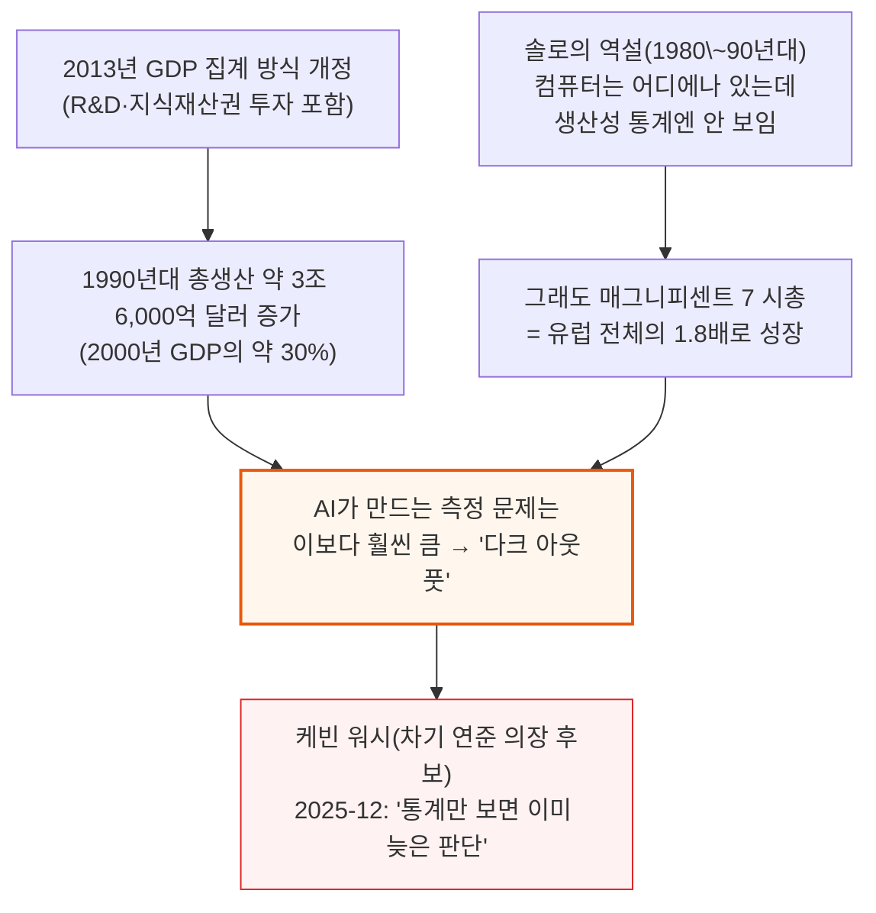
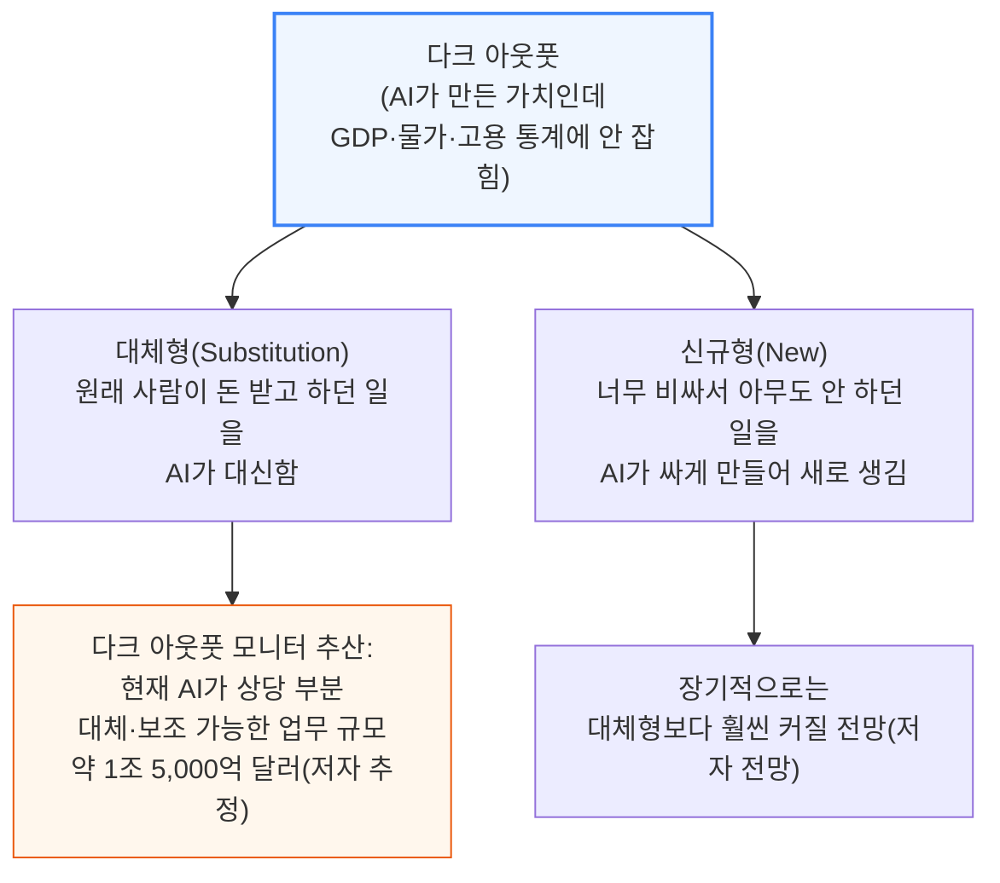
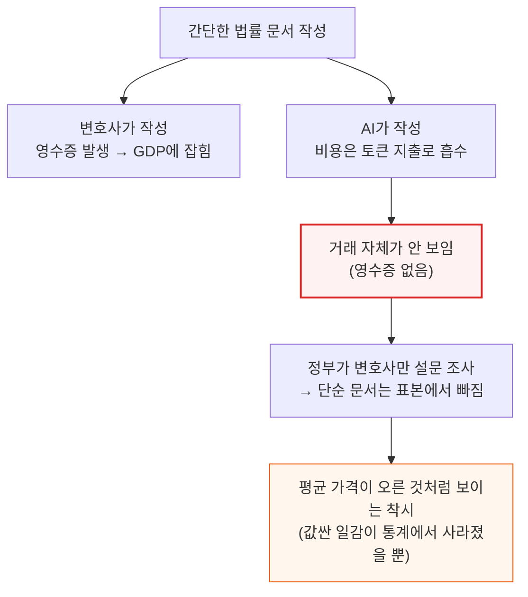
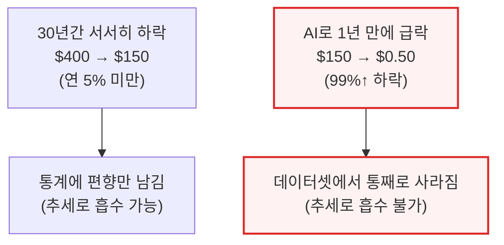

# AI Dark Output: The Visible Cost of Invisible Output

> **출처**: [SemiAnalysis Newsletter](https://newsletter.semianalysis.com/p/ai-dark-output-the-visible-cost-of)
> **저자**: Malcolm Spittler, Dylan Patel
> **발행일**: 2026-05-29

---

## 📑 목차

### 전체 섹션
 1. [서론 - 컴퓨터 시대의 역설이 AI에도 반복되는가](#1-서론---컴퓨터-시대의-역설이-ai에도-반복되는가)
 2. [다크 아웃풋이란 무엇인가](#2-다크-아웃풋이란-무엇인가)
 3. [대체형 다크 아웃풋 - 사라지는 영수증](#3-대체형-다크-아웃풋---사라지는-영수증)
 4. [신규 다크 아웃풋과 포획된 산출물](#4-신규-다크-아웃풋과-포획된-산출물)
 5. [서비스는 재화와 다르다](#5-서비스는-재화와-다르다)
 6. [다크 아웃풋의 흔적 - 임금은 올랐는데 아무도 승진하지 않았다](#6-다크-아웃풋의-흔적---임금은-올랐는데-아무도-승진하지-않았다)
 7. [왜 벤치마크 대신 시장 신호를 쓰는가 - 증거 사다리](#7-왜-벤치마크-대신-시장-신호를-쓰는가---증거-사다리)
 8. [노출된 노동에서 다크 아웃풋으로 - 1.5조 달러와 모니터의 한계](#8-노출된-노동에서-다크-아웃풋으로---15조-달러와-모니터의-한계)
 9. [통계가 무너지는 네 가지 지점](#9-통계가-무너지는-네-가지-지점)
10. [거시 데이터가 무너지면 - 결론과 남은 과제](#10-거시-데이터가-무너지면---결론과-남은-과제)
11. [부록 - 페미니스트 경제학이 먼저 겪은 문제](#11-부록---페미니스트-경제학이-먼저-겪은-문제)

---

## 🔑 용어 정리

본문을 순서대로 읽기 전에 알아두면 좋은 용어들입니다. 자세한 수치와 설명은 본문에서 처음 등장하는 위치에 나옵니다.

- **다크 아웃풋 (Dark Output)**: AI가 실제로 만들어내는 경제적 가치인데도 GDP·물가·고용 통계 같은 국가 통계에는 잡히지 않거나 왜곡돼 보이는 부분 — 우주의 암흑물질(dark matter)처럼 직접 보이진 않고 주변에 미치는 효과로만 감지된다는 뜻에서 붙은 이름
- **대체형(Substitution) vs 신규형(New) 다크 아웃풋**: 대체형은 원래 사람이 돈을 받고 하던 일을 AI가 대신하는 것, 신규형은 예전엔 너무 비싸서 아무도 안 하던 일을 AI가 싸게 만들어 새로 생겨난 것
- **포획된 AI 산출물 (Captured AI Output)**: 일은 AI가 대신하는데도, 그 일을 시킨 회사가 시장 지배력 덕분에 가격을 안 내려서 통계에는 여전히 예전 금액 그대로 잡히는 경우
- **증거 사다리 (Evidence Ladder)**: "AI가 이 일을 할 수 있다"는 주장의 신뢰도를 벤치마크 점수 같은 약한 증거부터 보험사가 실제로 그 위험을 인수하는 강한 증거까지 단계별로 매기는 저자들의 판단 기준
- **경계 이동 (Boundary Shift)**: 예전엔 외부 업체에 돈을 주고 사던 일이 회사 내부의 AI 업무로 옮겨가면서, 돈이 오가는 거래 자체가 사라져 통계에서 안 보이게 되는 현상
- **부문 오배치 (Sector Misrouting)**: AI가 만든 가치는 한 산업(예: 병원)에서 생기는데, 그 대가로 오가는 돈은 다른 산업(예: AI 소프트웨어 업체)의 매출로 잡혀 통계상 가치가 엉뚱한 곳에서 발생한 것처럼 보이는 현상
- **국민계정 (National Accounts)**: GDP를 비롯해 한 나라의 생산·소득·지출을 집계하는 공식 통계 체계 — 미국은 상무부 경제분석국(BEA)이 관리

---

## 1. 서론 - 컴퓨터 시대의 역설이 AI에도 반복되는가

**📌 핵심:**
- 1980\~90년대 경제학자 로버트 솔로는 "컴퓨터 시대는 어디에나 있는데 생산성 통계에서만 안 보인다"고 꼬집었음(솔로의 역설) — 그런데도 닷컴 버블 붕괴를 거치고 지금 매그니피센트 7의 시가총액은 유럽 전체의 1.8배
- 2013년 GDP 집계 방식 개정 하나(연구개발·지식재산권 투자를 GDP에 포함)만으로 1990년대 미국 총생산이 약 3조 6,000억 달러 늘었음(2000년 한 해 GDP의 약 30%에 해당) — 통계 방식만 바꿔도 이 정도 규모가 사후에 "발견"됨
- AI가 만드는 측정 문제는 이보다 훨씬 큼 — 저자들은 통계가 지금 못 보는 AI의 산출물을 **다크 아웃풋(Dark Output)**이라 부름
- 결론: 차기 연준 의장 후보 케빈 워시는 2026년 12월 "통계만 보면 이미 뒤처진 판단을 하게 된다"고 경고했고, AI 성장이 점점 더 자본시장 자금으로 움직이는 만큼 통계에 성과가 안 보이면 거품 논란만 커짐

---

AI 성장이 은행 대출보다 주식·사모펀드 같은 자본시장 자금에 점점 더 기대는 지금, 통계에 성과가 안 잡히는 기간이 길어질수록 "AI는 거품"이라는 의심에 힘이 실립니다.

---

## 2. 다크 아웃풋이란 무엇인가

**📌 핵심:**
- AI가 만드는 산출물은 측정되기 전에 이미 현실에 존재함 — 토큰 지출액과 일자리 감소는 통계로 잡히지만, AI가 만든 결과물이 시장에서 눈에 보이는 가격으로 팔리지 않는 한 GDP엔 토큰 지출액만 잡힘
- 보통은 가격이 떨어지면 그 하락분을 "물가 하락(디플레이션)"으로 잡고 생산성 향상이라 해석하는데, 서비스업 통계는 원래도 측정이 어려워(부록 1) AI로 인한 가격 급락은 오히려 "산출물 감소"로, 심지어 "물가 상승"으로까지 기록될 수 있음
- 우주를 채우는 암흑물질처럼, 다크 아웃풋도 직접 보이지 않고 주변에 미치는 효과(대표적으로 일자리 감소)로만 감지됨 — 저자들은 이를 다크 아웃풋 모니터(Dark Output Monitor)로 추적 중
- 결론: 기업들이 AI에 점점 더 많은 돈을 쓰는데도 그 산출물 대부분이 안 보이는, 산업혁명급 사건이 지금 벌어지고 있을 위험이 있음

---

다크 아웃풋은 크게 두 갈래로 나뉘며, 이후 3\~4절에서 각각 자세히 다룹니다.

**📌 용어 풀이: 1조 5,000억 달러는 측정치가 아니라 추정치**
> - 이 숫자는 실제로 사라진 일자리·매출을 센 것이 아니라, "지금 AI가 믿을 만한 수준으로 대체·보조할 수 있는 업무에 딸린 인건비 규모"를 증거 사다리(7절에서 설명) 기준 Tier 4 이상 증거로 추산한 값
> - 즉 "1조 5,000억 달러가 사라졌다"가 아니라 "1조 5,000억 달러어치 일이 AI 치환 위험군에 들어간다"는 뜻 — 이 구분을 8절에서 다시 짚습니다

---

## 3. 대체형 다크 아웃풋 - 사라지는 영수증

**📌 핵심:**
- 간단한 법률 문서 하나를 변호사가 쓰든 AI가 쓰든 이론적으로는 물가 조정 후 같은 가치여야 하지만, 서비스업 GDP는 "법률 서비스 1단위"라는 표준 단위가 없어 변호사의 영수증과 설문조사로 가격을 추정함
- AI가 이 일을 넘겨받으면 영수증 자체가 사라지고 비용은 토큰 지출로 흡수됨 — 정부가 변호사들을 설문하면 오히려 평균 가격이 올라간 것처럼 보일 수 있는데, 이는 가장 단순한 문서들을 이제 변호사가 아니라 AI가 처리해 표본에서 빠졌기 때문(값싼 일감이 통계에서 사라지는 착시)
- 간단한 유언장 가격은 기술 변화로 수십 년에 걸쳐 서서히 내려왔음(30년간 $400→$150, 연 5% 미만 하락) — 그런데 AI로 $150→$0.50까지 떨어지면 1년 만에 99% 넘게 하락, 서서히 떨어지면 통계에 편향만 남기지만 갑자기 떨어지면 아예 데이터셋에서 사라짐
- 결론: 법률 서비스 물가지수는 1987년 도입 이후(2024년 9월 기준) 4.6배 올랐는데(실측 CPI), 생산성 향상을 반영할 방법이 없어 사실상 "인건비 지수"에 가까움

---

### 영수증이 사라지는 메커니즘

이 비용은 결국 문서를 필요로 한 사람(의뢰인)이 부담합니다 — 다만 예전엔 변호사에게 낸 수임료였고, 지금은 AI 업체에 내는 토큰 비용이라는 점이 다릅니다. 이 지출 이동 자체가 통계상 "거래가 사라진 것"으로 기록되는 원인입니다.

### 서서히 vs 갑자기 - 유언장 가격의 두 가지 하락 곡선

**📌 용어 풀이: 저자들이 실측치와 예시치를 구분한 방식**
> - 법률 서비스 물가지수 4.6배 상승(1987\~2024)은 실제 CPI(소비자물가지수) 통계
> - 반면 "$400→$150→$0.50" 유언장 가격 곡선과 "중세 필경사\~2026년 AI API 비용"까지 이어지는 그래프는 저자들이 밝힌 대로 **예시(Illustrative)** — 2025년 달러로 환산한 대표 비용 추정치이며, 특히 2026년 수치는 변호사 검토 없이 AI가 약 5,000단어를 작성하는 API 비용의 상한선일 뿐, 검토 1시간(약 $300)을 더하면 전 단계인 LegalZoom 수준 가격대로 올라감 — 즉 "AI가 다 해준다"가 아니라 "무인 초안 작성의 비용 상한"을 보여주는 그래프

---

*작성 진행률: 약 35% 완료 (1\~3절)*
*업데이트: 다음 배치에서 4\~6절(신규 다크 아웃풋\~다크 아웃풋의 흔적) 작성 예정*
