# AI Dark Output: The Visible Cost of Invisible Output

> **출처**: [SemiAnalysis Newsletter](https://newsletter.semianalysis.com/p/ai-dark-output-the-visible-cost-of)
> **저자**: Malcolm Spittler, Dylan Patel
> **발행일**: 2026-05-29

---

## 📑 목차

### 전체 섹션
 1. [서론 - 컴퓨터 시대의 역설이 AI에도 반복되는가](#1-서론---컴퓨터-시대의-역설이-ai에도-반복되는가)
 2. [다크 아웃풋이란 무엇인가](#2-다크-아웃풋이란-무엇인가)
 3. [대체형 다크 아웃풋 - 사라지는 영수증](#3-대체형-다크-아웃풋---사라지는-영수증)
 4. [신규 다크 아웃풋과 포획된 산출물](#4-신규-다크-아웃풋과-포획된-산출물)
 5. [서비스는 재화와 다르다](#5-서비스는-재화와-다르다)
 6. [다크 아웃풋의 흔적 - 임금은 올랐는데 아무도 승진하지 않았다](#6-다크-아웃풋의-흔적---임금은-올랐는데-아무도-승진하지-않았다)
 7. [왜 벤치마크 대신 시장 신호를 쓰는가 - 증거 사다리](#7-왜-벤치마크-대신-시장-신호를-쓰는가---증거-사다리)
 8. [노출된 노동에서 다크 아웃풋으로 - 1.5조 달러와 모니터의 한계](#8-노출된-노동에서-다크-아웃풋으로---15조-달러와-모니터의-한계)
 9. [통계가 무너지는 네 가지 지점](#9-통계가-무너지는-네-가지-지점)
10. [거시 데이터가 무너지면 - 결론과 남은 과제](#10-거시-데이터가-무너지면---결론과-남은-과제)
11. [부록 - 페미니스트 경제학이 먼저 겪은 문제](#11-부록---페미니스트-경제학이-먼저-겪은-문제)

---

## 🔑 용어 정리

본문을 순서대로 읽기 전에 알아두면 좋은 용어들입니다. 자세한 수치와 설명은 본문에서 처음 등장하는 위치에 나옵니다.

- **다크 아웃풋 (Dark Output)**: AI가 실제로 만들어내는 경제적 가치인데도 GDP·물가·고용 통계 같은 국가 통계에는 잡히지 않거나 왜곡돼 보이는 부분 — 우주의 암흑물질(dark matter)처럼 직접 보이진 않고 주변에 미치는 효과로만 감지된다는 뜻에서 붙은 이름
- **대체형(Substitution) vs 신규형(New) 다크 아웃풋**: 대체형은 원래 사람이 돈을 받고 하던 일을 AI가 대신하는 것, 신규형은 예전엔 너무 비싸서 아무도 안 하던 일을 AI가 싸게 만들어 새로 생겨난 것
- **포획된 AI 산출물 (Captured AI Output)**: 일은 AI가 대신하는데도, 그 일을 시킨 회사가 시장 지배력 덕분에 가격을 안 내려서 통계에는 여전히 예전 금액 그대로 잡히는 경우
- **증거 사다리 (Evidence Ladder)**: "AI가 이 일을 할 수 있다"는 주장의 신뢰도를 벤치마크 점수 같은 약한 증거부터 보험사가 실제로 그 위험을 인수하는 강한 증거까지 단계별로 매기는 저자들의 판단 기준
- **경계 이동 (Boundary Shift)**: 예전엔 외부 업체에 돈을 주고 사던 일이 회사 내부의 AI 업무로 옮겨가면서, 돈이 오가는 거래 자체가 사라져 통계에서 안 보이게 되는 현상
- **부문 오배치 (Sector Misrouting)**: AI가 만든 가치는 한 산업(예: 병원)에서 생기는데, 그 대가로 오가는 돈은 다른 산업(예: AI 소프트웨어 업체)의 매출로 잡혀 통계상 가치가 엉뚱한 곳에서 발생한 것처럼 보이는 현상
- **국민계정 (National Accounts)**: GDP를 비롯해 한 나라의 생산·소득·지출을 집계하는 공식 통계 체계 — 미국은 상무부 경제분석국(BEA)이 관리

---

## 1. 서론 - 컴퓨터 시대의 역설이 AI에도 반복되는가

**📌 핵심:**
- 1980\~90년대 경제학자 로버트 솔로는 "컴퓨터 시대는 어디에나 있는데 생산성 통계에서만 안 보인다"고 꼬집었음(솔로의 역설) — 그런데도 닷컴 버블 붕괴를 거치고 지금 매그니피센트 7의 시가총액은 유럽 전체의 1.8배
- 2013년 GDP 집계 방식 개정 하나(연구개발·지식재산권 투자를 GDP에 포함)만으로 1990년대 미국 총생산이 약 3조 6,000억 달러 늘었음(2000년 한 해 GDP의 약 30%에 해당) — 통계 방식만 바꿔도 이 정도 규모가 사후에 "발견"됨
- AI가 만드는 측정 문제는 이보다 훨씬 큼 — 저자들은 통계가 지금 못 보는 AI의 산출물을 **다크 아웃풋(Dark Output)**이라 부름
- 결론: 차기 연준 의장 후보 케빈 워시는 2026년 12월 "통계만 보면 이미 뒤처진 판단을 하게 된다"고 경고했고, AI 성장이 점점 더 자본시장 자금으로 움직이는 만큼 통계에 성과가 안 보이면 거품 논란만 커짐

---

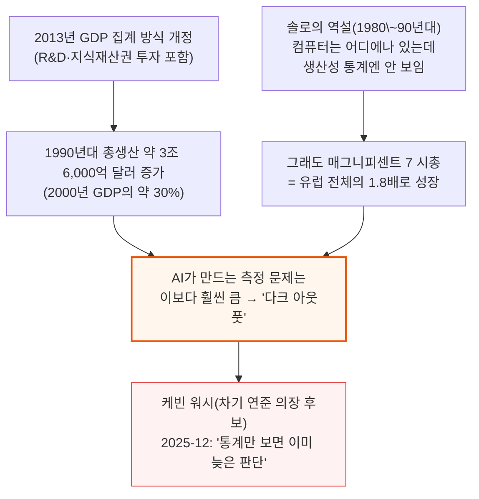

AI 성장이 은행 대출보다 주식·사모펀드 같은 자본시장 자금에 점점 더 기대는 지금, 통계에 성과가 안 잡히는 기간이 길어질수록 "AI는 거품"이라는 의심에 힘이 실립니다.

---

## 2. 다크 아웃풋이란 무엇인가

**📌 핵심:**
- AI가 만드는 산출물은 측정되기 전에 이미 현실에 존재함 — 토큰 지출액과 일자리 감소는 통계로 잡히지만, AI가 만든 결과물이 시장에서 눈에 보이는 가격으로 팔리지 않는 한 GDP엔 토큰 지출액만 잡힘
- 보통은 가격이 떨어지면 그 하락분을 "물가 하락(디플레이션)"으로 잡고 생산성 향상이라 해석하는데, 서비스업 통계는 원래도 측정이 어려워(부록 1) AI로 인한 가격 급락은 오히려 "산출물 감소"로, 심지어 "물가 상승"으로까지 기록될 수 있음
- 우주를 채우는 암흑물질처럼, 다크 아웃풋도 직접 보이지 않고 주변에 미치는 효과(대표적으로 일자리 감소)로만 감지됨 — 저자들은 이를 다크 아웃풋 모니터(Dark Output Monitor)로 추적 중
- 결론: 기업들이 AI에 점점 더 많은 돈을 쓰는데도 그 산출물 대부분이 안 보이는, 산업혁명급 사건이 지금 벌어지고 있을 위험이 있음

---

다크 아웃풋은 크게 두 갈래로 나뉘며, 이후 3\~4절에서 각각 자세히 다룹니다.

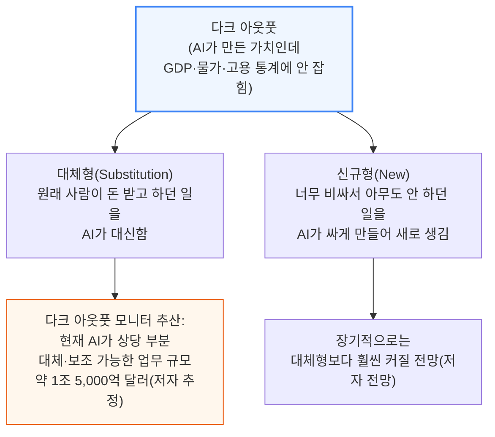

**📌 용어 풀이: 1조 5,000억 달러는 측정치가 아니라 추정치**
> - 이 숫자는 실제로 사라진 일자리·매출을 센 것이 아니라, "지금 AI가 믿을 만한 수준으로 대체·보조할 수 있는 업무에 딸린 인건비 규모"를 증거 사다리(7절에서 설명) 기준 Tier 4 이상 증거로 추산한 값
> - 즉 "1조 5,000억 달러가 사라졌다"가 아니라 "1조 5,000억 달러어치 일이 AI 치환 위험군에 들어간다"는 뜻 — 이 구분을 8절에서 다시 짚습니다

---

## 3. 대체형 다크 아웃풋 - 사라지는 영수증

**📌 핵심:**
- 간단한 법률 문서 하나를 변호사가 쓰든 AI가 쓰든 이론적으로는 물가 조정 후 같은 가치여야 하지만, 서비스업 GDP는 "법률 서비스 1단위"라는 표준 단위가 없어 변호사의 영수증과 설문조사로 가격을 추정함
- AI가 이 일을 넘겨받으면 영수증 자체가 사라지고 비용은 토큰 지출로 흡수됨 — 정부가 변호사들을 설문하면 오히려 평균 가격이 올라간 것처럼 보일 수 있는데, 이는 가장 단순한 문서들을 이제 변호사가 아니라 AI가 처리해 표본에서 빠졌기 때문(값싼 일감이 통계에서 사라지는 착시)
- 간단한 유언장 가격은 기술 변화로 수십 년에 걸쳐 서서히 내려왔음(30년간 $400→$150, 연 5% 미만 하락) — 그런데 AI로 $150→$0.50까지 떨어지면 1년 만에 99% 넘게 하락, 서서히 떨어지면 통계에 편향만 남기지만 갑자기 떨어지면 아예 데이터셋에서 사라짐
- 결론: 법률 서비스 물가지수는 1987년 도입 이후(2024년 9월 기준) 4.6배 올랐는데(실측 CPI), 생산성 향상을 반영할 방법이 없어 사실상 "인건비 지수"에 가까움

---

### 영수증이 사라지는 메커니즘

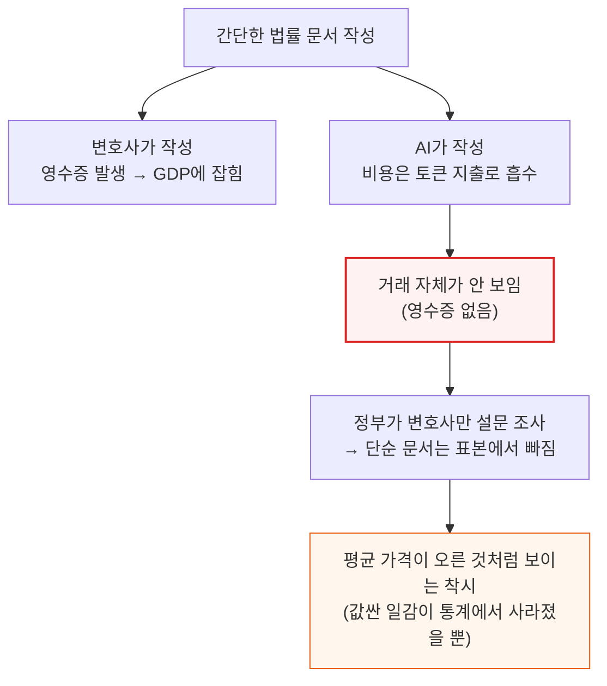

이 비용은 결국 문서를 필요로 한 사람(의뢰인)이 부담합니다 — 다만 예전엔 변호사에게 낸 수임료였고, 지금은 AI 업체에 내는 토큰 비용이라는 점이 다릅니다. 이 지출 이동 자체가 통계상 "거래가 사라진 것"으로 기록되는 원인입니다.

### 서서히 vs 갑자기 - 유언장 가격의 두 가지 하락 곡선

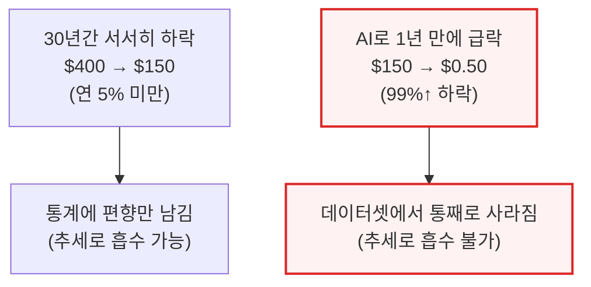

**📌 용어 풀이: 저자들이 실측치와 예시치를 구분한 방식**
> - 법률 서비스 물가지수 4.6배 상승(1987\~2024)은 실제 CPI(소비자물가지수) 통계
> - 반면 "$400→$150→$0.50" 유언장 가격 곡선과 "중세 필경사\~2026년 AI API 비용"까지 이어지는 그래프는 저자들이 밝힌 대로 **예시(Illustrative)** — 2025년 달러로 환산한 대표 비용 추정치이며, 특히 2026년 수치는 변호사 검토 없이 AI가 약 5,000단어를 작성하는 API 비용의 상한선일 뿐, 검토 1시간(약 $300)을 더하면 전 단계인 LegalZoom 수준 가격대로 올라감 — 즉 "AI가 다 해준다"가 아니라 "무인 초안 작성의 비용 상한"을 보여주는 그래프

---

## 4. 신규 다크 아웃풋과 포획된 산출물

**📌 핵심:**
- 신규 다크 아웃풋은 AI가 값싸게 만들기 전엔 아무도 돈 주고 시키지 않던 일 — 문헌 조사 비용이 $2,000에서 $2로 떨어지면, 같은 횟수만 하고 남는 돈을 챙기는 게 아니라 프로젝트마다 매번 하게 됨(수요 자체가 늘어남)
- 이런 일은 실제 가치를 만들지만 토큰·API 호출·클라우드 비용 말고는 깨끗한 경제적 흔적을 남기지 않아, 지금 토큰 지출의 상당 부분이 기존 업무 대체가 아니라 신규 업무일 가능성이 있다는 정황은 있지만 정확한 규모는 토큰이라는 익명화 장막 뒤에 가려짐
- 포획된 AI 산출물은 일은 AI가 대신해도 회사가 시장 지배력으로 가격을 그대로 유지하는 경우 — 예: $10,000짜리 외주 인사(HR) 서비스를 AI 인사 서비스업체에서 여전히 $10,000에 사면 통계엔 그대로 잡히고 사라지는 건 사람의 임금뿐
- 결론: 반대로 그 $10,000짜리 일을 회사가 내부에서 토큰 $10만 들여 처리하면, 똑같은 일을 했는데도 GDP는 $9,990만큼 줄어든 것으로 기록됨 — 비용을 누가 부담하느냐(외주 업체 vs 자사 AI 도입 비용)가 통계에 잡히느냐 마느냐를 가름

---

### 포획된 산출물 - 같은 일, 다른 통계 결과

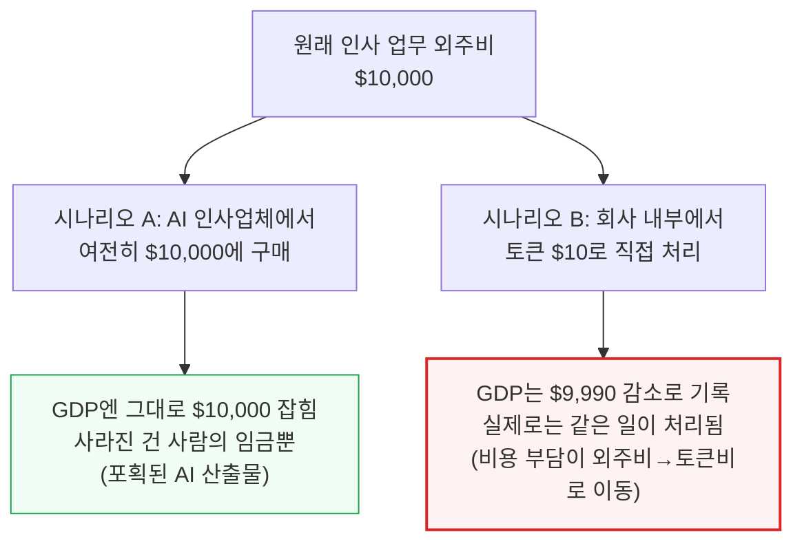

두 시나리오 모두 실제 업무량은 동일합니다. 차이는 그 비용을 누가, 어떤 항목으로 지불했느냐뿐인데도 국민계정에는 정반대로 기록됩니다.

### 신규 다크 아웃풋 - 아낀 돈을 챙기지 않고 더 많이 시킨다

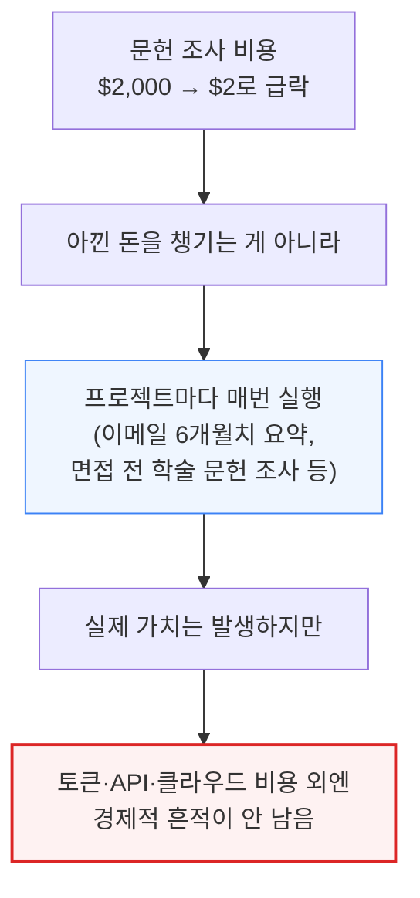

저자들은 지금 토큰 지출 중 상당 부분이 기존 업무 대체가 아니라 이런 신규 업무일 것이라는 정황 증거는 있지만, 정확한 비중은 대화 내용 전체를 봐도 판단하기 어렵다고 인정합니다 — 국민계정은 기껏해야 AI 매출만 볼 수 있습니다.

---

## 5. 서비스는 재화와 다르다

**📌 핵심:**
- 제조업 자동화는 통계학자들에게 셀 것을 줬음 — 기계공이 나사를 더 잘 만들면 공장은 "더 많은 나사를 더 싸게" 만들었다고 보고할 수 있어 실질 GDP가 수량 기준으로 올바르게 성장을 반영함
- 나사 한 개의 실질 가격은 지난 600년간 99% 넘게 떨어졌는데, 그 대신 전 세계 생산량은 약 100억 배 늘어난 것으로 추산(저자 추정)돼 실질 GDP는 이를 정확히 "성장·생산성 향상"으로 잡아냄
- 그런데 서비스와 지적 노동에는 이런 "단위"가 없음 — 산업혁명 때 마력(horsepower)이 기계 출력과 사람·동물 노동력을 비교할 공통 잣대를 준 것과 달리, 토큰은 그런 역할을 못 함
- 결론: 토큰 100만 개는 쓰레기 같은 결과물일 수도, 유용한 이메일 요약일 수도, 회사 전략을 바꾸는 결정일 수도 있음 — 경제적 가치는 토큰 개수가 아니라 결과물의 질에 달려 있음

---

### 나사(재화) vs 토큰(서비스) - 통계가 셀 수 있는가

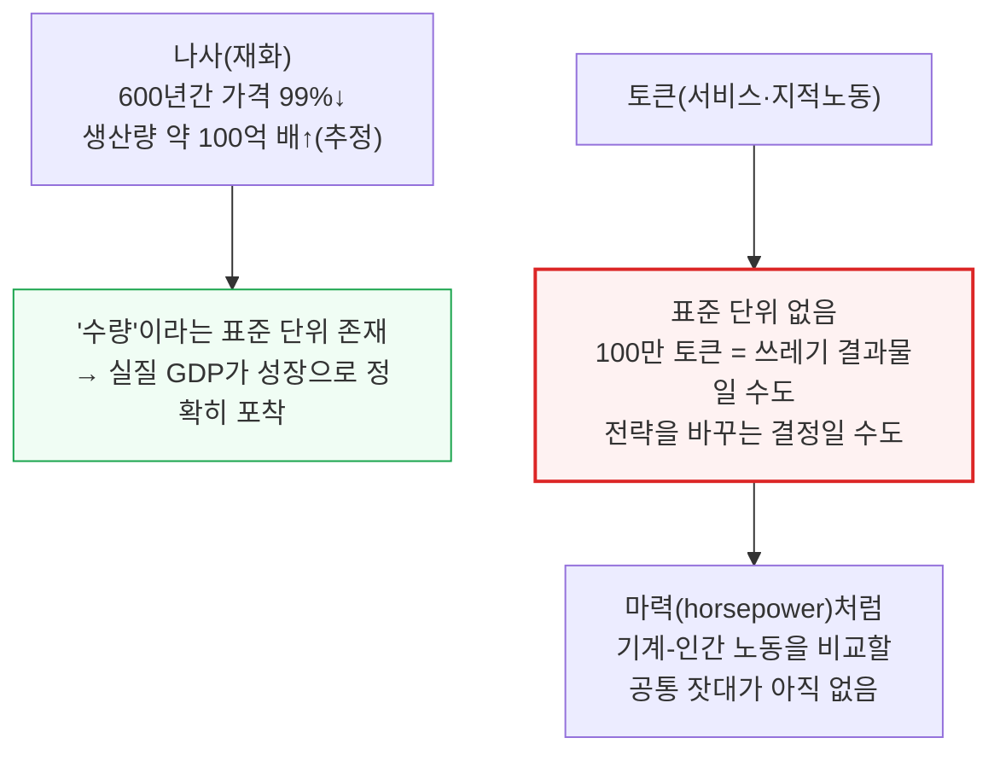

**📌 용어 풀이: 나사 가격 그래프의 실측·추정 구분**
> - 2025년 기준 나사 1개의 실질 가격은 현재 소매가(Home Depot·McMaster-Carr) 기준 **실측치**
> - 1900년 이전 가격과 "전 세계 생산량이 약 100억 배 늘었다"는 수량 추산은 저자들이 밝힌 대로 공방(craft-shop) 가격·직인 임금 자료를 바탕으로 재구성한 **자릿수 단위 추정치(order-of-magnitude estimate)**이지, 실측 통계가 아님

---

## 6. 다크 아웃풋의 흔적 - 임금은 올랐는데 아무도 승진하지 않았다

**📌 핵심:**
- AI 관련 논의에서 자주 나오는 관찰: 신입·주니어 직원이 반복 업무에서 먼저 밀려남 → 그 결과 해당 직종의 "평균 임금"은 오히려 오를 수 있음(가장 저임금 노동자들이 표본에서 빠지기 때문) — 아무도 임금 인상을 못 받았는데 평균은 오르는 통계적 착시
- 실제로 AI 노출도가 높은 업종일수록 전체 경제 대비 고용은 줄어드는데, 바로 그 부진한 업종에서 상대적 임금은 오히려 오르는 현상이 관측됨
- 이 고용-임금 엇박자는 다크 아웃풋 대시보드가 추적하는 흔적 중 하나 — 다크 아웃풋을 직접 측정한 건 아니지만, 다크 아웃풋이 퍼질수록 나타날 법한 통계적 이상 징후
- 결론: 앤트로픽 이코노믹 인덱스(2026년 3월)에 따르면 전체 토큰의 37%가 컴퓨터·수학 직군에서 쓰이는데(실측), 소프트웨어 투자가 GDP에 기여하는 비중은 AI 이전 추세를 못 벗어났고 역대 최고치도 아니었음(실측) — 노동 악화 신호 없이 토큰만 몰리는 구간은 신규 다크 아웃풋의 초기 신호

---

### 고용-임금 엇박자 - 왜 아무도 인상 못 받았는데 평균은 오르나

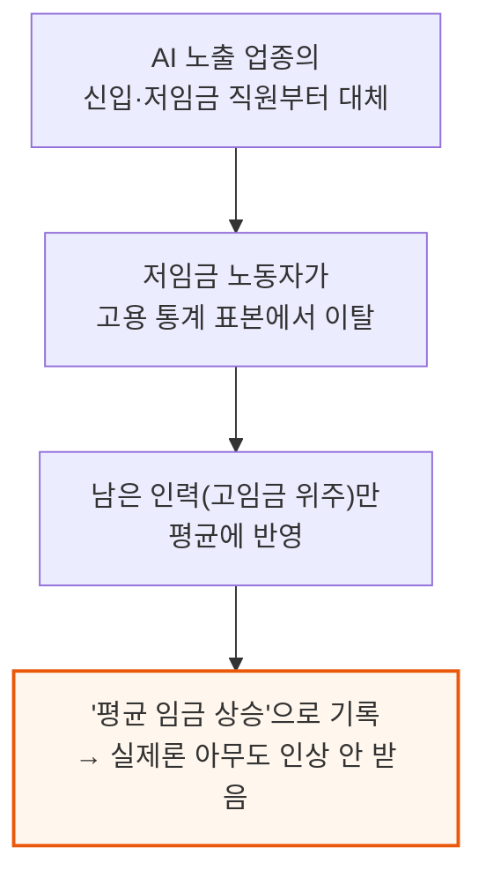

### 토큰은 몰리는데 통계는 그대로인 구간 - 신규 다크 아웃풋의 신호

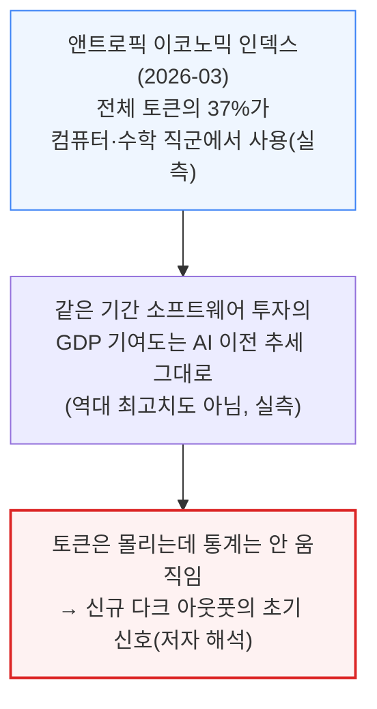

---

## 7. 왜 벤치마크 대신 시장 신호를 쓰는가 - 증거 사다리

**📌 핵심:**
- 벤치마크(AI 모델의 성능을 정해진 시험 문제로 채점하는 방식)는 틀린 질문에 늦게 답함 — 전문가 평가는 "시험 조건에서 전문가 수준 결과를 내는가"를 묻지만, 실제 노동시장에서 AI가 사람을 돕거나 대체하는 데는 "최고의 변호사·애널리스트·엔지니어를 이기는가"가 아니라 "그 시급을 받던 사람만큼 충분히 싸고 믿을 만한가"만 있으면 됨
- 그래서 저자들은 다른 회사가 뭘 할 수 있다는 추상적 주장이 아니라, 기업들이 자기 사업 방식에 대해 공개적으로 밝힌 주장을 추적함
- 시장 신호는 신뢰도가 제각각이라, 저자들은 벤치마크 점수 같은 약한 증거부터 보험사가 실제로 그 위험을 인수하는 강한 증거까지 **증거 사다리**로 단계를 매김 — 이진법(된다/안 된다)이 아니라 단계별 판단
- 결론: 사업 현장에서 실제로 쓰이고 있다는 기업의 언급이 벤치마크보다 강한 증거이고, 법정 다툼에서 AI가 한 일이 인정받으면 더 강하며, 보험사가 그 실패 위험을 값 매겨 떠안는 것(underwriting)이 제3자가 리스크를 직접 가격에 반영했다는 점에서 가장 강한 증거

---

### 증거 사다리 - 약한 증거부터 강한 증거까지

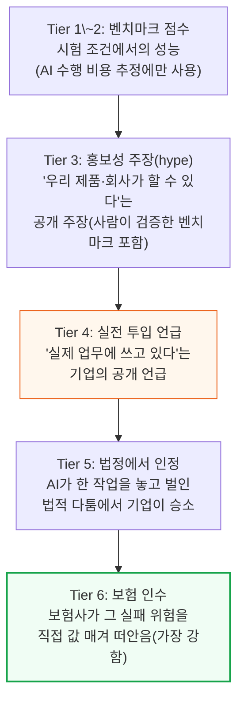

---

## 8. 노출된 노동에서 다크 아웃풋으로 - 1.5조 달러와 모니터의 한계

**📌 핵심:**
- 앞서 2절에 나온 헤드라인 수치 "1조 5,000억 달러"는 증거 사다리 Tier 4 이상 증거를 근거로 함 — "1조 5,000억 달러어치 노동이 사라졌다"가 아니라 "그만큼의 인건비가 걸린 업무가 지금 AI로 치환될 신뢰할 만한 가능성이 있는 범주에 들어간다"는 뜻(노출된 노동이지 사라진 산출물이 아님)
- 저자들은 아직 Tier 5(법정 인정)·Tier 6(보험 인수) 수준의 강한 증거를 보지 못했다고 밝힘 — 이는 AI 낙관론에 대한 경고 신호로 읽어야 함
- 지금까지 모은 증거 대부분은 AI가 사람을 완전히 대체하기보다 보조하는(augmentation) 쪽을 가리킴 — AI가 업무를 돕거나 넘겨받아도 산출물이 자동으로 사라지진 않고, 가격이 떨어지거나 업무가 회사 내부로 옮겨갈 때만 국민계정에서 사라짐
- 결론: 시장이 경쟁적이지 않다면 기업은 사람이 하던 일과 같은 가격을 그대로 유지할 수 있고, 그럴 경우 그 가치는 마진 급증으로 통계에 정확히 잡힘(4절의 "포획된 AI 산출물"과 같은 논리)

---

### 다크 아웃풋 모니터가 말할 수 있는 것 vs 말할 수 없는 것

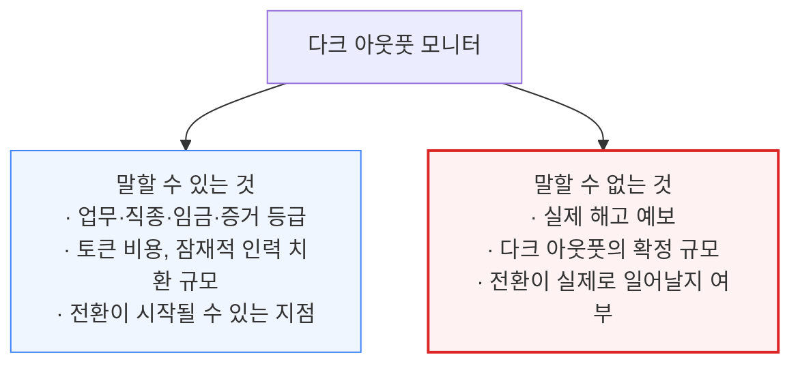

"AI 노출도가 높은 업종"은 이미 일자리가 사라진 곳이 아니라, 업무가 식별 가능하고 인건비 규모가 크며 시장 증거가 강하고 토큰 비용이 충분히 싸서 치환의 경제성이 성립하는 곳으로 읽어야 합니다. 저자들은 자율주행차 도입이 기술적 장벽보다 문화·보험·시장 구조 문제로 더뎠던 사례를 들며, AI의 실제 전환 속도도 수요 탄력성과 사회·법·정부 압력에 달려 있다고 덧붙입니다.

---

## 9. 통계가 무너지는 네 가지 지점

**📌 핵심:**
- 저자들은 "GDP가 AI를 못 잡는다"는 한 문장으로 뭉뚱그리지 말고, 서로 다른 4가지 측정 오류를 구분해야 한다고 강조
- 경계 이동(외주가 사내 업무로 이동해 거래가 사라짐)과 가격 붕괴(서비스엔 수량 단위가 없어 가격 하락이 산출물 감소로 오독됨)는 이미 3\~4절에서 다룬 메커니즘과 같은 뿌리
- 부문 오배치는 가치가 만들어진 산업과 돈이 잡히는 산업이 어긋나는 문제, 신규 작업 비가시성은 토큰 비용 말고는 아무 흔적도 안 남는 문제(4절과 동일 메커니즘의 재확인)
- 결론: 네 가지를 뭉뚱그리면 문제가 실제보다 단순해 보임 — 각각 원인과 해법이 다르기 때문에 구분해서 다뤄야 함

---

### ① 경계 이동(Boundary Shift) - 외주가 사내 업무로 옮겨가며 거래가 사라짐

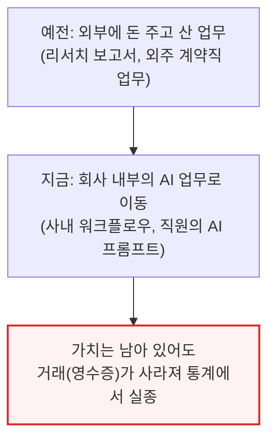

### ② 가격 붕괴(Price Collapse) - 수량 단위가 없어 가격 하락이 산출물 감소로 오독

서비스업은 나사처럼 수량 단위가 없어 영수증·임금·근로시간만으로 가격을 추정합니다. 영수증이 줄고(가격 하락) 평균 임금은 오르면(6절의 저임금 이탈 착시), 통계는 이를 "물가 상승 + 생산성 하락"으로 잘못 기록합니다.

### ③ 부문 오배치(Sector Misrouting) - 나사는 세는데 그 나사로 지은 집은 놓친다

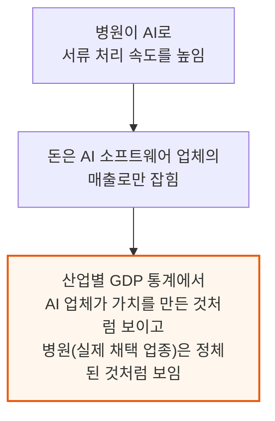

### ④ 신규 작업 비가시성(New Work Invisibility) - 4절 신규 다크 아웃풋의 재확인

회의 전 상대방에 대한 조사 보고서를 AI가 토큰 몇 개 값에 작성해줘서 더 준비된 회의를 할 수 있게 된 것처럼, 실제로 일어난 경제적 작업인데도 토큰 비용 외엔 아무 데도 기록되지 않는 경우입니다. 몇 년 전이라면 사람과 시간이 많이 들었을 일이 지금은 몇 푼과 몇 분 만에 끝나는데, 이를 달러·시간으로 환산해 추정하는 것조차 우스꽝스러워 보일 정도로 격차가 큽니다.

---

*작성 진행률: 약 80% 완료 (1\~9절)*
*업데이트: 다음 배치에서 10\~11절(결론\~부록) 작성 및 100% 완료 예정*
