# Anthropic 3Q26 Profit Over $1B: The Anthropic IPO Financials Sneak Peak

> **출처**: [SemiAnalysis Newsletter](https://newsletter.semianalysis.com/p/anthropic-3q26-profit-over-1b-the)
> **저자**: Joey Brookhart, Crystal Huang, Dylan Patel
> **발행일**: 2026-02-05

---

## 📑 목차

### 전체 섹션
 1. [서론: 앤트로픽 IPO가 던지는 질문](#1-서론-앤트로픽-ipo가-던지는-질문)
 2. [IPO 배경 - 왜 지금 상장하는가](#2-ipo-배경---왜-지금-상장하는가)
 3. [사업 구조 - 구독과 API 매출 믹스](#3-사업-구조---구독과-api-매출-믹스)
 4. [성장 궤적과 손익 - ARR 폭증과 마진 개선](#4-성장-궤적과-손익---arr-폭증과-마진-개선)
 5. [코딩 시장과 대형 고객 집중도](#5-코딩-시장과-대형-고객-집중도)
 6. [TaaS 사업 구조 - 하이퍼스케일러를 통한 간접 판매](#6-taas-사업-구조---하이퍼스케일러를-통한-간접-판매)
 7. [리스크와 성장 여력](#7-리스크와-성장-여력)
 8. [장기 정상 마진 전망](#8-장기-정상-마진-전망)
 9. [컴퓨트와 장기 랩 경제학 - EBTIT 지표](#9-컴퓨트와-장기-랩-경제학---ebtit-지표)
10. [결론과 밸류에이션 - 6조 달러 회사?](#10-결론과-밸류에이션---6조-달러-회사)

---

## 🔑 용어 정리

본문을 순서대로 읽기 전에 알아두면 좋은 용어들입니다. 자세한 수치와 설명은 본문에서 처음 등장하는 위치에 나옵니다.

- **ARR (Annual Recurring Revenue, 연환산매출)**: 지금 이 달의 매출 속도를 1년치로 환산한 값 — 실제 지난 1년 실적이 아니라 "지금 속도가 유지되면 연간 얼마"라는 스냅샷
- **NNARR (Net New ARR, 순증 연환산매출)**: 한 달 동안 새로 늘어난 ARR — 신규 고객 유치분과 기존 고객 사용량 증가분을 합친 월간 성장 속도
- **TaaS (Token-as-a-Service)**: 고객이 모델 개발사(랩)에서 직접 사지 않고 AWS·구글 같은 클라우드를 거쳐 토큰(모델 사용량)을 구매하는 간접 유통 방식
- **EBTIT (Earnings Before Training, Interest, and Taxes)**: 신규 모델 학습 비용을 빼기 전 이익 — AI 랩이 지금 얼마나 재투자할 실탄을 쥐고 있는지 보여주는 지표
- **GAAP EBIT (일반회계기준 영업이익)**: 미국 회계기준(GAAP)으로 계산한 영업이익 — 스톡옵션 등 비현금성 비용까지 반영해 기업이 자체 발표하는 비GAAP 지표보다 보수적
- **Net Dollar Retention (순매출유지율)**: 1년 전부터 있던 기존 고객들의 매출이 지금 몇 %로 늘거나 줄었는지 나타내는 비율 — 신규 고객 없이 기존 고객만으로 매출이 얼마나 느는지 측정
- **ARR per MW (MW당 매출)**: 컴퓨트(전력) 1메가와트를 굴려서 만들어내는 연환산매출 — 같은 하드웨어로 얼마나 돈을 잘 버는지 나타내는 효율 지표

---

## 1. 서론: 앤트로픽 IPO가 던지는 질문

**📌 핵심:**
- 앤트로픽은 2026년 6월 1일 비공개로 IPO를 신청 — 앤트로픽·OpenAI 합산 ARR(연환산매출)이 이미 약 1,000억 달러에 달하는 가운데, 두 회사 중 앤트로픽이 먼저 움직임
- 3분기(3Q26) 기준 앤트로픽은 GAAP 영업이익(EBIT) +10억 달러(매출 대비 6% 마진)로 흑자인 반면, OpenAI는 영업이익률 -100%로 여전히 대규모 적자 — 이 격차가 두 회사의 자금조달 우위를 가름
- OpenAI는 자체 IPO를 2027년으로 미룬다는 보도가 나오면서, 두 회사 모두 상장을 통해 자금을 조달할 능력이 있는지에 대한 의문이 제기됨
- 결론: 비공개 신청이라 공식 수치는 없지만, SemiAnalysis Tokenomics팀이 SKU·요금제·고객 유형별로 상향식(바텀업)으로 추정해온 재무모델을 최근 WSJ 보도가 정확성 면에서 뒷받침 — 이 문서는 그 추정 재무제표를 공개

---

### 5년 만에 합산 ARR 1,000억 달러까지 온 과정

2021년 초 다리오 아모데이가 OpenAI를 떠나 앤트로픽을 창업했을 때만 해도, ChatGPT의 폭발적 흥행은 18개월도 더 남은 미래였고 LLM(거대언어모델)의 상업화 수준은 사실상 0에 가까웠습니다.

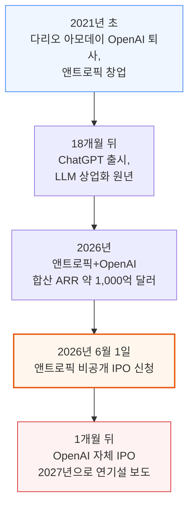
```mermaid
flowchart TD
    A["2021년 초<br/>다리오 아모데이 OpenAI 퇴사,<br/>앤트로픽 창업"] --> B["18개월 뒤<br/>ChatGPT 출시,<br/>LLM 상업화 원년"]
    B --> C["2026년<br/>앤트로픽+OpenAI<br/>합산 ARR 약 1,000억 달러"]
    C --> D["2026년 6월 1일<br/>앤트로픽 비공개 IPO 신청"]
    D --> E["1개월 뒤<br/>OpenAI 자체 IPO<br/>2027년으로 연기설 보도"]
    style A fill:#eff6ff,stroke:#3b82f6
    style D fill:#fff7ed,stroke:#ea580c,stroke-width:2px
    style E fill:#fef2f2,stroke:#dc2626
```

이 급성장의 배경에는 Claude Code가 있습니다. 소프트웨어 개발 업계를 강타하며 2026년 들어 AI 모델을 수익성 있게 상업화하는 경쟁에서 뚜렷한 승자가 갈렸습니다.

---

### 흑자 앤트로픽 vs 적자 OpenAI - 두 회사의 갈림길

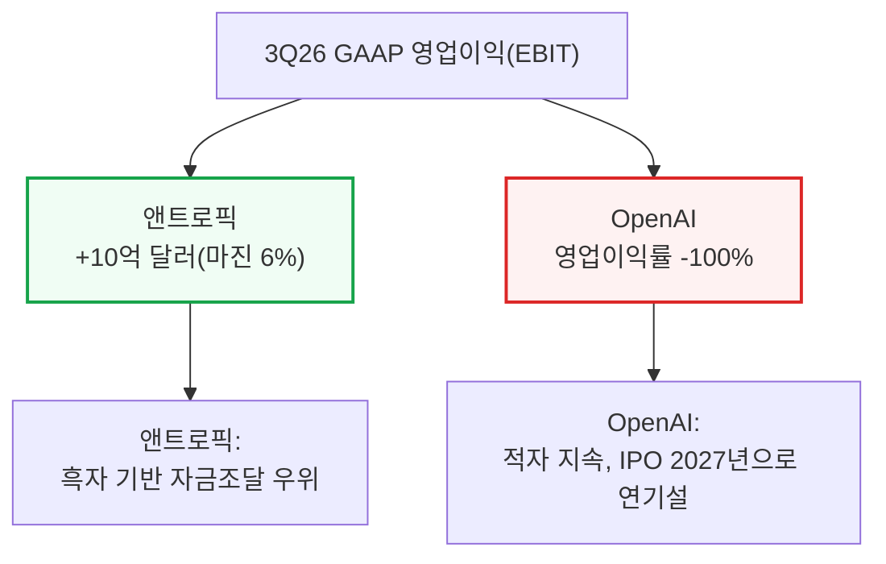
```mermaid
flowchart TD
    A["3Q26 GAAP 영업이익(EBIT)"] --> B["앤트로픽<br/>+10억 달러(마진 6%)"]
    A --> C["OpenAI<br/>영업이익률 -100%"]
    B --> D["앤트로픽:<br/>흑자 기반 자금조달 우위"]
    C --> E["OpenAI:<br/>적자 지속, IPO 2027년으로 연기설"]
    style B fill:#f0fdf4,stroke:#16a34a,stroke-width:2px
    style C fill:#fef2f2,stroke:#dc2626,stroke-width:2px
```

앤트로픽은 오늘날 수익성 있는 방식으로 B2B(기업간거래) 시장을 장악한 명확한 선두주자이며, 초점이 흐트러지고 현금을 태우는 경쟁자(OpenAI)를 상대로 이 지위를 지키고 있다는 것이 저자들의 평가입니다.

이 우위를 바탕으로 저자들은 앤트로픽이 우수한 사업 모델과 마진을 활용해 신규 모델에 더 투자하며 폐쇄형·오픈소스 경쟁자 대비 격차를 계속 벌릴 것으로 전망합니다.
앤트로픽이 실행력을 유지한다면 세계 최초의 6조 달러 기업이 될 기본 시나리오도 가능하다는 것이 저자들의 시각입니다.
가격결정력, 매출총이익률, 사업 모델, 수익성 모두 앤트로픽이 먼저 상장해야 할 이유이며, 이는 OpenAI가 재무제표를 공개하고 자금을 조달할 수밖에 없도록 압박하는 효과도 있습니다.

올해 이미 중국의 즈푸(Zhipu)와 미니맥스(Minimax) 2개 AI 랩이 상장했지만, 앤트로픽은 이 규모의 AI 랩으로는 첫 상장 사례가 될 전망입니다.
비공개 신청이라 공식 수치는 없지만, SemiAnalysis Tokenomics팀이 SKU·요금제·고객 유형별 상향식(바텀업) 모델로 구축한 재무제표를 최근 WSJ 보도가 뒷받침했습니다.

---

## 2. IPO 배경 - 왜 지금 상장하는가

**📌 핵심:**
- 앤트로픽은 이미 1,000억 달러 넘게 조달했고 비GAAP 기준으로는 흑자인데도 상장을 택한 이유는 3가지 — ① 주식·채권 시장 접근(향후 필수) ② 감사된 공개 재무제표로 대형 계약 체결이 쉬워짐 ③ 직원의 지분 매각을 쉽게 해 인재 전쟁에서 우위
- 2030년까지 OpenAI·앤트로픽 합산 컴퓨트 수요가 100GW를 넘을 전망 — 2025년에 겨우 2.5GW, 2026년 5GW가 추가된 것과 비교하면 2030년까지 90GW 이상의 순증설이 필요한데, 현재 두 회사가 확보한 컴퓨트는 약 6GW뿐
- 1분기(1Q26) 동안 사용자들이 이 컴퓨트 부족을 체감 — 사용 제한(rate limit), 다운타임 등으로 Claude 이용이 어려워짐. 앤트로픽 API 사업의 매출총이익률이 이미 매우 높아, 공개시장 자금 조달로 이 마진을 레버리지 삼아 경쟁사가 따라오기 힘든 수준으로 컴퓨트 확보 경쟁에서 우위를 점할 수 있음
- 결론: 구글이 6월 848억 7,500만 달러를 증자하고 메타도 수백억 달러대 조달설이 도는 등 하이퍼스케일러조차 주식 발행에 나선 것은 AI 컴퓨트 수요가 그만큼 강력하다는 신호 — 앤트로픽 IPO는 이 자금조달 경쟁에 참여하려는 시도

---

### 왜 지금 상장하는가 - 3가지 이유

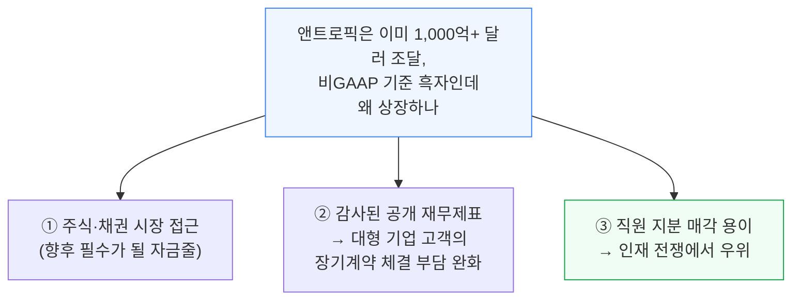
```mermaid
flowchart TD
    Q["앤트로픽은 이미 1,000억+ 달러 조달,<br/>비GAAP 기준 흑자인데<br/>왜 상장하나"] --> R1["① 주식·채권 시장 접근<br/>(향후 필수가 될 자금줄)"]
    Q --> R2["② 감사된 공개 재무제표<br/>→ 대형 기업 고객의<br/>장기계약 체결 부담 완화"]
    Q --> R3["③ 직원 지분 매각 용이<br/>→ 인재 전쟁에서 우위"]
    style Q fill:#eff6ff,stroke:#3b82f6
    style R3 fill:#f0fdf4,stroke:#16a34a
```

프로 스포츠급 인재 영입 경쟁과 계속 불어나는 컴퓨트 수요가 맞물린 지금, 유동적인 공개 주식을 보유하고 빠르게 채권·주식을 조달할 수 있다는 것은 전략적으로 의미가 큽니다.

### 컴퓨트 수요 - 공급 격차, 2030년까지 90GW 순증설 필요

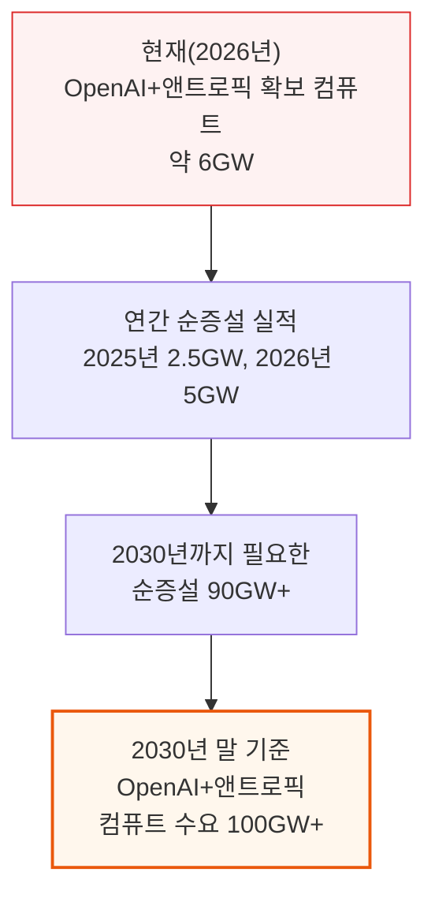
```mermaid
flowchart TD
    Now["현재(2026년)<br/>OpenAI+앤트로픽 확보 컴퓨트<br/>약 6GW"] --> Added["연간 순증설 실적<br/>2025년 2.5GW, 2026년 5GW"]
    Added --> Gap["2030년까지 필요한<br/>순증설 90GW+"]
    Gap --> Demand["2030년 말 기준<br/>OpenAI+앤트로픽<br/>컴퓨트 수요 100GW+"]
    style Now fill:#fef2f2,stroke:#dc2626
    style Demand fill:#fff7ed,stroke:#ea580c,stroke-width:2px
```

1분기(1Q26) 중 앤트로픽 사용자들은 이 컴퓨트 부족을 실제로 체감했습니다. 사용 제한(rate limit), 다운타임 등 이용을 어렵게 만드는 조치가 잇따랐습니다.
앤트로픽의 API 사업 매출총이익률은 이미 매우 높은 수준으로, 공개 자본시장 접근은 이 마진을 레버리지 삼아 경쟁사가 따라오기 힘든 수준까지 컴퓨트 확보 입찰을 밀어붙이는 데 도움이 됩니다.

### 조달 시장의 변화 - 하이퍼스케일러도 주식을 발행한다

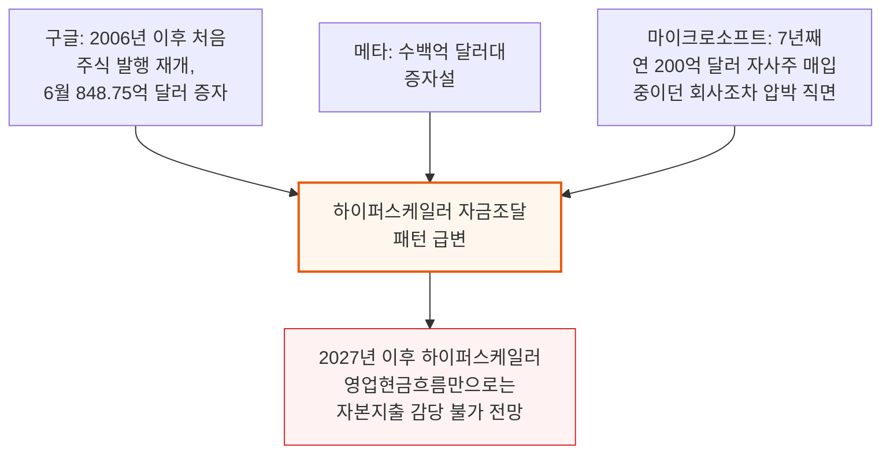
```mermaid
flowchart TD
    G["구글: 2006년 이후 처음<br/>주식 발행 재개,<br/>6월 848.75억 달러 증자"] --> Trend["하이퍼스케일러 자금조달<br/>패턴 급변"]
    M["메타: 수백억 달러대<br/>증자설"] --> Trend
    MS["마이크로소프트: 7년째<br/>연 200억 달러 자사주 매입<br/>중이던 회사조차 압박 직면"] --> Trend
    Trend --> Reason["2027년 이후 하이퍼스케일러<br/>영업현금흐름만으로는<br/>자본지출 감당 불가 전망"]
    style Trend fill:#fff7ed,stroke:#ea580c,stroke-width:2px
    style Reason fill:#fef2f2,stroke:#dc2626
```

세계 최고의 기업들조차 이 정도로 움직인다는 것은, 다른 누군가의 AI 모델·인프라를 서빙해 얻는 투하자본이익률(ROIC)과 수요가 그만큼 높다는 신호입니다.
그 결과 2027년 하이퍼스케일러 합산 잉여현금흐름이 마이너스 9자리 수(수십억 달러 적자)로 떨어지는 것까지 감수할 가치가 있다고 판단한 셈입니다.
저자들은 앤트로픽·OpenAI의 컴퓨트 수요가 계속 커지면서, 두 회사가 하이퍼스케일러·뉴클라우드(SpaceX·메타 포함) 전체 컴퓨트에서 차지하는 비중도 계속 늘어날 것으로 전망합니다.
지금이야말로 자금을 조달할 최적의 시점이며, 메타가 곧 증자에 나서는 등 이미 여러 곳이 시장을 두드린 상황에서 앤트로픽의 조달 시급성도 뚜렷합니다.

---

## 3. 사업 구조 - 구독과 API 매출 믹스

**📌 핵심:**
- ChatGPT가 소비자에게 "아이폰의 순간"이었다면, Claude Code는 B2B(기업간거래)에서의 변곡점 — Claude Code는 이제 전체 GitHub 커밋의 7% 이상을 차지하며 2026년 초 앤트로픽 ARR 급가속을 이끔(2025년 말 90억 달러 → 현재 600억 달러 이상)
- 앤트로픽 매출의 75\~85%는 사용량 기반 API 매출, 구독은 15%에 불과 — 반대로 OpenAI는 역사적으로 소비자·구독 중심(1Q26 기준 65%+가 구독)이었으나 최근 변화 중
- 소비자 구독은 Free·Pro($20/월)·Max 5x($100/월)·Max 20x($200/월) 4단계, 팀(Team) 구독은 5\~150석 기업 대상 $20 또는 $100/월(연간 결제 시), 엔터프라이즈 구독은 별도 사용량 요금 없이 150석 초과 시 API 요금이 그대로 부과됨
- 결론: API 매출은 좌석(seat)이 아니라 토큰 단위로 과금되어 매출 상한이 없음 — 같은 고객이 에이전틱 워크플로우를 더 많이 쓸수록 신규 고객 없이도 매출이 계속 늘어나는 구조

---

### 앤트로픽 ARR - 자유낙하 없는 폭증

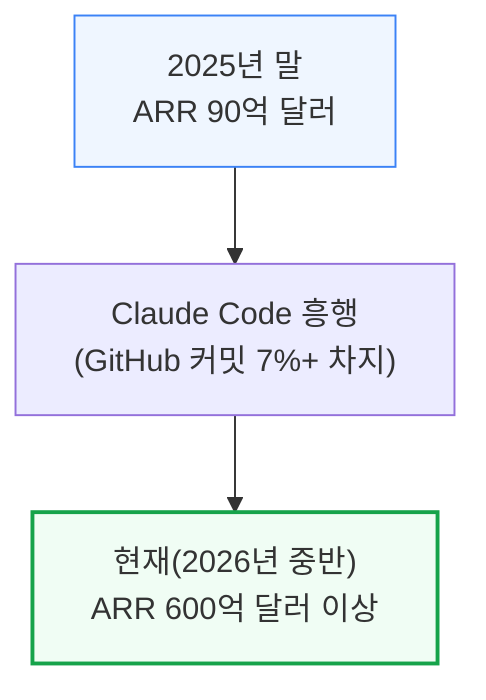
```mermaid
flowchart TD
    A["2025년 말<br/>ARR 90억 달러"] --> B["Claude Code 흥행<br/>(GitHub 커밋 7%+ 차지)"]
    B --> C["현재(2026년 중반)<br/>ARR 600억 달러 이상"]
    style A fill:#eff6ff,stroke:#3b82f6
    style C fill:#f0fdf4,stroke:#16a34a,stroke-width:2px
```

📌 용어 풀이: 왜 "ChatGPT=소비자 아이폰 모먼트, Claude Code=B2B 변곡점"인가
> - ChatGPT는 일반 소비자가 처음으로 AI를 일상적으로 쓰기 시작한 계기였다면, Claude Code는 기업(개발팀)이 AI에 실제 업무를 맡기기 시작한 계기라는 의미
> - 이 차이가 두 회사의 매출 구조(소비자 구독 vs 기업 사용량 과금)를 갈랐다는 것이 저자들의 핵심 논지

### 매출 구조 - API 75\~85% vs 구독 15%

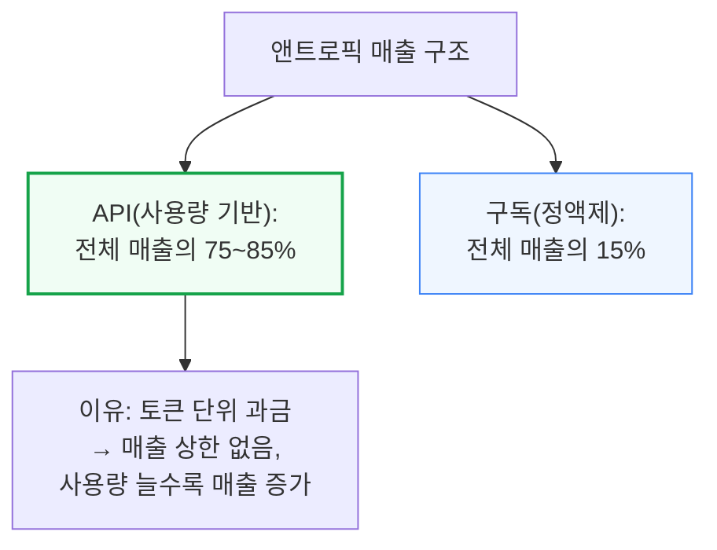
```mermaid
flowchart TD
    Rev["앤트로픽 매출 구조"] --> API["API(사용량 기반):<br/>전체 매출의 75~85%"]
    Rev --> Sub["구독(정액제):<br/>전체 매출의 15%"]
    API --> Why["이유: 토큰 단위 과금<br/>→ 매출 상한 없음,<br/>사용량 늘수록 매출 증가"]
    style API fill:#f0fdf4,stroke:#16a34a,stroke-width:2px
    style Sub fill:#eff6ff,stroke:#3b82f6
```

반면 OpenAI는 역사적으로 소비자·구독 중심 사업(1Q26 기준 구독 비중 65%+)이었으나, 최근 이 구도가 바뀌는 중입니다.
소비자 구독 비중만 봐도 격차가 뚜렷합니다 — 앤트로픽 ARR 중 소비자 구독은 단 5%인 반면, OpenAI는 2Q26 말 기준 약 40%로 추정됩니다(OpenAI 최고고객책임자도 1Q26 블로그에서 언급).

### 구독 요금제 4단계 - Free부터 Max 20x까지

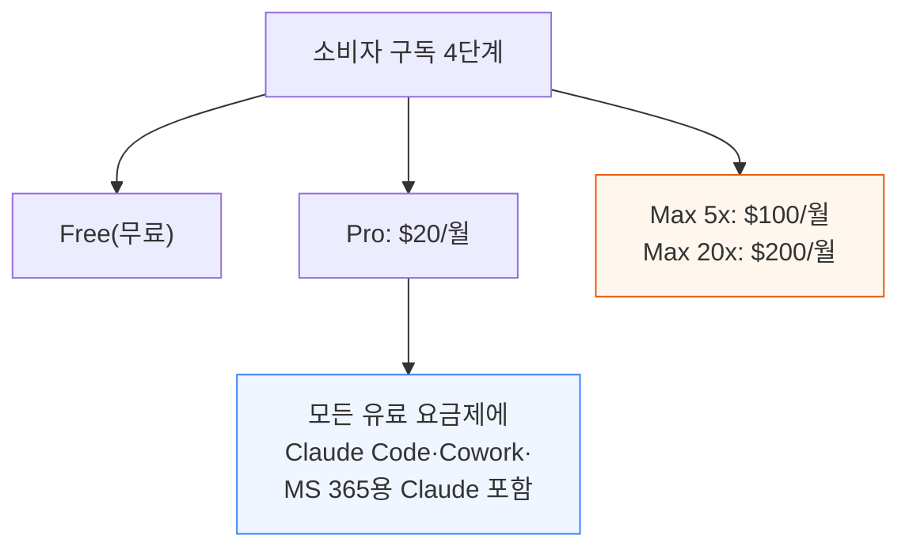
```mermaid
flowchart TD
    Consumer["소비자 구독 4단계"] --> Free["Free(무료)"]
    Consumer --> Pro["Pro: $20/월"]
    Consumer --> Max["Max 5x: $100/월<br/>Max 20x: $200/월"]
    Pro --> Note["모든 유료 요금제에<br/>Claude Code·Cowork·<br/>MS 365용 Claude 포함"]
    style Max fill:#fff7ed,stroke:#ea580c
    style Note fill:#eff6ff,stroke:#3b82f6
```

카드 패널 데이터 분석 결과 미국의 평균 유료 소비자는 월 약 45달러를 Claude에 지출하는 것으로 추정됩니다. 팀(Team) 구독은 5\~150석 규모 중소기업 대상으로, 연간 결제 시 월 $20 또는 $100입니다.

소비자·팀 구독 모두 토큰 소비 방식이 불투명한 사용량 기반 시스템을 갖고 있습니다. SemiAnalysis의 API 환산 토큰 지출 분석에 따르면 구독은 API로 같은 작업량을 처리할 때 드는 비용보다 훨씬 많은 사용량을 제공하지만, 사용량을 언제 얼마나 제한할지는 전적으로 앤트로픽이 결정합니다.

### 엔터프라이즈는 다르다 - 사용량 포함 없이 API 요금 그대로

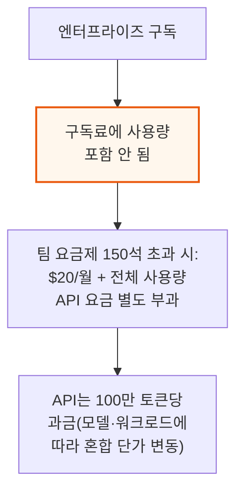
```mermaid
flowchart TD
    Ent["엔터프라이즈 구독"] --> NoUsage["구독료에 사용량<br/>포함 안 됨"]
    NoUsage --> Over150["팀 요금제 150석 초과 시:<br/>$20/월 + 전체 사용량<br/>API 요금 별도 부과"]
    Over150 --> PerToken["API는 100만 토큰당<br/>과금(모델·워크로드에<br/>따라 혼합 단가 변동)"]
    style NoUsage fill:#fff7ed,stroke:#ea580c,stroke-width:2px
```

결국 랩(모델 개발사)의 사업 모델은 단순합니다 — 신규 모델을 만들고, 이를 학습·서빙할 컴퓨트를 사거나 빌린 뒤, 그 컴퓨트를 토큰 단위로 고객에게 판매하는 구조입니다.
앤트로픽은 고마진 사용량 기반 가격 정책에 사업 모델 전체를 맞춘 반면, OpenAI는 비용이 많이 드는 무료·구독 사용자를 다수 서빙하며 컴퓨트를 대량으로 소모해왔습니다.
OpenAI가 점차 앤트로픽 방식으로 수렴하며 신규 ARR이 B2B·API 위주로 바뀌고 있지만, 여전히 소비자·구독 기반 사용량이 재무제표에 상당한 부담을 주고 있습니다.

---

## 4. 성장 궤적과 손익 - ARR 폭증과 마진 개선

**📌 핵심:**
- Claude Code가 1분기(1Q26) 폭발적으로 흥행하며 앤트로픽 ARR을 2025년 말 90억 달러에서 단 한 분기 만에 300억 달러로 밀어올림(1월 +30억, 2월 +70억, 3월 +110억 달러) — 그중에서도 API 매출이 성장을 주도
- 매출총이익률은 2024년 -94%(원가가 매출보다 컸다는 의미)에서 현재 60%대 중반까지 상승 — 새 모델일수록 가격이 높아지고 칩 세대가 바뀔수록 토큰당 처리량이 늘어, 컴퓨트 원가는 고정인데 매출만 늘어나는 구조 때문
- 앤트로픽의 MW(전력 1메가와트)당 ARR은 9개월 전 1,600만 달러에서 올해 하반기 6,000만 달러 수준까지 상승 전망 — 반면 OpenAI는 무료 사용자 9억 명 이상을 이용자 1명당 월 약 0.70달러 원가로 서빙하며 전체 매출총이익률을 20\~30%p 깎아먹는 구조적 열위
- 결론: 3Q26 앤트로픽 GAAP 영업이익(EBIT)은 +10억 달러(마진 6%)로 흑자 전환, OpenAI는 여전히 -100% 마진 — 이 격차가 재투자 여력의 차이로 직결

---

### ARR 폭증 타임라인 - 90억에서 300억, 다시 600억 달러 이상으로

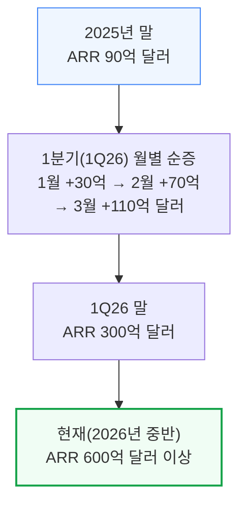
```mermaid
flowchart TD
    A["2025년 말<br/>ARR 90억 달러"] --> B["1분기(1Q26) 월별 순증<br/>1월 +30억 → 2월 +70억<br/>→ 3월 +110억 달러"]
    B --> C["1Q26 말<br/>ARR 300억 달러"]
    C --> D["현재(2026년 중반)<br/>ARR 600억 달러 이상"]
    style A fill:#eff6ff,stroke:#3b82f6
    style D fill:#f0fdf4,stroke:#16a34a,stroke-width:2px
```

같은 기간 앤트로픽의 무료 소비자 월간활성이용자(MAU)는 약 5,500\~6,000만 명 수준이며 이 중 9%가 유료 전환한 것으로 추정됩니다. 반면 OpenAI는 연초부터 주간활성이용자(WAU) 약 9억 5,000만 명 선에 정체돼 있고, 유료 전환율도 약 6%로 앤트로픽보다 낮습니다.

📌 용어 풀이: 순증 ARR(Net New ARR)이 매출총액보다 중요한 이유
> - ARR 총액은 "지금 속도로 1년 가면 얼마"를 보여주지만, 순증(Net New) ARR은 "이번 달에 얼마나 더 늘었는지" 성장 속도 자체를 보여줌
> - 앤트로픽은 이 순증 속도가 월 100억 달러 이상까지 올라온 상태 — 신규 모델 출시가 이 속도를 한 단계 더 끌어올리는 촉매로 작용한다는 것이 저자들의 관찰

### 매출총이익률 반전 - 2024년 -94%에서 현재 60%대 중반으로

Claude가 아닌 랩 전체가 매출총이익률 개선의 수혜를 봤습니다. 신규 모델은 대체로 가격이 더 높게 책정되고, 가속기 칩은 세대가 바뀔수록 토큰 처리량이 늘어나며 시간이 갈수록 추론에 맞게 최적화됩니다.
컴퓨트 원가는 1단위당 거의 고정돼 있으므로, ① 같은 컴퓨트로 더 많은 토큰을 뽑거나 ② 그 토큰에 더 높은 가격을 매길 수 있으면 늘어난 매출의 거의 100%가 그대로 이익으로 흘러갑니다.

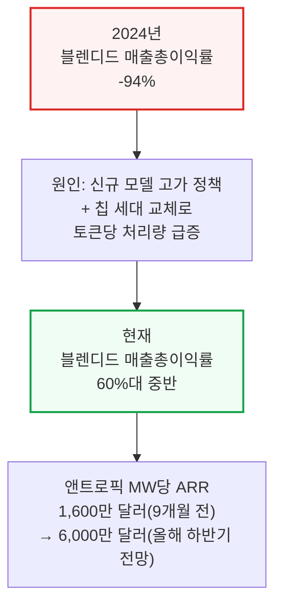
```mermaid
flowchart TD
    Y24["2024년<br/>블렌디드 매출총이익률<br/>-94%"] --> Improve["원인: 신규 모델 고가 정책<br/>+ 칩 세대 교체로<br/>토큰당 처리량 급증"]
    Improve --> Y26["현재<br/>블렌디드 매출총이익률<br/>60%대 중반"]
    Y26 --> MW["앤트로픽 MW당 ARR<br/>1,600만 달러(9개월 전)<br/>→ 6,000만 달러(올해 하반기 전망)"]
    style Y24 fill:#fef2f2,stroke:#dc2626,stroke-width:2px
    style Y26 fill:#f0fdf4,stroke:#16a34a,stroke-width:2px
```

컴퓨트 원가는 거의 고정인데 매출이 늘어나는 구조라서, 매출 성장이 강할 때 마진이 폭발적으로 개선되는 것이 랩 재무제표의 강력한 상방 요인이라는 것이 저자들의 설명입니다.

### OpenAI의 구조적 약점 - 무료 사용자 9억 명의 원가 부담

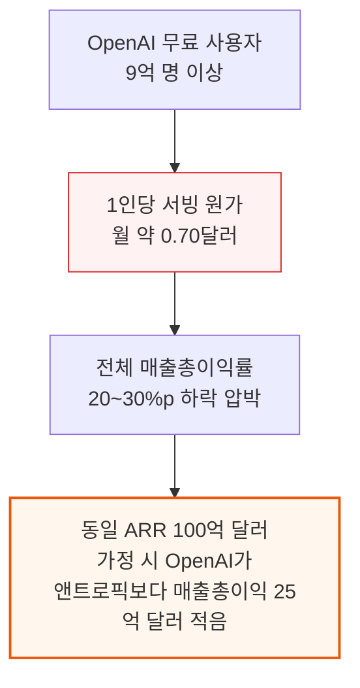
```mermaid
flowchart TD
    Free["OpenAI 무료 사용자<br/>9억 명 이상"] --> Cost["1인당 서빙 원가<br/>월 약 0.70달러"]
    Cost --> Hit["전체 매출총이익률<br/>20~30%p 하락 압박"]
    Hit --> Compare["동일 ARR 100억 달러<br/>가정 시 OpenAI가<br/>앤트로픽보다 매출총이익 25억 달러 적음"]
    style Cost fill:#fef2f2,stroke:#dc2626
    style Compare fill:#fff7ed,stroke:#ea580c,stroke-width:2px
```

이 매출총이익 격차는 그대로 재투자 여력의 격차로 이어집니다. 매출총이익이 클수록 신규 모델 학습·연구에 더 많이 재투자할 수 있고, 이는 다음 모델의 ARR·매출총이익을 다시 끌어올리는 선순환을 만들어 경쟁사 대비 재투자 규모를 계속 벌리는 구조입니다.

매출총이익률은 앞으로도 계속 변할 수 있습니다. 앤트로픽은 최근 SpaceX와의 계약 사례처럼 시장가 2배 이상으로 신규 컴퓨트를 임대해주고 있고, 매출 분배 20\~30%를 내주는 베드락(Bedrock) 채널 비중도 늘고 있습니다.
하지만 API 매출총이익률이 80%대를 넘는 만큼, 앤트로픽은 현재 60%대 중반 수준을 당분간 유지하거나 오히려 개선할 여력이 충분합니다.

### 훈련 vs 추론 컴퓨트 배분 - 재투자 우선순위

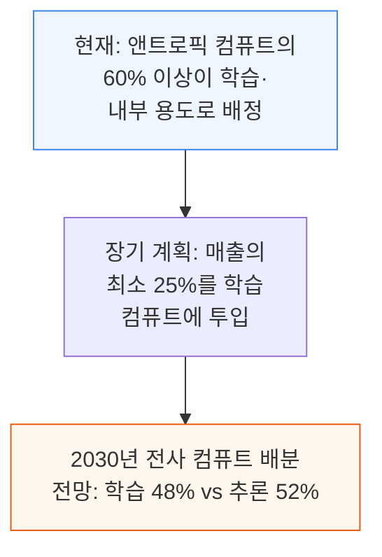
```mermaid
flowchart TD
    Now2["현재: 앤트로픽 컴퓨트의<br/>60% 이상이 학습·<br/>내부 용도로 배정"] --> Plan["장기 계획: 매출의<br/>최소 25%를 학습<br/>컴퓨트에 투입"]
    Plan --> Split["2030년 전사 컴퓨트 배분<br/>전망: 학습 48% vs 추론 52%"]
    style Now2 fill:#eff6ff,stroke:#3b82f6
    style Split fill:#fff7ed,stroke:#ea580c
```

이 대목에서 나오는 3Q26 성적표가 핵심입니다 — 앤트로픽은 GAAP 영업이익(EBIT) +10억 달러(매출 대비 마진 6%)로 흑자 전환하며 OpenAI 대비 빠른 순증 ARR 성장을 함께 달성했습니다.
반면 OpenAI는 영업이익률 -100%에 머물러 있습니다. 저자들은 앤트로픽이 굳이 지금 흑자를 내고 싶어 하지는 않을 것으로 보지만, 컴퓨트 제약이 재투자 규모를 제한하고 있다는 점도 함께 짚습니다.

요약하면, 매출총이익률과 영업이익률의 뚜렷한 격차는 앤트로픽에게 OpenAI 대비 명확한 재투자 우위를 제공합니다(9장 "컴퓨트와 장기 랩 경제학"에서 더 깊이 다룸).
앤트로픽은 집중력과 실행력을 갖추면 AI 랩도 훌륭하고 수익성 있는 사업이 될 수 있음을 보여주고 있어, 투자자들이 상장 시 다음 단계 구축 자금을 넉넉히 공급할 것으로 저자들은 예상합니다.
OpenAI 입장에서는 초기 Codex·API 모멘텀을 재투자 가능한 마진으로 계속 전환하고, 구축 자금 조달을 위한 수익성 개선 경로를 제시하는 것이 관건입니다.

---

## 5. 코딩 시장과 대형 고객 집중도

**📌 핵심:**
- 오늘날 랩 매출은 소수의 "파워 유저"가 이끔 — 지출이 코딩 워크플로우에 좁고 두텁게 집중돼 있지만, 그 안에서도 폭넓은 저변이 있어 메타가 앤트로픽 전체 매출의 3\~5%에 불과함에도 최대 고객으로 추정됨
- 코딩 활용 사례가 전체 랩 ARR의 65% 이상을 차지 — Cursor, Cognition, Loveable, Replit 등 코딩 스타트업들도 2Q26 기준 별도로 60억 달러의 ARR을 구성
- 앤트로픽 모델을 다른 서비스에 포장해 되파는 "래퍼(wrapper)" 기업들은 산업 성장 자체가 넓어지며 전체 랩 ARR의 10\~15% 미만 비중에 그침
- 결론: 대형 엔터프라이즈 고객은 숫자는 많지만 아직 지출 확대(ramping) 초기 단계 — 메타처럼 토큰 사용을 극대화하는 최고 사례가 9자리 수(억 달러대) 지출을 보이는 정도

---

### 매출 집중도 - 코딩이 65%, 소수 대형 고객이 견인

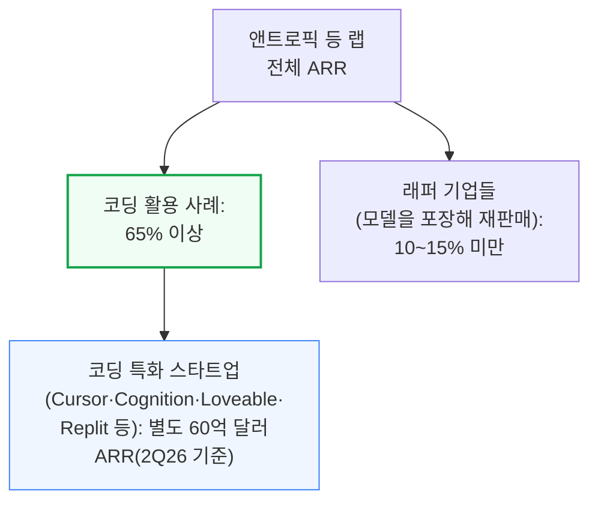
```mermaid
flowchart TD
    Total["앤트로픽 등 랩<br/>전체 ARR"] --> Coding["코딩 활용 사례:<br/>65% 이상"]
    Total --> Wrapper["래퍼 기업들<br/>(모델을 포장해 재판매):<br/>10~15% 미만"]
    Coding --> Startups["코딩 특화 스타트업<br/>(Cursor·Cognition·Loveable·<br/>Replit 등): 별도 60억 달러<br/>ARR(2Q26 기준)"]
    style Coding fill:#f0fdf4,stroke:#16a34a,stroke-width:2px
    style Startups fill:#eff6ff,stroke:#3b82f6
```

### 최대 고객 메타 - 전체 매출의 3\~5%뿐인데 1위인 이유

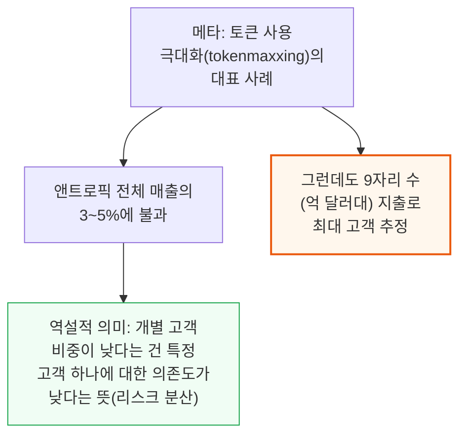
```mermaid
flowchart TD
    Meta["메타: 토큰 사용<br/>극대화(tokenmaxxing)의<br/>대표 사례"] --> Share["앤트로픽 전체 매출의<br/>3~5%에 불과"]
    Meta --> Spend["그런데도 9자리 수<br/>(억 달러대) 지출로<br/>최대 고객 추정"]
    Share --> Meaning["역설적 의미: 개별 고객<br/>비중이 낮다는 건 특정<br/>고객 하나에 대한 의존도가<br/>낮다는 뜻(리스크 분산)"]
    style Spend fill:#fff7ed,stroke:#ea580c,stroke-width:2px
    style Meaning fill:#f0fdf4,stroke:#16a34a
```

대형 엔터프라이즈 고객은 숫자로는 많지만 대부분 아직 지출 확대(ramping) 초기 단계에 머물러 있습니다.
파워 유저·파워 고객이 오늘날 랩 매출을 견인한다는 것이 저자들의 진단이며, 지출이 코딩 워크플로우에 좁게 집중돼 있으면서도 여러 코딩 스타트업이 함께 저변을 넓히는 이중 구조를 보여줍니다.

---

## 6. TaaS 사업 구조 - 하이퍼스케일러를 통한 간접 판매

**📌 핵심:**
- 토큰 서비스형(TaaS) 사업 모델이 최근 급성장 — 고객이 랩에서 직접 사지 않고 AWS 베드락(Bedrock), 애저 파운드리(Foundry), 구글 제미나이 엔터프라이즈(옛 버텍스) 같은 외부 클라우드 채널을 거쳐 모델을 구매
- 앤트로픽의 간접 채널(베드락·파운드리 등) 매출 비중은 1분기 전 5\~10%에서 현재 15\~20%로 빠르게 확대
- 대형 엔터프라이즈가 간접 채널을 선호하는 이유 3가지 — ① 특정 모델에 락인되지 않고 자유롭게 다른 모델로 전환 가능 ② 이미 확보한 약정 사용량(committed usage)·ELA를 그대로 활용 ③ 이미 신뢰하는 보안·컴플라이언스 체계, 6\~12개월짜리 신규 벤더 검증(RFP) 절차 불필요
- 결론: 2Q26 기준 TaaS 시장 규모는 280억 달러로 추정, 이 중 85%를 3대 클라우드(AWS·MS·구글)가 점유 — 20\~30% 매출 분배를 하이퍼스케일러에 내주더라도, 영업직군(BDR·기업영업·영업엔지니어·고객성공팀)을 자체 구축하는 것보다 저렴하다는 게 랩들의 계산

---

### 왜 대형 고객은 랩 직판보다 하이퍼스케일러 채널을 선호하나

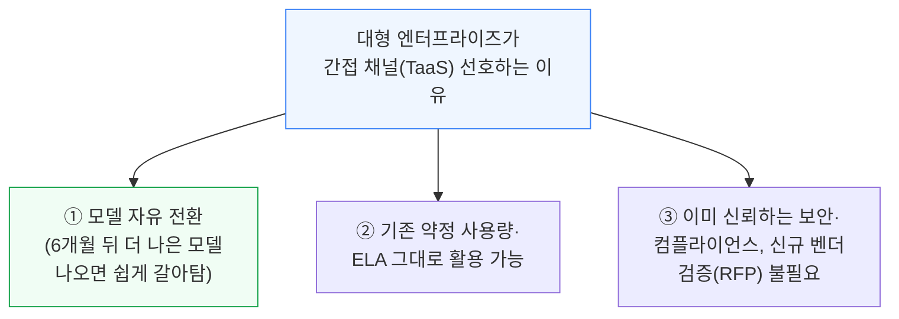
```mermaid
flowchart TD
    Enterprise["대형 엔터프라이즈가<br/>간접 채널(TaaS) 선호하는 이유"] --> R1["① 모델 자유 전환<br/>(6개월 뒤 더 나은 모델<br/>나오면 쉽게 갈아탐)"]
    Enterprise --> R2["② 기존 약정 사용량·<br/>ELA 그대로 활용 가능"]
    Enterprise --> R3["③ 이미 신뢰하는 보안·<br/>컴플라이언스, 신규 벤더<br/>검증(RFP) 불필요"]
    style Enterprise fill:#eff6ff,stroke:#3b82f6
    style R1 fill:#f0fdf4,stroke:#16a34a
```

앤트로픽은 클로드를 베드락·파운드리·제미나이 엔터프라이즈 플랫폼(옛 버텍스)에서 모두 제공하며, 3대 하이퍼스케일러가 대형 기업이 선호하는 요소를 모두 갖추고 있습니다. 국제 워크로드의 경우 지연시간(latency)도 더 우수한데, 앤트로픽은 직접 API 요청은 전부 미국으로 라우팅하기 때문입니다.

### 간접 채널 매출 비중 - 5\~10%에서 15\~20%로 급성장

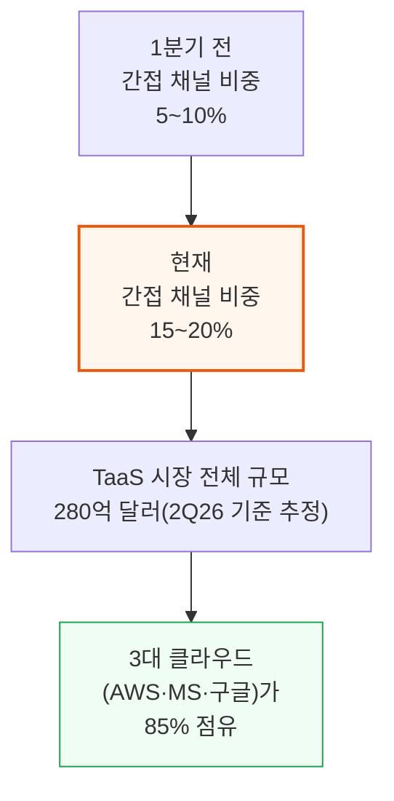
```mermaid
flowchart TD
    Before["1분기 전<br/>간접 채널 비중<br/>5~10%"] --> After["현재<br/>간접 채널 비중<br/>15~20%"]
    After --> Market["TaaS 시장 전체 규모<br/>280억 달러(2Q26 기준 추정)"]
    Market --> Share3["3대 클라우드<br/>(AWS·MS·구글)가<br/>85% 점유"]
    style After fill:#fff7ed,stroke:#ea580c,stroke-width:2px
    style Share3 fill:#f0fdf4,stroke:#16a34a
```

랩 입장에서도 이 구조가 나쁘지 않습니다. 모델을 쉽게 바꿀 자유를 주고 매출을 나눠주는 게 손해로 보일 수 있지만, TaaS 파트너는 유리한 IaaS(인프라 서비스) 수수료로 자본 유연성을 제공하고 대형 고객 기반 접근 통로를 열어줍니다.
엔터프라이즈 영업은 원래 어려운 일이라, 연간 수천억 달러 규모의 기존 기업 고객 지출 기반을 가진 하이퍼스케일러를 통하는 편이 앤트로픽·OpenAI 모두에게 유리합니다.
자체 BDR·기업영업·영업엔지니어·고객성공팀을 꾸려 신규 고객 확보·확장·유지를 관리하는 것보다, 하이퍼스케일러에 20% 매출 분배를 내주는 편이 더 낫다는 것이 랩들의 계산입니다.

기업의 TaaS 채택은 이미 강한 편입니다. 이런 요인들 때문에 저자들은 TaaS가 앞으로도 강력한 사업 모델로 자리잡을 것이며, 앤트로픽 ARR에서 이런 간접 관계가 차지하는 비중이 계속 커질 것으로 봅니다.

---

## 7. 리스크와 성장 여력

**📌 핵심:**
- 매출 리스크 5가지 — 토큰 예산 압박(tokenbudgeting), 오픈소스·가격 인하 경쟁, 구글·메타의 경쟁 코딩 모델, 신규 모델 출시를 막는 규제, 컴퓨트 공급 부족. 마진 리스크는 TaaS(간접 채널) 비중 확대에 따른 매출 분배 부담
- 토큰 예산 압박의 대표 사례로 거론되는 코인베이스는 실제로는 ROI 저하가 아니라 자사 업종의 경기 하강으로 인력의 14%를 감원한 것 — 저자들은 "토큰 극대화" 사례들이 분포의 극단(꼬리)일 뿐이고, 대부분의 파워 유저는 여전히 높은 투자수익을 누리고 있다고 반박
- 앤트로픽 공식 도움말 페이지 기준 Claude Code 엔터프라이즈 사용자의 평균 지출은 월 150\~250달러, 90%는 하루 30달러 미만 지출 — 아직 기업 예산 안에서 AI 지출 비중 자체가 작다는 의미
- 결론: 연간 10만 달러 이상 지출 고객 수는 1년 새 7배, 100만 달러 이상 고객은 2년 새 약 42배 증가 — 사이버보안 신사업(Mythos/Fable)까지 더해지면 2027년 말 ARR 3,000억 달러(월 순증 150억 달러 가정)도 가능하다는 것이 저자들의 결론

---

### 매출 리스크 5가지 + 마진 리스크 1가지

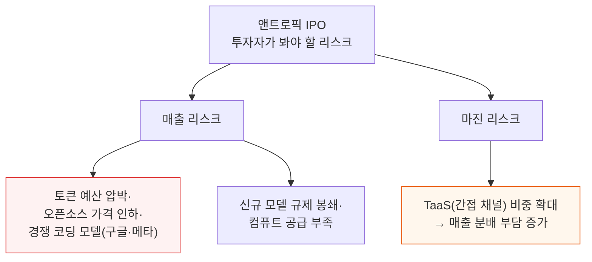
```mermaid
flowchart TD
    Risk["앤트로픽 IPO<br/>투자자가 봐야 할 리스크"] --> Top["매출 리스크"]
    Risk --> Margin["마진 리스크"]
    Top --> T1["토큰 예산 압박·<br/>오픈소스 가격 인하·<br/>경쟁 코딩 모델(구글·메타)"]
    Top --> T2["신규 모델 규제 봉쇄·<br/>컴퓨트 공급 부족"]
    Margin --> M1["TaaS(간접 채널) 비중 확대<br/>→ 매출 분배 부담 증가"]
    style T1 fill:#fef2f2,stroke:#dc2626
    style M1 fill:#fff7ed,stroke:#ea580c
```

📌 용어 풀이: 토큰 예산 압박(Tokenbudgeting)이란
> - 기업이 AI 토큰 지출에 상한선(budget)을 정해두고 그 안에서만 쓰도록 관리하는 관행
> - 우려되는 지점은 "AI 투자수익이 나쁘다"가 아니라 "회사 전체 경기가 나빠 비용을 줄이는 김에 AI 지출도 같이 줄인다"는 혼동 — 저자들은 이 둘을 구분해야 한다고 강조

### 코인베이스 사례의 진짜 의미 - ROI 문제가 아니라 경기 문제

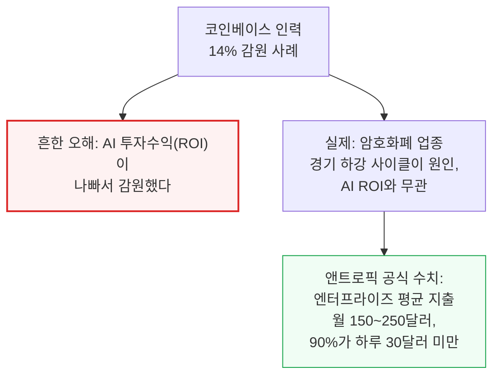
```mermaid
flowchart TD
    Case["코인베이스 인력<br/>14% 감원 사례"] --> Wrong["흔한 오해: AI 투자수익(ROI)이<br/>나빠서 감원했다"]
    Case --> Right["실제: 암호화폐 업종<br/>경기 하강 사이클이 원인,<br/>AI ROI와 무관"]
    Right --> Reality["앤트로픽 공식 수치:<br/>엔터프라이즈 평균 지출<br/>월 150~250달러,<br/>90%가 하루 30달러 미만"]
    style Wrong fill:#fef2f2,stroke:#dc2626,stroke-width:2px
    style Reality fill:#f0fdf4,stroke:#16a34a
```

기업 내부에서 AI가 쓰일 수 있는 폭과 깊이는 아직 넓고 미개척 상태입니다. 의사결정자들은 예측 가능한 지출을 선호해 많은 직무에 사용 한도·예산이 계속 걸려 있을 것으로 예상됩니다.
다만 투자수익이 늘어날수록 이 좌석당 예산도 늘어나고, 막대한 투자수익을 내는 최상위 사용자에게는 사실상 무제한 예산이 주어질 것으로 저자들은 전망합니다.

작업 일부가 오픈소스나 하위 등급 모델로 옮겨가더라도, 프론티어(최상급) 경쟁이 계속 2파전으로 유지되는 한 앤트로픽의 토큰 가격·물량은 높은 수준을 유지할 것이라는 게 저자들의 판단입니다.
최근 출시된 Sonnet 5도 하위 등급 폐쇄형 모델조차 이전 세대보다 더 높은 가격을 받아낼 수 있음을 보여줬는데, 수요가 압도적으로 강하기 때문이라는 분석입니다.
지금은 프론티어 시장이 매우 좁지만, 코딩 외 나머지 95% 이상의 경제 영역에서 신규 워크플로우가 이어받아 가격·물량 양쪽에서 앤트로픽 ARR을 계속 밀어올릴 것이라는 전망입니다.

구글 딥마인드·메타 슈퍼인텔리전스의 신규 모델 성공 여부가 코딩 시장에서 가격을 낮출 최대 변수입니다.
구글·메타가 코딩을 4파전으로 만든다면 토큰 가격은 영향을 받겠지만, 최신·최고 성능 지능에는 언제나 값이 매겨지는 만큼 앤트로픽 순증 ARR이 마이너스로 돌아설 가능성은 낮다는 게 저자들의 견해입니다.

규제 리스크도 존재합니다 — 정부·안전 전문가가 최신 모델 사용을 제한하면 모델의 투자자본이익률(ROIC)에 타격을 줄 수 있습니다.
다만 저자들은 이를 현재로선 작은 리스크로 보되, 규제당국이 미국의 AI 리더십과 기술 패권이 걸려 있다는 점을 유념해야 한다고 당부합니다.

### 성장 여력 - 고액 고객 폭증과 신규 수직시장

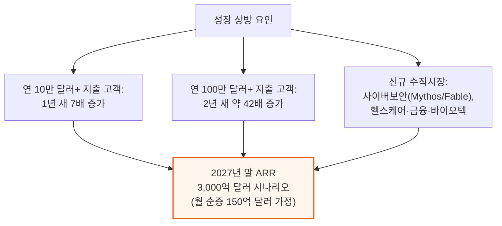
```mermaid
flowchart TD
    Growth["성장 상방 요인"] --> C1["연 10만 달러+ 지출 고객:<br/>1년 새 7배 증가"]
    Growth --> C2["연 100만 달러+ 지출 고객:<br/>2년 새 약 42배 증가"]
    Growth --> C3["신규 수직시장:<br/>사이버보안(Mythos/Fable),<br/>헬스케어·금융·바이오텍"]
    C1 --> Target["2027년 말 ARR<br/>3,000억 달러 시나리오<br/>(월 순증 150억 달러 가정)"]
    C2 --> Target
    C3 --> Target
    style Target fill:#fff7ed,stroke:#ea580c,stroke-width:2px
```

2022\~2023년 SaaS·클라우드 최적화 국면에서 스노우플레이크·데이터독·클라우드플레어 같은 기업들이 선행매출 50배 이상의 터무니없는 배수로 거래되다 성장률이 급격히 꺾인 전례가 있습니다.
저자들은 이런 조정 리스크가 단기적으로는 크지 않다고 봅니다 — 글로벌 2000대·포춘 500대 기업들이 프론티어 AI 활용에서 아직 초기 단계라, 좌석 배치·사용량 램프업이 2026\~2027년 순증 ARR 성장의 핵심 동력이 될 전망입니다.

---

## 8. 장기 정상 마진 전망

**📌 핵심:**
- 앤트로픽의 장기 마진은 최상급 소프트웨어 기업 특유의 사업 모델을 반영 — 과거 최고의 소프트웨어 기업들처럼 영업이익(EBIT)·잉여현금흐름(FCF) 마진 30\~40%가 가능하다는 것이 저자들의 전망
- 매출총이익률은 70%대 중반까지 상승, 학습·연구개발(R&D)에 전체 컴퓨트의 48%, 기타 영업비용은 매출의 20% 수준으로 안정화될 것으로 추정
- 결론: 이 정상 상태 마진 구조는 앤트로픽이 "AI 랩도 훌륭하고 수익성 있는 사업이 될 수 있다"는 것을 보여주는 최종 증거 — 다음 장에서 다룰 재투자 우위와 직결

---

### 정상 상태(Steady State) 마진 구조

```mermaid
flowchart TD
    Rev["매출 100"] --> GM["매출총이익률<br/>70%대 중반"]
    GM --> RD["학습·R&D:<br/>전체 컴퓨트의 48%"]
    GM --> Opex["기타 영업비용:<br/>매출의 20%"]
    RD --> Final["최종 EBIT·FCF 마진<br/>30~40%"]
    Opex --> Final
    style GM fill:#eff6ff,stroke:#3b82f6
    style Final fill:#f0fdf4,stroke:#16a34a,stroke-width:2px
```

📌 용어 풀이: EBIT·FCF 마진 30\~40%가 왜 "최상급"인가
> - 일반 소프트웨어 기업 중에서도 이익률이 특히 높은 축에 속하는 수준 — 매출 100원 중 30\~40원이 실제 영업이익·현금흐름으로 남는다는 뜻
> - 컴퓨트 원가가 거의 고정인 상태에서 매출만 계속 늘어나는 랩 특유의 구조가 이 수준의 마진을 가능하게 함(4\~5장에서 다룬 매출총이익률 개선 메커니즘의 연장선)

---

## 9. 컴퓨트와 장기 랩 경제학 - EBTIT 지표

**📌 핵심:**
- 앤트로픽의 우위는 결국 매출총이익률(그 자체가 API 매출 비중의 함수)에서 나옴 — 2027년 기준 매출원가(COGS) 차감 후 재투자 가능 자본이 앤트로픽 1,600억 달러 vs OpenAI 920억 달러로 추정, 격차가 뚜렷
- EBTIT(학습비·이자·세금 차감 전 이익)는 랩의 재투자 여력을 보여주는 새로운 기본 지표 — 앤트로픽은 2Q26 기준 EBTIT 마진 36%를 기록하며 AI도 막대한 수익을 낼 수 있음을 입증
- OpenAI·구글 딥마인드·메타 슈퍼인텔리전스를 비롯한 모든 오픈소스 진영 대비 앤트로픽의 EBTIT 1달러 우위는 모델 역량 리더십을 강화하는 요인 — 2028년까지 누적 EBTIT 격차가 OpenAI 대비 2,500억 달러에 달할 것이라는 전망이 앤트로픽이 먼저 IPO해 가능한 한 빨리, 가능한 한 많은 컴퓨트를 확보해야 하는 핵심 근거
- 결론: 2024년 1분기 이후 누적 학습비 80억 달러를 투입해 지금의 600억 달러 ARR 사업을 만들어낸 것은 투하자본이익률(ROIC) 기준으로 극히 인상적 — 2030년 기준 100GW 넘는 컴퓨트 수요를 감당하려면 결국 자본이 수요를 따라가야 하며, 이것이 이번 IPO가 상징하는 더 큰 흐름(연간 수조 달러 규모 자금조달이 필요해지는 생태계 전환점)

---

### EBTIT이란 - 학습비를 빼기 전 재투자 여력

```mermaid
flowchart TD
    Def["EBTIT<br/>(학습비·이자·세금<br/>차감 전 이익)"] --> Meaning["의미: 신규 모델 학습에<br/>얼마나 재투자할 실탄이<br/>있는지 보여주는 지표"]
    Meaning --> Result["앤트로픽 2Q26<br/>EBTIT 마진 36%"]
    Result --> Advantage["OpenAI·구글 딥마인드·메타<br/>슈퍼인텔리전스 대비<br/>EBTIT 1달러 우위<br/>= 모델 역량 격차 확대"]
    style Result fill:#f0fdf4,stroke:#16a34a,stroke-width:2px
    style Advantage fill:#fff7ed,stroke:#ea580c,stroke-width:2px
```

### 2027년 재투자 자본 - 앤트로픽 1,600억 vs OpenAI 920억 달러

```mermaid
flowchart TD
    COGS["2027년 매출원가(COGS)<br/>차감 후 재투자 가능 자본"] --> A["앤트로픽<br/>1,600억 달러"]
    COGS --> O["OpenAI<br/>920억 달러"]
    A --> Cumulative["2028년까지 누적<br/>EBTIT 격차<br/>OpenAI 대비 2,500억 달러"]
    style A fill:#f0fdf4,stroke:#16a34a,stroke-width:2px
    style Cumulative fill:#fff7ed,stroke:#ea580c,stroke-width:2px
```

이 누적 EBTIT 달러 우위가 바로 저자들이 앤트로픽에게 먼저 IPO하고 가능한 한 빠르고 많이 컴퓨트를 확보하라고 권고하는 핵심 근거입니다. 모델 역량 격차가 벌어질수록, 비프론티어 모델이 따라잡는 데 걸리는 시간이 늘어나고, 이는 프론티어 워크로드에서 가격결정력의 원천이 됩니다.

### 학습비 80억 달러로 600억 달러 ARR 사업을 만든 투자수익률

```mermaid
flowchart TD
    Train["2024년 1분기 이후<br/>누적 학습비 80억 달러"] --> Business["현재 ARR<br/>600억 달러 사업"]
    Business --> Flywheel["신규 수직시장<br/>(사이버보안·바이오텍·<br/>헬스케어·금융)에서<br/>선점 투자 여력 확보"]
    style Train fill:#eff6ff,stroke:#3b82f6
    style Business fill:#f0fdf4,stroke:#16a34a,stroke-width:2px
```

다만 이 모든 것은 서빙할 컴퓨트가 있어야만 가능합니다. 저자들은 2030년 기준 랩들의 컴퓨트 수요를 100GW 이상으로 전망하며, 자본이 이 수요를 따라가야 한다는 것이 이번 IPO의 더 큰 맥락이라고 짚습니다.
올해 하이퍼스케일러들의 1,000억 달러 이상 증자는 앞으로 2\~3년간 이 대규모 구축에 필요한 자본의 서막일 뿐이며, 두 회사의 IPO는 연간 수조 달러 자금조달이 필요해지는 생태계 전환점을 상징합니다.

---

## 10. 결론과 밸류에이션 - 6조 달러 회사?

**📌 핵심:**
- 앤트로픽은 AI 랩 경쟁에서 가장 중요한 두 재무 지표(성장률과 수익성) 모두에서 명확한 승자 — 다만 OpenAI도 5.5·Codex 출시 이후 격차를 좁히는 중이며, API 사업의 순증 ARR 가속 여부가 앞으로 앤트로픽 리드폭을 좌우할 변수
- 앤트로픽이 먼저 IPO해야 하는 이유는 명확 — 재무제표가 더 우수하고 사업 모델이 더 낫기 때문에, 이 우위를 계속 밀어붙여 자본을 앤트로픽 쪽으로 끌어올 수 있음. 이는 동시에 OpenAI가 더 나쁜 재무제표·성장률로 증자에 나서야 하는 압박으로 작용
- 기본 시나리오 밸류에이션: 2027년 말 ARR 3,000억 달러(월 순증 ARR 약 150억 달러 가정) 기준 2027년 예상 ARR의 20배 적용 시 기업가치 6조 달러 — 세계 최대 기업이 되는 시나리오
- 결론: 앤트로픽은 계속 가속 페달을 밟아야 하며, OpenAI는 초기 Codex·API 모멘텀을 더 나은 마진으로 전환하고 구축 자금을 조달할 수익성 경로를 제시하는 것이 급선무

---

### 밸류에이션 계산 - ARR 20배 적용 시 6조 달러

```mermaid
flowchart TD
    ARR27["2027년 말 ARR<br/>3,000억 달러<br/>(월 순증 약 150억 달러 가정)"] --> Multiple["ARR 배수<br/>20배 적용"]
    Multiple --> Value["기업가치<br/>6조 달러"]
    Value --> Rank["시나리오 실현 시<br/>세계 최대 기업 등극"]
    style ARR27 fill:#eff6ff,stroke:#3b82f6
    style Value fill:#f0fdf4,stroke:#16a34a,stroke-width:2px
    style Rank fill:#fff7ed,stroke:#ea580c,stroke-width:2px
```

### 앤트로픽 vs OpenAI - 성장률·수익성 두 축의 격차

```mermaid
flowchart TD
    Two["AI 랩 경쟁의 핵심 2축"] --> Growth["성장률: 앤트로픽 우위<br/>(순증 ARR 월 100억+ 달러)"]
    Two --> Profit["수익성: 앤트로픽 우위<br/>(GAAP EBIT +10억 달러,<br/>마진 6% vs OpenAI -100%)"]
    Growth --> Catch["단, OpenAI도 5.5·Codex 이후<br/>API 모멘텀으로 추격 중"]
    Profit --> Pressure["결과: OpenAI는 더 나쁜<br/>재무제표로 증자해야 하는<br/>압박에 직면"]
    style Growth fill:#f0fdf4,stroke:#16a34a
    style Profit fill:#f0fdf4,stroke:#16a34a
    style Pressure fill:#fef2f2,stroke:#dc2626,stroke-width:2px
```

저자들은 앤트로픽이 먼저 IPO를 시도해야 한다고 결론짓습니다. 재무제표가 더 우수하고 사업 모델이 더 나은 만큼, 이 우위를 계속 밀어붙여 자본을 자기 쪽으로 끌어올 수 있기 때문입니다.
그렇게 되면 OpenAI는 상대적으로 나쁜 재무제표와 매출 성장률을 안은 채 증자에 나서야 하는 압박을 받게 되므로, 앤트로픽은 가속 페달에서 발을 떼지 말아야 한다는 것이 저자들의 조언입니다.

SemiAnalysis의 기본 시나리오 밸류에이션은 2027년 예상 ARR의 20배, 즉 2027년 말 ARR 3,000억 달러(연중 월 순증 ARR 약 150억 달러 가정)를 기준으로 산출됩니다.
이 경우 앤트로픽의 기업가치는 6조 달러에 달해 세계 최대 기업이 됩니다.

---

*작성 진행률: 100% 완료*
*업데이트: 원문 전체 섹션(서론\~결론과 밸류에이션) 변환 완료*

