# The Great GPU Shortage – Rental Capacity – Launching our H100 1 Year Rental Price Index

> **출처**: [SemiAnalysis Newsletter](https://newsletter.semianalysis.com/p/the-great-gpu-shortage-rental-capacity)
> **저자**: Daniel Nishball, Jordan Nanos, Cheang Kang Wen
> **발행일**: 2026-04-02

---

## 📑 목차

### 전체 섹션
 1. [도입 - 수요 폭증과 임대료 서지, 지수 출범 예고](#1-도입---수요-폭증과-임대료-서지-지수-출범-예고)
 2. [서지 프라이싱, GPU 임대 시장에 상륙하다](#2-서지-프라이싱-gpu-임대-시장에-상륙하다)
 3. [GPU 임대료의 컴백 - 어쩌다 여기까지 왔나](#3-gpu-임대료의-컴백---어쩌다-여기까지-왔나)
 4. [SemiAnalysis H100 1년 임대 가격 지수를 공개하다](#4-semianalysis-h100-1년-임대-가격-지수를-공개하다)
 5. [오늘의 GPU 임대 시장 구조 - 세 개의 계약 구간](#5-오늘의-gpu-임대-시장-구조---세-개의-계약-구간)
 6. [단기 임대 - 온디맨드·스팟·3개월 미만 계약](#6-단기-임대---온디맨드스팟3개월-미만-계약)
 7. [중기 계약 - 3개월부터 3년 이상까지](#7-중기-계약---3개월부터-3년-이상까지)
 8. [장기 오프테이크 - 4\~5년 계약](#8-장기-오프테이크---45년-계약)
 9. [이제 어디로 가나 - 임대료 향방을 가를 세 체크포인트](#9-이제-어디로-가나---임대료-향방을-가를-세-체크포인트)
10. [결론 - 가격은 당분간 한 방향, ROIC도 함께 오른다](#10-결론---가격은-당분간-한-방향-roic도-함께-오른다)

---

## 🔑 용어 정리

본문을 순서대로 읽기 전에 알아두면 좋은 용어들입니다. 자세한 수치와 설명은 본문에서 처음 등장하는 위치에 나옵니다.

- **서지 프라이싱(Surge Pricing)**: 수요가 공급을 크게 초과할 때 가격이 평소보다 훨씬 빠르게, 큰 폭으로 뛰는 현상 — 이 글에서는 우버 등 차량호출 서비스의 급증 요금제에 빗대어 GPU 임대료 폭등을 표현
- **온디맨드(On-Demand)**: 계약 기간을 정하지 않고 필요할 때 즉시 빌려 쓰는 방식 — 가격은 잘 안 바뀌는 대신, 다 빌려지면 그냥 매진되는 구조
- **스팟(Spot)**: 온디맨드보다도 더 짧은 시간 단위로, 남는 용량이 있을 때만 저렴하게 빌리는 방식 — 물량이 부족해지면 언제든 요금이 뛰거나 끊길 수 있음
- **오프테이크(Offtake)**: 나오지도 않은 미래의 생산·설비 용량을 미리 몇 년 치씩 통째로 사겠다고 약정하는 장기 계약 — 이 글에서는 4\~5년짜리 대형 GPU 클러스터 선구매 계약을 가리킴
- **네오클라우드(Neocloud)**: 아마존·구글 같은 기존 대형 클라우드 업체가 아니라, GPU 임대만 전문으로 하는 신생 클라우드 사업자(코어위브, 람다, 이레인 등)
- **ROIC(Return On Invested Capital, 투하자본이익률)**: 회사가 사업에 투입한 자본 대비 얼마나 많은 이익을 벌어들이는지 보여주는 지표 — 이 글에서는 임대료가 오르면 이미 사둔 GPU로 버는 돈이 늘어 이 지표가 개선된다는 맥락으로 쓰임

---

## 1. 도입 - 수요 폭증과 임대료 서지, 지수 출범 예고

**📌 핵심:**
- 앤트로픽의 클로드 4.6 오퍼스·클로드 코드 수요 급증으로 연환산매출(ARR)이 한 분기 만에 90억 달러에서 300억 달러 이상으로 3배 넘게 뜀 — GLM·Kimi K2.5 같은 오픈 모델 확산과 각 AI 기업의 자본 조달도 GPU 수요를 더 끌어올림
- H100 1년 임대 계약 가격이 2025년 10월 저점 시간당 GPU 1대에 1.70달러에서 2026년 3월 2.35달러로 약 40% 급등 — 온디맨드(계약 기간 없이 즉시 빌리는 방식) 용량은 전체 GPU 종류에 걸쳐 매진, 한 번 확보한 사업자는 가격이 뛰어도 남는 물량을 시장에 안 풀고 있음
- SemiAnalysis는 2023년부터 기관 고객 대상으로 H100·H200·B200·B300·GB200·GB300·MI300·MI325·MI355의 3개월\~5년 전 구간 임대 가격 지수를 운영해 왔으며, 오늘부터 H100 1년 계약 지수를 무료로 공개 — 매달 갱신, 전 구간·전 기종 데이터는 기관 구독자 전용으로 유지
- 결론: GPU 임대는 항공권 막차보다 마약 거래에 더 가깝다는 게 시장 참여자들의 표현 — 가격은 비싸지고 물량은 거의 없음

---

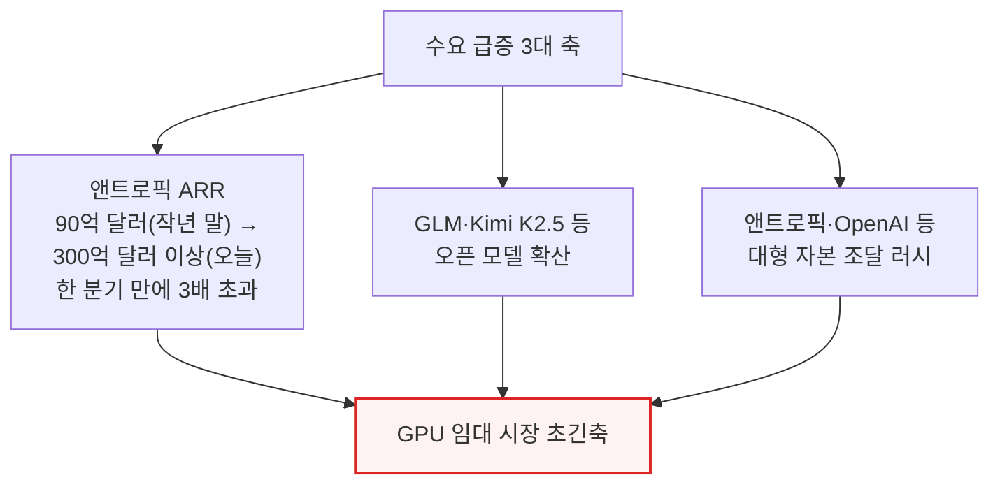

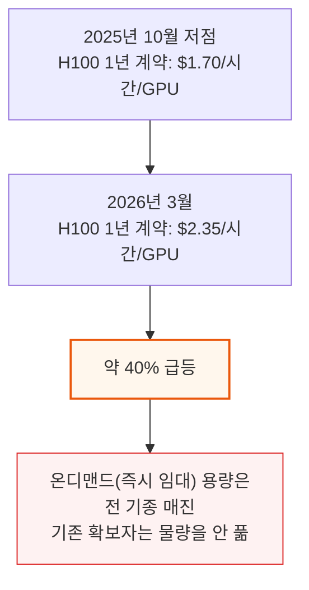

📌 **용어 풀이: GPU 임대 가격 지수**
> - SemiAnalysis는 2023년부터 100곳 이상의 시장 참여자(네오클라우드 사업자, 컴퓨트 매수·매도자)를 매달 설문 조사해 3개월\~5년 만기 구간별 가격 범위(25\~75백분위)를 산출하고, 실제 거래 데이터와 자체 중개 거래로 검증해 왔음
> - 오늘 공개하는 것은 이 지수 중 H100 1년 계약 구간만 떼어 무료로 공개한 것 — 나머지 기종·구간(H200·B200·B300·GB200·GB300, AMD MI300·MI325·MI355 포함)은 SemiAnalysis AI Cloud TCO 모델 기관 구독자만 열람 가능

---

## 2. 서지 프라이싱, GPU 임대 시장에 상륙하다

**📌 핵심:**
- H100 1년 가격 그래프만으로는 실제 체감을 다 담지 못함 — AWS의 p6-b200 스팟(남는 용량만 저렴하게 빌리는 방식) 인스턴스는 시간당 GPU 1대에 14달러까지 치솟았고, 일부 네오클라우드 대형사는 아예 단일 노드 단위 판매를 중단
- H100·H200 8노드(GPU 64장)조차 구하기 어려움 — 문의한 사업자 절반이 완전 매진 상태였고, 계약이 끝나 시장에 풀리는 물량조차 "전혀 없다"는 답변이 대부분
- 계약이 끝난 H100은 2\~3년 전과 똑같은 단가로 갱신되고 있고, 일부는 2028년까지 이어지는 4년 계약으로 재계약 — 컴퓨트를 빌린 곳이 클러스터를 통째로 다시 쪼개 재임대하는("서브렛") 사례까지 등장
- 블랙웰(신형 GPU) 신규 배치 소요 시간도 6\~7월까지 밀리는 중이며, 2026년 8\~9월까지 나올 신규 용량은 이미 전량 예약 완료
- 결론: 오픈 모델 확산과 추론 수요 급증이 겹치며 H100 같은 구형 GPU조차 품귀 — 노후 자산의 수명이 예상보다 훨씬 길어지고 있음

---

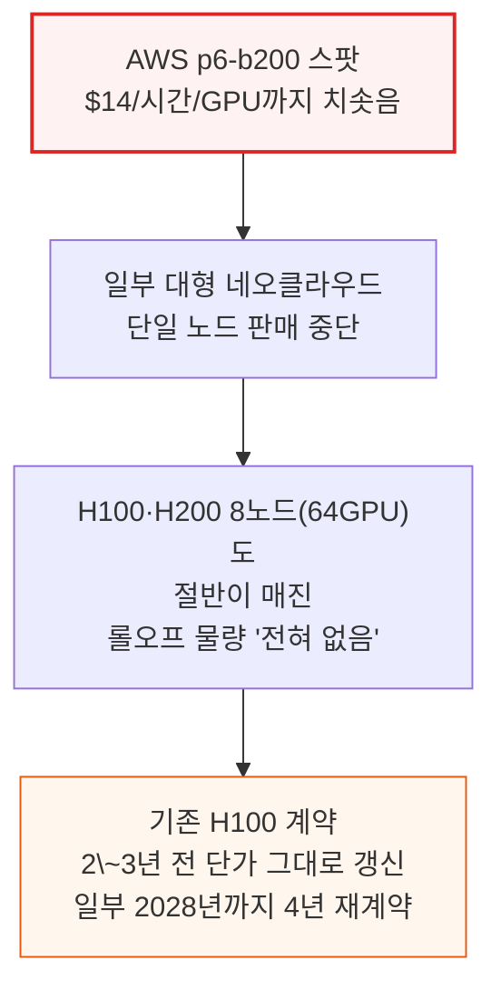

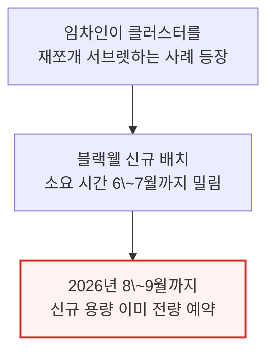

---

## 3. GPU 임대료의 컴백 - 어쩌다 여기까지 왔나

**📌 핵심:**
- 불과 6개월 전만 해도 시장은 블랙웰 배치가 늘면 원가가 훨씬 싼 블랙웰이 H100·H200(호퍼 세대) 가격을 끌어내릴 것으로 봤고, GPU 자산의 6년 감가상각 가정에 회의적이었음 — 실제로는 2025년 말 정반대로 H100 수요가 오히려 강해짐
- 2026년 1월 메모리 가격이 결정타 — LPDDR5는 전년 대비 약 4배, DDR5는 약 5배까지 치솟자(SemiAnalysis 메모리 모델 기준), 서버 제조사(OEM)들이 부품 원가 상승분보다 훨씬 큰 폭으로 서버 가격을 올려 마진 리스크를 회피 — 이 때문에 일부 사업자가 클러스터 구축을 늦추거나 포기하며 임대 시장 공급이 더 줄어듦
- 1\~2월 남은 여유 용량이 소진되며 3월엔 사실상 모든 H100·H200·B200 물량이 구할 수 없는 상태 — 1년 계약 가격은 1월 말 시간당 2달러를 돌파, 2월 중순\~말 15\~20% 추가 급등, 3월 말까지 다시 15\~20% 오를 전망
- 네이티브 미디어 생성(시댄스·나노 바나나 등 이미지·영상 생성)과 다단계 워크플로우를 계속 반복 실행하는 멀티에이전트 작업이 수요를 폭발적으로 키움 — SemiAnalysis 자체도 지난 7일간 수십억 토큰(평균 100만 토큰당 약 5달러)을 소비했고, 클로드 코드는 2026년 말까지 전 세계 일일 코드 커밋의 20% 이상을 차지할 것으로 전망
- 결론: AI 도구 투자수익률이 5\~10배로 확인된 이상, 수요 곡선 자체가 오른쪽·위쪽으로 이동 — 가격이 웬만큼 올라도 수요가 꺾이지 않는 국면

---

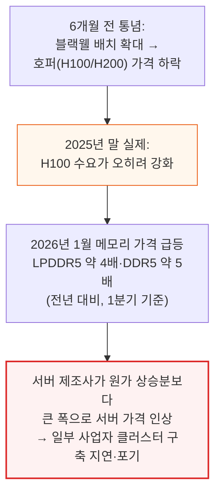

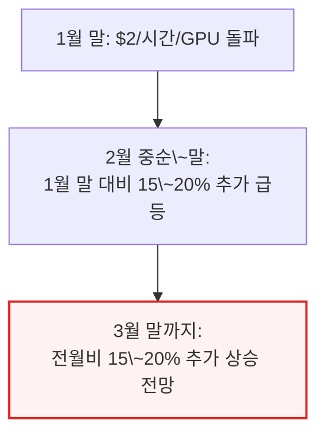

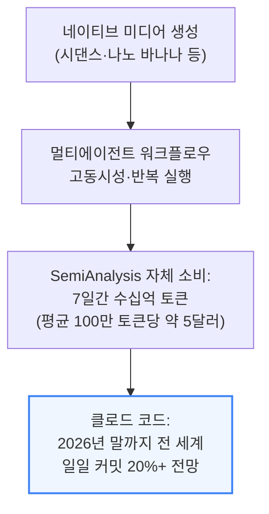

---

## 4. SemiAnalysis H100 1년 임대 가격 지수를 공개하다

**📌 핵심:**
- 오늘부터 SemiAnalysis H100 1년 임대 계약 가격 지수를 무료로 공개 — 100곳 이상의 시장 참여자(네오클라우드, 컴퓨트 매수·매도자)를 매달 설문해 25\~75백분위 가격 범위를 산출하고, 실제 거래 데이터와 자체 중개 거래로 검증
- 다른 지수와 차별화되는 이유는 세 가지: ① 대부분의 GPU 임대는 최소 6개월 이상 장기 계약으로 비공개 협상되는데, 이 지수는 그중에서도 거래량이 가장 많은 1년 구간을 정조준함 ② 하이퍼스케일러·네오클라우드가 공개 게시하는 가격이 실제 체결가와 다를 수 있고 갱신도 늦어 시장 흐름을 뒤늦게 반영하는 반면, 이 지수는 실제 협상가를 담음 ③ 대량 거래 데이터를 처리하는 다른 지수와 달리, 시장 참여자와의 직접 대화에서 나온 정성적 맥락(가격 이면의 사연)까지 함께 전달
- 온디맨드(즉시 임대) 시장은 이와 다르게 작동 — 사업자가 가격을 고정해두고 가동률이 너무 낮으면 가격을 내리고, 가동률이 꽉 차면 가격을 올리는 방식이라 가격보다 가동률이 수요를 더 잘 보여주는 선행 지표
- 결론: 지수 공개와 함께 SemiAnalysis 토크노믹스 대시보드도 기관 구독자 대상으로 출시 — 코딩·추론·수학·에이전틱 평가를 벤치마킹하고 주요 AI 모델의 토큰량·매출·기업가치·고객 수 공시를 한눈에 비교

---

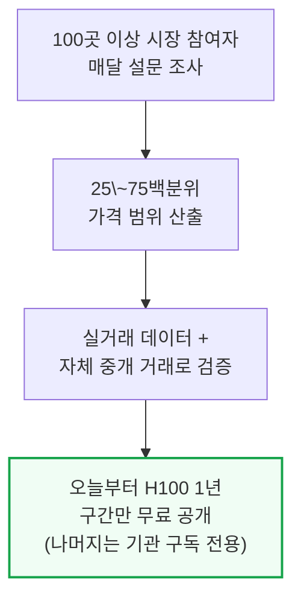

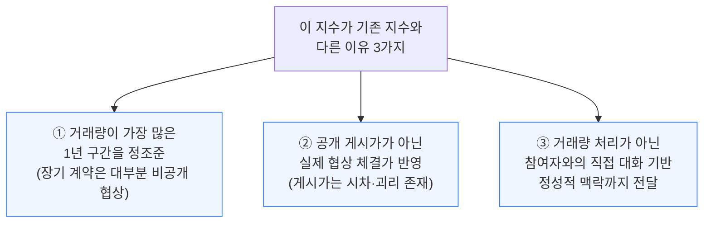

---

## 5. 오늘의 GPU 임대 시장 구조 - 세 개의 계약 구간

**📌 핵심:**
- 2025년 말 이전에는 사업자의 GPU 재고가 훨씬 넉넉하고 최종 수요는 이제 막 커지던 시기라 여러 네오클라우드가 경쟁적으로 가격을 낮췄음 — 다음 세대 GPU가 나오기 전에 최대한 가동률을 채워야 한다는 압박이 있었기 때문
- 지금은 정반대 — 네오클라우드·하이퍼스케일러가 협상 주도권을 쥐고 더 높은 선지급금, 더 유리한 단가, 더 긴 계약 기간을 요구할 수 있고, 계약 시작·종료일도 자기 재고 사정에 맞춰 고를 수 있음 — 시간도 이들 편이라 서두르지 않고 최적의 고객 조합을 짤 수 있음
- GPU 임대 시장은 만기·고객군이 서로 다른 세 구간으로 나뉨: ① 단기(온디맨드·스팟·3개월 미만) ② 중기(3개월\~3년 이상 계약) ③ 장기 오프테이크(4\~5년, 그중 5년이 가장 흔함)
- 결론: 세 구간은 서로 다른 고객층을 상대하고 협상력의 무게중심도 달라, 임대료 향방을 진단하려면 구간별로 따로 봐야 함

---

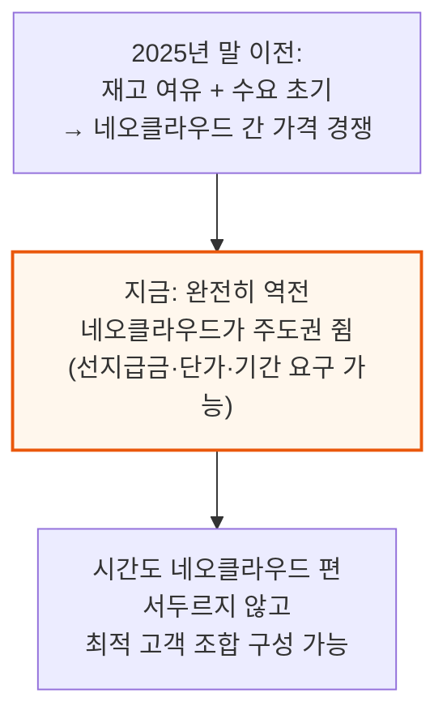

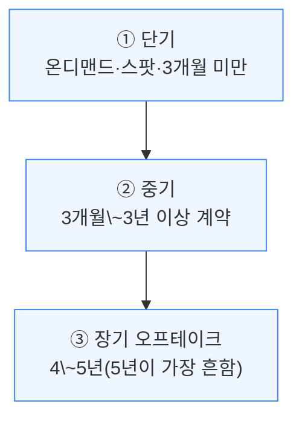

---

## 6. 단기 임대 - 온디맨드·스팟·3개월 미만 계약

**📌 핵심:**
- 단기 임대는 계약 구조상 맨 앞단에 위치하며, 대부분 남는 잔여 용량으로 채워짐 — 다만 런팟·람다처럼 유연한 온디맨드·스팟 용량 자체를 주력 사업으로 성공시킨 사업자도 있음
- 온디맨드 가격은 다른 임대 시장과 작동 방식이 전혀 다름 — 사업자가 가격을 고정해두고 아주 드물게만 조정: 가동률이 낮으면 가격을 내려 수요를 끌어오고, 가동률이 이미 꽉 찼으면 그 수준에서도 수요가 유지될 거라 판단해 가격을 올림
- 그 결과 사업자가 게시하는 온디맨드 가격 시계열은 오랫동안 평평하다가 어느 순간 계단식으로 위아래 점프하는 패턴을 보임 — 이 시장에서는 가격이 아니라 가동률이 수요를 보여주는 고빈도 지표
- 결론: 온디맨드 시장을 볼 때는 가격 변동 자체보다 가동률 추이를 봐야 진짜 수요 신호를 읽을 수 있음

---

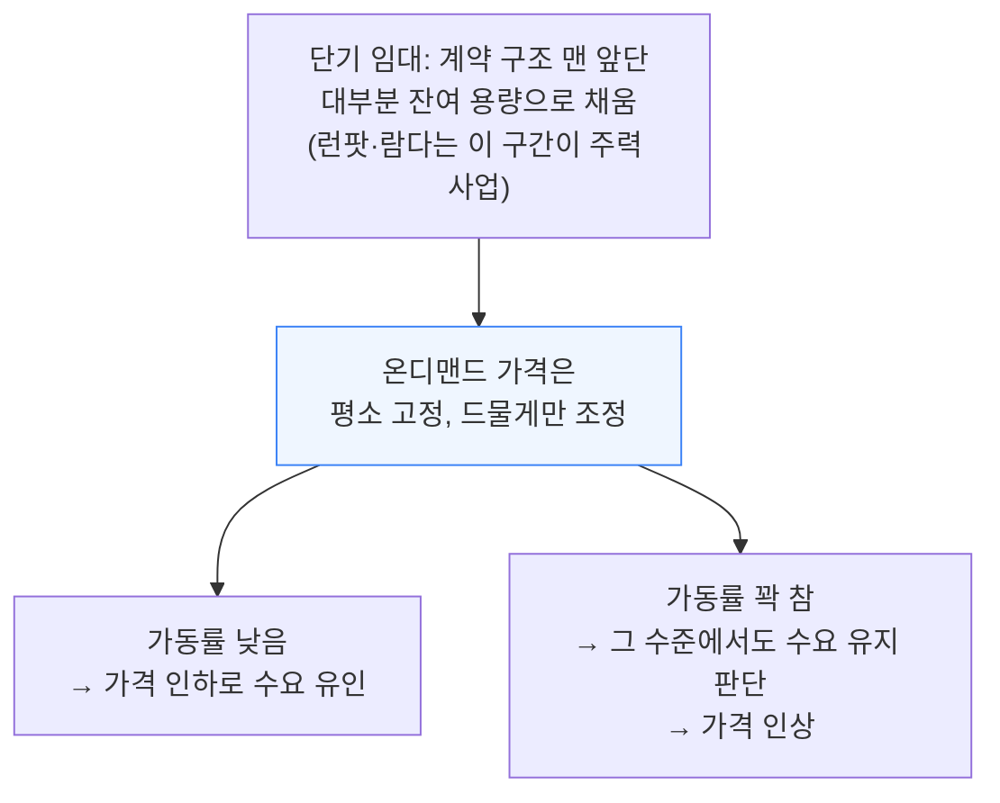

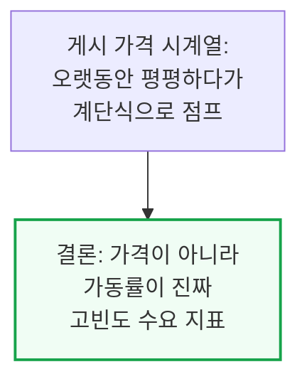

---

*작성 진행률: 약 60% 완료*
*업데이트: 4\~6장(지수 소개·시장 구조·단기 임대) 작성 완료*
