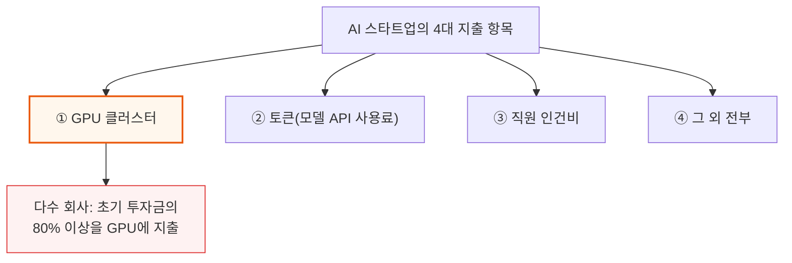
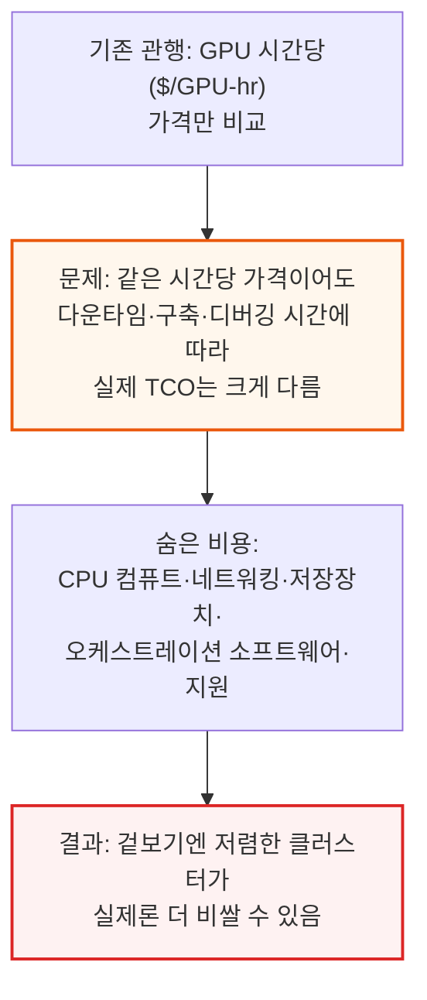
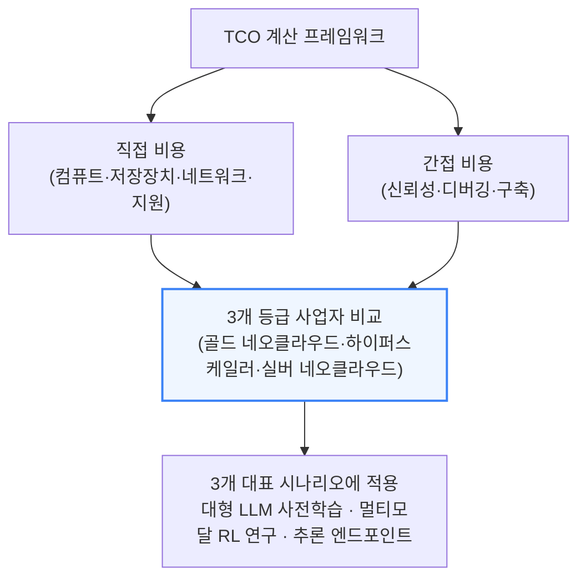
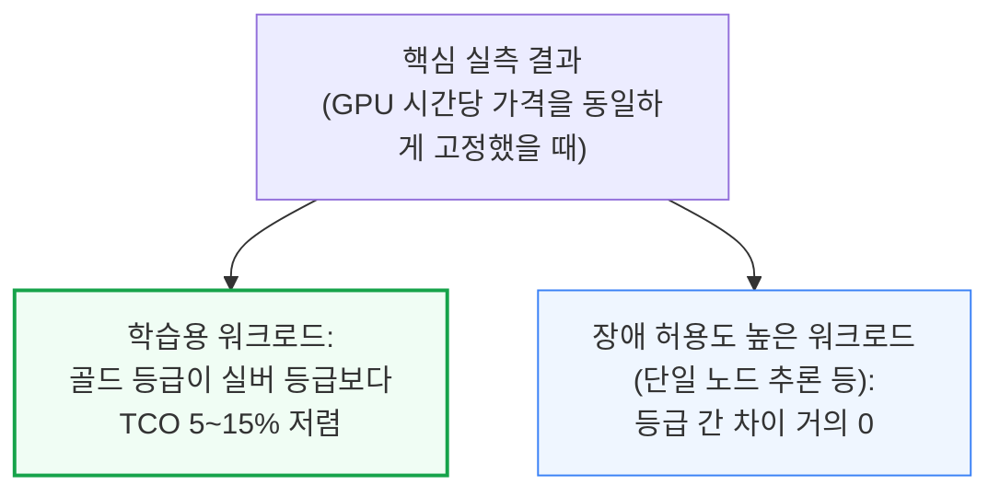
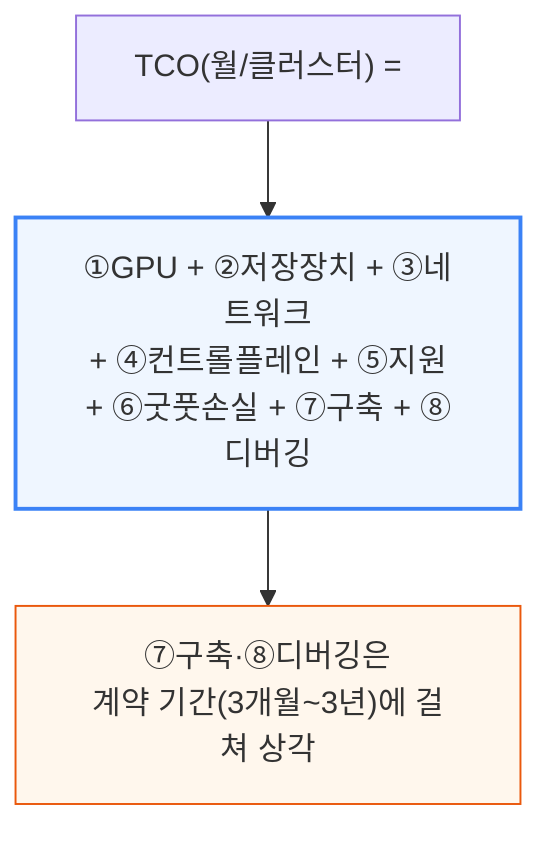
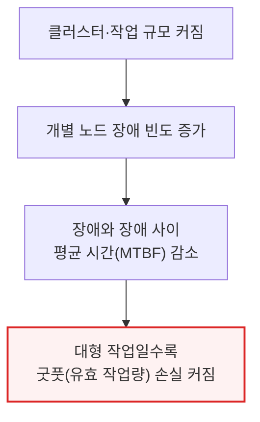
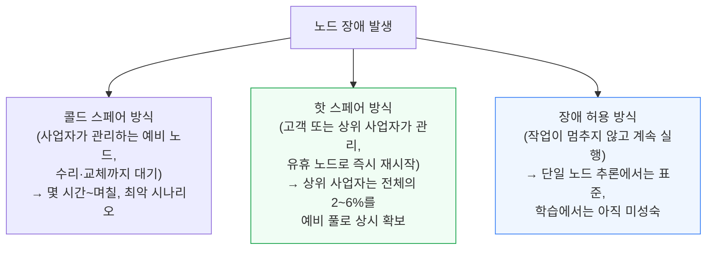
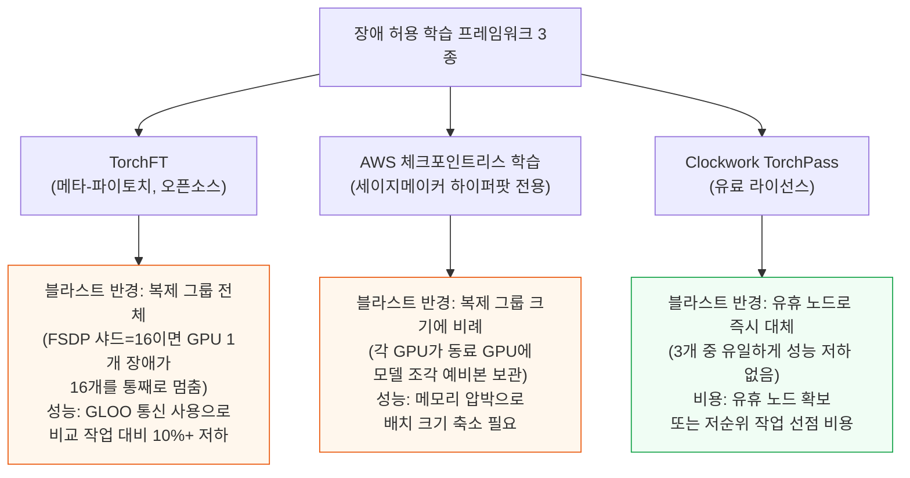

# How Much Do GPU Clusters Really Cost?

> **출처**: [SemiAnalysis Newsletter](https://newsletter.semianalysis.com/p/how-much-do-gpu-clusters-really-cost)
> **저자**: Jordan Nanos, Bryan Shan, Cheang Kang Wen
> **발행일**: 2026-04-20

---

## 📑 목차

### 전체 섹션
 1. [서론 - GPU 클러스터 비용을 다시 생각한다](#1-서론---gpu-클러스터-비용을-다시-생각한다)
 2. [TCO(총소유비용)를 구성하는 8가지 항목](#2-tco총소유비용를-구성하는-8가지-항목)
 3. [굿풋(Goodput) 이론과 장애 대응 프레임워크 3종](#3-굿풋goodput-이론과-장애-대응-프레임워크-3종)
 4. [3개 등급 클라우드 사업자 비교](#4-3개-등급-클라우드-사업자-비교)
 5. [시나리오 1 - 대형 LLM 사전학습](#5-시나리오-1---대형-llm-사전학습)
 6. [시나리오 2 - 멀티모달 강화학습(RL) 연구](#6-시나리오-2---멀티모달-강화학습rl-연구)
 7. [시나리오 3 - 추론 엔드포인트](#7-시나리오-3---추론-엔드포인트)
 8. [결론과 한계, 향후 연구 방향](#8-결론과-한계-향후-연구-방향)
 9. [ClusterMAX 2.1 업데이트 - 신규 사업자 평가](#9-clustermax-21-업데이트---신규-사업자-평가)
10. [굿풋 비용이 마진에 미치는 영향 - 추론 사업자 민감도 분석](#10-굿풋-비용이-마진에-미치는-영향---추론-사업자-민감도-분석)

---

## 🔑 용어 정리

본문을 순서대로 읽기 전에 알아두면 좋은 용어들입니다. 자세한 수치와 설명은 본문에서 처음 등장하는 위치에 나옵니다.

- **TCO (Total Cost of Ownership, 총소유비용)**: GPU 시간당 임대료만이 아니라 저장장치·네트워크·지원·장애 손실·구축 인건비까지 다 더한 "실제로 드는 전체 비용" — 이 글 전체의 핵심 틀
- **굿풋 (Goodput)**: 처리량(throughput) 중에서 실제로 쓸모 있는 작업만 걸러낸 값 — GPU가 돌아가고 있어도 장애·재시작으로 낭비되는 시간은 굿풋에 포함되지 않음
- **네오클라우드 (Neocloud)**: 아마존웹서비스·구글 같은 종합 클라우드가 아니라 GPU 임대만 전문으로 하는 신생 클라우드 사업자 — 이 글에서는 골드 등급·실버 등급으로 나눠 비교
- **클라우드 등급 (Gold-tier / Hyperscaler / Silver-tier)**: SemiAnalysis가 80곳 넘는 GPU 클라우드를 실사해 매긴 품질 등급 — 골드는 최상위 네오클라우드, 하이퍼스케일러는 아마존웹서비스·마이크로소프트 등 종합 클라우드, 실버는 중하위 네오클라우드
- **MTBF·MTTR**: MTBF(Mean Time Between Failures)는 장애와 장애 사이 평균 시간(클수록 안정적), MTTR(Mean Time To Repair, 이 글에서는 t_repair)은 고장난 노드를 고치거나 교체하는 데 걸리는 평균 시간
- **블라스트 반경 (Blast Radius)**: 노드 하나가 고장 났을 때 그 여파로 함께 멈추는 GPU 범위 — 8개짜리 서버 한 대일 수도, 72개짜리 랙 전체일 수도 있음
- **체크포인트 재시작 vs 장애 허용 학습**: 체크포인트 재시작은 장애 발생 시 마지막 저장 시점부터 처음부터 다시 시작하는 전통적 방식, 장애 허용 학습(Fault-Tolerant Training)은 일부 노드가 죽어도 나머지가 멈추지 않고 계속 도는 최신 방식
- **ClusterMAX**: SemiAnalysis가 GPU 클라우드 사업자를 실사해 등급을 매기는 자체 평가 시스템 — 이 글의 3개 등급 분류와 9번 섹션의 신규 사업자 평가가 이 시스템의 결과물

---

## 1. 서론 - GPU 클러스터 비용을 다시 생각한다

**📌 핵심:**
- 블랙웰 GPU 1개 가격은 평균 승용차 1대보다 비싸고 전력 소비는 가정집 1채보다 많음 — 유니콘 스타트업이 이런 GPU 수천 개를 24시간 돌리는 게 흔한 일이 됨
- 상당수 파운데이션 모델(대형 AI 모델) 회사는 직원 인건비보다 GPU에 자릿수 하나 더 많은 돈을 씀 — 초기 투자금의 80% 이상을 GPU에 쓰는 회사도 다수 확인됨
- 기존 관행은 GPU 시간당 임대료만 비교하는 것인데, 같은 시간당 가격이라도 다운타임(장애로 멈춘 시간)·구축 인건비·디버깅 시간에 따라 실제 총비용(TCO)이 크게 달라짐 — 저렴해 보이는 클러스터가 실제론 더 비쌀 수 있음
- 결론: SemiAnalysis는 GPU 외 저장장치·네트워크·지원 같은 직접 비용과 신뢰성·디버깅·구축 같은 간접 비용까지 합친 TCO 계산법을 제시하고, 실측 결과 학습용 클러스터에서는 골드 등급이 실버 등급보다 5\~15% 더 저렴함을 확인

---

블랙웰(Blackwell) GPU 1개는 평균 승용차 1대보다 비싸고, 사용 전력은 가정집 1채보다 많습니다. 이런 GPU를 수천 개씩 밤낮으로 돌리는 유니콘 스타트업이 이제 흔합니다.

### GPU 시간당 가격만 보면 안 되는 이유

SemiAnalysis의 ClusterMAX 연구가 출발하는 전제는, GPU 클라우드 사업자마다 클러스터 품질 차이가 크고 이 차이가 사용자 경험·생산성·TCO에 실질적 영향을 준다는 것입니다. 이런 차이는 하드웨어 스펙표나 1회성 벤치마크에는 드러나지 않고, 신뢰성·네트워크 동작·저장장치 성능·지원 품질이 결국 "연구 목표까지 걸리는 시간"이라는 유일하게 중요한 지표를 좌우합니다.

### 이 글의 방법론

이 계산은 SemiAnalysis가 무료로 공개한 [GPU 클러스터 TCO 계산기](https://www.clustermax.ai/tco)와 굿풋(Goodput) 계산기를 통해 누구나 직접 값을 넣어 재현할 수 있습니다. 근거 데이터는 GPU 임대 가격 데이터 시리즈, 80개 넘는 네오클라우드 실사 경험, ClusterMAX 1.0\~3.0 연구 과정에서 진행한 고객 150명 이상 인터뷰입니다.

즉 사용자들이 막연히 느껴온 "장애 허용성이 좋으면 이득"이라는 직관에 실제 달러 값을 붙인 것이 이 글의 목표입니다.

---

## 2. TCO(총소유비용)를 구성하는 8가지 항목

**📌 핵심:**
- SemiAnalysis는 GPU 클러스터의 월간 총비용(TCO)을 GPU·저장장치·네트워크·컨트롤 플레인·지원·굿풋(장애 손실)·구축·디버깅 8개 항목의 합으로 정의
- GPU 항목 하나만 봐도 계약 기간·물량 할인, 예비(스팟) 인스턴스 사용, 오케스트레이션 프리미엄(예: 아마존웹서비스에서 세이지메이커 하이퍼팟 슬럼을 쓰면 일반 EC2보다 비싼 것)까지 감안해야 진짜 시간당 단가가 나옴
- 구축·디버깅 비용은 계약 기간에 나눠(상각) 계산 — 3년 쓸 클러스터에 몇 주 들여 구축하는 건 괜찮지만, 3개월 쓸 클러스터에 같은 시간을 들이면 큰 부담
- 결론: 8개 항목 중 어느 하나라도 빠뜨리면 두 클라우드의 GPU 시간당 가격이 같아도 실제 TCO는 크게 벌어질 수 있음

---

| 항목 | 단위 | 무엇을 재는가 |
|---|---|---|
| ① GPU | \$/GPU-hr | 목록가에 계약기간·물량 할인, 스팟 사용, 오케스트레이션 프리미엄을 반영한 실제 시간당 단가 |
| ② 저장장치 | \$/GB-월 | 고성능("핫") NVMe 병렬 파일시스템부터 "웜"·"콜드" 저장까지, API 호출·데이터 반출(egress) 비용 포함 |
| ③ 네트워킹 | \$/hr 또는 \$/GB-월 | 외부 접속용(프론트엔드) 네트워크 — 공인 IP·방화벽·로드밸런서·데이터 반출·전송료 |
| ④ 컨트롤 플레인 | \$/hr | 클러스터 관리용 노드(로그인·개발·작업 제출) 및 데이터 처리·RL 롤아웃용 CPU 노드 |
| ⑤ 지원 | % 할증 | 전체 청구액에 붙는 지원 등급별 할증(예: 아마존웹서비스는 월 지출이 늘수록 10%→3%로 체감) |
| ⑥ 굿풋 손실 | % 할증 | 다운타임·재시작으로 인한 암묵적 손실(3번 섹션에서 상세) |
| ⑦ 구축 | \$/hr | 엔지니어가 클러스터를 세팅하고 성능을 튜닝하는 비용, 계약 기간에 상각 |
| ⑧ 디버깅 | \$/hr | 엔지니어가 지속적으로 문제를 진단·해결하는 비용 + 실패한 작업에 낭비된 클러스터 시간 |

📌 용어 풀이: 오케스트레이션 프리미엄이란
> - 같은 GPU 서버라도 쿠버네티스(Kubernetes)나 슬럼(Slurm) 같은 오케스트레이션(작업 관리) 소프트웨어를 통해 빌리면 기본 인스턴스보다 비싸지는 경우가 있음
> - 예: 아마존웹서비스에서 세이지메이커 하이퍼팟 슬럼(SageMaker HyperPod Slurm)으로 빌리면 같은 GPU 머신인데도 일반 EC2 인스턴스보다 비싼 요금이 매겨짐

저장장치 비율 가정은 고객 설문을 바탕으로 GPU당 2TB(적게 쓰는 경우)부터 25TB(많이 쓰는 경우)까지 폭넓게 잡습니다. 예를 들어 아마존웹서비스의 FSx for Lustre는 처리량 등급이 4단계(초당 GB당 125MB/s부터 1,000MB/s까지)로 나뉘고, 목록가 기준 처리량이 4배 좋아지면 가격은 약 3배 비싸집니다.

이 상각 방식 때문에 3년 쓸 클러스터에 몇 주를 들여 구축하는 건 큰 문제가 아니지만, 3개월만 쓸 클러스터에 똑같은 구축 시간을 들이면 비용 부담이 훨씬 커집니다.

---

## 3. 굿풋(Goodput) 이론과 장애 대응 프레임워크 3종

**📌 핵심:**
- 굿풋은 처리량(throughput) 중 실제로 쓸모 있는 작업만 걸러낸 값 — GPU가 버스에서 이탈하거나 NCCL(GPU 간 통신 라이브러리)이 멈추거나 체크포인트 저장 직전 메모리 부족(OOM)이 나면 "돌아가고 있어도 나쁜 처리량"
- 클러스터가 클수록, 작업이 클수록 개별 장애의 타격이 커짐 — 클러스터의 80%를 쓰는 작업이 재시작(10\~15분 소요)하면 그 시간 전부 + 마지막 체크포인트 이후 계산이 통째로 날아감
- 장애 대응 방식은 두 갈래: ① 체크포인트 재시작(중소 규모 클러스터에서 여전히 가장 흔함) ② 장애 허용 학습 프레임워크(TorchFT·AWS 체크포인트리스·TorchPass) — 프레임워크마다 블라스트 반경(장애 여파 범위)과 성능 손실의 트레이드오프가 다름
- 결론: 프레임워크가 늘었어도 진짜 어려움은 그대로 남아 — 1,000개 이상 GPU 규모에서는 사업자에게만 기대지 않고 학습 코드 자체를 장애 현실에 맞게 설계해야 함

---

좋은 사업자의 조건은 명확합니다 — ① 깨끗한 데이터센터를 노련한 운영팀이 관리하고 ② 장애를 빠르게 식별(가능하면 사전 예측)하며 ③ 예비 노드 풀과 물량 보장으로 빠르게 복구하는 곳입니다.

### 굿풋 손실을 계산하는 3가지 시나리오

세 시나리오 모두 장애 식별 시간(t_id), 체크포인트 주기(t_chkpt), 학습 재시작 시간(t_init), 노드 수리·교체 시간(t_repair, MTTR), 블라스트 반경(b_radius, 예: 8기 서버 단위 또는 NVL72의 64기 단위), 장애 빈도(MTBF)를 입력값으로 씁니다.

### 장애 허용(Fault-Tolerant) 학습 프레임워크 3종 비교

📌 용어 풀이: TorchFT는 실제로 어떻게 복구하나
> - 복제 그룹(레플리카 그룹) 하나가 죽으면 노드가 교체될 때까지 그 그룹의 GPU 전체가 놀게 됨
> - 살아남은 그룹이 모델·옵티마이저 상태 전체를 `state_dict()`로 직렬화해 HTTP로 전달하면, 복구된 그룹이 `load_state_dict()`로 받아 스텝 카운터를 맞추고 대열(쿼럼)에 재합류 — 이 과정을 TorchFT의 "라이트하우스(lighthouse)" 서버가 지휘
> - 모든 장애가 GPU가 완전히 죽는 형태는 아니고, 통신이 멈춘 채 걸려있는 "행(hang)" 상태도 흔함 — 이런 경우 굿풋 손실에는 수리 시간뿐 아니라 원인을 찾아 풀어내는 시간까지 포함됨

📌 용어 풀이: AWS 체크포인트리스 학습의 트레이드오프
> - 2025년 12월 도입된 AWS 세이지메이커 하이퍼팟 전용 기능으로, 노바(Nova) 모델 학습에 쓰던 내부 기술을 GPU 1,000개 이상 규모에서 검증
> - 각 GPU가 동료 GPU에 자기 모델 조각의 예비본을 들고 있다가 장애 시 EFA(아마존의 고속 네트워크)를 통해 즉시 복구 — AWS는 복구 시간 1분 45초(체크포인트 재시작은 15분)를 주장, SemiAnalysis 실측도 이를 확인
> - 대가는 메모리 압박 — 예비본 하나를 추가할 때마다 GPU 메모리 사용량이 체크포인트 1개 분량만큼 늘어 배치 크기를 줄이거나 병렬화 전략을 바꿔야 함

TorchPass는 스케줄러 단(플러그인 형태)에서 동작해 훈련 스크립트 코드를 몇 줄만 바꾸면 됩니다. SemiAnalysis가 GKE(구글 쿠버네티스 엔진) 8노드 클러스터에서 계획된 유지보수(펌웨어 업그레이드 등)와 예상치 못한 하드웨어 장애 모두에 대해 테스트한 결과, 재시작 시간과 작업 성능이 장애 허용 기능이 없는 기준선과 비슷했습니다.

여전히 어려움은 남아 있습니다. TorchFT는 유일한 오픈소스 옵션이지만 학습용으로 널리 쓰이진 않고, 세 프레임워크 모두 통신 오버헤드·메모리 오버헤드·유휴 노드 비용이라는 트레이드오프를 안고 있어 대형 연구소이거나 라이선스 비용을 감당할 수 있는 회사의 전유물에 가깝습니다. 반면 단일 8기 시스템 단위 추론에서는 장애 허용이 이미 표준이고, NVIDIA Dynamo 같은 프레임워크가 KV 캐시 오프로딩 단계까지 이 개념을 확장하고 있습니다.

---

*작성 진행률: 약 35% 완료 (1~3번 섹션)*
*업데이트: 서론, TCO 8개 구성요소, 굿풋 이론과 장애 대응 프레임워크 3종 작성 완료*
