# AI Value Capture - The Shift To Model Labs

> **출처**: [SemiAnalysis Newsletter](https://newsletter.semianalysis.com/p/ai-value-capture-the-shift-to-model)
> **저자**: Daniel Nishball, Dylan Patel, Cheang Kang Wen
> **발행일**: 2026-05-01

---

## 📑 목차

### 전체 섹션
 1. [서론: AI가 만든 가치는 이제 누구 주머니로 들어가나](#1-서론-ai가-만든-가치는-이제-누구-주머니로-들어가나)
 2. [AI 가치 이익 풀 - 인프라에서 모델 랩으로](#2-ai-가치-이익-풀---인프라에서-모델-랩으로)
 3. [에이전틱 AI가 게임의 판도를 바꾸다](#3-에이전틱-ai가-게임의-판도를-바꾸다)
 4. [토큰 생산 비용은 계속 낮아지고 있다](#4-토큰-생산-비용은-계속-낮아지고-있다)
 5. [모델 제공사 마진은 앞으로도 계속 오른다](#5-모델-제공사-마진은-앞으로도-계속-오른다)
 6. [모델 제공사 이익이 경쟁으로 사라지지 않는 이유](#6-모델-제공사-이익이-경쟁으로-사라지지-않는-이유)
 7. [에이전틱 AI는 시장을 강타했는데 TSMC와 Nvidia는 꿈쩍 않는다](#7-에이전틱-ai는-시장을-강타했는데-tsmc와-nvidia는-꿈쩍-않는다)
 8. [SOCAMM 가격 - Nvidia의 다음 마진 레버](#8-socamm-가격---nvidia의-다음-마진-레버)
 9. [GB300에서 VR NVL72로 - 와트당 자본지출 트렌드](#9-gb300에서-vr-nvl72로---와트당-자본지출-트렌드)
10. [네트워킹 - 가격 차별의 또 다른 수단](#10-네트워킹---가격-차별의-또-다른-수단)
11. [Nvidia, AI의 중앙은행이 되다](#11-nvidia-ai의-중앙은행이-되다)
12. [TSMC, 세상에서 가장 공정한 회사](#12-tsmc-세상에서-가장-공정한-회사)
13. [VR NVL72 임대가격 삼각측량 - 원가 기반 vs 가치 기반](#13-vr-nvl72-임대가격-삼각측량---원가-기반-vs-가치-기반)
14. [모든 것을 지배하는 하나의 차트](#14-모든-것을-지배하는-하나의-차트)
15. [VR NVL72 vs GB300 - TCO당 성능 비교](#15-vr-nvl72-vs-gb300---tco당-성능-비교)
16. [컴퓨트 경쟁 구도와 최종 결론](#16-컴퓨트-경쟁-구도와-최종-결론)

---

## 🔑 용어 정리

본문을 순서대로 읽기 전에 알아두면 좋은 용어들입니다. 자세한 수치와 설명은 본문에서 처음 등장하는 위치에 나옵니다.

- **TCO (Total Cost of Ownership, 총소유비용)**: GPU를 사는 값뿐 아니라 전기료·냉각·운영까지 합쳐 실제로 드는 총비용
- **SOCAMM (System-On-Chip Attached Memory Module)**: Nvidia의 랙형 시스템에 소켓으로 꽂는 메모리 모듈 — 보드에 납땜된 메모리와 달리 컴퓨트와 별도로 가격을 매길 수 있음
- **IRR (Internal Rate of Return, 내부수익률)**: 투자한 돈 대비 연간 몇 %의 수익이 나오는지 나타내는 지표 — Neocloud가 GPU 임대 사업을 벌일지 말지 정하는 기준선
- **원가 기반 가격 vs 가치 기반 가격**: 비용에 일정 마진만 얹어 가격을 매기는 방식(원가 기반) vs 고객이 그 상품으로 얻는 경제적 가치만큼 가격을 매기는 방식(가치 기반)
- **PFLOP (Peta FLOPS, 초당 부동소수점 연산)**: GPU의 연산 능력을 나타내는 단위 — 클수록 같은 시간에 더 많은 계산을 처리
- **Neocloud**: 아마존·구글 같은 하이퍼스케일러가 아니라, GPU를 빌려주는 것을 전문으로 하는 신생 클라우드 업체
- **ASP (Average Selling Price, 평균판매가격)**: 토큰이나 제품 하나당 평균적으로 받는 판매 가격

---

## 1. 서론: AI가 만든 가치는 이제 누구 주머니로 들어가나

**📌 핵심:**
- 앤트로픽 연환산매출(ARR)이 1년 만에 90억 달러 → 440억 달러 이상으로 증가, 추론 인프라 매출총이익률도 38%→70%대로 상승
- 작년까지 AI가 만든 가치는 전력·메모리 등 인프라 업체가 대부분 가져갔는데, 지금은 모델 랩(앤트로픽 등)이 거의 전부 가져가는 구조로 뒤집힘
- 반면 TSMC와 Nvidia는 이 가치 폭발기에도 가격을 거의 올리지 않음 — 두 회사가 왜 "값을 안 올리는 실수"를 하고 있는지가 이 리포트의 핵심 질문
- 결론: 이 리포트는 AI가 만든 가치가 최종 사용자 → 모델 랩 → 추론 제공사 → Neocloud → 하드웨어 공급사까지 어떻게 흘러가는지 추적하고, Nvidia·TSMC가 앞으로 가격을 올릴 수밖에 없는 이유를 "임대가격 하나의 차트"로 정리한다

---

### AI 산업의 시간 압축

AI 업계에서 하루는 다른 산업의 1년과 같다는 말이 나올 정도로 모델 출시, 소프트웨어·하드웨어 개선 속도가 빨라지고 있습니다.
지난 몇 달 사이 에이전틱(agentic) AI가 실질적인 변곡점을 지났습니다. 토큰(AI가 생성하는 결과물의 최소 단위) 하나의 가치는 단계적으로 뛰어올랐고, 토큰을 만드는 비용은 소프트웨어·하드웨어 개선으로 급격히 낮아졌습니다.

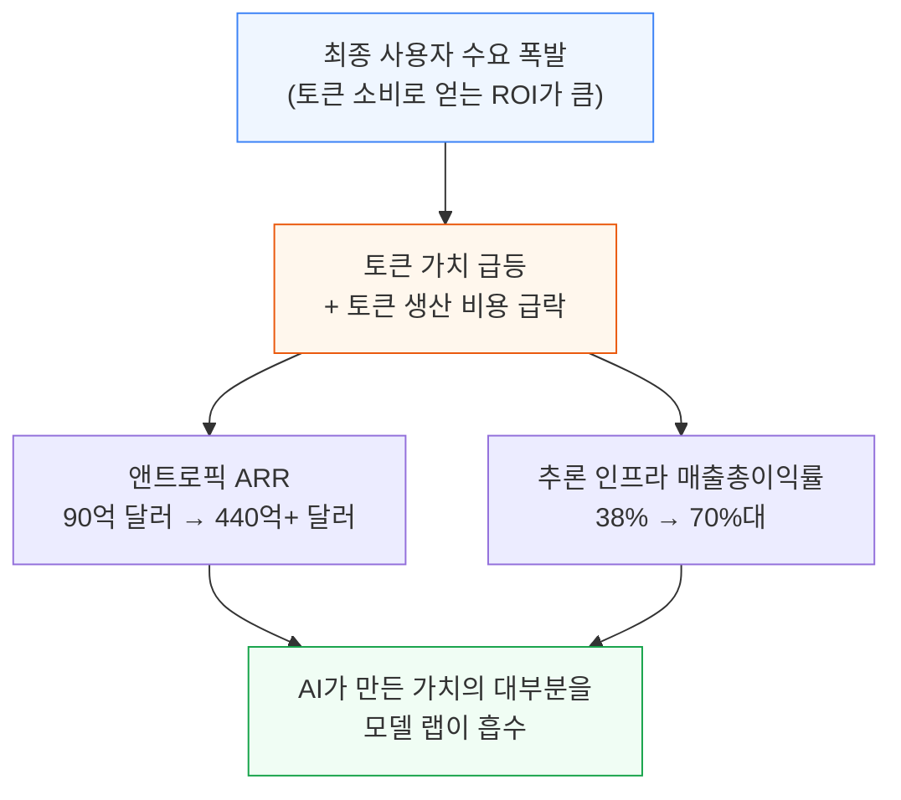
```mermaid
flowchart TD
    A["최종 사용자 수요 폭발<br/>(토큰 소비로 얻는 ROI가 큼)"] --> B["토큰 가치 급등<br/>+ 토큰 생산 비용 급락"]
    B --> C["앤트로픽 ARR<br/>90억 달러 → 440억+ 달러"]
    B --> D["추론 인프라 매출총이익률<br/>38% → 70%대"]
    C --> E["AI가 만든 가치의 대부분을<br/>모델 랩이 흡수"]
    D --> E
    style A fill:#eff6ff,stroke:#3b82f6
    style B fill:#fff7ed,stroke:#ea580c
    style E fill:#f0fdf4,stroke:#16a34a
```

이 수요 증가는 최종 사용자가 토큰 소비로 큰 투자수익(ROI)을 얻고 있기 때문이며, 이 성장은 아직 초기 단계라는 것이 저자들의 판단입니다. 예를 들어 SemiAnalysis 자체도 앤트로픽 Claude 토큰에 연간 최대 1,095만 달러를 쓰지만, 그 토큰이 만들어내는 가치 덕분에 경쟁사를 앞서고 시장점유율을 얻고 있습니다.

**📌 용어 풀이: ROI (Return on Investment, 투자수익률)**
> - **정의**: 투입한 비용 대비 얼마나 이득을 봤는지 나타내는 비율
> - **이 글에서의 의미**: 예전엔 수십 인시(person-hour)에 수천 달러가 들던 작업을, 이제는 토큰 몇 달러어치로 몇 분 만에 끝낼 수 있게 됨 — 이 격차가 AI 수요 폭발의 원동력

새 칩 Blackwell은 1년 전 Hopper 대비 초당 30배 많은 토큰을 생성하고, TPUv7·Trainium3 같은 맞춤형 칩(ASIC)도 비슷한 개선을 보입니다.
Fireworks, Baseten, Fal 같은 추론 제공사들은 매출은 급성장하면서 마진도 함께 넓어지고 있습니다.
메모리 가격도 1년 새 6배 뛰었고, H100 1년 임대 가격은 2025년 10월 저점 대비 40% 상승했습니다. 이 와중에도 TSMC와 Nvidia, 이 가격결정력이 막강한 두 회사만은 거의 움직이지 않았습니다.

이 리포트는 최종 사용자부터 추론 제공사, Neocloud, 하드웨어 공급사까지 AI가 만든 가치가 어디로 쌓이는지 추적합니다.
마지막에는 "모든 것을 지배하는 하나의 차트(One Chart to Rule Them All)"라는 새 프레임워크로 GPU 임대 경제성을 분석해, 최종 사용자·Neocloud·하이퍼스케일러·하드웨어 공급사 중 누가 가장 많은 가치를 가져가는지 밝힙니다.

---

## 2. AI 가치 이익 풀 - 인프라에서 모델 랩으로

**📌 핵심:**
- 2023\~2025년: AI가 만든 가치는 거의 전부 인프라 레이어(전력·메모리·GPU)가 가져감 — Nvidia는 2023년 5월 실적 발표 후 시간외 25% 급등, 2024년 전력주(Vistra +265%, GE Vernova +146%), 2025년 메모리주(샌디스크·웨스턴디지털·시게이트·마이크론 모두 200%+ 상승)
- 같은 기간 모델 개발사·추론 제공사의 매출총이익률은 악명 높게 나빴음 — AI의 실제 쓸모가 "챗봇 뒤에 숨은 살짝 나은 구글 검색" 수준에 그친다는 회의론도 많았음
- 결론: 인프라가 가치를 독점하던 2023\~2025년 구도가, 2026년 들어 모델 랩이 가치를 가져가는 구도로 완전히 뒤집힘

---

### 2023\~2025년: 인프라가 가치를 독점한 3년

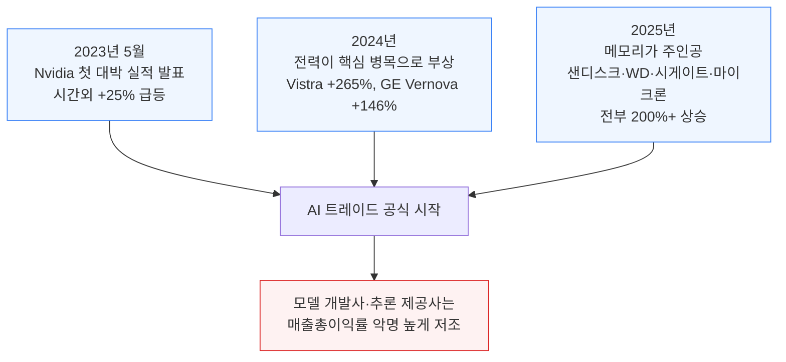
```mermaid
flowchart TD
    A["2023년 5월<br/>Nvidia 첫 대박 실적 발표<br/>시간외 +25% 급등"] --> D["AI 트레이드 공식 시작"]
    B["2024년<br/>전력이 핵심 병목으로 부상<br/>Vistra +265%, GE Vernova +146%"] --> D
    C["2025년<br/>메모리가 주인공<br/>샌디스크·WD·시게이트·마이크론<br/>전부 200%+ 상승"] --> D
    D --> E["모델 개발사·추론 제공사는<br/>매출총이익률 악명 높게 저조"]
    style A fill:#eff6ff,stroke:#3b82f6
    style B fill:#eff6ff,stroke:#3b82f6
    style C fill:#eff6ff,stroke:#3b82f6
    style E fill:#fef2f2,stroke:#dc2626
```

이 3년 동안 대부분의 AI 실제 효용은 "챗봇 인터페이스 뒤에 숨은 살짝 나은 구글 검색"과 "스튜디오 지브리풍 셀카 생성" 수준에 그쳤고, 회의론자들은 AI가 계획된 수조 달러 규모의 초기 투자(capex)를 절대 회수하지 못할 것이라 단언했습니다.

---

## 3. 에이전틱 AI가 게임의 판도를 바꾸다

**📌 핵심:**
- 2025년 12월, 에이전틱(agentic) AI가 "진짜로 작동"하기 시작하면서 세상이 바뀜 — 더 이상 코딩에만 국한되지 않고, 엑셀 모델을 대시보드로 바꾸거나 실적 분석 등 사람이 몇 시간 걸리던 일을 대신 처리
- SemiAnalysis 자체 사례: 직원 1명당 월 50억 토큰 가까이 소비(메타보다 5배 이상 많음), 연환산 토큰 지출이 이미 직원 인건비의 약 30%
- Opus 4.7의 실질 혼합 단가는 표시가 $5/$25(백만 토큰당)임에도 실제로는 $0.99 수준 — 에이전틱 작업은 입력:출력 비율이 300:1로 극단적이고, 캐시 적중률이 90%+라 캐시된 입력 토큰(단가 $0.50/백만 토큰)이 대부분을 차지하기 때문
- 결론: 이 실질 단가 하락에도 불구하고 앤트로픽 ARR은 90억 → 440억+ 달러로 폭증 — 토큰 하나의 경제적 가치가 그만큼 커졌다는 의미

---

### 사람 노동 대비 토큰 비용 비교

SemiAnalysis 내부 워크플로우 실제 사례를 보면, 토큰 비용이 같은 작업을 사람이 했을 때 드는 비용보다 압도적으로 저렴합니다. 예를 들어 몇 시간짜리 재무 모델 작업이 토큰 몇 달러어치로 대체되는 식입니다. 이런 사례가 쌓이면서 전 화이트칼라 업계가 곧 에이전틱 AI를 받아들일 것이라는 게 저자들의 전망입니다.

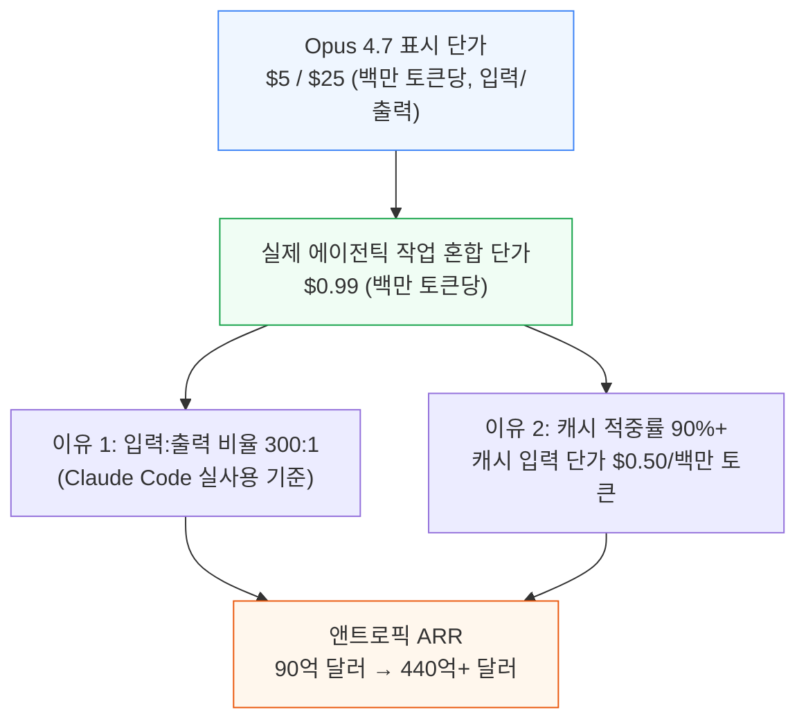
```mermaid
flowchart TD
    A["Opus 4.7 표시 단가<br/>$5 / $25 (백만 토큰당, 입력/출력)"] --> B["실제 에이전틱 작업 혼합 단가<br/>$0.99 (백만 토큰당)"]
    B --> C["이유 1: 입력:출력 비율 300:1<br/>(Claude Code 실사용 기준)"]
    B --> D["이유 2: 캐시 적중률 90%+<br/>캐시 입력 단가 $0.50/백만 토큰"]
    C --> E["앤트로픽 ARR<br/>90억 달러 → 440억+ 달러"]
    D --> E
    style A fill:#eff6ff,stroke:#3b82f6
    style B fill:#f0fdf4,stroke:#16a34a
    style E fill:#fff7ed,stroke:#ea580c
```

**📌 용어 풀이: 캐시 적중률 (Cache Hit Rate)**
> - **정의**: 같은 입력(맥락)을 재사용할 때, 처음부터 다시 계산하지 않고 이전에 계산해둔 결과를 재활용하는 비율
> - **쉬운 비유**: 같은 문서를 반복해서 열어볼 때 매번 처음부터 다시 읽는 대신 이미 읽어둔 요약을 재사용하는 것 — 재사용 비율이 높을수록(90%+) 비용이 크게 줄어듦

---

## 4. 토큰 생산 비용은 계속 낮아지고 있다

**📌 핵심:**
- 칩 세대가 바뀌며 가속기 가격은 오르지만, 처리량(초당 토큰 수)이 그보다 훨씬 더 빠르게 늘어 토큰 1개 생산 비용은 급격히 하락
- 소프트웨어 최적화만으로 같은 B300 하드웨어에서 처리량이 14배 차이 (최적화 없음 초당 1천 토큰 → wideEP+disagg 적용 초당 8천 → wideEP+disagg+MTP 전부 적용 시 초당 1만 4천)
- 하드웨어까지 함께 개선하면 격차는 더 벌어짐 — GB300 NVL72는 FP8 기준 H100 대비 17배, Hopper가 지원 안 하는 FP4 기준으로는 32배 처리량. 반면 GPU당 총소유비용(TCO)은 GB300이 H100보다 약 70%만 더 비쌈
- 결론: 처리량 개선이 TCO 증가보다 훨씬 커서, 추론 제공사 마진이 40% 미만 → 70%대로 뛰어오름

---

### 소프트웨어 최적화만으로 처리량 14배 차이

B300에서 DeepSeek R1을 입력 8천 토큰\~출력 1천 토큰 조건으로 돌렸을 때, 소프트웨어 최적화 단계별로 처리량 격차가 뚜렷하게 벌어집니다.

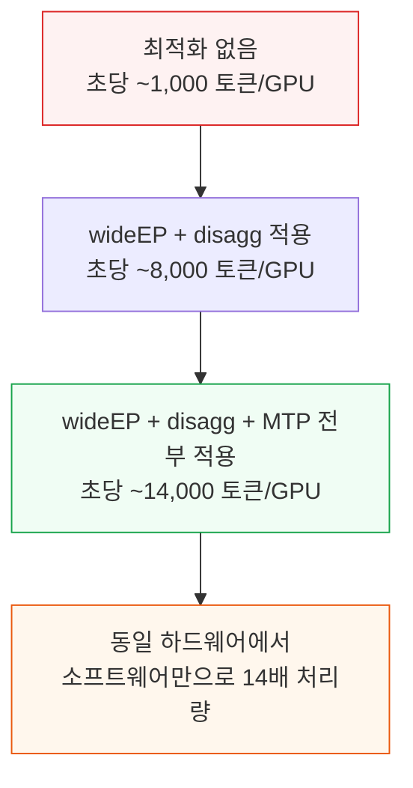
```mermaid
flowchart TD
    A["최적화 없음<br/>초당 ~1,000 토큰/GPU"] --> B["wideEP + disagg 적용<br/>초당 ~8,000 토큰/GPU"]
    B --> C["wideEP + disagg + MTP 전부 적용<br/>초당 ~14,000 토큰/GPU"]
    C --> D["동일 하드웨어에서<br/>소프트웨어만으로 14배 처리량"]
    style A fill:#fef2f2,stroke:#dc2626
    style C fill:#f0fdf4,stroke:#16a34a
    style D fill:#fff7ed,stroke:#ea580c
```

**📌 용어 풀이: wideEP · disagg · MTP**
> - **wideEP (넓은 전문가 병렬화)**: MoE(전문가 혼합) 모델에서 여러 GPU에 전문가를 넓게 분산 배치해 처리량을 늘리는 기법
> - **disagg (Prefill/Decode 분리)**: 입력을 읽는 단계와 출력을 생성하는 단계를 서로 다른 GPU에 나눠 맡겨 효율을 높이는 기법
> - **MTP (Multi-Token Prediction, 다중 토큰 예측)**: 한 번에 토큰 하나씩이 아니라 여러 개를 동시에 예측해 생성 속도를 높이는 기법

### 하드웨어까지 더하면 격차는 더 벌어진다

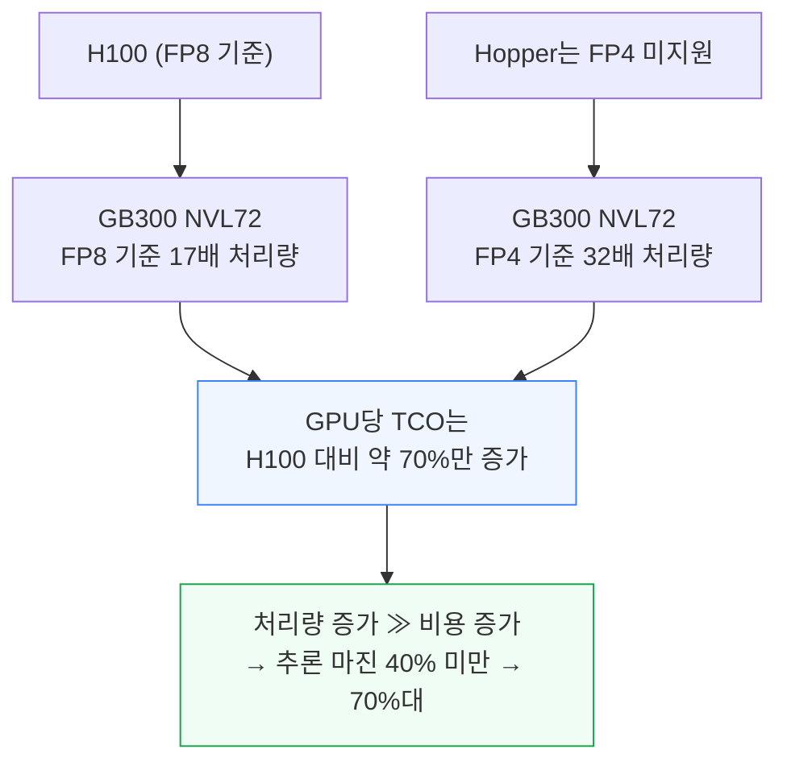
```mermaid
flowchart TD
    A["H100 (FP8 기준)"] --> B["GB300 NVL72<br/>FP8 기준 17배 처리량"]
    A2["Hopper는 FP4 미지원"] --> C["GB300 NVL72<br/>FP4 기준 32배 처리량"]
    B --> D["GPU당 TCO는<br/>H100 대비 약 70%만 증가"]
    C --> D
    D --> E["처리량 증가 ≫ 비용 증가<br/>→ 추론 마진 40% 미만 → 70%대"]
    style D fill:#eff6ff,stroke:#3b82f6
    style E fill:#f0fdf4,stroke:#16a34a
```

---

## 5. 모델 제공사 마진은 앞으로도 계속 오른다

**📌 핵심:**
- 앤트로픽이 2025년 11월 Opus 4.5를 백만 토큰당 $5/$25(입력/출력)에 출시 — 이전 Opus 4·4.1(2025년 5·8월 출시)의 $15/$75보다 3배 저렴한 가격표였지만, 실제로는 트레이니엄·Nvidia GPU 소프트웨어 개선과 Hopper→Blackwell 전환 덕분에 마진이 오히려 증가
- 물량 구성이 Sonnet에서 Opus로 이동하며 토큰당 평균판매가격(ASP)도 함께 상승 — 표시 단가 인하와 실질 ASP 상승이 동시에 벌어지는 구조
- 앤트로픽은 프리미엄 SKU로 추가 레버도 보유 — Opus 빠른 버전은 일반 Opus의 6배 가격, Mythos는 $25/$125(일반 Opus의 5배)로 책정됐는데도 AI에 진심인 기업들은 생산성 이득이 비용을 압도해 기꺼이 지불
- 결론: 프론티어급 토큰의 경제적 가치와 실제 가격 사이 격차가 역대 최대 — 저마진 시대는 끝났고 되돌아갈 수 없음

---

### 표시 단가는 내렸는데 마진은 오르는 구조

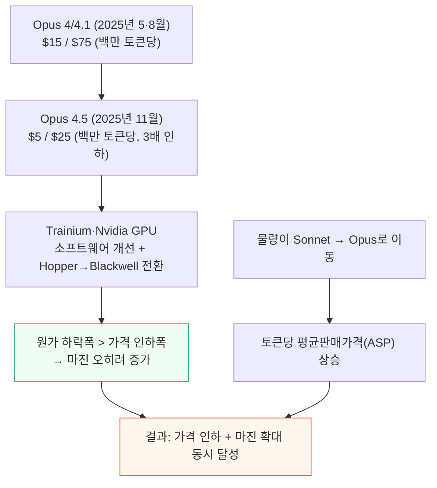
```mermaid
flowchart TD
    A["Opus 4/4.1 (2025년 5·8월)<br/>$15 / $75 (백만 토큰당)"] --> B["Opus 4.5 (2025년 11월)<br/>$5 / $25 (백만 토큰당, 3배 인하)"]
    B --> C["Trainium·Nvidia GPU<br/>소프트웨어 개선 + Hopper→Blackwell 전환"]
    C --> D["원가 하락폭 > 가격 인하폭<br/>→ 마진 오히려 증가"]
    E["물량이 Sonnet → Opus로 이동"] --> F["토큰당 평균판매가격(ASP) 상승"]
    D --> G["결과: 가격 인하 + 마진 확대 동시 달성"]
    F --> G
    style D fill:#f0fdf4,stroke:#16a34a
    style G fill:#fff7ed,stroke:#ea580c
```

### 프리미엄 SKU로 한 단계 더 - 가격이 아니라 가치로 판다

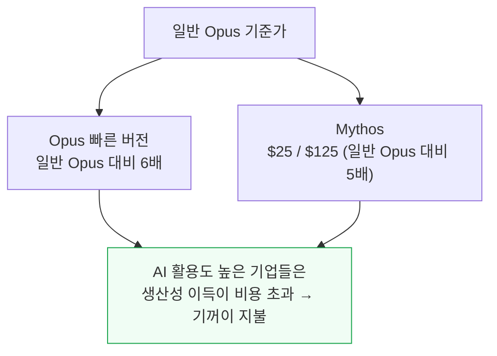
```mermaid
flowchart TD
    A["일반 Opus 기준가"] --> B["Opus 빠른 버전<br/>일반 Opus 대비 6배"]
    A --> C["Mythos<br/>$25 / $125 (일반 Opus 대비 5배)"]
    B --> D["AI 활용도 높은 기업들은<br/>생산성 이득이 비용 초과 → 기꺼이 지불"]
    C --> D
    style D fill:#f0fdf4,stroke:#16a34a
```

---

## 6. 모델 제공사 이익이 경쟁으로 사라지지 않는 이유

**📌 핵심:**
- 일반적으로 "경쟁이 심해지면 이익이 사라진다"고 생각하지만, 저자들은 두 가지 이유로 그렇지 않을 것이라 봄
- 이유 1 - 프론티어 모델의 가격결정력: 벤치마크 점수와 무관하게 오픈소스 모델은 실제 지식노동에서 여전히 눈에 띄게 뒤처짐 — Kimi K2.6($0.95/$4)도 Opus 가격에 거의 압박을 주지 못함
- 이유 2 - 컴퓨트 제약: 어느 프론티어 랩도 전체 시장을 혼자 감당할 컴퓨트가 없음 — 앤트로픽조차 Claude Code를 월 $100+ 구독 뒤에 걸어두고 서드파티 하네스(OpenClaw 등)를 차단하며 이미 시장 일부를 밀어내는 중
- 결론: 토큰 수요가 공급을 계속 앞지르는 한, 진짜 프론티어급 품질을 낼 수 있는 랩은 서로 마진을 깎아 먹는 대신 그 토큰이 만드는 경제적 가치만큼 값을 매길 수 있음

---

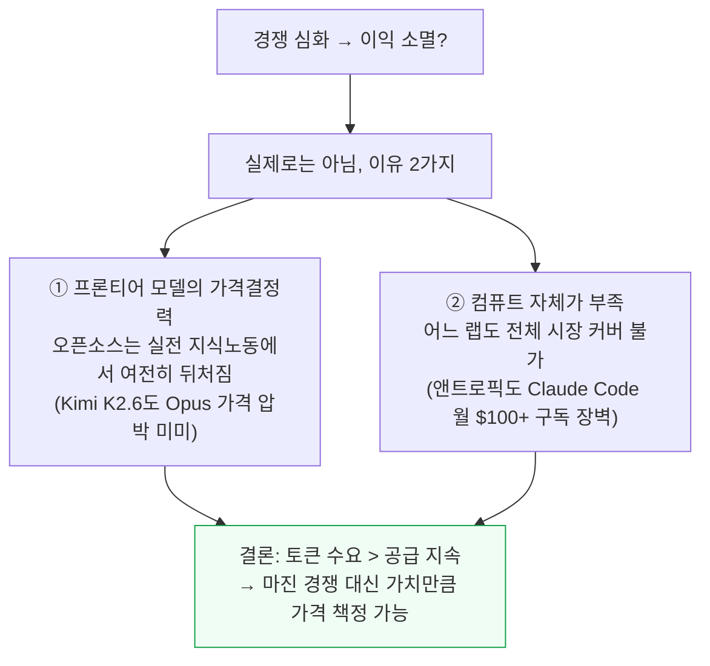
```mermaid
flowchart TD
    A["경쟁 심화 → 이익 소멸?"] --> B["실제로는 아님, 이유 2가지"]
    B --> C["① 프론티어 모델의 가격결정력<br/>오픈소스는 실전 지식노동에서 여전히 뒤처짐<br/>(Kimi K2.6도 Opus 가격 압박 미미)"]
    B --> D["② 컴퓨트 자체가 부족<br/>어느 랩도 전체 시장 커버 불가<br/>(앤트로픽도 Claude Code 월 $100+ 구독 장벽)"]
    C --> E["결론: 토큰 수요 > 공급 지속<br/>→ 마진 경쟁 대신 가치만큼 가격 책정 가능"]
    D --> E
    style E fill:#f0fdf4,stroke:#16a34a
```

---

## 7. 에이전틱 AI는 시장을 강타했는데 TSMC와 Nvidia는 꿈쩍 않는다

**📌 핵심:**
- Nvidia는 젠슨 황의 최근 GTC 기조연설에서 에이전틱 AI를 반복 강조했음에도, 토큰 경제학이 지난 몇 달간 얼마나 크게 바뀌었는지 아직 온전히 반영하지 못하는 가격 정책을 유지 중 (InferenceX 결과에 놀란 젠슨의 반응에서도 이미 드러남)
- Nvidia는 "컴퓨트 단위당 지불 의향은 시간이 갈수록 낮아진다"는 과거 가정을 여전히 전제로 움직이지만, 에이전틱 워크로드 폭발로 수요는 더 이상 선형이 아니라 복리로 늘어나는 중
- 공급 쪽도 구조적으로 막혀 있음 — 2026년 하반기 N3 파운드리 가동률이 100%를 넘어설 전망이고 DRAM 팹은 이미 90% 이상 가동 중, 완화될 기미가 없음
- 결론: TSMC는 가격을 크게 올릴 수 있는데도 올리지 않는 전략적 실수를 하고 있고, 최소한 선수금이라도 더 요구할 수 있는 상황

---

### 수요는 선형이 아니라 복리로 늘어나는데, 공급 정책은 그대로

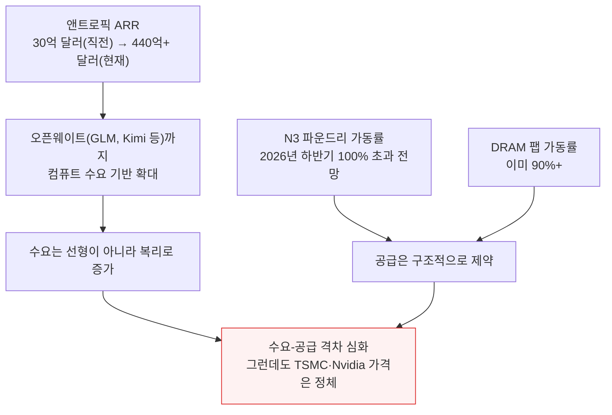
```mermaid
flowchart TD
    A["앤트로픽 ARR<br/>30억 달러(직전) → 440억+ 달러(현재)"] --> B["오픈웨이트(GLM, Kimi 등)까지<br/>컴퓨트 수요 기반 확대"]
    B --> C["수요는 선형이 아니라 복리로 증가"]
    D["N3 파운드리 가동률<br/>2026년 하반기 100% 초과 전망"] --> F["공급은 구조적으로 제약"]
    E["DRAM 팹 가동률<br/>이미 90%+"] --> F
    C --> G["수요-공급 격차 심화<br/>그런데도 TSMC·Nvidia 가격은 정체"]
    F --> G
    style G fill:#fef2f2,stroke:#dc2626
```

Nvidia의 시스템 가격이 이 격차를 온전히 반영하지 못하는 사이에도, Rubin(2026년 하반기 출시 예정)은 더 큰 메모리 서브시스템을 품고 있어 메모리가 공급망에서 가장 타이트한 병목이 되는 시점에 등장합니다. DRAM 가격은 이미 큰 폭으로 올랐고 높은 수준을 유지할 가능성이 커, 메모리가 시스템 원가의 핵심 변수가 되고 있습니다.

---

## 8. SOCAMM 가격 - Nvidia의 다음 마진 레버

**📌 핵심:**
- Rubin급 시스템은 이미 타이트한 공급망에 훨씬 더 많은 메모리를 품고 있고, 컴퓨트와 달리 메모리는 소켓형(SOCAMM)이라 별도로 가격을 매기고 지속적으로 재산정할 수 있음
- SemiAnalysis 메모리 모델 기준, Nvidia가 SOCAMM에 지불하는 계약 단가는 2026년 1분기 기준 GB당 약 8달러로 직전 분기 대비 급등 — 모바일 LPDDR5X 가격 급등과 메모리 공급 전반의 타이트함이 원인
- 2026년 말 SOCAMM 가격은 GB당 13달러를 넘어설 수 있다고 추정, 이는 Nvidia의 SOCAMM 원가로 GB당 약 10달러를 합리적 가정으로 봄
- Nvidia가 SOCAMM에 60% 마진을 매기는 것이 합리적인 이유 3가지: ① 메모리 공급 전반이 타이트한 상황에서 Nvidia가 가장 많은 SOCAMM 물량을 확보 ② VR NVL72가 TCO당 성능에서 여전히 최고 제품이라 고객이 선택지가 별로 없음 ③ Nvidia 자신도 SOCAMM2 원가 급등을 떠안고 있어 그 위에 마진을 얹는 것이 부당하지 않음
- 결론: 메모리는 반독점 이슈에서 상대적으로 자유로워, Nvidia가 GPU보다 메모리에서 가격 차별을 더 적극적으로 구사할 수 있는 레버

---

### SOCAMM 가격 상승 경로

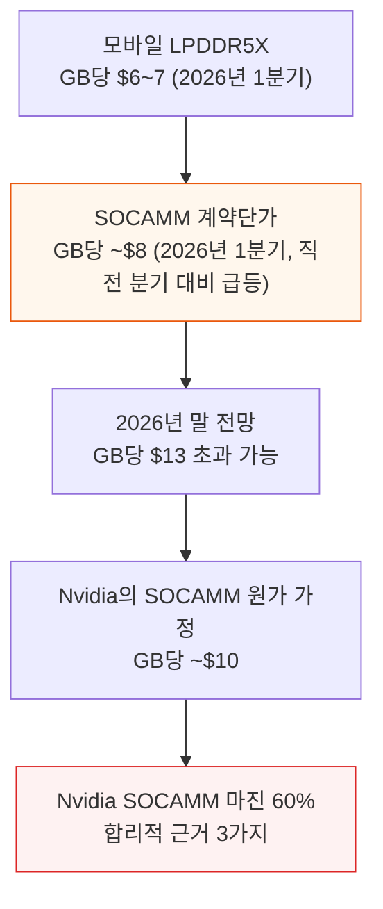
```mermaid
flowchart TD
    A["모바일 LPDDR5X<br/>GB당 $6~7 (2026년 1분기)"] --> B["SOCAMM 계약단가<br/>GB당 ~$8 (2026년 1분기, 직전 분기 대비 급등)"]
    B --> C["2026년 말 전망<br/>GB당 $13 초과 가능"]
    C --> D["Nvidia의 SOCAMM 원가 가정<br/>GB당 ~$10"]
    D --> E["Nvidia SOCAMM 마진 60%<br/>합리적 근거 3가지"]
    style B fill:#fff7ed,stroke:#ea580c
    style E fill:#fef2f2,stroke:#dc2626
```

**📌 용어 풀이: LTA (Long-Term Agreement, 장기 공급계약)**
> - **정의**: 공급사와 구매사가 미리 정한 물량·가격을 여러 해에 걸쳐 약속하는 계약 방식
> - **이 글에서의 의미**: Nvidia가 GB300 NVL72·VR NVL72용 SOCAMM 물량을 장기계약으로 미리 확보해, 유일한 대규모 SOCAMM 구매자로서 우선 접근권과 유리한 가격을 누리는 것으로 추정됨

---

## 9. GB300에서 VR NVL72로 - 와트당 자본지출 트렌드

**📌 핵심:**
- GB300은 DRAM이 보드에 납땜(soldered)되어 있어 보드 전체와 묶여 약 75% 매출총이익률로 마크업되지만, Rubin의 SOCAMM2는 소켓형이라 컴퓨트와 분리해서 별도 품목으로 가격을 매길 수 있음
- 이 덕분에 Nvidia는 보드 마진은 그대로 두면서 SOCAMM2 마진만 별도로 조정하는 추가 레버를 얻음 — 메모리 원가 상승분을 일단 흡수하더라도 시스템 전체 마진으로 상쇄 가능
- 통상 서버는 세대가 바뀔 때마다 와트당 자본지출이 오르는데(성능·와트가 개선될수록 더 많은 가치를 회수), GB300→VR NVL72는 칩 TDP가 거의 2배(1,400W→2,300W)로 뛰고 성능도 큰 폭 개선됐음에도 와트당 자본지출은 $37.4/W→$38.1/W로 사실상 정체
- 결론: 성능/와트가 2배 이상 뛰었는데 가격이 거의 그대로인 것은 이례적 — Nvidia가 아직 이 가치 상승분을 가격에 반영하지 않았다는 신호이자, 향후 인상 여력이 크다는 근거

---

### 성능은 2배 뛰었는데 와트당 가격은 거의 그대로

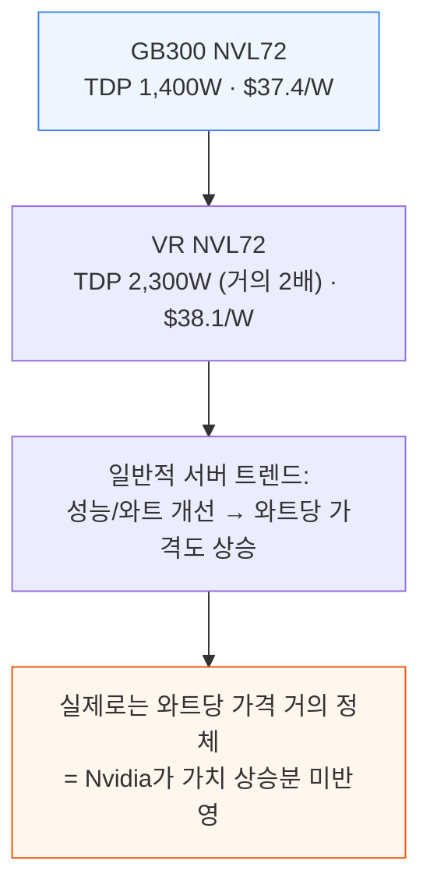
```mermaid
flowchart TD
    A["GB300 NVL72<br/>TDP 1,400W · $37.4/W"] --> B["VR NVL72<br/>TDP 2,300W (거의 2배) · $38.1/W"]
    B --> C["일반적 서버 트렌드:<br/>성능/와트 개선 → 와트당 가격도 상승"]
    C --> D["실제로는 와트당 가격 거의 정체<br/>= Nvidia가 가치 상승분 미반영"]
    style A fill:#eff6ff,stroke:#3b82f6
    style D fill:#fff7ed,stroke:#ea580c
```

GB300은 DRAM이 보드에 납땜돼 있어 보드 전체가 하나의 마진(약 75%)으로 묶입니다. 반면 Rubin의 SOCAMM2는 소켓형이라 컴퓨트 보드와 분리해 별도 품목으로 가격을 매길 수 있습니다.
이 구조 덕분에 Nvidia는 보드 마진은 그대로 둔 채 메모리 마진만 별도로 조정하는 추가 레버를 갖게 됩니다. Nvidia는 또한 메모리에서는 반독점 우려 없이 GPU보다 더 적극적으로 가격 차별을 할 수 있습니다.

---

## 10. 네트워킹 - 가격 차별의 또 다른 수단

**📌 핵심:**
- Nvidia는 GPU·메모리 같은 핵심 부품은 하이퍼스케일러든 Neocloud든 비슷한 가격에 팔지만, 네트워킹 장비만큼은 전통적으로 가격을 차별함 — 실제 설문 결과 SN5610 스위치가 Neocloud에는 하이퍼스케일러 대비 최대 2배 비싸게 책정
- 이유: Neocloud는 네트워킹을 직접 설계·최적화할 규모나 전문성이 없어 Nvidia의 턴키 솔루션을 선호하는 반면, 하이퍼스케일러는 OEM/ODM과 직접 협업해 더 저렴한 맞춤 솔루션을 구축할 엔지니어링 역량을 보유
- 하지만 클러스터 전체 자본비용 기준으로 보면 이 격차는 크게 줄어듦 — 비교 가능한 두 클러스터에서 네트워킹 비용이 94% 더 비싸도, 전체 랙 자본비용 기준으로는 겨우 10% 증가에 그침 (전력·유틸리티·운영 비용까지 고려하면 격차는 더 줄어듦)
- 결론: 가치 기반 가격의 좋은 사례이긴 하지만, Neocloud와 하이퍼스케일러 간 가격 격차가 이미 상당해 Nvidia가 이 레버를 더 당길 여지는 제한적

---

### 네트워킹 가격 2배 차이가 전체 비용에선 10%로 줄어드는 이유

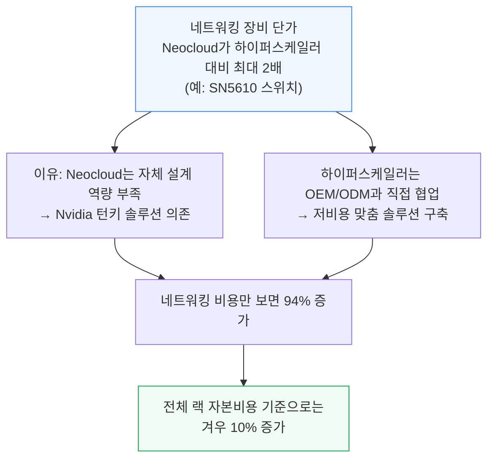
```mermaid
flowchart TD
    A["네트워킹 장비 단가<br/>Neocloud가 하이퍼스케일러 대비 최대 2배<br/>(예: SN5610 스위치)"] --> B["이유: Neocloud는 자체 설계 역량 부족<br/>→ Nvidia 턴키 솔루션 의존"]
    A --> C["하이퍼스케일러는 OEM/ODM과 직접 협업<br/>→ 저비용 맞춤 솔루션 구축"]
    B --> D["네트워킹 비용만 보면 94% 증가"]
    C --> D
    D --> E["전체 랙 자본비용 기준으로는<br/>겨우 10% 증가"]
    style A fill:#eff6ff,stroke:#3b82f6
    style E fill:#f0fdf4,stroke:#16a34a
```

---

## 11. Nvidia, AI의 중앙은행이 되다

**📌 핵심:**
- Nvidia가 지금까지 가격을 자제해온 배경에는 규제·전략적 신중함이 함께 작용 — GPU·인터커넥트·소프트웨어 전반의 지배력 때문에 이미 반독점 조사 압박이 커지는 상황에서, 가치를 최대로 뽑아내는 가격 정책은 자칫 더 큰 규제 관심을 부를 위험
- TSMC도 과거부터 비슷한 전략을 취해옴 — 완전 가동률 상태에서도 희소성만큼 가격을 다 받아내기보다 장기 고객관계와 생태계 안정을 우선시
- Nvidia는 근시안적 가치 추출보다 생태계 전체의 장기 수요 확장을 지원하는 쪽을 택하는 중 — 프론티어 랩들은 Nvidia의 소프트웨어 효율 개선 혜택을 누리지만 이게 하드웨어 가격에 완전히 반영되진 않아, 그 잉여 가치가 다운스트림(모델 랩)으로 계속 흘러감
- 결론: 컴퓨트 수요가 공급을 크게 초과하는 상황에서, 희소 자원을 쥔 쪽이 왜 더 높은 가격과 이익을 취하지 않는가라는 질문이 남음

---

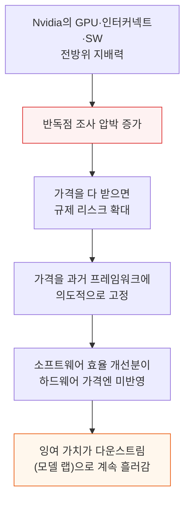
```mermaid
flowchart TD
    A["Nvidia의 GPU·인터커넥트·SW<br/>전방위 지배력"] --> B["반독점 조사 압박 증가"]
    B --> C["가격을 다 받으면<br/>규제 리스크 확대"]
    C --> D["가격을 과거 프레임워크에<br/>의도적으로 고정"]
    D --> E["소프트웨어 효율 개선분이<br/>하드웨어 가격엔 미반영"]
    E --> F["잉여 가치가 다운스트림<br/>(모델 랩)으로 계속 흘러감"]
    style B fill:#fef2f2,stroke:#dc2626
    style F fill:#fff7ed,stroke:#ea580c
```

---

## 12. TSMC, 세상에서 가장 공정한 회사

**📌 핵심:**
- TSMC N3 공정은 사실상 업계에서 가장 타이트한 병목 — Nvidia, Broadcom, Annapurna, 미디어텍, AMD가 모두 더 많은 N3 웨이퍼 배정을 놓고 경쟁 중인데도 가격은 상대적으로 안정적
- TSMC는 다운사이클에서 수익성을 지키기 위해 업사이클에서도 가격을 최대로 받지 않는 전략을 씀 — 젠슨 황 본인도 2024년 "TSMC가 웨이퍼 가격을 더 올려야 한다"고 말한 적 있는데, 경쟁사가 따라오지 못하게 하려는 의도
- TSMC는 가격 인상 대신 장기계약+선수금 확대라는 더 가능성 높은 경로를 택할 것으로 예상됨
- Nvidia도 TSMC와 비슷한 길을 걷는 중 — 조달 능력(특히 타이트한 TSMC 웨이퍼 확보)이 최대 강점이며, 앤트로픽 같은 컴퓨트 구매자는 TPU·Trainium 같은 대안도 결국 같은 상류 병목에 걸려 있어 사실상 Nvidia 생태계에 갇힘
- 결론: 원가 기반 가격 프레임워크는 오래 못 갈 가능성이 큼 — 추론 제공사 투자수익이 더 명확해질수록 가치 기반 가격으로 무게중심이 옮겨가며, 이는 Nvidia에게 가격을 더 올릴 여지를 열어줌 (파이 자체가 커지는 구조)

---

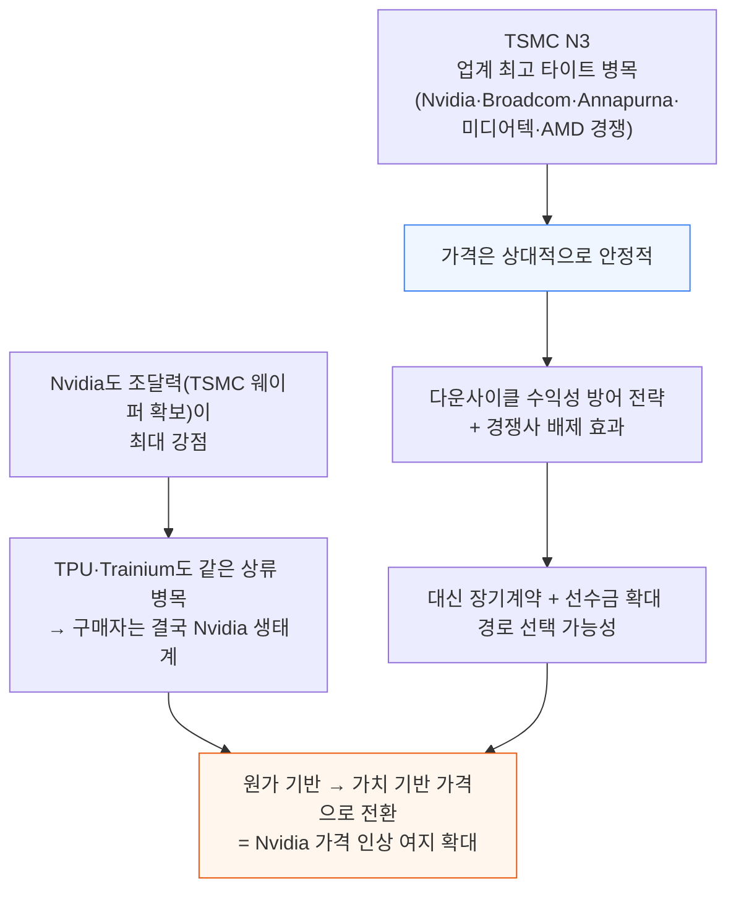
```mermaid
flowchart TD
    A["TSMC N3<br/>업계 최고 타이트 병목<br/>(Nvidia·Broadcom·Annapurna·미디어텍·AMD 경쟁)"] --> B["가격은 상대적으로 안정적"]
    B --> C["다운사이클 수익성 방어 전략<br/>+ 경쟁사 배제 효과"]
    C --> D["대신 장기계약 + 선수금 확대 경로 선택 가능성"]
    E["Nvidia도 조달력(TSMC 웨이퍼 확보)이<br/>최대 강점"] --> F["TPU·Trainium도 같은 상류 병목<br/>→ 구매자는 결국 Nvidia 생태계"]
    F --> G["원가 기반 → 가치 기반 가격으로 전환<br/>= Nvidia 가격 인상 여지 확대"]
    D --> G
    style B fill:#eff6ff,stroke:#3b82f6
    style G fill:#fff7ed,stroke:#ea580c
```

---

## 13. VR NVL72 임대가격 삼각측량 - 원가 기반 vs 가치 기반

**📌 핵심:**
- 원가 기반 가격: Neocloud가 최소 수익률(내부수익률, IRR) 문턱을 넘겨야 GPU를 배치 — 현재 대부분 프로젝트는 10%대 중후반 IRR을 목표로 하며, GB300은 5년·선수금 15% 조건에서 IRR 15.6%가 기준
- 이 기준으로 VR NVL72의 최소 임대가격(바닥)은 시간당 GPU당 $4.92 — GB300과 같은 IRR 15.6%를 맞추는 데 필요한 최저선
- 가치 기반 가격: 기존 세대 GPU와 동일한 $/FLOP을 유지한다는 가정 하에 이론적 최고 지불의향(천장)을 역산 — GB300의 5년 임대가격(PFLOP당 약 $0.70)을 기준으로 잡으면 VR NVL72의 천장은 GPU당 시간당 약 $12.25
- 보수적으로 트렌드선 약간 아래(PFLOP당 $0.55)를 잡아도 $9.63/시간/GPU로, 바닥($4.92)의 거의 2배 — 원가 기반과 가치 기반 사이 간극이 이례적으로 크다는 것이 VR NVL72의 특징
- 결론: 바닥과 천장 사이 넓은 간극은 Nvidia·Neocloud 양쪽 모두에게 가격을 올릴 여지가 크다는 신호

---

### 임대가격의 바닥(원가 기반)과 천장(가치 기반)

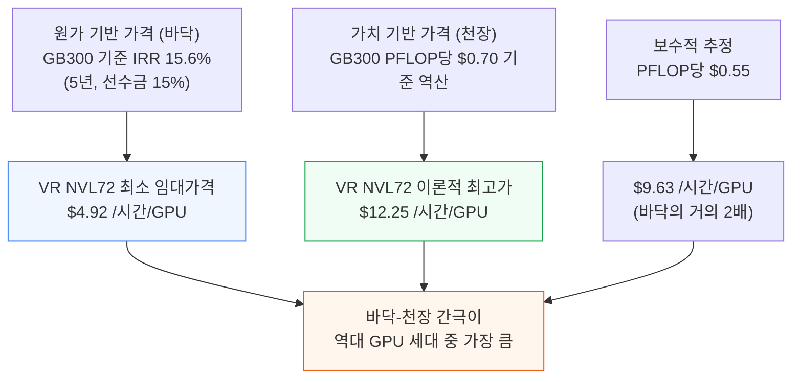
```mermaid
flowchart TD
    A["원가 기반 가격 (바닥)<br/>GB300 기준 IRR 15.6%<br/>(5년, 선수금 15%)"] --> B["VR NVL72 최소 임대가격<br/>$4.92 /시간/GPU"]
    C["가치 기반 가격 (천장)<br/>GB300 PFLOP당 $0.70 기준 역산"] --> D["VR NVL72 이론적 최고가<br/>$12.25 /시간/GPU"]
    E["보수적 추정<br/>PFLOP당 $0.55"] --> F["$9.63 /시간/GPU<br/>(바닥의 거의 2배)"]
    B --> G["바닥-천장 간극이<br/>역대 GPU 세대 중 가장 큼"]
    D --> G
    F --> G
    style B fill:#eff6ff,stroke:#3b82f6
    style D fill:#f0fdf4,stroke:#16a34a
    style G fill:#fff7ed,stroke:#ea580c
```

**📌 용어 풀이: 원가 기반 vs 가치 기반 가격의 실전 의미**
> - **원가 기반**: "이 가격 밑에서는 아예 사업을 안 한다"는 최저 배치 조건 — Neocloud 입장의 손익분기 개념
> - **가치 기반**: "이 가격 위로는 차라리 이전 세대 GPU를 쓰는 게 낫다"는 최고 지불의향 — 고객 입장의 무차별점
> - **쉬운 비유**: 원가 기반은 "이 값 밑으로는 장사 안 한다"는 사장님 마지노선, 가치 기반은 "이 값 위로는 차라리 딴 데 간다"는 손님의 최대 지불의향선 — 그 사이 폭이 넓을수록 가격을 올릴 여지가 큼

---

## 14. 모든 것을 지배하는 하나의 차트

**📌 핵심:**
- 원가 기반 접근은 GPU 임대가격의 바닥(이 아래로는 Neocloud가 신규 프로젝트를 승인하지 않음), 가치 기반 접근은 천장(이 위로는 어떤 고객도 이전 세대 대비 $/FLOP 기준 더 낼 이유가 없음)을 형성
- 이 둘과 Neocloud 수익률 곡선을 결합해 하나의 차트로 그리면, 관찰된 실제 GPU 임대가격과 Neocloud가 버는 IRR을 동시에 표시할 수 있음 — 곡선을 따라 오른쪽 위로 갈수록 Neocloud의 협상력이 강하다는 의미
- 현재 VR NVL72 가격 수준에서 Neocloud는 시간당 GPU당 $4.90에 5년 계약을 맺어도 GB300 프로젝트와 동일한 15% IRR을 얻음 — 고객 입장에서 PFLOP당 임대가격은 $0.28로, GB300 NVL72 대비 60% 하락 (트렌드보다 훨씬 개선된 수치)
- Nvidia가 서버 가격을 약 40% 인상해도 여전히 트렌드보다 나은 $/FLOP 개선을 제공하면서, Neocloud가 더 높은 가격($8.00/시간/GPU, IRR 38%, PFLOP당 $0.46)을 매겨도 트렌드보다 나은 개선폭을 유지할 수 있음
- 결론: 이 분석은 $/FLOP 기준이며, 토큰당 실제 비용(추론 성능/TCO) 개선은 이보다도 더 빠르게 진행 중이라 Nvidia가 전체 생태계에서 가져갈 수 있는 가치는 이 계산보다 더 클 가능성이 높음

---

### 하나의 차트로 보는 가격결정력의 지도

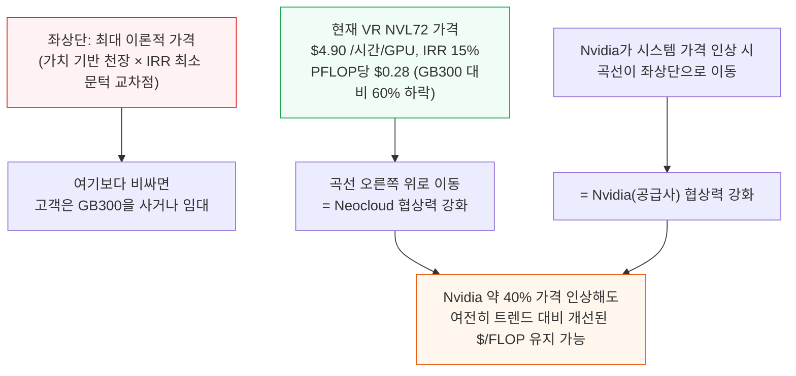
```mermaid
flowchart TD
    A["좌상단: 최대 이론적 가격<br/>(가치 기반 천장 × IRR 최소 문턱 교차점)"] --> B["여기보다 비싸면<br/>고객은 GB300을 사거나 임대"]
    C["현재 VR NVL72 가격<br/>$4.90 /시간/GPU, IRR 15%<br/>PFLOP당 $0.28 (GB300 대비 60% 하락)"] --> D["곡선 오른쪽 위로 이동<br/>= Neocloud 협상력 강화"]
    E["Nvidia가 시스템 가격 인상 시<br/>곡선이 좌상단으로 이동"] --> F["= Nvidia(공급사) 협상력 강화"]
    D --> G["Nvidia 약 40% 가격 인상해도<br/>여전히 트렌드 대비 개선된 $/FLOP 유지 가능"]
    F --> G
    style A fill:#fef2f2,stroke:#dc2626
    style C fill:#f0fdf4,stroke:#16a34a
    style G fill:#fff7ed,stroke:#ea580c
```

---

## 15. VR NVL72 vs GB300 - TCO당 성능 비교

**📌 핵심:**
- 시스템 비용 자체는 GPU당 시간당 $2.69(GB300) → $4.18(VR NVL72)로 상승 — 메모리 가격 급등 영향이 큼
- 정밀도별 성능은 BF16 2,500→4,000 TFLOPS, FP8 5,000→17,500 TFLOPS, FP4 15,000→35,000 TFLOPS로 저정밀도일수록 개선폭이 큼 (FP4 스파스 활용 시 5만 TFLOPS까지 가능, TCO/PFLOP $0.12→$0.08로 약 33% 개선)
- TCO 기준으로 보면 BF16은 소폭 개선($1.07→$1.04/PFLOP)에 그치지만, FP8은 $0.54→$0.24, FP4는 $0.18→$0.12로 저정밀도일수록 개선폭이 훨씬 큼 — Rubin의 설계 자체가 저정밀도 연산에 유리하게 바뀌었기 때문(BF16 SM당 연산은 거의 그대로인데 FP8·FP4는 SM당 연산이 2배로 증가)
- 결론: Rubin의 성능·TCO 이득 대부분은 FP8·FP4에 집중돼 있고, 실사용 성능은 마케팅 수치가 아니라 실제 MFU(모델 FLOPs 활용률)에 좌우되며 초기 배치 단계에선 소프트웨어 성숙도 문제로 MFU가 낮을 가능성이 큼

---

### 정밀도가 낮을수록 TCO 개선폭이 커진다

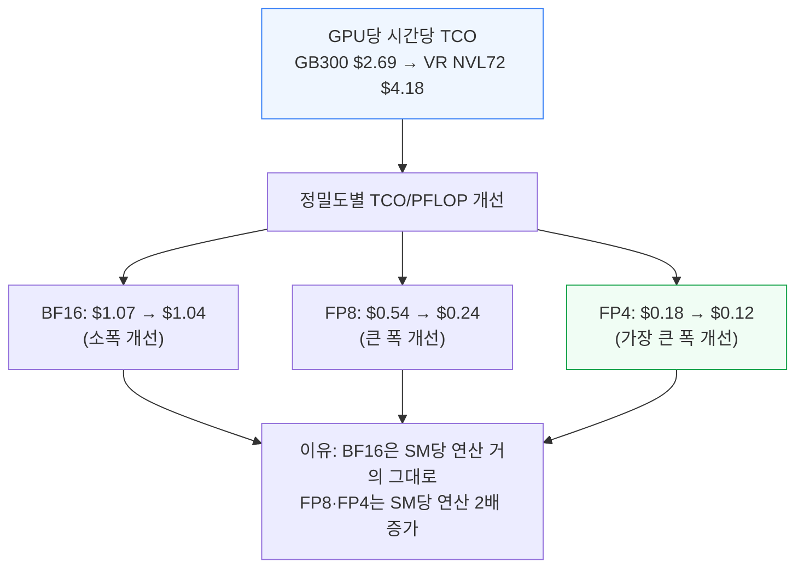
```mermaid
flowchart TD
    A["GPU당 시간당 TCO<br/>GB300 $2.69 → VR NVL72 $4.18"] --> B["정밀도별 TCO/PFLOP 개선"]
    B --> C["BF16: $1.07 → $1.04<br/>(소폭 개선)"]
    B --> D["FP8: $0.54 → $0.24<br/>(큰 폭 개선)"]
    B --> E["FP4: $0.18 → $0.12<br/>(가장 큰 폭 개선)"]
    C --> F["이유: BF16은 SM당 연산 거의 그대로<br/>FP8·FP4는 SM당 연산 2배 증가"]
    D --> F
    E --> F
    style A fill:#eff6ff,stroke:#3b82f6
    style E fill:#f0fdf4,stroke:#16a34a
```

**📌 용어 풀이: BF16 / FP8 / FP4 · MFU**
> - **BF16 / FP8 / FP4**: 숫자를 얼마나 정밀하게(몇 비트로) 표현하느냐의 차이 — 숫자가 작을수록(FP4) 정밀도는 낮지만 같은 칩에서 훨씬 더 많은 연산을 동시에 처리 가능
> - **MFU (Model FLOPs Utilization, 모델 연산 활용률)**: 칩이 이론상 낼 수 있는 최대 연산 능력 중 실제 워크로드가 얼마나 뽑아 쓰는지 나타내는 비율 — 마케팅 스펙과 실사용 성능의 격차를 설명하는 지표

---

## 16. 컴퓨트 경쟁 구도와 최종 결론

**📌 핵심:**
- 수익성은 결국 경쟁 강도가 결정 — 경쟁이 치열하면 가격은 원가에 수렴(저마진), 독점적 지위면 가치만큼 또는 고객이 감당 가능한 최대치로 가격 책정(고마진) 가능
- 앤트로픽 같은 고객이 이미 강한 추론 마진을 내고 있다는 것은 현재 가격보다 훨씬 높은 지불 의향이 있다는 신호 — 하지만 이는 Nvidia의 컴퓨트 경쟁 상황을 무시한 해석
- 앤트로픽은 이미 Trainium·TPU로 컴퓨트를 크게 다변화(Mythos는 Nvidia 위에서 학습되지 않음) — TPU·Trainium이 절대적 하드웨어·소프트웨어 우위는 없지만 더 낮은 원가로 이를 상쇄(아마존·구글은 마벨·알칩·브로드컴·미디어텍 같은 설계 파트너에게 Nvidia보다 낮은 마진을 지불하면서도 재판매로 토큰·학습 FLOP당 비용을 낮출 수 있음) — 이런 경쟁 압력이 Nvidia 마진 상승을 억제하는 요인이라는 시각도 있음
- 하지만 Nvidia가 성능 우위를 유지하는 한, 저비용 대안의 존재가 있어도 고객 다변화를 가속하지 않는 선에서는 가격을 계속 올릴 수 있음
- 결론: 관건은 Nvidia가 이 성능 우위를 실제 가격결정력으로 전환할 능력과 의지가 있는가이며, 저자들의 판단은 "지금이 기회일 때 밀어붙여 메모리 가격·용량·성능에서의 장기적 우위를 최대한 활용해야 한다"는 것

---

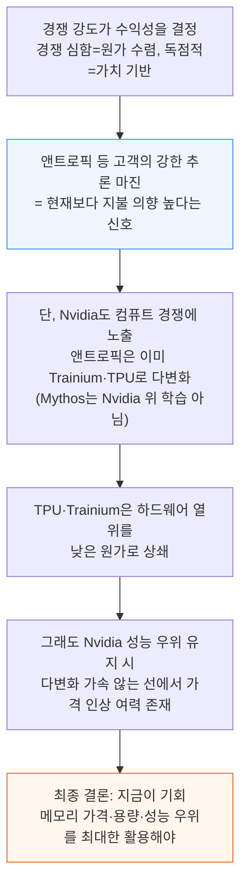
```mermaid
flowchart TD
    A["경쟁 강도가 수익성을 결정<br/>경쟁 심함=원가 수렴, 독점적=가치 기반"] --> B["앤트로픽 등 고객의 강한 추론 마진<br/>= 현재보다 지불 의향 높다는 신호"]
    B --> C["단, Nvidia도 컴퓨트 경쟁에 노출<br/>앤트로픽은 이미 Trainium·TPU로 다변화<br/>(Mythos는 Nvidia 위 학습 아님)"]
    C --> D["TPU·Trainium은 하드웨어 열위를<br/>낮은 원가로 상쇄"]
    D --> E["그래도 Nvidia 성능 우위 유지 시<br/>다변화 가속 않는 선에서 가격 인상 여력 존재"]
    E --> F["최종 결론: 지금이 기회<br/>메모리 가격·용량·성능 우위를 최대한 활용해야"]
    style B fill:#eff6ff,stroke:#3b82f6
    style F fill:#fff7ed,stroke:#ea580c
```

---

*작성 진행률: 100% 완료*
*업데이트: 원문 전체 섹션(서론\~컴퓨트 경쟁) 변환 완료*
