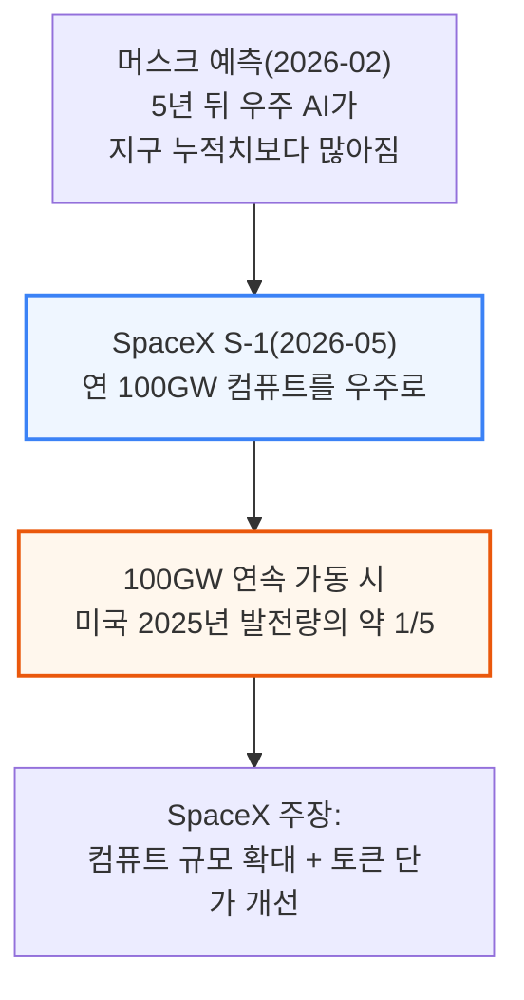
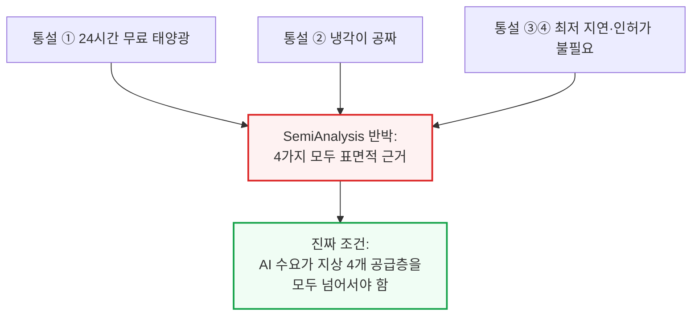
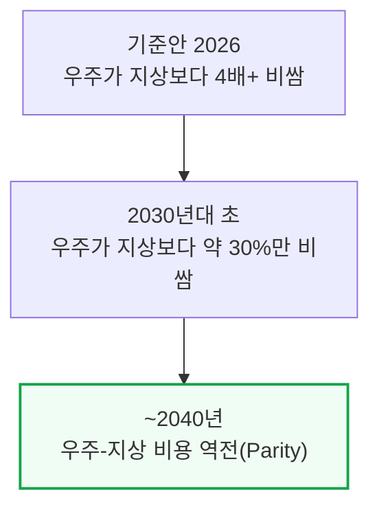
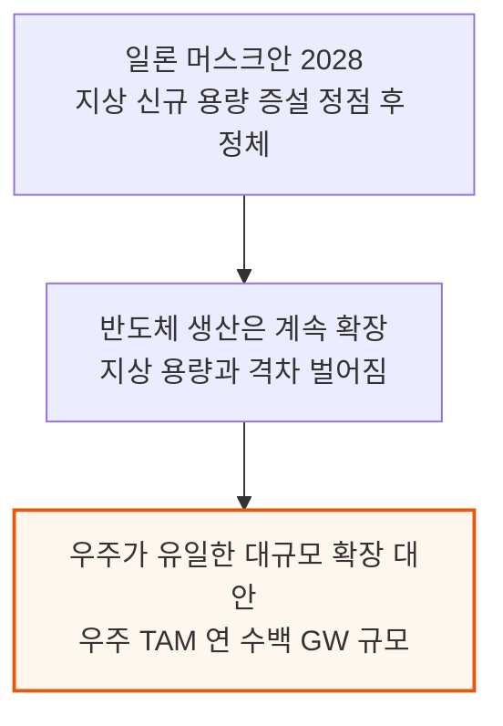
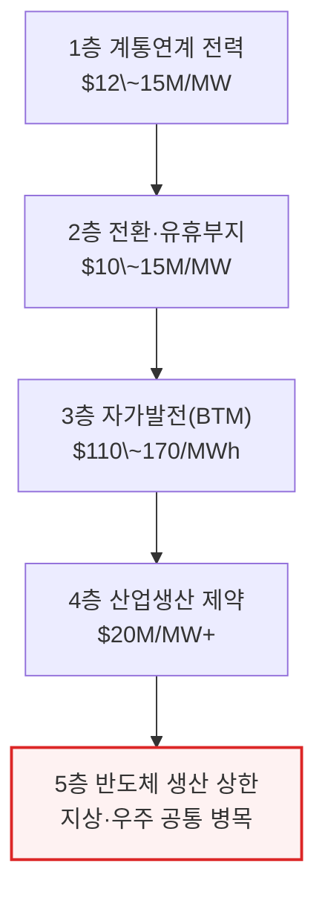
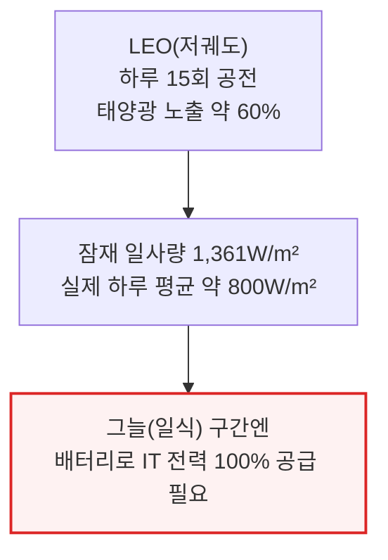
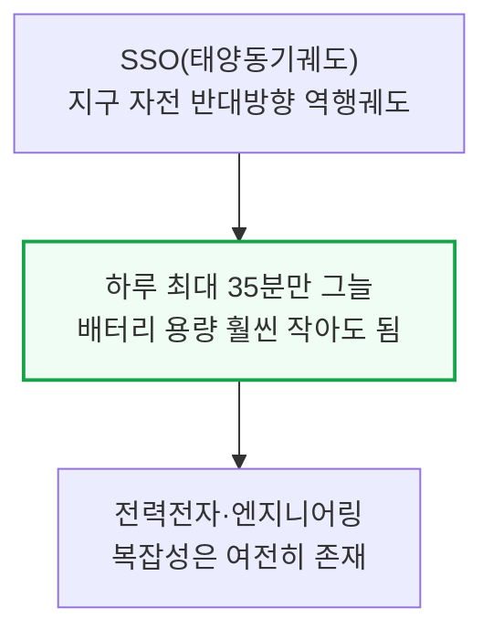

# To Boldly Go: The Case for Space Datacenters

> **출처**: [SemiAnalysis Newsletter](https://newsletter.semianalysis.com/p/to-boldly-go-the-case-for-space-datacenters)
> **저자**: Daniel Nishball, Pranav Myana, Ellie Holbrook
> **발행일**: 2026-06-03

---

## 📑 목차

### 전체 섹션
 1. [서론 - 우주 컴퓨트를 향한 베팅](#1-서론---우주-컴퓨트를-향한-베팅)
 2. [논쟁의 구도 - 지상 5개 공급층과 두 개의 시나리오](#2-논쟁의-구도---지상-5개-공급층과-두-개의-시나리오)
 3. [통설 반박 ① - 우주에서는 24시간 무료 태양광을 얻는다?](#3-통설-반박-①---우주에서는-24시간-무료-태양광을-얻는다)
 4. [통설 반박 ② - 우주에서는 냉각이 공짜다?](#4-통설-반박-②---우주에서는-냉각이-공짜다)
 5. [통설 반박 ③④ - 최저 지연시간과 인허가 불필요라는 통설](#5-통설-반박-③④---최저-지연시간과-인허가-불필요라는-통설)
 6. [지상 공급 1\~2층 - 계통연계 전력과 전환·유휴부지](#6-지상-공급-12층---계통연계-전력과-전환유휴부지)
 7. [지상 공급 3\~4층 - 자가발전(BTM)과 산업생산 제약](#7-지상-공급-34층---자가발전btm과-산업생산-제약)
 8. [지상 공급 5층 - 반도체 생산 상한과 테라팹 구상 검증](#8-지상-공급-5층---반도체-생산-상한과-테라팹-구상-검증)
 9. [TCO 프레임워크 - 헤드라인 숫자](#9-tco-프레임워크---헤드라인-숫자)
10. [TCO 세부 분해 - IT·데이터센터·운영비용](#10-tco-세부-분해---it데이터센터운영비용)
11. [우주-지상 비용 역전 시점 - 기준안과 일론 머스크안](#11-우주-지상-비용-역전-시점---기준안과-일론-머스크안)
12. [우주 데이터센터의 구조 - 태양광·방열판·컴퓨트·발사체](#12-우주-데이터센터의-구조---태양광방열판컴퓨트발사체)
13. [우주 자본비용 세부 ① - 태양광판과 방열판](#13-우주-자본비용-세부-①---태양광판과-방열판)
14. [우주 자본비용 세부 ② - 버스·추진·구조·조립](#14-우주-자본비용-세부-②---버스추진구조조립)
15. [발사 비용 경제학과 우주 운영비용](#15-발사-비용-경제학과-우주-운영비용)

---

## 🔑 용어 정리

본문을 순서대로 읽기 전에 알아두면 좋은 용어들입니다. 자세한 수치와 설명은 본문에서 처음 등장하는 위치에 나옵니다.

- **TCO(Total Cost of Ownership, 총소유비용) vs LCOC(Levelized Cost of Compute, 평준화 컴퓨트 비용)**: TCO는 장비·시설을 사서 운영하는 데 드는 전체 비용, LCOC는 여기에 방사선으로 인한 가동 중단·고장 대비 예비 장비 추가분까지 얹어 "실제로 쓸 수 있는 컴퓨트 1시간당 비용"으로 환산한 것
- **SSO(Sun-Synchronous Orbit, 태양동기궤도) vs LEO(Low Earth Orbit, 저궤도)**: LEO는 지구 저고도 궤도 전체를 가리키는 큰 범주, SSO는 그중에서도 위성이 하루 종일 해가 지는 경계선을 따라 돌아 태양광을 거의 끊김 없이 받는 특수 궤도
- **5개 공급층(Five-Layer Framework)**: 지상 데이터센터가 전력을 조달하는 순서를 원유 채굴 난이도에 빗댄 개념 — 싸고 쉬운 계통연계부터 시작해 점점 비싸고 어려운 자가발전·산업생산으로 넘어가는 구조
- **BTM(Behind-The-Meter, 자가발전)**: 전력회사 계량기를 거치지 않고 데이터센터 부지 안에 직접 발전기를 설치해 전력망 연결 대기 줄을 건너뛰는 방식
- **테라팹(Terafab)**: 일론 머스크가 제안한 오스틴 소재 대형 반도체 공장 구상 — 로직·메모리·패키징까지 통합해 우주용 칩 생산 병목을 풀겠다는 목표
- **방열판(Radiator)과 스테판-볼츠만 법칙**: 진공인 우주에서는 공기가 없어 열을 대류로 날릴 수 없고 오직 적외선 복사로만 열을 버릴 수 있음 — 복사량이 온도의 네제곱에 비례해 늘어나는 물리 법칙 때문에, 전자장비를 뜨겁게 운전할수록 방열판이 작아짐
- **ADCS·PMAD(자세제어시스템·전력관리분배시스템)**: ADCS는 위성이 태양광 패널은 해를, 안테나는 지구를 동시에 향하도록 자세를 잡는 장치, PMAD는 태양광에서 만든 전력을 배터리와 탑재 장비까지 배선으로 나눠주는 시스템
- **AI&T(Assembly, Integration and Test, 조립·통합·시험)**: 따로 만든 부품(태양광판·방열판·GPU 모듈 등)을 실제 위성 한 대로 조립하고 발사 전 성능을 검증하는 공정 — 부품표에는 안 잡히지만 위성 프로그램에서 가장 큰 비용 항목 중 하나

---

## 1. 서론 - 우주 컴퓨트를 향한 베팅

**📌 핵심:**
- 일론 머스크는 "5년 안에 우주에서 지구 전체 AI 컴퓨트 누적치보다 많은 AI를 매년 쏘아올릴 것"이라 예측(2026-02, Dwarkesh 팟캐스트), SpaceX는 2026-05 상장 신청서(S-1)에서 연간 100GW 컴퓨트를 우주로 보내겠다고 명시 — 100GW를 계속 돌리면 미국 2025년 전체 발전량(4.4천 TWh)의 약 5분의 1에 해당하는 규모
- 우주 데이터센터를 옹호하는 통설 4가지(24시간 무료 태양광·공짜 냉각·최저 지연시간·인허가 불필요)는 모두 겉으로만 그럴듯한 근거이며, SemiAnalysis는 이 리포트에서 4가지를 하나씩 반박
- 진짜 근거는 따로 있음 — 지상 데이터센터 공급에는 계통연계부터 산업생산까지 4개 층이 있고, AI 수요가 이 4개 층을 모두 넘어서는 세계에서만 우주 데이터센터가 경제적으로 말이 됨
- 결론: 이 리포트는 SemiAnalysis가 새로 공개한 「AI 우주 데이터센터 TCO(총소유비용) 모델」을 바탕으로, 우주와 지상의 비용을 원가 항목별로 뜯어 비교함

---

xAI가 SpaceX에 합병된 것(동일 지배하 조직 재편)도 우주 기반 컴퓨트 확대가 배경 중 하나로 명시됐고, SpaceX 상장 계획의 핵심 축이기도 합니다.

오늘날 기술로 우주 컴퓨트를 배치하는 비용은 지상 대비 여러 배 비싸며, 방사선 차폐·고장 대응 같은 신뢰성·정비 문제도 아직 풀리지 않았습니다. 이번 글은 4부로 구성됩니다 — 1부는 통설 반박, 2부는 지상 5개 공급층, 3부는 TCO 프레임워크, 4부는 우주 데이터센터의 시스템별 자본비용 분해입니다.

**📌 용어 풀이: 4개 공급층과 5번째 "보편" 제약**
> - 지상 데이터센터 전력 조달의 4개 층: ① 계통연계 ② 전환·유휴부지 ③ 자가발전(BTM) ④ 산업생산 확충
> - 이 4개 층이 다 채워져도 반도체 생산 능력이 부족하면 소용없음 — 이것이 지상이든 우주든 똑같이 적용되는 5번째 "보편" 제약
> - 즉 우주 데이터센터가 지상 4개 층의 대안이 되려면, 먼저 5번째 층(반도체 생산)부터 통과해야 함

---

## 2. 논쟁의 구도 - 지상 5개 공급층과 두 개의 시나리오

**📌 핵심:**
- SemiAnalysis 기준안(Base Case)에서는 우주-지상 비용 격차가 2026년 4배 이상에서 시작해 ~2040년 역전(Parity)되고, 2030년대 초에는 우주가 지상보다 약 30%만 비싸질 전망 — 이르면 2030년대 초부터 첫 대규모 우주 데이터센터가 가능해질 수 있음
- 다만 기준안에서는 지상 용량이 여전히 충분해 우주행은 "필수가 아니라 선호·최적화" 문제일 뿐 — 규제·용량 병목이 지상 공급을 심하게 옥죄는 "일론 머스크 시나리오"에서만 우주가 필수가 됨
- 일론 머스크 시나리오에서는 지상 데이터센터 신규 증설이 2028년 정점을 찍고 수십 년간 낮게 유지되는 반면 반도체 생산은 계속 확장 — 이 경우 우주가 대규모 AI 데이터센터 배치의 유일한 대안이 되고 우주 데이터센터 시장(TAM)은 연 수백 GW 규모로 커질 수 있음
- 결론: 우주 데이터센터의 경제성은 "발사 비용이 얼마나 싸지느냐"만이 아니라 "지상 공급이 얼마나 빨리 막히느냐"에 달려 있음 — 두 축을 함께 봐야 함

---

두 시나리오 모두 SemiAnalysis의 표준 산업 모델(가속기 모델·파운드리 모델·데이터센터 모델)과 달리, 확정된 증설 계획이 아니라 "장애물이 전부 극복된 세계"를 가정한 상방(upside) 케이스입니다. 표준 산업 모델은 2027\~2028년 데이터센터 증설이 반도체 제약을 앞지를 것으로 전망합니다.

1\~4층을 다 더하면 전 세계 추적 데이터센터 용량(중국 제외)은 2026년 89GW에서 2030년 최대 338GW로 거의 4배 늘어날 전망입니다. 하지만 이 증설은 2\~4층(전환·자가발전·산업생산 확충)을 끌어써야 가능하며, 그 결과 가속기(AI 칩) 수요는 앞으로 몇 년간 반도체 생산 능력에 발목 잡힙니다 — 우주 데이터센터로는 풀 수 없는 문제입니다. 각 층의 구체적인 숫자는 다음 섹션들에서 순서대로 다룹니다.

---

## 3. 통설 반박 ① - 우주에서는 24시간 무료 태양광을 얻는다?

**📌 핵심:**
- 대부분의 궤도는 24시간 햇빛을 받지 못함 — ISS와 스타링크 대부분이 있는 저궤도(LEO, 고도 400\~500km)는 하루 15바퀴를 돌며 약 60%의 시간만 햇빛을 받고, 잠재 일사량 1,361W/m² 중 실제로는 하루 평균 약 800W/m²만 확보
- LEO는 그늘(일식) 구간에 배터리로 IT 전력 100%를 감당해야 해 하드웨어 비용·복잡성이 늘어남 — 대안은 태양동기궤도(SSO, 지구 자전과 반대로 도는 역행궤도)로, 지구의 밤낮 경계선을 따라 돌아 하루 최대 35분만 그늘에 들어감
- SSO도 배터리가 필요 없는 건 아니지만 필요 용량이 LEO보다 훨씬 작아짐 — 다만 전력전자·엔지니어링 복잡성은 여전히 남음
- 결론: "24시간 무료 태양광"은 성립하지 않고, 궤도 선택(SSO)으로 그늘 시간을 최소화하는 것이 현실적인 절충안

---

---

*작성 진행률: 약 25% 완료 (1\~3장)*
