# To Boldly Go: The Case for Space Datacenters

> **출처**: [SemiAnalysis Newsletter](https://newsletter.semianalysis.com/p/to-boldly-go-the-case-for-space-datacenters)
> **저자**: Daniel Nishball, Pranav Myana, Ellie Holbrook
> **발행일**: 2026-06-03

---

## 📑 목차

### 전체 섹션
 1. [서론 - 우주 컴퓨트를 향한 베팅](#1-서론---우주-컴퓨트를-향한-베팅)
 2. [논쟁의 구도 - 지상 5개 공급층과 두 개의 시나리오](#2-논쟁의-구도---지상-5개-공급층과-두-개의-시나리오)
 3. [통설 반박 ① - 우주에서는 24시간 무료 태양광을 얻는다?](#3-통설-반박-①---우주에서는-24시간-무료-태양광을-얻는다)
 4. [통설 반박 ② - 우주에서는 냉각이 공짜다?](#4-통설-반박-②---우주에서는-냉각이-공짜다)
 5. [통설 반박 ③④ - 최저 지연시간과 인허가 불필요라는 통설](#5-통설-반박-③④---최저-지연시간과-인허가-불필요라는-통설)
 6. [지상 공급 1\~2층 - 계통연계 전력과 전환·유휴부지](#6-지상-공급-12층---계통연계-전력과-전환유휴부지)
 7. [지상 공급 3\~4층 - 자가발전(BTM)과 산업생산 제약](#7-지상-공급-34층---자가발전btm과-산업생산-제약)
 8. [지상 공급 5층 - 반도체 생산 상한과 테라팹 구상 검증](#8-지상-공급-5층---반도체-생산-상한과-테라팹-구상-검증)
 9. [TCO 프레임워크 - 헤드라인 숫자](#9-tco-프레임워크---헤드라인-숫자)
10. [TCO 세부 분해 - IT·데이터센터·운영비용](#10-tco-세부-분해---it데이터센터운영비용)
11. [우주-지상 비용 역전 시점 - 기준안과 일론 머스크안](#11-우주-지상-비용-역전-시점---기준안과-일론-머스크안)
12. [우주 데이터센터의 구조 - 태양광·방열판·컴퓨트·발사체](#12-우주-데이터센터의-구조---태양광방열판컴퓨트발사체)
13. [우주 자본비용 세부 ① - 태양광판과 방열판](#13-우주-자본비용-세부-①---태양광판과-방열판)
14. [우주 자본비용 세부 ② - 버스·추진·구조·조립](#14-우주-자본비용-세부-②---버스추진구조조립)
15. [발사 비용 경제학과 우주 운영비용](#15-발사-비용-경제학과-우주-운영비용)

---

## 🔑 용어 정리

본문을 순서대로 읽기 전에 알아두면 좋은 용어들입니다. 자세한 수치와 설명은 본문에서 처음 등장하는 위치에 나옵니다.

- **TCO(Total Cost of Ownership, 총소유비용) vs LCOC(Levelized Cost of Compute, 평준화 컴퓨트 비용)**: TCO는 장비·시설을 사서 운영하는 데 드는 전체 비용, LCOC는 여기에 방사선으로 인한 가동 중단·고장 대비 예비 장비 추가분까지 얹어 "실제로 쓸 수 있는 컴퓨트 1시간당 비용"으로 환산한 것
- **SSO(Sun-Synchronous Orbit, 태양동기궤도) vs LEO(Low Earth Orbit, 저궤도)**: LEO는 지구 저고도 궤도 전체를 가리키는 큰 범주, SSO는 그중에서도 위성이 하루 종일 해가 지는 경계선을 따라 돌아 태양광을 거의 끊김 없이 받는 특수 궤도
- **5개 공급층(Five-Layer Framework)**: 지상 데이터센터가 전력을 조달하는 순서를 원유 채굴 난이도에 빗댄 개념 — 싸고 쉬운 계통연계부터 시작해 점점 비싸고 어려운 자가발전·산업생산으로 넘어가는 구조
- **BTM(Behind-The-Meter, 자가발전)**: 전력회사 계량기를 거치지 않고 데이터센터 부지 안에 직접 발전기를 설치해 전력망 연결 대기 줄을 건너뛰는 방식
- **테라팹(Terafab)**: 일론 머스크가 제안한 오스틴 소재 대형 반도체 공장 구상 — 로직·메모리·패키징까지 통합해 우주용 칩 생산 병목을 풀겠다는 목표
- **방열판(Radiator)과 스테판-볼츠만 법칙**: 진공인 우주에서는 공기가 없어 열을 대류로 날릴 수 없고 오직 적외선 복사로만 열을 버릴 수 있음 — 복사량이 온도의 네제곱에 비례해 늘어나는 물리 법칙 때문에, 전자장비를 뜨겁게 운전할수록 방열판이 작아짐
- **ADCS·PMAD(자세제어시스템·전력관리분배시스템)**: ADCS는 위성이 태양광 패널은 해를, 안테나는 지구를 동시에 향하도록 자세를 잡는 장치, PMAD는 태양광에서 만든 전력을 배터리와 탑재 장비까지 배선으로 나눠주는 시스템
- **AI&T(Assembly, Integration and Test, 조립·통합·시험)**: 따로 만든 부품(태양광판·방열판·GPU 모듈 등)을 실제 위성 한 대로 조립하고 발사 전 성능을 검증하는 공정 — 부품표에는 안 잡히지만 위성 프로그램에서 가장 큰 비용 항목 중 하나

---

## 1. 서론 - 우주 컴퓨트를 향한 베팅

**📌 핵심:**
- 일론 머스크는 "5년 안에 우주에서 지구 전체 AI 컴퓨트 누적치보다 많은 AI를 매년 쏘아올릴 것"이라 예측(2026-02, Dwarkesh 팟캐스트), SpaceX는 2026-05 상장 신청서(S-1)에서 연간 100GW 컴퓨트를 우주로 보내겠다고 명시 — 100GW를 계속 돌리면 미국 2025년 전체 발전량(4.4천 TWh)의 약 5분의 1에 해당하는 규모
- 우주 데이터센터를 옹호하는 통설 4가지(24시간 무료 태양광·공짜 냉각·최저 지연시간·인허가 불필요)는 모두 겉으로만 그럴듯한 근거이며, SemiAnalysis는 이 리포트에서 4가지를 하나씩 반박
- 진짜 근거는 따로 있음 — 지상 데이터센터 공급에는 계통연계부터 산업생산까지 4개 층이 있고, AI 수요가 이 4개 층을 모두 넘어서는 세계에서만 우주 데이터센터가 경제적으로 말이 됨
- 결론: 이 리포트는 SemiAnalysis가 새로 공개한 「AI 우주 데이터센터 TCO(총소유비용) 모델」을 바탕으로, 우주와 지상의 비용을 원가 항목별로 뜯어 비교함

---

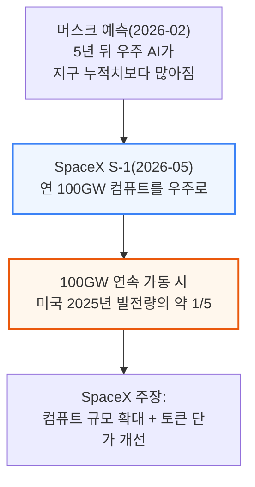

xAI가 SpaceX에 합병된 것(동일 지배하 조직 재편)도 우주 기반 컴퓨트 확대가 배경 중 하나로 명시됐고, SpaceX 상장 계획의 핵심 축이기도 합니다.

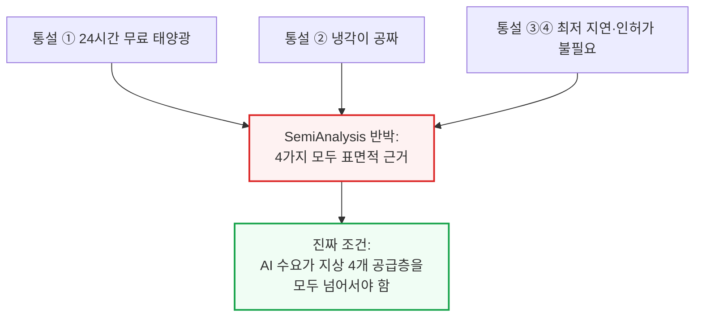

오늘날 기술로 우주 컴퓨트를 배치하는 비용은 지상 대비 여러 배 비싸며, 방사선 차폐·고장 대응 같은 신뢰성·정비 문제도 아직 풀리지 않았습니다. 이번 글은 4부로 구성됩니다 — 1부는 통설 반박, 2부는 지상 5개 공급층, 3부는 TCO 프레임워크, 4부는 우주 데이터센터의 시스템별 자본비용 분해입니다.

**📌 용어 풀이: 4개 공급층과 5번째 "보편" 제약**
> - 지상 데이터센터 전력 조달의 4개 층: ① 계통연계 ② 전환·유휴부지 ③ 자가발전(BTM) ④ 산업생산 확충
> - 이 4개 층이 다 채워져도 반도체 생산 능력이 부족하면 소용없음 — 이것이 지상이든 우주든 똑같이 적용되는 5번째 "보편" 제약
> - 즉 우주 데이터센터가 지상 4개 층의 대안이 되려면, 먼저 5번째 층(반도체 생산)부터 통과해야 함

---

## 2. 논쟁의 구도 - 지상 5개 공급층과 두 개의 시나리오

**📌 핵심:**
- SemiAnalysis 기준안(Base Case)에서는 우주-지상 비용 격차가 2026년 4배 이상에서 시작해 \~2040년 역전(Parity)되고, 2030년대 초에는 우주가 지상보다 약 30%만 비싸질 전망 — 이르면 2030년대 초부터 첫 대규모 우주 데이터센터가 가능해질 수 있음
- 다만 기준안에서는 지상 용량이 여전히 충분해 우주행은 "필수가 아니라 선호·최적화" 문제일 뿐 — 규제·용량 병목이 지상 공급을 심하게 옥죄는 "일론 머스크 시나리오"에서만 우주가 필수가 됨
- 일론 머스크 시나리오에서는 지상 데이터센터 신규 증설이 2028년 정점을 찍고 수십 년간 낮게 유지되는 반면 반도체 생산은 계속 확장 — 이 경우 우주가 대규모 AI 데이터센터 배치의 유일한 대안이 되고 우주 데이터센터 시장(TAM)은 연 수백 GW 규모로 커질 수 있음
- 결론: 우주 데이터센터의 경제성은 "발사 비용이 얼마나 싸지느냐"만이 아니라 "지상 공급이 얼마나 빨리 막히느냐"에 달려 있음 — 두 축을 함께 봐야 함

---

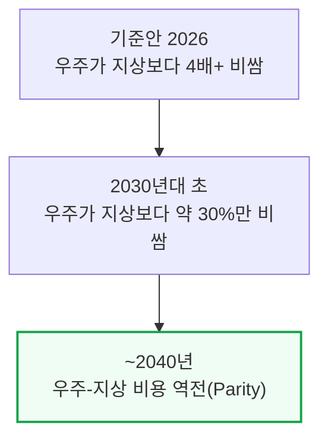

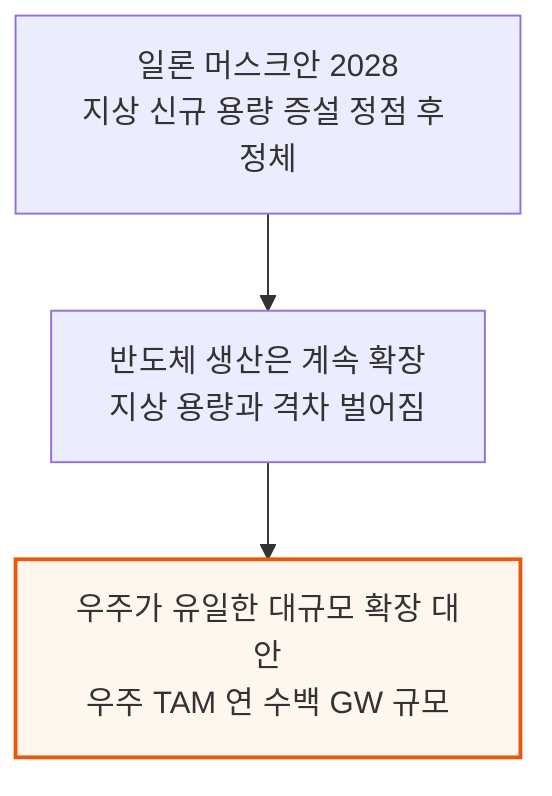

두 시나리오 모두 SemiAnalysis의 표준 산업 모델(가속기 모델·파운드리 모델·데이터센터 모델)과 달리, 확정된 증설 계획이 아니라 "장애물이 전부 극복된 세계"를 가정한 상방(upside) 케이스입니다. 표준 산업 모델은 2027\~2028년 데이터센터 증설이 반도체 제약을 앞지를 것으로 전망합니다.

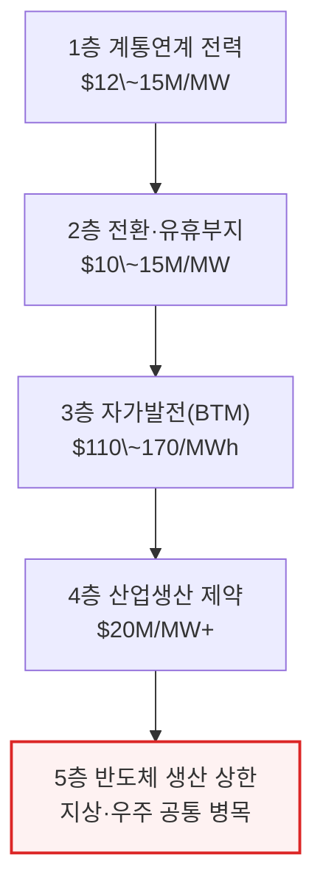

1\~4층을 다 더하면 전 세계 추적 데이터센터 용량(중국 제외)은 2026년 89GW에서 2030년 최대 338GW로 거의 4배 늘어날 전망입니다.
하지만 이 증설은 2\~4층(전환·자가발전·산업생산 확충)을 끌어써야 가능하며, 그 결과 가속기(AI 칩) 수요는 앞으로 몇 년간 반도체 생산 능력에 발목 잡힙니다 — 우주 데이터센터로는 풀 수 없는 문제입니다.
각 층의 구체적인 숫자는 다음 섹션들에서 순서대로 다룹니다.

---

## 3. 통설 반박 ① - 우주에서는 24시간 무료 태양광을 얻는다?

**📌 핵심:**
- 대부분의 궤도는 24시간 햇빛을 받지 못함 — ISS와 스타링크 대부분이 있는 저궤도(LEO, 고도 400\~500km)는 하루 15바퀴를 돌며 약 60%의 시간만 햇빛을 받고, 잠재 일사량 1,361W/m² 중 실제로는 하루 평균 약 800W/m²만 확보
- LEO는 그늘(일식) 구간에 배터리로 IT 전력 100%를 감당해야 해 하드웨어 비용·복잡성이 늘어남 — 대안은 태양동기궤도(SSO, 지구 자전과 반대로 도는 역행궤도)로, 지구의 밤낮 경계선을 따라 돌아 하루 최대 35분만 그늘에 들어감
- SSO도 배터리가 필요 없는 건 아니지만 필요 용량이 LEO보다 훨씬 작아짐 — 다만 전력전자·엔지니어링 복잡성은 여전히 남음
- 결론: "24시간 무료 태양광"은 성립하지 않고, 궤도 선택(SSO)으로 그늘 시간을 최소화하는 것이 현실적인 절충안

---

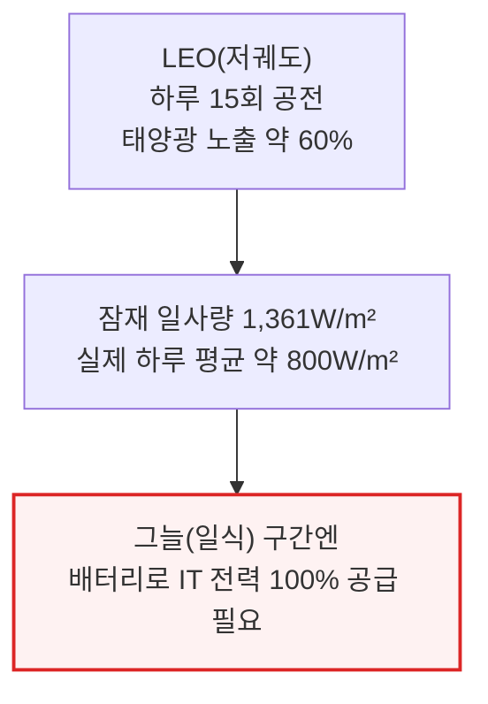

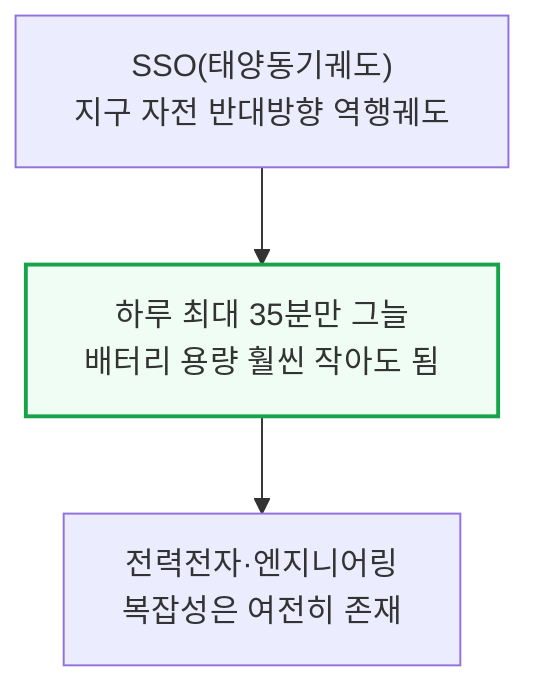

---

## 4. 통설 반박 ② - 우주에서는 냉각이 공짜다?

**📌 핵심:**
- 가장 크게 오해받는 주장 — 우주에서 냉각은 전혀 공짜가 아니고 오히려 정반대임. 지구는 대기가 대류로 열을 실어 나르지만, 진공인 우주에는 대류를 일으킬 매질이 거의 없어 열을 버리는 유일한 방법은 적외선 복사뿐
- ISS의 방열판 시스템은 열 제거 용량이 70kW에 불과(면적 325m², 비용 $3.4\~5억) — 이는 140kW급 GB300 NVL72 랙 1개를 식히는 데 필요한 열량의 절반밖에 안 됨
- ISS 시스템은 30년 전 설계로 비용 거품이 많이 낀 상태지만, 냉각(열 제거)이 우주 데이터센터의 핵심 공학 난제 중 하나라는 사실 자체는 그대로 유효
- 결론: 우주는 차갑지만 "우주라서" 열을 못 버리는 게 아니라 "진공이라서" 대류를 못 씀 — 방열판 설계가 우주 데이터센터에서 가장 구조적인 제약

---

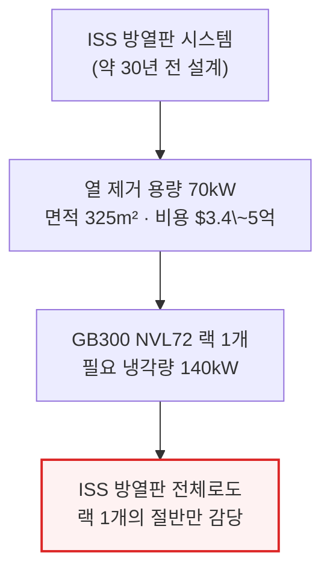

방열판의 물리 원리(스테판-볼츠만 법칙)와 최신 소재·비용 구조는 13장에서 상세히 다룹니다.

---

## 5. 통설 반박 ③④ - 최저 지연시간과 인허가 불필요라는 통설

**📌 핵심:**
- 진공에서 빛보다 빠른 건 없지만 "우주가 최저 지연"이란 주장은 실제로는 복잡함 — LEO 위성은 하루 약 15바퀴를 돌며 특정 지상국 상공에는 한 번에 5\~7분만 머묾, 그 창 밖에서는 트래픽이 다른 위성으로 여러 번 중계돼 편도 30\~80ms 지연이 누적됨
- 인허가도 마찬가지로 "우주엔 없다"는 통설과 달리 우주만의 병목이 있음 — SSO(태양동기궤도)는 LEO의 부분집합일 뿐이라 특정 고도·경사각(약 97\~99˚, 500\~1,000km) 조건을 만족해야 하고, 실사용 가능한 "던던-더스크(dawn-dusk)" SSO 슬롯은 훨씬 더 좁음
- 지구 어디서나 24시간 햇빛을 받는 라그랑주 L1 지점 같은 대안도 있지만, 지구-L1 왕복 300만km를 빛이 오가는 데만 약 10초가 걸려 지연시간이 결정적 결격사유
- 결론: 우주도 지상처럼(계통연계 대기 5\~7년 vs 궤도 슬롯 희소성) 나름의 병목이 있으며, "규제가 없다"는 말은 "아직" 규제가 안 만들어졌다는 뜻일 뿐

---

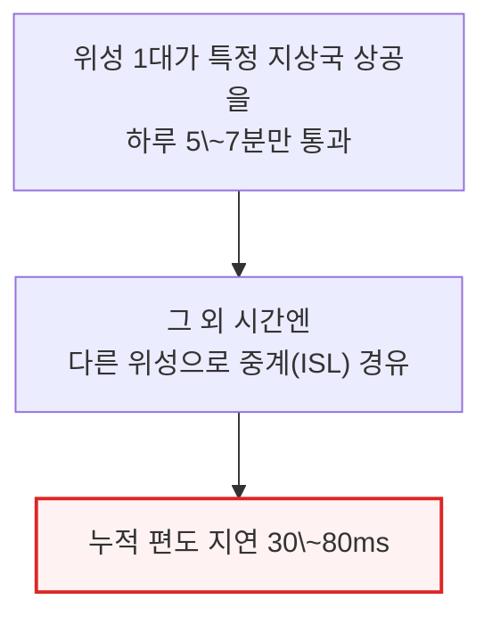

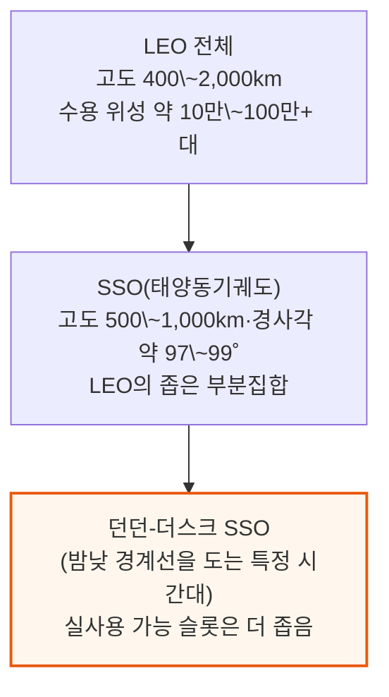

라그랑주 L1처럼 24시간 햇빛을 받는 다른 "궤도"도 있지만, 지구-L1 왕복 300만km 거리를 빛이 오가는 데 약 10초가 걸려 지연시간이 명백한 결격사유입니다.
지상에서도 미국 데이터센터는 계통연계까지 5\~7년을 기다리고 송전망 확충 비용 상승·연구 불확실성을 겪습니다.
이는 「에너지 모델」 최신 확장판에서 다룬 대로 온사이트 가스·자가발전(BTM)이 대기열을 우회하는 수단으로 떠오른 이유이기도 합니다.

---

## 6. 지상 공급 1\~2층 - 계통연계 전력과 전환·유휴부지

**📌 핵심:**
- 1층(계통연계)은 서류상 가장 싸지만($12\~15M/MW) 실제 비용은 전력망 연결 대기 — 북버지니아 PJM 관할은 실제 대기 시간이 약 7년까지 늘어나 초대형 사업자들이 감당하기 어려움
- 미국 ISO 관할권 전체의 계통 신뢰성 여유(수요·예비율 대비 공급 버퍼)는 2021년 70.2GW에서 2025년 18.3GW로 급감, 2026년 15.9GW로 더 좁아진 뒤 2027년부터 마이너스로 전환해 2030년엔 약 40GW 적자에 이를 전망
- 2층(전환·유휴부지)은 비트코인 채굴장 등 기존 전력 인프라를 AI 데이터센터로 전환하는 방식 — Core Scientific·IREN·Cipher Mining·Applied Digital·TeraWulf 5개사만으로 2026년 말까지 약 2GW, 2027년 말까지 약 5GW 규모의 전환이 확정
- 결론: 1GW의 AI 데이터센터 용량이 연 $120\~130억의 매출을 뒷받침할 수 있다는 계산이 나오면서, 오라클이 미시간 1.4GW 부지에 $36.5억을 베팅하는 등 "비싸도 빨리"가 합리적 선택이 되고 있음

---

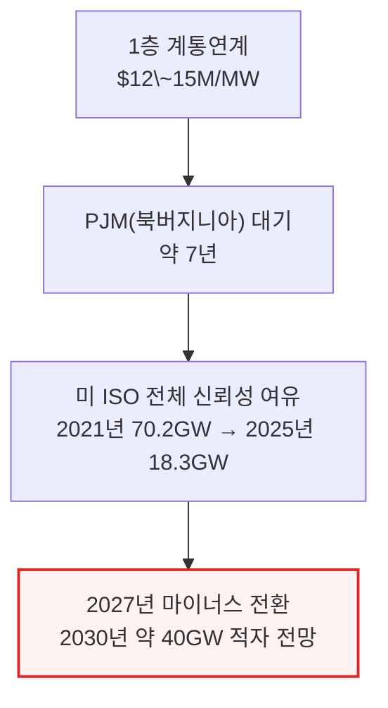

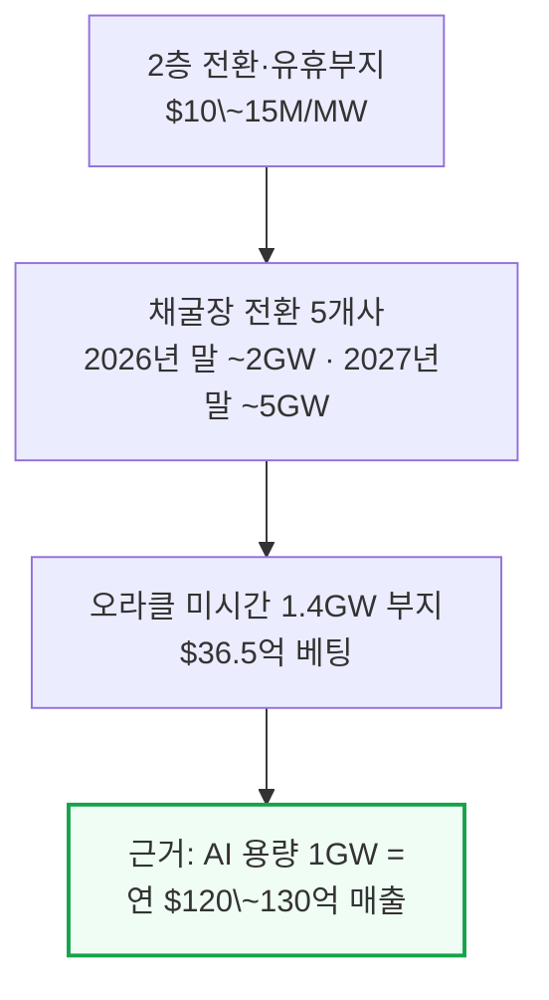

세계 데이터센터 전력 소비는 2024년 약 340TWh(전 세계 발전량의 약 1.1%)에 달했습니다.
AI 전용 수요는 현재 전 세계 발전량의 약 0.3%인데 기준안대로면 2027년경 1.7%를 넘고 2030년엔 5% 가까이, 가속 시나리오에서도 2030년 약 7%(연속 전력수요 약 380GW)에서 멈춥니다.
2027년까지 예정된 전 세계 데이터센터 신규 발전 용량(약 106GW)은 이 가속기 수요를 따라갈 수 있지만, 그 이후로는 계통연계 단독으로 감당이 안 돼 2층·3층으로 넘어가야 합니다.
전환 부지·유휴 부지를 합치면 8\~10GW의 단기 공급을 더할 수 있고 채굴장 전환분만 2028년까지 누적 8GW에 이를 전망이지만, 이 여유분이 소진되면 다음 층(자가발전)으로 넘어갑니다.

---

## 7. 지상 공급 3\~4층 - 자가발전(BTM)과 산업생산 제약

**📌 핵심:**
- 3층(BTM, 계량기 뒷단에 직접 발전기를 놓는 자가발전)은 한때 최후의 수단이었지만, AI 클라우드 계약이 IT 부하 1MW당 연 $1,200\~1,300만의 매출을 뜻한다면 200MW를 6개월 앞당겨 가동하는 것만으로 순현재가치(NPV) $4\~5억이 생김 — 비용은 $110\~170/MWh로 이미 주요 시장 계통 전력($150/MWh 안팎)과 크게 다르지 않음
- BTM은 2025년 신규 AI 데이터센터 전력 증설의 7% 미만이었다가 2028년엔 절반을 차지할 전망이며, 확정된 BTM 용량만 2030년 말까지 누적 26GW — 소형모듈원자로(SMR)는 2030년 이후 1\~3GW 추가 가능성
- 4층(산업생산 확충)은 전력망 부품 자체를 더 만드는 문제 — 대형 변압기는 소수의 방향성 전기강판(GOES) 생산업체에 의존해 리드타임이 전기 설비 중 가장 김, 구리는 채굴 자체가 어려워 최근 1년간 가격이 약 20% 뛰었지만 이는 수요 신호일 뿐 실제 공급 부족은 아님
- 결론: 모듈화·디지털화로 현장 인력 필요량을 50% 넘게 줄일 수 있지만, 수백 GW 규모로 갈수록 숙련 인력 총량 자체가 부족해지고 4층 진입 시 비용은 $20M/MW를 넘어섬

---

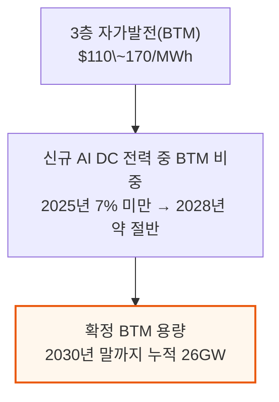

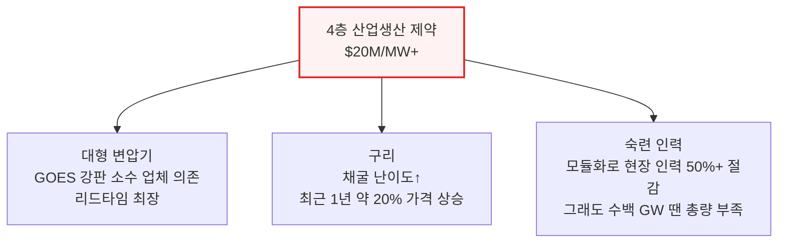

이 4층 전체를 감당할 수 있는 시스템 전체 상한은 2027년까지 연 수십 GW 규모, 비용은 $15\~20M/MW로 6\~7개의 서로 다른 공급망에 걸쳐 있어 한꺼번에 다 조여들지는 않습니다. 이 층이 소진돼야 비로소 우주 데이터센터를 논할 조건이 갖춰집니다.

---

## 8. 지상 공급 5층 - 반도체 생산 상한과 테라팹 구상 검증

**📌 핵심:**
- 4개 층을 다 채워도 소용없는 5번째 "보편" 제약이 반도체 생산 — AI 관련 수요가 TSMC N3 생산량에서 차지하는 비중은 2026년 약 60%에서 2027년 약 86%로 늘어 스마트폰·CPU 물량을 밀어냄, DRAM에서도 AI 수요(주로 HBM)가 2023년 12%에서 2027년 약 70%로 6배 가까이 늘어남
- 반도체 상한이 전력망 상한보다 뚫기 어려운 이유는 "클린룸 물리학" — 클린룸부터 짓고 장비를 넣고 공정을 검증하는 순서를 자본을 아무리 쏟아부어도 크게 앞당길 수 없어, 이 제약이 풀리는 시점은 2027\~2029년이 아니라 2032\~2034년에 더 가까움
- 일론 머스크가 2026년 3월 발표한 「테라팹」 구상(연산 1TW급 공장, 오스틴 $200\~250억 예산, 10만→100만 WSPM 목표, 전체 300mm 파운드리 생산량의 약 70%에 해당)을 SemiAnalysis 수치로 검증하면 규모가 극단적으로 과장돼 있음 — 100만 WSPM은 전 세계 파운드리 생산량의 24%(TSMC 단독의 68%)에 해당하는데, 이런 증설을 10년 안에 해낸 곳은 TSMC뿐이고 TSMC조차 30년이 걸림
- 결론: 테라팹이 부분적으로만 성공해도 의미는 있지만, 공정 IP(GAA 트랜지스터·리소그래피·수율 노하우)는 라이선스 없인 확보 불가능하고 메모리(HBM·LPDDR·NAND) 역시 삼성·SK하이닉스·마이크론과의 장기 계약 없이는 자체 생산이 사실상 불가능

---

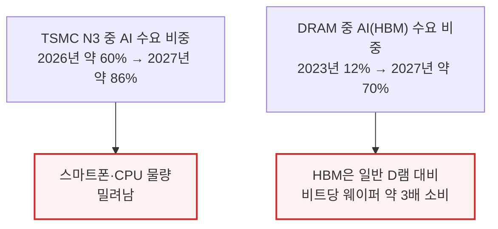

이 제약이 전력망보다 풀기 어려운 근본 이유는 클린룸부터 짓고 장비를 들이고 공정을 검증하는 순서 자체를 자본으로 크게 앞당길 수 없다는 데 있습니다 — 완화 시점은 2027\~2029년이 아니라 TSMC 애리조나·일본 공장이 완전 가동하는 2032\~2034년에 더 가깝습니다.

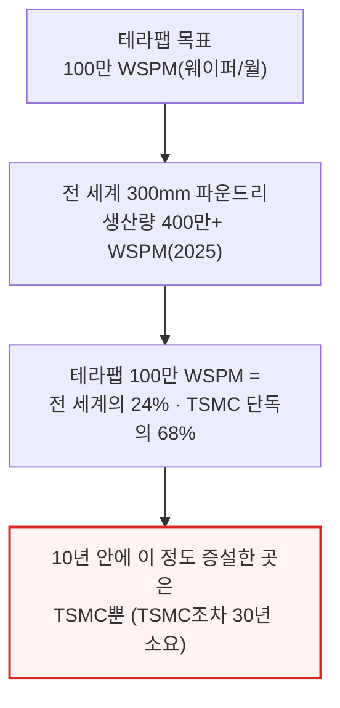

테라팹은 2026년 3월 발표 당시 테슬라·SpaceX·xAI가 오스틴에 공동 건설, $200\~250억 예산으로 시작해 10만 WSPM에서 100만 WSPM까지 늘리겠다는 구상이었습니다.
연면적 1억 평방피트(기가텍사스의 10배·펜타곤 15개 규모)에 10GW 넘는 전력을 끌어다 쓰며, 생산 배분은 우주용 80%·지상용 20%(약 800GW 우주 데이터센터 + 100\~200GW 지상 추론)로 계획됐습니다.
1GW의 배치 컴퓨트에는 로직·메모리·패키징을 합쳐 약 35.4만 개의 웨이퍼 시작이 필요하고(메모리가 60%↑) 웨이퍼 가치는 GW당 약 $30억에 달합니다.
"1TW"를 동시 가동 기준으로 해석하면 연 3.54억 개의 웨이퍼 시작(TSMC 전 세계 생산량의 21배)이 필요해, SemiAnalysis는 이를 "기가팩토리"의 "기가"처럼 브랜딩용 숫자로 봅니다.
테슬라는 자체 제조 공정 IP가 없어 라이선스 확보(라피더스 방식)가 유일한 현실적 경로이며, 메모리 역시 삼성·SK하이닉스·마이크론과의 장기 공급계약 없이는 자체 생산이 사실상 불가능합니다.

---

## 9. TCO 프레임워크 - 헤드라인 숫자

**📌 핵심:**
- 30.5kW급 B300 클러스터(서버 2대에 GPU 16장)를 2026년 배치할 때 총 프로그램 자본비용(IT 클러스터 자본비용 + 데이터센터 자본비용)은 우주 배치 $410만 vs 지상 배치 $140만 — 각 항목의 가중평균자본비용(WACC)·수명을 반영해 월간 총소유비용으로 환산하면 우주 $100,925/월 vs 지상 $27,724/월
- 우주가 더 비싼 가장 큰 이유는 발사 비용 — 데이터센터 자본비용 총 $310만 중 $160만이 발사 비용이며, 우주 데이터센터의 수명이 5년(지상은 15년)에 불과해 월간 평준화 데이터센터 자본비용이 지상보다 18배 높음
- GPU 1시간당 비용(TCO)으로 환산하면 B300 기준 우주 $8.64/hr/GPU vs 지상 $2.37/hr/GPU — 여기에 방사선으로 인한 가동중단·고장 대비 예비 GPU까지 반영한 LCOC(평준화 컴퓨트 비용)는 우주 $10.91/hr/GPU(26% 할증) vs 지상 $2.49/hr/GPU(5% 할증)
- 결론: B300 같은 범용 GPU를 그대로 우주로 보낸다고 가정했지만, 실제로는 테슬라 FSD 칩처럼 더 작고 전력효율적이며 전용화된 칩이 배치될 가능성이 훨씬 높음

---

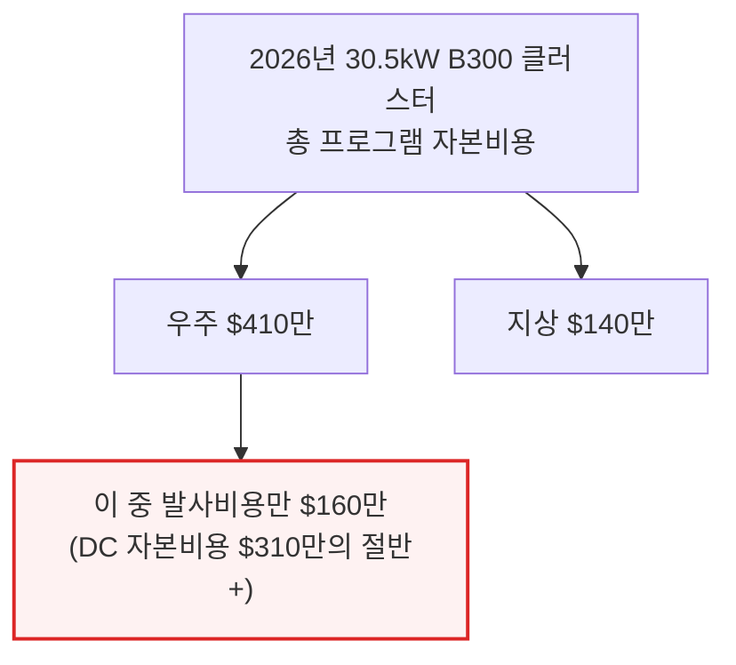

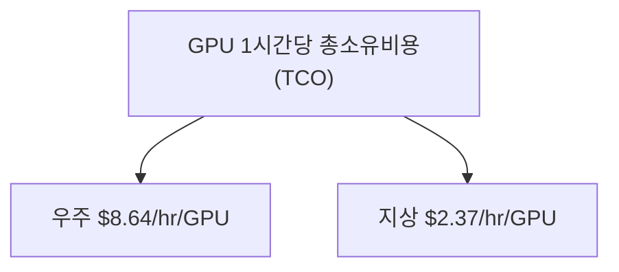

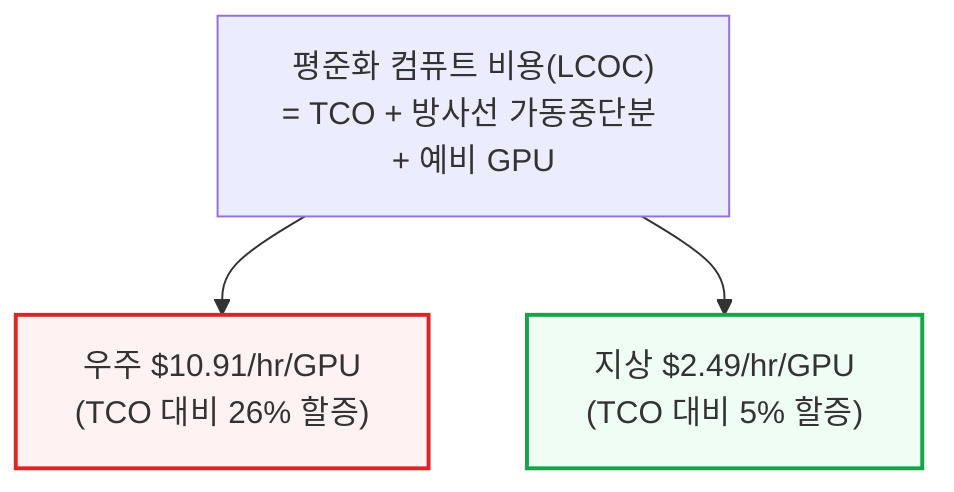

TCO는 IT 클러스터 자본비용·데이터센터 자본비용·운영비용 세 항목으로 나뉘며, 각 항목이 우주와 지상에서 얼마나 다르게 움직이는지는 다음 장에서 항목별로 뜯어봅니다.

---

## 10. TCO 세부 분해 - IT·데이터센터·운영비용

**📌 핵심:**
- IT 클러스터 자본비용은 우주·지상이 거의 같음 — 서버·네트워킹·소프트웨어는 궤도에서나 지상에서나 동일, 다만 번인(가동 전 결함 선별) 비용과 보증 구조만 다름(우주 $980,882 vs 지상 $986,158, 2026년 30.5kW 클러스터 기준). 위험을 반영해 우주 WACC은 초기 15.0%에서 \~10년에 걸쳐 지상과 같은 10.3%로 수렴하도록 가정 → IT 자본비용 우주 $2.00/hr/GPU vs 지상 $1.81/hr/GPU
- 데이터센터 자본비용에서 격차가 가장 크게 벌어짐 — 우주는 토지가 아예 필요 없는 대신 건물·냉각탑·변압기·물리보안을 위성 구조체·방열판·태양광판·버스(위성 몸체) 장비로 통째로 대체, 여기에 발사 비용까지 새로 얹힘(2026년 기준 데이터센터 자본비용 우주 $310만 vs 지상 $38.2만) — 5년 수명(우주) vs 15년 수명(지상)까지 반영하면 평준화 비용은 우주 $6.29/hr/GPU vs 지상 $0.36/hr/GPU로 17배 격차
- 운영비용은 구조가 완전히 뒤집힘 — 지상은 전력 요금·상시 현장 기술인력이 핵심(전기요금 kWh당 8.7센트·가동률 80%·PUE 1.35 가정 시 $0.21/hr/GPU), 우주는 전기요금이 없는 대신(태양광은 이미 자본비용에 반영) 지상관제 운영비가 위성당 배분(월 $4,167 = $0.36/hr/GPU)되는데, 이 비용은 함대 규모가 커질수록 빠르게 희석돼 2030년대 중반엔 $0.15/hr/GPU까지 낮아질 전망
- 결론: 세 항목을 합친 GPU 1시간당 총소유비용은 우주 $8.64 vs 지상 $2.37 — 격차는 전적으로 데이터센터 자본비용(8배 높은 절대금액 × 짧은 수명)에서 비롯됨

---

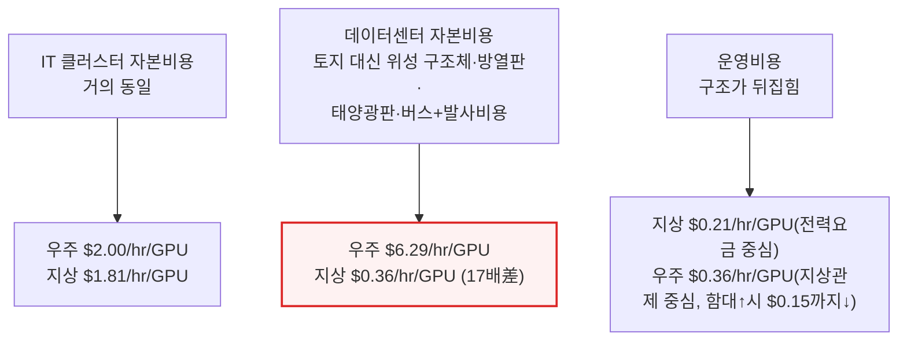

우주 WACC은 미성숙 산업의 위험을 반영해 초기 15.0%로 지상(10.3% 고정)보다 높게 잡되, \~10년에 걸쳐 지상 수준으로 수렴한다고 가정합니다. 세 항목을 다 더하면 GPU 1시간당 총소유비용은 우주 $8.64 vs 지상 $2.37이며, 격차는 거의 전부 데이터센터 자본비용에서 발생합니다.

---

## 11. 우주-지상 비용 역전 시점 - 기준안과 일론 머스크안

**📌 핵심:**
- 기준안에서는 방사선 영향·GPU 신뢰성 같은 핵심 장애물이 \~2040년까지 대체로 해결되고 발사·방열판·태양광 3대 비용이 충분히 낮아진다고 가정 — 이 경우 우주-지상 LCOC(평준화 컴퓨트 비용) 역전은 \~2040년에 일어남
- 일론 머스크 시나리오는 여기에 더해 지상 데이터센터 증설이 훨씬 어려워진다고 가정(지상 자본비용이 현재 $12\~14M/MW에서 약 $55M/MW로 치솟음) 하는 대신 우주 자본비용은 MW당 $11만로 낮아지고, 테라팹이 2040년까지 추가로 100만 WSPM을 보탠다고 가정 — 이 경우 역전 시점이 \~2034년으로 5년 앞당겨짐
- 반직관적인 결과: 일론 머스크안은 발사 비용을 기준안보다 85% 더 낮게($80/kg vs $485/kg) 가정하는데도, 총 프로그램 자본비용은 겨우 8%, LCOC은 겨우 6%만 더 낮아짐 — IT 자본비용이 이미 전체 TCO의 75\~80%를 차지해 발사비용을 더 깎아도 효과가 작기 때문
- 결론: 기준안 대비 일론 머스크안의 지상 누적 용량은 2035년 576GW로 기준안 1,150GW의 절반에 불과 — 지상 용량 부족이 우주 수요를 만드는 핵심 동력이지 발사비용 하락 자체가 핵심 동력은 아님

---

```mermaid
flowchart TD
    BaseAssum["기준안 가정<br/>방사선·신뢰성 문제 해결<br/>발사·방열판·태양광 비용↓"] --> BaseParity["역전 시점 ~2040년"]

    EMAssum["일론 머스크안 가정<br/>지상 자본비용 $12\~14M/MW→$55M/MW<br/>우주 자본비용 $11M/MW·테라팹 반영"] --> EMParity["역전 시점 ~2034년<br/>(5년 앞당김)"]

    style BaseParity fill:#f0fdf4,stroke:#16a34a,stroke-width:2px
    style EMParity fill:#fff7ed,stroke:#ea580c,stroke-width:2px
```

```mermaid
flowchart TD
    LaunchCut["발사비용 85%↓<br/>($485/kg → $80/kg)"] --> CapexCut["총 프로그램 자본비용<br/>겨우 8%↓"]
    CapexCut --> LCOCCut["LCOC 겨우 6%↓"]
    LCOCCut --> Why["IT 자본비용이 이미<br/>TCO의 75\~80% 차지"]

    style Why fill:#fff7ed,stroke:#ea580c,stroke-width:2px
```

우주 데이터센터가 지상 대비 반드시 넘어야 할 또 다른 장애물은 GPU 신뢰성입니다 — 지상 GPU는 연 3\~6%가 사람이 직접 손봐야 하는 고장을 겪습니다.
우주에서는 물리적으로 고칠 수 없어 20% 예비 GPU 확보와 발사 전 번인(사전 스크리닝, 이 기간 조기 고장률이 평상시의 3\~4배인 10\~20%) 비용으로 대응합니다.
일론 머스크 시나리오가 그리는 수요 배경은 전 세계 80억 명이 1인당 100W씩 AI를 상시 사용하는 세계(2030년대 말 800GW 규모, 오늘 AI 수요의 20\~30배, 연 매출 $8조=현재 미국 GDP의 약 28%)입니다.
SpaceX가 S-1에서 제시한 AI TAM $26.5조(기업용 $22.7조+인프라 $2.4조)나 머스크의 "연 100TW" 보상 게이트는 이 800GW 시나리오보다도 125배 큰 규모입니다.

---

## 12. 우주 데이터센터의 구조 - 태양광·방열판·컴퓨트·발사체

**📌 핵심:**
- 우주 데이터센터는 크게 「전력·열」(태양광판+방열판)과 「컴퓨트 페이로드·설비」(GPU·CPU·저장장치·네트워킹) 두 그룹으로 구성 — 지상에서 계통 전력과 냉각탑·시설 용수가 하는 역할을 궤도에서는 각각 태양광 에너지와 방열판이 대신함
- 태양광: 대기 밖 궤도 일사량은 1,361W/m²로 지상 표준시험조건(1,000W/m²)보다 높지만, 지상은 대기 감쇠(맑은 하늘 기준 27%)와 날씨 할인(맑은 지역 20\~25%, 전 세계 평균 40\~50%)을 겪음
- 열은 GPU→콜드플레이트→냉각유체 루프→분배 매니폴드→방열판 패널→우주 순서로 빠져나감 — 펌프 하나가 전체 소비전력의 2\~4%를 추가로 먹지만(지상 PUE 개념과 유사), 이 구조 덕분에 컴퓨트 밀도와 방열판 면적을 분리해 설계할 수 있음
- 결론: 발사체는 전체 설계의 크기·형상 제약을 결정 — 팰컨9(익스펜더블 기준 1.6\~2.28만kg를 5.2m 페어링에 $1,200\~1,700/kg)와 스타십(9m 페어링에 10\~15만kg을 약 $500/kg, 초기 V2는 약 5만kg급)의 격차가 설계 철학 자체를 바꿈

---

```mermaid
flowchart TD
    PowerThermal["전력·열 그룹"] --> Solar["태양광판<br/>궤도 일사량 1,361W/m²"]
    PowerThermal --> Radiator["방열판<br/>유일한 열 배출 수단"]

    style Solar fill:#eff6ff,stroke:#3b82f6
    style Radiator fill:#eff6ff,stroke:#3b82f6
```

```mermaid
flowchart TD
    Payload["컴퓨트 페이로드·설비 그룹"] --> GPU["GPU·CPU·저장장치"]
    Payload --> Network["네트워킹(NVLink+광통신)"]
```

컴퓨트 랙 자체는 팬을 뺀 일반 데이터센터 캐비닛이 아니라, 발사 등급의 압력평형 알루미늄 구조물 안에 액체냉각 트레이(8-GPU 노드+NVSwitch/NVLink)를 담은 형태입니다.
고전압 DC 버스에서 전력을 받아 결함격리형 DC/DC 컨버터를 거쳐 저인덕턴스 구리 버스바로 GPU 트레이까지 분배합니다.
다층단열재(MLI)로 비방열면을 감싸고 궤도 잔해(MMOD) 차폐·방사선 차폐·ECC·워치독 리셋 같은 지상 랙에는 없는 보호 장치를 갖춥니다.
지상국까지의 궤도 지연시간은 LEO 기준 5\~20ms로, 배치 처리·추론 워크로드에는 적합합니다.

```mermaid
flowchart TD
    F9["팰컨9(익스펜더블)<br/>1.6만\~2.28만kg → LEO<br/>5.2m 페어링 · $1,200\~1,700/kg"] --> F9Design["정밀 접이식·경량화 설계 강제"]

    SS["스타십<br/>10만\~15만kg → LEO<br/>9m 페어링 · 약 $500/kg"] --> SSDesign["두껍고 저렴한 표준 알루미늄재<br/>사용 가능"]

    style SSDesign fill:#f0fdf4,stroke:#16a34a,stroke-width:2px
```

---

## 13. 우주 자본비용 세부 ① - 태양광판과 방열판

**📌 핵심:**
- 우주 프로그램 원가 구성은 시간이 갈수록 극적으로 바뀜 — 2026년엔 발사비용(40%)+버스·추진(19%)이 지배적이고 IT 클러스터는 24%뿐이지만, 2032년엔 발사 15%·버스·추진 4%로 줄고 IT 클러스터가 65%까지 커짐(전체 프로그램 비용은 IT 전력 1W당 $132→$65)
- 태양광판은 실리콘 셀(효율 20\~22%, 저렴)이 갈륨비소(GaAs, 효율 28\~32%지만 10\~20배 비쌈)를 이김 — 30kW\~1MW급 규모에서는 실리콘의 무게·비용 이점이 효율 이점을 압도, 셀 단가 $0.30/W 미만에 모듈·기판·하네스를 합쳐 총 $2.70/W(2026)→$2.54/W(2032)
- 방열판은 콜드플레이트(GPU당 $700\~800)+펌프·열교환기($1,000/kg)+방열판 패널(2026년 $3,000\~3,500/m²→2032년 $1,710/m²) 3개 하위 시스템으로 구성 — 스테판-볼츠만 법칙에 따라 온도의 네제곱에 비례해 복사량이 늘기 때문에 "뜨겁게 운전"하는 게 핵심 설계 전략(343K 방열판·255K 우주 배경온도 조건에서 면당 약 880W/m² 배출)
- 결론: 방열판 kW당 비용은 2026년 $4,500에서 2032년 $2,000까지 떨어질 전망(면적당 열배출 2배 개선+면적당 질량 절반 감소) — 다만 궤도 잔해(스페이스 데브리) 증가(SSO 내 추적 물체 연 20% 증가)가 방열판 크기를 오히려 키우는 역방향 압력으로 작용

---

```mermaid
flowchart TD
    Mix2026["2026년 프로그램 비용 구성<br/>발사 40% · 버스·추진 19% · IT 24%"] --> Mix2032["2032년<br/>발사 15% · 버스·추진 4% · IT 65%"]
    Mix2032 --> WPer["W당 전체 비용<br/>$132(2026) → $65(2032)"]

    style WPer fill:#f0fdf4,stroke:#16a34a,stroke-width:2px
```

```mermaid
flowchart TD
    Silicon["실리콘 셀<br/>효율 20\~22% · 저렴"] --> Choice["30kW\~1MW급에서<br/>실리콘 채택"]
    GaAs["GaAs 셀<br/>효율 28\~32% · 10\~20배 비쌈"] --> Choice
    Choice --> Cost["총 $2.70/W(2026) → $2.54/W(2032)"]

    style Choice fill:#eff6ff,stroke:#3b82f6,stroke-width:2px
```

태양광판은 2.5%/년씩 열화돼 5년 임무 종료 시점엔 발사 당시보다 출력이 약 12% 낮아지므로, 설계 단계에서 여분을 얹어 크기를 키웁니다.
더 큰 위협은 궤도 잔해입니다 — ESA는 SSO 내 추적 물체(10cm 이상 약 3.4만 개)가 연 20%씩 늘고 있다고 봅니다.
진짜 위협은 추적조차 안 되는 1cm 미만 입자 1억 3천만 개+로, 초속 7.5km로 충돌하는 1mm 알루미늄 입자 하나가 mm²당 약 15J의 충격을 남깁니다.
얇고 열적으로 민감한 대형 방열판이 특히 취약해 위성을 넉넉히 과설계해야 합니다.

```mermaid
flowchart TD
    ColdPlate["콜드플레이트<br/>GPU당 0.7kg·$700\~800<br/>16GPU 클러스터 $12,480"] --> Loop["펌프·열교환기·유체루프<br/>$1,000/kg · 30kW=15kg=$3만"]
    Loop --> Panel["방열판 패널<br/>2026년 8kg/m²·$3,000\~3,500/m²<br/>2032년 3.5kg/m²·$1,710/m²"]

    style Panel fill:#fff7ed,stroke:#ea580c,stroke-width:2px
```

물리 법칙(스테판-볼츠만)에 따르면 370K에서 운전하는 방열판은 320K일 때보다 면적당 2.3배 많은 열을 버립니다.
그래서 "칩을 최대한 뜨겁게 돌려 방열판을 작게 만드는" 게 핵심 설계 원리이며, 한계는 물리가 아니라 칩 신뢰성(약 85\~90°C 이상에서 고장률 급증)이 정합니다.
소재는 알루미늄 6061-T6를 채택 — 열전도율 167W/m·K로 벌집 구조 없이도 열을 고르게 퍼뜨릴 수 있습니다.
벌집 구조 가공비($800+/m²)를 아끼는 대신 무게를 33% 더 감수하는 쪽이, 스타십의 저렴한 발사 단가에서는 오히려 이득입니다.

**📌 용어 풀이: ISS 방열판이 "1,000배 비싸 보이는" 이유**
> - ISS 열 제거 시스템(EATCS+PVTCS, 총 126kW 용량)은 총 사업비 $5.7\~8.3억, kW당 $450\~660만 — 2026년 30kW 위성 추정치보다 약 1,000배 비쌈
> - 이유는 기술이 아니라 조달 방식: 1980\~90년대 원가가산계약, 부품 하나하나 NASA A급 검증, 우주유영(EVA, 시간당 $10만+)으로 설치, 단품 소량생산
> - 현대 상업용 방열판(Maxar FlexRad·Redwire)은 패널 기준 m²당 $1,500\~2,000로, ISS의 암묵적 m²당 $43만 대비 약 300배 저렴 — 대량생산·상업적 관행·현대 제조기법이 만든 격차일 뿐, ISS 숫자를 미래 비용 예측의 근거로 쓰면 안 됨

---

## 14. 우주 자본비용 세부 ② - 버스·추진·구조·조립

**📌 핵심:**
- 2032년 1.5MW급 우주 데이터센터 기준, 콜드플레이트 $45만+펌프·열교환기·매니폴드·유체 $130만이 냉각계 나머지 비용이며, 버스 하드웨어(자세제어·탑재컴퓨터·전력관리분배)는 별도로 ADCS $73.5만+탑재컴퓨터·센서 $10.6만(합산 질량 125kg)이 듦
- ADCS(자세제어시스템)는 별추적기($5만/개×1\~2개, 5각초 이내 정밀도)+반작용휠($20만/개×4개)+마그네토커($1만/축×3축)로 구성 — 태양광판은 해를, 안테나는 지구를 동시에 겨냥해야 함. PMAD(전력관리분배)는 800V를 기준전압으로 삼아, IT 전력이 커질수록 하네스 질량이 비례해서 늘어나 후반기 위성 질량에서 가장 큰 항목 중 하나가 됨
- 추진계는 궤도 진입·자세 유지·수명종료 시 궤도이탈 3가지 목적을 감당 — 지배적 비용은 650km에서 200km로 낮춰 대기저항으로 자연 재진입시키는 수명종료 궤도이탈(약 120\~150m/s, 제논·아르곤 홀 추력기), 최소 추력기 2대가 필요해 소형 위성엔 상대적으로 비쌈(2026년 30kW: $40만, 2032년: $35.4만)
- 결론: 구조·통합(구조 건조질량의 15%, $1,000/kg에서 비용 하락 중)과 조립·통합·시험(AI&T, "10% 법칙"에 따라 하드웨어 조달비의 약 10%, SemiAnalysis 모델은 GPU 제외 비용의 15%에서 시작해 2032년 10%로 수렴)은 부품표엔 안 잡히지만 위성 프로그램에서 가장 큰 비용 항목 중 하나

---

```mermaid
flowchart TD
    ADCS["ADCS(자세제어)<br/>별추적기+반작용휠+마그네토커"] --> ADCSCost["2032년 1.5MW 기준<br/>$73.5만(+탑재컴퓨터 $10.6만)"]

    PMAD["PMAD(전력관리분배)<br/>800V 기준전압"] --> PMADCost["IT 전력에 비례해<br/>하네스 질량 증가<br/>후반기 최대 질량 항목 중 하나"]

    style ADCSCost fill:#eff6ff,stroke:#3b82f6
```

```mermaid
flowchart TD
    Prop["추진계 3대 목적<br/>궤도진입·자세유지·궤도이탈"] --> Deorbit["지배적 비용: 수명종료 궤도이탈<br/>650km→200km, 약 120\~150m/s"]
    Deorbit --> Thruster["홀 추력기(제논·아르곤)<br/>최소 2대 필요"]
    Thruster --> Sub["소형 위성엔 상대적으로 비쌈<br/>2026년 $40만 → 2032년 $35.4만"]

    style Sub fill:#fff7ed,stroke:#ea580c,stroke-width:2px
```

구조·통합 비용은 구조 건조질량의 15%를 kg당 $1,000(하락 추세)로 계산합니다.
조립·통합·시험(AI&T)은 부품별 기계·전기 통합, 기능시험, 환경시험(특히 진공챔버 안에서 궤도 온도 사이클을 재현하는 열진공시험이 가장 비싸고 오래 걸림), 발사장 운영까지 포함합니다.
업계 통칭 "10% 법칙"(하드웨어 조달비의 약 10%)을 따르되, SemiAnalysis 모델은 초기엔 GPU를 제외한 비용의 15%로 더 보수적으로 잡고 2032년까지 10%로 수렴한다고 가정합니다.

---

## 15. 발사 비용 경제학과 우주 운영비용

**📌 핵심:**
- 초기 몇 년간은 발사 비용이 전체 프로그램 비용의 최대 항목 — 현재 수준(kg당 약 $1,750)에서 2026년 30kW 위성 기준 발사비용은 프로그램 비용의 40%를 차지하지만, 스타십이 본격 투입되며 2032년엔 kg당 약 $650으로 떨어져 비중도 14.5%로 축소
- 발사비용을 3개 시나리오(기준안·일론 머스크안·완만한 하락안)로 민감도 분석한 결과, 2028년 이후로는 IT 자본비용이 발사비용을 압도해 발사비용을 극단적으로 낮춰도 LCOC 개선 효과는 미미(2032년 기준 가장 낙관적 시나리오와 가장 보수적 시나리오의 차이는 겨우 $0.007/hr/GPU)
- 팰컨9은 1단만 재사용(20\~30회+), 2단은 매번 새로 제작 — 외부 고객 발사가는 회당 $6,700\~7,000만, 완전원가 반영 내부 원가는 회당 약 $3,100만(kg당 약 $1,350\~1,400)인 반면, 스타십은 두 단 모두 회수·재사용(발사탑 캐치)을 목표로 해 항공사 회전율(연 다회 재사용) 경제학에 가까워짐
- 결론: 우주 운영비용(전력비용은 사실상 자본비용에 흡수, 유지보수는 예비 20%+연 5% 고장률로 대체, 대역폭은 추론 워크로드 기준 Ka밴드 여유 8배, 지상운영은 함대가 커질수록 위성당 원가가 빠르게 희석)은 지상의 전력요금 중심 구조와 완전히 다른 고정비 중심 구조

---

```mermaid
flowchart TD
    L2026["2026년 발사비용<br/>kg당 약 $1,750<br/>프로그램 비용의 40%"] --> L2032["2032년 스타십 투입<br/>kg당 약 $650<br/>프로그램 비용의 14.5%"]
    L2032 --> Diminish["2028년 이후<br/>IT 자본비용이 발사비용 압도<br/>추가 절감 효과 미미"]

    style Diminish fill:#fff7ed,stroke:#ea580c,stroke-width:2px
```

```mermaid
flowchart TD
    F9["팰컨9<br/>1단만 재사용(20\~30회+)<br/>2단은 매번 신품"] --> F9Cost["외부 발사가 $6,700\~7,000만<br/>내부 완전원가 약 $3,100만"]

    SS["스타십<br/>양 단 모두 회수·재사용 목표<br/>발사탑 캐치(Mechazilla)"] --> SSGoal["항공사식 회전율<br/>패드당 연 50회+ 목표"]

    style SSGoal fill:#f0fdf4,stroke:#16a34a,stroke-width:2px
```

SpaceX는 2026년 3월 기준 누적 약 7,400톤을 궤도에 올려 2023년 이후 전 세계 궤도 질량의 80% 넘게 차지했습니다.
팰컨9은 2025년 한 해에만 165회 발사, 누적 540회 넘는 재사용 부스터 발사와 약 530회 착륙에 성공했습니다.
부스터 설계 수명은 최대 40회(기록은 34회)지만, SpaceX는 회계상 보수적으로 25회까지만 인정합니다.
2026년 5월 22일 발사된 스타십 Flight 12(V3 신형 최초 비행)는 상단이 진공 랩터 엔진 1기를 잃고도 예정된 준궤도 궤적에 도달해 인도양에 착수하며 스타링크 모의위성 22개를 사출하는 데 성공했습니다.
다만 부스터는 착륙 엔진이 1기만 점화돼 걸프만에 시속 약 1,450km로 추락했습니다 — V3 목표는 완전재사용 기준 LEO 100톤+(익스펜더블 기준 최대 200톤).

지상 데이터센터의 전력비용(kWh당 8.7센트, PUE 1.35·가동률 80% 기준 30kW 클러스터 연 약 $2.5만)과 달리, 우주 데이터센터의 에너지 비용은 이미 태양광판 자본비용에 다 들어가 있어 남은 변수는 셀 열화(연 2.5%)뿐입니다.
정비는 팰컨9 단가 기준으로도 위성을 새로 쏘는 것보다 정비 임무가 더 비싸 경제성이 없습니다.
모델은 연 5% COTS(상용 기성품) 고장률(스타링크 실적 2\~3%보다 보수적)을 정비 대신 과잉공급(예비 물량)으로 흡수한다고 가정합니다.
대역폭은 20Gbps Ka밴드 다운링크(실효 평균 17.1Gbps, 위성당 일 185TB)가 추론 워크로드(위성당 GPU 500장×5,000tok/s 가정 시 일 22TB, 이용률 약 12%)에는 8배 여유가 있어 충분합니다.
다만 학습·멀티모달용 대용량 전송에는 광통신 지상망이 별도로 필요합니다.
지상관제·규제 비용(위성함대 1,000대 기준 연 $1억 미만)은 함대 규모가 커질수록 위성당 원가가 빠르게 희석돼, 전체 TCO에서 차지하는 비중은 작습니다.

---

*작성 진행률: 100% 완료 (전체 15장 완료)*
