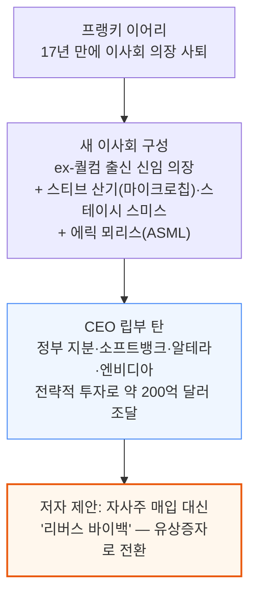
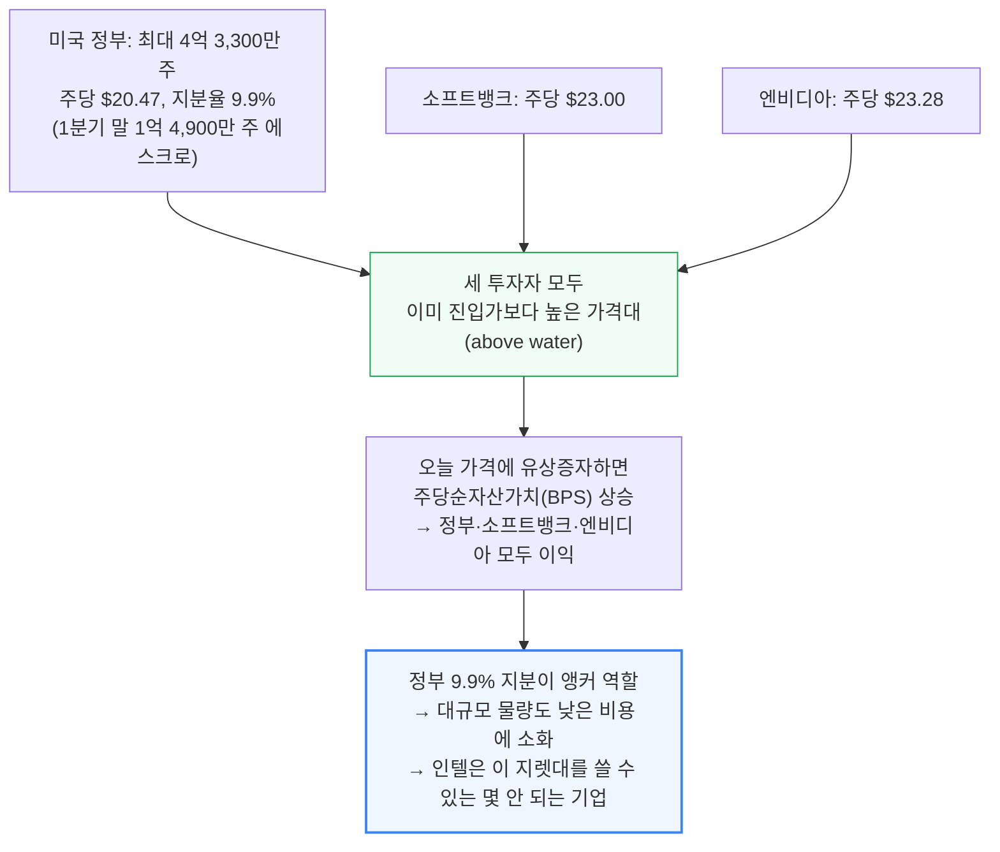
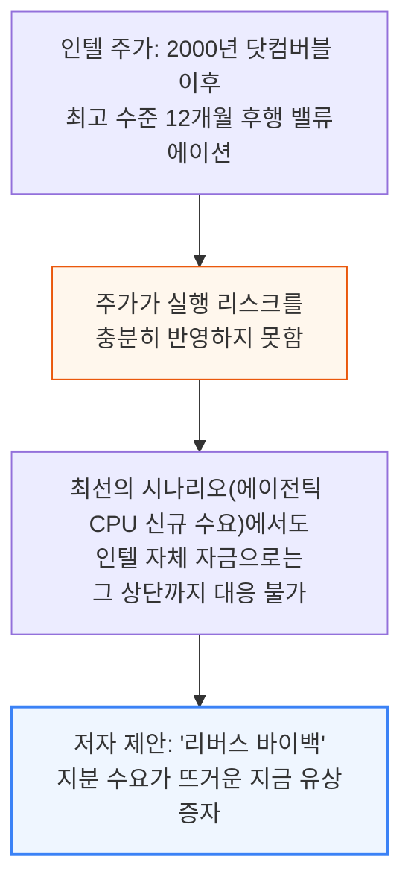

# Intel Should Raise Capital

> **출처**: [SemiAnalysis Newsletter](https://newsletter.semianalysis.com/p/intel-should-raise-capital)
> **저자**: Doug, Sravan Kundojjala, Dylan Patel
> **발행일**: 2026-06-11

---

## 📑 목차

### 전체 섹션
1. [서론 - 이사회 개편과 유상증자로의 전환](#1-서론---이사회-개편과-유상증자로의-전환)
2. [희석은 이미 베팅한 투자자에게 보상이다](#2-희석은-이미-베팅한-투자자에게-보상이다)
3. [인텔은 실행을 위해 자본이 필요하다](#3-인텔은-실행을-위해-자본이-필요하다)
4. [지분이 지금 인텔이 구할 수 있는 가장 싼 돈이다](#4-지분이-지금-인텔이-구할-수-있는-가장-싼-돈이다)
5. [에이전틱 CPU 수요만으론 테라팹 자금을 못 댄다](#5-에이전틱-cpu-수요만으론-테라팹-자금을-못-댄다)
6. [에이전틱 CPU, 테라팹, 14A 램프는 얼마나 커야 하나](#6-에이전틱-cpu-테라팹-14a-램프는-얼마나-커야-하나)
7. [설비투자 전환은 이미 시작됐다](#7-설비투자-전환은-이미-시작됐다)
8. [결론 - 인텔은 400억 달러를 조달해야 한다](#8-결론---인텔은-400억-달러를-조달해야-한다)

---

## 🔑 용어 정리

본문을 순서대로 읽기 전에 알아두면 좋은 용어들입니다. 자세한 수치와 설명은 본문에서 처음 등장하는 위치에 나옵니다.

- **유상증자와 리버스 바이백**: 유상증자는 회사가 새 주식을 발행해 시장에 팔아 현금을 조달하는 것 — 이 글에서는 인텔이 그동안 해온 자사주 매입(바이백, 회사가 자기 주식을 사들여 유통 주식 수를 줄이는 것)과 정반대 방향이라는 뜻에서 "리버스 바이백"이라 표현
- **SCIP(Smart Capital Investment Partnership)**: 외부 투자자에게 공장(fab) 지분 일부를 넘기고 그 대가로 건설 자금을 받는 구조 — 자기자본을 안 써도 되지만, 그 공장이 벌어들일 미래 수익의 일부를 영구히 투자자와 나눠야 함
- **브리지론(Bridge Loan)**: 장기 자금 조달이 끝나기 전까지 급한 자금 수요를 메우려고 쓰는 단기 대출
- **테라팹(Terafab)**: 대형 고객의 확약을 발판으로 한 인텔의 초대형 파운드리 증설 프로젝트 이름
- **에이전틱 CPU(Agentic CPU)**: 이 글에서 인텔의 새로운 성장 동력으로 언급되는 CPU 수요 구분
- **WSPM(Wafer Starts Per Month, 월간 웨이퍼 투입량)**: 한 달 동안 파운드리 공정에 새로 투입하는 웨이퍼 장수 — 파운드리의 생산능력을 나타내는 표준 단위
- **14A**: 인텔의 차세대 파운드리 공정 이름 — TSMC·삼성처럼 "몇 나노"가 아니라 인텔 고유의 세대 표기 방식(A는 옹스트롬 단위)을 사용

---

## 1. 서론 - 이사회 개편과 유상증자로의 전환

**📌 핵심:**
- 프랭키 이어리가 17년 만에 이사회 의장에서 물러나고, 반도체 산업을 실제로 아는 인물들(ex-퀄컴 출신 신임 의장, 마이크로칩 CEO 출신 스티브 산기, ASML 출신 에릭 뫼리스 등)로 이사회가 재편됨
- CEO 립부 탄은 취임 후 미국 정부 지분 투자·소프트뱅크·알테라·엔비디아의 전략적 투자로 약 200억 달러를 조달해 인텔을 벼랑 끝에서 되돌림
- 저자(SemiAnalysis)의 제안: 인텔이 주가 약세기에 자사주를 대거 사들였던 관성을 버리고, 지금은 반대로 지분을 팔아야 할 때 — "리버스 바이백"
- 결론: 새 이사회의 다음 대형 전략 베팅은 자사주 매입이 아니라 유상증자여야 함

---

인텔은 약세기 동안 순매수(net buyer)로 자사주를 사들였습니다. 저자는 이제 방향을 바꿔, 주가가 강할 때 지분을 발행하고 그 자금으로 턴어라운드를 더 확실하게 완성해야 한다고 주장합니다.

---

## 2. 희석은 이미 베팅한 투자자에게 보상이다

**📌 핵심:**
- 미국 정부는 최대 4억 3,300만 주를 주당 $20.47에 확보해 서명 시점 지분율 9.9%를 가져갔고(1분기 말 기준 1억 4,900만 주는 아직 에스크로 보관 중), 소프트뱅크는 $23.00, 엔비디아는 $23.28에 매수 — 세 곳 모두 이미 진입가보다 높은 가격대에 있음(above water)
- 오늘 가격에 유상증자하면 이 진입가들보다 훨씬 높은 가격에 새 주식을 파는 것이라 주당순자산가치(BPS)가 오히려 오르고, 정부·소프트뱅크·엔비디아 모두 이득을 봄 — "방금 들어온 투자자를 벌준다"는 통념과 반대 방향
- 정부의 9.9% 지분(주요 투자자로서의 닻 역할)이 있어 대규모 물량도 시장에서 저렴하게 소화됨 — 인텔은 미국 정부가 지분을 쥔 채로 대규모 유상증자를 낮은 비용에 해낼 수 있는 몇 안 되는 기업
- 결론: 지금 유상증자는 기존 투자자에게 손해가 아니라 이익 — "방금 베팅한 사람들에게 보상"이라는 반직관적 결과

---

---

## 3. 인텔은 실행을 위해 자본이 필요하다

**📌 핵심:**
- 인텔은 2000년 닷컴버블 이후 최고 수준의 12개월 후행 밸류에이션을 받고 있지만, 주가는 실제 실행 리스크(팹 램프업 성공 여부)를 충분히 반영하지 않음
- 새로운 수요처인 "에이전틱 CPU"의 최선의 시나리오조차, 인텔이 자체 자금만으로는 그 상단(upside)까지 대응할 수 없음
- 결론: 저자는 지분 수요가 뜨거운 이 시점에 "리버스 바이백"(자사주 매입의 반대, 즉 유상증자)을 실행해야 한다고 제안

---

---

*작성 진행률: 약 40% 완료 (1\~3번 섹션)*
