# Intel Should Raise Capital

> **출처**: [SemiAnalysis Newsletter](https://newsletter.semianalysis.com/p/intel-should-raise-capital)
> **저자**: Doug, Sravan Kundojjala, Dylan Patel
> **발행일**: 2026-06-11

---

## 📑 목차

### 전체 섹션
1. [서론 - 이사회 개편과 유상증자로의 전환](#1-서론---이사회-개편과-유상증자로의-전환)
2. [희석은 이미 베팅한 투자자에게 보상이다](#2-희석은-이미-베팅한-투자자에게-보상이다)
3. [인텔은 실행을 위해 자본이 필요하다](#3-인텔은-실행을-위해-자본이-필요하다)
4. [지분이 지금 인텔이 구할 수 있는 가장 싼 돈이다](#4-지분이-지금-인텔이-구할-수-있는-가장-싼-돈이다)
5. [에이전틱 CPU 수요만으론 테라팹 자금을 못 댄다](#5-에이전틱-cpu-수요만으론-테라팹-자금을-못-댄다)
6. [에이전틱 CPU, 테라팹, 14A 램프는 얼마나 커야 하나](#6-에이전틱-cpu-테라팹-14a-램프는-얼마나-커야-하나)
7. [설비투자 전환은 이미 시작됐다](#7-설비투자-전환은-이미-시작됐다)
8. [결론 - 인텔은 400억 달러를 조달해야 한다](#8-결론---인텔은-400억-달러를-조달해야-한다)

---

## 🔑 용어 정리

본문을 순서대로 읽기 전에 알아두면 좋은 용어들입니다. 자세한 수치와 설명은 본문에서 처음 등장하는 위치에 나옵니다.

- **유상증자와 리버스 바이백**: 유상증자는 회사가 새 주식을 발행해 시장에 팔아 현금을 조달하는 것 — 이 글에서는 인텔이 그동안 해온 자사주 매입(바이백, 회사가 자기 주식을 사들여 유통 주식 수를 줄이는 것)과 정반대 방향이라는 뜻에서 "리버스 바이백"이라 표현
- **SCIP(Smart Capital Investment Partnership)**: 외부 투자자에게 공장(fab) 지분 일부를 넘기고 그 대가로 건설 자금을 받는 구조 — 자기자본을 안 써도 되지만, 그 공장이 벌어들일 미래 수익의 일부를 영구히 투자자와 나눠야 함
- **브리지론(Bridge Loan)**: 장기 자금 조달이 끝나기 전까지 급한 자금 수요를 메우려고 쓰는 단기 대출
- **테라팹(Terafab)**: 대형 고객의 확약을 발판으로 한 인텔의 초대형 파운드리 증설 프로젝트 이름
- **에이전틱 CPU(Agentic CPU)**: 이 글에서 인텔의 새로운 성장 동력으로 언급되는 CPU 수요 구분
- **WSPM(Wafer Starts Per Month, 월간 웨이퍼 투입량)**: 한 달 동안 파운드리 공정에 새로 투입하는 웨이퍼 장수 — 파운드리의 생산능력을 나타내는 표준 단위
- **14A**: 인텔의 차세대 파운드리 공정 이름 — TSMC·삼성처럼 "몇 나노"가 아니라 인텔 고유의 세대 표기 방식(A는 옹스트롬 단위)을 사용

---

## 1. 서론 - 이사회 개편과 유상증자로의 전환

**📌 핵심:**
- 프랭키 이어리가 17년 만에 이사회 의장에서 물러나고, 반도체 산업을 실제로 아는 인물들(ex-퀄컴 출신 신임 의장, 마이크로칩 CEO 출신 스티브 산기, ASML 출신 에릭 뫼리스 등)로 이사회가 재편됨
- CEO 립부 탄은 취임 후 미국 정부 지분 투자·소프트뱅크·알테라·엔비디아의 전략적 투자로 약 200억 달러를 조달해 인텔을 벼랑 끝에서 되돌림
- 저자(SemiAnalysis)의 제안: 인텔이 주가 약세기에 자사주를 대거 사들였던 관성을 버리고, 지금은 반대로 지분을 팔아야 할 때 — "리버스 바이백"
- 결론: 새 이사회의 다음 대형 전략 베팅은 자사주 매입이 아니라 유상증자여야 함

---

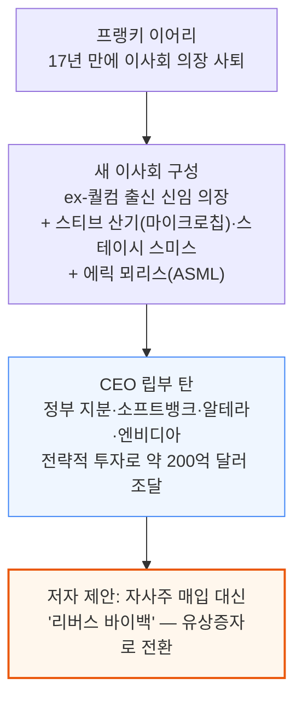

인텔은 약세기 동안 순매수(net buyer)로 자사주를 사들였습니다. 저자는 이제 방향을 바꿔, 주가가 강할 때 지분을 발행하고 그 자금으로 턴어라운드를 더 확실하게 완성해야 한다고 주장합니다.

---

## 2. 희석은 이미 베팅한 투자자에게 보상이다

**📌 핵심:**
- 미국 정부는 최대 4억 3,300만 주를 주당 $20.47에 확보해 서명 시점 지분율 9.9%를 가져갔고(1분기 말 기준 1억 4,900만 주는 아직 에스크로 보관 중), 소프트뱅크는 $23.00, 엔비디아는 $23.28에 매수 — 세 곳 모두 이미 진입가보다 높은 가격대에 있음(above water)
- 오늘 가격에 유상증자하면 이 진입가들보다 훨씬 높은 가격에 새 주식을 파는 것이라 주당순자산가치(BPS)가 오히려 오르고, 정부·소프트뱅크·엔비디아 모두 이득을 봄 — "방금 들어온 투자자를 벌준다"는 통념과 반대 방향
- 정부의 9.9% 지분(주요 투자자로서의 닻 역할)이 있어 대규모 물량도 시장에서 저렴하게 소화됨 — 인텔은 미국 정부가 지분을 쥔 채로 대규모 유상증자를 낮은 비용에 해낼 수 있는 몇 안 되는 기업
- 결론: 지금 유상증자는 기존 투자자에게 손해가 아니라 이익 — "방금 베팅한 사람들에게 보상"이라는 반직관적 결과

---

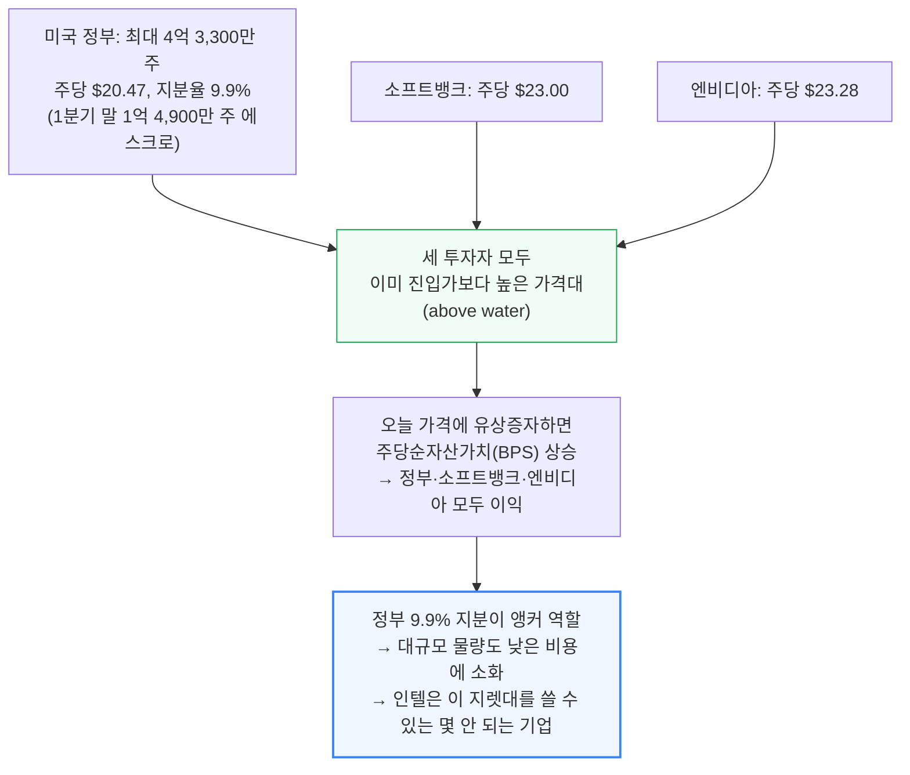

---

## 3. 인텔은 실행을 위해 자본이 필요하다

**📌 핵심:**
- 인텔은 2000년 닷컴버블 이후 최고 수준의 12개월 후행 밸류에이션을 받고 있지만, 주가는 실제 실행 리스크(팹 램프업 성공 여부)를 충분히 반영하지 않음
- 새로운 수요처인 "에이전틱 CPU"의 최선의 시나리오조차, 인텔이 자체 자금만으로는 그 상단(upside)까지 대응할 수 없음
- 결론: 저자는 지분 수요가 뜨거운 이 시점에 "리버스 바이백"(자사주 매입의 반대, 즉 유상증자)을 실행해야 한다고 제안

---

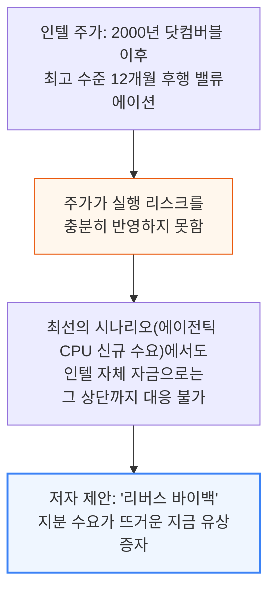

---

## 4. 지분이 지금 인텔이 구할 수 있는 가장 싼 돈이다

**📌 핵심:**
- 인텔은 지분 매각 이외의 조달 수단을 이미 다 시도했음 — 아폴로(Fab 34 지분 49%에 112억 달러 투입, SCIP 구조), 브룩필드(애리조나 공장 자금 구조화), 실버레이크(알테라 지분 51%, 기업가치 87.5억 달러, 인텔 실수령 약 43억 달러), 낸드 사업의 SK하이닉스 단계적 매각, 모빌아이 지분 추가 매각
- 그런데 2026년 3월 31일 인텔은 아폴로의 Fab 34 지분 49%를 142억 달러(현금 약 77억+브리지론 65억 달러)에 되사기로 합의(4월 8일 종결) — 경영진이 이 재매입을 "이익이 되는(accretive)" 거래라 평가한 것은, 애초에 지분을 팔아 조달한 돈이 비싼 돈이었다는 뜻
- 부채는 기존 450억 달러에 아폴로 브리지론 65억 달러가 더해져 약 515억 달러로 늘고, 대형 자산 매각도 이미 상당 부분 소진(알테라 지분 약 48%·모빌아이 지분 약 78%만 남음)
- 결론: 이 밸류에이션에서는 유상증자가 인텔이 대규모로 동원할 수 있는 가장 저렴한 자금 — 단 4\~5% 희석만으로도 약 250억 달러를 조달할 수 있음(저자 추정)

---

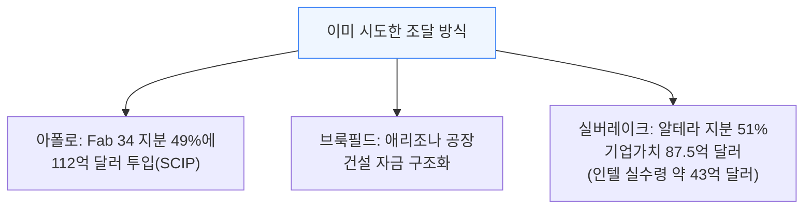

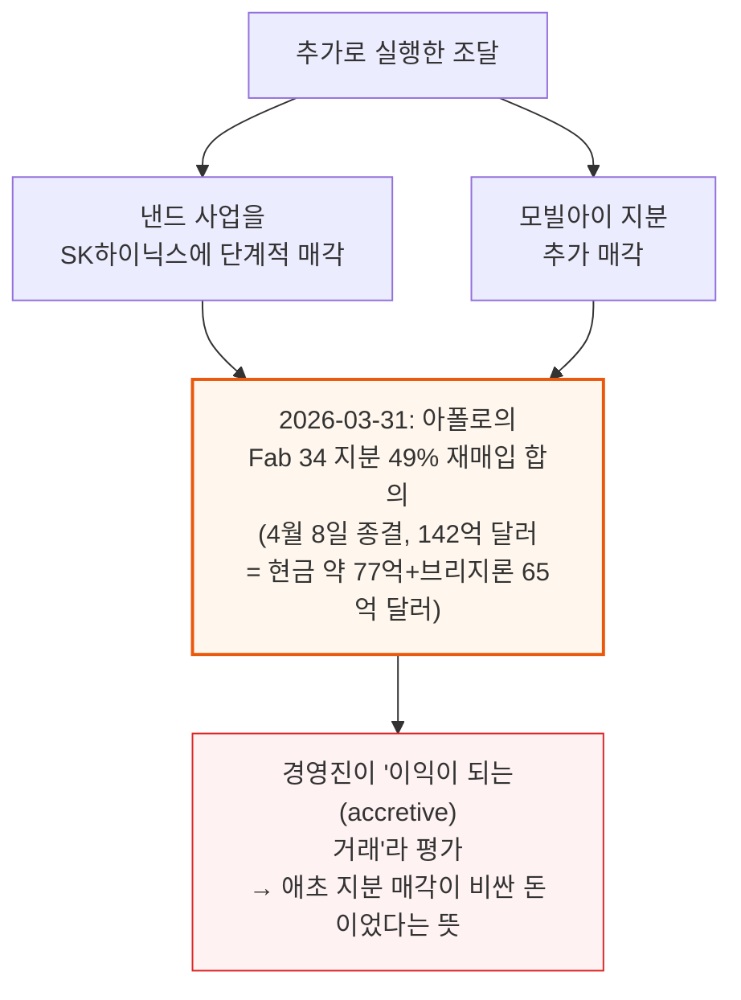

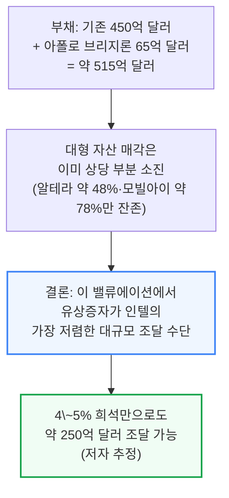

---

## 5. 에이전틱 CPU 수요만으론 테라팹 자금을 못 댄다

**📌 핵심:**
- 스페이스X·테슬라와 테라팹 프로젝트라는 대형 고객 확약이 14A 공정 생산능력 문제를 풀어줌 — 초기 목표는 월 10만 장(WSPM)에서 시작해 월 100만 장까지 확대(쉽지 않은 목표)하는 것으로, 자본 부담이 극도로 큼
- CEO 립부 탄은 고객이 없으면 파운드리 사업을 접겠다고 공개적으로 밝힌 바 있는데, 이제 고객이 확보됐으니 지어야 할 시점
- 주문장부도 채워지는 중 — 엔비디아 DGX 루빈 NVL8은 듀얼 인텔 제온6 호스트 CPU를 채택했고, 구글은 제온·커스텀 IPU를 아우르는 다년 계약을 체결했으며, 샘바노바는 추론용으로 참여 — 웨이퍼 물량이 전부 공개되진 않았지만, 눈에 보이는 수주 장부는 "턴어라운드 스토리"보다 훨씬 낮은 비용으로 자본시장에서 조달 가능
- 결론: 테라팹 전체 다단계 프로젝트 비용은 최대 1,190억 달러 — 스페이스X가 초기 자본을 대지만 인텔도 유의미하게 분담해야 하며, 세레브라스가 55.5억 달러를 조달했다면 시가총액 약 4,980억 달러인 인텔은 250억 달러도 조달할 수 있다는 게 저자의 주장

---

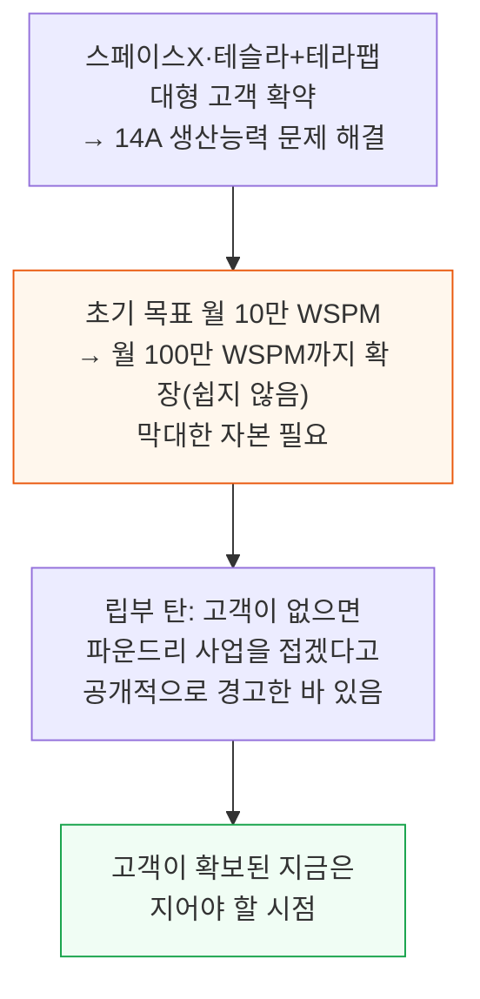

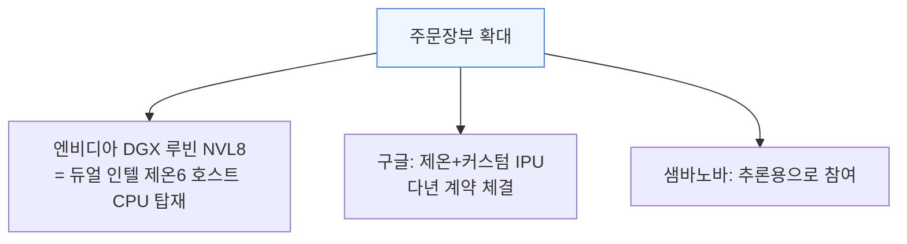

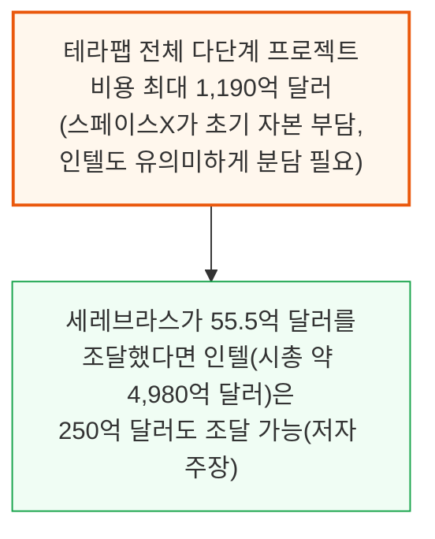

---

## 6. 에이전틱 CPU, 테라팹, 14A 램프는 얼마나 커야 하나

**📌 핵심:**
- TSMC가 설비투자에 보수적인 태도를 유지하는 가운데 N3 공정 생산능력이 18A·14A로 옮겨가는 흐름이 뚜렷 — 저자는 에이전틱 CPU 시장 규모(TAM)를 2,000억 달러로 가정하면 이는 약 10만 WSPM(월간 웨이퍼 투입량)에 해당한다고 추정
- N3 수요 대부분이 가속기일 것으로 보이는데, 그 수요가 갈 곳은 논리적으로 인텔 — CPU 물량만으로도 5만 WSPM이 인텔로 흘러갈 실질적 가능성이 있음
- 여기에 TSMC가 증설하지 않을 경우 소비자용 GPU·네트워킹 칩·스마트폰 칩·FPGA까지 인텔로 옮겨갈 수 있어, 가장 공격적인 시나리오에서는 월 수십만 장 규모까지 커질 수 있음
- 결론: 단순화하면 기존 전망 위에 월 5\~10만 WSPM이 추가로 얹힐 수 있다는 것이 저자의 추정 — 이 정도 규모를 감당하려면 막대한 선행 자본이 필요

---

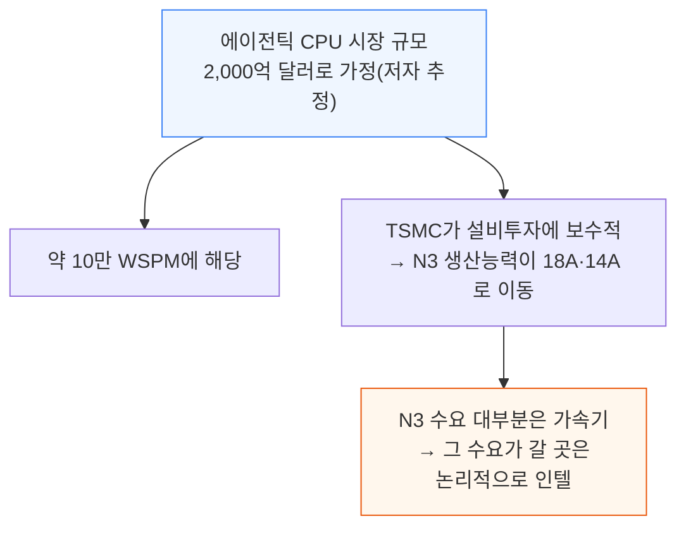

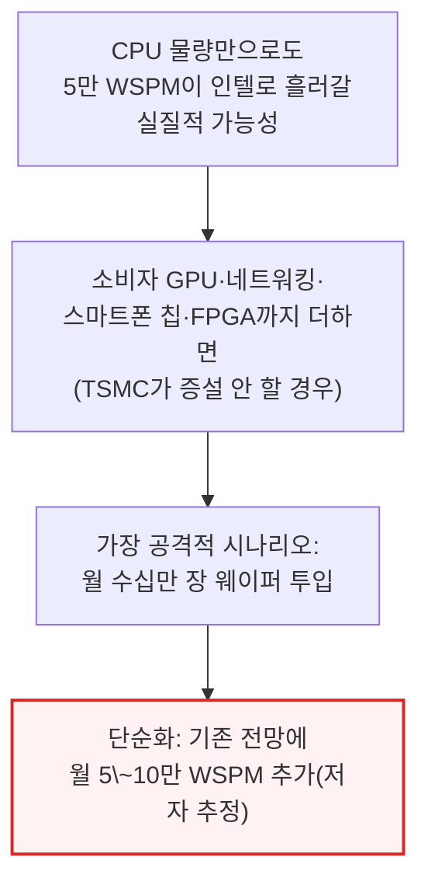

---

## 7. 설비투자 전환은 이미 시작됐다

**📌 핵심:**
- 2025년까지는 설비투자를 미루는 국면이었음(오하이오 공장 2030년으로 연기, 마그데부르크 공장 중단으로 독일 보조금 약 100억 유로 상실) — 그런데 2026년 1분기, 인텔은 연간 설비투자 가이던스를 "전년비 하락"에서 "전년비 보합"으로 상향하고 웨이퍼 생산 쪽에 무게를 실음
- 페낭 첨단 패키징 공장도 증설돼 2027년부터 매출로 전환 시작 — 이번이 이 사태 전체를 통틀어 첫 설비투자 가이던스 상향이며, 테라팹 프레임워크 서명과 같은 분기에 일어남
- 문제는 자금 조달 — 1분기 총설비투자는 약 50억 달러였는데, 이미 확약된 계획만으로도 첨단 장비에 약 330억 달러가 필요하고 공격적 시나리오는 500억 달러에 근접 — 연방 지원(투자세액공제·CHIPS 보조금)은 돈을 먼저 쓴 뒤에야 상환되는 구조라(1분기에 세액공제 6.29억+기타 보조금 1.76억 달러 계상), 이제 막 전환기에 들어선 인텔이 장비 예산 확대분을 선지급할 여력이 없음
- 결론: 저자 추정으로 200\~350억 달러의 자금 공백이 있고, 영업현금흐름이 흑자로 돌아서더라도 이를 메우기엔 부족 — 테라팹이 실제로 진행되면 추가로 수백억 달러가 더 필요

---

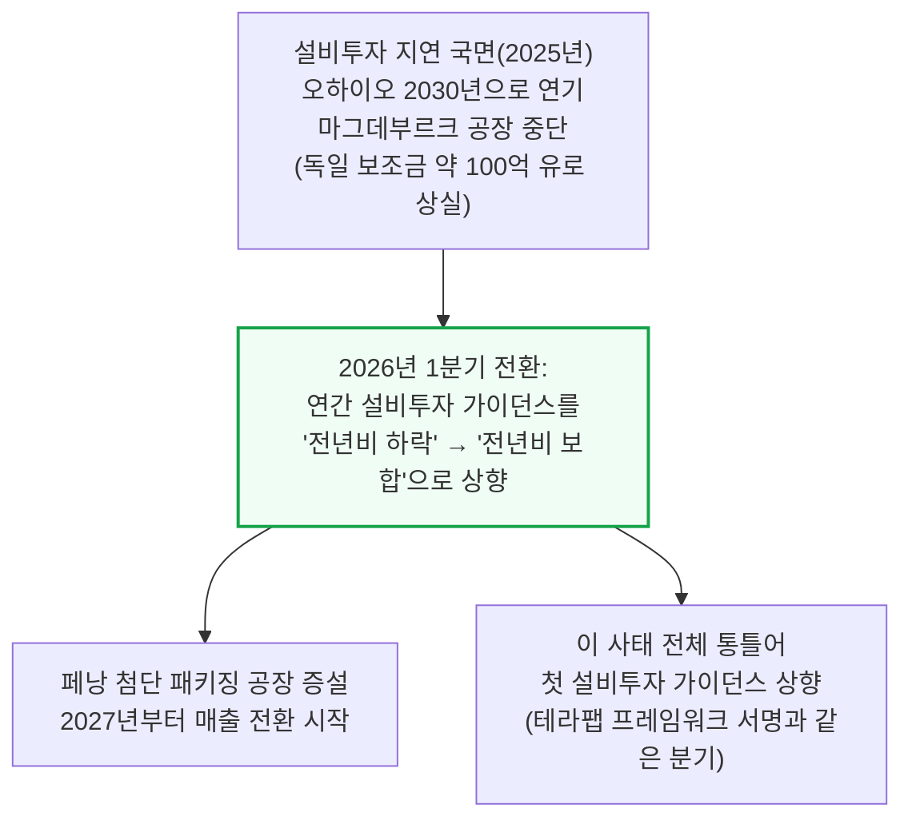

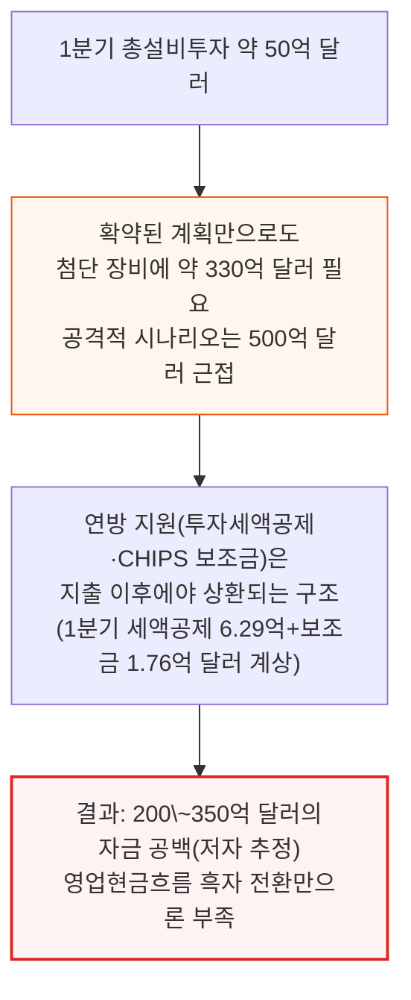

---

## 8. 결론 - 인텔은 400억 달러를 조달해야 한다

**📌 핵심:**
- 모든 신호가 월가가 모델링한 것보다 훨씬 큰 폭의 설비투자 확대를 가리킴
- 순보조금(연방 세액공제·CHIPS 지원 등에서 상환액을 뺀 순효과)은 사업이 막 반등하는 바로 이 시점에 소멸하기 시작 — 지금이 조달의 적기
- 결론: 저자는 인텔이 지금 유상증자로 400억 달러를 조달해야 한다고 결론 — 기회를 최대한 살리고 실제 물량 램프업에 나설 준비를 갖추는 최선의 조치라는 주장

---

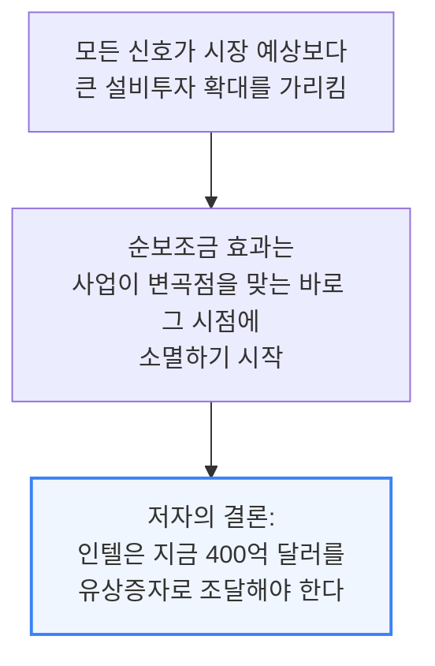

이 글은 SemiAnalysis 저자들의 주장이며, 인텔이 실제로 400억 달러 규모의 유상증자를 발표하거나 시사한 바는 없습니다(발행일 2026-06-11 기준). 위에 인용된 정부·소프트뱅크·엔비디아 투자 단가, 아폴로·실버레이크 거래, 재무제표 수치(부채·설비투자·세액공제)는 인텔이 실제로 공시한 값이고, 400억 달러 조달 규모·4\~5% 희석·200\~350억 달러 자금 공백·에이전틱 CPU TAM 2,000억 달러·WSPM 추정치는 저자들의 자체 추정입니다.

---

*작성 진행률: 100% 완료*
*업데이트: 원문 전체 8개 섹션(서론\~결론) 변환 완료*
