# The Future of Meta Superintelligence: A 1 Year Progress Update

> **출처**: [SemiAnalysis Newsletter](https://newsletter.semianalysis.com/p/the-future-of-meta-superintelligence)
> **저자**: Max Kan, Julien Martin-Prin, Jeremie Eliahou Ontiveros, Dylan Patel
> **발행일**: 2026-07-09

---

## 📑 목차

### 전체 섹션
1. [서론 - 지난 1년, 프론티어 경쟁 구도와 뮤즈 스파크 데뷔](#1-서론---지난-1년-프론티어-경쟁-구도와-뮤즈-스파크-데뷔)
2. [데이터 - RL 환경 공급망과 스크린 레코딩의 가치](#2-데이터---rl-환경-공급망과-스크린-레코딩의-가치)
3. [메타의 RL 환경 스타트업 - 3,000명 규모 애플리케이션 AI 엔지니어링 조직](#3-메타의-rl-환경-스타트업---3000명-규모-애플리케이션-ai-엔지니어링-조직)
4. [컴퓨트 - 인스타그램 광고가 대주는 무한 확장 자금](#4-컴퓨트---인스타그램-광고가-대주는-무한-확장-자금)
5. [타이탄 연결 - Scale-Across 네트워킹과 AI-Backbone](#5-타이탄-연결---scale-across-네트워킹과-ai-backbone)
6. [인재 - MSL 슈퍼팀 조립](#6-인재---msl-슈퍼팀-조립)
7. [리스크 - 성공은 아직 보장되지 않는다](#7-리스크---성공은-아직-보장되지-않는다)
8. [구글에게 주는 조언 - 3위 자리를 둔 진짜 경쟁 상대](#8-구글에게-주는-조언---3위-자리를-둔-진짜-경쟁-상대)

---

## 🔑 용어 정리

본문을 순서대로 읽기 전에 알아두면 좋은 용어들입니다. 자세한 수치와 설명은 본문에서 처음 등장하는 위치에 나옵니다.

- **MSL (Meta Superintelligence Labs, 메타 슈퍼인텔리전스랩)**: 라마4 실패 이후 저커버그가 앤트로픽·오픈AI를 따라잡기 위해 통째로 새로 꾸린 메타의 프론티어 AI 연구조직
- **RL 환경 (Reinforcement Learning Environment)**: AI 모델이 "과제를 실제로 끝까지 수행"하도록 훈련시킬 때 필요한 가상의 작업 공간 — 과제·도구·정답 확인 장치(검증기)를 한 세트로 갖춘 훈련장
- **프론티어 모델 (Frontier Model)**: 현재 시점에서 가장 앞선 성능을 내는 최상위권 AI 모델 — 오픈AI·앤트로픽·구글 등 소수만 만들 수 있는 수준
- **Scale-Across (스케일 어크로스)**: 한 데이터센터로는 감당 못 하는 초대형 AI 모델 학습을, 여러 지역에 흩어진 데이터센터를 하나로 묶어 처리하는 방식
- **AI-Backbone (AIBB)**: 메타가 여러 데이터센터를 서로 연결하기 위해 만든 초고속 네트워크 설계 — 캠퍼스 안과 캠퍼스 사이를 계층별로 연결
- **Tent(텐트)형 데이터센터**: 메타가 공사 기간을 획기적으로 줄이기 위해 쓰는 초고속·간이 건설 방식 — 완성도는 낮지만 훨씬 빨리 가동 가능
- **RSI (Recursive Self-Improvement, 재귀적 자기개선)**: AI가 스스로 더 나은 AI를 만들도록 개선해나가는 것을 목표로 하는 연구 방향 — 프론티어 연구소 특유의 궁극적 목표

---

## 1. 서론 - 지난 1년, 프론티어 경쟁 구도와 뮤즈 스파크 데뷔

**📌 핵심:**
- 라마4 실패로 저커버그가 AI 조직을 통째로 재건한 지 1년이 지남 — 알렉산더 왕을 영입하려 스케일AI에 143억 달러를 쏟아붓고, 최상급 연구자에게 수억\~10억 달러대 보상 패키지를 제시하며 재건
- 그 사이 프론티어 경쟁은 오픈AI vs 앤트로픽 "2강 구도"로 굳어졌고, 구글은 반짝 주목받다 다시 밀려남 — MSL은 올해 4월 뮤즈 스파크(Muse Spark)로 첫 공식 데뷔
- 뮤즈 스파크 단독 성적만 보면 라마3 세대보다 후퇴로 보이지만(비공개 모델인데도 오픈소스 딥시크 V4 프로·Kimi K2.6에 밀림), 저자들은 "지금 위치"가 아니라 "개선 속도"가 핵심이라고 진단
- 결론: 데이터·인재·컴퓨트 3요소를 모두 세계 최고 수준으로 갖출 궤도에 있는 하이퍼스케일러는 메타뿐 — 앤트로픽·오픈AI를 따라잡을 가능성이 가장 높은 후보로 평가

---

### 지난 1년의 재건 - 143억 달러 인재 영입부터 텐트 데이터센터까지

라마4의 처참한 실패가 저커버그로 하여금 AI 조직 전체를 재건하게 만든 지 1년이 조금 넘었습니다.

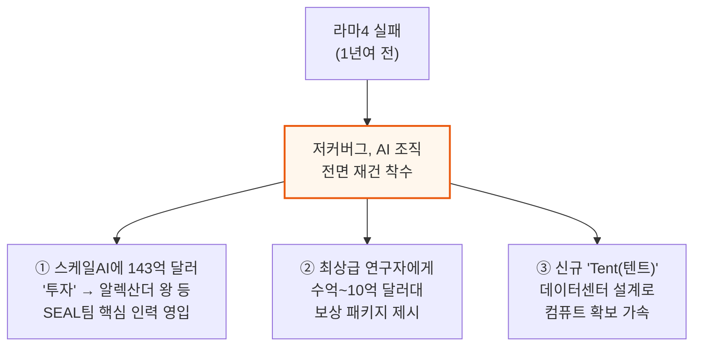

### 프론티어 경쟁 구도 - 2강 체제, 구글은 밀려남

지난 1년 사이 프론티어 AI는 점점 오픈AI 대 앤트로픽의 2강 구도로 굳어졌습니다.

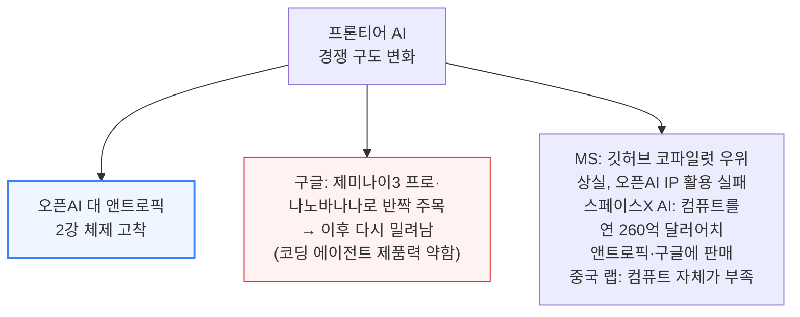

### 뮤즈 스파크 데뷔 - 겉보기 후퇴, 그러나 중요한 건 기울기

MSL은 올해 4월 뮤즈 스파크(Muse Spark) 공개로 첫 공식 데뷔를 했는데, 단독으로 보면 오히려 후퇴처럼 보입니다.

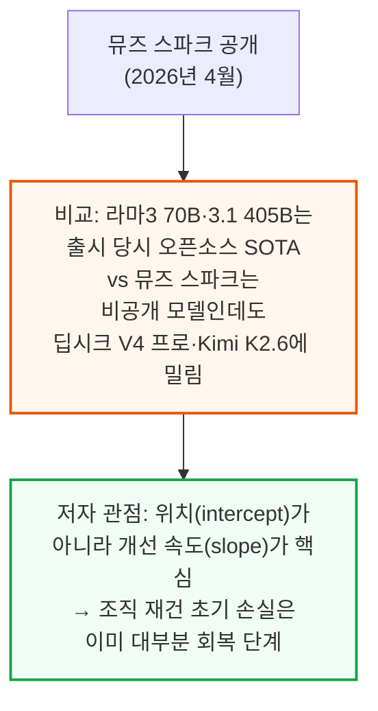

### 3요소 진단 - 데이터·인재·컴퓨트를 동시에 세계 최고 수준으로

프론티어 모델을 만들려면 데이터·인재·컴퓨트 3가지가 모두 필요한데, 저자들은 이 3가지를 동시에 세계 최고 수준으로 갖출 궤도에 있는 하이퍼스케일러는 메타뿐이라고 진단합니다.

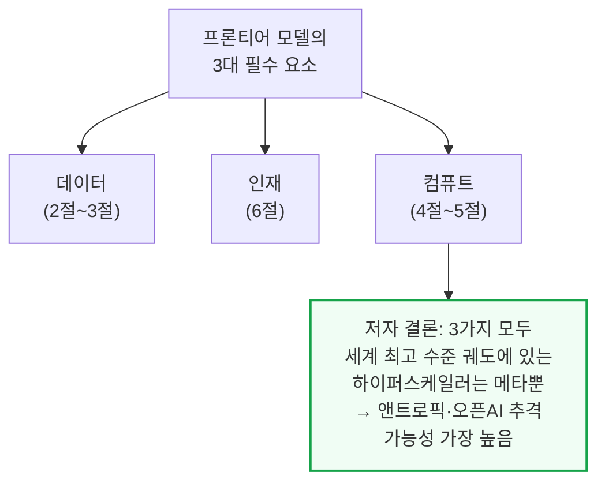

---

## 2. 데이터 - RL 환경 공급망과 스크린 레코딩의 가치

**📌 핵심:**
- "데이터는 AI의 화석연료"라는 일리야 서츠케버의 말은 데이터의 중요성은 맞지만 "좋은 데이터가 유한하다"는 가정은 틀렸다 — 수요가 강하면 시장이 새 공급망을 만들어냄. 실제로 머서·서지·핸드셰이크 3사가 연매출 1억 달러를 넘겼고, 1년도 안 된 신생업체(플릿·메카나이즈·애프터쿼리)도 연매출 1억 달러 안팎에 도달
- RL(강화학습)은 다음 토큰 예측이 아니라 "과제를 끝까지 완수"하도록 훈련하는 방식 — 과제·환경·도구·검증기 4가지가 필요하며, 앤트로픽 리서처 숄토 더글러스는 "지금 알고리즘만으로도 화이트칼라 업무 자동화에 충분하다"고 진단
- 스크린 레코딩(직원의 실제 업무 화면 기록)이 RL 과제 제작에 특히 중요한 이유는 ① 실제 업무를 그대로 반영해 난이도·현실성을 동시에 잡을 수 있고 ② 채점 기준(루브릭) 제작에도 직접 활용 가능하기 때문 — 오픈AI GDPval 같은 벤치마크는 지나치게 인위적으로 설계돼 실제 업무와 괴리가 큼
- 결론: 좋은 RL 과제 하나를 만드는 데 프론티어 랩은 5,000달러 이상을 지불할 용의가 있고, 메카나이즈는 연봉 40만 달러 이상 소프트웨어 엔지니어에게도 주당 1개 과제만 기대할 정도로 난이도 조절이 어려움 — RL 데이터 제작은 이제 지적으로도, 경제적으로도 최상급 직무

---

### "데이터는 유한하다"는 가정의 오류 - 시장이 만든 새 공급망

일리야 서츠케버는 2024년 "데이터는 AI의 화석연료"라 말했지만, 이 비유는 데이터의 중요성은 맞아도 "양이 유한하다"는 전제는 틀렸습니다. 수요가 충분히 강하면 시장이 새로운 공급 경로를 만들어내기 때문입니다.

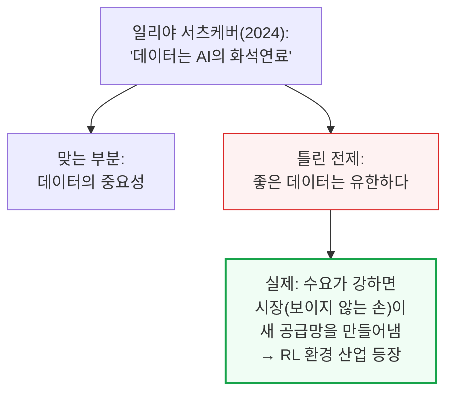

### RL 환경 공급망 - 3강 기업 연매출 1억 달러 돌파, 신생업체도 급성장

머서·서지·핸드셰이크 3사는 이미 연매출(ARR) 1억 달러를 넘겼고, 1년도 안 된 신생업체들도 연매출 1억 달러 안팎에 도달했습니다.

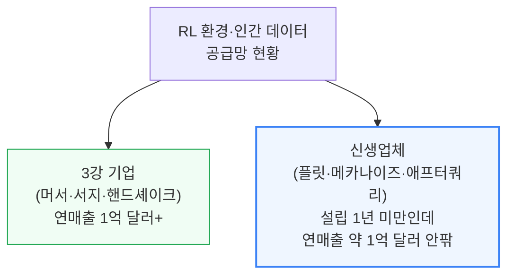

### RL(강화학습)이란 - 다음 토큰 예측을 넘어 "과제 완수"를 가르치는 법

RL(Reinforcement Learning, 강화학습)은 다음 토큰을 예측하는 대신, 버그 수정 같은 과제 하나를 처음부터 끝까지 완수하도록 모델을 훈련하는 방식입니다.

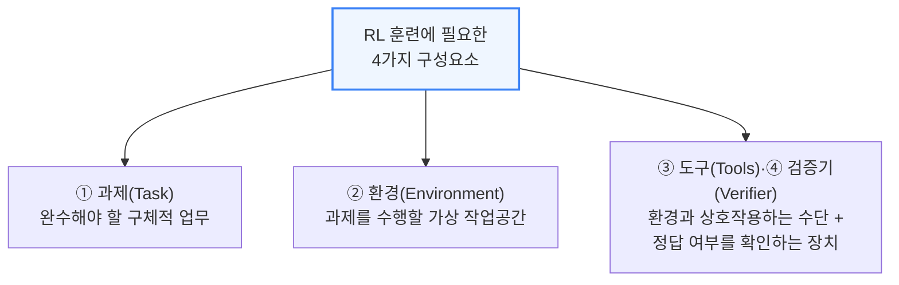

📌 용어 풀이: "지금 알고리즘만으로도 충분하다"는 진단
> - 앤트로픽 리서처 숄토 더글러스는 드워케시 팟캐스트에서 "알고리즘 발전이 멈추더라도, 지금 알고리즘 스위트만으로도 올바른 종류의 데이터만 충분하면 화이트칼라 업무를 자동화하기에 충분하다"고 언급
> - 화이트칼라 업무 전체의 급여 시장(TAM) 규모에 비하면 이 투자는 지극히 사소한 비용이라는 의미

### 스크린 레코딩의 진짜 가치 - 현실성과 채점 기준(루브릭) 양쪽에 기여

스크린 레코딩(직원의 실제 화면·키보드·마우스 기록)은 단순 모방 학습(SFT)용이 아니라, RL 과제 제작에도 결정적으로 중요합니다.

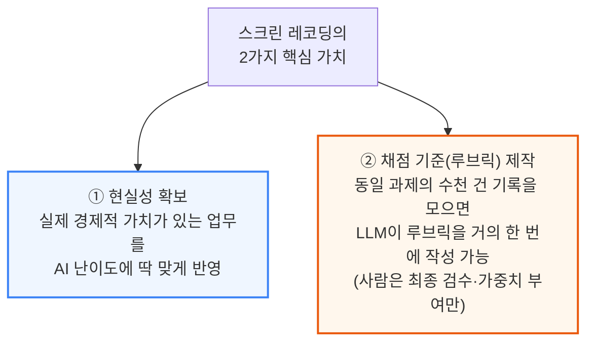

### 기존 벤치마크의 함정 - 오픈AI GDPval의 인위적 설계

오픈AI의 GDPval이나 머서의 Apex 같은 벤치마크(좋은 벤치마크와 좋은 RL 환경은 사실상 동일한 개념)는 실제 업무와 괴리된 인위적 과제로 채워져 있다는 것이 문제입니다.

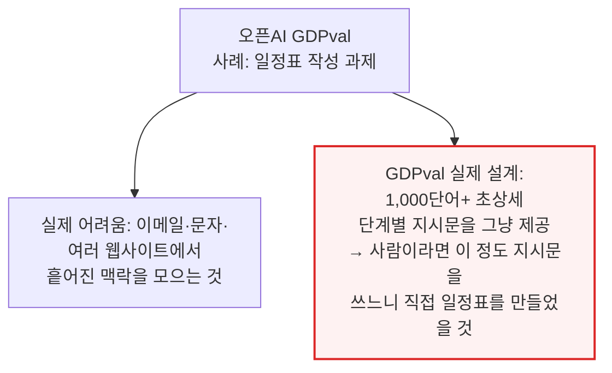

### RL 데이터 제작의 경제적 가치 - 과제 1개당 5,000달러 이상

RL 과제를 만드는 일은 이제 지적으로도 경제적으로도 최상급 직무가 됐습니다. 난이도 조절이 워낙 까다로워, 메카나이즈는 연봉 40만 달러 이상인 소프트웨어 엔지니어에게도 주당 좋은 과제 1개 제작만을 기대합니다.

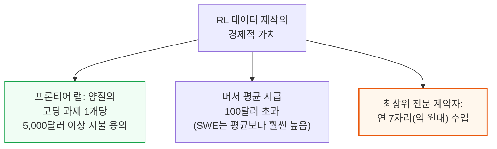

과거처럼 저개발국 저임금 계약자가 경계 상자를 그리거나 텍스트를 분류하던 단순 라벨링 시대는 끝났습니다.
지금은 모델이 이미 충분히 똑똑해져서, 좋은 훈련 데이터 하나를 만드는 일 자체가 실질적인 지적 도전 과제가 됐습니다 — 실패 유형을 깊이 이해하고, 환경이 보상 해킹에 강건하도록 설계하고, 품질 저하 없이 과제 제작을 확장하는 것 모두 만만치 않은 엔지니어링 문제입니다.

---

## 3. 메타의 RL 환경 스타트업 - 3,000명 규모 애플리케이션 AI 엔지니어링 조직

**📌 핵심:**
- 메타가 최근 직원의 화면·키보드·마우스 움직임을 추적하기 시작했다는 뉴스는 세계에서 가장 가치 있는 데이터 중 하나를 확보하는 조치 — 스케일AI 인수를 주도한 알렉산더 왕이 이 전환을 이끈다는 점도 상징적
- 투자은행·법무법인·광고대행사와 제휴하려 애쓰는 다른 데이터 회사들과 달리, 메타는 이 모든 업종에 걸친 사내 대규모 인력을 이미 보유 — PR 타격과 초기 직원 반발에도 밀어붙인 실행력이 인상적(이후 개인정보 보호 강화·30분 추적 일시정지 옵션으로 소폭 후퇴했지만 미미한 양보로 평가)
- 5월 말 구조조정과 함께 신설한 "애플리케이션 AI 엔지니어링 조직"에 약 3,000명 규모 엔지니어(신입의 70%, 다수의 시니어 포함)를 RL 과제·환경 제작 전담으로 배치 — 비교 대상인 머서는 2026년 2분기 251.7만 시간(주 40시간 근무 약 4,800명 상당)을 기록했는데, 메타는 이미 같은 규모이면서 평균 품질은 더 높을 가능성이 있고, 추가로 약 7만 명 풀도 활용 가능
- 결론: 이는 저평가된 MSL의 강점 — 앤트로픽이 지금까지 RL 환경 스타트업으로부터 코딩 데이터를 가장 공격적으로 사들여온 랩이었고, 이것이 앤트로픽 코딩 모델이 뛰어난 핵심 이유 중 하나였는데, 메타는 이제 사내에서 비슷한 규모를 자체 조달할 수 있게 됨

---

### 메타의 데이터 우위 - 사내에 이미 존재하는 업종별 대규모 인력

다른 데이터 회사들은 투자은행·법무법인·광고대행사와 애써 제휴를 맺으려 하지만, 메타는 이 모든 업종에 해당하는 사내 인력을 이미 대규모로 보유하고 있습니다.

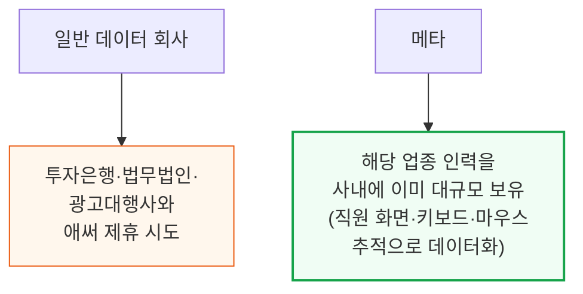

📌 용어 풀이: PR 타격에도 밀어붙인 실행력
> - 메타의 직원 추적 조치는 PR 타격과 초기 직원 반발을 불렀지만, 메타는 이후 개인정보 보호를 강화하고 30분간 추적을 일시정지할 수 있는 옵션을 주는 선에서만 물러섬
> - 저자들은 이를 "매우 미미한 양보"로 평가 — 메타가 여전히 민첩하고 공격적으로 이 데이터 확보를 밀어붙이고 있다는 신호로 해석

### 애플리케이션 AI 엔지니어링 조직 - 3,000명, 신입의 70%

메타는 5월 말 최근 구조조정의 일환으로 새로운 "애플리케이션 AI 엔지니어링 조직"을 발표하며, 약 3,000명 규모 엔지니어(신입의 70%와 다수의 시니어 포함)를 RL 과제·환경 제작 전담으로 배치했습니다.

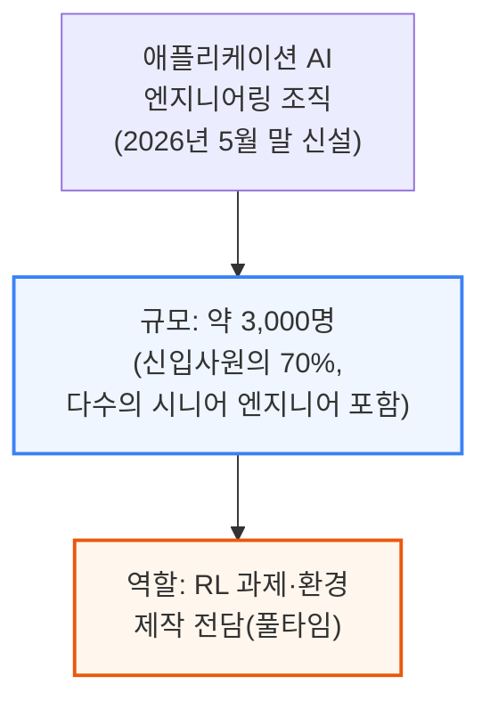

### 규모 비교 - 머서의 251.7만 시간 vs 메타의 3,000명+7만 명 풀

머서는 2026년 2분기 자사 플랫폼에서 251.7만 전문가 시간을 기록했다고 공개했는데, 이는 주 40시간 근무 기준 약 4,800명이 일한 것과 같습니다. 메타는 이미 같은 규모대에 있으면서 평균 품질은 더 높을 가능성이 있습니다.

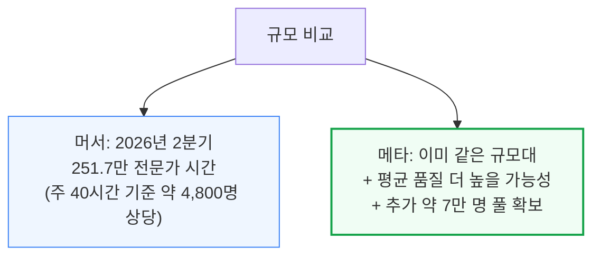

### 왜 저평가된 강점인가 - 앤트로픽의 성공 공식을 사내로 흡수

앤트로픽은 지금까지 RL 환경 스타트업으로부터 코딩 데이터를 가장 공격적으로 사들여온 랩이었고, 이것이 앤트로픽 코딩 모델이 뛰어난 핵심 이유 중 하나였습니다. 메타는 이제 비슷한 규모의 데이터 생산을 사내에서 직접 조달할 수 있게 됐습니다.

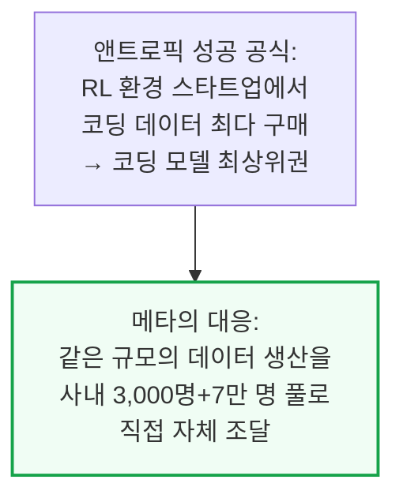

이 3,000명이 단순 무의미한 저수준 데이터 라벨링을 할 것이라는 오해도 짚어볼 필요가 있습니다. 개발도상국 저임금 계약자가 경계 상자를 그리거나 텍스트를 유해물로 분류하던 시대는 이미 끝났고, 지금은 좋은 훈련 데이터 하나를 만드는 일 자체가 실패 유형 이해·보상 해킹 방지·품질 저하 없는 확장까지 요구하는 실질적인 엔지니어링 과제입니다.

---

## 4. 컴퓨트 - 인스타그램 광고가 대주는 무한 확장 자금

**📌 핵심:**
- 메타는 오픈AI·앤트로픽과 달리 하이퍼스케일러급 대차대조표를 갖고 있고, 구글과 달리 컴퓨트를 임대사업으로 팔아야 할 클라우드 사업이 없음 — 게다가 저커버그는 잉여현금흐름(FCF) 마이너스도 감수할 의향이 있어, 세계 어느 기업보다 내부용 AI 컴퓨트를 많이 늘릴 수 있는 위치
- 실제로 SemiAnalysis의 신규 Tokenomics Model은 올해 말 기준 메타의 AI 컴퓨트가 오픈AI·앤트로픽 둘 다를 합친 것보다 많아질 것으로 전망 — 이 중 상당 부분은 광고 추천 시스템(RecSys)·생성형 광고용이지만, MSL에만 배정된 컴퓨트만 따로 떼어 봐도 2026\~2027년 내내 오픈AI·앤트로픽과 비슷한 수준
- 메타는 현재 5개의 1GW급 "타이탄" 클러스터를 동시에 건설 중(오하이오 프로메테우스, 루이지애나 하이페리온, 엘패소·아이오와·인디애나 3곳의 무명 캠퍼스) — 인류 역사상 완전한 1GW 캠퍼스가 동시 건설된 전례가 없었는데(가장 근접한 사례가 AWS의 인디애나 800MW), 메타는 지금 이런 캠퍼스를 2개나 동시에 갖고 있음(하이페리온·아이오와)
- 결론: "미국 데이터센터가 지연되고 겨우 5GW만 건설 중"이라는 항간의 주장은 하이페리온 한 곳(1.5GW 건설 중)만 봐도 신뢰도가 흔들림 — 메타의 건설 속도는 계속 가속 중

---

### 컴퓨트 자금력의 3대 우위 - 대차대조표, 임대 유인 부재, FCF 마이너스 감수

메타의 컴퓨트 확장 여력은 경쟁사 대비 3가지 구조적 우위에서 나옵니다.

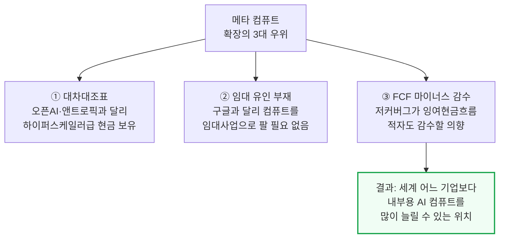

### Tokenomics Model 전망 - 연말 기준 오픈AI+앤트로픽 합산보다 많은 컴퓨트

SemiAnalysis의 신규 Tokenomics Model은 올해 말 기준 메타의 AI 컴퓨트가 오픈AI와 앤트로픽 둘 다를 합친 것보다 많아질 것으로 전망합니다.

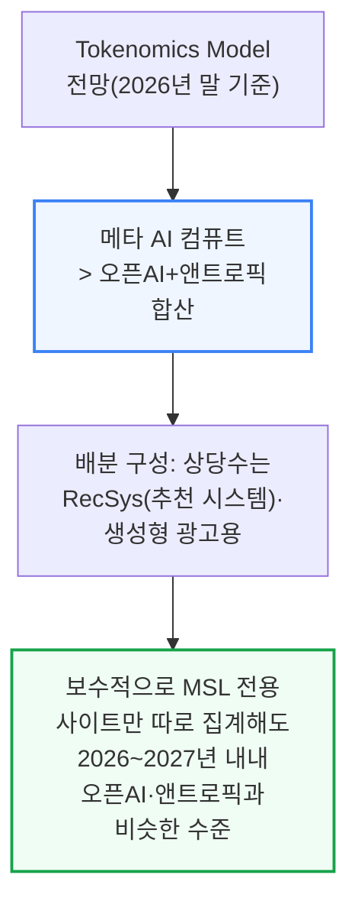

### 5개 타이탄 클러스터 - 전례 없는 동시 건설 규모

메타는 현재 5개의 1GW급 "타이탄" 클러스터를 동시에 건설 중입니다. 인류 역사상 완전한 1GW 캠퍼스가 단 하나라도 동시 건설된 전례가 없었는데(가장 근접한 사례가 AWS의 인디애나 프로젝트 레이니어 800MW), 메타는 지금 이런 캠퍼스를 2개나 동시에 갖고 있습니다.

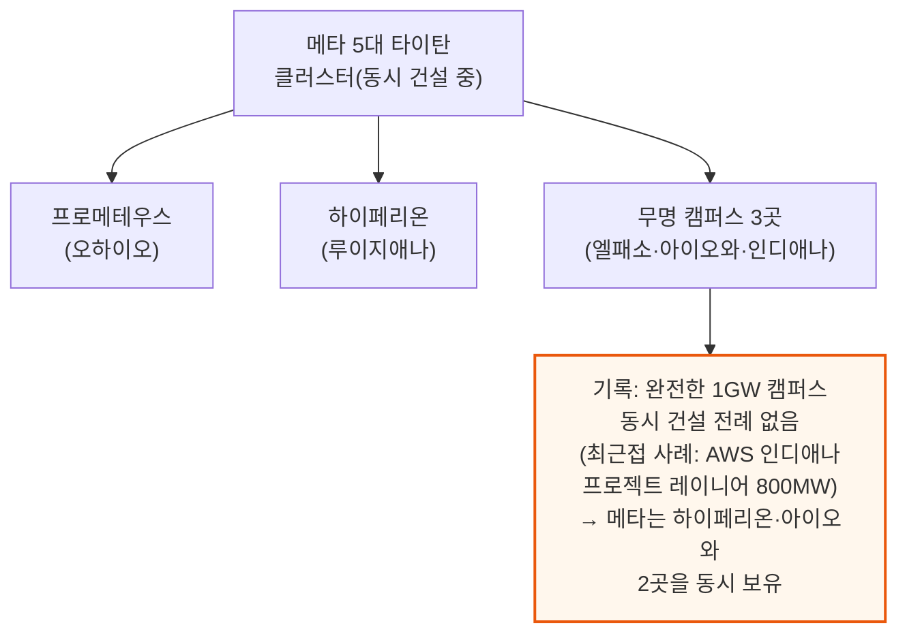

### 하이페리온 - 세계 최대 단일 건물 400MW급 3동

하이페리온에서 메타는 각 400MW급으로 세계 최대 단일 건물을 짓고 있으며, 현재 총 1.5GW가 건설 중입니다.

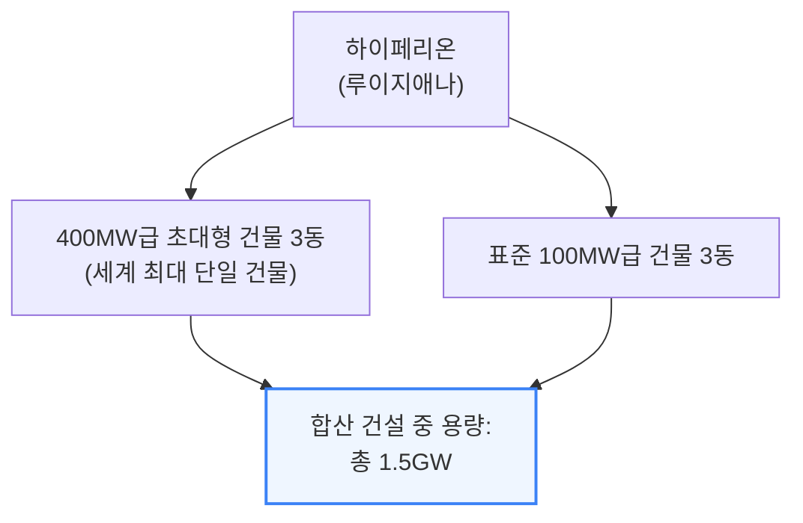

### 아이오와 - 1년 만에 0에서 1GW 완전 건설로

아이오와에서는 메타가 대형 데이터센터 사업자와 1GW 임대 계약을 체결했으며(2025년 6월 SemiAnalysis Datacenter Model이 최초 포착), 위성 사진 기준 불과 1년 만에 무(無)에서 완전한 1GW 건설로 전환됐습니다.

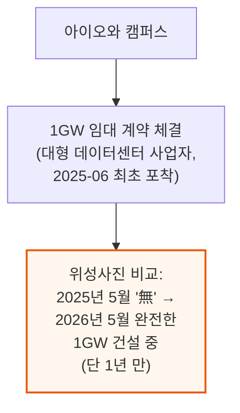

### 프로메테우스 - 1GW에서 2년 만에 3GW+로 계속 확장

프로메테우스는 이미 일부 가동 중이며, 완성도는 낮지만 빠르게 짓는 "텐트" 데이터센터 설계를 전면 채택한 클러스터입니다. 초기 약 1GW에서 2년 이내 3GW 이상으로 계속 확장 중입니다.

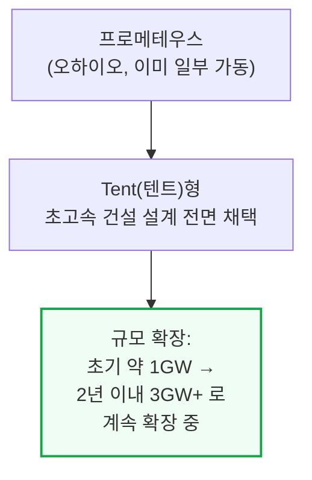

📌 용어 풀이: "미국 데이터센터 절반 지연" 주장이 왜 신뢰도가 흔들리나
> - 항간에는 "미국 데이터센터 절반이 지연됐고 겨우 5GW만 건설 중"이라는 주장이 퍼져 있음
> - 그러나 하이페리온 한 곳만 봐도 이미 1.5GW가 건설 중 — 캠퍼스 단 1곳의 물량만으로도 주장된 "5GW"의 3분의 1에 육박해, 전체 주장의 신뢰도 자체가 흔들림

---

## 5. 타이탄 연결 - Scale-Across 네트워킹과 AI-Backbone

**📌 핵심:**
- 메타는 자체 데이터센터를 직접 짓고 운영하기 때문에 인프라를 실제 필요에 맞게 자유롭게 커스터마이징할 수 있음 — 프로메테우스는 단일 캠퍼스가 아니라 6개 캠퍼스에 흩어진 27개 데이터센터의 집합체(5개는 반경 6km 이내, 나머지 1개는 75\~80km 떨어짐)
- 수백MW 규모로 확장하는 것 자체가 열·전력 관리 측면에서 매우 어렵기 때문에 워크로드를 여러 데이터센터에 분산하는 것이 현재의 해법 — 하지만 이 경우 가속기 간 통신이 비효율적이면 초대형 캠퍼스를 짓는 의미 자체가 사라지므로, "Scale-Across(스케일 어크로스)"라는 신규 네트워크 과제가 등장
- 메타의 해법은 AI-Backbone(AIBB) — 기존 10X Backbone의 진화형으로, L3 슈퍼스파인(BAG)이 최대 5개의 DSF 또는 7개의 NSF 스케일아웃 영역을 연결하고, 이 L3들이 다시 단일 L4 Inter-BAG 허브로 집약돼 프로메테우스 전체에 약 22Pbps(페타비트/초)의 양방향 대역폭을 제공
- 결론: 이 설계는 필연적으로 지연시간을 늘림 — DSF·NSF 내부는 1\~10마이크로초인데, 100km 떨어진 사이트는 빛의 전파 속도만으로도 500마이크로초 이상 걸려 비동기 학습 전략이 필수. 프리트레이닝은 한 지역 내 동기 처리, RL은 전 세계에 분산 처리가 가능하며, 프로메테우스 이후의 타이탄들은 최대 2,000km 이상 떨어진 캠퍼스까지 연결할 계획

---

### 프로메테우스의 실제 구조 - 6개 캠퍼스, 27개 데이터센터의 집합체

메타는 자체 데이터센터를 직접 짓고 운영하기 때문에 인프라를 실제 필요에 맞게 자유롭게 커스터마이징할 수 있습니다. 프로메테우스가 대표적 사례로, 단일 캠퍼스가 아니라 6개 캠퍼스에 흩어진 27개 데이터센터의 집합체입니다.

```mermaid
flowchart TD
    PrometheusStruct["프로메테우스<br/>실제 구조"] --> DC27["27개 데이터센터,<br/>6개 캠퍼스에 분산"]
    DC27 --> Near["5개 캠퍼스:<br/>반경 6km 이내<br/>서로 인접"]
    DC27 --> Far["1개 캠퍼스:<br/>나머지와 75~80km 떨어짐"]
    style Near fill:#eff6ff,stroke:#3b82f6
    style Far fill:#fff7ed,stroke:#ea580c,stroke-width:2px
```

### 왜 여러 데이터센터로 쪼개나 - 수백MW 확장의 열·전력 난제

수백 메가와트 규모로 확장하는 것 자체가 열·전력 관리 측면에서 매우 어렵기 때문에, 워크로드를 여러 데이터센터에 분산하는 것이 현재의 해법입니다.

```mermaid
flowchart TD
    Challenge2["수백MW 확장의<br/>기술적 난제"] --> Thermal["열·전력 관리가<br/>단일 시설 기준으로는<br/>매우 어려움"]
    Thermal --> Solution2["해법: 워크로드를<br/>여러 데이터센터에 분산<br/>(100MW를 훨씬 넘는<br/>학습 컴퓨트 필요)"]
    Solution2 --> NewProblem["새 문제 발생:<br/>네트워킹<br/>(가속기 간 통신 효율)"]
    style NewProblem fill:#fef2f2,stroke:#dc2626,stroke-width:2px
```

### AI-Backbone(AIBB) 구조 - L3 슈퍼스파인부터 L4 허브까지

메타의 해법은 AI-Backbone(AIBB)으로, 기존 10X Backbone의 진화형이며 AI와 초대형 클러스터 전용으로 설계됐습니다.

```mermaid
flowchart TD
    AIBB["AI-Backbone(AIBB)<br/>구조"] --> L3["L3 슈퍼스파인(BAG)<br/>최대 5개 DSF 또는<br/>7개 NSF 스케일아웃 영역 연결<br/>(혼합 구성도 가능)"]
    L3 --> L4["단일 L4 Inter-BAG 허브<br/>프로메테우스 전체에<br/>약 22Pbps(페타비트/초)<br/>양방향 대역폭 제공"]
    style L4 fill:#eff6ff,stroke:#3b82f6,stroke-width:2px
```

📌 용어 풀이: DSF·NSF·BAG이 뭔가
> - DSF(Disaggregated Scheduled Fabric)와 NSF(Non-Scheduled Fabric)는 각각 하나의 데이터센터 룸 안에 들어가는 스케일아웃(가속기 간 통신) 영역 — 실제 GPU들이 모여 있는 물리적 단위
> - BAG(Backend Aggregation)는 L3 슈퍼스파인의 별칭으로, 여러 DSF·NSF 영역을 하나의 캠퍼스 안에서 묶어주는 계층 — L3는 캠퍼스 내부, L4는 캠퍼스 사이를 연결한다는 점이 핵심 차이

### 캠퍼스 간 연결 방식 - LR 광학과 DWDM(파장분할다중화)

L3와 L4 사이의 연결은 다른 캠퍼스까지의 거리에 따라 LR 광학과 ZR 광학을 쓰는 DWDM(Dense Wave Division Multiplexing, 고밀도 파장분할다중화) 시스템을 혼용합니다. DSF·NSF는 데이터센터 룸 하나에 담기지만, L3는 캠퍼스 하나에, L4는 캠퍼스 사이를 잇는 데 쓰입니다.

### 거리가 만드는 지연시간 - 100km에서 500마이크로초

이 설계는 필연적으로 지연시간을 늘립니다. DSF·NSF 내부는 1\~10마이크로초인데, 100km 떨어진 사이트는 빛의 전파 속도 물리적 한계만으로도 500마이크로초 이상 걸립니다.

```mermaid
flowchart TD
    Latency2["지연시간 비교"] --> Inside["DSF·NSF 내부:<br/>1~10마이크로초"]
    Latency2 --> Outside["100km 떨어진 사이트:<br/>500마이크로초 이상<br/>(빛의 광섬유 전파속도<br/>물리적 한계)"]
    Outside --> Async["결과: 학습에<br/>비동기 전략 필수"]
    style Outside fill:#fff7ed,stroke:#ea580c,stroke-width:2px
    style Async fill:#eff6ff,stroke:#3b82f6,stroke-width:2px
```

### 비동기 학습 전략 - 프리트레이닝은 동기, RL은 전 세계 분산

프리트레이닝(사전학습)은 한 지역 내에서 동기적으로 처리할 수 있지만, RL(강화학습)은 상대적으로 쉽게 전 세계에 분산해 처리할 수 있습니다.

```mermaid
flowchart TD
    AsyncStrat["비동기 학습 전략"] --> Pretrain["프리트레이닝:<br/>한 지역 내 동기 처리"]
    AsyncStrat --> RLDist["RL(강화학습):<br/>전 세계 분산 처리 가능<br/>(지연시간에 덜 민감)"]
    style Pretrain fill:#eff6ff,stroke:#3b82f6
    style RLDist fill:#f0fdf4,stroke:#16a34a,stroke-width:2px
```

프로메테우스가 현재 한계에 대한 해법을 제시하지만, 프로메테우스 이후에 지어질 다른 타이탄들은 최대 2,000km 이상 떨어진 캠퍼스까지 연결하는 훨씬 더 진전된 스케일 어크로스를 구현할 계획입니다.

---

## 6. 인재 - MSL 슈퍼팀 조립

**📌 핵심:**
- 지난해 메타는 패트릭 마홈스(NFL 최고 스타 쿼터백)조차 부러워할 보상 패키지를 AI 연구자들에게 제시하며 유명해짐 — 알렉산더 왕 영입에 140억 달러, 냇 프리드먼·다니엘 그로스의 벤처펀드 인수에 10억 달러 이상을 쓴 뒤, 2025년 6월 말까지 최소 14명의 연구자를 영입(대부분 前 오픈AI, 일부는 앤트로픽·구글 출신 — 성지아 자오·트라핏 반살·조엘 포바르·잭 레이 등)
- 이후에도 영입은 계속됨 — 씽킹 머신즈 공동창업자 앤드류 털록, 씽킹 머신즈 창립멤버 3인(조슈아 그로스·마크 젠·잉하이 루), 前 오픈AI 3인(제이슨 웨이·현원 정·즈칭 순) 등 기술 인력 다수 추가
- MSL은 기술 인력만 영입한 게 아님 — 올해 1월 트럼프·부시 전 대통령 자문 출신의 금융통 디나 파월 매코믹을 사장 겸 부회장으로 영입해 컴퓨트 함대 구축을 지원하게 했고, 같은 맥락으로 4월에는 오픈AI 컴퓨트팀의 "삼총사"(피트 회셸레·아누즈 사하란·샤메즈 헤마니)까지 영입(다만 이 중 1명은 인프라 조직 문화 문제로 이미 퇴사)
- 결론: 스포츠팀이 갑자기 스타 선수 영입에 돈을 쓰기 시작할 때처럼, 이 새 슈퍼팀이 실제로 우승컵을 들어올릴지는 시간이 말해줄 문제 — 다만 저커버그의 의도는 명확하고, 오늘 기준 다른 어떤 하이퍼스케일러도 이 정도로 자원을 프론티어 도전에 쏟아붓고 있지 않음

---

### 1단계 영입 - 140억 달러 스케일AI, 10억 달러 벤처펀드, 14명+ 연구자

지난해 메타는 패트릭 마홈스조차 부러워할 보상 패키지를 AI 연구자들에게 제시하며 유명해졌습니다.

```mermaid
flowchart TD
    Phase1["1단계 영입<br/>(2025년)"] --> S1["스케일AI 인수 형태로<br/>140억 달러 지출<br/>→ 알렉산더 왕 영입"]
    Phase1 --> S2["냇 프리드먼·다니엘 그로스<br/>벤처펀드 인수에<br/>10억 달러 이상"]
    S2 --> S3["결과: 2025년 6월 말까지<br/>최소 14명 연구자 영입<br/>(대부분 前 오픈AI,<br/>일부 앤트로픽·구글 출신)<br/>— 성지아 자오·트라핏 반살·<br/>조엘 포바르·잭 레이 등"]
    style S1 fill:#eff6ff,stroke:#3b82f6,stroke-width:2px
    style S3 fill:#f0fdf4,stroke:#16a34a,stroke-width:2px
```

### 2단계 영입 - 씽킹 머신즈·오픈AI 출신 추가 확보

이후에도 MSL의 영입은 계속됐습니다.

```mermaid
flowchart TD
    Phase2["2단계 영입<br/>(2025년 하반기 이후)"] --> TM["씽킹 머신즈 출신<br/>앤드류 털록(공동창업자),<br/>조슈아 그로스·마크 젠·<br/>잉하이 루(창립멤버)"]
    Phase2 --> OAI["前 오픈AI 출신<br/>제이슨 웨이·현원 정·<br/>즈칭 순"]
    style TM fill:#eff6ff,stroke:#3b82f6
    style OAI fill:#fff7ed,stroke:#ea580c,stroke-width:2px
```

### 기술 인력만이 아니다 - 금융통 사장 영입과 컴퓨트팀 삼총사

MSL은 기술 인력만 영입한 게 아닙니다. 컴퓨트 함대 구축을 위해 금융·인맥 전문가와 오픈AI 컴퓨트팀 핵심 인력까지 영입했습니다.

```mermaid
flowchart TD
    NonTech["비기술 인력 영입"] --> Dina["디나 파월 매코믹<br/>(2026년 1월, 사장 겸 부회장)<br/>트럼프·부시 전 대통령 자문 출신<br/>금융통 — 컴퓨트 함대 구축 지원"]
    NonTech --> Trio["오픈AI 컴퓨트팀 삼총사<br/>(2026년 4월)<br/>피트 회셸레·아누즈 사하란·<br/>샤메즈 헤마니<br/>— 1명은 인프라 조직<br/>문화 문제로 이미 퇴사"]
    style Dina fill:#eff6ff,stroke:#3b82f6,stroke-width:2px
    style Trio fill:#fff7ed,stroke:#ea580c
```

### 슈퍼팀의 성패 - 우승은 아직 증명되지 않았다

스포츠팀이 갑자기 스타 선수 영입에 돈을 쓰기 시작할 때처럼, 이 새 슈퍼팀이 실제로 우승컵을 들어올릴지는 시간이 말해줄 문제입니다.

```mermaid
flowchart TD
    SuperteamQ["MSL 슈퍼팀<br/>구성 완료"] --> Analogy2["비유: 스포츠팀의<br/>스타 선수 대거 영입"]
    Analogy2 --> Unknown["우승(=프론티어 도달) 여부는<br/>아직 증명되지 않음"]
    Unknown --> Intent["그러나 저커버그의 의도는 명확:<br/>현재 어떤 하이퍼스케일러도<br/>이 정도로 자원을<br/>프론티어 도전에 쏟지 않음"]
    style Intent fill:#f0fdf4,stroke:#16a34a,stroke-width:2px
```

이는 메타의 사업에 좋을 수도 나쁠 수도 있지만(사전 믿음에 따라 갈림), 저자들은 메타가 앤트로픽·오픈AI를 따라잡을 가능성이 가장 높다고 평가합니다.

---

## 7. 리스크 - 성공은 아직 보장되지 않는다

**📌 핵심:**
- 저자들은 MSL의 미래에 전반적으로 낙관적이지만, MSL은 아직 "1단계"에 불과하다는 점을 강조 — 자원과 결기를 끌어모아 RSI(재귀적 자기개선) 도전에 나선 것은 높이 평가하지만, 이제는 진짜 실력을 증명해야 하는 단계이며, 앤트로픽 추격은 말처럼 쉽지 않고 메타는 여전히 이해관계가 엇갈리는 거대 빅테크 조직
- 정식 출시 전 테스트한 뮤즈 스파크 1.1은 범용 에이전트 용도에서 Opus 4.6이나 GLM 5.2와 대략 비슷한 수준으로 평가 — 가격을 GLM 5.2보다 살짝 낮게 책정한 것도 의도적으로 보이며, 경고를 수정하지 않고 무시하는 습관과 편집 도구를 제대로 활용하지 못하는 문제도 발견
- 저자들의 내부 토큰 물량은 뮤즈 스파크 1.1로 전혀 옮기지 않을 예정(이 단계에서는 예상된 결과) — 낙관적 시나리오에서도 올해 말까지 앤트로픽·오픈AI와 동등한 수준에 도달할 것으로 기대하지 않음
- 결론: 저자들의 낙관론을 흔들 수 있는 3가지 신호는 ① 회수 조항(clawback) 없는 장기 컴퓨트 판매 계약 체결 ② 신설 RL 과제 제작 조직 해체 ③ 최상급 연구자 이탈 방치 — 이 중 어느 하나라도 발생하면 MSL에게는 사실상 사형선고나 다름없다고 평가

---

### MSL은 아직 "1단계" - 결기는 증명됐지만 실력은 아직

저자들은 MSL의 미래에 전반적으로 낙관적이지만, MSL이 아직 기초 단계에 불과하다는 점을 강조합니다.

```mermaid
flowchart TD
    Stage1["MSL 현재 위치:<br/>아직 '1단계'"] --> Credit["평가할 점: 자원·결기를<br/>끌어모아 RSI(재귀적<br/>자기개선) 도전에 나섬"]
    Stage1 --> Task["남은 과제: 이제부터<br/>진짜 실력을 증명해야 함"]
    Task --> Hard["앤트로픽 추격은<br/>말처럼 쉽지 않음<br/>(메타는 여전히 이해관계<br/>엇갈리는 거대 빅테크)"]
    style Credit fill:#f0fdf4,stroke:#16a34a
    style Hard fill:#fff7ed,stroke:#ea580c,stroke-width:2px
```

### 뮤즈 스파크 1.1 사전 테스트 - Opus 4.6·GLM 5.2와 비슷한 수준

저자들은 정식 출시 전 뮤즈 스파크 1.1을 직접 테스트했고, 범용 에이전트 용도에서 Opus 4.6이나 GLM 5.2와 대략 비슷한 수준으로 평가했습니다.

```mermaid
flowchart TD
    MuseTest["뮤즈 스파크 1.1<br/>사전 테스트 결과"] --> Level["범용 에이전트 용도:<br/>Opus 4.6·GLM 5.2와<br/>대략 비슷한 수준"]
    MuseTest --> Price2["가격: GLM 5.2보다<br/>살짝 낮게 책정<br/>(의도적으로 보임)"]
    MuseTest --> Bug["발견된 문제:<br/>경고 무시(수정 안 함),<br/>편집 도구 활용 미숙"]
    style Level fill:#eff6ff,stroke:#3b82f6,stroke-width:2px
    style Bug fill:#fef2f2,stroke:#dc2626
```

저자들의 내부 토큰 물량은 뮤즈 스파크 1.1로 전혀 옮기지 않을 예정이지만, 이는 이 단계에서 충분히 예상된 결과입니다. 낙관적 시나리오에서도 올해 말까지 앤트로픽·오픈AI와 동등한 수준에 도달할 것으로 기대하지 않습니다.

### 낙관론을 흔들 3가지 경고 신호 - 하나라도 발생하면 사실상 사형선고

저자들의 낙관론을 바꿀 수 있는 신호는 명확합니다 — 아래 3가지 중 하나라도 실제로 벌어지면 진지하게 재검토해야 한다고 밝힙니다.

```mermaid
flowchart TD
    Warning["MSL 낙관론을<br/>흔들 3대 경고 신호"] --> W1["① 회수 조항(clawback)<br/>없는 장기 컴퓨트<br/>판매 계약 체결"]
    Warning --> W2["② 신설 RL 과제<br/>제작 조직 해체"]
    Warning --> W3["③ 최상급 연구자<br/>이탈 방치"]
    W1 --> Death["3가지 중 하나라도 발생 시:<br/>MSL에는 사실상 사형선고"]
    W2 --> Death
    W3 --> Death
    style Death fill:#fef2f2,stroke:#dc2626,stroke-width:2px
```

📌 용어 풀이: 왜 "회수 조항 없는 장기 계약"이 사형선고인가
> - 메타는 지금 컴퓨트를 RecSys·TaaS(토큰 서비스) 등으로 임시 활용하면서도, 언제든 그 컴퓨트를 MSL 연구로 되돌릴 수 있는 선택지(회수 옵션)를 남겨두는 전략을 쓰고 있음 — 앞서 소개한 스페이스X-커서식 90일 해지 조항과 같은 논리
> - 만약 메타가 이 회수 옵션 없이 컴퓨트를 통째로 장기 매각하는 계약에 서명한다면, 이는 MSL에 필요한 컴퓨트를 스스로 포기하겠다는 뜻과 같아 연구 도전 자체를 접었다는 신호로 해석됨

---

## 8. 구글에게 주는 조언 - 3위 자리를 둔 진짜 경쟁 상대

**📌 핵심:**
- 3,000명 엔지니어를 RL 과제 제작에 전면 재배치하고, 여러 GW 규모의 내부 컴퓨트를 빠르게 늘리고, 최상급 인재에게 10억 달러대 지분을 지급하는 메타의 행보는 모두 메타가 진짜로 "AGI에 미쳐있다(AGI-pilled)"는 강력한 증거 — 심각한 부정적 여론, 내부 반발, 주가 타격까지 감수하면서도 앤트로픽·오픈AI 대비 가진 모든 이점을 발상 전환으로 활용 중
- 알렉산더 왕이 팟캐스트에서 잘 표현했듯, 진짜 프론티어 랩은 "초지능이 곧 온다"는 핵심 신념에서 출발해 모든 사업 결정을 그 신념에 종속시킴 — 역사적으로 이런 종교적 수준의 확신은 디지털 신을 만들겠다는 목표로 세워진 오픈AI·앤트로픽 같은 스타트업에서만 존재했음
- 구글은 초지능이라는 개념에 입에 발린 소리만 할 뿐, 핵심 경영진 다수는 "데이터센터 안의 천재 국가"가 향후 3년 내 실현된다고 실제로 믿지 않는 것으로 보임 — 정말 믿는다면 컴퓨트를 딥마인드가 아니라 가장 치열한 경쟁자들(오픈AI·앤트로픽 등)을 실질적으로 지원하는 데 쓰고 있지는 않을 것
- 결론: 향후 2년간 구글의 신규 데이터센터 용량 대부분은 IaaS(인프라 서비스)와 3자 API 사업으로 흘러가고, 딥마인드의 학습 컴퓨트는 오픈AI·앤트로픽·MSL보다도 적을 전망 — 850억 달러 규모 지분을 발행해 AI 인프라를 늘려도 그 상당 부분은 앤트로픽 같은 고객사에 임대될 것으로 예상되며, 저자들은 지금의 3위 경쟁은 구글이 아니라 메타와 스페이스X 사이의 경쟁이라고 평가

---

### 메타가 "AGI-pilled"라는 3가지 증거

3,000명 엔지니어를 RL 과제 제작에 전면 재배치하고, 여러 GW 규모의 내부 컴퓨트를 빠르게 늘리고, 최상급 인재에게 10억 달러대 지분을 지급하는 행보 모두 메타가 진짜로 초지능을 진지하게 노린다는 강력한 증거입니다.

```mermaid
flowchart TD
    AGIpilled["메타가 'AGI-pilled'<br/>(초지능에 진심)라는 증거"] --> E1["① 3,000명 엔지니어<br/>RL 과제 제작 전면 재배치"]
    AGIpilled --> E2["② 여러 GW 규모<br/>내부 컴퓨트 급속 증설"]
    AGIpilled --> E3["③ 최상급 인재에<br/>10억 달러대 지분 지급"]
    E1 --> Despite["부정적 여론·내부 반발·<br/>주가 타격에도 밀어붙임"]
    E2 --> Despite
    E3 --> Despite
    style Despite fill:#fff7ed,stroke:#ea580c,stroke-width:2px
```

### 프론티어 랩의 핵심 신념 - "초지능이 곧 온다"

알렉산더 왕이 팟캐스트에서 언급했듯, 진짜 프론티어 랩은 "초지능이 곧 온다"는 핵심 신념에서 출발해 모든 사업 결정을 그 신념에 종속시킵니다.

```mermaid
flowchart TD
    Conviction["프론티어 랩의<br/>핵심 신념 구조"] --> Belief["출발점: '초지능이<br/>곧 온다'는 확신"]
    Belief --> Decision["모든 사업 결정이<br/>이 확신에 종속"]
    Decision --> History["역사적으로 이 종교적 수준의<br/>확신은 오픈AI·앤트로픽 같은<br/>스타트업에서만 존재"]
    style Belief fill:#eff6ff,stroke:#3b82f6,stroke-width:2px
```

### 구글의 딜레마 - 말뿐인 초지능, 행동은 경쟁자 지원

구글은 초지능이라는 개념에 입에 발린 소리만 할 뿐, 핵심 경영진 다수는 실제로 그 실현 가능성을 믿지 않는 것으로 보입니다. 정말 믿는다면 컴퓨트를 딥마인드가 아니라 경쟁자 지원에 쓰고 있지는 않을 것입니다.

```mermaid
flowchart TD
    GoogleDilemma["구글의 딜레마"] --> Lip["말: 초지능에<br/>립서비스만 제공"]
    GoogleDilemma --> Action["행동: 컴퓨트를 딥마인드가 아닌<br/>IaaS·3자 API로 배분<br/>(앤트로픽 등 최대 경쟁자 지원)"]
    Action --> Doubt["해석: 핵심 경영진 다수는<br/>'3년 내 데이터센터 천재 국가'<br/>실현을 실제로 믿지 않는 듯"]
    style Doubt fill:#fef2f2,stroke:#dc2626,stroke-width:2px
```

📌 용어 풀이: "데이터센터 안의 천재 국가"란
> - 앤트로픽 CEO 다리오 아모데이가 자신의 에세이에서 쓴 표현으로, 초지능 AI가 실현되면 데이터센터 하나가 마치 천재들로 가득한 국가 하나처럼 방대한 지적 생산을 해낼 수 있다는 비유
> - 저자들은 구글 경영진이 이 비전을 진지하게 믿는다면 지금처럼 컴퓨트를 경쟁자에게 임대하는 선택을 하지는 않을 것이라고 지적

### 향후 2년 전망 - 딥마인드는 3위, 850억 달러도 결국 임대로

향후 2년간 구글의 신규 데이터센터 용량 대부분은 IaaS와 3자 API 사업으로 흘러가고, 딥마인드의 학습 컴퓨트는 오픈AI·앤트로픽·MSL보다도 적을 전망입니다.

```mermaid
flowchart TD
    Forecast["구글 향후 2년 전망"] --> Cap["신규 DC 용량 대부분:<br/>IaaS·3자 API 사업으로 배정"]
    Forecast --> DeepMindRank["딥마인드 학습 컴퓨트:<br/>오픈AI·앤트로픽·MSL보다도 적음"]
    Forecast --> Equity["850억 달러 지분 발행<br/>(AI 인프라 확충용)"]
    Equity --> Rent["그러나 상당 부분은<br/>앤트로픽 등 고객사에 임대될 전망"]
    style DeepMindRank fill:#fef2f2,stroke:#dc2626,stroke-width:2px
    style Rent fill:#fff7ed,stroke:#ea580c
```

이는 구글다운 패배자 마인드셋이라는 것이 저자들의 평가입니다. 구글은 최근 우수한 RL 인력을 앤트로픽에 추가로 빼앗기고 있고, RL 조직 자체가 지나치게 분산돼 있다는 문제도 지적됩니다.

### 저자들의 조언 - 소프트웨어 엔지니어를 RL 과제 제작에 투입하라

구글이 진짜로 프론티어 도달을 노린다면, 소프트웨어 엔지니어 일부를 RL 과제 제작에 투입하고 딥마인드에 훨씬 더 많은 컴퓨트를 즉시 재배분해야 한다는 것이 저자들의 조언입니다.

```mermaid
flowchart TD
    Advice["저자들의 조언"] --> A1["구글: 소프트웨어 엔지니어<br/>RL 과제 제작 투입<br/>+ 딥마인드 컴퓨트<br/>즉시 재배분"]
    Advice --> A2["MS AI·아마존 AGI에도<br/>같은 조언<br/>(다만 '이미 구제 불능'<br/>수준으로 평가)"]
    style A1 fill:#eff6ff,stroke:#3b82f6,stroke-width:2px
    style A2 fill:#fef2f2,stroke:#dc2626
```

저자들의 최종 판단은 명확합니다 — 현재 진짜 3위 경쟁은 구글이 아니라 메타와 스페이스X 사이에서 벌어지고 있습니다.

---

*작성 진행률: 100% 완료*
*업데이트: 원문 전체 섹션(서론\~구글에 주는 조언) 변환 완료*
