# Meta's Infrastructure Team Needs A Culture Reset

> **출처**: [SemiAnalysis Newsletter](https://newsletter.semianalysis.com/p/metas-infrastructure-team-needs-a)
> **저자**: Wayne Ma, Myron Xie, Julien Martin-Prin
> **발행일**: 2026-07-22

---

## 📑 목차

### 전체 섹션
1. [서론 - 정치화된 조직과 단기 성과주의](#1-서론---정치화된-조직과-단기-성과주의)
2. [Rivos 인수 - 25억 달러짜리 헛발질](#2-rivos-인수---25억-달러짜리-헛발질)
3. [Grand Teton 서버 - 쓰지도 못한 스위치 트레이](#3-grand-teton-서버---쓰지도-못한-스위치-트레이)
4. [Ariel 랙 - GB200을 반쪽으로 쪼갠 대가](#4-ariel-랙---gb200을-반쪽으로-쪼갠-대가)
5. [AMD MI450X - 총구를 입에 문 결정](#5-amd-mi450x---총구를-입에-문-결정)
6. [DSF vs NSF - 네트워크 과잉설계의 흥망](#6-dsf-vs-nsf---네트워크-과잉설계의-흥망)
7. [문화를 고치는 법 - 오너십과 규율 되찾기](#7-문화를-고치는-법---오너십과-규율-되찾기)

---

## 🔑 용어 정리

본문을 순서대로 읽기 전에 알아두면 좋은 용어들입니다. 자세한 수치와 설명은 본문에서 처음 등장하는 위치에 나옵니다.

- **Rivos**: 메타가 2025년 25억 달러 넘게 주고 인수한 반도체 스타트업 — 엔비디아 GPU에 가까운 코어 설계 기술을 보유
- **Grand Teton**: 메타의 엔비디아 H100용 커스텀 서버 설계 이름 — 오픈컴퓨트프로젝트(OCP)에 기부된 규격
- **Ariel**: 메타가 블랙웰(GB200) 세대에 쓴 커스텀 랙 이름 — 표준 사양과 달리 GPU를 랙당 절반만 채운 구성
- **MI450X**: AMD의 차세대 AI 가속기 — 메타는 이를 축소한 전용 버전을 별도로 발주
- **DSF (Disaggregated Scheduled Fabric, 분산형 스케줄 네트워크)**: 메타가 2024년 선보인 AI 클러스터용 네트워크 방식 — 스위치 단에서 미리 트래픽 혼잡을 통제
- **NSF (Non-Scheduled Fabric, 비스케줄 네트워크)**: 스위치가 아니라 네트워크카드(NIC)가 혼잡 제어를 담당하는 더 단순하고 저렴한 방식

---

## 1. 서론 - 정치화된 조직과 단기 성과주의

**📌 핵심:**
- 메타 인프라 조직은 지나치게 비대해졌고, 여러 부서가 회사 전체의 이익보다 각자의 지표만 최적화하면서 극도로 정치적인 조직으로 변질됨
- 6개월마다 하위 10\~15%를 해고하는 성과평가 제도가 단기 성과주의를 만듦 — 눈에 띄는 프로젝트를 빠르게 만들었다가 곧바로 포기하는 관행("윈도우 워싱")이 퍼졌고, 리더십에 이의를 제기하는 사람이 없어 잘못된 결정이 고쳐지지 않음
- 공급망팀은 엔지니어링팀에 발언권이 거의 없어 기술 결정이 정치적 동기로 좌우되고, 잦은 방향 전환(U턴)으로 공급업체 신뢰를 잃어 일부는 아마존·구글 설계를 더 우선시하게 됨
- 결론: 재정 규율 부재로 관리자들이 예산을 정당화하기 위해 신규 프로젝트·인력을 계속 만드는 구조 — 과거 Reality Labs(수십억 달러 투입 후 2022년부터 대규모 감원)의 재현 우려

---

### 조직 비대화가 만드는 악순환

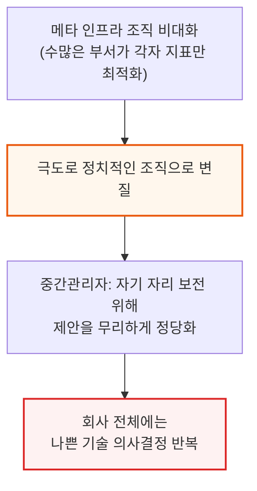

### 6개월 성과평가 주기가 만드는 단기 성과주의

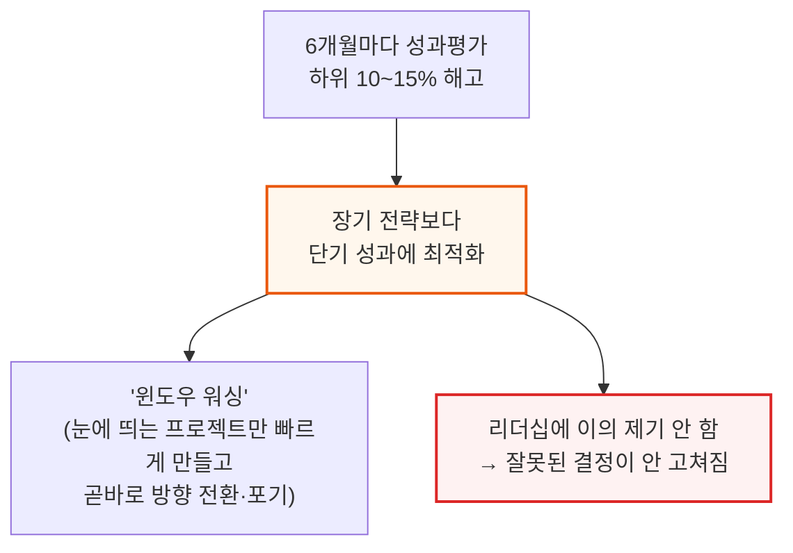

### 공급망 발언권 부족과 잦은 U턴의 대가

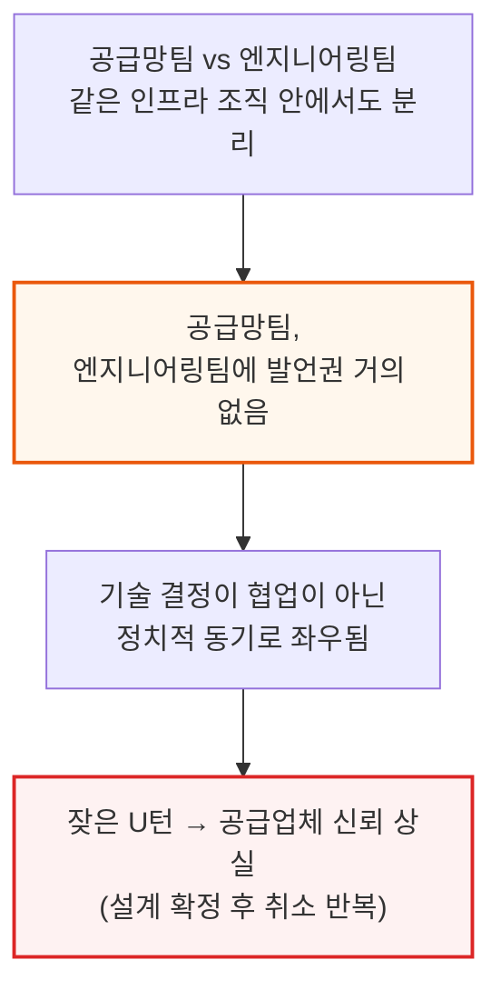

메타는 돈이 많고 실행 속도가 빨라 방향 전환 자체는 잦은 편이지만, 그만큼 U턴 비용도 다른 회사보다 더 크게 발생합니다. 설계 확정 후 취소가 반복되자 일부 공급업체는 메타보다 아마존·구글의 설계를 더 우선시하기 시작했습니다.

### 재정 규율 부재 - Reality Labs의 재현 우려

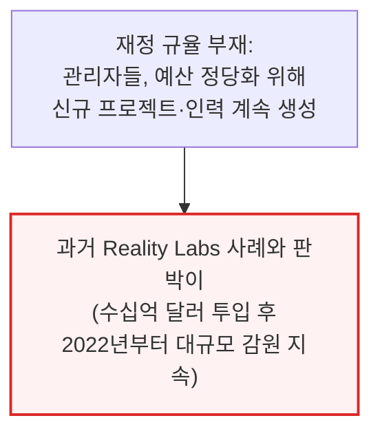

---

## 2. Rivos 인수 - 25억 달러짜리 헛발질

**📌 핵심:**
- 메타는 2025년 반도체 스타트업 Rivos를 25억 달러 넘게 주고 인수했지만, 칩 조직 내부에서도 왜 샀는지 명확히 아는 사람이 거의 없음 — 자체 COT(제조·테스트 자체 관리) 능력 확보가 명분이었지만, COT팀은 연 1억 달러 안팎이면 새로 구축 가능해 25억 달러라는 가격은 설명이 안 됨
- 인수 후 메타는 원하지 않던 조직을 대거 정리했고, 기존 칩 관리자들은 Rivos 엔지니어를 각자 조직 확장에 활용하며 Rivos를 원형 그대로 유지하지 못하고 해체시킴
- 인수 당시 기대했던 기술적 명분(엔비디아 GPU에 가까운 Rivos의 코어 설계)도 사라짐 — 이를 활용하려던 "Olympus" 칩 프로젝트는 설계가 너무 공격적이고 소프트웨어도 준비되지 않아 취소, 결국 기존 MTIA 600 노선을 유지
- 결론: Rivos 출신 엔지니어의 약 30%가 정리해고됐고, 공동창업자를 포함한 다수가 경쟁사·스타트업으로 이탈 — 처우·문화 불일치로 기존 메타 칩 조직의 사기도 함께 떨어짐

---

### 인수 배경 - 25억 달러는 왜 설명이 안 되나

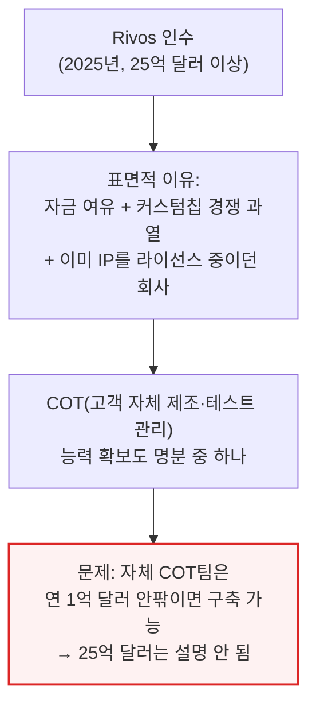

📌 용어 풀이: COT (Customer-Owned Tooling)
> - 칩 설계 회사가 브로드컴 같은 외부 파트너를 거치지 않고, 자체 제조·테스트 공정을 직접 관리하는 방식
> - 메타는 Rivos 인수로 이 능력을 얻었지만, 처음부터 팀을 새로 꾸리는 것보다 훨씬 비싼 값을 치른 셈

### 인수 후 붕괴 과정 - 원형을 유지하지 못한 스타트업

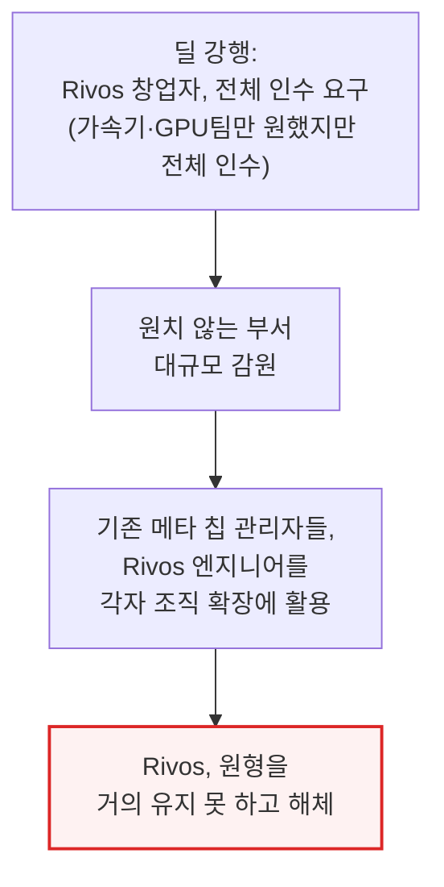

인수를 주도한 것은 메타 반도체 총괄 Yee Jiun Song으로 알려져 있으며, 정작 본인도 이후 관심을 잃었다는 것이 전직 메타 칩 직원들의 전언입니다. Rivos 출신 직원들은 배정된 책상조차 없이 매일 자리를 찾아 헤매는 등, 정착된 조직문화 부재를 체감했다고 전해집니다.

### 기술적 명분도 사라짐 - Olympus 칩 취소

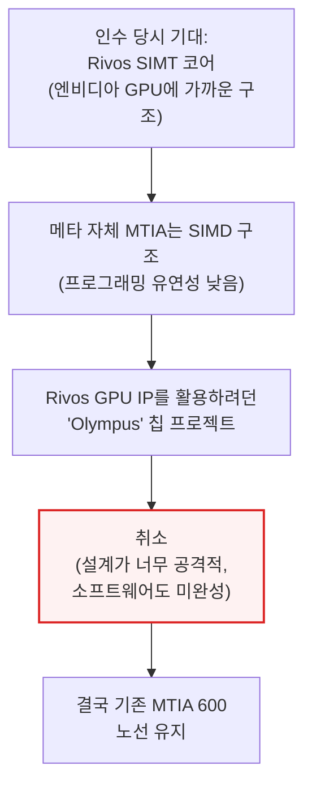

📌 용어 풀이: SIMT vs SIMD
> - SIMT(엔비디아 GPU 방식)는 수많은 독립 스레드를 유연하게 굴릴 수 있어 프로그래밍이 쉬운 구조
> - SIMD(메타 MTIA 방식)는 같은 명령을 여러 데이터에 동시에 적용하는 구조로, 특정 연산엔 효율적이지만 유연성은 떨어짐
> - Rivos의 SIMT 코어는 메타가 엔비디아 GPU에 더 가까운 유연성을 갖추게 해줄 것으로 기대됐던 자산이었음

메타는 여전히 Rivos 기술을 활용하는 신규 칩 "Phoebe" 프로젝트를 2028년 테이프아웃 목표로 추진 중이지만, 내부에는 이 프로젝트마저 결국 취소될 수 있다는 회의론이 남아 있습니다.

### 인력 유출 - 사기 저하와 이탈 러시

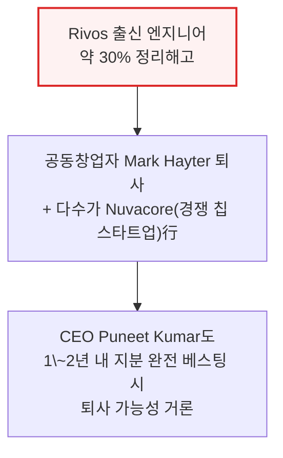

Rivos 출신 엔지니어들은 기존 메타 직원보다 높은 처우·직급으로 합류했지만 그에 걸맞은 책임은 주어지지 않은 채 기존 메타 칩 직원 밑에 배치되면서, 기존 팀과 신규 합류 팀 양쪽 모두의 사기가 떨어졌습니다. 올해 들어 메타의 실리콘 엔지니어 다수가 스타트업이나 Arm, 엔비디아 같은 기존 강자로 이직하고 있습니다.

---

## 3. Grand Teton 서버 - 쓰지도 못한 스위치 트레이

**📌 핵심:**
- 메타의 엔비디아 H100용 커스텀 서버 "Grand Teton"은 표준 HGX 구성(GPU+CPU 헤드노드)에 스위치 트레이를 추가한 설계 — 브로드컴 PCIe 스위치 4개, SSD 16개, NIC 8개로 구성해 서버당 SSD를 8개 더 넣기 위한 것
- 그런데 엔비디아는 이미 호퍼 세대부터 ConnectX-7 NIC 자체에 PCIe 스위칭 기능을 내장해 별도 PCIe 스위치가 필요 없도록 설계를 바꾼 상태 — 메타는 이를 무시하고 스위치 트레이 추가를 강행
- 추가 스토리지의 명분은 "학습 체크포인트 저장에 더 많은 용량이 필요하다"는 판단이었지만, 실제 프로덕션에서는 예상만큼 쓰이지 않아 결국 이 설계는 폐기됨 — 하드웨어·소프트웨어 공동설계 부재가 낭비로 이어진 대표 사례
- 결론: "서비스 편의성과 비엔비디아 NIC로의 전환 유연성"이라는 추가 명분도 무너짐 — 브로드컴 스위치는 애초에 서비스가 불가능했고, 소프트웨어 스택은 여전히 엔비디아의 RoCE에 의존해 NIC 교체 자체가 현실성이 없었음. 결과적으로 비용은 더 들고 TCO는 나빠졌으며 브로드컴 의존만 늘어남

---

### Grand Teton 설계 - 표준 HGX에 스위치 트레이 추가

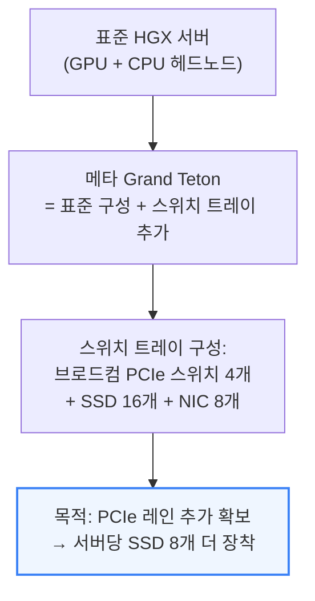

📌 용어 풀이: HGX와 PCIe 레인
> - HGX는 엔비디아가 만든 GPU 서버 표준 규격으로, 여러 GPU와 CPU를 하나의 보드에 묶는 기본 틀
> - PCIe 레인은 칩과 부품(SSD, NIC 등) 사이를 잇는 데이터 통로 — 레인 수가 많을수록 더 많은 부품을 동시에 빠르게 연결 가능

### 이미 해결된 문제 - 엔비디아는 호퍼 때 이미 없앤 구조

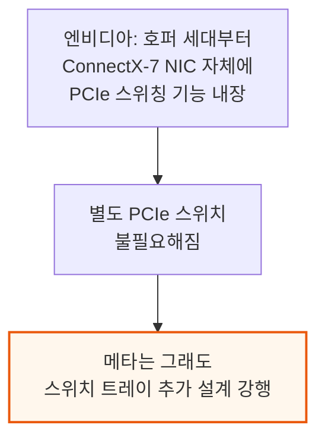

### 왜 낭비였나 - 쓰이지 않은 스토리지

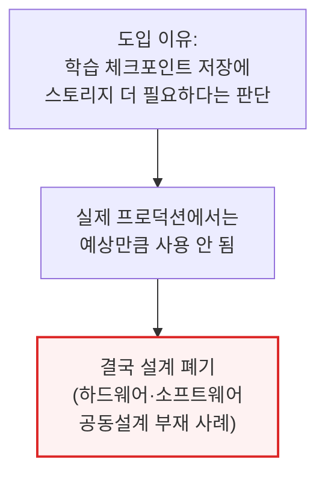

### 추가 명분도 무너짐 - 브로드컴 의존만 커짐

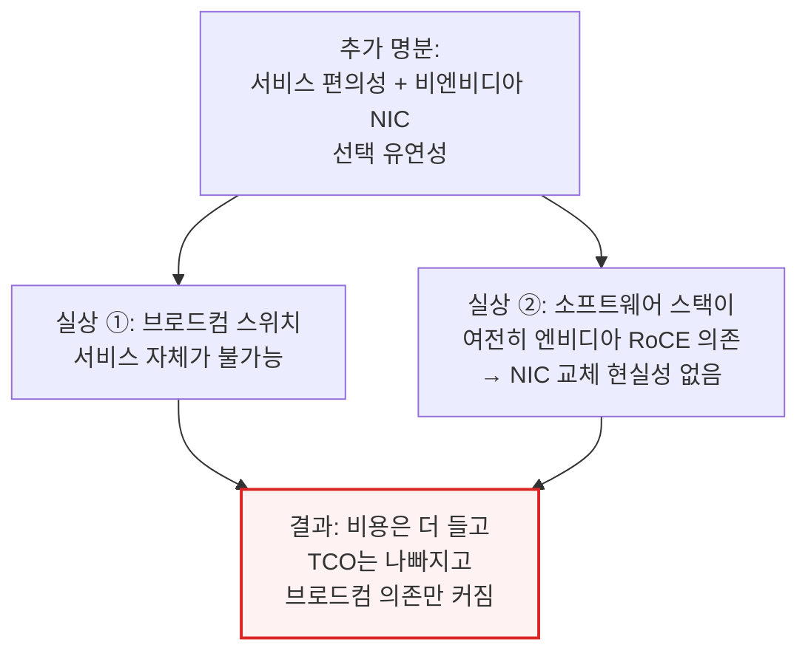

---

## 4. Ariel 랙 - GB200을 반쪽으로 쪼갠 대가

**📌 핵심:**
- 메타는 블랙웰 세대에서 표준 GB200(B200 GPU 2개+Grace CPU 1개) 대신, GPU를 절반만 채운 커스텀 랙 "Ariel"(B200 GPU 1개+Grace CPU 1개)을 이 SKU의 유일한 고객으로서 단독 사용
- 이유는 NVL72 단일 랙의 백플레인 안정성 우려 — 랙 2개를 케이블로 묶는 36x2 구성이 더 안정적일 것이라 베팅했지만, 그 대가로 스위치가 2배 필요해지고 지연시간이 한 홉 더 늘어남
- 진짜 이유는 광고 추천 시스템(RecSys)에 대한 높은 CPU-GPU 비율 집착 — RecSys는 임베딩 테이블 처리에 CPU 연산·메모리 용량이 중요하고 대역폭은 상대적으로 덜 중요하기 때문. 하지만 그 대가로 GPU당 서버 투자비가 늘어 $/FLOP·$/HBM 대역폭 같은 LLM 핵심 지표가 표준 GB200보다 악화됐고, Ariel NVL36x2의 TCO는 표준 GB200 NVL72 대비 14% 더 높음(수십억 달러 손실)
- 결론: 정작 백플레인은 이후 충분히 안정적으로 성숙했고 오히려 랙 간 케이블 연결 쪽 문제가 더 컸음 — 36GPU-1랙 구성의 안정성 이점은 없었던 것으로 판명, GB300부터는 Ariel을 완전히 폐기하고 메타도 표준 사양을 구매하는 쪽으로 전환

---

### Ariel = GB200을 반쪽으로 자른 커스텀 랙

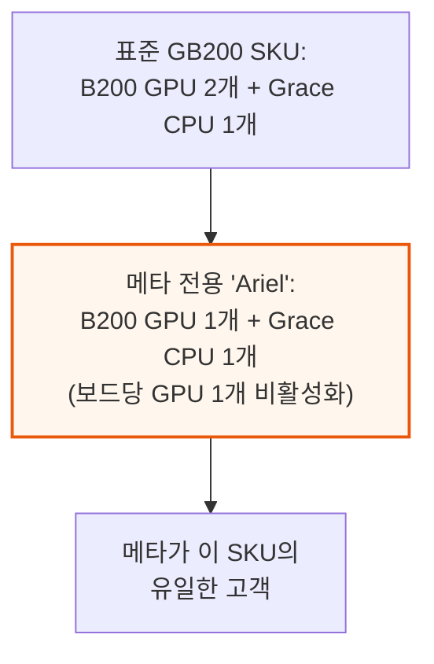

### 왜 반으로 잘랐나 - 백플레인 안정성 베팅

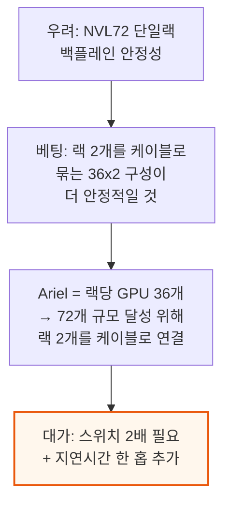

📌 용어 풀이: NVL72와 백플레인
> - NVL72는 엔비디아 GB200 랙 한 대에 GPU 72개를 하나의 통짜 회로판(백플레인)으로 연결하는 표준 구성
> - 백플레인은 랙 안의 모든 칩이 모이는 중앙 연결판 — 케이블 수천 개를 직접 잇는 대신 이 판 하나로 연결을 단순화하는 부품

### 진짜 이유 - 광고 추천 시스템(RecSys)용 CPU 비중 집착

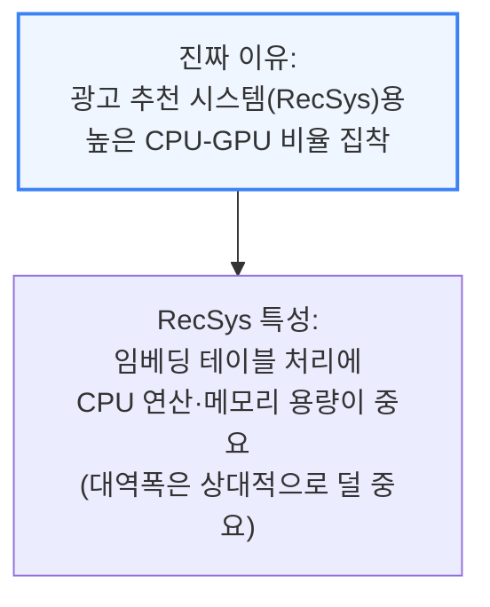

### 대가 - TCO 14% 상승, LLM팀엔 최악의 사양

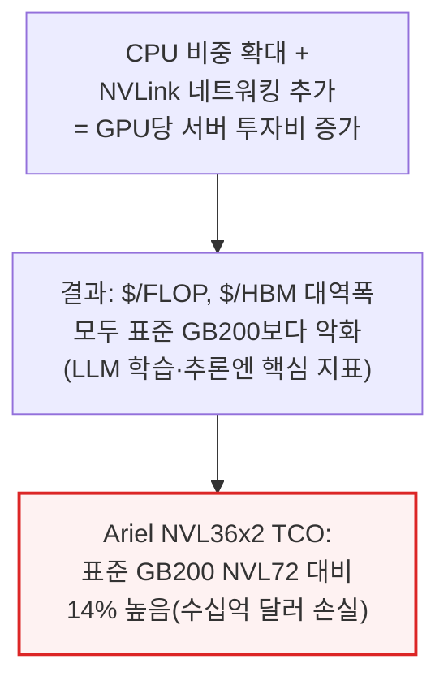

메타의 전체 GB200 물량이 이 Ariel SKU였기 때문에, 당시 생성형 AI의 플래그십 시스템이던 GB200에서 메타의 모델팀은 경쟁사가 구매한 표준 사양보다 열등한 시스템을 떠안아야 했습니다.

### 결말 - 베팅은 틀렸고, GB300에선 완전히 폐기

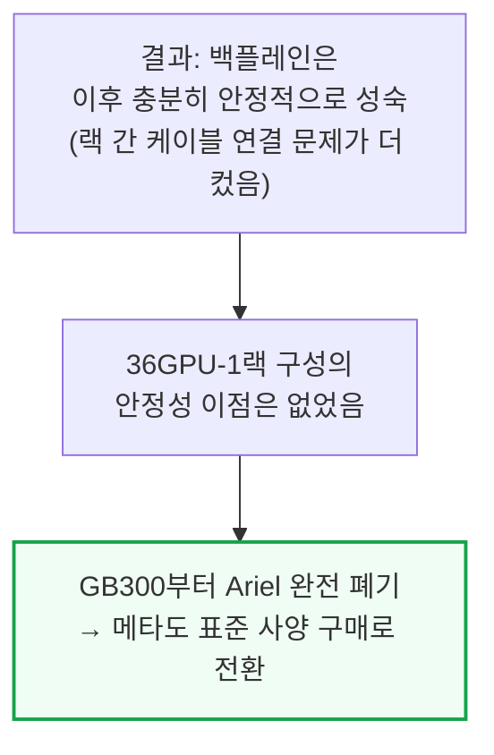

---

## 5. AMD MI450X - 총구를 입에 문 결정

*2026년 8월 3일 편집: 메타 전용 MI450X 사양 관련 정보가 새로 입수된 자료를 바탕으로 갱신됨*

**📌 핵심:**
- AMD는 2026년 1분기 실적발표에서 메타 전용 커스텀 MI450X를 확정 — 표준 사양(컴퓨트 다이 8개, HBM4 12층) 대비 컴퓨트 다이는 6개(연산 25% 감소), HBM4는 8층으로 축소하고, I/O 다이도 2개에서 1개로 줄여 레인을 절반(144개→72개)으로 낮춤
- I/O 레인이 절반으로 줄면서 스케일업(칩 간 직결) 대역폭도 절반으로 감소 — 결과는 900GB/s로, 같은 시기 엔비디아 루빈의 1,800GB/s의 딱 절반 수준. 반면 컴퓨트 25% 축소로 절감되는 비용은 전체 시스템 규모에 비하면 미미해 이 절충이 합리적인지 의문
- 이 사양은 광고 추천 시스템(RecSys) 인프라팀이 TBD Lab(메타의 프론티어 AI 모델 서빙·인프라 조직)이 발언권을 갖기 "전"에 단독으로 확정한 결정 — 네트워크 성능이 크게 부족해 TBD는 이 사양보다 엔비디아 루빈을 압도적으로 선호할 전망
- 결론: 저자들은 이 결정이 그대로 굳어지면 메타 내 AMD 물량이 크게 줄어들 것이라 경고 — AMD가 직접 TBD 팀과 협상해 정상 사양의 MI450을 공급해야 하며, 그래야만 저커버그가 내린 "모든 시스템은 전사 워크로드를 지원해야 한다"는 원칙에도 부합함

---

### 메타 전용 MI450X - 표준 대비 축소 사양

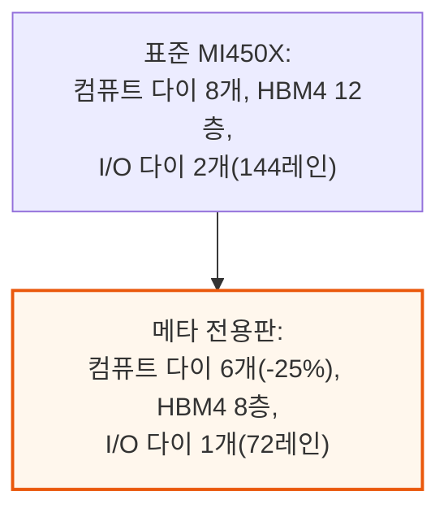

📌 용어 풀이: 컴퓨트 다이·I/O 다이·HBM 층수
> - 컴퓨트 다이는 실제 연산을 담당하는 칩 조각 — 개수가 많을수록 연산 능력이 커짐
> - I/O 다이는 칩 간·서버 간 데이터 이동을 담당하는 통로 역할 — 개수가 줄면 동시에 주고받을 수 있는 데이터 통로(레인)도 줄어듦
> - HBM 층수(예: 8층 vs 12층)는 메모리를 얼마나 높이 쌓았는지를 뜻하며, 층수가 낮을수록 저장 용량이 줄어듦

### I/O 절반이 부른 네트워크 성능 반토막

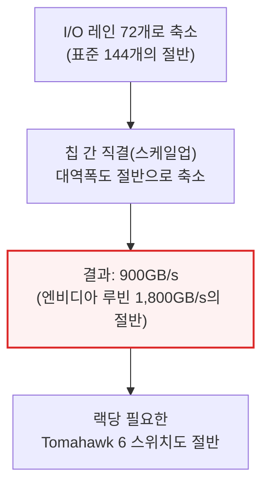

### 누가 결정했나 - TBD Lab이 빠진 결정

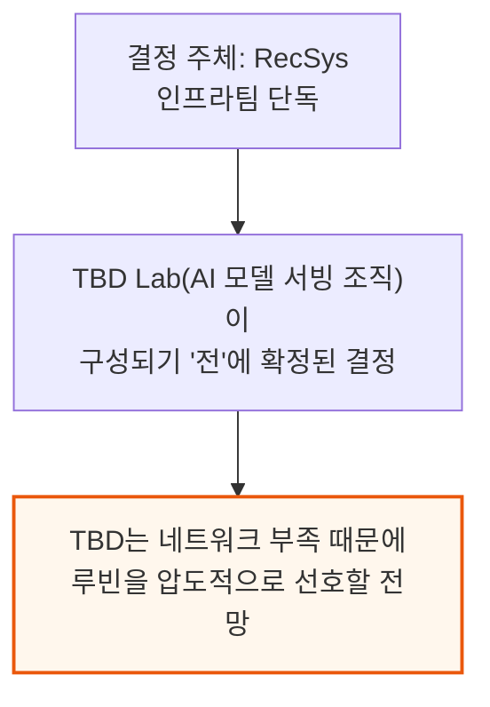

📌 용어 풀이: TBD Lab
> - 메타 내부에서 프론티어 AI 모델을 실제로 학습·서빙하는 인프라를 전담하는 조직으로 언급됨(RecSys 인프라팀과는 별개 조직)
> - 이 조직이 어떤 칩을 선택하느냐가 곧 메타의 실제 AI 서빙 경쟁력을 좌우 — RecSys가 미리 정해버린 사양을 TBD가 그대로 떠안게 되는 구조가 이번 사례의 핵심 문제

### 저자들의 경고 - "AMD 물량이 날아간다"

```mermaid
flowchart TD
    Warning["경고: 이 설계 그대로면<br/>TBD가 정상 MI450 대신<br/>루빈을 압도적으로 선택"]
    Warning --> Result2["결과: 메타 내<br/>AMD 물량 대폭 축소 위험"]
    Result2 --> Ask["저자 제언: AMD가 직접<br/>TBD 팀과 협상해<br/>정상 사양 MI450 확보해야"]
    style Result2 fill:#fef2f2,stroke:#dc2626,stroke-width:2px
    style Ask fill:#f0fdf4,stroke:#16a34a,stroke-width:2px
```

---

## 6. DSF vs NSF - 네트워크 과잉설계의 흥망

**📌 핵심:**
- 메타는 2024년 자체 개발한 네트워크 방식 DSF(분산형 스케줄 네트워크)를 선보임 — 대규모 학습 클러스터의 3대 문제(엘리펀트 플로우·낮은 엔트로피·비효율적 활용)를 스위치 단에서 직접 통제하기 위해, 아리스타 전용 스위치·브로드컴 전용 칩으로 구성된 복잡하고 값비싼 전용 하드웨어를 만듦
- 그러나 2023\~2024년 사이 네트워크카드(NIC) 자체가 혼잡 제어 기능을 내장할 만큼 똑똑해지면서, 스위치가 복잡한 일을 대신할 필요가 없어짐 — 더 단순한 칩(Tomahawk 5) 기반의 NSF(비스케줄 네트워크)로 무게중심이 빠르게 이동
- SemiAnalysis 모델링에 따르면 DSF는 NSF보다 비용이 11% 더 높고 단일 벤더(아리스타)에 의존하는 구조 — 현재 메타의 주요 클러스터(Prometheus·Hyperion)는 대부분 NSF로 전환했고, DSF는 NIC가 칩에 내장된 자체 가속기 MTIA 계열에서만 남아 있음
- 결론: DSF 자체는 2024년 시점 최선의 답이었고 메타가 더 나은 대안이 나오자 재빨리 전환한 것은 합리적이지만, "무조건 최고 사양"을 고집하는 메타의 성향 때문에 아마존·구글·오라클 같은 보수적인 접근을 택한 경쟁사보다 기준이 바뀔 때 더 큰 타격을 입음

---

### DSF 탄생 배경 - AI 학습 트래픽의 3대 문제

```mermaid
flowchart TD
    Problem["대규모 AI 학습 클러스터의<br/>네트워크 3대 문제"] --> P1["① 엘리펀트 플로우<br/>(장시간·대용량 트래픽 몰림)"]
    Problem --> P2["② 낮은 엔트로피<br/>(일부 경로만 혼잡,<br/>전체 용량은 남는데도)"]
    Problem --> P3["③ 비효율적 활용<br/>(위 둘의 결과로<br/>대역폭 편중 심화)"]
```

📌 용어 풀이: RoCE가 문제를 "실패 모드"로 바꾸는 이유
> - RoCE(RDMA over Converged Ethernet)는 엔비디아 GPU 클러스터에서 널리 쓰이는 네트워킹 방식으로, GPU 간 데이터를 CPU를 거치지 않고 직접 주고받아 지연시간을 줄임
> - 문제는 이 방식(RDMA)이 패킷 손실에 매우 취약한데, 정작 밑바탕인 이더넷과 UDP는 원래 손실이 있을 수 있는 프로토콜이라는 점 — 그래서 소프트웨어로 정교한 혼잡 제어를 튜닝해 이더넷을 "무손실"에 가깝게 만들어야 함

### DSF의 해법 - 스위치 단에서 혼잡을 미리 통제

```mermaid
flowchart TD
    DSFSolve["2024년: NIC가 혼잡제어를<br/>처리할 만큼 똑똑하지 못했음<br/>→ 메타, 스위치(fabric) 단에서 해결"] --> VOQ["① VOQ(가상 출력 큐):<br/>입구마다 목적지별<br/>전용 대기열 배정<br/>→ 한 경로 혼잡해도<br/>다른 경로는 안 막힘"]
    DSFSolve --> Spray["② 셀 스프레잉:<br/>패킷을 작은 조각으로 쪼개<br/>여러 경로에 분산 전송<br/>→ 특정 경로 병목 방지"]
    VOQ --> Credit["신용 기반 스케줄러:<br/>수신측이 '여유 있다'고<br/>허가해야 송신 시작<br/>(이것이 DSF의 '스케줄' 부분)"]
    style Credit fill:#eff6ff,stroke:#3b82f6,stroke-width:2px
```

메타는 이 복잡한 제어를 자체 네트워크 운영체제 FBOSS(Facebook Open Switching System)로 구현했습니다. 아리스타의 기성 운영체제(EOS)도 대안이었지만, FBOSS가 메타의 기존 레거시 시스템과 통합하는 데 더 유연했기 때문입니다.

### 하드웨어 복잡도 - 전용 스위치·전용 칩·단일 벤더

```mermaid
flowchart TD
    HW["DSF 전용 하드웨어"] --> Switches["아리스타 전용 스위치 2종<br/>(7700R4C, 7720R4)<br/>— 사실상 메타 단독 발주"]
    HW --> Chips["브로드컴 Jericho3-AI<br/>(대용량 버퍼) +<br/>Ramon3(스파인 스위치)"]
    Switches --> SubScale["단독 발주 → 원가 구조에서<br/>규모의 경제 확보 어려움"]
    style SubScale fill:#fff7ed,stroke:#ea580c,stroke-width:2px
```

XPU 약 4,500개를 묶는 소규모 구역은 스위치 2단(리프+스파인)이면 충분하지만, 약 18,000개 규모로 커지면 이를 4개 구역씩 묶는 스위치 층이 하나 더 필요해 하드웨어·제어 복잡도가 한층 더 늘어납니다.

### DSF에서 NSF로 - NIC가 똑똑해지자 판이 바뀜

```mermaid
flowchart TD
    Shift2["2023~2024년:<br/>NIC 자체가 혼잡제어<br/>기능을 내장하기 시작"] --> NoNeedFabric["스위치가 복잡한 일을<br/>대신할 필요 없어짐"]
    NoNeedFabric --> NSF2["NSF(비스케줄 방식):<br/>단순한 Tomahawk 5 칩 기반<br/>스위치로 충분"]
    NSF2 --> VendorDiv["아리스타·Celestica 등<br/>다수 벤더가 판매<br/>→ 비용 절감 + 벤더 다변화"]
    style NSF2 fill:#f0fdf4,stroke:#16a34a,stroke-width:2px
```

### 결과 - DSF는 11% 더 비쌌다

```mermaid
flowchart TD
    ModelResult["SemiAnalysis 모델링 결과:<br/>DSF가 NSF보다 11% 더 비쌈"] --> WhyExpensive["단일 벤더(아리스타) 의존<br/>+ 복잡한 하드웨어·SW 스택"]
    WhyExpensive --> NowPref["현재: 메타의 Prometheus·<br/>Hyperion 클러스터,<br/>대부분 NSF로 전환"]
    NowPref --> StillDSF["예외: 자체 칩 MTIA<br/>(NIC가 칩에 내장)는<br/>여전히 DSF 사용"]
    style ModelResult fill:#fef2f2,stroke:#dc2626,stroke-width:2px
```

### 다른 하이퍼스케일러는 어떻게 했나 - 보수적 접근이 이긴 이유

```mermaid
flowchart TD
    Others["다른 하이퍼스케일러<br/>vs 메타의 접근 차이"] --> AMZ2["아마존: RoCE 자체를 회피<br/>(EFA + 범용 Tomahawk 칩)"]
    Others --> GOOG2["구글: 네트워킹을<br/>소프트웨어 문제로 취급<br/>(자체 트랜스포트 개발)"]
    Others --> ORCL["오라클: 단순한 하드웨어로<br/>필요한 만큼만 구축"]
    AMZ2 --> Meta4["메타는 '최고 사양'을 고집<br/>→ 기준 자체가 바뀌자<br/>가장 큰 타격을 입음"]
    GOOG2 --> Meta4
    ORCL --> Meta4
    style Meta4 fill:#fef2f2,stroke:#dc2626,stroke-width:2px
```

이 흐름을 두고 저자들은 DSF 자체가 실책이었다고 보지는 않습니다. DSF는 2024년 시점에서 구할 수 있는 최선의 답이었고, 더 나은 대안이 나오자 메타는 재빨리 전환했습니다. 다만 돈을 들여서라도 최고 사양을 만들려는 메타의 본능은, 더 보수적인 길을 택해 판이 바뀔 때 덜 흔들린 경쟁사들과 대비됩니다.

---

## 7. 문화를 고치는 법 - 오너십과 규율 되찾기

**📌 핵심:**
- Rivos·DSF·Grand Teton·Ariel·MI450X 5개 사례 모두 공통된 패턴 — 각각 좁은 지표에서는 정당화할 수 있었지만 회사 전체로 보면 나쁜 결정이었고, 결과적으로 메타의 모델팀은 경쟁사가 그냥 사들인 표준 사양보다 못한 하드웨어를 떠안았음
- 해법은 하드웨어 결정에 명확한 오너십을 부여하고, 실제로 그 인프라를 쓰는 조직(MSL·TBD Lab)이 RecSys보다 더 큰 발언권을 갖도록 하는 것 — 지금까지는 종종 RecSys가 "꼬리가 몸통을 흔드는" 구조였음
- 커스텀 SKU와 전용 네트워크는 업계 표준 규모의 경제 혜택을 받는 표준 구성 대비 훨씬 높은 기준을 통과해야 하고, 인력·예산도 더 엄격하게 관리해 엔지니어링 자원을 신중하게 배분하도록 유도해야 함
- 결론: 메타가 외부 고객에게 컴퓨트를 판매하려는 지금, 이 문제는 더 시급함 — 외부 고객은 이런 과잉설계 비용을 지불하지 않을 것이므로, 인프라가 비용 센터가 아닌 "제품"이 되려면 이런 결정을 만들어온 조직 문화부터 바뀌어야 함

---

### 반복되는 패턴 - 5개 사례의 공통점

```mermaid
flowchart TD
    Pattern["5개 실패 사례의 공통 패턴<br/>(Rivos·DSF·Grand Teton·Ariel·MI450X)"] --> Narrow["각각 좁은 지표에서는<br/>정당화 가능했음"]
    Narrow --> Bad["회사 전체에는 나쁜 결정<br/>(모델팀은 경쟁사보다<br/>못한 하드웨어를 받음)"]
    style Bad fill:#fef2f2,stroke:#dc2626,stroke-width:2px
```

### 해법 - 오너십 재정립

```mermaid
flowchart TD
    Fix["문화 리셋의 3가지 방향"] --> F1["① 오너십 명확화:<br/>실제 소비 조직(MSL·TBD)이<br/>RecSys보다 더 큰 발언권"]
    Fix --> F2["② 커스텀 설계는<br/>표준 구성 대비<br/>더 높은 기준 통과해야"]
    Fix --> F3["③ 인력·예산 규율 강화<br/>→ 엔지니어링 자원을<br/>더 신중하게 배분"]
    style F1 fill:#eff6ff,stroke:#3b82f6,stroke-width:2px
    style F2 fill:#eff6ff,stroke:#3b82f6,stroke-width:2px
    style F3 fill:#eff6ff,stroke:#3b82f6,stroke-width:2px
```

### 왜 지금 시급한가 - 컴퓨트를 외부에 파는 시대

```mermaid
flowchart TD
    Sell["메타, 외부 고객에게<br/>컴퓨트 판매 추진 중"] --> Wont["외부 고객은<br/>과잉설계 비용을 지불하지 않음"]
    Wont --> Product["인프라가 비용 센터가 아닌<br/>'제품'이 되려면<br/>문화부터 바뀌어야"]
    style Product fill:#f0fdf4,stroke:#16a34a,stroke-width:2px
```

---

*작성 진행률: 100% 완료*
*업데이트: 원문 전체 7개 섹션(서론\~문화를 고치는 법) 변환 완료*
