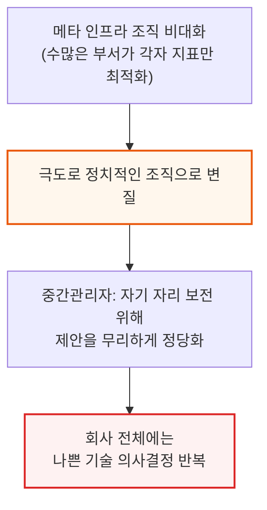
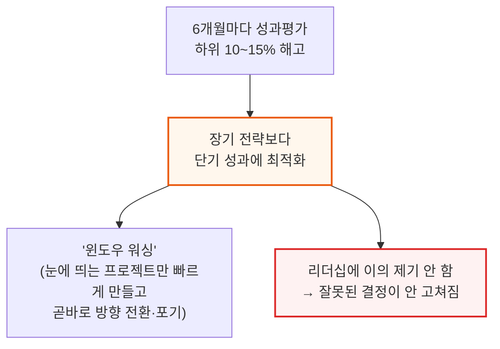
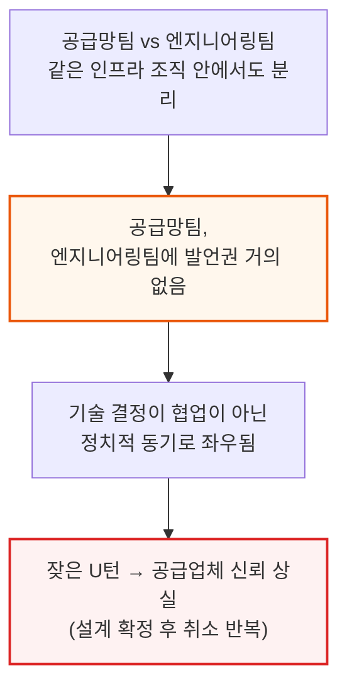
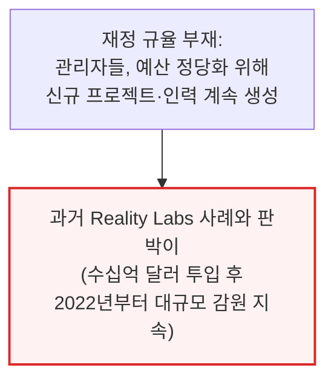

# Meta's Infrastructure Team Needs A Culture Reset

> **출처**: [SemiAnalysis Newsletter](https://newsletter.semianalysis.com/p/metas-infrastructure-team-needs-a)
> **저자**: Wayne Ma, Myron Xie, Julien Martin-Prin
> **발행일**: 2026-07-22

---

## 📑 목차

### 전체 섹션
1. [서론 - 정치화된 조직과 단기 성과주의](#1-서론---정치화된-조직과-단기-성과주의)
2. [Rivos 인수 - 25억 달러짜리 헛발질](#2-rivos-인수---25억-달러짜리-헛발질)
3. [Grand Teton 서버 - 쓰지도 못한 스위치 트레이](#3-grand-teton-서버---쓰지도-못한-스위치-트레이)
4. [Ariel 랙 - GB200을 반쪽으로 쪼갠 대가](#4-ariel-랙---gb200을-반쪽으로-쪼갠-대가)
5. [AMD MI450X - 총구를 입에 문 결정](#5-amd-mi450x---총구를-입에-문-결정)
6. [DSF vs NSF - 네트워크 과잉설계의 흥망](#6-dsf-vs-nsf---네트워크-과잉설계의-흥망)
7. [문화를 고치는 법 - 오너십과 규율 되찾기](#7-문화를-고치는-법---오너십과-규율-되찾기)

---

## 🔑 용어 정리

본문을 순서대로 읽기 전에 알아두면 좋은 용어들입니다. 자세한 수치와 설명은 본문에서 처음 등장하는 위치에 나옵니다.

- **Rivos**: 메타가 2025년 25억 달러 넘게 주고 인수한 반도체 스타트업 — 엔비디아 GPU에 가까운 코어 설계 기술을 보유
- **Grand Teton**: 메타의 엔비디아 H100용 커스텀 서버 설계 이름 — 오픈컴퓨트프로젝트(OCP)에 기부된 규격
- **Ariel**: 메타가 블랙웰(GB200) 세대에 쓴 커스텀 랙 이름 — 표준 사양과 달리 GPU를 랙당 절반만 채운 구성
- **MI450X**: AMD의 차세대 AI 가속기 — 메타는 이를 축소한 전용 버전을 별도로 발주
- **DSF (Disaggregated Scheduled Fabric, 분산형 스케줄 네트워크)**: 메타가 2024년 선보인 AI 클러스터용 네트워크 방식 — 스위치 단에서 미리 트래픽 혼잡을 통제
- **NSF (Non-Scheduled Fabric, 비스케줄 네트워크)**: 스위치가 아니라 네트워크카드(NIC)가 혼잡 제어를 담당하는 더 단순하고 저렴한 방식

---

## 1. 서론 - 정치화된 조직과 단기 성과주의

**📌 핵심:**
- 메타 인프라 조직은 지나치게 비대해졌고, 여러 부서가 회사 전체의 이익보다 각자의 지표만 최적화하면서 극도로 정치적인 조직으로 변질됨
- 6개월마다 하위 10\~15%를 해고하는 성과평가 제도가 단기 성과주의를 만듦 — 눈에 띄는 프로젝트를 빠르게 만들었다가 곧바로 포기하는 관행("윈도우 워싱")이 퍼졌고, 리더십에 이의를 제기하는 사람이 없어 잘못된 결정이 고쳐지지 않음
- 공급망팀은 엔지니어링팀에 발언권이 거의 없어 기술 결정이 정치적 동기로 좌우되고, 잦은 방향 전환(U턴)으로 공급업체 신뢰를 잃어 일부는 아마존·구글 설계를 더 우선시하게 됨
- 결론: 재정 규율 부재로 관리자들이 예산을 정당화하기 위해 신규 프로젝트·인력을 계속 만드는 구조 — 과거 Reality Labs(수십억 달러 투입 후 2022년부터 대규모 감원)의 재현 우려

---

### 조직 비대화가 만드는 악순환

### 6개월 성과평가 주기가 만드는 단기 성과주의

### 공급망 발언권 부족과 잦은 U턴의 대가

메타는 돈이 많고 실행 속도가 빨라 방향 전환 자체는 잦은 편이지만, 그만큼 U턴 비용도 다른 회사보다 더 크게 발생합니다. 설계 확정 후 취소가 반복되자 일부 공급업체는 메타보다 아마존·구글의 설계를 더 우선시하기 시작했습니다.

### 재정 규율 부재 - Reality Labs의 재현 우려

---

*작성 진행률: 약 15% 완료*
*업데이트: 헤더·목차·용어 정리·1장(서론) 작성 완료*
