# Meta's Infrastructure Team Needs A Culture Reset

> **출처**: [SemiAnalysis Newsletter](https://newsletter.semianalysis.com/p/metas-infrastructure-team-needs-a)
> **저자**: Wayne Ma, Myron Xie, Julien Martin-Prin
> **발행일**: 2026-07-22

---

## 📑 목차

### 전체 섹션
1. [서론 - 정치화된 조직과 단기 성과주의](#1-서론---정치화된-조직과-단기-성과주의)
2. [Rivos 인수 - 25억 달러짜리 헛발질](#2-rivos-인수---25억-달러짜리-헛발질)
3. [Grand Teton 서버 - 쓰지도 못한 스위치 트레이](#3-grand-teton-서버---쓰지도-못한-스위치-트레이)
4. [Ariel 랙 - GB200을 반쪽으로 쪼갠 대가](#4-ariel-랙---gb200을-반쪽으로-쪼갠-대가)
5. [AMD MI450X - 총구를 입에 문 결정](#5-amd-mi450x---총구를-입에-문-결정)
6. [DSF vs NSF - 네트워크 과잉설계의 흥망](#6-dsf-vs-nsf---네트워크-과잉설계의-흥망)
7. [문화를 고치는 법 - 오너십과 규율 되찾기](#7-문화를-고치는-법---오너십과-규율-되찾기)

---

## 🔑 용어 정리

본문을 순서대로 읽기 전에 알아두면 좋은 용어들입니다. 자세한 수치와 설명은 본문에서 처음 등장하는 위치에 나옵니다.

- **Rivos**: 메타가 2025년 25억 달러 넘게 주고 인수한 반도체 스타트업 — 엔비디아 GPU에 가까운 코어 설계 기술을 보유
- **Grand Teton**: 메타의 엔비디아 H100용 커스텀 서버 설계 이름 — 오픈컴퓨트프로젝트(OCP)에 기부된 규격
- **Ariel**: 메타가 블랙웰(GB200) 세대에 쓴 커스텀 랙 이름 — 표준 사양과 달리 GPU를 랙당 절반만 채운 구성
- **MI450X**: AMD의 차세대 AI 가속기 — 메타는 이를 축소한 전용 버전을 별도로 발주
- **DSF (Disaggregated Scheduled Fabric, 분산형 스케줄 네트워크)**: 메타가 2024년 선보인 AI 클러스터용 네트워크 방식 — 스위치 단에서 미리 트래픽 혼잡을 통제
- **NSF (Non-Scheduled Fabric, 비스케줄 네트워크)**: 스위치가 아니라 네트워크카드(NIC)가 혼잡 제어를 담당하는 더 단순하고 저렴한 방식

---

## 1. 서론 - 정치화된 조직과 단기 성과주의

**📌 핵심:**
- 메타 인프라 조직은 지나치게 비대해졌고, 여러 부서가 회사 전체의 이익보다 각자의 지표만 최적화하면서 극도로 정치적인 조직으로 변질됨
- 6개월마다 하위 10\~15%를 해고하는 성과평가 제도가 단기 성과주의를 만듦 — 눈에 띄는 프로젝트를 빠르게 만들었다가 곧바로 포기하는 관행("윈도우 워싱")이 퍼졌고, 리더십에 이의를 제기하는 사람이 없어 잘못된 결정이 고쳐지지 않음
- 공급망팀은 엔지니어링팀에 발언권이 거의 없어 기술 결정이 정치적 동기로 좌우되고, 잦은 방향 전환(U턴)으로 공급업체 신뢰를 잃어 일부는 아마존·구글 설계를 더 우선시하게 됨
- 결론: 재정 규율 부재로 관리자들이 예산을 정당화하기 위해 신규 프로젝트·인력을 계속 만드는 구조 — 과거 Reality Labs(수십억 달러 투입 후 2022년부터 대규모 감원)의 재현 우려

---

### 조직 비대화가 만드는 악순환

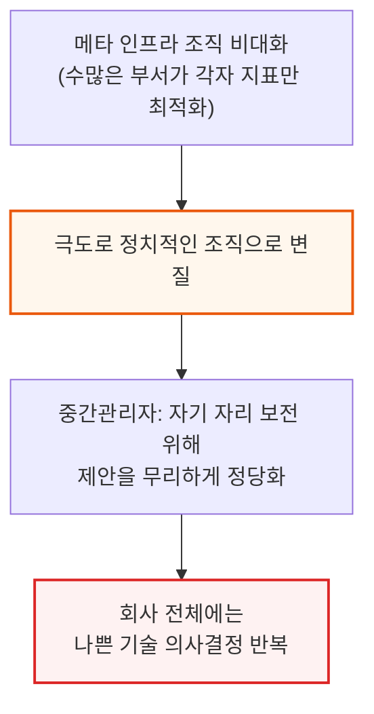

### 6개월 성과평가 주기가 만드는 단기 성과주의

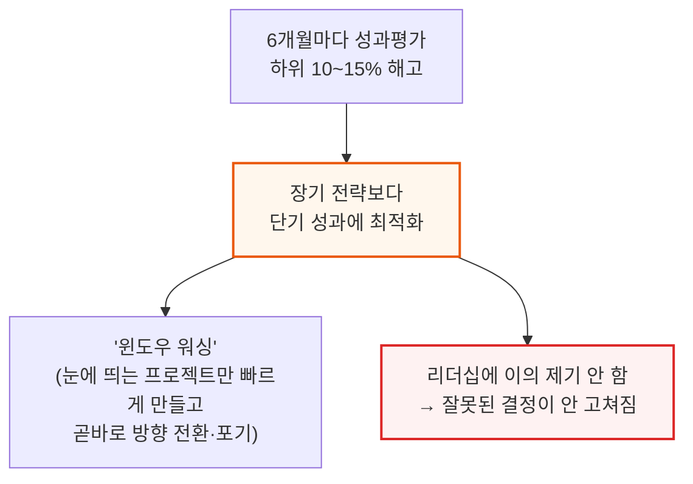

### 공급망 발언권 부족과 잦은 U턴의 대가

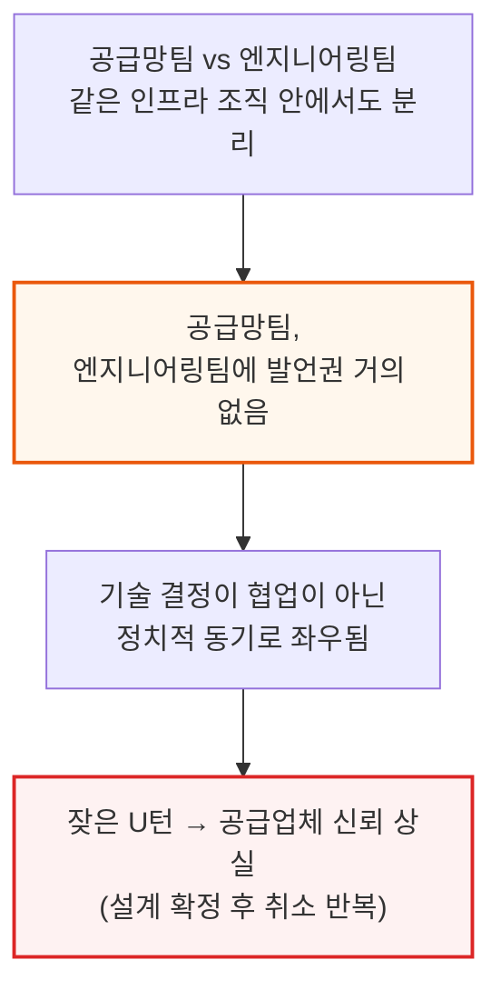

메타는 돈이 많고 실행 속도가 빨라 방향 전환 자체는 잦은 편이지만, 그만큼 U턴 비용도 다른 회사보다 더 크게 발생합니다. 설계 확정 후 취소가 반복되자 일부 공급업체는 메타보다 아마존·구글의 설계를 더 우선시하기 시작했습니다.

### 재정 규율 부재 - Reality Labs의 재현 우려

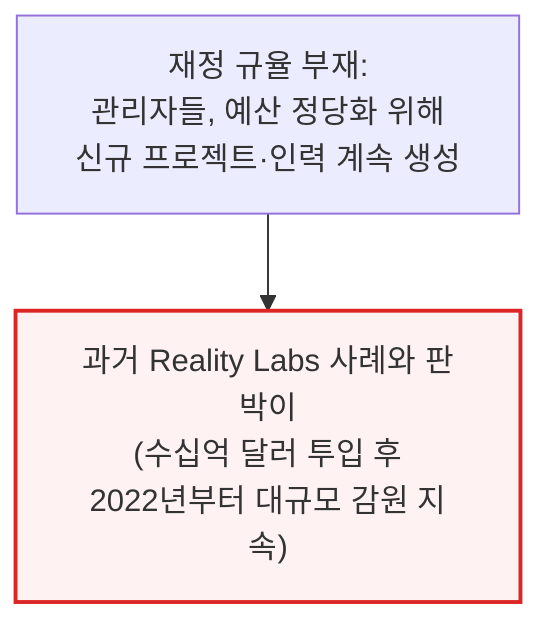

---

## 2. Rivos 인수 - 25억 달러짜리 헛발질

**📌 핵심:**
- 메타는 2025년 반도체 스타트업 Rivos를 25억 달러 넘게 주고 인수했지만, 칩 조직 내부에서도 왜 샀는지 명확히 아는 사람이 거의 없음 — 자체 COT(제조·테스트 자체 관리) 능력 확보가 명분이었지만, COT팀은 연 1억 달러 안팎이면 새로 구축 가능해 25억 달러라는 가격은 설명이 안 됨
- 인수 후 메타는 원하지 않던 조직을 대거 정리했고, 기존 칩 관리자들은 Rivos 엔지니어를 각자 조직 확장에 활용하며 Rivos를 원형 그대로 유지하지 못하고 해체시킴
- 인수 당시 기대했던 기술적 명분(엔비디아 GPU에 가까운 Rivos의 코어 설계)도 사라짐 — 이를 활용하려던 "Olympus" 칩 프로젝트는 설계가 너무 공격적이고 소프트웨어도 준비되지 않아 취소, 결국 기존 MTIA 600 노선을 유지
- 결론: Rivos 출신 엔지니어의 약 30%가 정리해고됐고, 공동창업자를 포함한 다수가 경쟁사·스타트업으로 이탈 — 처우·문화 불일치로 기존 메타 칩 조직의 사기도 함께 떨어짐

---

### 인수 배경 - 25억 달러는 왜 설명이 안 되나

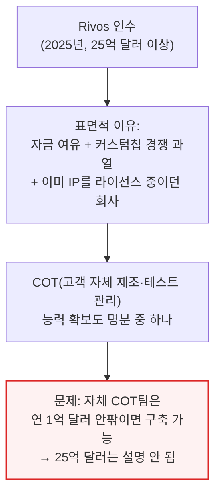

📌 용어 풀이: COT (Customer-Owned Tooling)
> - 칩 설계 회사가 브로드컴 같은 외부 파트너를 거치지 않고, 자체 제조·테스트 공정을 직접 관리하는 방식
> - 메타는 Rivos 인수로 이 능력을 얻었지만, 처음부터 팀을 새로 꾸리는 것보다 훨씬 비싼 값을 치른 셈

### 인수 후 붕괴 과정 - 원형을 유지하지 못한 스타트업

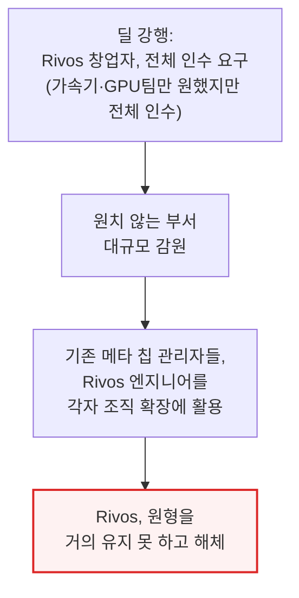

인수를 주도한 것은 메타 반도체 총괄 Yee Jiun Song으로 알려져 있으며, 정작 본인도 이후 관심을 잃었다는 것이 전직 메타 칩 직원들의 전언입니다. Rivos 출신 직원들은 배정된 책상조차 없이 매일 자리를 찾아 헤매는 등, 정착된 조직문화 부재를 체감했다고 전해집니다.

### 기술적 명분도 사라짐 - Olympus 칩 취소

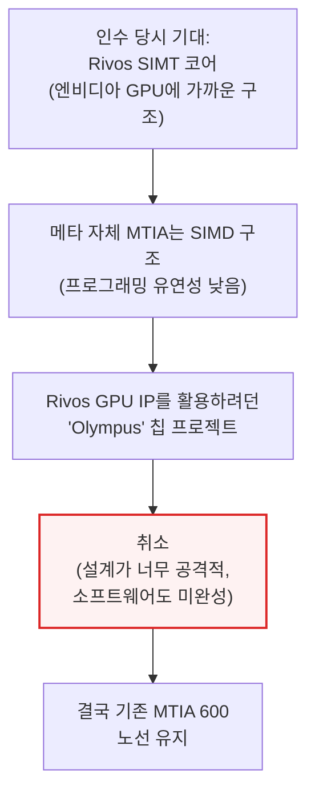

📌 용어 풀이: SIMT vs SIMD
> - SIMT(엔비디아 GPU 방식)는 수많은 독립 스레드를 유연하게 굴릴 수 있어 프로그래밍이 쉬운 구조
> - SIMD(메타 MTIA 방식)는 같은 명령을 여러 데이터에 동시에 적용하는 구조로, 특정 연산엔 효율적이지만 유연성은 떨어짐
> - Rivos의 SIMT 코어는 메타가 엔비디아 GPU에 더 가까운 유연성을 갖추게 해줄 것으로 기대됐던 자산이었음

메타는 여전히 Rivos 기술을 활용하는 신규 칩 "Phoebe" 프로젝트를 2028년 테이프아웃 목표로 추진 중이지만, 내부에는 이 프로젝트마저 결국 취소될 수 있다는 회의론이 남아 있습니다.

### 인력 유출 - 사기 저하와 이탈 러시

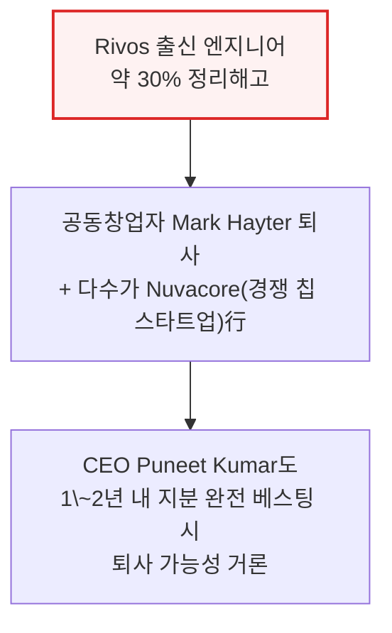

Rivos 출신 엔지니어들은 기존 메타 직원보다 높은 처우·직급으로 합류했지만 그에 걸맞은 책임은 주어지지 않은 채 기존 메타 칩 직원 밑에 배치되면서, 기존 팀과 신규 합류 팀 양쪽 모두의 사기가 떨어졌습니다. 올해 들어 메타의 실리콘 엔지니어 다수가 스타트업이나 Arm, 엔비디아 같은 기존 강자로 이직하고 있습니다.

---

## 3. Grand Teton 서버 - 쓰지도 못한 스위치 트레이

**📌 핵심:**
- 메타의 엔비디아 H100용 커스텀 서버 "Grand Teton"은 표준 HGX 구성(GPU+CPU 헤드노드)에 스위치 트레이를 추가한 설계 — 브로드컴 PCIe 스위치 4개, SSD 16개, NIC 8개로 구성해 서버당 SSD를 8개 더 넣기 위한 것
- 그런데 엔비디아는 이미 호퍼 세대부터 ConnectX-7 NIC 자체에 PCIe 스위칭 기능을 내장해 별도 PCIe 스위치가 필요 없도록 설계를 바꾼 상태 — 메타는 이를 무시하고 스위치 트레이 추가를 강행
- 추가 스토리지의 명분은 "학습 체크포인트 저장에 더 많은 용량이 필요하다"는 판단이었지만, 실제 프로덕션에서는 예상만큼 쓰이지 않아 결국 이 설계는 폐기됨 — 하드웨어·소프트웨어 공동설계 부재가 낭비로 이어진 대표 사례
- 결론: "서비스 편의성과 비엔비디아 NIC로의 전환 유연성"이라는 추가 명분도 무너짐 — 브로드컴 스위치는 애초에 서비스가 불가능했고, 소프트웨어 스택은 여전히 엔비디아의 RoCE에 의존해 NIC 교체 자체가 현실성이 없었음. 결과적으로 비용은 더 들고 TCO는 나빠졌으며 브로드컴 의존만 늘어남

---

### Grand Teton 설계 - 표준 HGX에 스위치 트레이 추가

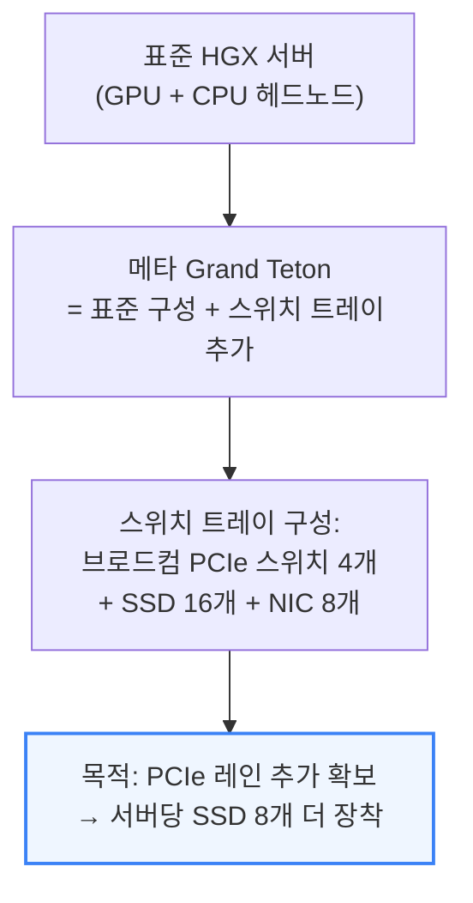

📌 용어 풀이: HGX와 PCIe 레인
> - HGX는 엔비디아가 만든 GPU 서버 표준 규격으로, 여러 GPU와 CPU를 하나의 보드에 묶는 기본 틀
> - PCIe 레인은 칩과 부품(SSD, NIC 등) 사이를 잇는 데이터 통로 — 레인 수가 많을수록 더 많은 부품을 동시에 빠르게 연결 가능

### 이미 해결된 문제 - 엔비디아는 호퍼 때 이미 없앤 구조

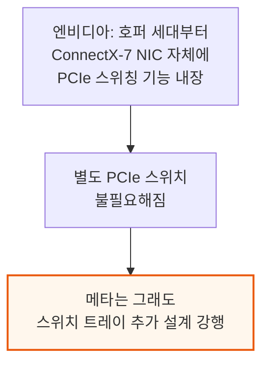

### 왜 낭비였나 - 쓰이지 않은 스토리지

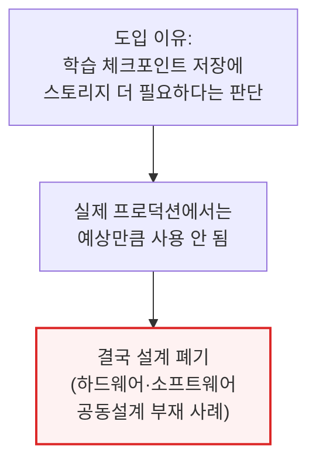

### 추가 명분도 무너짐 - 브로드컴 의존만 커짐

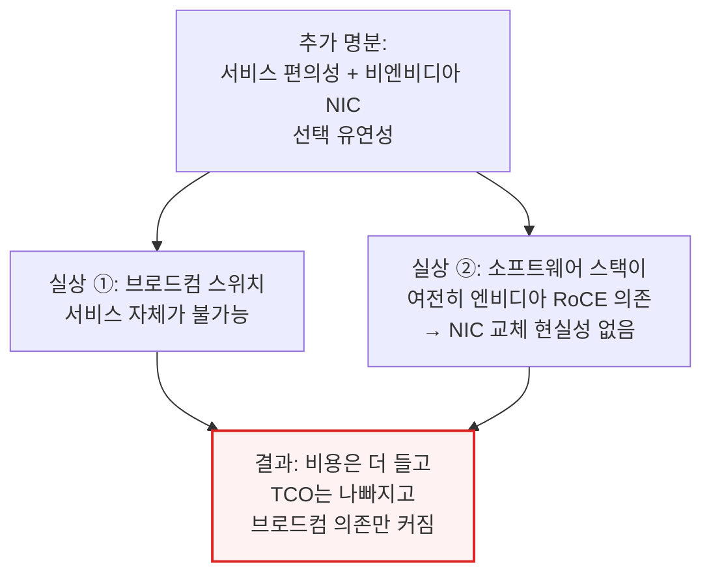

---

## 4. Ariel 랙 - GB200을 반쪽으로 쪼갠 대가

**📌 핵심:**
- 메타는 블랙웰 세대에서 표준 GB200(B200 GPU 2개+Grace CPU 1개) 대신, GPU를 절반만 채운 커스텀 랙 "Ariel"(B200 GPU 1개+Grace CPU 1개)을 이 SKU의 유일한 고객으로서 단독 사용
- 이유는 NVL72 단일 랙의 백플레인 안정성 우려 — 랙 2개를 케이블로 묶는 36x2 구성이 더 안정적일 것이라 베팅했지만, 그 대가로 스위치가 2배 필요해지고 지연시간이 한 홉 더 늘어남
- 진짜 이유는 광고 추천 시스템(RecSys)에 대한 높은 CPU-GPU 비율 집착 — RecSys는 임베딩 테이블 처리에 CPU 연산·메모리 용량이 중요하고 대역폭은 상대적으로 덜 중요하기 때문. 하지만 그 대가로 GPU당 서버 투자비가 늘어 $/FLOP·$/HBM 대역폭 같은 LLM 핵심 지표가 표준 GB200보다 악화됐고, Ariel NVL36x2의 TCO는 표준 GB200 NVL72 대비 14% 더 높음(수십억 달러 손실)
- 결론: 정작 백플레인은 이후 충분히 안정적으로 성숙했고 오히려 랙 간 케이블 연결 쪽 문제가 더 컸음 — 36GPU-1랙 구성의 안정성 이점은 없었던 것으로 판명, GB300부터는 Ariel을 완전히 폐기하고 메타도 표준 사양을 구매하는 쪽으로 전환

---

### Ariel = GB200을 반쪽으로 자른 커스텀 랙

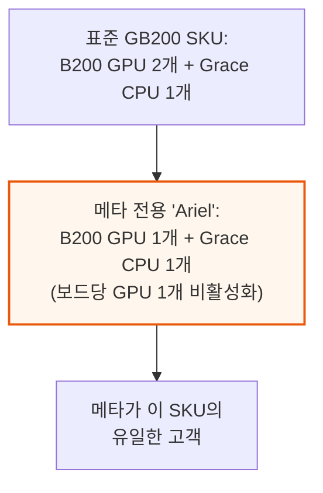

### 왜 반으로 잘랐나 - 백플레인 안정성 베팅

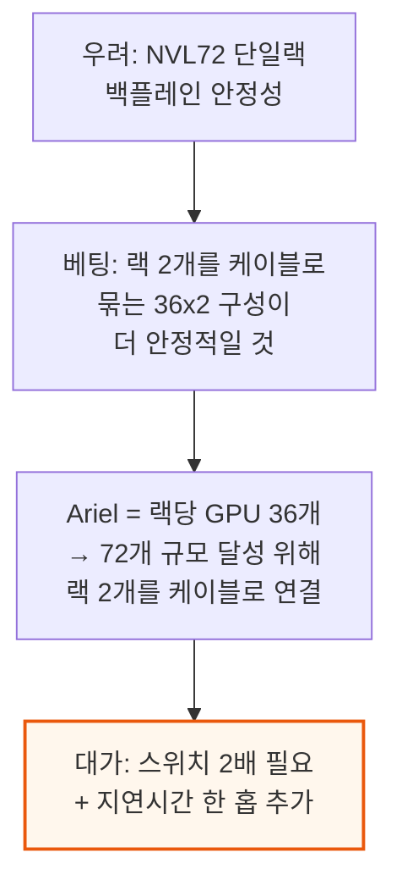

📌 용어 풀이: NVL72와 백플레인
> - NVL72는 엔비디아 GB200 랙 한 대에 GPU 72개를 하나의 통짜 회로판(백플레인)으로 연결하는 표준 구성
> - 백플레인은 랙 안의 모든 칩이 모이는 중앙 연결판 — 케이블 수천 개를 직접 잇는 대신 이 판 하나로 연결을 단순화하는 부품

### 진짜 이유 - 광고 추천 시스템(RecSys)용 CPU 비중 집착

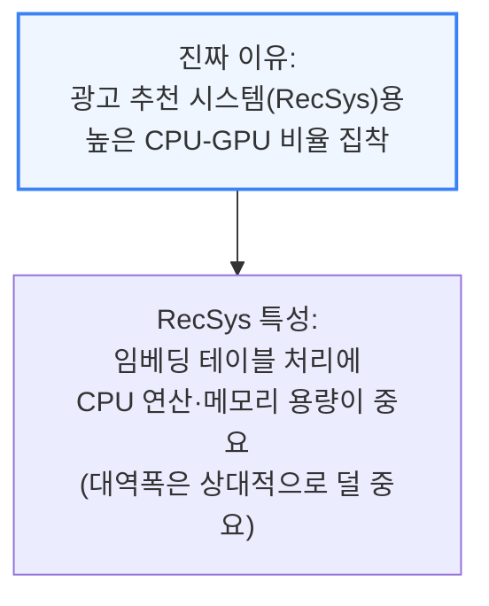

### 대가 - TCO 14% 상승, LLM팀엔 최악의 사양

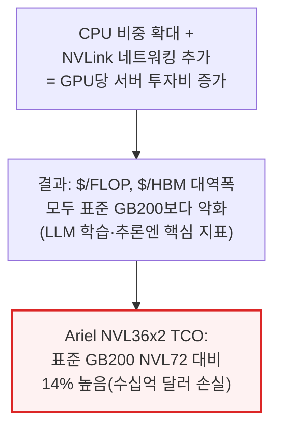

메타의 전체 GB200 물량이 이 Ariel SKU였기 때문에, 당시 생성형 AI의 플래그십 시스템이던 GB200에서 메타의 모델팀은 경쟁사가 구매한 표준 사양보다 열등한 시스템을 떠안아야 했습니다.

### 결말 - 베팅은 틀렸고, GB300에선 완전히 폐기

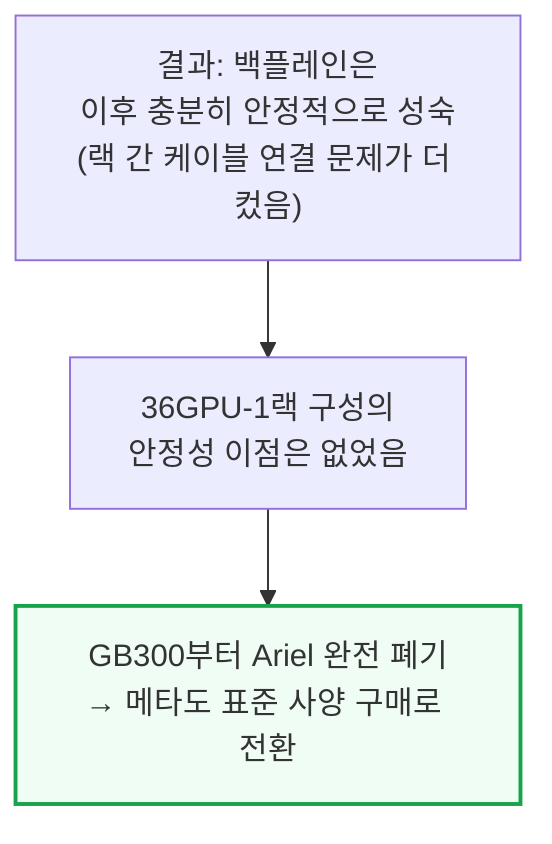

---

*작성 진행률: 약 55% 완료*
*업데이트: 2~4장(Rivos 인수, Grand Teton, Ariel) 작성 완료*
