# SpaceX 10GW in 2027 – Why It's Real, Will Drive $300B ARR for SpaceX, and Why Microsoft Will Be the Largest Offtaker

> **출처**: [SemiAnalysis Newsletter](https://newsletter.semianalysis.com/p/spacex-10gw-in-2027-why-its-real)
> **저자**: Jeremie Eliahou Ontiveros, Reyk Knuhtsen, Jordan Nanos
> **발행일**: 2026-08-07

---

## 📑 목차

### 전체 섹션
1. [개요 - 스페이스X 100억 와트 베팅과 3000억 달러 매출 경로](#1-개요---스페이스x-100억-와트-베팅과-3000억-달러-매출-경로)
2. [마이크로소프트의 100억 와트 각성 - 자체 컴퓨트가 필요한 이유](#2-마이크로소프트의-100억-와트-각성---자체-컴퓨트가-필요한-이유)
3. [스페이스X의 건설 속도 - 남다른 각본](#3-스페이스x의-건설-속도---남다른-각본)
4. [어떻게 가능한가 - 후보 부지와 온사이트 발전](#4-어떻게-가능한가---후보-부지와-온사이트-발전)

---

## 🔑 용어 정리

본문을 순서대로 읽기 전에 알아두면 좋은 용어들입니다. 자세한 수치와 설명은 본문에서 처음 등장하는 위치에 나옵니다.

- **GW (기가와트)**: 발전 용량·전력 수요를 재는 단위 — 대형 발전소 1기나 초대형 데이터센터 전체가 쓰는 전력량 규모를 잴 때 씀 (1GW ≈ 미국 가정 약 83만 채 분량 전력, EIA 평균 가정 전력소비 기준)
- **오프테이커 (Offtaker)**: 계약을 맺고 실제로 그 전력·컴퓨트를 사서 쓰기로 확정한 고객사 — 이 글에서는 스페이스X가 지은 데이터센터 컴퓨트를 사가는 회사(마이크로소프트 등)를 가리킴
- **ARR (Annual Recurring Revenue, 연환산 매출)**: 지금의 매출 속도를 1년 단위로 환산해 "이 속도면 연간 얼마를 버는가"를 보여주는 지표
- **가치 기반 가격 vs 원가가산 가격**: 스페이스X가 고른 가격 전략 — 원가에 마진을 얹어 파는 방식(원가가산) 대신, 고객이 그 컴퓨트로 얻는 가치만큼 값을 매기는 방식(가치 기반)
- **LPT (Large Power Transformer, 대형 전력변압기)**: 발전소의 높은 전압을 데이터센터가 쓸 수 있는 낮은 전압으로 바꿔주는 대형 장비 — 현재 전 세계적으로 공급이 크게 부족
- **온사이트 발전 (Onsite Generation)**: 전력망 연결을 기다리지 않고, 부지 안에 가스터빈 등을 직접 지어 그 자리에서 전기를 만드는 방식
- **그린필드 vs 리트로핏**: 맨땅에 새로 짓는 방식(그린필드)과 기존 건물(주로 창고)을 개조해 데이터센터로 쓰는 방식(리트로핏)
- **IaaS (Infrastructure-as-a-Service)**: 서버·전력 같은 인프라 전체를 통째로 빌려주는 계약 형태 — 클라우드 사업자가 인프라만 대여하고, 그 위에서 무엇을 돌릴지는 고객이 결정

---

## 1. 개요 - 스페이스X 100억 와트 베팅과 3000억 달러 매출 경로

**📌 핵심:**
- 일론 머스크는 스페이스X 첫 실적발표에서 2027년 한 해에만 추가로 6\~8GW(보수적 목표, 잠재적으로 10GW+)의 데이터센터를 짓겠다고 발표 — GW당 500억 달러 기준 초기 투자만 3,000억\~5,000억 달러로, 아마존웹서비스·구글의 2027년 예상 투자 규모와 맞먹음
- 근거는 추론(AI 응답 생성) 판매의 압도적 수익성: GW당 연간 임대비용은 약 120억 달러인데, GB300 클러스터로 API 추론을 팔면 오픈AI·앤트로픽 모두 GW당 연 1,000억 달러 넘는 매출을 냄(임대비용의 8배 이상)
- 마이크로소프트는 오픈AI 모델 전체 접근권을 가진 "제3의 회사"로, 학습비용 없이 동일한 수익 구조를 누림 — 2026년 4월 재협상에서 기존 매출 20% 배분 조항까지 사라져 컴퓨트를 최대한 빨리 확보할 유인이 커짐
- 결론: 2027년 증분 컴퓨트의 절반만 수익화해도 스페이스X는 2027년 말까지 연 3,000억 달러 매출(ARR) 경로에 진입 — 엔비디아의 자금 지원과 업계 최고가(GW당 연 300\~500억 달러) 판매로 초기 투자를 1년 내 회수 가능

---

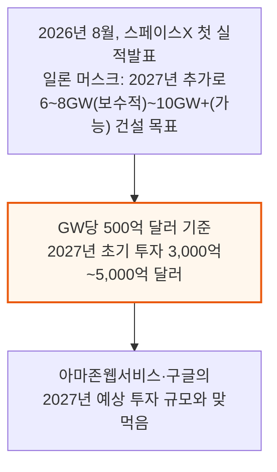

스페이스X는 두 회사보다 수익성이 훨씬 낮은 회사인데도 이 정도 지출이 가능하다는 게 SemiAnalysis의 판단입니다.

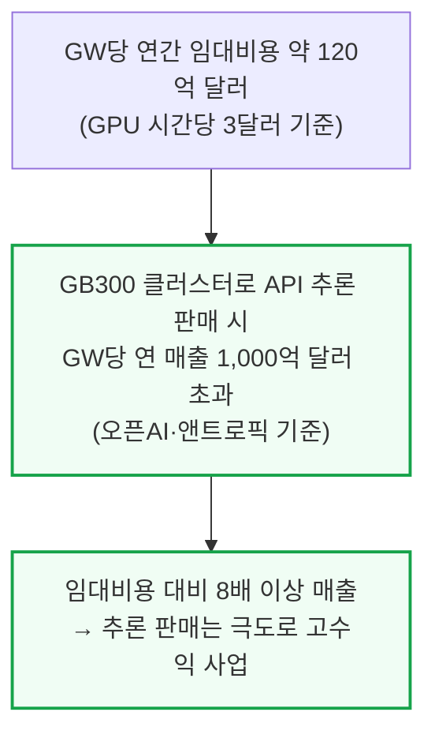

### 마이크로소프트라는 제3의 수혜자

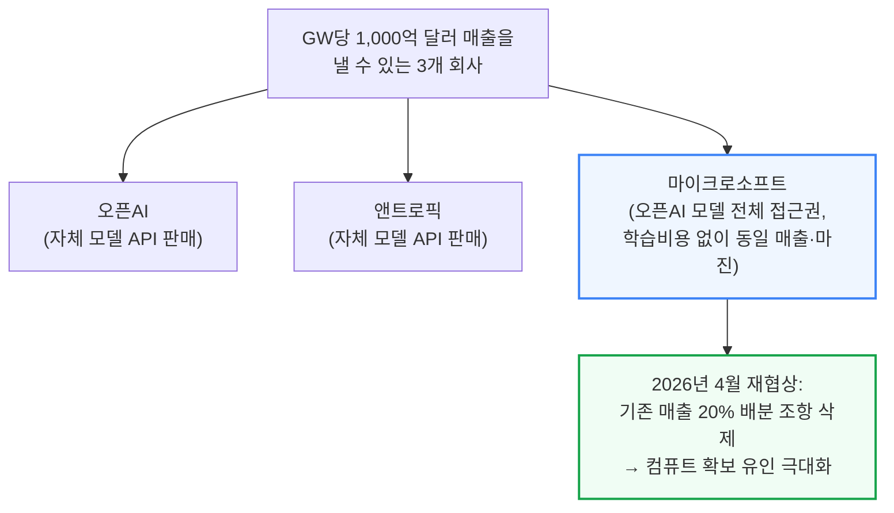

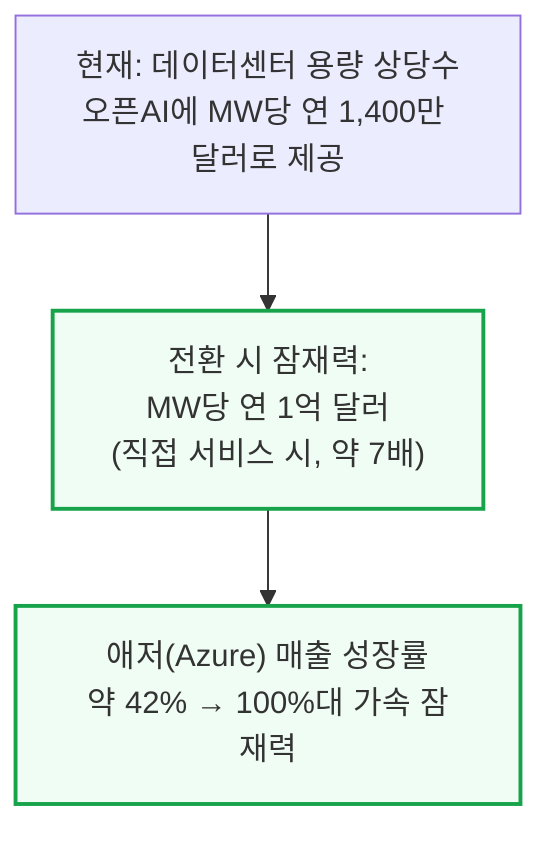

### 왜 마이크로소프트가 GW당 500억 달러를 낼 수 있는가

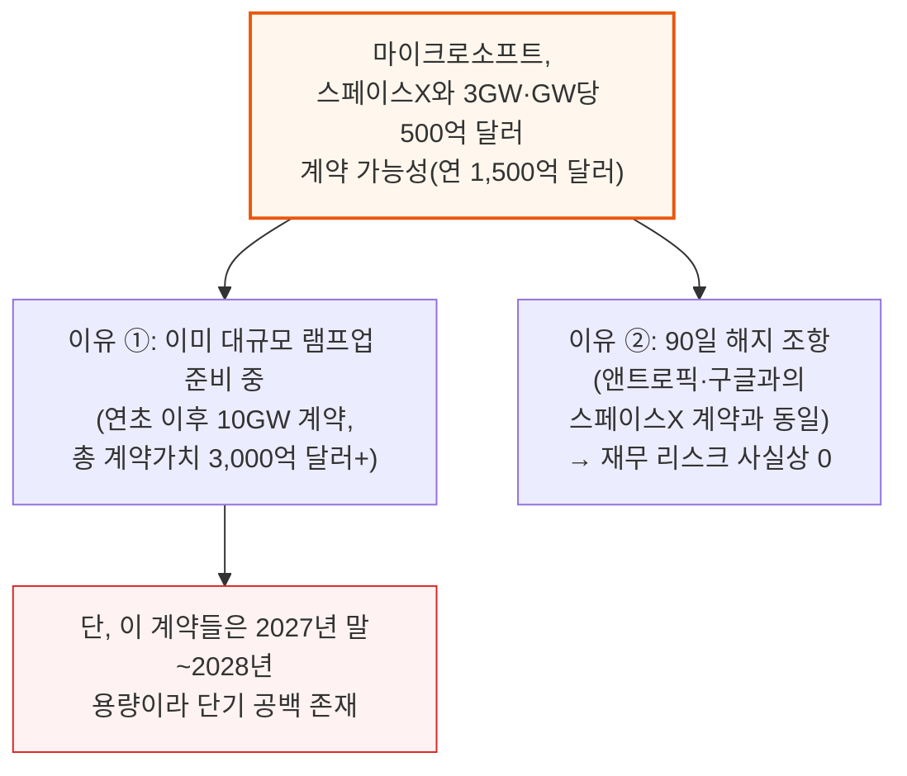

이 90일 해지 조항 덕분에 마이크로소프트 최고재무책임자(CFO) 에이미 후드 입장에서도 이 계약에 서명하기가 훨씬 쉬워집니다 — 매출 기회는 큰데 대차대조표 리스크는 사실상 없기 때문입니다.

### 스페이스X는 이 초기 투자를 어떻게 조달하는가

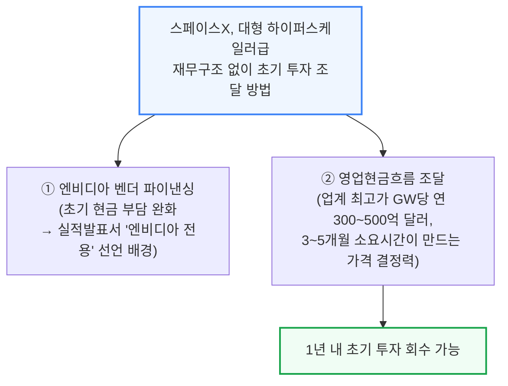

📌 용어 풀이: 왜 엔비디아 전용을 선언했나
> - SemiAnalysis의 가속기 모델 분석에 따르면 xAI·스페이스X는 그동안 구글 TPU나 AMD 칩 같은 대안도 적극 검토해왔음
> - 그런데도 엔비디아 전용을 선언한 것은 성능 때문이라기보다 재무적 이유일 가능성이 큼 — 엔비디아가 제공하는 벤더 파이낸싱(장비 대금을 나중에 갚도록 해주는 금융 지원)이 초기 현금 부담을 크게 줄여주기 때문

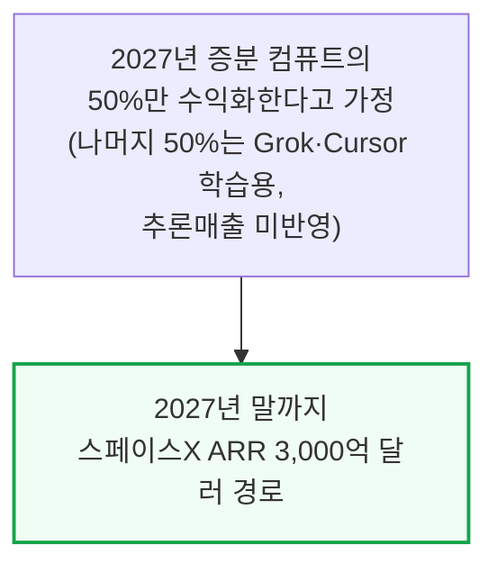

---

## 2. 마이크로소프트의 100억 와트 각성 - 자체 컴퓨트가 필요한 이유

**📌 핵심:**
- SemiAnalysis는 2024년 12월 자체 데이터센터 모델로 마이크로소프트의 임대 활동이 급격히 멈췄다고 가장 먼저 지적한 바 있음 — 이제는 정반대로 각성해, 연초 이후 10GW가 넘는 확정 계약(약 3,000억 달러 규모)을 체결
- 2025년 10월 오픈AI와 체결한 2,500억 달러 규모 IaaS(인프라 통째 임대) 계약(약 7GW 규모 추산)이 마이크로소프트의 다른 사업(API 서비스 파운드리, 코파일럿 등)에 쓸 컴퓨트를 심각하게 부족하게 만듦 — 정작 이 서비스들이 GW당 매출·마진이 가장 높은 영역
- SemiAnalysis 분석에 따르면 추론 매출총이익률은 60%를 넘고, 앤트로픽 오퍼스 4.8은 85% 이상 — GB200보다 GB300에서 프론티어 모델(Fable 5)을 서빙하면 GW당 매출이 더 높아짐, 이게 마이크로소프트의 "MW당 1억 달러" 기회
- 결론: 최근 코덱스(Codex) 수요 급증과 오픈AI 매출(ARR) 가속을 고려하면 마이크로소프트가 오픈AI 모델을 직접 서빙해 비슷한 수익률을 낼 수 있음 — 문제는 이 기회를 잡으려면 데이터센터를 빠르고 크게 지어야 한다는 것, 스페이스X는 이미 2026년 말까지 2GW 규모 건설 실적을 증명했지만 2027년 10GW+는 완전히 다른 도전

---

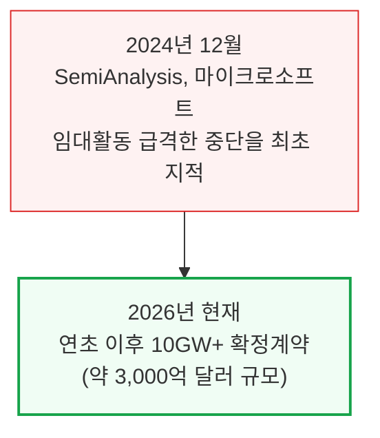

### 컴퓨트 부족의 원인과 결과

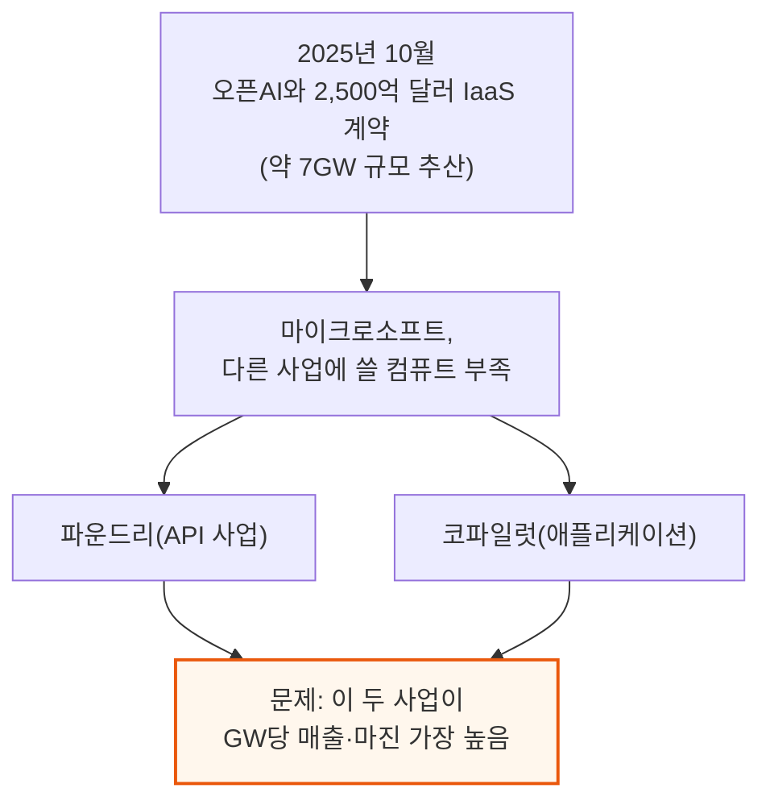

### 추론 매출총이익률 - 얼마나 남는 장사인가

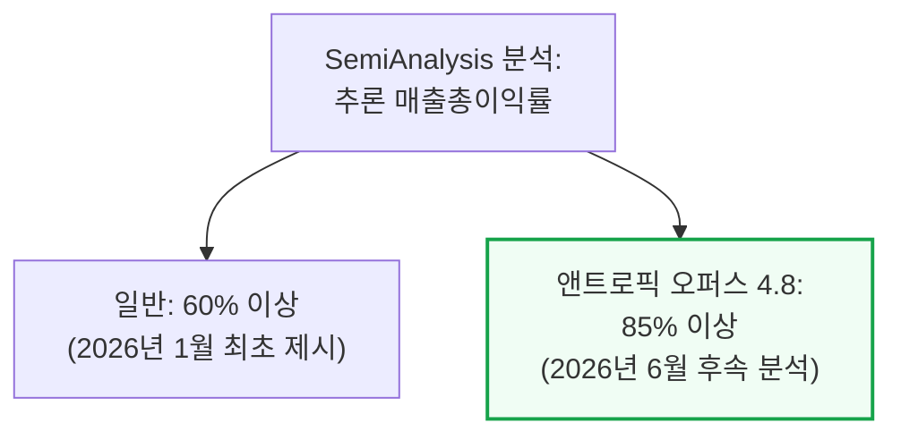

SemiAnalysis는 이 마진 추정치를 유출된 재무자료, 자사 InferenceX 벤치마크, 최신 가속기 마이크로벤치마크, 오픈소스 연구소의 논문·블로그·트윗 등을 종합해 산출했습니다. 딥시크 투자자 콜에서 유출된 "GPU 회수기간 10개월" 발언도 같은 결론을 뒷받침합니다.

### GW당 1억 달러 기회

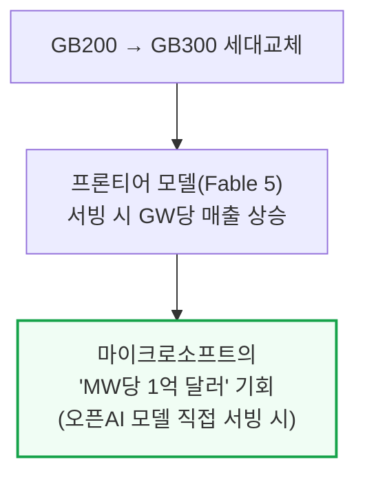

📌 용어 풀이: 왜 (모델, 칩) 조합별 마진이 중요한가
> - 회사 전체 평균 마진 하나만 보면 어떤 모델을 어떤 칩에 올려야 가장 남는지 알 수 없음
> - SemiAnalysis는 자체 추론 시뮬레이터로 모델·칩 조합마다(예: 오퍼스 5를 트레이니엄3에서 vs Fable 5를 TPUv7에서) 개별 마진을 추정 — 실제 가상 하드웨어 위에서 모델 연산을 그대로 재현하는 방식

### 남은 과제 - 속도

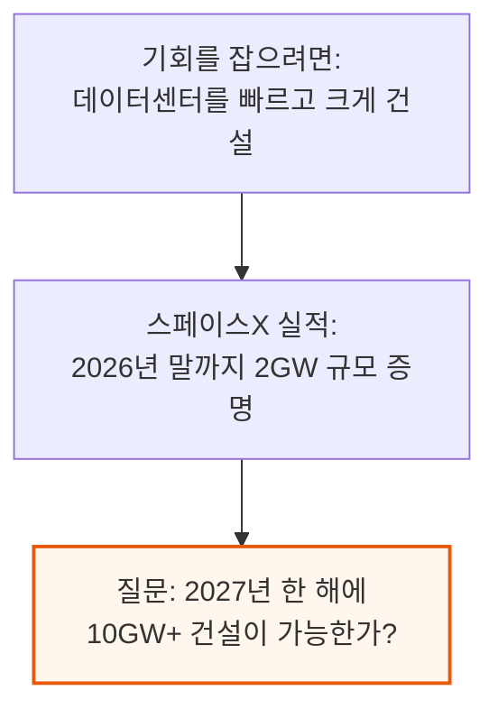

---

## 3. 스페이스X의 건설 속도 - 남다른 각본

**📌 핵심:**
- 일론 머스크는 AI 연구소들의 수익성 급증을 간파하고, 흔한 원가가산 가격(비용에 마진을 얹는 방식) 대신 가치 기반 가격(고객이 얻는 가치만큼 받는 방식)을 GPU 클러스터에 도입 — 이 전략을 유지하려면 남들보다 빠르게 데이터센터를 지어야 함
- 실적으로 증명: Colossus 1은 300MW를 122일 만에, Colossus 2는 200MW를 6개월 만에 건설, 허가 절차를 피하려 국경 1km 밖에 자체 발전소까지 지음 — 사우스헤이븐 발전소는 2026년 2월 터빈 27대(약 495MW)에서 7월 터빈 69대(1.7GW)로 5개월 만에 3배 이상 확장, MiniHard 부지도 2026년 3월 착공해 5개월 만에 450\~500MW 도달 예정
- 남다른 각본: ① 대형 전력변압기(LPT)가 2년치 품절이면 중국산 전력 모듈을 사서 우회하고 중전압을 저전압으로 바로 낮춤(LPT 단계 생략) ② 가스터빈 제조사 GE버노바가 5년+ 밀렸으면 SemiAnalysis 에너지 모델에 등재된 30개 넘는 다른 제조사로 대체 ③ 인력이 병목이면 최대한 병렬 작업·사전 조립으로 커미셔닝(시운전) 절차 자체를 줄임 — Colossus 2 현장 최대 인력은 약 3,000명으로 비슷한 기가와트급 현장 대비 훨씬 적음
- 결론: 리트로핏(기존 건물 개조)으로 Colossus 1·2를 빠르게 지은 경험에 더해, 처음으로 맨땅에서 지은 그린필드 부지(MiniHard) 경험까지 쌓여 2027년까지 이런 셸(외피)을 여러 개 더 지을 시간은 충분하다는 게 SemiAnalysis 판단

---

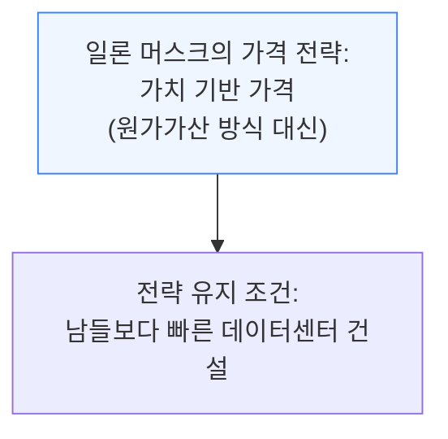

### 실적으로 증명된 속도

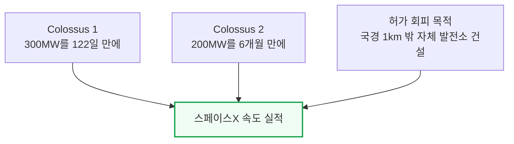

### 사우스헤이븐 발전소 - 5개월 만에 3배 이상 확장

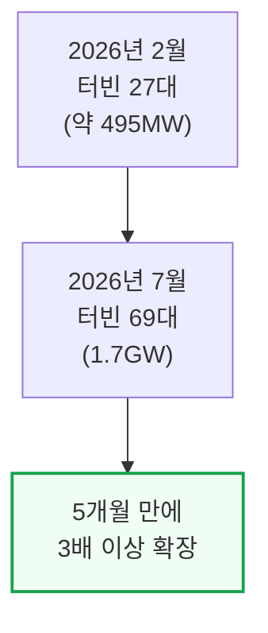

### MiniHard 부지 - 그린필드도 빠르다

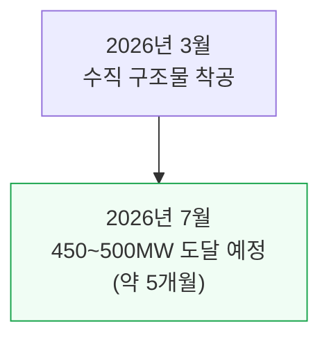

MiniHard는 스페이스X의 첫 진짜 그린필드(맨땅에서 새로 짓는) 프로젝트입니다. 다음번엔 이보다 더 빠를 가능성이 높습니다.

### 3대 건설 병목과 우회 각본

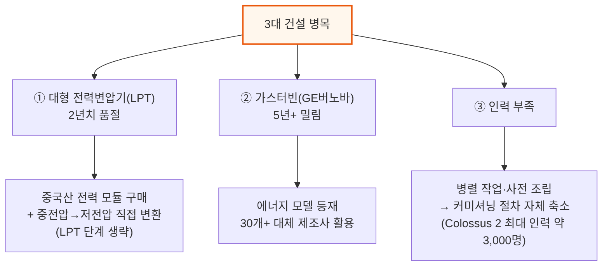

📌 용어 풀이: 왜 LPT 단계를 생략할 수 있나
> - 보통은 발전소의 고압 전기를 대형 전력변압기(LPT)로 한 번 낮추고, 다시 여러 단계를 거쳐 데이터센터가 쓸 저압까지 낮춤
> - 스페이스X는 이 중 LPT 단계를 건너뛰고, 발전소에서 나온 중전압 전기를 곧바로 저전압 변압기로 낮춤 — 저전압 변압기는 LPT보다 훨씬 흔하고 구하기 쉬움

스페이스X가 배송이 밀린 GE버노바 가스터빈 대신 다른 제조사를 쓸 수 있는 것은, 데이터센터 수요에 맞춰 대규모 물량을 확보한 가스발전 장비 제조사가 30곳 넘게 있기 때문입니다. 열심히 찾고 새로운 공급사와 일할 의지만 있다면 여유 물량은 충분합니다.

---

## 4. 어떻게 가능한가 - 후보 부지와 온사이트 발전

**📌 핵심:**
- SemiAnalysis 데이터센터 모델은 스페이스X가 남은 목표 GW를 채울 후보 부지를 이미 여러 곳 확보했을 것으로 추정 — 담보권(리엔) 기록을 추적해 일론 머스크와 연관된 법인 MZX 앞으로 잡힌 창고 2곳을 리트로핏(개조) 후보로 지목
- 미시시피주 올리브브랜치의 86만 3,000평방피트(약 2만 4,000평) 창고(블랙록 소유 엘름트리펀드 소유, 과거 xAI "Macrohard" 시설도 같은 회사에서 매입)와 사우스헤이븐의 47만 4,000평방피트(약 1만 3,300평) 창고(약 1GW 이상 수용 가능 규모)가 후보
- 텍사스주 팜파 부지는 일론 머스크가 조용히 인수한 가스발전 업체 APR에너지와 연결되며, 2GW 규모 온사이트(부지 내) 발전을 계획 중인 것으로 추정 — 킨더모건의 NGPL 주간 가스관이 팜파 부지에서 약 1.6km 거리를 지나고, 데이터센터 수요를 명시한 팬핸들 확장 사업이 완전히 계약 완료돼 이 2GW 발전소의 유력한 가스 공급 경로로 보임
- 결론: 아직 문서로 확정되지는 않았지만, 담보권·인수·파이프라인 확장이라는 여러 정황이 겹쳐 SemiAnalysis는 이런 부지들이 스페이스X의 2027년 10GW 목표를 채울 충분한 후보군이라고 판단

---

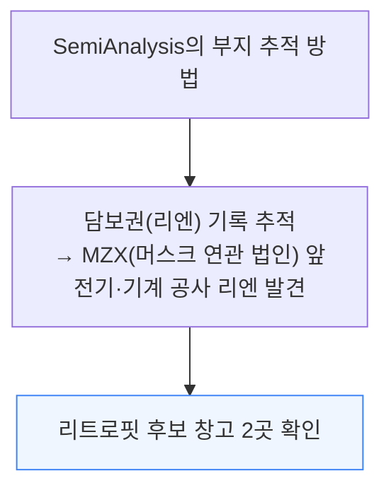

📌 용어 풀이: 담보권(리엔)으로 부지를 찾는 법
> - 리엔(Lien)은 공사업체가 대금을 받지 못했을 때 해당 부지·건물에 거는 법적 담보권으로, 공공 기록에 남음
> - 어떤 법인 앞으로 전기·기계 공사 리엔이 걸렸는지 추적하면, 그 법인이 어느 부지에서 실제로 데이터센터 개조 공사를 하고 있는지 역으로 추정할 수 있음

### 미시시피 후보 부지 2곳

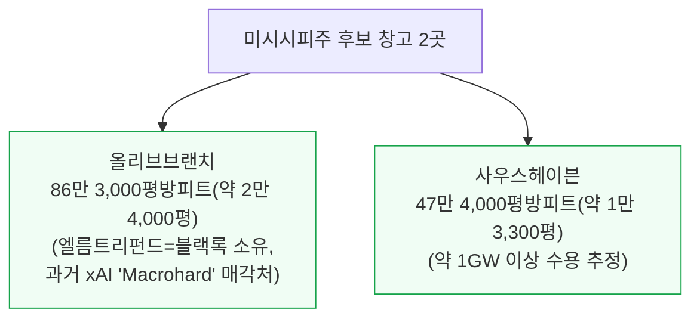

### 텍사스 팜파 부지와 가스 공급 경로

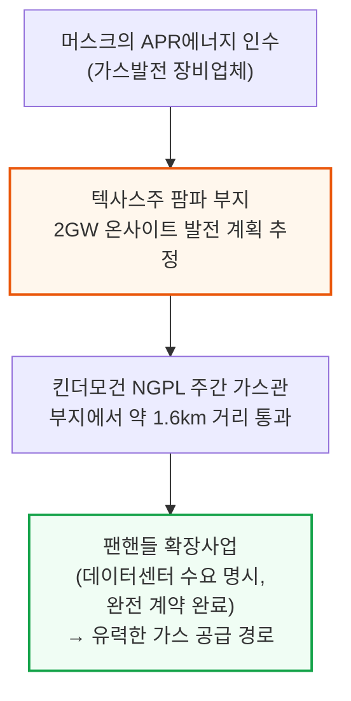

이 팜파 부지에 대한 온사이트 발전 계획은 아직 어떤 공개 문서로도 확정되지 않았지만, 담보권 정황과 인수 이력, 파이프라인 확장 시점이 서로 맞물려 SemiAnalysis는 상당히 가능성 있는 시나리오로 보고 있습니다.

---

*작성 진행률: 100% 완료*
*업데이트: 원문 전체 4개 섹션(개요\~후보 부지) 변환 완료*
