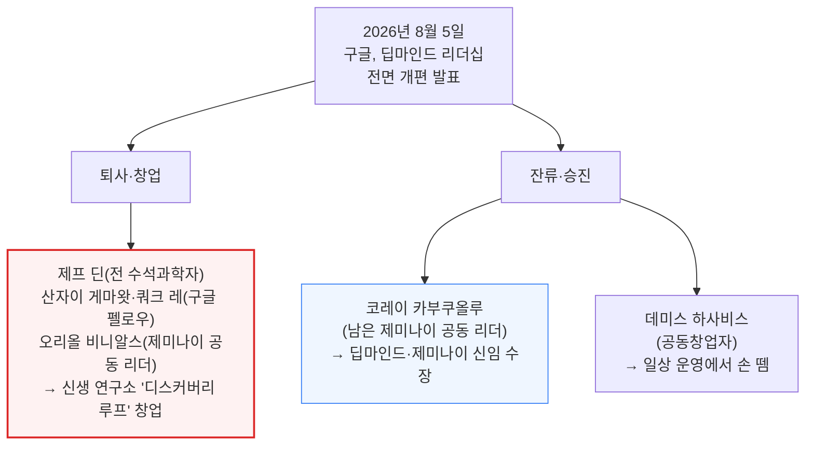
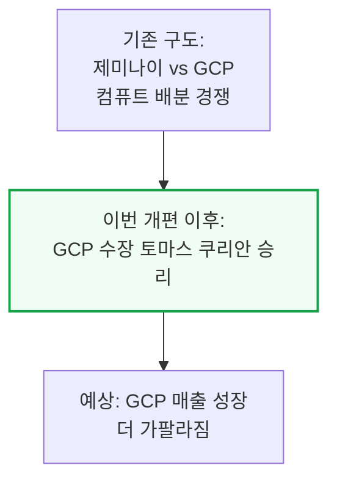
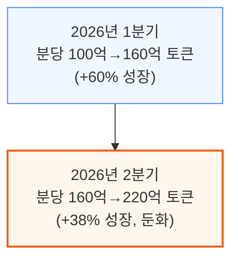
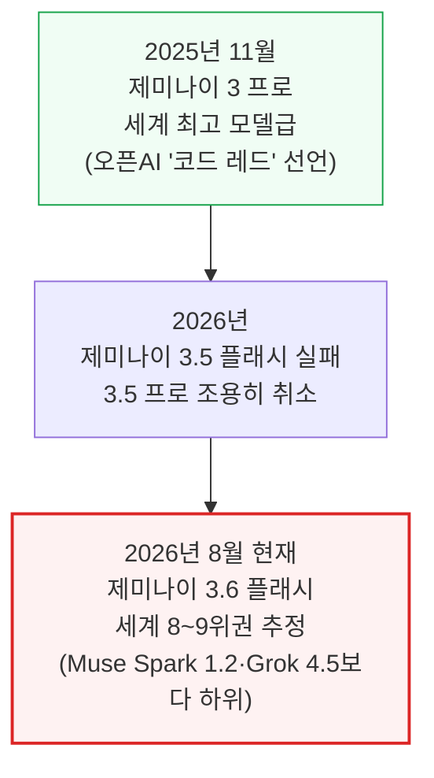
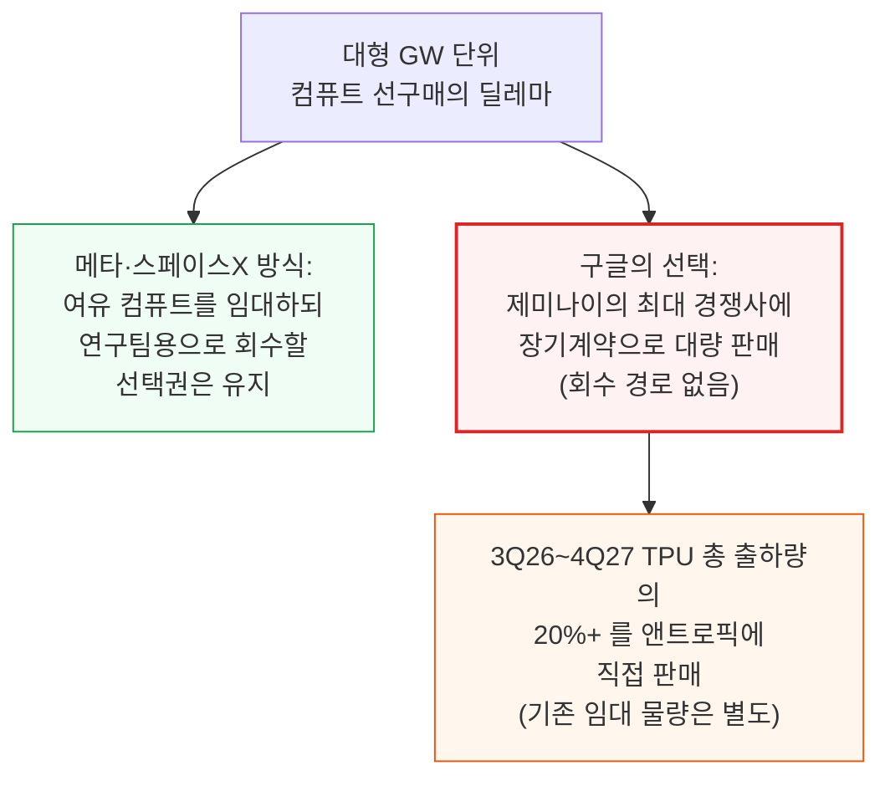
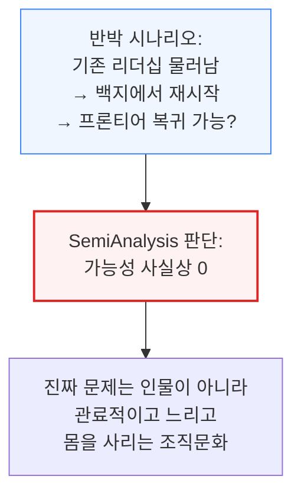
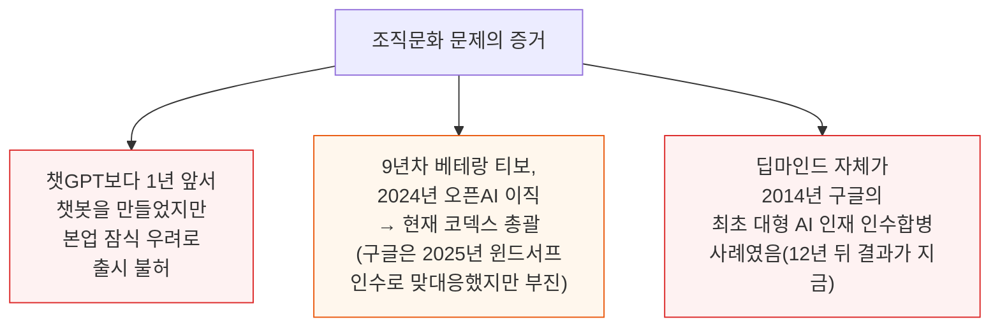

# Gemini is Cooked but GCP is Cooking

> **출처**: [SemiAnalysis Newsletter](https://newsletter.semianalysis.com/p/gemini-is-cooked-but-gcp-is-cooking)
> **저자**: Max Kan, Joey Brookhart, Doug O'Laughlin, Dylan Patel
> **발행일**: 2026-08-07

---

## 📑 목차

### 전체 섹션
1. [개요 - 딥마인드 리더십 전면 개편](#1-개요---딥마인드-리더십-전면-개편)
2. [Gemini 3 Pro가 정점이었다 - 모델 경쟁력 하락과 인재 유출](#2-gemini-3-pro가-정점이었다---모델-경쟁력-하락과-인재-유출)
3. [GCP의 금융화 - TPU 시스템 판매가 이끄는 매출 가속](#3-gcp의-금융화---tpu-시스템-판매가-이끄는-매출-가속)
4. [소원을 빌 때는 조심하라 - 장기적 함의와 역사적 유사 사례](#4-소원을-빌-때는-조심하라---장기적-함의와-역사적-유사-사례)

---

## 🔑 용어 정리

본문을 순서대로 읽기 전에 알아두면 좋은 용어들입니다. 자세한 수치와 설명은 본문에서 처음 등장하는 위치에 나옵니다.

- **프론티어랩 (Frontier Lab)**: 그 시점 세계 최고 성능 AI 모델을 다투는 최상위 소수의 연구소(오픈AI·앤트로픽 등) — 여기 속하지 못하면 최신·최강 모델 경쟁에서 사실상 밀려났다는 뜻
- **SOTA (State of the Art)**: 특정 시점 기준 업계 최고 성능 — "SOTA를 찍었다"는 그 순간 세계에서 가장 성능 좋은 모델이라는 뜻
- **신생 연구소 (Neolab)**: 대형 테크기업 출신 스타 연구자들이 퇴사해 외부 투자를 받아 새로 차리는 독립 AI 연구소 (이 글의 디스커버리 루프, 기존의 세이프 슈퍼인텔리전스(SSI) 등이 같은 부류)
- **ARR (Annual Recurring Revenue, 연환산 반복매출)**: 지금의 매출 속도를 1년 단위로 환산해 "이 속도로 가면 연간 얼마를 버는가"를 보여주는 지표
- **RPO (Remaining Performance Obligations, 수주 잔고)**: 계약은 이미 체결됐지만 아직 매출로 잡히지 않은 미래 매출 금액 — 앞으로 실적으로 인식될 예정 물량
- **총액 기준 회계 (Gross Basis)**: TPU 시스템을 팔 때 원가를 빼지 않고 판매 금액 전체를 매출로 잡는 회계 방식 — 매출 규모는 커 보이지만 실제 마진율은 따로 봐야 함

---

## 1. 개요 - 딥마인드 리더십 전면 개편

**📌 핵심:**
- 2026년 8월 5일, 구글이 딥마인드 리더십을 통째로 교체한다고 발표 — 공동창업자 데미스 하사비스는 일상 운영에서 손을 떼고, 제프 딘(전 수석과학자·제미나이 공동 리더)·산자이 게마왓·쿼크 레(둘 다 구글 펠로우, 회사 전체에서 최고 기술직 10여 명급)·오리올 비니알스(제미나이 공동 리더)가 함께 회사를 떠나 신생 연구소 "디스커버리 루프"를 차림
- 남은 제미나이 공동 리더였던 코레이 카부쿠올루가 하사비스 자리를 물려받아 딥마인드·제미나이 수장이 됨 — 핵심 인재 4명이 한꺼번에 나가는 것은 곧 나올 제미나이 4 프로에 대한 자신감의 표시로 보기 어려움
- SemiAnalysis는 이번 인력 유출로 **딥마인드가 사실상 더 이상 프론티어랩(최상위 성능 경쟁 그룹)이 아니라고 판단** — 강화학습 팀의 대규모 이탈과 부족한 컴퓨트 배분을 근거로 이미 몇 달 전 자사 유료 리서치(Tokenomics) 구독자들에게 같은 판단을 전달한 바 있음
- 결론: 이번 사태의 최대 수혜자는 앤트로픽도 오픈AI도 아닌 **구글 클라우드(GCP)** — 컴퓨트를 두고 제미나이와 GCP가 내부에서 벌이던 경쟁에서 GCP 수장 토마스 쿠리안이 승리한 셈이며, GCP 매출 성장은 앞으로 더 가팔라질 전망

---

---

## 2. Gemini 3 Pro가 정점이었다 - 모델 경쟁력 하락과 인재 유출

**📌 핵심:**
- 2025년 말까지는 앤트로픽·오픈AI·구글이 "AI 빅3"였음 — 2025년 11월 제미나이 3 프로는 사실상 세계 최고 모델이었고, 오픈AI 샘 알트먼이 "코드 레드"를 선언할 정도였음
- 하지만 2026년 들어 격차가 빠르게 벌어짐: 제미나이 3.5 플래시는 완전히 실패했고, 업계에서는 다음에 나올 제미나이 3.5 프로가 앤트로픽 오퍼스 4.5 수준에 그칠 것이라는 이야기가 나옴 — 이는 GLM 5.2보다도 낮은 성능이며, Fable 5·GPT 5.6과는 격차가 더 큼
- 구글은 실제로 제미나이 3.5 프로 출시를 조용히 취소하고 제미나이 4 홍보로 화제를 돌리는 중 — 임시로 낸 제미나이 3.6 플래시는 Muse Spark 1.2, Grok 4.5, 중국 상위권 오픈소스 모델보다도 성능이 낮아, 현재 제미나이는 세계 8\~9위권으로 추정됨
- 결론: 제미나이 1자사 API 토큰 성장률도 2026년 1분기 60%(분당 100억→160억 토큰)에서 2분기 38%(분당 160억→220억 토큰)로 둔화 — 모델 경쟁력과 매출 성장 모두 동시에 꺾이는 중. 다만 제미나이 엔터프라이즈 에이전트 플랫폼(옛 버텍스)은 클로드 등 3자 모델을 함께 제공하는 덕분에 오히려 견조한 흐름을 유지 중

---

---

### 확신의 부재 - 왜 구글은 컴퓨트를 경쟁사에 팔았나

컴퓨트는 AI 경쟁력의 원천이라 프론티어를 노리는 연구소들은 최대한 많은 컴퓨트를 확보하려 함. 다만 수 기가와트(GW) 단위를 몇 년치 선구매하는 것은 매우 비싸고 위험한 일 — 특히 고마진 API 사업이 아직 크지 않다면 더 그러함. 메타·스페이스X는 이 딜레마를 "여유 컴퓨트를 외부에 임대해 수익을 내되, 필요하면 언제든 자사 연구팀 몫으로 회수할 수 있는 선택권은 유지"하는 방식으로 풀었음.

구글은 다른 길을 택함 — 제미나이의 최대 경쟁자에게 장기 계약으로 대량 판매하되, 다시 딥마인드로 되돌릴 방법을 남겨두지 않았음. 3분기(2026년)부터 2027년 4분기까지 나올 TPU 총 출하량의 20% 이상이 앤트로픽에 직접 판매되는데, 이는 GCP가 이미 앤트로픽에 임대해준 수십만 개 TPU와 앞으로 6개 분기 동안 앤트로픽·메타에 추가로 임대하기로 약속한 물량은 포함하지 않은 수치임.

구글 클라우드 CEO 토마스 쿠리안은 인터뷰에서 TPU가 시타델·미국 에너지부 같은 고객까지 아우르는 "범용 인프라"가 되는 것이 바람직하다고 밝혔고, 제미나이의 경쟁사인 앤트로픽에 컴퓨트를 파는 이유를 묻는 질문에는 구글이 "플랫폼 기업"이기 때문에 자연스러운 결과라고 답함. 이번 리더십 개편으로 쿠리안은 구글 전체 컴퓨트 배분에 대한 발언권을 한층 더 키운 것으로 보임.

---

---

### 딥마인드가 다시 프론티어로 복귀할 수 있을까 - 반박 시나리오 점검

가장 관대하게 봐줄 수 있는 시나리오는 이렇다 — 기존 리더십으로는 앤트로픽·오픈AI를 따라잡을 가능성이 거의 없었으니, 이번에 물갈이해 백지에서 다시 시작하면(어쩌면 SSI나 Thinking Machines 같은 신생 연구소를 통째로 인수하는 방식으로) 오히려 따라잡을 확률이 올라간다는 주장.

SemiAnalysis는 이 가능성을 사실상 0으로 봄. 구글의 진짜 문제는 제프 딘이나 노암 셰이저 개인이 아니라, 극도로 관료적이고 느리며 전략적으로 몸을 사리는 조직문화였음. 딥마인드는 챗GPT보다 1년 앞서 챗봇을 만들어 두고도 "본업(검색)을 잠식할 수 있다"는 우려 때문에 출시를 허락받지 못한 전례가 있음.

이런 문화 문제를 보여주는 또 다른 사례가 있음. 9년차 구글·딥마인드 베테랑이었던 티보는 2024년 7월 오픈AI로 이직해 코딩 에이전트 팀을 공동 이끌었고 현재는 코덱스(Codex) 총괄을 맡고 있음. 구글은 2025년 7월 자체 에이전틱 코딩 플랫폼을 만들려고 윈드서프(Windsurf)를 "인수"했지만 아직 이렇다 할 성과를 내지 못함. 애초에 딥마인드 자체가 2014년 구글의 최초 대형 AI 인재 인수합병 사례였고, 12년이 지난 지금 그 결과가 바로 이번 리더십 붕괴임 — 신생 연구소를 하나 더 사들인다고 크게 달라질 것으로 보기 어려움.

---

---

*작성 진행률: 약 60% 완료*
*업데이트: 2장(Gemini 3 Pro가 정점이었다, 하위 2개 소절 포함) 작성 완료*
