# Gemini is Cooked but GCP is Cooking

> **출처**: [SemiAnalysis Newsletter](https://newsletter.semianalysis.com/p/gemini-is-cooked-but-gcp-is-cooking)
> **저자**: Max Kan, Joey Brookhart, Doug O'Laughlin, Dylan Patel
> **발행일**: 2026-08-07

---

## 📑 목차

### 전체 섹션
1. [개요 - 딥마인드 리더십 전면 개편](#1-개요---딥마인드-리더십-전면-개편)
2. [Gemini 3 Pro가 정점이었다 - 모델 경쟁력 하락과 인재 유출](#2-gemini-3-pro가-정점이었다---모델-경쟁력-하락과-인재-유출)
3. [GCP의 금융화 - TPU 시스템 판매가 이끄는 매출 가속](#3-gcp의-금융화---tpu-시스템-판매가-이끄는-매출-가속)
4. [소원을 빌 때는 조심하라 - 장기적 함의와 역사적 유사 사례](#4-소원을-빌-때는-조심하라---장기적-함의와-역사적-유사-사례)

---

## 🔑 용어 정리

본문을 순서대로 읽기 전에 알아두면 좋은 용어들입니다. 자세한 수치와 설명은 본문에서 처음 등장하는 위치에 나옵니다.

- **프론티어랩 (Frontier Lab)**: 그 시점 세계 최고 성능 AI 모델을 다투는 최상위 소수의 연구소(오픈AI·앤트로픽 등) — 여기 속하지 못하면 최신·최강 모델 경쟁에서 사실상 밀려났다는 뜻
- **SOTA (State of the Art)**: 특정 시점 기준 업계 최고 성능 — "SOTA를 찍었다"는 그 순간 세계에서 가장 성능 좋은 모델이라는 뜻
- **신생 연구소 (Neolab)**: 대형 테크기업 출신 스타 연구자들이 퇴사해 외부 투자를 받아 새로 차리는 독립 AI 연구소 (이 글의 디스커버리 루프, 기존의 세이프 슈퍼인텔리전스(SSI) 등이 같은 부류)
- **ARR (Annual Recurring Revenue, 연환산 반복매출)**: 지금의 매출 속도를 1년 단위로 환산해 "이 속도로 가면 연간 얼마를 버는가"를 보여주는 지표
- **RPO (Remaining Performance Obligations, 수주 잔고)**: 계약은 이미 체결됐지만 아직 매출로 잡히지 않은 미래 매출 금액 — 앞으로 실적으로 인식될 예정 물량
- **총액 기준 회계 (Gross Basis)**: TPU 시스템을 팔 때 원가를 빼지 않고 판매 금액 전체를 매출로 잡는 회계 방식 — 매출 규모는 커 보이지만 실제 마진율은 따로 봐야 함

---

## 1. 개요 - 딥마인드 리더십 전면 개편

**📌 핵심:**
- 2026년 8월 5일, 구글이 딥마인드 리더십을 통째로 교체한다고 발표 — 공동창업자 데미스 하사비스는 일상 운영에서 손을 떼고, 제프 딘(전 수석과학자·제미나이 공동 리더)·산자이 게마왓·쿼크 레(둘 다 구글 펠로우, 회사 전체에서 최고 기술직 10여 명급)·오리올 비니알스(제미나이 공동 리더)가 함께 회사를 떠나 신생 연구소 "디스커버리 루프"를 차림
- 남은 제미나이 공동 리더였던 코레이 카부쿠올루가 하사비스 자리를 물려받아 딥마인드·제미나이 수장이 됨 — 핵심 인재 4명이 한꺼번에 나가는 것은 곧 나올 제미나이 4 프로에 대한 자신감의 표시로 보기 어려움
- SemiAnalysis는 이번 인력 유출로 **딥마인드가 사실상 더 이상 프론티어랩(최상위 성능 경쟁 그룹)이 아니라고 판단** — 강화학습 팀의 대규모 이탈과 부족한 컴퓨트 배분을 근거로 이미 몇 달 전 자사 유료 리서치(Tokenomics) 구독자들에게 같은 판단을 전달한 바 있음
- 결론: 이번 사태의 최대 수혜자는 앤트로픽도 오픈AI도 아닌 **구글 클라우드(GCP)** — 컴퓨트를 두고 제미나이와 GCP가 내부에서 벌이던 경쟁에서 GCP 수장 토마스 쿠리안이 승리한 셈이며, GCP 매출 성장은 앞으로 더 가팔라질 전망

---

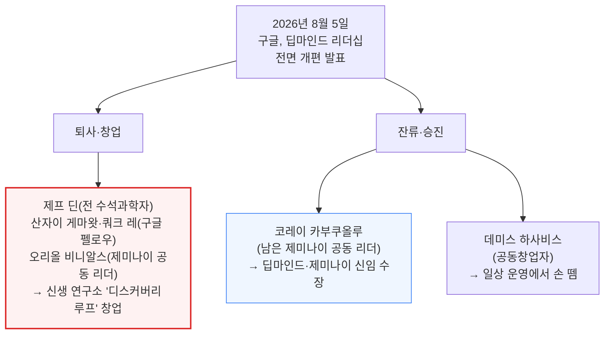

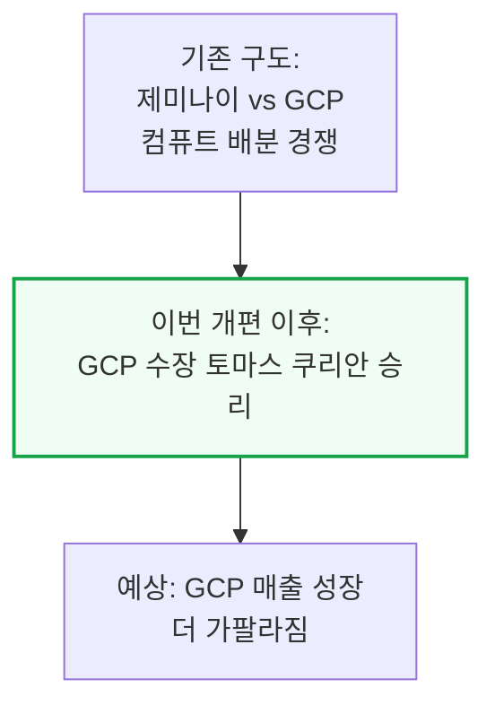

---

## 2. Gemini 3 Pro가 정점이었다 - 모델 경쟁력 하락과 인재 유출

**📌 핵심:**
- 2025년 말까지는 앤트로픽·오픈AI·구글이 "AI 빅3"였음 — 2025년 11월 제미나이 3 프로는 사실상 세계 최고 모델이었고, 오픈AI 샘 알트먼이 "코드 레드"를 선언할 정도였음
- 하지만 2026년 들어 격차가 빠르게 벌어짐: 제미나이 3.5 플래시는 완전히 실패했고, 업계에서는 다음에 나올 제미나이 3.5 프로가 앤트로픽 오퍼스 4.5 수준에 그칠 것이라는 이야기가 나옴 — 이는 GLM 5.2보다도 낮은 성능이며, Fable 5·GPT 5.6과는 격차가 더 큼
- 구글은 실제로 제미나이 3.5 프로 출시를 조용히 취소하고 제미나이 4 홍보로 화제를 돌리는 중 — 임시로 낸 제미나이 3.6 플래시는 Muse Spark 1.2, Grok 4.5, 중국 상위권 오픈소스 모델보다도 성능이 낮아, 현재 제미나이는 세계 8\~9위권으로 추정됨
- 결론: 제미나이 1자사 API 토큰 성장률도 2026년 1분기 60%(분당 100억→160억 토큰)에서 2분기 38%(분당 160억→220억 토큰)로 둔화 — 모델 경쟁력과 매출 성장 모두 동시에 꺾이는 중. 다만 제미나이 엔터프라이즈 에이전트 플랫폼(옛 버텍스)은 클로드 등 3자 모델을 함께 제공하는 덕분에 오히려 견조한 흐름을 유지 중

---

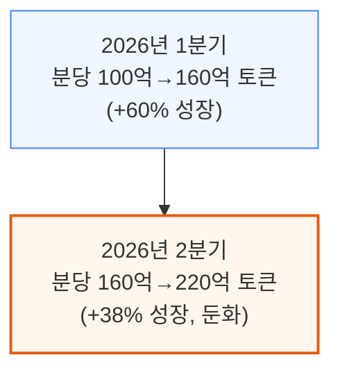

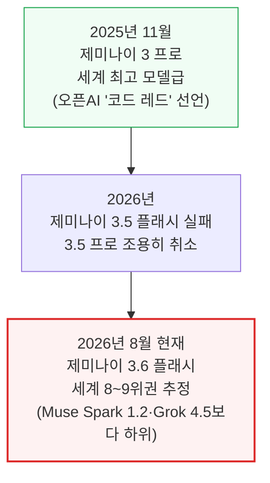

---

### 확신의 부재 - 왜 구글은 컴퓨트를 경쟁사에 팔았나

컴퓨트를 둘러싼 두 갈래 선택지와 구글이 고른 길, 그리고 그 규모를 아래 다이어그램에 정리함.

---

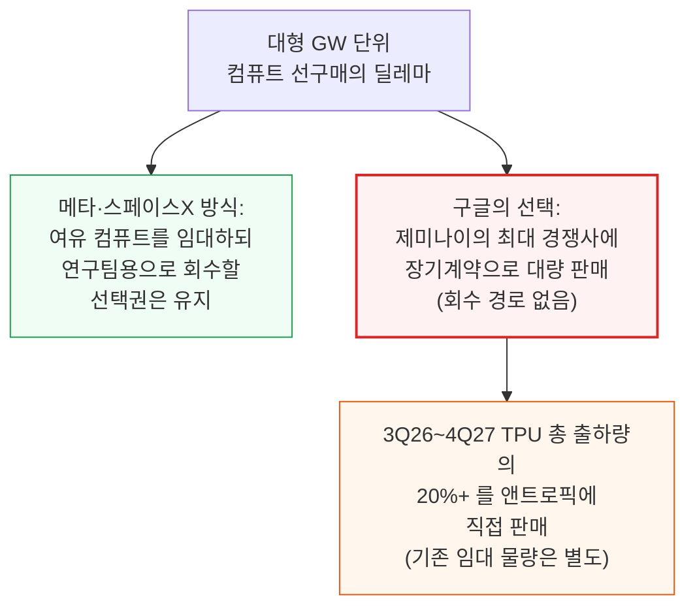

구글 클라우드 CEO 토마스 쿠리안은 인터뷰에서 TPU가 시타델·미국 에너지부 같은 고객까지 아우르는 "범용 인프라"가 되는 것이 바람직하다고 밝힘.
제미나이의 경쟁사인 앤트로픽에 컴퓨트를 파는 이유를 묻는 질문에는 구글이 "플랫폼 기업"이기 때문에 자연스러운 결과라고 답함.
이번 리더십 개편으로 쿠리안은 구글 전체 컴퓨트 배분에 대한 발언권을 한층 더 키운 것으로 보임.

---

### 딥마인드가 다시 프론티어로 복귀할 수 있을까 - 반박 시나리오 점검

가장 관대하게 봐줄 수 있는 반박 시나리오와 SemiAnalysis의 판단 근거를 아래 다이어그램에 정리함.

---

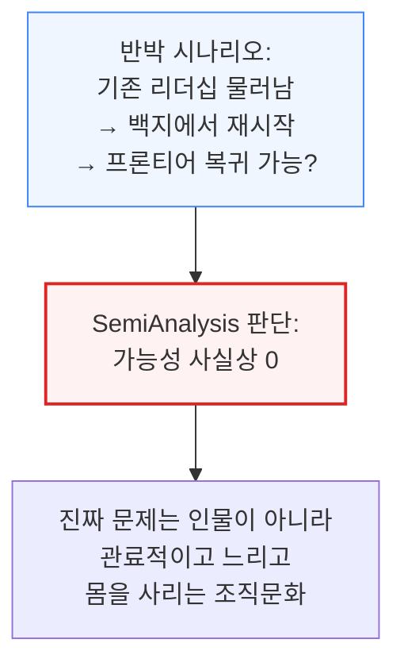

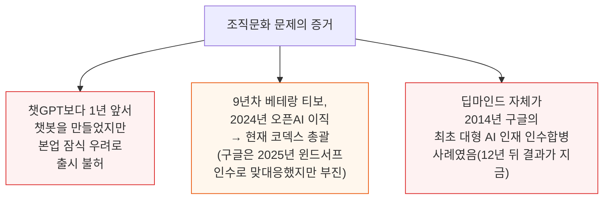

---

## 3. GCP의 금융화 - TPU 시스템 판매가 이끄는 매출 가속

**📌 핵심:**
- SemiAnalysis 추산: 2026년 2분기 기준 제미나이 자체 서비스의 연환산 매출(ARR)은 120억 달러에 불과한 반면, 2027년 말까지 GCP는 외부 AI 기업 대상 클라우드 매출(IaaS/TaaS)만 730억 달러, 여기에 TPU 판매 1,200억 달러를 더해 총 2,000억 달러 규모로 성장할 전망 — 이 외부 매출은 영업이익률(EBIT 기준)도 30%대 후반으로 높음
- 이번 분기 GCP 매출은 82% 성장했지만, 이 중 상당 부분은 전통적인 "클라우드 대여" 매출이 아니라 **TPU 완제품 시스템을 앤트로픽 등 고객이 쓸 데이터센터를 운영하는 외부 특수목적법인(SPV)에 통째로 판매**하는 새로운 매출원임 — 이 매출은 원가를 빼지 않은 총액 기준으로 GW(기가와트)당 약 350억 달러로 잡힘
- 2분기 TPU 시스템 판매는 약 12억 달러였고, 이를 제외한 "진짜 클라우드" 매출 성장률은 70%대 초반 — 하지만 이미 체결된 TPU 시스템 계약(수주 잔고, RPO) 규모가 1,500억 달러를 넘어, 2027년 GCP 전체 성장률을 증권가 컨센서스(64%)를 크게 웃도는 100%대 중반까지 끌어올릴 것으로 전망
- 결론: 향후 몇 분기 안에 추가로 2,500억 달러 이상의 TPU 수주가 GCP 수주 잔고에 더해질 것으로 예상되며, 이 매출 가속과 양호한 마진이 겹쳐 **2027년 구글 주당순이익(EPS)을 약 3달러 끌어올릴 전망**

---

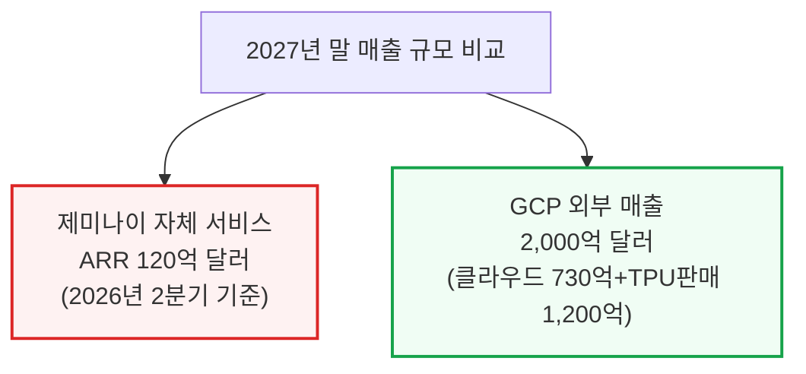

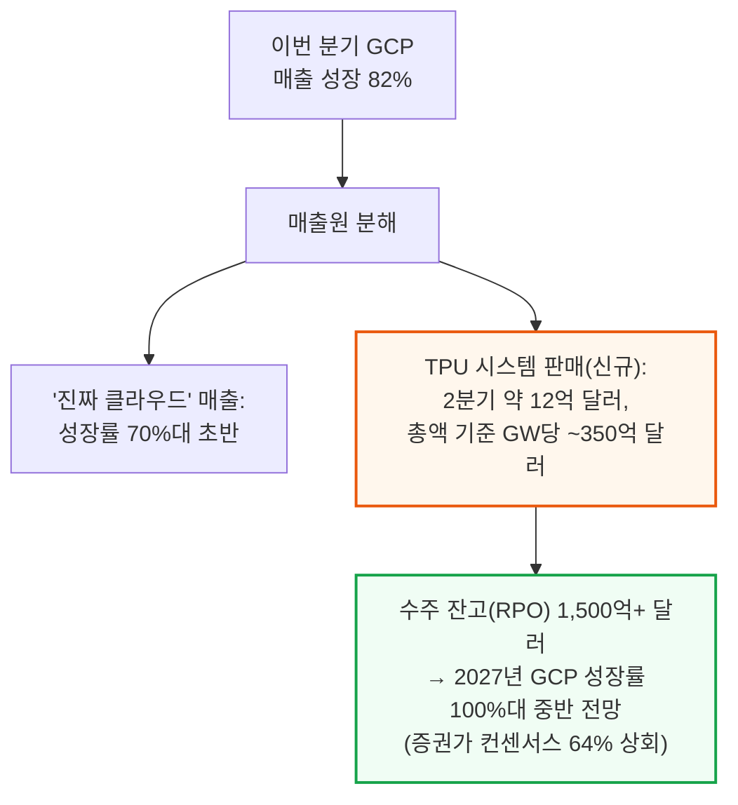

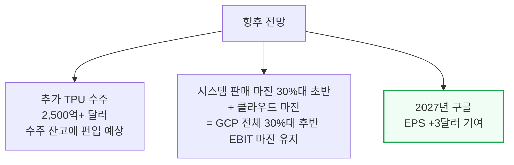

---

## 4. 소원을 빌 때는 조심하라 - 장기적 함의와 역사적 유사 사례

**📌 핵심:**
- 구글이 핵심 인재를 잃고 외부 TPU 판매에 힘을 싣는 이번 선택은 회사 역사에서 분기점이 될 수 있음 — 트랜스포머(현재 모든 LLM의 기반 구조)를 발명한 회사가 정작 그 기술이 만든 AI 시장의 주도권은 놓치는 아이러니
- 역사적으로 낯설지 않은 패턴: **IBM**은 메인프레임·컨설팅으로, **인텔**은 모바일을 포기하고 이후 EUV(첨단 미세공정 기술)에서도 뒤처지며 핵심 사업 자체를 잃음 — 두 회사 모두 "더 어려운 길(첨단 기술 경쟁)"을 포기하고 "돈이 되는 길(금융화)"을 택했던 전례
- 단기적으로는 옳은 선택처럼 보임: TPU 판매 실적이 좋아지기 시작하면 주주들에게 그 성과를 계속 보여줘야 하는 압박이 생기고, 이는 되돌리기 어려운 길로 굳어짐 — 구글은 당분간 매출 면에서는 문제없이 잘 굴러가겠지만, 사실상 "그럴듯하게 포장된 신생 클라우드 업체"에 가까워지는 셈
- 결론: 현재 TPU는 업계 최고 수준이지만, 핵심 인재 다수가 떠난 상황에서 이 기술 우위가 계속될지는 불확실 — 남은 인재들의 역량이 그 격차를 얼마나 오래 지켜낼 수 있는지가 다음 관전 포인트

---

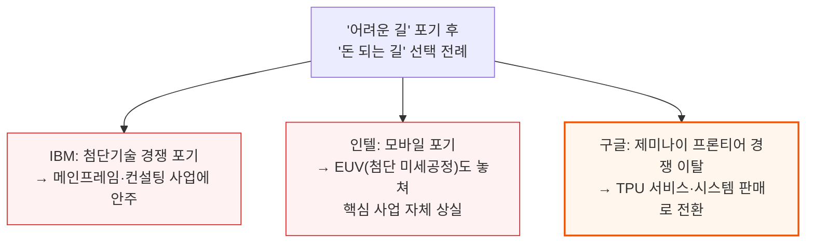

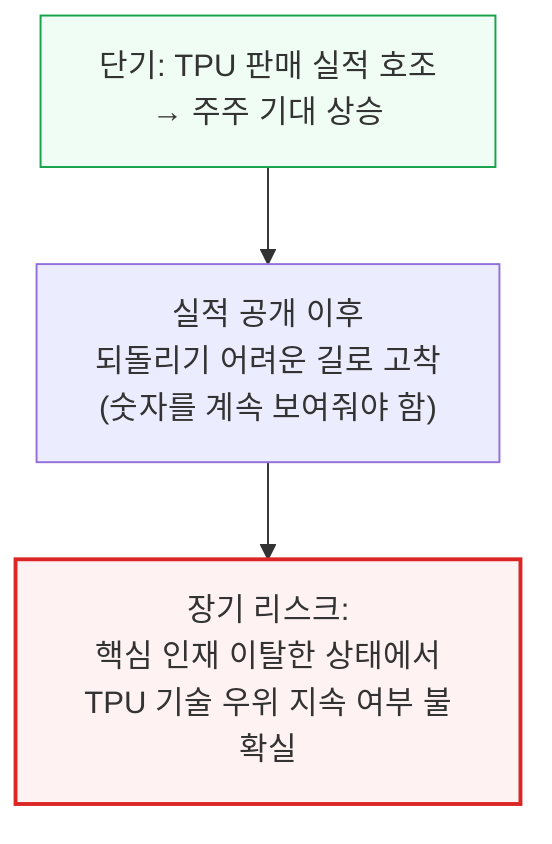

---

*작성 진행률: 100% 완료*
*업데이트: 검증 통과(난이도 이모지 0건, LR 다이어그램 0건, 비이스케이프 물결표 0건, 문단 글자수 비율 7%, 200자 초과 문단 0개) — 2장 "확신의 부재"·"딥마인드 복귀 가능성" 서브섹션의 다이어그램-줄글 중복 제거 완료. 원문 전체 섹션 커버 완료*
