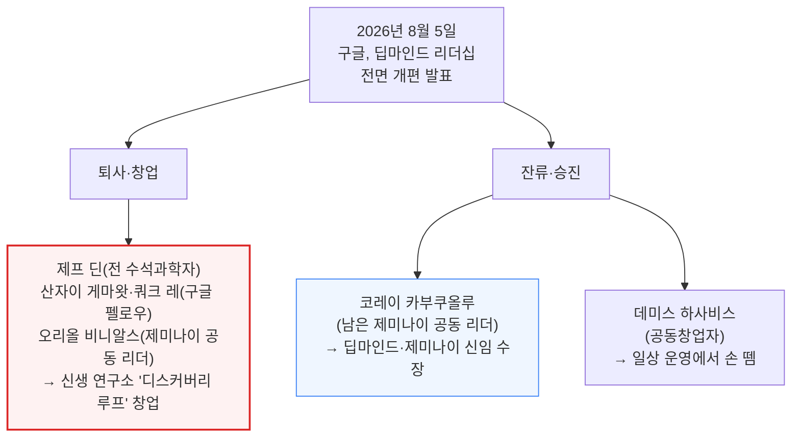
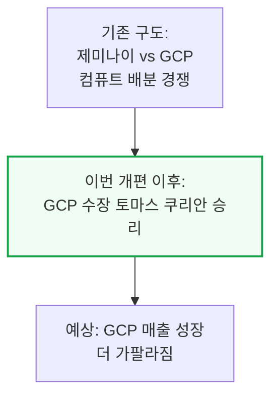

# Gemini is Cooked but GCP is Cooking

> **출처**: [SemiAnalysis Newsletter](https://newsletter.semianalysis.com/p/gemini-is-cooked-but-gcp-is-cooking)
> **저자**: Max Kan, Joey Brookhart, Doug O'Laughlin, Dylan Patel
> **발행일**: 2026-08-07

---

## 📑 목차

### 전체 섹션
1. [개요 - 딥마인드 리더십 전면 개편](#1-개요---딥마인드-리더십-전면-개편)
2. [Gemini 3 Pro가 정점이었다 - 모델 경쟁력 하락과 인재 유출](#2-gemini-3-pro가-정점이었다---모델-경쟁력-하락과-인재-유출)
3. [GCP의 금융화 - TPU 시스템 판매가 이끄는 매출 가속](#3-gcp의-금융화---tpu-시스템-판매가-이끄는-매출-가속)
4. [소원을 빌 때는 조심하라 - 장기적 함의와 역사적 유사 사례](#4-소원을-빌-때는-조심하라---장기적-함의와-역사적-유사-사례)

---

## 🔑 용어 정리

본문을 순서대로 읽기 전에 알아두면 좋은 용어들입니다. 자세한 수치와 설명은 본문에서 처음 등장하는 위치에 나옵니다.

- **프론티어랩 (Frontier Lab)**: 그 시점 세계 최고 성능 AI 모델을 다투는 최상위 소수의 연구소(오픈AI·앤트로픽 등) — 여기 속하지 못하면 최신·최강 모델 경쟁에서 사실상 밀려났다는 뜻
- **SOTA (State of the Art)**: 특정 시점 기준 업계 최고 성능 — "SOTA를 찍었다"는 그 순간 세계에서 가장 성능 좋은 모델이라는 뜻
- **신생 연구소 (Neolab)**: 대형 테크기업 출신 스타 연구자들이 퇴사해 외부 투자를 받아 새로 차리는 독립 AI 연구소 (이 글의 디스커버리 루프, 기존의 세이프 슈퍼인텔리전스(SSI) 등이 같은 부류)
- **ARR (Annual Recurring Revenue, 연환산 반복매출)**: 지금의 매출 속도를 1년 단위로 환산해 "이 속도로 가면 연간 얼마를 버는가"를 보여주는 지표
- **RPO (Remaining Performance Obligations, 수주 잔고)**: 계약은 이미 체결됐지만 아직 매출로 잡히지 않은 미래 매출 금액 — 앞으로 실적으로 인식될 예정 물량
- **총액 기준 회계 (Gross Basis)**: TPU 시스템을 팔 때 원가를 빼지 않고 판매 금액 전체를 매출로 잡는 회계 방식 — 매출 규모는 커 보이지만 실제 마진율은 따로 봐야 함

---

## 1. 개요 - 딥마인드 리더십 전면 개편

**📌 핵심:**
- 2026년 8월 5일, 구글이 딥마인드 리더십을 통째로 교체한다고 발표 — 공동창업자 데미스 하사비스는 일상 운영에서 손을 떼고, 제프 딘(전 수석과학자·제미나이 공동 리더)·산자이 게마왓·쿼크 레(둘 다 구글 펠로우, 회사 전체에서 최고 기술직 10여 명급)·오리올 비니알스(제미나이 공동 리더)가 함께 회사를 떠나 신생 연구소 "디스커버리 루프"를 차림
- 남은 제미나이 공동 리더였던 코레이 카부쿠올루가 하사비스 자리를 물려받아 딥마인드·제미나이 수장이 됨 — 핵심 인재 4명이 한꺼번에 나가는 것은 곧 나올 제미나이 4 프로에 대한 자신감의 표시로 보기 어려움
- SemiAnalysis는 이번 인력 유출로 **딥마인드가 사실상 더 이상 프론티어랩(최상위 성능 경쟁 그룹)이 아니라고 판단** — 강화학습 팀의 대규모 이탈과 부족한 컴퓨트 배분을 근거로 이미 몇 달 전 자사 유료 리서치(Tokenomics) 구독자들에게 같은 판단을 전달한 바 있음
- 결론: 이번 사태의 최대 수혜자는 앤트로픽도 오픈AI도 아닌 **구글 클라우드(GCP)** — 컴퓨트를 두고 제미나이와 GCP가 내부에서 벌이던 경쟁에서 GCP 수장 토마스 쿠리안이 승리한 셈이며, GCP 매출 성장은 앞으로 더 가팔라질 전망

---

---

*작성 진행률: 약 25% 완료*
*업데이트: 헤더·목차·용어 정리·1장(개요) 작성 완료*
