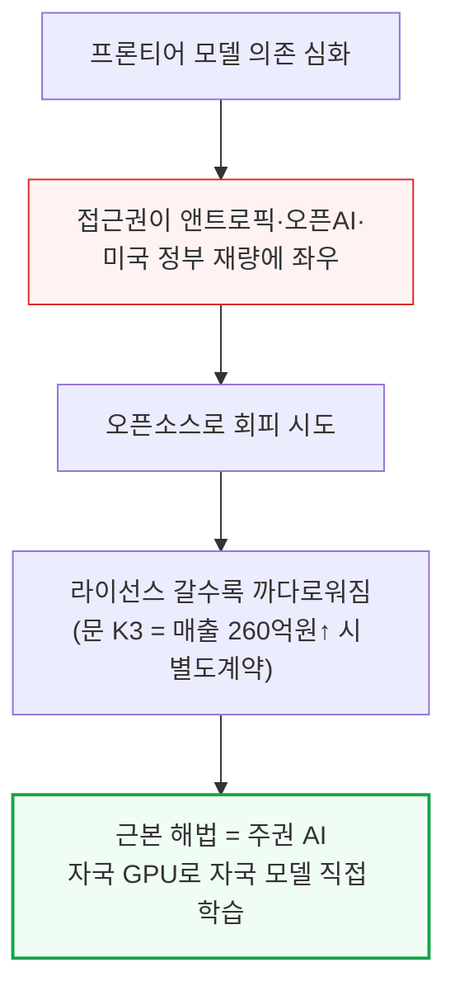
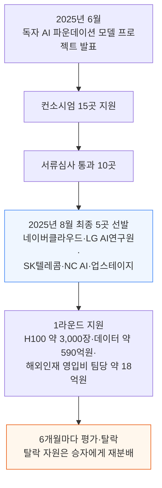

# Korea's Trillion-Dollar Sovereign AI Investment: Nvidia Wins, Hynix Loses

> **출처**: [SemiAnalysis Newsletter](https://newsletter.semianalysis.com/p/koreas-trillion-dollar-sovereign)
> **저자**: Max Kan, Ray Wang, Dylan Patel
> **발행일**: 2026-09-01

---

## 📑 목차

### 전체 섹션
1. [서론 - 프론티어 모델 의존과 오픈소스의 한계](#1-서론---프론티어-모델-의존과-오픈소스의-한계)
2. [한국의 오징어 게임 - 국가대표 AI 토너먼트](#2-한국의-오징어-게임---국가대표-ai-토너먼트)
3. [4개 모델 성적표 - 스타트업의 반란](#3-4개-모델-성적표---스타트업의-반란)
4. [논란의 심사 - 왜 1등 모티프가 탈락했나](#4-논란의-심사---왜-1등-모티프가-탈락했나)
5. [1조 달러 데이터센터 베팅](#5-1조-달러-데이터센터-베팅)
6. [엔비디아가 오픈소스와 주권 AI를 미는 이유](#6-엔비디아가-오픈소스와-주권-ai를-미는-이유)
7. [데이터센터와 메모리 - 하이닉스가 치르는 대가](#7-데이터센터와-메모리---하이닉스가-치르는-대가)

---

## 🔑 용어 정리

본문을 순서대로 읽기 전에 알아두면 좋은 용어들입니다. 자세한 수치와 설명은 본문에서 처음 등장하는 위치에 나옵니다.

- **주권 AI(Sovereign AI)**: 국가가 외국 AI 기업에 의존하지 않고 자국 GPU·자국 모델로 AI를 직접 학습·운영하는 것
- **Artificial Analysis Intelligence Index**: 여러 벤치마크 점수를 하나로 종합해 모델의 지능 수준을 매기는 제3자 평가 지수
- **컴플리먼트 상품화(Commoditize your complements)**: 자사 제품과 함께 쓰이는 보완재를 값싸게·널리 풀어 본제품 수요를 늘리는 경영 전략
- **HBM4(4세대 고대역폭 메모리, High Bandwidth Memory)**: GPU 옆에 여러 층으로 쌓아 붙여 데이터 전송 속도를 높인 고성능 D램
- **SOCAMM(칩 부착형 메모리 모듈, System On Chip Attached Memory Module)**: GPU 서버에 꽂아 쓰는 모듈형 메모리 규격 — 엔비디아가 채택을 주도한다
- **MOU(양해각서, Memorandum of Understanding)**: 최종 계약 전 방향성에 합의하는, 법적 구속력이 약한 사전 합의 문서

---

## 1. 서론 - 프론티어 모델 의존과 오픈소스의 한계

**📌 핵심:**
- 전 세계 기업·정부가 미국 프론티어 모델(앤트로픽·오픈AI 등 최상위 성능 모델)에 점점 더 의존하고 있는데, 그 접근권은 사실상 앤트로픽·오픈AI·미국 정부의 재량에 달려 있다 — Fable 5는 미국 정부에 의해 일시 차단됐고 GPT 5.6과 Astra도 출시가 지연됐다
- 오픈소스가 대안처럼 보이지만 온전한 해법은 아니다 — 연매출 2,000만 달러(약 260억원) 넘는 "모델 서비스 사업자"는 문 K3를 쓰려면 문샷과 별도 계약을 맺어야 하는 등 오픈소스 라이선스 자체가 갈수록 까다로워지고 있고, 오늘 공개된 모델이 내일도 계속 공개된다는 보장도 없다
- 이 딜레마를 근본적으로 없애는 유일한 방법은 자기 GPU로 자기 모델을 직접 처음부터 학습(사전학습)시키는 것이다 — 지금까지는 기업 단위 질문이었지만 조만간 국가 단위 질문이 된다
- 결론: SemiAnalysis는 이 글에서 한국의 주권 AI(Sovereign AI, 외국 의존 없이 자국이 직접 학습·운영하는 AI) 노력을 집중 분석하고, 그로부터 엔비디아와 삼성·SK하이닉스 주주에게 각각 무엇이 갈리는지를 짚는다

---

한국은 AI 공급망에서 가장 중요한 기업 두 곳(삼성·SK하이닉스)의 본거지이자, 오랜 기술 자립 전통(네이버맵을 써본 외국인이라면 익숙할 정도)을 가진 나라라 지금 주권 AI 흐름의 명확한 선두주자다.

---

## 2. 한국의 오징어 게임 - 국가대표 AI 토너먼트

**📌 핵심:**
- 한국 정부는 2025년 6월 "독자 AI 파운데이션 모델" 프로젝트를 발표했다 — 외국 AI 랩에 의존하지 않고 한국 기업이 직접 학습·수정·운영할 수 있는 모델을 만드는 것이 목표다
- 단일 국가대표를 처음부터 정하지 않고, 컴퓨트·데이터·연구인력 3대 자원을 지원받는 여러 기업이 6개월마다 평가받아 탈락자의 자원을 승자에게 재분배하는 토너먼트 방식을 택했다
- 컨소시엄 15곳으로 시작해 서류심사로 10곳이 남았고, 2025년 8월 네이버클라우드·LG AI연구원·SK텔레콤·NC AI·업스테이지 5곳이 최종 선발됐다 — SKT·LG·네이버는 챗GPT 이전부터 자체 대형언어모델(LLM)을 학습해온 이력이 있다
- 결론: 1라운드에서 정부는 SKT·네이버에서 빌린 H100 GPU 약 3,000장 상당을 나머지 3개 팀에 나눠주고, 데이터에 약 4,500만 달러(약 590억원), 팀당 해외 인재 영입비 약 140만 달러(약 18억원)를 지원했다 — 총 예산 약 3.5억 달러(약 4,550억원)는 미국 랩 대비 반올림 오차 수준이지만, 이는 뒤에 나올 한국 전체 AI 투자 계획의 일부에 불과하다

---

원래 계획은 5팀 → 4팀 → 3팀 → 2팀으로 줄여가며 각 라운드를 약 6개월씩 진행해 2026년 말 최종 2개 승자를 뽑고, 2027년에 추가 자원으로 이들을 스케일업시키는 것이었다. 그런데 1라운드 말미에 예상 밖의 파란이 벌어졌다.

5팀은 벤치마크 점수 40%, 전문가 평가 35%, 사용자 테스트 25%로 심사받았다. 원래대로면 NC AI가 최하위로 탈락하고 나머지 4팀이 다음 라운드에 진출해야 했지만, 정부는 네이버클라우드도 함께 탈락시켰다 — 네이버가 알리바바 문(Qwen) 모델 계열의 영상·음성 인코더(입력을 처리해 본체 모델에 넘기는 별도 신경망)를 가져다 썼다는 이유였다.

네이버 측은 이 인코더가 본체 LLM과 별개로 작동하는 독립 신경망이며, 애초 정부가 오픈소스 사용 범위 기준을 명확히 밝히지 않았다고 항변했다 — 기준은 제출 이후에야 "보조 구성요소까지도 가중치 초기화 이후 직접 학습·개발해야 한다"는 방향으로 확정됐다. 네이버는 자체 인코더를 이미 개발해뒀고 언제든 문 부품을 교체할 수 있다고 주장했지만, 정부는 예정대로 엄격한 기준을 적용해 복귀를 거부했다.

한 팀이 빈 상태에서, 정부는 보충 경쟁을 열어 새 4번째 참가팀을 물색했고 결국 모레(Moreh, 한국 AI 인프라 소프트웨어 기업)에서 분사한 신생 랩 모티프 테크놀로지스(Motif Technologies, 2025년 2월 설립)를 선정했다.

---

*작성 진행률: 약 30% 완료*
*업데이트: 헤더·목차·용어 정리, 1\~2장(서론, 국가대표 토너먼트) 작성 완료*
