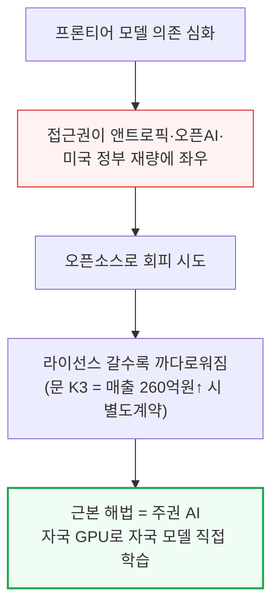
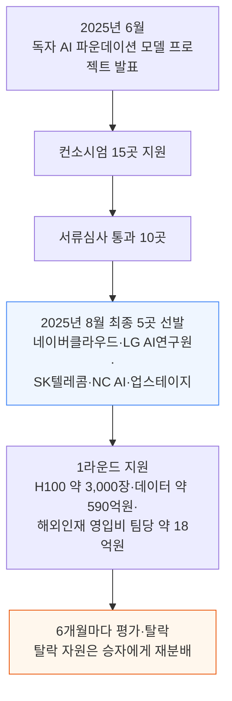
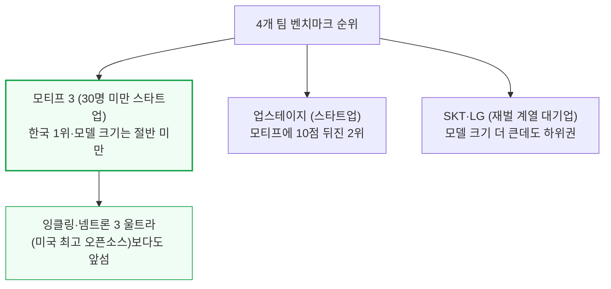
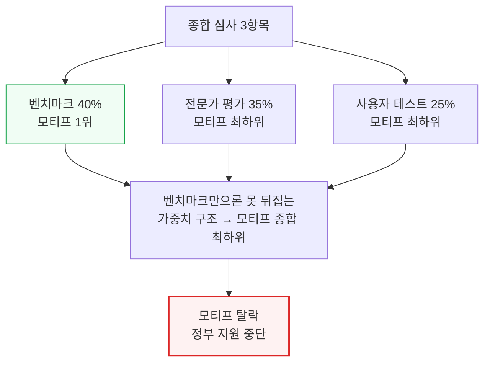
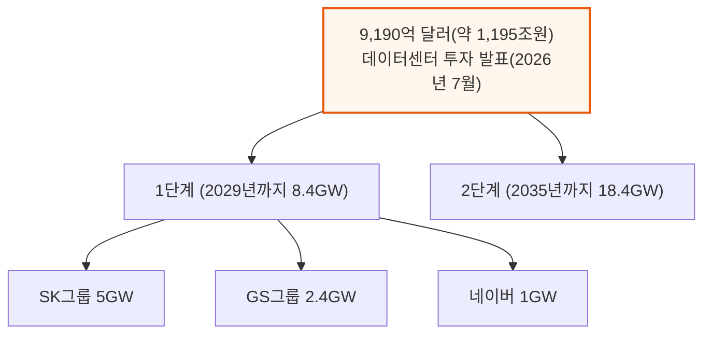
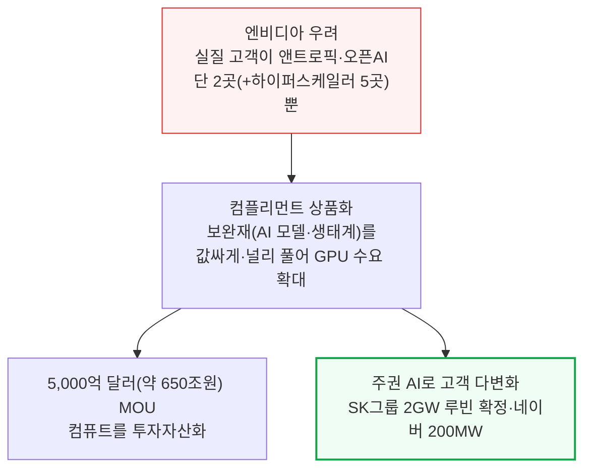
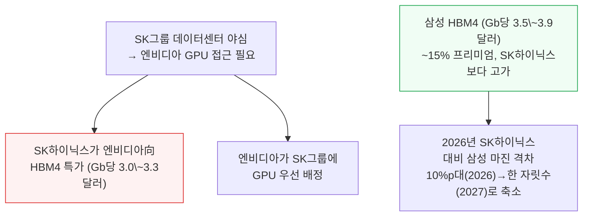

# Korea's Trillion-Dollar Sovereign AI Investment: Nvidia Wins, Hynix Loses

> **출처**: [SemiAnalysis Newsletter](https://newsletter.semianalysis.com/p/koreas-trillion-dollar-sovereign)
> **저자**: Max Kan, Ray Wang, Dylan Patel
> **발행일**: 2026-09-01

---

## 📑 목차

### 전체 섹션
1. [서론 - 프론티어 모델 의존과 오픈소스의 한계](#1-서론---프론티어-모델-의존과-오픈소스의-한계)
2. [한국의 오징어 게임 - 국가대표 AI 토너먼트](#2-한국의-오징어-게임---국가대표-ai-토너먼트)
3. [4개 모델 성적표 - 스타트업의 반란](#3-4개-모델-성적표---스타트업의-반란)
4. [논란의 심사 - 왜 1등 모티프가 탈락했나](#4-논란의-심사---왜-1등-모티프가-탈락했나)
5. [1조 달러 데이터센터 베팅](#5-1조-달러-데이터센터-베팅)
6. [엔비디아가 오픈소스와 주권 AI를 미는 이유](#6-엔비디아가-오픈소스와-주권-ai를-미는-이유)
7. [데이터센터와 메모리 - 하이닉스가 치르는 대가](#7-데이터센터와-메모리---하이닉스가-치르는-대가)

---

## 🔑 용어 정리

본문을 순서대로 읽기 전에 알아두면 좋은 용어들입니다. 자세한 수치와 설명은 본문에서 처음 등장하는 위치에 나옵니다.

- **주권 AI(Sovereign AI)**: 국가가 외국 AI 기업에 의존하지 않고 자국 GPU·자국 모델로 AI를 직접 학습·운영하는 것
- **Artificial Analysis Intelligence Index**: 여러 벤치마크 점수를 하나로 종합해 모델의 지능 수준을 매기는 제3자 평가 지수
- **컴플리먼트 상품화(Commoditize your complements)**: 자사 제품과 함께 쓰이는 보완재를 값싸게·널리 풀어 본제품 수요를 늘리는 경영 전략
- **HBM4(4세대 고대역폭 메모리, High Bandwidth Memory)**: GPU 옆에 여러 층으로 쌓아 붙여 데이터 전송 속도를 높인 고성능 D램
- **SOCAMM(칩 부착형 메모리 모듈, System On Chip Attached Memory Module)**: GPU 서버에 꽂아 쓰는 모듈형 메모리 규격 — 엔비디아가 채택을 주도한다
- **MOU(양해각서, Memorandum of Understanding)**: 최종 계약 전 방향성에 합의하는, 법적 구속력이 약한 사전 합의 문서

---

## 1. 서론 - 프론티어 모델 의존과 오픈소스의 한계

**📌 핵심:**
- 전 세계 기업·정부가 미국 프론티어 모델(앤트로픽·오픈AI 등 최상위 성능 모델)에 점점 더 의존하고 있는데, 그 접근권은 사실상 앤트로픽·오픈AI·미국 정부의 재량에 달려 있다 — Fable 5는 미국 정부에 의해 일시 차단됐고 GPT 5.6과 Astra도 출시가 지연됐다
- 오픈소스가 대안처럼 보이지만 온전한 해법은 아니다 — 연매출 2,000만 달러(약 260억원) 넘는 "모델 서비스 사업자"는 문 K3를 쓰려면 문샷과 별도 계약을 맺어야 하는 등 오픈소스 라이선스 자체가 갈수록 까다로워지고 있고, 오늘 공개된 모델이 내일도 계속 공개된다는 보장도 없다
- 이 딜레마를 근본적으로 없애는 유일한 방법은 자기 GPU로 자기 모델을 직접 처음부터 학습(사전학습)시키는 것이다 — 지금까지는 기업 단위 질문이었지만 조만간 국가 단위 질문이 된다
- 결론: SemiAnalysis는 이 글에서 한국의 주권 AI(Sovereign AI, 외국 의존 없이 자국이 직접 학습·운영하는 AI) 노력을 집중 분석하고, 그로부터 엔비디아와 삼성·SK하이닉스 주주에게 각각 무엇이 갈리는지를 짚는다

---

한국은 AI 공급망에서 가장 중요한 기업 두 곳(삼성·SK하이닉스)의 본거지이자, 오랜 기술 자립 전통(네이버맵을 써본 외국인이라면 익숙할 정도)을 가진 나라라 지금 주권 AI 흐름의 명확한 선두주자다.

---

## 2. 한국의 오징어 게임 - 국가대표 AI 토너먼트

**📌 핵심:**
- 한국 정부는 2025년 6월 "독자 AI 파운데이션 모델" 프로젝트를 발표했다 — 외국 AI 랩에 의존하지 않고 한국 기업이 직접 학습·수정·운영할 수 있는 모델을 만드는 것이 목표다
- 단일 국가대표를 처음부터 정하지 않고, 컴퓨트·데이터·연구인력 3대 자원을 지원받는 여러 기업이 6개월마다 평가받아 탈락자의 자원을 승자에게 재분배하는 토너먼트 방식을 택했다
- 컨소시엄 15곳으로 시작해 서류심사로 10곳이 남았고, 2025년 8월 네이버클라우드·LG AI연구원·SK텔레콤·NC AI·업스테이지 5곳이 최종 선발됐다 — SKT·LG·네이버는 챗GPT 이전부터 자체 대형언어모델(LLM)을 학습해온 이력이 있다
- 결론: 1라운드에서 정부는 SKT·네이버에서 빌린 H100 GPU 약 3,000장 상당을 나머지 3개 팀에 나눠주고, 데이터에 약 4,500만 달러(약 590억원), 팀당 해외 인재 영입비 약 140만 달러(약 18억원)를 지원했다 — 총 예산 약 3.5억 달러(약 4,550억원)는 미국 랩 대비 반올림 오차 수준이지만, 이는 뒤에 나올 한국 전체 AI 투자 계획의 일부에 불과하다

---

원래 계획은 5팀 → 4팀 → 3팀 → 2팀으로 줄여가며 각 라운드를 약 6개월씩 진행해 2026년 말 최종 2개 승자를 뽑고, 2027년에 추가 자원으로 이들을 스케일업시키는 것이었다. 그런데 1라운드 말미에 예상 밖의 파란이 벌어졌다.

5팀은 벤치마크 점수 40%, 전문가 평가 35%, 사용자 테스트 25%로 심사받았다. 원래대로면 NC AI가 최하위로 탈락하고 나머지 4팀이 다음 라운드에 진출해야 했지만, 정부는 네이버클라우드도 함께 탈락시켰다 — 네이버가 알리바바 문(Qwen) 모델 계열의 영상·음성 인코더(입력을 처리해 본체 모델에 넘기는 별도 신경망)를 가져다 썼다는 이유였다.

네이버 측은 이 인코더가 본체 LLM과 별개로 작동하는 독립 신경망이며, 애초 정부가 오픈소스 사용 범위 기준을 명확히 밝히지 않았다고 항변했다.
기준은 제출 이후에야 "보조 구성요소까지도 가중치 초기화 이후 직접 학습·개발해야 한다"는 방향으로 확정됐다.
네이버는 자체 인코더를 이미 개발해뒀고 언제든 문 부품을 교체할 수 있다고 주장했지만, 정부는 예정대로 엄격한 기준을 적용해 복귀를 거부했다.

한 팀이 빈 상태에서, 정부는 보충 경쟁을 열어 새 4번째 참가팀을 물색했고 결국 모레(Moreh, 한국 AI 인프라 소프트웨어 기업)에서 분사한 신생 랩 모티프 테크놀로지스(Motif Technologies, 2025년 2월 설립)를 선정했다.

---

## 3. 4개 모델 성적표 - 스타트업의 반란

**📌 핵심:**
- 4개 팀 전부 2026년 7월 새 모델을 오픈소스로 공개했고, 최신 라운드 결과는 8월 18일 발표됐다 — 스타트업 2곳(모티프·업스테이지)이 진짜 재벌 계열사(SKT·LG) 팀을 벤치마크에서 크게 앞섰는데, 모델 크기는 절반도 안 됐다
- Artificial Analysis Intelligence Index(여러 벤치마크를 종합한 제3자 지능 점수)에서 모티프 3는 업스테이지보다 10점 앞선 한국 1위였을 뿐 아니라, 오늘날 최고의 미국 오픈소스 모델인 잉클링(Inkling)·넴트론 3 울트라(Nemotron 3 Ultra)보다도 앞섰다
- 모티프는 직원 30명 미만의 스타트업이다 — 지난 6월 첫 사전학습 모델(26억 파라미터)을 냈고, 지금까지 투자받은 돈은 1,700만 달러(약 220억원), 쓸 수 있는 GPU는 B200 768장(2MW 미만)뿐이다. 반면 씽킹 머신스(Thinking Machines)는 시드 투자에서 기업가치 120억 달러(약 15.6조원)로 20억 달러(약 2.6조원)를 투자받고 엔비디아와 1GW+ 컴퓨트 계약까지 맺은 지금 가장 화제성 있는 신생 AI 랩이다
- 결론: 이름조차 낯선 한국 스타트업이 바닥부터, 그것도 쥐꼬리만한 예산으로 학습시킨 모델이 중국을 제외하고 세계 최고의 오픈소스 모델이 됐다는 뜻이다 — 모티프 3의 실험 비용을 포함한 총 학습 컴퓨트 비용은 오늘 가격 기준 약 1,500만 달러(약 195억원)에 불과했다

---

자원과 성과가 정반대로 갈린 셈이다. 씽킹 머신스가 20억 달러를 투자받고 1GW+ 컴퓨트 계약을 맺는 동안, 모티프는 1,700만 달러와 GPU 768장만으로 더 나은 순위의 모델을 만들었다.
SemiAnalysis는 이것이 씽킹 머신스나 엔비디아를 깎아내리려는 취지가 아니라, 오픈소스 모델을 처음부터 학습시키는 일이 대부분 사람들이 생각하는 것보다 자원을 훨씬 덜 요구할 수 있다는 점을 보여주는 사례라고 짚는다.
초점(focus)을 대신할 것은 없으며, 이 정도 총 비용이면 웬만한 주요 국가 정부 예산으로는 충분히 감당된다는 뜻이다.

---

## 4. 논란의 심사 - 왜 1등 모티프가 탈락했나

**📌 핵심:**
- SemiAnalysis는 예전부터 벤치마크의 여러 결함을 지적해왔지만, 대체로 방향은 맞는다고 본다 — Artificial Analysis Intelligence Index에서 10점 이상 격차는 거의 항상 실제 모델 능력의 단계적 도약(예: GPT 4o → o1, Opus 4.8 → Fable 5)과 일치해왔다
- 그런데 정작 이번 라운드에서 탈락한 곳은 벤치마크 1위였던 모티프였다 — 벤치마크 40%·전문가 평가 35%·사용자 테스트 25% 중 모티프는 벤치마크에서 1위였지만 나머지 두 항목에서 최하위를 받아 종합 최하위로 탈락했다
- 사용자 테스트와 전문가 평가 방법론은 불투명하다 — 사용자가 무슨 과제로 어떤 기준으로 평가했는지 공개되지 않았고 블라인드 테스트도 아니었다(더 유명한 회사에 유리한 편향 가능성). 전문가 평가는 외부 전문가 10명이 "개발 전략"·"미래 계획"·"생태계 영향" 같은 항목을 채점했는데, 이 항목들은 정의상 LG·SKT 같은 대기업에 유리하게 작용하기 쉽고 — 심사위원들은 모티프의 기술이 해외 투자자를 통해 해외로 유출될 수 있다는 우려까지 제기했다(이 대회의 참가 요건 자체가 모든 기술 요소의 오픈소스 공개인데도)
- 결론: 모티프가 탈락하면서 정부 지원이 끊기게 됐고, 자본과 컴퓨트를 계속 확보하려면 한국 밖으로 이전해야 할 수도 있다 — 국가대표 AI 토너먼트 최대 이변의 주인공이 결국 나라를 떠나야 할 처지에 놓인 셈이다

---

SemiAnalysis는 이 결과를 두고 안타깝다는 입장이다 — 주권 AI 프로그램의 취지 자체가 국내 AI 인재를 결집해 고품질 모델을 만드는 것인데, 모티프는 정확히 그걸 해냈다. 정부가 자신의 영향력과 자원을 동원해 "미래 계획"이나 "생태계 영향" 같은 부분을 모티프가 보완하도록 도왔어야지, 그걸 이유로 벌을 준 셈이 됐다는 것이다.

---

## 5. 1조 달러 데이터센터 베팅

**📌 핵심:**
- 한국의 궁극적인 AI 챔피언은 자원 부족에 시달리지 않을 전망이다 — 7월 한국 정부는 2029년까지 8.4GW, 2035년까지 18.4GW 규모 데이터센터를 짓는 데 9,190억 달러(약 1,195조원)를 투입하겠다고 발표했다
- 1단계는 SK그룹·GS그룹·네이버가 각각 5GW·2.4GW·1GW를 짓고, SK그룹이 2단계 나머지 10GW까지 책임진다 — SemiAnalysis는 이미 1단계 실제 가동 부지 3곳(합계 4.4GW)을 확인했다
- 일정이 공격적이긴 하지만 SemiAnalysis는 달성 가능하다고 본다 — 규제 환경이 우호적이고, 이재명 대통령이 1990년대 초고속 인터넷 보급처럼 AI 인프라를 시대를 규정할 국가 프로젝트로 명시적으로 내세우고 있다. 2000\~2010년대 한국은 유난히 저렴하고 빠른 인터넷 덕분에 자국 검색·전자상거래·e스포츠 산업을 키워낸 전례가 있다
- 결론: 이 물량이 전부 한국의 주권 AI용은 아니고 상당 부분은 앤트로픽·오픈AI에 판매될 가능성이 크지만, 그래도 한국은 필요하면 언제든 주권 AI 노력을 대폭 확대할 수 있는 선택지를 갖게 된다 — 이 방식(국내 컴퓨트를 먼저 대량으로 지어 놓는 것)은 미국·중국 밖 다른 나라들도 따라 할 가능성이 높다

---

---

## 6. 엔비디아가 오픈소스와 주권 AI를 미는 이유

**📌 핵심:**
- 젠슨 황은 최근 트위터(X)에 처음 글을 올리며 오픈소스 AI의 중요성을 담은 선언문을 냈고, 앤트로픽을 제외한 사실상 모든 주요 AI 기업이 여기 동참했다 — 오픈소스 논의는 흔히 "지능의 민주화"를 이야기하지만, 실제로는 자기 이해관계에 따른 셈법인 경우가 많다
- 엔비디아만큼 오픈소스 AI가 절실한 곳은 없다 — 프론티어 토큰을 API 가격으로 파는 것이 추가 컴퓨트의 최고 투자수익(ROI) 용도이다 보니, 앤트로픽·오픈AI 두 회사가 신규 GW(기가와트, 컴퓨트 용량 단위)의 점점 더 큰 비중을 가져가는 흐름이 이어지고 있다 — 지금 추세대로면 엔비디아는 실질 고객이 단 2곳뿐인 세상을 향해 가고 있다(초대형 클라우드까지 포함해도 7곳). 세계 최대 기업 입장에서 이는 명백히 받아들일 수 없는 구조이며, 그 7곳 중 스페이스X를 뺀 전부가 엔비디아 마진을 깎아 먹을 자체 전용 칩(XPU)까지 개발 중이라 문제는 두 배로 심각하다
- 컴플리먼트 상품화(Commoditize your complements, 자기 제품의 보완재를 값싸게·널리 풀어 본제품 수요를 늘리는 전략)는 잘 알려진 전략이다 — 구글이 크롬을 무료로 풀고 안드로이드를 오픈소스로 공개해 검색 광고 가치를 높인 사례, 마이크로소프트가 MS-DOS를 IBM 경쟁사에도 라이선스해 PC를 범용 하드웨어 플랫폼으로 만든 사례가 대표적이다 — 엔비디아 입장에서 AI 모델·애플리케이션은 GPU의 보완재이므로, 앤트로픽·오픈AI 바깥에도 다양하고 활발한 AI 생태계가 있어야 장기적으로 사업이 건강하다
- 결론: 엔비디아는 세계 최대 자본 배분자들과 5,000억 달러(약 650조원) 규모 MOU(양해각서)를 맺어 "엔비디아 AI 팩토리 컴퓨트"를 투자 가능한 자산군으로 만들었고, 주권 AI는 고객 기반을 다변화할 또 다른 큰 기회다 — SK그룹은 5GW 구축 계획 중 2GW를 루빈(Rubin) 세대로 짓기로 이미 확정했고, 네이버도 200MW를 추가 계약했다. 젠슨 황이 다른 나라와도 비슷한 계약을 계속 발표할 것으로 SemiAnalysis는 전망한다

---

---

## 7. 데이터센터와 메모리 - 하이닉스가 치르는 대가

**📌 핵심:**
- 주권 AI 관점에서 한국이 정부·기업 소유 데이터센터와 GPU 클러스터에 투자하는 것은 합리적이다 — 주권 모델은 결국 어디서 학습하고 어떻게 배포하고 누가 접근하는지를 국내가 통제하는 주권 인프라를 필요로 한다. 다만 한국은 아직 최첨단 가속기를 자체 생산할 규모 있는 업체가 없다 — 리벨리온스·퓨리오사AI가 발전하고 있지만 엔비디아·AMD 대비 배치 규모·소프트웨어 성숙도·상업 공급력에서 뒤처져 있고, 구글 TPU나 AWS 트레이니움 같은 초대형 클라우드 자체 개발 칩도 한국이 자국 통제권을 갖지 못한다
- 데이터센터 구축은 결국 자본과 컴퓨트 두 가지로 귀결된다 — 자본은 상대적으로 쉬운 문제다(한국 정부가 수년째 AI 투자를 최우선에 두고 있고, 네이버·SK텔레콤·삼성·SK하이닉스 등 주요 기업이 자원을 대고 있다). 반면 컴퓨트는 다르다 — 한국은 부지·전력·냉각·건물에 돈을 댈 수는 있어도, 세계 대부분 나라가 그렇듯 돈을 더 쓴다고 세계적 경쟁력을 갖춘 가속기 생태계를 스스로 만들거나 최신 플랫폼 접근을 보장받을 수는 없다
- 이 때문에 엔비디아와 삼성·SK하이닉스의 관계 확대가 중요해진다 — 삼성은 엔비디아 기반 GPU 50,000장 이상 규모의 AI 팩토리 구축을 계획 중이고, SK텔레콤이 발표한 2GW DSX AI 팩토리는 SK하이닉스 HBM4를 탑재한 베라 루빈(Vera Rubin) 시스템을 배치할 예정이다 — 공식 발표에 GPU 우선 배정이나 물량 보장이 명시되진 않았지만, 더 깊은 전략적 결속은 데이터센터를 짓는 것보다 훨씬 어려운 최첨단 컴퓨트의 계획·배치 능력을 강화해줄 것으로 보인다
- 결론: SemiAnalysis는 엔비디아가 SK하이닉스에서 SOCAMM(칩 부착형 메모리 모듈) 장기 공급계약과 함께 2027년 우호적인 HBM 가격·대량 물량 확약까지 확보했을 가능성이 높다고 본다(최종 협상 결과는 달라질 수 있음) — SK그룹이 AI 데이터센터 야심을 이루려면 엔비디아 GPU 접근이 필요하고, 그 대가로 SK하이닉스가 HBM을 저가에 내주고 엔비디아가 SK그룹에 GPU를 우선 배정한다는 암묵적 합의가 있다는 것이다

---

### 메모리 스택 전체로 관계를 넓히는 데는 비용이 따른다

**📌 핵심:**
- SemiAnalysis 최신 추정으로는 2027년 HBM4 가격이 SK하이닉스 기준 엔비디아向 Gb(기가비트)당 3.0\~3.3달러인데, AMD·브로드컴·AWS·구글 등 다른 1티어 고객은 3.7\~4.1달러로 더 높고 그 외 고객은 더 비싸다 — 엔비디아만 전년 대비 약 70% 가격 인상에 그치는 반면 다른 고객은 더 큰 폭으로 오른다
- 삼성 가격은 더 높다 — 2027년 HBM4를 삼성은 Gb당 약 3.5\~3.9달러, SK하이닉스는 약 3.0\~3.4달러로 추정돼 삼성이 평균 약 15% 프리미엄을 받는다. 엔비디아는 여전히 삼성 상대로도 다른 GPU·ASIC 고객보다는 낮은 가격을 확보할 것으로 보이지만, SK하이닉스만큼 양보하지는 않을 전망이다
- HBM이 이렇게 품귀인 시기엔 메모리 공급사가 협상력을 더 가져야 정상인데, 왜 엔비디아만 SK하이닉스에서 유독 좋은 조건을 받을까 — 답은 SK그룹의 AI 데이터센터 야심에 있다. SK그룹이 이 계획을 밀어붙이려면 엔비디아 GPU 접근이 필요하고, 그래서 SK하이닉스가 엔비디아에 HBM을 특가로 내주고 그 대신 엔비디아가 SK그룹에 GPU 우선 배정을 주는 암묵적 거래가 있다고 SemiAnalysis는 본다
- 그럼에도 엔비디아向 HBM 원가는 2026년 대비 약 70% 뛴다 — 삼성向(+98%)·마이크론向(+89%) 인상 폭보다는 낮지만, 그래도 엔비디아 플랫폼의 부품 목록(BOM) 중 HBM 비중을 눈에 띄게 늘린다. 다른 고객들은 3사 전부에서 상당한 가격 인상에 직면할 전망이며, 구매 물량과 기존 공급 관계에 따라 일부 할인은 가능하다

---

엔비디아는 시장 최대 단일 HBM 고객으로 남고, 특히 SK하이닉스 입장에서는 더더욱 그렇다.
엔비디아가 고객이자 기술 파트너로서 중요한 것은 맞지만, 물량 확실성을 대가로 가격 양보를 받아낼 만도 하다.
하지만 지금 같은 환경에서는 공급사 쪽이 협상력을 쥐고 있다. 엔비디아가 값을 안 치르겠다고 하면 브로드컴·구글·AMD·아마존 등 남는 물량을 흡수하려는 고객이 얼마든지 있다.
SemiAnalysis가 SK하이닉스는 이번 협상에서 "값을 덜 받았다(돈을 테이블 위에 남겨뒀다)"고 보는 이유다.

전략적 이득은 SK그룹 전체로 흘러가지만, 그 대가는 결국 SK하이닉스의 수익성이 치른다.
향후 몇 년간 SK하이닉스의 대규모 이익·잉여현금흐름·현금 축적을 투자자들이 기대하는 상황에서, 2027년 메모리 가격 상승세가 전반적으로 완만해지는 배경까지 겹치면 이 문제는 더 중요해진다.
HBM 가격 상승 폭이 완만해질수록 이익·잉여현금흐름 상방이 줄고, 핵심 메모리 투자·배당·자사주 매입에 쓸 자본도 줄어들 수 있다.
이 때문에 일부 주주는 SK그룹-엔비디아 파트너십 전반의 비용·편익과 SK하이닉스에 미치는 함의를 더 면밀히 따져볼 가능성이 크다.

데이터센터·메모리 협력의 복잡성 외에, 두 회사 간 가격 격차의 또 다른 배경은 제품 성능 차이다.
SK하이닉스가 HBM4에서 겪은 어려움과, 삼성이 HBM4 성능에서 보인 상당한 개선을 SemiAnalysis는 이미 상세히 다룬 바 있다.
삼성 HBM4는 1c D램 공정과 SF4 로직 베이스 다이를 쓰는데, 이는 SK하이닉스의 1b + N12 조합보다 성능은 우월하지만 원가는 더 비싸다.

수익성 관점에서도 HBM4는 주목할 만하다.
역사적으로 SK하이닉스는 전공정·후공정 수율이 앞서 삼성보다 HBM 마진이 훨씬 높았다.
원가 측면에서는 더 저렴한 1b D램 공정과 TSMC N12 로직 베이스 다이를 쓴 덕분인데, 앞서 설명했듯 이는 성능을 희생한 대가다.
그런데 2027년에는(적어도 엔비디아向 HBM 기준) 가격 조건이 SK하이닉스에 불리해지면서, SK하이닉스와 삼성의 엔비디아向 HBM 마진 격차가 2026년 10%대 퍼센트포인트에서 2027년 한 자릿수 퍼센트포인트로 좁혀질 것으로 SemiAnalysis는 추정한다.
이는 두 회사의 HBM 가격 인상 폭 차이가 주된 원인이며, 삼성의 전공정 HBM 수율이 HBM3E 12단(과거 SK하이닉스·마이크론 대비 수율·점유율에서 뒤처졌던 제품)보다 크게 개선된 데 힘입은 것이다.

삼성의 2027년 더 나은 HBM 가격, 개선되는 제품 경쟁력, 범용 D램에서의 실행력을 종합하면 SK하이닉스보다 더 우호적인 이익·잉여현금흐름 궤적이 나올 것으로 SemiAnalysis는 현재 가정한다 — 삼성이 배당·자사주 매입을 유지하면서도 향후 투자에 자금을 댈 수 있는 상대적으로 더 유리한 위치에 설 수도 있다는 뜻이다.

그럼에도 두 회사 모두 상당한 잉여현금 창출을 바탕으로 강한 주주환원을 이어갈 것으로 SemiAnalysis는 본다. 다만 규모와 방식은 다를 수 있다.
예컨대 SK하이닉스는 최근 주주환원 정책을 강화해 목표치를 "누적 잉여현금흐름의 50% 이내"에서 "50% 초과"로 올렸다.
자사주 매입·소각과 현금 배당을 조합해 자본을 돌려줄 계획이며, 정액·특별 배당 확대 방안도 검토 중이다. 구체적인 매입·소각·배당 규모와 비중은 2026년 3분기 실적 발표와 함께 공개하겠다고 밝혔다.

삼성 역시 2026년 90\~110조원 규모의 사상 최대 주주환원 프로그램을 발표했다.
계획에는 약 30조원 규모 배당, 직원 보상용 15조원 규모 자사주 매입이 포함되며, 추가 배당·자사주 매입 또는 소각은 2027년 초 확정할 예정이다.
두 한국 메모리 업체가 창출할 것으로 예상되는 막대한 잉여현금흐름을 고려하면, 삼성·SK하이닉스의 추가 자사주 매입과 주주환원 강화, 그리고 마이크론의 뒤이은 동참도 놀랍지 않을 것이라고 SemiAnalysis는 전망한다.

---

*작성 진행률: 100% 완료*
*업데이트: 6\~7장(엔비디아의 오픈소스·주권 AI 전략, 데이터센터·메모리와 하이닉스의 대가) 작성 완료 — 전체 7개 섹션 번역 완료*
