# Nvidia's Backstop Universe – Heads I Win, Tails Who Loses?

> **출처**: [SemiAnalysis Newsletter](https://newsletter.semianalysis.com/p/nvidias-backstop-universe-heads-i)
> **저자**: Daniel Nishball, Oliver Kennon, Terence Ong
> **발행일**: 2026-09-11

---

## 📑 목차

### 전체 섹션
 1. [대차대조표 밖 의무, 한 분기 만에 3배로](#1-대차대조표-밖-의무-한-분기-만에-3배로)
 2. [왜 이렇게 많은 보증을 서주나 - 백스톱의 작동 원리](#2-왜-이렇게-많은-보증을-서주나---백스톱의-작동-원리)
 3. [AICP - GPU 임대료에 하한선을 긋다](#3-aicp---gpu-임대료에-하한선을-긋다)
 4. [자본 파트너십의 잔존가치 보증 - 딜당 25%까지만](#4-자본-파트너십의-잔존가치-보증---딜당-25까지만)
 5. [클라우드 서비스 계약 - 엔비디아 자체 사용분](#5-클라우드-서비스-계약---엔비디아-자체-사용분)
 6. [데이터센터 재양도 임대 - 신용을 빌려주는 구조](#6-데이터센터-재양도-임대---신용을-빌려주는-구조)
 7. [아직 시작 안 한 자체 사용 임대](#7-아직-시작-안-한-자체-사용-임대)
 8. [토지·전력·건물(LPS) 보증 - PORTS-Pike 딜](#8-토지전력건물lps-보증---ports-pike-딜)
 9. [전체 그림에서 본 엔비디아 백스톱의 크기](#9-전체-그림에서-본-엔비디아-백스톱의-크기)
10. [엔비디아는 얼마나 더 보증을 늘릴 수 있나](#10-엔비디아는-얼마나-더-보증을-늘릴-수-있나)

---

## 🔑 용어 정리

본문을 순서대로 읽기 전에 알아두면 좋은 용어들입니다. 자세한 수치와 설명은 본문에서 처음 등장하는 위치에 나옵니다.

- **백스톱(Backstop)**: 사업이 잘 안 돼도 최소한의 매출·임대료를 대신 채워주겠다는 보증 — 신용도 낮은 사업자를 신용도 높은 기업이 뒤에서 받쳐주는 구조
- **대차대조표 밖 의무(Off-Balance Sheet Obligations)**: 아직 확정 부채로 잡히지 않았지만, 일이 잘못되면 회사가 대신 갚아야 할 수 있는 약속·보증의 총액
- **AICP(AI Cloud Partner 프로그램)**: 엔비디아가 GPU를 판 뒤, 그 GPU를 빌려주는 사업자의 임대 매출에 6년간 하한선을 걸어 대출이 가능하게 만들어주는 프로그램
- **잔존가치 보증(Residual Value Guarantee, RVG)**: 계약이 깨져 장비를 되팔아야 할 때, 판 값이 기대치에 못 미치면 그 차액을 일정 비율까지 메워주는 보증
- **LPS 보증(Land, Power, Shell Guarantee)**: 데이터센터를 지을 토지·전력·건물(뼈대) 임대료를 대신 보증해주는 것 — 데이터센터 사업에서 가장 구하기 어려운 조각을 채워준다
- **재양도(Reassignment) 임대**: 신용도 높은 엔비디아 이름으로 먼저 임대 계약을 맺어 자금을 조달한 뒤, 실제 GPU 운영사에 그 계약을 넘기는 방식
- **투자적격등급(Investment Grade)**: 신용평가사가 "돈을 떼일 위험이 낮다"고 판정한 등급 — 이 등급이 있어야 대출 금리가 낮아진다
- **네오클라우드(Neocloud)**: 코어위브·네비우스처럼 GPU 서버를 대량으로 사들여 다른 기업에 임대해주는 것이 주업인 클라우드 사업자

---

## 1. 대차대조표 밖 의무, 한 분기 만에 3배로

**📌 핵심:**
- 2027년 1월 결산 2분기(2Q F1/27) 10-Q 공시에서 엔비디아의 대차대조표 밖 총보증 의무가 1,840억 달러에서 5,300억 달러로 한 분기 만에 급증했다 — 대차대조표 안에 잡힌 실제 부채 910억 달러(총부채 334억 달러 포함)의 5.8배 규모다
- 급증을 이끈 것은 공급 약정(주로 메모리, 1,190억→2,790억 달러)과 보증·LPS 항목(35억→1,085억 달러, 오픈AI向 오하이오 캠퍼스 PORTS-Pike 딜)이며, AI 클라우드 계약(360억 달러)·재양도용 데이터센터 임대(200억 달러) 두 항목은 이번에 처음 등장했다
- 자산 쪽도 함께 불어났다 — 현금은 120억→220억 달러, 유가증권 투자자산은 450억→1,280억 달러(2Q F1/26 대비)로 늘었고, 990억 달러 규모 지분투자 포트폴리오는 상반기에만 237억 달러 평가이익을 냈다
- 결론: 이 문서는 6개 공시 항목에 저자들이 자체 추정한 잔존가치 보증 항목까지 더해, 산업 침체가 와도 엔비디아가 이 약속들을 감당할 수 있는지, 그리고 얼마나 더 늘려도 되는지를 검증한다

---

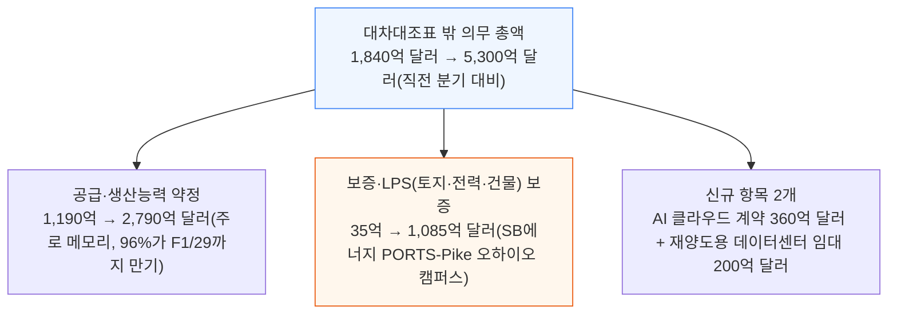

이 5,300억 달러는 대차대조표 안에 잡힌 부채 910억 달러(총부채 334억 달러, 이번 분기 발행한 선순위채 250억 달러 포함)를 훨씬 웃돈다 — 엔비디아가 실제로 지는 위험의 대부분은 재무제표 본문이 아니라 각주에 있다는 뜻이다.

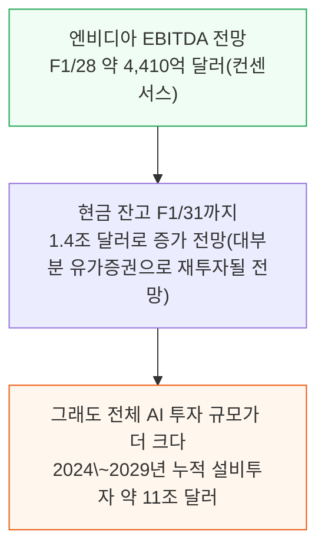

엔비디아의 현금 창출력은 압도적이다. 그런데도 전체 AI 투자 규모(11조 달러)에 비하면 엔비디아 혼자 감당할 몫은 일부일 뿐이다 — 이 질문에 답하기 위해 이 글은 항목별로 얼마나 더 늘어날 수 있는지를 추정한다.

---

## 2. 왜 이렇게 많은 보증을 서주나 - 백스톱의 작동 원리

**📌 핵심:**
- 아마존·마이크로소프트·구글·메타·오라클(기가스케일러 — 원문 조어로, 하이퍼스케일러 가운데 투자적격 자금 조달을 쥔 5곳) 5곳이 투자적격등급 자금 조달을 사실상 독점해왔고, 이들에게 비싼 값을 물리면서 정작 자기들은 더 싼 단기 가격에 되파는 구조로 이득을 봐왔다 — 엔비디아는 이 독점을 깨려고 GPU를 정가에 판 뒤 별도로 매출 하한선을 보증하거나, 임대인을 보증하거나, 아예 직접 임대 계약을 맺어 비투자적격 사업자도 투자적격 금리로 돈을 빌리게 해준다
- 앞면(수요 유지)이면 엔비디아는 두 번 번다 — GPU 판매 정상 마진과, 하한선 위 매출에서 나오는 추가 배당이다. 뒷면(수요 감소)이면 네오클라우드는 돈을 못 벌어도 하한선이 대출 상환액보다 높게 설정돼 있어 파산은 면한다
- 엔비디아가 지는 경우는 딱 하나뿐이다 — 보증받은 네오클라우드들이 동시에 임대료·구매 약정을 못 갚는데, 그때 엔비디아 자체 사업과 현금 창출력도 함께 둔화되는 경우다. 둘은 원래 얽혀 있다 — 임대료를 못 내는 네오클라우드는 이미 GPU 구매를 멈춘 네오클라우드이기 때문이다
- 결론: 오늘 기준 엔비디아가 보증하는 용량은 약 6.5GW(대부분 아직 미착공)로, 기가스케일러 자체 신용으로 임대되는 물량(2026년 약 15GW → 2028년 35GW 이상 전망)보다 훨씬 작다 — 그런데도 엔비디아 프로그램이 유독 주목받는 것은 새롭다는 점과, 닷컴버블 시절 시스코의 벤더 파이낸싱 붕괴를 떠올리는 투자자들의 트라우마("시스코 PTSD") 때문으로, 실제 구조 차이는 간과되고 있다

---

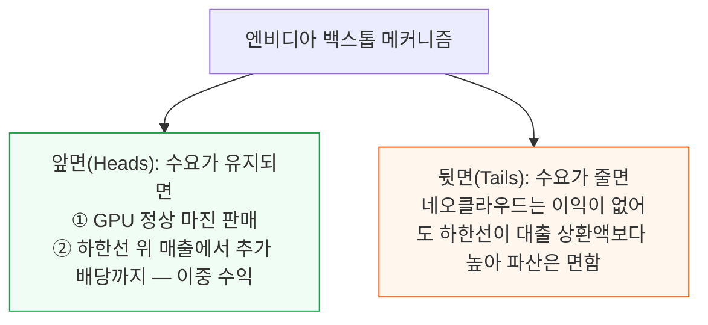

엔비디아가 실제로 손해를 보는 경로는 좁다. 보증받은 네오클라우드가 못 갚는 동시에 엔비디아 자체 현금 창출력도 나빠져야 하는데, 둘은 같은 다운사이클에서 함께 움직인다.

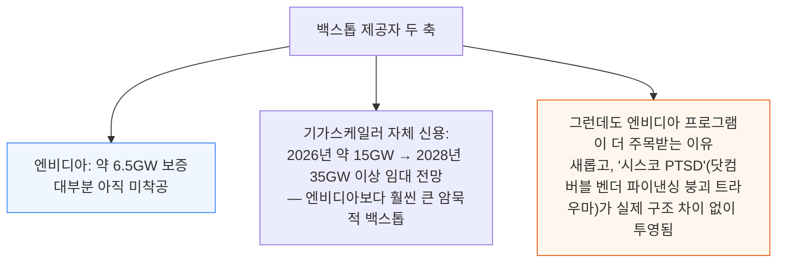

이제 공시된 6개 항목에, 저자들이 새로 추적하기 시작한 자본 파트너십 잔존가치 보증까지 더해 하나씩 살펴본다.

---

## 3. AICP - GPU 임대료에 하한선을 긋다

**📌 핵심:**
- AICP(AI Cloud Partner 프로그램)는 2026년 8월 26일 2분기 실적발표에서 처음 공시된 항목으로, 6년간 누적 의무 360억 달러 규모다 — 엔비디아가 GB300 기준 시간당 2.35달러(5년 계약 시세 4.50\~4.60달러 대비 낮은 값)로 임대료 하한선을 걸어 이 클러스터들이 대출 가능(뱅커블)하게 만들어준다
- 네오클라우드는 이 하한선을 깔아둔 채 AI 네이티브 기업 등에 더 단기·고가로 재임대하고, 만약 그 계약이 깨지거나 갱신되지 않으면 언제든 엔비디아에게 하한선 가격으로 되빌려줄 수 있다
- 지금까지 확정 발표된 딜은 3건이다 — 인도네시아 바탐의 Firmus 360MW 딜(211억 달러 의무), SharonAI 딜(42억 달러), GMI 딜(추정 22억 달러)이다. 2주 전 월스트리트저널 보도대로 엔비디아가 신규 AICP 딜을 일시 중단해, 이 항목은 F1/27 마감 시 약 510억 달러로 추정된다
- 결론: 엔비디아는 당장 신규 딜을 더 밀어붙이지는 않지만 어떤 형태로든 계속 지원할 의지가 있다고 보고, 이 글의 향후 전망 모델에서는 AICP가 계속 성장한다고 가정해 엔비디아가 이론상 얼마나 더 지원할 수 있는지를 살펴본다

---

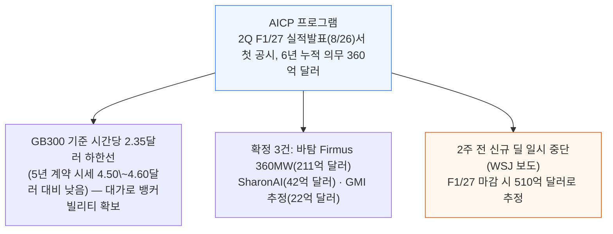

---

## 4. 자본 파트너십의 잔존가치 보증 - 딜당 25%까지만

**📌 핵심:**
- 2026년 8월 엔비디아는 여러 사모펀드와 손잡고 5,000억 달러 넘는 제3자 자본을 AI 클러스터 건설에 동원하는 파트너십을 발표했다 — 이번에는 기관투자자가 프로젝트마다 직접 심사·가격을 매기고, 엔비디아의 지원은 딜의 최대 25%까지만 걸리는 잔존가치 보증 하나뿐이다
- 참고할 선례는 구글-브로드컴-앤트로픽-아폴로의 TPU 구조다 — 앤트로픽이 임대료를 못 내면 브로드컴이 임대를 인수하거나 장비를 매각하는데, 매각해서 판 값이 모자라면 브로드컴이 선순위 채권자에게 그 차액을 메워준다. 구글은 별도로 데이터센터 운영사에 내는 임대료까지 한 번 더 보증해, 대출자들은 사실상 브로드컴 신용과 구글 신용 이중 안전망을 깔고 돈을 빌려준다
- 엔비디아 구조는 이 이중 안전망에서 한 겹을 걷어낸다 — 잔존가치 보증을 딜의 25%까지로 줄이고, 데이터센터 임대 자체에 대한 보증은 아예 없다. 대신 대출을 선순위·중순위(에쿼티·메자닌)로 나눈다면 엔비디아 보증은 선순위 대출자보다 아래, 중순위 투자자보다는 위에 끼어들어 선순위 대출자가 느끼는 위험을 줄여준다
- 결론: 1GW를 지원하는 데 드는 엔비디아 의무는 AICP가 GW당 590억 달러, PORTS-Pike형 LPS 보증이 GW당 250억 달러인 데 비해, 잔존가치 보증은 GW당 94억 달러로 가장 효율적이다(다만 데이터센터 임대 조달 문제는 이 구조만으로는 안 풀린다) — 저자들은 이 프로그램이 F1/31까지 2.5조 달러 규모로 커진다는 공격적 가정 아래, 엔비디아 의무가 F1/27 550억 달러에서 F1/31 3,730억 달러로 늘어난다고 본다

---

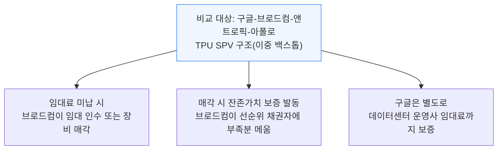

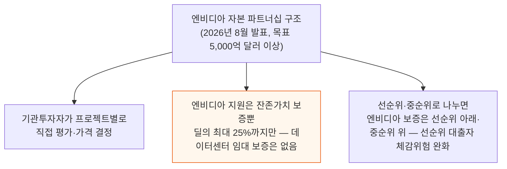

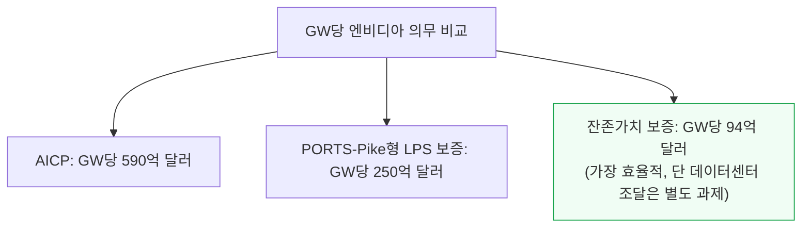

엔비디아가 밝힌 목표는 5,000억 달러 이상이지만, 저자들은 컴퓨트 수요가 워낙 강해 실제로는 이보다 더 커질 것으로 보고 F1/31까지 2.5조 달러 규모를 가정한다 — 이 경우 엔비디아 의무는 F1/27 550억 달러에서 F1/31 3,730억 달러로 늘어난다.

---

## 5. 클라우드 서비스 계약 - 엔비디아 자체 사용분

**📌 핵심:**
- 클라우드 서비스 계약은 새로운 항목이 아니다 — 2023년 1월 결산 3분기에 16억 달러로 처음 공시된 뒤, 2026년 1분기 약 110억 달러를 거쳐 2026년 3분기 260억 달러로 뛰었다
- AI 클라우드 계약이 외부 네오클라우드에 대한 보증이라면, 클라우드 서비스 계약은 엔비디아 자체 모델 개발과 CI/CD(지속적 통합·배포)에 쓰는 컴퓨트 조달 계약이다 — 다만 엔비디아가 이 용량을 가끔 재판매하기도 한다
- 현재 290억 달러 규모 중 코어위브와 2032년까지 63억 달러 계약이 포함돼 있고, 나머지는 인도네시아 바탐의 약 360MW(오라클 경유), 말레이시아 YTL의 약 20MW, 코어위브로부터 임대한 GPU 1만\~2만 장, 미국 내 오라클 시설 몇 곳으로 채워진 것으로 추정된다
- 결론: 이 항목은 F1/27 마감 시 380억 달러로 커지고, F1/31까지 960억 달러로 늘어날 여력이 있다고 저자들은 추정한다

---

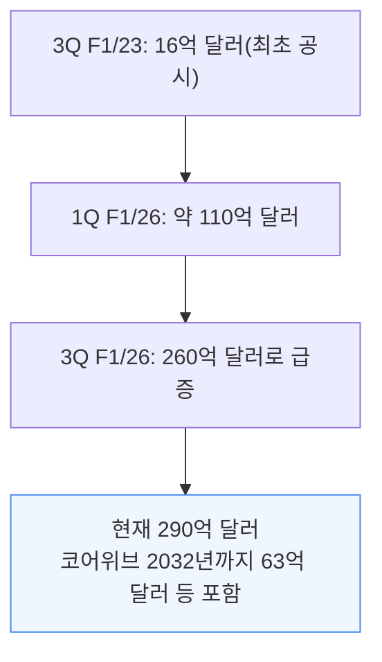

이 항목은 F1/27 마감 시 380억 달러, F1/31까지 960억 달러로 커질 여력이 있다고 저자들은 본다.

---

## 6. 데이터센터 재양도 임대 - 신용을 빌려주는 구조

**📌 핵심:**
- 재양도용 데이터센터 임대는 빠르게 몸집을 키울 항목이다 — 2026년 3월 "Datacenter Backstop Wars"에서 저자들이 예상한 대로, 지금까지 엔비디아 자체 사용분과 제3자 재양도분을 합쳐 연초 이후 약 1.2GW가 체결됐다
- 재양도 구조는 일종의 신용 대체다 — 먼저 AA등급인 엔비디아를 임차인으로 세워 데이터센터 건설 자금을 조달한 뒤, 그 임대 계약을 실제로 GPU를 사서 운영할 네오클라우드에 넘긴다. Hut 8은 이 방식으로 Beacon Point 첫 건물 자금을 6.129% 금리에 Baa2 등급 선순위 담보채 42.5억 달러로 조달했는데, 어떤 네오클라우드도 자기 이름·자기 만기로는 이런 금리를 받을 수 없었다
- 개발사는 투자적격 임차인과 장기 임대 둘 다를 원하는데, 이 둘을 함께 갖춘 데이터센터 쪽 조건이 AI 프로젝트 트리니티(자본·오프테이크·데이터센터) 중 가장 풀기 어려운 다리다 — 엔비디아가 둘 다 공급하고, 실제 운영사(Lambda 등)에게 넘긴 임대 기간 중 7\~15년 차는 엔비디아가 다시 세를 놓거나 직접 쓸 수 있는 권리로 남겨둔다. 넘긴 뒤에도 대출자들은 여전히 Baa2 등급 채권을 산 셈이라 B등급 운영사로 바로 바뀌는 걸 원치 않기 때문에, 엔비디아는 프로젝트가 충분히 빚을 갚아 DSCR(부채상환비율) 기준을 통과할 때까지 주채무자 지위를 유지한다
- 결론: 15년 임대와 6년 오프테이크의 불일치는 위험이 아니라 선택지다 — 6년 차에 엔비디아는 업그레이드된 GPU로 재임대(전력설비만 손대면 됨)하거나, 기존 운영사가 현물·단기 가격으로 계속 쓰게 둘 수 있다. 다만 이 재양도 물량의 규모는 아직 작다 — 704MW짜리 캠퍼스 하나 수준이며, 엔비디아의 제3자 임대 1.5GW는 기가스케일러 5곳(마이크로소프트·메타·아마존·오라클·구글)이 2028년까지 임대할 약 39GW의 26분의 1에 불과하다

---

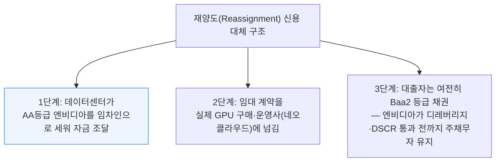

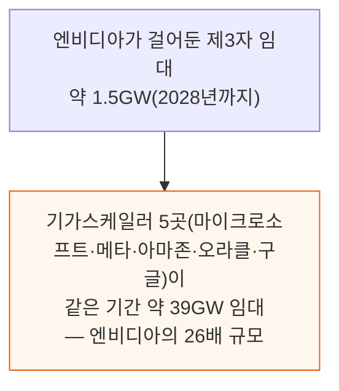

---

## 7. 아직 시작 안 한 자체 사용 임대

**📌 핵심:**
- 6절에서 다룬 임대 목록 중 제3자에게 재양도되는 것은 Hut 8 물량 둘뿐이다 — Hut 8의 7월 8-K 공시에 따르면 Beacon Point의 352MW짜리 임대 2건이 각각 98억 달러, 15년 총 임대료 196억 달러 규모다
- 나머지 임대는 전부 엔비디아 자체 사용분이며, 그 가치는 별도의 "미착수 데이터센터 임대" 항목 250억 달러에 잡힌다 — 네바다 McCarran의 Tract 400MW, Vantage 캠퍼스 1차 64MW, 이스라엘 Mega 64MW가 여기 속한다
- 여기에 이전부터 있던 자체 사용 임대 2건 — 버지니아 Digital Realty 96MW, 오리건 Aligned 36MW — 을 더하면 엔비디아가 임차인으로 걸어둔 전체 물량은 1.5GW가 된다
- 결론: 재양도용(Hut 8)과 자체 사용분(Tract·Vantage·Mega·Digital Realty·Aligned)을 구분해서 봐야 한다 — 전자는 신용을 빌려준 뒤 넘기는 구조, 후자는 엔비디아가 직접 쓰는 컴퓨트 조달이다

---

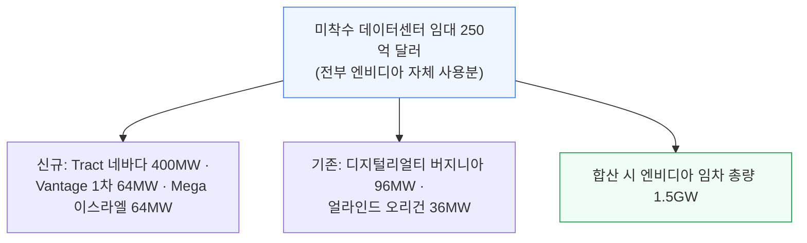

---

## 8. 토지·전력·건물(LPS) 보증 - PORTS-Pike 딜

**📌 핵심:**
- LPS 보증 항목은 한 분기 만에 35억 달러에서 1,085억 달러로 뛰었다 — 저자들은 이 항목이 프로그램 전체가 향하는 방향이라고 본다. Ionic Digital의 S-1 공시에 따르면 Nscale이 234MW 규모로 126개월 트리플넷 임대를 맺었는데, 엔비디아가 첫 5년치 임대료(최대 8억 6,030만 달러)를 보증하고 6년 차부터는 Nscale 모회사가 넘겨받으며, 대가로 엔비디아는 Nscale 워런트 6,000만 달러어치를 받았다
- 이번 분기에 추가된 1,050억 달러가 PORTS-Pike 딜이다 — 오하이오에서 SB에너지가 짓는 약 8GW 캠퍼스를 17개 건물별 자회사로 쪼개, 건물마다 오픈AI 계열사와 20년 트리플넷 임대를 따로 맺는다. 엔비디아는 이 중 1단계 4.25GW에 토지·전력·건물(LPS) 신용 보증을 서는데, 건물이 완공되는 순서대로 단계적으로 발동하고 1호 건물은 2029회계연도 완공 예정이다. 2단계로 3.8GW를 더 보증할 옵션도 갖고 있는데, 만약 포기하면 오픈AI가 A- 등급 이상 대체 보증인을 직접 구해야 한다 — 1단계 가격이 GW당 247억 달러이므로 2단계까지 다 쓰면 약 930억 달러가 추가돼 PORTS 전체 보증 한도는 약 2,000억 달러가 된다
- 오픈AI가 임대료를 못 내면 엔비디아는 보증 한도 안에서 부족분을 메우되, 교체 임차인을 구하거나 시설을 매각해 회수하며 노출을 줄인다 — 엔비디아는 임대를 직접 인수하거나 다른 용도로 재배치할 권리도 갖고, 오픈AI는 보증의 대가를 지불한다(조건·금액은 미공개). 여기에 엔비디아는 SB에너지에 30억 달러를 투자(15억 달러는 IPO 조건부)하고, 오픈AI는 더 넓은 상업 관계를 통해 SB에너지 워런트를 받는다
- 결론: 엔비디아는 PORTS-Pike가 하드웨어 세대당 1,500억\~2,000억 달러의 매출을 낼 수 있다고 추산한다 — 데이터센터 조달(트리니티에서 가장 어려운 다리)을 직접 풀어주는 대가로 볼 만한 규모다. 이런 신규 LPS 보증, 재양도 임대의 전환, PORTS 2단계 3.75GW 옵션 행사까지 반영하면 데이터센터·LPS 보증의 최대 노출은 현재 1,085억 달러에서 F1/31까지 약 3,380억 달러로 늘어난다

---

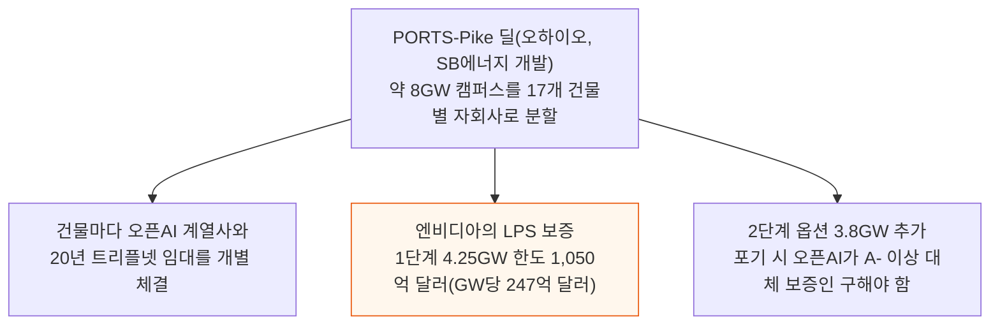

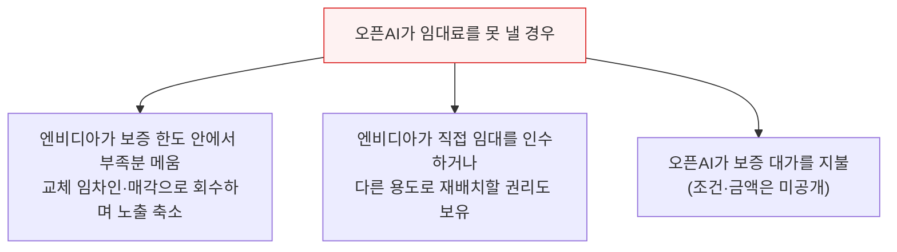

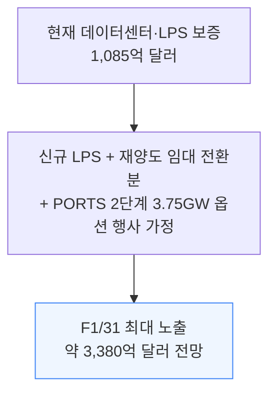

---

## 9. 전체 그림에서 본 엔비디아 백스톱의 크기

**📌 핵심:**
- 순환 금융(엔비디아가 자기 돈으로 자기 고객을 만든다는 우려)은 엔비디아의 역할을 과장한다 — 오늘 기준 보증 용량 약 6.5GW는 2025년 말부터 2030년 말까지 세계 AI IT 용량이 순증가할 것으로 전망되는 약 240GW 중 3%가 채 안 된다
- 저자들이 그려본 최대 확장 시나리오(신규 약정을 F1/29까지 2년치 반영)에서도 총보증 용량은 약 46.6GW인데, 이 중 28.2GW는 딜의 25%까지만 보증하는 자본 파트너십이라 실제 노출은 훨씬 작다 — 46.6GW 자체도 2030년까지 계획된 전체 AI IT 용량 증설분의 20%가 안 돼, 흐름을 바꿀 수는 있어도 엔비디아 혼자 전체 산업을 떠받칠 수는 없다
- GPU 물량으로 환산해도 같은 결론이다 — 현재 보증 용량 6.5GW는 GB300급 GPU 약 250만\~300만 장에 해당해 2027년 엔비디아 GPU 출하 전망의 25\~35%지만, 이 물량은 여러 해에 걸쳐 배치된다. 5년에 걸쳐 고르게 나눈다고 가정하면 연간 약 60만 장으로, 2027년 출하 전망의 10%가 안 된다
- 결론: 확장 시나리오를 다 반영해도 AI 전체 건설의 대부분은 엔비디아 보증 없이 자금이 조달된다 — 이 프로그램들의 실제 목적은 신생 사업자를 스스로 자금을 조달할 수 있는 규모까지 끌어올리는 것이다. 보증 아래서 성공한 프로젝트는 운영 이력을 쌓고 대출자에게는 더 낮은 위험으로 이 자산을 심사해본 경험을 주며, 최종적으로는 고객 매출과 독립 자본이 후속 확장 자금을 대게 해 엔비디아 지원 의존도를 낮춘다 — 엔비디아는 그 대가로 GPU를 대규모로 살 수 있는 고객층을 넓힌다

---

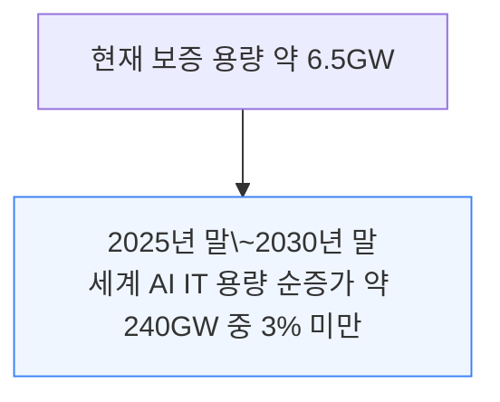

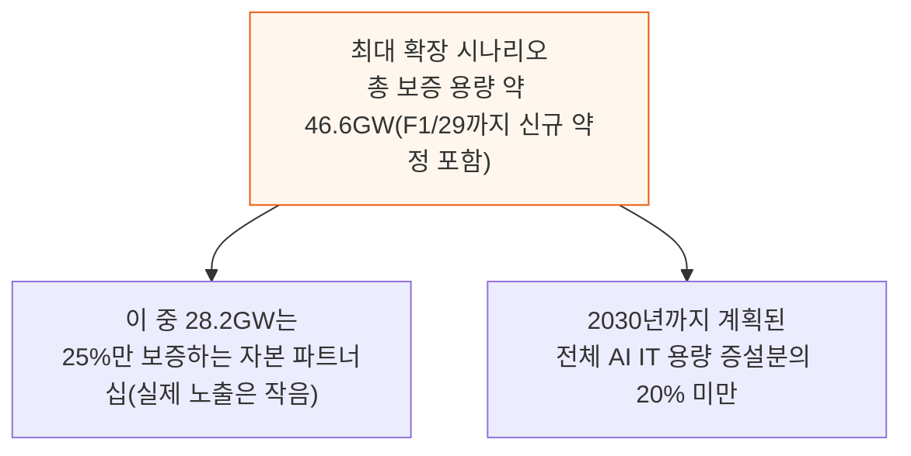

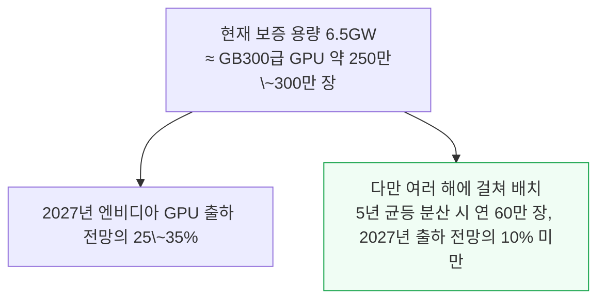

---

## 10. 엔비디아는 얼마나 더 보증을 늘릴 수 있나

**📌 핵심:**
- 현재 대차대조표만 보면 여력은 넉넉하다 — 순부채/EBITDA 비율이 F1/27 -0.2배에서 F1/31 -1.7배(마이너스는 빚보다 현금이 많다는 뜻)로, 신용평가사들이 말하는 경고선(약 1.5배)과는 거리가 멀다. 대차대조표 밖 의무는 아직 이 레버리지 계산에 전혀 들어가지 않는다
- 저자들은 세 단계로 더 가혹한 가정을 걸어 검증한다 — ① 대차대조표 밖 의무를 전부 지금 당장 갚아야 한다고 가정해도 비율은 F1/27 2.7배(신용평가사 허용 범위 안)에서 F1/31 1.41배로 오히려 낮아진다 ② 현금·매출채권(30% 할인)·유가증권의 5분의 1만 남기고 재고·지분투자·무형자산을 전부 빼는 최악의 잣대(안정순자산)로 봐도, 오늘의 의무(4,975억 달러, F1/31까지 2.1조 달러로 증가)를 지금 당장 갚는다고 가정한 비율이 F1/27 0.11배에서 F1/29 1.0배를 넘고 F1/31에는 2.35배까지 회복된다 ③ 의무 규모가 계속 커지는 채로 같은 검증을 하면 F1/27 0.09배에서 F1/31 0.57배(배당·자사주매입을 1년 중단하면 0.70배)까지 개선된다
- 보증 한 건의 한계비용은 사실상 0에 가깝다 — 임차인(오픈AI 등)이 직접 지불하고, PORTS-Pike는 오픈AI가 엔비디아에 손실 보상까지 해주기 때문이다. 반대급부는 다른 방법으로는 자본을 조달할 수 없었던 구매자와, 20년간 엔비디아 칩에 묶인 캠퍼스(세대당 1,500억\~2,000억 달러 매출로 추산)다 — 구글이 이미 755억 달러, 메타가 590억 달러 규모로 비슷한 보증 전략을 쓰고 있다는 점도 이 판단을 뒷받침한다
- 결론: 정작 발목을 잡는 것은 대차대조표가 아니라 집중 위험이다 — 보증 한도의 97%가 오픈AI 한 고객에 몰려 있어 신용평가사들이 우려하고, 엔비디아 스스로도 다음 지원분은 새로운 고객으로 분산해야 한다고 본다. 진짜 위험 시나리오도 수요 둔화가 아니라 경쟁 칩이 시장 주도권을 가져가 엔비디아가 가격을 내려 점유율을 지켜야 하는 경우다 — 다만 전력이 건설 속도를 막는 병목인 지금, 확보한 부지를 놓치지 않는 쪽이 우선이라 저자들은 엔비디아가 공격적으로 계속 나아가야 한다고 본다

---

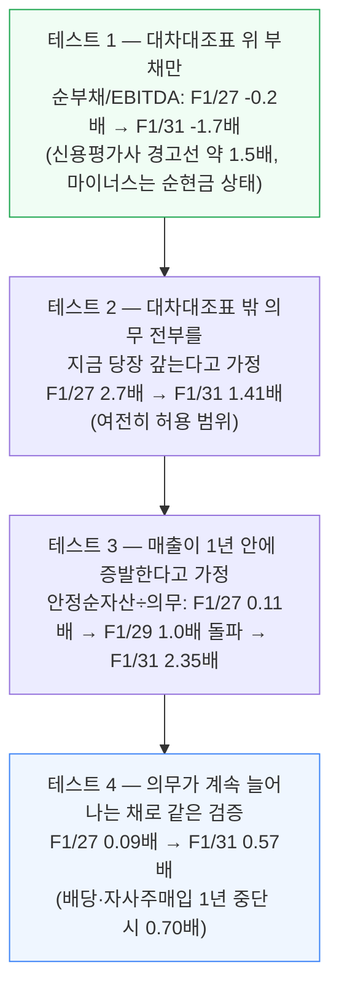

**📌 용어 풀이: 안정순자산**
> - 현금 전액, 매출채권은 30% 할인, 유가증권은 5분의 1만 인정 — 재고·지분투자 대부분·무형자산은 전부 제외하고 산정한 가장 보수적인 자산 값
> - 이 값에서 총부채를 뺀 뒤, 그해에 예상되는 대차대조표 밖 의무 총액과 견줘 몇 배인지를 계산한다

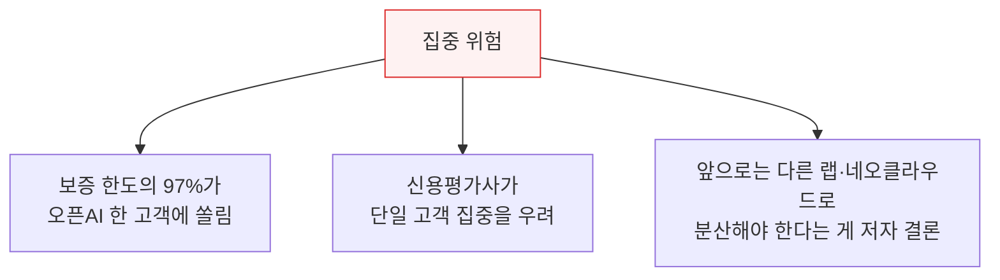

```mermaid
flowchart TD
    RealRisk["엔비디아의 진짜 위험은<br/>수요 둔화가 아니라 경쟁 칩에 밀리는 시나리오"] --> R1["경쟁 칩이 점유율을 뺏으면<br/>엔비디아가 가격을 낮춰야 하고 EBITDA 하락"]
    RealRisk --> R2["동시에 보증해둔 프로젝트들이<br/>비경쟁력 있는 설비로 전락 — 상환 능력과 노출 둘 다 나빠짐"]

    style RealRisk fill:#fef2f2,stroke:#dc2626
```

엔비디아가 단일 분기에 주주환원으로 260억 달러를 돌려준 것을 보면, 배당·자사주매입은 완만한 하강기를 버틸 3년간 3,000억 달러짜리 지렛대이기도 하다. 그리고 이 위험은 엔비디아가 만드는 게 아니라 증폭할 뿐이다 — 경쟁 칩이 주도권을 가져가는 시나리오가 오면 안정순자산과 의무 이행 가능성 둘 다 같은 이유로 나빠진다.

바로 그 시나리오가 지금 공격적으로 나서야 하는 이유이기도 하다. 엔비디아가 앞서 있고 AI 수요가 최소 3년은 강하며 전력이 건설의 병목인 지금, 전력이 확보된 부지를 먼저 차지하는 쪽이 그 세대의 하드웨어 수요를 통째로 가져간다.

시장을 이끌고 있는 동안에는 이 보증들에 명시적 비용이 들지 않으니, 지금이 시장 점유율을 넓힐 기회라는 것이 저자들의 결론이다.

---

*작성 진행률: 100% 완료*
*업데이트: 10절(레버리지 스트레스 테스트·집중 위험·경쟁 칩 시나리오) 완료 — 전체 10개 섹션 완료*
