# The Chinese AI Infrastructure Boom: Introducing the SemiAnalysis China Datacenter Model

> **출처**: [SemiAnalysis Newsletter](https://newsletter.semianalysis.com/p/the-chinese-ai-infrastructure-boom)
> **저자**: Everlyn, Dylan Patel, Patrick Schaabi
> **발행일**: 2026-09-25

## 📑 목차

 1. [중국 데이터센터는 24GW를 넘는다: 시장 규모와 성장 변곡점](#s1)
 2. [소매로 시작해 AI가 뒤집은 네 시대](#s2)
 3. [동데이터 서부컴퓨트: 건설이 서쪽으로 간다](#s3)
 4. [속도와 비용: 다른 종목](#s4)
 5. [수요: 다섯 하이퍼스케일러와 세 가지 조달 방식](#s5)
 6. [바이트댄스: 중국 최대 임차인](#s6)
 7. [알리바바: 유일한 정통 하이퍼스케일러 전략](#s7)
 8. [텐센트: 신중한 기업의 2026년 도약](#s8)
 9. [바이두: 선발주자에서 실리콘 사업자로](#s9)
10. [화웨이: 데이터센터도 운영하는 칩 공급자](#s10)
11. [해외 확장: 2029년 약 4GW](#s11)
12. [결론: 건물 단위로 지도를 그려야 보이는 것](#s12)

## 🔑 용어 정리

> - **도매(wholesale)·소매(retail) 코로케이션**: 데이터센터 공간을 빌려주는 사업. 도매는 건물·홀 단위로 대형 고객 한두 곳에, 소매는 랙(서버 선반) 단위로 다수 고객에게 임대
> - **동데이터 서부컴퓨트(EDWC)**: 동부 대도시의 데이터 수요를 전력이 풍부한 서부 지역의 연산 자원이 처리하게 하는 2022년 국가 정책
> - **에너지 소비 심사(쿼터)**: 데이터센터가 땅을 확보한 뒤 가장 먼저 받는 인허가. 지방 발전개혁위원회가 허용하는 전력·에너지 사용 한도를 정하며 시설 크기의 상한이 됨
> - **BOT**: 하이퍼스케일러가 땅과 건물 골조를 갖고, 임대 파트너가 전기·기계 설비를 투자·운영하며 장기 계약으로 투자금을 회수하는 중간 형태
> - **셸(shell)과 MEP**: 셸은 건물 골조, MEP(M&E)는 그 안의 전기·기계 설비. 데이터센터 공사는 이 두 층으로 나뉨
> - **모듈러 데이터센터**: 공장에서 모듈 단위로 만들어 현장에서 조립하는 방식. 건물이 평탄한 부지와 간단한 철골 지붕으로 줄어듦
> - **BATB**: 바이트댄스·알리바바·텐센트·바이두 네 하이퍼스케일러. 바이트댄스를 뺀 앞의 세 곳은 BAT
> - **가동률(utilization)**: 구축한 용량 중 실제 임차인이 쓰는 비율. 낮을수록 공실이 많음

---

<a id="s1"></a>

## 1. 중국 데이터센터는 24GW를 넘는다: 시장 규모와 성장 변곡점

**📌 핵심:**
- 중국 시설 1,000곳 이상(운영사 60곳 이상)을 추적한 결과 가동 용량이 24GW를 넘어 EMEA(약 14GW)와 아시아 나머지(약 15GW)보다 크다
- 2Q26 알리바바·텐센트·바이두의 설비투자 합계가 200억 달러로 전년 대비 2배 이상, 3사 모두 사상 처음 잉여현금흐름이 마이너스
- 공실률이 높다는 통념과 달리, 최대 임차인 바이트댄스는 전국 가용 용량의 약 5분의 1을 쓰고 거의 전부 임차
- 결론: 중국은 '크지만 비어 있다'가 아니라 '건물 단위로 봐야 보이는 호황'

**배경.** 중국의 모델 경쟁력은 최전선이다. GLM 5.3과 Kimi K3는 잇따른 오픈웨이트 공개의 최신판이고, 바이트댄스의 Doubao는 '중국의 ChatGPT'로 월 사용자 3.45억 명이며, Seedance는 최고 수준의 영상 생성 모델이다. 모두 데이터센터에서 돌지만 통계는 부실했다. 최대 임차인은 10-K를 내지 않고, 대형 임대사 상당수는 상장하지 않았으며, 1차 자료 대부분이 중국어다. 그래서 시장은 '중국은 크다'와 '중국은 비어 있다'라는 두 가지 안이한 가정에 머물렀고, 공개된 용량 추정치는 서로 15배까지 차이 난다. 이 글은 플래그십 SemiAnalysis Datacenter Model의 건물 단위 방식을 중국에 적용한 미리보기다.

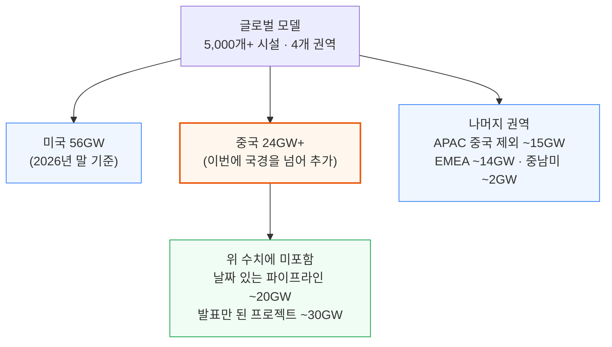

원문 첫 그림은 이 권역별 용량을 막대로 비교한다. 위 다이어그램이 같은 수치를 옮긴 것이다.

### 성장은 변곡점에 있다

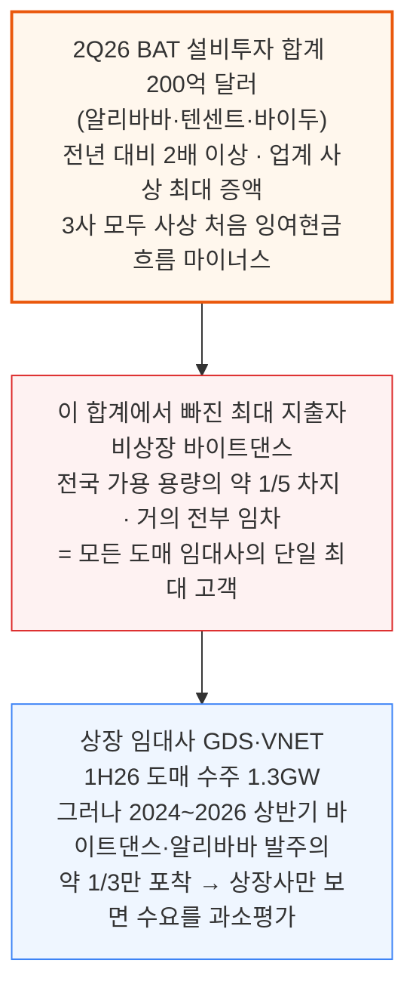

### 국가 전체가 짓는다

- **국영 통신사**: 2010년대에는 시장 점유율 과반이었고 지금도 전국 용량의 3분의 1 보유
- **국가 전력망 회사**: 합산 설비투자가 2024년부터 가속해 14차 5개년 계획(\~2025)을 원안보다 24% 초과한 채 마쳤고, 15차 계획(2026\~2030)은 거기에 40%를 더해 7,460억 달러(5조 위안) 이상
- **건설 속도**: 전력 제약·인력 부족·주민 반대가 거의 없어 100MW 시설을 12개월 안에 인도하는 것이 일상. 모듈러 DC는 텐센트가 2014년 3세대 모듈러 설계를 배치했을 만큼 중국에선 낡은 방식(미국에서 이제 대규모 도입, 참고 [The Wild Wild West of LEGO Datacenters](https://newsletter.semianalysis.com/p/the-wild-wild-west-of-lego-datacenters))

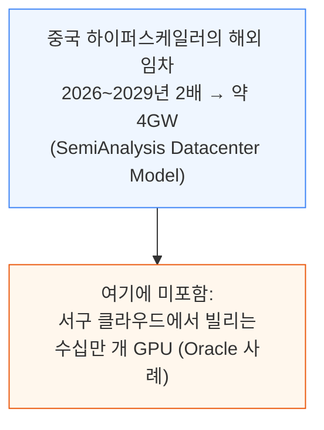

**먹구름.** 공실률이 높고, 개발사 간 가격 경쟁이 심하고, 수출 규제로 칩 공급이 제한된다. 그러나 이 둘 중 어느 것도 AI 데이터센터가 놀라운 속도로 지어지고 채워지는 것을 막지 못했다.

**이 글의 구성.** 소매 중심으로 성장해 AI가 뒤집은 산업 역사, 서쪽으로 이동하는 건설 흐름, 바이트댄스·알리바바·텐센트·바이두·화웨이의 임차·자체 구축 현황(원문은 이 부분이 유료 구독 구간으로 표시됨), 해외 확장, 결론이다. 이 모델은 시설 1,000곳 이상·운영사 60곳 이상을 추적하고 시설별 2032년까지의 분기 인도 곡선, 건물별 임차인, 자체 구축 대 임차 비율, 임대 계약·인도 추적, EDWC 허브 분석, 지도 뷰를 담는다. 문의는 sales@semianalysis.com이다.

<a id="s2"></a>

## 2. 소매로 시작해 AI가 뒤집은 네 시대

**📌 핵심:**
- 미국은 처음부터 초대형 시설로 컸지만, 중국은 통신사와 수천 개 소규모 소매 시설이 만든 산업
- 그 결과 구형 소매 랙은 AI 서버(H20·Ascend)를 못 받아 비어 있고, AI 수요는 전혀 다른 곳의 도매 시설을 채움
- VNET 사례: 가동률 2010\~2022년 70%대 중반 → 50%대 중반, 2023년 이후 도매 70% 이상 대 소매 60% 근처
- 결론: '높은 공실'과 'AI 용량 부족'은 모순이 아니라 서로 다른 재고의 이야기

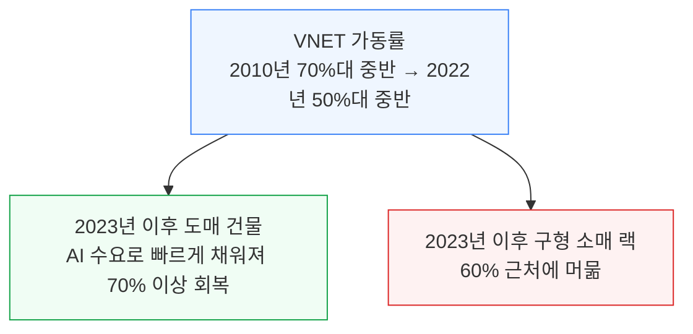

원문의 첫 그림은 이 두 속도 시장을 보여주며, 위 다이어그램이 그 수치를 옮긴 것이다.

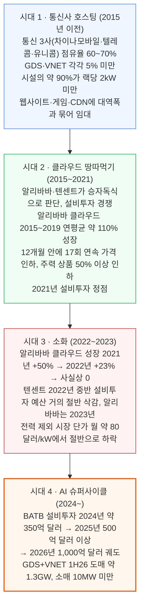

### 시대별로 남은 것

- **시대 1의 유산**: 국가가 정한 통신사 라이선스·네트워크 우위와 정부·국유기업·규제 산업의 국영 공급자 선호 덕에 통신사가 지배했다. 알리바바 클라우드는 2009년, 텐센트 클라우드는 2013년에야 일반에 열려 하이퍼스케일러는 거의 변수가 아니었다. 이 시대의 재고가 지금 비어 있는 용량이다. 구형 소매 랙은 H20나 Ascend 서버 요구와 맞지 않고, 부분 입주 상태에 비용이 커 개조도 비현실적이다. 가동률 약 50%라는 대표 수치는 대체로 시대 1과 시대 3의 기념비다
- **시대 2의 낙관**: 소매 개발사들은 클라우드 수요가 도시 소형 시설로 계속 넘쳐 흐를 것이라 가정하고 계속 지었다. 제3자 임대사(GDS·VNET·Chindata)는 하이퍼스케일러와 함께 성장했다
- **시대 3의 충격**: 정책 역풍·경기 둔화·국영 클라우드의 점유율 확대가 겹쳤다. 텐센트 경영진은 '매출 성장 추구에서 건전한 성장으로' 재정립이라 표현했다. 인도가 둔화됐는데도 공급 과잉이 나타났고 가격이 가장 크게 맞았다. 2026년 8월 GDS 실적 발표에서 경영진은 가격 재조정을 완전히 소화하는 데 18개월이 더 걸린다고 추정했다
- **같은 시기 정책**: 2022년 2월 국가발전개혁위원회(NDRC)가 EDWC 지침을 내고 8개 국가 허브 안에 10개 연산 클러스터를 지정했다. 특히 서부는 신속 인허가와 저렴한 친환경 전력을 누린다
- **시대 4의 도매 편중**: DeepSeek와 하이퍼스케일러 자체 생성형 AI 야망이 2024\~2025년에 시장을 깨웠다. 서부 허브가 마침내 임차인을 만났고, 구형 소매 재고는 이 흐름에 참여하지 않는다. 다만 GDS·VNET은 SemiAnalysis 모델 기준 2024\~2026년 상반기 바이트댄스·알리바바 발주의 약 3분의 1만 잡는다

**네 시대가 설명하는 오늘의 시장:**
- 베이징·상하이 등 1선 도시 주변의 소매 중심 구형 재고(가동률 30\~50%, AI 밀도에 물리적으로 부적합)
- AI 주도의 도매 건설은 전혀 다른 곳에서 진행
- 통신사 점유율은 구조적으로 하락하고, 하이퍼스케일러 자체 구축과 제3자 도매가 성장분을 가져감

<a id="s3"></a>

## 3. 동데이터 서부컴퓨트: 건설이 서쪽으로 간다

**📌 핵심:**
- EDWC는 8개 국가 허브·10개 클러스터를 지정했고, 실제로 산업 지형을 바꾼 드문 '지침'
- 작동 경로는 정책 문구가 아니라 에너지 소비 심사 쿼터: 10MW 초과 프로젝트는 이 심사 없이 착공이 불법
- 서쪽으로 간 이유는 규제만이 아니라 지연시간 단축(광통신)과 AI 학습이 중시하는 전력 가격(내몽골은 1선 도시의 약 절반)
- 결론: 쿼터 체제가 건설을 허브 안으로 몰았고, 시장이 그 안에서 승자를 골랐다

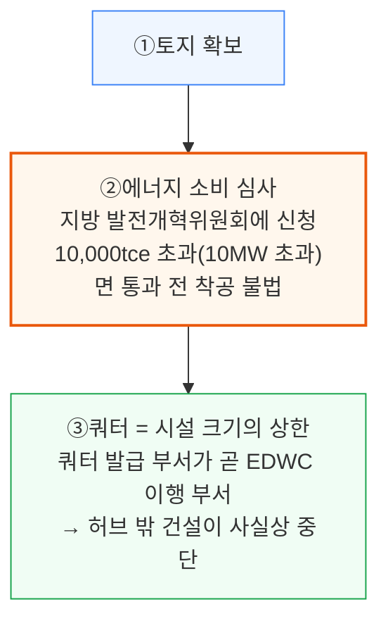

정책 자체는 많이 다뤄졌지만 빠진 것은 '전달 경로'다. 심사 제도는 2010년에 시작해 시간이 지나며 할당 도구가 됐고, 2022년 EDWC와 함께 가장 효과적인 수단이 됐다.

### 광둥 사례와 텐센트 칭위안 적발

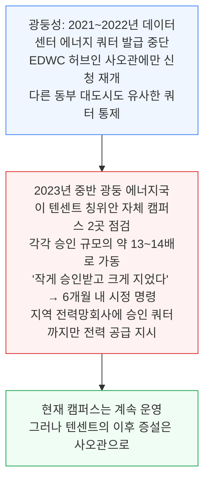

처음 2년은 이전이 느렸다. 당시 수요(클라우드·게임·이커머스)가 인구 가까이의 낮은 지연시간을 요구해, 하이퍼스케일러들이 1선 도시 근처의 부족한 쿼터를 계속 다퉜기 때문이다. 이후 두 가지가 바뀌었다.

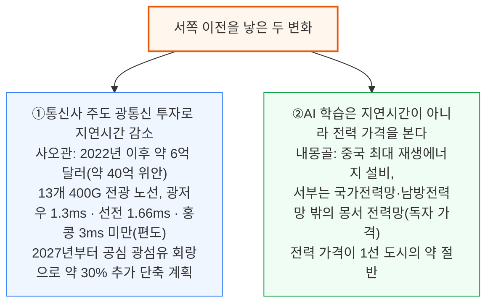

- 사오관 랙은 가장 지연에 민감한 작업을 빼면 사실상 선전 랙이다
- **내몽골은 '중국의 조호르'**: 후한 쿼터, 제곱킬로미터 단위 토지, 1선 도시 대비 약 절반의 전력 가격 때문에 하이퍼스케일 AI 용량의 기본 목적지가 됐다

### 조호르(말레이시아)와의 비교

- 임대료는 중국이 훨씬 낮지만 건설비도 낮고, 조호르는 임대료가 높지만 건설비도 높다. 두 시장의 건설비 대비 수익률(yield-on-cost) 범위는 겹치고, 최고의 내몽골 캠퍼스는 조호르의 국제 개발사가 목표로 하는 수익률과 같다
- 추세는 갈린다. 내몽골 건설비는 프리팹과 국산화로 계속 떨어지고, 조호르는 과열된 공급망에서 건설비 상승·초과 비용 위험을 겪는다
- 중국 운영사가 조호르에 지으면 중국 공급망을 활용한 지리적 차익으로 더 높은 수익률을 얻는다

### 클러스터 10곳의 성적

원문 지도는 지정 여부가 아니라 실제 가동·계약된 용량으로 가중해 10개 클러스터의 이야기가 매우 다르다는 것을 보인다. '서부는 빈 껍데기 실패작'이라는 언론의 통념에 대한 가장 간단한 반박은 하이퍼스케일러가 자기 돈을 어디에 넣는지 보는 것이다.

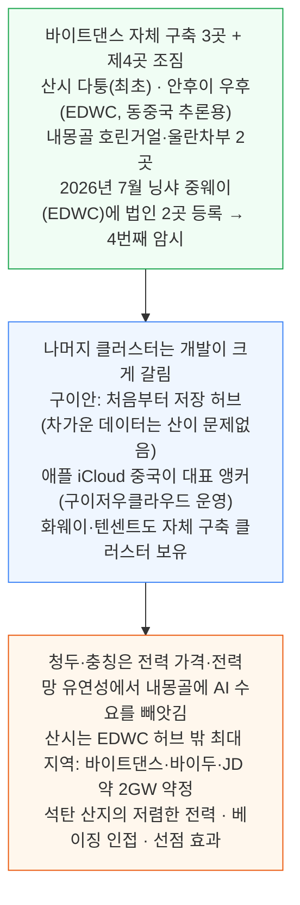

산시는 하이퍼스케일러가 EDWC 이전부터 가서 계속 지었다. 쿼터 체제가 건설을 몰아가지만 부지 선택은 여전히 전력과 지리가 정한다는 증거다.

<a id="s4"></a>

## 4. 속도와 비용: 다른 종목

**📌 핵심:**
- 미국은 전력이 병목(연계 대기열·변압기 소요 시간)이고, 중국은 칩이 병목: 발전은 풍부하고 인허가는 병목이 아닌 정책 깔때기
- 100MW 시설 표준 인도 기간이 클라우드 시대 약 18개월 → AI 시대 약 12개월, 인허가는 3\~6개월(미국 모듈러 최선의 경우는 인허가 12\~13개월에 시공 12\~18개월이 겹치지 못함)
- 속도 요인 셋: 선지을 껍데기, 저층 장스팬 철골, 공장 프리팹으로 직렬 공정을 병렬화
- 결론: 설비 쪽 물리적 마찰이 없어 건설 주기는 인터넷 플랫폼 수요가 정한다

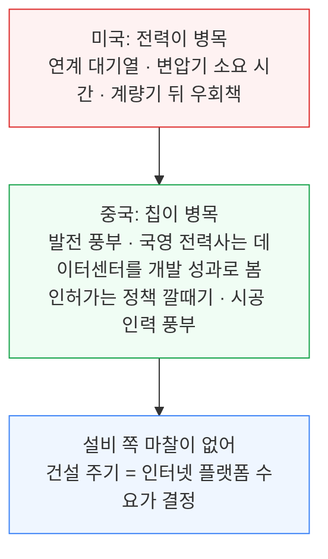

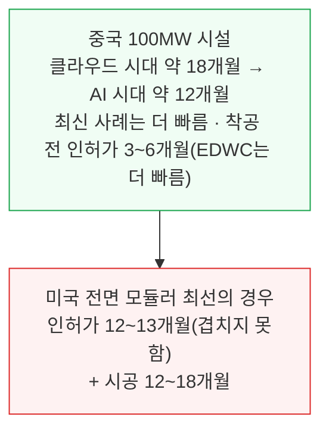

### 속도를 만드는 세 가지

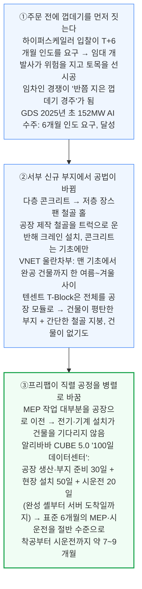

### 전면 모듈러가 표준이 아닌 두 가지 중국적 이유

모든 요인이 '더 많은 공장, 더 적은 현장'을 가리키니 텐센트식 컨테이너 캠퍼스가 이미 국가 표준일 것 같지만 아니다.

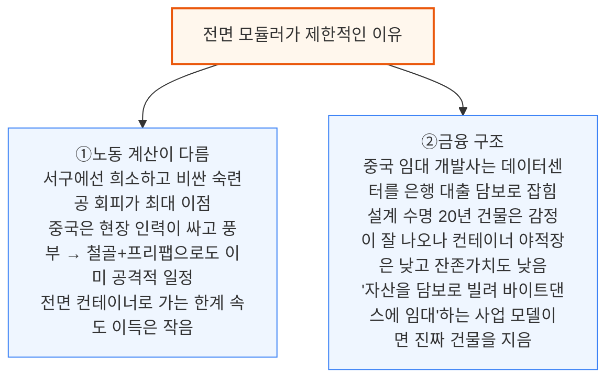

현재 전면 모듈러는 하이퍼스케일러 자체 구축과 동남아 프로젝트에 한정되지만, 전체 건설 속도는 필요한 만큼 빠르다.

### 비용도 속도와 함께 내려간다

- 공급망 압축과 국산 비중 상승으로 셸과 설비 비용이 비슷한 미국 도매 건설비의 일부 수준까지 내려갔다(SemiAnalysis 모델)
- 알리바바는 모듈러 방식이 일정 단축에 더해 이전 버전 대비 10% 이상 추가 원가 절감을 냈다고 밝혔다

<a id="s5"></a>

## 5. 수요: 다섯 하이퍼스케일러와 세 가지 조달 방식

**📌 핵심:**
- 수요는 바이트댄스·알리바바·텐센트·바이두·화웨이 5곳에 집중
- 소비자 인터넷은 성장이 끝나(보급률 약 80%, 연 성장 약 1.5%) AI가 새 성장 엔진, 이것이 2Q26 설비투자 변곡점의 원인
- 클라우드는 중국 내 매출 위주(알리바바 클라우드조차 해외 약 20%) → '주소 지정 가능 GDP'가 미국 빅테크보다 작은 구조적 약점
- 결론: 조달은 임차·자체 구축·BOT 세 갈래이고 회사마다 배합이 다르다

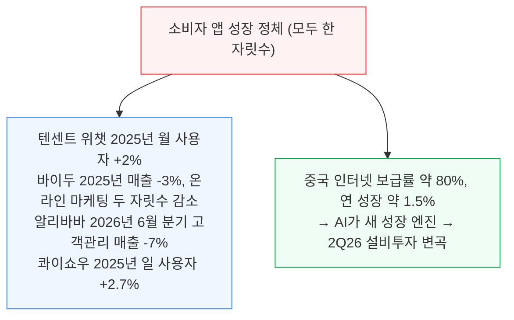

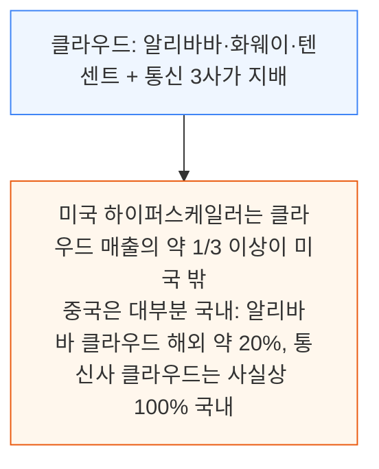

### 투자 거미줄: 플랫폼, 연구소, 연산

- 알리바바는 5개 LLM 유니콘에, 텐센트는 6곳에 투자했고 DeepSeek 시리즈 A의 최대 외부 투자자였다
- 연구소는 하이퍼스케일러 클라우드에서 학습·서빙(알리바바와 Moonshot)하거나 하이퍼스케일러 제품 안에서 서빙된다(텐센트와 DeepSeek). 어느 쪽이든 하이퍼스케일러의 데이터센터 확장이 국내 AI 생태계 전체의 연산 기반이다

### 조달의 세 갈래

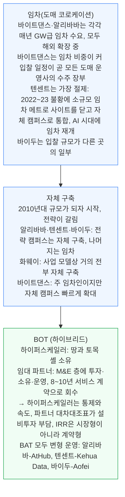

알리바바는 같은 클러스터 안에서 자체 구축·BOT·도매 임차를 나란히 돌려 혼합을 가장 멀리 끌고 간다. 원문 지도는 모델이 추적하는 모든 자체 구축의 현황을 보여준다.

<a id="s6"></a>

## 6. 바이트댄스: 중국 최대 임차인

**📌 핵심:**
- 중국 최대 AI 인프라 구매자이자, 대부분 임차이므로 제3자 코로케이션 산업 전체의 수요 엔진
- Doubao 월 사용자 3.45억 명(2026년 3월)으로 알리바바 Qwen(1.66억)과 DeepSeek(1.27억)을 합친 것보다 많음
- 2026년 AI 인프라 예산이 약 240억 달러에서 5월까지 300억 달러 이상으로 최소 25% 상향, 국내 임차 인도 용량 4GW 이상
- 결론: 공급사들이 매출의 80% 이상을 바이트댄스에 의존하는 '존재 의존'이 생겼고, 이제 자체 캠퍼스로 이동 중

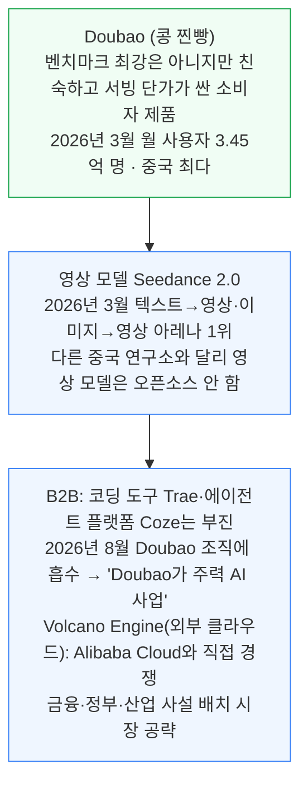

- 프런티어급 대형 오픈웨이트 모델은 아직 없지만, 총매개변수 최대 10T 모델을 초기 학습 중이라는 보도가 있다. 이는 Qwen3.8-Max(2.4T)와 Kimi K3(2.8T)를 크게 넘는다
- Douyin 추천·광고 추론, TikTok 글로벌 워크로드까지 겹쳐 학습·추론 수요는 스스로 지을 수 있는 규모를 쉽게 넘어선다
- 2026년 예산: 시작 약 240억 달러(1,600억 위안, 약 절반이 칩) → 5월까지 최소 25% 상향해 300억 달러(2,000억 위안) 이상. 언론의 최고치 700억 달러는 논의 중인 상한이지 예산이 아니다

### 임대사 세 곳과 자체 구축 전환

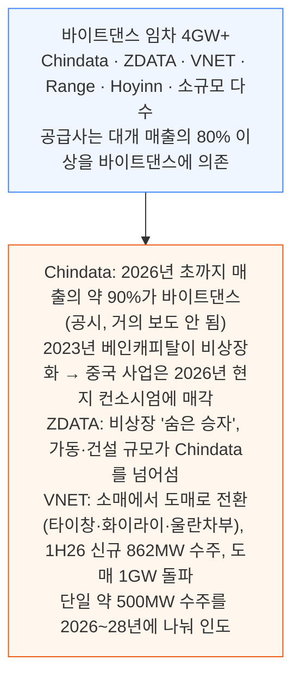

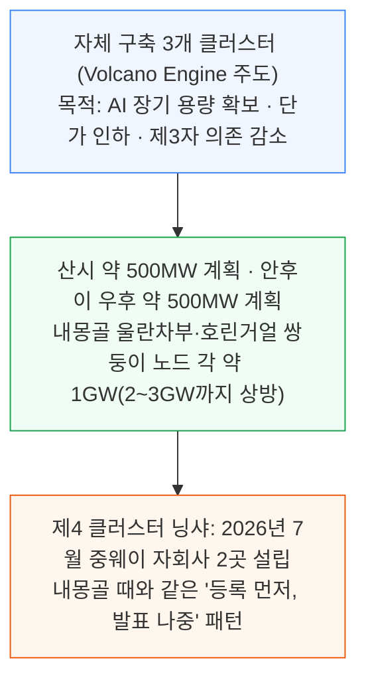

내몽골은 가장 최근에 짓고 가장 빠르게 커진다. 2026년 8월 정부 포털이 Volcano Engine의 프로젝트 5건(호린거얼 3, 울란차부 2) 등록 승인을 공개했다.

- 하나는 건설 중 캠퍼스의 증설 단계, 네 곳은 신규 부지이며 승인 건설 기간은 2025\~2029년
- 새 캠퍼스 두 곳은 바인과 지닝 클러스터에 있고, 원문은 울란차부 핵심 클러스터의 자체 구축·임차 부지 지도도 제시

<a id="s7"></a>

## 7. 알리바바: 유일한 정통 하이퍼스케일러 전략

**📌 핵심:**
- 중국에서 AWS에 가장 가까운 최대 클라우드: IaaS 기반을 AI(MaaS)로 업셀하는 구조는 AWS와 같지만, 해외 비중이 클라우드 매출의 약 20%(AWS는 분석가 추정 약 30\~40%)
- AI 관련 제품 매출이 클라우드 외부 매출의 약 35%이고 연환산 100억 달러에 접근하도록 가이던스
- 투자한 LLM 유니콘의 학습이 곧 알리바바 클라우드 수요가 되도록 지분 계약을 설계
- 결론: 프런티어 모델·지배적 클라우드·자체 이커머스 유통이 같은 연산 풀을 당기는 유일한 중국 사업자

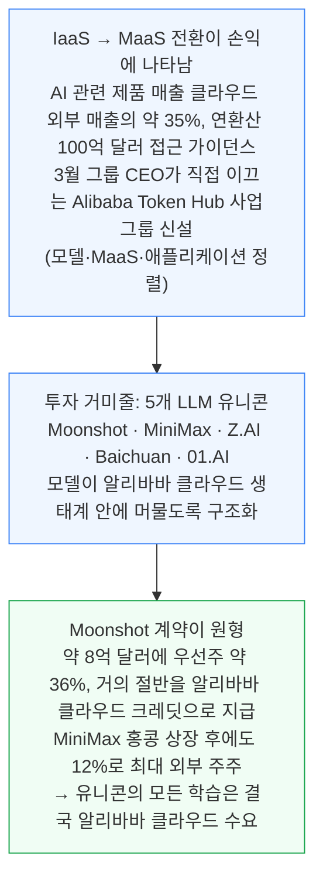

- **모델**: Qwen 시리즈로 오픈웨이트 선두, 누적 다운로드 30억 건 이상, 파생 모델 30만 개 이상. 쇼핑 에이전트·검색 봇으로 기존 사업에 심고 토큰 추론도 판매
- **칩**: T-Head가 대부분의 자체 실리콘 사업이 멈추는 시험 단계를 넘어 알리바바 클라우드 워크로드를 서비스 중. 알리바바와 통신사가 T-Head 실리콘만 쓰는 데이터센터 여러 곳을 함께 짓는다

### 통신사 공동 구축과 장베이 혼합

```mermaid
flowchart TD
    C1["2026년 4월 차이나텔레콤+알리바바 클라우드<br/>사오관 캠퍼스(EDWC 허브 노드)에 T-Head Zhenwu 1만 카드 클러스터 가동<br/>10만 카드까지 확장 계획"] --> C2["역할 분담<br/>통신사: 건물·전력·정부와 국유기업 영업 채널<br/>알리바바: T-Head 실리콘부터 클라우드 플랫폼·모델까지 연산 전부<br/>→ 풀스택 IaaS-to-MaaS로 판매"]
    C2 --> C3["대표 사례 장베이 단지: 5개 캠퍼스 혼합<br/>자체 구축 + AtHub·GDS·Yunlian이 셸과 전력을 대고 알리바바가 서버를 채우는 임차 홀<br/>→ 자체 구축 클러스터 안에서도 설비투자 부담을 줄임"]
    style C1 fill:#eff6ff,stroke:#3b82f6
    style C2 fill:#fff7ed,stroke:#ea580c
    style C3 fill:#f0fdf4,stroke:#16a34a
```

<a id="s8"></a>

## 8. 텐센트: 신중한 기업의 2026년 도약

**📌 핵심:**
- 위챗(월 사용자 14억 명 이상)이라는 최강 유통 자산 때문에 변경이 14억 명에게 파급돼 가장 느리게 움직임
- 2026년 1월 연례회의에서 AI에 '9개월에서 1년' 늦었다고 인정, 7월까지 모델 조직을 수석과학자 아래 단일 파운데이션 모델 부서로 통합
- 1H26 설비투자가 2025년 연간을 이미 넘고 잉여현금흐름이 마이너스인데 용량은 완만히 증가 → 증액분이 칩·스토리지 선결제로 가고 있다는 가장 강한 증거
- 결론: 모델이 아니라 인터페이스를 소유하는 전략이며, 데이터센터 용량은 따라잡기 의지의 가장 단단한 시험

```mermaid
flowchart TD
    M["Hunyuan Hy3: 2026년 7월 6일 정식 출시<br/>MoE 총 295B / 활성 21B · 문맥 256K<br/>챗봇 Yuanbao · 코딩 에이전트 CodeBuddy · 소셜 플랫폼 구동"] --> S["전략은 인터페이스 소유<br/>자체 모델과 함께 DeepSeek·Kimi·GLM을 AI 제품 전반에서 병행 운영"]
    style M fill:#eff6ff,stroke:#3b82f6
    style S fill:#f0fdf4,stroke:#16a34a
```

```mermaid
flowchart TD
    T1["2022~23 불황: 소규모 임차 메트로 사이트 폐쇄<br/>칭위안·화이라이·이정 자체 메가 캠퍼스로 집중"] --> T2["2024년부터 설비투자와 약정이 함께 급증<br/>1H26 설비투자가 FY2025 전체 초과, 잉여현금흐름 마이너스<br/>그러나 용량은 완만히 증가 → 증액분은 칩·스토리지 선결제"]
    T2 --> T3["증설 용량은 대부분 도매 임차에서 나옴<br/>자체 셸 위주 물결에서 반전, 현금 여력이 빠듯해진 영향<br/>서쪽 비중은 가장 작음(지연 민감 워크로드: 위챗·게임·영상)<br/>예외: 닝샤 중웨이 차이나유니콤 협력, 첫 홀 2025년 4월 가동"]
    style T1 fill:#eff6ff,stroke:#3b82f6
    style T2 fill:#fff7ed,stroke:#ea580c
    style T3 fill:#f0fdf4,stroke:#16a34a
```

발표나 벤치마크 점수와 달리 데이터센터 용량은 실제 연산력의 단단한 물리적 지표다. 저자들은 텐센트의 진정성을 가늠할 가장 명확한 시험으로 계속 추적하겠다고 밝힌다.

<a id="s9"></a>

## 9. 바이두: 선발주자에서 실리콘 사업자로

**📌 핵심:**
- 중국 AI 이야기를 열었지만 네 인터넷 하이퍼스케일러 중 지출이 가장 작음: 1H26 설비투자가 알리바바의 한 달 지출 수준
- 2Q26 헤드라인 설비투자 +201%(핵심 설비투자 대비 매출 45%로 중국 플랫폼 중 최고 강도), 그러나 인프라 용량은 5곳 중 최소
- 차이를 만드는 것은 칩·스토리지이고, 프런티어 학습이 아니라 실리콘 사업을 키우는 중
- 결론: GPU 클라우드 매출 2Q26 +283%(1Q +184%), 자체 칩의 원가 우위로 CPU 클라우드보다 마진이 좋다고 경영진이 설명

```mermaid
flowchart TD
    B1["선발주자: ERNIE 2019년 출시<br/>2023년 3월 중국 대형 기술기업 중 최초 ChatGPT형 제품 출시<br/>그러나 바이트댄스 Doubao가 소비자 왕좌 탈환"] --> B2["오픈소스화: ERNIE 4.5(2025년 6월) → ERNIE 5.0 2.4T(2026년 1월) → ERNIE 5.1(2026년 5월)<br/>검색·지도·코딩에 통합했지만 본업은 못 구함<br/>2Q26 온라인 마케팅 매출 약 -20%, 예외는 정부·국유기업 사설 배치"]
    style B1 fill:#eff6ff,stroke:#3b82f6
    style B2 fill:#fef2f2,stroke:#dc2626
```

```mermaid
flowchart TD
    K["가장 깊은 수직 스택<br/>Kunlunxin 칩이 ERNIE 5.1을 자체 데이터센터에서 학습<br/>(알리바바 T-Head Zhenwu는 주로 추론)<br/>국가·금융 조달 등 외부 판매 · A+H 상장 추진, 거론되는 가치 상단이 모회사 위"] --> K1["지도와 설비투자 불일치<br/>3자 입찰은 바이트댄스의 10분의 1 · 서부 허브 GW 캠퍼스 없음<br/>첫 내몽골 연산 주문은 2025년 · 해외 연산 없음"]
    K1 --> K2["2Q26 GPU 클라우드 매출 +283% (1Q +184%)<br/>경영진은 용량이 아니라 수익성을 얘기<br/>'자체 개발 칩의 원가 우위' 덕에 CPU 클라우드보다 마진 우수"]
    style K fill:#eff6ff,stroke:#3b82f6
    style K1 fill:#fff7ed,stroke:#ea580c
    style K2 fill:#f0fdf4,stroke:#16a34a
```

<a id="s10"></a>

## 10. 화웨이: 데이터센터도 운영하는 칩 공급자

**📌 핵심:**
- 화웨이는 5곳 중 두 번째로 작은 하이퍼스케일러이면서 모두의 한계를 정하는 공급자
- 자체 구축 비율 90% 이상으로 추적 대상 중 최고, 3대 클라우드 허브가 각각 서버 100만 대 이상 설계
- 설계 용량이 배치보다 크게 앞서 가동 대 계획 비율이 약 1:6
- 결론: 2025년 11월부터 신규 국가 자금 데이터센터는 국산 AI 칩 의무라, 국가 AIDC가 가동하는 1GW마다 화웨이 공급분에 대한 입찰

```mermaid
flowchart TD
    H0["화웨이 3대 클라우드 허브<br/>국가 3허브 배치, 각각 서버 100만 대 이상 설계"] --> H1["구이저우 구이안 (2021년 시작)<br/>현재 운영 중 최대 화웨이 클라우드 캠퍼스, 서버 100만 대 설계"]
    H0 --> H2["내몽골 2개 부지<br/>울란차부: 2016년 최초 자체 구축<br/>호린거얼: 2023년 착공, 1,000에이커 · 서버 홀 50개 · 220kV 변전소 6곳 · 풀 빌드 100만 대 이상"]
    H0 --> H3["안후이 우후 (2024년 개소)<br/>세 곳 중 가장 야심적: 1,000에이커에 서버 300만 대 설계"]
    style H0 fill:#fff7ed,stroke:#ea580c,stroke-width:2px
    style H1 fill:#eff6ff,stroke:#3b82f6
    style H2 fill:#eff6ff,stroke:#3b82f6
    style H3 fill:#eff6ff,stroke:#3b82f6
```

```mermaid
flowchart TD
    P1["화웨이 클라우드는 클라우드 사업이라기보다 Ascend 연산의 유통 채널<br/>CloudMatrix 장비를 사거나 운영하지 못하는 고객이 시간·토큰 단위로 임차<br/>고객은 정부·금융·국유기업 중심, 2025년 그룹 매출의 5% 미만, 점유율 축소"] --> P2["역설: 하이퍼스케일러 규모는 두 번째로 작은데<br/>다른 모두의 의존도(노출)는 가장 큼<br/>정책도 같은 방향: 2025년 11월부터 신규 국가 자금 데이터센터에 국산 AI 칩 의무"]
    style P1 fill:#eff6ff,stroke:#3b82f6
    style P2 fill:#f0fdf4,stroke:#16a34a
```

<a id="s11"></a>

## 11. 해외 확장: 2029년 약 4GW

**📌 핵심:**
- 중국 하이퍼스케일러의 해외 임차는 2026년에서 2029년 사이 2배로 늘어 약 4GW에 접근
- 바이트댄스가 선두: 수출 규제로 국내에 올릴 수 있는 칩이 제한돼 엔비디아 함대는 해외 시설에 있고, 중국식 건설 속도를 들고 온 개발사들이 짓는다
- 알리바바는 2026년 8월 100억 달러 신주 배정을 마치고 약 60%를 해외 컴퓨팅 인프라 확장에 배정
- 결론: 해외 비중 목표(알리바바 클라우드 20%에서 25\~30%, 텐센트 10%에서 30% 초과)가 확장 동력

```mermaid
flowchart TD
    BD["바이트댄스: 해외 자체 구축은 없고 대형 임차와 네오클라우드 임차를 추적<br/>TikTok 사용자 데이터 현지 처리를 위해 2020~24년 해외 용량 계약"] --> BD1["미국: 2020~2023년 급확장(북버지니아·포틀랜드), 이후 자체 증설 거의 없음<br/>유럽: 2023년 아일랜드·노르웨이, 핀란드 제3 부지 2025년 착공<br/>브라질: 최신 움직임, 약 200MW로 시작"]
    BD --> BD2["ASEAN이 현재 가장 밝은 곳, 2023년 이후 급가속<br/>주요 임대사 DayOne·Bridge DC·민간 개발사 다수<br/>싱가포르-조호르-바탐 허브 집중, 100MW+를 1년 안에 인도(일부 서구 도매 개발사는 보통 2배)"]
    style BD fill:#eff6ff,stroke:#3b82f6
    style BD1 fill:#eff6ff,stroke:#3b82f6
    style BD2 fill:#f0fdf4,stroke:#16a34a
```

원문 그림 네 장이 이 해외 용량과 허브 지도, 개발사별 인도 속도를 보여준다. 위 다이어그램이 그 내용을 옮긴 것이다.

### 알리바바와 텐센트

```mermaid
flowchart TD
    AL["알리바바 (더 적극적)<br/>해외 18개 리전 46개 가용 영역 vs 중국 13개 리전 60개 가용 영역<br/>최근 2년 신규 리전 출시 속도 가속"] --> AF["자금: 2026년 8월 100억 달러 신주 배정<br/>2019년 홍콩 상장 후 첫 신주 배정 · 홍콩 역대 최대 후속 공모<br/>사용처: 풀스택 AI, 약 60%는 글로벌 컴퓨팅 인프라 확장, 나머지는 하이퍼스케일 AI 데이터센터와 클라우드 업그레이드"]
    AF --> AD["동력 ①MaaS: AI 관련 서비스 클라우드 매출 35% → 50% 초과, 해외 매출 약 20% → 3년 내 25~30%<br/>동력 ②첨단 칩 접근: 중국 하이퍼스케일러에 GPU 임대는 현재 합법이고 큰 사업<br/>7월 전망: 2027년 말까지 미국에서 약 500MW 용량 탐색"]
    style AL fill:#eff6ff,stroke:#3b82f6
    style AF fill:#fff7ed,stroke:#ea580c
    style AD fill:#f0fdf4,stroke:#16a34a
```

- **텐센트**: 규모는 더 작고 중국 게임·인터넷 기업의 해외 진출 지원에서 시작. 사우디아라비아·일본·말레이시아 3개 신규 해외 리전을 열고 2025년 이후 해외 가용 영역 8개를 추가했다. 모델 서빙 게이트웨이와 에이전트 제품의 국제 출시가 동력이고 동남아시아가 명확한 초점이다
- 국제 사업은 현재 텐센트 클라우드 매출의 약 10%이고 전년 대비 40% 이상 성장 중이며, 목표는 2030년까지 30% 초과

<a id="s12"></a>

## 12. 결론: 건물 단위로 지도를 그려야 보이는 것

**📌 핵심:**
- 헤드라인 숫자만으로는 거의 아무것도 보이지 않음: 높은 공실과 AI 용량 부족의 공존, 시설 비용이 떨어지는 기록적 설비투자, 거의 아무것도 공시하지 않으면서 도매 산업 전체를 떠받치는 최대 임차인
- 5대 하이퍼스케일러(알리바바·텐센트·화웨이·바이트댄스·바이두) 합산 용량이 2023년 말 약 6GW에서 2030년 약 21GW로 3배 이상 증가 전망
- 연간 증설: 클라우드 시대 약 1GW → 2026\~2027년 연 3\~4GW, 그 뒤 자체 투기 캠퍼스 백로그 약 6GW가 추가 착공
- 결론: 서버가 설비투자 대부분을 차지하겠지만, 건물이 있어야 서버가 들어가므로 데이터센터 건설이 도착 시점과 장소의 가장 이른 실물 신호

```mermaid
flowchart TD
    Z1["수요는 구조적<br/>보호된 국내 시장 · 국가가 이끄는 인프라<br/>수출 규제 속에서도 중국 모델을 세계적으로 유효하게 만드는 오픈소스 선순환"] --> Z2["5대 하이퍼스케일러 합산 용량<br/>2023년 말 약 6GW → 2030년 약 21GW"]
    Z2 --> Z3["연간 증설: 약 1GW(클라우드 시대) → 3~4GW(2026~2027)<br/>그 뒤 투기 캠퍼스 백로그 약 6GW 착공"]
    style Z1 fill:#eff6ff,stroke:#3b82f6
    style Z2 fill:#f0fdf4,stroke:#16a34a,stroke-width:2px
    style Z3 fill:#fff7ed,stroke:#ea580c
```

이 모델은 건설 중인 프로젝트와 날짜 있는 파이프라인을 추적하므로 확정된 건설분은 이미 데이터에 들어 있다. 구독자는 지도와 이후의 지속 추적을 받는다.

---

*작성 진행률: 100% 완료*
*업데이트: 원문 12개 절 전부 반영 (유료 구독 구간으로 표시된 부분은 원문 본문 범위만)*
