# Anthropic Subscriptions Offer 5x+ More Value Than OpenAI

> **출처**: [SemiAnalysis Newsletter](https://newsletter.semianalysis.com/p/anthropic-subscriptions-offer-5x)
> **저자**: Andrew Megalaa, Max Kan, Dylan Patel
> **발행일**: 2026-10-05

## 📑 목차

1. [구독은 매출 10%인데 추론 연산의 40%를 먹는다](#s1)
2. [한도를 재는 법: 토큰 종류와 실험 설계](#s2)
3. [계산 3단계와 우연히 잡힌 A/B 테스트](#s3)
4. [OpenAI 대 Anthropic: 현재 상태](#s4)
5. [OpenAI의 500달러 플랜과 한도 대폭 삭감](#s5)
6. [API 가격 인하와 구독 한도, 그리고 마진을 올리는 두 방식](#s6)
7. [중국 구독 플랜은 여전히 좋은 거래](#s7)
8. [서드파티 플랜은 1차 사업자보다 나쁘다](#s8)

## 🔑 용어 정리

> - **API 환산 가치(API-equivalent value)**: 구독 한도를 다 쓸 때 얻는 토큰을 정가 API 가격으로 계산한 금액. 구독이 정가 대비 얼마나 후한지 보여주는 잣대
> - **사용량 미터**: 구독 화면에 뜨는 0\~100% 게이지. 5시간 창과 7일 창이 있고, 모델별 별도 게이지도 있음. 토큰 수가 아니라 이 게이지만 공개됨
> - **캐시 쓰기·캐시 읽기**: 대화 앞부분을 저장해 두는 것이 쓰기, 저장본을 다시 불러오는 것이 읽기. 읽기는 보통 신규 입력보다 훨씬 쌈
> - **(플랜, 모델, 워크로드) 묶음**: 같은 월정액도 어떤 모델을 어떤 작업에 쓰느냐에 따라 가치가 달라지므로, 이 셋을 한 세트로 봐야 한다는 개념
> - **MW당 매출**: 데이터센터 전력 1MW가 벌어들이는 매출. 구독처럼 보조금이 큰 매출이 섞이면 낮아짐
> - **TPS**: 초당 생성 토큰 수. 응답 속도의 지표
> - **그랜드파더링(grandfathering)**: 정책이 바뀌어도 기존 가입자에게는 옛 조건을 일정 기간 유지해 주는 것
> - **서드파티 래퍼**: Cursor, Cognition(Devin)처럼 남의 모델 API를 가져와 자기 구독 상품으로 파는 서비스

---

## 1. 구독은 매출 10%인데 추론 연산의 40%를 먹는다

**📌 핵심:**
- 구독은 Anthropic 전체 매출의 약 10%지만 추론 연산의 40% 넘게 쓰고, 합산 MW당 매출을 약 3,600만 달러 낮춘다
- 구독료는 크게 보조되지만, 고객 확보와 홍보 수단으로는 경제성이 있다
- OpenAI는 구독 비중이 더 커서 영향이 더 크다
- 결론: AI 랩의 재무를 모델링하려면 구독 한도부터 알아야 한다

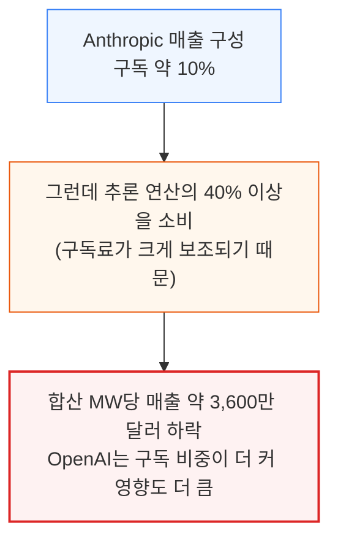

원문 첫 그림(SemiAnalysis Tokenomics Model)이 이 구성을 보여주며, 위 다이어그램이 요지를 옮긴 것이다.

**구독이 마케팅 도구인 이유.** OpenAI가 반복한 후한 한도 초기화(reset)가 쌓은 호감이 Codex 도입 급증의 일부 원인이다. 그 결과 Anthropic은 계획했던 구독 축소를 여러 번 철회해야 했다.

### 한도는 "크레딧"으로 작동한다

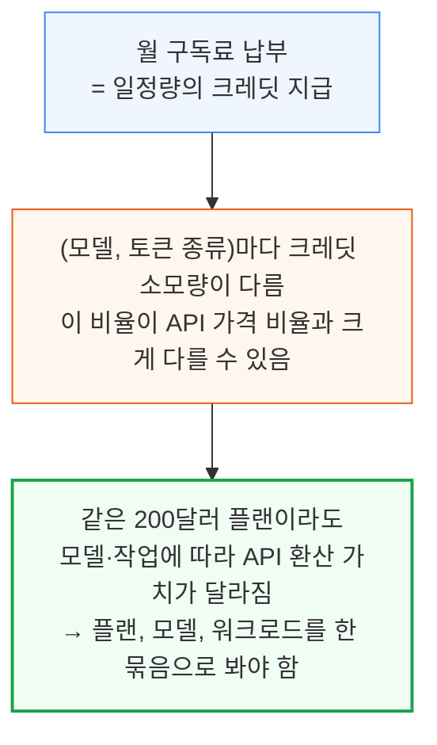

원문 두 번째 그림은 같은 월 200달러 Claude 플랜의 API 환산 가치가 모델과 작업에 따라 달라지는 모습이다.

### 매일 다시 재야 하는 이유

- 사업자는 프로모션과 신모델 출시 때 한도를 공개적으로 바꾼다
- 크레딧 소모량을 조용히 고쳐 한도를 몰래 바꿀 수도 있다
- 그래서 SemiAnalysis는 (플랜, 모델, 토큰 종류)별 비용을 매일 재는 **구독 대시보드**를 Tokenomics Model 구독자 전용으로 만들었다
- 추적 대상: OpenAI·Anthropic 전 플랜과 Meta, SpaceXAI, Cursor, Cognition, Z.ai, MiniMax, Moonshot
- 이하 모든 토큰·금액은 별도 언급이 없으면 에이전트형 사용량 기준

## 2. 한도를 재는 법: 토큰 종류와 실험 설계

**📌 핵심:**
- 토큰은 입력, 캐시 쓰기, 캐시 읽기, 출력 4종으로 가격이 매겨지고 출력이 가장 비쌈
- 구독은 세부 가격을 숨기고 0\~100% 게이지만 보여주므로, 게이지가 움직이는 폭으로 역산해야 함
- 한 번에 한 종류만 극대화하는 프롬프트 실험으로 종류별 요율을 따로 잼
- 결론: 게이지 한 칸당 토큰 수를 알면 구독 가치를 달러로 환산할 수 있다

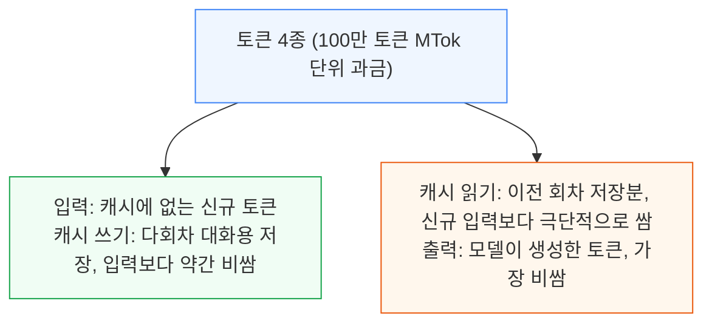

일부 모델은 특정 컨텍스트 길이를 넘는 토큰에 더 비싼 요금을 매긴다. 이런 모델은 보통 그 길이에 닿기 전에 대화를 압축하므로, 측정도 그 길이 아래에서 한다. 원문은 OpenAI 가격표 그림(출처 OpenAI)도 싣는다.

### 구독이 보여주는 것은 게이지뿐이다

- 5시간 창과 7일 창에 대한 0\~100% 미터, 경우에 따라 Fable 같은 모델의 별도 미터
- 요금제 간 차이는 같은 사업자의 다른 플랜 대비 배수로만 표시됨
- OpenAI 사례: Plus 20달러에 "Codex 사용량 확대", Pro 100달러에 "Plus의 5배", Pro 200달러에 "20배"를 내걸었다가, 200달러 플랜 한도를 절반으로 줄이고 가격 페이지에서 상대 사용량 표기를 모두 뺌

### 실험 설계

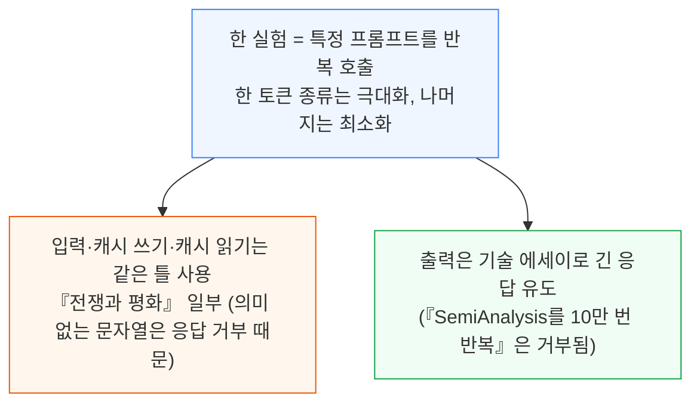

세 가지 입력 계열 실험의 차이는 아래와 같다.

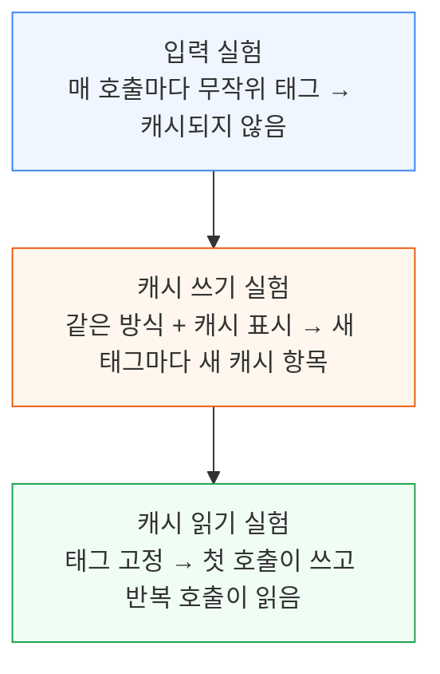

## 3. 계산 3단계와 우연히 잡힌 A/B 테스트

**📌 핵심:**
- 호출마다 청구 토큰 수와 미터 값을 기록하고, 미터가 한 칸 오를 때까지의 토큰을 한 "스텝"으로 삼아 요율을 구함
- 첫 스텝과 마지막 스텝은 불완전하므로 버리고, 오차 ±5% 안이 될 때까지 스텝을 늘림
- 5시간 한도는 주 안에 여러 번 초기화되므로 월 용량은 주간 한도가 결정
- 결론: 측정 오차를 ±5%로 묶어 API 환산 가치를 산출하며, 이 감도로 사업자의 비공개 A/B 테스트도 잡아냈다

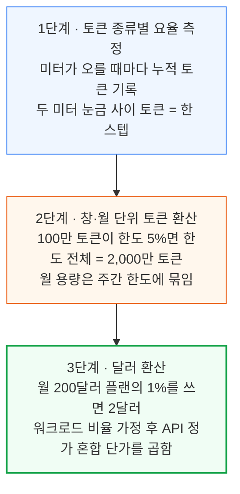

### 1단계의 보정 규칙

- 한 요청으로는 미터가 안 움직이는 경우가 많아 요청 하나의 비용은 직접 못 잼
- 시작 시점에는 미터가 이미 다음 눈금 쪽으로 일부 가 있어 첫 스텝이 불완전하고(요율이 높게 보임), 마지막 눈금 뒤 토큰도 스텝이 못 되니 둘 다 버림
- 요청당 미터를 한 번만 보므로 스텝 하나는 최대 요청 1건만큼 틀릴 수 있으나, 이 오차는 스텝이 이어져도 누적되지 않아 범위를 추적하고 ±5% 안이 될 때까지 스텝을 더함
- 요청마다 섞여 들어가는 고정 지시문 토큰은 다른 종류에서 잰 단가로 빼서 보정
- 캐시 읽기가 5억 토큰에도 미터를 안 움직이면 무료로 간주

### 2\~3단계의 계산 전제

- 미터마다(5시간·주간·모델별) 토큰 종류별 요율을 구함
- 에이전트형 워크로드는 SemiAnalysis 자체의 9월 토큰 사용 비율(Tokenomics Model 공개치)을 사용

### 제공자의 A/B 테스트를 잡다

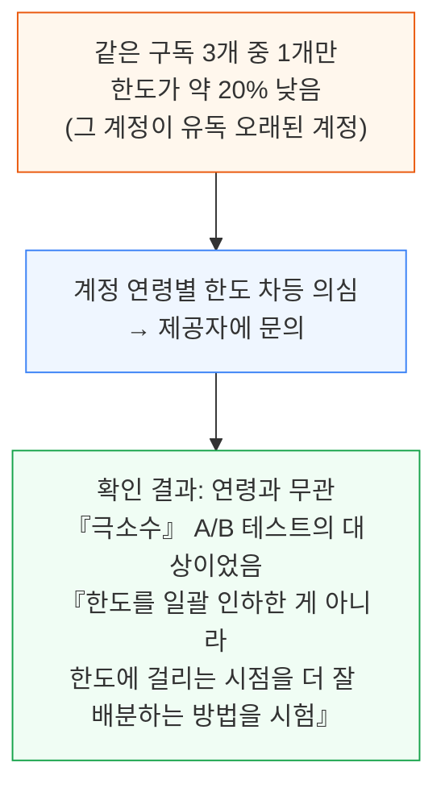

이 일화가 의미하는 바는 두 가지다.

1. 사업자는 언제든 구독 한도를 조용히 바꿀 수 있다
2. 이 측정법은 그런 미세한 변화를 잡아낼 만큼 민감하다

## 4. OpenAI 대 Anthropic: 현재 상태

**📌 핵심:**
- 최상위 모델끼리는 비슷하지만, 일상용 중급 모델(Opus 5.5 대 GPT 6.1 Sol)에서는 Anthropic이 API 환산 가치 약 5배로 압도
- Fable은 한도의 50%까지만 쓸 수 있어, 200달러 플랜에서 Fable 5.1에 2,485달러어치를 쓰고도 한도 절반이 남음
- 토큰 수로 비교해도 격차는 크고, OpenAI Pro 플랜에 5시간 한도가 없는 점은 이를 상쇄하지 못함
- 결론: 한때 OpenAI의 후한 한도를 칭찬하던 개발자 평판은 더는 사실이 아니다

> 비교 기준은 OpenAI가 지난주 구독을 대폭 바꾼 뒤의 **현재 상태**다. 200달러 플랜의 API 환산 가치를 절반으로 줄이고 500달러 신규 등급을 도입했다.

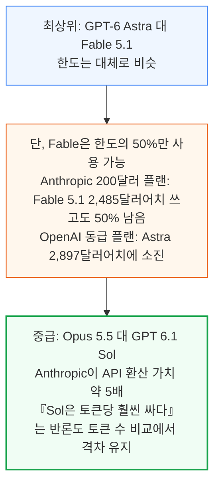

### 어떤 잣대를 쓸까

- API 환산 가치가 구독의 "가치"를 포착하는 가장 좋은 단일 숫자라고 저자들은 본다
- 다만 어떤 모델의 API 정가 자체가 유난히 나쁘거나 좋은 거래면 이 숫자가 오해를 부르므로, 그때는 원시 토큰 수가 더 적절하다
- 토큰 효율도 중요하나 업계에 믿을 만한 데이터가 없다. 많이 인용되는 Artificial Analysis 차트의 AA Intelligence Index 과제는 실제 업무를 대표하지 않는다고 본다

### OpenAI에 대한 마지막 반론과 재반박

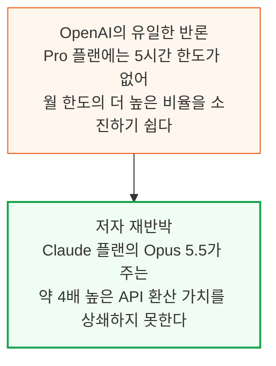

결론은 Claude 어느 구독에서든 Opus 5.5가 OpenAI의 어떤 상품보다 훨씬 나은 가치를 준다는 것이다.

## 5. OpenAI의 500달러 플랜과 한도 대폭 삭감

**📌 핵심:**
- OpenAI는 200달러 플랜의 모델 등급별 토큰을 절반으로 줄였고, 추적 결과가 이를 확인
- 6.1 Sol의 캐시 입력 가격 인하가 겹쳐 Sol급 모델의 API 환산 가치는 50% 넘게 하락
- 신설 500달러 플랜은 옛 200달러 플랜보다 Astra를 21%만 더 줌
- 결론: 삭감 이후 Pro 100·200·500은 달러당 토큰이 같아졌고, 한때 2배씩 후했던 200달러 플랜의 우대가 사라졌다

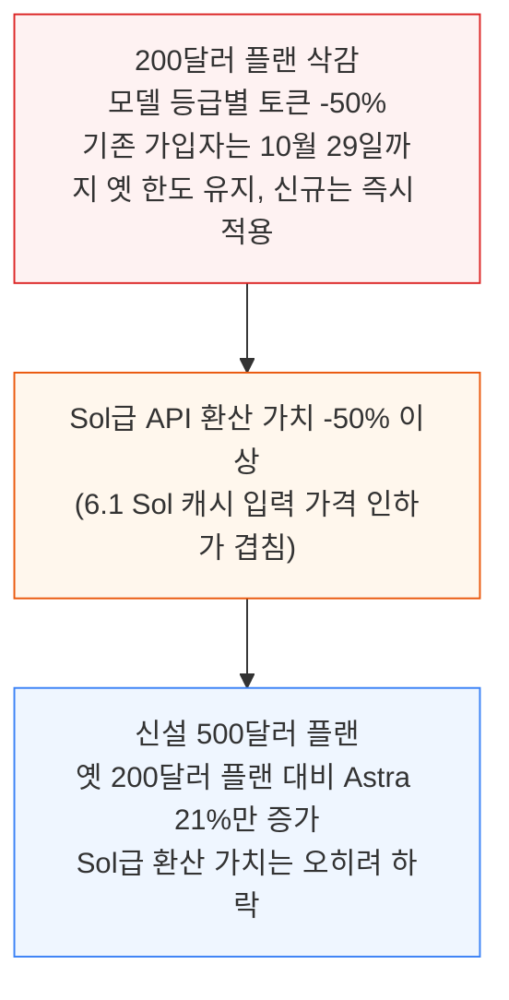

500달러 플랜의 진짜 간판은 초당 300토큰의 Ultrafast(초고속) 모드다. 그 한도와, ChatGPT 구독을 Devin 같은 서드파티 앱에서 쓸 때의 한도는 현재 시험 중이며 결과는 Tokenomics Model 구독자에게 먼저 공개된다.

### 달러당 가치: 삭감 전과 후

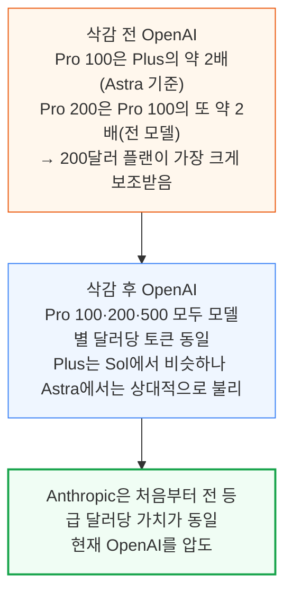

## 6. API 가격 인하와 구독 한도, 그리고 마진을 올리는 두 방식

**📌 핵심:**
- 최근 API 가격 인하가 잇따랐으나 두 회사 모두 구독 한도를 가격 인하만큼 늘리지 않았다
- OpenAI는 Sol 한도를 그대로 둬 환산 가치가 약 30% 하락, Anthropic은 Opus 한도를 올렸으나(Max 약 20%, Pro 약 50%) 가격 인하분을 다 메우진 못함
- Anthropic은 상위 모델일수록 환산 가치를 낮추고, OpenAI는 전 등급을 단번에 Fable급 한도로 깎는 방식
- 결론: Anthropic이 Fable만 쓰는 사용자뿐이라면 구독도 이미 소프트웨어급 마진이다

### 최근 가격 인하

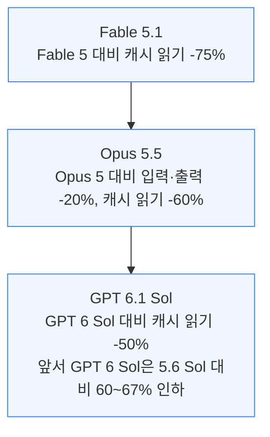

### 한도는 가격 인하를 따라가는가

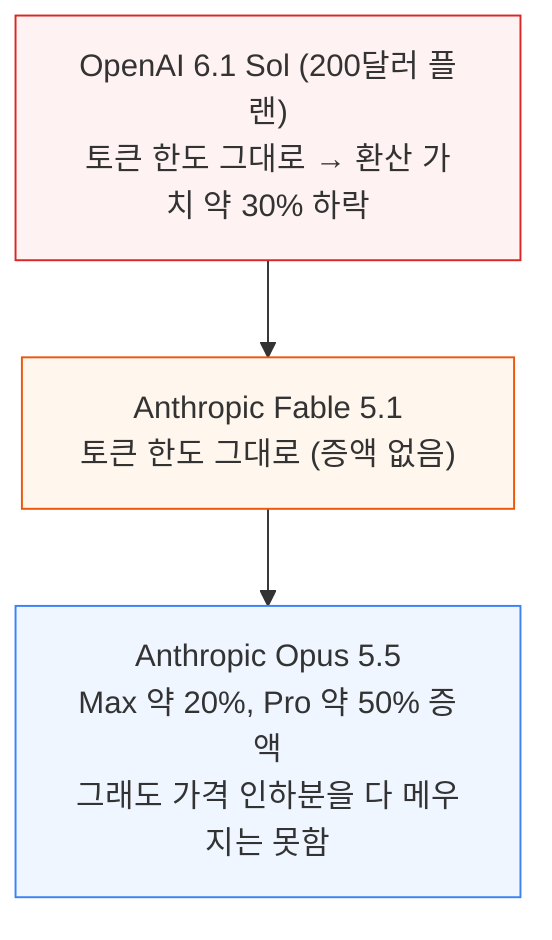

### 마진을 올리는 두 전략

구독의 총마진은 API보다 훨씬 낮고 두 회사의 MW당 매출을 의미 있게 깎는다. 두 회사는 보조금을 줄이는 서로 다른 길을 골랐다.

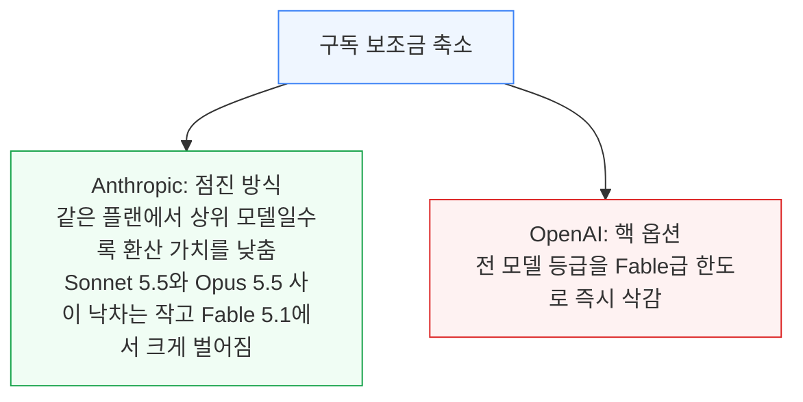

Anthropic 방식의 마진 효과는 아래와 같다. 가정은 API 총마진 92%다.

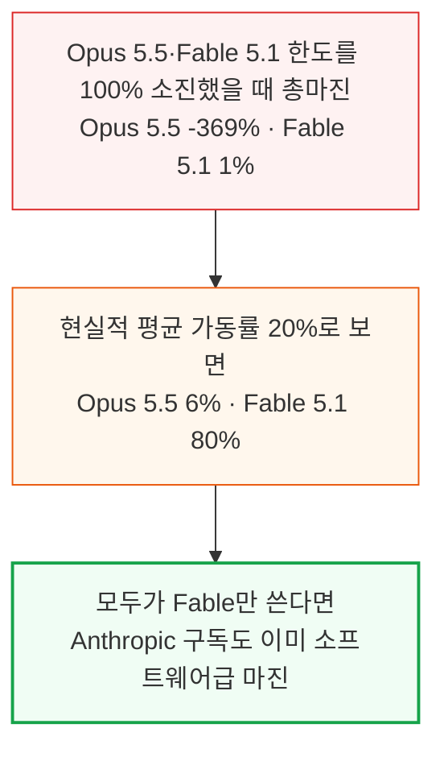

- Opus급은 모델을 줄이는 방법을 찾을수록 서빙 비용이 더 내려갈 것이다
- Fable 위에 새 등급이 나오면 구독 한도는 더 낮아질 것이다(구독에 포함된다면)

OpenAI의 핵 옵션은 원래 여론 반발이 따라야 하지만 거의 피했다. 저자들은 전날 DevDay 호재가 악재를 덮었고, 기존 플랜을 한 달 더 그랜드파더링해 준 영향을 추정한다.

## 7. 중국 구독 플랜은 여전히 좋은 거래

**📌 핵심:**
- 컴퓨트가 부족한 중국 랩들도 보조된 구독을 제공하지만, 보조 수준은 모델마다 크게 다름
- 중국 랩은 상위 플랜일수록 달러당 가치가 올라감
- 평균 달러당 API 환산 가치는 OpenAI의 약 12배보다 약간 낮음
- 결론: 중국 플랜은 OpenAI와 같은 급이지만 Anthropic에는 못 미친다

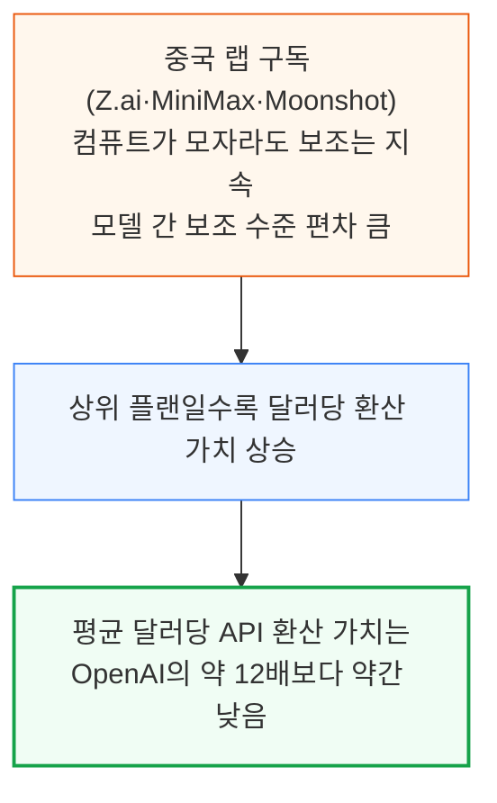

원문은 중국 플랜의 절대 가치와, OpenAI·Anthropic과 달러 기준으로 정규화한 비교를 각각 그림으로 제시한다.

## 8. 서드파티 플랜은 1차 사업자보다 나쁘다

**📌 핵심:**
- 1차 사업자(OpenAI·Anthropic)의 자체 플랜이 Cursor·Cognition 같은 래퍼보다 한도가 훨씬 후하다
- Anthropic은 한도가 9배 이상 후한데도 마진은 Cursor·Cognition보다 높을 가능성이 크다
- Cognition과의 격차는 비교적 작은데, Cognition이 OpenAI 모델에 더 후하고 OpenAI 구독 자체가 달러당 가치가 낮기 때문
- 결론: 모델을 직접 소유하면 남의 API를 감싸는 것보다 구독 경제성이 좋다

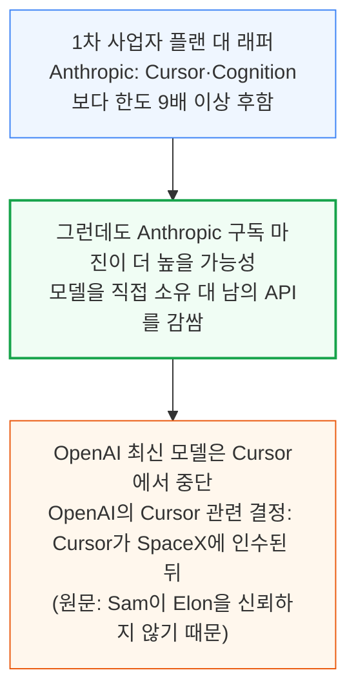

### OpenAI 대 Cognition, 그리고 Cursor 자체 모델

- OpenAI와 Cognition의 격차는 Anthropic과의 격차보다 흥미롭게도 훨씬 작다. 이유는 ① Cognition이 OpenAI 모델에 더 후하다는 점(기업 할인을 더 받았을 가능성), ② 그보다 OpenAI 구독 자체가 Anthropic보다 달러당 가치가 훨씬 낮다는 점이다
- Cursor 월 200달러 플랜의 자체 모델 Composer와 Grok 4.7은 달러당 API 환산 가치 15.2배로, OpenAI Pro 플랜을 간신히 웃돌고 서드파티 모델에 대한 Cursor 한도보다는 훨씬 높다

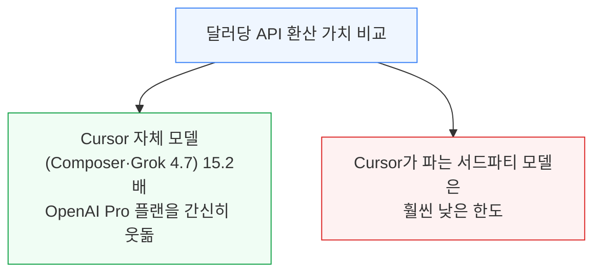

Meta·SpaceXAI 구독의 데이터와 신모델 출시·한도 변경에 대한 실시간 업데이트는 Tokenomics Model에서 볼 수 있다.

---

*작성 진행률: 약 100% 완료*
*업데이트: 전체 8개 섹션 변환 완료*
