# NVIDIA Tensor Core Evolution: From Volta To Blackwell

> **출처**: [SemiAnalysis Newsletter](https://newsletter.semianalysis.com/p/nvidia-tensor-core-evolution-from-volta-to-blackwell)
> **저자**: Dylan Patel
> **발행일**: 2025-06-23

---

## 📑 목차

### 전체 섹션
 1. [서론: 텐서 코어를 알아야 하는 이유](#1-서론-텐서-코어를-알아야-하는-이유)
 2. [성능 공학의 기본 원칙: Amdahl의 법칙과 데이터 이동](#2-성능-공학의-기본-원칙-amdahl의-법칙과-데이터-이동)
 3. [텐서 코어 이전: CUDA 프로그래밍 모델의 기초](#3-텐서-코어-이전-cuda-프로그래밍-모델의-기초)
 4. [Volta: 텐서 코어의 탄생 (1세대)](#4-volta-텐서-코어의-탄생-1세대)
 5. [Turing: 2세대 텐서 코어와 정수 연산](#5-turing-2세대-텐서-코어와-정수-연산)
 6. [Ampere: 3세대 텐서 코어와 비동기 데이터 복사](#6-ampere-3세대-텐서-코어와-비동기-데이터-복사)
 7. [Hopper: 4세대 텐서 코어와 TMA](#7-hopper-4세대-텐서-코어와-tma)
 8. [Blackwell: 5세대 텐서 코어와 텐서 전용 메모리](#8-blackwell-5세대-텐서-코어와-텐서-전용-메모리)
 9. [곁다리 이야기: 구조적 희소성이 약속을 못 지킨 이유](#9-곁다리-이야기-구조적-희소성이-약속을-못-지킨-이유)
10. [텐서 코어 진화의 3대 트렌드: 코어 크기, 메모리, 데이터 타입](#10-텐서-코어-진화의-3대-트렌드-코어-크기-메모리-데이터-타입)
11. [MMA 명령어의 비동기화 여정](#11-mma-명령어의-비동기화-여정)
12. [프로그래밍 모델의 전환: 강한 스케일링을 위한 설계](#12-프로그래밍-모델의-전환-강한-스케일링을-위한-설계)

---

## 🔑 용어 정리

본문을 순서대로 읽기 전에 알아두면 좋은 용어들입니다. 자세한 수치와 설명은 본문에서 처음 등장하는 위치에 나옵니다.

- **텐서 코어 (Tensor Core)**: GPU 안에서 행렬 곱셈(딥러닝 연산의 핵심)만 전담하는 별도의 전용 회로. 범용 연산 코어보다 훨씬 적은 전력으로 훨씬 많은 곱셈을 처리
- **Amdahl의 법칙**: 문제 크기를 고정한 채 컴퓨팅 자원을 아무리 늘려도, 병렬화가 안 되는 부분(직렬 구간)이 전체 속도 향상의 상한선을 정한다는 원리
- **강한 스케일링 vs 약한 스케일링**: 강한 스케일링은 "같은 크기의 작업을 자원만 늘려 더 빨리 끝내기", 약한 스케일링은 "자원을 늘린 만큼 더 큰 작업을 처리하기"
- **SM(스트리밍 멀티프로세서)과 워프(Warp)**: SM은 GPU 내부의 연산 단위 블록, 워프는 SM이 한 번에 같은 명령어로 실행하는 스레드 32개 묶음
- **PTX와 SASS**: PTX는 GPU 세대가 바뀌어도 그대로 쓸 수 있는 중간 단계 가상 명령어, SASS는 그 밑에서 칩마다 다르게 번역되는 실제 기계어(Nvidia가 상세 공개를 안 함)
- **MMA 명령어 (Multiply-Accumulate)**: "D = A×B+C" 형태의 행렬 곱셈+누적을 한 번에 처리하는 텐서 코어의 핵심 명령어
- **TMA / TMEM (텐서 메모리 가속기 / 텐서 전용 메모리)**: TMA는 대용량 데이터를 메모리 간에 자동으로 옮겨주는 전용 하드웨어, TMEM은 텐서 코어 연산 결과를 담아두는 Blackwell의 신설 전용 메모리 공간
- **구조적 희소성 (Structured Sparsity)**: 행렬 값 중 일정 비율을 0으로 만들어(가지치기) 계산량을 줄이는 기법 — 이론상 연산 속도를 2배 높일 수 있음

---

## 1. 서론: 텐서 코어를 알아야 하는 이유

**📌 핵심:**
- SemiAnalysis는 작년 "AI 스케일링 법칙" 리포트에서, AI 산업이 무어의 법칙보다 빠른 성능 향상을 이어온 배경에는 학습·추론 소프트웨어 최적화뿐 아니라 하드웨어(연산 능력) 발전도 있다고 짚었음 — 이번 리포트는 그 하드웨어 축, 특히 AI 연산의 심장인 텐서 코어(Tensor Core)를 집중 해부
- 텐서 코어는 2017년 Volta GPU에 처음 탑재된 이후 8년간 5세대(Volta→Turing→Ampere→Hopper→Blackwell)를 거치며 AI 학습·추론 성능의 핵심 동력이 되어 왔지만, 진화 속도가 워낙 빨라 숙련된 실무자조차 최신 세대의 변화를 따라가기 어려운 상태
- 이 리포트는 각 세대를 단순 스펙 비교가 아니라 "왜 그렇게 설계를 바꿨는가"라는 동기까지 설명하는 것이 목표 — Colfax Research, Stanford Hazy Research, Princeton, Together AI, Modal 등 CUDA 커널 전문가와 Nvidia CUDA 발명자 Ian Buck, GPU 아키텍처 총괄 Jonah Alben의 자문을 받아 작성
- 결론: 텐서 코어 아키텍처의 진화 논리를 이해하면, Nvidia가 왜 매 세대 압도적 성능 향상을 만들어내는지, 그리고 이 설계 철학이 향후 GPU 로드맵에 어떻게 이어질지 가늠할 수 있음

---

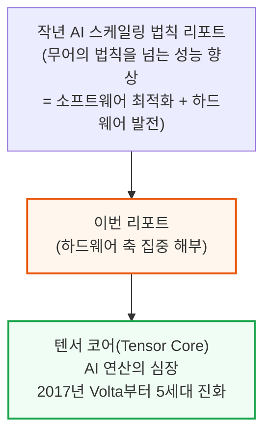
```mermaid
flowchart TD
    Prev["작년 AI 스케일링 법칙 리포트<br/>(무어의 법칙을 넘는 성능 향상<br/>= 소프트웨어 최적화 + 하드웨어 발전)"] --> This["이번 리포트<br/>(하드웨어 축 집중 해부)"]
    This --> TC["텐서 코어(Tensor Core)<br/>AI 연산의 심장<br/>2017년 Volta부터 5세대 진화"]

    style This fill:#fff7ed,stroke:#ea580c,stroke-width:2px
    style TC fill:#f0fdf4,stroke:#16a34a,stroke-width:2px
```

이 리포트가 다루는 범위는 다음과 같습니다.
- 성능 공학의 기본 원칙(Amdahl의 법칙, 스케일링, 데이터 이동)
- Volta부터 Blackwell까지 5세대 텐서 코어 아키텍처의 핵심 변화와 그 동기
- CUDA 프로그래밍 모델이 텐서 코어 발전에 맞춰 어떻게 함께 진화했는지

CUDA·GPU 아키텍처에 대한 기초 지식이 없으면 일부 설명이 어려울 수 있으나, 이 리포트는 처음 접하는 개념도 가능한 한 비유와 그림으로 풀어 설명합니다.

---

## 2. 성능 공학의 기본 원칙: Amdahl의 법칙과 데이터 이동

**📌 핵심:**
- Amdahl의 법칙: 문제 크기가 고정된 상태에서는 컴퓨팅 자원(GPU 코어 수 등)을 아무리 늘려도 속도 향상에 한계가 있음 — 병렬화가 안 되는 직렬 구간의 실행 시간이 전체 속도 향상의 상한선을 결정
- 강한 스케일링(같은 작업을 자원만 늘려 더 빨리 끝내기)과 약한 스케일링(자원을 늘린 만큼 더 큰 작업을 처리하기)은 서로 다른 성능 개선 곡선을 그림 — 이 구분이 이후 텐서 코어·CUDA 프로그래밍 모델 설계 전체를 관통하는 핵심 축
- 데이터 이동은 GPU 설계자들이 "죄악"이라 부를 만큼 비쌈 — 트랜지스터 연산은 1나노초 미만인데 D램 접근은 수십 나노초 걸려, 계산 자체보다 데이터를 옮기는 데 시간·에너지가 훨씬 많이 소모됨(메모리 벽)
- 결론: 이 세 가지 원칙이 이후 모든 텐서 코어 세대의 설계 변화(코어 크기 확대, 메모리 계층 신설, 비동기 실행 확대)를 관통하는 이론적 뼈대

---

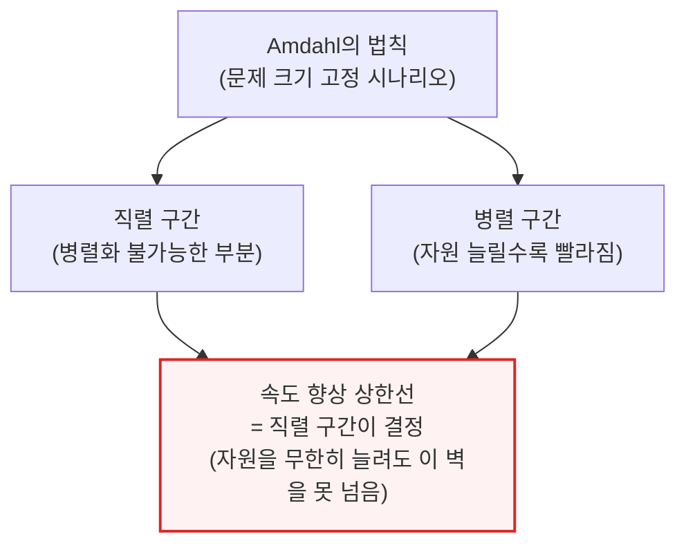
```mermaid
flowchart TD
    Fixed["Amdahl의 법칙<br/>(문제 크기 고정 시나리오)"] --> Serial["직렬 구간<br/>(병렬화 불가능한 부분)"]
    Fixed --> Parallel["병렬 구간<br/>(자원 늘릴수록 빨라짐)"]
    Serial --> Limit["속도 향상 상한선<br/>= 직렬 구간이 결정<br/>(자원을 무한히 늘려도 이 벽을 못 넘음)"]
    Parallel --> Limit

    style Limit fill:#fef2f2,stroke:#dc2626,stroke-width:2px
```

강한 스케일링과 약한 스케일링은 GPU 코어 수를 늘렸을 때 어떤 방식으로 성능이 개선되는지를 구분하는 개념입니다.

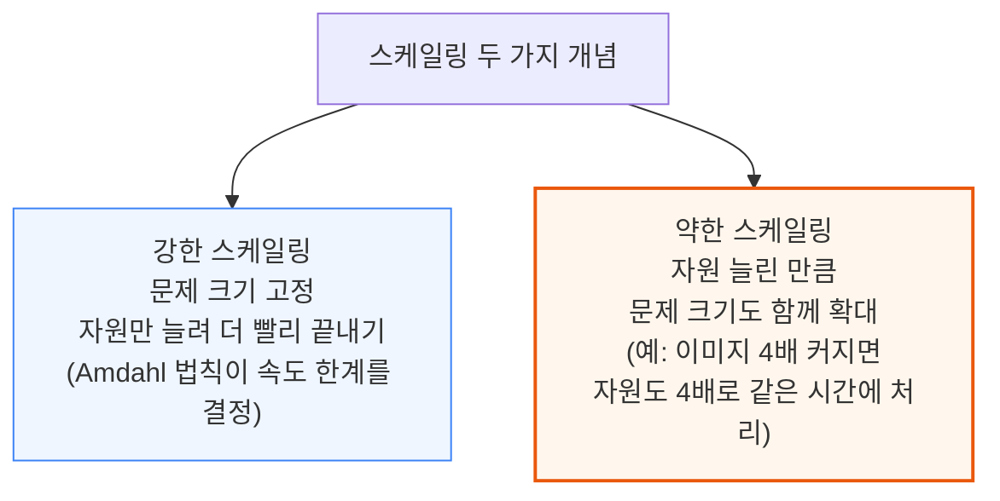
```mermaid
flowchart TD
    Concept["스케일링 두 가지 개념"] --> Strong["강한 스케일링<br/>문제 크기 고정<br/>자원만 늘려 더 빨리 끝내기<br/>(Amdahl 법칙이 속도 한계를 결정)"]
    Concept --> Weak["약한 스케일링<br/>자원 늘린 만큼<br/>문제 크기도 함께 확대<br/>(예: 이미지 4배 커지면<br/>자원도 4배로 같은 시간에 처리)"]

    style Strong fill:#eff6ff,stroke:#3b82f6
    style Weak fill:#fff7ed,stroke:#ea580c,stroke-width:2px
```

강한 스케일링은 문제 크기와 무관하게 항상 속도가 빨라지지만, 약한 스케일링은 "자원을 늘린 만큼 더 큰 문제를 푼다"는 조건에서만 성능 향상이 보장됩니다.

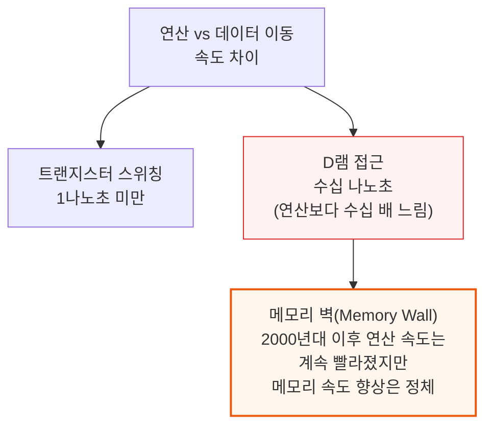
```mermaid
flowchart TD
    Compare["연산 vs 데이터 이동<br/>속도 차이"] --> Compute["트랜지스터 스위칭<br/>1나노초 미만"]
    Compare --> Memory["D램 접근<br/>수십 나노초<br/>(연산보다 수십 배 느림)"]
    Memory --> Wall["메모리 벽(Memory Wall)<br/>2000년대 이후 연산 속도는<br/>계속 빨라졌지만<br/>메모리 속도 향상은 정체"]

    style Memory fill:#fef2f2,stroke:#dc2626
    style Wall fill:#fff7ed,stroke:#ea580c,stroke-width:2px
```

**📌 용어 풀이: 데이터 이동이 "죄악"인 이유**
> - 연산(계산)은 저렴하고 데이터 이동은 비싸다는 것이 GPU 설계의 대전제 — 최신 트랜지스터는 1나노초도 안 걸려 스위칭하지만, D램 셀 접근에는 수십 나노초가 걸림
> - 2000년대 이후 연산 속도 향상은 계속 둔화됐지만, 메모리 속도 향상은 그보다도 더 느려 격차(메모리 벽)가 점점 벌어지는 중
> - 이 때문에 GPU 설계자들은 "얼마나 빨리 계산하는가"보다 "얼마나 데이터 이동을 줄이는가"에 갈수록 더 공을 들이게 됨 — 뒤에 나올 텐서 코어의 메모리 계층 신설(공유메모리·TMEM 등)이 모두 이 원칙에서 출발

---

## 3. 텐서 코어 이전: CUDA 프로그래밍 모델의 기초

**📌 핵심:**
- PTX(병렬 스레드 실행)는 GPU 세대가 바뀌어도 같은 프로그램이 그대로 동작하도록 해주는 가상 명령어 집합 — 실제 하드웨어에 종속되지 않는 중간 언어 역할
- GPU 하드웨어는 SM(스트리밍 멀티프로세서) 여러 개로 구성되고, 스레드 32개를 워프(Warp)라는 단위로 묶어 한 번에 같은 명령어를 실행하는 "SIMT" 방식으로 동작
- PTX 밑에는 SASS라는 아키텍처별 실제 명령어 집합이 있는데, Nvidia가 경쟁사에 설계 노하우를 숨기려고 상세 문서화를 거의 하지 않아 외부에 잘 알려지지 않음
- 결론: 이후 모든 텐서 코어 세대 변화는 이 PTX↔SASS 2계층 구조, 그리고 SM·워프·CTA(협력 스레드 배열)라는 스레드 위계 안에서 일어남 — 이 기본 틀을 알아야 세대별 차이가 왜 생겼는지 이해 가능

---

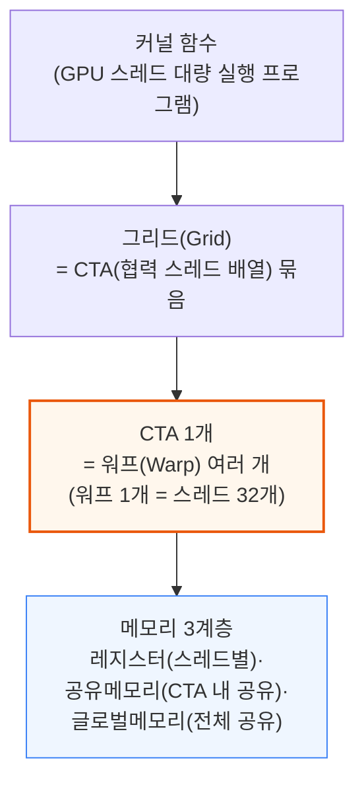
```mermaid
flowchart TD
    Kernel["커널 함수<br/>(GPU 스레드 대량 실행 프로그램)"] --> Grid["그리드(Grid)<br/>= CTA(협력 스레드 배열) 묶음"]
    Grid --> CTA["CTA 1개<br/>= 워프(Warp) 여러 개<br/>(워프 1개 = 스레드 32개)"]
    CTA --> Mem["메모리 3계층<br/>레지스터(스레드별)·<br/>공유메모리(CTA 내 공유)·<br/>글로벌메모리(전체 공유)"]

    style CTA fill:#fff7ed,stroke:#ea580c,stroke-width:2px
    style Mem fill:#eff6ff,stroke:#3b82f6
```

SM은 여러 개의 스칼라 연산 코어(CUDA 코어), 스레드를 관리하는 명령어 유닛, 칩 내장 공유 메모리로 구성됩니다. 명령어 유닛이 워프 하나를 골라 그 워프에 속한 32개 스레드 전체에 같은 명령어를 동시에 내리는 방식이 SIMT(단일 명령어, 다중 스레드)입니다.

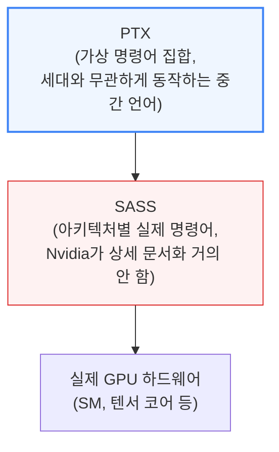
```mermaid
flowchart TD
    PTX["PTX<br/>(가상 명령어 집합,<br/>세대와 무관하게 동작하는 중간 언어)"] --> SASS["SASS<br/>(아키텍처별 실제 명령어,<br/>Nvidia가 상세 문서화 거의 안 함)"]
    SASS --> HW["실제 GPU 하드웨어<br/>(SM, 텐서 코어 등)"]

    style PTX fill:#eff6ff,stroke:#3b82f6,stroke-width:2px
    style SASS fill:#fef2f2,stroke:#dc2626
```

**📌 용어 풀이: SIMT와 SIMD의 차이**
> - SIMD(단일 명령어, 다중 데이터)는 한 명령어로 여러 데이터를 동시에 처리하되, 벡터 폭(한 번에 몇 개를 처리할지)을 프로그래머가 직접 지정
> - SIMT(단일 명령어, 다중 스레드)는 벡터 폭 대신 "스레드 하나가 어떻게 동작하는지"만 지정하고, 나머지 병렬 처리는 하드웨어(워프 스케줄러)가 알아서 관리
> - 이 차이 덕분에 CUDA 프로그래밍은 SIMD보다 직관적인 "스레드 단위 사고"로 병렬 프로그램을 짤 수 있음

---

## 4. Volta: 텐서 코어의 탄생 (1세대)

**📌 핵심:**
- 2015년 Google이 자체 딥러닝 전용 칩(TPUv1)을 배치하며 업계에 충격을 준 이후, Nvidia도 2017년 행렬 연산 전용 하드웨어를 최초로 GPU에 탑재 — 개발 막바지(테이프아웃 몇 개월 전)에 급하게 추가될 만큼 시급한 결정이었음
- GPU가 명령어 하나를 처리하는 데 드는 전력(약 30pJ)이 단순 연산 자체(약 1.5pJ)보다 20배나 커서, 단순 연산을 잔뜩 반복하는 방식은 전력 낭비 — 명령어 1개로 훨씬 많은 연산을 처리하는 전용 명령어(HMMA)가 필요했음
- 이렇게 탄생한 1세대 텐서 코어는 V100 SM 1개당 8개 탑재, 코어 1개가 사이클당 4×4×4 행렬곱(SM 전체로는 사이클당 1,024 FLOPs)을 처리 — 스레드 8개(쿼드페어)가 함께 참여해 8×8×4 크기 연산을 수행
- 결론: 텐서 코어의 근본 존재 이유는 "명령어 오버헤드 대비 실제 연산량을 늘려 전력 효율을 높이는 것" — 이후 모든 세대의 진화(코어 크기 확대, 연산 참여 스레드 확대)가 이 방향의 연장선

---

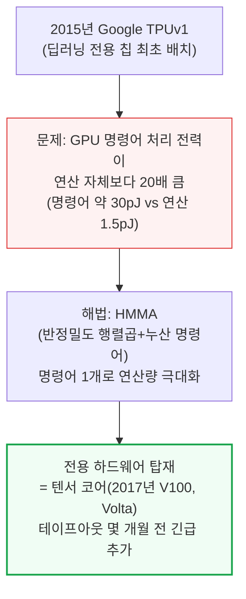
```mermaid
flowchart TD
    Trend["2015년 Google TPUv1<br/>(딥러닝 전용 칩 최초 배치)"] --> Problem["문제: GPU 명령어 처리 전력이<br/>연산 자체보다 20배 큼<br/>(명령어 약 30pJ vs 연산 1.5pJ)"]
    Problem --> Solution["해법: HMMA<br/>(반정밀도 행렬곱+누산 명령어)<br/>명령어 1개로 연산량 극대화"]
    Solution --> V100["전용 하드웨어 탑재<br/>= 텐서 코어(2017년 V100, Volta)<br/>테이프아웃 몇 개월 전 긴급 추가"]

    style Problem fill:#fef2f2,stroke:#dc2626
    style V100 fill:#f0fdf4,stroke:#16a34a,stroke-width:2px
```

MMA(곱셈+누적) 명령어는 D = A×B+C 형태의 행렬 연산을 한 번에 수행합니다. A는 M×K, B는 K×N, C·D는 M×N 크기 행렬이며, 이 크기를 `MxNxK` 표기로 나타냅니다. 연산 순서는 다음과 같습니다.

- 공유메모리에서 A·B·C 행렬을 스레드 레지스터로 로드(각 스레드가 행렬의 일부 조각을 보유)
- MMA 명령어 실행 — 레지스터에서 값을 읽어 텐서 코어에서 계산 후 결과를 다시 레지스터에 저장
- 레지스터의 결과를 공유메모리로 다시 저장

이 전 과정은 여러 스레드가 협력해서 수행하므로, 매 단계마다 스레드 간 동기화가 필요합니다.

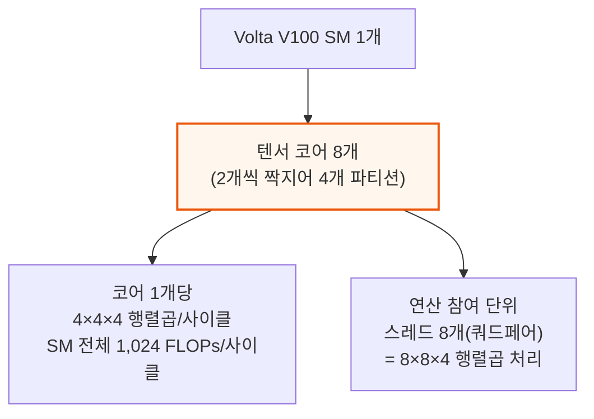
```mermaid
flowchart TD
    V100SM["Volta V100 SM 1개"] --> TC["텐서 코어 8개<br/>(2개씩 짝지어 4개 파티션)"]
    TC --> Perf["코어 1개당<br/>4×4×4 행렬곱/사이클<br/>SM 전체 1,024 FLOPs/사이클"]
    TC --> Thread["연산 참여 단위<br/>스레드 8개(쿼드페어)<br/>= 8×8×4 행렬곱 처리"]

    style TC fill:#fff7ed,stroke:#ea580c,stroke-width:2px
```

Volta 텐서 코어는 FP16(16비트 부동소수점) 입력을 FP32(32비트)로 누적하는 "혼합 정밀도" 방식을 지원합니다. 이 방식으로 정밀도를 낮춰도 모델 정확도 손실 없이 학습할 수 있음이 처음 입증됐습니다.

---

## 5. Turing: 2세대 텐서 코어와 정수 연산

**📌 핵심:**
- Turing(2018)은 텐서 코어 2세대 — Volta 대비 INT8·INT4 저정밀 정수 연산을 새로 지원해 추론(inference) 특화 성능을 강화
- 새로운 워프 단위 동기식 MMA(warp-level synchronous MMA) 방식을 도입 — 이후 3세대(Ampere)에서 본격 확장되는 "워프 전체가 함께 연산에 참여" 방식의 출발점
- 텐서 코어가 게임 그래픽에도 처음 활용돼 DLSS(딥러닝 슈퍼샘플링, 저해상도 이미지를 AI로 고해상도처럼 보이게 하는 기술)가 탄생 — AI 연산 하드웨어가 소비자 제품까지 확장된 시초
- 결론: Turing은 스펙 자체보다 "정수 연산 지원 확대"와 "워프 단위 MMA로의 전환 시작"이라는 방법론적 전환점으로서 의미가 큼

---

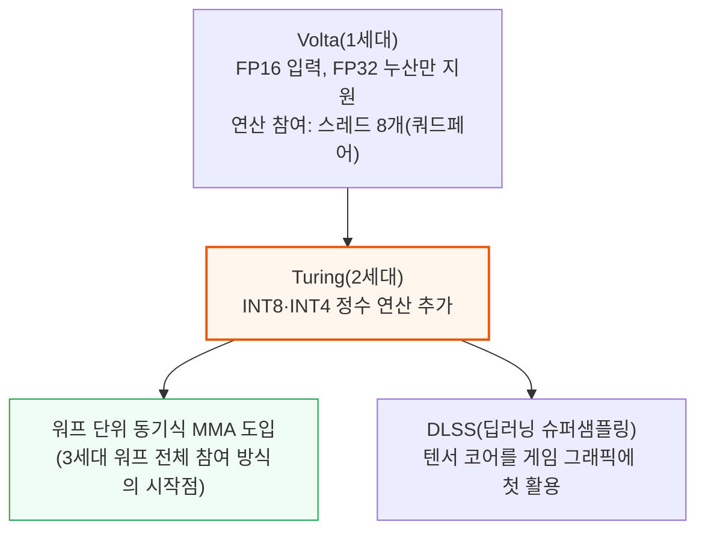
```mermaid
flowchart TD
    Volta1["Volta(1세대)<br/>FP16 입력, FP32 누산만 지원<br/>연산 참여: 스레드 8개(쿼드페어)"] --> Turing2["Turing(2세대)<br/>INT8·INT4 정수 연산 추가"]
    Turing2 --> New["워프 단위 동기식 MMA 도입<br/>(3세대 워프 전체 참여 방식의 시작점)"]
    Turing2 --> DLSS["DLSS(딥러닝 슈퍼샘플링)<br/>텐서 코어를 게임 그래픽에 첫 활용"]

    style Turing2 fill:#fff7ed,stroke:#ea580c,stroke-width:2px
    style New fill:#f0fdf4,stroke:#16a34a
```

---

## 6. Ampere: 3세대 텐서 코어와 비동기 데이터 복사

**📌 핵심:**
- Ampere(2020)는 텐서 코어 3세대 — SM 1개당 코어 수는 4개로 Volta(8개)의 절반이지만, 코어 1개당 처리량(512 FLOPs/사이클)이 늘어 SM 전체로는 2,048 FLOPs/사이클(Volta 대비 2배)
- 연산 참여 단위가 스레드 8개(쿼드페어)에서 워프 전체(32개)로 확대 — 스레드 배치가 단순해지고 레지스터 압박도 줄어듦
- **비동기 데이터 복사** 신설 — 기존에는 데이터를 글로벌메모리→레지스터→공유메모리 2단계로 옮겨야 했는데, 이 과정이 MMA 연산과 레지스터를 두고 경합해 병목이 됐음. Ampere는 레지스터를 거치지 않고 글로벌메모리에서 공유메모리로 직접 데이터를 옮겨, 레지스터를 MMA 연산에 더 많이 쓸 수 있게 함
- 결론: Ampere는 순수 연산 성능(2배)뿐 아니라, 데이터 이동과 연산을 동시에 진행할 수 있는 비동기 실행의 첫걸음을 뗀 세대 — 이후 세대일수록 이 "비동기화" 흐름이 더 강화됨

---

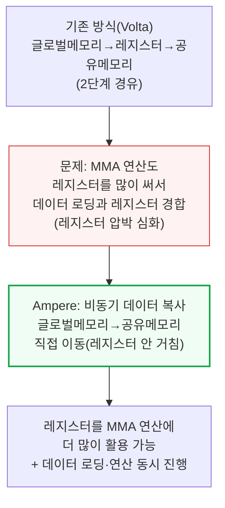
```mermaid
flowchart TD
    OldWay["기존 방식(Volta)<br/>글로벌메모리→레지스터→공유메모리<br/>(2단계 경유)"] --> Problem["문제: MMA 연산도<br/>레지스터를 많이 써서<br/>데이터 로딩과 레지스터 경합<br/>(레지스터 압박 심화)"]
    Problem --> New["Ampere: 비동기 데이터 복사<br/>글로벌메모리→공유메모리<br/>직접 이동(레지스터 안 거침)"]
    New --> Benefit["레지스터를 MMA 연산에<br/>더 많이 활용 가능<br/>+ 데이터 로딩·연산 동시 진행"]

    style Problem fill:#fef2f2,stroke:#dc2626
    style New fill:#f0fdf4,stroke:#16a34a,stroke-width:2px
```

비동기 데이터 복사는 PTX 명령어 `cp.async`로 구현되며, 실제로는 SASS 명령어 `LDGSTS`(글로벌→공유메모리 비동기 복사)로 번역됩니다.

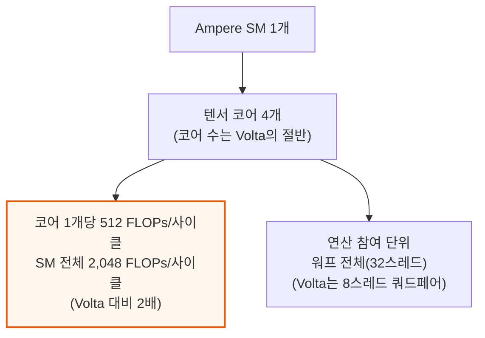
```mermaid
flowchart TD
    AmpereSM["Ampere SM 1개"] --> TC["텐서 코어 4개<br/>(코어 수는 Volta의 절반)"]
    TC --> Perf["코어 1개당 512 FLOPs/사이클<br/>SM 전체 2,048 FLOPs/사이클<br/>(Volta 대비 2배)"]
    TC --> Thread["연산 참여 단위<br/>워프 전체(32스레드)<br/>(Volta는 8스레드 쿼드페어)"]

    style Perf fill:#fff7ed,stroke:#ea580c,stroke-width:2px
```

Ampere는 `ldmatrix`(워프 단위로 여러 스레드가 함께 행렬을 로드하는 명령어)도 새로 도입했습니다. 개별 로드 명령어를 여러 번 내리는 대신 한 번에 처리해, 주소 계산용 레지스터 사용을 줄이고 프로그래밍도 단순해졌습니다.

**📌 용어 풀이: BF16이 대세가 된 이유**
> - FP32(32비트)는 지수 8비트+가수 23비트, FP16(16비트)은 지수 5비트+가수 10비트로 구성돼 표현 범위(다이나믹 레인지)가 FP32보다 훨씬 좁음
> - Ampere가 지원한 BF16은 지수 8비트(FP32와 동일)+가수 7비트로 설계돼, FP32 수준의 표현 범위를 절반 크기(16비트)로 담아냄
> - 표현 범위가 좁으면 학습 중 숫자가 너무 크거나 작아져 깨지는 문제가 잦은데, BF16은 FP32와 같은 범위를 써서 "로스 스케일링"이라는 별도 보정 기법 없이도 안정적으로 학습 가능 — 이후 BF16이 절반 정밀도의 사실상 표준으로 자리잡음

---

## 7. Hopper: 4세대 텐서 코어와 TMA

**📌 핵심:**
- Hopper(2022)는 텐서 코어 4세대 — SM 개수가 계속 늘어나며 SM 하나와 GPU 전체 사이 크기 격차가 커지자, 중간 단계로 **스레드 블록 클러스터**라는 새 계층을 신설해 물리적으로 인접한 SM 묶음을 직접 제어할 수 있게 함
- **TMA(텐서 메모리 가속기)**를 SM마다 신설 — 대용량 데이터를 글로벌메모리↔공유메모리 사이에서 스레드 1개만으로 자동 이동시켜 나머지 스레드는 다른 작업에 쓸 수 있게 함(다만 작은 단위 전송에는 주소 계산 오버헤드로 오히려 손해)
- 4세대 MMA(`wgmma`)는 연산 참여 단위를 워프 128개 스레드(워프그룹, 워프 4개)로 재확대 — 더 넓은 행렬 크기를 지원하고, 피연산자 B를 레지스터가 아닌 공유메모리에서 직접 읽어 레지스터 공간을 절약
- 결론: Hopper는 FP8(8비트, E4M3·E5M2) 정밀도까지 지원을 넓혔지만, 실제 누적 연산은 32비트가 아닌 22비트 고정소수점으로 처리돼 정확도 한계가 있어 일정 주기마다 CUDA 코어에서 별도로 정밀 누적을 보정해야 함

---

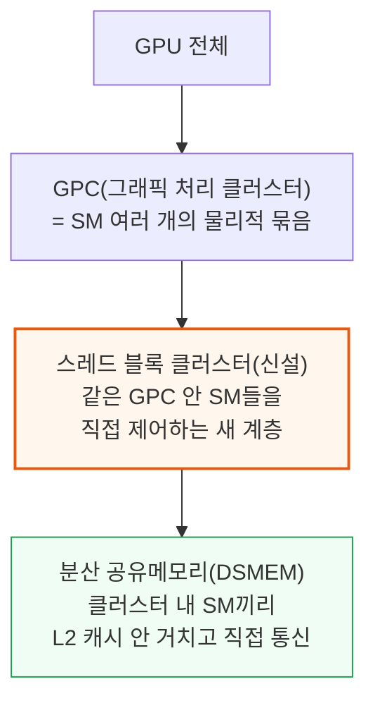
```mermaid
flowchart TD
    GPU["GPU 전체"] --> GPC["GPC(그래픽 처리 클러스터)<br/>= SM 여러 개의 물리적 묶음"]
    GPC --> Cluster["스레드 블록 클러스터(신설)<br/>같은 GPC 안 SM들을<br/>직접 제어하는 새 계층"]
    Cluster --> DSMEM["분산 공유메모리(DSMEM)<br/>클러스터 내 SM끼리<br/>L2 캐시 안 거치고 직접 통신"]

    style Cluster fill:#fff7ed,stroke:#ea580c,stroke-width:2px
    style DSMEM fill:#f0fdf4,stroke:#16a34a
```

스레드 블록 클러스터 안의 CTA들은 같은 GPC의 SM에 반드시 함께 배치되며, 기본적으로 SM 하나당 CTA 하나씩 할당됩니다. 이 SM들의 공유메모리를 하나로 묶은 것이 분산 공유메모리(DSMEM)이며, GPC라는 하드웨어 단위를 프로그래밍 모델에 노출함으로써 데이터 이동을 줄이고 지역성을 높일 수 있습니다.

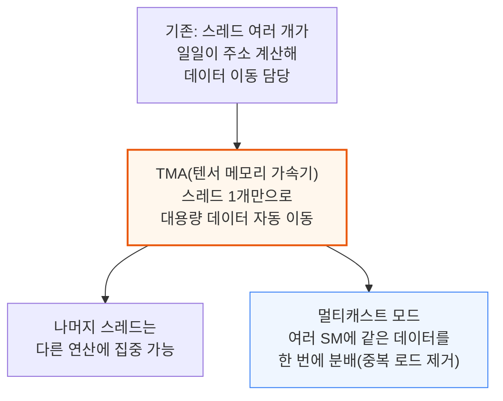
```mermaid
flowchart TD
    Old["기존: 스레드 여러 개가<br/>일일이 주소 계산해<br/>데이터 이동 담당"] --> TMA["TMA(텐서 메모리 가속기)<br/>스레드 1개만으로<br/>대용량 데이터 자동 이동"]
    TMA --> Free["나머지 스레드는<br/>다른 연산에 집중 가능"]
    TMA --> Multi["멀티캐스트 모드<br/>여러 SM에 같은 데이터를<br/>한 번에 분배(중복 로드 제거)"]

    style TMA fill:#fff7ed,stroke:#ea580c,stroke-width:2px
    style Multi fill:#eff6ff,stroke:#3b82f6
```

**📌 용어 풀이: TMA가 항상 유리하지는 않은 이유**
> - TMA는 작은 단위 데이터를 옮길 때는 주소 계산 오버헤드 때문에 오히려 기존 비동기 복사보다 지연시간이 김 — Nvidia도 대용량 복사에만 TMA를 쓰라고 권장
> - 예를 들어 LLM 추론에서 KV 캐시(대화 맥락 저장 데이터)를 아주 작은 단위로 나눠 옮길 때는 TMA가 부적합하고, 각 조각이 16바이트의 배수일 때는 잘 작동
> - 멀티캐스트 모드는 클러스터 내 여러 CTA가 같은 데이터의 일부씩만 불러와 DSMEM으로 나눠 공유하는 방식 — 같은 데이터를 여러 SM에 중복으로 불러오는 대신 한 번에 처리해 L2 캐시·HBM 트래픽을 줄임

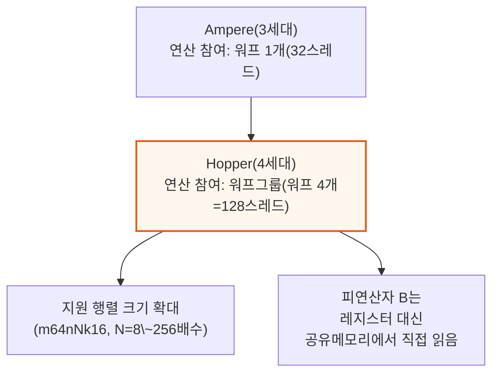
```mermaid
flowchart TD
    Ampere3["Ampere(3세대)<br/>연산 참여: 워프 1개(32스레드)"] --> Hopper4["Hopper(4세대)<br/>연산 참여: 워프그룹(워프 4개=128스레드)"]
    Hopper4 --> Shape["지원 행렬 크기 확대<br/>(m64nNk16, N=8\~256배수)"]
    Hopper4 --> Mem["피연산자 B는<br/>레지스터 대신<br/>공유메모리에서 직접 읽음"]

    style Hopper4 fill:#fff7ed,stroke:#ea580c,stroke-width:2px
```

**📌 용어 풀이: Hopper의 FP8 정밀도 손실**
> - Hopper는 8비트 부동소수점(E4M3·E5M2) 데이터 타입을 새로 지원하며 명목상 FP32(32비트)로 결과를 누적한다고 소개됐지만, 실제로는 22비트 고정소수점(가수 13비트+부호·지수) 방식으로 구현돼 진짜 32비트보다 표현 범위가 좁음
> - 이 때문에 일정 횟수(N_c회)만큼 누적할 때마다 CUDA 코어에서 별도로 정밀 누적을 보정해야 학습 정확도가 무너지지 않음 — 효율은 높아지지만 정확도 관리 부담이 함께 늘어나는 트레이드오프

---

## 8. Blackwell: 5세대 텐서 코어와 텐서 전용 메모리

**📌 핵심:**
- Blackwell(2024)은 텐서 코어 5세대 — Hopper에서도 남아있던 레지스터 압박 문제를 풀기 위해 텐서 코어 전용 메모리(**TMEM**, SM당 256KB)를 신설, 레지스터 파일과 별도로 텐서 코어 바로 옆에 배치해 전력 효율까지 높임
- 5세대 MMA(`tcgen05.mma`)는 레지스터를 아예 쓰지 않고 피연산자를 전부 공유메모리·TMEM에 둠 — 또한 워프그룹이 아닌 스레드 1개만으로 연산을 시작할 수 있어, 워프라는 개념 자체가 MMA 발동 과정에서 빠짐
- **MMA.2SM**(SM 2개 협력 연산)은 **CTA 페어**(같은 클러스터 안 SM 2개 짝) 단위로 동작해 피연산자를 절반씩 나눠 불러오는 방식으로 메모리 부담을 줄임 — 이런 SM 간 데이터 공유가 공유메모리 용량·대역폭 요구량을 낮춤
- 결론: 데이터 타입도 MXFP8·MXFP6·MXFP4와 Nvidia 자체 NVFP4까지 지원을 넓힘 — 저정밀 포맷일수록 실리콘 면적·전력을 아끼고 처리량을 높이지만, 정확도 관리 난도가 함께 올라감

---

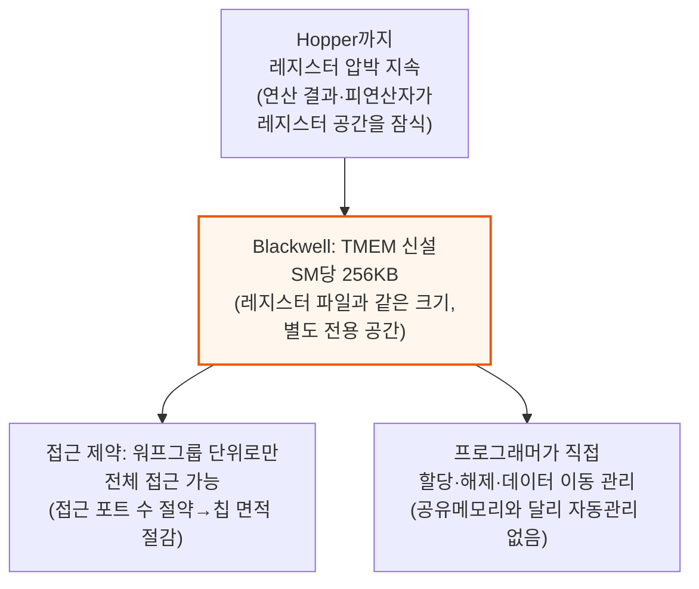
```mermaid
flowchart TD
    Hopper["Hopper까지<br/>레지스터 압박 지속<br/>(연산 결과·피연산자가<br/>레지스터 공간을 잠식)"] --> TMEM["Blackwell: TMEM 신설<br/>SM당 256KB<br/>(레지스터 파일과 같은 크기,<br/>별도 전용 공간)"]
    TMEM --> Rule["접근 제약: 워프그룹 단위로만<br/>전체 접근 가능<br/>(접근 포트 수 절약→칩 면적 절감)"]
    TMEM --> Manual["프로그래머가 직접<br/>할당·해제·데이터 이동 관리<br/>(공유메모리와 달리 자동관리 없음)"]

    style TMEM fill:#fff7ed,stroke:#ea580c,stroke-width:2px
```

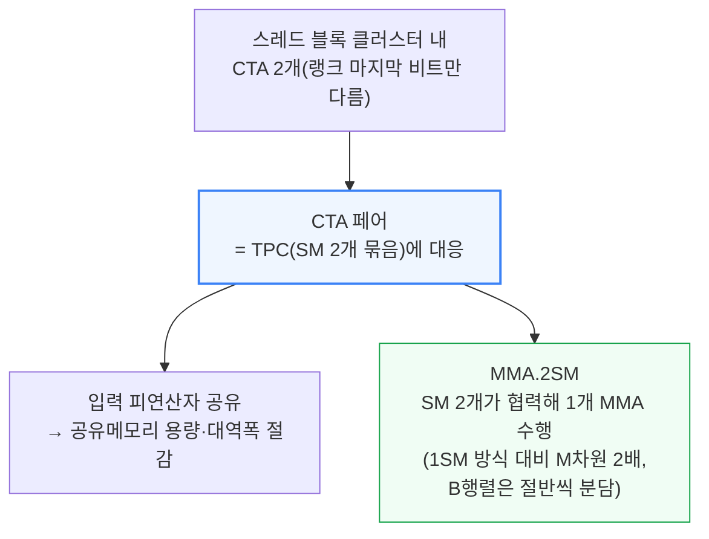
```mermaid
flowchart TD
    Cluster["스레드 블록 클러스터 내<br/>CTA 2개(랭크 마지막 비트만 다름)"] --> Pair["CTA 페어<br/>= TPC(SM 2개 묶음)에 대응"]
    Pair --> Share["입력 피연산자 공유<br/>→ 공유메모리 용량·대역폭 절감"]
    Pair --> MMA2SM["MMA.2SM<br/>SM 2개가 협력해 1개 MMA 수행<br/>(1SM 방식 대비 M차원 2배,<br/>B행렬은 절반씩 분담)"]

    style Pair fill:#eff6ff,stroke:#3b82f6,stroke-width:2px
    style MMA2SM fill:#f0fdf4,stroke:#16a34a
```

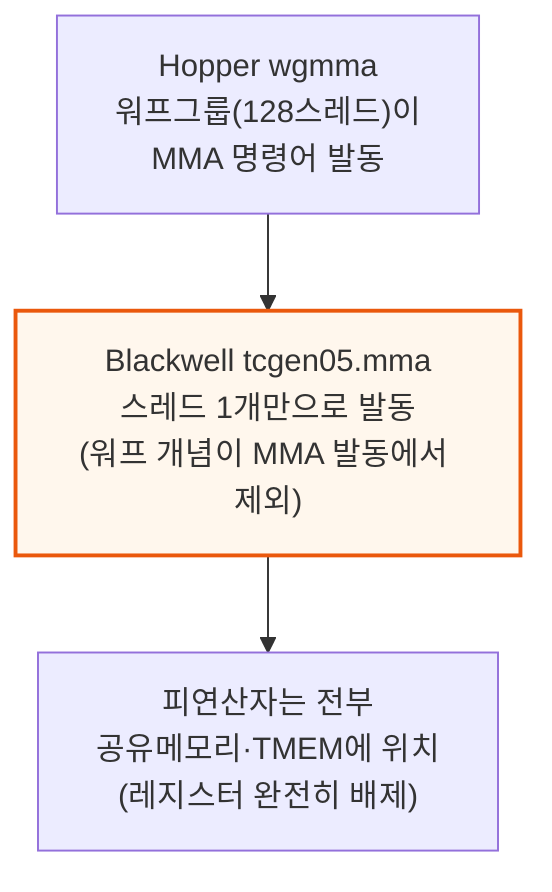
```mermaid
flowchart TD
    Wgmma["Hopper wgmma<br/>워프그룹(128스레드)이<br/>MMA 명령어 발동"] --> Tcgen["Blackwell tcgen05.mma<br/>스레드 1개만으로 발동<br/>(워프 개념이 MMA 발동에서 제외)"]
    Tcgen --> NoReg["피연산자는 전부<br/>공유메모리·TMEM에 위치<br/>(레지스터 완전히 배제)"]

    style Tcgen fill:#fff7ed,stroke:#ea580c,stroke-width:2px
```

5세대 텐서 코어는 일반 행렬곱뿐 아니라 합성곱(convolution) 연산도 수행할 수 있으며, `tcgen05.mma`는 피연산자 B를 재사용할 수 있도록 캐싱해두는 "가중치 고정(weight stationary)" 패턴도 지원합니다.

**📌 용어 풀이: 데이터 타입 확장(MXFP·NVFP4)**
> - MXFP8·MXFP6·MXFP4는 업계 표준 "마이크로스케일링" 저정밀 포맷, Nvidia의 NVFP4는 자체 규격으로 더 작은 블록 크기·다른 스케일링 방식·2단계 양자화를 적용해 MXFP4보다 정확도가 높음
> - FP8과 FP6은 Blackwell에서 이론적 처리량이 같아 물리적으로 같은 회로를 공유하는 것으로 추정 — 반면 AMD CDNA4는 FP6이 FP4와 회로를 공유해 FP8 대비 처리량이 2배
> - 저정밀 포맷일수록 실리콘 면적·전력은 아끼지만, 표현할 수 있는 값의 범위·정밀도가 줄어 모델 정확도 관리가 더 까다로워짐

---

## 9. 곁다리 이야기: 구조적 희소성이 약속을 못 지킨 이유

**📌 핵심:**
- Ampere가 도입한 "2:4 구조적 희소성"(값 4개 중 2개를 0으로 만들어 계산량을 이론상 절반으로 줄이는 기법)은 마케팅상 2배 속도 향상을 약속했지만, 실제 GEMM(행렬곱) 커널에서는 밀집 연산 대비 2배에 근접한 성능을 낸 사례가 거의 없음
- 원인은 세 가지 — ① 모델 정확도를 유지하면서 구조적 가지치기를 하기가 어렵고, ② 관련 소프트웨어(cuSPARSELt 커널)가 최적화 부족, ③ 발열(TDP) 제약까지 겹침 — 중국계 AI 랩 일부와 제한적인 서구 연구 사례를 빼면 대부분의 AI 랩은 실전 추론에 이 기법 대신 양자화·증류를 선호
- 이런 저조한 실적에도 Nvidia는 5세대(Blackwell)에서 NVFP4용 "페어와이즈 4:8 구조적 희소성"을 새로 도입 — 8개 값을 4쌍으로 묶어 정확히 2쌍만 0이 아닌 값을 갖도록 제약, 얼핏 더 느슨해 보이지만 실제로는 정확도를 지키기 더 까다로운 조건
- 결론: SemiAnalysis는 Nvidia가 최신 오픈모델(예: DeepSeek)에서 구조적 희소성이 양자화·증류와 함께 실제 성능을 낼 수 있음을 입증하기 전까지는, 키노트·마케팅 자료에서 구조적 희소성 기반 FLOPS 수치를 내세우는 것을 자제해야 한다고 지적

---

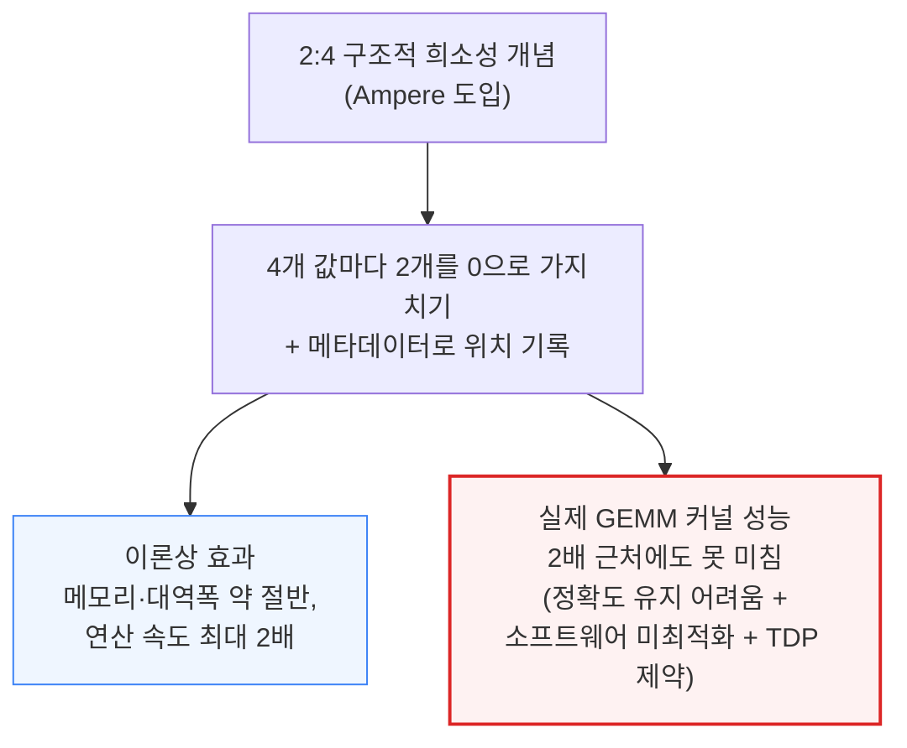
```mermaid
flowchart TD
    Concept["2:4 구조적 희소성 개념<br/>(Ampere 도입)"] --> Prune["4개 값마다 2개를 0으로 가지치기<br/>+ 메타데이터로 위치 기록"]
    Prune --> Theory["이론상 효과<br/>메모리·대역폭 약 절반,<br/>연산 속도 최대 2배"]
    Prune --> Reality["실제 GEMM 커널 성능<br/>2배 근처에도 못 미침<br/>(정확도 유지 어려움 +<br/>소프트웨어 미최적화 + TDP 제약)"]

    style Theory fill:#eff6ff,stroke:#3b82f6
    style Reality fill:#fef2f2,stroke:#dc2626,stroke-width:2px
```

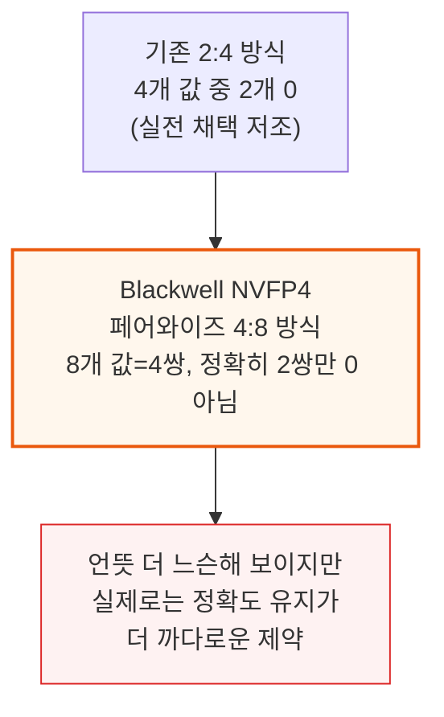
```mermaid
flowchart TD
    Old24["기존 2:4 방식<br/>4개 값 중 2개 0<br/>(실전 채택 저조)"] --> New48["Blackwell NVFP4<br/>페어와이즈 4:8 방식<br/>8개 값=4쌍, 정확히 2쌍만 0 아님"]
    New48 --> Caveat["언뜻 더 느슨해 보이지만<br/>실제로는 정확도 유지가<br/>더 까다로운 제약"]

    style New48 fill:#fff7ed,stroke:#ea580c,stroke-width:2px
    style Caveat fill:#fef2f2,stroke:#dc2626
```

Meta는 Llama 모델에 2:4 구조적 희소성을 실험하고 있지만, 많은 경우 실전 배치까지 이어지지 못하는 "막다른 길"로 평가됩니다. SemiAnalysis는 Nvidia에게 실제 최신 오픈모델(예: DeepSeek)에 구조적 희소성을 적용해 양자화·증류 같은 다른 기법과 함께 성능이 실제로 쌓이는지 먼저 입증해야 한다고 권고합니다.

---

## 10. 텐서 코어 진화의 3대 트렌드: 코어 크기, 메모리, 데이터 타입

**📌 핵심:**
- Nvidia는 세대를 거치며 텐서 코어 **개수보다 코어 1개의 크기**를 더 공격적으로 키워옴 — 문제 크기가 커질수록 연산량은 세제곱으로, 데이터 이동량은 제곱으로 늘어 연산집약도가 선형으로 상승하는데, 데이터 이동이 연산보다 훨씬 비싸므로 이 흐름을 활용하는 코어 크기 확대가 유리했기 때문
- **공유메모리는 세대마다 커졌지만 레지스터 파일 크기는 그대로** — 텐서 코어 처리량이 세대마다 2배씩 늘어나는데 글로벌메모리 접근 지연시간은 줄지 않아, 데이터를 미리 채워둘 "스테이징 버퍼"가 더 커져야 했고 Nvidia는 이 역할을 공유메모리에 맡김(레지스터가 아님)
- **데이터 타입도 16비트에서 4비트까지 계속 저정밀화** — 딥러닝 연산은 저정밀에 강하고(특히 추론), 저정밀일수록 실리콘 면적·전력을 아끼며 처리량도 높일 수 있기 때문. 반대로 FP64(고정밀) 지원은 신세대일수록 축소
- 결론: 세 가지 흐름(코어 크기 확대, 메모리 계층 재편, 데이터 저정밀화) 모두 "데이터 이동은 비싸다"는 1대 원칙(2장)에서 갈라져 나온 결과이며, Blackwell의 TMEM 신설이 이 세 흐름의 정점

---

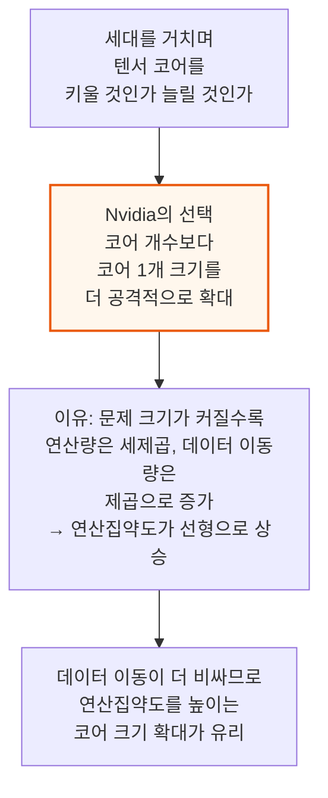
```mermaid
flowchart TD
    Choice["세대를 거치며<br/>텐서 코어를<br/>키울 것인가 늘릴 것인가"] --> Size["Nvidia의 선택<br/>코어 개수보다<br/>코어 1개 크기를<br/>더 공격적으로 확대"]
    Size --> Reason["이유: 문제 크기가 커질수록<br/>연산량은 세제곱, 데이터 이동량은<br/>제곱으로 증가<br/>→ 연산집약도가 선형으로 상승"]
    Reason --> Benefit["데이터 이동이 더 비싸므로<br/>연산집약도를 높이는<br/>코어 크기 확대가 유리"]

    style Size fill:#fff7ed,stroke:#ea580c,stroke-width:2px
```

코어 크기·개수를 늘리는 데는 공통된 부작용도 있습니다.

```mermaid
flowchart TD
    Tradeoff["코어 크기·개수 확대의<br/>공통 부작용<br/>(양자화 효과)"] --> Tile["코어 개수가 많을 때<br/>타일 양자화<br/>(작업을 코어 수만큼<br/>딱 맞게 못 나눠 낭비)"]
    Tradeoff --> Wave["코어 크기가 클 때<br/>웨이브 양자화<br/>(마지막 배치가 작업 단위보다<br/>작아 활용률 급락)"]

    style Wave fill:#fef2f2,stroke:#dc2626
```

이 선형 성장 흐름은 MMA 명령어가 다루는 행렬 크기(Shape) 확대, 그리고 연산에 참여하는 스레드 수 확대로도 이어졌습니다.

```mermaid
flowchart TD
    V["Volta<br/>쿼드페어(8스레드)"] --> A["Ampere<br/>워프(32스레드)"]
    A --> H["Hopper<br/>워프그룹(128스레드)"]
    H --> Note["연산 참여 스레드 확대<br/>= 더 큰 타일을 한 번에 처리<br/>→ 데이터 재사용 늘려<br/>레지스터·공유메모리 절약"]

    style Note fill:#f0fdf4,stroke:#16a34a
```

메모리 크기 확대는 텐서 코어 처리량과 글로벌메모리 지연시간 사이의 격차 때문에 필요해졌습니다.

```mermaid
flowchart TD
    Problem["텐서 코어 처리량은<br/>세대마다 2배씩 증가<br/>vs 글로벌메모리 접근 지연시간은<br/>줄지 않고 오히려 늘어남"] --> Need["필요: 더 큰 스테이징 버퍼<br/>(데이터를 미리 채워둘 공간)"]
    Need --> Choice2["Nvidia의 선택<br/>공유메모리를 스테이징 메모리로 사용<br/>→ 세대마다 공유메모리 용량 확대<br/>(레지스터 파일 크기는 그대로)"]

    style Choice2 fill:#fff7ed,stroke:#ea580c,stroke-width:2px
```

다만 Blackwell은 예외적으로 Hopper 대비 공유메모리 크기가 늘지 않았습니다. `tcgen05` MMA가 SM 2개를 함께 활용해 SM 1개당 필요한 피연산자가 절반으로 줄었기 때문입니다 — 결과적으로 실질 공유메모리 용량은 2배로 늘어난 것과 같은 효과입니다.

Blackwell에서 신설된 TMEM도 결국 이 스테이징 메모리 확대 흐름의 연장선입니다. 텐서 코어 바로 옆에 배치돼 전력 효율이 높고, 별도 대역폭까지 추가로 확보해줍니다.

```mermaid
flowchart TD
    Access["나이브 타일 행렬곱에서<br/>행렬별 메모리 접근 빈도"] --> D["D행렬(결과)<br/>2×Kt회 접근<br/>(Kt=K차원 타일 개수)"]
    Access --> AB["A·B행렬(입력)<br/>각 1회만 접근"]
    D --> TMEM2["D행렬은 항상 TMEM에 유지<br/>(접근 빈도 높은 데이터를<br/>전력 효율 좋은 전용 공간에 배치)"]

    style D fill:#fff7ed,stroke:#ea580c,stroke-width:2px
    style TMEM2 fill:#f0fdf4,stroke:#16a34a,stroke-width:2px
```

마지막으로 데이터 타입은 세대마다 계속 저정밀화됐습니다.

```mermaid
flowchart TD
    V2["Volta: FP16"] --> T2["Turing: +INT8·INT4"]
    T2 --> A2["Ampere: +BF16"]
    A2 --> H2["Hopper: +FP8(E4M3·E5M2)"]
    H2 --> B2["Blackwell: +MXFP8/6/4, NVFP4"]
    B2 --> Why["이유: 딥러닝은 저정밀에 강함<br/>(특히 추론)<br/>→ 저정밀일수록 전력·면적 절감,<br/>처리량 상승"]

    style Why fill:#f0fdf4,stroke:#16a34a,stroke-width:2px
```

**📌 용어 풀이: INT4가 폐기됐다가 다시 아쉬워진 사연**
> - Turing(2018)이 INT8·INT4를 지원했지만, 이 저정밀 정수 포맷을 활용하는 실전 추론 양자화 기법은 4년 뒤에야 LLM 서빙에서 본격적으로 각광받음
> - 그 사이 Nvidia는 이미 Hopper의 `wgmma`에서 INT4 지원을 폐기 — 저정밀 정수 포맷의 인기가 너무 늦게 찾아온 타이밍 미스매치 사례이며, Blackwell Ultra에서는 INT8 연산 처리량도 낮아짐

---

## 11. MMA 명령어의 비동기화 여정

**📌 핵심:**
- 텐서 코어 명령어 이름의 접두사는 정밀도를 알려줌 — H(Half)는 16비트, Q(Quarter)는 8비트, O(Octal)는 4비트를 의미(예: HMMA·HGMMA는 16비트, QGMMA는 8비트, UTCOMMA는 4비트)
- MMA 명령어는 겉보기엔 어느 순간 갑자기 동기식에서 비동기식으로 바뀐 것처럼 보이지만, 실제로는 SASS(실제 명령어) 수준에서 조금씩 점진적으로 비동기화됨 — LDSM(공유메모리→레지스터 로드) 명령어와 겹쳐 실행할 필요성 때문
- 하드웨어 인터록이 LDSM과 뒤이은 HMMA 2회가 겹쳐 실행되는 것을 막아, 파이프라인에 짧은 빈 시간("버블")이 생김 — 텐서 코어 속도가 빨라질수록 이 버블 하나하나가 무시 못 할 성능 손실로 커짐
- 결론: Hopper는 컴파일러가 다음 LDSM을 미리 배치하고 FENCE 명령어로 대기시키는 절충안을 썼고, Blackwell은 TMEM 적재 명령어(`tcgen05.ld/st/cp`)까지 전부 명시적 비동기로 전환해 이 병목을 완전히 없앰

---

```mermaid
flowchart TD
    Naming["텐서 코어 명령어<br/>접두사가 알려주는 정밀도"] --> H3["H(Half)=16비트<br/>HMMA·HGMMA·UTCHMMA"]
    Naming --> Q["Q(Quarter)=8비트<br/>QGMMA·UTCQMMA"]
    Naming --> O["O(Octal)=4비트<br/>UTCOMMA"]

    style Naming fill:#eff6ff,stroke:#3b82f6,stroke-width:2px
```

**📌 용어 풀이: 파이프라인 "버블"이 성능을 갉아먹는 원리**
> - SASS 수준에서 MMA 연산은 LDSM(공유메모리→레지스터 로드) 1회 후 HMMA 2회로 이뤄지는데, 하드웨어 인터록이 LDSM과 HMMA가 겹쳐 실행되는 것을 막아 파이프라인에 짧은 "버블"(빈 시간)이 생김
> - 텐서 코어 속도가 워낙 빨라지면서 이 버블 하나하나가 무시 못 할 성능 손실로 커져, MMA 연산 자체를 비동기로 처리할 필요가 생김

```mermaid
flowchart TD
    VoltaA["Volta\~Ampere<br/>하드웨어 인터록으로<br/>레지스터 사용 제어<br/>(LDSM+HMMA 순차 실행<br/>→ 파이프라인에 병목)"] --> Hopper2["Hopper<br/>commit·fence 방식<br/>컴파일러가 다음 LDSM을 미리 배치,<br/>FENCE로 다음 HGMMA 대기"]
    Hopper2 --> Blackwell2["Blackwell<br/>완전 비동기<br/>TMEM 적재 명령어(tcgen05.ld/st/cp)<br/>모두 명시적 비동기로 전환"]

    style Blackwell2 fill:#f0fdf4,stroke:#16a34a,stroke-width:2px
```

---

## 12. 프로그래밍 모델의 전환: 강한 스케일링을 위한 설계

**📌 핵심:**
- 전통적 CUDA 프로그래밍은 SM 1개에 CTA 여러 개를 배정해 컨텍스트 전환으로 지연을 숨기는 "높은 점유율(occupancy)"을 추구했지만, Nvidia는 텐서 코어 프로그래밍에서 **SM 1개당 CTA 1개**만 배정하는 단일 CTA 점유율로 전환
- 이 전환의 이유는 행렬곱에서 **강한 스케일링**을 추구하기 때문 — 높은 점유율 방식은 CTA를 더 많이 띄울 때(=문제를 키울 때)만 성능이 좋아지는 약한 스케일링에 그치지만, 단일 CTA 점유율 방식은 문제 크기와 무관하게 항상 성능이 좋아짐(2장의 강한/약한 스케일링 개념과 직결)
- Amdahl의 법칙에 따르면 MMA 실행 시간을 줄여도 데이터 로딩 같은 다른 작업이 병목이 되는데, **비동기 실행**으로 데이터 로딩과 MMA를 겹쳐 실행하면 이 병목을 우회할 수 있음 — 이것이 소프트웨어 파이프라이닝의 핵심 아이디어
- 결론: Ampere(비동기 데이터 복사+배리어) → Hopper(TMA+비동기 MMA 완료 메커니즘) → Blackwell(`tcgen05` 계열 전면 비동기화)로 이어지는 흐름은, "강한 스케일링을 위해 비동기 실행을 확대한다"는 하나의 일관된 설계 철학의 연속

---

```mermaid
flowchart TD
    Old2["전통적 CUDA 프로그래밍<br/>높은 점유율(occupancy) 추구<br/>SM 1개에 CTA 여러 개 배정<br/>(컨텍스트 전환으로 지연 은폐)"] --> New2["텐서 코어 프로그래밍<br/>단일 CTA 점유율로 전환<br/>SM 1개에 CTA 1개만 배정"]
    New2 --> Why2["이유: 행렬곱에서<br/>강한 스케일링을 추구하기 때문"]

    style New2 fill:#fff7ed,stroke:#ea580c,stroke-width:2px
```

```mermaid
flowchart TD
    HighOcc["높은 점유율 방식 최적화<br/>→ CTA를 더 많이 띄울 때만<br/>(문제 크기를 키울 때만)<br/>성능 향상 = 약한 스케일링"] --> vs2["두 방식 비교"]
    SingleOcc["단일 CTA 점유율 방식 최적화<br/>→ 문제 크기와 무관하게<br/>항상 성능 향상 = 강한 스케일링"] --> vs2

    style SingleOcc fill:#f0fdf4,stroke:#16a34a,stroke-width:2px
```

강한 스케일링을 실현하려면 데이터 로딩·MMA 연산을 겹쳐 실행하는 비동기 실행이 필수입니다. CUTLASS(Nvidia의 GEMM 커널 라이브러리)가 쓰는 소프트웨어 파이프라이닝이 대표적인 구현 방식입니다.

```mermaid
flowchart TD
    Stage["소프트웨어 파이프라이닝 3단계"] --> S1["글로벌→공유메모리 로드"]
    Stage --> S2["공유메모리→레지스터 로드"]
    Stage --> S3["MMA 연산 실행"]
    S1 --> Overlap["세 단계를 동시에 겹쳐 실행<br/>(한 단계가 끝나길 기다리지 않음)"]
    S2 --> Overlap
    S3 --> Overlap

    style Overlap fill:#f0fdf4,stroke:#16a34a,stroke-width:2px
```

모든 아키텍처가 소프트웨어 파이프라이닝 자체는 지원하지만, 비동기 실행을 위한 전용 하드웨어와 프로그래밍 모델은 Ampere부터 점점 더 명시적으로 발전해왔습니다.

```mermaid
flowchart TD
    Ampere2["Ampere<br/>비동기 데이터 복사 +<br/>arrive/wait 배리어"] --> Hopper3["Hopper<br/>TMA로 비동기 복사 가속 +<br/>비동기 MMA 기초 완료 메커니즘"]
    Hopper3 --> Blackwell3["Blackwell<br/>tcgen05 계열 명령어<br/>mbarrier 기반 완료 메커니즘<br/>(tcgen05.commit)"]

    style Blackwell3 fill:#f0fdf4,stroke:#16a34a,stroke-width:2px
```

원문은 마지막으로 CUDA 프로그래밍 모델·메모리 구조·Blackwell 세부 사항을 더 깊이 공부하려는 독자를 위해 Modal의 GPU Glossary, Nvidia GTC 강연(Stephen Jones 시리즈), Colfax Research의 CUTLASS 튜토리얼 등 추가 학습 자료를 안내하며 마칩니다.

---

*작성 진행률: 100% 완료*
*업데이트: 원문 전체 12개 섹션(서론·성능 공학 기본 원칙·CUDA 프로그래밍 모델 기초·Volta\~Blackwell 5세대 텐서 코어·구조적 희소성·3대 진화 트렌드·MMA 비동기화·프로그래밍 모델 전환) 번역 완료*
