# TPUv7: Google Takes a Swing at the King

> **출처**: [SemiAnalysis Newsletter](https://newsletter.semianalysis.com/p/tpuv7-google-takes-a-swing-at-the)
> **저자**: Dylan Patel, Myron Xie, Daniel Nishball
> **발행일**: 2025-11-28

---

## 📑 목차

### 전체 섹션
 1. [서론: AI 인프라 시대와 TPU의 부상](#1-서론-ai-인프라-시대와-tpu의-부상)
 2. [구글의 TPU 외부화 전략과 앤트로픽 대규모 계약](#2-구글의-tpu-외부화-전략과-앤트로픽-대규모-계약)
 3. [구글이 바꾼 네오클라우드 시장 지형](#3-구글이-바꾼-네오클라우드-시장-지형)
 4. [TPUv7 아이언우드 - 앤트로픽은 왜 TPU를 원하는가](#4-tpuv7-아이언우드-앤트로픽은-왜-tpu를-원하는가)
 5. [마이크로아키텍처 격차 축소 - 아이언우드, 블랙웰에 근접](#5-마이크로아키텍처-격차-축소-아이언우드-블랙웰에-근접)
 6. [실효 FLOPs와 TCO - 앤트로픽이 TPU에 베팅하는 이유](#6-실효-flops와-tco-앤트로픽이-tpu에-베팅하는-이유)
 7. [구글의 마진 줄타기 전략](#7-구글의-마진-줄타기-전략)
 8. [TPU 시스템·네트워크 아키텍처 - 랙, ICI, OCS, DCN](#8-tpu-시스템네트워크-아키텍처-랙-ici-ocs-dcn)
 9. [TPU 소프트웨어 전략의 대전환](#9-tpu-소프트웨어-전략의-대전환)
10. [엔비디아에게 남은 위협 - 베라 루빈 vs TPUv8](#10-엔비디아에게-남은-위협-베라-루빈-vs-tpuv8)

---

## 🔑 용어 정리

본문을 순서대로 읽기 전에 알아두면 좋은 용어들입니다. 자세한 수치와 설명은 본문에서 처음 등장하는 위치에 나옵니다.

- **TPU (Tensor Processing Unit, 텐서 처리 장치)**: 구글이 AI 연산 전용으로 설계한 자체 반도체 — 범용 GPU와 달리 행렬곱 연산에 회로를 몰아줘서 같은 실리콘 면적으로 더 많은 AI 연산을 처리
- **아이언우드 (Ironwood, TPU v7 코드네임)**: 2025년 출시된 구글의 7세대 TPU — 처음으로 성능·메모리 스펙이 엔비디아 플래그십 GPU에 근접한 세대
- **네오클라우드 (Neocloud)**: 엔비디아·구글 등에서 GPU·TPU를 대량으로 확보해 재임대하는 전문 클라우드 사업자 (CoreWeave, Fluidstack 등)
- **TCO (Total Cost of Ownership, 총소유비용)**: 칩 구매가뿐 아니라 전력·냉각·설치·유지보수까지 합친 실제 운영 비용
- **ICI (Inter-Chip Interconnect, 칩 간 직결 네트워크)**: TPU끼리 중앙 스위치를 거치지 않고 직접 케이블로 그물처럼 엮는 구글의 랙 내부·랙 간 연결 방식
- **OCS (Optical Circuit Switch, 광회선 스위치)**: 광신호를 전기신호로 바꾸지 않고 그대로 다른 포트로 넘겨주는 스위치 — 전력 소모가 적고 지연이 짧지만, 들어온 포트를 다른 아무 나가는 포트로만 연결 가능
- **DCN (Datacenter Network, 데이터센터 네트워크)**: ICI로 묶을 수 있는 한계(TPU 9,216개)를 넘어, 여러 ICI 클러스터를 서로 이어주는 상위 네트워크 계층
- **MFU (Model FLOP Utilization, 모델 연산 활용률)**: 칩이 이론상 낼 수 있는 최대 연산량 가운데 실제 학습·추론에 실제로 쓰인 비율 — 이 비율이 높을수록 같은 하드웨어로 더 많은 실제 작업을 처리

---

## 1. 서론: AI 인프라 시대와 TPU의 부상

**📌 핵심:**
- 세계 최고 모델로 꼽히는 앤트로픽 Claude 4.5 Opus와 구글 Gemini 3 모두 학습·추론 인프라의 대부분을 구글 TPU와 아마존 Trainium에서 돌림 — 이제 구글은 TPU를 외부 기업에 물리적으로 판매하기 시작
- 구글은 2013년 "AI를 규모 있게 돌리려면 데이터센터를 2배로 늘려야 한다"는 결론에 도달해 TPU 개발에 착수, 2016년 실전 투입 — 같은 해 아마존도 자체 반도체 개발(Nitro 프로그램)에 착수했지만 목적은 범용 CPU·스토리지 최적화로 서로 달랐음
- SemiAnalysis는 2023년 4월 "시스템이 마이크로아키텍처보다 중요하다"는 논지로 TPU 우위론을 제기했고, 2.5년이 지난 지금 이 판단이 정확했음이 확인됨
- 결론: 이 리포트는 구글이 TPU를 앤트로픽·메타·SSI·xAI·심지어 OpenAI까지 겨냥한 상업 제품으로 전환한 과정과, 이것이 엔비디아의 CUDA 해자에 어떤 의미인지를 다룸

---

AI 시대 소프트웨어의 비용 구조는 기존 소프트웨어와 근본적으로 다릅니다. 과거에는 개발자 인건비가 원가의 대부분을 차지했지만, AI 소프트웨어는 하드웨어 인프라(초기 투자·운영비)가 매출총이익률을 좌우합니다. 그래서 인프라 설계 자체가 곧 경쟁력이 되며, 인프라 우위를 가진 기업이 AI 애플리케이션을 더 빠르게 배포·확장할 수 있습니다.

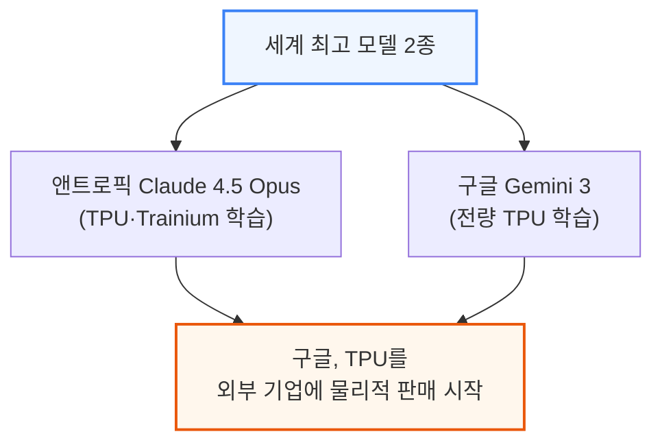

이 흐름의 배경에는 SemiAnalysis가 사전에 포착한 일련의 사건들이 있습니다.
2025년 8월 Accelerator Model 구독자에게 브로드컴·구글 TPU 주문의 대규모 상향 조정을 공유했고, 이후 구글이 여러 고객사에 TPU 시스템을 외부 판매하기 시작한 사실을 밝혀냈습니다.
9월에는 앤트로픽이 최소 100만 개 TPU를 발주하는 대형 고객이 될 것이라 예측했고, 10월 구글·앤트로픽이 이를 공식 확인했습니다. 11월에는 메타도 대형 TPU 고객으로 지목했습니다.

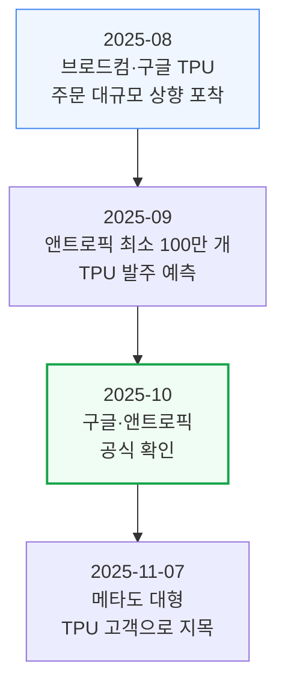

Nvidia는 이런 흐름에 "우리가 여전히 압도적으로 앞서 있다"는 안심시키기용 홍보 자료를 냈습니다.
재무팀은 "순환 경제(Circular Economy, 자금을 이 주머니에서 저 주머니로 옮기며 매출을 부풀린다는 비판)" 논란에 대해 상세한 반박 자료까지 냈습니다.
하지만 실제로는 OpenAI가 TPU를 단 한 대도 가동하기 전부터, TPU 경쟁 위협만으로 엔비디아 함대 전체 비용을 약 30% 절감했다는 사실이 이 위협의 실체를 보여줍니다.

---

## 2. 구글의 TPU 외부화 전략과 앤트로픽 대규모 계약

**📌 핵심:**
- 구글은 2018년 GCP를 통해 TPU를 대여해줬지만 완전한 상업화는 하지 않았음 — 최근 몇 달 사이 TPU 시스템을 통째로 판매하는 "머천트 벤더" 전략으로 전환
- 구글의 최대 병목은 전력이 아니라 계약·행정 절차 — 신규 데이터센터 사업자마다 수십억 달러 규모의 MSA(마스터 서비스 계약)를 새로 맺어야 하는데, 초기 논의부터 서명까지 최대 3년 걸림
- 이 병목을 우회하기 위해 구글은 임대 대신 "신용 보증(Fluidstack이 임대료를 못 내면 구글이 대신 지급)"이라는 재무제표 밖 방식을 도입 — 유연한 네오클라우드·전 암호화폐 채굴업체가 이 틈새를 메움
- 결론: 앤트로픽 딜은 TPU 100만 개 규모로, 40만 개는 브로드컴이 직접 판매(약 100억 달러), 60만 개는 GCP 임대(약 420억 달러 RPO) — 메타·OpenAI·SSI·xAI로 확장될 가능성도 있음

---

TPU 스택은 오랫동안 엔비디아 하드웨어와 맞먹는 성능을 냈지만 대부분 구글 내부 워크로드만 지원했습니다.
GCP CEO 토마스 쿠리안이 앤트로픽과의 협상을 주도했고, 구글은 앤트로픽 투자 라운드에 의결권 없이 지분 15% 상한까지 감수하며 초기부터 적극 투자했습니다.
전직 딥마인드 TPU 인력이 앤트로픽에 다수 합류한 것도 Claude Sonnet·Opus 4.5가 TPU를 포함한 여러 하드웨어에서 학습된 배경이 됐습니다.

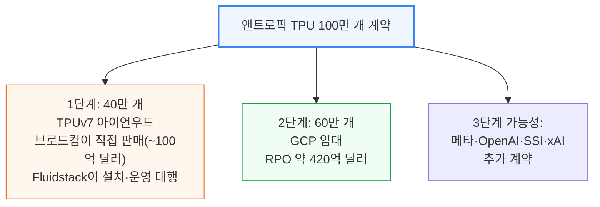

**📌 용어 풀이: RPO**
> - **RPO (Remaining Performance Obligation, 잔여 계약이행 금액)**: 기업이 이미 계약을 맺었지만 아직 매출로 인식하지 못한 미래 수주 잔액 — 앤트로픽의 GCP 임대분(약 420억 달러)은 구글 클라우드 3분기 RPO 증가분(490억 달러) 대부분을 차지

구글의 진짜 병목은 전력이 아니라 계약 속도입니다.
다른 하이퍼스케일러들이 자체 부지 확장과 임대 확보에 속도를 낸 반면, 구글은 신규 데이터센터 벤더마다 다년·다십억 달러 규모의 MSA(마스터 서비스 계약)를 새로 체결해야 하는 행정 절차 때문에 초기 논의부터 서명까지 최대 3년이 걸립니다.
이를 우회하기 위해 구글은 직접 임대 대신 "Fluidstack이 임대료를 못 내면 구글이 대신 지급하겠다"는 재무제표 밖 신용 보증(IOU) 방식을 도입했습니다.

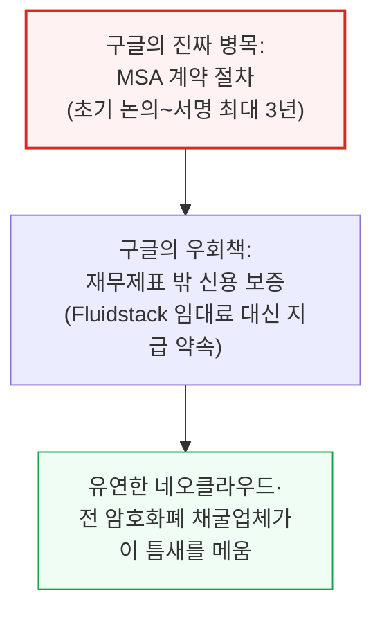

이 구조는 암호화폐 채굴업체가 AI 데이터센터로 전환하는 데 유리한 기회를 만듭니다. 데이터센터 업계는 전력 확보가 만성적으로 어려운데, 채굴업체는 이미 PPA(전력구매계약)와 전기 인프라를 보유하고 있어 신속하게 전환할 수 있기 때문입니다. IREN, Applied Digital 등이 이런 흐름의 수혜주로 지목됩니다.

---

## 3. 구글이 바꾼 네오클라우드 시장 지형

**📌 핵심:**
- 구글·Fluidstack·TeraWulf 딜 이전에는 재무제표 밖 신용 보증만으로 성사된 네오클라우드 계약이 없었음 — 이 딜 이후 이 방식이 업계 표준 파이낸싱 템플릿으로 자리잡을 전망
- GPU 클러스터의 경제적 수명은 4\~5년인데, 대형 데이터센터 임대 계약은 보통 15년 이상(투자 회수 기간 약 8년)으로 기간이 맞지 않아 파이낸싱이 복잡했던 문제를 하이퍼스케일러 신용 보증이 해결
- 엔비디아를 투자자로 둔 CoreWeave, Nebius, Crusoe, Together, Lambda, Firmus, Nscale 등은 경쟁 기술(TPU, AMD GPU, Arista 스위치조차) 도입이 사실상 금지돼 있어 TPU 호스팅 시장에 진입할 수 없음
- 결론: 이 공백을 암호화폐 채굴업체 + Fluidstack 조합이 메우고 있으며, 앞으로 더 많은 네오클라우드가 "TPU 호스팅 기회"와 "엔비디아 루빈 시스템 확보" 사이에서 선택을 강요받을 전망

---

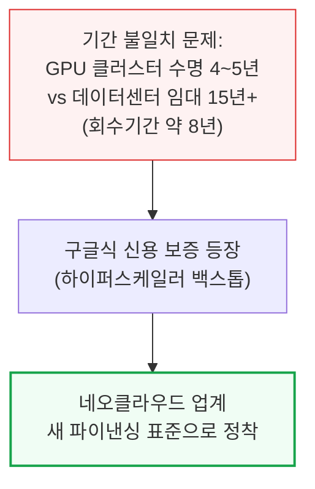

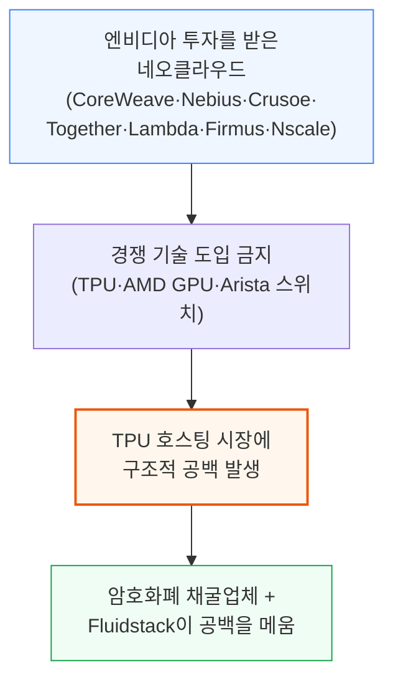

---

## 4. TPUv7 아이언우드 - 앤트로픽은 왜 TPU를 원하는가

**📌 핵심:**
- 답은 단순함 — 강력한 칩이 뛰어난 시스템 안에 들어있어, 앤트로픽에게 확실한 성능·TCO 이점을 제공하기 때문
- 구글 Gemini 3는 전량 TPU로 학습된 세계 최고 모델 — 사전학습(Pre-training, 모델을 처음부터 만드는 가장 어려운 단계)은 AI 하드웨어에서 가장 까다로운 시험대인데 TPU가 이를 통과했다는 확실한 증거
- 반면 OpenAI는 2024년 5월 GPT-4o 이후 새 프론티어 모델의 대규모 사전학습을 성공적으로 마쳐 배포한 적이 없음 — 구글 TPU 함대가 넘은 기술적 난관의 크기를 보여줌
- 결론: Gemini 3는 도구 사용·장기 과업(에이전트형 작업)에서도 눈에 띄는 향상을 보였고, Vending Bench(가상 자판기 사업을 얼마나 잘 운영하는지 측정하는 평가)에서 경쟁 모델을 압도

---

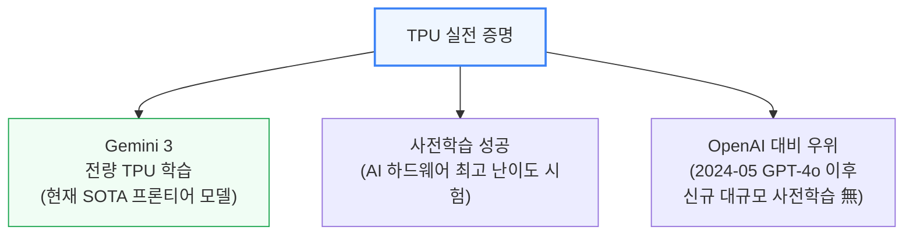

구글의 시스템 수준 엔지니어링은 2023년 4월 SemiAnalysis가 제기한 "시스템이 마이크로아키텍처보다 중요하다"는 논지를 재확인시켰습니다.
종이 스펙상 엔비디아에 뒤처진 실리콘으로도 TPU 스택이 성능·비용 효율에서 대등한 결과를 낼 수 있었던 배경입니다.
구글은 TPU v2(2017년)부터 랙 내부·랙 간 스케일업을 해왔는데, 이는 엔비디아 NVLink에 필적하는 유일한 경쟁 기술입니다.

---

## 5. 마이크로아키텍처 격차 축소 - 아이언우드, 블랙웰에 근접

**📌 핵심:**
- 구글은 전통적으로 실리콘 설계에서 보수적 접근을 취해왔음 — TPU는 항상 동급 엔비디아 GPU보다 이론상 최고 FLOPs와 메모리 스펙이 낮았는데, 이유는 3가지: ① RAS(신뢰성·가용성·유지보수성) 우선, ② 2023년 이전 주력 워크로드가 연산 강도가 낮은 추천 시스템, ③ 마케팅 압박이 적어 이론상 최고 스펙을 부풀릴 유인이 적음
- TPUv6 트릴리움은 TPUv5p와 같은 N5 공정·비슷한 실리콘 면적으로 이론상 최고 FLOPs를 2배로 끌어올림 — 시스톨릭 어레이(행렬곱 전용 회로 격자) 크기를 128×128에서 256×256으로 4배 확대한 결과
- TPUv7 아이언우드는 이론상 최고 FLOPs·메모리 용량·대역폭에서 동급 엔비디아 플래그십(GB200)에 거의 근접 — 다만 일반 출시가 블랙웰보다 약 1년 늦고, HBM3E 12-Hi 288GB를 쓰는 GB300 대비로는 메모리 용량 격차가 여전히 큼
- 결론: 구글이 TPU 처리 능력을 GB200 발표 후 실전 배치까지 걸리는 기간과 거의 같은 수준으로 좁힌 것은 세대를 거듭할수록 마이크로아키텍처 격차가 좁혀지고 있다는 신호

---

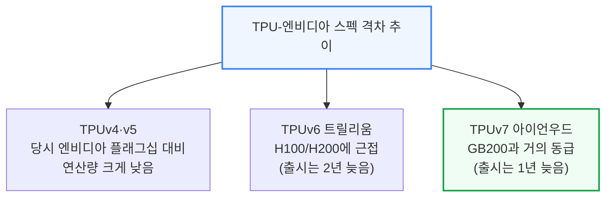

**📌 용어 풀이: 구글이 스펙을 보수적으로 잡는 이유**
> - **RAS (Reliability, Availability, Serviceability, 신뢰성·가용성·유지보수성)**: 구글은 절대 성능보다 하드웨어 가동시간을 우선 — 한계까지 밀어붙이면 고장률이 올라가고, 못 쓰는 하드웨어는 TCO 관점에서 성능 대비 무한대의 비용이 됨
> - **DVFS (Dynamic Voltage and Frequency Scaling, 동적 전압·주파수 조절)**: 엔비디아·AMD GPU는 전력·발열 상황에 맞춰 클록 속도를 실시간으로 바꾸는데, 마케팅용 이론상 최고 FLOPs는 아주 짧은 순간 가능한 최고 클록으로 계산 — 실제로는 지속되기 어려운 수치
> - **제로 텐서 트릭**: 0×0=0 연산은 트랜지스터 상태 전환이 필요 없어 전력 소모가 적음 — 벤치마크에서 0으로 채운 텐서로 곱셈을 시켜 전력 소모를 인위적으로 낮추는 사례도 있으나 실전 워크로드에서는 발생하지 않음

이론상 최고 FLOPs만 놓고 보면 GB200이 여전히 근소하게 앞서지만, TCO(총소유비용) 관점은 다릅니다.
구글은 브로드컴을 통해 TPU를 조달하며 상당한 마진을 지불하지만, 엔비디아가 GPU뿐 아니라 CPU·스위치·NIC·메모리·케이블까지 시스템 전체에 매기는 마진보다는 훨씬 낮습니다.
그 결과 구글 입장에서 3D 토러스 풀구성 아이언우드 칩의 전체 TCO는 GB200 서버 대비 약 44% 낮아, 이론상 FLOPs·대역폭에서의 약 10% 열세를 상쇄하고도 남습니다.
구글이 외부 고객에게 마진을 얹어 임대하는 경우에도, 시간당 TCO는 GB200 대비 최대 약 30%, GB300 대비 최대 약 41% 낮은 것으로 추정되며, 이는 GCP를 통한 앤트로픽 가격의 근거로 봅니다.

---

## 6. 실효 FLOPs와 TCO - 앤트로픽이 TPU에 베팅하는 이유

**📌 핵심:**
- 이론상 최고 FLOPs보다 실전 학습에서 실제로 쓰이는 실효 FLOPs가 중요 — 엔비디아 GPU는 통신 오버헤드·메모리 지연·전력 제한 등을 감안하면 학습 시 이론상 최고치의 약 30% 정도만 달성하는 것이 일반적
- 소프트웨어·컴파일러 효율 격차가 이 차이의 상당 부분을 차지 — 엔비디아는 CUDA 해자와 방대한 오픈소스 라이브러리로 즉시 높은 실효 FLOPs·대역폭을 확보하지만, TPU 소프트웨어 스택은 아직 사용 난도가 높음(다만 빠르게 개선 중)
- 앤트로픽은 강력한 엔지니어링 인력과 전직 구글 컴파일러 전문가를 보유해 맞춤 커널로 TPU 효율을 극대화할 수 있음 — 마케팅상 최고 FLOPs는 TPU가 낮아 보여도, 실제 MFU(모델 연산 활용률)는 블랙웰보다 높게 나올 수 있음
- 결론: 구글 관점에서 손익분기 MFU는 GB300(MFU 30% 가정) 대비 약 15%에 불과 — 구글의 40% MFU 잠재력이 실현되면 실효 학습 FLOPs당 비용을 약 62% 절감할 수 있음

---

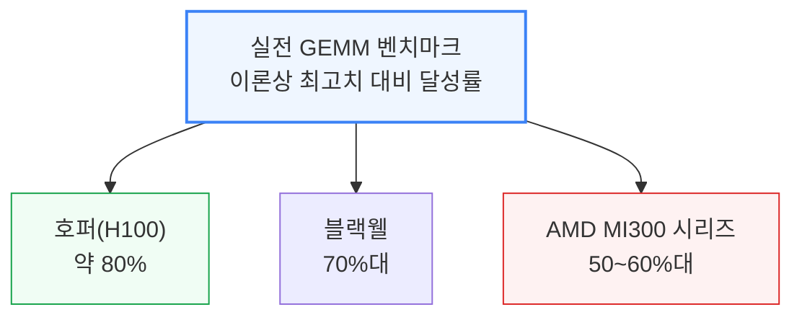

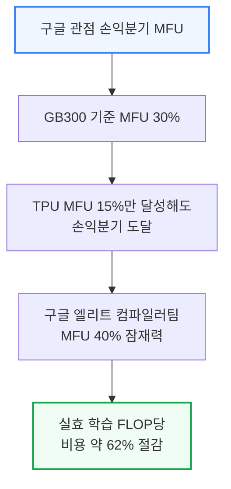

600k 규모의 GCP 임대 TPU 기준으로, 구글의 마진이 얹어진 실제 임대 단가(TPU 시간당 약 1.60달러)를 반영해도 앤트로픽은 40% MFU를 달성할 수 있어 실효 PFLOP당 TCO가 GB300 NVL72 대비 약 52% 낮습니다.
이 경우 균형점(TCO가 같아지는 지점)의 MFU는 훨씬 낮은 19%로, 앤트로픽은 기준 GB300보다 성능이 상당히 떨어져도 여전히 성능/TCO에서 손해를 보지 않습니다.

메모리 대역폭도 마찬가지입니다. 특히 추론의 디코드(Decode, 답변을 한 토큰씩 생성하는 단계) 구간에서 대역폭이 중요한데, 16MB\~64MB의 작은 메시지 크기(레이어 하나의 전문가 모듈을 불러오는 크기)에서는 TPU가 GPU보다 더 높은 메모리 대역폭 활용률을 보인다는 근거도 있습니다.

이런 효율은 실제 제품 가격에도 반영됩니다.
앤트로픽 Opus 4.5는 API 가격을 약 67% 인하했음에도, Sonnet 대비 76% 적은 토큰으로 같은 점수를, 45% 적은 토큰으로 4점 높은 점수를 달성할 만큼 토큰 효율이 높아졌습니다.
Sonnet이 현재 토큰 믹스의 90% 이상을 차지하는 상황에서, 이는 앤트로픽의 실질 토큰 단가를 오히려 끌어올릴 수 있는 요인입니다.

---

## 7. 구글의 마진 줄타기 전략

**📌 핵심:**
- 구글은 외부 고객 대상 가격 책정에서 자체 수익성과 경쟁력 있는 제안 사이에서 균형을 잡아야 함 — 앤트로픽처럼 소프트웨어·하드웨어 로드맵에 기여하며 대량 발주하는 플래그십 고객에게는 특히 유리한 가격을 제공
- 엔비디아는 약 4배 마크업(매출총이익률 약 75%)으로 가격 결정에 여유가 있지만, 그중 상당 부분이 시스템 BOM(부품 명세)에서 가장 큰 비중을 차지하는 실리콘에 마진을 얹는 브로드컴(TPU 공동 설계사)에게 빠져나감
- 그럼에도 구글은 GPU 기반 대형 클라우드 딜과 비교해 훨씬 우수한 EBIT 마진을 확보 — OCI-OpenAI 딜만이 근접한 수준이고, 나머지 GPU 기반 클라우드 딜은 훨씬 낮은 마진에 머무름
- 결론: TPU 스택 덕분에 GCP는 진짜 차별화된 클라우드 사업자가 될 수 있음 — 반면 자체 ASIC 프로그램이 부진한 마이크로소프트 Azure는 범용 하드웨어 임대라는 저마진 사업에 갇혀 있음

---

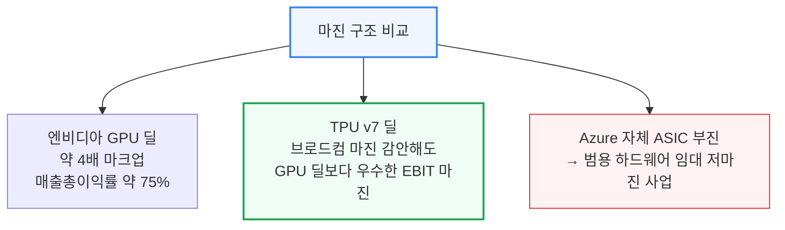

---

## 8. TPU 시스템·네트워크 아키텍처 - 랙, ICI, OCS, DCN

**📌 핵심:**
- TPU 랙은 TPU 트레이 16개, 호스트 CPU 트레이 16개 또는 8개(냉각 방식에 따라 다름), ToR 스위치, 전원 공급 장치, 배터리 예비 전원(BBU)으로 구성 — 각 TPU 트레이에는 TPU 칩 4개가 장착
- 아이언우드의 스케일업 네트워크(ICI)는 TPU 64개를 4×4×4 정육면체로 묶는 것이 기본 단위이며, 이 정육면체들을 광회선 스위치(OCS)로 계속 연결해 최대 9,216개까지 하나의 클러스터로 확장 가능
- OCS는 광신호를 전기신호로 바꾸지 않고 그대로 다른 포트로 넘기기 때문에 전력 효율이 좋고 지연이 짧으며, 소프트웨어로 연결 구성을 바꿔 다양한 클러스터 형태(토폴로지)를 유연하게 만들 수 있음
- 결론: 9,216개를 넘어서는 확장은 별도의 DCN(데이터센터 네트워크) 계층이 담당하며, TPUv7 클러스터는 이를 통해 최대 147,456개까지 하나의 네트워크 도메인으로 묶임

---

### 랙 아키텍처와 액체 냉각

구글은 TPU v3(2018년)부터 액체 냉각 랙을 도입해왔으며, 냉각수 유량을 밸브로 실시간 조절해 칩별 워크로드에 맞춰 냉각 효율을 높입니다.
VRM(전압 조정 모듈)을 회로기판 반대편에 배치하는 수직 전력 공급 방식도 오래전부터 채택했습니다.
다만 TPU 랙 설계는 엔비디아 Oberon NVL72처럼 백플레인으로 GPU를 스케일업 스위치에 연결하는 고밀도 구조보다는 단순한 편으로, 트레이 간 연결은 대부분 외부 구리 케이블·광케이블을 씁니다.

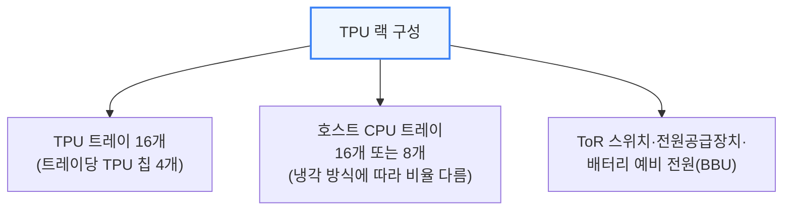

### ICI: 64개 TPU 정육면체에서 9,216개 클러스터까지

TPUv7의 스케일업 네트워크(ICI, 칩 간 직결 네트워크)는 TPU 64개를 4×4×4 정육면체로 묶는 것이 기본 단위이며, 이 정육면체 하나가 물리적 랙 한 대(TPU 64개)에 대응합니다.
각 TPU는 이웃한 TPU 6개와 연결되는데(X·Y·Z축 각 2개씩), 정육면체 내부 연결은 구리 케이블(DAC), 정육면체 경계를 넘는 연결(감싸기·인접 정육면체 연결)은 광트랜시버와 OCS를 씁니다.
정육면체 안 위치(내부·면·모서리·꼭짓점)에 따라 쓰는 광트랜시버 개수가 달라지며, TPUv7 전체로는 TPU 1개당 평균 1.5개의 광트랜시버가 붙습니다.

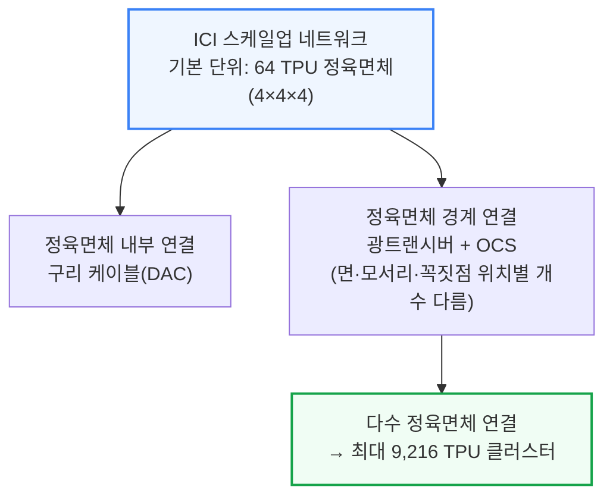

**📌 용어 풀이: OCS의 작동 방식**
> - OCS(광회선 스위치)는 거대한 기차역과 같음 — 어느 선로로 들어온 열차든 원하는 선로로 내보낼 수 있지만, 매번 역에서 경로를 재설정해야 하고, 들어온 선로로 그대로 되돌아 나갈 수는 없음
> - 일반 전기 스위치(EPS)는 광신호를 전기신호로 변환해야 해서 전력을 더 쓰지만, 어느 포트로든 자유롭게 라우팅 가능 — OCS는 전력 효율은 좋지만 "들어온 포트 → 나가는 포트" 한 방향으로만 연결 가능하다는 제약이 있음

이 OCS 기반 재구성 능력 덕분에 구글은 워크로드 요구(데이터·텐서·파이프라인 병렬화 조합)에 맞춰 수천 가지 클러스터 형태를 유연하게 만들 수 있고, 장애가 나거나 수요가 바뀌어도 어떤 정육면체 조합으로든 새 클러스터를 구성할 수 있습니다.
이런 완전한 호환성(퍼엔지빌리티)은 64\~72 GPU 단위로 제한되는 일반 GPU 스케일업 월드사이즈보다 훨씬 큰 유연성을 제공합니다.
다만 최대 9,216개 규모의 슬라이스는 장애·중단에 취약해 실전에서는 최대 약 8,000개 규모까지가 실용적인 상한으로 여겨집니다.

### DCN: 9,216개를 넘어선 확장

ICI로 묶을 수 있는 한계(9,216 TPU)를 넘어서는 확장은 별도의 DCN(데이터센터 네트워크) 계층이 담당합니다.
DCN은 여러 개의 집계 블록(Aggregation Block)을 통해 여러 9,216 TPU ICI 클러스터를 서로 연결하며, TPUv7 세대에서는 최대 147,456개(집계 블록 4개 × ICI 클러스터 4개)까지 하나의 네트워크 도메인으로 묶을 수 있습니다.
OCS를 DCN 계층에도 사용하기 때문에, 배선을 크게 바꾸지 않고도 집계 블록을 추가하거나 대역폭을 업그레이드할 수 있습니다.

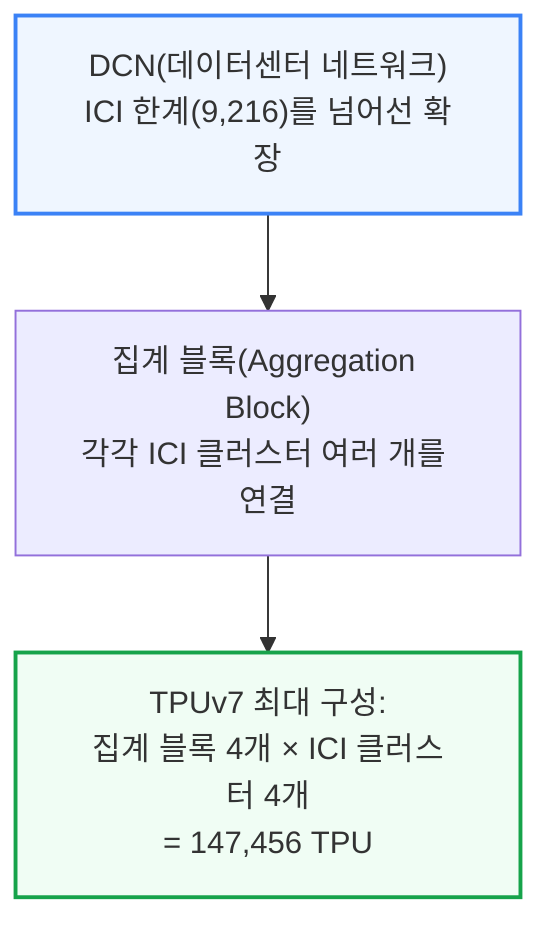

---

## 9. TPU 소프트웨어 전략의 대전환

**📌 핵심:**
- TPU 소프트웨어·하드웨어 팀은 전통적으로 내부용에 집중해 외부 개발자 생태계가 CUDA 대비 크게 얕음 — 구글은 최근 TPU 팀의 성과 지표(KPI)까지 바꿔가며 외부 개발자 확보에 나섬
- 핵심 변화 2가지: ① PyTorch TPU "네이티브" 지원에 대규모 투자(Meta가 JAX로 옮기길 원치 않아 이 작업을 견인), ② vLLM·SGLang(오픈소스 추론 프레임워크) TPU 지원에 대규모 투자
- 구글 vLLM MoE(전문가 혼합) 커널 최적화로 기존 대비 3\~4배 속도 향상 사례가 나왔지만, 최근 나온 "TPUv6e가 엔비디아 대비 성능/달러 5배 열세"라는 벤치마크는 신뢰도가 낮음 — 갓 출시된 미최적화 vLLM 기준이고, 리스트 가격($2.7/시간)을 그대로 쓴 결과이기 때문
- 결론: 여전히 남은 결정적 공백은 XLA:TPU 컴파일러·런타임·멀티팟 MegaScale 코드의 오픈소스화 — PyTorch·Linux가 오픈소스화로 채택이 폭발적으로 늘었던 선례를 볼 때, 구글이 이를 공개하면 생태계 확장 속도가 크게 빨라질 것

---

### PyTorch 네이티브 지원

전통적으로 구글은 Jax/XLA:TPU 스택만 최우선 지원하고 PyTorch는 2등 시민으로 취급했습니다.
즉시 실행(Eager Execution) 모드 없이 지연 텐서 그래프 캡처 방식에 의존했고, PyTorch 네이티브 분산 API(torch.distributed 등)도 지원하지 않아 GPU에 익숙한 외부 사용자에게는 불편한 경험이었습니다.
2020\~2023년 Meta FAIR 팀이 PyTorch XLA로 TPU를 시도했지만 널리 확산되지 못해 2023년 계약이 종료된 사례도 있습니다.

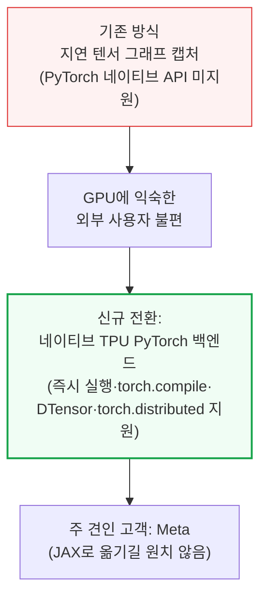

구글은 PrivateUse1 TorchDispatch 키를 활용해 즉시 실행을 기본으로 하는 네이티브 TPU PyTorch 백엔드로 전환을 발표했습니다.
커스텀 커널 작성 언어인 Pallas(엔비디아의 cuTile·Triton·CuTe-DSL에 해당)도 Torch Dynamo/Inductor 컴파일 스택의 코드생성 대상으로 지원을 시작해, PyTorch 사용자가 직접 커스텀 Pallas 연산을 등록할 수 있게 됐습니다.

### vLLM·SGLang 지원과 성능 최적화

CUDA 생태계가 압도적 우위를 지닌 또 다른 영역은 오픈 추론 생태계입니다. vLLM·SGLang은 전통적으로 CUDA를 최우선 지원했는데, 구글이 TPU v5p/v6e에 대한 베타 지원을 발표하며 이 시장에 진입했습니다. 다만 TPU는 GPU와 메모리 접근 방식이 달라(세밀한 주소 지정·스캐터 연산에 약함) 커널을 처음부터 다시 설계해야 했습니다.

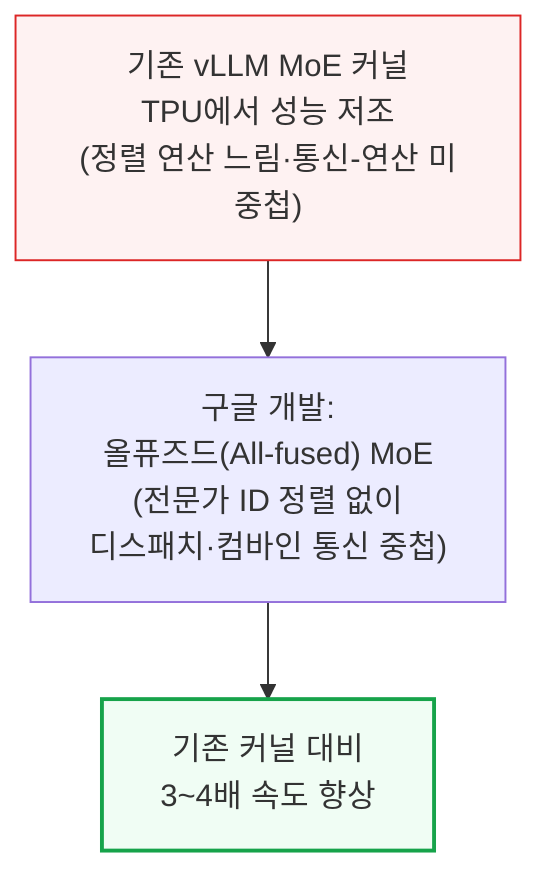

구글은 임베딩 조회·갱신을 가속하는 전용 하드웨어 유닛인 SparseCore(SC)도 갖추고 있습니다.
TensorCore가 512바이트 단위로 데이터를 읽는 것과 달리, SC는 4\~32바이트의 훨씬 세밀한 단위로 로컬·원격 메모리에 접근할 수 있어 TensorCore 연산과 겹쳐서 gather/scatter·ICI 통신을 처리할 수 있습니다.
다만 SparseCore의 프로그래밍 편의성은 아직 개선 중입니다.

**📌 용어 풀이: 최근 벤치마크 논란**
> - 최근 TPUv6e가 엔비디아 대비 성능/달러에서 5배 열세라는 벤치마크가 나왔으나, 신뢰도가 낮은 두 가지 이유가 있음
> - 첫째, 이 벤치마크는 출시된 지 두 달밖에 안 된 미최적화 vLLM 기준 — 구글 내부 Gemini·앤트로픽 워크로드는 자체 커스텀 추론 스택을 쓰며 엔비디아보다 성능/TCO가 더 낫다고 봄
> - 둘째, 시간당 2.7달러라는 TPUv6e 리스트 가격을 그대로 사용 — 실제로 이 가격을 지불하는 주요 고객은 없으며, 클라우드 업체 리스트 가격은 대폭 할인을 전제로 높게 책정되는 관행이 있음

### 남은 결정적 공백: 오픈소스화

구글이 아직 잘못 접근하고 있는 부분은 XLA 그래프 컴파일러, 네트워킹 라이브러리, TPU 런타임을 오픈소스화하지도, 제대로 문서화하지도 않았다는 점입니다.
이 때문에 숙련자부터 초심자까지 코드 문제를 디버깅하기 어려워하는 상황이 이어지고 있고, 멀티팟 학습용 MegaScale 코드베이스도 여전히 비공개입니다.
PyTorch나 Linux가 오픈소스화 이후 채택이 폭발적으로 늘었던 선례를 볼 때, 구글이 이를 공개하면 얻는 채택 증가분이 지켜야 할 소프트웨어 IP 손실보다 훨씬 클 것으로 판단됩니다.

---

## 10. 엔비디아에게 남은 위협 - 베라 루빈 vs TPUv8

**📌 핵심:**
- 아이언우드가 블랙웰의 진정한 경쟁자가 됐지만, 엔비디아는 차세대 베라 루빈으로 다시 성능 격차를 벌릴 준비 중 — 반면 TPU v8은 세대 간 성능 향상 폭이 훨씬 작음
- TPU v8은 2027년 출시 예정이며, 기존 "P(풀)"·"E(라이트)" 구분 대신 브로드컴 공동 설계 SKU(TPU 8AX "Sunfish")와 미디어텍 공동 설계 SKU(TPU 8X "Zebrafish")로 나뉨 — 미디어텍 협업 목적은 브로드컴에 내는 설계 마진을 줄이고, HBM을 SK하이닉스에서 직접 조달해 원가를 낮추는 것
- 엔비디아는 애초 목표보다 공격적으로 베라 루빈의 전력을 1800W에서 2300W로, HBM 속도를 13TB/s에서 20TB/s로 상향 — AMD와 구글의 경쟁 압박에 대한 대응으로 해석됨. TPU v8은 N3E 공정에 HBM3E를 유지해 이 상향과 격차가 벌어짐
- 결론: 구글이 오랫동안 누려온 TCO 우위가 TPU v8 세대에서는 크게 좁혀질 수 있음 — 실리콘 지연과 느린 공급망(칩 제조→랙 조립→데이터센터 가동)까지 겹치면 루빈 카이버 랙이 구글 내부 워크로드에서조차 TPU v8보다 나은 TCO를 낼 가능성도 있음

---

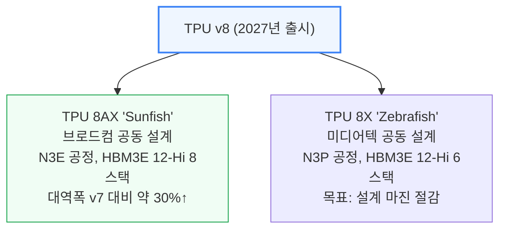

**📌 용어 풀이: 미디어텍과의 협업이 갖는 의미**
> - 브로드컴은 TPU 시스템 전체(HBM 포함)의 BOM에 마진을 얹어 청구 — 미디어텍은 이보다 훨씬 유연한 커스텀 실리콘 모델을 제공해, 구글이 HBM을 SK하이닉스에서 직접 조달하는 "고객 소유 툴링(Customer Owned Tooling)" 모델로 가는 경로를 엶
> - 다만 이번 세대에는 여전히 미디어텍이 TSMC 테이프아웃(설계를 최종 실리콘 제조용 데이터로 확정하는 단계)을 담당했고, 브로드컴의 지원 없이 진행하다 보니 예상보다 오래 걸렸음

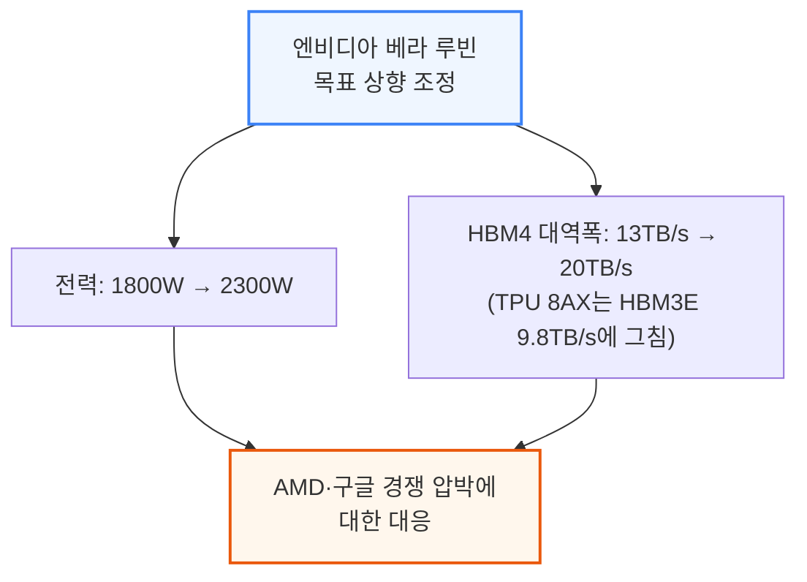

이런 배경에서 세대 간(gen-on-gen) TPUv8 성능 향상 폭은 연산·메모리 양쪽에서 엔비디아 루빈의 향상 폭보다 훨씬 작습니다.
외부 고객 입장에서 실효 FLOP당 TCO 우위는 남아있지만, 아이언우드가 블랙웰 대비 가졌던 우위보다는 훨씬 좁아집니다.
엔비디아가 FLOPs 총출하량에서 여전히 압도적 1위를 지키고 있는 것도 이런 흐름을 뒷받침합니다.

구글은 TPU v8에서 실리콘 지연을 겪고 있고, 칩 제조부터 조립된 랙이 데이터센터에서 실제 워크로드를 처리하기까지 이어지는 공급망 속도도 느립니다.
브로드컴의 고성능 SerDes에 비싼 비용을 지불하면서도 224G SerDes 전환은 2027년에야 이뤄집니다.
이 때문에 루빈 카이버 랙이 구글의 많은 내부 워크로드에서조차 TPU v8보다 나은 TCO를 낼 수 있는 상황이 벌어질 수 있습니다.

앤트로픽이 엔비디아와의 파트너십을 재구축해야 했던 배경도 여기에 있습니다.
TPU(그리고 Trainium)가 성능/TCO 균형에서 앤트로픽에 유리한 지점을 찾아냈지만, 엔비디아는 항상 가장 빠른 속도로 혁신을 내놓아 무시하기 어려운 상대이기 때문입니다.
구글이 카드를 다 보여준 지금, 엔비디아는 루빈 오베론·루빈 카이버에서 지연이나 성능 미달을 겪지 않아야 정글의 왕좌를 유지할 수 있습니다.

---

*작성 진행률: 100% 완료*
*업데이트: 전체 10개 섹션(서론, TPU 외부화, 네오클라우드, 아이언우드 하드웨어, TCO·MFU, 마진 전략, 시스템·네트워크 아키텍처, 소프트웨어 전략, 엔비디아 대응) 작성 완료*
