# 1,000 CFETs, SK Hynix Next-Gen NAND, Interconnects Beyond Copper, 2D Materials, and More

> **출처**: [https://newsletter.semianalysis.com/p/interconnects-beyond-copper-1000](https://newsletter.semianalysis.com/p/interconnects-beyond-copper-1000)
> **저자**: [[Dylan Patel]]
> **발행일**: 2026-01-14

📑 목차
1. [서론: 무어의 법칙은 벽에 부딪혔는가](#1-서론-무어의-법칙은-벽에-부딪혔는가)
2. [3D 낸드 스케일링의 귀환](#2-3d-낸드-스케일링의-귀환)
3. [차세대 배선: 구리를 넘어 루테늄으로](#3-차세대-배선-구리를-넘어-루테늄으로)
4. [2D 소재(TMD)의 도전과 한계](#4-2d-소재tmd의-도전과-한계)
5. [CFET: TSMC의 링 오실레이터와 SRAM 돌파](#5-cfet-tsmc의-링-오실레이터와-sram-돌파)
6. [CFET: IMEC 모놀리식 집적 기술](#6-cfet-imec-모놀리식-집적-기술)
7. [CFET: A7에서 A3까지, 얼마나 더 스케일링할 수 있나](#7-cfet-a7에서-a3까지-얼마나-더-스케일링할-수-있나)

🔑 용어 정리
- **CFET (Complementary FET, 상보형 전계효과 트랜지스터)**: N형과 P형 트랜지스터를 옆으로 나란히 두지 않고 위아래로 쌓아, 같은 면적에 훨씬 많은 트랜지스터를 넣는 차세대 구조
- **GAA (Gate-All-Around)**: 게이트(전류를 여닫는 스위치 부분)가 채널을 사방에서 완전히 감싸는 현재 최첨단 트랜지스터 구조로, CFET 바로 직전 세대
- **3D 낸드 (3D NAND)**: 저장 셀을 평면에 늘어놓는 대신 수직으로 쌓아 올려, 한 장의 웨이퍼에 더 많은 데이터를 담는 플래시 메모리 구조
- **워드라인 (Word Line)**: 3D 낸드에서 각 층의 저장 셀에 전압을 걸어 켜고 끄는 배선으로, 층수가 늘수록 연결 난도가 커짐
- **루테늄 (Ru)**: 회로 폭이 나노미터 단위로 좁아지면서 저항이 급증하는 구리를 대체할 차세대 배선 금속
- **2D 소재 / TMD (전이금속 디칼코게나이드)**: 원자 한두 층 두께로 만들 수 있는 반도체 재료로, 실리콘이 너무 얇아지면 생기는 누설전류 문제를 줄일 후보
- **링 오실레이터 (Ring Oscillator)**: 인버터(신호를 반전시키는 회로)를 여러 개 고리 모양으로 연결해 공정의 속도와 안정성을 측정하는 표준 테스트 회로
- **SRAM**: 데이터를 저장하는 최소 단위 회로로, 모든 칩에 들어가며 트랜지스터 집적도를 가늠하는 척도로도 쓰임

---

## 1. 서론: 무어의 법칙은 벽에 부딪혔는가

**📌 핵심:**
- 반도체 업계는 첨단 로직·D램·낸드 수요가 폭발하는 초호황과, 미세공정 성능 개선 속도가 눈에 띄게 둔화되는 상황을 동시에 겪는 중
- 연구개발 투자는 계속 늘지만 성능 개선 폭은 점점 작아지는 현상이 뚜렷해 "무어의 법칙이 무어의 벽이 됐다"는 자조 섞인 평가가 나옴
- 그럼에도 낸드 적층, 구리를 대체할 배선 금속, 2D 소재, 차세대 트랜지스터 CFET 등 향후 10년을 이끌 후보 기술들이 IEDM 2025(국제전자소자학회)에서 대거 공개
- 결론: 미세화 둔화 속에서도 적층·신소재·신구조라는 세 방향의 돌파구가 동시에 진행 중

---

반도체 업계는 역대 최대 슈퍼사이클과 동시에 공정 스케일링 둔화라는 모순적 시기를 지나고 있습니다. 다만 과거에도 회의론자들을 틀리게 만든 전례가 있으며, IEDM 2025(국제전자소자학회)에서 공개된 내용을 아래 세 갈래로 정리합니다.

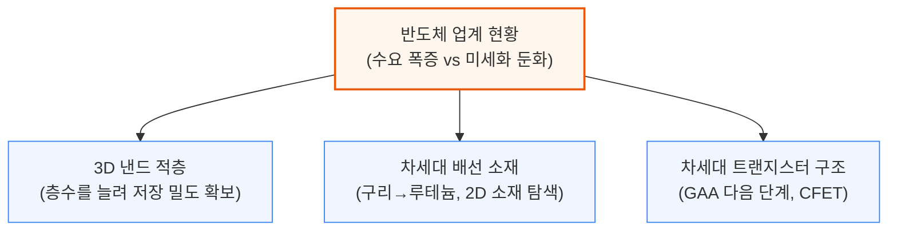

메모리 쪽에서는 SK하이닉스의 최신 V9 낸드와 삼성전자의 몰리브덴 워드라인 개선을, 로직 쪽에서는 구리를 넘어서는 배선 금속과 실리콘을 대체할 2D 소재, 그리고 GAA 다음 단계인 CFET 진행 상황을 순서대로 다룹니다.

---

## 2. 3D 낸드 스케일링의 귀환

**📌 핵심:**
- 메모리 가격 급등으로 신규 공장 증설보다 기존 라인의 적층 수를 늘리는 업그레이드가 더 시급한 선택지로 부상
- SK하이닉스는 238단(V8)에서 321단(V9)으로 늘려 웨이퍼당 저장 용량을 **44% 확대**했지만, 층 묶음(덱)이 3개로 늘어나며 공정이 복잡해져 경쟁사 대비 밀도는 오히려 열위
- 삼성전자는 워드라인 금속을 텅스텐(W)에서 몰리브덴(Mo)으로 바꿔 접촉 저항을 **40% 감소**, 읽기 속도를 **30% 이상 개선**
- 결론: 층수 증가(수직 스케일링)가 가장 저렴한 확장 경로지만, 한계에 부딪힌 기업들은 재료 교체·셀 구조 혁신까지 동시에 추진 중

---

낸드 수요는 급증하는데 새 공장 지을 클린룸이 없어, 메모리 업체는 기존 라인의 적층 수를 늘리는 업그레이드로만 공급을 늘립니다. 최선단 3xx단 공정은 1mm²당 20\~30Gb, 12인치 웨이퍼 한 장에 30TB 이상을 담습니다.

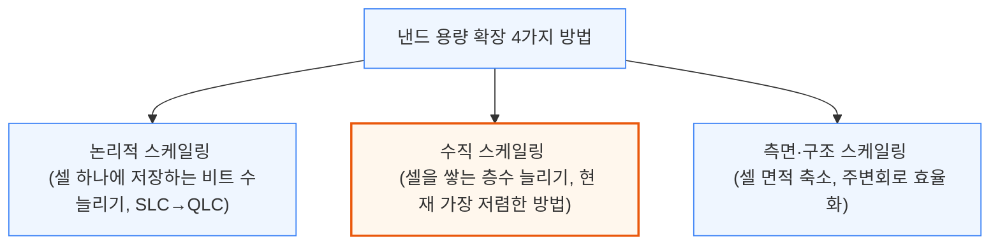

3D 낸드는 수직 원통(채널)을 촘촘히 세우고 전도성·절연층을 번갈아 쌓아, 교차점마다 셀 하나를 만드는 구조입니다. 셀은 전하 트랩 층에 전하를 가둬 문턱 전압을 바꾸는 방식으로 읽고 씁니다. 4가지 방법 중 수직 스케일링이 가장 저렴해 업계가 집중합니다.

### SK하이닉스 321단 V9: 층수는 늘었지만 밀도는 밀림

238단 V8에서 321단 V9으로 넘어가며 SK하이닉스가 추가한 것은 층 묶음(덱) 하나와 그 연결 통로(플러그)입니다. 한 덱 안에서 층수를 더 늘릴 수 없는 한계(SK하이닉스 기준 약 120층)에 부딪히면, 덱 개수 자체를 늘리는 수밖에 없습니다.

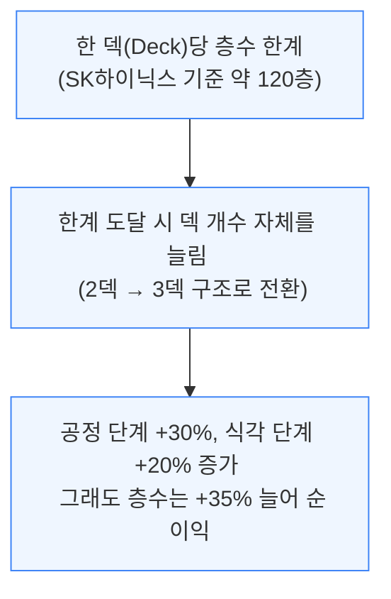

문제는 이렇게 층수를 늘려도 상업적 밀도 경쟁에서는 밀린다는 점입니다.

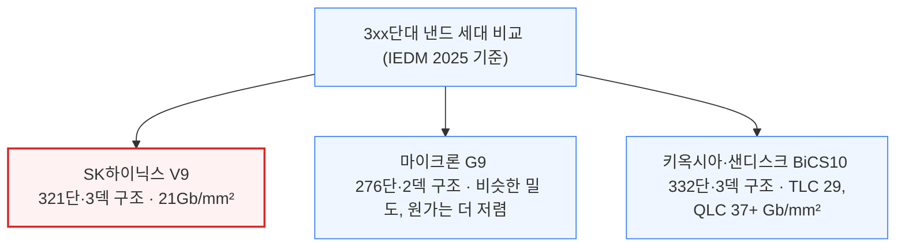

마이크론은 비슷한 밀도를 2덱만으로 달성해 원가 우위에 있고, 키옥시아·샌디스크의 차기 332단 제품은 3덱임에도 밀도가 더 높습니다. 삼성전자는 3xx단 세대를 건너뛰어 286단 2덱(V9)에서 43x단 3덱(V10)으로 바로 넘어가는 전략을 택했습니다.

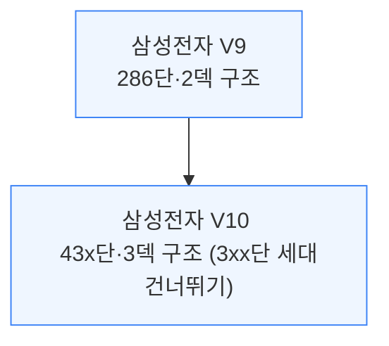

### 삼성 몰리브덴 워드라인: 재료 교체로 성능 확보

삼성전자는 기존 286단 V9 공정 자체는 유지한 채, 워드라인(각 층의 셀을 여닫는 배선) 금속을 5세대(V5)부터 써온 텅스텐(W)에서 몰리브덴(Mo)으로 교체하는 개선안을 공개했습니다.

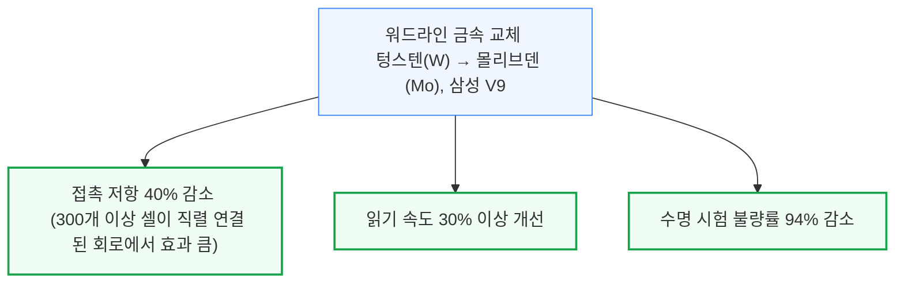

다만 몰리브덴은 화학적·기계적으로 텅스텐보다 다루기 까다롭습니다. 증착 공정(ALD)이 덜 성숙했고 산화가 잘 되며, 응력 편차가 커 웨이퍼가 휘거나 갈라질 위험도 있습니다.

삼성전자는 몰리브덴을 직접 증착하는 대신 질화몰리브덴(MoN) 씨앗층을 먼저 키운 뒤 순수 몰리브덴으로 변환해, 보호막(라이너) 없이도 고품질 층을 얻는 공정을 택했습니다.

### SK하이닉스 멀티사이트 셀: 채널 하나를 둘로 쪼개 5비트 저장

셀 하나에 몇 비트를 저장하느냐(SLC\~QLC, 1\~4비트)는 면적을 늘리지 않고 용량을 키우는 방법입니다. 5비트 저장(32단계)은 상용화된 적 없을 만큼 어려운데, SK하이닉스가 우회 구조를 제시했습니다.

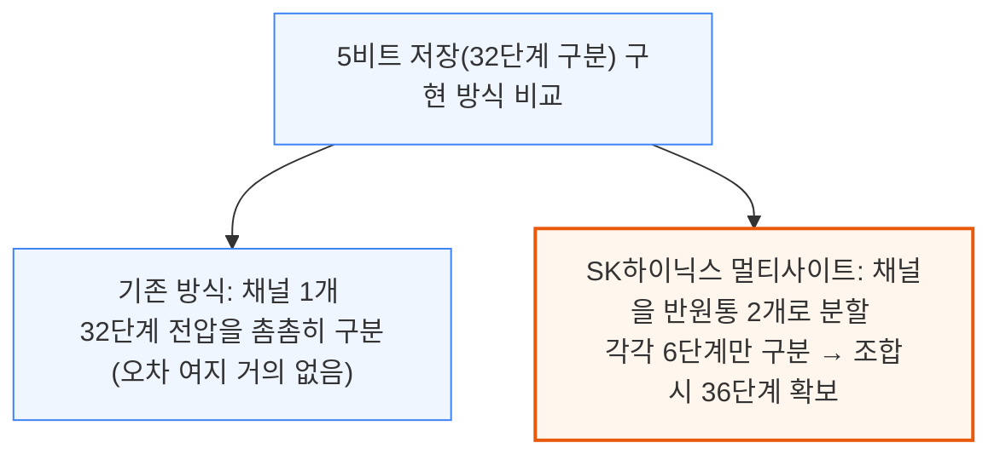

채널을 둘로 나누면 사이트별 성능은 다소 떨어지지만, 6단계만 구분하면 되어 32단계를 한 채널에서 구분하는 것보다 훨씬 여유가 생깁니다. 다만 구멍을 정밀하게 둘로 나누고 비대칭 박막을 증착해야 해, 연구 단계 성공에도 아직 양산 원가에는 못 미칩니다.

---

## 3. 차세대 배선: 구리를 넘어 루테늄으로

**📌 핵심:**
- 회로 폭이 10nm 이하로 좁아지면서, 배선 재료인 구리(Cu)는 전체 부피에서 장벽막·라이너가 차지하는 비중이 커져 저항이 급증하는 "사이즈 효과"에 부딪힘
- 삼성전자는 루테늄(Ru) 원자층을 특정 방향(001)으로 99% 정렬시켜, 300nm² 단면의 극미세 배선에서 저항을 **46% 낮추는** 결과 확보
- IMEC(벨기에 반도체 연구소)은 A14\~A10 노드부터 M0(최하단 배선층)를 구리에서 루테늄으로 교체하는 로드맵 제시, 16nm 피치까지 양쪽 배선층에 비아를 자동 정렬시키는 공정으로 수율 **80% 이상** 달성
- 결론: 루테늄은 2030년대 초반 노드부터 구리를 밀어내고 최하단 배선층의 표준 금속이 될 전망

---

10nm 이하 노드에서는 배선 자체보다 배선을 감싸는 장벽막·라이너가 차지하는 비중이 커지면서, 구리의 저항이 예상보다 훨씬 빠르게 치솟는 "사이즈 효과"가 발생합니다. 이를 해결할 대안으로 업계는 루테늄(Ru)에 주목하고 있습니다.

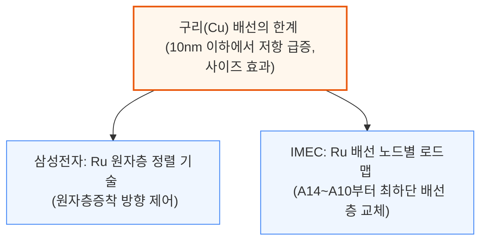

### 삼성전자: 루테늄 결정 방향을 정렬해 저항을 낮추다

기존 스퍼터링(PVD)·ALD 공정은 루테늄 그레인이 제각각 자라 전자가 경계에서 튕기며 저항이 커집니다. 삼성전자는 이를 99% (001) 방향으로 맞추는 "그레인 방향 엔지니어링" 기법을 발표했습니다.

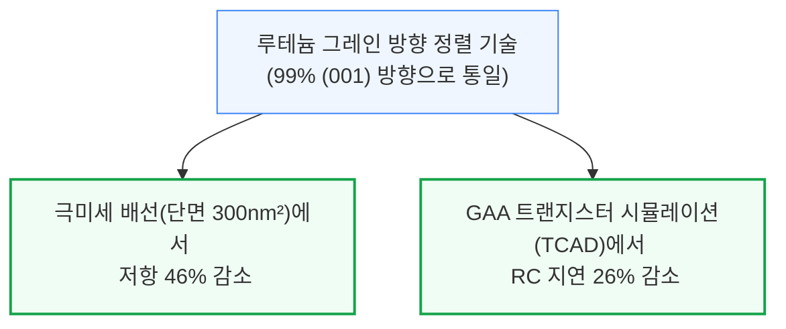

극미세 비아를 채우기 위해 불필요한 씨앗 입자를 오존 식각으로 제거하는 "억제제 없는" 선택적 증착 공정도 적용했습니다. 열처리 후 루테늄이 단결정에 가깝게 재결정화되어, 전류가 저항 낮은 결정축(c축)과 평행하게 흘러 전도 성능을 극대화합니다.

### IMEC: 16nm 피치 루테늄 2층 배선

IMEC 로드맵의 두 전환점: A14\~A10에서 M0(최하단 배선층)부터 구리를 루테늄으로 교체, A7에서 18\~16nm 배선 피치 도입. 16nm는 하이-NA(고개구수) EUV의 현실적 한계입니다.

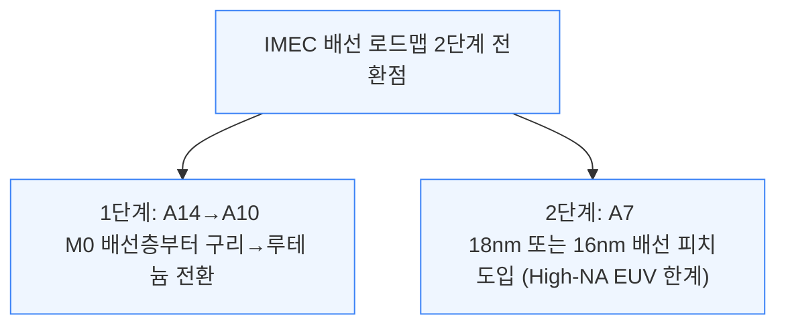

16nm 피치에서는 비아(층간 연결 구멍)의 폭과 간격이 각각 약 8nm에 불과해, 아주 작은 정렬 오차도 치명적입니다. 이 때문에 IMEC은 비아가 저절로 정확한 위치에 맞춰지는 "완전 자기정렬 비아" 공정을 개발했습니다.

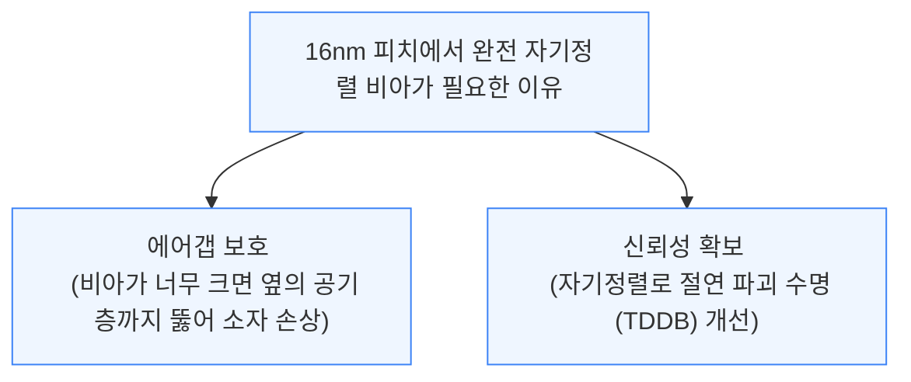

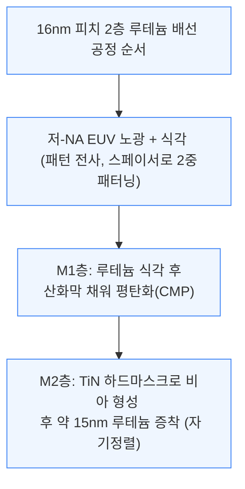

이 공정으로 IMEC은 16nm 피치 2층 루테늄 배선에서 **수율 80% 이상**을 달성했습니다.

---

## 4. 2D 소재(TMD)의 도전과 한계

**📌 핵심:**
- 트랜지스터 게이트 길이가 10nm 이하로 좁아지면 실리콘은 소스-드레인 사이로 전자가 그냥 새어나가는 터널링 누설전류 문제에 부딪히는데, 2D 소재(TMD)는 큰 밴드갭과 무거운 유효질량으로 이 누설을 억제할 후보
- 다만 300mm 웨이퍼 양산이 가능한 합성 공정이 없고(800°C 이상 고온이 필요), 접촉 저항이 실사용 조건(저전압)에서는 여전히 목표치(100Ω·µm 미만)에 못 미치는 게 현실
- P형(양공을 옮기는) 트랜지스터 성능이 N형보다 크게 뒤처지는 비대칭 문제가 핵심 병목으로 남아있어, TSMC는 계면층(IL) 삽입으로 접촉 특성을 2\~3배 개선했지만 여전히 실리콘 성능(약 60mV/dec)에는 못 미침
- 결론: 2D 소재는 실리콘의 물리적 한계를 우회할 유력한 후보지만, 양산성·접촉저항·P형 성능·소자 편차라는 4중 장벽을 동시에 넘어야 제품화 가능

---

게이트 길이가 10nm 이하로 좁아지면 실리콘은 소스-드레인 간 터널링 누설전류에 부딪힙니다. 2D 소재 TMD는 밴드갭이 크고 유효질량이 무거워 이 터널링을 억제할 몇 안 되는 후보입니다.

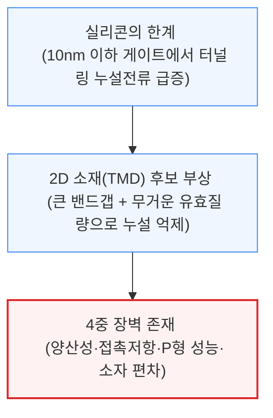

### 첫 번째 장벽: 양산 가능한 합성 공정이 없다

이론적 물성이 좋아도 300mm 웨이퍼에서 반복 재현되지 않으면 의미가 없습니다. 고품질 2D 박막 합성은 대부분 800°C 이상 고온이 필요해 기존 라인에 통합하기 어렵습니다.

그래서 업계는 낮은 온도에서 미리 키운 막을 옮겨 붙이는 "전사(transfer)" 방식에 무게를 둡니다. IMEC은 보이드를 줄인 건식 전사 공정을 공개했지만, 양산 확대는 여전히 어려워 직접 성장이 장기 목표로 남아있습니다.

### 두 번째 장벽: 저전압에서 접촉 저항이 목표치에 못 미침

접촉 저항은 소자 성능이 접촉부에 의해 제한되는지를 가르는 핵심 변수입니다. 기존 연구들은 N형 접촉 저항이 낮다고 보고했지만, 대부분 실제 제품 조건보다 훨씬 높은 전압에서 측정된 결과입니다.

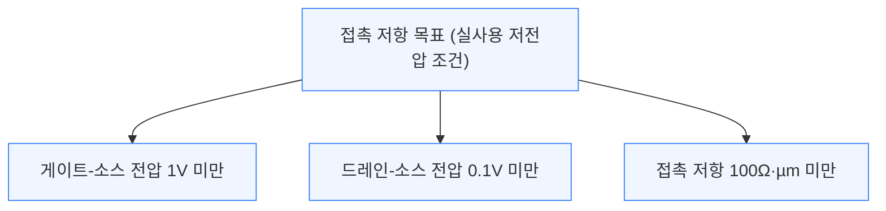

과전압을 걸지 않은 실사용 조건에서 이 목표를 달성하려면, 낮은 전압에서도 높은 전하 농도를 유지해야 접촉 저항을 양자역학적 한계 근처까지 낮출 수 있습니다.

### 세 번째 장벽: P형 트랜지스터가 N형을 따라가지 못함

CMOS(N형·P형을 함께 쓰는 회로) 구현의 관건은 P형(양공 운반) 성능인데, 공정 결함과 계면 물리 문제로 N형에 크게 못 미칩니다. 결함이 P형 특성을 N형 쪽으로 미는 "페르미 준위 고정" 현상이 주원인으로, 양공 주입 장벽을 높입니다.

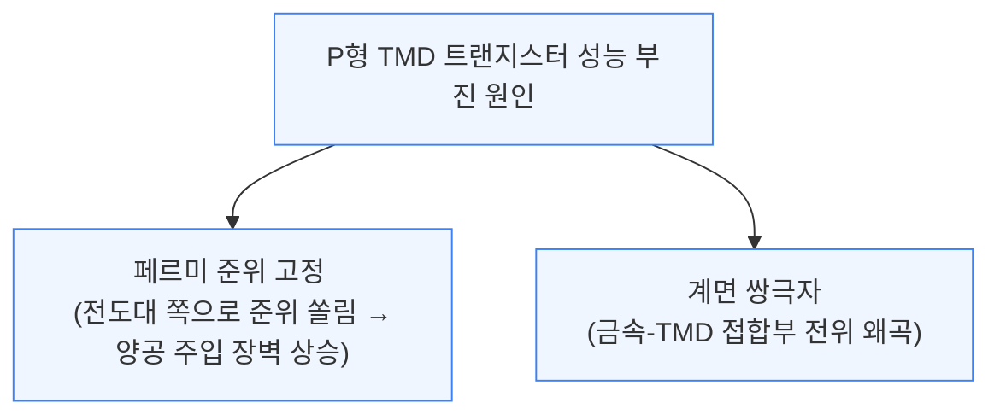

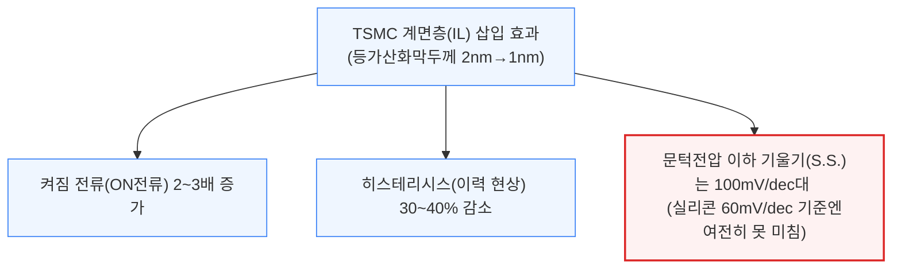

질소 기반 계면층과 표면 전처리를 더하면, 단층 WSe₂ 양공 이동도가 100cm²/V·s를 넘는 결과도 확인됐습니다.

### 네 번째 장벽: 층수·결함에 따른 소자 편차

전사·제조 결함(적층 결함, 공공 등)은 소자 편차의 주요 원인입니다. 층수가 늘수록 밴드갭이 직접형(단층)→간접형(다층)으로 바뀌는데, 다층은 튼튼해도 균일 제조가 어려워 오히려 편차를 키우는 역설이 있습니다.

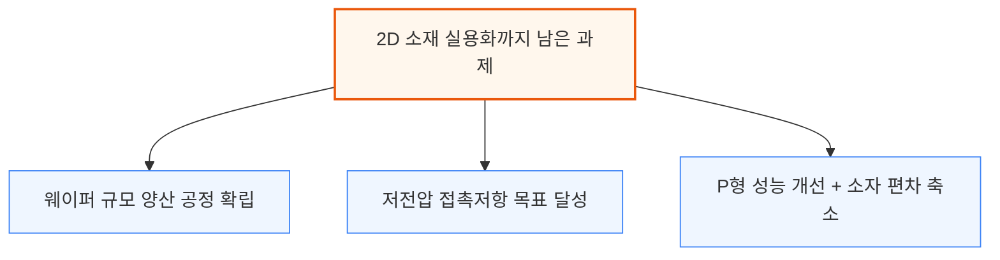

접촉부 형태 논쟁도 진행형이며, TCAD를 그대로 못 써 2D 전용 물리 모델도 필요합니다. 다음 이정표는 단일 소자 기록이 아니라 양산성·접촉·P형 성능·편차가 저전압에서 함께 개선되는 시점입니다.

---

## 5. CFET: TSMC의 링 오실레이터와 SRAM 돌파

**📌 핵심:**
- TSMC는 IEDM에서 CFET(N형과 P형 트랜지스터를 위아래로 쌓는 구조)의 2030년대 상업화·양산 목표를 공식화한 첫 파운드리로, 경쟁 구조인 포크시트 대신 CFET에 승부를 걸었음을 못박음
- CFET는 GAA 대비 트랜지스터 면적 밀도를 **1.5\~2배** 높이며, TSMC는 2023년 단일 소자 검증 → 2024년 인버터(신호 반전 회로) 검증 → 2025년 101단 링 오실레이터와 6T SRAM까지 3년 연속 단계적으로 진전
- SRAM은 위아래 트랜지스터를 잇는 버티드 컨택트(BCT) 구조 덕분에 같은 설계 규칙에서 셀 높이를 **30% 이상 축소**, 그동안 로직 대비 뒤처졌던 온칩 메모리 밀도를 크게 개선
- 결론: CFET는 아직 단순한 테스트 회로 단계지만, 3년간의 착실한 진전을 볼 때 2030년대 초중반 A7\~A5 노드 도입 가능성이 높아짐

---

TSMC는 CFET 상업화·양산을 2030년대 목표로 밝히며, 포크시트 대신 CFET에 전념한다고 선언한 첫 파운드리가 됐습니다. CFET는 후면 배선과 함께 NMOS를 PMOS 위에 쌓아 면적 밀도를 1.5\~2배 높입니다.

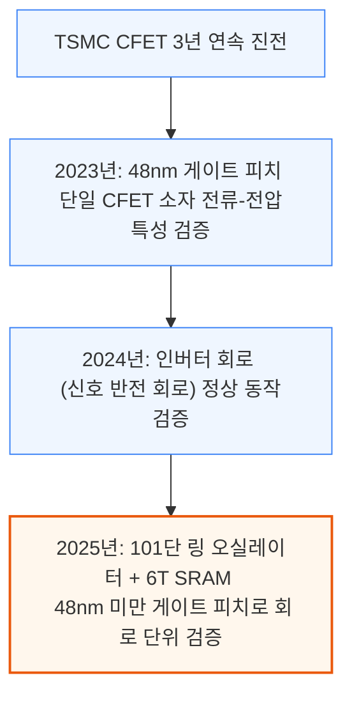

2025년 발표는 개별 소자·단순 회로를 넘어 SRAM과 1,000개 트랜지스터급 회로로 규모를 키운 첫 사례입니다. SRAM은 모든 칩의 고밀도 기본 단위이고, 링 오실레이터는 PVT(공정·전압·온도) 편차와 주파수를 재는 표준 도구입니다.

이와 함께 TSMC는 게이트 피치(트랜지스터 간 최소 간격)를 48nm 미만까지 낮췄다고 공개했습니다.

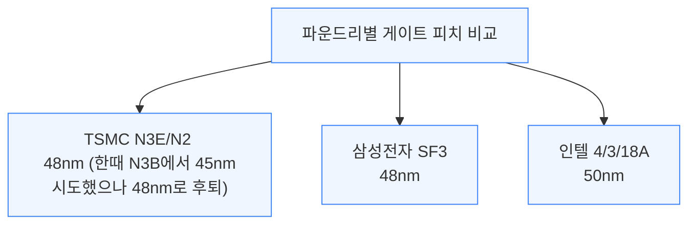

TSMC의 N3B는 게이트-소스/드레인 절연과 기생 커패시턴스의 물리적 한계로 45nm 피치를 포기하고 48nm로 후퇴했던 전례가 있어, 이번 CFET가 48nm 미만으로 다시 내려간 것은 공정 능력이 그만큼 회복됐다는 신호입니다.

### 링 오실레이터: 회로 단위로 처음 측정한 속도·전력 특성

링 오실레이터는 낸드 게이트, 인버터 100개 체인, 분주기, 출력 드라이버로 구성되며 총 트랜지스터는 약 800\~1,000개입니다. TSMC는 0.5\~0.95V에서 주파수·전력을 측정해 설계 유연성도 검증했습니다.

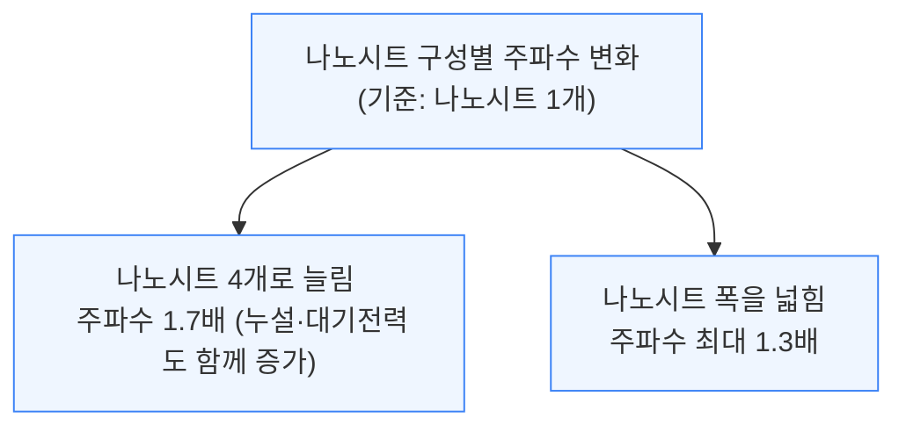

이런 설계 자유도는 별도 운영되던 고성능(HPC) 변종 노드를 대체할 수 있음을 시사합니다. 인접 인버터 셀의 소스/드레인을 격리하는 나노시트 컷 아이솔레이션(NCI)도 적용해, 전면·후면 접점 모두 낮은 누설전류를 유지했습니다.

### SRAM: 세계 최소 크기의 6T 비트셀

TSMC는 버티드 컨택트(BCT, 위아래 트랜지스터를 잇는 수직 접점)를 이용해 상부 NMOS와 하부 PMOS를 연결하는 6T SRAM 셀을 시연했습니다.

```mermaid
flowchart TD
    A["CFET 6T SRAM: 버티드 컨택트(BCT)로 상하 연결"] --> B["단일층 나노시트 대비 셀 높이 30%+ 축소"]
    A --> C["SRAM 셀 면적, 기존 한계 0.020µm²대에서 <br/> 0.014µm² 미만으로 하향 전망"]

    classDef default fill:#eff6ff,stroke:#3b82f6,stroke-width:1px;
    classDef success fill:#f0fdf4,stroke:#16a34a,stroke-width:2px;
    class B success;
    class C success;
```

```mermaid
flowchart TD
    A["TSMC 6T SRAM 2종 비교"] --> B["고밀도(HD)형 <br/> 면적 0.8배 (HC형 대비 작음)"]
    A --> C["고전류(HC)형 <br/> 저전압 읽기전류 1.7배 (HD형 대비)"]

    classDef default fill:#eff6ff,stroke:#3b82f6,stroke-width:1px;
```

이는 로직 밀도 개선을 따라가지 못했던 온칩 메모리 밀도에 반가운 소식입니다. BCT도 EUV 마스크 추가형(고비용, 설계 유연성 높음)과 마스크 절감형(저비용)을 함께 시험했는데, 두 버전 모두 SRAM 읽기·쓰기 여유는 비슷했습니다.

TSMC는 다음 단계로 스캔 플립플롭 등 복잡한 표준 셀 설계와 다중 포트 SRAM 매크로 배열 제작을 예고했으며, 이후 초기 고객사용 PDK0.01(초기 설계 키트) 배포로 이어질 전망입니다.

적층 구조 특유의 방열 문제 등 과제가 남아있지만, CFET 도입은 2030년대 A7 또는 A5 노드부터 시작될 가능성이 있습니다.

---

## 6. CFET: IMEC 모놀리식 집적 기술

**📌 핵심:**
- IMEC(ASM·인텔 지원)은 하나의 웨이퍼에 실리콘·희생층을 높게 쌓는 대신, 두 장의 웨이퍼에 나눠 성장시킨 뒤 접합(본딩)하는 새로운 CFET 제조 흐름을 제시
- 이 방식은 스트레인(결정 변형) 한계에 부딪히기 전에 더 많은 나노시트 층을 쌓을 수 있어, 고성능 CFET에 필요한 **트랜지스터당 나노시트 4개** 구조를 구현 가능하게 함
- 접합에 쓰는 SiCN 절연막이 상하 트랜지스터를 분리하는 중간 절연층(MDI) 역할까지 겸해 별도 공정 없이 **두께 15nm**까지 얇혀 기생 저항·용량을 줄임
- 결론: 접합 기판 방식은 CFET가 양산(HVM) 단계에 진입할 때 주요 파운드리들이 채택할 가능성이 높은 유력 후보 공정

---

기존 모놀리식 CFET 공정은 한 웨이퍼 위에 실리콘과 희생 실리콘게르마늄(SiGe) 층, 더미 절연층까지 매우 높게 쌓아야 했습니다. IMEC과 ASM은 인텔의 지원을 받아, 이 성장 과정을 두 장의 웨이퍼로 나누는 새로운 흐름을 제안했습니다.

```mermaid
flowchart TD
    A["기증 웨이퍼(Donor)에 <br/> 트랜지스터 층 별도 성장"] --> B["운반 웨이퍼(Carrier)에 접합(본딩)"]
    B --> C["기증 웨이퍼를 얇게 깎아 <br/> 최상단 성장층만 남김 → 나노시트 식각 진행"]

    classDef default fill:#eff6ff,stroke:#3b82f6,stroke-width:1px;
```

두 웨이퍼로 나눠 성장시키면 결정 변형(스트레인)이 한계치에 도달하기 전에 더 많은 나노시트 층을 쌓을 수 있어, 트랜지스터 하나에 나노시트 4개가 필요한 고성능 CFET 소자도 이 공정 흐름 안에서 만들 수 있습니다.

```mermaid
flowchart TD
    A["접합 기판 방식의 이점"] --> B["트랜지스터당 나노시트 4개 <br/> 구조까지 구현 가능 (고성능 CFET)"]
    A --> C["접합용 SiCN 절연막이 <br/> 중간 절연층(MDI) 역할 겸용 → 두께 15nm까지 축소"]

    classDef default fill:#eff6ff,stroke:#3b82f6,stroke-width:1px;
    classDef success fill:#f0fdf4,stroke:#16a34a,stroke-width:2px;
    class B success;
    class C success;
```

접합은 상온의 친수성 웨이퍼 융합 방식입니다. SiCN 절연막을 고온으로 치밀화·평탄화한 뒤 플라즈마로 수산기(OH)를 형성하고 열처리로 접합 강도를 높입니다.

이 SiCN 접합부는 이후 공정의 추가 열처리에도 빈 공간(보이드) 없이 유지되며, 막이 균일해 접합 전 별도 연마(CMP)가 거의 필요 없습니다.

### 이종 결정 방향: N형과 P형에 각각 최적화된 실리콘 방향

나노시트 채널은 표면적 대부분이 수평이라 결정 방향의 영향을 크게 받는데, 이는 채널이 수직으로 서 있던 핀펫(FinFET)에는 없던 특성입니다. 방향을 하나만 골라야 했던 비적층 GAA는 NMOS·PMOS 중 하나가 항상 손해를 봤습니다.

```mermaid
flowchart TD
    A["실리콘 결정 방향과 이동도"] --> B["(100) 방향 <br/> 전자 이동도 우수 → NMOS에 유리"]
    A --> C["(110) 방향 <br/> 양공 이동도 우수 → PMOS에 유리"]
    C --> D["실측 결과: PMOS 성능 개선 없음 <br/> (소스/드레인 접촉 저항 증가가 이동도 이득을 상쇄)"]

    classDef default fill:#eff6ff,stroke:#3b82f6,stroke-width:1px;
    classDef danger fill:#fef2f2,stroke:#dc2626,stroke-width:2px;
    class D danger;
```

실측에서는 (110) 표면의 소스/드레인 접촉 저항 증가가 이동도 이득을 상쇄해 PMOS 성능이 개선되지 않았습니다.

향후에는 NMOS는 실리콘, PMOS는 실리콘게르마늄으로 채널 재료를 달리하는 조합과 후면 배선용 하부 절연층 삽입이 검토되고 있습니다. 접합 기판 방식은 CFET 양산 단계에서 주요 파운드리가 채택할 가능성이 높은 공정입니다.

---

## 7. CFET: A7에서 A3까지, 얼마나 더 스케일링할 수 있나

**📌 핵심:**
- IMEC은 첫 CFET 노드인 A7부터 A5, A3까지 셀 높이를 **69nm → 56nm → 42nm**로 줄이는 로드맵을 제시했으며, 각 단계마다 셀이 작아지며 생기는 주파수 손실을 별도 기법으로 상쇄
- A7에서는 후면 접점·좁은 게이트 확장 등으로 기생 커패시턴스를 N2보다 낮췄고, A5에서는 오메가 게이트 구조로 줄어든 채널 폭을 보완, A3에서는 결정 방향을 다르게 써서 전류를 **20% 높임**
- 이런 보완책이 없다면 셀이 작아질수록 주파수가 계속 떨어지는데, IMEC의 로드맵은 매 노드마다 손실분을 새로운 기법으로 메워가는 방식
- 결론: CFET는 A7 도입만으로 끝나는 것이 아니라, A3까지 최소 3세대에 걸쳐 셀 축소와 성능 보완을 반복하며 진화할 기술

---

IMEC은 A7(첫 CFET 노드)부터 A5, A3까지 3세대에 걸친 CFET 스케일링 로드맵을 제시했습니다. 셀 높이가 줄어들수록 채널 폭이 좁아져 주파수가 떨어지는데, 매 노드마다 이를 상쇄할 별도 기법이 필요합니다.

```mermaid
flowchart TD
    A["A7 노드: 셀 높이 69nm <br/> 공통 게이트 더블로우 설계"] --> B["A5 노드: 셀 높이 56nm <br/> 시트 폭 21nm→16nm 축소"]
    B --> C["A3 노드: 셀 높이 42nm <br/> 채널 폭 확보가 최대 과제"]

    classDef default fill:#eff6ff,stroke:#3b82f6,stroke-width:1px;
```

### A7: 공통 게이트 구조의 용량 문제를 후면 접점으로 해결

A7은 한 쌍의 CFET가 상하 트랜지스터 접점을 잇는 공통 중간 배선벽을 공유하는 더블로우(2행) 설계입니다. 그러나 이 구조는 N2 공정보다 게이트 커패시턴스(유효 폭 대비)가 27% 높아 주파수가 떨어지는 문제가 있었습니다.

```mermaid
flowchart TD
    A["A7 구조의 문제: N2 대비 게이트 커패시턴스 27% 높음"] --> B["해결책 1: 하부 소자 접점을 전면 대신 후면으로 이동"]
    A --> C["해결책 2: 게이트 확장부 폭 12nm→9nm로 축소"]
    A --> D["해결책 3: 전원 배선을 M0층까지 다시 끌어올림"]

    classDef default fill:#eff6ff,stroke:#3b82f6,stroke-width:1px;
    classDef success fill:#f0fdf4,stroke:#16a34a,stroke-width:2px;
    class B success;
    class C success;
    class D success;
```

이 세 가지를 함께 적용해 A7의 게이트 커패시턴스를 N2보다 낮은 수준까지 되돌렸습니다.

### A5: 오메가 게이트로 줄어든 채널 폭을 보완

A5는 셀 높이가 56nm로 줄고 활성 시트 폭도 21nm에서 16nm로 좁아지면서, 기생 커패시턴스는 늘고 유효 폭은 줄어 A7 대비 주파수가 추가로 5% 떨어지는 문제가 생겼습니다. IMEC은 포크시트 구조를 변형한 "오메가 게이트"로 이를 보완합니다.

```mermaid
flowchart TD
    A["A5의 문제: 시트 폭 축소로 A7 대비 주파수 5% 추가 하락"] --> B["오메가 게이트 도입 <br/> (포크시트 격벽을 5nm 깎아내 Ω자 모양 게이트 형성)"]
    B --> C["포크시트 구조에서 원래 없던 4번째 면의 <br/> 채널 폭을 일부 회복"]

    classDef default fill:#eff6ff,stroke:#3b82f6,stroke-width:1px;
```

오메가 게이트는 원래 2025년 VLSI 학회에서 A10 GAA 노드용으로 먼저 발표됐던 기법을, IMEC이 A5 CFET에도 적용한 사례입니다.

### A3: 결정 방향을 바꿔 전류를 높이고 소자 폭을 줄임

A3는 셀 높이가 42nm까지 줄어 채널 폭을 확보할 공간 자체가 부족해집니다. IMEC은 커패시턴스를 더 줄이는 대신, 유효 채널 폭당 구동 전류 자체를 높이는 방향을 택했습니다.

```mermaid
flowchart TD
    A["A3의 해법: 결정 방향을 NMOS·PMOS별로 다르게 설정"] --> B["NMOS: <110> 실리콘 방향"]
    A --> C["PMOS: <111> 실리콘 방향"]
    B --> D["전류 20% 증가 → 시트 폭을 8nm까지 낮춰도 <br/> 성능 유지, 전력밀도는 오히려 감소"]
    C --> D

    classDef default fill:#eff6ff,stroke:#3b82f6,stroke-width:1px;
    classDef success fill:#f0fdf4,stroke:#16a34a,stroke-width:2px;
    class D success;
```

이 기법으로 A3는 전류를 높이면서 시트 폭을 8nm까지 줄여 전력 밀도를 낮출 여지도 확보했습니다.

A7의 후면 접점, A5의 오메가 게이트, A3의 하이브리드 결정 방향까지, IMEC 로드맵은 세대마다 새 보완 기법을 하나씩 투입해 CFET 수명을 늘려가는 구조입니다.

---

*작성 진행률: 100% 완료*
*업데이트: 7장(CFET A7\~A3 스케일링 로드맵) 작성 완료, 원문 전 섹션 번역 완료*
