# AMD Advancing AI: MI350X and MI400 UALoE72, MI500 UAL256

> **출처**: [SemiAnalysis Newsletter](https://newsletter.semianalysis.com/p/amd-advancing-ai-mi350x-and-mi400-ualoe72-mi500-ual256)
> **저자**: Kimbo Chen, Dylan Patel, Daniel Nishball
> **발행일**: 2026-02-05

---

## 📑 목차

### 전체 섹션
 1. [개요 - AMD Advancing AI 2025 발표 요약](#1-개요---amd-advancing-ai-2025-발표-요약)
 2. [MI350X·MI355X 스펙 - CDNA4 기반 신제품](#2-mi350x·mi355x-스펙---cdna4-기반-신제품)
 3. [MI355X vs HGX B200 - 성능당비용(TCO) 경쟁력](#3-mi355x-vs-hgx-b200---성능당비용tco-경쟁력)
 4. [엔비디아 DGX Lepton과 뉴클라우드의 반발](#4-엔비디아-dgx-lepton과-뉴클라우드의-반발)
 5. [MI355X는 랙 스케일 솔루션이 아니다 - 마케팅 과장 논란](#5-mi355x는-랙-스케일-솔루션이-아니다---마케팅-과장-논란)
 6. [하이퍼스케일러·AI 랩의 AMD 신제품 채택 현황](#6-하이퍼스케일러·ai-랩의-amd-신제품-채택-현황)
 7. [AMD 뉴클라우드 렌탈 시장의 구조적 약점](#7-amd-뉴클라우드-렌탈-시장의-구조적-약점)
 8. [AMD의 뉴클라우드 생태계 육성 전략](#8-amd의-뉴클라우드-생태계-육성-전략)
 9. [ROCm 소프트웨어 개선과 엔지니어링 우선순위 이슈](#9-rocm-소프트웨어-개선과-엔지니어링-우선순위-이슈)
10. [MI355X 제조 - 칩렛 아키텍처 리파인](#10-mi355x-제조---칩렛-아키텍처-리파인)
11. [CDNA4 마이크로아키텍처(UArch) 상세](#11-cdna4-마이크로아키텍처uarch-상세)
12. [AMD AI 엔지니어 보상 현실화 움직임](#12-amd-ai-엔지니어-보상-현실화-움직임)
13. [MI400 시리즈 Flexible I/O와 UALoE72 - 진짜 UALink는 아니다](#13-mi400-시리즈-flexible-io와-ualoe72---진짜-ualink는-아니다)
14. [MI400 Helios 랙 아키텍처 상세](#14-mi400-helios-랙-아키텍처-상세)
15. [MI500 UAL256 - 2027년 차세대 랙 컨셉](#15-mi500-ual256---2027년-차세대-랙-컨셉)
16. [MI350X·MI355X·MI400 BOM과 TCO 비교](#16-mi350x·mi355x·mi400-bom과-tco-비교)

---

## 🔑 용어 정리

본문을 순서대로 읽기 전에 알아두면 좋은 용어들입니다. 자세한 수치와 설명은 본문에서 처음 등장하는 위치에 나옵니다.

- **TCO(총소유비용, Total Cost of Ownership)**: 장비 구매 비용뿐 아니라 운영·전력·유지보수까지 합친 전체 비용 — 이 문서 전반에서 AMD와 Nvidia 제품을 비교하는 핵심 잣대
- **랙 스케일(Rack Scale) 솔루션**: 랙 안의 모든 GPU가 하나의 초고속 네트워크로 묶여 마치 GPU 1개처럼 작동하는 설계 — 몇 개의 서버를 그냥 한 랙에 모아놓은 것과는 다름
- **뉴클라우드(Neocloud)**: 하이퍼스케일러(Google·AWS 등 대형 클라우드)가 아니면서 GPU를 임대해주는 전문 GPU 클라우드 업체(예: CoreWeave, Tensorwave, Crusoe)
- **ROCm**: AMD GPU를 위한 오픈소스 소프트웨어 스택 — Nvidia의 CUDA에 대응하는 개념
- **UALink vs UALoE**: UALink는 여러 업체가 공동 개발 중인 GPU 스케일업(랙 내부 초고속 연결) 표준 규격 자체, UALoE(UALink over Ethernet)는 그 규격을 이더넷 스위치 위에 얹어 흉내만 낸 것 — 이 문서의 핵심 논쟁거리
- **BOM(부품 명세서, Bill of Materials)**: 시스템 하나를 만드는 데 들어가는 모든 부품과 그 원가를 나열한 목록
- **CU(컴퓨트 유닛, Compute Unit)**: AMD GPU 내부의 연산 처리 단위 — Nvidia의 SM(Streaming Multiprocessor)에 대응하는 개념
- **DGX Lepton**: Nvidia가 내놓은 GPU 임대 마켓플레이스 — 여러 클라우드의 GPU를 하나의 표준화된 창구로 묶어 파는 서비스

---

## 1. 개요 - AMD Advancing AI 2025 발표 요약

**📌 핵심:**
- MI350X·MI355X는 소형\~중형 모델 추론에서 Nvidia HGX B200과 경쟁 가능하지만, **랙 스케일 솔루션이 아니며** GB200 NVL72(프런티어 모델 추론·학습)와는 급이 다름
- 진짜 랙 스케일 제품은 **MI400 시리즈** — 2026년 하반기 Nvidia VR200 NVL144와 경쟁 가능할 전망이나, 스케일업 네트워크는 진짜 UALink가 아니라 이더넷 위에 얹은 **UALoE(UALink over Ethernet)**
- Nvidia의 GPU 임대 마켓플레이스 DGX Lepton이 뉴클라우드(전문 GPU 임대업체)들의 불만을 사면서, AMD가 뉴클라우드 생태계를 파고들 기회의 창이 열림
- 결론: AWS는 신규 대형 고객으로 합류했지만 Microsoft는 여전히 소극적 — AMD의 하드웨어 경쟁력 개선이 뉴클라우드·소프트웨어 격차라는 두 숙제와 함께 진행 중

---

지난 6개월간 AMD는 전시(Wartime) 태세로 Nvidia와의 경쟁력 확보에 총력을 기울여 왔습니다. Advancing AI 2025 행사에서 MI350X/MI355X GPU를 공개했는데, 소형\~중형 LLM 추론에서 성능당비용(TCO) 기준으로 Nvidia HGX B200과 경쟁할 만한 수준입니다.
다만 MI355X는 랙 스케일 제품이 아니며, 프런티어 모델 추론·학습에서는 GB200 NVL72의 상대가 되지 못합니다.

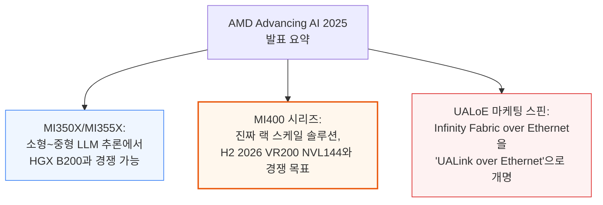
```mermaid
flowchart TD
    Event["AMD Advancing AI 2025<br/>발표 요약"] --> P1["MI350X/MI355X:<br/>소형~중형 LLM 추론에서<br/>HGX B200과 경쟁 가능"]
    Event --> P2["MI400 시리즈:<br/>진짜 랙 스케일 솔루션,<br/>H2 2026 VR200 NVL144와 경쟁 목표"]
    Event --> P3["UALoE 마케팅 스핀:<br/>Infinity Fabric over Ethernet을<br/>'UALink over Ethernet'으로 개명"]

    style P1 fill:#eff6ff,stroke:#3b82f6
    style P2 fill:#fff7ed,stroke:#ea580c,stroke-width:2px
    style P3 fill:#fef2f2,stroke:#dc2626
```

이번 리포트는 AMD 신제품의 상대적 경쟁력과 총소유비용을 분석하고, 신규 하이퍼스케일 고객 AWS와 반대로 후속 주문이 계속 실망스러운 기존 고객 Microsoft를 다룹니다.
또한 Nvidia의 DGX Lepton Marketplace 출시로 뉴클라우드 파트너들의 불만이 커지면서 AMD에게 열린 기회의 창, AMD가 뉴클라우드에 투자하는 금융공학적 기법, 내부 연구개발 클러스터 투자까지 살펴봅니다.

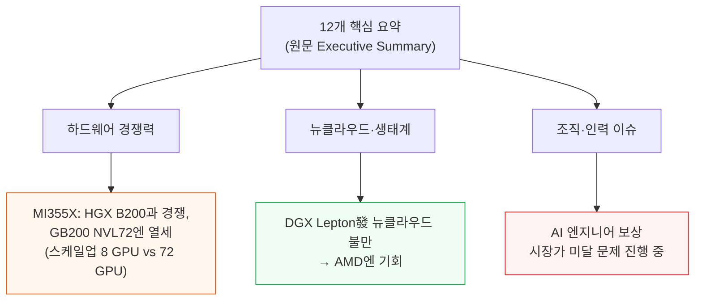
```mermaid
flowchart TD
    Summary["12개 핵심 요약<br/>(원문 Executive Summary)"] --> Hw["하드웨어 경쟁력"]
    Summary --> Eco["뉴클라우드·생태계"]
    Summary --> Org["조직·인력 이슈"]

    Hw --> Hw1["MI355X: HGX B200과 경쟁,<br/>GB200 NVL72엔 열세<br/>(스케일업 8 GPU vs 72 GPU)"]
    Eco --> Eco1["DGX Lepton發 뉴클라우드 불만<br/>→ AMD엔 기회"]
    Org --> Org1["AI 엔지니어 보상<br/>시장가 미달 문제 진행 중"]

    style Hw1 fill:#fff7ed,stroke:#ea580c
    style Eco1 fill:#f0fdf4,stroke:#16a34a
    style Org1 fill:#fef2f2,stroke:#dc2626
```

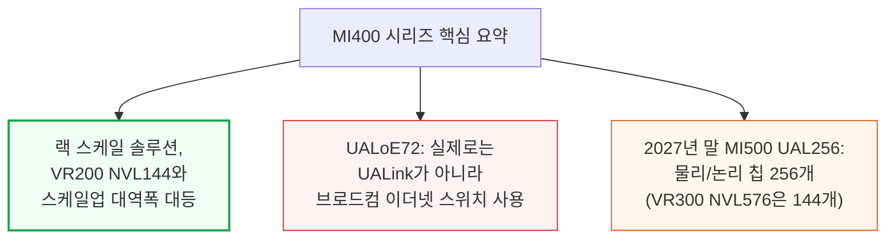
```mermaid
flowchart TD
    MI400sum["MI400 시리즈 핵심 요약"] --> M1["랙 스케일 솔루션,<br/>VR200 NVL144와<br/>스케일업 대역폭 대등"]
    MI400sum --> M2["UALoE72: 실제로는<br/>UALink가 아니라<br/>브로드컴 이더넷 스위치 사용"]
    MI400sum --> M3["2027년 말 MI500 UAL256:<br/>물리/논리 칩 256개<br/>(VR300 NVL576은 144개)"]

    style M1 fill:#f0fdf4,stroke:#16a34a,stroke-width:2px
    style M2 fill:#fef2f2,stroke:#dc2626
    style M3 fill:#fff7ed,stroke:#ea580c
```

---

## 2. MI350X·MI355X 스펙 - CDNA4 기반 신제품

**📌 핵심:**
- MI350X(1,000W, 공랭)와 MI355X(1,400W, 공랭+물 냉각 지원) 두 버전 — MI355X가 전력을 1.4배 더 쓰지만 공식 스펙상 TFLOPS는 10% 미만 향상, 다만 실제로는 전력 제약 탓에 공식 스펙 자체가 실전에서 잘 안 나오므로 격차가 더 클 것으로 예상
- FP4 포맷에서 MI355X는 OCP MX4만 지원(32개 원소 블록 단위 보정)하는 반면, Nvidia Blackwell은 MX4와 NVFP4(16개 원소 블록, 정확도 더 좋음)를 모두 지원 — 정밀도 열세는 런타임 양자화 기법으로 일부 보완 가능
- HBM 용량은 288GB로 B200(180GB)보다 많아 단일 노드 추론에 유리하지만, 스케일업 네트워크(XGMI, 76.8GB/s)는 Nvidia의 스위치형 전체연결 방식보다 1.6배 느림 — GB200/GB300 NVL72(72개 GPU 스케일업)와는 비교 자체가 무의미(MI350/355는 8개 GPU만 연결)
- 결론: MI350X/MI355X는 스펙상 HGX B200과 경쟁 가능한 수준이지만, 스케일아웃 네트워킹(400Gbit/s, AMD 800GbE NIC는 2H 2026 양산)도 Nvidia 대비 뒤처짐

---

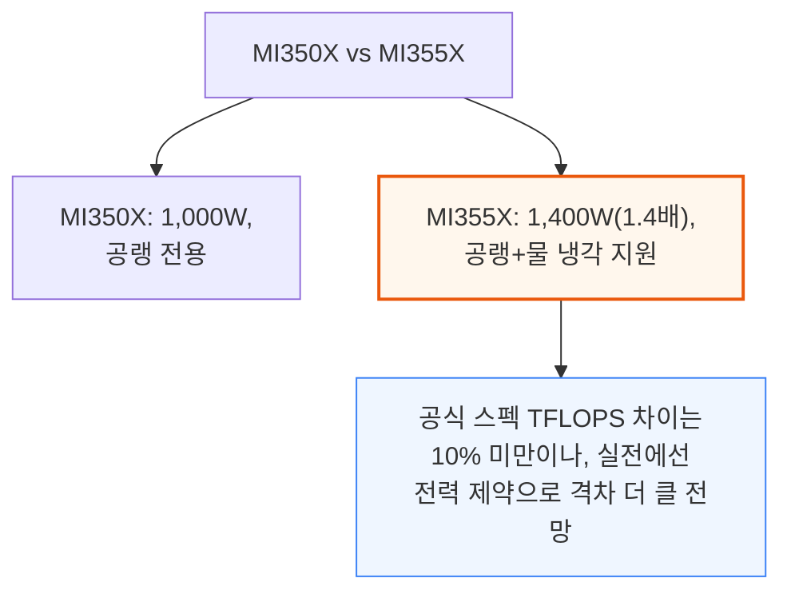
```mermaid
flowchart TD
    Chips["MI350X vs MI355X"] --> C1["MI350X: 1,000W,<br/>공랭 전용"]
    Chips --> C2["MI355X: 1,400W(1.4배),<br/>공랭+물 냉각 지원"]
    C2 --> C3["공식 스펙 TFLOPS 차이는<br/>10% 미만이나, 실전에선<br/>전력 제약으로 격차 더 클 전망"]

    style C2 fill:#fff7ed,stroke:#ea580c,stroke-width:2px
    style C3 fill:#eff6ff,stroke:#3b82f6
```

📌 용어 풀이: 왜 공식 스펙이 실전에서 안 나오나
> - 공식 스펙(피크 TFLOPS)은 "최고 클럭 속도를 계속 유지할 수 있다"고 가정하지만, 실제로는 전력·발열 제약 때문에 클럭이 계속 떨어짐
> - AMD·Nvidia 모두 겪는 문제 — 그래서 저자는 MI355X의 실제 성능이 공식 스펙상 "10% 미만 향상"보다 더 클 것으로 추정

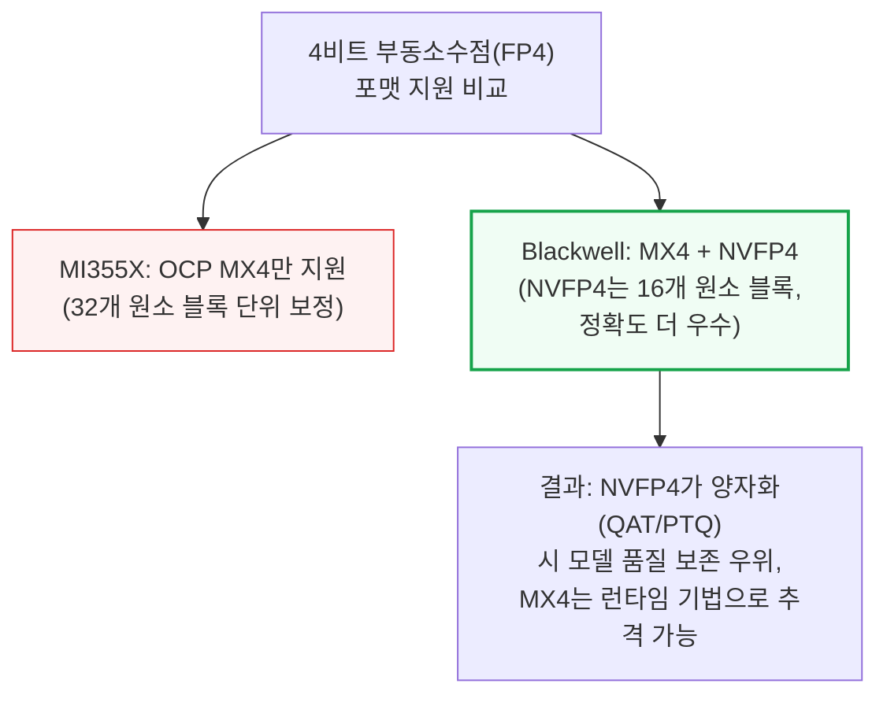
```mermaid
flowchart TD
    FP4["4비트 부동소수점(FP4)<br/>포맷 지원 비교"] --> AMDf["MI355X: OCP MX4만 지원<br/>(32개 원소 블록 단위 보정)"]
    FP4 --> NVf["Blackwell: MX4 + NVFP4<br/>(NVFP4는 16개 원소 블록,<br/>정확도 더 우수)"]
    NVf --> Quant["결과: NVFP4가 양자화(QAT/PTQ)<br/>시 모델 품질 보존 우위,<br/>MX4는 런타임 기법으로 추격 가능"]

    style AMDf fill:#fef2f2,stroke:#dc2626
    style NVf fill:#f0fdf4,stroke:#16a34a,stroke-width:2px
```

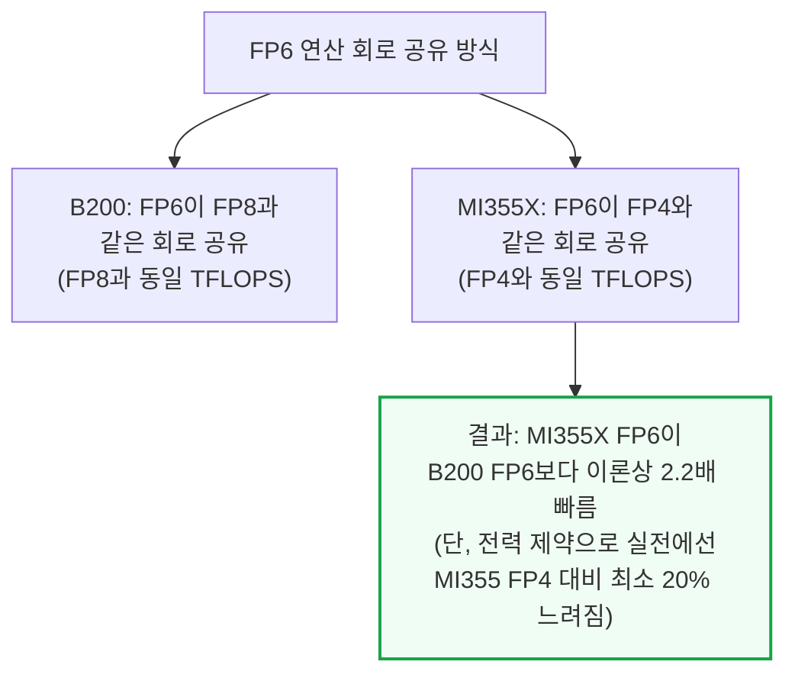
```mermaid
flowchart TD
    FP6["FP6 연산 회로 공유 방식"] --> B200fp6["B200: FP6이 FP8과<br/>같은 회로 공유<br/>(FP8과 동일 TFLOPS)"]
    FP6 --> AMDfp6["MI355X: FP6이 FP4와<br/>같은 회로 공유<br/>(FP4와 동일 TFLOPS)"]
    AMDfp6 --> Result["결과: MI355X FP6이<br/>B200 FP6보다 이론상 2.2배 빠름<br/>(단, 전력 제약으로 실전에선<br/>MI355 FP4 대비 최소 20% 느려짐)"]

    style Result fill:#f0fdf4,stroke:#16a34a,stroke-width:2px
```

B300 HGX NVL8은 FP64·int8 텐서 코어 대부분을 제거하고 그 자리에 FP4 텐서 코어 회로를 1.4배 늘렸습니다. 이 최적화 덕에 B300의 FP4 TFLOPS는 MI355X보다 1.3배 빠르면서도 소비 전력은 200W 적습니다(MI350/355는 이 최적화를 쓰지 않음).

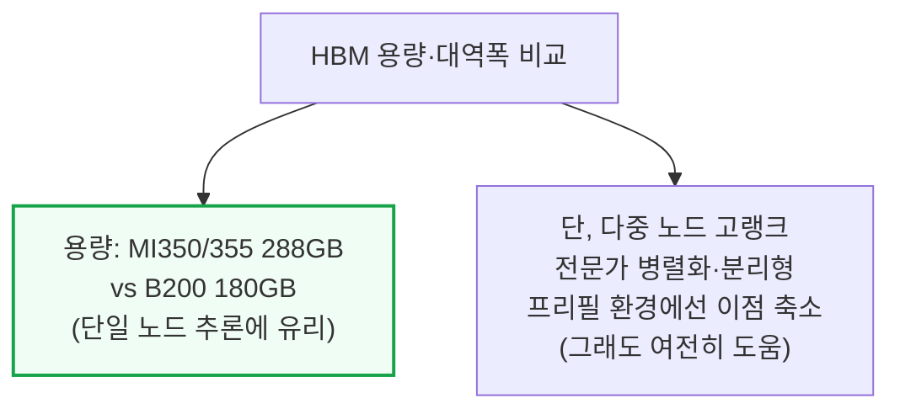
```mermaid
flowchart TD
    HBMcompare["HBM 용량·대역폭 비교"] --> Cap["용량: MI350/355 288GB<br/>vs B200 180GB<br/>(단일 노드 추론에 유리)"]
    HBMcompare --> Note["단, 다중 노드 고랭크<br/>전문가 병렬화·분리형<br/>프리필 환경에선 이점 축소<br/>(그래도 여전히 도움)"]

    style Cap fill:#f0fdf4,stroke:#16a34a,stroke-width:2px
```

메모리 대역폭이 용량보다 훨씬 중요한 지표라, 8-Hi HBM4를 서로 다른 2개의 대형 ASIC 프로그램용으로 두 HBM 벤더가 서둘러 개발 중입니다(자세한 내용은 SemiAnalysis 가속기·HBM 모델 참고).

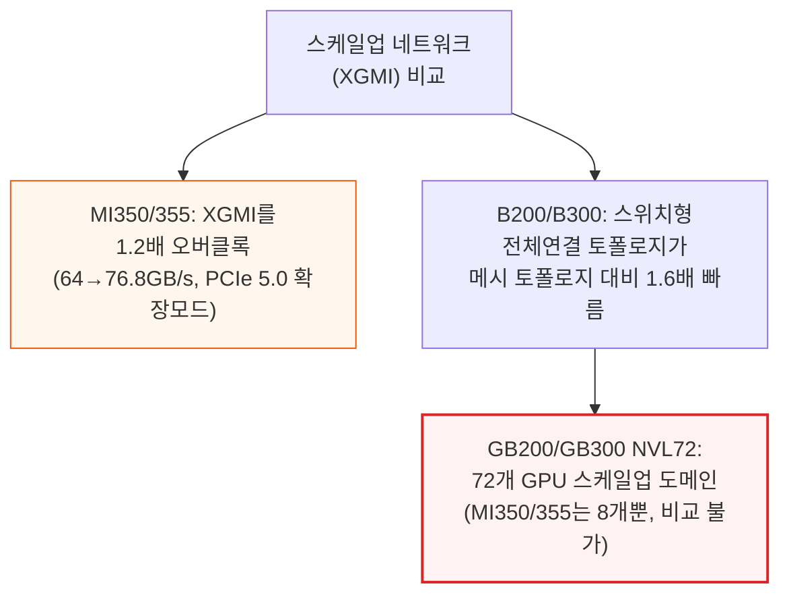
```mermaid
flowchart TD
    ScaleUp["스케일업 네트워크<br/>(XGMI) 비교"] --> AMDxgmi["MI350/355: XGMI를<br/>1.2배 오버클록<br/>(64→76.8GB/s, PCIe 5.0 확장모드)"]
    ScaleUp --> NVswitch["B200/B300: 스위치형<br/>전체연결 토폴로지가<br/>메시 토폴로지 대비 1.6배 빠름"]
    NVswitch --> NVL72["GB200/GB300 NVL72:<br/>72개 GPU 스케일업 도메인<br/>(MI350/355는 8개뿐, 비교 불가)"]

    style AMDxgmi fill:#fff7ed,stroke:#ea580c
    style NVL72 fill:#fef2f2,stroke:#dc2626,stroke-width:2px
```

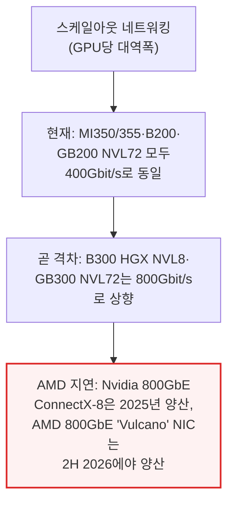
```mermaid
flowchart TD
    ScaleOut["스케일아웃 네트워킹<br/>(GPU당 대역폭)"] --> Same["현재: MI350/355·B200·<br/>GB200 NVL72 모두<br/>400Gbit/s로 동일"]
    Same --> Next["곧 격차: B300 HGX NVL8·<br/>GB300 NVL72는 800Gbit/s로 상향"]
    Next --> Lag["AMD 지연: Nvidia 800GbE<br/>ConnectX-8은 2025년 양산,<br/>AMD 800GbE 'Vulcano' NIC는<br/>2H 2026에야 양산"]

    style Lag fill:#fef2f2,stroke:#dc2626,stroke-width:2px
```

---

## 3. MI355X vs HGX B200 - 성능당비용(TCO) 경쟁력

**📌 핵심:**
- MI355X는 소형\~중형 LLM 프로덕션 추론에서 HGX B200 대비 TCO가 33% 낮으면서 HBM 용량은 더 많고, FP8·FP4 TFLOPS는 소폭 우위, FP6 TFLOPS는 2배 — AMD 소프트웨어(ROCm) 개선이 이어지면 이 우위는 더 커질 전망
- AMD의 핵심 세일즈 포인트는 "칩에 직접 물을 공급하는 냉각 방식(DLC)이 필요 없다"는 점이지만, 정작 비교 대상은 이미 시장에 나온 지 오래된 Nvidia의 "보급형" HGX 제품군 — GB200 NVL72(플래그십)과는 애초에 체급이 다름
- MI355X는 스케일업 세계 크기가 작아(8 GPU) GB200 NVL72와 정면 승부가 불가능 → 대신 공랭형 HGX B200 NVL8·HGX B300 NVL8을 겨냥하는 포지셔닝
- 결론: 대규모 스케일업 네트워크의 이점을 못 받는 소형\~중형 모델 사용자에게는 MI355X가 매력적이지만, 대규모 분리형 서빙이나 혼합 전문가(MoE) 모델을 쓰는 추론 환경에서는 GB200 NVL72가 성능·성능당비용 모두 압도

---

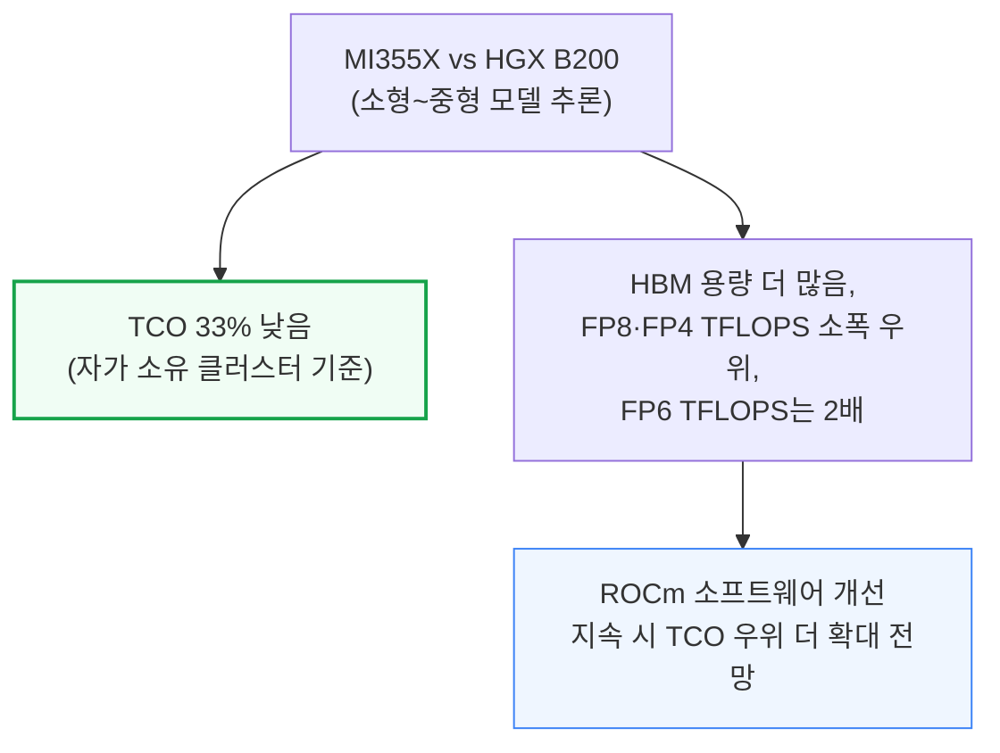
```mermaid
flowchart TD
    TCOcomp["MI355X vs HGX B200<br/>(소형~중형 모델 추론)"] --> T1["TCO 33% 낮음<br/>(자가 소유 클러스터 기준)"]
    TCOcomp --> T2["HBM 용량 더 많음,<br/>FP8·FP4 TFLOPS 소폭 우위,<br/>FP6 TFLOPS는 2배"]
    T2 --> T3["ROCm 소프트웨어 개선<br/>지속 시 TCO 우위 더 확대 전망"]

    style T1 fill:#f0fdf4,stroke:#16a34a,stroke-width:2px
    style T3 fill:#eff6ff,stroke:#3b82f6
```

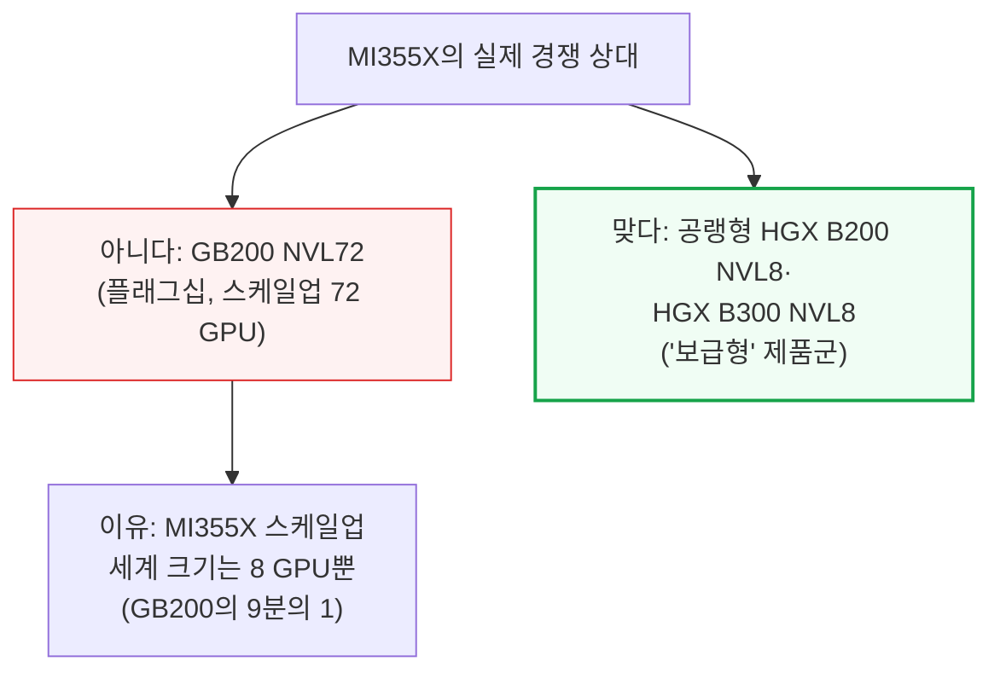
```mermaid
flowchart TD
    Position["MI355X의 실제 경쟁 상대"] --> NotThis["아니다: GB200 NVL72<br/>(플래그십, 스케일업 72 GPU)"]
    Position --> ThisOne["맞다: 공랭형 HGX B200 NVL8·<br/>HGX B300 NVL8<br/>('보급형' 제품군)"]
    NotThis --> WhyNot["이유: MI355X 스케일업<br/>세계 크기는 8 GPU뿐<br/>(GB200의 9분의 1)"]

    style NotThis fill:#fef2f2,stroke:#dc2626
    style ThisOne fill:#f0fdf4,stroke:#16a34a,stroke-width:2px
```

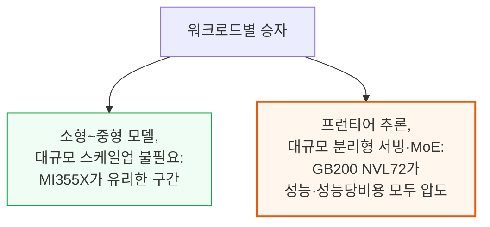
```mermaid
flowchart TD
    Winner["워크로드별 승자"] --> Small["소형~중형 모델,<br/>대규모 스케일업 불필요:<br/>MI355X가 유리한 구간"]
    Winner --> Large["프런티어 추론,<br/>대규모 분리형 서빙·MoE:<br/>GB200 NVL72가<br/>성능·성능당비용 모두 압도"]

    style Small fill:#f0fdf4,stroke:#16a34a
    style Large fill:#fff7ed,stroke:#ea580c,stroke-width:2px
```

이 제품 구간은 MI355X의 소프트웨어 품질과 AMD가 책정할 가격에 따라 의미 있는 물량이 출하될 전망입니다.

---

## 4. 엔비디아 DGX Lepton과 뉴클라우드의 반발

**📌 핵심:**
- Nvidia는 GTC Paris에서 DGX Lepton 마켓플레이스 전략을 공개 — 사용자가 여러 클라우드 사이에서 같은 사용자 경험으로 추론 워크로드를 자동으로 옮길 수 있게 하는 서비스로, AI 컴퓨트를 세계적으로 표준화·상품화하는 게 목표
- Uber·Lyft가 운전기사를 저마진 플랫폼 노동자로 묶어낸 것처럼, DGX Lepton이 성공하면 뉴클라우드들이 표준화된 가격 경쟁(바닥으로의 경쟁)에 내몰려 마진이 초저가 상품 수준으로 떨어질 위험
- 소비자 입장에선 오히려 이득 — 중간 마진이 줄어 성능당비용이 좋아지는데도 Nvidia 자체 마진은 그대로 유지됨
- 결론: 여러 뉴클라우드가 불만이지만 Nvidia와의 관계 유지를 위해 참여를 강제로 느끼는 분위기 — 이 불만이 뉴클라우드들의 "단일 벤더 의존 재검토"로 이어지며 AMD에게 뉴클라우드 확보 기회의 창이 열림

---

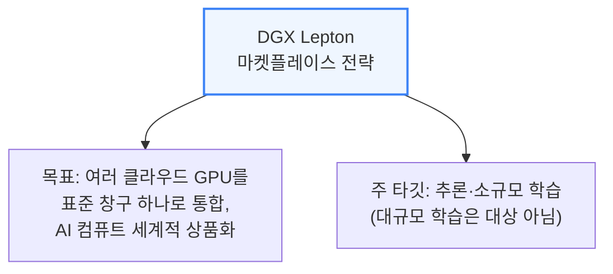
```mermaid
flowchart TD
    Lepton["DGX Lepton<br/>마켓플레이스 전략"] --> Goal["목표: 여러 클라우드 GPU를<br/>표준 창구 하나로 통합,<br/>AI 컴퓨트 세계적 상품화"]
    Lepton --> Target["주 타깃: 추론·소규모 학습<br/>(대규모 학습은 대상 아님)"]

    style Lepton fill:#eff6ff,stroke:#3b82f6,stroke-width:2px
```

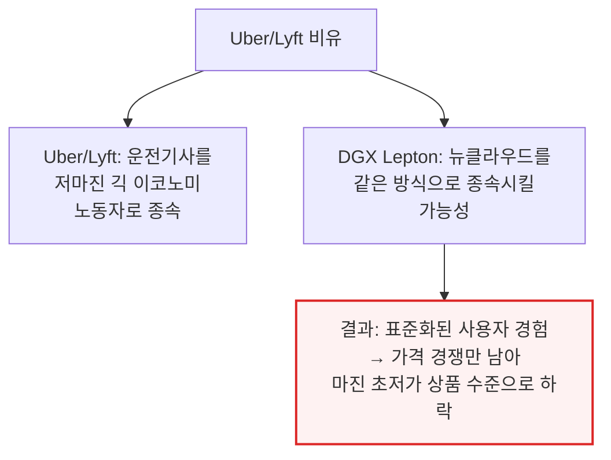
```mermaid
flowchart TD
    Analogy["Uber/Lyft 비유"] --> Driver["Uber/Lyft: 운전기사를<br/>저마진 긱 이코노미<br/>노동자로 종속"]
    Analogy --> Neocloud["DGX Lepton: 뉴클라우드를<br/>같은 방식으로 종속시킬<br/>가능성"]
    Neocloud --> Race["결과: 표준화된 사용자 경험<br/>→ 가격 경쟁만 남아<br/>마진 초저가 상품 수준으로 하락"]

    style Race fill:#fef2f2,stroke:#dc2626,stroke-width:2px
```

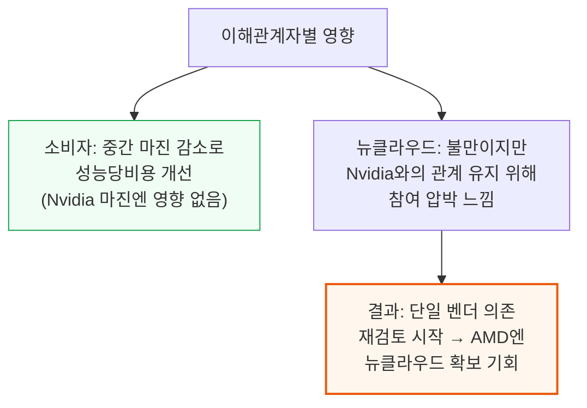
```mermaid
flowchart TD
    Winners["이해관계자별 영향"] --> Consumer["소비자: 중간 마진 감소로<br/>성능당비용 개선<br/>(Nvidia 마진엔 영향 없음)"]
    Winners --> Neocloud2["뉴클라우드: 불만이지만<br/>Nvidia와의 관계 유지 위해<br/>참여 압박 느낌"]
    Neocloud2 --> Reconsider["결과: 단일 벤더 의존<br/>재검토 시작 → AMD엔<br/>뉴클라우드 확보 기회"]

    style Consumer fill:#f0fdf4,stroke:#16a34a
    style Reconsider fill:#fff7ed,stroke:#ea580c,stroke-width:2px
```

한 가지 대안으로, Jensen이 Lepton의 소프트웨어 플랫폼을 완전히 오픈소스화해 참여 뉴클라우드가 마켓플레이스 참여와 별개로 자체 호스팅까지 무료로 할 수 있게 하는 방법이 있습니다. 이렇게 하면 뉴클라우드가 Nvidia 마켓플레이스와 무관한 별도 판매 채널을 가지면서도 소비자에게는 여전히 좋은 성능과 경험을 제공할 수 있습니다.

---

## 5. MI355X는 랙 스케일 솔루션이 아니다 - 마케팅 과장 논란

**📌 핵심:**
- AMD가 "128 GPU 랙"이라 부르는 MI355X 구성은 실은 MI355X UBB8 서버 16대를 그냥 한 랙에 넣은 것 — 랙 전체를 아우르는 하나의 스케일업 도메인이 없음
- 같은 랙 안에서도 서버 A의 GPU가 서버 B의 GPU와 통신하려면 이더넷으로 400Gbit/s밖에 못 내는 반면, GB200 NVL72는 서로 다른 컴퓨트 트레이 간에도 900GByte/s로 통신(약 18배 차이)
- 이 기준이면 xAI의 H100 64개짜리 랙도 "랙 스케일"이라 불러야 하는데 아무도 그렇게 부르지 않음 — MI355X 랙과 마찬가지로 HGX H100 NVL8 서버 8대를 한 랙에 모은 것뿐이기 때문
- 결론: 토큰을 전문가에게 배분하는 all-to-all 집단연산에서 MI355X는 GB200 NVL72보다 18배 느리고 HGX B300 NVL8보다도 2배 느림 — 2D+ 병렬화 학습의 all-reduce 연산에서도 GB200 NVL72 대비 18배 느려, MI355X는 랙 스케일이 아니라는 결론이 명확함

---

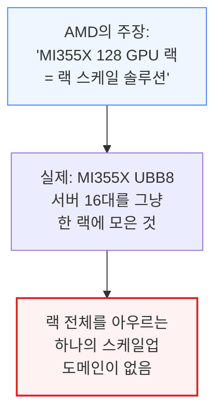
```mermaid
flowchart TD
    Claim["AMD의 주장:<br/>'MI355X 128 GPU 랙<br/>= 랙 스케일 솔루션'"] --> Reality["실제: MI355X UBB8<br/>서버 16대를 그냥<br/>한 랙에 모은 것"]
    Reality --> NoDomain["랙 전체를 아우르는<br/>하나의 스케일업<br/>도메인이 없음"]

    style Claim fill:#eff6ff,stroke:#3b82f6
    style NoDomain fill:#fef2f2,stroke:#dc2626,stroke-width:2px
```

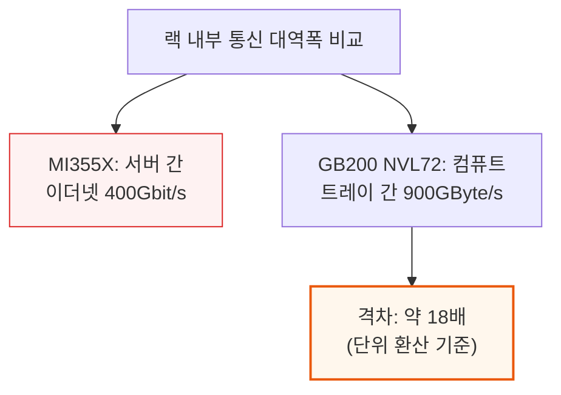
```mermaid
flowchart TD
    BW2["랙 내부 통신 대역폭 비교"] --> AMDbw["MI355X: 서버 간<br/>이더넷 400Gbit/s"]
    BW2 --> NVbw["GB200 NVL72: 컴퓨트<br/>트레이 간 900GByte/s"]
    NVbw --> Gap2["격차: 약 18배<br/>(단위 환산 기준)"]

    style AMDbw fill:#fef2f2,stroke:#dc2626
    style Gap2 fill:#fff7ed,stroke:#ea580c,stroke-width:2px
```

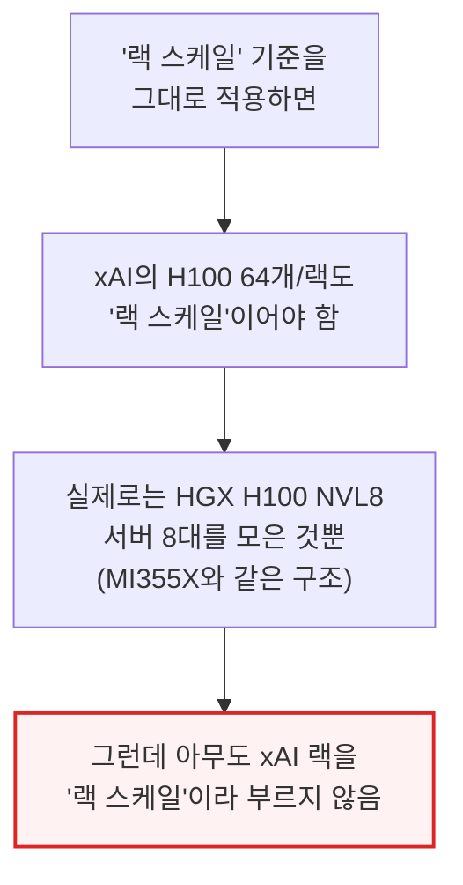
```mermaid
flowchart TD
    Absurd["'랙 스케일' 기준을<br/>그대로 적용하면"] --> XAI["xAI의 H100 64개/랙도<br/>'랙 스케일'이어야 함"]
    XAI --> Same["실제로는 HGX H100 NVL8<br/>서버 8대를 모은 것뿐<br/>(MI355X와 같은 구조)"]
    Same --> Nobody["그런데 아무도 xAI 랙을<br/>'랙 스케일'이라 부르지 않음"]

    style Nobody fill:#fef2f2,stroke:#dc2626,stroke-width:2px
```

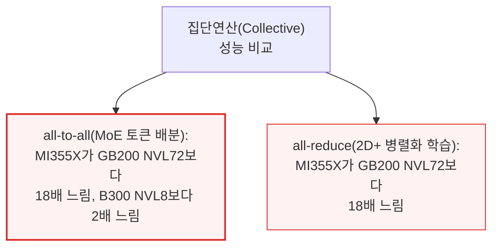
```mermaid
flowchart TD
    Collective["집단연산(Collective)<br/>성능 비교"] --> AllToAll["all-to-all(MoE 토큰 배분):<br/>MI355X가 GB200 NVL72보다<br/>18배 느림, B300 NVL8보다 2배 느림"]
    Collective --> AllReduce["all-reduce(2D+ 병렬화 학습):<br/>MI355X가 GB200 NVL72보다<br/>18배 느림"]

    style AllToAll fill:#fef2f2,stroke:#dc2626,stroke-width:2px
    style AllReduce fill:#fef2f2,stroke:#dc2626
```

---

## 6. 하이퍼스케일러·AI 랩의 AMD 신제품 채택 현황

**📌 핵심:**
- AWS는 AMD 행사의 타이틀 스폰서로 나서며 AMD GPU를 대규모로 구매·임대하는 첫 본격 행보 시작, Meta는 기존 추론 위주에서 학습까지 AMD로 확대(72-GPU 랙의 핵심 요구자, PyTorch 엔지니어들도 AMD Torch 개발 참여)
- OpenAI(Sam Altman 무대 등장)·x.AI(프로덕션 추론 확대)도 AMD 신제품에 호의적, Oracle은 MI355X 3만 개 배치 계획으로 뉴클라우드 신속 배치의 선두주자 역할 이어감
- Microsoft만 유일하게 관망 — MI355는 소량 주문에 그치지만 MI400에는 긍정적 태도
- 결론: 많은 하이퍼스케일러가 레거시 데이터센터 설계상 공랭 시설을 이미 보유해 공랭형 MI355X 도입에 적극적 — 대부분 MI355 배치 후 MI400까지 이어질 전망

---

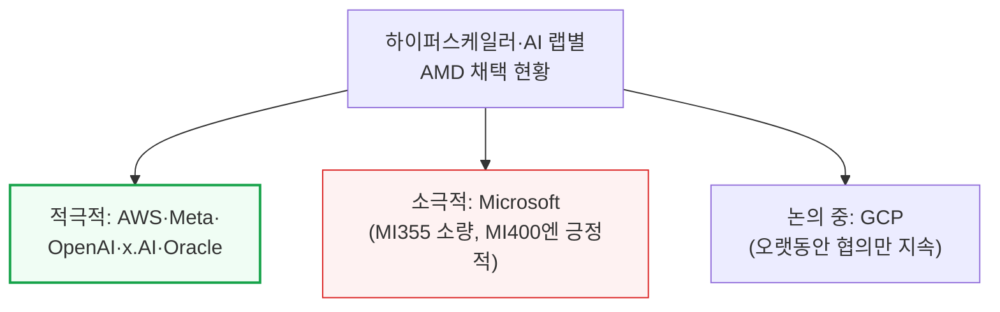
```mermaid
flowchart TD
    Adopters["하이퍼스케일러·AI 랩별<br/>AMD 채택 현황"] --> Strong["적극적: AWS·Meta·<br/>OpenAI·x.AI·Oracle"]
    Adopters --> Weak["소극적: Microsoft<br/>(MI355 소량, MI400엔 긍정적)"]
    Adopters --> Talk["논의 중: GCP<br/>(오랫동안 협의만 지속)"]

    style Strong fill:#f0fdf4,stroke:#16a34a,stroke-width:2px
    style Weak fill:#fef2f2,stroke:#dc2626
```

```mermaid
flowchart TD
    Detail["주요 고객별 세부 동향"] --> AWS2["AWS: 행사 타이틀 스폰서,<br/>대규모 구매·임대 첫 본격화"]
    Detail --> Meta2["Meta: 추론→학습까지 확대,<br/>72-GPU 랙 핵심 요구자,<br/>PyTorch 엔지니어도 AMD Torch 참여"]
    Detail --> Others["OpenAI(Altman 등판)·<br/>x.AI(프로덕션 추론 확대)·<br/>Oracle(MI355X 3만개 배치)"]

    style AWS2 fill:#f0fdf4,stroke:#16a34a,stroke-width:2px
    style Meta2 fill:#eff6ff,stroke:#3b82f6
```

```mermaid
flowchart TD
    WhyAircooled["왜 하이퍼스케일러가<br/>MI355X에 적극적인가"] --> Legacy["레거시 데이터센터<br/>설계상 공랭 시설<br/>이미 보유"]
    Legacy --> Fit["MI355X는 공랭 지원<br/>+ 매력적인 성능당비용"]
    Fit --> Expect["전망: 대부분 MI355<br/>배치 후 MI400까지<br/>이어서 배치"]

    style Fit fill:#f0fdf4,stroke:#16a34a,stroke-width:2px
    style Expect fill:#fff7ed,stroke:#ea580c
```

저자는 AMD가 GCP에도 다른 핵심 뉴클라우드에 제공한 것과 같은 조건(AMD 내부 R\&D용으로 컴퓨트를 재임대해주는 방식)을 제시해 GCP의 결단을 앞당겨야 한다고 제안합니다.

---

## 7. AMD 뉴클라우드 렌탈 시장의 구조적 약점

**📌 핵심:**
- Nvidia 전문 뉴클라우드는 100곳 넘게 있는데 AMD 전문 뉴클라우드는 극소수 — 공급 부족과 선택지 부족이 AMD GPU 임대 가격을 인위적으로 높여 원가 경쟁력을 갉아먹음
- 2025년 2분기 기준 H200의 1개월 계약 임대가는 시간당 약 $2.50인데, MI325X는 1개월 계약 자체가 존재하지 않고 MI300X는 $2.50/시간으로 책정돼 H200 대비 경쟁력이 없음
- 추론 성능당비용으로 H200과 경쟁하려면 MI300X는 시간당 $2.10\~2.40 미만, MI325X는 $2.75\~3.00 수준이어야 하는데, 이 가격대를 제공하는 AMD 뉴클라우드는 사실상 없음(대규모 협상 없이는)
- 결론: 이 가격 비효율 때문에 현재는 Nvidia가 임대 성능당비용에서 사실상 승리 — AMD의 하드웨어 경쟁력이 시장 가격에 제대로 반영되지 못하는 구조적 문제

---

```mermaid
flowchart TD
    Supply["뉴클라우드 공급 구조"] --> NvNeo["Nvidia 전문 뉴클라우드:<br/>100곳 이상"]
    Supply --> AmdNeo["AMD 전문 뉴클라우드:<br/>극소수"]
    AmdNeo --> HighPrice["결과: 공급 부족 →<br/>AMD GPU 임대가<br/>인위적으로 높게 형성"]

    style AmdNeo fill:#fef2f2,stroke:#dc2626,stroke-width:2px
    style HighPrice fill:#fff7ed,stroke:#ea580c
```

```mermaid
flowchart TD
    Rental["2025년 2분기<br/>1개월 계약 임대가"] --> H200p["H200: 약 $2.50/시간<br/>(품질 낮은 클라우드는 더 저렴)"]
    Rental --> M325["MI325X: 1개월 계약<br/>자체가 존재하지 않음"]
    Rental --> M300["MI300X: $2.50/시간<br/>(H200과 동일가, 경쟁력 없음)"]

    style H200p fill:#eff6ff,stroke:#3b82f6
    style M300 fill:#fef2f2,stroke:#dc2626,stroke-width:2px
```

```mermaid
flowchart TD
    Needed["H200과 경쟁하려면<br/>필요한 실제 가격"] --> N1["MI300X: 시간당<br/>$2.10~2.40 미만 필요"]
    Needed --> N2["MI325X: 시간당<br/>$2.75~3.00 필요<br/>(상호작용성에 따라 상이)"]
    N2 --> N3["현실: 이 가격대를<br/>협상 없이 제공하는<br/>AMD 뉴클라우드는 없음"]

    style N3 fill:#fef2f2,stroke:#dc2626,stroke-width:2px
```

---

## 8. AMD의 뉴클라우드 생태계 육성 전략

**📌 핵심:**
- 몇 달 전까지 AMD는 뉴클라우드 생태계 확대에 소극적이었으나, 최근 리더십이 건강한 뉴클라우드 생태계가 개발자 채택과 렌탈 가격 안정화에 핵심적이라 인식하고 전략을 전환
- AWS·OCI·Digital Ocean·Vultr·Tensorwave·Crusoe 등에 파격적 인센티브 제공 — 고객이 AMD GPU를 더 많이 구매하는 대가로, AMD가 그 물량의 상당 부분을 장기 계약으로 재임대해 내부 소프트웨어 개발에 사용(Nvidia가 GCP·OCI·AWS·Azure·CoreWeave에서 이미 하는 방식과 동일)
- 일부 뉴클라우드에는 완전 리스크 제거 옵션까지 제공 — 만약 뉴클라우드가 용량을 다 못 팔면 AMD가 백스톱(최종 안전판)으로 직접 임대해줌
- 결론: AMD Developer Cloud 출시로 MI300X 온디맨드 가격을 시간당 $1.99로 대폭 인하(기존 AMD 뉴클라우드 시장가 $3.00 대비) — 시장 전체의 렌탈 가격을 끌어내리는 효과 예상

---

```mermaid
flowchart TD
    Strategy2["AMD 뉴클라우드<br/>전략 전환"] --> Before2["과거: 뉴클라우드에<br/>AMD 호스팅 인센티브 부족"]
    Strategy2 --> After2["현재: 건강한 생태계가<br/>개발자 채택·가격 안정화의<br/>핵심임을 인식"]

    style After2 fill:#f0fdf4,stroke:#16a34a,stroke-width:2px
```

```mermaid
flowchart TD
    Deal2["재임대 인센티브 구조"] --> Buy["뉴클라우드가<br/>AMD GPU 더 많이 구매"]
    Buy --> Rentback["대가로 AMD가 상당 물량을<br/>장기 계약으로 재임대<br/>(내부 소프트웨어 개발용)"]
    Rentback --> Backstop["일부는 완전 리스크 제거:<br/>미판매 용량은 AMD가<br/>백스톱으로 직접 임대"]

    style Rentback fill:#f0fdf4,stroke:#16a34a,stroke-width:2px
    style Backstop fill:#fff7ed,stroke:#ea580c,stroke-width:2px
```

```mermaid
flowchart TD
    DevCloud["AMD Developer Cloud"] --> Price["MI300X 온디맨드<br/>$1.99/시간(GPU당)"]
    Price --> Compare2["기존 AMD 뉴클라우드<br/>시장가 $3.00/시간 대비<br/>대폭 인하"]
    Compare2 --> MarketEffect["예상 효과: 기존<br/>AMD 뉴클라우드도<br/>$2/시간 수준으로 인하 압박"]

    style Price fill:#f0fdf4,stroke:#16a34a,stroke-width:2px
    style MarketEffect fill:#fff7ed,stroke:#ea580c
```

이 인센티브 구조 덕에 AMD와 협력하는 뉴클라우드는 Nvidia 클러스터만 단기로 임대해 가격·가동률 리스크를 온전히 떠안는 경쟁사보다 상대적으로 덜 위험한 사업 모델을 짤 수 있습니다.
다만 저자가 실제 테스트해본 결과, 신규 사용자 기본 할당량이 GPU 0개로 설정돼 있어 할당량 증량이 까다로웠습니다 — AMD가 신규 사용자 기본 할당량을 최소 MI300X 16개로 조정할 것을 권고합니다.

---

## 9. ROCm 소프트웨어 개선과 엔지니어링 우선순위 이슈

**📌 핵심:**
- ROCm 7은 추론 성능에 집중 — 추론 처리량이 ROCm 6 대비 평균 3.5배, DeepSeek R1 서빙 시 Nvidia B200 대비 1.3배 향상됐다고 AMD는 주장(저자는 검증 예정)
- PyTorch CI(자동 검증) 착수는 긍정적이나 아직 병합된 MI355 PR은 없음, MLPerf 학습 제출은 단일 노드 수준까지만 진행 — 반면 MIG 파티셔닝(GPU 8분할) 프로젝트는 고객 누구도 요청하지 않은 곳에 자원을 낭비 중이라는 비판
- RCCL(집단연산 라이브러리)은 여전히 Nvidia NCCL의 포크 수준에 머물러 AMD 다중 노드 성능의 핵심 병목 — 완전히 새로 작성해야 한다는 게 저자의 반복된 권고
- 결론: 소프트웨어 개선 속도는 빨라지고 있지만 우선순위 설정(불필요한 MIG 대신 다중 노드 지원 강화)과 통신 라이브러리 재작성이라는 근본 과제는 아직 남아있음

---

### ROCm 7과 추론 소프트웨어

```mermaid
flowchart TD
    ROCm7["ROCm 7 개선사항"] --> Claim2["AMD 주장: 추론 처리량<br/>ROCm 6 대비 평균 3.5배,<br/>DeepSeek R1 서빙 시 B200 대비 1.3배"]
    ROCm7 --> Framework2["vLLM·SGLang 지원 +<br/>llm-d(Nvidia Dynamo 대항마)로<br/>분리형 서빙(PD) 지원"]

    style Claim2 fill:#eff6ff,stroke:#3b82f6
    style Framework2 fill:#f0fdf4,stroke:#16a34a
```

llm-d 스택은 Nvidia Dynamo의 KVCache 관리자와 동등한 기능을 아직 갖추지 못했습니다. KVCache 관리자는 추론 워크로드의 처리량을 몇 배씩 끌어올릴 수 있어 TCO에 큰 영향을 주는 핵심 요소입니다.

```mermaid
flowchart TD
    Triton["Triton(커널 작성 라이브러리)<br/>지원 현황"] --> Func["작년: 기능적 지원 확보"]
    Triton --> Perf2["ROCm 7: 성능 개선에 집중"]
    Perf2 --> Wish["저자 바람: FlexAttention 등<br/>고급 기능까지 확장"]

    style Func fill:#eff6ff,stroke:#3b82f6
```

ByteDance Seed가 만든 Triton Distributed(연산·GPU 통신 오버랩 지원)에 AMD가 관심을 보이고 있지만, Triton 관리자인 OpenAI가 이 기여를 원본 라이브러리에 받아들일지는 불확실합니다.
중국向 반도체 수출 규제를 감안하면 ByteDance가 서방 GPU용 오픈소스 기여에서 발을 뺄 가능성도 있습니다. 다만 ByteDance는 AMD에 상당한 투자를 이어가며 임대 물량도 늘릴 전망이지만, 컴퓨트 확장의 대부분은 여전히 Nvidia 임대에 의존할 것으로 예상됩니다.

AMD는 데이터 전송 인터페이스 Mooncake Transfer Engine과 전문가 병렬 통신 라이브러리 DeepEP를 통합 중이라고 밝혔지만, 이 리포트 작성 시점까지 오픈소스 ROCm 저장소에서 실제 구현은 확인되지 않았습니다.
한편 AMD Developer Cloud와 함께 공개한 Python 패키지 "rocm"은 ROCm PyTorch·HipBLAS 등을 손쉽게 설치하게 해주며, 전체 코드는 GitHub 저장소 ROCm/TheRock에 오픈소스로 공개됐습니다.

### PyTorch CI 경쟁 - AMD vs Nvidia

```mermaid
flowchart TD
    CI["오픈소스 PyTorch CI<br/>착수 현황"] --> AMDci["AMD: MI355 CI 착수,<br/>PR 병합은 아직 없음<br/>(Day 1부터 준비하는 자세는 긍정적)"]
    CI --> NVci["Nvidia: Blackwell 양산<br/>6개월째인데도 오픈소스<br/>PyTorch CI 미착수(내부 CI만)"]

    style AMDci fill:#f0fdf4,stroke:#16a34a
    style NVci fill:#fef2f2,stroke:#dc2626,stroke-width:2px
```

```mermaid
flowchart TD
    Fund["PyTorch CI 비용 부담"] --> Meta3["Meta: 월 100만 달러 이상<br/>부담(PyTorch CI 비용 대부분)"]
    Fund --> AMDpay["AMD: 자사 오픈소스<br/>PyTorch CI 비용 직접 부담"]
    Fund --> NVpledge["Nvidia: B200 48개를<br/>PyTorch Foundation에<br/>기부 예정(계획 단계)"]

    style Meta3 fill:#eff6ff,stroke:#3b82f6
    style NVpledge fill:#fff7ed,stroke:#ea580c
```

저자는 6개월 늦었더라도 없는 것보다는 낫다고 평가하면서도, Nvidia가 PyTorch CI에 더 적극 투자하고 소비자용 GPU까지 CI에 포함시켜야 한다고 권고합니다 — 현재 Nvidia 소비자 GPU는 CI 부족으로 일부 프레임워크에서 불안정성을 겪고 있습니다.

### MLPerf 훈련 제출 - 첫 걸음

```mermaid
flowchart TD
    MLPerf["ROCm 첫 MLPerf<br/>Training 제출"] --> Scope["범위: 단일 노드<br/>Llama2 70B LoRA 파인튜닝 +<br/>BERT 학습"]
    Scope --> Meaning["의미: 단일 AMD 노드에서<br/>학습이 작동함을 입증"]
    Meaning --> Next2["다음 과제: MLPerf<br/>Llama 405B 다중 노드<br/>벤치마크 참여 필요"]

    style Meaning fill:#f0fdf4,stroke:#16a34a
    style Next2 fill:#fff7ed,stroke:#ea580c
```

AMD의 MLPerf 제출은 따라 하기 쉬운 재현 가능 안내서를 함께 제공하는 점이 돋보이며, 이는 재현이 어려운 것으로 정평이 난 Nvidia의 MLPerf 제출 방식과 대비됩니다.

### MIG 파티셔닝 비판 - 누구도 요청하지 않은 기능

```mermaid
flowchart TD
    MIG["MIG 파티셔닝<br/>(GPU 1개→8개 분할)"] --> NoAsk["Meta·OpenAI·x.AI<br/>누구도 요청 안 함<br/>(온라인 추론은 최소 GPU 1개 필요)"]
    MIG --> Waste2["평가: 대용량 HBM을<br/>가진 최첨단 칩을 만들어놓고<br/>8분할하려는 건 비논리적"]

    style Waste2 fill:#fef2f2,stroke:#dc2626,stroke-width:2px
```

```mermaid
flowchart TD
    RealNeed["실제 고객이 원하는 것"] --> Opposite["MIG의 정반대:<br/>DeepEP·분리형 프리필로<br/>다중 노드(최소 GPU 16개)<br/>추론 지원 강화"]

    style Opposite fill:#f0fdf4,stroke:#16a34a,stroke-width:2px
```

### 개발자 세션 트랙의 아쉬움과 RCCL 통신 라이브러리

AMD Advancing AI의 개발자 세션은 ROCm 블로그의 개선 폭에 비해 아쉬웠습니다 — RCCL·Composable Kernels·rocSHMEM·aiter 등 주요 라이브러리 관련 발표가 전무했습니다. 저자는 이후 더 집중된 별도 컨퍼런스에서 발표 폭을 넓히길 희망합니다.

```mermaid
flowchart TD
    NIC["AMD 신규 400G NIC"] --> UEC["Ultra Ethernet(UEC) 대응 +<br/>기존 RoCEv2 프로토콜도 지원"]
    NIC --> Placement["UEC 모드: 패킷 스프레잉과<br/>순서 무관 직접 배치 지원<br/>(NIC 재정렬 버퍼 불필요,<br/>Bluefield-3와 차별화)"]

    style UEC fill:#eff6ff,stroke:#3b82f6
```

```mermaid
flowchart TD
    Adoption2["AMD 자체 NIC<br/>채택 현황"] --> Yes2["Oracle·Tensorwave:<br/>AMD NIC 채택 확정"]
    Adoption2 --> No2["Meta: 초기 테스트 미흡으로<br/>보류, MI355X 클러스터엔<br/>ConnectX-7 사용"]

    style Yes2 fill:#f0fdf4,stroke:#16a34a
    style No2 fill:#fef2f2,stroke:#dc2626
```

AMD의 신규 NIC는 RING·PAT 알고리즘의 all-gather 집단연산 오프로드도 지원하며, CPU 프록시 스레드까지 NIC로 오프로드한다고 주장하지만 IBGDA 방식인지 다른 방식인지는 불명확합니다.

```mermaid
flowchart TD
    RCCL2["ROCm 7.0 RCCL<br/>(집단연산 라이브러리)"] --> Copy["평가: 여전히 Nvidia<br/>NCCL의 포크 수준"]
    Copy --> Bottleneck["결과: AMD 다중 노드<br/>성능의 핵심 병목으로<br/>계속 작용"]
    Bottleneck --> Recommend["저자 권고(반복):<br/>포크 대신 완전히<br/>새로 작성 필요"]

    style Copy fill:#fef2f2,stroke:#dc2626,stroke-width:2px
    style Recommend fill:#fff7ed,stroke:#ea580c,stroke-width:2px
```

---

## 10. MI355X 제조 - 칩렛 아키텍처 리파인

**📌 핵심:**
- MI300 출시 이후 2년간 칩렛(Chiplet) 배치를 다듬어, 기존 4분면으로 나뉘어 있던 베이스 다이(AID)를 레티클 크기 절반짜리 2개로 통합 — 칩 경계를 넘나드는 통신 횟수를 줄여 전력·면적을 절감
- 이 재배치로 반대편 모서리 분면끼리 두 번 건너뛰어야 했던 "2홉 통신" 문제도 사라졌지만, 대신 3D 스태킹(TSMC SoIC 하이브리드 본딩) 수율 리스크는 커짐 — 베이스 다이 하나당 붙여야 할 XCD(연산 칩렛) 개수가 2배로 늘었기 때문
- 다이-투-다이 링크 대역폭은 4.8TB/s에서 5.5TB/s로, 스케일업용 Infinity Fabric 속도는 20% 향상 — 연산 다이(XCD)는 N5에서 TSMC N3P 공정으로 이동, CDNA4 아키텍처 적용
- 결론: 신규 칩은 트랜지스터 1,850억 개로 MI300 대비 21% 증가 — N5→N3P 공정 전환으로 트랜지스터 예산이 약 30% 늘어난 결과

---

```mermaid
flowchart TD
    Chiplet2["칩렛 배치 재설계<br/>(MI300→MI350/355)"] --> Merge["베이스 다이(AID):<br/>4분면 → 레티클 크기<br/>절반짜리 2개로 통합"]
    Merge --> Benefit2["효과: 칩 경계 넘는<br/>통신 횟수 감소<br/>(전력·면적 절감)"]

    style Merge fill:#f0fdf4,stroke:#16a34a,stroke-width:2px
```

```mermaid
flowchart TD
    Tradeoff2["재설계의 대가"] --> Fix["해결: 반대편 모서리<br/>분면 간 '2홉 통신'<br/>문제 해소"]
    Tradeoff2 --> Risk["대가: 3D 스태킹(SoIC)<br/>수율 리스크 증가<br/>(베이스 다이당 XCD 2배 부착)"]

    style Fix fill:#f0fdf4,stroke:#16a34a
    style Risk fill:#fff7ed,stroke:#ea580c,stroke-width:2px
```

📌 용어 풀이: AID·XCD·SoIC
> - AID(Active Interposer Die): 여러 연산 칩렛(XCD)과 HBM을 이어주는 베이스 다이
> - XCD(Accelerator Complex Die): 실제 연산을 수행하는 칩렛 — 이 문서에서 "연산 다이"로도 표기
> - SoIC(하이브리드 본딩): TSMC의 칩 적층(3D 스태킹) 기술 — AMD가 5년 넘게 TSMC와 협력해온 공정

```mermaid
flowchart TD
    Speed["베이스 다이 속도 향상<br/>(TSMC N6 유지)"] --> D2D["다이-투-다이 링크:<br/>4.8TB/s → 5.5TB/s"]
    Speed --> IF["Infinity Fabric<br/>스케일업 속도 20%↑"]
    Speed --> HBM3E["메모리 컨트롤러:<br/>더 빠른 HBM3E 지원 가능"]

    style D2D fill:#f0fdf4,stroke:#16a34a
```

```mermaid
flowchart TD
    XCDmove["연산 다이(XCD)<br/>공정 전환"] --> Node["N5 → TSMC N3P"]
    Node --> CU2["CU 활성화: 36개 중<br/>32개만 사용<br/>(MI300은 40개 중 38개)"]
    Node --> Transistor["트랜지스터 총합:<br/>1,850억 개(MI300 대비 21%↑,<br/>N5→N3P 전환으로 약 30% 예산 증가)"]

    style Transistor fill:#fff7ed,stroke:#ea580c,stroke-width:2px
```

XCD가 AID 위에 놓이는 방향도 바뀌어, 데이터 본드 패드가 AID 중앙부에 위치하게 됐습니다. 데이터는 이제 256MB 용량의 MALL(Memory Attached Last Level) 캐시를 거쳐 바깥쪽으로 나간 뒤 HBM에 도달합니다.

---

## 11. CDNA4 마이크로아키텍처(UArch) 상세

**📌 핵심:**
- CDNA4는 전통적인 HPC(고성능컴퓨팅) 중심 설계에서 AI 워크로드 중심으로 계속 이동 중 — 다만 여전히 FP64 행렬 코어에 상당한 면적을 할애해 완전히 AI 전용은 아님
- CU(컴퓨트 유닛)는 CDNA3 대비 16% 줄어든 256개인 반면, 로컬 데이터 공유 메모리(LDS)는 1.5배, 행렬 코어 처리량은 2배로 늘어남 — CU 하나가 더 큰 행렬을 계산하는 AI 워크로드 특성에 맞춘 트레이드오프(HPC는 CU 개수가 많을수록 유리, AI는 CU 하나가 강할수록 유리해 서로 전력·면적 예산을 두고 경쟁)
- FP8은 FP16 대비 2배, FP4는 4배 처리량 — FP6은 FP4와 회로를 공유해 이론상 FP4와 동일 처리량이지만 실전에선 전력 제약으로 FP4보다 약간 낮음(Nvidia Blackwell은 FP6을 FP8과 동일하게 취급해 방식이 다름)
- 결론: CDNA4는 Nvidia Blackwell의 비동기 데이터 전송 가속(TMA), TMA 멀티캐스팅, 전용 메모리(TMEM) 같은 기능이 없어 지능 단위당 전력 효율(피코줄/단위)에서 열세 — 다음 세대(CDNA-NEXT)에서 이 격차를 메울 대대적 아키텍처 변화가 예상됨

---

```mermaid
flowchart TD
    CDNA4["CDNA4 스펙<br/>(CDNA3 대비)"] --> CU3["CU: 256개<br/>(16% 감소)"]
    CDNA4 --> LDS["LDS(로컬 데이터 공유):<br/>1.5배 증가"]
    CDNA4 --> Matrix["행렬 코어 처리량:<br/>2배 증가"]

    style CU3 fill:#eff6ff,stroke:#3b82f6
    style Matrix fill:#f0fdf4,stroke:#16a34a,stroke-width:2px
```

📌 용어 풀이: CU와 LDS
> - CU(컴퓨트 유닛): AMD GPU 내부의 연산 처리 단위(Nvidia SM에 대응)
> - LDS(로컬 데이터 공유, Local Data Share): CU 내부에서 연산 코어에 데이터를 빠르게 공급하는 버퍼 — Nvidia의 SMEM(공유 메모리)에 대응
> - LDS 용량이 늘었다는 건 행렬 코어가 매우 빨라져서, 코어에 데이터를 제때 먹여주려면 버퍼도 함께 키워야 했다는 뜻

```mermaid
flowchart TD
    Why2["CU 감소·LDS 증가의 의미"] --> HPC2["HPC 워크로드:<br/>CU 개수 많을수록 유리"]
    Why2 --> AIwork["AI 워크로드:<br/>CU 하나가 큰 행렬<br/>계산할수록 유리"]
    AIwork --> Compete["둘은 같은 전력·면적<br/>예산을 두고 경쟁 →<br/>CDNA4는 AI 쪽으로 무게중심 이동"]

    style AIwork fill:#f0fdf4,stroke:#16a34a,stroke-width:2px
    style Compete fill:#fff7ed,stroke:#ea580c
```

```mermaid
flowchart TD
    Precision2["정밀도별 처리량<br/>(FP16 기준 배수)"] --> FP8_["FP8: 2배"]
    Precision2 --> FP4_["FP4: 4배"]
    FP4_ --> FP6_["FP6: 이론상 FP4와 동일<br/>(회로 공유, 실전에선<br/>전력 제약으로 FP4보다 소폭 낮음)"]

    style FP4_ fill:#f0fdf4,stroke:#16a34a,stroke-width:2px
```

```mermaid
flowchart TD
    VsBlackwell["Nvidia Blackwell 대비<br/>CDNA4의 공백"] --> Missing["비동기 데이터 전송(TMA),<br/>TMA 멀티캐스팅,<br/>전용 메모리(TMEM) 부재"]
    Missing --> Efficiency["결과: 지능 단위당<br/>전력 효율(피코줄/단위)에서<br/>Nvidia SM100 대비 열세"]
    Efficiency --> Future2["전망: CDNA-NEXT에서<br/>대대적 아키텍처 변화 예상"]

    style Missing fill:#fef2f2,stroke:#dc2626
    style Future2 fill:#fff7ed,stroke:#ea580c,stroke-width:2px
```

CDNA4의 명령어 세트(ISA) 세부 내용은 아직 공개되지 않아, MFMA 연산에 Nvidia의 WGMMA에 대응하는 기능이 추가됐는지는 이 리포트 작성 시점에 확인되지 않았습니다.

---

## 12. AMD AI 엔지니어 보상 현실화 움직임

**📌 핵심:**
- 업계에 잘 알려진 사실로, 대부분의 AMD AI 엔지니어는 시장가 대비 낮은 보상을 받아왔음 — 예외는 최근 신규 채용자와 인수(M\&A)를 통해 합류한 소수 인력뿐(2년 전 인수한 NodAI 출신 엔지니어들은 경력·역량을 동일하게 맞춰도 기존 AMD 엔지니어보다 훨씬 높은 보상을 받는 중)
- AMD 인사(HR) 부서는 이미 몇 분기 전부터 이 보상 격차 문제를 인지하고 내부적으로 문제 제기했으나, 경영진은 최근까지 우선순위를 낮게 뒀음
- 저자가 공개적으로 AMD의 낮은 AI 엔지니어 보상을 지적한 이후, AMD 인사총괄이 이 사안을 최우선 과제로 즉시 격상 — 다만 실제 이행은 아직 진행 중
- 결론: AMD는 현금 보유고가 수십억 달러에 달해 보상 격차 해소 여력은 충분 — 핵심 기여자에게 AMD의 성과와 연동된 경쟁력 있는 총보상을 지급할지가 관건

---

```mermaid
flowchart TD
    PayIssue["AMD AI 엔지니어<br/>보상 문제"] --> Gap["대부분 시장가 대비<br/>낮은 보상(예외: 최근<br/>신규채용·M&A 인력)"]
    Gap --> NodAI["예시: NodAI 출신<br/>엔지니어가 기존 AMD<br/>엔지니어보다 훨씬 높은 보상"]

    style Gap fill:#fef2f2,stroke:#dc2626,stroke-width:2px
```

```mermaid
flowchart TD
    Timeline2["문제 인지→대응 타임라인"] --> HRflag["AMD HR: 몇 분기 전부터<br/>격차 인지·내부 제기"]
    HRflag --> LowPriority["경영진: 최근까지<br/>낮은 우선순위로 방치"]
    LowPriority --> PublicPush["저자의 공개 지적 이후:<br/>HR총괄이 최우선 과제로<br/>즉시 격상(이행은 진행 중)"]

    style LowPriority fill:#fef2f2,stroke:#dc2626
    style PublicPush fill:#fff7ed,stroke:#ea580c,stroke-width:2px
```

```mermaid
flowchart TD
    Capacity["AMD의 대응 여력"] --> Cash["현금 보유고<br/>수십억 달러 규모"]
    Cash --> Ask["관건: 핵심 기여자에게<br/>AMD 성과와 연동된<br/>경쟁력 있는 총보상 지급 여부"]

    style Cash fill:#f0fdf4,stroke:#16a34a
    style Ask fill:#fff7ed,stroke:#ea580c
```

---

## 13. MI400 시리즈 Flexible I/O와 UALoE72 - 진짜 UALink는 아니다

**📌 핵심:**
- MI400은 MI300X의 Infinity Fabric이 NVLink보다 크게 뒤처졌던 실패를 교훈 삼아, **144레인의 유연한 I/O(Flexible I/O)**로 전환 — PCIe 6.0, Infinity Fabric 64G, UALink 128G, xGMI4 128G(UALink 상위호환), Infinity Fabric over Ethernet 212G 등 여러 규격을 같은 물리 레인으로 지원해 용도별 배선을 나눌 필요를 없앰
- 다만 MI400의 스케일업 네트워크는 **진짜 UALink가 아님** — UALink 전용 스위치(Astera Labs·Marvell)는 2027년에나 출시되고 브로드컴이 UALink 진영에서 이탈해 자체 규격(Scale Up Ethernet)을 개발 중이라, AMD는 브로드컴을 다시 설득해 **UALink 프로토콜을 이더넷 위에서 터널링하는 "UALoE(UALink over Ethernet)"**로 스펙 자체를 변경(Lisa Su: "표준 이더넷 위로 터널링된 UALink")
- 브로드컴 Tomahawk 6(102.4T) 이더넷 스위치를 사용하는 이 방식은 마케팅상 이름만 다를 뿐 실질적으로는 예전에 예고했던 "Infinity Fabric over Ethernet"과 동일한 접근
- 결론: 이름과 달리 실제 스펙은 경쟁력 있음 — MI400은 Nvidia VR200 NVL144와 **스케일업 단방향 대역폭(칩당 1.8TB/s)·스케일업 월드 크기(논리 GPU 72개)가 동일**해, "진짜 UALink냐 아니냐"와 별개로 성능 자체는 견줄 만한 수준

---

```mermaid
flowchart TD
    FlexIO["Flexible I/O<br/>144레인 유연 설계"] --> Why["배경: MI300X의<br/>Infinity Fabric이 NVLink보다<br/>크게 뒤처졌던 실패 교훈"]
    FlexIO --> Support["지원 규격: PCIe 6.0,<br/>Infinity Fabric 64G,<br/>UALink 128G, xGMI4 128G,<br/>IFoE 212G(같은 물리 레인 공유)"]

    style Support fill:#f0fdf4,stroke:#16a34a,stroke-width:2px
```

```mermaid
flowchart TD
    UALoE["UALoE(UALink over<br/>Ethernet) 탄생 배경"] --> NoSwitch["UALink 전용 스위치<br/>(Astera Labs·Marvell)<br/>2027년에나 출시"]
    UALoE --> Broadcom["브로드컴, UALink 진영<br/>이탈 → 자체 규격<br/>(Scale Up Ethernet) 개발 중"]
    Broadcom --> Beg["AMD가 브로드컴을<br/>재설득 → UALink 프로토콜을<br/>이더넷 위에서 터널링하도록<br/>스펙 변경(UALoE)"]

    style Broadcom fill:#fef2f2,stroke:#dc2626
    style Beg fill:#fff7ed,stroke:#ea580c,stroke-width:2px
```

```mermaid
flowchart TD
    Compare2["MI400 vs VR200 NVL144<br/>스케일업 스펙 비교"] --> BW3["칩당 단방향 대역폭:<br/>1.8TB/s로 동일"]
    Compare2 --> World["스케일업 월드 크기:<br/>논리 GPU 72개로 동일"]

    style BW3 fill:#f0fdf4,stroke:#16a34a,stroke-width:2px
    style World fill:#f0fdf4,stroke:#16a34a,stroke-width:2px
```

---

## 14. MI400 Helios 랙 아키텍처 상세

**📌 핵심:**
- Helios 랙은 표준 ORV3 랙 폭의 약 2배(GPU 양옆에 LPDDR5가 붙어 폭이 넓어짐) — **컴퓨트 트레이 18개**(상단 9개+하단 9개, 트레이당 MI400 4개)와 그 사이 **UALoE 스위치 트레이 6개**(트레이당 Tomahawk 6 102.4T 스위치 2개, 레인당 200G)로 구성돼 스케일업 월드 72 GPU를 완성(그래서 이름이 UALoE72 — 애초 예상했던 IFoE64보다 8개 늘어난 것은 고객들이 72 GPU 월드사이즈를 선호했기 때문)
- 메모리는 4단 계층 — ① 온패키지 HBM(288\~432GB, 18TB/s) ② GPU 직결 커스텀 LPDDR5X(819GB/s, Rubin Ultra와 유사 구조) ③ GPU-SSD PCIe 직결(Nvidia HGX의 로컬 NVMe GPUDirect Storage와 유사) ④ CPU MRDIMM DDR5(64G Infinity Fabric 16레인 경유) — HBM을 제외한 나머지는 고객 요청에 맞춰 용량 조정 가능
- 스위치 트레이 비효율: 레인당 200G 기준 스위치 하나가 512포트를 내지만 실제 연결에 쓰는 레인은 트레이당 864개뿐이라 **160포트(스위치당 80포트)가 낭비** — 브로드컴 기성 스위치가 51.2T 배수(64 GPU 랙에 최적)로만 나와 57.6T 배수(72 GPU 랙에 최적)와 맞지 않기 때문(반면 GB200 NVL72는 28.8T NVSwitch 18개로 낭비 없이 정확히 맞아떨어짐 — AMD의 수직계열화 열세를 보여주는 사례)
- 결론: 스위치 트레이가 6개뿐(Nvidia Oberon은 9개)이라 신호 이동 거리가 더 짧고, 스위치 트레이 상하로 컴퓨트 트레이가 균등 배치돼 신호가 양방향으로 균등한 거리를 이동

---

```mermaid
flowchart TD
    Helios["Helios 랙 구성"] --> Tray1["컴퓨트 트레이 18개<br/>(상9+하9, 트레이당<br/>MI400 4개)"]
    Helios --> Tray2["UALoE 스위치 트레이 6개<br/>(트레이당 TH6 102.4T<br/>스위치 2개)"]
    Tray2 --> World72["스케일업 월드 72 GPU<br/>완성(UALoE72 명명 유래)"]

    style World72 fill:#f0fdf4,stroke:#16a34a,stroke-width:2px
```

```mermaid
flowchart TD
    Mem4["MI400 메모리 4단 계층"] --> M1["① 온패키지 HBM<br/>288~432GB, 18TB/s"]
    Mem4 --> M2["② GPU 직결 커스텀<br/>LPDDR5X, 819GB/s"]
    Mem4 --> M3["③ GPU-SSD PCIe 직결<br/>④ CPU MRDIMM DDR5<br/>(64G IF 16레인)"]

    style M1 fill:#eff6ff,stroke:#3b82f6,stroke-width:2px
```

```mermaid
flowchart TD
    Waste3["스위치 트레이<br/>포트 낭비 문제"] --> Cap["스위치 1개 512포트<br/>(200G/레인) → 트레이<br/>총 1,024포트"]
    Cap --> Used["실사용 레인:<br/>트레이당 864개뿐"]
    Used --> Lost["낭비: 160포트<br/>(스위치당 80포트)"]
    Lost --> Reason["원인: 브로드컴 기성<br/>스위치가 51.2T 배수(64GPU용)만<br/>제공, 57.6T(72GPU용) 없음"]

    style Lost fill:#fef2f2,stroke:#dc2626,stroke-width:2px
```

```mermaid
flowchart TD
    VsNV["AMD vs Nvidia<br/>수직계열화 격차"] --> AMDcase["AMD: 기성 브로드컴<br/>스위치 사용 → 포트 낭비<br/>발생(위 문제)"]
    VsNV --> NVcase["Nvidia: 자체 설계<br/>NVSwitch 28.8T×18개 →<br/>72 GPU에 낭비 없이 정확히 매칭"]

    style NVcase fill:#f0fdf4,stroke:#16a34a,stroke-width:2px
    style AMDcase fill:#fff7ed,stroke:#ea580c
```

---

## 15. MI500 UAL256 - 2027년 차세대 랙 컨셉

**📌 핵심:**
- 2027년 말 출시 예정인 **MI500 Scale Up Mega Pod**는 랙 3개(양옆 컴퓨트 랙 각 32트레이+중앙 스위치 랙 18트레이, 합계 컴퓨트 트레이 64개)에 걸쳐 **물리/논리 GPU 256개**를 하나의 스케일업 도메인으로 묶는 컨셉 — Nvidia VR300 NVL576(144개)의 약 1.8배 규모
- 실행에 성공하면 VR300 NVL576(Kyber 랙)을 압도할 잠재력이 있지만, 이 정도 규모의 엔지니어링·제품 램프업은 결코 쉽지 않은 도전
- 리스크를 낮춘 대안으로 **MI500 UAL128**(GPU 128개)도 검토 중 — VR300 NVL576과 경쟁은 가능하지만 압도적 우위까지는 만들지 못할 규모
- 결론: MI500 세대는 AMD가 처음으로 "랙 2개를 넘어 3개 랙급 초대형 스케일업 도메인"을 시도하는 세대로, Nvidia 대비 스케일업 월드 크기에서 처음으로 수적 우위를 노리는 전략

---

```mermaid
flowchart TD
    MI500["MI500 UAL256<br/>Mega Pod(2027년 말)"] --> Struct["랙 3개: 양옆 컴퓨트 랙<br/>(각 32트레이)+중앙<br/>스위치 랙(18트레이)"]
    Struct --> Scale2["물리/논리 GPU 256개<br/>(VR300 NVL576의 144개 대비<br/>약 1.8배)"]

    style Scale2 fill:#f0fdf4,stroke:#16a34a,stroke-width:2px
```

```mermaid
flowchart TD
    Risk2["실행 리스크와 대안"] --> Full["풀스케일 UAL256:<br/>성공 시 VR300 NVL576 압도<br/>가능하나 엔지니어링 난이도 최고"]
    Risk2 --> Safe["대안 UAL128(128개):<br/>경쟁은 가능하나<br/>압도적 우위는 어려움"]

    style Full fill:#fff7ed,stroke:#ea580c,stroke-width:2px
    style Safe fill:#eff6ff,stroke:#3b82f6
```

---

## 16. MI350X·MI355X·MI400 BOM과 TCO 비교

**📌 핵심:**
- Helios 랙(72 GPU) BOM은 약 **420만 달러** — 컴퓨트 트레이 18개(트레이당 21만 달러, GPU 4개+Venice CPU 1개+800G Vulcano NIC 12개)와 스위치 트레이 6개(트레이당 3.1만 달러) 합산 — 스위치 트레이 마진은 Nvidia식 40\~50% 가산이 아니라 ODM을 통한 낮은 통합 마진만 반영(저자 판단)
- **MI355 vs B200 HGX**: 칩당 총자본비용 약 45% 저렴, TCO는 약 30% 낮음(시간당 GPU당 $1.38 vs $1.97) — TCO/PFLOPS 기준으로는 FP4 약 60%, FP8 약 50%, FP6는 무려 75%나 낮음(경쟁사 대비), 다만 TFLOPS/W는 B200보다 22% 낮아 전력 효율 자체는 열세
- **MI400 vs VR200 NVL144**: 총자본비용은 (Arista 네트워킹 vs InfiniBand 네트워킹 비교 기준) GPU당 약 12% 저렴하지만, **서버당 소비전력이 240kW로 VR200(187kW)보다 훨씬 높아** 운영비가 시간당 GPU당 $0.85 vs $0.67로 역전 — 그 결과 최종 TCO는 동일 네트워킹(Arista\~Arista) 비교 시 MI400이 오히려 1.7% 더 높음(WhiteBox 비교는 1% 높음, InfiniBand와 교차비교하면 4.5% 낮음)
- 결론: TCO 총액은 엇비슷하지만, **TCO당 성능(메모리 대역폭·FP4/FP6/FP8 PFLOPS)에서는 MI400이 VR200 NVL144보다 전반적으로 우위** — 다만 전력 소모가 큰 만큼 와트당 처리량(TFLOPS/W)은 VR200이 근소하게 앞섬

---

```mermaid
flowchart TD
    BOM["Helios 랙(72GPU)<br/>BOM 구성"] --> CT["컴퓨트 트레이 18개×<br/>21만 달러"]
    BOM --> ST["스위치 트레이 6개×<br/>3.1만 달러"]
    CT --> Total2["합계 약 420만 달러"]
    ST --> Total2

    style Total2 fill:#eff6ff,stroke:#3b82f6,stroke-width:2px
```

```mermaid
flowchart TD
    MI355TCO["MI355 vs B200 HGX<br/>TCO 비교"] --> Cap2["칩당 총자본비용<br/>약 45% 저렴"]
    MI355TCO --> TCO2["시간당 GPU당 TCO:<br/>$1.38 vs $1.97(약 30%↓)"]
    TCO2 --> PerfTCO["TCO/PFLOPS: FP4 60%,<br/>FP8 50%, FP6 75% 낮음<br/>(단, TFLOPS/W는 22% 열세)"]

    style TCO2 fill:#f0fdf4,stroke:#16a34a,stroke-width:2px
    style PerfTCO fill:#fff7ed,stroke:#ea580c
```

```mermaid
flowchart TD
    MI400TCO["MI400 vs VR200 NVL144<br/>TCO 역전 구조"] --> CapLow["초기 자본비용:<br/>GPU당 약 12% 저렴<br/>(Arista vs InfiniBand)"]
    CapLow --> PowerHigh["서버 소비전력:<br/>240kW vs 187kW<br/>(MI400이 훨씬 높음)"]
    PowerHigh --> OpexHigh["운영비 역전:<br/>$0.85/hr vs $0.67/hr<br/>(GPU당)"]
    OpexHigh --> FinalTCO["최종 TCO: 동일 네트워킹<br/>비교 시 MI400이 오히려<br/>1.7% 더 높음"]

    style PowerHigh fill:#fef2f2,stroke:#dc2626
    style FinalTCO fill:#fff7ed,stroke:#ea580c,stroke-width:2px
```

```mermaid
flowchart TD
    PerfPerTCO["최종 판단:<br/>TCO당 성능 vs 와트당 성능"] --> Win["MI400 우위: 메모리 대역폭,<br/>FP4·FP6·FP8 PFLOPS<br/>TCO당 성능 전반"]
    PerfPerTCO --> Lose["VR200 우위: TFLOPS/W<br/>(전력 소모가 낮아<br/>와트당 처리량 근소 우위)"]

    style Win fill:#f0fdf4,stroke:#16a34a,stroke-width:2px
    style Lose fill:#eff6ff,stroke:#3b82f6
```

---

*작성 진행률: 100% 완료*
*업데이트: 전체 16개 섹션(개요, MI350X·MI355X 스펙, TCO 경쟁력, DGX Lepton·뉴클라우드 반발, 랙 스케일 마케팅 과장 논란, 하이퍼스케일러 채택 현황, 뉴클라우드 렌탈 시장 약점, 뉴클라우드 생태계 육성 전략, ROCm 소프트웨어, 칩렛 제조, CDNA4 마이크로아키텍처, AI 엔지니어 보상, MI400 Flexible I/O·UALoE72, Helios 랙 아키텍처, MI500 UAL256, BOM·TCO 비교) 작성 완료*

