# CPUs are Back: The Datacenter CPU Landscape in 2026

> **출처**: [SemiAnalysis Newsletter](https://newsletter.semianalysis.com/p/cpus-are-back-the-datacenter-cpu)
> **저자**: Gerald Wong, Dylan Patel
> **발행일**: 2026-02-09

---

## 📑 목차

### 전체 섹션
 1. [서론 - CPU가 돌아왔다](#1-서론---cpu가-돌아왔다)
 2. [데이터센터 CPU의 역사 ① - PC 시대에서 닷컴 시대까지](#2-데이터센터-cpu의-역사-①---pc-시대에서-닷컴-시대까지)
 3. [데이터센터 CPU의 역사 ② - 가상화·클라우드 시대](#3-데이터센터-cpu의-역사-②---가상화클라우드-시대)
 4. [AI 시대의 CPU - 헤드노드와 클라우드 네이티브 소켓 통합](#4-ai-시대의-cpu---헤드노드와-클라우드-네이티브-소켓-통합)
 5. [RL·에이전트 시대 - CPU 수요의 새로운 폭발](#5-rl에이전트-시대---cpu-수요의-새로운-폭발)
 6. [인텔 인터커넥트 진화 ① - 크로스바에서 메시까지](#6-인텔-인터커넥트-진화-①---크로스바에서-메시까지)
 7. [인텔 인터커넥트 진화 ② - 분리형 패키징과 클리어워터 포레스트의 실패](#7-인텔-인터커넥트-진화-②---분리형-패키징과-클리어워터-포레스트의-실패)
 8. [AMD 인터커넥트 진화 - Zen과 중앙집중형 I/O 다이](#8-amd-인터커넥트-진화---zen과-중앙집중형-io-다이)
 9. [인텔 다이아몬드 래피즈 아키텍처 변화](#9-인텔-다이아몬드-래피즈-아키텍처-변화)
10. [AMD 베니스 아키텍처 변화](#10-amd-베니스-아키텍처-변화)
11. [2026 CPU 원가 분석](#11-2026-cpu-원가-분석)
12. [엔비디아 Grace와 Vera](#12-엔비디아-grace와-vera)
13. [AWS 그래비톤5](#13-aws-그래비톤5)
14. [마이크로소프트 코발트 200과 구글 액시온](#14-마이크로소프트-코발트-200과-구글-액시온)
15. [암페어원과 소프트뱅크 인수](#15-암페어원과-소프트뱅크-인수)
16. [ARM 피닉스와 화웨이 쿤펑](#16-arm-피닉스와-화웨이-쿤펑)
17. [2028년까지 CPU 로드맵 - AMD·인텔·ARM·퀄컴](#17-2028년까지-cpu-로드맵---amd인텔arm퀄컴)
18. [블루필드-4 - CPU가 네트워킹으로 파고들다](#18-블루필드-4---cpu가-네트워킹으로-파고들다)
19. [DRAM 공급난과 CPU 시장의 미래](#19-dram-공급난과-cpu-시장의-미래)

---

## 🔑 용어 정리

본문을 순서대로 읽기 전에 알아두면 좋은 용어들입니다. 자세한 수치와 설명은 본문에서 처음 등장하는 위치에 나옵니다.

- **헤드노드(Head Node)**: GPU 여러 개에 데이터를 실어나르고 관리하는 역할을 맡는 CPU — GPU 옆에 붙어 "데이터를 떠먹여 주는" 보조 역할
- **클라우드 네이티브 소켓 통합(Cloud-Native Socket Consolidation)**: 예전 서버 여러 대를 최신 CPU 한 대로 바꿔, 처리량은 유지하면서 전력·공간을 크게 줄이는 것
- **메시(Mesh)·링버스(Ring Bus)·크로스바(Crossbar)**: 칩 안의 코어 여러 개를 서로 연결하는 배선 방식 — 코어가 늘수록 배선이 기하급수적으로 복잡해지는 문제를 순서대로 풀어온 세 단계(크로스바→링버스→메시)
- **분리형 패키징·칩렛(Chiplet Disaggregation)**: 큰 칩 하나를 여러 개의 작은 조각(다이)으로 나눠 따로 만든 뒤 한 패키지로 붙이는 방식 — 수율을 높이고 부분별로 다른 공정을 쓸 수 있음
- **NUMA(Non-Uniform Memory Access, 비균일 메모리 접근)**: 코어가 자신과 가까운 메모리엔 빨리, 먼 메모리엔 느리게 접근하는 구조 — 코어·다이 수가 늘어날수록 이 속도 차이가 커짐
- **SMT(Simultaneous Multi-Threading, 동시 다중 스레딩)**: 물리 코어 하나를 논리적으로 둘로 쪼개 두 개의 작업을 동시에 처리하게 하는 기술
- **컨텍스트 메모리 스토리지·KV 캐시(Key-Value Cache)**: AI 모델이 대화 맥락을 기억하기 위해 저장해두는 중간 데이터 — 용량이 크고 자주 오가 별도의 저장·전송 인프라가 필요
- **BOM(Bill of Materials, 부품표) 원가 분석**: 칩 하나를 만드는 데 들어가는 실리콘·패키징·테스트 비용을 항목별로 쪼개 계산하는 방법

---

## 1. 서론 - CPU가 돌아왔다

**📌 핵심:**
- 2023년 챗GPT 이후 데이터센터의 주인공은 GPU와 네트워킹이었고 CPU 매출은 정체 — 서버 CPU 최대 공급사 인텔은 AI 붐에 올라타지 못함
- 동시에 하이퍼스케일러들이 자체 ARM CPU를 직접 설계하면서 인텔이 팔 수 있는 시장 자체가 줄었고, x86 진영 안에서도 AMD에 밀려 점유율을 더 잃음
- 그런데 2025년 하반기부터 반전 — 강화학습(RL)과 바이브 코딩(AI가 코드를 직접 작성·실행하는 개발 방식)이 CPU 수요를 밀어올렸고, 인텔은 2026년 파운드리 장비 투자를 늘리고 PC용으로 배정하던 웨이퍼를 서버용으로 돌리기 시작
- 결론: 2026년은 인텔·AMD·엔비디아·ARM 진영·하이퍼스케일러가 동시에 신세대 CPU를 쏟아내는 해 — 이 글은 그 판도를 처음부터 끝까지 정리

---

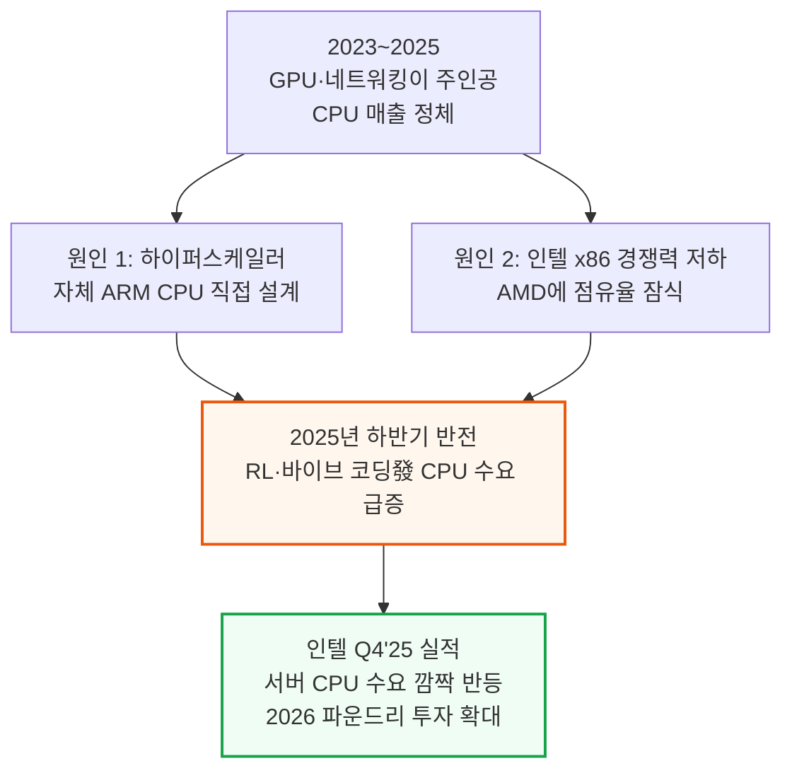

인텔이 공개한 Q4'25 데이터센터·AI(DCAI) 부문 매출 차트는 2025년 하반기 들어 CPU 매출이 반등하는 모습을 보여주고, SemiAnalysis 자체 추정 코어 수 트렌드 차트는 2017\~2026년 CPU 세대를 거듭할수록 코어 수가 꾸준히 늘어난 흐름을 보여줍니다.

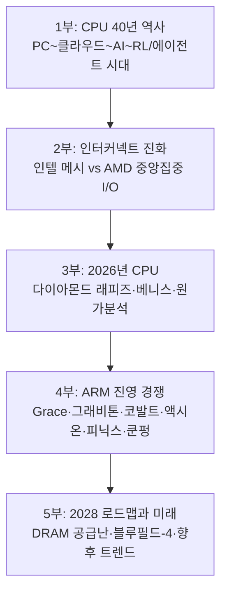

---

## 2. 데이터센터 CPU의 역사 ① - PC 시대에서 닷컴 시대까지

**📌 핵심:**
- 오늘날 서버 CPU의 뿌리는 1990년대 PC 시대 — 인텔 i386·i486·펜티엄이 PC 처리 성능을 끌어올리며 DEC·IBM의 고가 워크스테이션·메인프레임이 하던 일을 훨씬 싼 PC로 대체
- 인텔은 1995년 펜티엄 프로에서 L2 캐시 다이를 CPU와 한 패키지에 묶는 MCM(Multi-Chip Module, 여러 다이를 한 패키지로 묶는 방식)을 처음 도입했고, 1998년 이 계보가 서버용 브랜드 「제온(Xeon)」으로 이어짐
- 2000년대 닷컴 시대엔 인터넷·이메일·전자상거래·구글 검색·3G 스마트폰이 폭발하며 서버 CPU가 수십억 달러 규모 시장으로 성장 — 클럭 속도 경쟁(GHz 전쟁)이 물리적 한계(데나드 스케일링 종료)에 부딪히자 설계 초점이 멀티코어·집적도로 이동
- 결론: AMD가 메모리 컨트롤러를 CPU 안에 통합하고 SMT(동시 다중 스레딩)·다중 소켓 서버(인텔 QPI, AMD 하이퍼트랜스포트)가 등장하며 오늘날 서버 CPU 설계의 기본 틀이 이 시기에 완성됨

---

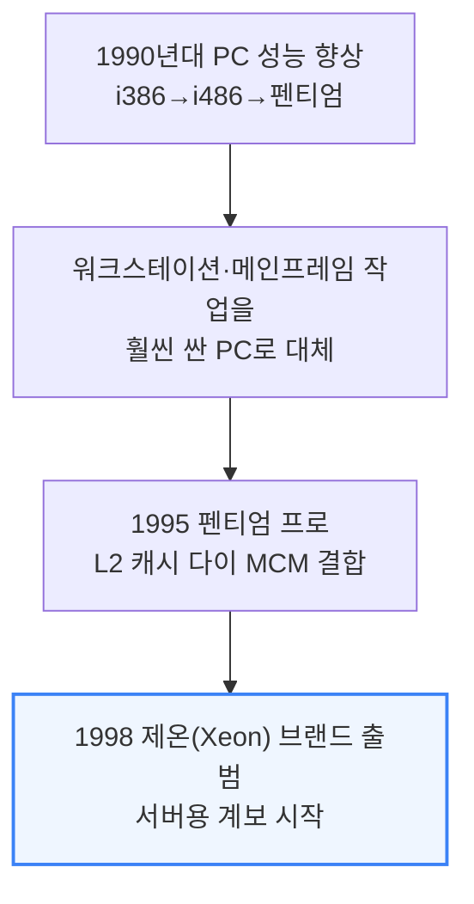

메인프레임 자체는 IBM Z 계열로 지금도 은행 거래 검증 등에 쓰이지만, 시장 규모가 작은 틈새로 남아 이 글에서는 다루지 않습니다.

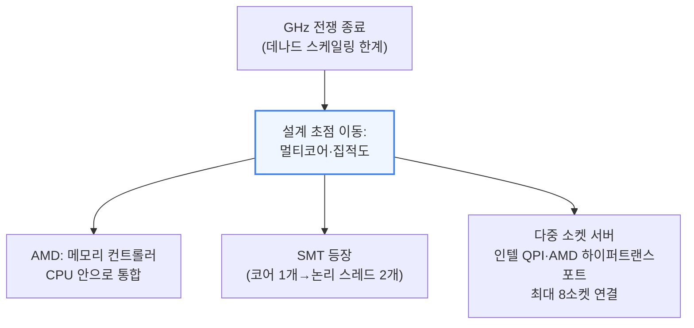

멀티코어 CPU는 여러 작업을 코어별로 병렬 처리할 수 있어 데이터센터 워크로드에 특히 잘 맞았고, 코어를 어떻게 연결하는지(인터커넥트)는 6\~8절에서 자세히 다룹니다.

---

## 3. 데이터센터 CPU의 역사 ② - 가상화·클라우드 시대

**📌 핵심:**
- 2000년대 후반 클라우드 컴퓨팅이 등장하며 기업들은 서버를 직접 사는 대신(초기 투자를 운영비로 전환) AWS 같은 퍼블릭 클라우드에서 컴퓨트를 임대 — 2008년 대침체로 자체 서버를 운용할 여력이 없던 기업들이 대거 몰림
- 클라우드가 작동하려면 CPU 하나로 여러 독립된 가상머신(VM)을 안전하게 동시에 돌리는 '가상화' 기능이 핵심 — 하이퍼바이저(VMware ESXi 등)가 VM을 코어·소켓·서버 사이로 옮기며 활용률을 최적화
- 2018년, 가상화와 SMT(동시 다중 스레딩)의 조합이 스펙터·멜트다운 취약점으로 이어짐 — 같은 물리 코어에서 도는 두 스레드 중 하나가 분기 예측 기능(다음에 실행할 명령을 미리 추측해 처리하는 성능 기법)을 악용해 다른 스레드의 데이터를 훔쳐볼 수 있었음
- 결론: 클라우드 업체들은 부랴부랴 SMT를 꺼서 막았고, 이때 발생한 최대 30% 성능 손실은 훗날 인텔의 설계 판단에도 그림자를 남김(9절 다이아몬드 래피즈의 SMT 제거 사건으로 이어짐)

---

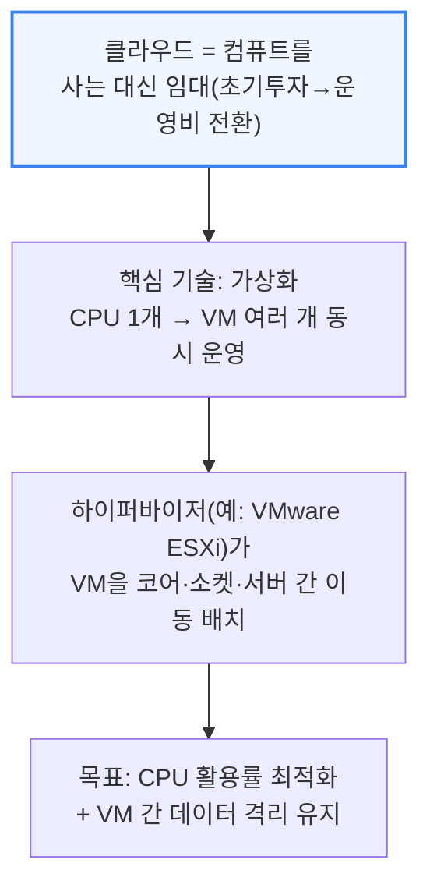

서버리스(예: AWS 람다)는 이 위에 한 겹 더 얹어, 사용자가 인스턴스 개수를 직접 정하지 않아도 작업을 자동으로 컴퓨트 자원에 배정합니다. 클라우드는 이렇게 컴퓨트를 눈에 안 보이는 '상품'으로 바꿔놓았습니다.

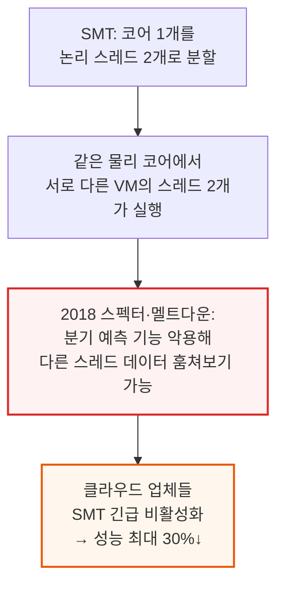

---

## 4. AI 시대의 CPU - 헤드노드와 클라우드 네이티브 소켓 통합

**📌 핵심:**
- 챗GPT 출시(2022-11) 직전 5년간 인텔은 제온 스케일러블 CPU를 1억 대 이상 팔았을 만큼 CPU 수요가 최고조였으나, AI 모델 학습·추론이 본격화되며 CPU의 역할 자체가 흔들림
- AI 연산의 핵심인 행렬곱셈은 원래 3D 그래픽 렌더링용으로 설계된 GPU의 벡터 유닛으로 훨씬 잘 병렬화됨 — CPU는 벡터 유닛이 수십 개인 반면 GPU는 수천 개, 여기에 행렬곱 전용 텐서 코어까지 더해져 CPU 대비 성능·효율이 100\~1,000배 낮음
- 인텔이 AVX512 포트를 2배로 늘리고 AMX(행렬곱 가속 엔진)를 추가했지만 역부족 — CPU는 데이터센터에서 두 갈래 보조 역할로 재편: ① 헤드노드(GPU 옆에서 데이터를 떠먹이는 CPU) ② 클라우드 네이티브 소켓 통합(인터넷 서비스를 최소 전력으로 처리하는 CPU)
- 결론: GPU가 전력 예산을 독식하는 와중에도 인터넷 서비스는 계속 돌아가야 하므로, CPU는 사라지지 않고 역할을 좁혀 살아남음

---

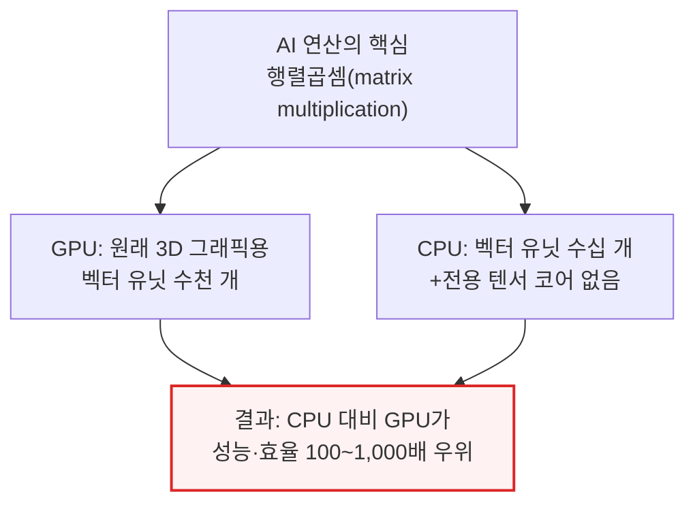

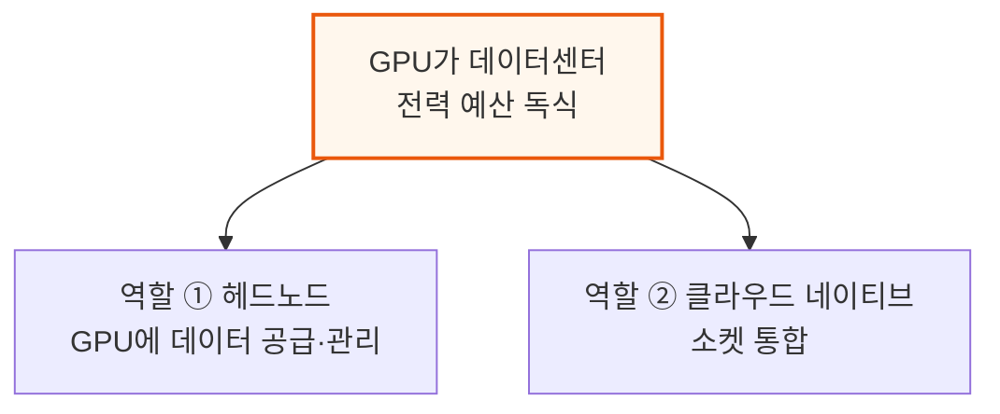

헤드노드는 코어당 성능·대용량 캐시·고대역폭 메모리/IO로 꼬리 지연(tail latency)을 최소화하는 것이 목표이며, GPU 1개당 CPU가 붙는 비율은 세대·벤더마다 다릅니다.

- 1개 Vera CPU : Rubin GPU 2개 (엔비디아 슈퍼칩)
- 1개 Venice CPU : MI455X GPU 4개 (AMD 컴퓨트 트레이)
- 1개 Graviton5 CPU : Trainium3 4개 (AWS 컴퓨트 트레이)
- x86 CPU 2개 : TPUv7 8개 (구글 노드)

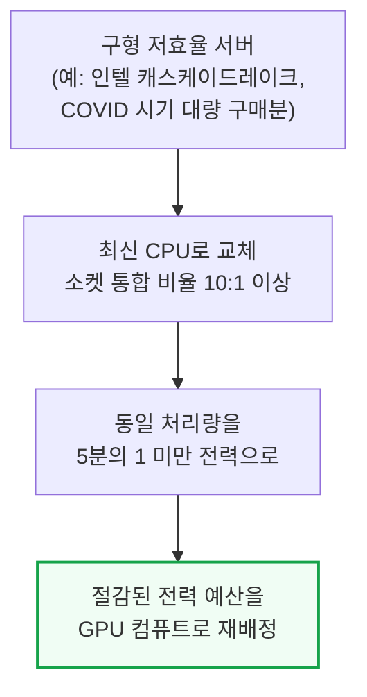

클라우드 네이티브 CPU는 코어당 면적·전력 효율이 좋은 중간 크기 코어를 훨씬 많이 넣고 캐시·IO는 줄이는 설계입니다.
인텔은 아톰 코어를 서버에 가져온 시에라 포레스트로, AMD는 Zen4 코어를 면적·전력 효율형으로 재배치한 버가모로 각각 대응했습니다. AWS 그래비톤 같은 전력 효율형 ARM 설계와 암페어 컴퓨팅의 알트라·암페어원 라인도 이 흐름에서 자리를 잡았습니다.

---

## 5. RL·에이전트 시대 - CPU 수요의 새로운 폭발

**📌 핵심:**
- 지금은 헤드노드를 넘어 AI 학습·추론 전반을 지원하기 위해 CPU 사용이 다시 가속 — 마이크로소프트 Fairwater(오픈AI向 데이터센터)는 GPU 클러스터 295MW를 CPU·스토리지 건물 48MW가 뒷받침하며, 수만 대의 CPU가 GPU가 쏟아내는 페타바이트급 데이터를 처리·관리
- 강화학습(RL) 훈련 루프에서는 'RL 환경(Environment)'이 모델이 생성한 행동을 실행하고 보상을 계산해야 하는데, 코딩·수학 영역에서는 코드 컴파일·검증·해석에 CPU가 대량 병렬로 필요하고 물리 시뮬레이션·합성 데이터 정밀 검증에도 CPU가 깊이 관여
- AI 가속기의 와트당 성능이 CPU보다 훨씬 빠르게 개선되고 있어, Fairwater에서 이미 나타난 CPU:GPU 전력 비율 1:6이 차세대(루빈 등)에서는 CPU 비중이 더 커질 전망 — CPU가 새로운 병목이 되고 있음
- 결론: 추론 쪽에서도 인터넷·DB를 조회하는 RAG·에이전트 모델이 사람보다 훨씬 많은 API 호출을 만들어내며 범용 CPU 수요를 밀어올리고, 2026년 CPU·DRAM 공급은 이미 빠듯한 상태

---

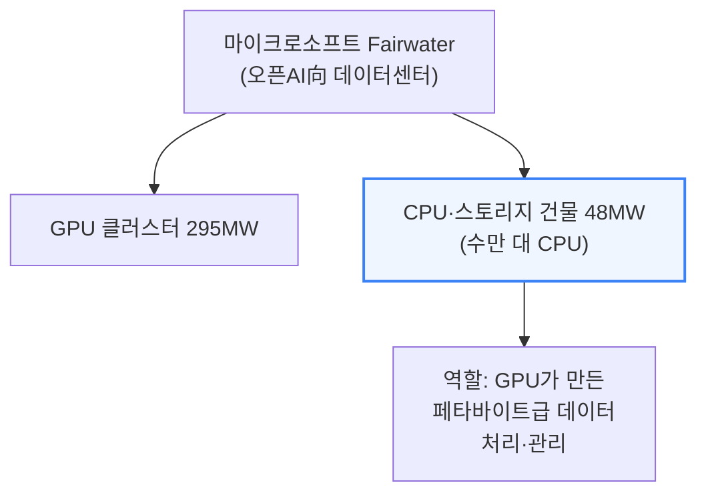

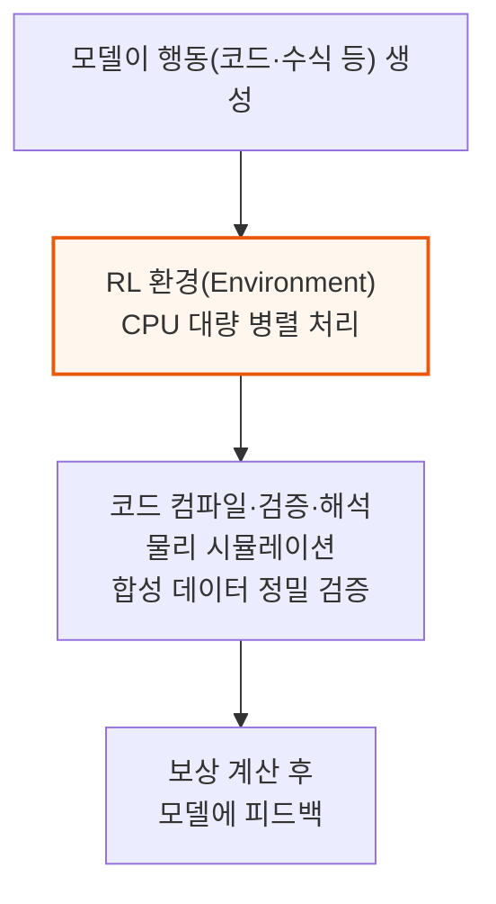

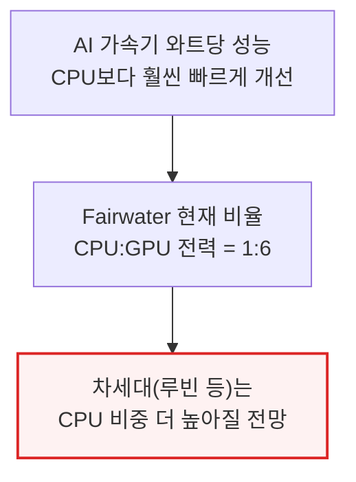

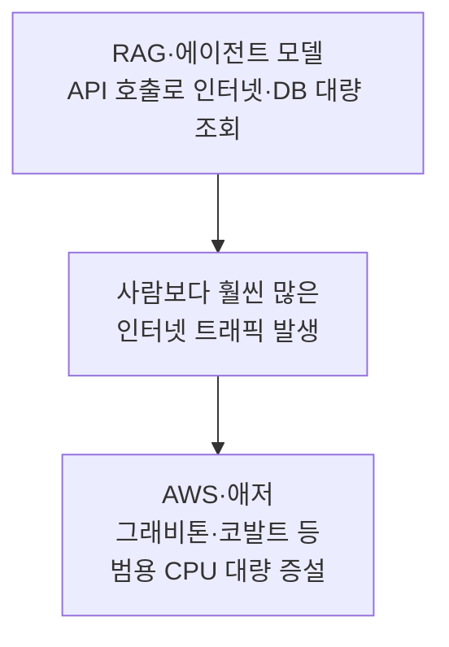

2026년 들어 프런티어 AI 랩들은 RL 학습용 CPU가 부족해 클라우드 업체와 상용 x86 서버를 놓고 직접 경쟁하고 있습니다. 인텔은 예상 밖의 재고 소진에 제온 전 라인업 가격 인상을 검토 중이고, AMD는 2026년 서버 CPU 시장(TAM)이 "두 자릿수 후반" 성장할 것으로 보고 공급 능력을 늘리고 있습니다.

---

## 6. 인텔 인터커넥트 진화 ① - 크로스바에서 메시까지

**📌 핵심:**
- 초기 듀얼코어(2005년 인텔 펜티엄D)는 코어 간 통신을 칩 밖 버스로 처리한 반면, AMD 애슬론64 X2는 메모리 컨트롤러를 다이에 통합해 온다이(on-die) 배선으로 직접 통신 — 이후 온다이 데이터 패브릭이 서버 CPU 설계의 핵심 과제가 됨
- 크로스바(모든 코어를 1:1로 잇는 배선)는 코어가 늘수록 연결 수가 기하급수적으로 늘어 사실상 4코어가 한계(코어 2개=연결 1개, 8개=연결 28개) — 인텔은 2010년 링버스로, 2017년 메시로 갈아타며 이 한계를 순서대로 돌파
- 링버스는 모든 코어를 고리 모양으로 배열해 데이터가 한 정거장씩 이동하는 방식으로 8\~10코어까지는 통했지만 반대편 코어 간 지연이 늘어나는 문제가 있었고, 2014년 아이비브리지는 '가상 링' 3개로 15코어까지 억지로 늘렸지만 근본 해법은 아니었음
- 결론: 2017년 스카이레이크-X부터 채택한 메시(격자형 배선)가 이후 10년간 인텔 서버 CPU의 기본 골격이 됨 — 코어를 격자에 배치하고 상하좌우로만 연결해 배선 복잡도를 낮춤

---

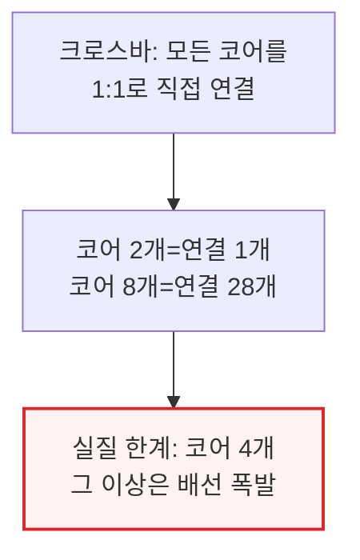

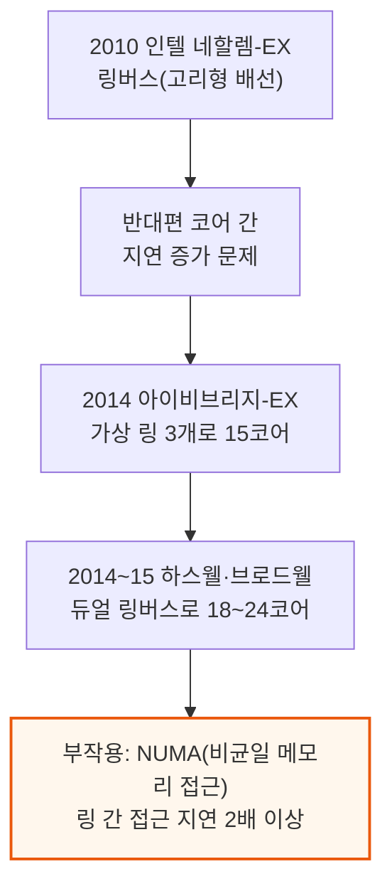

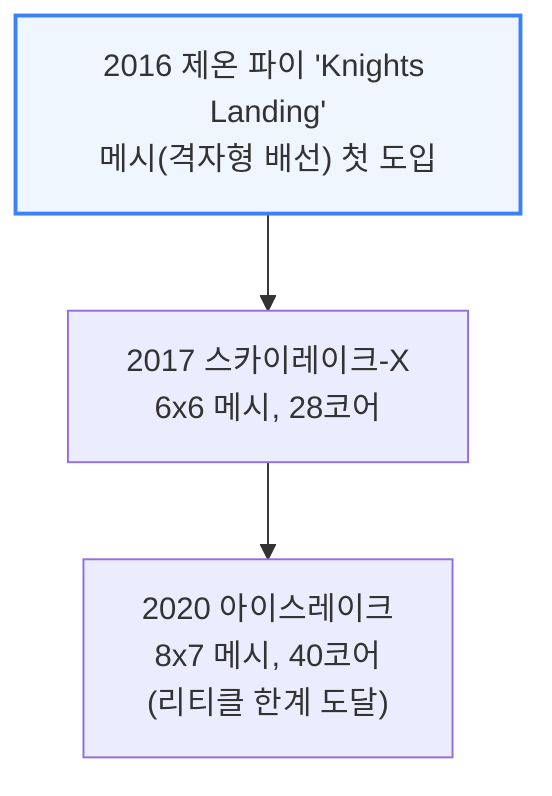

메시도 다이 반대편 메모리 컨트롤러까지 거리가 멀어지면 지연이 벌어지는 문제가 있습니다.
인텔은 메시를 4분면으로 쪼개 지연을 낮추는 대신 각 분면을 별도 소켓처럼 취급하는 '서브-NUMA 클러스터링(SNC)' 옵션을 제공했습니다. 다이 크기는 노광 장비가 한 번에 새길 수 있는 최대 면적(리티클 한계, 약 26×33mm)에 부딪혀 아이스레이크 이후로는 한 다이 안에서 코어를 더 늘릴 수 없었습니다.

---

## 7. 인텔 인터커넥트 진화 ② - 분리형 패키징과 클리어워터 포레스트의 실패

**📌 핵심:**
- 2023년 사파이어 래피즈는 AI용 AMX(행렬곱 가속 엔진) 추가로 코어 면적이 늘어 단일 다이로는 34코어(아이스레이크 40코어보다 오히려 적음)밖에 못 넣게 되자, 15코어 다이 4개를 EMIB 패키징으로 묶어 8x12 메시·60코어를 만듦 — 대신 코어 간 지연이 47ns→59ns로 악화
- 2024년 Xeon 6는 I/O 다이와 코어·메모리 다이를 분리하는 이종 분리형 패키징으로 전환 — I/O 다이는 구형 저비용 공정을 재사용하고 코어 다이만 최신 공정으로 옮겨, P코어(그래나이트 래피즈)·E코어(시에라 포레스트)를 자유롭게 섞어 씀
- 시에라 포레스트(144코어, 클라우드 네이티브)는 하이퍼스케일러 요청으로 만들었지만 정작 하이퍼스케일러는 이미 AMD·자체 ARM CPU로 넘어간 뒤라 채택이 저조했고, 288코어 상위 버전은 정식 출시조차 못함
- 결론: 클리어워터 포레스트(18A 코어를 Foveros Direct로 적층한 차기 E코어 CPU)는 2년의 기술 격차·새 공정·새 패키징을 쏟아붓고도 시에라 포레스트 대비 겨우 17% 빨라 인텔이 실적 발표에서 거의 언급조차 안 함

---

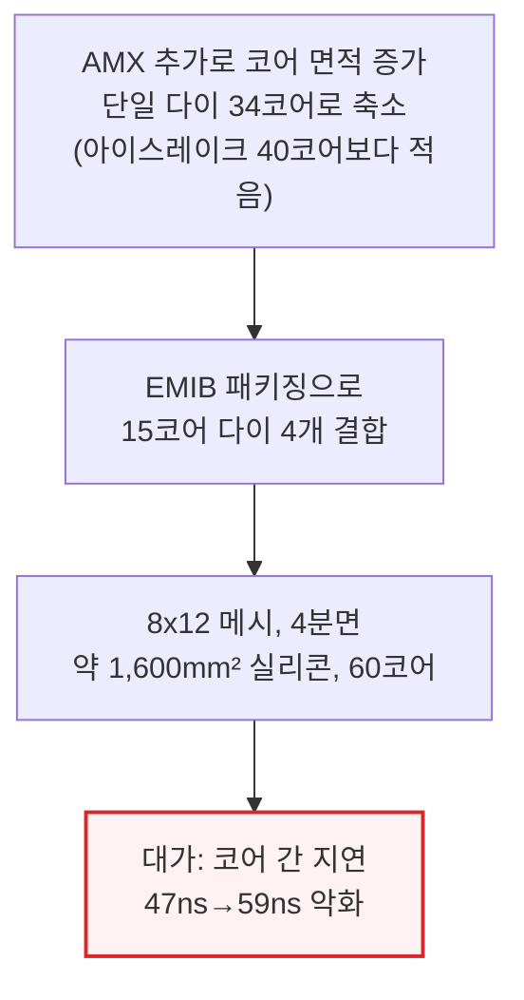

2023년 후속 에메랄드 래피즈는 다이 수를 4개에서 2개로 줄여 EMIB 배선에 쓰던 면적을 아끼는 대신, 코어 수를 60→66개(수율 감안 64개 활성)로 늘리고 L3 캐시는 거의 3배인 320MB로 키웠습니다.

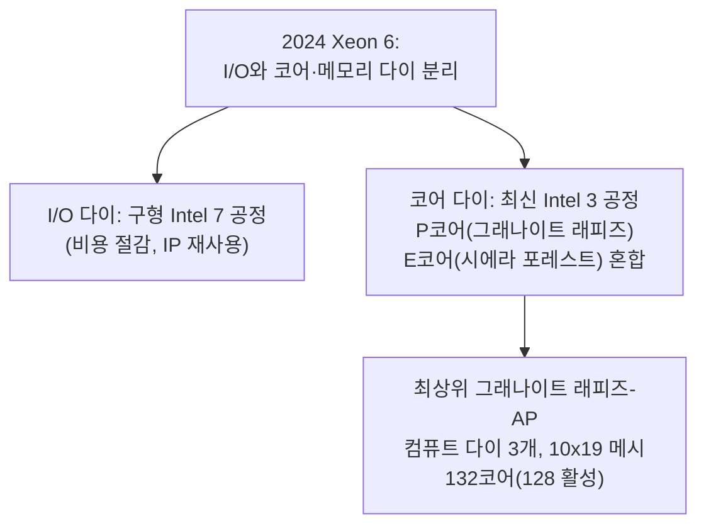

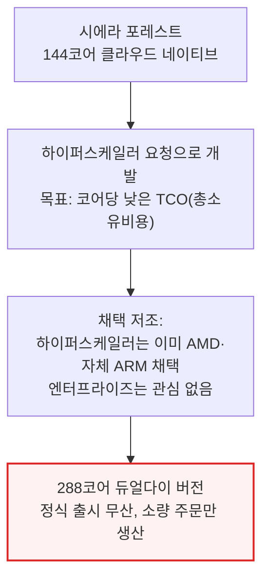

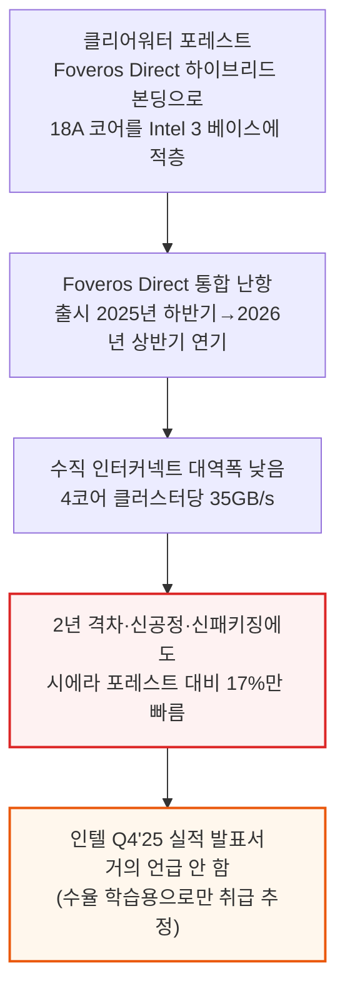

---

## 8. AMD 인터커넥트 진화 - Zen과 중앙집중형 I/O 다이

**📌 핵심:**
- 2017년 AMD가 서버 시장에 복귀시킨 EPYC 네이플스는 인텔로부터 "풀로 붙인 데스크톱 다이 4개"라 조롱받았지만, 작은 다이 4개("제플린")를 묶어 인텔의 28코어를 넘는 32코어를 만들어냄
- 네이플스는 다이 간 통신을 인피니티 패브릭으로 연결했지만 통합 L3 캐시가 없고 다중 홉이 필요해 듀얼소켓 서버가 NUMA 도메인 4개(CCX 내부·CCX 간·다이 간·소켓 간)로 쪼개졌고, 소프트웨어 대부분이 이를 인식하지 못해 "일관성 없는 성능"이라는 인텔의 비판이 어느 정도 맞아떨어짐
- 2019년 EPYC 로마는 설계를 완전히 재구성 — 8코어 CCD(Core Compute Die) 8개가 메모리·PCIe를 담당하는 중앙 I/O 다이 하나를 둘러싸고, CCD 간 통신은 전부 이 중앙 다이를 거치도록 해 64코어인데도 NUMA 도메인은 단 2개로 단순해짐
- 결론: AMD는 이후 밀란(2021)·제노아(2022)·튜린(2024, CCD 최대 16개·128코어)까지 같은 중앙집중형 구조를 유지했고, CCD 하나만 설계하면 개수 조합만으로 전체 SKU를 커버할 수 있어(메시처럼 코어 수마다 다이를 새로 설계할 필요 없음) 수율·출시 속도에서 유리했음

---

```mermaid
flowchart TD
    Naples["2017 EPYC 네이플스<br/>제플린 다이 4개 MCM, 32코어"] --> CCX["다이당 CCX(코어 복합체) 2개<br/>4코어+8MB L3, 크로스바 연결"]
    CCX --> Fabric["인피니티 패브릭으로<br/>다이 간(IFOP)·소켓 간(IFIS) 연결"]
    Fabric --> Numa4["듀얼소켓 = NUMA 도메인 4개<br/>(CCX 내부·CCX 간·다이 간·소켓 간)"]

    style Numa4 fill:#fef2f2,stroke:#dc2626,stroke-width:2px
```

```mermaid
flowchart TD
    Rome["2019 EPYC 로마<br/>CCD(8코어) 8개가<br/>중앙 I/O 다이 하나를 둘러싼 구조"] --> Route["CCD 간 통신은<br/>전부 중앙 I/O 다이를 경유(GMI 링크)"]
    Route --> Simplify["결과: 64코어인데<br/>NUMA 도메인은 단 2개로 단순화"]
    Simplify --> VM["단, VM은 4코어 이내로<br/>제한해야 성능 손실 회피(로마 한정)"]

    style Simplify fill:#f0fdf4,stroke:#16a34a,stroke-width:2px
```

```mermaid
flowchart TD
    Milan["2021 밀란: CCX를 8코어로 확장<br/>(링버스, 동일 I/O 다이 재사용)"] --> Genoa["2022 제노아: CCD 12개"]
    Genoa --> Turin["2024 튜린: CCD 최대 16개<br/>128코어 EPYC 9755"]
    Turin --> Benefit["장점: CCD 하나만 설계하면<br/>개수 조합으로 전체 SKU 커버<br/>(메시 방식은 코어 수마다 다이 재설계 필요)"]

    style Benefit fill:#f0fdf4,stroke:#16a34a,stroke-width:2px
```

같은 I/O 다이·소켓을 공유하면서 CCD만 바꿔치기하는 것도 가능해, 저전력 조밀 코어(Zen4c)를 쓴 버가모, Zen5c로 192코어까지 늘린 튜린 변형, 6채널 메모리 플랫폼에 Zen4c CCD 4개만 얹은 소형 EPYC 8004 시에나까지 파생 라인업을 늘렸습니다.

---

## 9. 인텔 다이아몬드 래피즈 아키텍처 변화

**📌 핵심:**
- 다이아몬드 래피즈는 언뜻 AMD식 설계를 베낀 듯 보임 — 그래나이트 래피즈의 10x19 메시를 더 키우기 어려워지자, 인텔도 결국 CBB(코어 빌딩블록) 다이 4개가 IMH(I/O·메모리 허브) 다이 2개를 둘러싸는 중앙집중형 구조로 전환
- 각 CBB는 18A-P 공정 DCM(듀얼코어모듈) 32개를 Intel 3-PT 베이스 다이에 하이브리드 본딩해 총 256코어 설계지만, 주력 SKU는 192코어만 활성화(나머지는 수율 낮은 오프로드맵용)
- 최악의 문제는 SMT 제거 — 스펙터·멜트다운 트라우마로 2024년 라이언코브부터 P코어에 SMT를 빼기 시작했는데, PC에서는 E코어가 멀티스레드를 보완해줬지만 처리량이 생명인 데이터센터에서는 치명적이라 192코어·192스레드 다이아몬드 래피즈가 128코어·256스레드 그래나이트 래피즈보다 겨우 40% 빠른 수준에 그칠 전망
- 결론: 인텔은 뒤늦게 주력 8채널 다이아몬드 래피즈-SP 플랫폼을 아예 취소해 최대 물량 시장이 2028년까지 신세대 공백에 빠졌는데, SemiAnalysis는 AI 툴 사용·컨텍스트 저장에는 초고성능 소켓보다 연결성 좋은 범용 CPU가 필요해 이 판단이 잘못됐다고 지적

---

```mermaid
flowchart TD
    DR["다이아몬드 래피즈 구조<br/>AMD식 중앙 I/O 다이 방식 채택"] --> CBB["CBB(코어 빌딩블록) 다이 4개<br/>18A-P DCM을 Intel 3-PT 베이스에 하이브리드 본딩"]
    DR --> IMH["IMH(I/O·메모리 허브) 다이 2개<br/>16채널 DDR5, PCIe6+CXL3"]
    CBB --> Cores["총 256코어 설계<br/>주력 SKU는 192코어만 활성"]
```

```mermaid
flowchart TD
    Spectre["스펙터·멜트다운 트라우마"] --> NoSMT["2024 라이언코브부터<br/>P코어에서 SMT 제거 결정"]
    NoSMT --> PCok["PC에서는 무방<br/>(E코어가 멀티스레드 보완)"]
    NoSMT --> DCbad["데이터센터에서는 치명적<br/>처리량이 곧 경쟁력"]
    DCbad --> Result["192코어 다이아몬드 래피즈<br/>≈ 128코어 그래나이트 래피즈보다<br/>단 40%만 빠름"]

    style Result fill:#fef2f2,stroke:#dc2626,stroke-width:2px
```

```mermaid
flowchart TD
    Cancel["다이아몬드 래피즈-SP<br/>(주력 8채널 플랫폼) 전면 취소"] --> Gap["최대 물량 시장이<br/>2028년까지 신세대 공백"]
    Gap --> Critique["SemiAnalysis 비판:<br/>AI 툴 사용·컨텍스트 저장은<br/>연결성 좋은 범용 CPU가 필요<br/>(초고성능 소켓이 아니라)"]

    style Critique fill:#fff7ed,stroke:#ea580c,stroke-width:2px
```

---

## 10. AMD 베니스 아키텍처 변화

**📌 핵심:**
- 인텔이 EMIB(첨단 패키징)에서 멀어지는 사이 AMD는 베니스에서 처음으로 이에 준하는 첨단 패키징을 도입 — CCD와 I/O 다이를 고속 단거리 링크로 연결하는데, 배선 공간이 부족해져 중앙 I/O 허브를 2개로 쪼갬(다이아몬드 래피즈엔 없는 NUMA 도메인이 하나 더 생김)
- 메모리 채널이 12→16개로 늘고 MRDIMM(다중화 메모리)을 지원해 16채널 MRDIMM-12800 기준 대역폭 1.64TB/s(튜린의 2.67배)를 확보, 코어는 칩 내부에도 메시 방식을 도입해 Zen6c 32코어 CCD를 TSMC N2 공정 8개 붙여 256코어(튜린 192코어 대비 3분의 1 증가)를 만듦
- AI 헤드노드용 저전력 "-F" 파생 SKU는 PC용 12코어 Zen6 CCD를 그대로 재사용해 96코어까지 구성 — 128코어 튜린-클래식보다는 적지만 기존 64코어 고주파 모델보다는 50% 많은 코어를 제공
- 결론: AMD 자체 벤치마크 기준 최상위 256코어 모델은 튜린 대비 와트당 성능 1.7배 이상이며, 이미 코어당 성능에서 인텔을 앞서던(96코어 튜린이 128코어 그래나이트 래피즈와 맞먹음) 격차가 2026\~2028년 세대에서 더 벌어질 전망

---

```mermaid
flowchart TD
    Venice["베니스: EMIB급 첨단 패키징<br/>고속 단거리 링크로 CCD-I/O 연결"] --> Split["I/O 다이 배선 공간 부족<br/>→ 중앙 I/O 허브를 2개로 분할"]
    Split --> ExtraHop["다이 간 홉 하나 추가<br/>(다이아몬드 래피즈엔 없는<br/>NUMA 도메인 추가 발생)"]
    Split --> Channels["메모리 채널 12→16<br/>MRDIMM 16채널 시<br/>대역폭 1.64TB/s(튜린의 2.67배)"]
```

```mermaid
flowchart TD
    CCD["Zen6c CCD: 32코어<br/>4x8 메시(칩 내부)"] --> Full["TSMC N2 CCD 8개<br/>= 256코어(튜린 192코어보다 3분의 1↑)"]
    Full --> Cache["코어당 L3 4MB 완전 지원<br/>(Zen5c는 절반이었음)<br/>CCD당 128MB 캐시"]
```

```mermaid
flowchart TD
    FSKU["AI 헤드노드용 '-F' SKU<br/>PC용 12코어 Zen6 CCD 재사용"] --> Count["8개 CCD = 96코어<br/>(128코어 튜린-클래식보다 적음)"]
    Count --> Freq["대신 64코어 고주파 모델보다<br/>코어 수 50% 많음"]
```

```mermaid
flowchart TD
    Claim["AMD 자체 벤치마크(SPECrate2017)<br/>256코어 베니스 vs 192코어 튜린"] --> Perf["와트당 성능 1.7배+ 우위"]
    Claim --> BMM["신규 명령어 AVX512_BMM<br/>(이진 행렬곱)"]
    BMM --> Limit["LLM엔 정밀도 부족<br/>Verilog 시뮬레이션 등 제한적 용도"]
```

8개의 소형 IPD(집적형 수동소자) 다이가 I/O 다이 옆, 메모리 채널 배선이 몰리는 구간의 전력 공급을 보조합니다. AMD는 인텔이 8채널 플랫폼에서 발을 빼는 사이 이를 잇는 신규 8채널 베니스 SP8 플랫폼(최대 128 조밀코어)을 내놓아, 전통적으로 인텔이 강했던 엔터프라이즈 시장에서 점유율을 더 늘릴 태세입니다.

---

## 11. 2026 CPU 원가 분석

**📌 핵심:**
- SemiAnalysis는 공급망 데이터를 바탕으로 2026년 x86 데이터센터 CPU의 상세 부품표(BOM, Bill of Materials) 원가 분석을 제공 — 실리콘 다이 크기·공정 노드·수율, 패키징 방식, 테스트 비용까지 항목별로 쪼갠 값
- 분석 대상은 AMD 베니스(SP7·SP8, 클래식·덴스 구성)와 인텔 다이아몬드 래피즈(16채널 AP, 8채널 SP HCC·LCC) 등 x86 CPU 전 라인업, 비교군으로 엔비디아 Grace·Vera 등 ARM CPU도 포함
- 결론: 이 섹션은 유료 컨설팅 안내이며, 실제로 어떤 항목까지 다루는지(BOM 항목·아키텍처 스펙·패키징 기술 비교)는 19절 말미에 상세 목록으로 정리되어 있음

---

## 12. 엔비디아 Grace와 Vera

**📌 핵심:**
- Grace는 범용 CPU가 아니라 헤드노드·확장 GPU 메모리 용도로 설계 — NVLink-C2C 링크(900GB/s 양방향)로 연결된 Hopper·Blackwell GPU가 Grace의 메모리를 풀 대역폭으로 직접 쓸 수 있어, HBM 용량 한계를 CPU당 최대 480GB까지 보완
- 코어는 ARM Neoverse V2를 6x7 메시로 배치해 76코어(72개 활성)·117MB L3를 갖췄고, 3.2TB/s 분할 대역폭을 강조하는 등 원시 연산력보다 데이터 흐름에 초점
- 다만 Grace는 분기 예측 버퍼가 32개의 2MB 영역으로 나뉘어 있어, 24개 영역을 넘으면 성능이 급격히 떨어지고 32개를 넘으면 64MB 버퍼 전체가 초기화되며 분기 이력이 통째로 사라짐 — 이것이 GB200·GB300에서 AI 워크로드가 Grace CPU 때문에 느려지는 실제 원인
- 결론: 2026년 루빈 플랫폼용 Vera는 C2C 대역폭을 1.8TB/s로 2배 늘리고, 브랜치 예측 병목을 겪은 뒤 8년 만에 엔비디아 자체 커스텀 코어("Olympus", SMT 지원 88코어/176스레드)로 갈아타 자체 주장으로 Grace 대비 2배 성능을 노림

---

```mermaid
flowchart TD
    C2C["NVLink-C2C: 900GB/s<br/>양방향 CPU-GPU 직결"] --> Access["GPU가 CPU 메모리를<br/>풀 대역폭으로 활용"]
    Access --> Capacity["HBM 용량 한계 보완<br/>Grace 1개당 최대 480GB"]

    style Capacity fill:#f0fdf4,stroke:#16a34a,stroke-width:2px
```

```mermaid
flowchart TD
    Neo["ARM Neoverse V2 코어<br/>6x7 메시, 76코어(72 활성)"] --> L3["117MB L3 캐시"]
    Neo --> Bisect["3.2TB/s 분할 대역폭<br/>(원시 연산보다 데이터 흐름 중시)"]
```

```mermaid
flowchart TD
    BTB["분기 예측 버퍼<br/>32개의 2MB 가상 주소 영역"] --> Warn["24개 영역 넘으면<br/>성능 급격히 저하"]
    Warn --> Flush["32개 넘으면<br/>64MB 버퍼 전체 초기화<br/>(분기 이력 전부 소실)"]
    Flush --> Slow["결과: GB200·GB300의<br/>AI 워크로드가 Grace CPU 때문에 지연"]

    style Slow fill:#fef2f2,stroke:#dc2626,stroke-width:2px
```

```mermaid
flowchart TD
    Vera["Vera(2026, 루빈 플랫폼)"] --> BW["C2C 대역폭 2배(1.8TB/s)<br/>메모리 1.5TB(SOCAMM 8개, 1.2TB/s)"]
    Vera --> Core["신규 커스텀 코어 'Olympus'<br/>SMT 지원, 88코어/176스레드"]
    Core --> Perf["엔비디아 자체 주장:<br/>Grace 대비 2배 성능"]

    style Perf fill:#f0fdf4,stroke:#16a34a,stroke-width:2px
```

Vera는 주변부 메모리·I/O를 별도 칩렛으로 더 쪼개 총 6개 다이(3nm 컴퓨트 다이 1개, LPDDR5 메모리 다이 4개, PCIe6/CXL3 I/O 다이 1개)를 CoWoS-R 패키징으로 묶습니다. 마지막으로 엔비디아 자체 커스텀 코어를 설계한 것은 8년 전 테그라 자비에(10-와이드 카멜 코어)가 마지막이었을 만큼 이례적인 결정입니다.

---

## 13. AWS 그래비톤5

**📌 핵심:**
- AWS는 하이퍼스케일러 중 최초로 자체 클라우드 CPU를 개발·배포 — 안나푸르나랩스 인수와 ARM Neoverse CSS 레퍼런스 설계 덕에 인텔 제온을 사는 대신 TSMC·OSAT에 직접 가서 만들어 마진을 개선하고 EC2 가격을 낮춤
- COVID 시기 그래비톤2(64코어 Neoverse N1)는 코어당 성능은 인텔 캐스케이드레이크보다 낮았지만 달러당 성능이 압도적이었고, 그래비톤3(2021)은 코어당 성능 강화에 집중해 DDR5·PCIe5를 업계 최초로 적용, 그래비톤4는 코어 수·메모리 채널을 50% 늘려 속도를 30\~45% 끌어올림
- 그래비톤5(2025년 말 프리뷰)는 192개의 Neoverse V3 코어(전 세대의 2배)를 TSMC 3나노 공정·1,720억 트랜지스터로 구현한 대도약 — 공유 L3 캐시를 36MB에서 192MB로 늘려, 코어 수는 2배가 됐지만 메모리 대역폭은 57%만 늘어난 격차를 캐시로 메움
- 결론: AWS는 자체 EDA 검증 흐름에도 그래비톤 수천 대를 써서 "그래비톤이 그래비톤을 설계"하는 내부 순환 구조를 만들었고, 앞으로 Trainium3 가속기의 헤드노드(CPU 1개 : XPU 4개)도 그래비톤4에서 그래비톤5로 넘어갈 예정

---

```mermaid
flowchart TD
    G2["그래비톤2(COVID 시기)<br/>64코어 Neoverse N1<br/>코어당 성능은 낮지만<br/>달러당 성능 압도"] --> G3["그래비톤3(2021)<br/>Neoverse V1로 코어당 성능 강화<br/>DDR5·PCIe5 업계 최초 적용"]
    G3 --> G4["그래비톤4<br/>96코어(50%↑), 12채널<br/>속도 30~45%↑"]
    G4 --> G5["그래비톤5(2025년 말 프리뷰)<br/>192코어(2배), TSMC 3nm<br/>1,720억 트랜지스터"]

    style G5 fill:#eff6ff,stroke:#3b82f6,stroke-width:2px
```

```mermaid
flowchart TD
    G5spec["그래비톤5 스펙"] --> L3["공유 L3: 36MB→192MB<br/>(대역폭은 57%만 증가,<br/>캐시로 완충)"]
    G5spec --> PCIe["PCIe: Gen5→Gen6이지만<br/>레인 수 96→64로 오히려 축소<br/>(비용 최적화, 성능엔 영향 없음)"]
    G5spec --> Mesh["8x12 메시, 코어 2개당<br/>메시 정거장 1개 공유"]
```

```mermaid
flowchart TD
    Dogfood["AWS 내부에서<br/>그래비톤 수천 대로<br/>CI/CD·EDA 설계 검증"] --> SelfDesign["'그래비톤이 그래비톤을 설계'<br/>내부 순환 구조"]
    Trainium["Trainium3 가속기 헤드노드"] --> Ratio["CPU 1개 : XPU 4개<br/>초기엔 그래비톤4, 향후 그래비톤5"]
```

---

## 14. 마이크로소프트 코발트 200과 구글 액시온

**📌 핵심:**
- 마이크로소프트 코발트 200(2025년 말 출시)은 코어 수(128→132)는 거의 그대로지만 코어 자체가 Neoverse N2에서 V3로 바뀌어 성능이 오르고, TSMC 3나노 다이 2개를 커스텀 고대역폭 인터커넥트로 연결(다이당 8x8 메시, 72코어 중 66개 활성, 192MB 공유 L3)해 코발트 100 대비 50% 빨라짐
- 다만 코발트 200은 애저의 범용 컴퓨트 전용이며 AI 헤드노드로는 쓰지 않음 — 마이크로소프트의 Maia 200 랙스케일 시스템은 대신 인텔 그래나이트 래피즈를 씀
- 구글 액시온은 2024년 발표해 2025년 정식 출시된 구글의 첫 커스텀 클라우드 CPU 라인 — 고성능형 C4A(최대 96코어, Neoverse V2, 3nm)와 비용 효율형 N4A(64코어, Neoverse N3, 소형 다이)로 나뉨
- 결론: 구글은 Gmail·유튜브·구글플레이 등 내부 인프라를 액시온으로 전환 중이며, 앞으로는 제미나이를 구동하는 TPU 클러스터의 헤드노드로도 액시온을 쓸 계획

---

```mermaid
flowchart TD
    C100["코발트 100(2023)"] --> C200["코발트 200(2025년 말)<br/>132코어(거의 그대로)<br/>Neoverse V3로 코어당 성능↑"]
    C200 --> Spec["TSMC 3nm 다이 2개<br/>다이당 8x8 메시, 72코어(66 활성)<br/>192MB 공유 L3"]
    Spec --> Result["코발트 100 대비 50% 속도↑<br/>단, 범용 컴퓨트 전용<br/>(AI 헤드노드는 그래나이트 래피즈가 담당)"]

    style Result fill:#eff6ff,stroke:#3b82f6,stroke-width:2px
```

```mermaid
flowchart TD
    Axion["구글 액시온<br/>(2024 발표, 2025 정식 출시)"] --> C4A["C4A: 고성능형<br/>최대 96코어(3nm), Neoverse V2"]
    Axion --> N4A["N4A: 비용 효율형<br/>64코어 Neoverse N3, 소형 다이"]
    C4A --> Use1["Gmail·유튜브 등<br/>구글 내부 인프라 ARM 전환"]
    N4A --> Use2["웹·마이크로서비스<br/>스케일아웃 워크로드"]
```

---

## 15. 암페어원과 소프트뱅크 인수

**📌 핵심:**
- 암페어 컴퓨팅은 AMD·인텔에 맞서는 "제3의 x86 대안"으로 상용 ARM 서버 칩 시장을 개척한 원조 — 오라클과 강한 파트너십으로 80코어 알트라·128코어 알트라맥스를 내놓으며 x86 양강 구도를 흔들겠다고 나섬
- 후속 암페어원은 192코어까지 늘리며 5나노 공정·커스텀 ARM 코어·IO 분리형 칩렛 설계로 정수 연산 성능을 알트라맥스 대비 2배로 끌어올렸지만, 소프트웨어가 아직 ARM에 최적화되지 않았던 시기에 너무 일찍(알트라) 나온 데다 암페어원 출시마저 지연되면서 그 사이 하이퍼스케일러들이 자체 ARM CPU를 완성하고 AMD가 코어당 성능에서 3\~4배 앞서는 처지가 됨
- 오라클의 암페어 CPU 매입액은 회계연도 2023년 4,800만 달러에서 2024년 300만 달러, 2025년 370만 달러로 사실상 붕괴 — 코어당 라이선스 비용을 절반으로 낮춰줘도 주문이 살아나지 않음
- 결론: 결국 2025년 소프트뱅크가 65억 달러에 암페어를 인수 — 손정의 회장은 스타게이트 벤처용 CPU 설계 인재를 확보하려 했고, 오라클은 부진 사업을 정리하려는 목적이 맞아떨어짐. 암페어는 이제 소프트뱅크 산하에서 CPU와 AI 칩을 함께 개발 중

---

```mermaid
flowchart TD
    Altra["알트라(80코어)·알트라맥스(128코어)<br/>Neoverse N1, 오라클과 강한 파트너십"] --> One["암페어원<br/>192코어, 5nm, 커스텀 ARM 코어<br/>정수 성능 알트라맥스의 2배"]
    One --> M["암페어원-M<br/>12채널(메모리 다이 2개 추가)"]
    One --> MX["암페어원-MX(계획)<br/>3nm 256코어"]
```

```mermaid
flowchart TD
    Fail["암페어 CPU 양산 물량<br/>끝내 못 키움(타이밍·실행 문제)"] --> Reason1["소프트웨어가 ARM 네이티브 아니던<br/>시기에 너무 일찍 출시(알트라)"]
    Fail --> Reason2["암페어원 출시 지연<br/>→ 그 사이 하이퍼스케일러 자체 ARM 본격화<br/>+ AMD가 코어당 성능 3~4배 앞섬"]
    Reason1 --> Acq["2025 소프트뱅크가 65억 달러에 인수<br/>(손정의: 스타게이트용 CPU 인재 확보<br/>+ 오라클: 부진 사업 정리)"]
    Reason2 --> Acq

    style Acq fill:#fff7ed,stroke:#ea580c,stroke-width:2px
```

---

*작성 진행률: 약 79% 완료 (19개 섹션 중 15개)*
*업데이트: 13\~15절(AWS 그래비톤5, 마이크로소프트 코발트 200·구글 액시온, 암페어원과 소프트뱅크 인수) 작성 완료*

---

## 16. ARM 피닉스와 화웨이 쿤펑

**📌 핵심:**
- ARM의 코어 설계도 라이선스 사업은 이미 성공적 — 데이터센터·DPU에 10억 개 이상의 Neoverse 코어가 배치됐고 21건의 CSS 라이선스를 12개사와 체결했으며 관련 로열티 매출이 전년 대비 2배 이상 성장
- 2026년 ARM은 한발 더 나가 완제품 CPU 벤더로 직접 전환 — 코드명 피닉스는 코어부터 패키징까지 ARM이 직접 설계한 CPU로, 첫 고객은 메타(코발트 200과 비슷한 설계, 128 Neoverse V3 코어, TSMC 3nm 다이 2개)이며 오픈AI(스타게이트 벤처)向 커스텀 CPU도 별도로 설계 중 — 이는 ARM이 자사 Neoverse CSS를 라이선스 받아온 고객들과 직접 경쟁하는 관계로 바뀐다는 뜻
- 중국은 화웨이 쿤펑이 대표주자 — 2019년 쿤펑 920(64코어, TSMC 7nm, TSMC CoWoS-S 첫 적용)은 미국 제재로 후속 쿤펑 930(2021)이 출시 무산됐고, 2024년 조용히 나온 쿤펑 920B(80코어/160스레드, SMT 지원)는 SMIC N+2 공정으로 재설계하느라 5년의 공백이 생겼던 것으로 추정
- 결론: 2026년 쿤펑 950은 새 코어(LinxiCore)로 192코어까지 늘리고 SMIC N+3 공정(화웨이 기린 9030 스마트폰 칩에 처음 쓰인 공정)으로 제작될 전망이며, OLTP(온라인 트랜잭션 처리) 성능을 920B 대비 2.9배로 끌어올려 오라클 엑사데이터·중국 금융권에 공급됨

---

```mermaid
flowchart TD
    Old["기존 ARM 사업모델:<br/>Neoverse CSS 설계도 라이선스<br/>(로열티 수익, 21건·12개사)"] --> New["2026 전환: 완제품 CPU 벤더로<br/>코어부터 패키징까지 직접 설계"]
    New --> First["첫 고객 메타<br/>(피닉스, 128코어)"]
    New --> Others["오픈AI(스타게이트)向 커스텀 CPU도 설계<br/>클라우드플레어도 고객 검토 중"]

    style New fill:#fff7ed,stroke:#ea580c,stroke-width:2px
```

```mermaid
flowchart TD
    Phoenix["피닉스: 코발트 200과 유사한 설계<br/>128 Neoverse V3 코어<br/>TSMC 3nm 다이 2개"] --> Spec["12채널 DDR5-8400<br/>PCIe Gen6 96레인<br/>TDP 250~350W"]
    Spec --> Meta["메타가 마이크로소프트·구글·AWS처럼<br/>자체 ARM CPU 확보"]
```

```mermaid
flowchart TD
    K920["쿤펑 920(2019)<br/>64코어, TSMC 7nm<br/>CoWoS-S 첫 적용"] --> Sanction["미국 제재로<br/>쿤펑 930(2021) 출시 무산"]
    Sanction --> K920B["쿤펑 920B(2024, 조용히 출시)<br/>80코어/160스레드, SMT 지원<br/>SMIC N+2 재설계"]
    K920B --> K950["쿤펑 950(2026)<br/>192코어(LinxiCore), SMIC N+3<br/>OLTP 성능 2.9배(920B 대비)"]

    style Sanction fill:#fef2f2,stroke:#dc2626,stroke-width:2px
```

화웨이 로드맵은 2028년 쿤펑 960까지 이어집니다 — AI 헤드노드·DB용 96코어/192스레드 고성능형(코어당 성능 50%+ 개선)과 가상화·클라우드용 256코어+ 고밀도형으로 나뉠 예정이며, SemiAnalysis는 그때쯤 화웨이가 중국 하이퍼스케일러 CPU 시장에서 상당한 점유율을 가져갈 것으로 봅니다.

---

## 17. 2028년까지 CPU 로드맵 - AMD·인텔·ARM·퀄컴

**📌 핵심:**
- SemiAnalysis는 2017\~2028년 12년간 9개 업체(AMD·인텔·엔비디아·암페어·AWS·구글·마이크로소프트·ARM·화웨이)의 CPU 로드맵을 추적 — AMD는 2027년 MI500 랙용 베라노(여전히 Zen6 코어, 256코어 유지 추정, 새 3nm I/O 다이+PCIe Gen7)를 거쳐 2028년 진짜 차세대 Zen7 CPU "플로렌스"(TSMC A16, 코어 약 320개)로 감
- 인텔은 립부 탄 신임 CEO 체제에서 주력 다이아몬드 래피즈-SP뿐 아니라 그 E코어 후속작(코드명 DMR-HD, 512코어 목표였음)까지 취소하고 자원을 코랄 래피즈로 집중 — P코어에 SMT를 되돌리지만 원래 목표였던 14A 공정이 2027년에야 리스크 생산에 들어가 출시는 2028년 말\~2029년 초로 늦어질 전망, 앞당기려면 18A-Ultra로 우회해야 함
- ARM 베놈(2027, 피닉스 후속)은 228개의 신형 Neoverse V4 코어를 단일 리티클 크기 다이에 담고, 메모리를 기존 DDR5 DIMM에서 LPDDR6로 바꿔 엔비디아 Vera와 비슷한 설계로 수렴 — 퀄컴은 2017년 첫 시도(센트리크 2400)가 시기상조로 끝난 뒤 누비아 인수(2021)로 설계 인력을 확보해 2027년 사우디 HUMAIN向 공급으로 데이터센터 CPU 시장에 재도전(코드명 SD2, 엔비디아 NVLink Fusion 지원)
- 결론: 다만 2026년 1월 누비아 창업자 제라드 윌리엄스 3세 등 핵심 인력이 퇴사해 SD2 이후 로드맵에 그림자가 드리웠고, 영향은 핵심 설계팀이 이미 통합된 2028년 이후에나 나타날 것으로 SemiAnalysis는 예상

---

```mermaid
flowchart TD
    Venice["2026 베니스<br/>Zen6, 256코어"] --> Verano["2027 베라노<br/>MI500向, 여전히 Zen6<br/>새 I/O 다이(3nm)+PCIe Gen7"]
    Verano --> Florence["2028 플로렌스<br/>진짜 차세대 Zen7<br/>TSMC A16, 코어 약 320개"]

    style Florence fill:#eff6ff,stroke:#3b82f6,stroke-width:2px
```

AMD 최고기술책임자 마크 페이퍼마스터는 Zen7이 로컬 AI 연산용 신규 행렬곱 엔진 "ACE"(인텔이 2023년 사파이어 래피즈에 넣은 AMX와 유사)와 AVX10(AVX512 후속), 신규 인터럽트 모델 FRED, 메모리 태깅 ChkTag를 도입한다고 확인했습니다.
다만 이 기능들은 전부 인텔 다이아몬드 래피즈에 먼저 등장했습니다. 반대로 인텔만의 APX(레지스터 확장으로 범용 성능 향상)는 Zen7엔 없습니다.

```mermaid
flowchart TD
    Cancel["다이아몬드 래피즈-SP 취소<br/>+ E코어 후속(DMR-HD) 개발 중단"] --> Coral["코랄 래피즈로 자원 집중<br/>P코어에 SMT 복원"]
    Coral --> Node["원래 14A 공정 목표<br/>(2027 리스크생산→2028말~2029초 출시)"]
    Node --> Accel["출시 앞당기려면<br/>18A-Ultra로 우회 가능성"]
```

```mermaid
flowchart TD
    Venom["ARM 베놈(2027)<br/>228코어 Neoverse V4, TSMC N2<br/>DDR5→LPDDR6 전환"] --> VenomWhy["엔비디아 Vera와 유사한 설계로 수렴<br/>패키지 밀도·XPU 통합 강화"]
```

```mermaid
flowchart TD
    SD1["SD1(미출시)<br/>Oryon 코어 80개, TSMC N5"] --> SD2["SD2(2027 출시 예정)<br/>사우디 HUMAIN向 공급 확정<br/>NVLink Fusion 지원"]
    SD2 --> Risk["2026-01 핵심 설계 인력<br/>(제라드 윌리엄스 3세 등) 퇴사<br/>→ 2028년 이후에나 영향 전망"]

    style Risk fill:#fff7ed,stroke:#ea580c,stroke-width:2px
```

---

## 18. 블루필드-4 - CPU가 네트워킹으로 파고들다

**📌 핵심:**
- CPU가 네트워킹 장비 안으로도 파고들고 있음 — 기존 스마트NIC·DPU는 이더넷 컨트롤러에 ARM 코어 몇 개만 얹어 인네트워크 가속을 했지만, 엔비디아의 블루필드-4 DPU는 아예 Grace CPU 전체를 ConnectX-9 칩과 한 패키지에 담음
- 블루필드-4는 루빈 컴퓨트 트레이마다 프런트엔드 NIC 역할을 하는 동시에, 4개를 묶어 컨텍스트 메모리 스토리지 플랫폼을 구성해 KV 캐시(대화 맥락을 기억하는 중간 데이터)를 고속 낸드로 오프로드
- 활성화된 Grace 코어 64개와 128GB LPDDR5 메모리의 막강한 연산력은 CPU가 AI 데이터 관리에 점점 더 깊이 관여하고 있음을 보여줌 — 기존 동서(East-West, GPU 클러스터 스케일아웃) 네트워크와 남북(North-South, 스토리지·외부·인터넷 연결) 네트워크에 이어 KV 캐시 오프로드·저장이라는 세 번째 네트워크가 등장한 셈
- 결론: 블루필드-4를 계기로 "CPU 연산이 붙은 NIC"와 "네트워킹 가속이 붙은 CPU"(예: Xeon 6 SoC 그래나이트 래피즈-D)의 경계가 점점 흐려지고 있음

---

```mermaid
flowchart TD
    BF4["블루필드-4 DPU<br/>Grace CPU 전체를 ConnectX-9와 한 패키지로"] --> Role1["루빈 컴퓨트 트레이<br/>프런트엔드 NIC 역할"]
    BF4 --> Role2["컨텍스트 메모리 스토리지 플랫폼<br/>(BF4 4개, KV 캐시를<br/>고속 낸드로 오프로드)"]

    style BF4 fill:#eff6ff,stroke:#3b82f6,stroke-width:2px
```

```mermaid
flowchart TD
    EW["동서(East-West) 네트워크<br/>GPU 클러스터 스케일아웃"] --> Third["세 번째 네트워크 등장:<br/>KV 캐시 오프로드·저장"]
    NS["남북(North-South) 네트워크<br/>스토리지·외부·인터넷 연결"] --> Third
    Third --> Blur["NIC과 CPU의 경계가<br/>점점 흐려짐"]

    style Third fill:#fff7ed,stroke:#ea580c,stroke-width:2px
```

---

---

## 19. DRAM 공급난과 CPU 시장의 미래

**📌 핵심:**
- 2026년 서버 CPU와 상용 DDR5 메모리가 동시에 품귀 — CPU 공급은 메모리를 안정적으로 확보한 곳(오픈AI·코어위브·클라우드 하이퍼스케일러 등 대형 구매자)에 먼저 배정되며 시장이 소수 대형 구매자 쪽으로 더 쏠림
- 세그먼트별 타격은 제각각 — 소켓당 메모리 512GB\~1TB를 쓰는 AI 헤드노드는 메모리 원가가 CPU·나머지 서버 부품을 압도해 가장 취약하고(고마진 AI 가속기가 메모리를 계속 빨아들이는 한), 클라우드·가상화용 CPU는 메모리 비중이 낮아 영향이 적으며, 스토리지·엣지용 저가 CPU는 제조사들이 고마진 상위 SKU를 우선하면서 공급 후순위로 밀림
- CPU 설계는 이제 3갈래로 뚜렷이 나뉨 — ① 고밀도 효율형(클라우드·범용, 그래비톤5류) ② 고성능 코어형(고대역폭+AI 가속기 결합, Vera류) ③ 데이터처리·네트워킹형(대량 데이터·컨텍스트 오프로드, 블루필드-4류) — 소켓·코어 수가 커질수록 인터커넥트·데이터 패브릭에 가해지는 압력도 함께 커짐
- 결론: 더 먼 미래에는 CPU와 GPU를 아예 하나로 합친 APU(예: AMD MI300A)가 헤드노드 CPU 자체를 없앨 수도 있고, 메모리를 CPU에서 분리해 풀링하는 개념(JBOM)과 광통신이 결합하면 가속기 랙 하나에 CPU 1개만 붙는 수준까지 CPU 부착 비율이 낮아질 수 있음 — 형태는 바뀌어도 CPU는 컴퓨터의 근본 핵심으로 계속 남을 전망

---

```mermaid
flowchart TD
    Shortage["2026 서버 CPU+DDR5<br/>동시 공급난"] --> HeadNode["AI 헤드노드<br/>(소켓당 메모리 512GB~1TB)<br/>메모리 원가가 CPU보다 압도적"]
    Shortage --> Cloud["클라우드·가상화 CPU<br/>메모리 비중 낮아 영향 적음"]
    Shortage --> Edge["스토리지·엣지 서버<br/>저가 CPU라 공급 후순위로 밀림"]

    style HeadNode fill:#fef2f2,stroke:#dc2626,stroke-width:2px
```

```mermaid
flowchart TD
    Diverge["CPU 설계가 3갈래로 분화"] --> D1n["① 고밀도 효율형<br/>(클라우드·범용, 예: 그래비톤5)"]
    Diverge --> D2n["② 고성능 코어형<br/>(고대역폭+AI 가속기 결합, 예: Vera)"]
    Diverge --> D3n["③ 데이터처리·네트워킹형<br/>(대량 데이터·컨텍스트 오프로드, 예: 블루필드-4)"]

    style Diverge fill:#eff6ff,stroke:#3b82f6,stroke-width:2px
```

메모리 쪽에서는 데이터센터용 LPDDR 채택이 계속 확산되고 있습니다. 16채널급 메모리 설계는 이미 회로기판(PCB) 배선층 수 한계에 가까운 상태입니다.
LPDDR6 SOCAMM 모듈처럼 더 높은 대역폭 밀도를 온패키지 메모리보다 큰 용량으로 확보하는 방식이 대안으로 떠오르고 있습니다. 사파이어 래피즈 Xeon Max, AMD MI300C에서 이미 시도됐던 CPU 탑재형 HBM(고대역폭메모리)이 다시 등장할 가능성도 있습니다.

```mermaid
flowchart TD
    APU["APU(CPU+GPU 통합, MI300A식)<br/>헤드노드 CPU 자체가 불필요해질 가능성"] --> RL["RL 훈련 전용 가속기가<br/>통합 메모리로 RL 환경을 직접 실행"]
    Pool["메모리 분리·풀링(JBOM 개념)<br/>+ 광통신 결합"] --> Ratio["CPU 1개 : 랙 1개(가속기 여러 대)<br/>수준까지 CPU 부착 비율 감소 가능"]

    style APU fill:#eff6ff,stroke:#3b82f6,stroke-width:2px
```

SemiAnalysis는 구독자를 대상으로 2026년 x86·ARM 데이터센터 CPU의 상세 BOM 원가(다이 크기·패키징·테스트 비용), 아키텍처 스펙·플로어플랜 도면을 별도 데이터로 제공한다고 밝힙니다.
세대별 패키징 기술(CoWoS-L·CoWoS-R·EMIB/Foveros Direct) 비교, 코어 수 확장에 따른 지연·NUMA 영향, SPECint2017 기준 성능 추정치까지가 그 범위이며, 이것으로 글을 마칩니다.

---

*작성 진행률: 100% 완료*
*업데이트: 19절(DRAM 공급난과 CPU 시장의 미래) 작성으로 전체 완료*
