# CPUs are Back: The Datacenter CPU Landscape in 2026

> **출처**: [SemiAnalysis Newsletter](https://newsletter.semianalysis.com/p/cpus-are-back-the-datacenter-cpu)
> **저자**: Gerald Wong, Dylan Patel
> **발행일**: 2026-02-09

---

## 📑 목차

### 전체 섹션
 1. [서론 - CPU가 돌아왔다](#1-서론---cpu가-돌아왔다)
 2. [데이터센터 CPU의 역사 ① - PC 시대에서 닷컴 시대까지](#2-데이터센터-cpu의-역사-①---pc-시대에서-닷컴-시대까지)
 3. [데이터센터 CPU의 역사 ② - 가상화·클라우드 시대](#3-데이터센터-cpu의-역사-②---가상화클라우드-시대)
 4. [AI 시대의 CPU - 헤드노드와 클라우드 네이티브 소켓 통합](#4-ai-시대의-cpu---헤드노드와-클라우드-네이티브-소켓-통합)
 5. [RL·에이전트 시대 - CPU 수요의 새로운 폭발](#5-rl에이전트-시대---cpu-수요의-새로운-폭발)
 6. [인텔 인터커넥트 진화 ① - 크로스바에서 메시까지](#6-인텔-인터커넥트-진화-①---크로스바에서-메시까지)
 7. [인텔 인터커넥트 진화 ② - 분리형 패키징과 클리어워터 포레스트의 실패](#7-인텔-인터커넥트-진화-②---분리형-패키징과-클리어워터-포레스트의-실패)
 8. [AMD 인터커넥트 진화 - Zen과 중앙집중형 I/O 다이](#8-amd-인터커넥트-진화---zen과-중앙집중형-io-다이)
 9. [인텔 다이아몬드 래피즈 아키텍처 변화](#9-인텔-다이아몬드-래피즈-아키텍처-변화)
10. [AMD 베니스 아키텍처 변화](#10-amd-베니스-아키텍처-변화)
11. [2026 CPU 원가 분석](#11-2026-cpu-원가-분석)
12. [엔비디아 Grace와 Vera](#12-엔비디아-grace와-vera)
13. [AWS 그래비톤5](#13-aws-그래비톤5)
14. [마이크로소프트 코발트 200과 구글 액시온](#14-마이크로소프트-코발트-200과-구글-액시온)
15. [암페어원과 소프트뱅크 인수](#15-암페어원과-소프트뱅크-인수)
16. [ARM 피닉스와 화웨이 쿤펑](#16-arm-피닉스와-화웨이-쿤펑)
17. [2028년까지 CPU 로드맵 - AMD·인텔·ARM·퀄컴](#17-2028년까지-cpu-로드맵---amd인텔arm퀄컴)
18. [블루필드-4 - CPU가 네트워킹으로 파고들다](#18-블루필드-4---cpu가-네트워킹으로-파고들다)
19. [DRAM 공급난과 CPU 시장의 미래](#19-dram-공급난과-cpu-시장의-미래)

---

## 🔑 용어 정리

본문을 순서대로 읽기 전에 알아두면 좋은 용어들입니다. 자세한 수치와 설명은 본문에서 처음 등장하는 위치에 나옵니다.

- **헤드노드(Head Node)**: GPU 여러 개에 데이터를 실어나르고 관리하는 역할을 맡는 CPU — GPU 옆에 붙어 "데이터를 떠먹여 주는" 보조 역할
- **클라우드 네이티브 소켓 통합(Cloud-Native Socket Consolidation)**: 예전 서버 여러 대를 최신 CPU 한 대로 바꿔, 처리량은 유지하면서 전력·공간을 크게 줄이는 것
- **메시(Mesh)·링버스(Ring Bus)·크로스바(Crossbar)**: 칩 안의 코어 여러 개를 서로 연결하는 배선 방식 — 코어가 늘수록 배선이 기하급수적으로 복잡해지는 문제를 순서대로 풀어온 세 단계(크로스바→링버스→메시)
- **분리형 패키징·칩렛(Chiplet Disaggregation)**: 큰 칩 하나를 여러 개의 작은 조각(다이)으로 나눠 따로 만든 뒤 한 패키지로 붙이는 방식 — 수율을 높이고 부분별로 다른 공정을 쓸 수 있음
- **NUMA(Non-Uniform Memory Access, 비균일 메모리 접근)**: 코어가 자신과 가까운 메모리엔 빨리, 먼 메모리엔 느리게 접근하는 구조 — 코어·다이 수가 늘어날수록 이 속도 차이가 커짐
- **SMT(Simultaneous Multi-Threading, 동시 다중 스레딩)**: 물리 코어 하나를 논리적으로 둘로 쪼개 두 개의 작업을 동시에 처리하게 하는 기술
- **컨텍스트 메모리 스토리지·KV 캐시(Key-Value Cache)**: AI 모델이 대화 맥락을 기억하기 위해 저장해두는 중간 데이터 — 용량이 크고 자주 오가 별도의 저장·전송 인프라가 필요
- **BOM(Bill of Materials, 부품표) 원가 분석**: 칩 하나를 만드는 데 들어가는 실리콘·패키징·테스트 비용을 항목별로 쪼개 계산하는 방법

---

## 1. 서론 - CPU가 돌아왔다

**📌 핵심:**
- 2023년 챗GPT 이후 데이터센터의 주인공은 GPU와 네트워킹이었고 CPU 매출은 정체 — 서버 CPU 최대 공급사 인텔은 AI 붐에 올라타지 못함
- 동시에 하이퍼스케일러들이 자체 ARM CPU를 직접 설계하면서 인텔이 팔 수 있는 시장 자체가 줄었고, x86 진영 안에서도 AMD에 밀려 점유율을 더 잃음
- 그런데 2025년 하반기부터 반전 — 강화학습(RL)과 바이브 코딩(AI가 코드를 직접 작성·실행하는 개발 방식)이 CPU 수요를 밀어올렸고, 인텔은 2026년 파운드리 장비 투자를 늘리고 PC용으로 배정하던 웨이퍼를 서버용으로 돌리기 시작
- 결론: 2026년은 인텔·AMD·엔비디아·ARM 진영·하이퍼스케일러가 동시에 신세대 CPU를 쏟아내는 해 — 이 글은 그 판도를 처음부터 끝까지 정리

---

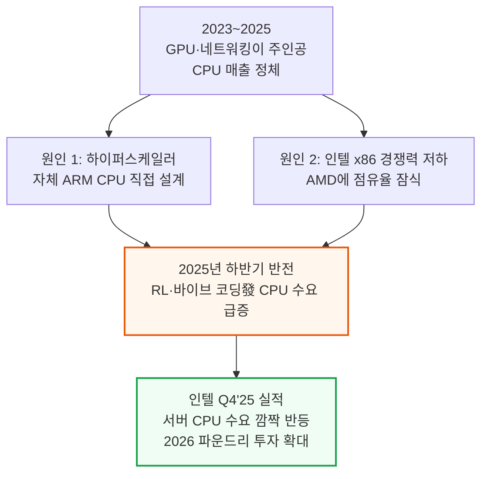

인텔이 공개한 Q4'25 데이터센터·AI(DCAI) 부문 매출 차트는 2025년 하반기 들어 CPU 매출이 반등하는 모습을 보여주고, SemiAnalysis 자체 추정 코어 수 트렌드 차트는 2017\~2026년 CPU 세대를 거듭할수록 코어 수가 꾸준히 늘어난 흐름을 보여줍니다.

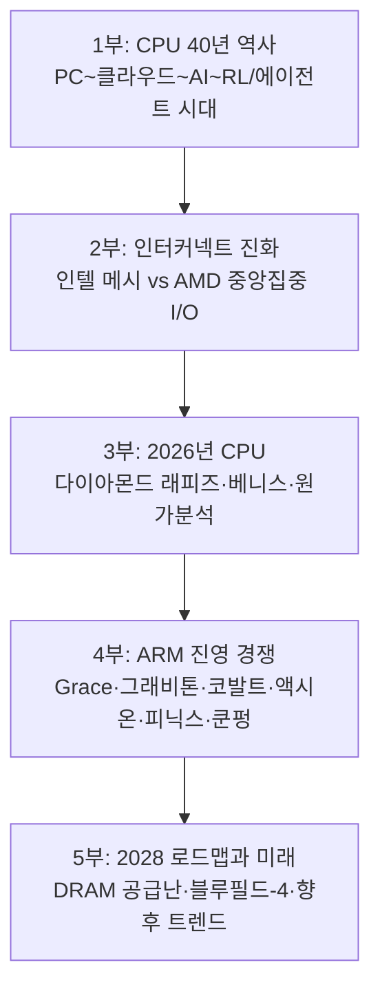

---

## 2. 데이터센터 CPU의 역사 ① - PC 시대에서 닷컴 시대까지

**📌 핵심:**
- 오늘날 서버 CPU의 뿌리는 1990년대 PC 시대 — 인텔 i386·i486·펜티엄이 PC 처리 성능을 끌어올리며 DEC·IBM의 고가 워크스테이션·메인프레임이 하던 일을 훨씬 싼 PC로 대체
- 인텔은 1995년 펜티엄 프로에서 L2 캐시 다이를 CPU와 한 패키지에 묶는 MCM(Multi-Chip Module, 여러 다이를 한 패키지로 묶는 방식)을 처음 도입했고, 1998년 이 계보가 서버용 브랜드 「제온(Xeon)」으로 이어짐
- 2000년대 닷컴 시대엔 인터넷·이메일·전자상거래·구글 검색·3G 스마트폰이 폭발하며 서버 CPU가 수십억 달러 규모 시장으로 성장 — 클럭 속도 경쟁(GHz 전쟁)이 물리적 한계(데나드 스케일링 종료)에 부딪히자 설계 초점이 멀티코어·집적도로 이동
- 결론: AMD가 메모리 컨트롤러를 CPU 안에 통합하고 SMT(동시 다중 스레딩)·다중 소켓 서버(인텔 QPI, AMD 하이퍼트랜스포트)가 등장하며 오늘날 서버 CPU 설계의 기본 틀이 이 시기에 완성됨

---

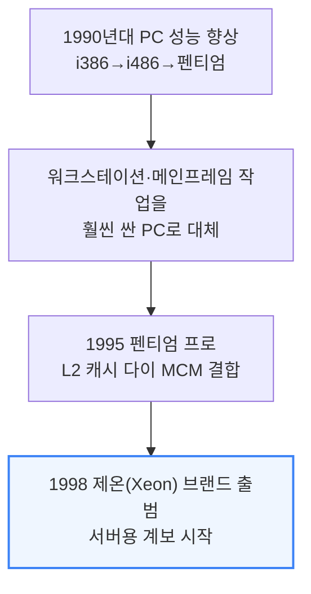

메인프레임 자체는 IBM Z 계열로 지금도 은행 거래 검증 등에 쓰이지만, 시장 규모가 작은 틈새로 남아 이 글에서는 다루지 않습니다.

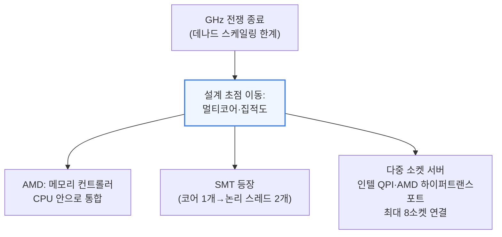

멀티코어 CPU는 여러 작업을 코어별로 병렬 처리할 수 있어 데이터센터 워크로드에 특히 잘 맞았고, 코어를 어떻게 연결하는지(인터커넥트)는 6\~8절에서 자세히 다룹니다.

---

## 3. 데이터센터 CPU의 역사 ② - 가상화·클라우드 시대

**📌 핵심:**
- 2000년대 후반 클라우드 컴퓨팅이 등장하며 기업들은 서버를 직접 사는 대신(초기 투자를 운영비로 전환) AWS 같은 퍼블릭 클라우드에서 컴퓨트를 임대 — 2008년 대침체로 자체 서버를 운용할 여력이 없던 기업들이 대거 몰림
- 클라우드가 작동하려면 CPU 하나로 여러 독립된 가상머신(VM)을 안전하게 동시에 돌리는 '가상화' 기능이 핵심 — 하이퍼바이저(VMware ESXi 등)가 VM을 코어·소켓·서버 사이로 옮기며 활용률을 최적화
- 2018년, 가상화와 SMT(동시 다중 스레딩)의 조합이 스펙터·멜트다운 취약점으로 이어짐 — 같은 물리 코어에서 도는 두 스레드 중 하나가 분기 예측 기능(다음에 실행할 명령을 미리 추측해 처리하는 성능 기법)을 악용해 다른 스레드의 데이터를 훔쳐볼 수 있었음
- 결론: 클라우드 업체들은 부랴부랴 SMT를 꺼서 막았고, 이때 발생한 최대 30% 성능 손실은 훗날 인텔의 설계 판단에도 그림자를 남김(9절 다이아몬드 래피즈의 SMT 제거 사건으로 이어짐)

---

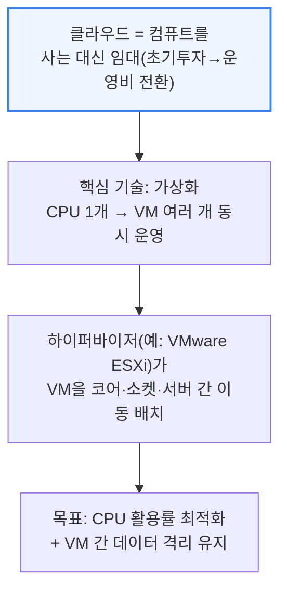

서버리스(예: AWS 람다)는 이 위에 한 겹 더 얹어, 사용자가 인스턴스 개수를 직접 정하지 않아도 작업을 자동으로 컴퓨트 자원에 배정합니다. 클라우드는 이렇게 컴퓨트를 눈에 안 보이는 '상품'으로 바꿔놓았습니다.

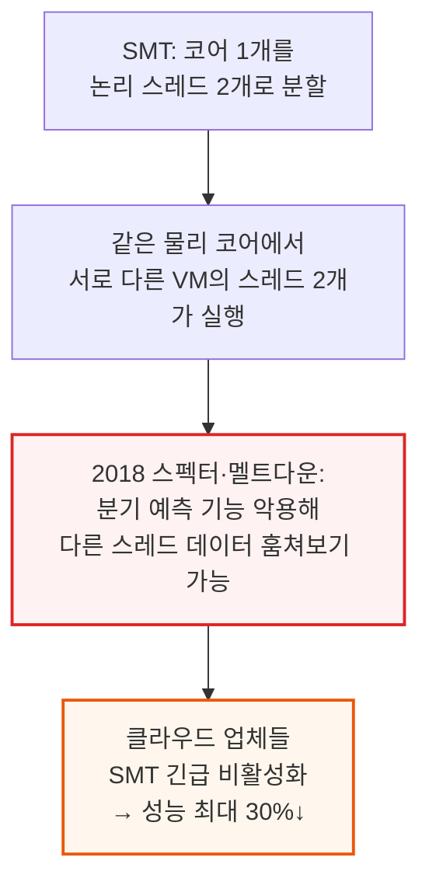

---

## 4. AI 시대의 CPU - 헤드노드와 클라우드 네이티브 소켓 통합

**📌 핵심:**
- 챗GPT 출시(2022-11) 직전 5년간 인텔은 제온 스케일러블 CPU를 1억 대 이상 팔았을 만큼 CPU 수요가 최고조였으나, AI 모델 학습·추론이 본격화되며 CPU의 역할 자체가 흔들림
- AI 연산의 핵심인 행렬곱셈은 원래 3D 그래픽 렌더링용으로 설계된 GPU의 벡터 유닛으로 훨씬 잘 병렬화됨 — CPU는 벡터 유닛이 수십 개인 반면 GPU는 수천 개, 여기에 행렬곱 전용 텐서 코어까지 더해져 CPU 대비 성능·효율이 100\~1,000배 낮음
- 인텔이 AVX512 포트를 2배로 늘리고 AMX(행렬곱 가속 엔진)를 추가했지만 역부족 — CPU는 데이터센터에서 두 갈래 보조 역할로 재편: ① 헤드노드(GPU 옆에서 데이터를 떠먹이는 CPU) ② 클라우드 네이티브 소켓 통합(인터넷 서비스를 최소 전력으로 처리하는 CPU)
- 결론: GPU가 전력 예산을 독식하는 와중에도 인터넷 서비스는 계속 돌아가야 하므로, CPU는 사라지지 않고 역할을 좁혀 살아남음

---

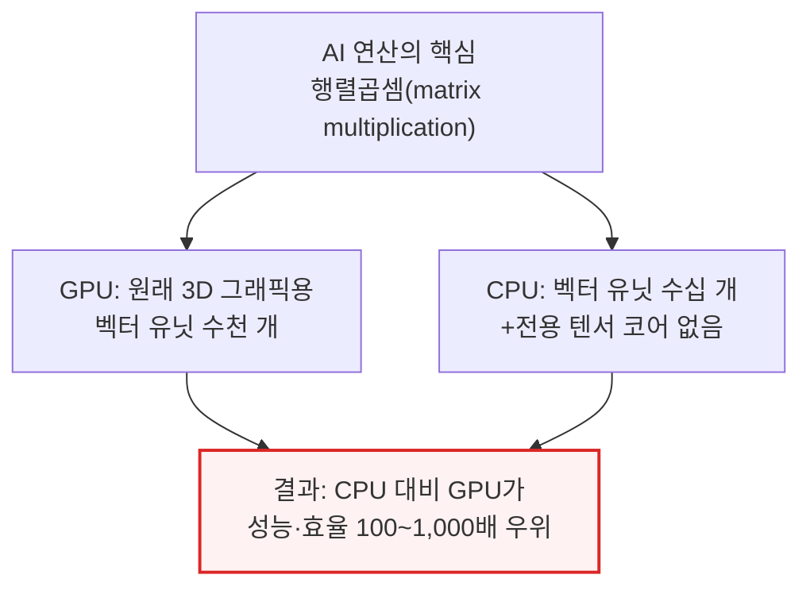

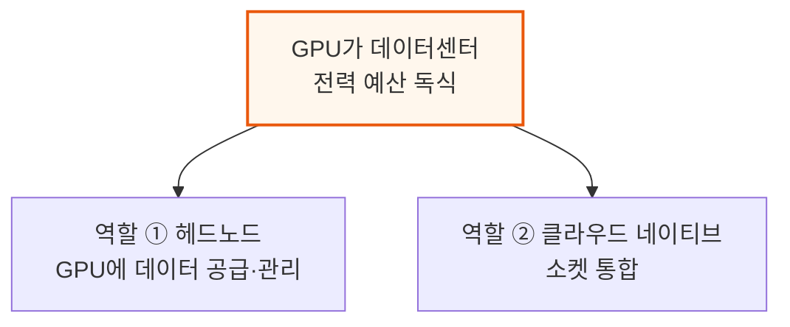

헤드노드는 코어당 성능·대용량 캐시·고대역폭 메모리/IO로 꼬리 지연(tail latency)을 최소화하는 것이 목표이며, GPU 1개당 CPU가 붙는 비율은 세대·벤더마다 다릅니다.

- 1개 Vera CPU : Rubin GPU 2개 (엔비디아 슈퍼칩)
- 1개 Venice CPU : MI455X GPU 4개 (AMD 컴퓨트 트레이)
- 1개 Graviton5 CPU : Trainium3 4개 (AWS 컴퓨트 트레이)
- x86 CPU 2개 : TPUv7 8개 (구글 노드)

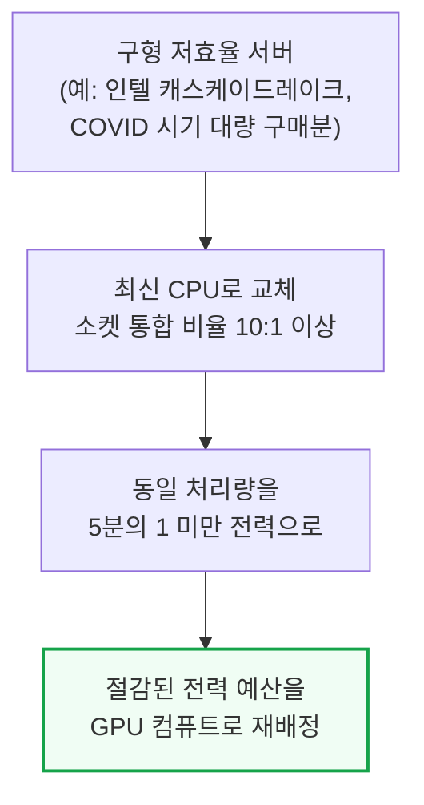

클라우드 네이티브 CPU는 코어당 면적·전력 효율이 좋은 중간 크기 코어를 훨씬 많이 넣고 캐시·IO는 줄이는 설계입니다. 인텔은 아톰 코어를 서버에 가져온 시에라 포레스트로, AMD는 Zen4 코어를 면적·전력 효율형으로 재배치한 버가모로 각각 대응했고, AWS 그래비톤 같은 전력 효율형 ARM 설계와 암페어 컴퓨팅의 알트라·암페어원 라인도 이 흐름에서 자리를 잡았습니다.

---

## 5. RL·에이전트 시대 - CPU 수요의 새로운 폭발

**📌 핵심:**
- 지금은 헤드노드를 넘어 AI 학습·추론 전반을 지원하기 위해 CPU 사용이 다시 가속 — 마이크로소프트 Fairwater(오픈AI向 데이터센터)는 GPU 클러스터 295MW를 CPU·스토리지 건물 48MW가 뒷받침하며, 수만 대의 CPU가 GPU가 쏟아내는 페타바이트급 데이터를 처리·관리
- 강화학습(RL) 훈련 루프에서는 'RL 환경(Environment)'이 모델이 생성한 행동을 실행하고 보상을 계산해야 하는데, 코딩·수학 영역에서는 코드 컴파일·검증·해석에 CPU가 대량 병렬로 필요하고 물리 시뮬레이션·합성 데이터 정밀 검증에도 CPU가 깊이 관여
- AI 가속기의 와트당 성능이 CPU보다 훨씬 빠르게 개선되고 있어, Fairwater에서 이미 나타난 CPU:GPU 전력 비율 1:6이 차세대(루빈 등)에서는 CPU 비중이 더 커질 전망 — CPU가 새로운 병목이 되고 있음
- 결론: 추론 쪽에서도 인터넷·DB를 조회하는 RAG·에이전트 모델이 사람보다 훨씬 많은 API 호출을 만들어내며 범용 CPU 수요를 밀어올리고, 2026년 CPU·DRAM 공급은 이미 빠듯한 상태

---

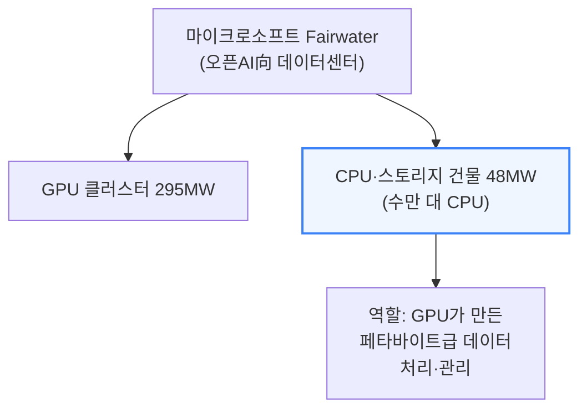

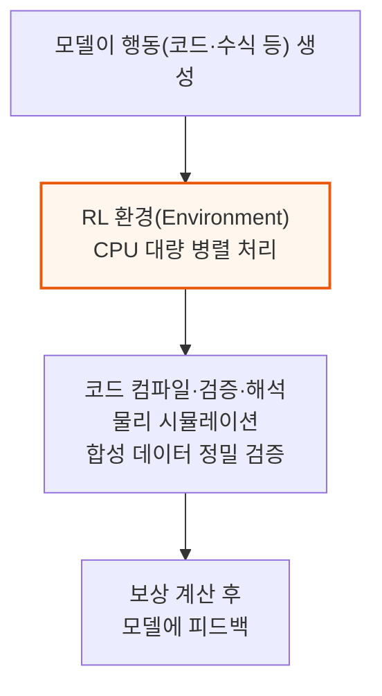

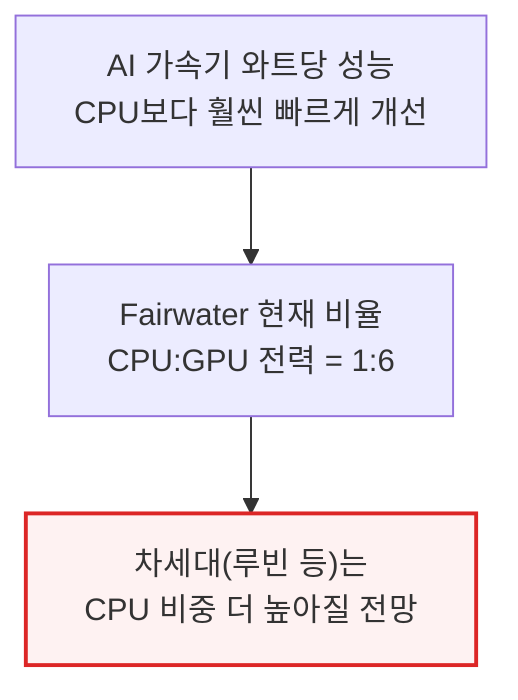

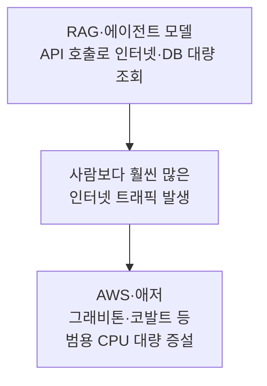

2026년 들어 프런티어 AI 랩들은 RL 학습용 CPU가 부족해 클라우드 업체와 상용 x86 서버를 놓고 직접 경쟁하고 있습니다. 인텔은 예상 밖의 재고 소진에 제온 전 라인업 가격 인상을 검토 중이고, AMD는 2026년 서버 CPU 시장(TAM)이 "두 자릿수 후반" 성장할 것으로 보고 공급 능력을 늘리고 있습니다.

---

## 6. 인텔 인터커넥트 진화 ① - 크로스바에서 메시까지

**📌 핵심:**
- 초기 듀얼코어(2005년 인텔 펜티엄D)는 코어 간 통신을 칩 밖 버스로 처리한 반면, AMD 애슬론64 X2는 메모리 컨트롤러를 다이에 통합해 온다이(on-die) 배선으로 직접 통신 — 이후 온다이 데이터 패브릭이 서버 CPU 설계의 핵심 과제가 됨
- 크로스바(모든 코어를 1:1로 잇는 배선)는 코어가 늘수록 연결 수가 기하급수적으로 늘어 사실상 4코어가 한계(코어 2개=연결 1개, 8개=연결 28개) — 인텔은 2010년 링버스로, 2017년 메시로 갈아타며 이 한계를 순서대로 돌파
- 링버스는 모든 코어를 고리 모양으로 배열해 데이터가 한 정거장씩 이동하는 방식으로 8\~10코어까지는 통했지만 반대편 코어 간 지연이 늘어나는 문제가 있었고, 2014년 아이비브리지는 '가상 링' 3개로 15코어까지 억지로 늘렸지만 근본 해법은 아니었음
- 결론: 2017년 스카이레이크-X부터 채택한 메시(격자형 배선)가 이후 10년간 인텔 서버 CPU의 기본 골격이 됨 — 코어를 격자에 배치하고 상하좌우로만 연결해 배선 복잡도를 낮춤

---

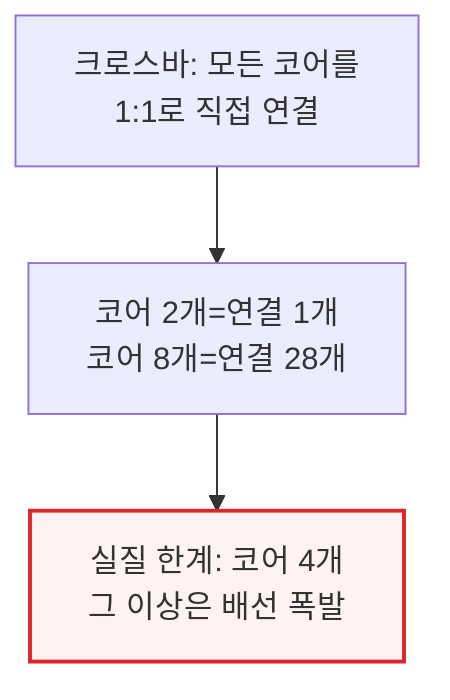

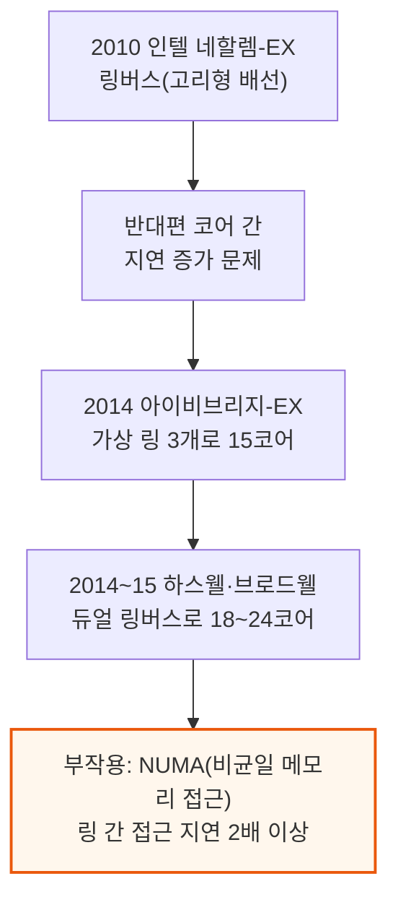

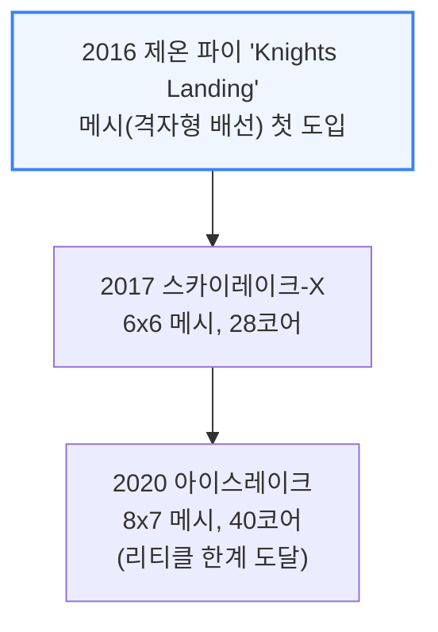

메시도 다이 반대편 메모리 컨트롤러까지 거리가 멀어지면 지연이 벌어지는 문제가 있어, 인텔은 메시를 4분면으로 쪼개 지연을 낮추는 대신 각 분면을 별도 소켓처럼 취급하는 '서브-NUMA 클러스터링(SNC)' 옵션을 제공했습니다. 다이 크기는 노광 장비가 한 번에 새길 수 있는 최대 면적(리티클 한계, 약 26×33mm)에 부딪혀 아이스레이크 이후로는 한 다이 안에서 코어를 더 늘릴 수 없었습니다.

---

*작성 진행률: 약 32% 완료 (19개 섹션 중 6개)*
*업데이트: 4\~6절(AI 시대 CPU 역할 분화, RL·에이전트 시대, 인텔 인터커넥트 진화 ①) 작성 완료*
