# GTC 2026 – The Inference Kingdom Expands

> **출처**: [SemiAnalysis Newsletter](https://newsletter.semianalysis.com/p/nvidia-the-inference-kingdom-expands)
> **저자**: Dylan Patel
> **발행일**: 2026-03-24

---

## 📑 목차

### 전체 섹션
 1. [서론: GTC 2026과 Nvidia의 추론 전략 확장](#1-서론-gtc-2026과-nvidia의-추론-전략-확장)
 2. [Groq LPU 인수 배경과 전략적 의미](#2-groq-lpu-인수-배경과-전략적-의미)
 3. [LPU 아키텍처와 3세대 칩(LP30)](#3-lpu-아키텍처와-3세대-칩lp30)
 4. [SRAM 메모리 계층과 GPU+LPU 결합 전략](#4-sram-메모리-계층과-gpulpu-결합-전략)
 5. [Attention-FFN 분리(AFD) 기술](#5-attention-ffn-분리afd-기술)
 6. [추측 디코딩(Speculative Decoding) 가속](#6-추측-디코딩speculative-decoding-가속)
 7. [LPX 랙 시스템과 컴퓨트 트레이](#7-lpx-랙-시스템과-컴퓨트-트레이)
 8. [LPU 네트워크: 스케일업 3단계 구조](#8-lpu-네트워크-스케일업-3단계-구조)
 9. [Nvidia의 CPO(공동 패키징 광학) 로드맵](#9-nvidia의-cpo공동-패키징-광학-로드맵)
10. [Oberon·Kyber 랙 업데이트와 대형 월드사이즈](#10-oberonkyber-랙-업데이트와-대형-월드사이즈)
11. [CMX와 STX: 컨텍스트 메모리·스토리지 플랫폼](#11-cmx와-stx-컨텍스트-메모리스토리지-플랫폼)
12. [Feynman NVL1152 네트워킹 토폴로지](#12-feynman-nvl1152-네트워킹-토폴로지)
13. [GTC 2026 공급망 영향](#13-gtc-2026-공급망-영향)

---

## 🔑 용어 정리

본문을 순서대로 읽기 전에 알아두면 좋은 용어들입니다. 자세한 수치와 설명은 본문에서 처음 등장하는 위치에 나옵니다.

- **LPU (Groq의 초저지연 추론 칩)**: 여러 범용 코어를 쓰는 GPU와 달리, 특정 연산 전용 유닛들을 일렬로 배치해 데이터가 정해진 순서대로만 흐르게 만든 칩 — 응답 속도(지연시간)에 특화
- **AFD (Attention-FFN 분리, Attention FFN Disaggregation)**: 추론 계산을 "주의(Attention)" 연산과 "전문가(FFN)" 연산으로 나눠, 서로 다른 성격의 칩(GPU·LPU)에 각각 맡기는 기법
- **스케일업 vs 스케일아웃**: 스케일업은 랙 한 대 안의 칩끼리 초고속으로 묶는 연결, 스케일아웃은 랙과 랙을 묶어 더 큰 클러스터를 만드는 연결
- **CPO (공동 패키징 광학, Co-Packaged Optics)**: 별도 광트랜시버 부품 대신 광신호 변환 회로를 칩 옆에 함께 패키징해, 랙과 랙 사이 장거리 연결의 전력·비용을 아끼는 기술
- **Oberon·Kyber (Nvidia 랙 아키텍처)**: Oberon은 현재 NVL72 세대에 쓰이는 랙 형태, Kyber는 GPU를 더 촘촘히 담아 랙 하나에 더 많은 칩(NVL144 이상)을 넣는 차세대 랙 형태
- **CMX (컨텍스트 메모리 저장소, 옛 이름 ICMS)**: 대화 중간 결과(KV 캐시)를 GPU 메모리·서버 메모리 다음 단계로 저장해두는 전용 스토리지 계층
- **KV 캐시**: 모델이 이전에 계산한 결과를 다시 계산하지 않도록 저장해두는 임시 데이터 — 대화가 길어질수록(문맥이 길수록) 커짐
- **MoE (전문가 혼합, Mixture-of-Experts)**: 모델 하나를 여러 개의 작은 "전문가" 모듈로 쪼개, 입력마다 그중 일부만 골라 계산하는 구조

---

## 1. 서론: GTC 2026과 Nvidia의 추론 전략 확장

**📌 핵심:**
- GTC 2026에서 Nvidia는 완전히 새로운 시스템 3종(Groq LPX, Vera ETL256, STX)을 처음 공개하고, 기존 Kyber 랙의 상세 스펙도 최초로 공개
- 지금까지 랙 내부 연결(스케일업)은 전선(구리)만 썼지만, 이번에 처음으로 광신호 직결 부품인 CPO를 랙과 랙 사이(NVL576·NVL1152급 초대형 클러스터) 연결에 투입하기 시작
- Groq의 초저지연 칩(LPU)을 결합한 추론 전용 신제품까지 더해, Nvidia는 학습(모델을 만드는 단계)뿐 아니라 추론(만든 모델을 서비스하는 단계) 하드웨어까지 장악하려는 전략을 구체화
- 결론: 이번 GTC는 Nvidia가 "GPU 제조사"에서 "추론 인프라 전체를 설계하는 회사"로 전환하고 있음을 보여주는 이벤트

---

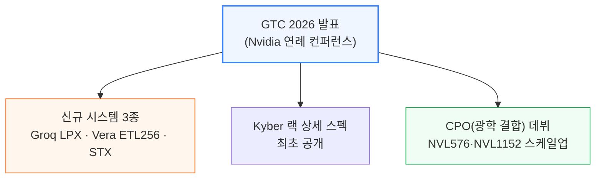

이 리포트가 다루는 순서는 다음과 같습니다.
- Groq LPU 인수 배경과 LP30 칩, GPU와의 결합 기법(AFD·추측 디코딩)
- LPX 랙 시스템과 네트워크 구조
- Nvidia의 CPO 로드맵과 Oberon·Kyber 랙의 대형 월드사이즈(NVL288·NVL576·NVL1152) 확장
- CMX·STX 스토리지 플랫폼
- Feynman 세대 네트워킹 토폴로지와 공급망 영향

---

## 2. Groq LPU 인수 배경과 전략적 의미

**📌 핵심:**
- Nvidia는 Groq를 법적으로 인수(Acquisition)하지 않고, IP 라이선스와 핵심 인력 채용 형태로 200억 달러를 지불 → 효과는 "사실상 인수"지만 반독점 심사를 건너뛸 수 있는 구조
- Nvidia는 AI 가속기 시장 점유율이 압도적이라, 정식 인수였다면 반독점 심사 통과가 어려웠을 것 → 라이선스 방식으로 심사 자체를 우회하고 거래 완료 절차도 단축
- 계약 발표 후 4개월 만에 Nvidia는 벌써 Vera Rubin 추론 스택에 Groq 시스템을 통합한 컨셉을 공개할 정도로 초고속으로 통합을 진행
- 결론: Groq의 저지연 칩만 단독으로 팔면 대량 서비스에는 비경제적이지만, 빠른 응답 속도에 프리미엄을 지불하는 시장이 있다는 게 이 결합의 핵심 전제

---

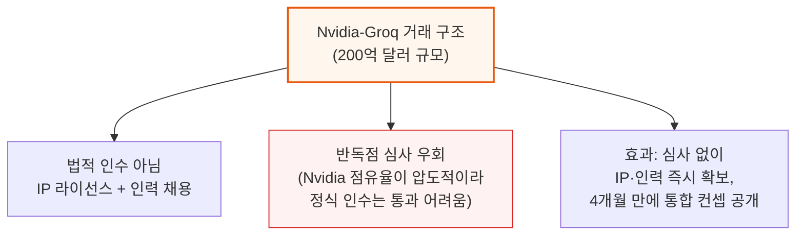

**📌 용어 풀이: 왜 LPU 단독으로는 경제성이 없는가**
> - Groq의 독립형 LPU 시스템은 토큰(모델이 생성하는 단어 단위)당 서비스 비용이 GPU보다 비싸 대량 서비스에는 부적합
> - 다만 응답 속도가 매우 빨라, "빠른 응답"에 웃돈을 지불할 의향이 있는 고가치 시장(예: 실시간 대화형 서비스)에서는 큰 프리미엄을 받을 수 있음
> - 이 전제가 바로 "분산 디코드(Disaggregated Decode)" 구조의 근거 — LPU를 독립 제품이 아니라 GPU 클러스터의 특정 구간(디코드 단계)에만 투입하는 방식

---

## 3. LPU 아키텍처와 3세대 칩(LP30)

**📌 핵심:**
- Groq의 LPU는 범용 코어 여러 개를 쓰는 일반 칩과 달리, 기능별 전용 유닛("슬라이스")을 한 줄로 배치해 데이터가 정해진 순서로만 흐르게 만든 구조 → 실행 시간을 예측 가능(결정론적)하게 만들어 지연시간을 최소화
- 1세대(2020년)는 미국 GlobalFoundries 14나노 공정으로 제작해 "완전 미국산" 강점을 내세웠지만, 2세대(삼성 SF4X)는 고속 신호 연결(SerDes) 결함으로 끝내 제품화되지 못함
- 3세대 칩(LP30)이 바로 Nvidia가 이번에 제품화하는 버전 — 결함이던 SerDes 문제를 해결하고 SRAM 용량을 230MB→500MB, 연산력을 750TFLOPS(정수 8비트)→1.2PFLOPS(부동소수점 8비트)로 확대
- 결론: 다음 세대 LP40부터는 Nvidia가 직접 설계에 참여해 TSMC 3나노급 공정과 자체 NVLink 프로토콜을 적용, Feynman 플랫폼과 완전히 함께 설계될 예정

---

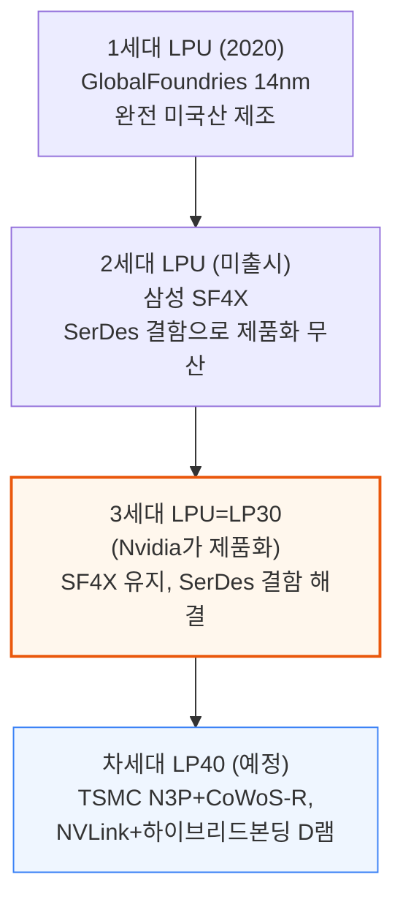

LPU가 지연시간을 줄이는 근본 원리는 "결정론적 실행"에 있습니다. 일반 칩은 여러 계층의 메모리(캐시 등)를 오가며 데이터를 찾는 과정에서 대기 시간이 들쑥날쑥하지만, LPU는 아래와 같이 미리 정해둔 경로로만 데이터가 흐릅니다.

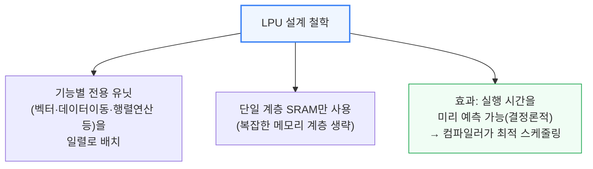

**📌 용어 풀이: 결정론적 실행과 고대역 SRAM**
> - 컴퓨터 칩이 "결정론적"이라는 것은, 같은 연산을 몇 번을 돌려도 실행 시간이 항상 똑같다는 뜻 — 일반 칩은 캐시 적중 여부 등에 따라 실행 시간이 매번 달라짐
> - LPU는 데이터를 저장하는 곳을 SRAM(빠르지만 용량이 작고 비싼 메모리) 한 계층으로 단순화해, 컴파일러가 명령어 순서를 미리 정확히 계산해둘 수 있게 함
> - 이 예측 가능성과 SRAM의 높은 대역폭이 합쳐져, LPU가 짧고 정확한 응답 속도를 낼 수 있는 두 가지 핵심 요인

칩 사양은 세대를 거치며 아래처럼 발전했습니다.

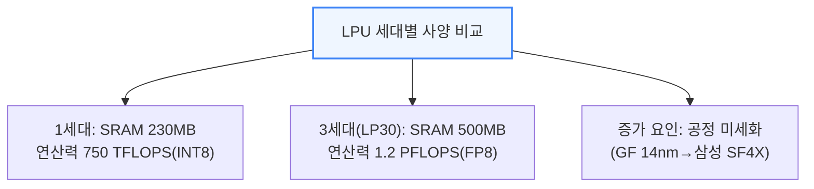

LP30은 레티클(노광 장비가 한 번에 새길 수 있는 최대 면적) 크기에 가까운 단일 다이로, 별도의 첨단 패키징이 필요 없습니다. 다만 연산력(1.2PFLOPS)은 Nvidia GPU에 비하면 극히 일부에 불과해, LPU 단독으로는 대규모 연산을 감당할 수 없습니다.

삼성 SF4X 공정을 쓰는 또 다른 이점은 TSMC N3 공정처럼 생산 능력이 꽉 차 있지 않다는 점입니다. TSMC N3와 HBM(고대역폭 메모리)은 현재 업계 전체의 생산 병목입니다.

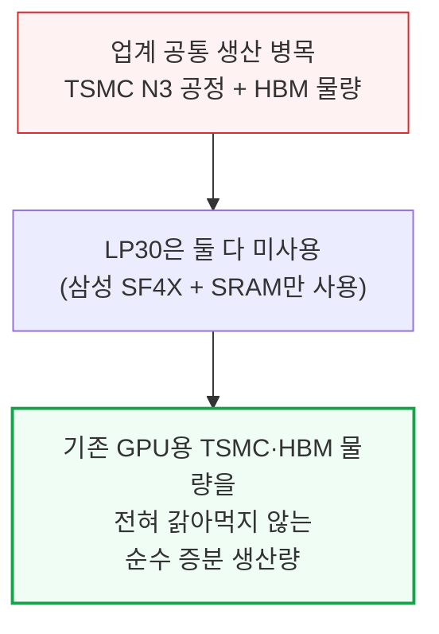

Nvidia는 LP30의 소규모 개선판인 LP35도 함께 발표했습니다. SF4 공정은 그대로 유지하면서 NVFP4(저정밀 수치 포맷)만 새로 지원하는 수준입니다.

다음 세대인 LP40부터는 Nvidia가 설계에 직접 참여합니다.

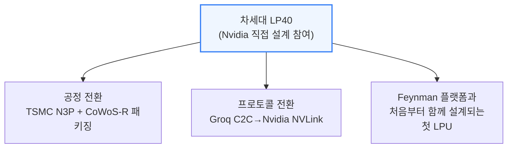

온칩 메모리를 늘리기 위해 하이브리드 본딩 D램(SRAM과 거의 비슷한 속도를 내면서 용량은 훨씬 큰 메모리)을 도입할 계획이며, 이 D램은 SK하이닉스가 공급합니다.

---

## 4. SRAM 메모리 계층과 GPU+LPU 결합 전략

**📌 핵심:**
- SRAM(LPU가 탑재한 메모리)은 속도가 매우 빠르지만 용량이 작고 비쌈 — HBM(GPU가 탑재한 메모리)은 SRAM보다 느리지만 용량이 크고 저렴
- LPU처럼 SRAM만 쓰는 칩은 첫 토큰 응답 속도와 사용자 1명당 처리 속도는 매우 빠르지만, SRAM이 금세 모델 가중치로 꽉 차 KV 캐시(대화 저장 공간) 여유가 부족 → 사용자가 몰릴수록 전체 처리량은 GPU보다 떨어짐
- Nvidia의 해법은 "둘의 장점만 결합" — 메모리를 많이 쓰는 Attention 연산은 대용량 HBM을 가진 GPU가, 지연시간에 민감하지만 메모리 부담이 적은 디코드 구간은 LPU가 맡음
- 결론: LPU는 GPU를 대체하는 게 아니라, 디코드 단계 중 "빠른 응답이 필요한 부분"만 전담하는 보완재로 설계됨

---

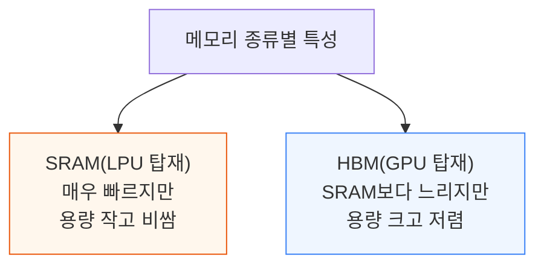

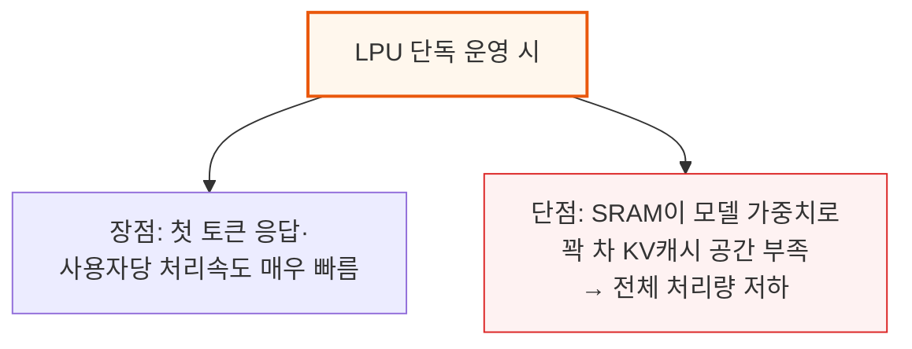

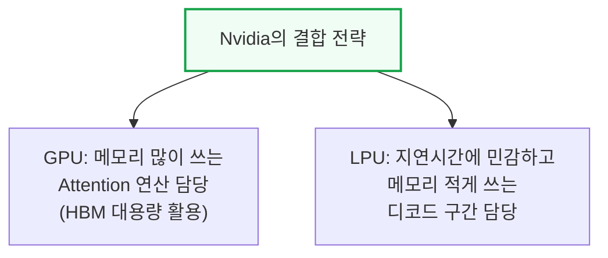

---

## 5. Attention-FFN 분리(AFD) 기술

**📌 핵심:**
- LLM 추론은 입력 전체를 한번에 처리하는 프리필(연산량 집약적, GPU 적합)과 토큰을 하나씩 생성하는 디코드(메모리 대역폭 집약적, 지연시간 민감) 두 단계로 나뉨
- 디코드 단계에서 Attention 연산은 배치를 키워도 GPU 활용률이 거의 정체(KV 캐시 로딩에 발목)되는 반면, FFN 연산은 배치가 커질수록 활용률이 함께 오름 → 이 차이가 AFD(Attention-FFN 분리) 기법의 출발점
- 최신 MoE(전문가 혼합) 모델이 갈수록 희소해지며 전문가 풀이 커지고, 전문가 1개당 받는 토큰 수가 줄어 활용률이 낮아지는 추세도 AFD 도입 동기를 강화
- 결론: 상태 의존적인 Attention은 동적 워크로드에 강한 GPU가, 상태 무관한 FFN은 결정론적 실행에 강한 LPU가 맡는 역할 분담으로 귀결

---

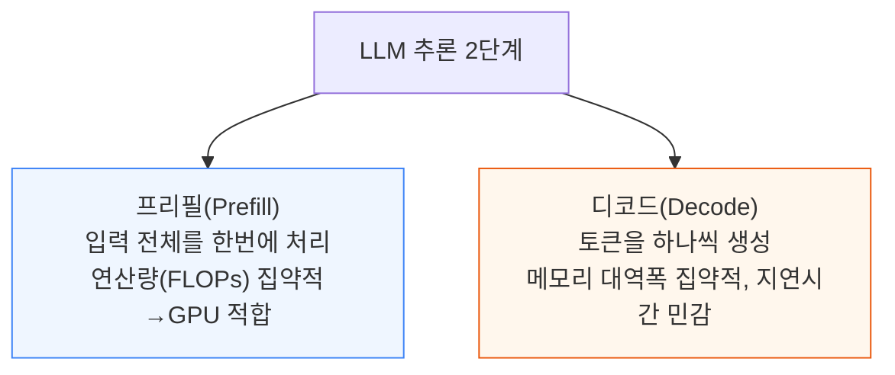

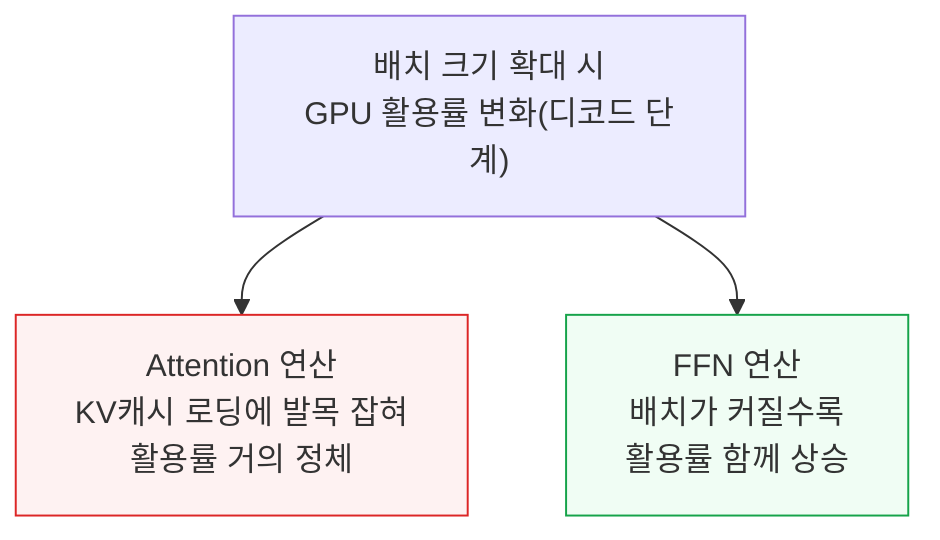

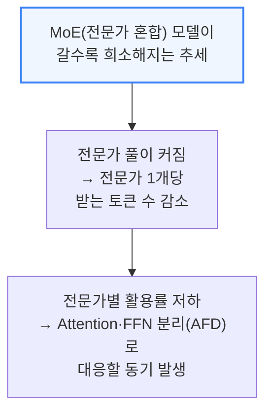

GPU가 Attention 연산만 전담하면 HBM 용량 전체를 KV 캐시에 쓸 수 있어, 처리 가능한 토큰 수가 늘고 결과적으로 전문가 하나가 평균적으로 받는 토큰 수도 늘어납니다.

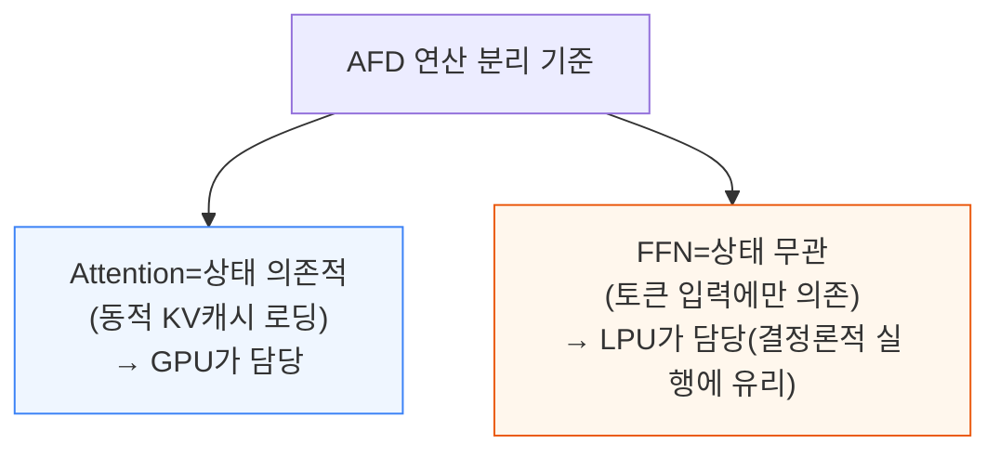

AFD를 실제로 적용하면 GPU→LPU 토큰 라우팅 자체가 새로운 병목이 될 수 있습니다. 이를 숨기기 위해 "핑퐁 파이프라인 병렬화"를 사용합니다.

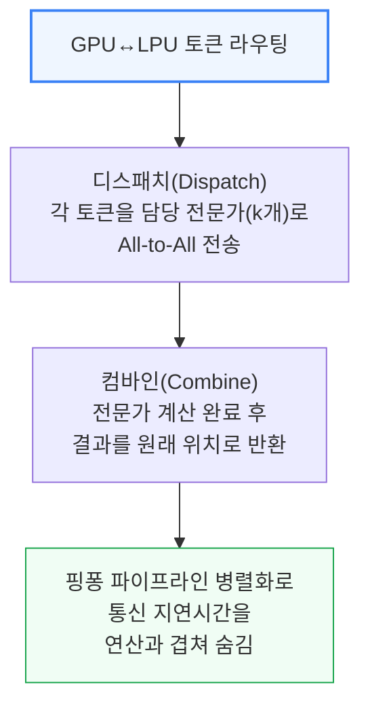

**📌 용어 풀이: 핑퐁 파이프라인 병렬화**
> - 배치를 여러 개의 작은 마이크로배치로 쪼개고, 연산 단계를 서로 겹치게 진행하는 파이프라인 기법을 기본으로 함
> - AFD에서는 LPU로 보낸 토큰이 다시 GPU로 돌아오는 흐름이 반복돼, 마치 탁구공이 오가듯 GPU와 LPU 사이를 왕복(핑퐁)한다는 뜻에서 이름이 붙음
> - 이 왕복 동안 통신이 진행되는 사이에 다른 마이크로배치의 연산을 동시에 처리해 통신 지연시간을 감춤

---

## 6. 추측 디코딩(Speculative Decoding) 가속

**📌 핵심:**
- 디코드 단계 지연시간을 줄이는 또 다른 방법은 "추측 디코딩" — 작은 드래프트 모델이나 MTP(멀티토큰예측) 레이어가 토큰 여러 개를 먼저 예측하고, 메인 모델이 한 번에 검증
- 컨텍스트 길이 N에 비해 추가 토큰 k개가 훨씬 작으면(k≪N), 검증 과정의 지연시간 증가는 미미 → 디코드 1스텝 비용으로 토큰 1.5\~2개를 얻는 효과
- LPU에 드래프트 모델·MTP를 배치하는 것은 FFN 배치(AFD)와 메모리 요구가 다름 — FFN은 수백MB·상태 무관이지만, 드래프트 모델·MTP는 수십GB·동적 KV 캐시가 필요
- 결론: 이 메모리 수요를 감당하기 위해 LPX 컴퓨트 트레이의 FPGA(Fabric Expansion Logic)마다 최대 256GB DDR5를 추가로 붙임

---

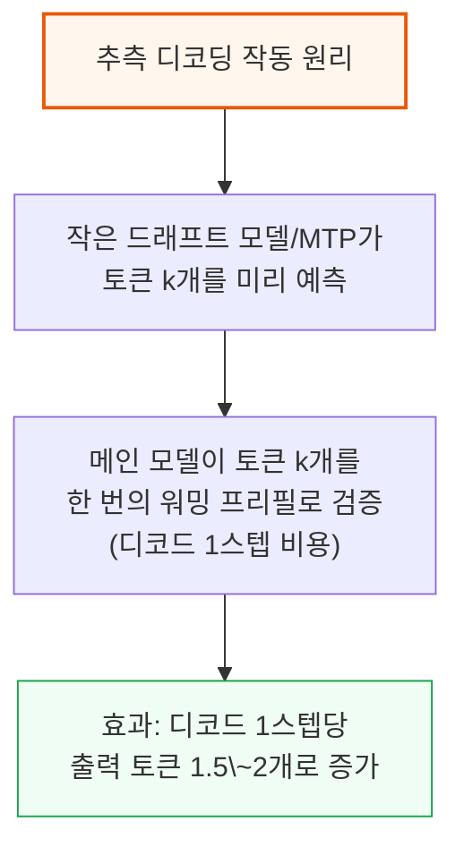

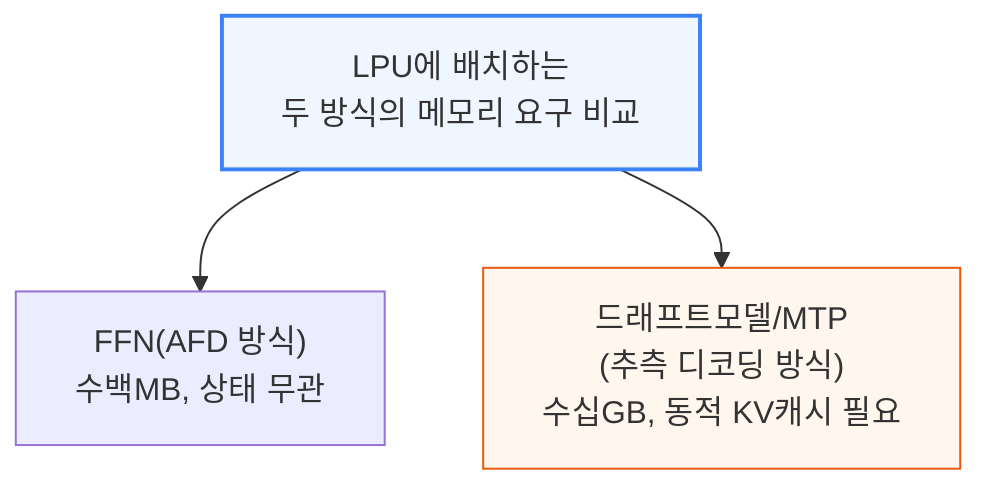

**📌 용어 풀이: MTP(멀티토큰예측, Multi-Token Prediction)**
> - 일반 모델은 토큰을 한 번에 하나씩만 예측하지만, MTP 레이어는 한 번의 연산으로 여러 개의 다음 토큰 후보를 동시에 예측하도록 학습된 보조 레이어
> - 드래프트 모델(별도의 작은 전체 모델)과 목적은 같지만, 메인 모델 안에 통합된 레이어라는 점이 차이
> - 예측이 맞으면 검증 한 번으로 토큰 여러 개를 확정할 수 있어 디코드 스텝 수 자체를 줄임

---

## 7. LPX 랙 시스템과 컴퓨트 트레이

**📌 핵심:**
- GTC에 전시된 LPX 랙은 1U LPU 컴퓨트 트레이 32개와 Spectrum-X 스위치 2개로 구성 — Groq 인수 이전 원래 서버 설계와 거의 동일한 시제품이며, SemiAnalysis는 3분기 실제 출하 버전은 Nvidia가 상당 부분 변경할 것으로 예상
- 컴퓨트 트레이 1개에는 LPU 16개, Altera FPGA 2개, Intel Granite Rapids 호스트 CPU 1개, BlueField-4 전면 모듈 1개가 들어감 — 하이퍼스케일러는 Nvidia BlueField 대신 자체 NIC를 선택할 수 있음
- LPU 16개는 "벨리투벨리(등을 맞댄)" 방식으로 PCB 위아래에 8개씩 실장 — 고밀도 올투올 연결에 필요한 배선 거리를 줄이기 위한 설계
- 결론: FPGA는 단순 보조 부품이 아니라 "Fabric Expansion Logic"이라는 이름으로 NIC 변환·CPU 연결·노드 간 제어까지 3가지 핵심 역할을 겸함

---

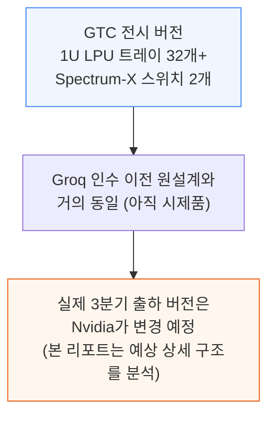

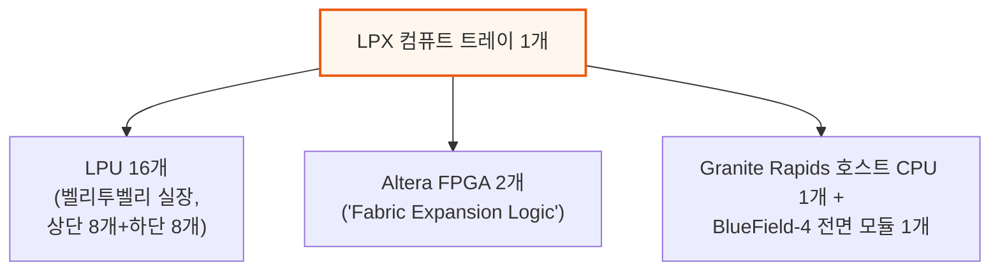

**📌 용어 풀이: 벨리투벨리(Belly-to-Belly) 실장**
> - LPU 모듈을 PCB 한쪽 면에만 몰아 배치하지 않고, 위아래 양면에 등을 맞대듯 절반씩 나눠 배치하는 방식
> - LPU 사이의 연결은 전부 PCB 배선(트레이스)으로 이뤄지는데, 올투올(모든 LPU가 서로 직접 연결) 구조라 배선 밀도가 매우 높음
> - 양면 배치로 가로·세로(X·Y) 방향 배선 거리를 줄이고, 대신 위아래(Z) 방향으로 짧게 연결해 고밀도 배선 문제를 완화

LPU 자체는 CPU와 직접 통신할 수 있는 회로(PCIe PHY)가 없어, 반드시 FPGA를 거쳐야 합니다. 이 FPGA가 트레이 안에서 세 가지 역할을 겸합니다.

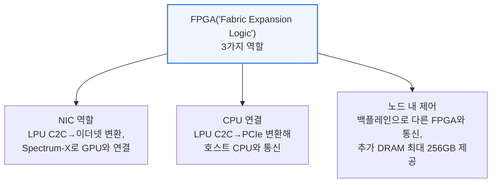

세 번째 역할(추가 DRAM)은 6장에서 다룬 추측 디코딩용 드래프트 모델·MTP 레이어를 저장하는 공간으로 쓰입니다. 트레이 전면에는 랙 간(cross-rack) C2C용 OSFP 케이지 8개와, LPU-GPU 간 분산 디코드 연결용 케이지 2개(QSFP-DD 예상)가 배치됩니다.

---

## 8. LPU 네트워크: 스케일업 3단계 구조

**📌 핵심:**
- LPU 스케일업(C2C) 네트워크는 랙 1대 기준 총 640TB/s 대역폭을 내며, 노드 내부(Intra-Tray)·랙 내부 노드 간(Inter-node)·랙 간(Inter-rack) 3단계로 나뉨
- 노드 내부는 LPU 16개가 서로 4x100G씩 올투올 메시로 직접 연결되는 가장 촘촘한 구간이며, 랙 내부 노드 간은 구리 백플레인 케이블로 각 LPU가 다른 노드 15개와 연결
- 랙 간 연결은 LPU당 4x100G 레인을 OSFP 케이지로 내보내는데, 확장성을 위해 레인 하나씩을 케이지 4개에 분산해 LPU 8개가 케이지 하나(800G)를 공유하는 방식이 유력
- 결론: 랙 4개를 데이지 체인(순차 연결) 방식으로 묶어, 대부분 짧은 전기 케이블(AEC)만으로도 랙 간 연결이 가능 — 필요시에만 광케이블 사용

---

```mermaid
flowchart TD
    ScaleUp["LPU 스케일업(C2C) 네트워크<br/>총 640TB/s/랙"] --> L1["1단계: 노드 내부(Intra-Tray)<br/>LPU 16개 올투올 메시,<br/>PCB 트레이스로 연결"]
    ScaleUp --> L2["2단계: 랙 내부 노드 간<br/>(Inter-node)<br/>구리 백플레인 케이블"]
    ScaleUp --> L3["3단계: 랙 간(Inter-rack)<br/>OSFP 케이지로 랙 4개까지 연결"]

    style ScaleUp fill:#fff7ed,stroke:#ea580c,stroke-width:2px
```

```mermaid
flowchart TD
    Node["노드(트레이) 내부 연결"] --> N1["LPU-LPU: 다른 15개와<br/>각 4x100G로 올투올 메시"]
    Node --> N2["LPU-FPGA: LPU당<br/>1x100G(FPGA 1개가 LPU 8개 담당)"]
    Node --> N3["FPGA-CPU: FPGA당<br/>PCIe Gen5 x8 레인"]

    style Node fill:#eff6ff,stroke:#3b82f6,stroke-width:2px
```

```mermaid
flowchart TD
    Inter["노드 간(랙 내부) 연결"] --> I1["LPU 간: 다른 노드 15개와<br/>각 2x100G(구리 백플레인)"]
    Inter --> I2["FPGA 간: 다른 노드 15개와<br/>각 25\~50G(제어·타이밍 관리)"]
    Inter --> I3["랙 전체 백플레인<br/>총 8,160쌍(차동쌍) 구리선"]

    style Inter fill:#eff6ff,stroke:#3b82f6,stroke-width:2px
```

```mermaid
flowchart TD
    InterRack["랙 간(4개 랙) 연결<br/>LPU당 4x100G→OSFP 케이지"] --> Opt1["옵션1: 4레인 전부<br/>케이지 1개로 집중<br/>(LPU 2개당 800G)"]
    InterRack --> Opt2["옵션2(유력): 레인별로<br/>케이지 4개에 분산<br/>(LPU 8개당 800G, 더 넓은 팬아웃)"]

    style InterRack fill:#fff7ed,stroke:#ea580c,stroke-width:2px
```

랙과 랙은 데이지 체인(순차 연결) 방식으로 묶이며, 각 랙의 첫 번째 노드(Node0)가 다른 랙 2개의 Node0와 연결됩니다. 이 정도 거리는 대부분 100G급 AEC(능동형 구리 케이블)로 충분하며, 필요할 때만 광케이블을 사용합니다.

---

## 9. Nvidia의 CPO(공동 패키징 광학) 로드맵

**📌 핵심:**
- 업계는 Rubin Ultra Kyber 랙 "내부"(스케일업)에도 CPO가 쓰일 것으로 기대했지만, 실제 Nvidia의 초점은 랙과 랙을 묶어 "더 큰 컴퓨트 단위"를 만드는 데 있음
- Rubin 세대는 NVL72(Oberon)까지 전부 구리로 스케일업, Rubin Ultra는 NVL72·NVL144·NVL288까지도 전부 구리 → NVL576(오베론 랙 8개 결합)에서 처음으로 랙 간 연결에 CPO 도입(소량 테스트용)
- Feynman 세대는 NVL1152(Kyber 랙 8개 결합)에서 CPO 사용이 확대되지만, "랙 내부까지 CPO로 바뀌는지"는 아직 이견 존재 — 기술 블로그는 "랙 간에만" 명시, Jensen은 재무 애널리스트 Q&A에서 "전부 CPO"라 언급
- 결론: Nvidia의 원칙은 "가능하면 구리, 꼭 필요할 때만 광학" — 전선 속도를 224G(양방향)에서 448G(단방향)로 다시 2배 높이기 어려운 한계에 부딪혔을 때만 CPO로 전환

---

```mermaid
flowchart TD
    Expect["업계 예상<br/>CPO가 랙 내부(스케일업)에도 쓰일 것"] --> Actual["실제 발표<br/>CPO는 랙과 랙 사이(더 큰 클러스터)에만 사용"]
    Actual --> Reason["Nvidia 원칙: 가능하면 구리,<br/>꼭 필요할 때만 광학(CPO)"]

    style Expect fill:#fef2f2,stroke:#dc2626
    style Actual fill:#f0fdf4,stroke:#16a34a,stroke-width:2px
```

```mermaid
flowchart TD
    Rubin["Rubin·Rubin Ultra 세대<br/>로드맵"] --> RU1["NVL72(Oberon)·NVL144(Kyber)·<br/>NVL288(Kyber 2랙)<br/>=전부 구리"]
    Rubin --> RU2["NVL576(Oberon 8랙)<br/>=랙내 구리+랙간 CPO<br/>(소량 테스트용, 2계층 올투올)"]

    style RU2 fill:#fff7ed,stroke:#ea580c,stroke-width:2px
```

```mermaid
flowchart TD
    Feynman["Feynman 세대 로드맵"] --> F1["NVL72(Oberon)·NVL144(Kyber)<br/>=전부 구리"]
    Feynman --> F2["NVL1152(Kyber 8랙)<br/>=랙내 구리+랙간 CPO"]
    F2 --> F3["이견: 기술 블로그는<br/>'랙간만 CPO'<br/>Jensen은 '전부 CPO'라 언급"]

    style F2 fill:#fff7ed,stroke:#ea580c,stroke-width:2px
    style F3 fill:#fef2f2,stroke:#dc2626
```

**📌 용어 풀이: 왜 구리선 속도를 448G까지 못 올리는가**
> - NVLink 스케일업 대역폭을 다시 2배로 늘리려면 전기 신호선(SerDes) 속도를 224Gbit/s(양방향)에서 448Gbit/s(단방향)로 높여야 함
> - 이 속도의 SerDes는 대량 양산 검증 자체가 아직 안 됐고, 양방향 신호를 동시에 보내는 에코 제거 기술까지 더하면 난이도가 극히 높아짐
> - 반면 광학 엔진과 칩을 다이 대 다이로 직접 붙이는 방식은 신호 손실은 적지만 제조 난도·비용·신뢰성 문제가 있어, Feynman 세대에서는 스위치까지의 연결에 여전히 구리를 우선 적용할 계획

NVL1152는 아직 수년 뒤에나 나올 제품이라 로드맵이 바뀔 가능성이 큽니다. SemiAnalysis의 기본 시나리오는 "랙 내부는 구리, 랙 간은 CPO"지만, 이는 언제든 변경될 수 있는 잠정 전망입니다.

---

## 10. Oberon·Kyber 랙 업데이트와 대형 월드사이즈

**📌 핵심:**
- Kyber 랙은 GTC 2025 시제품 대비 밀도가 2배로 높아짐 — 컴퓨트 블레이드 1개당 Rubin Ultra GPU 4개+Vera CPU 2개, 캐니스터 2개(18블레이드씩) 구성으로 랙당 GPU 144개(NVL144)를 담음
- 일부 애널리스트의 예상과 달리 NVL144 Kyber는 스케일업(랙 내부)에 CPO를 쓰지 않고 전부 구리 — CPO는 오베론 랙 8개를 묶은 NVL576에서 랙 간 연결에만 처음 쓰이며 아직 소량 테스트 단계
- NVL288(랙 2개 결합)은 공식 미발표 컨셉이지만, 현재 NVLink 7 스위치의 최대 라딕스(144포트)로는 288개 GPU 전체를 올투올로 못 묶어 더 높은 라딕스 스위치나 오버서브스크립션이 필요
- 결론: 144 GPU를 넘는 스케일업엔 구리의 물리적 한계에 부딪혀 광학(CPO)이 불가피 — NVL576과 차세대 Feynman NVL1152가 그 전환점

---

```mermaid
flowchart TD
    Old["최초 Kyber 시제품(GTC 2025)<br/>블레이드당 GPU 2개+Vera 2개,<br/>캐니스터 4개×18블레이드"] --> New["최신 Kyber 설계(GTC 2026)<br/>블레이드당 GPU 4개+Vera 2개,<br/>캐니스터 2개×18블레이드"]
    New --> Result["결과: 컴퓨트 블레이드 36개/랙<br/>= GPU 144개/랙(NVL144)"]

    style New fill:#fff7ed,stroke:#ea580c,stroke-width:2px
    style Result fill:#f0fdf4,stroke:#16a34a
```

```mermaid
flowchart TD
    SwitchBlade["Kyber 스위치 블레이드<br/>(GTC 2025 시제품 대비 높이 2배)"] --> S1["NVLink 7 스위치 6개/블레이드<br/>x 블레이드 12개/랙<br/>= 스위치 72개/랙"]
    SwitchBlade --> S2["GPU-스위치 연결<br/>PCB 미드플레인 2개<br/>(캐니스터당 1개)"]

    style SwitchBlade fill:#eff6ff,stroke:#3b82f6,stroke-width:2px
```

```mermaid
flowchart TD
    Rumor["일부 애널리스트 루머<br/>Kyber 스케일업에 CPO 도입설"] --> Fact["SemiAnalysis 확인:<br/>NVL144 Kyber는 스케일업<br/>CPO 미사용(전부 구리)"]
    Fact --> First["CPO 최초 적용은 NVL576<br/>(오베론 랙 8개 결합,<br/>소량 테스트용)"]

    style Fact fill:#f0fdf4,stroke:#16a34a,stroke-width:2px
```

Rubin Ultra 논리 GPU 1개는 단방향 14.4Tbit/s 스케일업 대역폭을 냅니다(80DP 커넥터, 실사용 72DP × 200Gbit/s 양방향). GPU 144개를 올투올로 묶으려면 NVLink 7.0 스위치 칩 72개가 필요합니다.

```mermaid
flowchart TD
    BW["Rubin Ultra 논리 GPU 1개당<br/>스케일업 대역폭 14.4Tbit/s(단방향)"] --> Conn["80DP 커넥터<br/>(72DP 사용×200Gbit/s 양방향)"]
    BW --> Switch["GPU 144개 올투올 연결에<br/>NVLink 7.0 스위치 72개 필요<br/>(스위치당 28.8Tbit/s 단방향)"]

    style BW fill:#fff7ed,stroke:#ea580c,stroke-width:2px
```

스위치와 미드플레인 사이는 구리 플라이오버 케이블로 연결됩니다. 거리가 PCB 배선으로 감당하기엔 너무 길기 때문입니다. 이 케이블 배선 공간을 확보하려고 스위치를 미드플레인에서 일부러 멀리 배치합니다.

Nvidia는 신호 손실을 더 줄이기 위해 "공동 패키징 구리(Co-packaged Copper)" 방식도 검토 중이며, 현재 공급망에는 이 방식으로 완전히 전환하도록 요청하고 있습니다.

### Rubin Ultra NVL288

Nvidia가 GTC 2026에서 공식 언급하지 않았지만, 공급망 내부에서는 NVL288 컨셉이 논의되고 있습니다.

```mermaid
flowchart TD
    NVL288["NVL288 컨셉<br/>(비공식, 공급망 내부 논의)"] --> Struct["Kyber 랙 2개를 나란히 배치,<br/>랙간 구리 백플레인으로 연결"]
    Struct --> Limit["문제: 현재 NVLink7 스위치<br/>최대 라딕스 144포트<br/>→ 288개 올투올엔 부족"]
    Limit --> Sol["해법 후보: 더 높은 라딕스 스위치<br/>또는 오버서브스크립션+<br/>드래곤플라이형 토폴로지"]

    style NVL288 fill:#eff6ff,stroke:#3b82f6,stroke-width:2px
    style Limit fill:#fef2f2,stroke:#dc2626
```

**📌 용어 풀이: 라딕스(Radix)와 올투올(All-to-All) 네트워크**
> - 라딕스는 스위치 1개가 동시에 연결할 수 있는 포트(연결 구멍) 수 — 라딕스가 클수록 스위치 하나로 더 많은 장치를 직접 연결 가능
> - 올투올은 네트워크 안의 모든 장치가 서로 중간 단계 없이 직접 통신할 수 있는 구조 — 지연시간은 가장 낮지만 필요한 배선·포트 수가 급격히 늘어남
> - NVL288처럼 GPU 수가 늘면 필요한 라딕스도 함께 커져야 올투올을 유지할 수 있음 — 못 늘리면 일부 트래픽이 몰리는 "오버서브스크립션"을 감수하거나 다른 토폴로지로 타협해야 함

NVL288이 실제 배치된다면 GPU 288개를 연결하는 데 총 20,736개의 추가 DP(차동쌍) 케이블이 필요할 것으로 추정되며, 이는 케이블 소요량의 상한선입니다.

현재 공급망 증거는 NVSwitch 7의 대역폭이 NVSwitch 6와 같다고 가리키지만, SemiAnalysis는 시스템 설계상 NVSwitch 7이 실제로는 NVSwitch 6 대비 대역폭·라딕스 모두 2배일 것으로 추정합니다 — 그래야 올투올 구성이 아키텍처적으로 말이 되기 때문입니다.

### Rubin Ultra NVL576

144 GPU를 넘어 여러 랙에 걸친 스케일업을 하려면 광학이 필요합니다 — 구리로 갈 수 있는 최대 컴퓨트 밀도에 근접했기 때문입니다.

```mermaid
flowchart TD
    NVL576["NVL576<br/>(저밀도 오베론 랙 8개 결합)"] --> Why["필요성: GPU 144개를 넘는<br/>스케일업엔 광학이 필수"]
    NVL576 --> Prior["과거 GB200 NVL576 컨셉<br/>(플러그형 광트랜시버)은<br/>BOM 비용 폭증으로 비경제적"]
    NVL576 --> Test["Rubin Ultra NVL576은<br/>Feynman NVL1152 이전<br/>소량 테스트 물량으로 예상"]

    style NVL576 fill:#fff7ed,stroke:#ea580c,stroke-width:2px
    style Prior fill:#fef2f2,stroke:#dc2626
```

랙 간 연결에 플러그형 광트랜시버를 쓸지 CPO를 쓸지는 아직 공식 확인되지 않았지만, CPO 쪽 가능성이 더 높습니다. 현재 존재하는 Blackwell NVL576 시제품("Polyphe")은 플러그형 광트랜시버를 씁니다.

### Feynman 예고

키노트에서 짧게 공개된 Feynman 플랫폼은 3가지 첨단 기술을 동시에 도입합니다.

```mermaid
flowchart TD
    Feynman["Feynman 플랫폼<br/>(키노트 깜짝 공개, 상세 미정)"] --> I1["하이브리드 본딩/SoIC<br/>(다이를 초고밀도로 직접 접합)"]
    Feynman --> I2["A16 공정 + CPO"]
    Feynman --> I3["커스텀 HBM"]

    style Feynman fill:#eff6ff,stroke:#3b82f6,stroke-width:2px
```

### Vera ETL256: CPU 전용 랙

AI 워크로드가 데이터 처리·전처리·오케스트레이션을 더 많이 요구하면서 CPU 수요가 늘고 있습니다. 특히 강화학습(RL)은 시뮬레이션 실행·코드 실행·결과 검증에 CPU를 병렬로 대량 사용해 이 수요를 더 키웁니다.

```mermaid
flowchart TD
    Demand["CPU 수요 급증 배경"] --> D1["AI 워크로드가 데이터 처리·<br/>전처리·오케스트레이션 요구 증가"]
    Demand --> D2["강화학습(RL)이 특히<br/>시뮬레이션·코드실행·검증에<br/>CPU를 병렬로 다수 사용"]
    D2 --> D3["GPU가 CPU보다 빠르게 확장<br/>→ CPU가 새로운 병목으로 부상"]

    style Demand fill:#eff6ff,stroke:#3b82f6,stroke-width:2px
    style D3 fill:#fef2f2,stroke:#dc2626
```

Vera 단독 랙은 CPU 256개를 랙 하나에 담아 이 병목에 대응합니다. 밀도가 매우 높아 액체 냉각이 필수이며, 설계 철학은 NVL 랙과 같습니다 — 구리로 닿을 만큼 촘촘하게 배치해 스파인(중앙 배선)에 광트랜시버가 필요 없게 만들고, 냉각 비용 증가분을 구리 절감액으로 상쇄합니다.

```mermaid
flowchart TD
    ETL["Vera ETL256 랙<br/>(CPU 256개, 액체 냉각 필수)"] --> Layout["컴퓨트 트레이 32개<br/>(위 16개+아래 16개)가<br/>스위치 트레이 4개를 감쌈"]
    ETL --> Design["설계 철학: NVL 랙과 동일<br/>(구리로 닿을 만큼 촘촘히 배치<br/>→ 광트랜시버 불필요)"]

    style ETL fill:#fff7ed,stroke:#ea580c,stroke-width:2px
```

대칭 배치는 컴퓨트 트레이와 스파인 사이 케이블 길이 편차를 최소화해 전부 구리로 연결 가능하게 하려는 의도입니다.

```mermaid
flowchart TD
    Net["Vera ETL256 네트워킹"] --> N1["랙 내부: 스위치 트레이 후면<br/>구리 스파인으로 연결"]
    Net --> N2["랙 외부: 스위치 트레이 전면<br/>OSFP 케이지 32개로<br/>POD 나머지와 광연결"]
    N2 --> N3["Spectrum-X 멀티플레인,<br/>200Gb/s 레인으로 단일 계층<br/>올투올 → CPU 256개/랙"]

    style Net fill:#eff6ff,stroke:#3b82f6,stroke-width:2px
```

---

## 11. CMX와 STX: 컨텍스트 메모리·스토리지 플랫폼

**📌 핵심:**
- CMX(옛 이름 ICMS)는 긴 문맥·에이전트 작업에서 빠르게 커지는 KV 캐시를 처리하기 위해, 호스트 D램과 공유 스토리지 사이에 새로 신설한 저장 계층(G3.5)
- SemiAnalysis 평가로는 CMX가 완전히 새로운 기술이 아니라 "NVMe 스토리지 서버를 BlueField NIC로 연결한" 기존 구조의 재브랜딩에 가까움 — 기존 구조와 유일한 차이는 ConnectX NIC 대신 BlueField NIC를 쓴다는 점
- STX는 이 CMX 스토리지를 실제로 얼마나 배치해야 하는지 정확한 수량(드라이브·Vera CPU·BF-4·CX-9 NIC·Spectrum-X 스위치)까지 못박은 참조 랙 설계 — STX랙 1대(박스 16개)는 Vera CPU 32개, CX-9 NIC 64개, SOCAMM 64개로 구성
- 결론: BlueField-4·CMX·STX 3종 조합은 Nvidia가 이미 장악한 컴퓨트·네트워크 계층을 넘어 스토리지 계층까지 표준화하려는 움직임 — 다음 단계는 소프트웨어·인프라 운영 계층

---

```mermaid
flowchart TD
    Hier["추론 메모리 계층 구조"] --> G3["G3: 호스트 DRAM<br/>(노드 단위 용량 한계)"]
    G3 --> G35["G3.5(신설): CMX/구ICMS<br/>NVMe 스토리지 전용 계층"]
    G35 --> G4["G4: 공유 스토리지<br/>(NVMe·SATA/SAS·HDD)"]

    style G35 fill:#fff7ed,stroke:#ea580c,stroke-width:2px
```

**📌 용어 풀이: KV 캐시가 스토리지 계층까지 필요한 이유**
> - KV 캐시는 입력 길이와 사용자 수에 비례해 선형으로 커짐 — 문맥이 길어질수록(장문맥) 저장할 데이터가 급격히 늘어남
> - GPU의 HBM(가장 빠른 메모리)은 용량이 부족하고, 호스트 D램으로 확장해도 노드당 총 용량·메모리 대역폭·네트워크 대역폭에 한계가 있음
> - 이 두 계층으로도 부족한 만큼을 NVMe 스토리지(G3.5, CMX)로 추가 오프로드하는 구조

### STX: BlueField-4 기반 참조 스토리지 랙

```mermaid
flowchart TD
    Compare["BF-4 구성 차이"] --> VR["VR NVL72용 BF-4<br/>Grace CPU 1개+CX-9 NIC 1개"]
    Compare --> STXcfg["STX용 BF-4<br/>Vera CPU 1개+CX-9 NIC 2개+<br/>SOCAMM 2개(더 강화된 구성)"]

    style Compare fill:#eff6ff,stroke:#3b82f6,stroke-width:2px
```

```mermaid
flowchart TD
    STXBox["STX 박스 1개<br/>(BF-4 2세트)"] --> Unit["BF-4 세트 1개=<br/>Vera CPU 1개+CX-9 NIC 2개+<br/>SOCAMM 2개"]
    STXBox --> Rack["STX 랙 전체(박스 16개)<br/>=Vera CPU 32개,<br/>CX-9 64개, SOCAMM 64개"]

    style STXBox fill:#eff6ff,stroke:#3b82f6,stroke-width:2px
```

AIC·Cloudian·DDN·Dell·Hitachi Vantara·HPE·IBM·NetApp·Nutanix·Supermicro·VAST Data·WEKA 등 주요 스토리지 업체 15곳이 STX 지원을 공식 발표해, Nvidia가 스토리지 업계 전반의 동참을 이끌어냈음을 보여줍니다.

```mermaid
flowchart TD
    Layers["Nvidia의 표준화 확장 전략"] --> L1["이미 장악: 컴퓨트·네트워크 계층"]
    Layers --> L2["신규 진출: 스토리지 계층<br/>(BlueField-4·CMX·STX)"]
    L2 --> L3["다음 단계: 소프트웨어·<br/>인프라 운영 계층"]

    style Layers fill:#f0fdf4,stroke:#16a34a,stroke-width:2px
```

---

## 12. Feynman NVL1152 네트워킹 토폴로지

**📌 핵심:**
- Feynman Kyber 랙은 잠정적으로 논리 GPU당 대역폭 2배(28.8T), NVLink 스위치 대역폭 2배(57.6T)로 가정 — 다만 구리로 이 2배를 달성하려면 레인당 448Gbit/s 단방향 SerDes를 대량 양산 검증해야 하는 난제가 있음
- 여기에 양방향 동시 전송까지 구현하려면 에코 제거 기술까지 더해야 해 극히 어려움 → SemiAnalysis는 Nvidia가 양방향이 아닌 단방향 448G만 추진할 것으로 판단
- 랙 내부를 광학으로 바꾸는 것은 기술적으로 가능(광커넥터로 블라인드 메이트, 얇은 광섬유로 스위치 연결)하지만 실제 채택 가능성은 낮음
- 결론: 랙 간(8개 랙) 연결은 오베론과 비슷한 2계층 CLOS 네트워크, 또는 OCS(광회로스위치) 기반 재구성형 드래곤플라이 토폴로지 두 가지 후보가 검토 중

---

```mermaid
flowchart TD
    Feynman["Feynman Kyber 랙<br/>잠정 대역폭 가정"] --> B1["논리 GPU당 대역폭<br/>2배(28.8T)"]
    Feynman --> B2["NVLink 스위치 대역폭<br/>2배(57.6T)"]

    style Feynman fill:#eff6ff,stroke:#3b82f6,stroke-width:2px
```

```mermaid
flowchart TD
    Copper["구리선으로 대역폭 2배<br/>달성하기 위한 조건"] --> C1["레인당 448Gbit/s(단방향)<br/>PAM4 SerDes 양산 검증 필요"]
    C1 --> C2["+양방향 동시 전송용<br/>에코 제거 기술까지 필요<br/>(극히 어려움)"]
    C2 --> C3["Nvidia 판단: 양방향 아닌<br/>단방향 448G만 추진"]

    style Copper fill:#fff7ed,stroke:#ea580c,stroke-width:2px
    style C2 fill:#fef2f2,stroke:#dc2626
```

```mermaid
flowchart TD
    InRack["랙 내부 광학화 가능성"] --> Opt["기술적으로 가능<br/>(광커넥터로 블라인드 메이트,<br/>얇은 광섬유로 스위치 연결)"]
    Opt --> Unlikely["SemiAnalysis 판단:<br/>실제 채택 가능성은 매우 낮음"]

    style Unlikely fill:#fef2f2,stroke:#dc2626
```

```mermaid
flowchart TD
    InterTopo["랙 간(8개 랙) 연결<br/>토폴로지 후보 2가지"] --> T1["2계층 CLOS 네트워크<br/>(오베론과 유사하되<br/>대역폭 2배)"]
    InterTopo --> T2["재구성형 드래곤플라이<br/>(OCS 광회로스위치로<br/>8개 랙 연결, 포트수 미정)"]

    style InterTopo fill:#eff6ff,stroke:#3b82f6,stroke-width:2px
```

---

## 13. GTC 2026 공급망 영향

**📌 핵심:**
- Groq LP30의 고속 신호 연결(SerDes)은 뜻밖에도 Qualcomm 자회사 AlphaWave가 공급 — 삼성 파운드리向 고속 SerDes를 보유한 유일한 IP 업체였기 때문이며, 정작 LPU 2세대를 무산시킨 결함도 이 IP에서 비롯됨(3세대에서 해결)
- 케이블 없는 설계 철학이 LPX·Kyber에도 이어지며 Amphenol이 지속 수혜(백플레인 커넥터·케이블) — 다만 수요가 공급을 초과해 Amphenol이 VR NVL72 백플레인 케이블·Paladin 커넥터 라이선스를 FIT에도 내줌
- Kyber는 아예 Nvidia 독자 설계 커넥터 "Voronoi"로 전환해 Amphenol 독점 구도가 깨짐 — FIT·Molex·Amphenol 3파전이며 FIT이 선두
- 결론: Kyber 전시 랙에서 OSFP 케이지가 사라지고 미드보드 광모듈(MBOM)로 대체된 것은 플러그형 트랜시버 시장 전체를 위협 — 하이퍼스케일러들이 강하게 반발 중이라 최종 설계는 아직 유동적

---

### AlphaWave의 숨은 SerDes 공급

```mermaid
flowchart TD
    Surprise["숨은 공급망 사실"] --> A1["Qualcomm 자회사 AlphaWave가<br/>LP30의 112G SerDes(C2C용) 공급"]
    A1 --> A2["삼성 파운드리向<br/>고속 SerDes를 보유한<br/>유일한 IP 업체였기 때문"]
    A2 --> A3["같은 SerDes가 LPU 2세대<br/>결함의 원인이었던 바로 그 IP<br/>(3세대에서 문제 해결)"]

    style Surprise fill:#eff6ff,stroke:#3b82f6,stroke-width:2px
    style A3 fill:#fff7ed,stroke:#ea580c
```

AlphaWave는 LP35에도 계속 쓰이지만, TSMC로 복귀하는 LP40부터는 Nvidia가 자체 NVLink SerDes IP로 대체할 예정입니다.

### LPX PCB: 초고사양 기판

```mermaid
flowchart TD
    PCB["LPX 컴퓨트 트레이<br/>메인보드 PCB"] --> Cost["예상 단가 약 7,000달러/장<br/>(초고사양 요구)"]
    PCB --> Supplier["공급사: Victory Giant, WUS"]

    style PCB fill:#fff7ed,stroke:#ea580c,stroke-width:2px
```

트레이 안의 다른 PCB 모듈들은 이 정도 고사양이 필요 없습니다. Nvidia는 Vera Rubin 컴퓨트 트레이와 마찬가지로 케이블 없는(Cableless) 설계 철학을 LPX에도 그대로 적용해, 보드 간 커넥터 수요가 이어집니다.

### 케이블·커넥터: Amphenol의 지속 수혜와 FIT의 등장

```mermaid
flowchart TD
    Amphenol["Amphenol 수혜 항목(LPX)"] --> C1["노드당 80DP Paladin<br/>커넥터 16개(백플레인용)"]
    Amphenol --> C2["보드 간 커넥터<br/>(CPU모듈·OSFP/QSFP모듈·<br/>전면NIC·관리모듈 연결)"]
    Amphenol --> C3["케이블 백플레인<br/>랙당 8,160DP"]

    style Amphenol fill:#f0fdf4,stroke:#16a34a,stroke-width:2px
```

10장에서 다룬 NVL288 컨셉을 공급망 관점에서 다시 보면, Kyber 랙 간 케이블 회수 수요로도 이어집니다. Rubin Ultra GPU 1개는 단방향 14.4Tbit/s 스케일업 대역폭을 내며, NVSwitch에 연결하는 데 필요한 케이블 규모를 아래처럼 추정합니다.

```mermaid
flowchart TD
    NVL288Cable["NVL288 케이블 수요<br/>(NVSwitch 직결 기준 재추정)"] --> Est1["GPU당 144DP×288개<br/>=총 41,472 DP"]
    NVL288Cable --> Note["오버서브스크립션 또는<br/>스위치 경유 랙간 연결 시<br/>실제 필요량은 더 적을 수 있음"]

    style NVL288Cable fill:#fff7ed,stroke:#ea580c,stroke-width:2px
```

**📌 용어 풀이: NVL288 케이블 수요 추정치 관련 참고사항**
> - 10장에서는 GPU당 72DP 기준으로 총 20,736DP, 이번 13장에서는 GPU당 144DP 기준으로 총 41,472DP로 원문 자체에 서로 다른 가정이 등장함
> - 두 수치 모두 SemiAnalysis가 "케이블 소요량의 상한선"이라고 명시한 추정치이며, 오버서브스크립션이나 스위치 경유 연결 시 실제 필요량은 줄어들 수 있음
> - NVL288 자체가 아직 공식 미발표 컨셉이라는 점을 함께 감안해서 참고할 수치

이미 Amphenol 혼자서는 백플레인 케이블 카트리지와 Paladin 커넥터 수요를 감당하지 못하는 상황입니다.

```mermaid
flowchart TD
    Fit["FIT 합류 배경"] --> F1["Amphenol 단독으로는<br/>백플레인 케이블·Paladin 커넥터<br/>수요를 감당 못함"]
    F1 --> F2["Amphenol이 VR NVL72용<br/>케이블 카트리지·Paladin HD<br/>라이선스를 FIT에 부여"]
    F2 --> F3["FIT이 생산, Amphenol은<br/>라이선스 수수료 수취"]

    style Fit fill:#eff6ff,stroke:#3b82f6,stroke-width:2px
```

### Kyber Voronoi 커넥터: 또 다른 FIT의 승기

Kyber 미드플레인은 8×19DP 커넥터를 다수 사용해 전면 컴퓨트 트레이, 후면 스위치 블레이드와 연결됩니다. Nvidia는 이번에 IP 주도권을 쥐고 독자 커넥터 규격 "Voronoi"를 설계해, 더 이상 Amphenol Paladin 커넥터를 쓰지 않습니다.

```mermaid
flowchart TD
    Voronoi["Kyber 전용 커넥터<br/>'Voronoi'(Nvidia 독자 설계)"] --> V1["기존 Amphenol Paladin<br/>대체(Nvidia가 IP 주도권 확보)"]
    Voronoi --> V2["입찰 3파전<br/>FIT·Molex·Amphenol"]
    V2 --> V3["FIT이 선두, Amphenol은<br/>FIT과 협력 생산 중"]

    style Voronoi fill:#fff7ed,stroke:#ea580c,stroke-width:2px
```

미드플레인·스위치 트레이·컴퓨트 트레이 모두 암(female)형 커넥터를 채택해, 핀을 보호하는 스프링형 수(male)형 부품이 함께 필요합니다. 이 커넥터의 밀도는 기존 Amphenol Paladin보다 훨씬 높아집니다.

### 미드보드 광학: Nvidia의 "플러그형 트랜시버와의 전쟁"

GTC 2026 전시장의 Kyber 랙에는 스케일아웃용 OSFP 케이지가 아예 빠져 있고, 대신 컴퓨트 트레이당 MPO 포트 4개만 보입니다.

```mermaid
flowchart TD
    MBOM["Kyber 전시 랙<br/>OSFP 케이지 없음"] --> M1["대신 컴퓨트 트레이당<br/>MPO 포트 4개만 존재"]
    M1 --> M2["미드보드 광모듈(MBOM)이<br/>드라이버·TIA를 보드에 내장,<br/>CX-9 2개당 1개 공유"]
    M2 --> M3["문제: 플러그형 트랜시버·AEC<br/>사용 자체가 불가능해짐<br/>→ 하이퍼스케일러 강력 반발"]

    style MBOM fill:#fff7ed,stroke:#ea580c,stroke-width:2px
    style M3 fill:#fef2f2,stroke:#dc2626
```

**📌 용어 풀이: MBOM(미드보드 광모듈)이 바꾸는 것**
> - 기존 플러그형 트랜시버 부품(드라이버·TIA 등)을 DSP만 남기고 보드 위 MBOM으로 옮겨, LGA 소켓으로 PCB에 직접 붙이는 방식
> - CX-9 NIC 2개가 MBOM 1개를 공유하며, 짧은 광섬유로 MPO 단자까지 연결 — MBOM 1개가 800G 포트 2개(총 1.6T)를 제공
> - 문제는 이 구조가 일반 플러그형 트랜시버나 AEC(능동형 전기 케이블)를 아예 꽂을 수 없게 만든다는 점 — 하이퍼스케일러들은 계속 플러그형을 쓸 수 있도록 OSFP 케이지 유지를 요구 중

Nvidia와 하이퍼스케일러 사이의 이 힘겨루기를 포함해, Kyber 설계는 여전히 유동적입니다. 4캐니스터 구조에서 2컴퓨트 캐니스터+1스위치 블레이드 뱅크 구조로 바뀐 것 자체가 이미 큰 설계 변경이었던 만큼, 실제 양산 전까지 추가 변경 가능성이 남아 있습니다.

---

*작성 진행률: 100% 완료*
*업데이트: 13장(GTC 2026 공급망 영향) 작성 완료 — 전체 13개 섹션 번역 완료*
