# Cerebras — Faster Tokens Please

> **출처**: [SemiAnalysis Newsletter](https://newsletter.semianalysis.com/p/cerebras-faster-tokens-please)
> **저자**: Myron Xie, Jordan Nanos, Max Kan
> **발행일**: 2026-05-13

---

## 📑 목차

### 전체 섹션
 1. [서론 - 빠른 추론의 시대가 열렸다](#1-서론---빠른-추론의-시대가-열렸다)
 2. [처리량과 반응성의 트레이드오프](#2-처리량과-반응성의-트레이드오프)
 3. [웨이퍼 스케일 엔진이란 무엇인가](#3-웨이퍼-스케일-엔진이란-무엇인가)
 4. [SRAM 머신 - HBM과 다른 길](#4-sram-머신---hbm과-다른-길)
 5. [세레브라스의 독자 기술 - 배선·수율·전력](#5-세레브라스의-독자-기술---배선수율전력)
 6. [열 설계와 냉각](#6-열-설계와-냉각)
 7. [CS-3 시스템 구조와 부품 원가](#7-cs-3-시스템-구조와-부품-원가)
 8. [웨이퍼가 유리한 지점 - 연산 강도로 보기](#8-웨이퍼가-유리한-지점---연산-강도로-보기)
 9. [웨이퍼의 득과 실 - 한계와 실전 계산기](#9-웨이퍼의-득과-실---한계와-실전-계산기)
10. [SRAM 스케일링의 한계와 대역폭이라는 기하학 문제](#10-sram-스케일링의-한계와-대역폭이라는-기하학-문제)
11. [숫자로 보는 모델별 웨이퍼 소요량](#11-숫자로-보는-모델별-웨이퍼-소요량)
12. [세레브라스-오픈AI 딜의 구조와 경제성](#12-세레브라스-openai-딜의-구조와-경제성)
13. [AWS 트레이니움과의 분리형 PD 구성](#13-aws-트레이니움과의-분리형-pd-구성)
14. [실제로 만들어낼 수 있는가 - 데이터센터 확보 현황](#14-실제로-만들어낼-수-있는가---데이터센터-확보-현황)

---

## 🔑 용어 정리

본문을 순서대로 읽기 전에 알아두면 좋은 용어들입니다. 자세한 수치와 설명은 본문에서 처음 등장하는 위치에 나옵니다.

- **WSE(Wafer Scale Engine, 웨이퍼 스케일 엔진)**: 웨이퍼 한 장을 자르지 않고 통째로 칩 하나로 쓰는 세레브라스의 핵심 설계 — 보통은 웨이퍼를 잘라 여러 개 칩으로 만듦
- **SRAM 머신 vs HBM 머신**: 데이터를 저장하는 메모리를 어디에 두느냐의 차이 — SRAM은 연산 코어 바로 옆에 둬 매우 빠르지만 용량이 작고 비쌈, HBM은 칩 옆에 쌓아 용량은 크지만 SRAM보다 느림
- **처리량 vs 반응성(Throughput vs Interactivity)**: 처리량은 칩 하나가 초당 처리하는 토큰 총량(많은 사용자를 동시에), 반응성은 사용자 한 명이 체감하는 초당 토큰 속도(한 사람을 빠르게) — 같은 하드웨어로 둘 중 하나를 선택하는 트레이드오프
- **연산 강도(Arithmetic Intensity, FLOPs/byte)**: 메모리에서 데이터를 1바이트 가져올 때마다 몇 번의 연산을 할 수 있는지 나타내는 지표 — 낮으면 메모리 대역폭이 성능을 결정하고, 높으면 연산 능력 자체가 성능을 결정
- **리티클 한계(Reticle Limit)**: 반도체 노광 장비가 한 번에 찍어낼 수 있는 패턴의 최대 면적(약 858mm²) — 웨이퍼 스케일 칩은 이 한계를 우회하려고 같은 패턴을 웨이퍼 전체에 반복해서 찍음
- **파이프라인 병렬화(Pipeline Parallelism)**: 하나의 AI 모델을 층(layer) 단위로 여러 칩에 나눠 담고, 칩 사이에는 중간 결과(활성화 값)만 전달하는 병렬 처리 방식 — 세레브라스처럼 칩 간 통신 대역폭이 좁을 때 쓰는 우회로
- **PD 분리(Prefill-Decode Disaggregation)**: 추론 과정을 입력을 한번에 처리하는 프리필(prefill, 연산량 위주)과 한 토큰씩 순차 생성하는 디코드(decode, 메모리 대역폭 위주)로 나눠, 서로 다른 하드웨어에 맡기는 방식
- **BOM(Bill of Materials, 부품 명세)**: 한 대의 서버·시스템을 만드는 데 들어간 부품과 그 원가를 항목별로 정리한 목록

---

## 1. 서론 - 빠른 추론의 시대가 열렸다

**📌 핵심:**
- 딜런이 세레브라스를 처음 다룬 2021년 6월 이후 거의 5년 만에, 오픈AI와의 750MW 컴퓨트 계약을 발판으로 세레브라스가 상장(IPO)을 앞두고 있음
- 그동안 시장은 총처리량(많은 사용자를 동시에 처리하는 능력)이 강한 GPU·TPU를 선호했지만, 프론티어 모델들이 같은 가중치를 빠른(fast)·우선(priority)·표준(standard)·배치(batch) 등급으로 나눠 팔기 시작하면서 사람들이 실제로 빠른 토큰에 지갑을 여는 것이 확인됨
- 엔비디아가 2025년 12월 Groq를 라이선스 인수(licensiquihire)한 사건이 SRAM 기반 칩에 대한 업계의 태도 변화를 상징 — 저자들 스스로도 "SRAM 머신 회의론자"였다고 인정
- 결론: 빠른 토큰에 대한 수요가 세레브라스의 약점(총처리량 부족)을 가리고 강점(속도)을 부각시키는 시장 국면이 열렸음

---

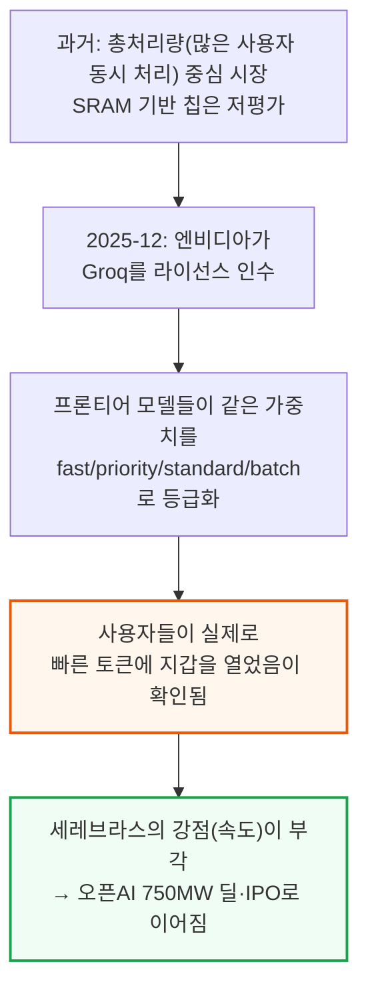
```mermaid
flowchart TD
    Past["과거: 총처리량(많은 사용자 동시 처리) 중심 시장<br/>SRAM 기반 칩은 저평가"] --> Groq["2025-12: 엔비디아가<br/>Groq를 라이선스 인수"]
    Groq --> Tier["프론티어 모델들이 같은 가중치를<br/>fast/priority/standard/batch로 등급화"]
    Tier --> Reveal["사용자들이 실제로<br/>빠른 토큰에 지갑을 열었음이 확인됨"]
    Reveal --> Cerebras["세레브라스의 강점(속도)이 부각<br/>→ 오픈AI 750MW 딜·IPO로 이어짐"]

    style Reveal fill:#fff7ed,stroke:#ea580c,stroke-width:2px
    style Cerebras fill:#f0fdf4,stroke:#16a34a,stroke-width:2px
```

### 빠른 토큰에 실제로 얼마를 더 내는가 - 앤트로픽 Opus 사례

앤트로픽의 Opus 4.6은 "빠른 모드(fast mode)"에 표준 요금의 6배를 받으면서 반응성(사용자 체감 속도)을 2.5배 끌어올리겠다고 약속했습니다.

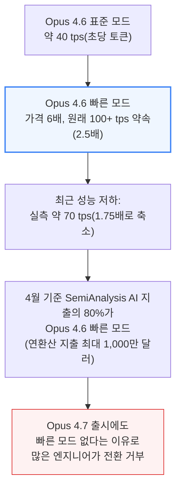
```mermaid
flowchart TD
    Standard["Opus 4.6 표준 모드<br/>약 40 tps(초당 토큰)"] --> Fast["Opus 4.6 빠른 모드<br/>가격 6배, 원래 100+ tps 약속(2.5배)"]
    Fast --> Degrade["최근 성능 저하:<br/>실측 약 70 tps(1.75배로 축소)"]
    Degrade --> Behavior["4월 기준 SemiAnalysis AI 지출의 80%가<br/>Opus 4.6 빠른 모드<br/>(연환산 지출 최대 1,000만 달러)"]
    Behavior --> Refuse["Opus 4.7 출시에도<br/>빠른 모드 없다는 이유로<br/>많은 엔지니어가 전환 거부"]

    style Fast fill:#eff6ff,stroke:#3b82f6,stroke-width:2px
    style Refuse fill:#fef2f2,stroke:#dc2626
```

처음으로 프론티어 지능(가장 똑똑한 모델)을 포기하고 속도를 택하는 사례가 나온 것입니다. 저자들은 Opus 4.6 빠른 모드가 앤트로픽의 마진이 가장 높은 상품(SKU)이자 올해 연매출(ARR) 급증의 핵심 요인이라고 추정합니다.

---

## 2. 처리량과 반응성의 트레이드오프

**📌 핵심:**
- 추론 성능은 처리량(칩 하나가 초당 처리하는 전체 토큰 수)과 반응성(사용자 한 명이 체감하는 초당 토큰 속도)의 트레이드오프 — 버스(많은 사람을 느리게)와 페라리(한 사람을 빠르게)에 비유
- 동시 처리 인원 수(배치 크기)를 조절하면 같은 하드웨어로도 이 곡선(파레토 프론티어) 위를 이동할 수 있음 — GB300 NVL72는 저반응성(40tps)에서 H100 대비 20배, 고반응성(120tps)에서는 100배 더 높은 처리량을 냄
- SRAM 머신(세레브라스·Groq)은 극단적으로 높은 메모리 대역폭 덕분에, HBM 기반 칩으로는 물리적으로 불가능한 수준의 반응성(초당 수천 토큰)까지 도달 가능
- 결론: 사용자가 빠른 토큰에 기꺼이 돈을 낸다면, SRAM 머신은 동시에 더 많은 사용자를 프리미엄 속도로 처리(곡선을 위로)하는 동시에 극단적으로 빠른 속도(곡선을 오른쪽으로 확장)까지 파고들 수 있음

---

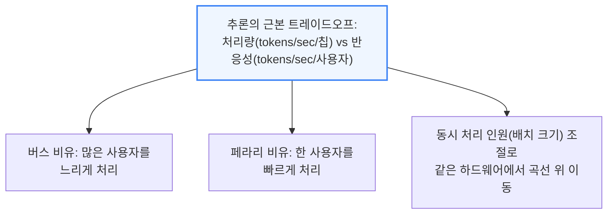
```mermaid
flowchart TD
    Tradeoff["추론의 근본 트레이드오프:<br/>처리량(tokens/sec/칩) vs 반응성(tokens/sec/사용자)"] --> Bus["버스 비유: 많은 사용자를<br/>느리게 처리"]
    Tradeoff --> Ferrari["페라리 비유: 한 사용자를<br/>빠르게 처리"]
    Tradeoff --> Batch["동시 처리 인원(배치 크기) 조절로<br/>같은 하드웨어에서 곡선 위 이동"]

    style Tradeoff fill:#eff6ff,stroke:#3b82f6,stroke-width:2px
```

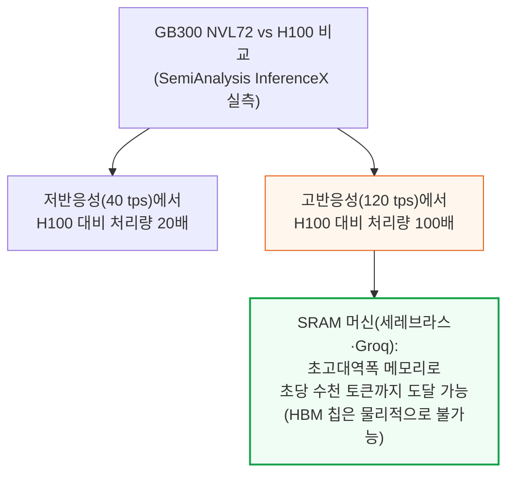
```mermaid
flowchart TD
    GB300["GB300 NVL72 vs H100 비교<br/>(SemiAnalysis InferenceX 실측)"] --> Low["저반응성(40 tps)에서<br/>H100 대비 처리량 20배"]
    GB300 --> High["고반응성(120 tps)에서<br/>H100 대비 처리량 100배"]
    High --> SRAM["SRAM 머신(세레브라스·Groq):<br/>초고대역폭 메모리로<br/>초당 수천 토큰까지 도달 가능<br/>(HBM 칩은 물리적으로 불가능)"]

    style High fill:#fff7ed,stroke:#ea580c
    style SRAM fill:#f0fdf4,stroke:#16a34a,stroke-width:2px
```

📌 용어 풀이: 배치 크기(동시 처리, Concurrency)
> - **배치 크기**: 한 번에 동시에 처리하는 요청(사용자) 수 — 늘리면 처리량은 오르지만 각 사용자가 받는 반응 속도는 느려짐
> - **파레토 프론티어**: 처리량과 반응성 사이에서 하나를 더 얻으려면 다른 하나를 포기해야 하는 최적의 경계선

---

## 3. 웨이퍼 스케일 엔진이란 무엇인가

**📌 핵심:**
- 세레브라스의 근본적인 승부수는 리티클 한계(노광 장비가 한 번에 찍을 수 있는 최대 면적, 약 858mm²)를 넘어서는 것 — 웨이퍼를 잘라 여러 칩을 만드는 대신, 웨이퍼 전체를 칩 하나로 씀
- WSE-3(3세대 웨이퍼 스케일 엔진)는 TSMC N5 공정으로 제작, 12×7 격자로 배열된 84개의 동일한 다이(die)가 웨이퍼 하나 위에서 하나의 칩으로 동작
- 실리콘 면적의 절반은 초고속 SRAM, 나머지 절반은 연산 코어 — 메모리와 연산을 같은 실리콘 위에 둬 칩 간 데이터 이동에 드는 전력·지연·비용을 없앰
- 결론: WSE-3는 44GB SRAM에 21PB/s 대역폭(HBM의 수천 배)을 갖췄지만, 밀도(실리콘 면적당 연산량)는 그리 인상적이지 않고 off-wafer 네트워킹은 150GB/s에 불과해 구조적 약점으로 남음

---

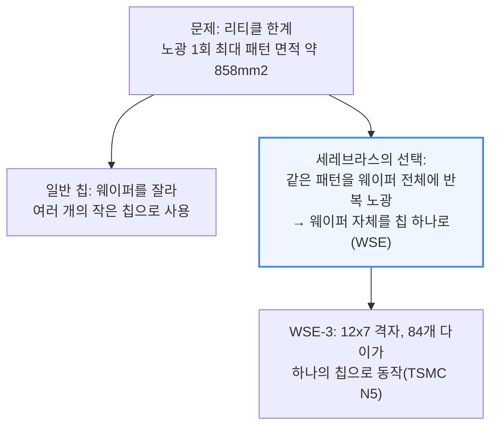
```mermaid
flowchart TD
    Reticle["문제: 리티클 한계<br/>노광 1회 최대 패턴 면적 약 858mm2"] --> Normal["일반 칩: 웨이퍼를 잘라<br/>여러 개의 작은 칩으로 사용"]
    Reticle --> WSE["세레브라스의 선택:<br/>같은 패턴을 웨이퍼 전체에 반복 노광<br/>→ 웨이퍼 자체를 칩 하나로(WSE)"]
    WSE --> Grid["WSE-3: 12x7 격자, 84개 다이가<br/>하나의 칩으로 동작(TSMC N5)"]

    style WSE fill:#eff6ff,stroke:#3b82f6,stroke-width:2px
```

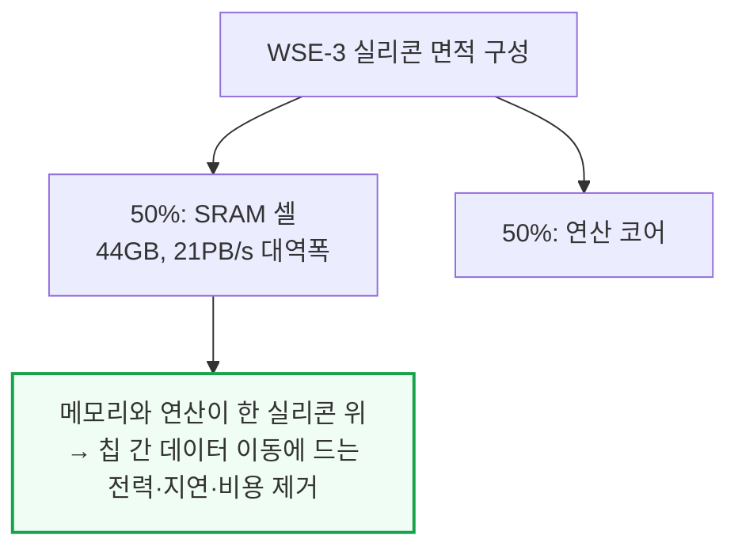
```mermaid
flowchart TD
    Silicon["WSE-3 실리콘 면적 구성"] --> SRAM50["50%: SRAM 셀<br/>44GB, 21PB/s 대역폭"]
    Silicon --> Compute50["50%: 연산 코어"]
    SRAM50 --> Benefit["메모리와 연산이 한 실리콘 위<br/>→ 칩 간 데이터 이동에 드는<br/>전력·지연·비용 제거"]

    style Benefit fill:#f0fdf4,stroke:#16a34a,stroke-width:2px
```

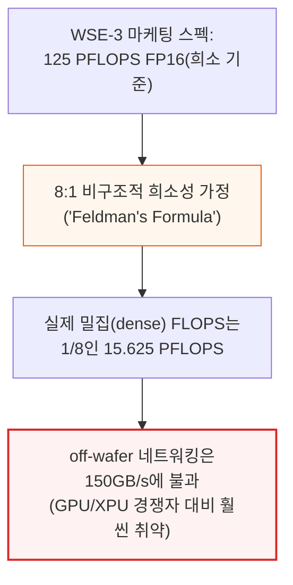
```mermaid
flowchart TD
    Flops["WSE-3 마케팅 스펙:<br/>125 PFLOPS FP16(희소 기준)"] --> Sparsity["8:1 비구조적 희소성 가정<br/>('Feldman's Formula')"]
    Sparsity --> Dense["실제 밀집(dense) FLOPS는<br/>1/8인 15.625 PFLOPS"]
    Dense --> Weak["off-wafer 네트워킹은<br/>150GB/s에 불과<br/>(GPU/XPU 경쟁자 대비 훨씬 취약)"]

    style Sparsity fill:#fff7ed,stroke:#ea580c
    style Weak fill:#fef2f2,stroke:#dc2626,stroke-width:2px
```

📌 용어 풀이: 희소 FLOPS vs 밀집 FLOPS
> - **밀집(Dense) FLOPS**: 실제로 모든 연산을 다 수행했을 때의 연산 능력 — 개발자가 실제로 얻는 값
> - **희소(Sparse) FLOPS**: 일부 연산을 건너뛸 수 있다고 가정하고 부풀린 마케팅용 수치 — 세레브라스는 8:1(2세대는 10:1) 비율을 가정해 실제보다 8배 큰 숫자를 발표

세레브라스는 이전 2세대(WSE-2/CS-2)에서 10:1 비율을 가정했는데, 세대가 바뀌며 희소·밀집 스펙의 격차가 한 자릿수 더 벌어진 셈입니다. 엔비디아의 "젠슨 수학(Jensen Math)"이 세대마다 스파시티 가정을 바꿔 발표하는 관행을 저자들이 이미 지적한 바 있는데, 세레브라스는 이를 한술 더 뜬 것으로 평가됩니다.

---

## 4. SRAM 머신 - HBM과 다른 길

**📌 핵심:**
- WSE는 Groq LPU와 함께 "SRAM 머신"으로 분류됨 — 모델 가중치와 KV 캐시(대화 맥락을 기억하는 임시 저장소)를 SRAM에 두는 방식으로, GPU·TPU·Trainium 같은 주류 칩은 이 저장소로 HBM을 씀
- SRAM은 HBM보다 훨씬 빠르고 지연도 낮지만 용량이 작고 비트당 가격이 훨씬 비쌈 — WSE-3의 44GB SRAM은 HBM3E 12-Hi 스택 단 1개(36GB)보다 조금 큰 수준이며, 8스택을 쓰는 최신 GPU(예: 블랙웰 울트라 288GB)의 6.5분의 1에 불과
- 더 큰 메모리 용량은 (1) 더 큰 모델을 담고 (2) 더 많은 동시 사용자를 처리하고 (3) 더 긴 문맥(context window)을 지원하는 데 쓰이는데, 세레브라스는 이 세 가지 모두에서 구조적으로 불리
- 결론: HBM 기반 칩은 여러 칩에 메모리를 분산시킨 뒤 네트워킹으로 다시 묶어(scale-up fabric) 용량 문제를 풀지만, 세레브라스는 네트워킹 자체가 약해 이 탈출구도 좁음

---

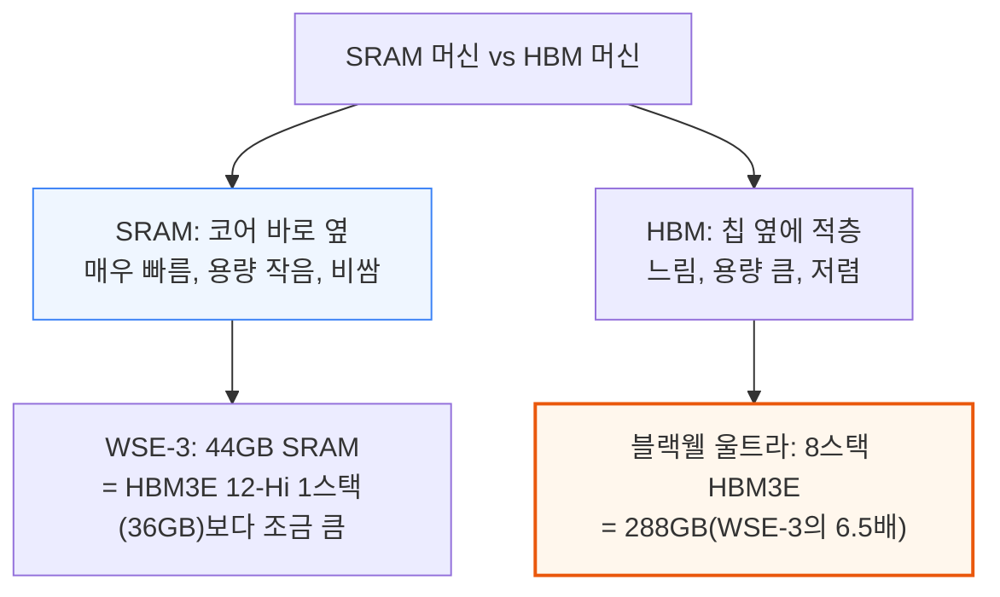
```mermaid
flowchart TD
    Trade["SRAM 머신 vs HBM 머신"] --> S["SRAM: 코어 바로 옆<br/>매우 빠름, 용량 작음, 비쌈"]
    Trade --> H["HBM: 칩 옆에 적층<br/>느림, 용량 큼, 저렴"]
    S --> Cap["WSE-3: 44GB SRAM<br/>= HBM3E 12-Hi 1스택(36GB)보다 조금 큼"]
    H --> Cap2["블랙웰 울트라: 8스택 HBM3E<br/>= 288GB(WSE-3의 6.5배)"]

    style S fill:#eff6ff,stroke:#3b82f6
    style Cap2 fill:#fff7ed,stroke:#ea580c,stroke-width:2px
```

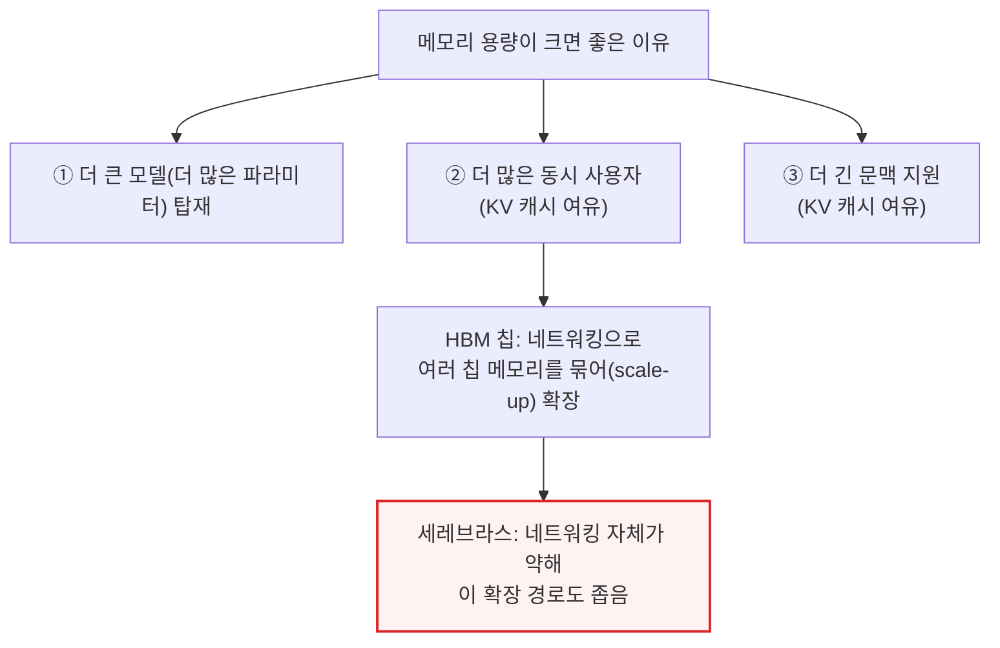
```mermaid
flowchart TD
    More["메모리 용량이 크면 좋은 이유"] --> Big["① 더 큰 모델(더 많은 파라미터) 탑재"]
    More --> Concurrent["② 더 많은 동시 사용자<br/>(KV 캐시 여유)"]
    More --> Context["③ 더 긴 문맥 지원<br/>(KV 캐시 여유)"]
    Concurrent --> Escape["HBM 칩: 네트워킹으로<br/>여러 칩 메모리를 묶어(scale-up) 확장"]
    Escape --> Narrow["세레브라스: 네트워킹 자체가 약해<br/>이 확장 경로도 좁음"]

    style Narrow fill:#fef2f2,stroke:#dc2626,stroke-width:2px
```

한편 세레브라스는 오픈AI 딜을 계기로 2028년까지 창업 이래 쌓아온 것보다 훨씬 많은 서버를 출하해야 하는 국면에 들어섰습니다. TSMC의 웨이퍼 투입량도 이 수요에 맞춰 분기마다 계단식으로 늘어나는 중이며, 저자들은 오픈AI를 최대 성장 동력으로 세레브라스 매출이 향후 수년간 가파르게 꺾여 오를 것으로 예상합니다.

---

## 5. 세레브라스의 독자 기술 - 배선·수율·전력

**📌 핵심:**
- 세레브라스는 다이를 자를 때 버리는 여백(스크라이브 라인)을 오히려 다이 간 배선으로 활용해, 웨이퍼 전체를 잇는 데이터 통로(온웨이퍼 데이터 패브릭)를 만듦
- 리티클 크기에 가까운 대형 칩은 통상 수율(sort yield)이 50% 밑으로 떨어지는데, 세레브라스는 코어를 작게 쪼개 총 97만 개 중 90만 개만 활성화하는 방식으로 결함을 우회 — 배치(batch)마다 커스텀 마스크로 배선을 다시 짜 불량 타일을 피해감
- 이 결과 웨이퍼 단위 수율은 거의 100%까지 올라가지만, 배치마다 마스크를 새로 만드는 추가 비용이 발생
- 결론: 20kW가 넘는 전력을 웨이퍼 하나에 공급하는 것도 별도의 도전 과제라 Vicor와 커스텀 전력 공급 솔루션("엔진 블록")을 함께 개발함

---

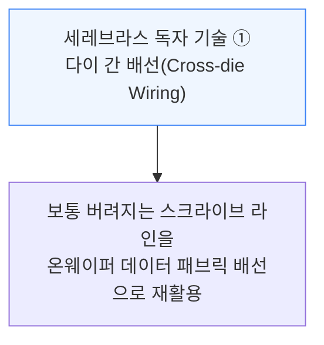
```mermaid
flowchart TD
    Wiring["세레브라스 독자 기술 ①<br/>다이 간 배선(Cross-die Wiring)"] --> Scribe["보통 버려지는 스크라이브 라인을<br/>온웨이퍼 데이터 패브릭 배선으로 재활용"]

    style Wiring fill:#eff6ff,stroke:#3b82f6
```

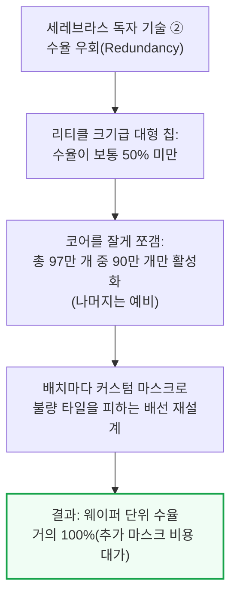
```mermaid
flowchart TD
    Yield["세레브라스 독자 기술 ②<br/>수율 우회(Redundancy)"] --> Problem["리티클 크기급 대형 칩:<br/>수율이 보통 50% 미만"]
    Problem --> Core["코어를 잘게 쪼갬:<br/>총 97만 개 중 90만 개만 활성화<br/>(나머지는 예비)"]
    Core --> Mask["배치마다 커스텀 마스크로<br/>불량 타일을 피하는 배선 재설계"]
    Mask --> Result["결과: 웨이퍼 단위 수율<br/>거의 100%(추가 마스크 비용 대가)"]

    style Result fill:#f0fdf4,stroke:#16a34a,stroke-width:2px
```

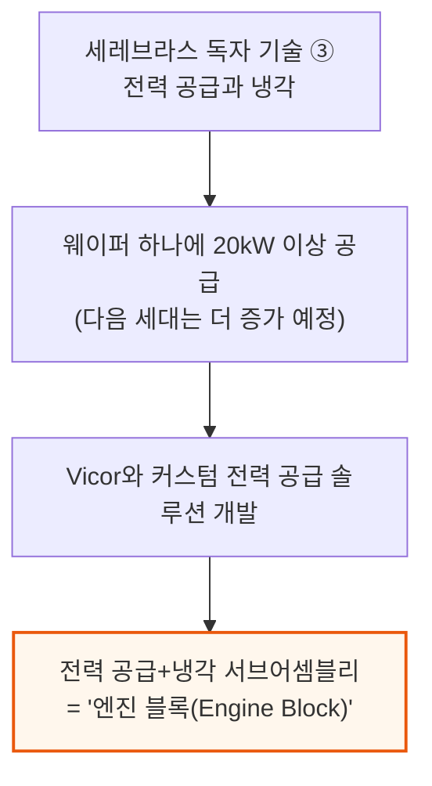
```mermaid
flowchart TD
    Power["세레브라스 독자 기술 ③<br/>전력 공급과 냉각"] --> Watt["웨이퍼 하나에 20kW 이상 공급<br/>(다음 세대는 더 증가 예정)"]
    Watt --> Vicor["Vicor와 커스텀 전력 공급 솔루션 개발"]
    Vicor --> Engine["전력 공급+냉각 서브어셈블리<br/>= '엔진 블록(Engine Block)'"]

    style Engine fill:#fff7ed,stroke:#ea580c,stroke-width:2px
```

이러한 기술적 성취에도 불구하고 WSE 아키텍처는 세레브라스의 기술 로드맵과 토큰 서빙 능력을 제약하는 몇 가지 물리적 한계에 부딪힙니다.

---

## 6. 열 설계와 냉각

**📌 핵심:**
- CS-3 설계의 핵심 열 문제는 46,225mm² 넓이의 웨이퍼 한 장에서 25kW를 식히는 것 — 다이 전체 평균으로 환산하면 약 50W/cm²(국소 발열점 제외)
- 웨이퍼 크기(21.5cm×21.5cm)에 맞는 3D 증기챔버(HGX H100 서버에 쓰이는 공랭 방식)는 심지(wick)의 모세관 한계를 넘어서 마르기 때문에 공랭을 포기, 완전히 커스텀 설계된 물 냉각 시스템("엔진 블록")을 채택
- 랙과 냉각수 분배 장치(CDU) 사이 유량도 업계 표준과 다름 — 업계 기준(OCP/엔비디아 GB200 NVL72)은 kW당 약 1.5L/분인데 WSE-3는 kW당 약 4L/분(NVL72 기준의 약 3배)이 필요해 더 큰 펌프·배관·CDU가 필요
- 결론: 냉각수 입구 온도도 5°C 냉수를 열교환해 약 21°C로 웨이퍼에 공급(NVL72는 최대 45°C 입구 허용) — 이 저온 요건 때문에 냉방기(칠러) 의존도가 높은 시설이 필요함

---

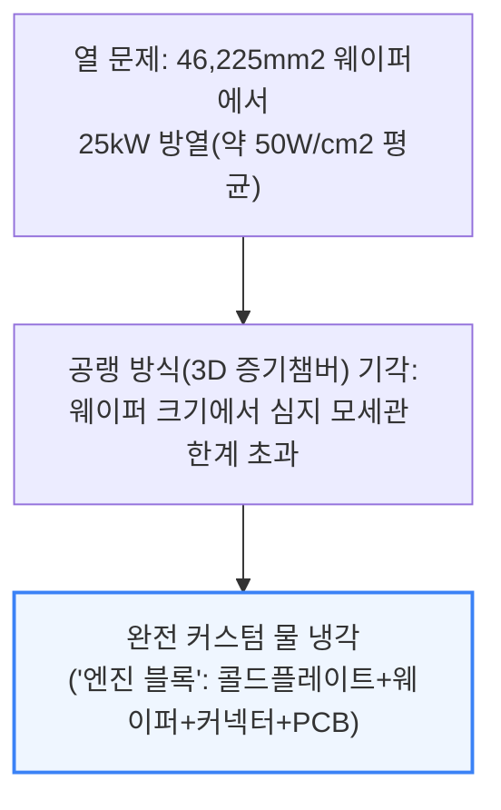
```mermaid
flowchart TD
    Heat["열 문제: 46,225mm2 웨이퍼에서<br/>25kW 방열(약 50W/cm2 평균)"] --> AirReject["공랭 방식(3D 증기챔버) 기각:<br/>웨이퍼 크기에서 심지 모세관 한계 초과"]
    AirReject --> Custom["완전 커스텀 물 냉각<br/>('엔진 블록': 콜드플레이트+웨이퍼+커넥터+PCB)"]

    style Custom fill:#eff6ff,stroke:#3b82f6,stroke-width:2px
```

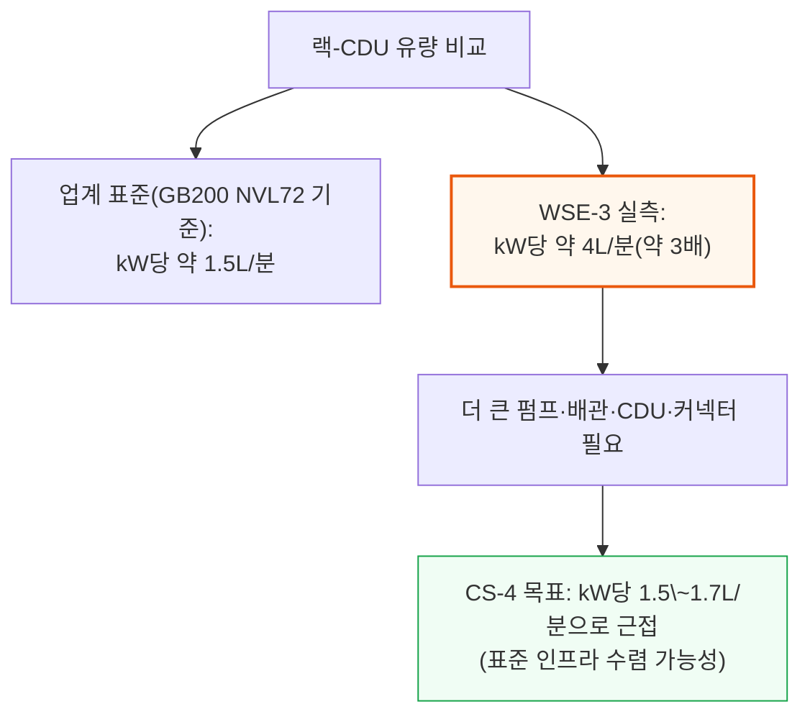
```mermaid
flowchart TD
    Flow["랙-CDU 유량 비교"] --> Standard["업계 표준(GB200 NVL72 기준):<br/>kW당 약 1.5L/분"]
    Flow --> WSE3["WSE-3 실측:<br/>kW당 약 4L/분(약 3배)"]
    WSE3 --> Impact["더 큰 펌프·배관·CDU·커넥터 필요"]
    Impact --> CS4["CS-4 목표: kW당 1.5\~1.7L/분으로 근접<br/>(표준 인프라 수렴 가능성)"]

    style WSE3 fill:#fff7ed,stroke:#ea580c,stroke-width:2px
    style CS4 fill:#f0fdf4,stroke:#16a34a
```

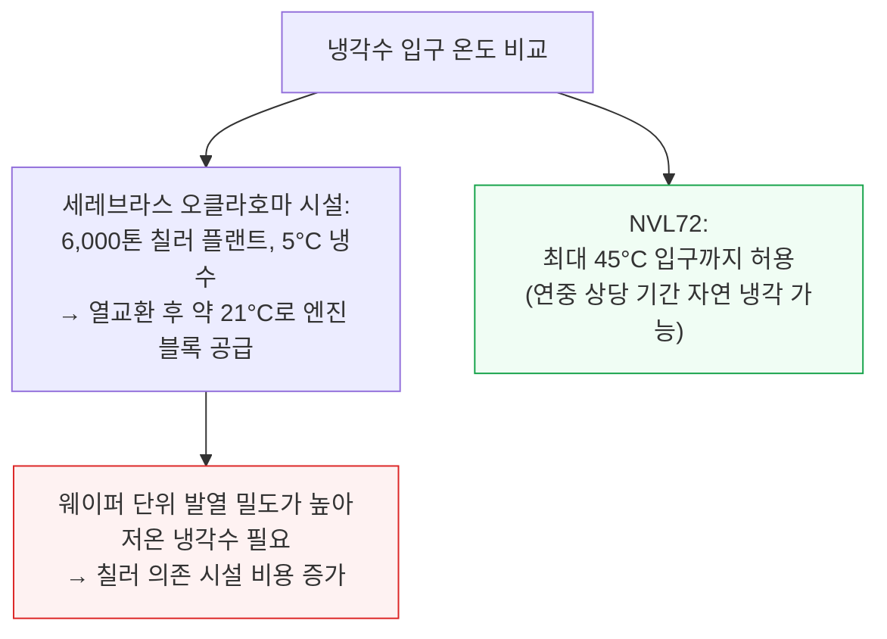
```mermaid
flowchart TD
    Inlet["냉각수 입구 온도 비교"] --> CerebrasT["세레브라스 오클라호마 시설:<br/>6,000톤 칠러 플랜트, 5°C 냉수<br/>→ 열교환 후 약 21°C로 엔진 블록 공급"]
    Inlet --> NVL["NVL72:<br/>최대 45°C 입구까지 허용<br/>(연중 상당 기간 자연 냉각 가능)"]
    CerebrasT --> Reason["웨이퍼 단위 발열 밀도가 높아<br/>저온 냉각수 필요<br/>→ 칠러 의존 시설 비용 증가"]

    style NVL fill:#f0fdf4,stroke:#16a34a
    style Reason fill:#fef2f2,stroke:#dc2626
```

세레브라스의 주요 냉각 파트너 중 하나인 LiquidStack은 2026년 3월 트레인 테크놀로지스(Trane Technologies)에 인수됐습니다. 두 회사는 처음엔 2상(two-phase) 냉각을 함께 연구했지만, 지금은 CS-3의 유량·압력 범위에 맞춘 단상(single-phase) CDU를 공동 개발한 상태입니다.

---

## 7. CS-3 시스템 구조와 부품 원가

**📌 핵심:**
- CS-3 한 대는 WSE-3 엔진 블록 1개, 주변 연산·I/O 모듈, 기계식 펌프 2개, 3.3kW 전원공급장치(PSU) 12개, 냉각 시스템으로 구성 — WSE-3 엔진 자체가 25kW를 소비
- 전력은 12개 PSU(각 3.3kW, 50V 출력)→12개 PDB 보드→84개 Vicor 전력 브릭(각 PDB가 7개 브릭 담당)→84개 웨이퍼 블록 순으로 전달되며, 최종적으로 12V를 1V로 낮춰 웨이퍼에 공급
- KV 캐시 오프로드용으로 듀얼 소켓 AMD CPU + 6TB DDR5 메모리를 갖춘 별도 "KVSS" 노드가 CS 서버마다 추가로 붙음
- 결론: 저자들은 CS-3+KVSS 노드의 부품 원가(BOM)를 랙당 약 35만 달러(메모리 가격 급등 전)로 추정했다가, 2025년 4분기 이후 메모리 가격 급등을 반영해 랙당 약 45만 달러로 상향 — 이는 실리콘 원가(TSMC N5 웨이퍼 약 2만 달러) 대비 매우 높은 수준으로, 마스크 비용·Vicor 전력 모듈·커스텀 냉각·자체 조립이 원가를 끌어올림

---

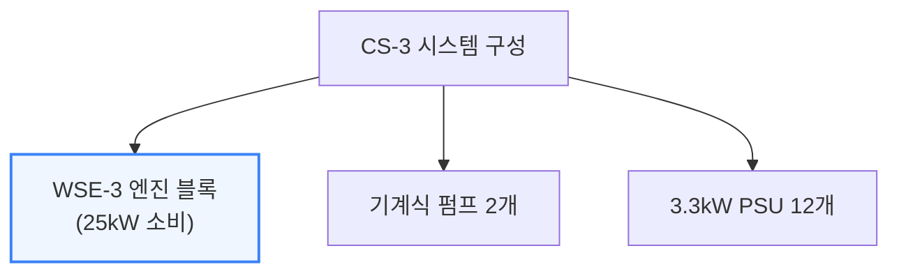
```mermaid
flowchart TD
    CS3["CS-3 시스템 구성"] --> Engine["WSE-3 엔진 블록<br/>(25kW 소비)"]
    CS3 --> Pump["기계식 펌프 2개"]
    CS3 --> PSU["3.3kW PSU 12개"]

    style Engine fill:#eff6ff,stroke:#3b82f6,stroke-width:2px
```

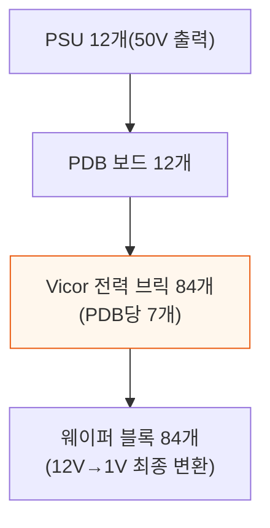
```mermaid
flowchart TD
    P1["PSU 12개(50V 출력)"] --> P2["PDB 보드 12개"]
    P2 --> P3["Vicor 전력 브릭 84개<br/>(PDB당 7개)"]
    P3 --> P4["웨이퍼 블록 84개<br/>(12V→1V 최종 변환)"]

    style P3 fill:#fff7ed,stroke:#ea580c
```

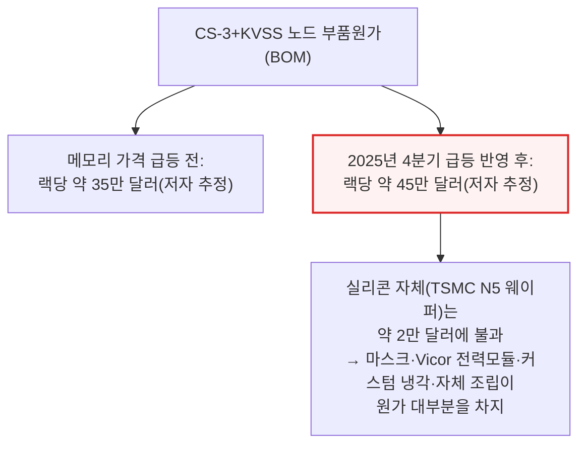
```mermaid
flowchart TD
    Bom["CS-3+KVSS 노드 부품원가(BOM)"] --> Before["메모리 가격 급등 전:<br/>랙당 약 35만 달러(저자 추정)"]
    Bom --> After["2025년 4분기 급등 반영 후:<br/>랙당 약 45만 달러(저자 추정)"]
    After --> Compare["실리콘 자체(TSMC N5 웨이퍼)는<br/>약 2만 달러에 불과<br/>→ 마스크·Vicor 전력모듈·커스텀 냉각·자체 조립이<br/>원가 대부분을 차지"]

    style After fill:#fef2f2,stroke:#dc2626,stroke-width:2px
```

KVSS 노드는 듀얼 소켓 AMD CPU에 6TB DDR5 RDIMM을 얹어 KV 캐시(대화 맥락 저장소)를 웨이퍼 밖으로 덜어내는 용도입니다. 그 외 주변 부품으로 세레브라스 고유 I/O를 이더넷으로 변환하는 100GbE 자일링스 FPGA 12개가 붙습니다.

---

## 8. 웨이퍼가 유리한 지점 - 연산 강도로 보기

**📌 핵심:**
- 성능 엔지니어의 관점에서 칩 성능을 가르는 핵심 지표는 연산 강도(Arithmetic Intensity, 메모리에서 1바이트를 가져올 때 몇 번 연산하는지, FLOPs/byte) — 낮으면 메모리 대역폭이, 높으면 연산 능력이 성능을 좌우
- WSE-3의 실제 밀집 FP16/INT8 FLOPS는 15.625 PFLOPS로, FP4 기준 엔비디아 B300(13.5 PFLOPS)·GB300(15 PFLOPS)과 비슷하지만 루빈 GPU(35 PFLOPS)에는 크게 못 미침 — 세레브라스의 S-1 상장 서류를 포함한 마케팅 자료는 이보다 훨씬 높은 PFLOPS를 내세우는데, 이는 8:1 희소성 가정("Feldman's Formula")을 적용한 수치
- 웨이퍼 한 장(약 100만 달러 상당 하드웨어와 비교하면 엔비디아 HGX 2대·NVL72 슬레드 4대·Groq LP30 약 50대에 해당) 단위로 연산 강도별 성능 roofline을 그려보면, WSE-3는 연산 강도 0.74 부근에서 최적 성능을 냄
- 결론: 배치=1(사용자 1명), 연산 강도=2인 디코드(한 토큰씩 순차 생성) 커널을 기준으로 보면, 엔비디아 GPU와 Groq LPU는 이론상 최대치도 수십\~수백 TFLOPS에 그치는 반면 WSE-3는 15.625 PFLOPS 전체를 실현할 수 있음 — 이것이 세레브라스가 저반응성 디코드 구간에서 압도적으로 빠른 근본 이유

---

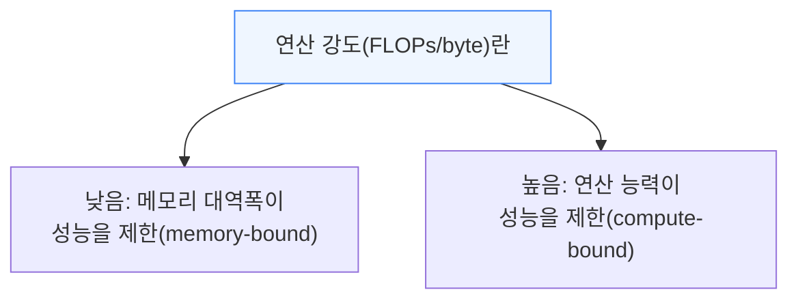
```mermaid
flowchart TD
    AI["연산 강도(FLOPs/byte)란"] --> Low["낮음: 메모리 대역폭이<br/>성능을 제한(memory-bound)"]
    AI --> High["높음: 연산 능력이<br/>성능을 제한(compute-bound)"]

    style AI fill:#eff6ff,stroke:#3b82f6
```

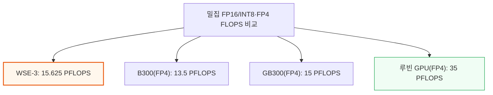
```mermaid
flowchart TD
    Compare["밀집 FP16/INT8·FP4 FLOPS 비교"] --> WSE["WSE-3: 15.625 PFLOPS"]
    Compare --> B300["B300(FP4): 13.5 PFLOPS"]
    Compare --> GB300["GB300(FP4): 15 PFLOPS"]
    Compare --> Rubin["루빈 GPU(FP4): 35 PFLOPS"]

    style WSE fill:#fff7ed,stroke:#ea580c,stroke-width:2px
    style Rubin fill:#f0fdf4,stroke:#16a34a
```

```mermaid
flowchart TD
    Decode["디코드 커널 예시:<br/>배치=1, 연산 강도=2"] --> GPU["엔비디아 GPU·Groq LPU:<br/>이론상 최대치도 수십~수백 TFLOPS"]
    Decode --> WSE3["세레브라스 WSE-3:<br/>이론상 15.625 PFLOPS 전체 실현 가능"]
    WSE3 --> Reason["이유: 44GB SRAM의 초고대역폭이<br/>연산 속도를 따라감<br/>(HBM은 이 지점에서 굶주림)"]

    style WSE3 fill:#f0fdf4,stroke:#16a34a,stroke-width:2px
```

📌 용어 풀이: 룰라인(Roofline) 분석
> - **Roofline**: 칩의 연산 능력과 메모리 대역폭 한계를 그래프로 그려, 특정 연산 강도에서 실제로 낼 수 있는 최대 성능을 한눈에 보여주는 분석 기법

이 때문에 GPT-5.3-Codex-Spark처럼 웨이퍼의 성능 특성에 맞춰 설계되는 모델이 등장하고 있으며, 저자들은 이를 "하드웨어-소프트웨어 공동 설계(co-design)의 완벽한 사례"로 평가합니다.

---

## 9. 웨이퍼의 득과 실 - 한계와 실전 계산기

**📌 핵심:**
- SRAM은 와트당·달러당 밀도가 낮을 수밖에 없어, HBM 기반 GPU·XPU가 더 큰 모델·더 긴 문맥·더 많은 동시 사용자를 처리하는 데 여전히 유리함
- 저자들이 공개한 계산기(tokenomics.info/cerebras)에서 실측 트래픽(에이전틱 코딩 도구 43만 건, 약 800억 토큰)을 분석한 결과 요청 크기(P50 ISL)는 세레브라스가 가정하는 64k가 아니라 약 96,300 토큰 — 전체 요청의 거의 50%가 세레브라스 공개 엔드포인트의 최대 문맥(128k)을 초과
- 딥시크 V4를 예로 들면, CS-3 24대로 서빙 가능한 물량을 GB300 5개 랙(랙당 20TB HBM)으로도 커버 가능 — 가중치를 담고도 19TB가 KV 캐시로 남아, 더 많은 사용자·더 긴 문맥을 처리하는 총처리량 경쟁에서는 HBM 쪽이 압도적으로 유리
- 결론: 속도에서는 세레브라스가 앞서지만, 총처리량에서는 HBM 기반 GPU가 앞서는 명확한 이분법 — 문맥 길이가 계속 늘어나는 에이전틱 워크로드 흐름은 세레브라스에 구조적으로 불리한 방향

---

```mermaid
flowchart TD
    Assume["세레브라스 가정:<br/>평균 요청 크기(ISL) 64k 토큰"] --> Real["실측(43만 건, 약 800억 토큰):<br/>P50 ISL 약 96,300 토큰"]
    Real --> Over["전체 요청의 거의 50%가<br/>128k(공개 엔드포인트 최대 문맥) 초과"]

    style Real fill:#fff7ed,stroke:#ea580c,stroke-width:2px
    style Over fill:#fef2f2,stroke:#dc2626
```

```mermaid
flowchart TD
    Deepseek["딥시크 V4 서빙 비교"] --> CS3["CS-3 24대로<br/>가능한 물량"]
    Deepseek --> GB300["GB300 5개 랙<br/>(랙당 20TB HBM)으로 커버 가능"]
    GB300 --> KV["가중치 저장 후에도<br/>19TB가 KV 캐시로 남음<br/>→ 더 많은 사용자·긴 문맥 처리에 압도적 유리"]

    style GB300 fill:#f0fdf4,stroke:#16a34a,stroke-width:2px
    style KV fill:#eff6ff,stroke:#3b82f6
```

📌 용어 풀이: ISL(Input Sequence Length, 입력 문맥 길이)
> - **ISL**: 한 요청이 모델에 들어갈 때 포함하는 입력 텍스트(프롬프트·도구 사용 맥락·시스템 프롬프트 등)의 토큰 수 — 에이전틱 코딩 도구는 도구 사용 맥락 때문에 초기 문맥부터 10만 토큰을 넘는 경우가 흔함

---

## 10. SRAM 스케일링의 한계와 대역폭이라는 기하학 문제

**📌 핵심:**
- 세레브라스는 SRAM 스케일링 둔화에 가장 크게 노출된 회사 — WSE-1(16nm)은 18GB, WSE-2(7nm)는 40GB(2.2배 증가)였지만 WSE-3(5nm)는 44GB로 노드 전환에도 10%밖에 못 늘었고(같은 기간 로직 트랜지스터 수는 약 50% 증가), N3E 이후로는 SRAM 밀도가 사실상 정체
- 이 때문에 차세대 CS-4는 여전히 N5 공정의 WSE-3를 쓰되 전력을 높여 클럭·연산만 끌어올리고 SRAM 용량은 그대로 둘 전망 — Groq는 하이브리드 본딩으로 SRAM 타일을 수직(Z축)으로 늘릴 수 있어 이 제약에서 상대적으로 자유로움
- 오프웨이퍼 대역폭은 150GB/s(1.2Tb/s)에 불과 — 같은 세대 Groq LP30(96레인×112G, 9.6Tb/s)의 8분의 1 수준이며, 웨이퍼 가장자리 1mm당 대역폭은 0.17GB/s로 엔비디아 대비 130분의 1 밀도
- 결론: 이는 설계 실수가 아니라 웨이퍼 스케일 자체의 구조적 대가 — 84개 다이가 전부 동일한 리티클 패턴을 써야 하는 제약 때문에, 가장자리에만 고속 송수신회로(SerDes)를 몰아줄 수 없고 웨이퍼 전체에 골고루 심어야 해 대부분이 바깥과 통신할 수 없는 채로 낭비됨

---

```mermaid
flowchart TD
    Gen["WSE 세대별 SRAM 용량"] --> W1["WSE-1(16nm): 18GB"]
    Gen --> W2["WSE-2(7nm): 40GB(2.2배)"]
    Gen --> W3["WSE-3(5nm): 44GB(10%만 증가)<br/>같은 기간 로직 트랜지스터는 약 50%↑"]
    W3 --> Stall["N3E 이후 SRAM 밀도<br/>사실상 정체(zero shrink)"]
    Stall --> CS4["CS-4: N5 WSE-3 그대로 사용<br/>전력↑로 클럭·연산만 개선<br/>(SRAM 용량 그대로)"]

    style W3 fill:#fff7ed,stroke:#ea580c
    style Stall fill:#fef2f2,stroke:#dc2626,stroke-width:2px
```

```mermaid
flowchart TD
    BW["오프웨이퍼 대역폭 비교"] --> WSE3["WSE-3: 150GB/s(1.2Tb/s)"]
    BW --> Groq["Groq LP30: 9.6Tb/s<br/>(96레인x112G SerDes, WSE-3의 8배)"]
    WSE3 --> Density["가장자리 1mm당 대역폭:<br/>WSE-3 0.17GB/s<br/>엔비디아 대비 130분의 1 밀도"]

    style Groq fill:#f0fdf4,stroke:#16a34a
    style Density fill:#fef2f2,stroke:#dc2626,stroke-width:2px
```

```mermaid
flowchart TD
    Why["왜 대역폭이 낮은가"] --> Uniform["84개 다이 전부<br/>동일한 리티클 패턴 필수<br/>(온웨이퍼 배선 연결 조건)"]
    Uniform --> NoEdge["가장자리에만 고속 송수신회로<br/>배치 불가능"]
    NoEdge --> Waste["웨이퍼 전체에 골고루 심어야 함<br/>→ 대부분이 바깥과 통신 못 하는 채로 낭비"]
    Waste --> Block["게다가 회로 배치 지점마다<br/>온칩 데이터 흐름 통로가 막힘<br/>(2D 메시 우회 필요)"]

    style Waste fill:#fef2f2,stroke:#dc2626,stroke-width:2px
```

세레브라스는 이 광학 대역폭 한계를 하이브리드 본딩 방식의 웨이퍼 스케일 광 트랜시버(Ranovus와 공동 개발)로 우회하려 하고 있습니다. 다만 회사 스스로도 LLM 추론에는 추가 대역폭이 필요 없다고 밝히며, 이는 엔비디아가 사실상 손을 뗀 FP64 고성능컴퓨팅(HPC) 고객을 위해 추진하는 것이라고 설명합니다.

### 파이프라인 병렬화가 강제되는 이유

낮은 대역폭 때문에 큰 모델을 여러 웨이퍼에 나눠 담는 방식도 사실상 한 가지로 제한됩니다.

```mermaid
flowchart TD
    Limit["CS-3 I/O: 약 150GB/s<br/>(NVLink5 900GB/s의 6분의 1)"] --> Rule["대형 텐서는 웨이퍼에<br/>상주해야 함(스트리밍 불가)"]
    Rule --> Only["유일한 선택지: 파이프라인 병렬화<br/>(층 단위로 나눠 활성화 값만 전달)"]
    Only --> Example["예: Llama3 70B를<br/>WSE-3 4개에 층 단위로 분산"]

    style Only fill:#eff6ff,stroke:#3b82f6,stroke-width:2px
```

파이프라인 단계가 늘수록 파이프라인 버블(각 단계를 쉬지 않게 하려면 동시에 흘려보내야 하는 미니배치 수가 단계 수만큼 필요)과 웨이퍼 간 활성화 전송 지연이 누적됩니다. 결과적으로 웨이퍼가 원래 잘하는 것(소규모 배치에서 초고속 처리)과는 반대 방향으로 실사용이 흘러가는 역설이 발생합니다.

---

## 11. 숫자로 보는 모델별 웨이퍼 소요량

**📌 핵심:**
- 세레브라스 공개 추론 클라우드의 최대 생산 모델은 120B 파라미터(GPT-OSS)이고, 미리보기 모델도 355B(GLM 4.7)가 상한 — 참고로 소네트·오퍼스는 각각 약 1조·5조 파라미터로(일론 머스크 언급 기준) 자릿수가 다름
- 한때 인기 있던 Llama 70B·405B 모델은 서빙 경제성 문제로 추정되는 이유로 세레브라스 클라우드에서 단종됐고, 2025년 가장 인기 있던 오픈소스 모델인 딥시크 V3·Kimi K2는 애초에 공개 클라우드에 올라온 적이 없음
- 딥시크가 공개한 KV 캐시 압축 기법(멀티헤드 잠재 어텐션, MLA) 덕분에 문맥 길이 대비 KV 캐시 크기가 크게 줄어, 딥시크 V4 Pro는 Llama 405B와 비슷한 배치 형태를 가지면서도 KV 캐시는 훨씬 작음 — 파라미터가 1조를 넘는 대형 모델도 현대적 압축 기법과 충분한 동시성만 있으면 세레브라스에서 매력적일 수 있다는 뜻
- 결론: 세레브라스는 데이터를 웨이퍼에 넣고 빼는 데 큰 지연 비용을 치르며, 그 비용을 얼마나 숨기거나 줄이느냐가 원가 대비 성능(줄당 성능)을 좌우 — 활성화 전송의 고정 지연은 모델을 담은 웨이퍼 수에 비례해 커지고, 이는 토큰당 처리 시간(TPOT)에 선형으로 반영됨

---

```mermaid
flowchart TD
    Models["세레브라스 공개 클라우드<br/>모델 규모 상한"] --> Prod["생산 모델 최대: GPT-OSS 120B"]
    Models --> Preview["미리보기 모델 최대: GLM 4.7 355B"]
    Models --> Ref["참고: 소네트 약 1조,<br/>오퍼스 약 5조 파라미터(일론 언급)"]

    style Prod fill:#eff6ff,stroke:#3b82f6
    style Ref fill:#fff7ed,stroke:#ea580c
```

```mermaid
flowchart TD
    Deprecated["단종·미탑재 모델"] --> Llama["Llama 70B·405B<br/>서빙 경제성 문제로 추정 단종"]
    Deprecated --> Missing["딥시크 V3·Kimi K2<br/>공개 클라우드에 오른 적 없음"]
    Missing --> MLA["딥시크는 MLA(멀티헤드 잠재 어텐션)로<br/>KV 캐시를 크게 압축"]
    MLA --> V4["딥시크 V4 Pro:<br/>Llama 405B와 비슷한 배치 형태<br/>+ 훨씬 작은 KV 캐시"]
    V4 --> Hope["→ 1조+ 파라미터 모델도<br/>압축·충분한 동시성이면<br/>세레브라스에서 매력적일 수 있음"]

    style Hope fill:#f0fdf4,stroke:#16a34a,stroke-width:2px
```

---

## 12. 세레브라스-오픈AI 딜의 구조와 경제성

**📌 핵심:**
- 오픈AI는 세레브라스의 담보권자, 최대 워런트 보유자, 백로그(24.6억 달러 미이행 잔여 계약, 2025년 말 기준)의 사실상 전부를 차지하는 유일 고객 — 완전 희석 기준 최대 12%까지 세레브라스 지분을 가질 수 있음
- 2025년 12월 체결된 마스터 관계 계약(MRA)에 따라 오픈AI는 2026\~2028년에 걸쳐 750MW의 AI 추론 컴퓨트 용량을 구매하기로 확약했고, 추가로 1.25GW를 살 수 있는 옵션(총 2GW 잠재)도 보유 — 시설 임대료·전력 등 통과 비용은 오픈AI가 총액 기준으로 매출 인식되도록 상환
- 오픈AI는 세레브라스에 1억 달러 운전자금 대출(연 6% 이자, 컴퓨트 용량으로 상환하면 이자 면제)도 제공했고, 그 대가로 주당 0.00001달러(사실상 무상)에 클래스 N 보통주 3,344만 5,026주 워런트를 받음 — 이 워런트는 대출 수령 즉시 벌어지는 부분(445만 9,337주), 시가총액 400억 달러 또는 수수료 마일스톤 달성 시 벌어지는 부분(557만 4,171주), 용량 인도에 연동된 부분(2,341만 1,518주, 확정 용량分과 옵션 용량分으로 세분)으로 나뉨
- 결론: 회계상 이 워런트는 2025년 말 기준 주당 82.02달러로 평가돼 최대 약 27.4억 달러(오픈AI 예상 매출의 약 10%)의 매출 차감(contra-revenue)으로 처리 — 다만 "확정적(probable)"으로 분류된 트랜치만 실제로 매출에서 차감되며, 2GW 확장 옵션에 연동된 부분은 옵션이 실행돼야 비로소 반영됨

---

```mermaid
flowchart TD
    OAI["오픈AI-세레브라스 관계<br/>3가지 메커니즘"] --> Backlog["백로그: 24.6억 달러<br/>(2025년 말 기준 미이행 잔여계약)"]
    OAI --> Loan["운전자금 대출 1억 달러<br/>(연 6%, 용량 상환 시 이자 면제)"]
    OAI --> Warrant["워런트: 클래스 N 보통주<br/>3,344만 5,026주(주당 0.00001달러)"]
    Warrant --> Stake["완전 희석 기준<br/>최대 지분 12%"]

    style Backlog fill:#eff6ff,stroke:#3b82f6,stroke-width:2px
    style Stake fill:#fff7ed,stroke:#ea580c
```

```mermaid
flowchart TD
    MRA["MRA(2025-12 체결)"] --> Commit["확약: 750MW<br/>2026~2028년 분할 인도"]
    MRA --> Option["옵션: 추가 1.25GW<br/>(총 잠재 2GW)"]
    Commit --> PassThrough["시설·전력 등 통과 비용은<br/>오픈AI가 총액 기준 매출로 상환"]

    style Commit fill:#f0fdf4,stroke:#16a34a,stroke-width:2px
```

```mermaid
flowchart TD
    WarrantVest["워런트 3,344만 5,026주 벌어지는 조건"] --> V1["445만 9,337주:<br/>대출 수령 즉시(2026-01)"]
    WarrantVest --> V2["557만 4,171주:<br/>시총 400억 달러 또는<br/>수수료 마일스톤 달성 시"]
    WarrantVest --> V3["2,341만 1,518주:<br/>용량 인도 연동<br/>(확정 용량+2GW 옵션 용량)"]
    V3 --> Value["주당 82.02달러 평가(2025년 말)<br/>→ 최대 약 27.4억 달러 매출 차감<br/>(오픈AI 예상 매출의 약 10%)"]

    style Value fill:#fef2f2,stroke:#dc2626,stroke-width:2px
```

📌 용어 풀이: 워런트와 매출 차감(Contra-Revenue)
> - **워런트(Warrant)**: 정해진 가격에 주식을 살 수 있는 권리 — 이 경우 사실상 무상에 가까운 가격(주당 0.00001달러)이라 사실상 지분을 무료로 주는 것과 같음
> - **매출 차감(Contra-Revenue)**: 고객에게 지분을 준 것을 매출을 깎는 회계 항목으로 처리하는 방식 — 워런트를 준 시점의 공정가치로 고정되며 나중에 주가가 올라도 다시 계산하지 않음

이 워런트는 2035년 12월 24일 만료되며, 오픈AI는 언제든 이 주식을 공개 재매각용으로 등록하라고 요구할 수 있는 권리(수요 등록권)도 갖고 있습니다.

2026년 2월 오픈AI가 GPT-5.3-Codex-Spark(120B 규모로 정제된 모델)를 출시하며 세레브라스에서 초당 최대 2,000토큰(사용자당)의 속도를 낸 것이 양사 관계를 본격적으로 반전시킨 계기가 됐습니다.

### 딜의 실제 수익성

```mermaid
flowchart TD
    IRR["오픈AI 딜의 프로젝트 IRR<br/>(내부수익률)"] --> Avg["최근 대형 클라우드 딜 평균:<br/>약 15~25%"]
    IRR --> Cerebras["세레브라스-오픈AI 딜:<br/>이보다 훨씬 높음"]
    Cerebras --> Why["이유: 세레브라스가<br/>자체 하드웨어를 직접 운영<br/>(GPU 딜처럼 엔비디아에 마진 지급 불필요)"]

    style Cerebras fill:#f0fdf4,stroke:#16a34a,stroke-width:2px
```

```mermaid
flowchart TD
    Rate["CS-3 시간당 요금 구조"] --> Rental["오픈AI 내재 임대료:<br/>시간당 41.96달러/CS-3"]
    Rate --> Server["서버 원가: 45.3만 달러<br/>(전 클러스터 원가 47.8만 달러)"]
    Rate --> Opex["운영비: 시간당 9.63달러<br/>(all-in 30kW 전력 소비 기준)"]
    Server --> TCO["총소유비용(TCO): 시간당 23.35달러"]
    Opex --> TCO
    TCO --> Margin["41.96달러 vs 23.35달러<br/>→ 매우 건강한 마진"]

    style Margin fill:#f0fdf4,stroke:#16a34a,stroke-width:2px
```

```mermaid
flowchart TD
    PFLOP["PFLOP당 TCO 비교"] --> Internal["세레브라스 자체 운영 플릿:<br/>시간당 1.49달러/PFLOP"]
    PFLOP --> External["외부 임대 고객<br/>(ASP 130만 달러/CS-3 가정):<br/>시간당 2.69달러/PFLOP"]

    style Internal fill:#eff6ff,stroke:#3b82f6
```

오픈AI 입장에서는 GPT-5.3-Codex-Spark 기준 에이전틱 코딩 워크로드에서 100만 토큰당 원가 0.19달러, 매출 0.30달러로 추론 총마진 35%를 얻는 것으로 저자들은 추정합니다.

이는 프론티어 모델 수익성에는 크게 못 미치는 수준입니다. 더 비싼 프리미엄 요금을 받거나, 하드웨어-소프트웨어 공동 설계로 원가를 더 낮춰야 개선될 수 있습니다.

---

## 13. AWS 트레이니움과의 분리형 PD 구성

**📌 핵심:**
- 2026년 3월 발표된 아마존 파트너십에 따라 AWS는 자사 데이터센터에 WSE를 배치해 베드락(Bedrock) 추론 서비스를 강화 — WSE는 디코드(한 토큰씩 순차 생성)를, 트레이니움은 프리필(입력을 한번에 처리)을 맡는 PD 분리 구성
- 트레이니움의 최대 고객은 앤트로픽(프로젝트 레이니어를 통해)인데, 아직 앤트로픽이 트레이니움+세레브라스 PD 분리 고객으로 공식 발표되지는 않았지만 저자들은 빠른 모드 수요가 커지면 조만간 이어질 것으로 예상 — 어느 쪽이든 클로드 토큰이 베드락을 통해 세레브라스로 흘러갈 가능성이 높음
- 이 구성은 엔비디아 GTC에서 공개된 Groq LPU식 AFD(Attention-FFN Disaggregation)와는 다른 표준적인 PD 분리 방식 — 모든 디코드가 세레브라스에서 실행되며, 공동 발표에서는 이 구성으로 5배 처리량 개선을 주장
- 결론: 세레브라스는 오픈AI 딜과 유사하게 AWS에도 워런트(최대 270만 주, 행사가 주당 100달러, 구매 물량 연동)를 발급 — 다만 이 딜은 클라우드 매출이 아니라 AWS 소유 데이터센터에 CS-3를 판매하는 하드웨어 매출로 인식될 전망

---

```mermaid
flowchart TD
    AWS["AWS 파트너십(2026-03 발표)"] --> Split["PD 분리 구성"]
    Split --> Prefill["트레이니움: 프리필<br/>(입력 처리, 연산 위주)"]
    Split --> Decode["세레브라스 WSE: 디코드<br/>(토큰 순차 생성, 대역폭 위주)"]
    Decode --> Claim["공동 발표: 5배 처리량 개선 주장"]

    style Decode fill:#eff6ff,stroke:#3b82f6,stroke-width:2px
    style Claim fill:#f0fdf4,stroke:#16a34a
```

```mermaid
flowchart TD
    Anthropic["트레이니움 최대 고객:<br/>앤트로픽(프로젝트 레이니어)"] --> NotYet["아직 트레이니움+세레브라스<br/>PD 분리 고객으로 공식 발표 안 됨"]
    NotYet --> Expect["저자 예상: 빠른 모드 수요 증가하면<br/>조만간 공식화될 가능성"]
    Expect --> Flow["어느 쪽이든 클로드 토큰이<br/>베드락 경유로 세레브라스에 흘러갈 가능성"]

    style Flow fill:#fff7ed,stroke:#ea580c
```

기술적으로는 이 아키텍처가 대규모로 검증돼야 합니다. 제안된 구성은 트레이니움이 프리필을 처리하고 KV 캐시를 생성한 뒤 이를 웨이퍼로 전송해 디코드를 잇는데, 스위치 홉마다 약 5마이크로초의 지연을 극복해야 합니다.

이 글 전체에서 강조했듯, WSE를 PD 분리에 쓸 때의 잠재 병목도 결국 I/O입니다. 모든 KV 캐시가 트레이니움에서 웨이퍼로 넘어가려면 같은 스위치와 같은 네트워크 인터페이스를 거쳐야 한다는 사실은 분리 구성으로도 바뀌지 않습니다.

---

## 14. 실제로 만들어낼 수 있는가 - 데이터센터 확보 현황

**📌 핵심:**
- 칩·시스템·프로그래밍 모델·소프트웨어 런타임·서버리스 추론 엔드포인트 사업까지 설계한 것도 모자라, 세레브라스는 오픈AI에 필요한 컴퓨트(최소 250MW)를 직접 호스팅하기 위해 네오클라우드(자체 데이터센터 사업자)가 돼야 하는 처지
- 오픈AI 딜은 2026\~2028년 매년 250MW가 필요한데, 저자들의 데이터센터 모델 구독자 정보에 따르면 세레브라스가 2027년 말까지 확보한 용량은 약 180MW뿐(G42/UAE 스타게이트용 40MW 제외 시 오픈AI 몫은 약 140MW) — 계약된 수요 대비 유의미한 공급 부족
- 2026년 기준 확보된 임대 용량은 약 43MW(S-1 공시 상단 기준 50MW+), AWS向 용량은 10MW 이하로 추정 — 2027년에는 벨 AI 랩스 캠퍼스(128MW)가 가동되고, 가이아나 국가 AI 캠퍼스(100MW, MoU 단계, 여러 차례 지연) 착공 여부에 따라 추가 확보 가능
- 결론: 오픈AI가 세레브라스에 kW당 월 최대 200달러까지 지불을 허용(시세 kW당 월 130\~140달러보다 훨씬 높음)하며 부지 확보를 지원 중이지만, 세레브라스 특유의 커스텀 물 냉각 요건 때문에 표준 액침·수랭 데이터센터 용량을 그대로 가져다 쓸 수 없어 확보 자체가 비싸고 까다로움

---

```mermaid
flowchart TD
    Need["오픈AI 딜 요건:<br/>2026~2028년 매년 250MW"] --> Have["실제 확보(2027년 말 기준):<br/>약 180MW(저자 추정)"]
    Have --> ExG42["G42/UAE 스타게이트 40MW 제외 시<br/>오픈AI 몫 약 140MW"]
    ExG42 --> Gap["계약 수요 대비<br/>유의미한 공급 부족"]

    style Gap fill:#fef2f2,stroke:#dc2626,stroke-width:2px
```

```mermaid
flowchart TD
    Y2026["2026년 확보 용량"] --> Lease["임대: 약 43MW<br/>(S-1 상단 기준 50MW+)"]
    Y2026 --> AWSc["AWS向: 10MW 이하 추정"]
    Y2027["2027년 전망"] --> Bell["벨 AI 랩스 캠퍼스: 128MW"]
    Y2027 --> Guyana["가이아나 국가 AI 캠퍼스: 100MW<br/>(MoU 단계, 수차례 지연)"]

    style Bell fill:#f0fdf4,stroke:#16a34a
    style Guyana fill:#fff7ed,stroke:#ea580c
```

```mermaid
flowchart TD
    Price["부지 확보 비용"] --> Market["업계 시세: kW당 월 130~140달러"]
    Price --> OAIPay["오픈AI 허용 상한: kW당 월 최대 200달러"]
    OAIPay --> Reason["이유: 데이터센터 비용이<br/>오픈AI에 통과되는 구조<br/>+ 세레브라스 커스텀 냉각 요건<br/>(표준 수랭 용량 그대로 사용 불가)"]

    style OAIPay fill:#eff6ff,stroke:#3b82f6,stroke-width:2px
    style Reason fill:#fef2f2,stroke:#dc2626
```

이 때문에 세레브라스는 대형 하이퍼스케일 부지 하나를 통째로 잡기보다, 여러 곳의 소규모·분산된 용량을 모듈러·프리팹 방식으로 확보하는 쪽으로 방향을 잡고 있다고 저자들은 전합니다 — 가격보다 속도가 우선인 셀러스 마켓(공급자 우위 시장) 국면입니다.

---

## 부록 - 저자 주장과 공시된 사실의 구분

이 글은 SemiAnalysis 저자들의 분석과 추정을 담고 있습니다. 아래 항목은 세레브라스 S-1 상장 서류·계약 공시 등으로 확인된 사실입니다: 오픈AI MRA의 750MW\~2GW 구조, 24.6억 달러 백로그, 1억 달러 운전자금 대출과 워런트 수량·행사가·베스팅 조건, WSE-1\~3의 SRAM 용량·공정 노드, AWS 워런트 조건.

반면 다음은 저자들의 자체 추정치입니다: CS-3+KVSS 부품원가(35만\~45만 달러), 오픈AI 내재 임대료(시간당 41.96달러)·TCO(시간당 23.35달러)·PFLOP당 원가.

추가로: 실측 트래픽 기반 평균 요청 크기(96.3k 토큰), 2027년 말 데이터센터 확보 용량(약 180MW)과 그로 인한 공급 부족 규모, GPT-5.3-Codex-Spark의 추론 총마진(35%)도 저자들의 자체 추정치입니다.

---

*작성 진행률: 100% 완료*
*업데이트: 원문 전체 14개 섹션(서론\~데이터센터 확보 현황) 변환 완료*
