# DeepSeekV4 1.6T Day 0 to Day 43 Performance Over Time - Huawei, GB300 NVL72, MI355X, B200

> **출처**: [SemiAnalysis Newsletter](https://newsletter.semianalysis.com/p/deepseekv4-16t-day-0-to-day-43-performance)
> **저자**: Bryan Shan, Cam Quilici, Kimbo Chen
> **발행일**: 2026-06-09

---

## 📑 목차

### 전체 섹션
 1. [개요: DeepSeek V4와 InferenceX Day 0 추적 프로젝트](#1-개요-deepseek-v4와-inferencex-day-0-추적-프로젝트)
 2. [Day 0 처리량-반응성 곡선 개관 - 엔진별 초기 지원 현황](#2-day-0-처리량-반응성-곡선-개관---엔진별-초기-지원-현황)
 3. [GB200 NVL72 분산 프리필과 MTP 추론 디코딩(Day 0\~3)](#3-gb200-nvl72-분산-프리필과-mtp-추론-디코딩day-03)
 4. [AMD MI355X와 ATOM 엔진의 Day 0 참사](#4-amd-mi355x와-atom-엔진의-day-0-참사)
 5. [NVIDIA TensorRT-LLM 버그와 뒤늦은 Day 0 지원](#5-nvidia-tensorrt-llm-버그와-뒤늦은-day-0-지원)
 6. [43일간의 성능 진화 - MI355X 100배 개선](#6-43일간의-성능-진화---mi355x-100배-개선)
 7. [B300·B200·GB300 NVL72의 성능 진화](#7-b300b200gb300-nvl72의-성능-진화)
 8. [MW당 토큰 처리량 - 전력 효율의 진짜 척도](#8-mw당-토큰-처리량---전력-효율의-진짜-척도)
 9. [2026년 6월 6일 기준 현재 성능과 ROCm vLLM 부진](#9-2026년-6월-6일-기준-현재-성능과-rocm-vllm-부진)
10. [vLLM과 SGLang의 다음 로드맵](#10-vllm과-sglang의-다음-로드맵)
11. [Huawei Ascend 950 - CANN 스택의 Day 0 지원](#11-huawei-ascend-950---cann-스택의-day-0-지원)
12. [DeepSeek V4 아키텍처 딥다이브 - CSA·HCA와 MegaMoE](#12-deepseek-v4-아키텍처-딥다이브---csahca와-megamoe)
13. [GB200 vs H200 비용 비교와 결론](#13-gb200-vs-h200-비용-비교와-결론)

---

## 🔑 용어 정리

본문을 순서대로 읽기 전에 알아두면 좋은 용어들입니다. 자세한 수치와 설명은 본문에서 처음 등장하는 위치에 나옵니다.

- **InferenceX**: SemiAnalysis가 운영하는 오픈소스 추론 성능 추적 프로젝트 — 신모델 출시 직후부터 매일 여러 칩·엔진 조합의 실제 배포 가능 성능을 측정해 공개
- **Day 0**: 모델이 공개된 바로 그날 기록한 최초 성능 스냅샷 — 이후 개선폭을 재는 기준선(베이스라인) 역할
- **MTP (Multi-Token Prediction, 다중 토큰 예측)**: 한 번에 여러 토큰을 미리 예측해 검증만 하는 추측 디코딩 기법 — 메모리 대역폭이 남는 소규모 배치 상황에서 속도를 높임
- **분산 프리필 (Disaggregated Prefill)**: 입력을 처리하는 프리필 단계와 답을 생성하는 디코드 단계를 서로 다른 GPU 그룹에 나눠 맡기는 서빙 구조
- **광역 전문가 병렬화 (Wide Expert Parallelism, WideEP)**: MoE(전문가 혼합) 모델의 여러 전문가를 더 많은 GPU에 넓게 흩어 배치하는 기법 — 랙 안 GPU 수가 많을수록 유리
- **CSA·HCA (Compressed/Heavily Compressed Attention)**: DeepSeek V4가 KV 캐시(대화 기억 저장 공간) 크기를 줄이기 위해 도입한 두 가지 압축 어텐션 방식
- **MegaMoE**: DeepSeek V4가 새로 도입한 융합 MoE 커널 — 통신과 연산을 잘게 쪼개 겹쳐 실행해 통신 대기시간을 최대한 숨김
- **CANN (Compute Architecture for Neural Networks)**: 화웨이가 자사 Ascend 칩용으로 만든 AI 연산 소프트웨어 스택 — 2025년 8월부터 오픈소스로 전환

---

## 1. 개요: DeepSeek V4와 InferenceX Day 0 추적 프로젝트

**📌 핵심:**
- 중국계 오픈모델 DeepSeek V4(1.6조 파라미터 MoE)가 출시되자, SemiAnalysis의 오픈소스 **InferenceX** 팀이 출시 당일(Day 0)부터 43일 뒤까지 매일 성능을 측정 — 스냅샷이 아니라 **시간에 따른 개선 곡선** 자체를 추적하는 것이 목표
- 출시 당일 정상 동작한 스택은 단 2곳뿐: **Nvidia CUDA(vLLM·SGLang)**와 **화웨이 Ascend(CANN)** — AMD ROCm은 사실상 작동 불능 수준이었으나, 이후 43일 만에 AMD 팀이 **100배 이상 성능 개선**을 달성
- CoreWeave가 예비 GB300 NVL72 랙 2대를 긴급 지원해 GB300 결과 측정이 가능해짐 — OpenAI·오라클·마이크로소프트·Weka·PyTorch재단·vLLM·SGLang 등도 InferenceX를 후원
- 결론: 모델 출시 당일 성능만으로 칩·소프트웨어 스택을 평가하면 오판하기 쉬움 — 실제 배포 가능 성능은 출시 후 몇 주간의 엔지니어링 노력에 좌우되며, 이 개선 속도 자체가 각 생태계의 성숙도를 보여주는 핵심 지표

---

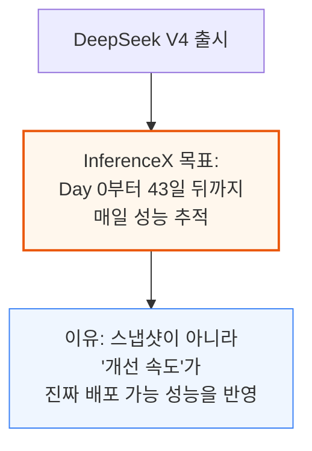

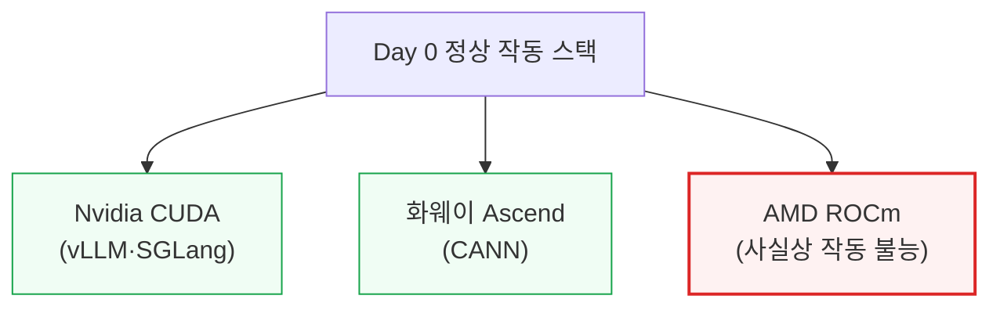

DeepSeek V3/R1이 나왔던 작년에는 Day 0에 정상 동작한 스택이 Nvidia CUDA 하나뿐이었습니다. 이번엔 화웨이 CANN까지 Day 0 지원에 성공해 스택이 2곳으로 늘었지만, AMD는 여전히 뒤처졌습니다.

GB200 NVL72로 분산 프리필 재현 실험을 하던 중 SemiAnalysis 자체 GB300 클러스터가 하필 다운됐는데, CoreWeave가 예비 GB300 NVL72 랙 2대를 긴급 지원해 이번 GB300 측정치를 확보할 수 있었습니다. 이 결과는 이후 개선 작업에도 24시간 내내 활용되고 있습니다.

또한 Nvidia의 자체 추론 엔진 TensorRT-LLM은 DeepSeek V4에서 제대로 작동하지 않아, SemiAnalysis가 직접 오픈소스 mHC 커널 실행 코드를 고쳐 패치를 제출했고, Nvidia 엔지니어들이 이를 리베이스·병합해줬습니다.
반면 ROCm은 초기 며칠간 거의 작동하지 않았으나, HaiShaw가 이끄는 AMD SGLang 엔지니어링 팀이 첫 한 달 만에 100배 이상 성능을 끌어올렸습니다 — 이 과정은 곧 발행될 별도의 "State of AMD 2026" 종합 리포트에서 더 자세히 다룰 예정입니다.

---

## 2. Day 0 처리량-반응성 곡선 개관 - 엔진별 초기 지원 현황

**📌 핵심:**
- **처리량-반응성 곡선**은 "초당 처리하는 전체 토큰 수(처리량)"와 "사용자 한 명이 체감하는 초당 토큰 수(반응성)" 사이의 트레이드오프를 보여주는 기준 그래프 — 동시 처리 요청 수(concurrency)를 늘리면 처리량은 오르지만 반응성은 떨어짐
- Nvidia CUDA에서는 **SGLang·vLLM 모두 모델 공개 즉시 네이티브 지원**을 완료 — 특히 B200·B300 같은 신형 칩은 별다른 문제 없이 공개된 레시피 그대로 작동
- 반면 **AMD SGLang·vLLM의 분산 추론은 여전히 작동하지 않음** — MI355X는 네이티브 FP4+FP8 체크포인트도 Day 0에 못 써서 성능이 떨어지는 완전 FP8 체크포인트로 대체해야 했음(H200도 동일 사례)
- 결론: 같은 "Day 0 지원"이라도 실제로는 편차가 커서, 정상 동작 여부만이 아니라 어떤 정밀도·체크포인트로 작동했는지까지 함께 봐야 진짜 성능을 알 수 있음

---

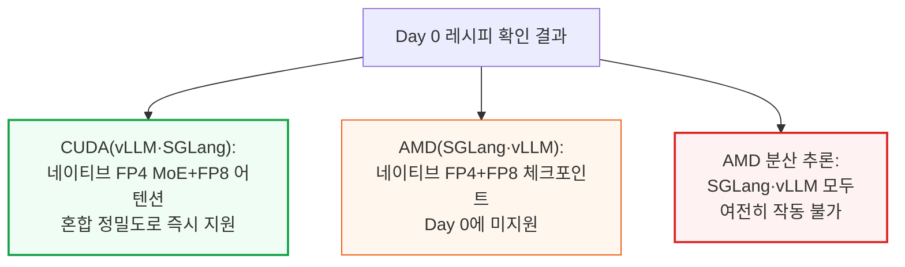

이 기사에서는 같은 하드웨어 SKU에 대해 vLLM과 SGLang 결과를 한 그래프에 같이 넣지 않습니다 — 두 오픈소스 엔진 커뮤니티 간의 소모적인 비교 논쟁(과거 한 차례 SNS에서 벌어진 설전)을 다시 촉발하지 않기 위한 조치입니다.

MI355X의 경우 네이티브 FP4+FP8 체크포인트가 Day 0에 사용 불가능했기 때문에, 상대적으로 성능이 떨어지는 완전 FP8 방식(non-native checkpoint)만 쓸 수 있었습니다 — 이는 이후 6\~7장에서 다룰 43일간의 극적인 개선폭을 이해하는 출발점이 됩니다.

---

## 3. GB200 NVL72 분산 프리필과 MTP 추론 디코딩(Day 0\~3)

**📌 핵심:**
- vLLM과 Nvidia는 **GB200 분산 추론(Dynamo vLLM) 레시피를 Day 0에 즉시 배포** — Eager 모드 프리필 + NIXL 기반 KV 캐시 전송이라는 비교적 단순한 초기 구성으로도, 낮은 반응성 구간에서 B200 대비 **최대 5배 우수한 결과**를 재현
- 이는 **CUDA 생태계 해자(moat)**를 보여주는 사례 — 최신 오픈모델이 나오면 분산 추론 지원이 Day 0 무렵부터 자연스럽게 따라붙음
- **MTP(다중 토큰 예측) 추측 디코딩**은 SGLang이 Day 3에 최초 지원 — 높은 반응성 구간에서 처리량을 크게 끌어올림
- 결론: CUDA 생태계는 신모델 공개 직후 며칠 안에 분산 추론·추측 디코딩 같은 고급 최적화 기법까지 따라붙는 반면, 다른 스택은 이 속도를 아직 따라가지 못함

---

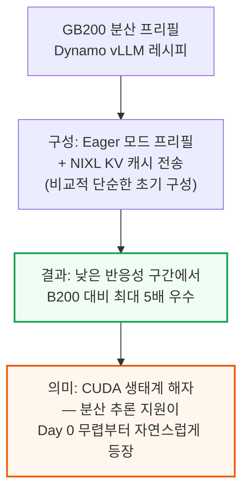

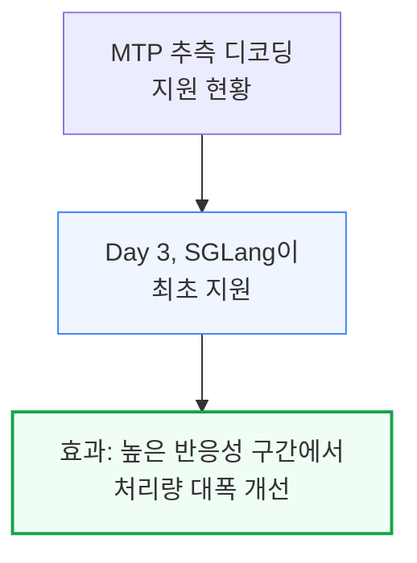

---

## 4. AMD MI355X와 ATOM 엔진의 Day 0 참사

**📌 핵심:**
- MI355X의 Day 0 결과는 **사용자당 초당 1\~2 토큰**에 불과 — 일반적인 사람의 평균 독서 속도보다도 느려 사실상 사용 불가능한 수준
- 유일하게 작동한 레시피는 AMD HaiShaw 팀이 만든 SGLang PR 기반 미완성(WIP) 버전 — 네이티브 FP4+FP8 체크포인트가 작동하지 않아 ROCm 생태계 미성숙이 원인으로 지목됨
- AMD 자체 추론 엔진 **ATOM**은 코드에 KV 캐시 슬롯이 **1개로 하드코딩**돼 있어 동시에 사용자 1명만 처리 가능(배칭 기능 자체가 미비) — AITER의 `fused_moe`가 GFX950에서 깨져 FP4 MoE를 느린 Triton 경로로 강제 우회, mHC 사전 투영도 Torch로 강제 우회되며 즉시 실행(eager execution)만 가능
- 결론: MI355X 하드웨어 자체는 동작했지만, 소프트웨어 스택(ROCm·ATOM)이 여러 겹으로 미성숙해 Day 0엔 사실상 데모 수준에 그침 — 이후 6장에서 다룰 100배 개선의 출발선이 바로 이 지점

---

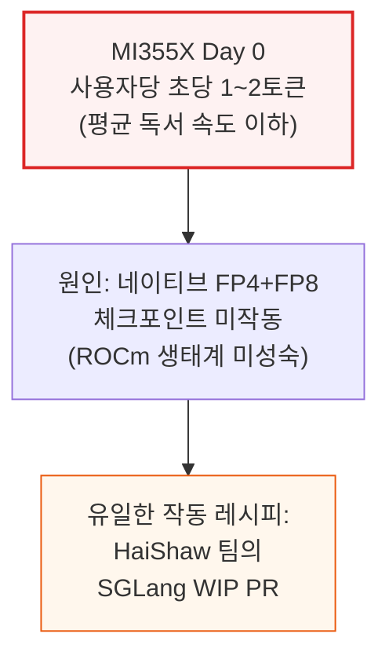

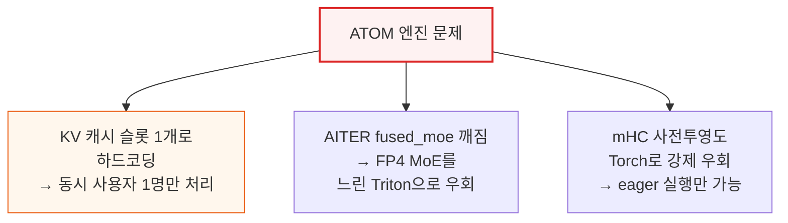

ATOM은 반응성 지표에서는 다소 나았지만, 동시 처리 1건을 넘어서면 성능이 급격히 떨어졌습니다.
`kv_cache[:1,...]`로 하드코딩된 부분 때문에 KV 캐시가 단일 시퀀스 슬롯에 고정돼, 두 번째 동시 요청이 들어와도 저장할 공간 자체가 없었습니다.
이는 배칭(여러 요청을 묶어 처리)을 가능하게 하는 인프라가 아직 갖춰지지 않았기 때문으로, 배치 크기 1(사용자 1명)만 실행할 수 있었습니다.

---

## 5. NVIDIA TensorRT-LLM 버그와 뒤늦은 Day 0 지원

**📌 핵심:**
- Nvidia 자체 추론 엔진 **TensorRT-LLM은 Day 0에 DeepSeek V4를 지원하지 못함** — 코드에 은닉 크기(hidden size)가 **4096으로 하드코딩**돼 있었는데, DeepSeek V4 Pro는 은닉 크기가 **7168**이라 가드 오류(`hidden_size=7168 not supported`)가 발생
- Nvidia 엔지니어들이 이 오류를 해결하는 대신 **가드 자체를 제거**하는 임시방편을 적용 — 그 결과 오류는 사라졌지만, 실제로는 7168 텐서가 4096으로 고정된 커널에 잘못 들어가면서 **은닉 상태가 손상되고 잘못된 출력이 생성**되는 숨은 문제가 1주일 넘게 방치됨
- SemiAnalysis가 직접 문제를 진단해 PR을 제출·병합했지만, 이 문제를 진단해 고치기까지 걸린 시간만 이미 **Day 9**에 도달 — 반면 네이티브 SGLang·vLLM은 모델 공개 당일 정상 작동
- 결론: 이 사례는 CUDA 생태계 안에서도 네이티브 오픈소스 엔진(SGLang·vLLM)이 Nvidia 자체 상용 엔진(TensorRT-LLM)이나 AMD ATOM보다 신모델 지원 속도가 훨씬 빠르다는 것을 보여줌 — ATOM은 현재 실제 프로덕션 고객이 0곳

---

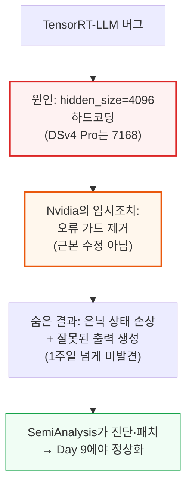

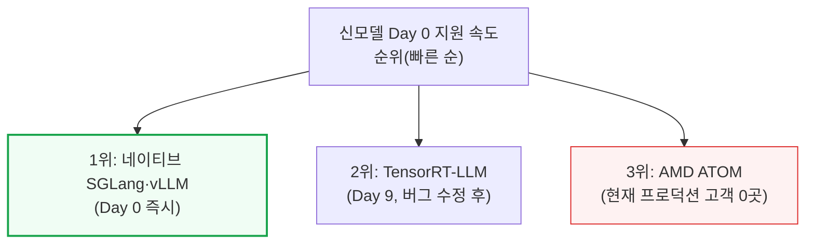

이 문제를 정확히 짚어내기까지 걸린 시간을 보면, 은닉 크기 불일치라는 비교적 단순한 문제가 발견되는 데 1주일, PR이 승인되는 데 다시 며칠이 더 걸렸다는 점이 다소 의외입니다. 현재 그래프를 보면 배치 크기가 큰 구간에서는 TRT-LLM 성능이 더 우수하지만, 반응성이 높은 구간(사용자 체감 속도가 중요한 구간)에서는 뒤처지는 경향을 보입니다.

---

## 6. 43일간의 성능 진화 - MI355X 100배 개선

**📌 핵심:**
- MI355X는 Day 0엔 겨우 작동만 하는 수준이었지만, HaiShaw가 이끄는 AMD 팀이 **1개월 이내 처리량 100배 이상 개선**을 달성 — Day 0(4월 25일 FP8 빌드)과 5월 27일(FP4 빌드)을 비교한 결과
- 개선의 대부분은 **PyTorch 폴백 경로를 실제 AITER·Triton·TileLang·FlyDSL 커널로 교체**하면서 발생 — 이 중 두 단계가 가장 큰 비중을 차지: ①Day 0 직후 첫 커밋에서 손쉬운 개선(low-hanging fruit) 다수 정리, ②FP4 가중치 MoE 작동 성공으로 전문가 가중치를 FP8에서 네이티브 FP4(MXFP4)로 전환해 대역폭 개선
- 이후 AITER mHC 커널 도입으로 **MI355X가 처음으로 낮은 반응성 구간에서 H200 성능을 추월**, ATOM 엔진도 동시 처리 1건짜리 점 하나에서 전체 프론티어로 확장(일부 구간은 H200 능가)
- 결론: 소프트웨어 성숙도가 하드웨어 잠재력을 좌우한다는 것을 보여주는 극단적 사례 — 같은 실리콘이 43일 만에 "사용 불가능"에서 "H200을 능가"하는 수준까지 도달

---

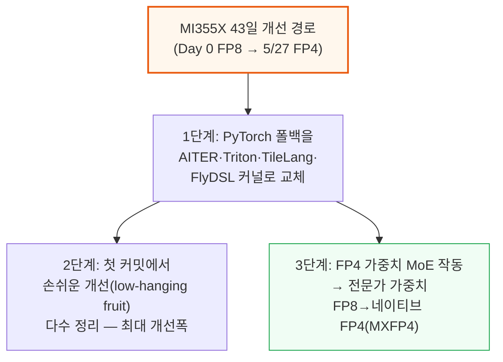

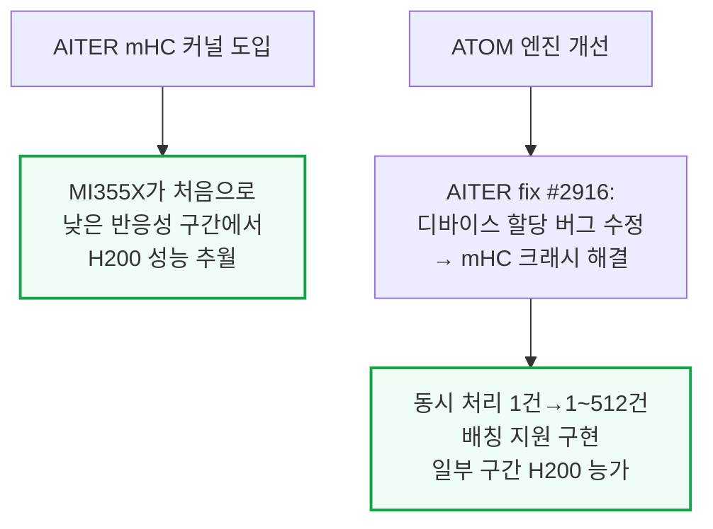

이 밖에도 SWA(윈도우드 어텐션) 준비 단계인 SWA-prepare를 Triton으로 구현해 추가 개선을 이끌어냈습니다.
5월 19일에는 남은 폴백 경로를 마저 정리(FlashMLA를 TileLang에서 Triton으로 이전, AITER FlyDSL FP4 MoE 커널 적용)했습니다.
이때 동시 처리 규모를 1,024까지 늘려 기존에 없던 고처리량·저반응성 구간의 프론티어를 새로 그려냈습니다.

### MI355X MTP

4주차에는 AMD 전 프레임워크에서 MTP(다중 토큰 예측)가 작동하기 시작해 반응성이 여러 배 개선됐습니다.
다만 한 가지 특징이 확인됐는데, MTP는 처리량이 높은(대형 배치) 구간에서는 오히려 결과가 나빠지는 경향을 보입니다.
MTP는 메모리 대역폭이 남는 소규모 배치 디코드의 여유 연산력을 활용하는 기법이라, 연산력 자체가 부족한 대형 배치 디코드에서는 초안 토큰의 이득보다 MTP 자체의 비용이 더 커지기 때문입니다.

---

## 7. B300·B200·GB300 NVL72의 성능 진화

**📌 핵심:**
- **B300(SGLang)**: DeepGEMM MegaMoE 도입으로 1주일 이내 **3배 성능 개선** — 전문가를 한 번에 몰아 처리하는(mega-dispatch) 그룹형 FP4 MoE GEMM과, EP8 대신 EP4로 튜닝을 바꾼 효과
- **B200**: B300과 유사한 성능대이며 낮은 반응성 구간에선 TRT가 우위 — 다만 TRT-LLM은 별도 설정 없이는 즉시 작동하지 않는 반면, CUDA vLLM·SGLang vLLM은 바로 작동
- **GB300 NVL72**: 6월 2일 **W4A4(MXFP4) MegaMoE** 적용으로 가장 극적인 개선 — 5월 7일 대비 개선은 커널·정밀도 변경이 아니라 **디코드 토폴로지 재설계**에서 나옴(EP=8→EP=16으로 확장, 프리필 워커를 디코드 워커당 4\~12개로 확대, 동시 처리 16,384→21,504로 확장)
- 결론: 랙 하나에 GPU 72개를 하나의 통신망으로 묶는 **광역 전문가 병렬화(Wide EP)**가 GB300의 압도적 성능을 만드는 핵심 레버 — GPU가 많을수록 전문가 가중치 로딩 비용을 더 많은 랭크에 분산(상각)할 수 있기 때문

---

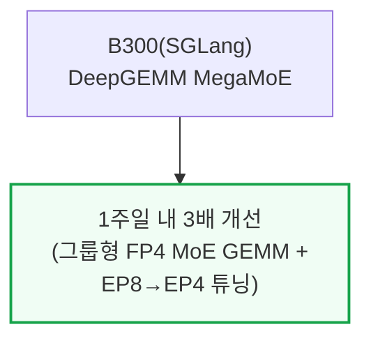

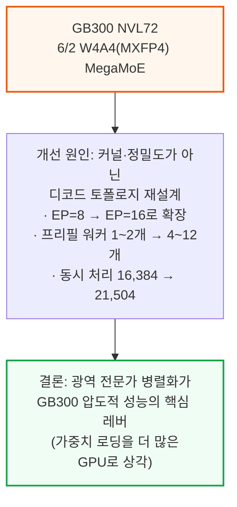

---

## 8. MW당 토큰 처리량 - 전력 효율의 진짜 척도

**📌 핵심:**
- B200(vLLM) 기준 **MW(메가와트)당 초당 토큰 처리량**이 Day 0의 약 30만 tok/s/MW에서 6월 5일 약 50만 tok/s/MW로 **약 1.7배 개선** — 사용자당 반응성 50토큰/초 기준
- B200의 유틸리티 전력 소비(all-in)는 GPU당 **2.17kW로 고정**돼 있어, 이 개선은 하드웨어가 아닌 **순수 소프트웨어 개선분**임을 의미
- MW당 토큰 처리량은 전력이 고정된 자원인 사업자에게 "투자 회수율(ROI)"을 계산하는 가장 좋은 지표 — GPU 1개당 처리량보다 더 많은 정보를 담음(전력사용효율 PUE와 데이터센터 오버헤드까지 반영)
- 결론: 처리량 프론티어를 밀어올린 것과 같은 최적화(그룹형 FP4 MoE GEMM, 넓은 EP, FP4 가중치 경로, 스케줄러 튜닝)가 유틸리티 전력이 고정된 조건에서 그대로 전력 효율 개선으로 직결됨

---

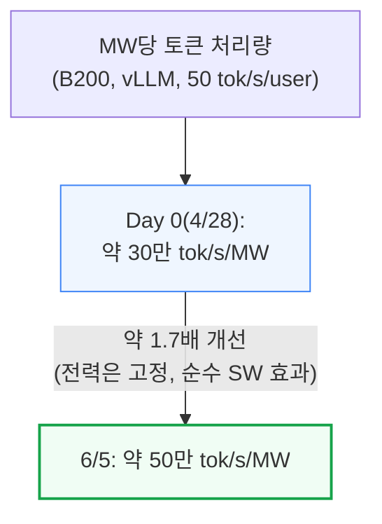

많은 조직이 추론 인프라를 "희소한 유틸리티 전력을 얼마나 많은 청구 가능 토큰으로 바꿀 수 있는가"의 관점에서 접근합니다. 이 관점에서 MW당 매출, MW당 전체 유틸리티 전력당 토큰, MW당 초기 투자(CapEx) 같은 지표가 함께 활용되며, SemiAnalysis의 Tokenomics 모델이 바로 이런 사업적 판단을 다루기 위해 설계됐습니다.

---

## 9. 2026년 6월 6일 기준 현재 성능과 ROCm vLLM 부진

**📌 핵심:**
- SGLang 기준으로 **GB300이 다른 모든 추론 시스템을 압도** — 랙 전체를 하나의 통신망으로 묶는 NVL72의 광역 스케일 장점을 그대로 보여줌
- MTP까지 적용하면 GB300은 측정된 모든 반응성 구간에서 최고 성능 — 사용자당 초당 50토큰 기준, 입력 8천·출력 1천 토큰 가정 시 **백만 출력 토큰당 비용 $0.156**까지 하락
- 반면 **ROCm vLLM은 네이티브 SGLang보다 훨씬 느리게 개선** — AMD가 실제 프로덕션 고객이 0곳인 ATOM 엔진에 재집중하면서, 정작 주요 고객사들이 쓰는 네이티브 vLLM 지원이 상대적으로 뒤처짐(비-DeepSeek V4 모델 대상 분산 추론은 최근에야 오픈소스 upstream 지원이 활성화)
- 결론: 최고 성능은 GB300 NVL72의 스케일업 도메인 크기(72GPU)에서 나오고, B200·B300(8GPU 아일랜드)은 그보다 일찍 한계에 부딪히며, MI355X는 스케일업 규모와 집단통신 스택 성숙도 모두에서 더 뒤처져 있음

---

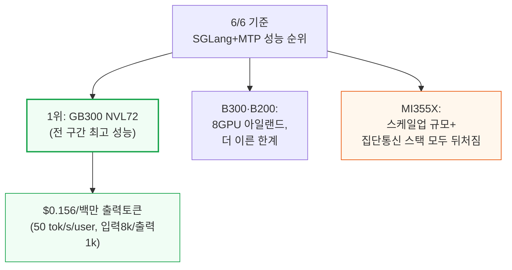

랙스케일 우위는 근본적으로 **스케일업 도메인**(같은 랙 안에서 초고속으로 직접 연결된 GPU 묶음) 크기의 문제입니다.
NVL72는 GPU 72개를 하나의 NVLink 도메인에 묶어, DeepSeek V4의 MoE 디스패치·컴바인 all-to-all 통신을 전부 NVLink 안에서 처리하고 느린 스케일아웃(랙 간) 통신망으로 새어나가지 않게 합니다.
그 결과 전문가 가중치 로딩 비용을 훨씬 많은 랭크에 상각할 수 있습니다.

### ROCm vLLM DeepSeek v4 Pro 부진

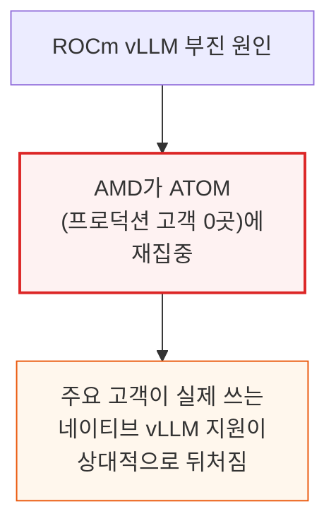

한 가지 긍정적 신호는, DeepSeek V4가 아닌 다른 모델을 대상으로는 오픈소스 upstream AMD vLLM에서 분산 추론 기능 활성화가 최근 마침내 이뤄졌다는 점입니다.
다만 여기까지 오는 데 수개월이 걸렸고, AMD vLLM 팀이 커버해야 할 영역은 여전히 많이 남아있습니다.
이 주제는 곧 발행될 "State of AMD 2026" 리포트(AMD 추론의 좋은 점·나쁜 점·아쉬운 점을 다룸)에서 더 상세히 다룰 예정입니다.

---

## 10. vLLM과 SGLang의 다음 로드맵

**📌 핵심:**
- **vLLM 로드맵**(이슈 #40902)은 5개 영역으로 구성: ①핵심 모델 지원(MegaMoE 지속 작업, NVFP4), ②런타임·병렬화(Model Runner V2, MTP 최적화, 프리필/디코드 최적화, 파이프라인 병렬화), ③커널 통합(페이지드 프리필, 고속 top-k, DeepEP V2), ④KV 캐시 오프로딩, ⑤하드웨어 지원 확대(Hopper는 완료, SM120·AMD는 남은 과제)
- **SGLang 로드맵**(이슈 #23666)은 3대 목표로 요약: 디코드용 CUDA 그래프 지원, 프리필용 조각별(piecewise) CUDA 그래프 지원, 런타임 중 가중치 재처리 제거 — mHC·HCA·CSA(인덱서 포함)·MoE 4개 구성요소별 세부 융합 작업 목록도 포함
- SemiAnalysis의 공개 **EcosystemX** 대시보드가 향후 Nvidia·AMD·TPU·Trainium·화웨이 등 모든 주요 AI 칩에 걸친 소프트웨어 진화·CI 커버리지·큐 대기시간을 시각화할 예정
- 결론: 두 엔진 모두 "커널을 더 잘게 쪼개 통신·연산을 최대한 겹치고, 가중치 준비는 스텝마다가 아니라 한 번만 하자"는 같은 방향으로 수렴 — DeepSeek V4의 mHC·CSA·HCA 같은 신규 아키텍처 요소가 여전히 최적화 여지를 많이 남기고 있음을 보여줌

---

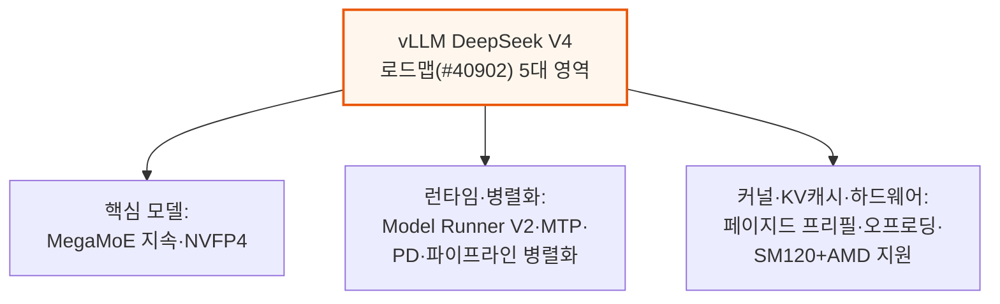

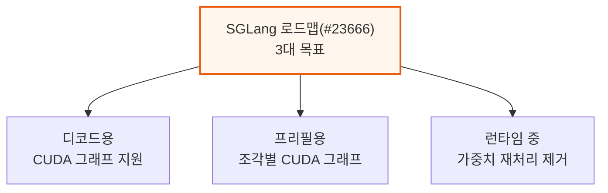

vLLM 쪽에서는 FP4 인덱서와 초기 MegaMoE 지원이 이미 구현됐고 Hopper 지원도 완료됐습니다.
SGLang 쪽은 mHC(GEMM 커널 융합), HCA(fc_qa+fc_kv 수평 융합, CUDA 그래프 호환), CSA(인덱서·압축기 직접 캐시 읽기), MoE(라우팅 경로 커널 통합) 등 컴포넌트별로 세분화된 체크리스트를 이미 상당 부분 진행 중입니다.

---

## 11. Huawei Ascend 950 - CANN 스택의 Day 0 지원

**📌 핵심:**
- DeepSeek V4는 **화웨이 Ascend에서 Day 0급 지원을 받은 최초의 주요 오픈모델** — DeepSeek 공식 API 일부도 출시 당일부터 Ascend에서 서빙됨. 작년 DeepSeek V3/R1 때는 Nvidia CUDA만 유일하게 Day 0에 작동했던 것과 대조적
- **CANN**은 2025년 8월부터 오픈소스로 전환된 화웨이의 Ascend용 AI 연산 소프트웨어 스택 — 미국 정부의 CUDA 칩 대중국 수출 규제 속에서 중국 내 개발자 생태계를 확보하려는 전략
- 화웨이는 MTP 벤치마크 특유의 함정(초안 토큰 수락률이 벤치마크와 실사용 조건에서 다르게 나타나는 문제)을 우회하기 위해, 토큰당 시간 대신 **디코드 스텝당 시간**을 측정하고 사용자가 자신의 수락 길이(AL)를 곱해 환산하도록 하는 방식을 채택
- 결론: Ascend 950(내부 코드명 "David")은 Day 0에 최적화된 추론 인프라를 실제로 선보이며 "다윗과 골리앗" 서사를 자처하지만, 엔비디아라는 골리앗은 가만히 서 있지 않고 매년 새 아키텍처를 내놓으며 계속 움직인다는 점이 진짜 관건

---

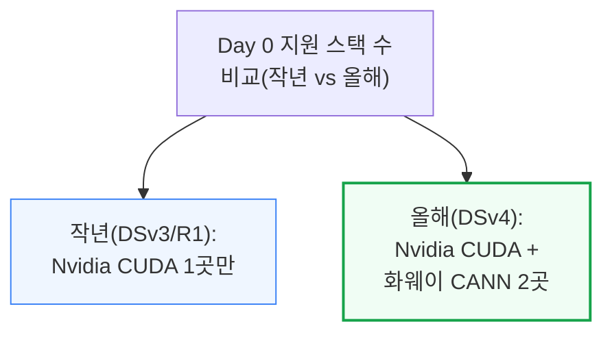

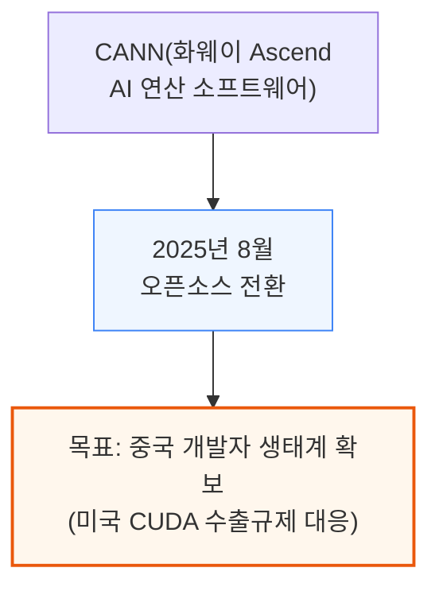

### AIC·AIV·AI CPU·CCU — Ascend 950의 칩 내부 구조

Ascend 950 칩 내부에는 역할이 분리된 4가지 연산 유닛이 있습니다.

```mermaid
flowchart TD
    Chip["Ascend 950 AI Core<br/>내부 구조"] --> AIC["AIC(AI Cube):<br/>행렬·텐서 연산<br/>(GEMM, matmul, 어텐션 투영)"]
    Chip --> AIV["AIV(AI Vector):<br/>원소별·벡터 연산<br/>(활성화함수, 정규화, 리덕션)"]
    Chip --> Other["AI CPU + CCU:<br/>제어 로직 + 통신 전담"]

    style AIC fill:#eff6ff,stroke:#3b82f6
    style AIV fill:#eff6ff,stroke:#3b82f6
    style Other fill:#f0fdf4,stroke:#16a34a
```

AIC와 AIV는 TPU의 MXU와 유사한 개념이지만, 화웨이는 이 둘을 완전히 분리된 독립 코어로 노출합니다. 각각 자체 코드를 로드할 수 있는 "듀얼 마스터 모드"를 지원해, AIV가 AIC를 메시지로 일일이 구동하는 대신 AIC·AIV가 각자 독립적으로 코드를 실행할 수 있습니다.

**AI CPU**는 기기 메모리에 직접 접근 가능한 ARM64 실행 유닛으로, 분기가 많은 제어 로직·스칼라 연산·동적 셰이프 처리처럼 SIMD/SIMT 코어에 잘 맞지 않는 작업을 처리합니다. 이 작업을 호스트 CPU로 왕복시키지 않고 기기 내부에서 처리할 수 있어, 지연시간과 파이프라인 버블(대기 공백)의 주요 원인을 줄입니다.

**CCU(통신 전담 엔진)**는 TPU·Trainium처럼 Ascend 950에도 탑재된 전용 집단통신 엔진으로, 원격 읽기+리듀스+로컬 쓰기, 로컬 읽기+원격 쓰기 같은 작업을 연산 코어의 계산 능력을 소모하지 않고 처리합니다. 통신 지연시간 감소, HBM 트래픽 감소, 사용자 버퍼 복사 감소, 연산 코어의 통신 오케스트레이션 부담 해소라는 효과가 있습니다.

### 950PR vs 950DT — 프리필용과 디코드용 두 변형

```mermaid
flowchart TD
    Ascend950["Ascend 950<br/>(동일 다이 기반<br/>듀얼다이 UMA 아키텍처)"] --> PR["950PR<br/>(Prefill/Recommendation)<br/>저비용·높은 비용대비성능"]
    Ascend950 --> DT["950DT<br/>(Decode/Training)<br/>고대역폭·고성능,<br/>다른 메모리 패키징"]

    style PR fill:#eff6ff,stroke:#3b82f6
    style DT fill:#fff7ed,stroke:#ea580c,stroke-width:2px
```

### 950DT 디코드 스텝 프로파일 - 스트림 분리와 MC²

DeepSeek Flash V4를 950DT에서 16랭크 DP/EP(데이터·전문가 병렬화) 구성으로 프로파일링한 결과, 16랭크가 동시에 참여하고 MoE 디스패치·컴바인 트래픽이 활발한 것으로 나타났습니다.
CANN은 큐브(AIC)·벡터(AIV) 코어 배분을 조절해 자원 경합을 피하는 방식으로, 독립된 연산·통신 오퍼레이터를 여러 스트림에서 동시 실행합니다.
Prolog·Compressor·LightningIndexer 오퍼레이터는 서로 겹쳐 실행할 수 있고, C4A Compressor는 완전히 숨길 수 있으며, 공유 전문가(shared expert) 연산은 라우팅 전문가(routed expert) 실행 성능을 깎지 않고 그 밑에 숨길 수 있습니다.

디코드 스텝을 세부적으로 들여다보면, 메타데이터 스트림(스트림 145\~148)이 디코드 패스당 한 번씩 실행되며 이후 커널이 재사용할 값 의존적 스케줄러·타일링 메타데이터를 미리 계산합니다. 이 오퍼레이터들은 디코드 스텝에서 유일하게 AI CPU에서 실행되는 연산이며, 전체 시간에서 차지하는 비중은 극히 작고 AI Core 연산과 완전히 겹쳐 실행됩니다.

DeepSeek V4에서 화웨이는 희소 어텐션과 LightningIndexer의 값 의존적 스케줄러 단계를 호스트로 되돌리지 않고 **AI CPU로 옮겼습니다**.
이 메타데이터 오퍼레이터들은 런타임 시퀀스 길이·마스크·페이지드 KV 정보로부터 재사용 가능한 코어별 파티셔닝 텐서를 만듭니다.
`SparseAttnSharedkv`와 `QuantLightningIndexer`가 이를 활용해 각 큐브 코어가 처리할 배치/헤드/Q블록/K블록 작업을 결정합니다.
이는 개념적으로 FlashInfer가 호스트에서 수행하는 페이지드 어텐션 계획(planning) 단계와 비슷하지만, 화웨이는 같은 계획 작업을 호스트 대신 기기 내 AI CPU에서 처리한다는 차이가 있습니다.

또한 CANN은 2024년부터 **MC²(병합 연산-통신)**라는 오퍼레이터 클래스를 도입했습니다 — 일반 커널도 HCCL 집단통신도 아닌, 통신과 연산을 하나의 커널에 결합한 방식입니다. DeepSeek V4 디코드에서는 `MoeDistributeDispatchV2`, `MoeDistributeCombineV2`라는 MC² EP 오퍼레이터가 사용됩니다.

핵심은 화웨이 Ascend가 DeepSeek V4에 대해 Day 0부터 실제로 작동하는 최적화된 추론 인프라를 제공했다는 점입니다.
다만 성경 속 다윗과 골리앗 이야기의 결말은 거인이 쓰러지는 것이지만, 그 골리앗은 가만히 서서 돌팔매를 맞아준 반면, 엔비디아라는 골리앗은 해마다 새로운 아키텍처를 내놓으며 끊임없이 움직입니다.
화웨이가 Day 0에 돌팔매를 던질 수 있다는 것은 증명했지만, 움직이는 거인을 실제로 쓰러뜨릴 수 있을지는 아직 지켜봐야 합니다.

---

## 12. DeepSeek V4 아키텍처 딥다이브 - CSA·HCA와 MegaMoE

**📌 핵심:**
- DeepSeek V4는 기존의 **MLA(다중헤드 잠재 어텐션)를 버리고 CSA·HCA**라는 새 압축 어텐션 방식을 도입 — 목적은 오직 하나, **KV 캐시(대화 기억 저장 공간) 크기 축소**
- **HCA**는 KV 임베딩의 슬라이딩 윈도우와, 128개 토큰(m′=128)마다 키/값을 하나로 압축한 압축 KV 항목 집합으로 구성. **CSA**는 압축률이 더 낮고(m=4) 라이트닝 인덱서로 주목할 토큰을 선별하는 희소 어텐션까지 결합 — 두 방식을 교차 배치해 **1M 컨텍스트 길이에서 KV 캐시를 50배 축소**
- 새로 도입한 **MegaMoE** 융합 커널은 전문가를 여러 웨이브로 나눠 각각 별도로 스케줄링, 통신·연산 겹침을 더 세밀하게 만들어 **이론상 naive 커널 대비 1.92배 속도 향상**(다시 말해 naive 커널은 시간의 거의 절반을 디스패치·컴바인 통신에 소모한다는 뜻)
- 결론: DeepSeek V4는 훈련 안정성을 위한 **결정론적 연산**(배치 크기와 무관하게 항상 같은 리덕션 순서를 강제하는 커스텀 커널)까지 도입 — 성능 손실을 감수하면서도 재현 가능한 RL 훈련·장애 복구를 우선한 설계 철학을 보여줌

---

```mermaid
flowchart TD
    Attn["DeepSeek V4<br/>어텐션 방식 전환"] --> Old["기존: MLA<br/>(다중헤드 잠재 어텐션)"]
    Attn --> New["신규: CSA + HCA<br/>(KV 캐시 크기 축소 목적)"]
    New --> Result["1M 컨텍스트 길이에서<br/>KV 캐시 50배 축소"]

    style New fill:#fff7ed,stroke:#ea580c,stroke-width:2px
    style Result fill:#f0fdf4,stroke:#16a34a,stroke-width:2px
```

```mermaid
flowchart TD
    Compress["압축 방식 비교"] --> HCA["HCA: 슬라이딩 윈도우 +<br/>128토큰(m'=128)마다<br/>키/값 1개로 압축"]
    Compress --> CSA["CSA: 압축률 더 낮음(m=4) +<br/>라이트닝 인덱서로<br/>희소 어텐션 결합"]

    style HCA fill:#eff6ff,stroke:#3b82f6
    style CSA fill:#eff6ff,stroke:#3b82f6
```

다만 CSA·HCA의 새로운 방식은 서빙 프레임워크에 KV 캐시 관리 난제도 함께 안겨줍니다.
예를 들어 vLLM의 KV 캐시 메모리 할당기는 CSA·HCA 두 압축률을 모두 나눠떨어지게 하는 논리적 블록 크기 설정이 필요합니다.
또한 KV 캐시·압축기 상태·인덱서 KV처럼 항목별로 크기가 제각각인 데이터를 저장할 때 메모리 파편화를 막는 페이지 크기 버킷 전략 등 복잡한 대응도 요구됩니다.

### 결정론적 연산 - RL 훈련 안정성을 위한 설계

```mermaid
flowchart TD
    Determinism["결정론적 연산<br/>(RL 훈련 안정성 목적)"] --> Kernel["배치 불변(batch-invariant)<br/>커스텀 커널<br/>(배치 크기 무관 동일 리덕션 순서)"]
    Kernel --> Cost["성능 손실 발생<br/>(많은 알고리즘 기법 사용 불가)"]
    Kernel --> Mitigate["완화책: 워크로드 맞춤<br/>커널 특화(행렬 형태별)"]
    Determinism --> Rollout["롤아웃 인프라:<br/>토큰 단위 write-ahead 로그<br/>→ 중단된 요청도<br/>재계산 없이 재개 가능"]

    style Kernel fill:#fff7ed,stroke:#ea580c
    style Rollout fill:#f0fdf4,stroke:#16a34a
```

### MegaMoE - 통신을 숨기는 융합 커널

```mermaid
flowchart TD
    MoEBase["기존 MoE 실행 구조<br/>(디스패치→L1→활성화→L2→컴바인)"] --> Issue["문제: 디스패치+L1,<br/>컴바인+L2는 겹치지만<br/>연산 경계마다 전체 동기화 필요"]
    Issue --> MegaMoE["MegaMoE 해법:<br/>전문가를 웨이브로 분할<br/>웨이브별 개별 스케줄링"]
    MegaMoE --> Gain["결과: naive 커널 대비<br/>이론상 1.92배 속도 향상<br/>(naive는 통신에 시간 절반 소모)"]

    style Issue fill:#fef2f2,stroke:#dc2626
    style Gain fill:#f0fdf4,stroke:#16a34a,stroke-width:2px
```

MegaMoE는 연산 커널과 그에 딸린 통신 커널을 잘게 쪼개 파이프라인처럼 겹쳐 실행함으로써 통신 지연시간을 숨기는 분산 GEMM 같은 컴퓨트-통신 융합 기법과 같은 계열입니다.

---

## 13. GB200 vs H200 비용 비교와 결론

**📌 핵심:**
- 일반적인 DeepSeek V4 Pro 서빙 구간인 사용자당 초당 **40\~60토큰** 반응성 기준, **GB200 NVL72가 H200 대비 백만 토큰당 비용이 10배 이상 저렴**
- 그 이유는 NVL72의 백플레인이 **72개 GPU를 B200의 InfiniBand 대비 18배 빠른 속도**로 연결하기 때문 — 이 대역폭 우위 덕분에 광역 전문가 병렬화(Wide EP) 같은 최적화 기법을 쓸 수 있게 됨
- 랙 하나에 GPU를 더 많이, 더 빠르게 묶을수록 전문가 가중치 로딩 비용을 더 넓게 상각할 수 있다는 원리가, 6\~9장에서 확인한 GB300의 압도적 성능·비용 우위로 그대로 이어짐
- 결론: DeepSeek V4의 43일 성능 진화는 "어떤 칩이 스펙상 가장 빠른가"보다 "어떤 생태계가 신모델 출시 직후 가장 빠르게 소프트웨어를 성숙시키는가"가 실제 배포 가능 성능을 좌우한다는 것을 보여줌 — Nvidia CUDA·화웨이 CANN이 Day 0부터 앞서갔고, AMD ROCm은 43일 만에 그 격차를 상당 부분 좁혔지만 여전히 추격 중

---

```mermaid
flowchart TD
    Cost["백만 토큰당 비용<br/>(40~60 tok/s/user 구간)"] --> H200["H200: 기준"]
    Cost --> GB200["GB200 NVL72:<br/>10배 이상 저렴"]
    GB200 --> Reason["이유: NVL 백플레인이<br/>InfiniBand 대비 18배 빠름<br/>→ 광역 전문가 병렬화 가능"]

    style GB200 fill:#f0fdf4,stroke:#16a34a,stroke-width:2px
    style Reason fill:#fff7ed,stroke:#ea580c,stroke-width:2px
```

```mermaid
flowchart TD
    Summary["DeepSeek V4 43일<br/>성능 진화 종합"] --> Take1["Day 0 승자:<br/>Nvidia CUDA + 화웨이 CANN"]
    Summary --> Take2["43일간 최대 반전:<br/>AMD MI355X 100배 개선"]
    Summary --> Take3["최종 결론: 배포 가능 성능은<br/>스펙이 아니라<br/>SW 성숙 속도가 좌우"]

    style Take2 fill:#fff7ed,stroke:#ea580c,stroke-width:2px
    style Take3 fill:#f0fdf4,stroke:#16a34a,stroke-width:2px
```

랙 스케일 우위를 실제 배치 가능한 서빙 용량으로 바꾸는 데는 별도의 질문이 하나 더 남습니다 — 결국 각 SKU가 실제로 얼마나 많이 온라인 상태로 배치돼 있는지(분기별 SKU별 출하량·평균판매가격, 고객사별 설치 기반과 실효 FLOPS)이며, 이는 SemiAnalysis의 Accelerator & HBM 모델에서 별도로 추적하는 영역입니다.

---

*작성 진행률: 100% 완료*
*업데이트: 12\~13장(DeepSeek V4 아키텍처 딥다이브 - CSA·HCA·MegaMoE·결정론적 연산, GB200 vs H200 비용 비교와 결론) 작성 완료 — 전체 13개 섹션 작성 마무리*
