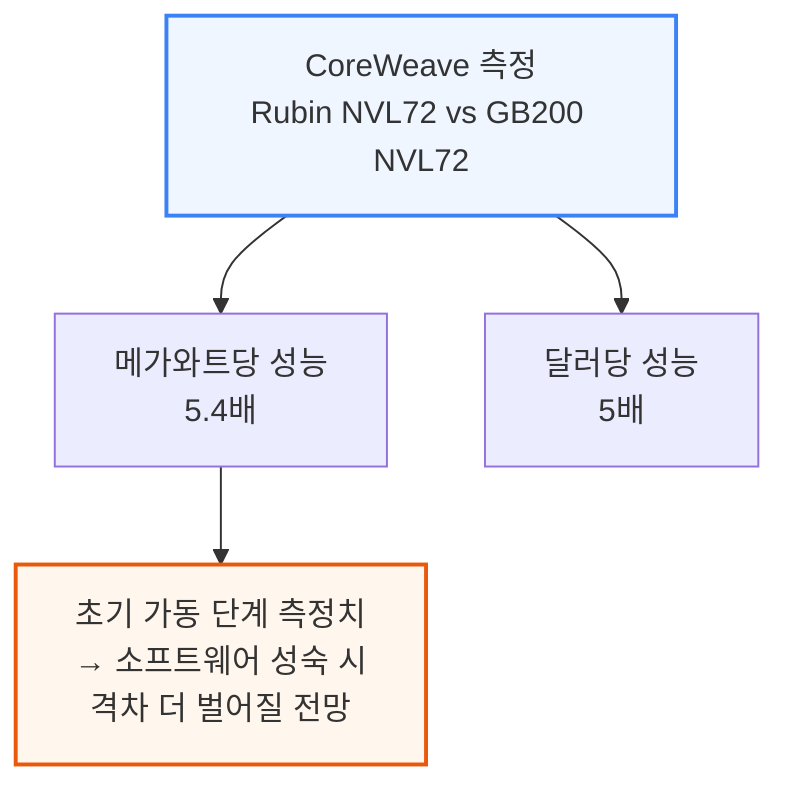
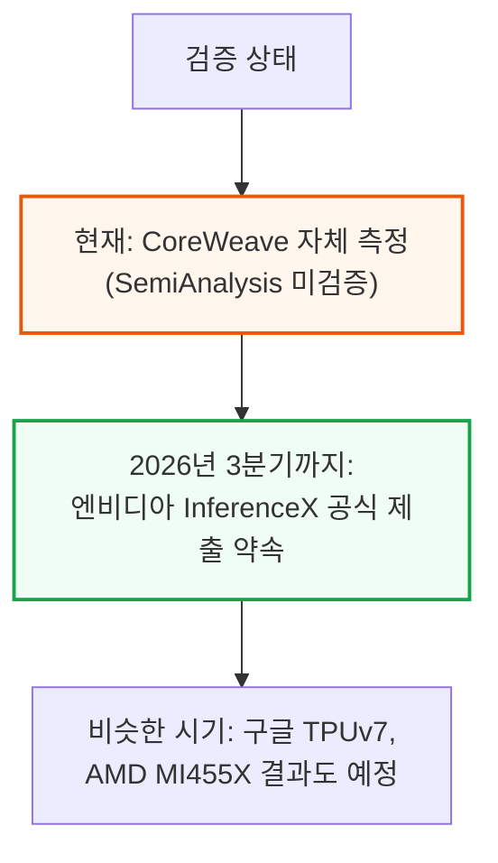
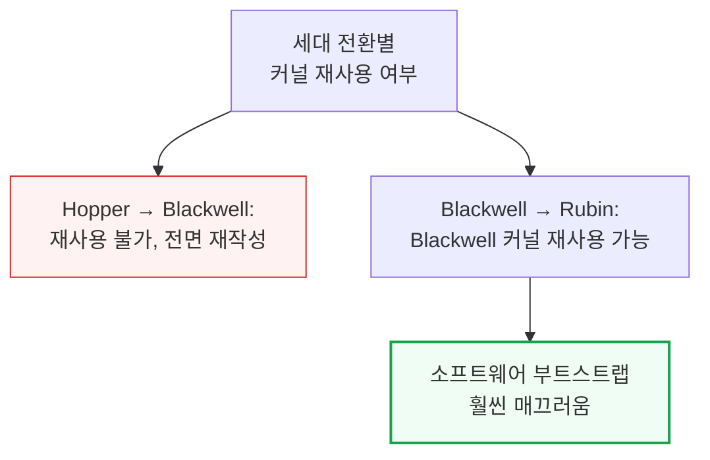
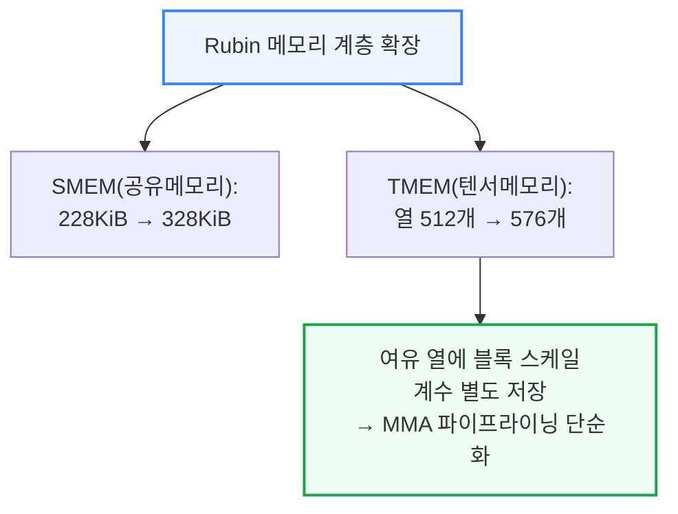
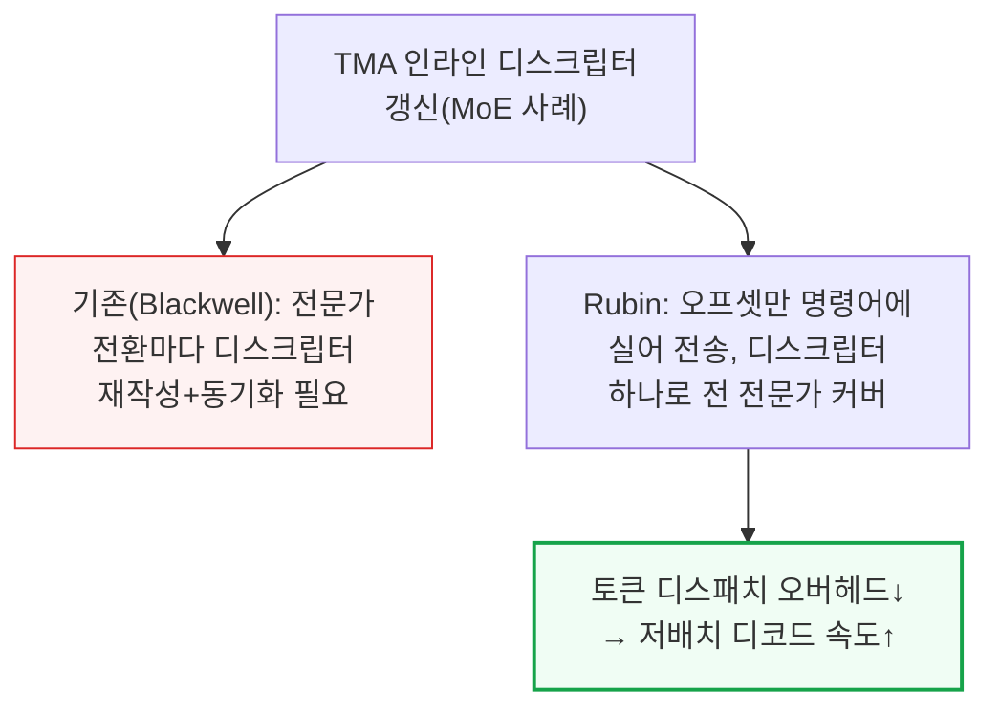
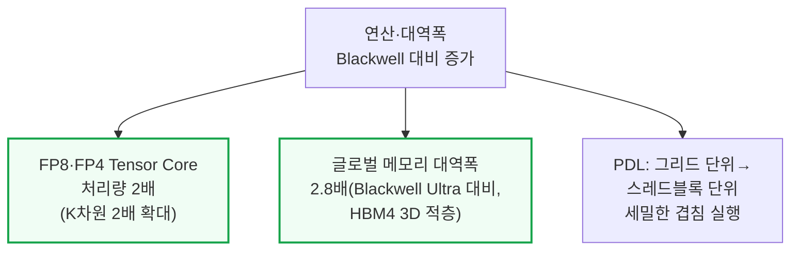
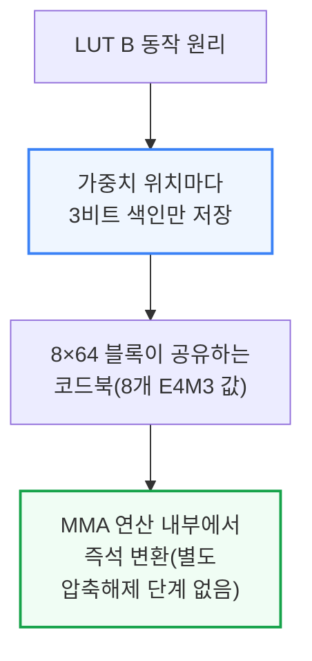
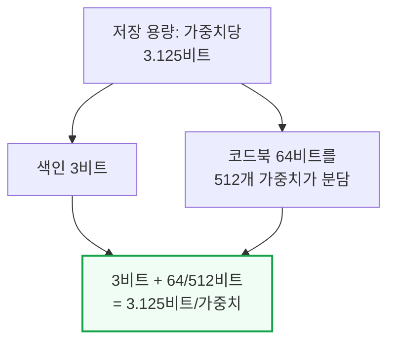
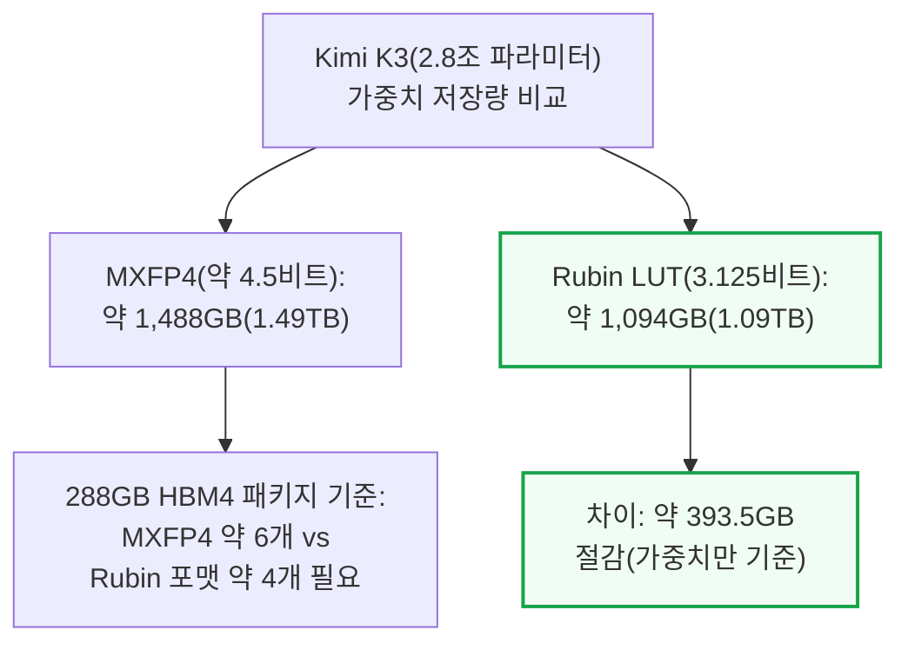
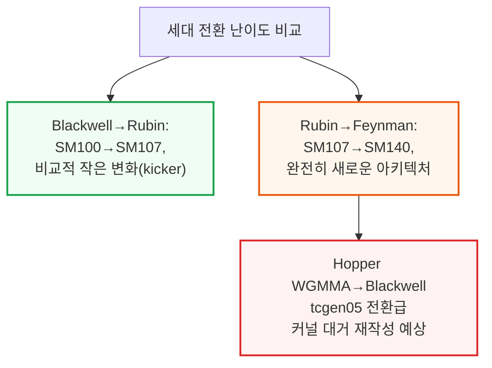

# Vera Rubin NVL72 vs GB200 NVL72? Inference TCO & Architecture Analysis

> **출처**: [SemiAnalysis Newsletter](https://newsletter.semianalysis.com/p/vera-rubin-nvl72-vs-gb200-nvl72-inference)
> **저자**: Alec Ibarra, Bryan Shan, Daniel Nishball
> **발행일**: 2026-07-23

---

## 📑 목차

### 전체 섹션
 1. [개요 - Vera Rubin NVL72 추론 성능 클레임과 검증 현황](#1-개요---vera-rubin-nvl72-추론-성능-클레임과-검증-현황)
 2. [Rubin 칩 마이크로아키텍처 주요 변화](#2-rubin-칩-마이크로아키텍처-주요-변화)
 3. [LUT B - 3비트 룩업테이블 가중치 압축](#3-lut-b---3비트-룩업테이블-가중치-압축)
 4. [Feynman(SM_140) 아키텍처 미리보기](#4-feynmansm_140-아키텍처-미리보기)
 5. [CoreWeave 벤치마크의 숨은 전제 5가지](#5-coreweave-벤치마크의-숨은-전제-5가지)
 6. [Rubin vs Blackwell 성능/MW(메가와트당 처리량)](#6-rubin-vs-blackwell-성능mw메가와트당-처리량)
 7. [Rubin vs Blackwell 성능/TCO(토큰당 비용)](#7-rubin-vs-blackwell-성능tco토큰당-비용)
 8. [Rubin vs MI355X 분리형 서빙 성능 비교](#8-rubin-vs-mi355x-분리형-서빙-성능-비교)
 9. [Rubin 소프트웨어 생태계 - PyTorch·vLLM·Triton·Dynamo](#9-rubin-소프트웨어-생태계---pytorchvllmtritondynamo)
10. [VR NVL72 전력 예산과 BOM - 원차트 프레임워크](#10-vr-nvl72-전력-예산과-bom---원차트-프레임워크)

---

## 🔑 용어 정리

본문을 순서대로 읽기 전에 알아두면 좋은 용어들입니다. 자세한 수치와 설명은 본문에서 처음 등장하는 위치에 나옵니다.

- **LUT B (룩업테이블 기반 가중치 압축)**: 가중치 값을 통째로 저장하는 대신, 미리 정해둔 8개 후보값(코드북) 중 하나를 가리키는 3비트 색인만 저장해두고, 실제 곱셈 순간에 Tensor Core가 색인을 값으로 즉석 변환하는 방식
- **SM_107·SM_140 (Rubin·Feynman 아키텍처 코드네임)**: 엔비디아가 GPU 세대마다 붙이는 내부 아키텍처 번호 — Rubin은 SM_107(Blackwell의 개선판 성격), Feynman은 SM_140(완전히 새로운 세대)
- **분리형 서빙(PD Disagg, Prefill-Decode Disaggregation)**: 추론의 입력 처리 단계(프리필)와 출력 생성 단계(디코드)를 서로 다른 GPU 묶음에 나눠 맡기는 방식
- **파레토 프론티어(Pareto Frontier)**: 응답 속도와 처리량이라는 두 목표를 동시에 만족시키는 최적의 경계선 — 같은 하드웨어라도 설정을 바꾸면 이 경계선 위의 다른 지점으로 이동하며, 어느 시스템이 이 경계선에서 더 멀리(더 빠르고 더 저렴하게) 도달하는지가 성능 비교의 핵심
- **TCO(Total Cost of Ownership, 총소유비용)**: 칩 구매 비용뿐 아니라 전력·냉각·유지보수까지 합친 실제 운영 비용
- **BOM(Bill of Materials, 부품 명세)**: 장비 하나를 구성하는 모든 부품과 각 부품의 원가를 항목별로 나열한 명세서
- **원차트 프레임워크(One Chart to Rule Them All)**: GPU 임대료의 적정 범위를 "이 밑으로 받으면 임대업체가 손해(원가 기반 하한)"와 "이 위로 받으면 고객이 구형 카드로 갈아탐(가치 기반 상한)" 두 선 사이로 표시하는 SemiAnalysis의 가격 분석 틀

---

## 1. 개요 - Vera Rubin NVL72 추론 성능 클레임과 검증 현황

**📌 핵심:**
- 엔지니어링 샘플 단계의 Vera Rubin NVL72가 DeepSeek R1을 돌렸을 때 **GB200 NVL72 대비 메가와트당 성능 5.4배, 달러당 성능 5배**를 기록 — Rubin은 아직 초기 가동 단계라 이 격차는 소프트웨어가 성숙할수록 더 벌어질 전망(과거 Blackwell도 출시 초기 대비 소프트웨어 성숙 후 성능이 크게 개선된 전례가 있음)
- 이 수치는 **CoreWeave가 측정한 결과이며 SemiAnalysis가 독립적으로 검증한 것은 아님** — 엔비디아는 2026년 3분기까지 InferenceX(제3자 검증 벤치마크)에 공식 수치를 제출하기로 약속했고, 구글 TPUv7·AMD MI455X도 비슷한 시기에 결과를 낼 예정이라 조만간 여러 시스템을 객관적으로 비교할 수 있게 됨
- Rubin은 엔비디아의 첫 공개 소프트웨어 스택(CUDA13.4, SM_107)을 이미 PyTorch·vLLM·Triton Compiler에 업스트림 완료 — **Blackwell은 이전 세대(Hopper)의 커널을 하나도 재사용하지 못해 처음부터 다시 짜야 했지만, Rubin은 Blackwell의 커널을 그대로 재사용 가능**해 소프트웨어 부트스트랩이 훨씬 매끄러움
- 결론: Rubin은 케이블 없는 컴퓨트 트레이 설계와 Blackwell 구리 백플레인에서 얻은 경험 덕분에 양산 램프업도 더 빠를 전망 — 이번 리포트는 이 claim들을 항목별로 뜯어보고, Rubin이 확실히 앞서는 지점과 격차가 좁은 지점을 구분한다

---

---

## 2. Rubin 칩 마이크로아키텍처 주요 변화

**📌 핵심:**
- Rubin은 Blackwell SM100 계열 커널(DeepGEMM·FlashMLA·CUTLASS 등)을 그대로 돌릴 수 있어, **Hopper→Blackwell 전환(커널 전면 재작성 필요) 때보다 이식 부담이 훨씬 작음** — 다만 이론상 최고 성능(Speed of Light)을 뽑으려면 결국 Rubin 전용으로 커널을 재조정해야 함
- 메모리 계층이 확장 — **공유메모리(SMEM)가 Blackwell 228KiB에서 328KiB로, 텐서메모리(TMEM)가 열(column) 수 512개에서 576개로 늘어 256KiB에서 [정정: 열 증가분만큼] 커짐** — TMEM 여유 공간에 블록 스케일 계수를 별도로 얹을 수 있어, MMA 행렬과 스케일 계수를 매번 정교하게 맞물리게 파이프라인할 필요가 없어짐(커널 작성 난도 하락)
- **TMA(비동기 메모리 전송)가 인라인 디스크립터 갱신을 지원** — MoE(전문가 혼합) 레이어처럼 전문가마다 가중치가 HBM의 다른 주소에 있는 경우, 기존에는 전문가를 바꿀 때마다 디스크립터를 메모리에 다시 써넣고 동기화해야 했는데, Rubin은 오프셋만 명령어에 실어 보내 디스크립터 하나로 모든 전문가를 커버 — 토큰 디스패치 오버헤드가 줄어 저배치 디코드 속도가 향상
- 결론: FP8·FP4 Tensor Core 처리량이 K차원(내적 연산 폭)을 2배로 늘려 **Blackwell 대비 2배**가 됐고, HBM4 3차원 적층으로 **글로벌 메모리 대역폭이 Blackwell Ultra 대비 2.8배**로 확대 — PDL(프로그램형 종속 실행)도 그리드 단위가 아닌 스레드블록 단위로 세밀하게 겹쳐 실행할 수 있게 개선됨

---

**📌 용어 풀이: SMEM·TMEM·UE5M3·2:4 스파시티**
> - **SMEM(공유메모리)과 TMEM(텐서메모리)**: 둘 다 GPU 칩 내부, HBM보다 훨씬 가까운 곳에 있는 초고속 임시 저장 공간 — SMEM은 스레드블록이 공유하는 범용 스크래치패드, TMEM은 Tensor Core 연산(MMA) 전용 저장소
> - **UE5M3(8비트 블록 스케일 포맷)**: 가중치를 압축할 때 그룹 단위로 곱해주는 "스케일 계수"의 숫자 표현 방식 중 하나 — Blackwell은 UE4M3/UE8M0만 지원했는데 Rubin은 UE5M3도 추가 지원해 표현 범위가 넓어져 일부 상황에서 양자화 오차가 줄어듦
> - **2:4 스파시티(활성화 값 대상)**: 값 4개 중 2개를 정규적인 패턴으로 솎아내(0으로 만들어) Tensor Core가 나머지 2개만 계산하게 해 처리 속도를 2배로 높이는 기법 — 기존에는 가중치에만 적용돼 재학습이 필요했지만, Rubin은 활성화 값에 실시간 적용해 재학습이 필요 없음. 다만 엔비디아가 정확도 데이터를 공개하지 않았고 CoreWeave의 실측치에도 아직 적용되지 않아, 현재는 "실리콘은 있지만 다듬어진 커널은 없는" 기능

---

## 3. LUT B - 3비트 룩업테이블 가중치 압축

**📌 핵심:**
- LUT B는 Tensor Core의 새 연산 모드로, 가중치 값을 통째로 저장하는 대신 **가중치 위치마다 3비트 색인만 저장**하고, 그 색인이 가리키는 실제 값(E4M3 형식)은 8×64 블록이 공유하는 룩업테이블(코드북)에 미리 넣어둠 — 예를 들어 저장된 색인이 5면 Tensor Core가 그 블록 코드북의 5번 항목을 가중치로 사용, 별도 압축 해제 단계 없이 곱셈(MMA) 내부에서 즉석 변환
- 코드북은 균등한 간격일 필요가 없어 **가중치가 몰린 구간엔 촘촘하게, 드문 구간엔 듬성듬성 배치 가능** — 저장 비트당 정확도를 끌어올릴 잠재력이 있지만, 자동으로 MXFP4·NVFP4보다 정확한 것은 아니며 코드북 하나를 512개 가중치가 공유(NVFP4는 16개 단위로 스케일 조정)하므로 실제 결과는 코드북 산출 알고리즘과 보정 데이터 품질에 좌우됨
- 저장 용량은 **가중치당 3.125비트**(색인 3비트 + 512개 가중치가 나눠 쓰는 64비트 코드북) — 코드북도 인덱스와 함께 HBM에 저장되므로 이 수치가 전체 저장 용량
- 결론: **Kimi K3(2.8조 파라미터) 예시로 계산하면**, 약 4.5비트/가중치인 MXFP4는 가중치만 약 1,488GB(1.49TB)를 차지하는 반면, 3.125비트/가중치인 Rubin LUT 포맷은 약 1,094GB(1.09TB)로 약 393.5GB 절감(KV캐시·활성화값·병렬화 중복은 제외한 순수 가중치 기준) — 288GB짜리 HBM4 패키지 기준 가중치만 담는 데 NVFP4는 약 6개, Rubin 신규 포맷은 약 4개 패키지가 필요해 저비용 서버당 배치 밀도가 높아짐

---

**📌 용어 풀이: LUT B가 절감을 가져오는 이유**
> - 저배치 디코드 단계는 GPU가 가중치를 HBM에서 얼마나 빨리 읽어오는지(메모리 대역폭)가 속도를 좌우 — 가중치당 비트 수가 줄면 같은 대역폭으로 더 많은 가중치를 읽을 수 있어 디코드 처리량이 올라감
> - 비균등 코드북은 가중치가 몰린 구간을 더 세밀하게 표현할 수 있어, 같은 저장 비트 수로도 균등 반올림 방식(MXFP4 등)보다 정확도를 더 잘 지킬 수 있음
> - 가중치를 옮기는 데 드는 비트 수가 줄면 메모리 시스템이 전력을 덜 쓰므로, 연산(FLOP) 하나당 전력 효율도 개선될 것으로 기대됨(다만 엔비디아 공식 정확도 데이터는 아직 없음)

---

## 4. Feynman(SM_140) 아키텍처 미리보기

**📌 핵심:**
- Blackwell(SM100/Blackwell Ultra)에서 Rubin(SM107)으로의 전환은 마이크로아키텍처 관점에서 상대적으로 작은 변화라 **Rubin은 "Blackwell 개선판(kicker)"에 가까움** — 반면 **Feynman(SM_140)은 완전히 새로운 아키텍처 계열**이라, Rubin에서 Feynman으로 넘어갈 때는 Hopper WGMMA에서 Blackwell tcgen05로 넘어갈 때처럼 커널을 대거 다시 짜야 할 전망
- Feynman의 3D 적층 방식은 AMD가 MI300X(CDNA3)부터 이어온 3D 적층 접근과 유사한 방향
- 결론: Feynman은 **스파시티(희소성)를 인식하는 데이터 이동 연산**을 새로 도입 — 희소 GEMM(행렬곱)에서 불필요한 로드·스토어·곱셈-누산(FMA)을 건너뛰어 성능을 높이는 데 쓰일 전망

---

---

*작성 진행률: 약 35% 완료*
*업데이트: 헤더·목차·용어정리 및 1~4장(개요, 칩 마이크로아키텍처, LUT B, Feynman) 작성 완료*
