# Vera Rubin NVL72 vs GB200 NVL72? Inference TCO & Architecture Analysis

> **출처**: [SemiAnalysis Newsletter](https://newsletter.semianalysis.com/p/vera-rubin-nvl72-vs-gb200-nvl72-inference)
> **저자**: Alec Ibarra, Bryan Shan, Daniel Nishball
> **발행일**: 2026-07-23

---

## 📑 목차

### 전체 섹션
 1. [개요 - Vera Rubin NVL72 추론 성능 클레임과 검증 현황](#1-개요---vera-rubin-nvl72-추론-성능-클레임과-검증-현황)
 2. [Rubin 칩 마이크로아키텍처 주요 변화](#2-rubin-칩-마이크로아키텍처-주요-변화)
 3. [LUT B - 3비트 룩업테이블 가중치 압축](#3-lut-b---3비트-룩업테이블-가중치-압축)
 4. [Feynman(SM_140) 아키텍처 미리보기](#4-feynmansm_140-아키텍처-미리보기)
 5. [CoreWeave 벤치마크의 숨은 전제 5가지](#5-coreweave-벤치마크의-숨은-전제-5가지)
 6. [Rubin vs Blackwell 성능/MW(메가와트당 처리량)](#6-rubin-vs-blackwell-성능mw메가와트당-처리량)
 7. [Rubin vs Blackwell 성능/TCO(토큰당 비용)](#7-rubin-vs-blackwell-성능tco토큰당-비용)
 8. [Rubin vs MI355X 분리형 서빙 성능 비교](#8-rubin-vs-mi355x-분리형-서빙-성능-비교)
 9. [Rubin 소프트웨어 생태계 - PyTorch·vLLM·Triton·Dynamo](#9-rubin-소프트웨어-생태계---pytorchvllmtritondynamo)
10. [VR NVL72 전력 예산과 BOM - 원차트 프레임워크](#10-vr-nvl72-전력-예산과-bom---원차트-프레임워크)

---

## 🔑 용어 정리

본문을 순서대로 읽기 전에 알아두면 좋은 용어들입니다. 자세한 수치와 설명은 본문에서 처음 등장하는 위치에 나옵니다.

- **LUT B (룩업테이블 기반 가중치 압축)**: 가중치 값을 통째로 저장하는 대신, 미리 정해둔 8개 후보값(코드북) 중 하나를 가리키는 3비트 색인만 저장해두고, 실제 곱셈 순간에 Tensor Core가 색인을 값으로 즉석 변환하는 방식
- **SM_107·SM_140 (Rubin·Feynman 아키텍처 코드네임)**: 엔비디아가 GPU 세대마다 붙이는 내부 아키텍처 번호 — Rubin은 SM_107(Blackwell의 개선판 성격), Feynman은 SM_140(완전히 새로운 세대)
- **분리형 서빙(PD Disagg, Prefill-Decode Disaggregation)**: 추론의 입력 처리 단계(프리필)와 출력 생성 단계(디코드)를 서로 다른 GPU 묶음에 나눠 맡기는 방식
- **파레토 프론티어(Pareto Frontier)**: 응답 속도와 처리량이라는 두 목표를 동시에 만족시키는 최적의 경계선 — 같은 하드웨어라도 설정을 바꾸면 이 경계선 위의 다른 지점으로 이동하며, 어느 시스템이 이 경계선에서 더 멀리(더 빠르고 더 저렴하게) 도달하는지가 성능 비교의 핵심
- **TCO(Total Cost of Ownership, 총소유비용)**: 칩 구매 비용뿐 아니라 전력·냉각·유지보수까지 합친 실제 운영 비용
- **BOM(Bill of Materials, 부품 명세)**: 장비 하나를 구성하는 모든 부품과 각 부품의 원가를 항목별로 나열한 명세서
- **원차트 프레임워크(One Chart to Rule Them All)**: GPU 임대료의 적정 범위를 "이 밑으로 받으면 임대업체가 손해(원가 기반 하한)"와 "이 위로 받으면 고객이 구형 카드로 갈아탐(가치 기반 상한)" 두 선 사이로 표시하는 SemiAnalysis의 가격 분석 틀

---

## 1. 개요 - Vera Rubin NVL72 추론 성능 클레임과 검증 현황

**📌 핵심:**
- 엔지니어링 샘플 단계의 Vera Rubin NVL72가 DeepSeek R1을 돌렸을 때 **GB200 NVL72 대비 메가와트당 성능 5.4배, 달러당 성능 5배**를 기록 — Rubin은 아직 초기 가동 단계라 이 격차는 소프트웨어가 성숙할수록 더 벌어질 전망(과거 Blackwell도 출시 초기 대비 소프트웨어 성숙 후 성능이 크게 개선된 전례가 있음)
- 이 수치는 **CoreWeave가 측정한 결과이며 SemiAnalysis가 독립적으로 검증한 것은 아님** — 엔비디아는 2026년 3분기까지 InferenceX(제3자 검증 벤치마크)에 공식 수치를 제출하기로 약속했고, 구글 TPUv7·AMD MI455X도 비슷한 시기에 결과를 낼 예정이라 조만간 여러 시스템을 객관적으로 비교할 수 있게 됨
- Rubin은 엔비디아의 첫 공개 소프트웨어 스택(CUDA13.4, SM_107)을 이미 PyTorch·vLLM·Triton Compiler에 업스트림 완료 — **Blackwell은 이전 세대(Hopper)의 커널을 하나도 재사용하지 못해 처음부터 다시 짜야 했지만, Rubin은 Blackwell의 커널을 그대로 재사용 가능**해 소프트웨어 부트스트랩이 훨씬 매끄러움
- 결론: Rubin은 케이블 없는 컴퓨트 트레이 설계와 Blackwell 구리 백플레인에서 얻은 경험 덕분에 양산 램프업도 더 빠를 전망 — 이번 리포트는 이 claim들을 항목별로 뜯어보고, Rubin이 확실히 앞서는 지점과 격차가 좁은 지점을 구분한다

---

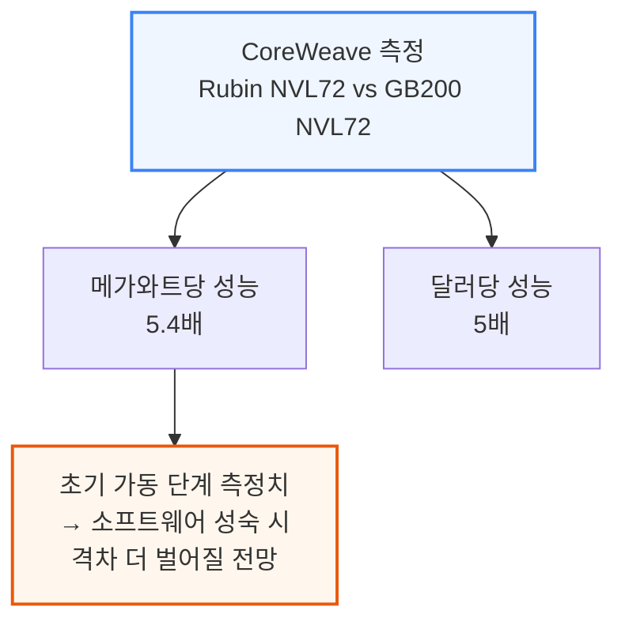
```mermaid
flowchart TD
    Claim["CoreWeave 측정<br/>Rubin NVL72 vs GB200 NVL72"] --> MW["메가와트당 성능<br/>5.4배"]
    Claim --> Dollar["달러당 성능<br/>5배"]
    MW --> Caveat["초기 가동 단계 측정치<br/>→ 소프트웨어 성숙 시<br/>격차 더 벌어질 전망"]

    style Claim fill:#eff6ff,stroke:#3b82f6,stroke-width:2px
    style Caveat fill:#fff7ed,stroke:#ea580c,stroke-width:2px
```

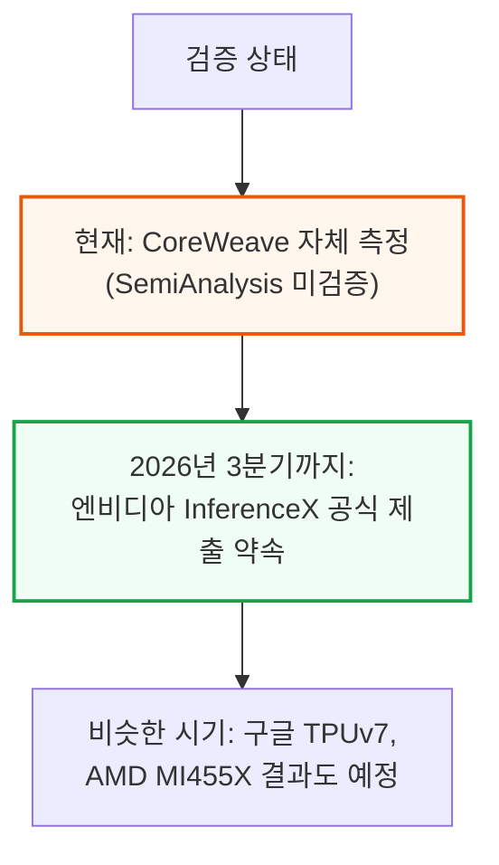
```mermaid
flowchart TD
    Verify["검증 상태"] --> Now2["현재: CoreWeave 자체 측정<br/>(SemiAnalysis 미검증)"]
    Now2 --> Q3["2026년 3분기까지:<br/>엔비디아 InferenceX 공식 제출 약속"]
    Q3 --> Others["비슷한 시기: 구글 TPUv7,<br/>AMD MI455X 결과도 예정"]

    style Now2 fill:#fff7ed,stroke:#ea580c,stroke-width:2px
    style Q3 fill:#f0fdf4,stroke:#16a34a,stroke-width:2px
```

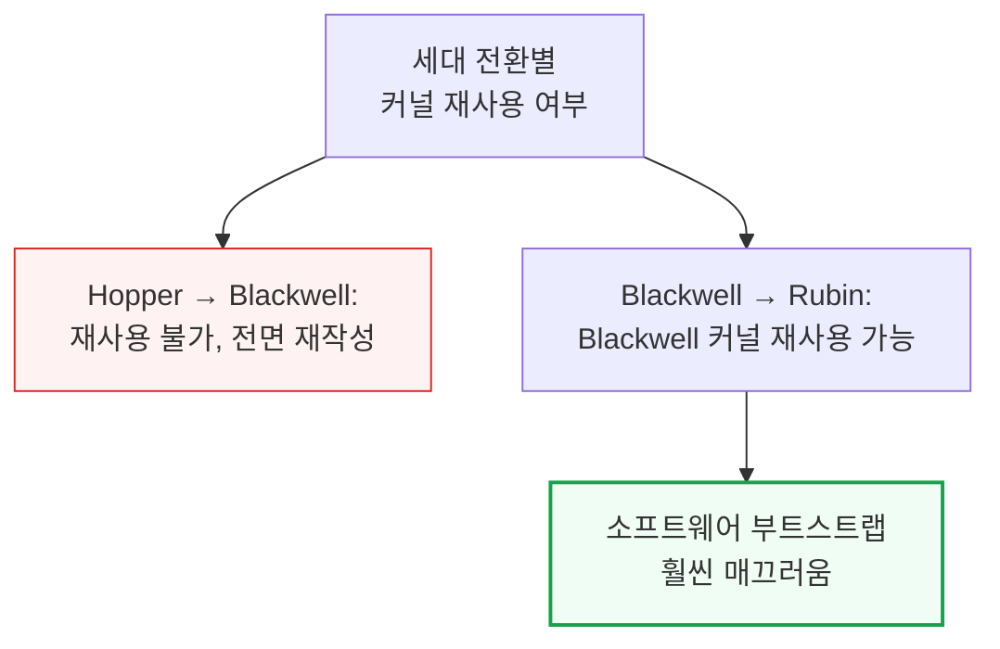
```mermaid
flowchart TD
    Kernel["세대 전환별<br/>커널 재사용 여부"] --> HopperToBW["Hopper → Blackwell:<br/>재사용 불가, 전면 재작성"]
    Kernel --> BWToRubin["Blackwell → Rubin:<br/>Blackwell 커널 재사용 가능"]
    BWToRubin --> Smooth["소프트웨어 부트스트랩<br/>훨씬 매끄러움"]

    style HopperToBW fill:#fef2f2,stroke:#dc2626
    style Smooth fill:#f0fdf4,stroke:#16a34a,stroke-width:2px
```

---

## 2. Rubin 칩 마이크로아키텍처 주요 변화

**📌 핵심:**
- Rubin은 Blackwell SM100 계열 커널(DeepGEMM·FlashMLA·CUTLASS 등)을 그대로 돌릴 수 있어, **Hopper→Blackwell 전환(커널 전면 재작성 필요) 때보다 이식 부담이 훨씬 작음** — 다만 이론상 최고 성능(Speed of Light)을 뽑으려면 결국 Rubin 전용으로 커널을 재조정해야 함
- 메모리 계층이 확장 — **공유메모리(SMEM)가 Blackwell 228KiB에서 328KiB로, 텐서메모리(TMEM)가 열(column) 수 512개에서 576개로 늘어 256KiB에서 [정정: 열 증가분만큼] 커짐** — TMEM 여유 공간에 블록 스케일 계수를 별도로 얹을 수 있어, MMA 행렬과 스케일 계수를 매번 정교하게 맞물리게 파이프라인할 필요가 없어짐(커널 작성 난도 하락)
- **TMA(비동기 메모리 전송)가 인라인 디스크립터 갱신을 지원** — MoE(전문가 혼합) 레이어처럼 전문가마다 가중치가 HBM의 다른 주소에 있는 경우, 기존에는 전문가를 바꿀 때마다 디스크립터를 메모리에 다시 써넣고 동기화해야 했는데, Rubin은 오프셋만 명령어에 실어 보내 디스크립터 하나로 모든 전문가를 커버 — 토큰 디스패치 오버헤드가 줄어 저배치 디코드 속도가 향상
- 결론: FP8·FP4 Tensor Core 처리량이 K차원(내적 연산 폭)을 2배로 늘려 **Blackwell 대비 2배**가 됐고, HBM4 3차원 적층으로 **글로벌 메모리 대역폭이 Blackwell Ultra 대비 2.8배**로 확대 — PDL(프로그램형 종속 실행)도 그리드 단위가 아닌 스레드블록 단위로 세밀하게 겹쳐 실행할 수 있게 개선됨

---

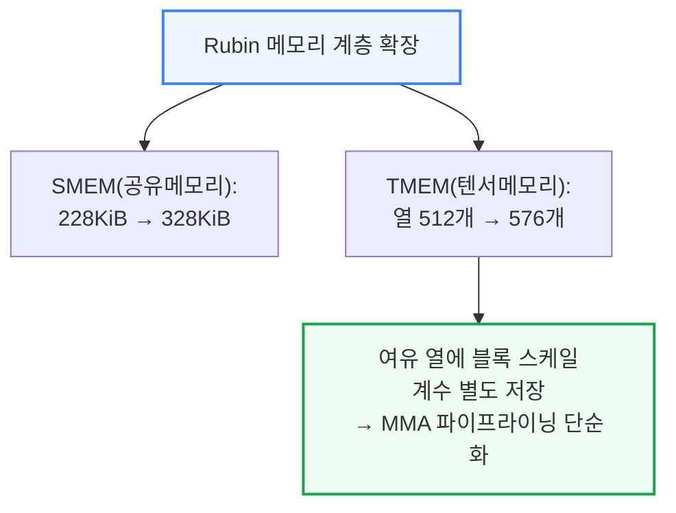
```mermaid
flowchart TD
    Mem["Rubin 메모리 계층 확장"] --> SMEM["SMEM(공유메모리):<br/>228KiB → 328KiB"]
    Mem --> TMEM["TMEM(텐서메모리):<br/>열 512개 → 576개"]
    TMEM --> ScaleSep["여유 열에 블록 스케일<br/>계수 별도 저장<br/>→ MMA 파이프라이닝 단순화"]

    style Mem fill:#eff6ff,stroke:#3b82f6,stroke-width:2px
    style ScaleSep fill:#f0fdf4,stroke:#16a34a,stroke-width:2px
```

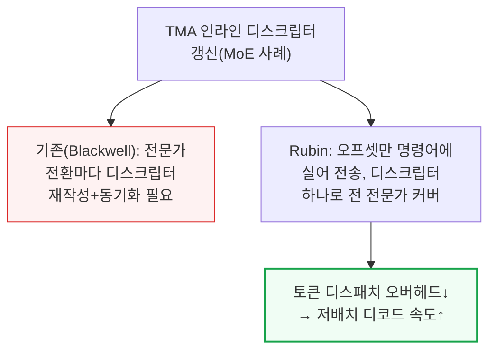
```mermaid
flowchart TD
    TMA["TMA 인라인 디스크립터<br/>갱신(MoE 사례)"] --> Old2["기존(Blackwell): 전문가<br/>전환마다 디스크립터<br/>재작성+동기화 필요"]
    TMA --> New2["Rubin: 오프셋만 명령어에<br/>실어 전송, 디스크립터<br/>하나로 전 전문가 커버"]
    New2 --> Faster["토큰 디스패치 오버헤드↓<br/>→ 저배치 디코드 속도↑"]

    style Old2 fill:#fef2f2,stroke:#dc2626
    style Faster fill:#f0fdf4,stroke:#16a34a,stroke-width:2px
```

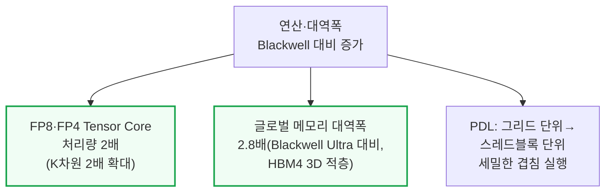
```mermaid
flowchart TD
    Throughput2["연산·대역폭<br/>Blackwell 대비 증가"] --> Tensor2["FP8·FP4 Tensor Core<br/>처리량 2배<br/>(K차원 2배 확대)"]
    Throughput2 --> HBM4["글로벌 메모리 대역폭<br/>2.8배(Blackwell Ultra 대비,<br/>HBM4 3D 적층)"]
    Throughput2 --> PDL2["PDL: 그리드 단위→<br/>스레드블록 단위<br/>세밀한 겹침 실행"]

    style Tensor2 fill:#f0fdf4,stroke:#16a34a,stroke-width:2px
    style HBM4 fill:#f0fdf4,stroke:#16a34a,stroke-width:2px
```

**📌 용어 풀이: SMEM·TMEM·UE5M3·2:4 스파시티**
> - **SMEM(공유메모리)과 TMEM(텐서메모리)**: 둘 다 GPU 칩 내부, HBM보다 훨씬 가까운 곳에 있는 초고속 임시 저장 공간 — SMEM은 스레드블록이 공유하는 범용 스크래치패드, TMEM은 Tensor Core 연산(MMA) 전용 저장소
> - **UE5M3(8비트 블록 스케일 포맷)**: 가중치를 압축할 때 그룹 단위로 곱해주는 "스케일 계수"의 숫자 표현 방식 중 하나 — Blackwell은 UE4M3/UE8M0만 지원했는데 Rubin은 UE5M3도 추가 지원해 표현 범위가 넓어져 일부 상황에서 양자화 오차가 줄어듦
> - **2:4 스파시티(활성화 값 대상)**: 값 4개 중 2개를 정규적인 패턴으로 솎아내(0으로 만들어) Tensor Core가 나머지 2개만 계산하게 해 처리 속도를 2배로 높이는 기법 — 기존에는 가중치에만 적용돼 재학습이 필요했지만, Rubin은 활성화 값에 실시간 적용해 재학습이 필요 없음. 다만 엔비디아가 정확도 데이터를 공개하지 않았고 CoreWeave의 실측치에도 아직 적용되지 않아, 현재는 "실리콘은 있지만 다듬어진 커널은 없는" 기능

---

## 3. LUT B - 3비트 룩업테이블 가중치 압축

**📌 핵심:**
- LUT B는 Tensor Core의 새 연산 모드로, 가중치 값을 통째로 저장하는 대신 **가중치 위치마다 3비트 색인만 저장**하고, 그 색인이 가리키는 실제 값(E4M3 형식)은 8×64 블록이 공유하는 룩업테이블(코드북)에 미리 넣어둠 — 예를 들어 저장된 색인이 5면 Tensor Core가 그 블록 코드북의 5번 항목을 가중치로 사용, 별도 압축 해제 단계 없이 곱셈(MMA) 내부에서 즉석 변환
- 코드북은 균등한 간격일 필요가 없어 **가중치가 몰린 구간엔 촘촘하게, 드문 구간엔 듬성듬성 배치 가능** — 저장 비트당 정확도를 끌어올릴 잠재력이 있지만, 자동으로 MXFP4·NVFP4보다 정확한 것은 아니며 코드북 하나를 512개 가중치가 공유(NVFP4는 16개 단위로 스케일 조정)하므로 실제 결과는 코드북 산출 알고리즘과 보정 데이터 품질에 좌우됨
- 저장 용량은 **가중치당 3.125비트**(색인 3비트 + 512개 가중치가 나눠 쓰는 64비트 코드북) — 코드북도 인덱스와 함께 HBM에 저장되므로 이 수치가 전체 저장 용량
- 결론: **Kimi K3(2.8조 파라미터) 예시로 계산하면**, 약 4.5비트/가중치인 MXFP4는 가중치만 약 1,488GB(1.49TB)를 차지하는 반면, 3.125비트/가중치인 Rubin LUT 포맷은 약 1,094GB(1.09TB)로 약 393.5GB 절감(KV캐시·활성화값·병렬화 중복은 제외한 순수 가중치 기준) — 288GB짜리 HBM4 패키지 기준 가중치만 담는 데 NVFP4는 약 6개, Rubin 신규 포맷은 약 4개 패키지가 필요해 저비용 서버당 배치 밀도가 높아짐

---

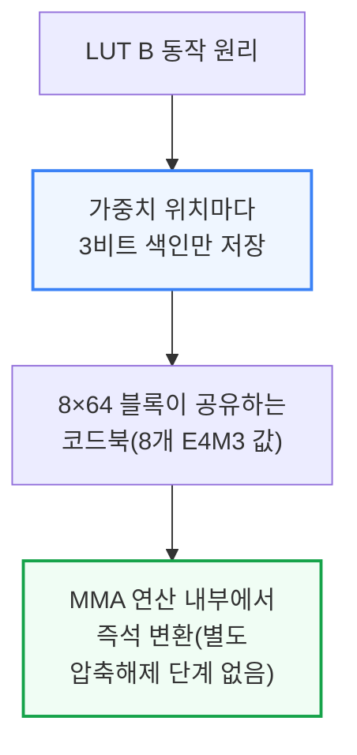
```mermaid
flowchart TD
    LUTMode["LUT B 동작 원리"] --> Index["가중치 위치마다<br/>3비트 색인만 저장"]
    Index --> Table["8×64 블록이 공유하는<br/>코드북(8개 E4M3 값)"]
    Table --> Inline["MMA 연산 내부에서<br/>즉석 변환(별도<br/>압축해제 단계 없음)"]

    style Index fill:#eff6ff,stroke:#3b82f6,stroke-width:2px
    style Inline fill:#f0fdf4,stroke:#16a34a,stroke-width:2px
```

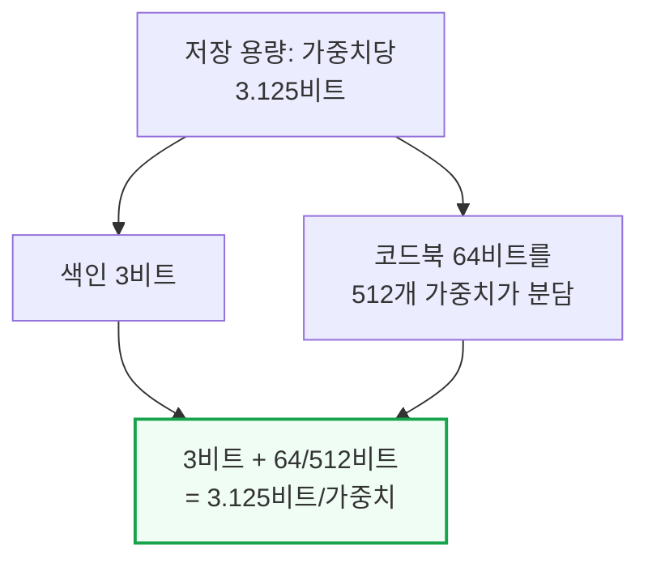
```mermaid
flowchart TD
    Storage["저장 용량: 가중치당<br/>3.125비트"] --> Idx3["색인 3비트"]
    Storage --> Code64["코드북 64비트를<br/>512개 가중치가 분담"]
    Idx3 --> Total3["3비트 + 64/512비트<br/>= 3.125비트/가중치"]
    Code64 --> Total3

    style Total3 fill:#f0fdf4,stroke:#16a34a,stroke-width:2px
```

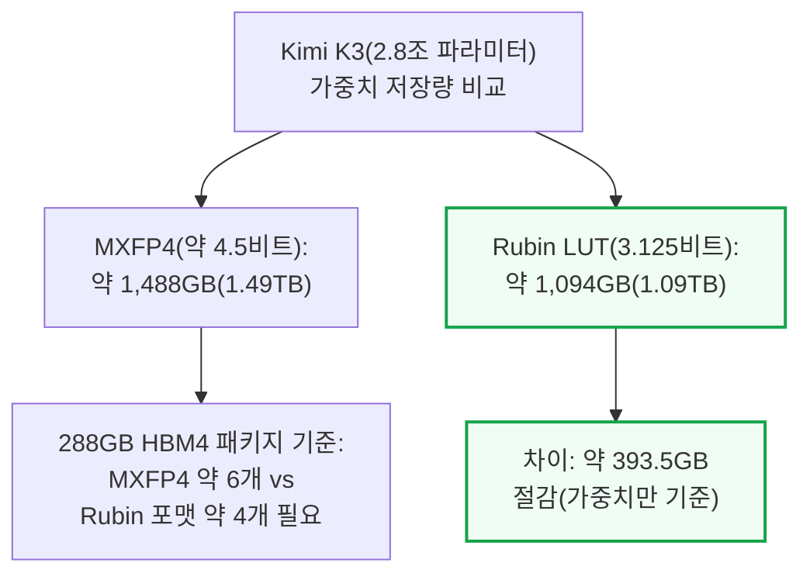
```mermaid
flowchart TD
    Kimi["Kimi K3(2.8조 파라미터)<br/>가중치 저장량 비교"] --> MXFP4v["MXFP4(약 4.5비트):<br/>약 1,488GB(1.49TB)"]
    Kimi --> RubinFmt["Rubin LUT(3.125비트):<br/>약 1,094GB(1.09TB)"]
    RubinFmt --> Diff["차이: 약 393.5GB<br/>절감(가중치만 기준)"]
    MXFP4v --> PkgCnt["288GB HBM4 패키지 기준:<br/>MXFP4 약 6개 vs<br/>Rubin 포맷 약 4개 필요"]

    style RubinFmt fill:#f0fdf4,stroke:#16a34a,stroke-width:2px
    style Diff fill:#f0fdf4,stroke:#16a34a,stroke-width:2px
```

**📌 용어 풀이: LUT B가 절감을 가져오는 이유**
> - 저배치 디코드 단계는 GPU가 가중치를 HBM에서 얼마나 빨리 읽어오는지(메모리 대역폭)가 속도를 좌우 — 가중치당 비트 수가 줄면 같은 대역폭으로 더 많은 가중치를 읽을 수 있어 디코드 처리량이 올라감
> - 비균등 코드북은 가중치가 몰린 구간을 더 세밀하게 표현할 수 있어, 같은 저장 비트 수로도 균등 반올림 방식(MXFP4 등)보다 정확도를 더 잘 지킬 수 있음
> - 가중치를 옮기는 데 드는 비트 수가 줄면 메모리 시스템이 전력을 덜 쓰므로, 연산(FLOP) 하나당 전력 효율도 개선될 것으로 기대됨(다만 엔비디아 공식 정확도 데이터는 아직 없음)

---

## 4. Feynman(SM_140) 아키텍처 미리보기

**📌 핵심:**
- Blackwell(SM100/Blackwell Ultra)에서 Rubin(SM107)으로의 전환은 마이크로아키텍처 관점에서 상대적으로 작은 변화라 **Rubin은 "Blackwell 개선판(kicker)"에 가까움** — 반면 **Feynman(SM_140)은 완전히 새로운 아키텍처 계열**이라, Rubin에서 Feynman으로 넘어갈 때는 Hopper WGMMA에서 Blackwell tcgen05로 넘어갈 때처럼 커널을 대거 다시 짜야 할 전망
- Feynman의 3D 적층 방식은 AMD가 MI300X(CDNA3)부터 이어온 3D 적층 접근과 유사한 방향
- 결론: Feynman은 **스파시티(희소성)를 인식하는 데이터 이동 연산**을 새로 도입 — 희소 GEMM(행렬곱)에서 불필요한 로드·스토어·곱셈-누산(FMA)을 건너뛰어 성능을 높이는 데 쓰일 전망

---

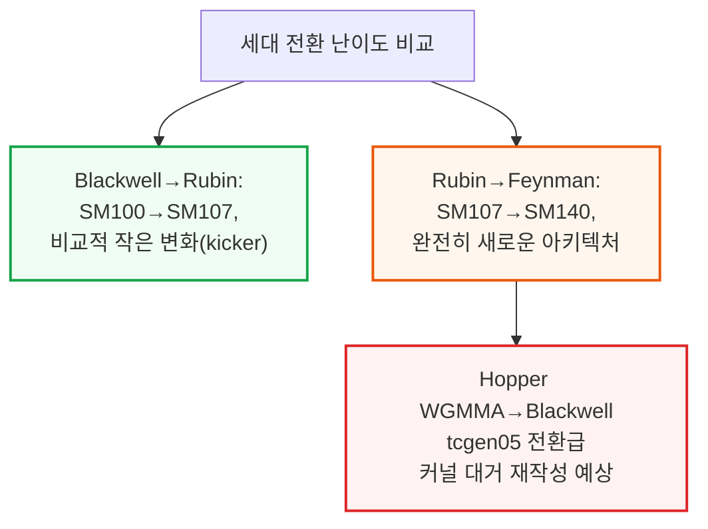
```mermaid
flowchart TD
    Transition["세대 전환 난이도 비교"] --> Easy2["Blackwell→Rubin:<br/>SM100→SM107,<br/>비교적 작은 변화(kicker)"]
    Transition --> Hard2["Rubin→Feynman:<br/>SM107→SM140,<br/>완전히 새로운 아키텍처"]
    Hard2 --> Rewrite["Hopper WGMMA→Blackwell<br/>tcgen05 전환급<br/>커널 대거 재작성 예상"]

    style Easy2 fill:#f0fdf4,stroke:#16a34a,stroke-width:2px
    style Hard2 fill:#fff7ed,stroke:#ea580c,stroke-width:2px
    style Rewrite fill:#fef2f2,stroke:#dc2626,stroke-width:2px
```

---

## 5. CoreWeave 벤치마크의 숨은 전제 5가지

**📌 핵심:**
- CoreWeave는 **"상호작용성 약 150 tok/s/user 기준 VR NVL72가 GB200 NVL72 대비 메가와트당 처리량 10배"**라고 발표(오늘날 프론티어 모델의 "고속 모드"보다 약 50% 더 빠른 수준) — 다만 이 수치는 단일턴(입력 8k·출력 1k) 조건, 전력은 프리필+디코드 GPU를 모두 포함하면서 토큰은 출력분만 집계, 두 시스템 모두 NVFP4·MTP(추측 디코딩)·분리형 서빙(Dynamo)·Wide EP·TensorRT-LLM을 전부 켠 상태라는 조건이 붙음(InferenceX는 원래 디코드 GPU 전력만 기준으로 삼는데, 이번 비교를 위해 CoreWeave 기준에 맞춰 재정규화)
- **비교 기준 시점**: CoreWeave는 GB200 NVL72의 **2025년(출시 초기) 기준선**과 비교 — Rubin도 초기 단계이니 초기끼리 비교하는 것은 나름 공정하지만, SemiAnalysis는 2026년 현재 실제로 구매하는 사람에게 더 유의미한 **2026년 7월 기준 GB200과 최신 GB300 NVL72**도 함께 비교
- **모델 선택**: DeepSeek R1 671B는 더 이상 널리 쓰이지 않는 구형 모델(GLM5.2·Kimi K2.5·Qwen3.5·DeepSeek V4가 더 적절했을 것) — 역설적으로 이 선택은 오히려 **Blackwell에 유리하고 Rubin에는 불리**한 조건인데, Rubin의 강점은 더 큰 HBM 용량·CPU DRAM 용량·HBM 대역폭이라 Fable 5·Gemini Pro·Kimi K3·Qwen3.8(2.4조 파라미터)처럼 초대형 모델에서 진가를 발휘하기 때문
- 결론: 시나리오도 **단일턴 8k/1k 입출력**만 사용 — 에이전틱 코딩 같은 멀티턴 장문 컨텍스트 워크로드는 이론상 Rubin의 큰 HBM 용량·대역폭 덕에 더 유리할 것으로 예상되나 이번 벤치마크엔 반영되지 않음(Weka·LMCache·vLLM/SGLang 커뮤니티와 공동 개발 중인 AgentX 벤치마크가 이 공백을 메울 예정). 테스트 환경도 스케일아웃 패브릭이 없는 **Dell 엔지니어링 샘플 랙**이었지만, Wide EP·분리형 서빙이 쓰는 NVL72 스케일업 백플레인 자체는 검증됨(이 백플레인은 GB200 NVL72 Oberon 램프업 때 신뢰성 문제를 여러 차례 겪은 부품)

---

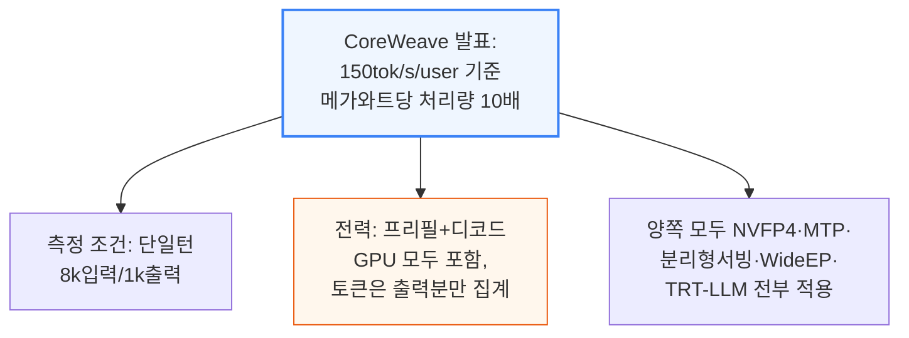
```mermaid
flowchart TD
    Headline["CoreWeave 발표:<br/>150tok/s/user 기준<br/>메가와트당 처리량 10배"] --> Cond1["측정 조건: 단일턴<br/>8k입력/1k출력"]
    Headline --> Cond2["전력: 프리필+디코드<br/>GPU 모두 포함,<br/>토큰은 출력분만 집계"]
    Headline --> Cond3["양쪽 모두 NVFP4·MTP·<br/>분리형서빙·WideEP·<br/>TRT-LLM 전부 적용"]

    style Headline fill:#eff6ff,stroke:#3b82f6,stroke-width:2px
    style Cond2 fill:#fff7ed,stroke:#ea580c
```

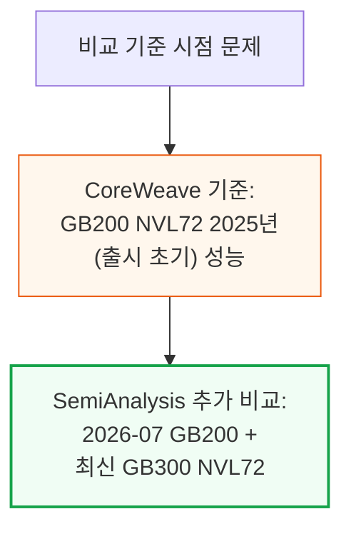
```mermaid
flowchart TD
    Baseline2["비교 기준 시점 문제"] --> Old3["CoreWeave 기준:<br/>GB200 NVL72 2025년<br/>(출시 초기) 성능"]
    Old3 --> New3["SemiAnalysis 추가 비교:<br/>2026-07 GB200 +<br/>최신 GB300 NVL72"]

    style Old3 fill:#fff7ed,stroke:#ea580c
    style New3 fill:#f0fdf4,stroke:#16a34a,stroke-width:2px
```

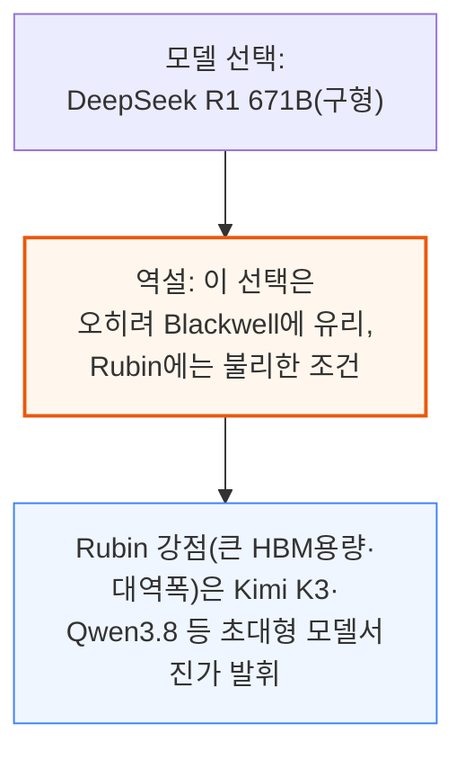
```mermaid
flowchart TD
    Model2["모델 선택:<br/>DeepSeek R1 671B(구형)"] --> Ironic["역설: 이 선택은<br/>오히려 Blackwell에 유리,<br/>Rubin에는 불리한 조건"]
    Ironic --> WhyRubin["Rubin 강점(큰 HBM용량·<br/>대역폭)은 Kimi K3·<br/>Qwen3.8 등 초대형 모델서<br/>진가 발휘"]

    style Ironic fill:#fff7ed,stroke:#ea580c,stroke-width:2px
    style WhyRubin fill:#eff6ff,stroke:#3b82f6
```

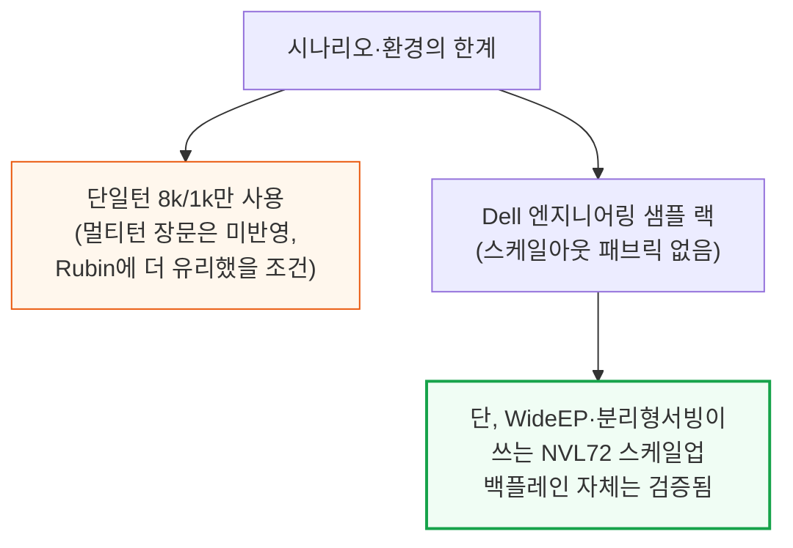
```mermaid
flowchart TD
    Scenario2["시나리오·환경의 한계"] --> SingleTurn["단일턴 8k/1k만 사용<br/>(멀티턴 장문은 미반영,<br/>Rubin에 더 유리했을 조건)"]
    Scenario2 --> Rack2["Dell 엔지니어링 샘플 랙<br/>(스케일아웃 패브릭 없음)"]
    Rack2 --> Proof["단, WideEP·분리형서빙이<br/>쓰는 NVL72 스케일업<br/>백플레인 자체는 검증됨"]

    style SingleTurn fill:#fff7ed,stroke:#ea580c
    style Proof fill:#f0fdf4,stroke:#16a34a,stroke-width:2px
```

---

## 6. Rubin vs Blackwell 성능/MW(메가와트당 처리량)

**📌 핵심:**
- 엔비디아가 내세운 지표는 **"전력 사용량(all-in utility 메가와트) 대비 초당 출력 토큰"**(시스템의 전체 GPU를 분모로 포함) — SemiAnalysis는 자체 InferenceX 실측치를 같은 기준(총 GPU)으로 재정규화해 VR NVL72를 2026년 7월 공식 GB200·GB300 벤치마크 및 CoreWeave의 2025년 GB200 기준선과 나란히 비교
- **VR NVL72 vs 2026년 7월 GB300 NVL72**: 격차가 상호작용성 100 tok/s/user까지는 약 2배로 작다가, 200 tok/s/user 부근에서 약 4배로 정점을 찍고 이후 다시 좁아짐 — 표제 수치인 "300 tok/s/user에서 5.4배"는 Rubin이 더 앞서나간 게 아니라 **GB300이 자기 한계선상의 마지막 구간(배치를 극도로 줄여야 겨우 도달)까지 밀어붙인 결과**이며, GB200은 애초에 300 tok/s/user에 도달조차 못 함
- **VR NVL72 vs 2025년 GB200 기준선**: 격차가 곡선 중간에서 가장 큼 — 저속 구간에서는 3배 미만이다가 150 tok/s/user(엔비디아가 강조한 지점)에서 약 10배로 정점, 200 tok/s/user에서는 다시 6배로 하락(이 기준선은 정확한 데이터지만 1년 전 소프트웨어 스택 기준이라 오늘날의 GB200과 다름)
- 결론: 350 tok/s/user 같은 극한 구간에서는 GB200·GB300 모두 서빙 자체가 불가능(곡선이 끊김) — **Rubin만 유일하게 곡선이 이어져 300 tok/s/user에서 96,446 tok/s/MW, 350 tok/s/user에서 70,703 tok/s/MW**를 기록, "고속 모드" 워크로드를 훨씬 폭넓게 지원 가능함을 시사

---

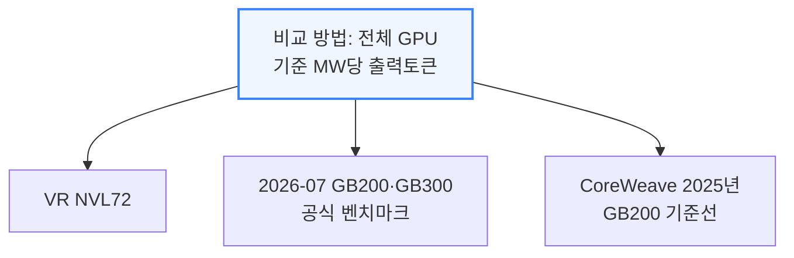
```mermaid
flowchart TD
    MWMetric["비교 방법: 전체 GPU<br/>기준 MW당 출력토큰"] --> Base1["VR NVL72"]
    MWMetric --> Base2["2026-07 GB200·GB300<br/>공식 벤치마크"]
    MWMetric --> Base3["CoreWeave 2025년<br/>GB200 기준선"]

    style MWMetric fill:#eff6ff,stroke:#3b82f6,stroke-width:2px
```

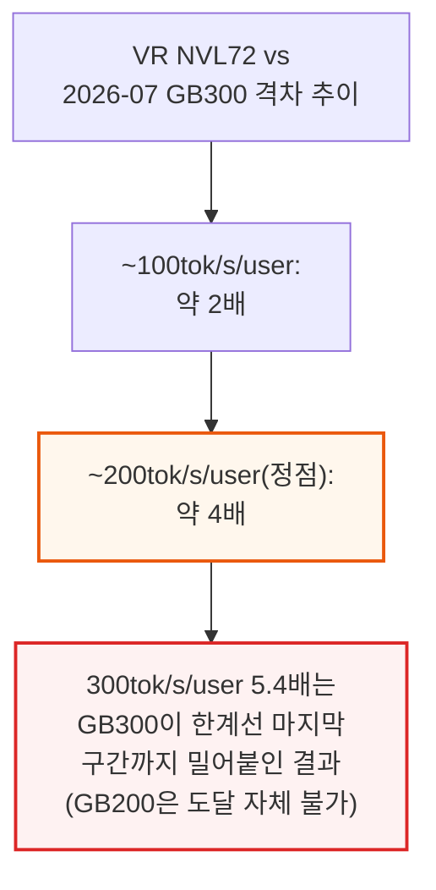
```mermaid
flowchart TD
    GB300Curve["VR NVL72 vs<br/>2026-07 GB300 격차 추이"] --> P1["~100tok/s/user:<br/>약 2배"]
    P1 --> P2["~200tok/s/user(정점):<br/>약 4배"]
    P2 --> P3["300tok/s/user 5.4배는<br/>GB300이 한계선 마지막<br/>구간까지 밀어붙인 결과<br/>(GB200은 도달 자체 불가)"]

    style P2 fill:#fff7ed,stroke:#ea580c,stroke-width:2px
    style P3 fill:#fef2f2,stroke:#dc2626,stroke-width:2px
```

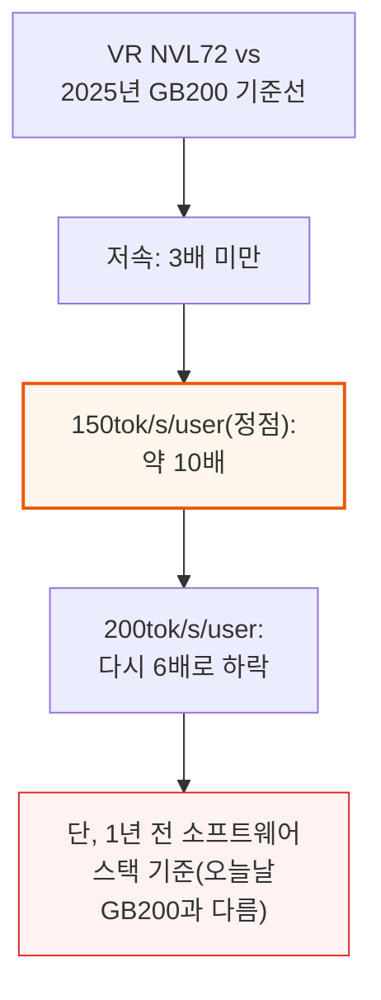
```mermaid
flowchart TD
    GB200_25["VR NVL72 vs<br/>2025년 GB200 기준선"] --> Q1["저속: 3배 미만"]
    Q1 --> Q2["150tok/s/user(정점):<br/>약 10배"]
    Q2 --> Q3["200tok/s/user:<br/>다시 6배로 하락"]
    Q3 --> OldSW["단, 1년 전 소프트웨어<br/>스택 기준(오늘날<br/>GB200과 다름)"]

    style Q2 fill:#fff7ed,stroke:#ea580c,stroke-width:2px
    style OldSW fill:#fef2f2,stroke:#dc2626
```

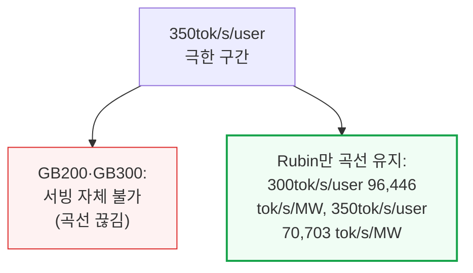
```mermaid
flowchart TD
    Extreme["350tok/s/user<br/>극한 구간"] --> BWFail["GB200·GB300:<br/>서빙 자체 불가<br/>(곡선 끊김)"]
    Extreme --> RubinOnly["Rubin만 곡선 유지:<br/>300tok/s/user 96,446<br/>tok/s/MW, 350tok/s/user<br/>70,703 tok/s/MW"]

    style BWFail fill:#fef2f2,stroke:#dc2626
    style RubinOnly fill:#f0fdf4,stroke:#16a34a,stroke-width:2px
```

---

## 7. Rubin vs Blackwell 성능/TCO(토큰당 비용)

**📌 핵심:**
- 메가와트당 성능은 전력만 반영하지만, **백만 토큰당 비용**은 IT 자본비·전력·데이터센터 비용을 모두 합친 TCO를 반영 — Rubin의 GPU 시간당 TCO는 **$3.57**로 GB200($1.84)·GB300($2.36)보다 높아(자체 소유·운영 시나리오 기준, 임대료 아님), 메가와트당 우위보다 달러당 우위 폭이 다소 줄어듦
- **2026년 7월 GB200·GB300 대비**: 모든 상호작용성 구간에서 Rubin이 더 저렴하고 격차는 속도가 올라갈수록 확대 — 100 tok/s/user까지는 약 1.5배, 200\~250 tok/s/user 구간에서 3배로 개선, 300 tok/s/user에서는 5배(메가와트당 비교와 동일하게 GB300이 겨우 서빙 가능한 한계선, GB200은 도달 불가)
- **2025년 GB200 기준선 대비**: 다시 곡선 중간에서 가장 극적 — 저속에서 2배를 살짝 넘고, 150 tok/s/user에서 약 8배로 정점, 200 tok/s/user에서 5배로 하락(역시 1년 전 소프트웨어 스택 기준이라는 점은 동일)
- 결론: 극한 구간에서는 GB200이 250 tok/s/user, GB300이 300 tok/s/user를 넘는 지점에 아예 도달하지 못해, **350 tok/s/user에서는 Rubin만 서빙 가능**하며 그 비용은 백만 출력토큰당 $4.18

---

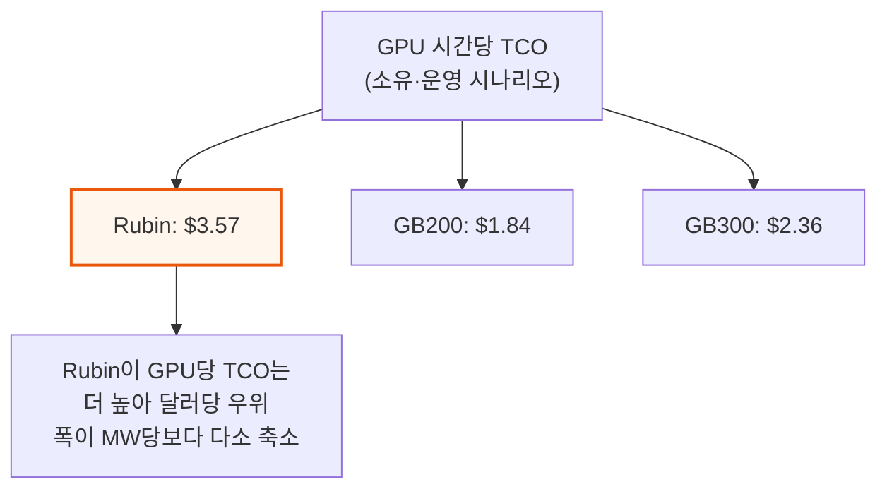
```mermaid
flowchart TD
    TCOHourly["GPU 시간당 TCO<br/>(소유·운영 시나리오)"] --> Rubin2["Rubin: $3.57"]
    TCOHourly --> GB200t["GB200: $1.84"]
    TCOHourly --> GB300t["GB300: $2.36"]
    Rubin2 --> Impl["Rubin이 GPU당 TCO는<br/>더 높아 달러당 우위<br/>폭이 MW당보다 다소 축소"]

    style Rubin2 fill:#fff7ed,stroke:#ea580c,stroke-width:2px
```

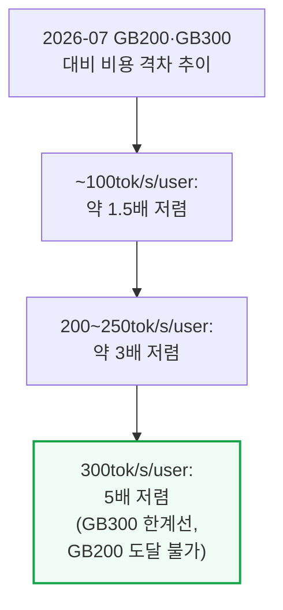
```mermaid
flowchart TD
    TCO2026["2026-07 GB200·GB300<br/>대비 비용 격차 추이"] --> R1["~100tok/s/user:<br/>약 1.5배 저렴"]
    R1 --> R2["200~250tok/s/user:<br/>약 3배 저렴"]
    R2 --> R3["300tok/s/user:<br/>5배 저렴<br/>(GB300 한계선,<br/>GB200 도달 불가)"]

    style R3 fill:#f0fdf4,stroke:#16a34a,stroke-width:2px
```

```mermaid
flowchart TD
    TCO2025["2025년 GB200<br/>기준선 대비 비용 격차"] --> S1["저속: 2배 초과"]
    S1 --> S2["150tok/s/user(정점):<br/>약 8배 저렴"]
    S2 --> S3["200tok/s/user:<br/>5배로 하락"]

    style S2 fill:#fff7ed,stroke:#ea580c,stroke-width:2px
```

```mermaid
flowchart TD
    Extreme2["극한 구간 비용"] --> Limit["GB200: 250tok/s/user 초과<br/>불가 / GB300: 300tok/s/user<br/>초과 불가"]
    Limit --> Only2["350tok/s/user: Rubin만<br/>서빙 가능, 비용<br/>백만토큰당 $4.18"]

    style Only2 fill:#f0fdf4,stroke:#16a34a,stroke-width:2px
```

---

## 8. Rubin vs MI355X 분리형 서빙 성능 비교

**📌 핵심:**
- AMD MI355X의 DeepSeek R1 최고 실측치는 현재 **정확도 버그로 무효** — SGLang의 MoRI EP 디코드 경로가 저동시성 구간에서 출력을 조용히 훼손해, 서버는 토큰을 정상 속도로 생성하는데도 정확도 평가(gsm8k)는 0점으로 떨어짐. 원인은 AITER의 FlyDSL MoE 리듀스 경로에서 초기화되지 않은 버퍼를 그대로 쓰는 버그로, 동시성(M) 약 1024 구간에서만 이 결함 경로가 선택돼 좁은 동시성 대역만 훼손되고 중\~고동시성은 정상
- 임시 수정으로 동시성 64는 복구됐지만 **동시성 32 이하는 여전히 실패**(1024 미만 구간이 아직 커버되지 않음) — 그럼에도 참고용으로 MTP 버전과 비교하면, 상호작용성 50 tok/s/user 기준 **MI355X는 메가와트당 434,235 출력토큰인데 VR NVL72는 1,330,000(약 3.06배)**, MTP 없는 구성은 약 32,000(0.074배)에 그침
- 상호작용성 135 tok/s/user에서는 **MTP MI355X가 메가와트당 187,848 토큰, VR NVL72는 약 886,000(약 4.72배)**, MTP 없는 구성은 약 6,000(0.032배)
- 결론: 그럼에도 현재 MI355X가 CoreWeave 마케팅 자료 속 지난해 GB200 NVL72 실측치보다 앞선다는 점은 주목할 만함 — AMD도 세대를 거듭하며 격차를 좁혀가고 있음을 보여주는 대목

---

```mermaid
flowchart TD
    Bug["MI355X SGLang<br/>MoRI EP 디코드 버그"] --> Cause["AITER FlyDSL MoE<br/>리듀스 경로,<br/>초기화 안 된 버퍼 사용"]
    Cause --> Effect["동시성(M)≈1024 구간만<br/>결함 경로 선택<br/>→ gsm8k 정확도 0점"]
    Effect --> Fix["임시 수정: 동시성 64 복구,<br/>32 이하는 여전히 실패"]

    style Effect fill:#fef2f2,stroke:#dc2626,stroke-width:2px
    style Fix fill:#fff7ed,stroke:#ea580c
```

```mermaid
flowchart TD
    Compare50["50tok/s/user 기준<br/>메가와트당 출력토큰"] --> MI50["MI355X(MTP): 434,235"]
    Compare50 --> VR50["VR NVL72: 1,330,000<br/>(약 3.06배)"]
    Compare50 --> NoMTP50["MI355X(비MTP):<br/>약 32,000(0.074배)"]

    style VR50 fill:#f0fdf4,stroke:#16a34a,stroke-width:2px
```

```mermaid
flowchart TD
    Compare135["135tok/s/user 기준<br/>메가와트당 출력토큰"] --> MI135["MI355X(MTP): 187,848"]
    Compare135 --> VR135["VR NVL72: 약 886,000<br/>(약 4.72배)"]
    Compare135 --> NoMTP135["MI355X(비MTP):<br/>약 6,000(0.032배)"]

    style VR135 fill:#f0fdf4,stroke:#16a34a,stroke-width:2px
```

---

## 9. Rubin 소프트웨어 생태계 - PyTorch·vLLM·Triton·Dynamo

**📌 핵심:**
- Rubin 지원은 이미 **OpenAI Triton Compiler에 병합 완료** — RedHat·엔비디아 엔지니어들의 협업으로 업스트림 PyTorch·vLLM에도 지원이 반영됐거나 반영 진행 중
- Dynamo(분리형 서빙 프레임워크)에 대한 공개 PR을 통해 **Rubin을 지원하는 내부 Dynamo 브랜치의 존재도 확인**됨
- 결론: Blackwell→Rubin 커널 재사용성(2장 참고) 덕분에 이런 소프트웨어 스택 이식이 유례없이 빠르게 진행 중이며, 이는 Rubin의 "초기 가동 단계에서도 상당한 성능"이라는 결과와도 맞물림

---

```mermaid
flowchart TD
    Stack["Rubin 소프트웨어<br/>지원 현황"] --> Triton2["OpenAI Triton Compiler:<br/>병합 완료"]
    Stack --> PT["PyTorch·vLLM:<br/>지원 반영/진행 중<br/>(RedHat·엔비디아 협업)"]
    Stack --> Dynamo3["Dynamo: 내부 브랜치<br/>존재 확인(공개 PR 근거)"]

    style Triton2 fill:#f0fdf4,stroke:#16a34a,stroke-width:2px
```

---

## 10. VR NVL72 전력 예산과 BOM - 원차트 프레임워크

**📌 핵심:**
- VR NVL72는 서버 단위(네트워킹 제외) 전력이 약 **185kW**로 모델링됨 — Max-Q 구성(TDP 1,800W)에 최신 SOCAMM 메모리 구성 기준(BOM 상세는 SemiAnalysis VR NVL72 BoM 모델 참고)
- SemiAnalysis의 **"원차트 프레임워크"**는 GPU 임대료의 적정 범위를 두 선 사이로 표시 — 왼쪽 세로 점선(원가 기반 접근법)은 네오클라우드가 최소 목표 수익률(IRR)을 달성하는 데 필요한 최저 임대가(이보다 낮으면 배치할수록 손해), 위쪽 가로 점선(가치 기반 접근법)은 고객이 신형 대신 구형 카드를 택해도 무방하다고 느끼는 이론상 임대가 상한
- **GB300 NVL72에서 관측된 FP8 FLOPs 스펙 도약**(밀집 FP8 기준 5,000TFLOPs → 1,800W 버전 약 16,625TFLOPs·2,300W 버전 약 17,500TFLOPs, 즉 2.3\~2.5배 향상)이 VR NVL72의 높은 이론상 최대 임대료를 뒷받침 — 이번 리포트의 추론 실측치(6\~7장)를 반영하면 이 성능 도약은 실제로 정당화되며, 격차는 앞으로 더 벌어질 전망
- 결론: 2026년 7월 기준 GB200·GB300 NVL72 대비 VR NVL72의 백만 출력토큰당 비용 우위는 **100 tok/s/user까지 1.5배, 200\~250 tok/s/user 구간 약 3배, 300 tok/s/user에서 5배**로 확대되며(7장 요약), 소프트웨어가 성숙할수록 처리량·비용 우위 모두 계속 넓어질 전망

---

```mermaid
flowchart TD
    Power2["VR NVL72 서버 전력<br/>(네트워킹 제외)"] --> Watt["약 185kW<br/>(Max-Q, TDP 1,800W,<br/>최신 SOCAMM 구성)"]

    style Watt fill:#eff6ff,stroke:#3b82f6,stroke-width:2px
```

```mermaid
flowchart TD
    OneChart["원차트 프레임워크"] --> Floor["하한(원가 기반):<br/>네오클라우드 최소 IRR<br/>충족에 필요한 최저 임대가"]
    OneChart --> Ceiling["상한(가치 기반):<br/>고객이 구형 카드로<br/>갈아타도 무방한 임대가"]
    Ceiling --> Between["실제 임대가는<br/>이 범위 안에서 결정"]
    Floor --> Between

    style OneChart fill:#eff6ff,stroke:#3b82f6,stroke-width:2px
    style Between fill:#f0fdf4,stroke:#16a34a,stroke-width:2px
```

```mermaid
flowchart TD
    GB300Jump["GB300 NVL72 FP8<br/>FLOPs 스펙 도약"] --> Base2["기준(밀집 FP8):<br/>5,000 TFLOPs"]
    Base2 --> V1["1,800W 버전:<br/>약 16,625 TFLOPs(2.3배)"]
    Base2 --> V2["2,300W 버전:<br/>약 17,500 TFLOPs(2.5배)"]
    V1 --> Justify["6~7장 실측 결과가<br/>이 스펙 도약의<br/>타당성을 뒷받침"]

    style Justify fill:#f0fdf4,stroke:#16a34a,stroke-width:2px
```

```mermaid
flowchart TD
    CostGap["VR NVL72 백만토큰당<br/>비용 우위(2026-07<br/>GB200·GB300 대비)"] --> C1["100tok/s/user까지:<br/>1.5배"]
    C1 --> C2["200~250tok/s/user:<br/>약 3배"]
    C2 --> C3["300tok/s/user:<br/>5배"]
    C3 --> Trend["소프트웨어 성숙에<br/>따라 격차 계속 확대 전망"]

    style Trend fill:#f0fdf4,stroke:#16a34a,stroke-width:2px
```

---

*작성 진행률: 100% 완료*
*업데이트: 전체 10개 섹션(개요, 칩 마이크로아키텍처, LUT B, Feynman, CoreWeave 벤치마크 뉘앙스, 성능/MW, 성능/TCO, MI355X 비교, 소프트웨어 생태계, 전력예산·BOM) 작성 완료*
