# Can AMD break the CUDA Moat? AMD Advancing AI 2026

> **출처**: [SemiAnalysis Newsletter](https://newsletter.semianalysis.com/p/can-amd-break-the-cuda-moat-amd-advancing)
> **저자**: Bryan Shan, Daniel Nishball, Myron Xie
> **발행일**: 2026-07-25

---

## 📑 목차

### 전체 섹션
 1. [개요 - AMD Advancing AI 2026과 CUDA 모트 돌파 가능성](#1-개요---amd-advancing-ai-2026과-cuda-모트-돌파-가능성)
 2. [AMD 리더십에 보내는 권고 - 내부 GPU 클러스터·CI 안정성 문제](#2-amd-리더십에-보내는-권고---내부-gpu-클러스터ci-안정성-문제)
 3. [MI455X 실리콘 - 2나노 첫 출하와 역대 최대 패키지, Active LSI](#3-mi455x-실리콘---2나노-첫-출하와-역대-최대-패키지-active-lsi)
 4. [Meta 커스텀 MI455X - 절반 스펙의 딜레마](#4-meta-커스텀-mi455x---절반-스펙의-딜레마)
 5. [Helios 랙 네트워킹 개요 - 스위치드 스케일업 전환](#5-helios-랙-네트워킹-개요---스위치드-스케일업-전환)
 6. [Helios 랙 아키텍처 재점검 - 트레이 구조·부분 코디자인·메모리 디스펙](#6-helios-랙-아키텍처-재점검---트레이-구조부분-코디자인메모리-디스펙)
 7. [Helios 스케일업·스케일아웃 토폴로지와 Vulcano NIC 지능형 라우팅](#7-helios-스케일업스케일아웃-토폴로지와-vulcano-nic-지능형-라우팅)
 8. [CDNA5 마이크로아키텍처 - Nvidia 설계에 수렴](#8-cdna5-마이크로아키텍처---nvidia-설계에-수렴)
 9. [AMD 소프트웨어 - CUDA 모트는 옮겨갔다](#9-amd-소프트웨어---cuda-모트는-옮겨갔다)
10. [InferenceX로 본 개발 속도와 에이전트 기반 Day 0 지원](#10-inferencex로-본-개발-속도와-에이전트-기반-day-0-지원)
11. [단일 노드는 끝, 분산 추론이 새 전장 - WideEP와 분리형 서빙](#11-단일-노드는-끝-분산-추론이-새-전장---wideep와-분리형-서빙)
12. [AMD 분산 추론 스택 현황 - MoRI, Helios(gfx1250) 격차, NIXL 업스트림, 오버랩 스택 지연](#12-amd-분산-추론-스택-현황---mori-heliosgfx1250-격차-nixl-업스트림-오버랩-스택-지연)
13. [MI455X TCO 분석 - GB300·VR NVL72와 비교](#13-mi455x-tco-분석---gb300vr-nvl72와-비교)
14. [OpenAI·Meta 지분 리베이트 구조 - 최대 105% 할인](#14-openaimeta-지분-리베이트-구조---최대-105-할인)
15. [MI500 - 차세대 광학 인터커넥트(CPC·NPO) 로드맵](#15-mi500---차세대-광학-인터커넥트cpconpo-로드맵)

---

## 🔑 용어 정리

본문을 순서대로 읽기 전에 알아두면 좋은 용어들입니다. 자세한 수치와 설명은 본문에서 처음 등장하는 위치에 나옵니다.

- **CUDA 모트(CUDA Moat)**: Nvidia가 오랫동안 쌓아온 소프트웨어 생태계(CUDA 툴킷·라이브러리·개발자 커뮤니티)가 만들어내는 진입 장벽 — 경쟁사가 하드웨어 스펙은 따라와도 소프트웨어 완성도 격차 때문에 실제 채택으로 이어지지 못하게 막는 "해자(垓子)"에 비유한 표현
- **Helios / MI455X**: AMD의 차세대 AI 가속기 랙 시스템(MI455X GPU 72개를 하나의 랙에 묶은 구성) — Nvidia GB200/GB300 NVL72에 대응하는 AMD의 첫 랙 스케일(랙 전체가 GPU 1개처럼 작동) 제품
- **WideEP(광역 전문가 병렬화)**: MoE(전문가 혼합) 모델의 전문가들을 GPU 1개가 아니라 여러 GPU·여러 노드에 넓게 흩어 배치하는 방식 — GPU당 담당 전문가 수가 줄어 메모리 여유가 생기고 처리량이 늘어남
- **분리형 서빙(PD Disaggregation, Prefill-Decode Disaggregation)**: 추론의 입력 처리 단계(프리필)와 출력 생성 단계(디코드)를 서로 다른 GPU 묶음에 나눠 맡기는 방식
- **MoRI**: AMD가 자체 개발한 RDMA(원격 메모리 직접 접근) 기반 분산 추론 통신 프레임워크 — 전문가 데이터 교환을 담당하는 MoRI-EP와 KV 캐시 전송을 담당하는 MoRI-IO로 구성
- **TCO(Total Cost of Ownership, 총소유비용)**: 칩 구매 비용뿐 아니라 전력·냉각·유지보수까지 합친 실제 운영 비용
- **지분 리베이트(Equity Rebate)**: AMD가 대형 고객(OpenAI·Meta)에게 저가(주당 1센트)로 AMD 주식을 살 수 있는 워런트를 지급하고, 특정 주가·구매 조건을 채우면 사실상 GPU 구매 비용을 되돌려주는 효과를 내는 금융 구조
- **Active LSI(능동형 로컬 실리콘 인터커넥트)**: 여러 개의 작은 칩(칩렛)을 하나의 패키지 안에서 이어붙이는 다리 역할의 배선에 신호를 증폭·중계하는 회로까지 넣은 것 — 기존에는 단순 배선(수동형)이었음

---

## 1. 개요 - AMD Advancing AI 2026과 CUDA 모트 돌파 가능성

**📌 핵심:**
- SemiAnalysis는 AMD의 AI 가속기 소프트웨어 경쟁력 평가를 3단계째 상향 조정 — 2023년 첫 리포트에서는 "CUDA 모트를 깰 확률 0%", 2025년 4월 "AMD 2.0" 리포트에서는 "의미 있는 성공 가능성", 이번엔 **"두 가지 핵심 리스크만 해결하면 성공 확률이 높다"**로 격상
- Anthropic이 AMD 칩 2GW(기가와트, 원자력발전소 2기 규모) 배치를 공식 발표했고, Microsoft는 2023년 MI300X 품질 문제로 AMD를 한 번 버렸다가 이번에 MI455X Helios 도입을 재발표(주 고객은 OpenAI로 추정) — AMD가 오픈소스 컴파일러·커널 전략 덕에 "에이전트 시대"에 유리한 위치에 있다는 것이 SemiAnalysis의 판단
- 결론: 다만 AMD가 시장 점유율을 늘린다고 Nvidia가 부진해지는 것은 아님 — AI 시장 전체 파이가 빠르게 커지고 있어 Nvidia도 계속 큰 폭으로 성장할 전망, AMD는 소프트웨어 경쟁 압박을 가해 Nvidia의 내부 의사결정 속도를 높이는 역할

---

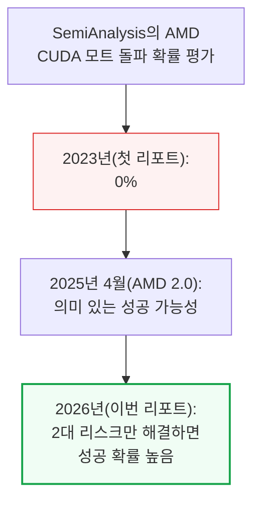
```mermaid
flowchart TD
    Rating["SemiAnalysis의 AMD<br/>CUDA 모트 돌파 확률 평가"] --> V1["2023년(첫 리포트):<br/>0%"]
    V1 --> V2["2025년 4월(AMD 2.0):<br/>의미 있는 성공 가능성"]
    V2 --> V3["2026년(이번 리포트):<br/>2대 리스크만 해결하면<br/>성공 확률 높음"]

    style V1 fill:#fef2f2,stroke:#dc2626
    style V3 fill:#f0fdf4,stroke:#16a34a,stroke-width:2px
```

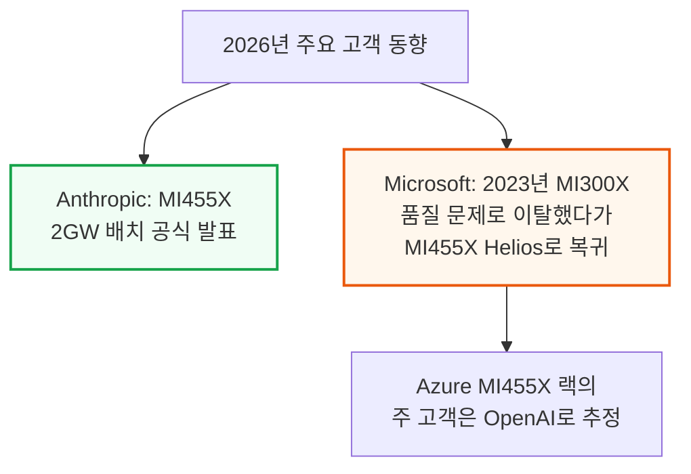
```mermaid
flowchart TD
    Customers["2026년 주요 고객 동향"] --> Anthropic["Anthropic: MI455X<br/>2GW 배치 공식 발표"]
    Customers --> MSFT["Microsoft: 2023년 MI300X<br/>품질 문제로 이탈했다가<br/>MI455X Helios로 복귀"]
    MSFT --> OpenAI2["Azure MI455X 랙의<br/>주 고객은 OpenAI로 추정"]

    style Anthropic fill:#f0fdf4,stroke:#16a34a,stroke-width:2px
    style MSFT fill:#fff7ed,stroke:#ea580c,stroke-width:2px
```

**📌 용어 풀이: 두 가지 핵심 리스크**
> - **리스크 1(공급망·양산)**: AMD의 첫 랙 스케일 시스템 Helios가 케이블 없는 트레이 설계를 채택하지 못해(Nvidia Rubin Oberon 랙은 이미 채택) 양산 속도가 느림 — 게다가 AMD의 SerDes(칩 간 고속 신호 전송 회로) 설계가 약해 백플레인(랙 내부 배선판)의 최대 85%에 신호를 다시 증폭해주는 리타이머가 필요, 랙당 550개 이상의 브로드컴 이더넷 리타이머가 들어가며 신뢰성 문제도 겪는 중
> - **리스크 2(내부 개발 인프라)**: AMD 엔지니어들의 공통 불만은 내부 소프트웨어 개발팀과 자동 테스트(CI)용으로 쓸 안정적인 GPU 클러스터가 만성적으로 부족하다는 것 — AI 코딩 에이전트도 GPU가 있어야 작동하는데, 이 부족이 AMD가 에이전트 시대의 이점을 활용하지 못하게 발목을 잡고 있음

---

## 2. AMD 리더십에 보내는 권고 - 내부 GPU 클러스터·CI 안정성 문제

**📌 핵심:**
- 지난 1년간 자동 테스트 품질 개선에 진전은 있었지만 속도가 여전히 부족 — **쿠버네티스용 Pollara NIC의 CI(자동 검증 테스트)가 Nvidia ConnectX 대비 매칭률 0%**(전 세계 대다수 추론 배포가 쿠버네티스를 사용)에 머물러 있고, Advancing AI 2026까지 따라잡겠다던 목표는 클러스터 부족으로 무산
- vLLM(오픈소스 추론 엔진) 쪽은 더 심각 — CUDA 대비 게이팅(병합 차단형 테스트, 통과해야만 코드 병합 가능) 매칭률 90% 달성을 목표로 순항 중이었으나, **AMD 경영진이 내부 용량 부족을 이유로 vLLM 팀 전용 클러스터를 다른 곳으로 재배치**하면서 진행 상황이 크게 후퇴
- 단일 노드 추론(에이전트 1개당 GPU 1~2개)까지는 내부 GPU가 충분하지만, 여러 노드에 걸친 분산 추론 최적화(WideEP·분리형 서빙) 시대에는 턱없이 부족 — 이번 달 추가되는 MI355X 2,000개, 연내 추가될 MI325X/MI355X 6,000개를 더해도 **Nvidia의 안정적 장기 내부 개발 클러스터 규모에 한 자릿수 이상 못 미침**
- 결론: 에이전트 코딩 확산으로 문제가 더 악화 — 과거엔 엔지니어 1명당 GPU 노드 2개면 충분했지만, 지금은 에이전트 1개당 GPU가 필요하고 사람 1명이 수십 개 에이전트를, 에이전트마다 또 수십 개 서브에이전트를 동시 실행할 수 있어 GPU 수요가 기하급수적으로 늘어남 — MI455(gfx1250)는 MI355(gfx950)와 완전히 다른 명령어셋(ISA)이라 별도 테스트까지 필요해 부담이 가중

---

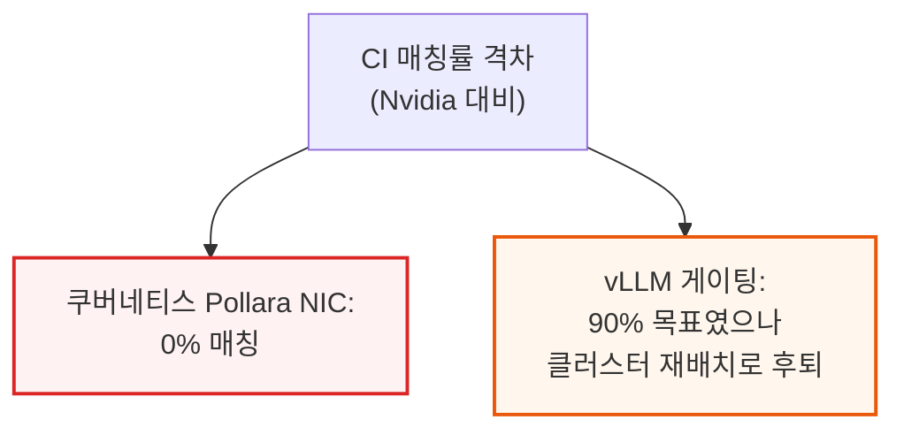
```mermaid
flowchart TD
    CIGap["CI 매칭률 격차<br/>(Nvidia 대비)"] --> K8s["쿠버네티스 Pollara NIC:<br/>0% 매칭"]
    CIGap --> VLLMGate["vLLM 게이팅:<br/>90% 목표였으나<br/>클러스터 재배치로 후퇴"]

    style K8s fill:#fef2f2,stroke:#dc2626,stroke-width:2px
    style VLLMGate fill:#fff7ed,stroke:#ea580c,stroke-width:2px
```

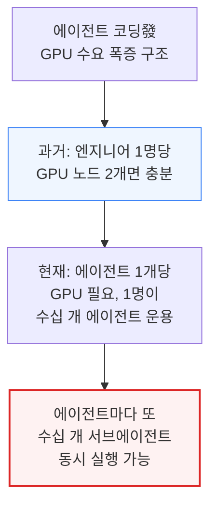
```mermaid
flowchart TD
    AgentDemand["에이전트 코딩發<br/>GPU 수요 폭증 구조"] --> Old["과거: 엔지니어 1명당<br/>GPU 노드 2개면 충분"]
    Old --> New["현재: 에이전트 1개당<br/>GPU 필요, 1명이<br/>수십 개 에이전트 운용"]
    New --> SubAgent["에이전트마다 또<br/>수십 개 서브에이전트<br/>동시 실행 가능"]

    style Old fill:#eff6ff,stroke:#3b82f6
    style SubAgent fill:#fef2f2,stroke:#dc2626,stroke-width:2px
```

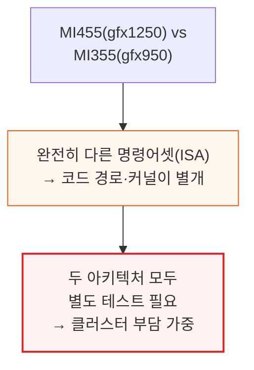
```mermaid
flowchart TD
    ISAGap["MI455(gfx1250) vs<br/>MI355(gfx950)"] --> Diff["완전히 다른 명령어셋(ISA)<br/>→ 코드 경로·커널이 별개"]
    Diff --> DoubleTest["두 아키텍처 모두<br/>별도 테스트 필요<br/>→ 클러스터 부담 가중"]

    style Diff fill:#fff7ed,stroke:#ea580c
    style DoubleTest fill:#fef2f2,stroke:#dc2626,stroke-width:2px
```

**📌 용어 풀이: 게이팅 테스트가 왜 중요한가**
> - **게이팅(Gating) 테스트**: 통과하지 못하면 코드를 병합(merge)할 수 없게 막아두는 테스트 — 버그가 있는 코드가 제품에 섞여 들어가는 것을 원천 차단하는 가장 강력한 품질 관문
> - AMD 경영진이 "게이팅이 아닌 통과율(non-gating pass rate)"을 대외적으로 강조하는 경우가 있는데, 실제로 품질을 좌우하는 것은 게이팅 매칭률과 게이팅 통과율이라는 것이 저자들의 지적

---

## 3. MI455X 실리콘 - 2나노 첫 출하와 역대 최대 패키지, Active LSI

**📌 핵심:**
- MI455X는 **AMD가 데이터센터용 2나노 실리콘을 세계 최초로 출하**하는 칩(연산 타일과 Venice CPU 모두 2나노 조기 적용) — 경쟁 가속기는 모두 3나노에 머물러 있어 공정 세대에서 한 발 앞섬
- 패키지 크기도 역대 최대 — **역대 최대 CoWoS-L 모듈(레티클 크기의 5.5배)**에 실리콘 총 3,470mm²를 담아, 단일 패키지에 들어간 실리콘 양으로는 업계 최다. 다만 이런 "실리콘을 쏟아붓는" 접근은 마이크로아키텍처(회로 설계 자체)에서 Nvidia에 뒤처진 것을 물량으로 벌충하는 성격이 강함 — 실제로 **MI455X는 Rubin(SM107)이 갖춘 3비트 룩업테이블 텐서 코어가 아직 없어**, HBM 대역폭을 상대적으로 아끼는 이점을 놓치고 있음
- 메모리는 강점 — **HBM4 12스택으로 패키지당 432GB**(Nvidia·Google은 8스택 288GB)를 담아 용량에서 앞서지만, 대역폭은 칩당 23.3TB/s로 Rubin(22TB/s)과 거의 같음 — Nvidia가 버스 폭은 AMD보다 50% 좁으면서도 핀 속도를 JEDEC 표준보다 훨씬 공격적으로(10.7Gbps, AMD 대비 40% 빠름) 끌어올려 격차를 메웠기 때문
- 결론: 패키지 내부의 칩렛(작은 칩 조각)을 잇는 다리(LSI)도 AMD가 최초로 "능동형(회로 내장)"으로 전환한 것으로 추정 — 신호 증폭을 다리 쪽이 나눠 맡아주면 칩 상단의 송수신 회로(PHY) 면적을 줄여 그만큼 연산·메모리 공간을 더 확보할 수 있음

---

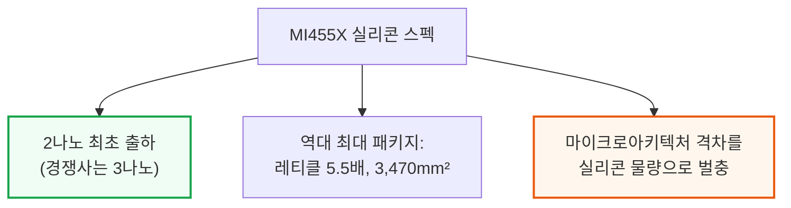
```mermaid
flowchart TD
    Silicon["MI455X 실리콘 스펙"] --> Node["2나노 최초 출하<br/>(경쟁사는 3나노)"]
    Silicon --> Package["역대 최대 패키지:<br/>레티클 5.5배, 3,470mm²"]
    Silicon --> Deficit["마이크로아키텍처 격차를<br/>실리콘 물량으로 벌충"]

    style Node fill:#f0fdf4,stroke:#16a34a,stroke-width:2px
    style Deficit fill:#fff7ed,stroke:#ea580c,stroke-width:2px
```

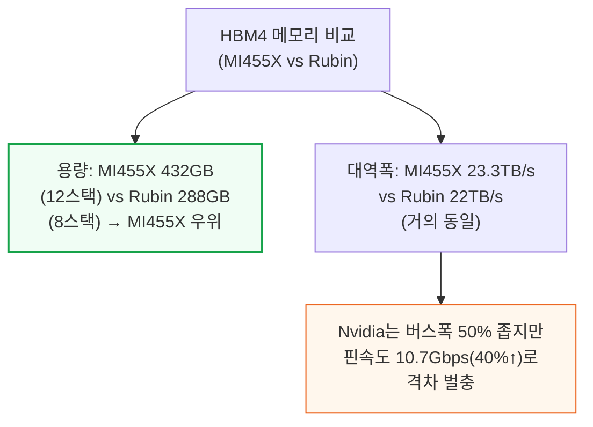
```mermaid
flowchart TD
    Memory["HBM4 메모리 비교<br/>(MI455X vs Rubin)"] --> Cap["용량: MI455X 432GB<br/>(12스택) vs Rubin 288GB<br/>(8스택) → MI455X 우위"]
    Memory --> BW["대역폭: MI455X 23.3TB/s<br/>vs Rubin 22TB/s<br/>(거의 동일)"]
    BW --> Why["Nvidia는 버스폭 50% 좁지만<br/>핀속도 10.7Gbps(40%↑)로<br/>격차 벌충"]

    style Cap fill:#f0fdf4,stroke:#16a34a,stroke-width:2px
    style Why fill:#fff7ed,stroke:#ea580c
```

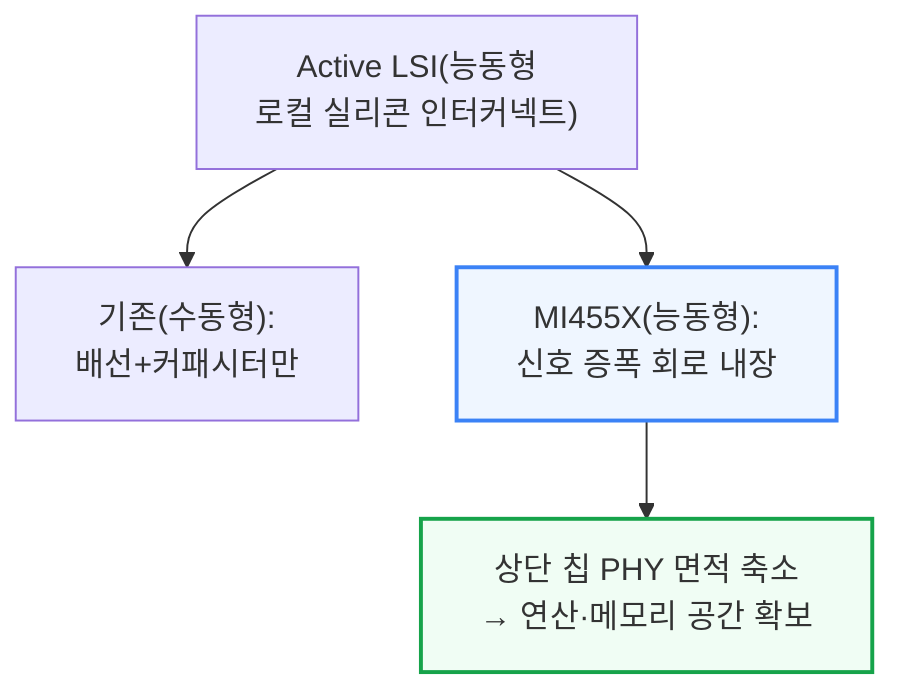
```mermaid
flowchart TD
    LSI["Active LSI(능동형<br/>로컬 실리콘 인터커넥트)"] --> Old2["기존(수동형):<br/>배선+커패시터만"]
    LSI --> New2["MI455X(능동형):<br/>신호 증폭 회로 내장"]
    New2 --> Benefit["상단 칩 PHY 면적 축소<br/>→ 연산·메모리 공간 확보"]

    style New2 fill:#eff6ff,stroke:#3b82f6,stroke-width:2px
    style Benefit fill:#f0fdf4,stroke:#16a34a,stroke-width:2px
```

**📌 용어 풀이: 3비트 룩업테이블 텐서 코어**
> - Rubin(Nvidia 차세대 GPU)에 탑재된 신기능으로, 가중치 값을 통째로 저장하는 대신 3비트 색인만 저장하고 실제 값은 공유 코드북에서 즉석으로 찾아 쓰는 방식 — 저장 용량이 줄어 같은 메모리 대역폭으로 더 많은 가중치를 옮길 수 있음(자세한 원리는 [Vera Rubin 분석 문서](<./[260723] 베라 루빈 NVL72 vs GB200 NVL72 - 추론 TCO·아키텍처 분석.md>) 참고)
> - MI455X는 이 기능이 아직 없어, 같은 효과를 내려면 실리콘(연산 유닛·HBM 스택)을 더 많이 얹어 벌충해야 하는 구조

---

## 4. Meta 커스텀 MI455X - 절반 스펙의 딜레마

**📌 핵심:**
- AMD의 최대 GPU 고객사 중 하나인 Meta가 정작 AMD의 강점(칩 하나에 실리콘·메모리를 최대한 욱여넣는 집적도)을 활용하지 않기로 결정 — **Meta가 주문한 MI455X 대부분은 연산 다이 8개→4개, HBM 12스택→6스택으로 절반 깎은 맞춤형(Recsys 특화) 사양**, HBM4 적층 단수도 표준 12-Hi에서 8-Hi로 낮춤
- 연산·메모리를 절반으로 줄이면 CPU 대비 GPU 연산 비율이 높아지는 결과가 나오는데, 이는 Nvidia GB200 NVL72의 Meta 특화 버전 "Ariel"과 같은 패턴 — 이 결정은 **Meta 내 LLM 전담 조직(TBD Lab)이 출범하기도 전에 Recsys(추천시스템) 인프라팀 단독으로 내린 것**이라, 정작 이 절반 사양은 TBD Lab의 관심을 전혀 끌지 못하고 외부 고객에게도 매력이 없음
- 결론: 이 결정은 Meta 내 AMD 물량 자체를 갉아먹을 위험이 큼 — TBD Lab은 (스케일업 영역에서 Rubin 대비 연산·HBM이 크게 부족한) 절반 사양 MI455X 대신 Rubin을 압도적으로 선호할 것으로 SemiAnalysis는 전망, AMD가 직접 나서 TBD Lab에 표준 사양 MI455X를 공급하도록 조율해야 한다고 권고(마크 저커버그가 이미 인프라 전략·조직문화 개편에 착수한 것은 긍정적 신호)

---

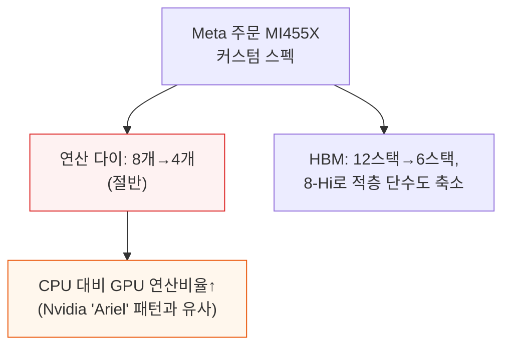
```mermaid
flowchart TD
    MetaCustom["Meta 주문 MI455X<br/>커스텀 스펙"] --> Compute["연산 다이: 8개→4개<br/>(절반)"]
    MetaCustom --> HBM["HBM: 12스택→6스택,<br/>8-Hi로 적층 단수도 축소"]
    Compute --> Ratio["CPU 대비 GPU 연산비율↑<br/>(Nvidia 'Ariel' 패턴과 유사)"]

    style Compute fill:#fef2f2,stroke:#dc2626
    style Ratio fill:#fff7ed,stroke:#ea580c
```

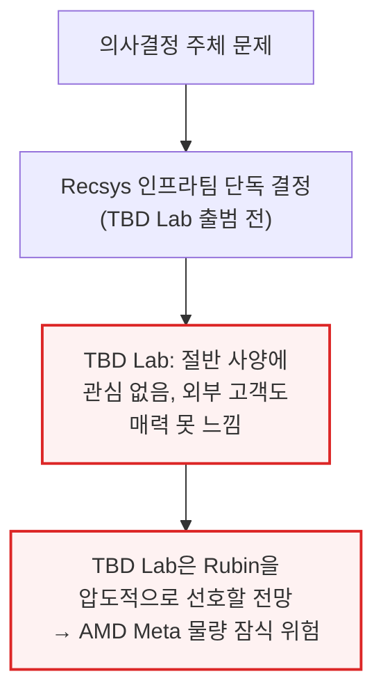
```mermaid
flowchart TD
    Decision["의사결정 주체 문제"] --> Recsys["Recsys 인프라팀 단독 결정<br/>(TBD Lab 출범 전)"]
    Recsys --> NoInterest["TBD Lab: 절반 사양에<br/>관심 없음, 외부 고객도<br/>매력 못 느낌"]
    NoInterest --> Risk["TBD Lab은 Rubin을<br/>압도적으로 선호할 전망<br/>→ AMD Meta 물량 잠식 위험"]

    style NoInterest fill:#fef2f2,stroke:#dc2626,stroke-width:2px
    style Risk fill:#fef2f2,stroke:#dc2626,stroke-width:2px
```

---

## 5. Helios 랙 네트워킹 개요 - 스위치드 스케일업 전환

**📌 핵심:**
- MI455X는 **AMD 최초로 "스위치드(switched) 스케일업" 방식을 도입한 GPU** — MI300X~MI355X까지 써온 GPU 8개 점대점(point-to-point) 메시 연결에서, 랙 전체(72개 GPU)를 하나의 고속망으로 묶는 방식으로 대전환
- Helios 랙은 **MI455X GPU 72개를 브로드컴 Tomahawk6 스위치 12개(스위치당 102.4Tbit/s)로 단일 계층 전결합(all-to-all) 연결** — GPU 1개당 200G UALoE(Ultra Accelerator Link over Ethernet) 레인 72개, 단방향 대역폭 1.8TB/s를 확보. 스케일아웃(랙 밖 연결)은 400G Pollara에서 800G Vulcano로 병행 전환하며 GPU당 1.6Tbit/s
- 결론: AMD가 자체 스위치 대신 브로드컴의 범용(merchant) 스위치를 쓰다 보니 스위치의 512개 레인 중 432개만 활용(과잉 프로비저닝) — Nvidia는 28.8T NVSwitch를 애초에 72-GPU 랙에 딱 맞춰 설계해 낭비 없이 400Gbit/s씩 균등 배분하는 것과 대조적. MI500 세대에서는 스케일업 도메인을 3개 랙·256개 GPU까지 확장할 계획

---

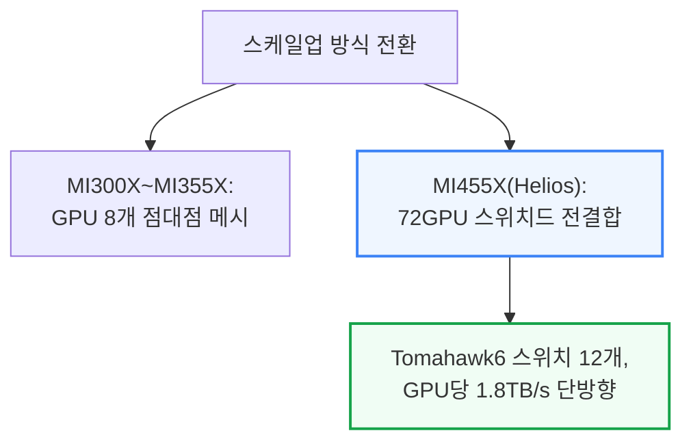
```mermaid
flowchart TD
    Switch["스케일업 방식 전환"] --> Old3["MI300X~MI355X:<br/>GPU 8개 점대점 메시"]
    Switch --> New3["MI455X(Helios):<br/>72GPU 스위치드 전결합"]
    New3 --> Spec["Tomahawk6 스위치 12개,<br/>GPU당 1.8TB/s 단방향"]

    style New3 fill:#eff6ff,stroke:#3b82f6,stroke-width:2px
    style Spec fill:#f0fdf4,stroke:#16a34a,stroke-width:2px
```

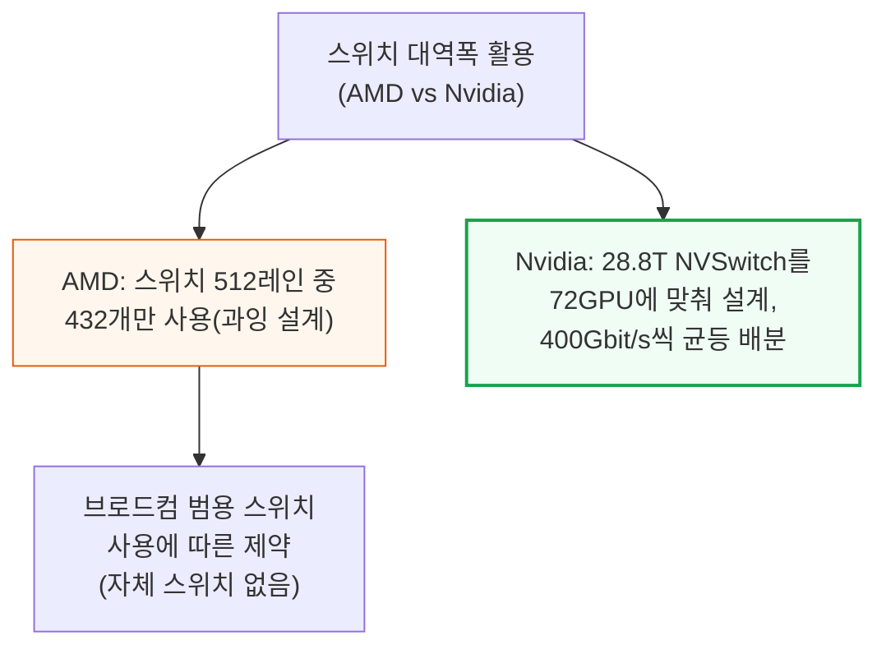
```mermaid
flowchart TD
    Waste["스위치 대역폭 활용<br/>(AMD vs Nvidia)"] --> AMDUse["AMD: 스위치 512레인 중<br/>432개만 사용(과잉 설계)"]
    Waste --> NvUse["Nvidia: 28.8T NVSwitch를<br/>72GPU에 맞춰 설계,<br/>400Gbit/s씩 균등 배분"]
    AMDUse --> Why2["브로드컴 범용 스위치<br/>사용에 따른 제약<br/>(자체 스위치 없음)"]

    style AMDUse fill:#fff7ed,stroke:#ea580c
    style NvUse fill:#f0fdf4,stroke:#16a34a,stroke-width:2px
```

---

## 6. Helios 랙 아키텍처 재점검 - 트레이 구조·부분 코디자인·메모리 디스펙

**📌 핵심:**
- Helios 랙은 **컴퓨트 트레이 18개(각 4×MI455X GPU + Venice CPU 1개) + 스케일업 스위치 트레이 6개**로 구성(총 72GPU·18CPU·스위치 ASIC 12개) — 다만 AMD는 스케일업 스위치 자체를 만들지 못해 브로드컴에 의존하는 "부분 코디자인"에 그침(Nvidia는 스위치까지 자체 설계해 랙 전체를 완전히 통합 설계)
- 눈에 띄는 후퇴 하나는 **메모리 디스펙(사양 축소)** — 이전 로드맵에서는 GPU당 최대 1TB의 LPDDR5X를 2차 메모리로 직접 붙일 계획이었으나 이번 최종 사양에서 완전히 사라짐(메모리 공급 타이트화의 결과로 추정)
- **백플레인 리타이밍 문제**: Nvidia의 Oberon 백플레인은 완전 수동형인데 반해, AMD는 200G SerDes(고속 신호 회로) 품질이 약해 배선 손실을 보정하려 리타이머(신호 재증폭 칩)를 추가로 넣어야 함 — Meta 배포분 기준 스케일업 링크의 약 85%에 브로드컴 리타이머가 필요, 이는 추가 비용·전력 부담이자 랙 조립 시 일일이 튜닝해야 하는 번거로운 작업
- 결론: **케이블 방식(flyover cable)도 발목** — AMD는 Nvidia GB200/GB300이 겪었던 것과 같은 케이블 조립 난이도 문제를 그대로 물려받음(Nvidia는 이 경험으로 Vera Rubin NVL72에서 케이블 없는 설계로 전환했지만, Helios 설계 확정 시점엔 이미 늦어 반영 못 함) — 랙당 백플레인+컴퓨트 트레이 비용만 $68,928(백플레인 $44,352 + 플라이오버 케이블 $24,576)

---

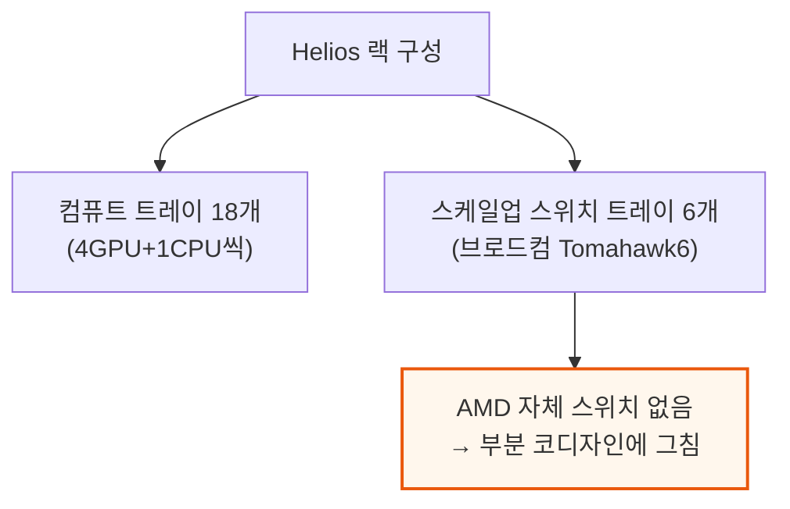
```mermaid
flowchart TD
    Rack["Helios 랙 구성"] --> Compute3["컴퓨트 트레이 18개<br/>(4GPU+1CPU씩)"]
    Rack --> SwitchTray["스케일업 스위치 트레이 6개<br/>(브로드컴 Tomahawk6)"]
    SwitchTray --> Partial["AMD 자체 스위치 없음<br/>→ 부분 코디자인에 그침"]

    style Partial fill:#fff7ed,stroke:#ea580c,stroke-width:2px
```

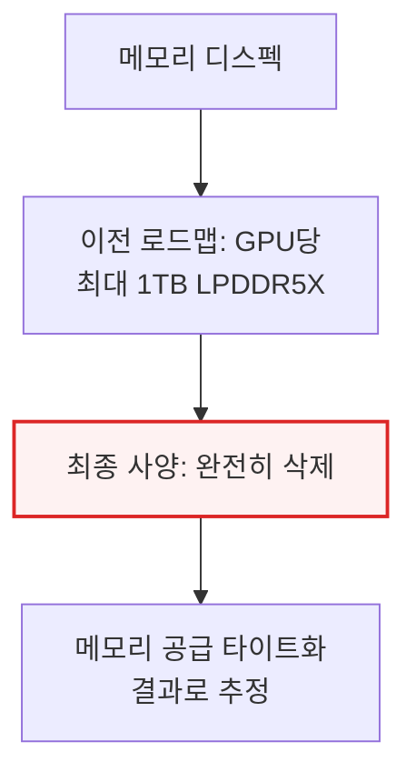
```mermaid
flowchart TD
    Despec["메모리 디스펙"] --> Plan["이전 로드맵: GPU당<br/>최대 1TB LPDDR5X"]
    Plan --> Final["최종 사양: 완전히 삭제"]
    Final --> Cause["메모리 공급 타이트화<br/>결과로 추정"]

    style Final fill:#fef2f2,stroke:#dc2626,stroke-width:2px
```

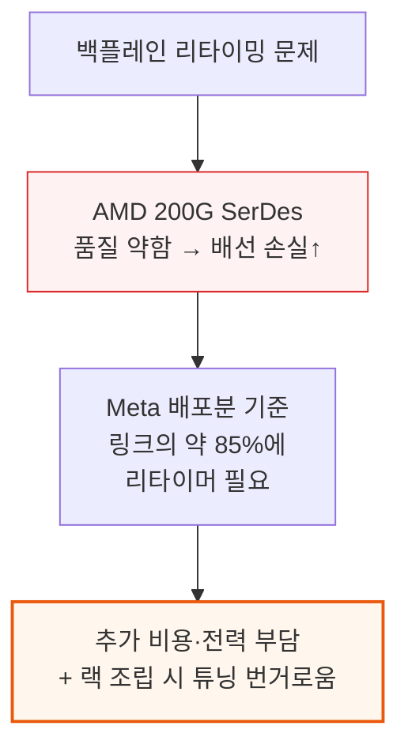
```mermaid
flowchart TD
    Retimer["백플레인 리타이밍 문제"] --> SerDes["AMD 200G SerDes<br/>품질 약함 → 배선 손실↑"]
    SerDes --> Need["Meta 배포분 기준<br/>링크의 약 85%에<br/>리타이머 필요"]
    Need --> Cost["추가 비용·전력 부담<br/>+ 랙 조립 시 튜닝 번거로움"]

    style SerDes fill:#fef2f2,stroke:#dc2626
    style Cost fill:#fff7ed,stroke:#ea580c,stroke-width:2px
```

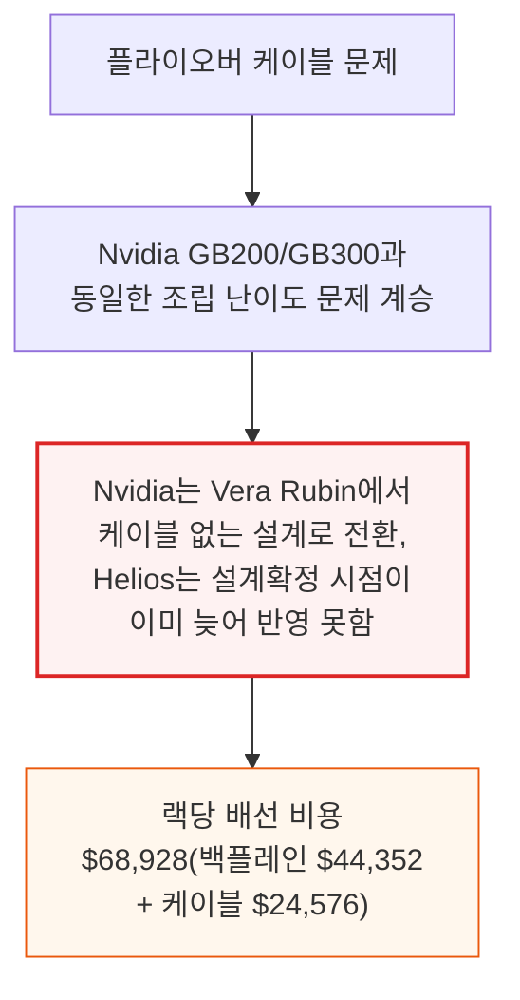
```mermaid
flowchart TD
    Cable["플라이오버 케이블 문제"] --> Legacy["Nvidia GB200/GB300과<br/>동일한 조립 난이도 문제 계승"]
    Legacy --> TooLate["Nvidia는 Vera Rubin에서<br/>케이블 없는 설계로 전환,<br/>Helios는 설계확정 시점이<br/>이미 늦어 반영 못함"]
    TooLate --> CostBD["랙당 배선 비용<br/>$68,928(백플레인 $44,352<br/>+ 케이블 $24,576)"]

    style TooLate fill:#fef2f2,stroke:#dc2626,stroke-width:2px
    style CostBD fill:#fff7ed,stroke:#ea580c
```

---

## 7. Helios 스케일업·스케일아웃 토폴로지와 Vulcano NIC 지능형 라우팅

**📌 핵심:**
- **스케일업(랙 내부) 연결**: 컴퓨트 트레이 18개 각각의 MI455X 4개가 UALoE 링크 36개씩(200G 이더넷 2레인 묶음)을 뻗어 GPU당 총 14.4Tbit/s 단방향 대역폭 확보 — 12개 스위치 ASIC이 GPU 72개와 전부 연결되는 1계층 평면(flat) 구조, 구리 백플레인으로 GPU당 144쌍의 차동 신호선(랙 전체로는 10,368쌍)이 필요
- **스케일아웃(랙 밖 연결)**: GPU당 최대 3개의 AMD Pensando Vulcano 800 NIC(신경망 전용 네트워크 카드)를 연결해 2.4Tbit/s까지 확보 가능(실제 주력 구성은 NIC 2개, 1.6Tbit/s로 예상) — 13만 1천개 MI455X급 대형 클러스터에서는 8-플레인(독립 평면) 구조로 리프-스파인 스위치 6,144개가 필요, GPU당 네트워킹 부품 원가는 약 $8,000
- **Vulcano NIC의 3대 지능형 라우팅 기법**: ① 지능형 패킷 스프레이(같은 흐름의 패킷을 여러 경로에 분산해 특정 경로 정체를 방지) ② 경로 인식 혼잡 제어(각 경로의 실시간 혼잡도를 추적해 정체 전 미리 트래픽을 이동) ③ 순서 무관 패킷 처리(경로가 여러 개라 도착 순서가 뒤섞여도 GPU 메모리에 바로 기록, 유실분만 재전송) — Nvidia ConnectX NIC + Spectrum-X 적응형 라우팅과 같은 문제를 해결하지만, AMD는 개방형 UEC(Ultra Ethernet Consortium) 표준과 다중 벤더 패브릭을 채택한다는 점이 차이
- 결론: AI 학습 클러스터의 3대 고질병(장시간·대용량 흐름이 특정 경로를 막는 "코끼리 흐름", 흐름 종류가 적어 일부 경로만 붐비는 "저엔트로피", 그 결과로 생기는 대역폭 활용 불균형)을 네트워크 패브릭이 아니라 NIC 레벨에서 해결하는 접근 — 운영자가 이미 가진 패브릭·워크로드에 맞춰 스위치 기반/NIC 기반/소스 라우팅 중 원하는 방식을 고를 수 있어 유연성이 높음

---

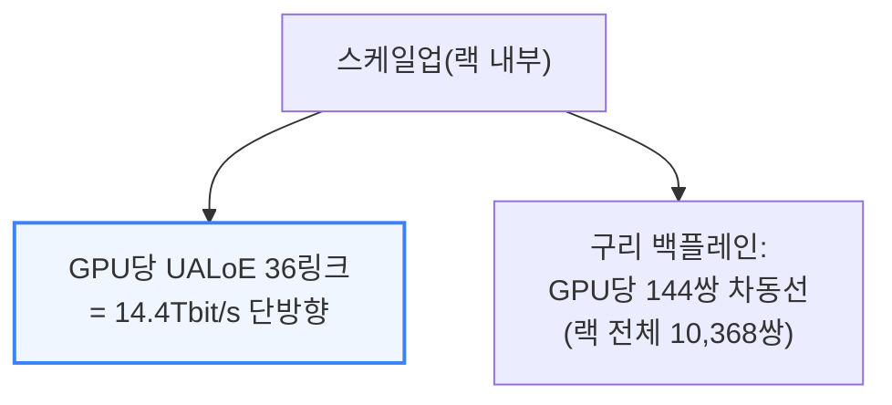
```mermaid
flowchart TD
    ScaleUp["스케일업(랙 내부)"] --> Lane["GPU당 UALoE 36링크<br/>= 14.4Tbit/s 단방향"]
    ScaleUp --> Copper["구리 백플레인:<br/>GPU당 144쌍 차동선<br/>(랙 전체 10,368쌍)"]

    style Lane fill:#eff6ff,stroke:#3b82f6,stroke-width:2px
```

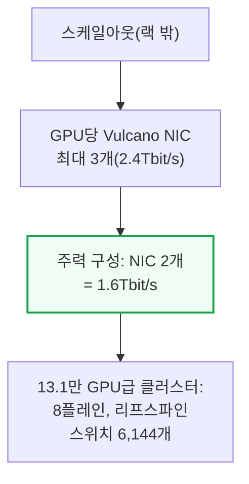
```mermaid
flowchart TD
    ScaleOut["스케일아웃(랙 밖)"] --> NIC["GPU당 Vulcano NIC<br/>최대 3개(2.4Tbit/s)"]
    NIC --> Main["주력 구성: NIC 2개<br/>= 1.6Tbit/s"]
    Main --> LargeCluster["13.1만 GPU급 클러스터:<br/>8플레인, 리프스파인<br/>스위치 6,144개"]

    style Main fill:#f0fdf4,stroke:#16a34a,stroke-width:2px
```

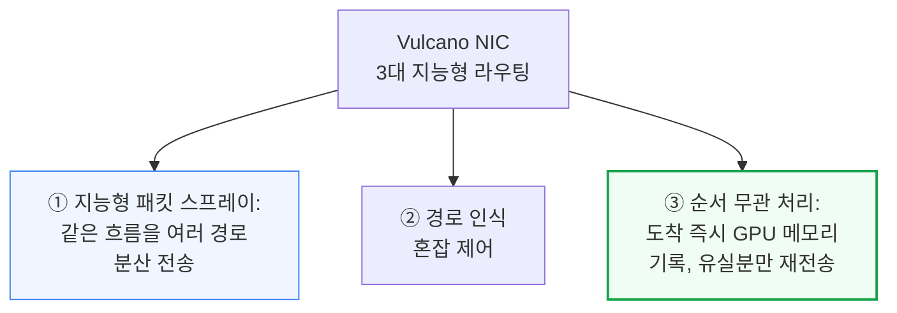
```mermaid
flowchart TD
    Vulcano["Vulcano NIC<br/>3대 지능형 라우팅"] --> Spray["① 지능형 패킷 스프레이:<br/>같은 흐름을 여러 경로<br/>분산 전송"]
    Vulcano --> Congestion["② 경로 인식<br/>혼잡 제어"]
    Vulcano --> OOO["③ 순서 무관 처리:<br/>도착 즉시 GPU 메모리<br/>기록, 유실분만 재전송"]

    style Spray fill:#eff6ff,stroke:#3b82f6
    style OOO fill:#f0fdf4,stroke:#16a34a,stroke-width:2px
```

**📌 용어 풀이: 코끼리 흐름·저엔트로피**
> - **코끼리 흐름(Elephant Flow)**: AI 학습은 소수의 초대형·장시간 데이터 흐름으로 이뤄지는데, 이런 흐름이 특정 네트워크 경로를 오래 독점해 혼잡을 유발
> - **저엔트로피(Low Entropy)**: 흐름의 가짓수 자체가 적어서, 기존 방식(해시로 흐름을 경로 하나에 고정)으로는 일부 경로만 붐비고 나머지는 노는 현상 발생

---

## 8. CDNA5 마이크로아키텍처 - Nvidia 설계에 수렴

**📌 핵심:**
- CDNA5(MI455X의 연산 회로 세대명)는 여러 면에서 **Nvidia Hopper(SM90) 아키텍처에 수렴** — 웨이브(동시 실행 스레드 묶음)당 스레드 수를 32개로 줄여 Nvidia의 워프(warp)와 맞췄고, 기존 CDNA3/4의 Infinity Cache+소형 L2 캐시 구조를 FCD(Fabric and Cache Die)당 96MB 단일 L2 캐시로 통합 — "글로벌 메모리→L2 캐시→공유메모리"라는 Nvidia식 메모리 계층에 근접, AMD 커널 개발자들의 오랜 골칫거리였던 계층 간 지연시간 관리 부담이 줄어들 전망
- **스테이징 메모리는 오히려 Nvidia보다 큼**: LDS(SMEM 대응) 320KB, VGPR(스레드 레지스터 대응) 32KB로 스레드당 레지스터 1,024개 확보 — 다만 MMA(행렬곱) 처리 단위는 여전히 16x16xK로 커지지 않아, 웨이브 수 증가에 대응하려 레지스터를 늘린 것으로 해석(Nvidia처럼 MMA 범위를 워프그룹 단위로 확장하지 않음)
- **TDM(텐서 데이터 이동기)**은 Nvidia TMA(텐서 메모리 가속기)와 거의 동일한 기능 — HBM에서 LDS로 레지스터 경유 없이 데이터를 옮기며 5차원 타일링·경계 검사·멀티캐스트까지 지원, 다만 디스크립터(전송 명세)를 SGPR에서 불러온다는 점이 Nvidia와 다름(Rubin은 최근 인라인 디스크립터 갱신 기능을 선보임)
- 결론: **CDNA4→5 전환은 연산 유닛 확장보다는 보수적** — Nvidia는 매 세대 행렬곱 크기를 공격적으로 키워 Blackwell에서는 SM 2개가 협업해야 하는 크기까지 확장했지만, CDNA5는 MMA 크기를 거의 키우지 않아 이런 확장이나 Rubin의 3비트 룩업테이블 같은 데이터 압축 혁신은 아직 보이지 않음. 다만 gfx1250은 NVFP4(Nvidia의 4비트 포맷)를 네이티브로 지원하고, UE5M3라는 독자 스케일 포맷도 새로 지원해 정확도 손실을 줄일 잠재력이 있음

---

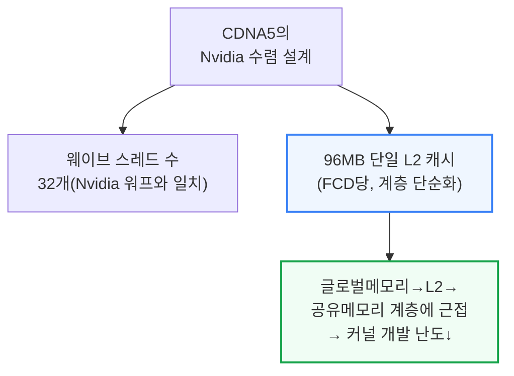
```mermaid
flowchart TD
    Converge["CDNA5의<br/>Nvidia 수렴 설계"] --> Wave["웨이브 스레드 수<br/>32개(Nvidia 워프와 일치)"]
    Converge --> Cache["96MB 단일 L2 캐시<br/>(FCD당, 계층 단순화)"]
    Cache --> Benefit2["글로벌메모리→L2→<br/>공유메모리 계층에 근접<br/>→ 커널 개발 난도↓"]

    style Cache fill:#eff6ff,stroke:#3b82f6,stroke-width:2px
    style Benefit2 fill:#f0fdf4,stroke:#16a34a,stroke-width:2px
```

```mermaid
flowchart TD
    Conservative["CDNA5 확장 방식:<br/>보수적"] --> NoMMA["MMA 크기 그대로<br/>(16x16xK, 확장 없음)"]
    NoMMA --> Reg["대신 스레드당<br/>레지스터 4배 확보<br/>(웨이브 수 증가 대응)"]
    Conservative --> NvComp["Nvidia: 매 세대<br/>MMA 크기 공격적 확장<br/>(Blackwell은 SM 2개 협업)"]

    style NoMMA fill:#fff7ed,stroke:#ea580c
    style NvComp fill:#eff6ff,stroke:#3b82f6
```

```mermaid
flowchart TD
    FP4["4비트 포맷 지원 현황"] --> Native["gfx1250: NVFP4<br/>네이티브 지원"]
    FP4 --> UE5["CDNA5 독자: UE5M3<br/>스케일 포맷 추가 지원<br/>(정확도 손실 감소 잠재력)"]
    FP4 --> Missing["미지원: Rubin식<br/>3비트 룩업테이블<br/>데이터 압축"]

    style Native fill:#f0fdf4,stroke:#16a34a,stroke-width:2px
    style Missing fill:#fff7ed,stroke:#ea580c
```

---

## 9. AMD 소프트웨어 - CUDA 모트는 옮겨갔다

**📌 핵심:**
- AMD 소프트웨어의 문제는 더 이상 "ROCm이 고장 났다"가 아니라 **"ROCm은 빠르게 좋아지고 있지만, 경쟁의 최전선(모트) 자체가 더 빨리 옮겨갔다"** — 2025년 4월 "AMD 2.0" 리포트에서 "올바른 방향"이라 평가했고, 이후 "소프트웨어 품질이 대폭 개선됐다"고 재확인한 흐름의 연장선
- **CI(자동 검증)는 개선 중이나 미완**: 2026년 1월 vLLM 정식 배포에 안정적 ROCm 지원이 들어갔고 이후 나이틀리(매일 자동 빌드) 테스트도 추가 — 6월엔 8개 주요 테스트 그룹에 AMD 미러·게이트 추가, 7월엔 불안정 테스트 정리까지 마쳤지만 회귀 대시보드·AITER 정확도 게이트·엔드투엔드 분산 테스트·자동 성능 게이팅은 아직 로드맵 단계. 쿠버네티스 배포의 핵심인 llm-d(오픈소스 분산 추론 오케스트레이션)에서 Pollara NIC CI 매칭률은 여전히 0%
- **단일 노드 성능·재현성은 실질적 성과**: 3월 Kimi K2.5 1T 모델에서 30일 만에 최대 18배 인터랙티비티(상호작용성) 개선을 AITER/vLLM 수정으로 달성, AMD 자체 2026년 2월 기술 문서는 AITER 기반 최적화로 기준 대비 약 1.08~1.2배 처리량 향상을 주장 — MiniMax M3 성능도 ATOM 스택 최적화로 B200을 따라잡음. ROCm 추론 문서·레시피 계층도 1년 전보다 훨씬 두꺼워짐(vLLM·SGLang·분산 MoRI·Mooncake 전 구간 커버)
- 결론: 개발자 우선 자세, 업스트림 정렬, Day 0 모델 지원, 빠른 릴리스 주기 등 "방향성"은 옳다는 것이 저자들의 평가 — vLLM 공식 블로그도 "그냥 포팅하던 시대는 끝났다"며 최신 AMD/vLLM 연동에서 1.2~4.4배 처리량 향상을 확인. 다만 게이팅 매칭·안정적 CI 클러스터 확보가 방향성을 뒷받침하지 못하고 있다는 것이 핵심 병목

---

```mermaid
flowchart TD
    MoatShift["CUDA 모트 재정의"] --> Old4["기존 프레임:<br/>'ROCm이 고장났다'"]
    MoatShift --> New4["현재 프레임:<br/>'ROCm은 개선 중이나<br/>경쟁 전선이 더 빨리 이동'"]

    style New4 fill:#fff7ed,stroke:#ea580c,stroke-width:2px
```

```mermaid
flowchart TD
    CIProgress["CI 진행 상황"] --> Done["완료: vLLM 안정 지원,<br/>나이틀리 테스트,<br/>8개 그룹 게이트"]
    CIProgress --> Todo["미완: 회귀 대시보드,<br/>AITER 정확도 게이트,<br/>llm-d Pollara CI 0%"]

    style Done fill:#f0fdf4,stroke:#16a34a,stroke-width:2px
    style Todo fill:#fef2f2,stroke:#dc2626,stroke-width:2px
```

```mermaid
flowchart TD
    SingleNode["단일 노드 성과"] --> Kimi["Kimi K2.5 1T:<br/>30일 내 최대 18배<br/>인터랙티비티 개선"]
    SingleNode --> AITER["AMD 자체 발표:<br/>AITER 기반 1.08~1.2배<br/>처리량 향상"]
    SingleNode --> MiniMax["MiniMax M3:<br/>ATOM 스택으로<br/>B200 성능 따라잡음"]

    style Kimi fill:#f0fdf4,stroke:#16a34a,stroke-width:2px
    style MiniMax fill:#f0fdf4,stroke:#16a34a,stroke-width:2px
```

---

## 10. InferenceX로 본 개발 속도와 에이전트 기반 Day 0 지원

**📌 핵심:**
- SemiAnalysis는 자체 벤치마크 플랫폼 **InferenceX**로 신규 모델이 나왔을 때 AMD가 얼마나 빨리 최적 성능에 도달하는지("개발 속도")를 추적 — DeepSeek V4 출시 후 첫 47일간 MI355X SGLang 단일 노드 성능이 빠르게 개선됐고, MiniMax M3에서도 비슷하게 신속한 반복 개선이 확인됨. 분산(disaggregated) 추론에서도 6개월 전 몇 달씩 뒤처지던 것과 달리 이제는 상당히 따라잡은 모습(MoRI 백엔드 개선과 Mooncake 최적화 덕분)
- **에이전트가 Day 0(모델 출시 당일) 지원을 가능케 함**: DeepSeek V4·MiniMax M3의 Day 0 지원을 SemiAnalysis 팀이 직접 구현 — 특정 설정(예: MiniMax M3 vLLM MI355X FP8)에 대해 Claude Code/Codex 에이전트를 띄워 인터넷에서 Day 0 레시피를 가져오고, InferenceX에 필요한 배관 작업을 만들고, 스윕(반복 실험)을 실행하는 흐름이 정착 — 엔진 오류가 나면 에이전트가 원인을 스스로 진단해 자동 재시도하거나 사람에게 알림, 여러 설정을 동시 병렬 처리 가능. 이런 신속한 반복은 3~6개월 전 2.5명 규모 팀으로는 불가능했던 일
- 저자들은 이를 **"테스트·소프트웨어 작성은 더 이상 작년만큼의 모트가 아니다"**로 해석 — AI 에이전트가 예전엔 사람 엔지니어만 하던 일을 대신하면서 CUDA 모트의 상대적 중요성이 낮아지고, AMD가 Nvidia 대비 엔지니어 머릿수 열세를 만회하는 데 도움이 됨. AMD도 이 흐름에 적극 편승 — Advancing AI 2026에서 **ROCm.ai**(에이전트로 커널·성능 튜닝을 반복하도록 돕는 스킬·프레임워크 모음)를 발표, 핵심은 GEAK(커널을 쓰고 튜닝하는 에이전트)·Hyperloom(서빙 워크로드를 프로파일링해 병목 커널에 에이전트를 투입하는 오케스트레이터)·AgentKernelArena(Claude Code·Codex·Cursor·GEAK를 같은 커널 과제로 맞대결시키는 평가 하네스) 등
- 결론: 저자들은 새 벤치마크 시나리오 **AgentX**도 소개 — 기존 InferenceX의 단일턴 시나리오(8k입력/1k출력 등)는 라우터·KV 캐시 전송·스케줄러 같은 시스템 전체를 평가하지 못한다는 한계를 보완하기 위해, 실제 SemiAnalysis Claude Code·Codex 사용 기록(약 3개월치, 중간값 입력 14만 토큰·출력 396토큰·캐시 적중률 99.2%)을 재생하는 방식 — WEKA·Inferact·RadixArk·LMCache·Mooncake·Nvidia·AMD 등과 공동 개발 중이며 결과는 InferenceX에 순차 공개 예정

---

```mermaid
flowchart TD
    Velocity["InferenceX로 측정한<br/>AMD 개발 속도"] --> DSV4["DeepSeek V4:<br/>출시 47일간 빠른 개선"]
    Velocity --> MiniMax2["MiniMax M3:<br/>신속한 반복 개선"]
    Velocity --> Disagg2["분산 추론: 6개월 전<br/>수개월 뒤처짐→<br/>현재 상당히 추격"]

    style Disagg2 fill:#f0fdf4,stroke:#16a34a,stroke-width:2px
```

```mermaid
flowchart TD
    AgentLoop["에이전트 기반<br/>Day 0 지원 흐름"] --> Pull["레시피 수집→<br/>InferenceX 배관 작업→<br/>스윕 실행"]
    Pull --> Debug["엔진 오류 시<br/>자동 진단·재시도<br/>또는 사람에게 알림"]
    Debug --> Parallel["여러 설정<br/>동시 병렬 처리"]

    style Parallel fill:#f0fdf4,stroke:#16a34a,stroke-width:2px
```

```mermaid
flowchart TD
    ROCmAI["ROCm.ai<br/>(Advancing AI 2026 발표)"] --> GEAK["GEAK: 커널 작성·<br/>튜닝 에이전트"]
    ROCmAI --> Hyperloom["Hyperloom: 병목 커널에<br/>에이전트 투입하는<br/>오케스트레이터"]
    ROCmAI --> Arena["AgentKernelArena:<br/>Claude Code·Codex·GEAK<br/>맞대결 평가"]

    style GEAK fill:#eff6ff,stroke:#3b82f6,stroke-width:2px
```

**📌 용어 풀이: AgentX 벤치마크**
> - 기존 InferenceX 시나리오는 입력 8천·출력 1천 토큰 같은 단일턴 무작위 요청만 다뤄, 라우터·KV 캐시 전송·스케줄러 등 시스템 전체 성능은 평가하지 못함
> - AgentX는 실제 코딩 에이전트 사용 기록을 재생해 훨씬 긴 입력(중간값 14만 토큰)과 짧은 출력(중간값 396토큰), 매우 높은 캐시 적중률(99.2%)이라는 현실적 트래픽 패턴으로 평가 — KV 캐시 오프로딩 기법의 실효성까지 검증 가능

---

## 11. 단일 노드는 끝, 분산 추론이 새 전장 - WideEP와 분리형 서빙

**📌 핵심:**
- 경쟁의 최전선이 **단일 노드 집약형에서 다중 노드 분산형 추론으로 이동** — SemiAnalysis의 InferenceX v2 리포트에서 지적한 AMD의 "소프트웨어 조합성 문제"(개별 최적화는 되는데 여러 개를 합치면 스택이 깨지는 문제)가 핵심 쟁점. GTC 2026 리뷰에서는 Nvidia의 다음 모트를 분리형 추론 시스템(어텐션/피드포워드 분리 포함)으로 규정 — 어텐션은 상태 유지·KV 의존적, FFN(피드포워드)은 무상태·배치 확장 가능이라는 성격 차이 때문에 두 단계를 분리해 최적 하드웨어에 배치할 수 있고, 이러면 추론 경쟁력이 "커널 하나의 문제"가 아니라 "분산 시스템 문제"로 바뀜
- **오픈 CUDA 생태계는 2024년 초부터 분리형 서빙+WideEP를 이미 배포**해온 반면, AMD의 첫 공개 PD 분리형+WideEP 레시피는 2026년 1월에야 InferenceX를 통해 등장 — 활성 전문가 수는 4~10개로 작기만, 전체 전문가 수는 128·256·384·512개로 계속 커지는 MoE(전문가 혼합) 모델 트렌드가 조합성 문제를 더 시급하게 만듦(KV 캐시도 MLA식 저랭크 설계로 헤드 1~2개 수준까지 압축되는 추세)
- **WideEP 효과**: DeepSeek-R1(전문가 256개) 기준 8-GPU 단일 노드(EP8)에서 64-GPU(EP64)로 넓히면 GPU당 담당 전문가가 32개→4개로 줄어 HBM 여유가 생기고 동시 배치 크기가 커짐 — Nvidia는 WideEP로 GPU당 처리량 최대 2.28배 향상을 보고. **분리형 서빙 효과**: DeepSeek-R1에서 동일 인터랙티비티 기준 MoRI SGL 분리형 구성이 단일 노드 대비 처리량 2~3배
- 결론: 다만 정확도 문제가 여전 — 2026년 3월 이전에는 DP-attention을 쓴 분리형 구성이 GSM8K(정확도 평가) 거의 0점을 기록했고(이후 수정됨), SGLang MoRI 백엔드는 동시성 64에서 GSM8K 정확도가 기준 94%에서 80%로 떨어지는 문제가 여전히 미해결(AMD는 우선순위를 낮게 책정) — 여러 최적화를 조합해도 항상 작동한다고 장담할 수 없는 상태이며, "분산 추론은 특정 전담팀만의 일이 아니라 ROCm 전체·CI·레시피·성능 엔지니어링 모두의 일"이 돼야 한다는 것이 저자들의 결론

---

```mermaid
flowchart TD
    Frontier["경쟁 전선 이동"] --> From["단일 노드<br/>집약형 추론"]
    Frontier --> To["다중 노드<br/>분산형 추론"]
    To --> Timeline3["CUDA 생태계:<br/>2024년 초부터 배포<br/>vs AMD: 2026년 1월<br/>첫 공개 레시피"]

    style To fill:#eff6ff,stroke:#3b82f6,stroke-width:2px
    style Timeline3 fill:#fff7ed,stroke:#ea580c,stroke-width:2px
```

```mermaid
flowchart TD
    WideEPEffect["WideEP 효과<br/>(DeepSeek-R1, 전문가 256개)"] --> EP8["EP8(8GPU):<br/>GPU당 전문가 32개"]
    EP8 --> EP64["EP64(64GPU):<br/>GPU당 전문가 4개"]
    EP64 --> Result["HBM 여유↑, 배치↑<br/>Nvidia 기준 처리량<br/>최대 2.28배"]

    style Result fill:#f0fdf4,stroke:#16a34a,stroke-width:2px
```

```mermaid
flowchart TD
    Accuracy["정확도 이슈<br/>(SGLang MoRI 백엔드)"] --> Before["2026년 3월 이전:<br/>DP-attention 분리형<br/>GSM8K 거의 0점(수정됨)"]
    Accuracy --> Open["미해결: 동시성 64에서<br/>GSM8K 94%→80% 하락<br/>(AMD 우선순위 낮음)"]

    style Before fill:#fef2f2,stroke:#dc2626
    style Open fill:#fef2f2,stroke:#dc2626,stroke-width:2px
```

---

## 12. AMD 분산 추론 스택 현황 - MoRI, Helios(gfx1250) 격차, NIXL 업스트림, 오버랩 스택 지연

**📌 핵심:**
- **MoRI는 진짜 성과**: 전문가 데이터 교환을 담당하는 MoRI-EP와 KV 캐시 전송을 담당하는 MoRI-IO로 구성된 모듈형 RDMA 프레임워크로, 중국 상하이 기반 팀이 처음부터 설계 — ROCm이 MI355X 클러스터용 공식 MoRI 기반 분산 SGLang 문서까지 발간했지만, 로드맵의 방대한 항목(계층형 분산 KV 캐시, SHMEM v2, EP v2 커널 등)을 단 5~6명의 엔지니어가 전담하고 있어 확장성 리스크가 큼
- **최신 실리콘일수록 격차가 뚜렷**: Helios(gfx1250/MI455X) 스택을 층별로 보면 "모델 하나 지원·KV 전송 배관은 빠르게 진행되지만 WideEP·검증·고성능 커널은 아직"이라는 패턴이 반복 — PyTorch의 gfx1250 지원은 7월 중순 병합됐지만 미출시 ROCm 7.14+ 뒤에 잠들어 있어 실제 배포 휠에서는 작동 안 함, SGLang의 gfx1250 나이틀리는 빌드만 되고 테스트·정확도 게이트가 없으며 MoRI 빌드도 구버전에 고정돼 WideEP가 실제로 동작하지 않음, vLLM은 단일 노드 FP4까지만 확보(MoRI는 아예 빌드에서 제외), AMD 자체 엔진 ATOM도 KV 전송은 만들었지만 EP 디스패치·MoRI-EP·WideEP는 전무
- **NIXL(Nvidia의 KV 캐시 전송 라이브러리) 업스트림 성사**: SemiAnalysis가 2025년 GTC에서 Nvidia에 "AMD 통신 라이브러리를 지원할 것인가" 질문했을 때는 거절당했으나, 2026년 GTC에서 "Trainium(AWS) 포크를 받아들였으니 AMD RIXL 포크도 받아들이겠다"는 공개 답변을 확보 — SemiAnalysis가 직접 AMD와 Nvidia 사이를 중개했고, 결과적으로 AMD의 Andy Luo가 올린 PR이 6월 4일 병합, 후속 PR은 AMD 자체 NIC로 MI355X 2노드 간 341Gb/s 크로스노드 RDMA를 달성(Mellanox NIC 없이)
- 결론: **투배치 오버랩(TBO, 늦었지만 중요한 최적화)도 뒤늦게 도착** — SGLang은 2025년 상반기 로드맵에 이미 올렸던 기능인데, AMD의 MoRI EP 지원은 2026년 2월 20일에야 병합됐고 며칠 뒤 CI를 깨뜨려 롤백되는 등 여전히 "재료는 있지만 자주 늦고, 병합돼도 취약해서 한 번 더 다듬어야 신뢰할 수 있는" ROCm 추론 스토리의 축소판

---

```mermaid
flowchart TD
    MoRI2["MoRI 프레임워크"] --> EP2["MoRI-EP:<br/>전문가 데이터 교환"]
    MoRI2 --> IO2["MoRI-IO: KV 캐시 전송"]
    MoRI2 --> Risk2["로드맵 전체를<br/>5~6명이 전담<br/>→ 확장성 리스크"]

    style Risk2 fill:#fff7ed,stroke:#ea580c,stroke-width:2px
```

```mermaid
flowchart TD
    HeliosStack["Helios(gfx1250) 스택<br/>레이어별 현황"] --> Fast["빠름: 모델 개별 지원,<br/>KV 전송 배관"]
    HeliosStack --> Slow["느림: WideEP, 검증,<br/>고성능 커널"]
    Slow --> Result2["PyTorch/SGLang/vLLM/ATOM<br/>모두 동일 패턴 반복"]

    style Fast fill:#f0fdf4,stroke:#16a34a,stroke-width:2px
    style Slow fill:#fef2f2,stroke:#dc2626,stroke-width:2px
```

```mermaid
flowchart TD
    NIXL2["NIXL 업스트림 타임라인"] --> Y2025["2025 GTC:<br/>Nvidia, AMD 지원 거절"]
    Y2025 --> Y2026["2026 GTC:<br/>SemiAnalysis 질문에<br/>'받아들이겠다' 공개 답변"]
    Y2026 --> Merge["6월 4일 PR 병합,<br/>341Gb/s 크로스노드<br/>RDMA 검증"]

    style Y2025 fill:#fef2f2,stroke:#dc2626
    style Merge fill:#f0fdf4,stroke:#16a34a,stroke-width:2px
```

---

*작성 진행률: 약 85% 완료*
*업데이트: 10~12장(InferenceX 개발 속도·에이전트 Day 0, WideEP·분리형 서빙, 분산 추론 스택 현황·NIXL·오버랩 스택) 작성 완료*
