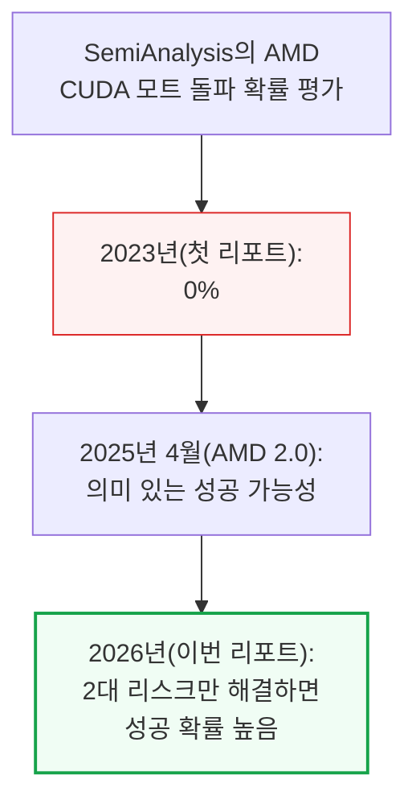
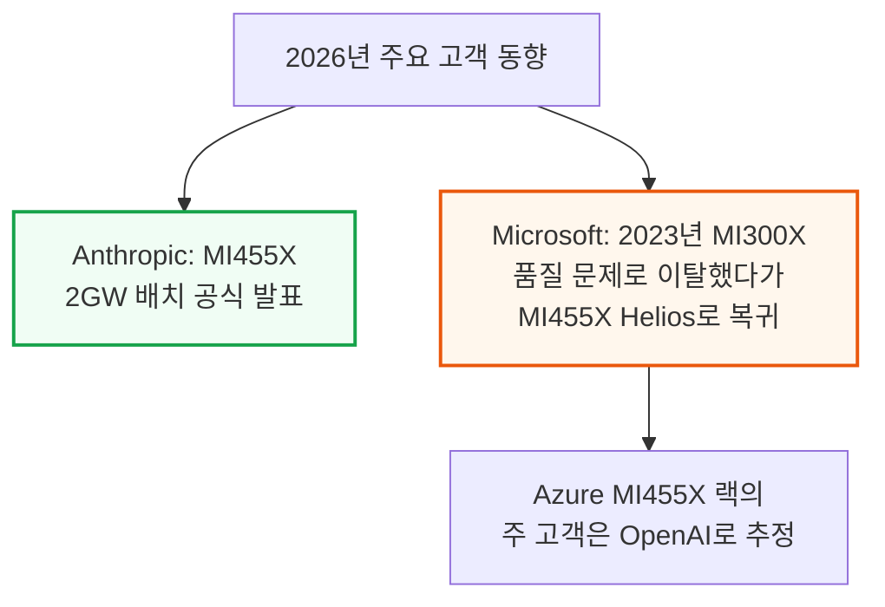
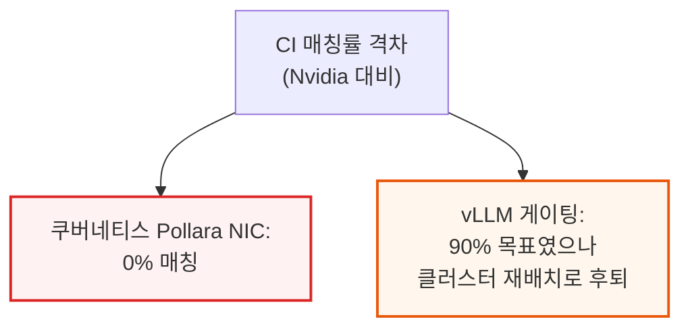
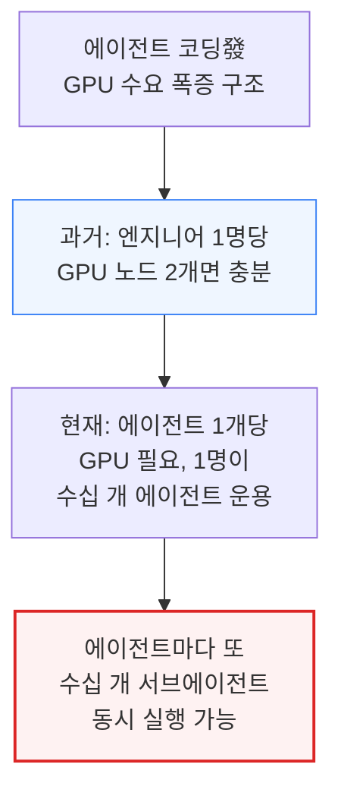
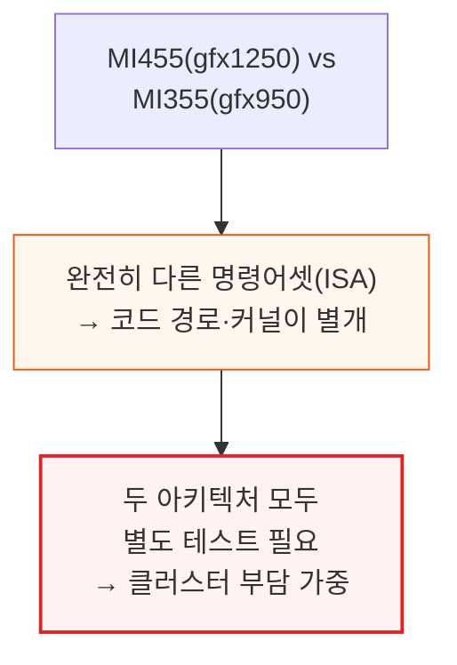
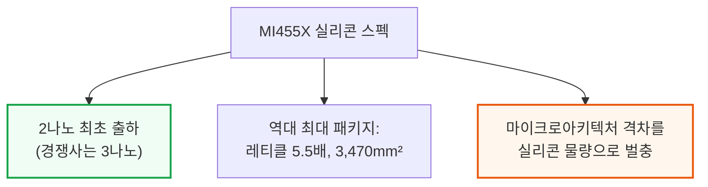
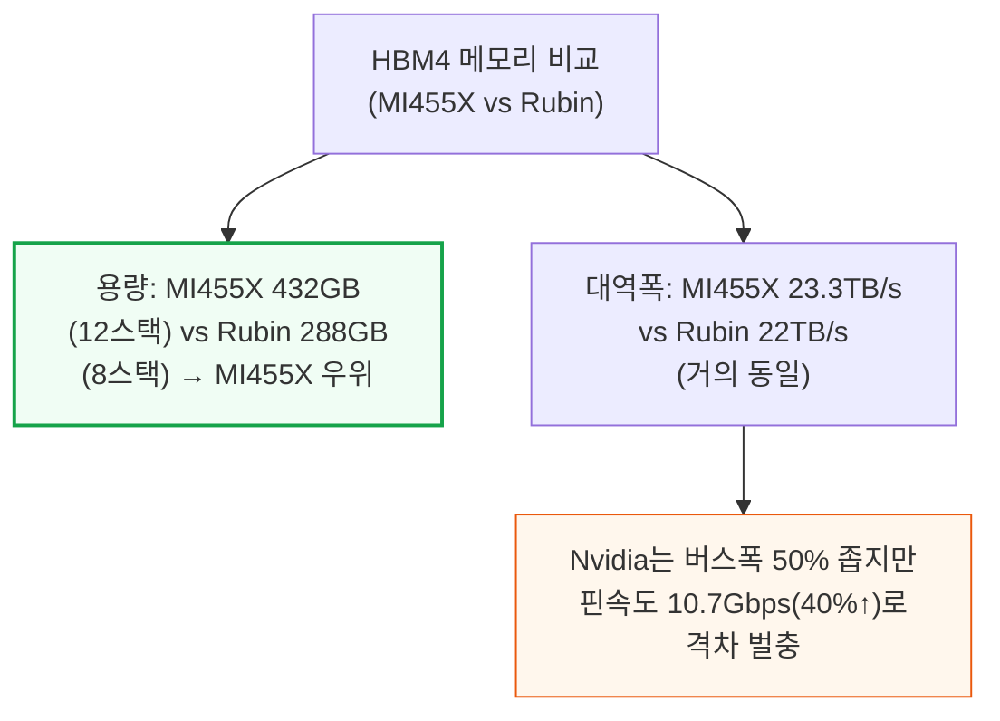
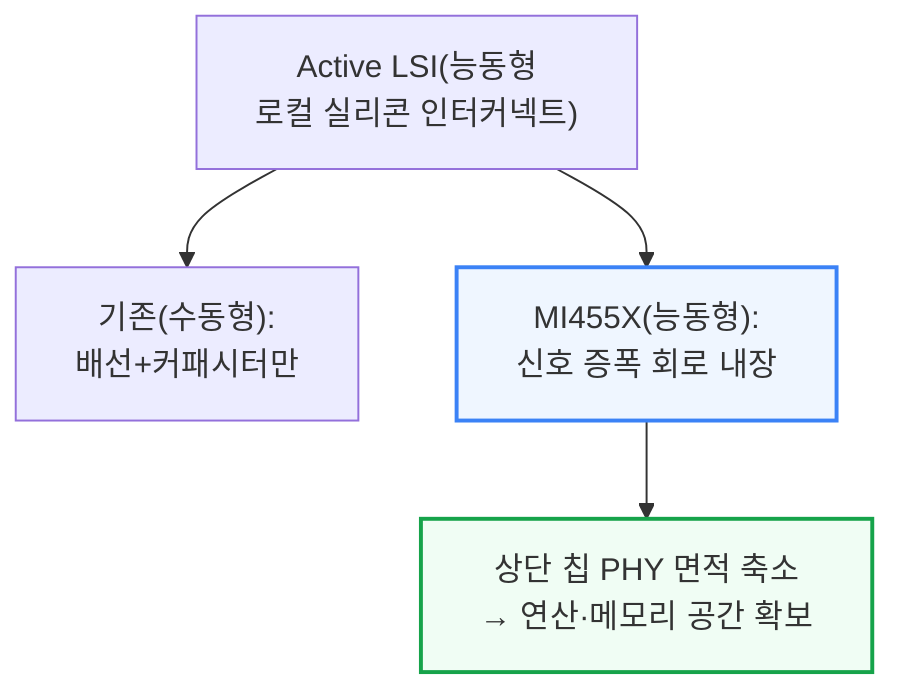

# Can AMD break the CUDA Moat? AMD Advancing AI 2026

> **출처**: [SemiAnalysis Newsletter](https://newsletter.semianalysis.com/p/can-amd-break-the-cuda-moat-amd-advancing)
> **저자**: Bryan Shan, Daniel Nishball, Myron Xie
> **발행일**: 2026-07-25

---

## 📑 목차

### 전체 섹션
 1. [개요 - AMD Advancing AI 2026과 CUDA 모트 돌파 가능성](#1-개요---amd-advancing-ai-2026과-cuda-모트-돌파-가능성)
 2. [AMD 리더십에 보내는 권고 - 내부 GPU 클러스터·CI 안정성 문제](#2-amd-리더십에-보내는-권고---내부-gpu-클러스터ci-안정성-문제)
 3. [MI455X 실리콘 - 2나노 첫 출하와 역대 최대 패키지, Active LSI](#3-mi455x-실리콘---2나노-첫-출하와-역대-최대-패키지-active-lsi)
 4. [Meta 커스텀 MI455X - 절반 스펙의 딜레마](#4-meta-커스텀-mi455x---절반-스펙의-딜레마)
 5. [Helios 랙 네트워킹 개요 - 스위치드 스케일업 전환](#5-helios-랙-네트워킹-개요---스위치드-스케일업-전환)
 6. [Helios 랙 아키텍처 재점검 - 트레이 구조·부분 코디자인·메모리 디스펙](#6-helios-랙-아키텍처-재점검---트레이-구조부분-코디자인메모리-디스펙)
 7. [Helios 스케일업·스케일아웃 토폴로지와 Vulcano NIC 지능형 라우팅](#7-helios-스케일업스케일아웃-토폴로지와-vulcano-nic-지능형-라우팅)
 8. [CDNA5 마이크로아키텍처 - Nvidia 설계에 수렴](#8-cdna5-마이크로아키텍처---nvidia-설계에-수렴)
 9. [AMD 소프트웨어 - CUDA 모트는 옮겨갔다](#9-amd-소프트웨어---cuda-모트는-옮겨갔다)
10. [InferenceX로 본 개발 속도와 에이전트 기반 Day 0 지원](#10-inferencex로-본-개발-속도와-에이전트-기반-day-0-지원)
11. [단일 노드는 끝, 분산 추론이 새 전장 - WideEP와 분리형 서빙](#11-단일-노드는-끝-분산-추론이-새-전장---wideep와-분리형-서빙)
12. [AMD 분산 추론 스택 현황 - MoRI, Helios(gfx1250) 격차, NIXL 업스트림, 오버랩 스택 지연](#12-amd-분산-추론-스택-현황---mori-heliosgfx1250-격차-nixl-업스트림-오버랩-스택-지연)
13. [MI455X TCO 분석 - GB300·VR NVL72와 비교](#13-mi455x-tco-분석---gb300vr-nvl72와-비교)
14. [OpenAI·Meta 지분 리베이트 구조 - 최대 105% 할인](#14-openaimeta-지분-리베이트-구조---최대-105-할인)
15. [MI500 - 차세대 광학 인터커넥트(CPC·NPO) 로드맵](#15-mi500---차세대-광학-인터커넥트cpconpo-로드맵)

---

## 🔑 용어 정리

본문을 순서대로 읽기 전에 알아두면 좋은 용어들입니다. 자세한 수치와 설명은 본문에서 처음 등장하는 위치에 나옵니다.

- **CUDA 모트(CUDA Moat)**: Nvidia가 오랫동안 쌓아온 소프트웨어 생태계(CUDA 툴킷·라이브러리·개발자 커뮤니티)가 만들어내는 진입 장벽 — 경쟁사가 하드웨어 스펙은 따라와도 소프트웨어 완성도 격차 때문에 실제 채택으로 이어지지 못하게 막는 "해자(垓子)"에 비유한 표현
- **Helios / MI455X**: AMD의 차세대 AI 가속기 랙 시스템(MI455X GPU 72개를 하나의 랙에 묶은 구성) — Nvidia GB200/GB300 NVL72에 대응하는 AMD의 첫 랙 스케일(랙 전체가 GPU 1개처럼 작동) 제품
- **WideEP(광역 전문가 병렬화)**: MoE(전문가 혼합) 모델의 전문가들을 GPU 1개가 아니라 여러 GPU·여러 노드에 넓게 흩어 배치하는 방식 — GPU당 담당 전문가 수가 줄어 메모리 여유가 생기고 처리량이 늘어남
- **분리형 서빙(PD Disaggregation, Prefill-Decode Disaggregation)**: 추론의 입력 처리 단계(프리필)와 출력 생성 단계(디코드)를 서로 다른 GPU 묶음에 나눠 맡기는 방식
- **MoRI**: AMD가 자체 개발한 RDMA(원격 메모리 직접 접근) 기반 분산 추론 통신 프레임워크 — 전문가 데이터 교환을 담당하는 MoRI-EP와 KV 캐시 전송을 담당하는 MoRI-IO로 구성
- **TCO(Total Cost of Ownership, 총소유비용)**: 칩 구매 비용뿐 아니라 전력·냉각·유지보수까지 합친 실제 운영 비용
- **지분 리베이트(Equity Rebate)**: AMD가 대형 고객(OpenAI·Meta)에게 저가(주당 1센트)로 AMD 주식을 살 수 있는 워런트를 지급하고, 특정 주가·구매 조건을 채우면 사실상 GPU 구매 비용을 되돌려주는 효과를 내는 금융 구조
- **Active LSI(능동형 로컬 실리콘 인터커넥트)**: 여러 개의 작은 칩(칩렛)을 하나의 패키지 안에서 이어붙이는 다리 역할의 배선에 신호를 증폭·중계하는 회로까지 넣은 것 — 기존에는 단순 배선(수동형)이었음

---

## 1. 개요 - AMD Advancing AI 2026과 CUDA 모트 돌파 가능성

**📌 핵심:**
- SemiAnalysis는 AMD의 AI 가속기 소프트웨어 경쟁력 평가를 3단계째 상향 조정 — 2023년 첫 리포트에서는 "CUDA 모트를 깰 확률 0%", 2025년 4월 "AMD 2.0" 리포트에서는 "의미 있는 성공 가능성", 이번엔 **"두 가지 핵심 리스크만 해결하면 성공 확률이 높다"**로 격상
- Anthropic이 AMD 칩 2GW(기가와트, 원자력발전소 2기 규모) 배치를 공식 발표했고, Microsoft는 2023년 MI300X 품질 문제로 AMD를 한 번 버렸다가 이번에 MI455X Helios 도입을 재발표(주 고객은 OpenAI로 추정) — AMD가 오픈소스 컴파일러·커널 전략 덕에 "에이전트 시대"에 유리한 위치에 있다는 것이 SemiAnalysis의 판단
- 결론: 다만 AMD가 시장 점유율을 늘린다고 Nvidia가 부진해지는 것은 아님 — AI 시장 전체 파이가 빠르게 커지고 있어 Nvidia도 계속 큰 폭으로 성장할 전망, AMD는 소프트웨어 경쟁 압박을 가해 Nvidia의 내부 의사결정 속도를 높이는 역할

---

**📌 용어 풀이: 두 가지 핵심 리스크**
> - **리스크 1(공급망·양산)**: AMD의 첫 랙 스케일 시스템 Helios가 케이블 없는 트레이 설계를 채택하지 못해(Nvidia Rubin Oberon 랙은 이미 채택) 양산 속도가 느림 — 게다가 AMD의 SerDes(칩 간 고속 신호 전송 회로) 설계가 약해 백플레인(랙 내부 배선판)의 최대 85%에 신호를 다시 증폭해주는 리타이머가 필요, 랙당 550개 이상의 브로드컴 이더넷 리타이머가 들어가며 신뢰성 문제도 겪는 중
> - **리스크 2(내부 개발 인프라)**: AMD 엔지니어들의 공통 불만은 내부 소프트웨어 개발팀과 자동 테스트(CI)용으로 쓸 안정적인 GPU 클러스터가 만성적으로 부족하다는 것 — AI 코딩 에이전트도 GPU가 있어야 작동하는데, 이 부족이 AMD가 에이전트 시대의 이점을 활용하지 못하게 발목을 잡고 있음

---

## 2. AMD 리더십에 보내는 권고 - 내부 GPU 클러스터·CI 안정성 문제

**📌 핵심:**
- 지난 1년간 자동 테스트 품질 개선에 진전은 있었지만 속도가 여전히 부족 — **쿠버네티스용 Pollara NIC의 CI(자동 검증 테스트)가 Nvidia ConnectX 대비 매칭률 0%**(전 세계 대다수 추론 배포가 쿠버네티스를 사용)에 머물러 있고, Advancing AI 2026까지 따라잡겠다던 목표는 클러스터 부족으로 무산
- vLLM(오픈소스 추론 엔진) 쪽은 더 심각 — CUDA 대비 게이팅(병합 차단형 테스트, 통과해야만 코드 병합 가능) 매칭률 90% 달성을 목표로 순항 중이었으나, **AMD 경영진이 내부 용량 부족을 이유로 vLLM 팀 전용 클러스터를 다른 곳으로 재배치**하면서 진행 상황이 크게 후퇴
- 단일 노드 추론(에이전트 1개당 GPU 1~2개)까지는 내부 GPU가 충분하지만, 여러 노드에 걸친 분산 추론 최적화(WideEP·분리형 서빙) 시대에는 턱없이 부족 — 이번 달 추가되는 MI355X 2,000개, 연내 추가될 MI325X/MI355X 6,000개를 더해도 **Nvidia의 안정적 장기 내부 개발 클러스터 규모에 한 자릿수 이상 못 미침**
- 결론: 에이전트 코딩 확산으로 문제가 더 악화 — 과거엔 엔지니어 1명당 GPU 노드 2개면 충분했지만, 지금은 에이전트 1개당 GPU가 필요하고 사람 1명이 수십 개 에이전트를, 에이전트마다 또 수십 개 서브에이전트를 동시 실행할 수 있어 GPU 수요가 기하급수적으로 늘어남 — MI455(gfx1250)는 MI355(gfx950)와 완전히 다른 명령어셋(ISA)이라 별도 테스트까지 필요해 부담이 가중

---

**📌 용어 풀이: 게이팅 테스트가 왜 중요한가**
> - **게이팅(Gating) 테스트**: 통과하지 못하면 코드를 병합(merge)할 수 없게 막아두는 테스트 — 버그가 있는 코드가 제품에 섞여 들어가는 것을 원천 차단하는 가장 강력한 품질 관문
> - AMD 경영진이 "게이팅이 아닌 통과율(non-gating pass rate)"을 대외적으로 강조하는 경우가 있는데, 실제로 품질을 좌우하는 것은 게이팅 매칭률과 게이팅 통과율이라는 것이 저자들의 지적

---

## 3. MI455X 실리콘 - 2나노 첫 출하와 역대 최대 패키지, Active LSI

**📌 핵심:**
- MI455X는 **AMD가 데이터센터용 2나노 실리콘을 세계 최초로 출하**하는 칩(연산 타일과 Venice CPU 모두 2나노 조기 적용) — 경쟁 가속기는 모두 3나노에 머물러 있어 공정 세대에서 한 발 앞섬
- 패키지 크기도 역대 최대 — **역대 최대 CoWoS-L 모듈(레티클 크기의 5.5배)**에 실리콘 총 3,470mm²를 담아, 단일 패키지에 들어간 실리콘 양으로는 업계 최다. 다만 이런 "실리콘을 쏟아붓는" 접근은 마이크로아키텍처(회로 설계 자체)에서 Nvidia에 뒤처진 것을 물량으로 벌충하는 성격이 강함 — 실제로 **MI455X는 Rubin(SM107)이 갖춘 3비트 룩업테이블 텐서 코어가 아직 없어**, HBM 대역폭을 상대적으로 아끼는 이점을 놓치고 있음
- 메모리는 강점 — **HBM4 12스택으로 패키지당 432GB**(Nvidia·Google은 8스택 288GB)를 담아 용량에서 앞서지만, 대역폭은 칩당 23.3TB/s로 Rubin(22TB/s)과 거의 같음 — Nvidia가 버스 폭은 AMD보다 50% 좁으면서도 핀 속도를 JEDEC 표준보다 훨씬 공격적으로(10.7Gbps, AMD 대비 40% 빠름) 끌어올려 격차를 메웠기 때문
- 결론: 패키지 내부의 칩렛(작은 칩 조각)을 잇는 다리(LSI)도 AMD가 최초로 "능동형(회로 내장)"으로 전환한 것으로 추정 — 신호 증폭을 다리 쪽이 나눠 맡아주면 칩 상단의 송수신 회로(PHY) 면적을 줄여 그만큼 연산·메모리 공간을 더 확보할 수 있음

---

**📌 용어 풀이: 3비트 룩업테이블 텐서 코어**
> - Rubin(Nvidia 차세대 GPU)에 탑재된 신기능으로, 가중치 값을 통째로 저장하는 대신 3비트 색인만 저장하고 실제 값은 공유 코드북에서 즉석으로 찾아 쓰는 방식 — 저장 용량이 줄어 같은 메모리 대역폭으로 더 많은 가중치를 옮길 수 있음(자세한 원리는 [Vera Rubin 분석 문서](<./[260723] 베라 루빈 NVL72 vs GB200 NVL72 - 추론 TCO·아키텍처 분석.md>) 참고)
> - MI455X는 이 기능이 아직 없어, 같은 효과를 내려면 실리콘(연산 유닛·HBM 스택)을 더 많이 얹어 벌충해야 하는 구조

---

*작성 진행률: 약 20% 완료*
*업데이트: 1~3장(개요, 리더십 권고, MI455X 실리콘) 작성 완료*
