# Ultra-High Interactivity on NVIDIA GPUs? - TileRT InferenceX

> **출처**: [SemiAnalysis Newsletter](https://newsletter.semianalysis.com/p/ultra-high-interactivity-on-nvidia)
> **저자**: Bryan Shan, Daniel Nishball, Cam Quilici
> **발행일**: 2026-08-10

---

## 📑 목차

### 전체 섹션
 1. [배경 - 프리미엄 빠른 모드와 GPU 지연시간 격차](#1-배경---프리미엄-빠른-모드와-gpu-지연시간-격차)
 2. [InferenceX 벤치마크 플랫폼과 처리량 대 상호작용성](#2-inferencex-벤치마크-플랫폼과-처리량-대-상호작용성)
 3. [TileRT 벤치마크 결과 - 입출력 토큰 시나리오별 상호작용성](#3-tilert-벤치마크-결과---입출력-토큰-시나리오별-상호작용성)
 4. [TileRT 벤치마크 결과 - 처리량 트레이드오프와 배치 크기 1의 대가](#4-tilert-벤치마크-결과---처리량-트레이드오프와-배치-크기-1의-대가)
 5. [TileRT란 무엇인가 - 지속형 엔진 커널](#5-tilert란-무엇인가---지속형-엔진-커널)
 6. [TileRT란 무엇인가 - 타일과 워프와 GPU 특화](#6-tilert란-무엇인가---타일과-워프와-gpu-특화)
 7. [PD 분리형 엔진 - vLLM과 TileRT의 결합](#7-pd-분리형-엔진---vllm과-tilert의-결합)
 8. [세레브라스·Groq·SambaNova와의 비교 - 하드웨어 데이터플로우 vs 소프트웨어 데이터플로우](#8-세레브라스groqsambanova와의-비교---하드웨어-데이터플로우-vs-소프트웨어-데이터플로우)
 9. [세레브라스·Groq·SambaNova와의 비교 - PD 비율 유연성이라는 구조적 강점](#9-세레브라스groqsambanova와의-비교---pd-비율-유연성이라는-구조적-강점)
10. [TileRT 개발이 느린 이유 - 정적 컴파일의 대가](#10-tilert-개발이-느린-이유---정적-컴파일의-대가)
11. [다음 단계 - AgentX 벤치마크와 배치 크기 확장](#11-다음-단계---agentx-벤치마크와-배치-크기-확장)
12. [성능당 TCO 분석 - 백만 토큰당 비용](#12-성능당-tco-분석---백만-토큰당-비용)

---

## 🔑 용어 정리

본문을 순서대로 읽기 전에 알아두면 좋은 용어들입니다. 자세한 수치와 설명은 본문에서 처음 등장하는 위치에 나옵니다.

- **TileRT**: 엔비디아 GPU 위에서 돌아가는 오픈소스 추론 소프트웨어 — 디코드(토큰을 한 개씩 이어 만드는 단계) 전체를 하나의 지속형 커널로 미리 컴파일해 지연시간을 줄인다
- **상호작용성(Interactivity) vs 처리량(Throughput)**: 상호작용성은 사용자 한 명이 체감하는 초당 토큰 생성 속도(tok/s/user), 처리량은 GPU 한 대가 전체 사용자를 상대로 만들어내는 총 토큰 수(tok/s/GPU) — 배치를 키우면 처리량은 늘지만 사용자 체감 속도는 떨어지는 트레이드오프 관계
- **지속형 엔진 커널(Persistent Engine Kernel)**: GPU가 매번 새 작업을 받는 대신, 모델 전체를 미리 컴파일해 하나의 프로그램으로 GPU에 상주시켜 디코드가 끝날 때까지 계속 실행하는 방식
- **CUDA 그래프(CUDA Graph)**: 커널(GPU가 실행하는 작업 단위) 여러 개의 실행 순서를 미리 기록해뒀다가 한 번에 재생하는 엔비디아의 기존 최적화 기법 — 커널 자체는 여전히 개별적으로 분리돼 있어 경계마다 비용이 남는다
- **워프 특화(Warp Specialization)**: GPU 코어 안의 실행 단위(워프)마다 서로 다른 역할(데이터 이동·연산·통신)을 맡겨 병렬로 겹쳐 돌리는 기법 — 모든 워프가 똑같은 일을 반복하던 기존 방식과 대비된다
- **PD 분리(Prefill-Decode Disaggregation)**: 추론의 프리필(입력 처리, 연산 집약)과 디코드(출력 생성, 메모리 대역폭 집약) 단계를 서로 다른 GPU 풀에 나눠 맡기는 방식
- **데이터플로우 칩(Dataflow Chip)**: 세레브라스·Groq·SambaNova처럼 반도체 하드웨어 자체를 저지연 전용으로 설계해, 스케줄링·통신 비용을 소프트웨어가 아니라 칩 구조로 없앤 전용 추론 칩
- **TCO(총소유비용, Total Cost of Ownership)**: 초기 장비 구입비(설비투자)와 운영비(전력·인력 등)를 합쳐 실제로 토큰 하나를 만드는 데 드는 전체 비용

---

## 1. 배경 - 프리미엄 빠른 모드와 GPU 지연시간 격차

**📌 핵심:**
- OpenAI 등 프론티어 AI 랩이 세레브라스·엔비디아 Groq LPU(저지연 특화 추론 칩) 같은 전용 하드웨어를 검토하는 이유는 단순하다 — "빠른 모드" 요금제에 웃돈을 내는 고객이 실제로 있다는 게 확인됐기 때문. OpenAI GPT-Live처럼 듣기와 말하기를 동시에 하는 실시간 음성비서는 응답 지연이 곧바로 체감된다
- 8-GPU HGX B200 서버는 이론상 합산 초당 64테라바이트(TB/s)의 HBM(고대역폭메모리) 대역폭을 낸다. GLM-5를 NVFP4(4비트 정밀도)로 배치 크기 1(사용자 한 명 요청만 처리)에서 돌리면 토큰 하나 만드는 데 필요한 데이터 이동량이 약 21GB뿐이라, 대역폭만 놓고 보면 초당 사용자당(tok/s/user) 최대 3,047토큰까지 가능해야 한다 — 실제 GPU는 이 근처에도 못 간다
- 격차의 원인은 대역폭이 아니라 지연시간 — GPU는 커널(작업 단위) 수천 개를 하나씩 실행·동기화하는데, 그 준비·정리 비용이 사용자당 응답 간격 1000분의 1초 이하 구간에서는 무시할 수 없을 만큼 커진다. 게다가 GPU 메모리 대역폭은 세대마다 2\~3배씩 늘어도 메모리 지연시간 자체는 전혀 개선되지 않고 있다
- 결론: TileRT는 디코드 전체를 하나의 지속형 커널로 미리 컴파일해 이 문제를 소프트웨어로 우회 — GLM5 FP8 744B(파라미터 7,440억 개) 벤치마크에서 단일 B200 서버로 초당 사용자당 최대 500토큰을 검증, 전통적 엔진을 쓰는 GB300 NVL72보다 약 3배 빠르고 같은 비용(iso-cost) 기준으로는 최대 2배 빠른 상호작용성을 달성

---

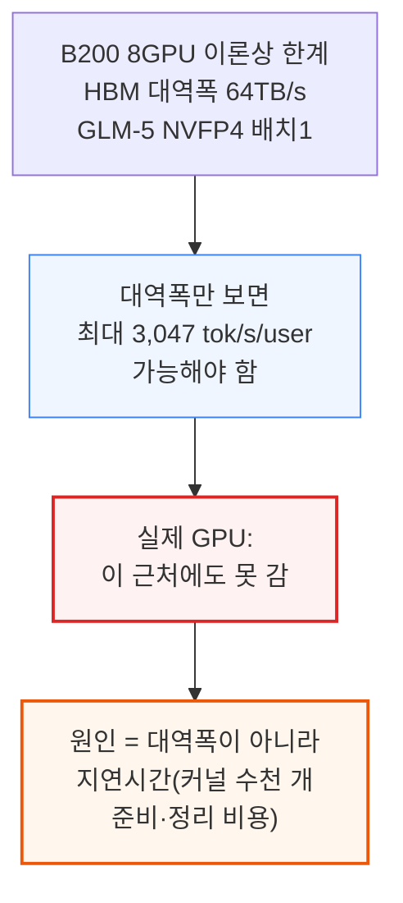

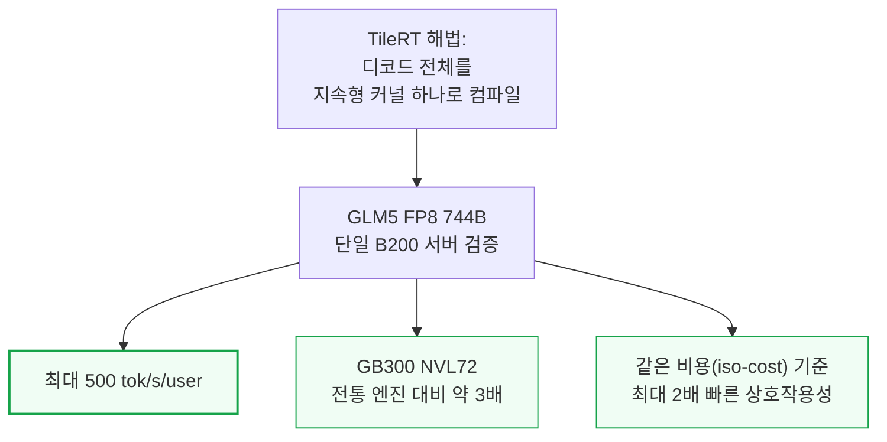

TileRT는 같은 커뮤니티가 만든 GPU 커널 언어 TileLang의 개발진이 만들었다. 디코드 엔진은 이미 샤오미 MiMo V2.5 Pro UltraSpeed와 Z.ai GLM 5.1 HighSpeed 상용 서비스 뒤편에서 실제로 돌고 있다.

---

## 2. InferenceX 벤치마크 플랫폼과 처리량 대 상호작용성

**📌 핵심:**
- InferenceX는 SemiAnalysis가 운영하는 오픈소스·벤더 중립 추론 벤치마크 플랫폼 — 구글 클라우드·마이크로소프트 애저·오라클·메타 등 주요 컴퓨트 구매자와 vLLM·LMCache·SGLang·PyTorch·Huggingface 같은 오픈소스 진영, OpenAI·MiniMax·Z.ai·Qwen·Moonshot Kimi 등 주요 랩의 검증·지지를 받는다. 엔비디아는 베라 루빈 실측치를, 구글은 곧 TPUv7 결과를, AMD는 올해 안에 MI455X UALoE72 결과를 제출하기로 약속했다
- 모든 추론 시스템은 두 축의 트레이드오프를 겪는다 — **상호작용성(tok/s/user)**은 사용자 한 명이 토큰을 받는 속도(토큰당 생성 시간(TPOT)의 역수)로 응답이 빠릿한지를 가르고, **처리량(tok/s/GPU)**은 시스템 전체가 만드는 총 토큰 수로 토큰당 비용을 좌우한다
- 배치(여러 사용자 요청을 묶어 한꺼번에 처리하는 것)를 키우면 처리량은 늘지만 사용자 한 명이 기다리는 시간은 길어진다 — InferenceX v2 데이터에서 상호작용성을 초당 사용자당 25토큰에서 260토큰으로 10배 늘리면, GPU당 처리량은 초당 5,900토큰에서 200토큰으로 30배 줄어든다
- 결론: 처리량과 상호작용성은 버스(다수를 저렴하게 태우지만 정차가 잦음)와 레이싱카(1\~2명에게 빠르지만 훨씬 비쌈)의 관계와 같다 — TileRT는 이 스펙트럼에서 레이싱카 쪽 극단, 즉 초고속 상호작용성 구간만을 정조준한다

---

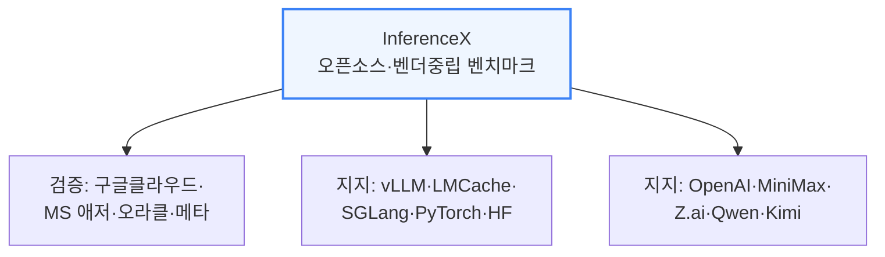

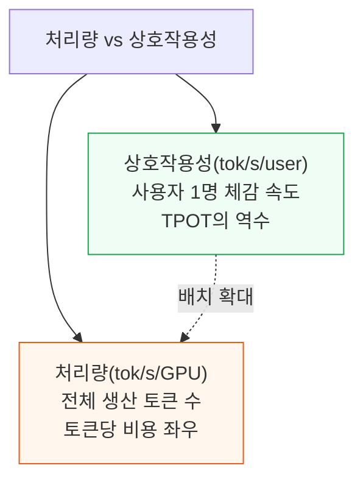

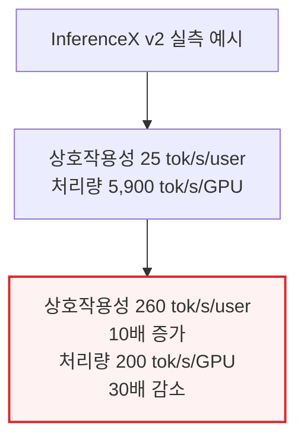

---

## 3. TileRT 벤치마크 결과 - 입출력 토큰 시나리오별 상호작용성

**📌 핵심:**
- 8k(입력)/1k(출력) 토큰 시나리오에서 TileRT는 8-GPU B200 노드로 초당 사용자당 340토큰을 냈다 — 기존 최고 기록은 GB300 NVL72(NVFP4+MTP(멀티토큰예측)) 181.4토큰으로, TileRT가 1.9배 빠르다. 다만 이건 배치 크기 1 비교라, GB300 NVL72의 값비싼 구리 백플레인(GPU 72장을 통째로 묶는 통신망)이 상호작용성을 끌어올리는 데는 전혀 기여하지 않는 조건이다
- 같은 정밀도(FP8)로 좁혀도 TileRT가 앞선다 — 기존 최고 기록은 B300(MTP 사용) 초당 113.6토큰인데 TileRT는 3.0배 빠르다
- 1k/1k 시나리오에서는 TileRT FP8이 초당 사용자당 494.2토큰을 기록 — 최고 기존 FP4 기록(256.3토큰) 대비 1.9배, 최고 기존 FP8 기록(136.3토큰) 대비 3.6배다. TileRT는 아직 FP4를 지원하지 않는데도 FP4를 쓰는 기존 엔진을 이미 앞선다. 이 결과는 72개 GPU를 NVLink로 묶은 NVL72 스케일업 도메인이 아니라 8개 GPU짜리 단일 노드에서 나왔다는 점도 눈여겨볼 대목 — 어디까지나 사용자 1명당 속도 비교이지, 총 처리량이나 비용 비교는 아니다
- 결론: 종단 지연시간(요청부터 마지막 토큰까지)에서도 TileRT FP8이 기존 최고 GLM-5.1 기록을 1k/1k에서 4.5배, 8k/1k에서 3.0배 앞선다 — 첫 토큰까지 걸리는 시간(TTFT)은 평범하지만, 결정적 우위는 디코드 꼬리(마지막까지 토큰을 뽑아내는 구간)에서 나온다: TileRT 3.01초 vs 최고 NVFP4+MTP 경쟁작 6.54초 vs MI355X 18.18초

---

```mermaid
flowchart TD
    S8k["8k/1k 시나리오<br/>(입력 8천·출력 1천 토큰)"] --> T340["TileRT(8GPU B200):<br/>340 tok/s/user"]
    S8k --> G181["기존 최고(GB300 NVL72<br/>NVFP4+MTP): 181.4"]
    T340 -.1.9배.-> G181

    style T340 fill:#f0fdf4,stroke:#16a34a,stroke-width:2px
```

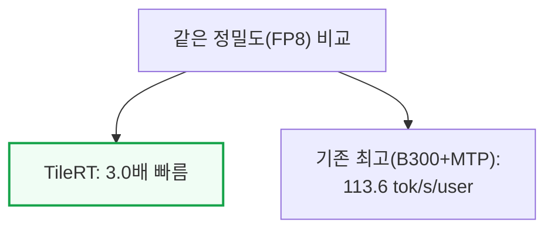

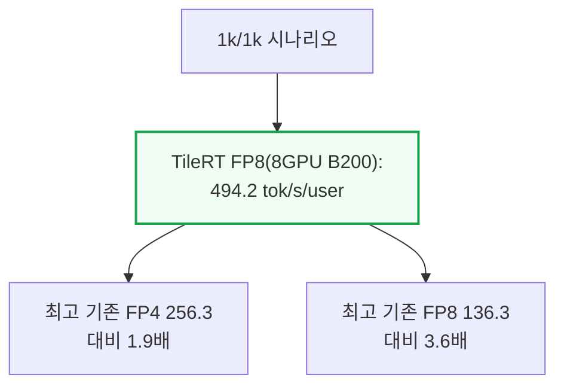

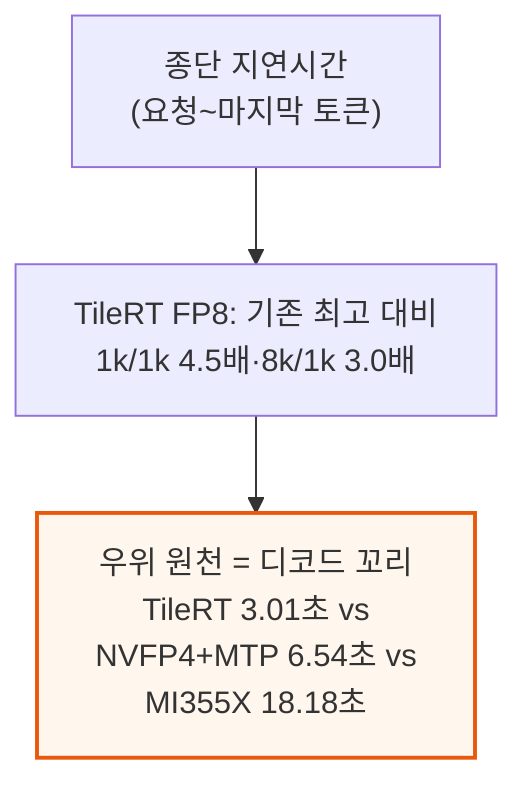

---

## 4. TileRT 벤치마크 결과 - 처리량 트레이드오프와 배치 크기 1의 대가

**📌 핵심:**
- TileRT의 상호작용성 우위에는 대가가 따른다 — 낮은 처리량이다. 전통적 엔진은 동시요청수(concurrency)가 늘어날수록 가중치 적재·고정 커널 비용을 더 많은 사용자에게 나눠 갚을 수 있다. 8k/1k 시나리오에서 GB300(FP4+MTP, 동시요청 12)은 GPU당 총 처리량 약 240토큰을 내면서 사용자당 154토큰을 유지하는데, TileRT는 GPU당 총 처리량 160.4토큰에 그치는 대신 사용자당 340토큰을 낸다
- 트레이드오프를 정리하면: TileRT는 사용자 한 명당 속도는 훨씬 빠르지만, 전통적인 GB300 지점은 GPU 한 대당 더 많은 총 작업을 처리한다
- TileRT는 발행 시점 기준 디코드 노드 하나당 동시에 진행 중인 요청을 1건만 받는다 — 일반적인 처리량 설정이 아니라 의도적으로 특화된 운영 지점이다
- 결론: 배치 크기 1만 지원하는 지금의 TileRT는 레이싱카를 넘어, 승객 딱 1명만 태우는 전용 로켓에 가깝다 — 승객을 더 태우도록 엔지니어링하는 것도 가능은 하지만 만만치 않은 목표다

---

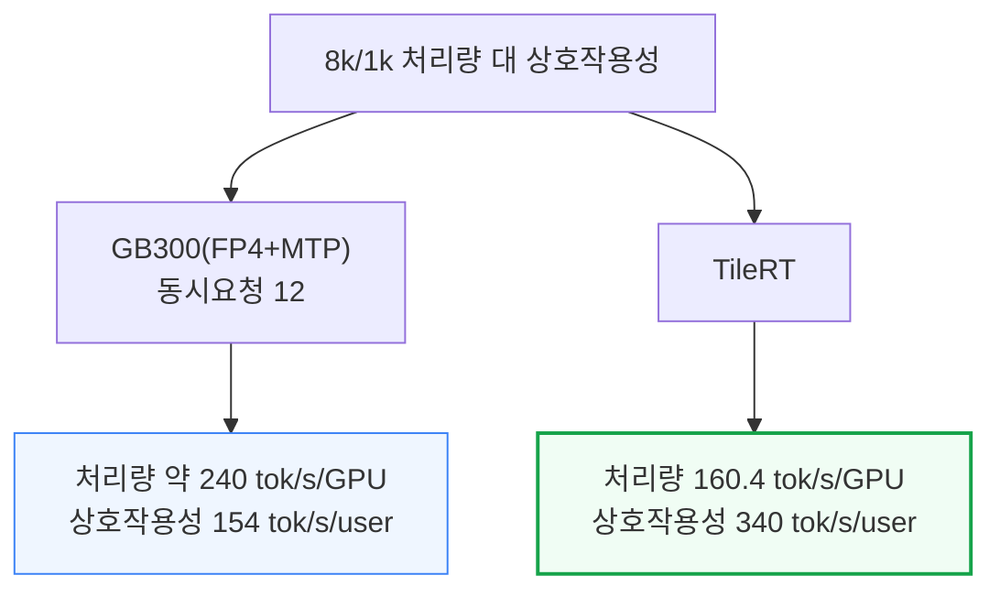

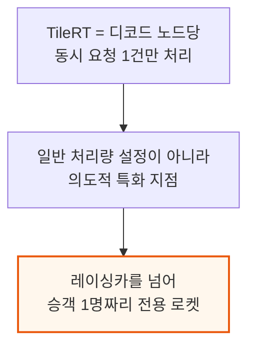

---

## 5. TileRT란 무엇인가 - 지속형 엔진 커널

**📌 핵심:**
- 전통적 서빙 엔진은 GPU 프로그램(커널) 수천 개를 하나씩 순서대로 실행 — 준비·정리 비용 때문에 GPU가 대기하는 시간이 상당하고, 배치가 작을수록 이 오버헤드를 나눠 낼 일감 자체가 적어 문제가 커진다. 각 커널은 절반만 끝난 작업도 매번 HBM에 다시 써야 한다
- 단일 HGX H200 서버(합산 38.4TB/s HBM 대역폭)에서 배치 크기 1로 돌리면, MXFP8(8비트 정밀도) 기준 토큰 하나당 활성 파라미터 대역폭이 42GB — 대역폭에만 묶여 있다면 추측 디코딩 없이도 이론상 초당 사용자당 최대 1,000토큰까지 가능해야 한다. 실제로는 그렇지 않다. GPU의 프로그래밍·아키텍처 모델 자체가 애초에 저지연용으로 설계되지 않았기 때문 — GPU당 메모리 대역폭은 세대마다 2\~3배씩 늘어도 메모리 지연시간은 HBM 가격이 계속 오르는 와중에도 전혀 개선되지 않고 있다
- TileRT는 커널을 계속 새로 띄우는 대신, 모델 전체를 미리 정적으로 컴파일해 하나의 지속형 엔진 커널로 만든다 — 호스트(CPU)는 딱 한 번만 실행을 지시하고, 이후 실행은 디코드가 끝날 때까지 GPU에 계속 상주하며, 런타임에서 처리하던 조율 작업 대부분이 컴파일 시점으로 옮겨간다
- 결론: CUDA 그래프(커널 실행 순서를 미리 기록해 한 번에 재생하는 기존 기법)와는 다르다 — CUDA 그래프도 커널 자체는 여전히 개별적으로 분리돼 있어 경계마다 비용이 남고 온칩 상태가 매번 지워지는 반면, "CUDA 그래프가 커널의 실행을 최적화한다면, TileRT는 커널이라는 실행 단위 자체를 없앤다"

---

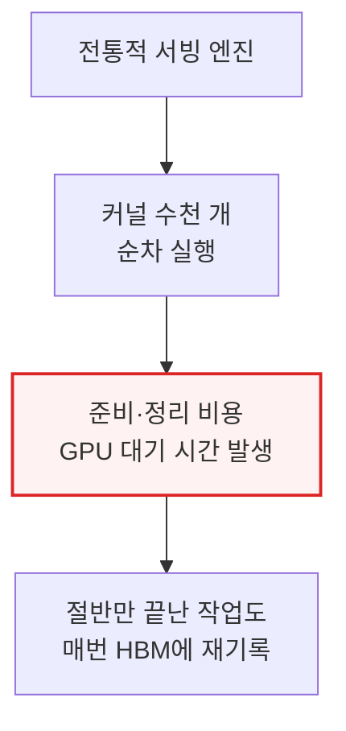

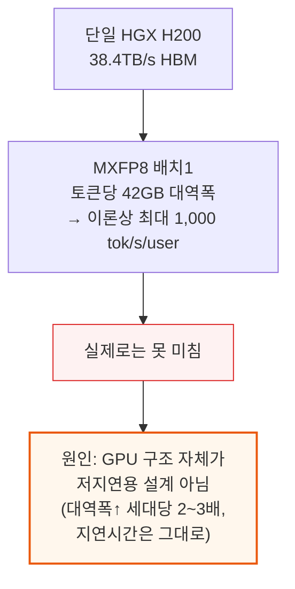

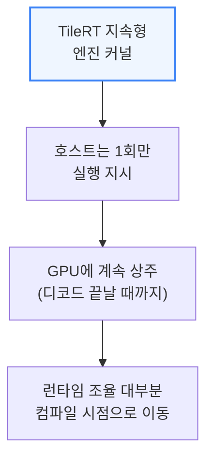

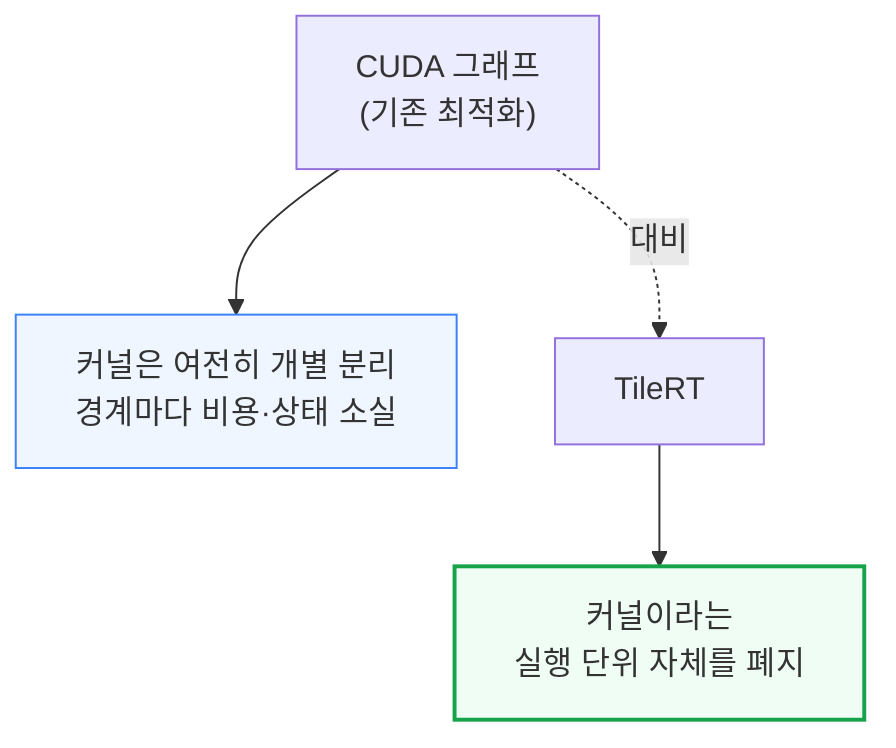

---

## 6. TileRT란 무엇인가 - 타일과 워프와 GPU 특화

**📌 핵심:**
- 작업을 타일(더 작은 연산 조각) 단위로 쪼개고 워프(GPU 코어 안의 실행 단위)·블록별로 역할을 나누는 워프 특화를 적용하면, 런타임이 연산·입출력·통신을 촘촘히 겹쳐 재배치한다 — 엔진 커널 안에서 서로 다른 워프 그룹이 각각 비동기 데이터 이동, 텐서 연산, 통신 오버랩을 맡는다
- 기존에는 적재→대기→연산→대기 식으로 단계가 순차적으로 실행됐지만, TileRT는 이를 타일 단위로 겹쳐 실행하고 중간 결과를 레지스터·공유메모리·L2 캐시로 흘려보내 매번 전역 메모리(HBM)에 흘리지 않는다 — CTA(협력형 스레드 어레이, GPU 코어 하나가 처리하는 작업 묶음) 하나하나가 균일한 SIMT(단일명령다중스레드) 작업자가 아니라 여러 역할을 겸하는 작은 공장이 된다
- 특화는 워프를 넘어 GPU 전체로도 확장된다 — 대부분의 텐서 병렬(TP) 프레임워크는 모든 GPU가 동일한 로직을 동시에 실행한다고 가정하지만, 희소 라우팅·Top-K 선택·동적 인덱싱·긴 문맥 어텐션·MTP는 연산량은 적어도 전역 정보에 의존해 모든 GPU가 이를 다 거치면 중복 작업과 동기화 부담만 늘어난다. GLM-5.1의 어텐션 계층에서는 GPU 0이 Top-K 선택·희소 인덱스 구성·라우팅을 전담하는 "희소 인덱서" 역할을 맡고, 나머지 GPU 1\~7은 RMSNorm·GEMM(행렬곱)·플래시 희소 어텐션·AllReduce(집단 통신)를 처리하는 "MLA 작업자" 역할을 맡는다
- 결론: 통신도 더 이상 별도 단계로 취급하지 않는다 — 브로드캐스트·리덕션(집계)·동기화가 타일 단위 흐름 안에서 직접 실행돼, TileRT에서는 어텐션 계층 전체가 호스트 입장에서 커널 실행 1회에 대응하고, 실행 흐름은 연산→동기화→연산의 반복이 아니라 연산↔통신↔연산이 끊임없이 겹치는 파이프라인으로 바뀐다

---

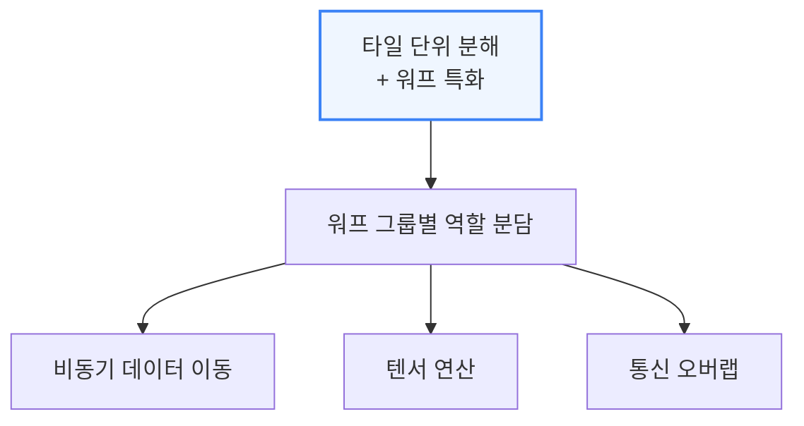

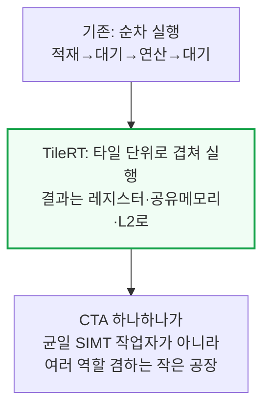

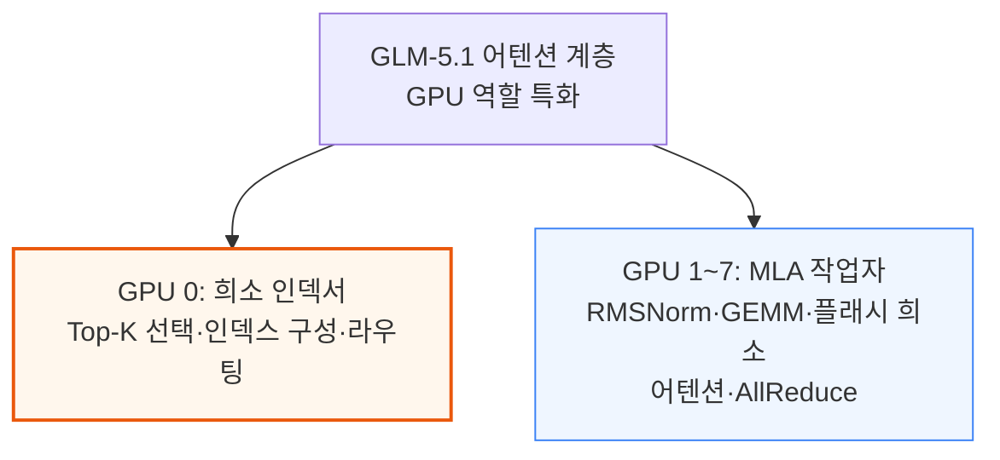

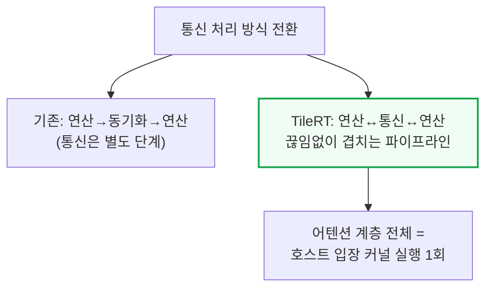

---

## 7. PD 분리형 엔진 - vLLM과 TileRT의 결합

**📌 핵심:**
- LLM 추론은 두 단계로 나뉜다 — 프리필(입력 프롬프트를 병렬 처리, 연산 집약적, 처리량이 핵심 지표)과 디코드(토큰을 순차 생성하며 계속 커지는 KV캐시(과거 토큰의 연산 결과를 저장해두는 메모리)에 접근, 메모리 대역폭 집약적, 토큰당 지연시간에 민감)
- TileRT는 vLLM을 대체하지 않는다 — vLLM은 여전히 고처리량 프리필 엔진이자 스케줄러·청크 단위 프리필·프리픽스 캐싱(반복되는 입력 앞부분을 재사용)·OpenAI 호환 API·운영 툴링을 포함한 서빙 계층 전체를 담당하고, 지연시간에 민감한 디코드 트래픽만 TileRT로 넘어간다 — TileRT가 승객 1명짜리 로켓이라면 vLLM은 비행기·자동차·버스·기차 역할을 그대로 유지한다
- 프리필과 디코드를 분리하면(PD 분리) 공유 vLLM 프리필 풀 하나가 서로 다른 두 디코드 풀에 동시에 먹이를 줄 수 있다 — 지연시간에 민감한 요청은 TileRT PD 라우터를 거쳐 vLLM이 첫 토큰만 생성한 뒤 kv_transfer_params에 목적지 TileRT 노드를 표시해 넘기고(풀 A), 일반 트래픽은 vLLM의 기존 분리형 프록시를 거쳐 통상적인 vLLM 디코드 풀로 향한다(풀 B)
- 결론: 이 결합은 vLLM의 MultiConnector API로 TileRTConnector를 기존 커넥터와 조합하는 방식으로 구현된다 — TileRT 커넥터는 표시된 고상호작용성 트래픽만 처리하고 나머지는 아무 일도 하지 않아, 두 트래픽 클래스가 같은 프리필 서버를 공유할 수 있다. 프리필과 디코드 사이 KV캐시 이동은 Mooncake·NIXL 전송 엔진이 맡고, TileRT v0.1.5 기준 디코드 노드 하나는 한 번에 요청 1건만 처리하며 라우터가 디스패치를 통제하고 노드가 점유 중이면 배압(back-pressure)을 건다

---

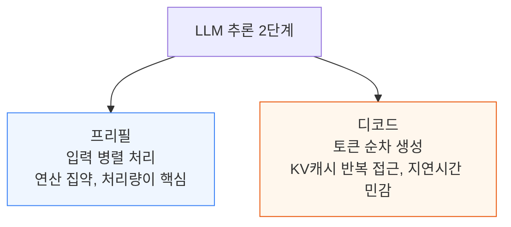

```mermaid
flowchart TD
    Roles["역할 분담"] --> VLLMRole["vLLM: 고처리량 프리필<br/>+ 스케줄러·캐싱·API·운영툴"]
    Roles --> TileRTRole["TileRT: 지연시간 민감<br/>디코드 트래픽만 전담"]

    style VLLMRole fill:#eff6ff,stroke:#3b82f6
    style TileRTRole fill:#f0fdf4,stroke:#16a34a,stroke-width:2px
```

```mermaid
flowchart TD
    SharedPool["공유 vLLM 프리필 풀"] --> PoolA["풀 A: TileRT PD 라우터<br/>→ 고상호작용성 디코드"]
    SharedPool --> PoolB["풀 B: vLLM 네이티브<br/>분리형 프록시 → 일반 디코드"]

    style PoolA fill:#f0fdf4,stroke:#16a34a,stroke-width:2px
    style PoolB fill:#eff6ff,stroke:#3b82f6
```

```mermaid
flowchart TD
    Impl["구현 방식"] --> MultiConn["vLLM MultiConnector API<br/>TileRTConnector + 기존 커넥터 조합"]
    MultiConn --> KVMove["KV캐시 이동:<br/>Mooncake·NIXL 전송 엔진"]
    MultiConn --> OneReq["디코드 노드당<br/>동시 요청 1건, 배압 제어"]

    style MultiConn fill:#eff6ff,stroke:#3b82f6,stroke-width:2px
```

---

## 8. 세레브라스·Groq·SambaNova와의 비교 - 하드웨어 데이터플로우 vs 소프트웨어 데이터플로우

**📌 핵심:**
- 전용 추론 칩 업체들은 같은 병목을 몇 년 전에 발견했지만 해법을 하드웨어에 더 많이 새겨 넣었다 — Groq는 결정론적(매번 같은 순서로 실행되는)·컴파일러가 직접 조율하는 실행과 대용량 온칩 SRAM 계층을 쓰고, 세레브라스는 웨이퍼 스케일 프로세서(반도체 웨이퍼 한 장 전체를 하나의 칩으로 쓰는 설계) 위에 연산을 공간적으로 배치하며 CS-3는 코어 약 90만 개·온칩 SRAM 44GB·메모리 대역폭 초당 21페타바이트(PB/s)를 낸다. SambaNova는 재구성 가능한 데이터플로우 유닛을 SRAM·HBM·DDR 계층 메모리로 뒷받침한다
- 칩 구조는 다르지만 아이디어는 같다 — 저지연 추론은 런타임 스케줄링·연산자 경계·동기화·불필요한 외부 메모리 이동을 줄일수록 유리하다는 것. 배치가 클 때는 이런 비용을 나눠 갚기 쉽지만, 배치 크기 1에서는 토큰 하나당 지연시간의 훨씬 큰 몫을 차지한다
- TileRT는 이 데이터플로우 아이디어의 소프트웨어 버전을 들여온다 — 사전(AoT) 스케줄링, 지속형 실행, 특화된 작업자, 통신·연산 사이의 더 촘촘한 오버랩. 다만 닮은 건 구조이지 실체가 아니다 — TileRT는 여전히 동적 하드웨어 스케줄러를 쓰는 SIMT GPU 위에서, HBM과 모델별로 컴파일된 스케줄을 그대로 쓰며 돌아간다
- 결론: TileRT는 어디까지나 소프트웨어다 — 데이터플로우 방식을 애초에 그걸 위해 설계되지 않은 기계에 강제로 씌우는 것. GPU는 동적 워프 스케줄러·SIMT 모델·HBM 계층 구조를 그대로 지니고, TileRT는 정적으로 펼쳐진 지속형 커널·손으로 깎은 워프 특화·드라이버 스택에 고정된 모델별 컴파일이라는 막대한 컴파일러 노력을 쏟아 이 하드웨어가 공간적 파이프라인인 척하도록 설득해 숫자를 뽑아낸다. 네이티브 데이터플로우 실리콘은 자기 하드웨어와 싸울 필요가 없다 — 전용 가속기는 실행 모델을 하드웨어에 더 많이 새겨 넣어 TileRT가 소프트웨어로 숨겨야 하는 오버헤드 일부를 아예 피한다. 그 우위는 여전히 모델·정밀도·메모리 계층·컴파일러 품질·시스템 규모·서빙 구성에 좌우되지만, 세레브라스가 조밀한(dense) 700억 파라미터 모델을 8-GPU 노드가 아무리 스케줄링을 잘해도 못 따라올 속도로 서빙하는 이유가 여기 있다 — 소프트웨어는 HBM 루프라인(이론적 상한)에 다가갈 수는 있어도 그 상한 자체를 끌어올릴 수는 없다

---

```mermaid
flowchart TD
    Vendors["전용 추론 칩 3사"] --> Groq2["Groq: 결정론적 실행<br/>대용량 온칩 SRAM"]
    Vendors --> Cerebras["세레브라스 CS-3:<br/>코어 약 90만 개<br/>SRAM 44GB, 21PB/s"]
    Vendors --> Samba["SambaNova: 재구성형<br/>데이터플로우 유닛<br/>SRAM+HBM+DDR"]

    style Cerebras fill:#eff6ff,stroke:#3b82f6
```

```mermaid
flowchart TD
    SharedIdea["공통 아이디어"] --> Reduce["런타임 스케줄링·경계·<br/>동기화·외부메모리 이동 축소"]
    Reduce --> Batch1v["배치1에서<br/>지연시간 비중 최대"]

    style Reduce fill:#fff7ed,stroke:#ea580c,stroke-width:2px
```

```mermaid
flowchart TD
    TileRTSW["TileRT = 소프트웨어<br/>데이터플로우"] --> Import["AoT 스케줄링·지속형 실행·<br/>특화 작업자·연산통신 오버랩"]
    Import --> StillGPU["실체는 여전히<br/>동적 스케줄러 SIMT GPU"]

    style StillGPU fill:#fff7ed,stroke:#ea580c
```

```mermaid
flowchart TD
    Fight["소프트웨어가<br/>하드웨어를 설득"] --> Native["네이티브 데이터플로우 실리콘:<br/>자기 하드웨어와 안 싸움"]
    Fight --> Roofline2["결론: 소프트웨어는<br/>HBM 루프라인에 다가갈 뿐<br/>끌어올리지는 못함<br/>(예: 세레브라스 조밀 70B 서빙속도)"]

    style Roofline2 fill:#fef2f2,stroke:#dc2626,stroke-width:2px
```

---

## 9. 세레브라스·Groq·SambaNova와의 비교 - PD 비율 유연성이라는 구조적 강점

**📌 핵심:**
- 시장의 초기 답은 "순수성은 협상 가능하다"는 것 — TileRT의 디코드 엔진은 이미 샤오미 MiMo V2.5 Pro UltraSpeed와 Z.ai GLM-5.1 HighSpeed 상용 서비스 뒤에서 돌고 있다. 두 회사 모두 새 데이터플로우 칩을 사지 않았다 — 이미 갖고 있던 가속기 클러스터에서 속도 등급 하나를 오려냈을 뿐, vLLM이 여전히 프리필·스케줄링·API를 맡고 TileRT는 같은 엔드포인트 뒤에서 디코드만 넘겨받는다. "이미 갖고 있는 하드웨어 위의 웬만큼 좋은 답"이 "새로 사야 하는 하드웨어 위의 아키텍처적으로 순수한 답"을 이기는 경향이 있다는 뜻
- 더 깊은 구조적 문제는 프리필-디코드(PD) 비율의 유동성(fungibility, 자원을 상황에 맞게 바꿔 쓸 수 있는 정도)이다 — GPU 풀은 프리필도 잘하고 중\~고배치 디코드도 잘하고 이제 초고상호작용성 디코드까지 제법 잘하는 하나의 유동 자원이라, 소프트웨어 스케줄러의 결정만으로 시간 단위로 역할 배분을 수요에 맞춰 바꿀 수 있다. 반면 전용 칩 함대는 정반대다 — 속도 등급 용량과 나머지 용량의 비율이 발주서에 서명하는 순간 하드웨어에 고정되고, 그 비율을 바꾸려면 물리적으로 랙을 다시 짜고 케이블을 다시 까는 데 수개월이 걸린다
- 워크로드 구성이 안정적이고 예측 가능하다면 문제없겠지만, 통상적인 대화형 지연시간을 원하는 사용자와 극단적 상호작용성 SLO(서비스수준목표)에 웃돈을 낼 사용자(점점 에이전트가 많아짐)의 비율에는 변수가 많다 — GPU에서 예측이 틀리면 소프트웨어로 재조정하면 되지만, 전용 실리콘에서 예측이 틀리면 놀고 있는 고속 장비에 자본이 묶이거나, 애초에 사려고 했던 프리미엄 트래픽을 놓치게 된다. 게다가 요구사항은 시간이 지나며 계속 바뀌어, 지금 맞는 예측도 한동안만 맞는다
- 결론: 그렇다고 최상위 속도 시장이 없어지는 건 아니다 — SRAM 루프라인은 여전히 더 높고, 특정 크기의 모델은 여전히 그쪽을 선호하며, 일부 워크로드는 가격을 불문하고 최대 초당 토큰 수를 원한다. 하지만 TileRT는 대부분의 구매자에게 필요한 게 속도 전용 기계가 아니라 "어차피 갖고 있을 함대에서 동적으로 떼어내는 속도 등급"이라는 점을 재정의한다 — 세레브라스·Groq·SambaNova는 이제 서투른 커널 실행기가 아니라, 설정 파일 하나로 재배분되는 유동적 하드웨어 위에서 돌아가는 자기 자신의 실행 모델과 경쟁하는 셈이다. TileRT가 승객 1명짜리 로켓이라도, 완전히 새로운 발사체를 설계하는 대신 이미 있는 버스에 고체 로켓 부스터를 붙이는 걸 가능하게 해준다

---

```mermaid
flowchart TD
    Prod["실제 상용 배포"] --> Xiaomi2["샤오미 MiMo V2.5<br/>Pro UltraSpeed"]
    Prod --> ZAI["Z.ai GLM-5.1<br/>HighSpeed"]
    Xiaomi2 --> Pattern["공통점: 새 칩 안 사고<br/>기존 GPU 클러스터에서<br/>속도 등급만 오려냄"]

    style Pattern fill:#f0fdf4,stroke:#16a34a,stroke-width:2px
```

```mermaid
flowchart TD
    Fungible["GPU 풀 = 유동 자원"] --> AllRoles["프리필·중고배치 디코드·<br/>초고상호작용성 디코드<br/>전부 소화"]
    AllRoles --> Rebalance["소프트웨어 설정만으로<br/>시간 단위 역할 재배분"]

    style Rebalance fill:#f0fdf4,stroke:#16a34a,stroke-width:2px
```

```mermaid
flowchart TD
    ASICFleet["전용 칩 함대 = 고정 자원"] --> Fixed["속도등급 비율이<br/>발주 시점에 하드웨어 고정"]
    Fixed --> Recable["비율 변경 =<br/>재랙·재배선 수개월"]
    Recable --> Risk["예측 틀리면: 유휴 자본<br/>또는 프리미엄 트래픽 상실"]

    style Risk fill:#fef2f2,stroke:#dc2626,stroke-width:2px
```

```mermaid
flowchart TD
    Reframe["TileRT의 재정의"] --> NotMachine["필요한 건 속도 전용 기계가<br/>아니라 속도 등급"]
    NotMachine --> Competition["데이터플로우 칩 3사:<br/>이제 자기 실행모델과<br/>경쟁하는 셈"]

    style Competition fill:#fff7ed,stroke:#ea580c,stroke-width:2px
```

---

## 10. TileRT 개발이 느린 이유 - 정적 컴파일의 대가

**📌 핵심:**
- GLM5.1은 이미 한 세대 뒤처졌고 InferenceX 메인라인에서도 이미 지원 종료(deprecated)됐다 — TileRT의 모델 카탈로그는 현재 GLM-5/5.1과 DeepSeek-V3.2뿐으로 매우 좁다. MiMo-V2.5-Pro-UltraSpeed는 공동설계 파트너십의 결과물이라 아직 오픈소스로 공개되지 않았다
- TileRT는 ASIC(주문형 반도체) 업체들의 가장 큰 약점을 그대로 물려받는다 — 정적 사전(AoT) 컴파일이라는 특성상 모델 카탈로그가 작고, 의존성이 특정 버전에 고정되며, 새 아키텍처마다 실제 엔지니어링 노력이 들어간다. 완전히 범용적인 경로는 없다 — 지속형 엔진 커널은 모델을 미리 정적으로 통째로 펼쳐 하나의 상주 프로그램으로 만든다는 뜻이라, 타일 형태·파이프라인 깊이·레지스터/공유메모리/L2 사이 버퍼 배치·워프 그룹이 적재·연산·통신을 어떻게 나눌지·집단통신을 어디서 타일 흐름에 합칠지·어떤 GPU가 GLM-5.1의 전담 희소 인덱서 같은 특화 역할을 맡을지까지 전부 미리 결정해야 한다. 어텐션 메커니즘이나 라우팅 방식을 바꾸면 이 스케줄 상당 부분이 무효화된다 — 데이터플로우 칩도 같은 문제를 겪는다. 좋은 컴파일러를 만드는 건 원래 악명 높게 어렵다
- 이 부담을 줄이려는 작업도 진행 중이다 — TileOPs는 연산자(operator) 하나하나를 기계가 읽을 수 있는 매니페스트(시그니처·워크로드·루프라인 모델 명세)로 선언하게 해, 이 매니페스트가 코드 생성·테스트·벤치마킹을 이전 구현이 아니라 하드웨어 한계 자체를 기준으로 돌아가게 만든다
- 결론: AI 코딩 에이전트는 이미 알려진 템플릿 안에서의 튜닝은 가속하지만, 새로운 방식의 변환은 여전히 전문가의 판단이 필요하다 — 단일한 지속형 커널 구조는 기존의 커널별 프로파일러 타임라인의 유용성도 떨어뜨려, 자동화된 피드백 루프를 만들기가 더 어려워진다

---

```mermaid
flowchart TD
    Catalog["TileRT 모델 카탈로그"] --> GLM["GLM-5/5.1<br/>이미 InferenceX 지원종료"]
    Catalog --> DS["DeepSeek-V3.2"]
    Catalog --> MiMo2["MiMo-V2.5-Pro-UltraSpeed<br/>공동설계, 미공개"]

    style Catalog fill:#fef2f2,stroke:#dc2626,stroke-width:2px
```

```mermaid
flowchart TD
    ASICWeak["ASIC식 약점 상속"] --> Static["정적 AoT 컴파일"]
    Static --> Small["작은 모델 카탈로그"]
    Static --> Pinned["버전 고정 의존성"]
    Static --> PerModel["새 아키텍처마다<br/>실제 엔지니어링 필요"]

    style Static fill:#fef2f2,stroke:#dc2626,stroke-width:2px
```

```mermaid
flowchart TD
    Invalidate["아키텍처 변경 시"] --> Change["어텐션·라우팅 방식 변경"]
    Change --> Invalid["기존 스케줄<br/>상당 부분 무효화"]
    Invalid --> Rebuild["타일형태·파이프라인·버퍼<br/>배치를 다시 결정"]

    style Invalid fill:#fff7ed,stroke:#ea580c,stroke-width:2px
```

```mermaid
flowchart TD
    TileOPs["TileOPs 완화 작업"] --> Manifest["연산자별 기계판독<br/>매니페스트(시그니처·<br/>워크로드·루프라인)"]
    Manifest --> AutoGen["코드생성·테스트·벤치마킹<br/>하드웨어 한계 기준 자동화"]

    style TileOPs fill:#eff6ff,stroke:#3b82f6,stroke-width:2px
```

---

## 11. 다음 단계 - AgentX 벤치마크와 배치 크기 확장

**📌 핵심:**
- InferenceX는 TileRT 벤치마크를 지금의 단일턴 8k/1k 시나리오에서 새로운 에이전틱 코딩 벤치마크 AgentX로 확장하는 작업을 진행 중이다 — 실제 Claude Code·Codex 사용 흔적을 재생해 긴 문맥·멀티턴 요청·현실적인 서브에이전트 활동·동적 도구 사용 지연을 반영한다. 입력 길이 중앙값은 14만 토큰, 이론상 캐시 적중률 루프라인(상한)은 99.2%에 달한다
- 이 워크로드는 디코드 속도뿐 아니라 TileRT<>vLLM 시스템 전체를 시험한다 — 증분 KV 전송, 프리픽스 캐시 재사용, 캐시 보존·오프로딩, 라우팅, 스케줄링까지 전부 포함
- 핵심 질문은 TileRT가 턴과 턴 사이에 새로 추가된 문맥만 전송하면서도 초고속 상호작용성 우위를 유지할 수 있는가다
- 결론: 두 번째 단계는 배치 크기 1을 넘어서는 것 — 배치 크기 2·4·8에서도 TileRT를 벤치마크해, 처리량-상호작용성 파레토 프론티어(어느 쪽도 희생하지 않고는 더 나아질 수 없는 최적점들의 곡선)를 그리고 지속형 엔진 커널의 지연시간 우위가 어느 지점에서 꺾이기 시작하는지 찾아낸다는 목표다

---

```mermaid
flowchart TD
    AgentX["새 벤치마크 AgentX"] --> Trace["Claude Code·Codex<br/>실사용 흔적 재생"]
    AgentX --> Long["긴 문맥·멀티턴·<br/>서브에이전트·도구지연"]
    AgentX --> Stats["입력 길이 중앙값 14만 토큰<br/>캐시적중률 루프라인 99.2%"]

    style AgentX fill:#eff6ff,stroke:#3b82f6,stroke-width:2px
```

```mermaid
flowchart TD
    FullTest["시스템 전체 시험 항목"] --> KVInc["증분 KV 전송"]
    FullTest --> Prefix2["프리픽스 캐시 재사용"]
    FullTest --> Route2["캐시 보존·오프로딩·<br/>라우팅·스케줄링"]

    style FullTest fill:#fff7ed,stroke:#ea580c,stroke-width:2px
```

```mermaid
flowchart TD
    NextBatch["배치 크기 확장 계획"] --> B248["배치 크기 2·4·8<br/>벤치마크"]
    B248 --> Pareto2["처리량-상호작용성<br/>파레토 프론티어 작성"]
    Pareto2 --> Flatten["지속형 엔진 커널<br/>우위가 꺾이는 지점 탐색"]

    style Pareto2 fill:#eff6ff,stroke:#3b82f6,stroke-width:2px
```

---

## 12. 성능당 TCO 분석 - 백만 토큰당 비용

**📌 핵심:**
- TileRT의 초고속 상호작용성이 낸 비용을 정상적인 저상호작용성 디코드와 비교해 백만 출력 토큰당 비용으로 심층 분석했다 — TileRT는 같은 비용(iso-cost) 기준으로 전통적 엔진 대비 최대 1.9배 빠른 상호작용성을 낸다. 각 칩 SKU의 설비투자·운영비 기준선은 SemiAnalysis AI TCO 모델을 썼다
- 비용 비교는 지연시간 목표를 만족한 뒤에야 의미가 있다 — 초당 사용자당 339토큰이라는 목표에서는, 측정된 GLM-5.1 GPU 결과 중 이 목표를 만족하는 건 TileRT뿐이다. 가장 빠른 전통 엔진 지점은 초당 176토큰, 가장 빠른 전통 분리형 FP8 지점(GB300 SGLang+MTP)조차 초당 108.0토큰에 그친다. 8k/1k 기준 TileRT는 초당 사용자당 340토큰을 내면서 B200 한 대당 초당 35.4개의 출력 토큰을 만들어, 백만 출력 토큰당 13.56달러가 든다
- 상호작용성이 가장 높은 FP4 분리형 디코드 구성은 GB200(FP4+MTP, 동시요청 5)로 GPU당 총 처리량 약 286토큰을 내면서 사용자당 약 176토큰을 유지한다 — GB200 시간당 1.86달러를 적용하면 백만 출력 토큰당 13.4달러다. 즉 TileRT는 비용이 겨우 1% 더 들면서 상호작용성은 1.9배 높다 — 이는 앤트로픽 Claude Code 빠른 모드(상호작용성 최대 2.5배지만 토큰당 가격도 2배)보다 훨씬 남는 장사다
- 결론: 같은 정밀도(FP8)로 비교하면 격차가 더 뚜렷하다 — 가장 빠른 전통 FP8 지점은 GB300(FP8+MTP) 초당 108토큰으로 백만 출력 토큰당 35달러가 드는데, TileRT는 초당 340토큰을 내면서 백만 토큰당 13.56달러 — 토큰당 비용은 61% 더 싸면서 상호작용성은 3.1배 높다

---

```mermaid
flowchart TD
    Feasible["상호작용성 339 tok/s/user<br/>목표 충족 여부"] --> OnlyTileRT["충족: TileRT뿐"]
    Feasible --> BestConv["최고 전통엔진: 176"]
    Feasible --> BestDisagg["최고 분리형FP8<br/>GB300+MTP: 108.0"]

    style OnlyTileRT fill:#f0fdf4,stroke:#16a34a,stroke-width:2px
```

```mermaid
flowchart TD
    TileRTCost["TileRT 8k/1k<br/>340 tok/s/user"] --> PerB200["B200 1대당<br/>초당 35.4 출력토큰"]
    PerB200 --> Cost1["백만 출력토큰당<br/>13.56달러"]

    style Cost1 fill:#f0fdf4,stroke:#16a34a,stroke-width:2px
```

```mermaid
flowchart TD
    FP4Compare["FP4 최고 상호작용성<br/>GB200+MTP 동시요청5"] --> FP4Val["286 tok/s/GPU<br/>176 tok/s/user<br/>13.4달러/백만토큰"]
    FP4Val --> VsTileRT["TileRT: 비용 1%↑<br/>상호작용성 1.9배"]
    VsTileRT --> ClaudeCmp["앤트로픽 Claude Code<br/>빠른모드보다 유리<br/>2.5배 속도, 가격은 2배"]

    style VsTileRT fill:#f0fdf4,stroke:#16a34a,stroke-width:2px
```

```mermaid
flowchart TD
    FP8Compare["같은 정밀도(FP8) 비교"] --> GB300FP8["GB300+MTP:<br/>108 tok/s/user<br/>35달러/백만토큰"]
    FP8Compare --> TileRTFP8b["TileRT:<br/>340 tok/s/user<br/>13.56달러/백만토큰"]
    TileRTFP8b --> Result["61% 저렴 +<br/>상호작용성 3.1배"]

    style Result fill:#f0fdf4,stroke:#16a34a,stroke-width:2px
```

---

*작성 진행률: 100% 완료*
*업데이트: 전체 12개 섹션(배경·GPU 지연시간 격차, InferenceX 플랫폼·처리량 대 상호작용성, 시나리오별 벤치마크 결과, 처리량 트레이드오프·배치 크기 1, 지속형 엔진 커널, 타일·워프·GPU 특화, PD 분리형 엔진·vLLM 결합, 데이터플로우 칩 비교(하드웨어 vs 소프트웨어), PD 비율 유연성, 정적 컴파일의 대가, AgentX·배치 크기 확장 계획, 성능당 TCO 분석) 작성 완료*
