# Ultra-High Interactivity on NVIDIA GPUs? - TileRT InferenceX

> **출처**: [SemiAnalysis Newsletter](https://newsletter.semianalysis.com/p/ultra-high-interactivity-on-nvidia)
> **저자**: Bryan Shan, Daniel Nishball, Cam Quilici
> **발행일**: 2026-08-10

---

## 📑 목차

### 전체 섹션
 1. [배경 - 프리미엄 빠른 모드와 GPU 지연시간 격차](#1-배경---프리미엄-빠른-모드와-gpu-지연시간-격차)
 2. [InferenceX 벤치마크 플랫폼과 처리량 대 상호작용성](#2-inferencex-벤치마크-플랫폼과-처리량-대-상호작용성)
 3. [TileRT 벤치마크 결과 - 입출력 토큰 시나리오별 상호작용성](#3-tilert-벤치마크-결과---입출력-토큰-시나리오별-상호작용성)
 4. [TileRT 벤치마크 결과 - 처리량 트레이드오프와 배치 크기 1의 대가](#4-tilert-벤치마크-결과---처리량-트레이드오프와-배치-크기-1의-대가)
 5. [TileRT란 무엇인가 - 지속형 엔진 커널](#5-tilert란-무엇인가---지속형-엔진-커널)
 6. [TileRT란 무엇인가 - 타일과 워프와 GPU 특화](#6-tilert란-무엇인가---타일과-워프와-gpu-특화)
 7. [PD 분리형 엔진 - vLLM과 TileRT의 결합](#7-pd-분리형-엔진---vllm과-tilert의-결합)
 8. [세레브라스·Groq·SambaNova와의 비교 - 하드웨어 데이터플로우 vs 소프트웨어 데이터플로우](#8-세레브라스groqsambanova와의-비교---하드웨어-데이터플로우-vs-소프트웨어-데이터플로우)
 9. [세레브라스·Groq·SambaNova와의 비교 - PD 비율 유연성이라는 구조적 강점](#9-세레브라스groqsambanova와의-비교---pd-비율-유연성이라는-구조적-강점)
10. [TileRT 개발이 느린 이유 - 정적 컴파일의 대가](#10-tilert-개발이-느린-이유---정적-컴파일의-대가)
11. [다음 단계 - AgentX 벤치마크와 배치 크기 확장](#11-다음-단계---agentx-벤치마크와-배치-크기-확장)
12. [성능당 TCO 분석 - 백만 토큰당 비용](#12-성능당-tco-분석---백만-토큰당-비용)

---

## 🔑 용어 정리

본문을 순서대로 읽기 전에 알아두면 좋은 용어들입니다. 자세한 수치와 설명은 본문에서 처음 등장하는 위치에 나옵니다.

- **TileRT**: 엔비디아 GPU 위에서 돌아가는 오픈소스 추론 소프트웨어 — 디코드(토큰을 한 개씩 이어 만드는 단계) 전체를 하나의 지속형 커널로 미리 컴파일해 지연시간을 줄인다
- **상호작용성(Interactivity) vs 처리량(Throughput)**: 상호작용성은 사용자 한 명이 체감하는 초당 토큰 생성 속도(tok/s/user), 처리량은 GPU 한 대가 전체 사용자를 상대로 만들어내는 총 토큰 수(tok/s/GPU) — 배치를 키우면 처리량은 늘지만 사용자 체감 속도는 떨어지는 트레이드오프 관계
- **지속형 엔진 커널(Persistent Engine Kernel)**: GPU가 매번 새 작업을 받는 대신, 모델 전체를 미리 컴파일해 하나의 프로그램으로 GPU에 상주시켜 디코드가 끝날 때까지 계속 실행하는 방식
- **CUDA 그래프(CUDA Graph)**: 커널(GPU가 실행하는 작업 단위) 여러 개의 실행 순서를 미리 기록해뒀다가 한 번에 재생하는 엔비디아의 기존 최적화 기법 — 커널 자체는 여전히 개별적으로 분리돼 있어 경계마다 비용이 남는다
- **워프 특화(Warp Specialization)**: GPU 코어 안의 실행 단위(워프)마다 서로 다른 역할(데이터 이동·연산·통신)을 맡겨 병렬로 겹쳐 돌리는 기법 — 모든 워프가 똑같은 일을 반복하던 기존 방식과 대비된다
- **PD 분리(Prefill-Decode Disaggregation)**: 추론의 프리필(입력 처리, 연산 집약)과 디코드(출력 생성, 메모리 대역폭 집약) 단계를 서로 다른 GPU 풀에 나눠 맡기는 방식
- **데이터플로우 칩(Dataflow Chip)**: 세레브라스·Groq·SambaNova처럼 반도체 하드웨어 자체를 저지연 전용으로 설계해, 스케줄링·통신 비용을 소프트웨어가 아니라 칩 구조로 없앤 전용 추론 칩
- **TCO(총소유비용, Total Cost of Ownership)**: 초기 장비 구입비(설비투자)와 운영비(전력·인력 등)를 합쳐 실제로 토큰 하나를 만드는 데 드는 전체 비용

---

## 1. 배경 - 프리미엄 빠른 모드와 GPU 지연시간 격차

**📌 핵심:**
- OpenAI 등 프론티어 AI 랩이 세레브라스·엔비디아 Groq LPU(저지연 특화 추론 칩) 같은 전용 하드웨어를 검토하는 이유는 단순하다 — "빠른 모드" 요금제에 웃돈을 내는 고객이 실제로 있다는 게 확인됐기 때문. OpenAI GPT-Live처럼 듣기와 말하기를 동시에 하는 실시간 음성비서는 응답 지연이 곧바로 체감된다
- 8-GPU HGX B200 서버는 이론상 합산 초당 64테라바이트(TB/s)의 HBM(고대역폭메모리) 대역폭을 낸다. GLM-5를 NVFP4(4비트 정밀도)로 배치 크기 1(사용자 한 명 요청만 처리)에서 돌리면 토큰 하나 만드는 데 필요한 데이터 이동량이 약 21GB뿐이라, 대역폭만 놓고 보면 초당 사용자당(tok/s/user) 최대 3,047토큰까지 가능해야 한다 — 실제 GPU는 이 근처에도 못 간다
- 격차의 원인은 대역폭이 아니라 지연시간 — GPU는 커널(작업 단위) 수천 개를 하나씩 실행·동기화하는데, 그 준비·정리 비용이 사용자당 응답 간격 1000분의 1초 이하 구간에서는 무시할 수 없을 만큼 커진다. 게다가 GPU 메모리 대역폭은 세대마다 2\~3배씩 늘어도 메모리 지연시간 자체는 전혀 개선되지 않고 있다
- 결론: TileRT는 디코드 전체를 하나의 지속형 커널로 미리 컴파일해 이 문제를 소프트웨어로 우회 — GLM5 FP8 744B(파라미터 7,440억 개) 벤치마크에서 단일 B200 서버로 초당 사용자당 최대 500토큰을 검증, 전통적 엔진을 쓰는 GB300 NVL72보다 약 3배 빠르고 같은 비용(iso-cost) 기준으로는 최대 2배 빠른 상호작용성을 달성

---

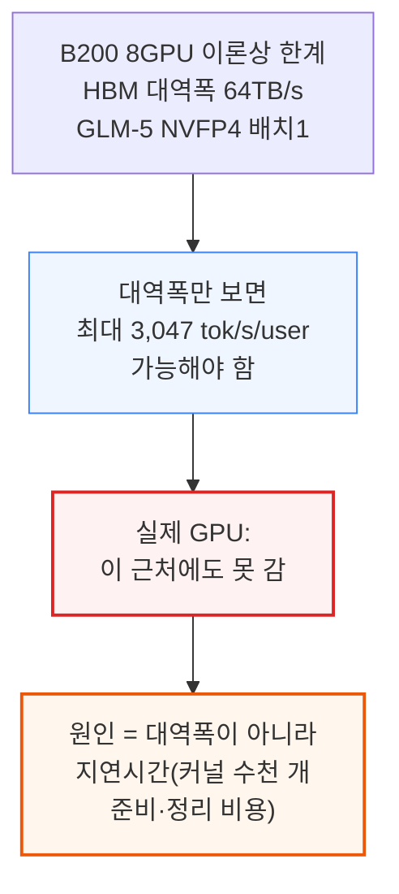

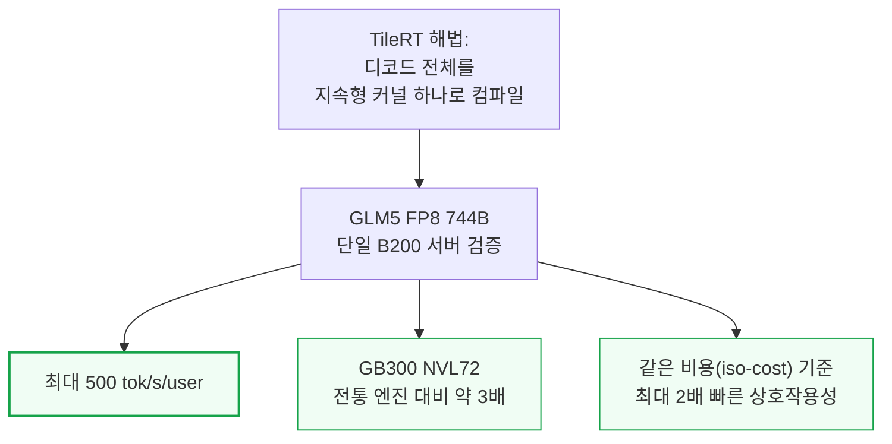

TileRT는 같은 커뮤니티가 만든 GPU 커널 언어 TileLang의 개발진이 만들었다. 디코드 엔진은 이미 샤오미 MiMo V2.5 Pro UltraSpeed와 Z.ai GLM 5.1 HighSpeed 상용 서비스 뒤편에서 실제로 돌고 있다.

---

## 2. InferenceX 벤치마크 플랫폼과 처리량 대 상호작용성

**📌 핵심:**
- InferenceX는 SemiAnalysis가 운영하는 오픈소스·벤더 중립 추론 벤치마크 플랫폼 — 구글 클라우드·마이크로소프트 애저·오라클·메타 등 주요 컴퓨트 구매자와 vLLM·LMCache·SGLang·PyTorch·Huggingface 같은 오픈소스 진영, OpenAI·MiniMax·Z.ai·Qwen·Moonshot Kimi 등 주요 랩의 검증·지지를 받는다. 엔비디아는 베라 루빈 실측치를, 구글은 곧 TPUv7 결과를, AMD는 올해 안에 MI455X UALoE72 결과를 제출하기로 약속했다
- 모든 추론 시스템은 두 축의 트레이드오프를 겪는다 — **상호작용성(tok/s/user)**은 사용자 한 명이 토큰을 받는 속도(토큰당 생성 시간(TPOT)의 역수)로 응답이 빠릿한지를 가르고, **처리량(tok/s/GPU)**은 시스템 전체가 만드는 총 토큰 수로 토큰당 비용을 좌우한다
- 배치(여러 사용자 요청을 묶어 한꺼번에 처리하는 것)를 키우면 처리량은 늘지만 사용자 한 명이 기다리는 시간은 길어진다 — InferenceX v2 데이터에서 상호작용성을 초당 사용자당 25토큰에서 260토큰으로 10배 늘리면, GPU당 처리량은 초당 5,900토큰에서 200토큰으로 30배 줄어든다
- 결론: 처리량과 상호작용성은 버스(다수를 저렴하게 태우지만 정차가 잦음)와 레이싱카(1\~2명에게 빠르지만 훨씬 비쌈)의 관계와 같다 — TileRT는 이 스펙트럼에서 레이싱카 쪽 극단, 즉 초고속 상호작용성 구간만을 정조준한다

---

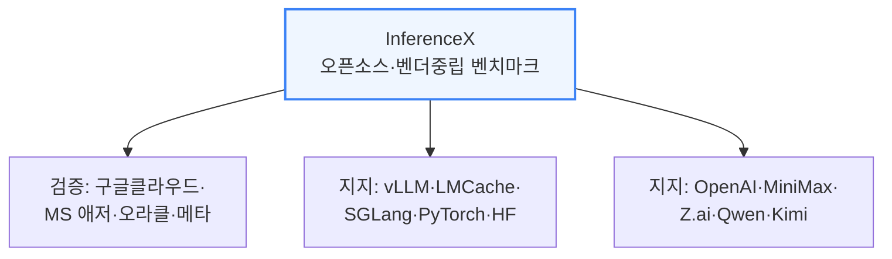

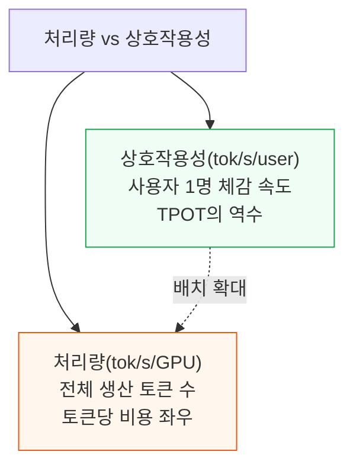

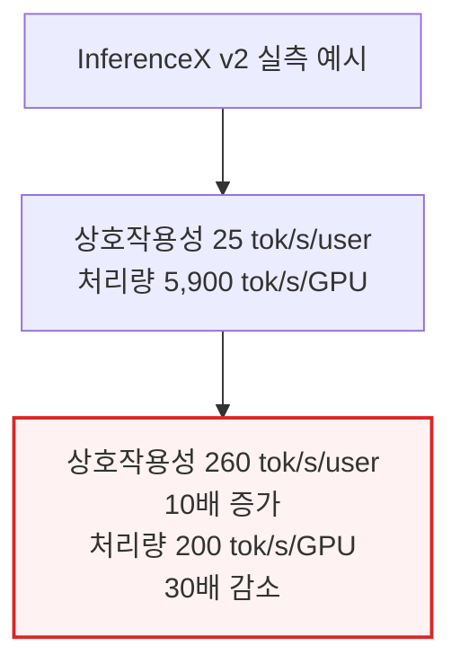

---

## 3. TileRT 벤치마크 결과 - 입출력 토큰 시나리오별 상호작용성

**📌 핵심:**
- 8k(입력)/1k(출력) 토큰 시나리오에서 TileRT는 8-GPU B200 노드로 초당 사용자당 340토큰을 냈다 — 기존 최고 기록은 GB300 NVL72(NVFP4+MTP(멀티토큰예측)) 181.4토큰으로, TileRT가 1.9배 빠르다. 다만 이건 배치 크기 1 비교라, GB300 NVL72의 값비싼 구리 백플레인(GPU 72장을 통째로 묶는 통신망)이 상호작용성을 끌어올리는 데는 전혀 기여하지 않는 조건이다
- 같은 정밀도(FP8)로 좁혀도 TileRT가 앞선다 — 기존 최고 기록은 B300(MTP 사용) 초당 113.6토큰인데 TileRT는 3.0배 빠르다
- 1k/1k 시나리오에서는 TileRT FP8이 초당 사용자당 494.2토큰을 기록 — 최고 기존 FP4 기록(256.3토큰) 대비 1.9배, 최고 기존 FP8 기록(136.3토큰) 대비 3.6배다. TileRT는 아직 FP4를 지원하지 않는데도 FP4를 쓰는 기존 엔진을 이미 앞선다. 이 결과는 72개 GPU를 NVLink로 묶은 NVL72 스케일업 도메인이 아니라 8개 GPU짜리 단일 노드에서 나왔다는 점도 눈여겨볼 대목 — 어디까지나 사용자 1명당 속도 비교이지, 총 처리량이나 비용 비교는 아니다
- 결론: 종단 지연시간(요청부터 마지막 토큰까지)에서도 TileRT FP8이 기존 최고 GLM-5.1 기록을 1k/1k에서 4.5배, 8k/1k에서 3.0배 앞선다 — 첫 토큰까지 걸리는 시간(TTFT)은 평범하지만, 결정적 우위는 디코드 꼬리(마지막까지 토큰을 뽑아내는 구간)에서 나온다: TileRT 3.01초 vs 최고 NVFP4+MTP 경쟁작 6.54초 vs MI355X 18.18초

---

```mermaid
flowchart TD
    S8k["8k/1k 시나리오<br/>(입력 8천·출력 1천 토큰)"] --> T340["TileRT(8GPU B200):<br/>340 tok/s/user"]
    S8k --> G181["기존 최고(GB300 NVL72<br/>NVFP4+MTP): 181.4"]
    T340 -.1.9배.-> G181

    style T340 fill:#f0fdf4,stroke:#16a34a,stroke-width:2px
```

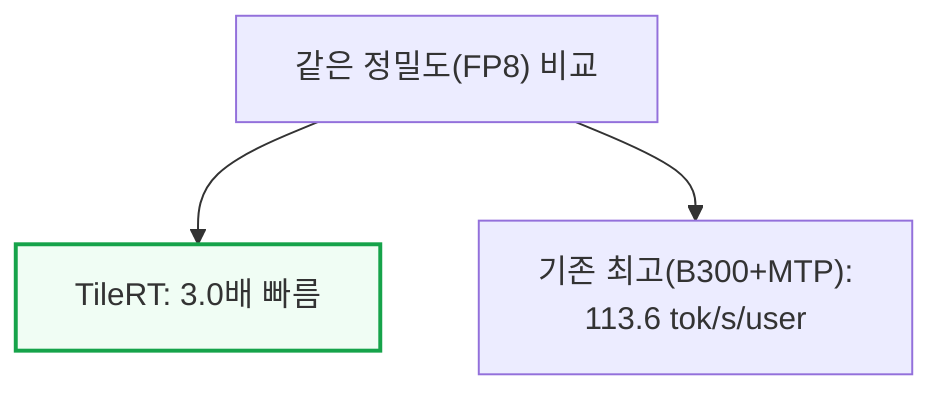

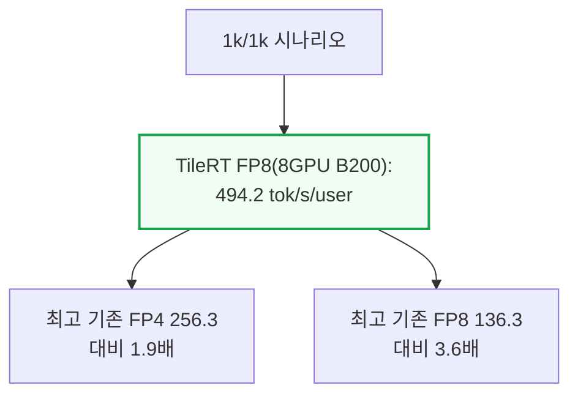

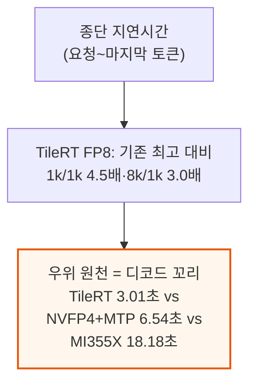

---

## 4. TileRT 벤치마크 결과 - 처리량 트레이드오프와 배치 크기 1의 대가

**📌 핵심:**
- TileRT의 상호작용성 우위에는 대가가 따른다 — 낮은 처리량이다. 전통적 엔진은 동시요청수(concurrency)가 늘어날수록 가중치 적재·고정 커널 비용을 더 많은 사용자에게 나눠 갚을 수 있다. 8k/1k 시나리오에서 GB300(FP4+MTP, 동시요청 12)은 GPU당 총 처리량 약 240토큰을 내면서 사용자당 154토큰을 유지하는데, TileRT는 GPU당 총 처리량 160.4토큰에 그치는 대신 사용자당 340토큰을 낸다
- 트레이드오프를 정리하면: TileRT는 사용자 한 명당 속도는 훨씬 빠르지만, 전통적인 GB300 지점은 GPU 한 대당 더 많은 총 작업을 처리한다
- TileRT는 발행 시점 기준 디코드 노드 하나당 동시에 진행 중인 요청을 1건만 받는다 — 일반적인 처리량 설정이 아니라 의도적으로 특화된 운영 지점이다
- 결론: 배치 크기 1만 지원하는 지금의 TileRT는 레이싱카를 넘어, 승객 딱 1명만 태우는 전용 로켓에 가깝다 — 승객을 더 태우도록 엔지니어링하는 것도 가능은 하지만 만만치 않은 목표다

---

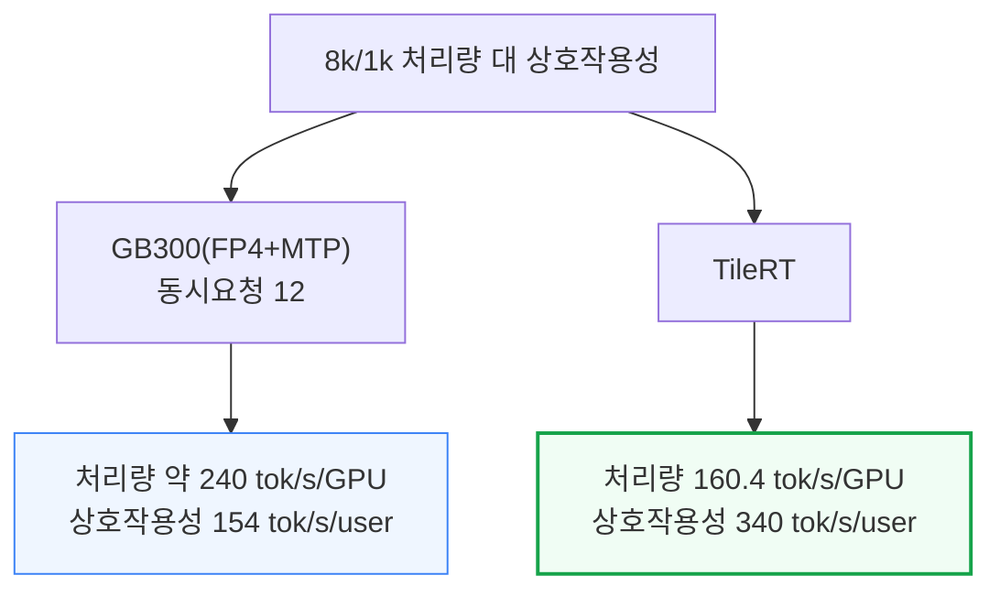

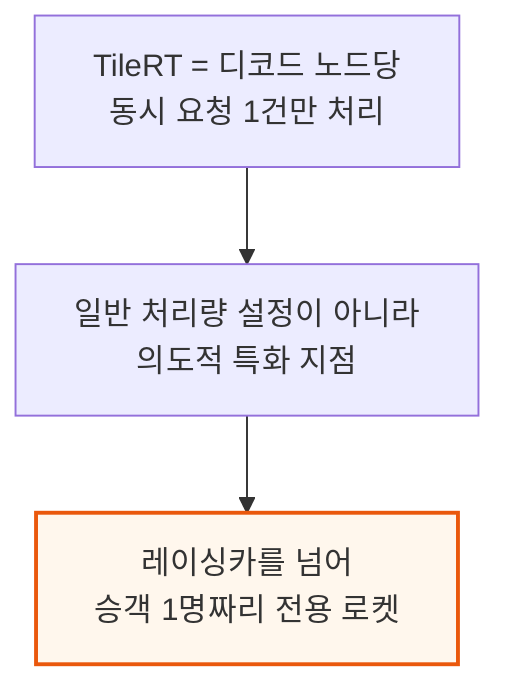

---

## 5. TileRT란 무엇인가 - 지속형 엔진 커널

**📌 핵심:**
- 전통적 서빙 엔진은 GPU 프로그램(커널) 수천 개를 하나씩 순서대로 실행 — 준비·정리 비용 때문에 GPU가 대기하는 시간이 상당하고, 배치가 작을수록 이 오버헤드를 나눠 낼 일감 자체가 적어 문제가 커진다. 각 커널은 절반만 끝난 작업도 매번 HBM에 다시 써야 한다
- 단일 HGX H200 서버(합산 38.4TB/s HBM 대역폭)에서 배치 크기 1로 돌리면, MXFP8(8비트 정밀도) 기준 토큰 하나당 활성 파라미터 대역폭이 42GB — 대역폭에만 묶여 있다면 추측 디코딩 없이도 이론상 초당 사용자당 최대 1,000토큰까지 가능해야 한다. 실제로는 그렇지 않다. GPU의 프로그래밍·아키텍처 모델 자체가 애초에 저지연용으로 설계되지 않았기 때문 — GPU당 메모리 대역폭은 세대마다 2\~3배씩 늘어도 메모리 지연시간은 HBM 가격이 계속 오르는 와중에도 전혀 개선되지 않고 있다
- TileRT는 커널을 계속 새로 띄우는 대신, 모델 전체를 미리 정적으로 컴파일해 하나의 지속형 엔진 커널로 만든다 — 호스트(CPU)는 딱 한 번만 실행을 지시하고, 이후 실행은 디코드가 끝날 때까지 GPU에 계속 상주하며, 런타임에서 처리하던 조율 작업 대부분이 컴파일 시점으로 옮겨간다
- 결론: CUDA 그래프(커널 실행 순서를 미리 기록해 한 번에 재생하는 기존 기법)와는 다르다 — CUDA 그래프도 커널 자체는 여전히 개별적으로 분리돼 있어 경계마다 비용이 남고 온칩 상태가 매번 지워지는 반면, "CUDA 그래프가 커널의 실행을 최적화한다면, TileRT는 커널이라는 실행 단위 자체를 없앤다"

---

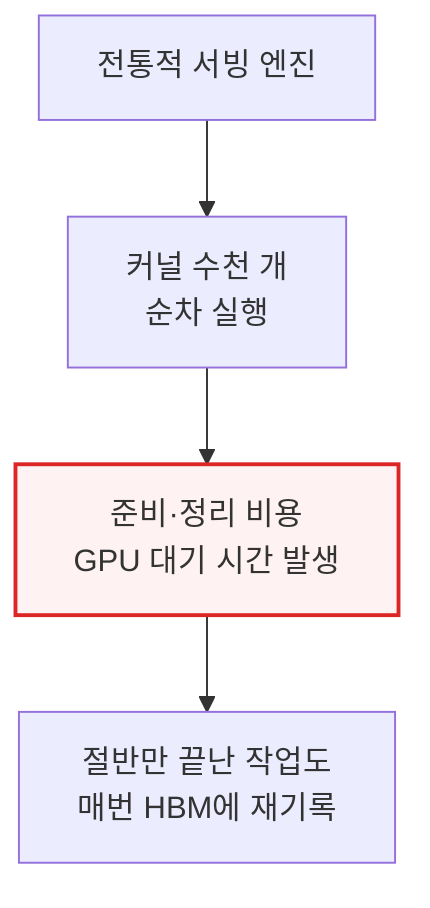

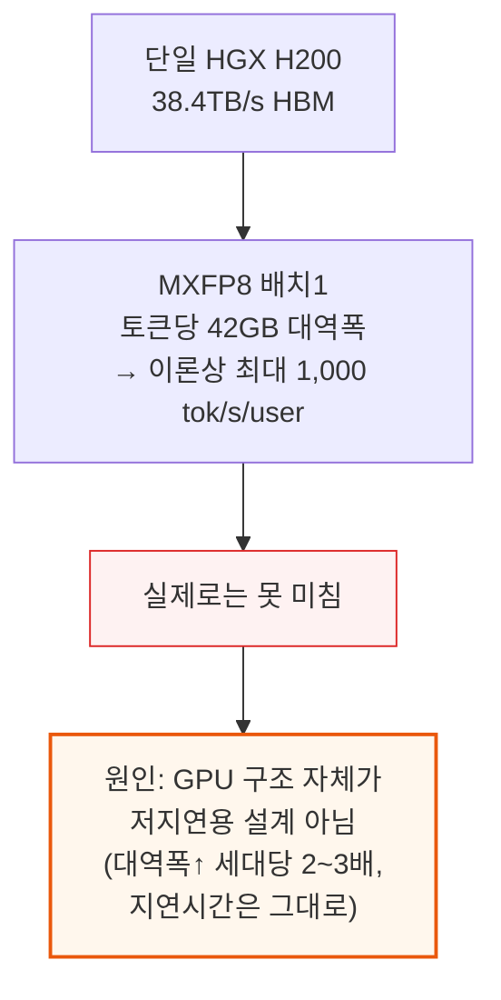

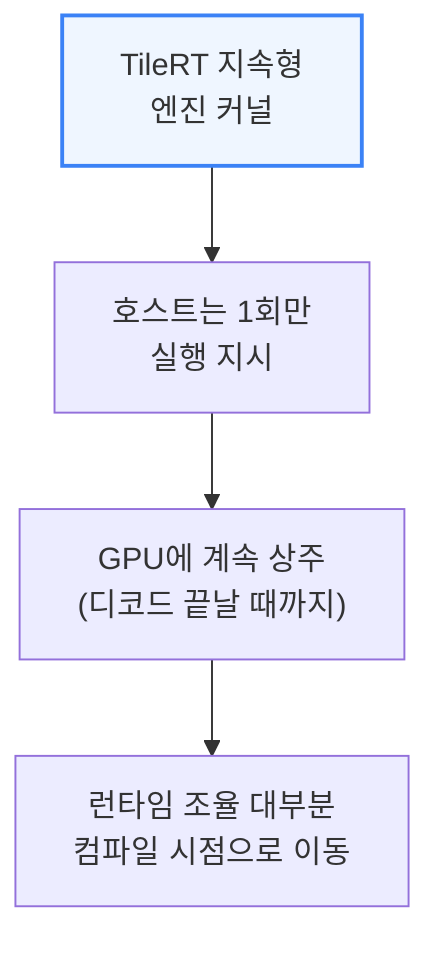

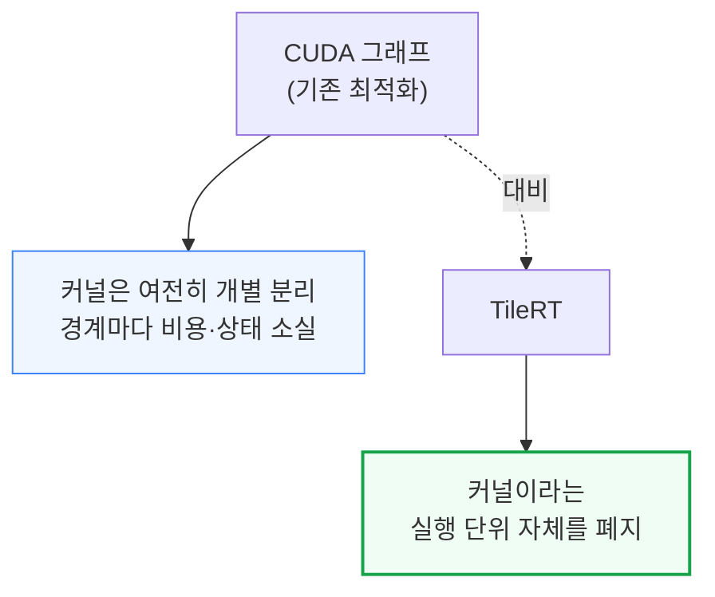

---

## 6. TileRT란 무엇인가 - 타일과 워프와 GPU 특화

**📌 핵심:**
- 작업을 타일(더 작은 연산 조각) 단위로 쪼개고 워프(GPU 코어 안의 실행 단위)·블록별로 역할을 나누는 워프 특화를 적용하면, 런타임이 연산·입출력·통신을 촘촘히 겹쳐 재배치한다 — 엔진 커널 안에서 서로 다른 워프 그룹이 각각 비동기 데이터 이동, 텐서 연산, 통신 오버랩을 맡는다
- 기존에는 적재→대기→연산→대기 식으로 단계가 순차적으로 실행됐지만, TileRT는 이를 타일 단위로 겹쳐 실행하고 중간 결과를 레지스터·공유메모리·L2 캐시로 흘려보내 매번 전역 메모리(HBM)에 흘리지 않는다 — CTA(협력형 스레드 어레이, GPU 코어 하나가 처리하는 작업 묶음) 하나하나가 균일한 SIMT(단일명령다중스레드) 작업자가 아니라 여러 역할을 겸하는 작은 공장이 된다
- 특화는 워프를 넘어 GPU 전체로도 확장된다 — 대부분의 텐서 병렬(TP) 프레임워크는 모든 GPU가 동일한 로직을 동시에 실행한다고 가정하지만, 희소 라우팅·Top-K 선택·동적 인덱싱·긴 문맥 어텐션·MTP는 연산량은 적어도 전역 정보에 의존해 모든 GPU가 이를 다 거치면 중복 작업과 동기화 부담만 늘어난다. GLM-5.1의 어텐션 계층에서는 GPU 0이 Top-K 선택·희소 인덱스 구성·라우팅을 전담하는 "희소 인덱서" 역할을 맡고, 나머지 GPU 1\~7은 RMSNorm·GEMM(행렬곱)·플래시 희소 어텐션·AllReduce(집단 통신)를 처리하는 "MLA 작업자" 역할을 맡는다
- 결론: 통신도 더 이상 별도 단계로 취급하지 않는다 — 브로드캐스트·리덕션(집계)·동기화가 타일 단위 흐름 안에서 직접 실행돼, TileRT에서는 어텐션 계층 전체가 호스트 입장에서 커널 실행 1회에 대응하고, 실행 흐름은 연산→동기화→연산의 반복이 아니라 연산↔통신↔연산이 끊임없이 겹치는 파이프라인으로 바뀐다

---

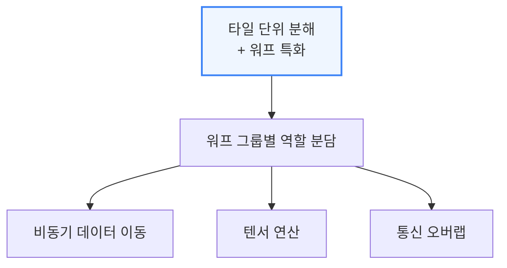

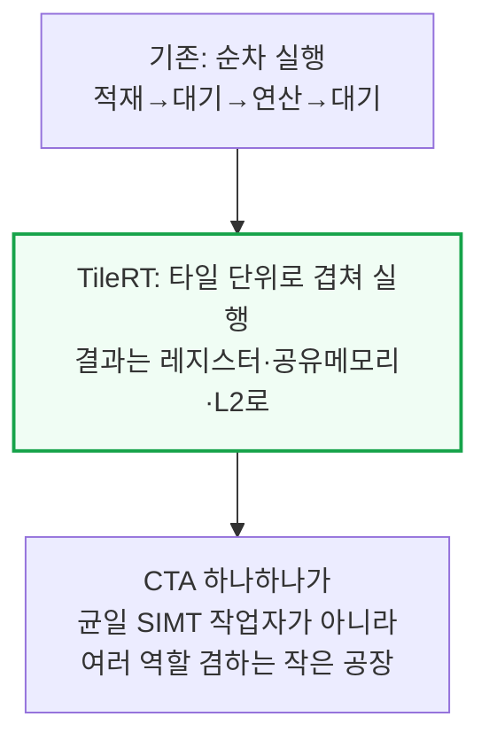

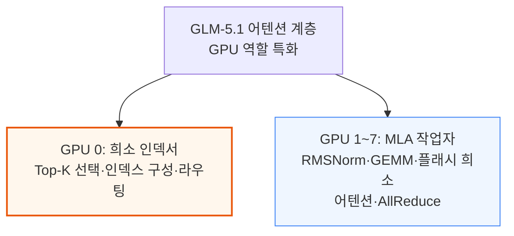

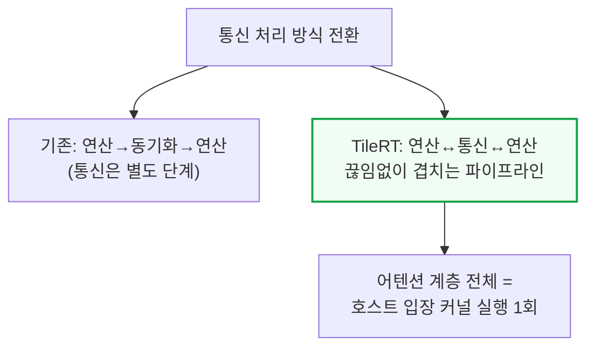

---

*작성 진행률: 약 50% 완료*
*업데이트: 4\~6장(처리량 트레이드오프·배치 크기 1, 지속형 엔진 커널, 타일·워프·GPU 특화) 작성 완료*
