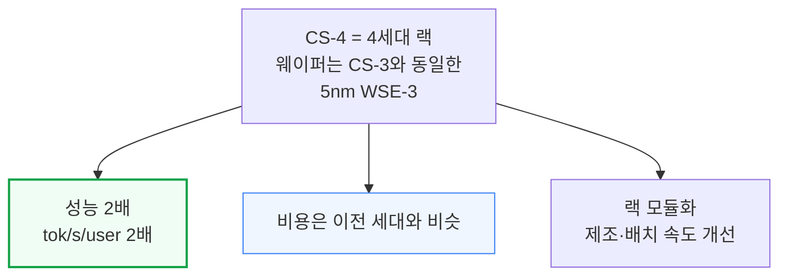
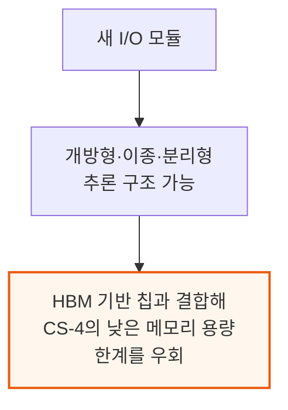
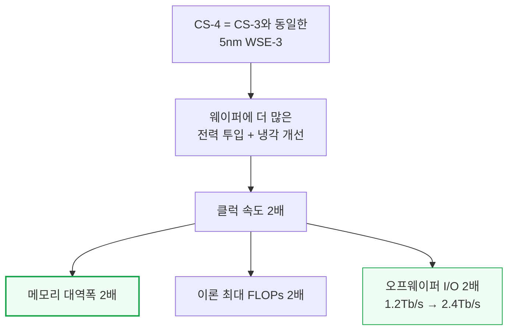
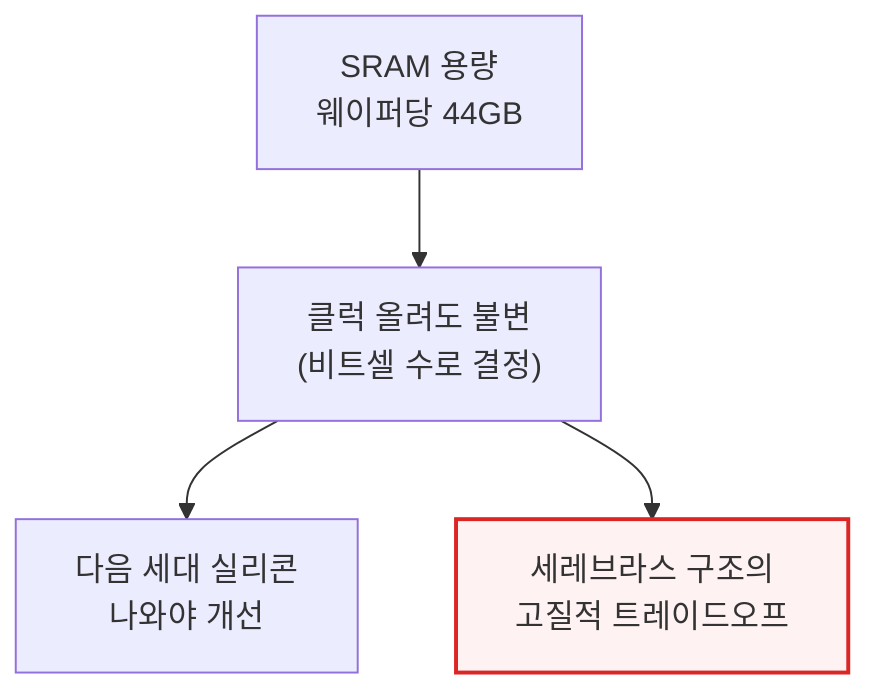
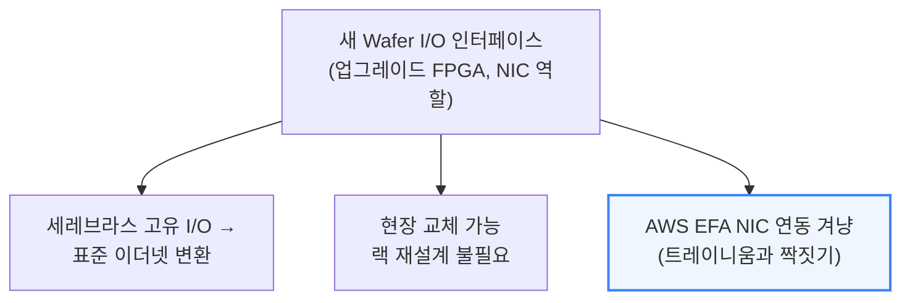
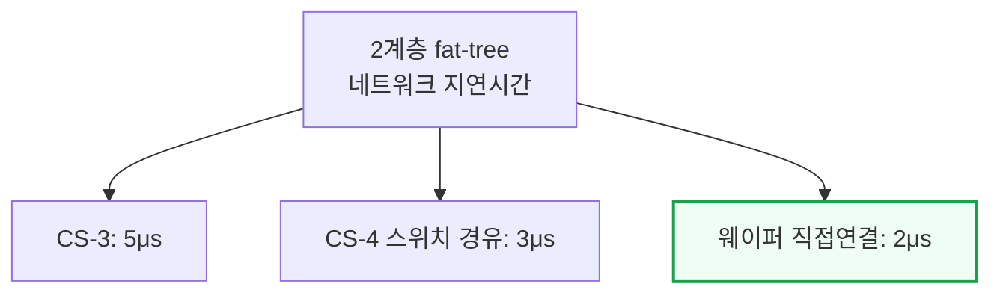
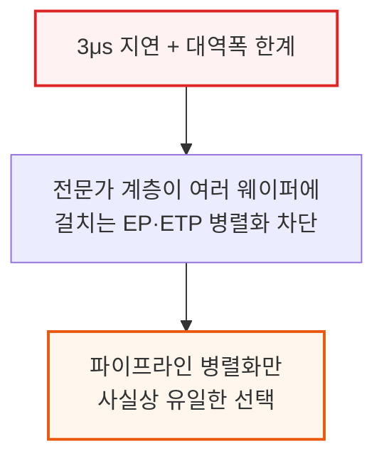

# Cerebras's Next Generation CS-4: Fast Just Got Faster

> **출처**: [SemiAnalysis Newsletter](https://newsletter.semianalysis.com/p/cerebrass-next-generation-cs-4-fast)
> **저자**: Myron Xie, Bryan Shan, Wega Chu
> **발행일**: 2026-08-19

---

## 📑 목차

### 전체 섹션
1. [서론 - CS-4 공개와 토큰 두 배 시대](#1-서론---cs-4-공개와-토큰-두-배-시대)
2. [같은 웨이퍼 두 배 빠른 클럭](#2-같은-웨이퍼-두-배-빠른-클럭)
3. [네트워크 개선](#3-네트워크-개선)
4. [백팩 랙 - 전력과 연산을 나눈 모듈러 구조](#4-백팩-랙---전력과-연산을-나눈-모듈러-구조)
5. [병렬화 전략 - 파이프라인 대 텐서 전문가 병렬](#5-병렬화-전략---파이프라인-대-텐서-전문가-병렬)
6. [분리형 추론에 거는 베팅](#6-분리형-추론에-거는-베팅)
7. [로드맵 - Nexus와 CS-5](#7-로드맵---nexus와-cs-5)

---

## 🔑 용어 정리

본문을 순서대로 읽기 전에 알아두면 좋은 용어들입니다. 자세한 수치와 설명은 본문에서 처음 등장하는 위치에 나옵니다.

- **WSE-3(Wafer-Scale Engine 3, 3세대 웨이퍼 스케일 엔진)**: 반도체 웨이퍼(원판) 한 장을 자르지 않고 통째로 칩 하나로 쓰는 세레브라스의 핵심 설계 — CS-4는 이 웨이퍼를 CS-3와 그대로 재사용한다
- **오프웨이퍼 I/O(Off-wafer I/O)**: 웨이퍼 안에서 도는 데이터가 아니라, 웨이퍼 밖 네트워크로 실제 나가고 들어오는 데이터 통로 — 웨이퍼 내부 SRAM 대역폭과는 별개의 병목 지점
- **백팩(Backpack) 모듈**: CS-4에서 전력·냉각·입출력·웨이퍼를 각각 독립된 부품으로 분리해 랙 뒤쪽에 꽂아 넣는 세로형 함체 — 현장에서 웨이퍼만 꽂아 넣으면 되는 조립 방식
- **TDP(Thermal Design Power, 열설계전력)**: 시스템이 정상 작동 중 실제로 소비·방출하는 전력의 설계 기준치 — 랙 하나가 감당해야 할 전력·냉각 용량을 가늠하는 숫자
- **파이프라인 병렬화 vs 텐서·전문가 병렬화**: 큰 모델을 여러 칩에 나눠 담는 두 가지 방식 — 파이프라인 병렬화는 모델을 층(layer) 단위로 순서대로 나눠 칩마다 한 구간씩 맡기고, 텐서·전문가 병렬화는 같은 층 안의 연산이나 전문가(expert)를 여러 칩에 동시에 흩뿌린다. 세레브라스는 칩 간 통신 대역폭이 좁아 파이프라인 병렬화를 주로 쓴다
- **PDD vs AFD(Prefill-Decode Disaggregation vs Attention-FFN Disaggregation)**: 추론 과정을 서로 다른 하드웨어에 나눠 맡기는 두 가지 분리 방식 — PDD는 입력을 한번에 처리하는 프리필과 토큰을 하나씩 만드는 디코드를 나누고, AFD는 어텐션 계산과 피드포워드 신경망 계산을 나눠 각각에 유리한 칩에 맡긴다
- **KV 캐시(Key-Value Cache)**: 이전에 생성한 토큰들의 연산 결과를 저장해둬 다음 토큰을 만들 때 다시 계산하지 않도록 하는 메모리 — 동시 사용자 수와 문맥 길이(context window)에 비례해 필요한 용량이 커진다
- **Nexus**: 세레브라스가 차세대 웨이퍼와 함께 설계 중인 새 랙스케일 플랫폼 — CS-4의 랙 뼈대(섀시)를 다음 세대 칩까지 그대로 이어 쓰기 위한 기반

---

## 1. 서론 - CS-4 공개와 토큰 두 배 시대

**📌 핵심:**
- CS-4는 세레브라스의 4세대 랙 — 웨이퍼 자체는 CS-3와 똑같은 5나노 3세대 웨이퍼 스케일 엔진(WSE-3)을 그대로 쓰지만, 전력 소비와 클럭 속도를 올리고 랙 밀도를 개선해 성능을 두 배로 끌어올렸다
- 결과: 웨이퍼 한 장이 초당 사용자당 뽑아내는 토큰 수(tok/s/user)가 CS-3 대비 두 배로 늘었는데, 비용은 이전 세대와 비슷한 수준이다 — 같은 하드웨어 지출로 토큰 매출이 두 배가 되는 셈이라 고객 입장에선 안 살 이유가 없는 제안
- 랙 구조 자체도 모듈형으로 다시 설계돼 제조·배치가 빨라졌고, 새 입출력(I/O) 모듈은 세레브라스 웨이퍼를 다른 회사의 HBM(고대역폭메모리) 기반 칩과 섞어 쓰는 개방형·이종·분리형 추론 구조를 가능하게 한다
- 결론: 이 분리형 구조는 세레브라스 웨이퍼의 고질적 약점인 낮은 메모리 용량을 HBM 기반 시스템과 짝지어 우회하는 통로가 된다

---

---

## 2. 같은 웨이퍼 두 배 빠른 클럭

**📌 핵심:**
- CS-4는 CS-3와 똑같은 5나노 WSE-3 웨이퍼를 그대로 쓰면서, 웨이퍼에 훨씬 많은 전력을 밀어넣고 클럭 속도를 두 배로 올려 성능을 뽑아낸다 — 이게 가능해진 건 전력 공급과 냉각 기술이 함께 개선됐기 때문
- 같은 실리콘을 재사용한다는 게 인상적이지 않아 보여도, 세레브라스가 가장 중요하게 보는 지표인 메모리 대역폭은 두 배가 됐다 — 다른 조건이 같다면 초당 사용자당 토큰 수(tok/s/user)도 거의 두 배로 이어진다는 뜻이라, 이게 바로 고객이 원하는 결과다
- 클럭이 두 배가 되면서 이론상 최대 연산능력(FLOPs)과 웨이퍼 밖으로 나가는 오프웨이퍼 I/O도 같이 두 배로 뛰어, CS-3의 초당 1.2테라비트(Tb/s)에서 CS-4는 초당 2.4Tb/s로 올라갔다
- 결론: 다만 웨이퍼 한 장당 SRAM(고속 메모리) 용량은 44GB로 그대로다 — 이 수치는 웨이퍼 위에 물리적으로 새길 수 있는 SRAM 비트셀 개수로 정해지는 값이라 클럭을 올린다고 늘어나지 않으며, 다음 세대 실리콘이 나와야 개선을 기대할 수 있다. 낮은 메모리 용량은 세레브라스 아키텍처가 안고 가는 고질적 트레이드오프다

---

세레브라스는 이전 기사(「세레브라스 — 더 빠른 토큰을 주세요」)에서 설명했듯이, SRAM 기반 구조는 연산 강도(Arithmetic Intensity, 메모리에서 1바이트를 가져올 때마다 몇 번 연산할 수 있는지 나타내는 지표)가 낮은 커널 — 즉 배치 크기가 작은 디코드(토큰을 하나씩 순차 생성하는 단계) — 처리에 특히 유리한 웨이퍼 아키텍처다.

---

## 3. 네트워크 개선

**📌 핵심:**
- 오프웨이퍼 I/O 대역폭이 두 배가 된 것 외에도, 세레브라스 고유 프로토콜을 표준 이더넷으로 바꿔주는 네트워크 카드(NIC 역할을 하는 업그레이드된 FPGA)인 새 Wafer I/O 인터페이스가 추가됐다 — 웨이퍼의 북쪽·남쪽 두 곳에 I/O 모듈이 붙고, 현장 교체가 가능해 랙을 다시 설계하지 않고도 새 네트워킹 표준으로 갈아탈 수 있다
- 이 모듈 덕분에 HBM 기반 가속기와 짝지어 어텐션 계산과 피드포워드 신경망 계산을 나누는 AFD(Attention-FFN Disaggregation) 구성이 가능해져 CS-4의 낮은 메모리 용량을 우회할 길이 열렸다 — 엔비디아가 Groq LPU(저지연 특화 추론 칩)를 포지셔닝하는 방식과 같은 접근이며, AWS의 EFA(탄력적 패브릭 어댑터) 네트워크 카드를 CS-4에 붙여 트레이니움 서버와 연동하는 용도로 설계된 것으로 보인다
- 2계층 fat-tree 네트워크(아리스타 이더넷 스위치 사용)의 지연시간은 새 저지연 패킷 처리 파이프라인 덕분에 CS-3의 5마이크로초(μs)에서 3μs로 줄었고, 스위치를 거치지 않는 웨이퍼 간 직접 연결까지 쓰면 2μs까지 더 줄어든다 — 다만 경쟁사들이 스위치 지연을 나노초 단위로 얘기하는 상황이라 "초고속"이라는 표현은 상대적이며, 개선 폭 자체는 적당한 수준이다
- 결론: 이 3μs 지연시간과 대역폭 한계는 여전히 발목을 잡는다 — 전문가(expert) 계층이 여러 웨이퍼에 걸쳐 나뉘는 EP(전문가 병렬)·ETP 같은 병렬화 방식을 못 쓰게 막아, 라우터에서 전문가로 토큰을 보내고 모으는 작업이 지연시간에 민감한 데다 전문가 부하 불균형 문제까지 겹치면서 파이프라인 병렬화만이 사실상 유일하게 쓸 수 있는 방식으로 남는다

---

---

*작성 진행률: 약 40% 완료*
*업데이트: 서론(CS-4 개요), 같은 웨이퍼 두 배 클럭, 네트워크 개선 3개 섹션 작성 완료*
