# AgentX - InferenceXv3: Does CUDA Moat Hold up in Agentic Inferencing?

> **출처**: [SemiAnalysis Newsletter](https://newsletter.semianalysis.com/p/agentx-inferencexv3-does-cuda-moat)
> **저자**: Cam Quilici, Bryan Shan, Alec Ibarra
> **발행일**: 2026-08-24

---

## 📑 목차

### 전체 섹션
 1. [서론 - AgentX 1.0 공개와 에이전틱 추론의 부상](#1-서론---agentx-10-공개와-에이전틱-추론의-부상)
 2. [에이전틱 워크로드란 무엇인가](#2-에이전틱-워크로드란-무엇인가)
 3. [모델별 에이전틱 코딩 추론 성능](#3-모델별-에이전틱-코딩-추론-성능)
 4. [업계 파급력 - 분산 추론 생태계와 50개+ 상류 PR](#4-업계-파급력---분산-추론-생태계와-50개-상류-pr)
 5. [컨텍스트 병렬화와 vLLM·SGLang 최적화](#5-컨텍스트-병렬화와-vllmsglang-최적화)
 6. [TensorRT-LLM·AMD ATOM·AITER 최적화](#6-tensorrt-llmamd-atomaiter-최적화)
 7. [Dynamo·LMCache·Mooncake 최적화와 그 밖의 개선](#7-dynamolmcachemooncake-최적화와-그-밖의-개선)
 8. [AgentX 방법론 - 300만 달러 데이터셋과 트레이스 리플레이어](#8-agentx-방법론---300만-달러-데이터셋과-트레이스-리플레이어)
 9. [InferenceX/AgentX 다음 단계](#9-inferencexagentx-다음-단계)
10. [모델 수명주기 전체로 본 성능 - 적분 관점](#10-모델-수명주기-전체로-본-성능---적분-관점)
11. [단일 턴(8k1k) 성능 - 시간에 따른 개선](#11-단일-턴8k1k-성능---시간에-따른-개선)

---

## 🔑 용어 정리

본문을 순서대로 읽기 전에 알아두면 좋은 용어들입니다. 자세한 수치와 설명은 본문에서 처음 등장하는 위치에 나옵니다.

- **에이전틱 워크로드(Agentic Workload)**: 챗봇처럼 한두 번 묻고 답하는 게 아니라, 모델이 코드를 실행하고 도구를 부르고 수십\~수백 번 대화를 이어가며 작업을 끝까지 수행하는 방식 — 대화가 길어질수록 이전 맥락을 재활용하는 비중이 커진다
- **KV 캐시와 프리픽스 재사용(Prefix Reuse)**: 이전 대화 턴에서 계산해둔 결과(KV 캐시)를 다음 턴에서 다시 계산하지 않고 그대로 재사용하는 것 — 에이전틱 대화는 turn이 쌓일수록 재사용 비율이 1(=100%)에 가까워진다
- **PD 분리(Prefill-Decode Disaggregation, PDD)**: 입력을 한번에 처리하는 프리필(prefill)과 토큰을 하나씩 뽑아내는 디코드(decode)를 서로 다른 GPU 묶음에 맡겨 처리하는 방식 — 성격이 다른 두 작업을 분리해 각각 최적화한다
- **컨텍스트 병렬화(Context Parallelism, PCP/DCP)**: 하나의 긴 입력·캐시를 여러 GPU에 쪼개 나눠 처리하는 기법 — 프리필 단계에 쓰면 PCP, 디코드 단계에 쓰면 DCP라 부른다
- **TTFT·TPS(TPOT) - 상호작용성 지표**: TTFT(Time To First Token)는 질문 후 첫 글자가 나오기까지 걸리는 시간, TPS(초당 사용자당 토큰 수)는 그 이후 얼마나 빨리 이어지는지를 나타내는 지표 — 이 둘은 종종 한쪽을 올리면 다른 쪽이 나빠지는 트레이드오프 관계
- **TCO(Total Cost of Ownership, 총소유비용)**: 칩 구매비뿐 아니라 전력·운영까지 합친 실제 총비용 — SKU 간 성능을 비교할 때 가격이 아니라 이 TCO로 정규화해서 비교한다
- **8k1k 고정 시퀀스 벤치마크**: 입력 8,000토큰·출력 1,000토큰으로 고정한 옛날 방식 성능 측정 — 프리픽스 재사용이나 세션 상태를 반영하지 못해 지금의 실제 트래픽과는 다르지만, 칩·커널 자체의 기초 성능을 보는 데는 여전히 쓸모가 있다
- **DAG 트레이스 리플레이(서브에이전트 구조)**: 하나의 에이전틱 세션을 요청들이 서로 의존하는 방향성 비순환 그래프(DAG)로 표현해 재생하는 방식 — 메인 에이전트가 여러 서브에이전트를 동시에 띄우고 다시 합류하는 구조까지 그대로 재현한다

---

## 1. 서론 - AgentX 1.0 공개와 에이전틱 추론의 부상

**📌 핵심:**
- 2025년 11월 「클로드 코드 변곡점」이후 긴 맥락·멀티턴 에이전틱 워크로드가 급증해 지금은 실제 운영 추론 트래픽의 대부분을 차지한다 — 2026년 4월 OpenAI의 기업용 에이전틱 지출이 챗GPT 지출을 넘어섰다
- SemiAnalysis는 300만 달러 이상을 들여 만든 데이터셋을 통째로 공개하며, 세계 최초로 100% 오픈소스인 멀티턴 에이전틱 코딩 추론 벤치마크 "AgentX 1.0"(1백만 토큰 맥락까지, Apache 2.0 라이선스)을 발표한다
- 전체 측정은 약 2메가와트(MW) 규모 컴퓨트를 1,000개 이상의 칩(MI355X·GB300 NVL72·GB200 NVL72·B300·B200·MI325·MI300X·H200·RTX Pro 서버 등)에 걸쳐 상시 가동해 진행했고, 루빈(Rubin)은 이달 말, TPU와 MI455X UALoE72는 올해 안에 추가될 예정이다
- 결론: 공개 첫 몇 달 만에 이 벤치마크를 기준점(north star)으로 삼아 vLLM·SGLang·TensorRT-LLM·ATOM·AITER·Dynamo·LMCache·Mooncake 등에 70여 개의 상류(upstream) 코드 개선(PR)이 올라갔다는 것 자체가 초기 성능 수치보다 더 큰 성과다

---

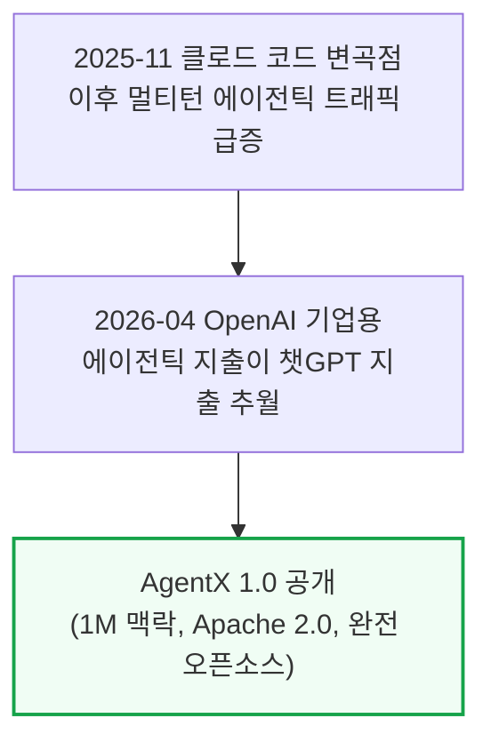

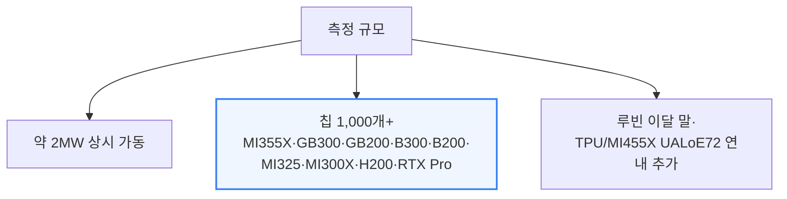

이 벤치마크는 오픈소스치고 이례적으로 스택 대부분을 공개한다 — 프런트엔드, 여러 1티어 AI 랩의 컴퓨트 확보 계획팀이 이미 쓰고 있는 공개 REST API 데이터베이스, GitHub Actions CI 증빙, 로그, 모든 데이터 포인트에 대한 정확도 검증까지 전부 열려 있다. 벤치마크 설정은 recipes.vllm.ai와 SGLang 쿡북의 상류(upstream) 이미지를 그대로 따라가, 실제 고객이 체감하는 성능을 측정하지 벤치마크용으로 특별 튜닝된(benchmax'ed) 이미지를 측정하지 않는다. 3\~4주 안에 AMD·Nvidia 최신 결과를 담은 후속 업데이트 기사가 나올 예정이다.

이번 릴리스는 Inferact/vLLM, RedHat/llm-d, RadixArk/SGLang, LMCache/TensorMesh, Weka, Mooncake 관리팀, AMD, Nvidia, Anthropic 직원, GitHub 등 다수 오픈소스 파트너의 기여로 완성됐고, 메타·마이크로소프트·오라클·OpenAI·미니맥스·문샷 Kimi·알리바바 Qwen·즈푸 GLM도 이 오픈소스 이니셔티브를 지지한다고 공개적으로 밝혔다.

---

## 2. 에이전틱 워크로드란 무엇인가

**📌 핵심:**
- 에이전틱 워크로드는 네 가지로 정의된다: ① 멀티턴(세션 하나에 수십\~수백 번의 대화), ② 긴 맥락(시스템 프롬프트·도구 정의·turn 누적으로 맥락이 빠르게 쌓임), ③ 높은 프리픽스 재사용(turn n-1의 출력이 turn n에 이어붙으며 재사용 비율이 1에 수렴), ④ 서브에이전트 버스트(짧게 살다 사라지는 서브에이전트가 새 맥락으로 뜨며 캐시 사용량이 들쭉날쭉해짐)
- 이 네 특징 때문에 에이전틱 추론은 칩 하나의 커널 성능 문제가 아니라 "시스템 문제"가 된다 — 재사용률이 워낙 높아 KV 텐서를 노드·랭크 사이에 효율적으로 옮겨야 하고(NIXL·MORI-IO·Mooncake), 어느 노드에 필요한 프리픽스가 있는지에 맞춰 대화를 라우팅해야 하며(LLM-d·Dynamo·vLLM/SGLang 라우터), 긴 맥락이 HBM(고대역폭메모리) 용량을 압박해 DRAM·SSD로 캐시를 내려보내는(오프로드) 작업까지 효율적으로 처리해야 한다(Mooncake Store·LMCache·vLLM Simple Offloading·SGLang HiCache)
- 반대로 옛날 방식인 고정 길이·단일 턴 벤치마크는 프리픽스 재사용이 의미가 없어 순수하게 칩·커널 기초 성능만 보여준다 — 여전히 유용한 기준점이지만 지금의 실제 트래픽과는 다르다
- 결론: 이런 실전 트래픽을 재현하기 위해 SemiAnalysis 내부의 익명화된 클로드 코드 트레이스 393개를 수집해 AIPerf로 원래의 요청 스케줄대로 재생했고, 이 데이터셋을 가능하게 하려 앤트로픽과 협력해 클로드 코드 기능 2건(GitHub 이슈 #49207, #66761)을 함께 출시했다

---

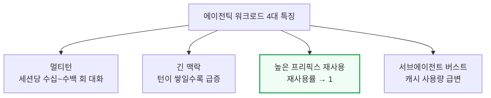

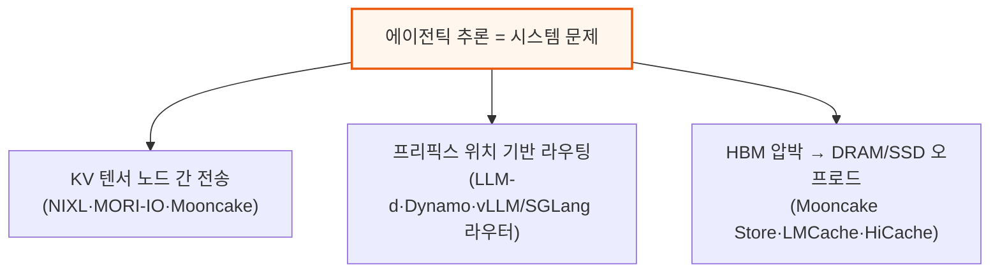

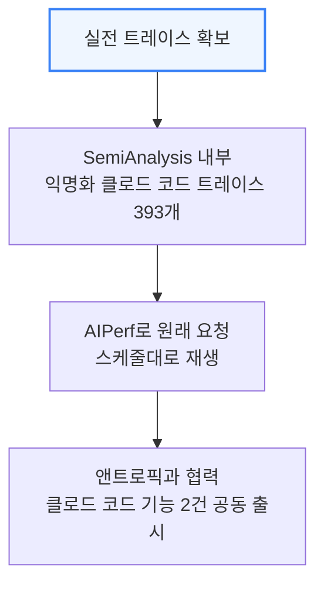

---

## 3. 모델별 에이전틱 코딩 추론 성능

**📌 핵심:**
- 프론티어 랩들은 추론 코딩 성능을 볼 때 상호작용성(TPS) 대비 달러당 성능, TTFT, 종단간(e2e) 작업 완료율 세 가지를 본다 — 메가와트당 성능도 중요한데, 자금은 랩들에게 사실상 무제한이지만 전력은 물리적으로 구하기 어려운 자원이기 때문
- DeepSeek V4 Pro(1.6조 파라미터), Kimi K3(2.8조 파라미터), MiniMax M3(432B), Qwen3.5(397B), GLM 5.3(744B 기반) 다섯 개 프론티어 모델에서 엔비디아와 AMD 모두 강점을 보이는 영역이 갈렸다
- MI355X 오픈소스(vLLM)는 AMD 자체 엔진 ATOM보다 대체로 뒤처지는데, 이는 ATOM이 중국·서구 대부분의 AI 랩에서 실제 상용 서비스에 쓰이지 않기 때문에(알리바바 소규모 광고 사업부 한 곳 제외) 실질적인 비교 기준은 여전히 vLLM이라는 점이 중요하다
- 결론: 2026년 8월 21일을 기점으로 vLLM 최적화(Inferact·엔비디아)가 반영되며 B200의 달러당 성능이 MI355X를 다시 앞질렀다 — 몇 주 전까지는 MI355X SGLang이 B200 vLLM과 비슷한 수준까지 따라붙었던 접전 구도였다

---

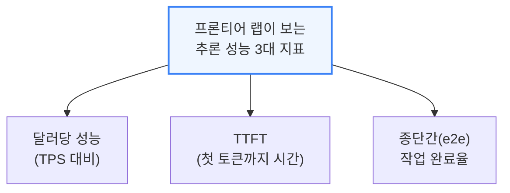

### DeepSeek V4 Pro 0813 (1.6조 파라미터, 활성 490억)

DeepSeek V4 Pro의 요청 분포는 입력 길이(ISL) 중앙값 8만 8천 토큰(p90 27만 2천, p99 67만 5천), 출력 길이(OSL) 중앙값 413토큰(p90 2,200, p99 8,600)으로, 실전 서비스에서 "적정" p90 TTFT는 보통 200\~5,000ms이며 5\~10초를 넘으면 "온라인 추론"의 경계를 벗어난다.

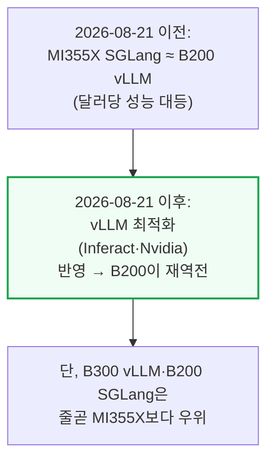

AMD 분산추론(DI)팀은 6개월간 8k1k 시나리오를 개선했지만 아직 실전 워크로드엔 부족하다 — 1xDEP8+1xDEP8 분리형 구성은 고처리량 구간에서 소폭 개선에 그치고 저지연 구간에서는 오히려 더 나빠지며, SGLang의 `--enable-prefill-delayer`(동시 요청 64 이상에서 프리필을 최대 30 순전파까지 미뤄 배치를 더 채우는 옵션)와 청크 프리필 크기 확대(8,192→65,536)가 처리량은 올리지만 p90 TTFT를 크게 악화시킨다. 종단간 지연 기준으로는 ATOM MI355X가 B200 vLLM을 이기지만(B300·B200 SGLang은 못 이김), ATOM은 미완성 기능이 많아 알리바바 소규모 광고 사업부 한 곳 외엔 중국·서구 어느 AI 랩도 상용에 쓰지 않는다 — Qwen 본진도 ATOM을 쓰지 않는다.

엔비디아 쪽 최강 조합은 GB300 Dynamo TRTLLM과 GB200 Dynamo vLLM으로, 둘 다 PD 분리(프리필-디코드 분리)로 합리적 상호작용성에서 높은 처리량을 뽑고, GB300은 wide-EP(DEP32) 디코드 구성까지 더해 프론티어 중간 구간 처리량을 끌어올린다. GB300은 더 높은 동시성을 달성하는 만큼 서브에이전트 트래픽·콜드 프리필도 늘어 TTFT가 더 민감하게 반응한다.

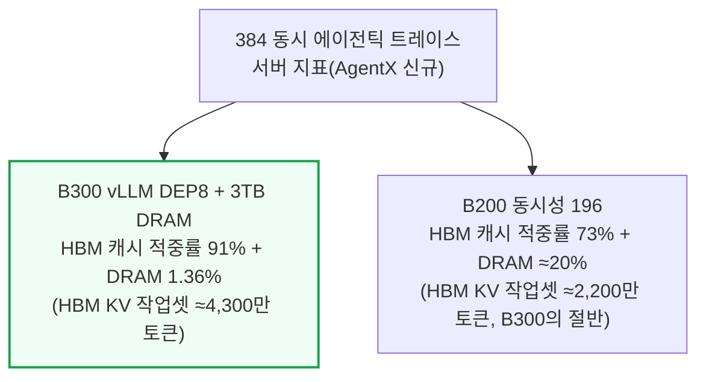

B300이 B200 대비 HBM 용량 50% 더 많아 TCO 정규화 처리량은 비슷해도 B300이 여분의 처리량을 "짜낼" 수 있는 이유가 여기 있다. DRAM KV 오프로드는 쓰기 유지(write-through) 캐시라서 DRAM 용량이 HBM KV 캐시 용량의 1.5\~3배는 돼야 효과가 크다. H200 SGLang FP8은 저동시성에서는 B200/MI355X SGLang과 맞먹는 달러당 성능을 내지만 HBM이 적어 고처리량 구간에선 신형 SKU를 못 따라가고, 동시성이 오르면 DRAM 오프로드 의존도가 커져 지연시간이 비합리적으로 치솟는다. 종합하면 MI355X는 텐서 병렬화와 기초 커널만 쓰는 저처리량·저지연 구간에서 가장 경쟁력 있고, AMD는 B200 대비 1.5배 많은 HBM을 가진 만큼 고처리량 구간에서 DEP 커널 최적화가 더 필요하다.

### Kimi K3 (2.8조 파라미터)

Kimi K3는 클로드의 Mythos/Fable5와 비슷한 파라미터 규모의 오픈 웨이트 프록시 모델로 쓰인다. 워낙 커서 B200 서버 한 대에 다 안 들어가 wide EP/TP나 파이프라인 병렬화가 필수인데, vLLM에서 추측 디코딩(DSpark)이 파이프라인 병렬화와 최근까지 전혀 호환되지 않아 B200 성능이 참담했고 MI355X에 완전히 밀렸다.

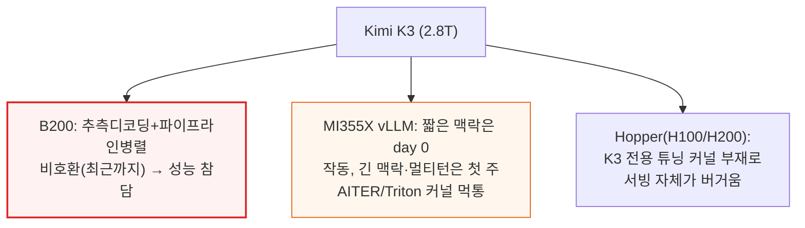

AMD가 ATOM으로 K3 성능을 빠르게 밀어붙이는 건 고무적이지만 vLLM 상류 반영을 더 우선해야 한다는 게 저자들 견해다 — ATOM이 AMD의 현재 최고 성능 엔진이긴 해도, 상류 오픈소스 스택을 쓰는 고객에게는 vLLM 비교가 더 의미 있다. 종단간 지연 40\~60초 구간에서는 MI355X ATOM이 GB300 NVL72 vLLM의 달러당 성능마저 앞선다.

### MiniMax M3(432B), Qwen3.5(397B), GLM 5.3

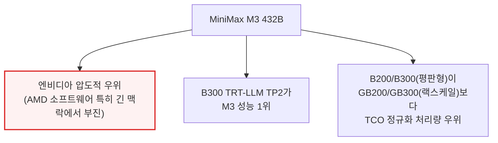

M3에서 AMD가 부진한 건 AMD 엔지니어링 리더십이 짧은 맥락·단일 턴 튜닝에만 인센티브를 걸고 긴 맥락·멀티턴을 등한시했기 때문이라고 저자들은 지적한다. GB200 동시성 40에서 TP4/EP4/DPA 구성은 일반 TP4 대비 처리량이 0.60배에 그치면서 p90 TTFT는 3배 넘게 나빠지고, 동시성 32에서는 이론상 96.0%여야 할 캐시 적중률이 실제로는 28.8%에 그친다 — DP 랭크마다 캐시 풀의 4분의 1씩 독점하는 구조라 30만 토큰짜리 세션이 엉뚱한 랭크에 다시 배정되면 전부 다시 계산해야 하기 때문이다. B200/B300이 랙스케일 GB200/GB300보다 TCO 정규화 처리량에서 앞서는 이유는 Dynamo 라우터가 살아있는 프리픽스 수·길이에 비례해 일이 늘어나는 병목이 되고, wideEP·wide DCP·wide TP용 튜닝된 커널이 아직 없어 TCO가 더 높은 랙스케일 쪽이 성능/TCO에서 불리하게 나오기 때문이다. 엔비디아 Pareto 최적점은 모두 동시성 20 이상에서 KV 오프로드를 쓰는 반면 AMD는 전혀 안 쓰는데, AMD vLLM의 GPU-CPU 전송용 hipMemcpyBatchAsync API가 ROCm 7.14까지 빠져 있어 오프로드 자체가 비효율적이었기 때문이다.

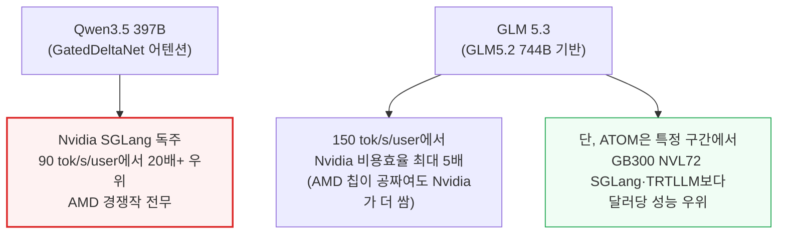

Qwen3.5는 GatedDeltaNet(MIT·엔비디아 리서치가 개발, 상태 저장 요구량이 일정해 일반 어텐션의 선형 증가 구조보다 메모리를 덜 씀)을 몇 층마다 섞어 쓰는 구조로, 네이티브 최대 맥락이 26만 2천 토큰이라 25만 6천 토큰으로 자른 데이터셋을 쓴다. H100 대비 B300 FP4는 12배 나은 달러당 성능을 낸다. GLM 5.3은 GLM5.2 744B에 추가 후속 학습을 더한 프론티어급 모델로, 여기서도 엔비디아가 SGLang에서 AMD를 크게 앞서지만 ATOM 구간에서는 AMD가 반격한다. 저자들은 TTFT와 상호작용성(TPS)을 하나로 합친 실험적 지표 "E2E Normalized Interactivity"(OSL÷E2EL)를 처음 소개하는데, 아직 PD 분리 같은 세부 최적화 효과를 완전히 반영하지 못하는 초기 버전임을 명시한다.

---

*작성 진행률: 약 27% 완료*
*업데이트: 전체 11개 섹션 중 1\~3장(서론, 에이전틱 워크로드 정의, 모델별 성능) 작성 완료*
