# AgentX - InferenceXv3: Does CUDA Moat Hold up in Agentic Inferencing?

> **출처**: [SemiAnalysis Newsletter](https://newsletter.semianalysis.com/p/agentx-inferencexv3-does-cuda-moat)
> **저자**: Cam Quilici, Bryan Shan, Alec Ibarra
> **발행일**: 2026-08-24

---

## 📑 목차

### 전체 섹션
 1. [서론 - AgentX 1.0 공개와 에이전틱 추론의 부상](#1-서론---agentx-10-공개와-에이전틱-추론의-부상)
 2. [에이전틱 워크로드란 무엇인가](#2-에이전틱-워크로드란-무엇인가)
 3. [모델별 에이전틱 코딩 추론 성능](#3-모델별-에이전틱-코딩-추론-성능)
 4. [업계 파급력 - 분산 추론 생태계와 50개+ 상류 PR](#4-업계-파급력---분산-추론-생태계와-50개-상류-pr)
 5. [컨텍스트 병렬화와 vLLM·SGLang 최적화](#5-컨텍스트-병렬화와-vllmsglang-최적화)
 6. [TensorRT-LLM·AMD ATOM·AITER 최적화](#6-tensorrt-llmamd-atomaiter-최적화)
 7. [Dynamo·LMCache·Mooncake 최적화와 그 밖의 개선](#7-dynamolmcachemooncake-최적화와-그-밖의-개선)
 8. [AgentX 방법론 - 300만 달러 데이터셋과 트레이스 리플레이어](#8-agentx-방법론---300만-달러-데이터셋과-트레이스-리플레이어)
 9. [InferenceX/AgentX 다음 단계](#9-inferencexagentx-다음-단계)
10. [모델 수명주기 전체로 본 성능 - 적분 관점](#10-모델-수명주기-전체로-본-성능---적분-관점)
11. [단일 턴(8k1k) 성능 - 시간에 따른 개선](#11-단일-턴8k1k-성능---시간에-따른-개선)

---

## 🔑 용어 정리

본문을 순서대로 읽기 전에 알아두면 좋은 용어들입니다. 자세한 수치와 설명은 본문에서 처음 등장하는 위치에 나옵니다.

- **에이전틱 워크로드(Agentic Workload)**: 챗봇처럼 한두 번 묻고 답하는 게 아니라, 모델이 코드를 실행하고 도구를 부르고 수십\~수백 번 대화를 이어가며 작업을 끝까지 수행하는 방식 — 대화가 길어질수록 이전 맥락을 재활용하는 비중이 커진다
- **KV 캐시와 프리픽스 재사용(Prefix Reuse)**: 이전 대화 턴에서 계산해둔 결과(KV 캐시)를 다음 턴에서 다시 계산하지 않고 그대로 재사용하는 것 — 에이전틱 대화는 turn이 쌓일수록 재사용 비율이 1(=100%)에 가까워진다
- **PD 분리(Prefill-Decode Disaggregation, PDD)**: 입력을 한번에 처리하는 프리필(prefill)과 토큰을 하나씩 뽑아내는 디코드(decode)를 서로 다른 GPU 묶음에 맡겨 처리하는 방식 — 성격이 다른 두 작업을 분리해 각각 최적화한다
- **컨텍스트 병렬화(Context Parallelism, PCP/DCP)**: 하나의 긴 입력·캐시를 여러 GPU에 쪼개 나눠 처리하는 기법 — 프리필 단계에 쓰면 PCP, 디코드 단계에 쓰면 DCP라 부른다
- **TTFT·TPS(TPOT) - 상호작용성 지표**: TTFT(Time To First Token)는 질문 후 첫 글자가 나오기까지 걸리는 시간, TPS(초당 사용자당 토큰 수)는 그 이후 얼마나 빨리 이어지는지를 나타내는 지표 — 이 둘은 종종 한쪽을 올리면 다른 쪽이 나빠지는 트레이드오프 관계
- **TCO(Total Cost of Ownership, 총소유비용)**: 칩 구매비뿐 아니라 전력·운영까지 합친 실제 총비용 — SKU 간 성능을 비교할 때 가격이 아니라 이 TCO로 정규화해서 비교한다
- **8k1k 고정 시퀀스 벤치마크**: 입력 8,000토큰·출력 1,000토큰으로 고정한 옛날 방식 성능 측정 — 프리픽스 재사용이나 세션 상태를 반영하지 못해 지금의 실제 트래픽과는 다르지만, 칩·커널 자체의 기초 성능을 보는 데는 여전히 쓸모가 있다
- **DAG 트레이스 리플레이(서브에이전트 구조)**: 하나의 에이전틱 세션을 요청들이 서로 의존하는 방향성 비순환 그래프(DAG)로 표현해 재생하는 방식 — 메인 에이전트가 여러 서브에이전트를 동시에 띄우고 다시 합류하는 구조까지 그대로 재현한다

---

## 1. 서론 - AgentX 1.0 공개와 에이전틱 추론의 부상

**📌 핵심:**
- 2025년 11월 「클로드 코드 변곡점」이후 긴 맥락·멀티턴 에이전틱 워크로드가 급증해 지금은 실제 운영 추론 트래픽의 대부분을 차지한다 — 2026년 4월 OpenAI의 기업용 에이전틱 지출이 챗GPT 지출을 넘어섰다
- SemiAnalysis는 300만 달러 이상을 들여 만든 데이터셋을 통째로 공개하며, 세계 최초로 100% 오픈소스인 멀티턴 에이전틱 코딩 추론 벤치마크 "AgentX 1.0"(1백만 토큰 맥락까지, Apache 2.0 라이선스)을 발표한다
- 전체 측정은 약 2메가와트(MW) 규모 컴퓨트를 1,000개 이상의 칩(MI355X·GB300 NVL72·GB200 NVL72·B300·B200·MI325·MI300X·H200·RTX Pro 서버 등)에 걸쳐 상시 가동해 진행했고, 루빈(Rubin)은 이달 말, TPU와 MI455X UALoE72는 올해 안에 추가될 예정이다
- 결론: 공개 첫 몇 달 만에 이 벤치마크를 기준점(north star)으로 삼아 vLLM·SGLang·TensorRT-LLM·ATOM·AITER·Dynamo·LMCache·Mooncake 등에 70여 개의 상류(upstream) 코드 개선(PR)이 올라갔다는 것 자체가 초기 성능 수치보다 더 큰 성과다

---

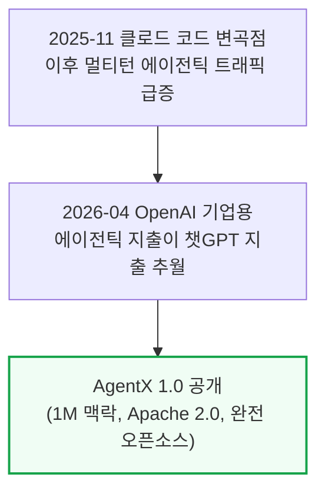

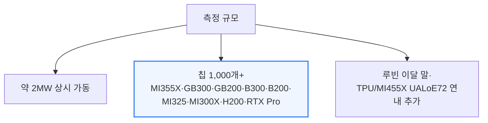

이 벤치마크는 오픈소스치고 이례적으로 스택 대부분을 공개한다 — 프런트엔드, 여러 1티어 AI 랩의 컴퓨트 확보 계획팀이 이미 쓰고 있는 공개 REST API 데이터베이스, GitHub Actions CI 증빙, 로그, 모든 데이터 포인트에 대한 정확도 검증까지 전부 열려 있다.
벤치마크 설정은 recipes.vllm.ai와 SGLang 쿡북의 상류(upstream) 이미지를 그대로 따라가, 실제 고객이 체감하는 성능을 측정하지 벤치마크용으로 특별 튜닝된(benchmax'ed) 이미지를 측정하지 않는다.
3\~4주 안에 AMD·Nvidia 최신 결과를 담은 후속 업데이트 기사가 나올 예정이다.

이번 릴리스는 Inferact/vLLM, RedHat/llm-d, RadixArk/SGLang, LMCache/TensorMesh, Weka, Mooncake 관리팀, AMD, Nvidia, Anthropic 직원, GitHub 등 다수 오픈소스 파트너의 기여로 완성됐다.
메타·마이크로소프트·오라클·OpenAI·미니맥스·문샷 Kimi·알리바바 Qwen·즈푸 GLM도 이 오픈소스 이니셔티브를 지지한다고 공개적으로 밝혔다.

---

## 2. 에이전틱 워크로드란 무엇인가

**📌 핵심:**
- 에이전틱 워크로드는 네 가지로 정의된다: ① 멀티턴(세션 하나에 수십\~수백 번의 대화), ② 긴 맥락(시스템 프롬프트·도구 정의·turn 누적으로 맥락이 빠르게 쌓임), ③ 높은 프리픽스 재사용(turn n-1의 출력이 turn n에 이어붙으며 재사용 비율이 1에 수렴), ④ 서브에이전트 버스트(짧게 살다 사라지는 서브에이전트가 새 맥락으로 뜨며 캐시 사용량이 들쭉날쭉해짐)
- 이 네 특징 때문에 에이전틱 추론은 칩 하나의 커널 성능 문제가 아니라 "시스템 문제"가 된다 — 재사용률이 워낙 높아 KV 텐서를 노드·랭크 사이에 효율적으로 옮겨야 하고(NIXL·MORI-IO·Mooncake), 어느 노드에 필요한 프리픽스가 있는지에 맞춰 대화를 라우팅해야 하며(LLM-d·Dynamo·vLLM/SGLang 라우터), 긴 맥락이 HBM(고대역폭메모리) 용량을 압박해 DRAM·SSD로 캐시를 내려보내는(오프로드) 작업까지 효율적으로 처리해야 한다(Mooncake Store·LMCache·vLLM Simple Offloading·SGLang HiCache)
- 반대로 옛날 방식인 고정 길이·단일 턴 벤치마크는 프리픽스 재사용이 의미가 없어 순수하게 칩·커널 기초 성능만 보여준다 — 여전히 유용한 기준점이지만 지금의 실제 트래픽과는 다르다
- 결론: 이런 실전 트래픽을 재현하기 위해 SemiAnalysis 내부의 익명화된 클로드 코드 트레이스 393개를 수집해 AIPerf로 원래의 요청 스케줄대로 재생했고, 이 데이터셋을 가능하게 하려 앤트로픽과 협력해 클로드 코드 기능 2건(GitHub 이슈 #49207, #66761)을 함께 출시했다

---

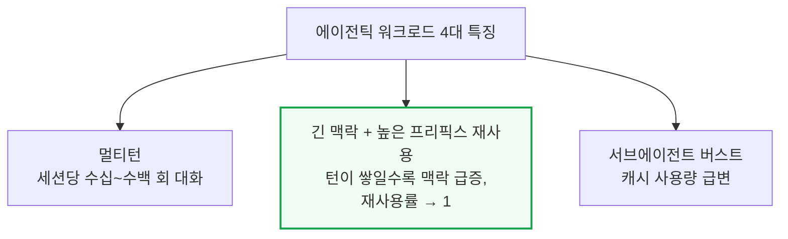

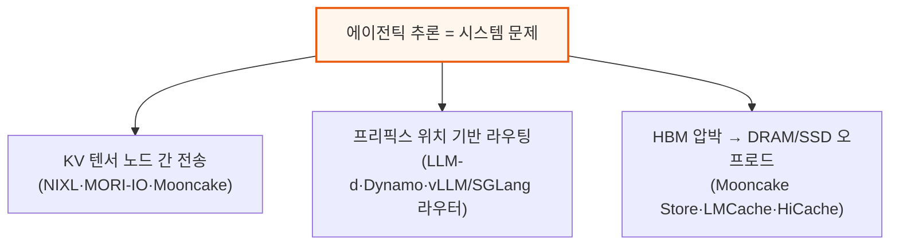

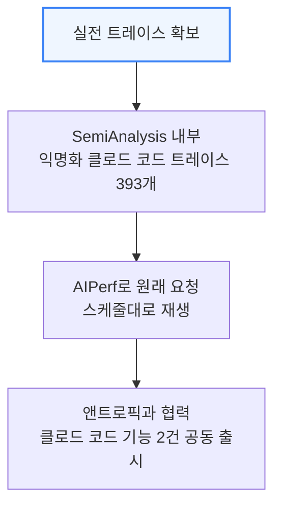

---

## 3. 모델별 에이전틱 코딩 추론 성능

**📌 핵심:**
- 프론티어 랩들은 추론 코딩 성능을 볼 때 상호작용성(TPS) 대비 달러당 성능, TTFT, 종단간(e2e) 작업 완료율 세 가지를 본다 — 메가와트당 성능도 중요한데, 자금은 랩들에게 사실상 무제한이지만 전력은 물리적으로 구하기 어려운 자원이기 때문
- DeepSeek V4 Pro(1.6조 파라미터), Kimi K3(2.8조 파라미터), MiniMax M3(432B), Qwen3.5(397B), GLM 5.3(744B 기반) 다섯 개 프론티어 모델에서 엔비디아와 AMD 모두 강점을 보이는 영역이 갈렸다
- MI355X 오픈소스(vLLM)는 AMD 자체 엔진 ATOM보다 대체로 뒤처지는데, 이는 ATOM이 중국·서구 대부분의 AI 랩에서 실제 상용 서비스에 쓰이지 않기 때문에(알리바바 소규모 광고 사업부 한 곳 제외) 실질적인 비교 기준은 여전히 vLLM이라는 점이 중요하다
- 결론: 2026년 8월 21일을 기점으로 vLLM 최적화(Inferact·엔비디아)가 반영되며 B200의 달러당 성능이 MI355X를 다시 앞질렀다 — 몇 주 전까지는 MI355X SGLang이 B200 vLLM과 비슷한 수준까지 따라붙었던 접전 구도였다

---

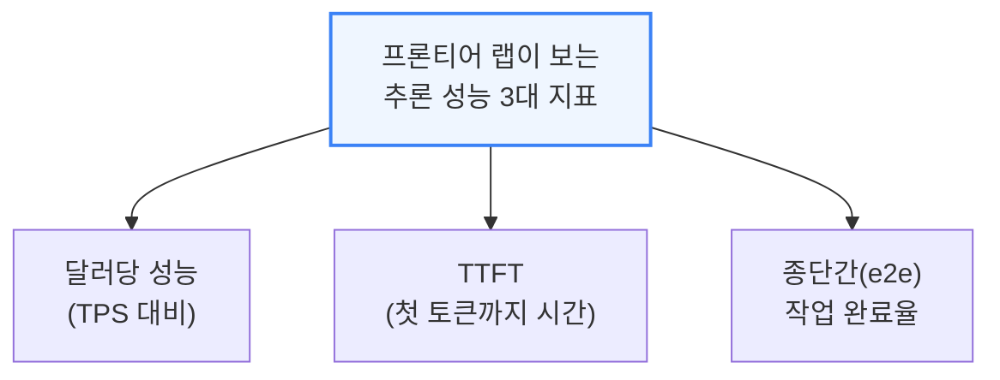

### DeepSeek V4 Pro 0813 (1.6조 파라미터, 활성 490억)

DeepSeek V4 Pro의 요청 분포는 입력 길이(ISL) 중앙값 8만 8천 토큰(p90 27만 2천, p99 67만 5천), 출력 길이(OSL) 중앙값 413토큰(p90 2,200, p99 8,600)으로, 실전 서비스에서 "적정" p90 TTFT는 보통 200\~5,000ms이며 5\~10초를 넘으면 "온라인 추론"의 경계를 벗어난다.

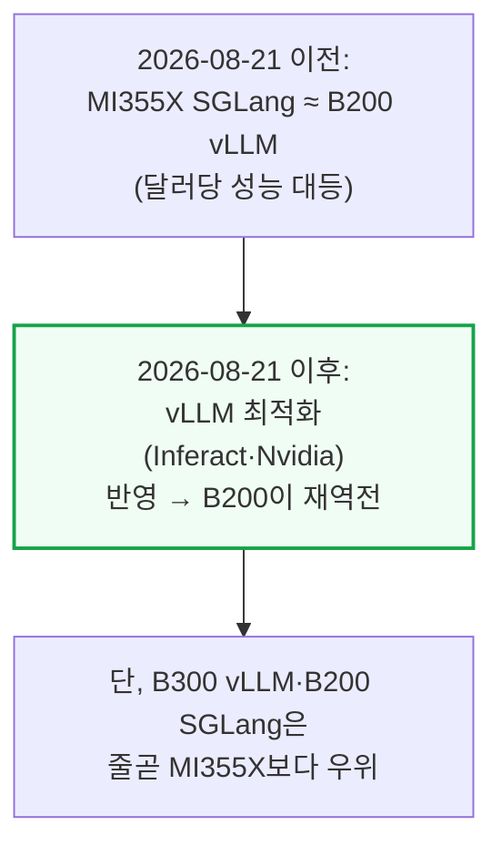

AMD 분산추론(DI)팀은 6개월간 8k1k 시나리오를 개선했지만 아직 실전 워크로드엔 부족하다 — 1xDEP8+1xDEP8 분리형 구성은 고처리량 구간에서 소폭 개선에 그치고 저지연 구간에서는 오히려 더 나빠진다.
SGLang의 `--enable-prefill-delayer`(동시 요청 64 이상에서 프리필을 최대 30 순전파까지 미뤄 배치를 더 채우는 옵션)와 청크 프리필 크기 확대(8,192→65,536)가 처리량은 올리지만 p90 TTFT를 크게 악화시킨다.
종단간 지연 기준으로는 ATOM MI355X가 B200 vLLM을 이기지만(B300·B200 SGLang은 못 이김), ATOM은 미완성 기능이 많아 알리바바 소규모 광고 사업부 한 곳 외엔 중국·서구 어느 AI 랩도 상용에 쓰지 않는다 — Qwen 본진도 ATOM을 쓰지 않는다.

엔비디아 쪽 최강 조합은 GB300 Dynamo TRTLLM과 GB200 Dynamo vLLM으로, 둘 다 PD 분리(프리필-디코드 분리)로 합리적 상호작용성에서 높은 처리량을 뽑는다.
GB300은 wide-EP(DEP32) 디코드 구성까지 더해 프론티어 중간 구간 처리량을 끌어올리는데, 더 높은 동시성을 달성하는 만큼 서브에이전트 트래픽·콜드 프리필도 늘어 TTFT가 더 민감하게 반응한다.

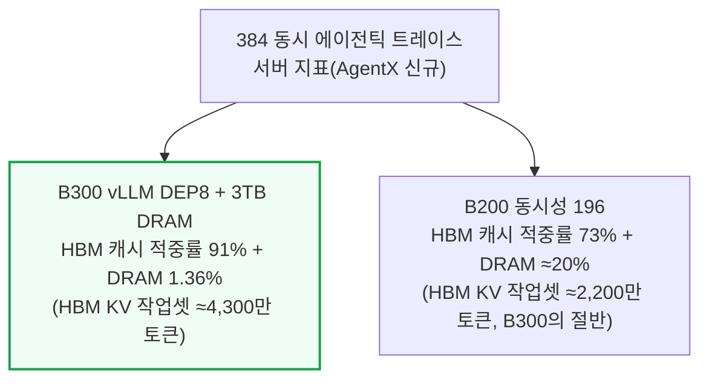

B300이 B200 대비 HBM 용량 50% 더 많아 TCO 정규화 처리량은 비슷해도 B300이 여분의 처리량을 "짜낼" 수 있는 이유가 여기 있다.
DRAM KV 오프로드는 쓰기 유지(write-through) 캐시라서 DRAM 용량이 HBM KV 캐시 용량의 1.5\~3배는 돼야 효과가 크다.
H200 SGLang FP8은 저동시성에서는 B200/MI355X SGLang과 맞먹는 달러당 성능을 내지만 HBM이 적어 고처리량 구간에선 신형 SKU를 못 따라가고, 동시성이 오르면 DRAM 오프로드 의존도가 커져 지연시간이 비합리적으로 치솟는다.
종합하면 MI355X는 텐서 병렬화와 기초 커널만 쓰는 저처리량·저지연 구간에서 가장 경쟁력 있고, AMD는 B200 대비 1.5배 많은 HBM을 가진 만큼 고처리량 구간에서 DEP 커널 최적화가 더 필요하다.

### Kimi K3 (2.8조 파라미터)

Kimi K3는 클로드의 Mythos/Fable5와 비슷한 파라미터 규모의 오픈 웨이트 프록시 모델로 쓰인다. 워낙 커서 B200 서버 한 대에 다 안 들어가 wide EP/TP나 파이프라인 병렬화가 필수인데, vLLM에서 추측 디코딩(DSpark)이 파이프라인 병렬화와 최근까지 전혀 호환되지 않아 B200 성능이 참담했고 MI355X에 완전히 밀렸다.

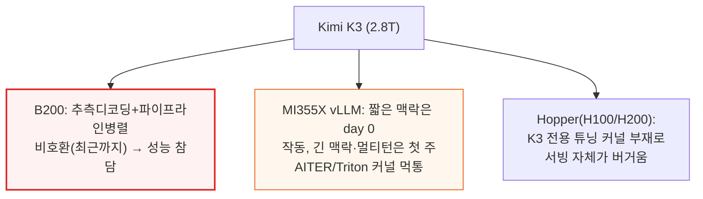

AMD가 ATOM으로 K3 성능을 빠르게 밀어붙이는 건 고무적이지만 vLLM 상류 반영을 더 우선해야 한다는 게 저자들 견해다 — ATOM이 AMD의 현재 최고 성능 엔진이긴 해도, 상류 오픈소스 스택을 쓰는 고객에게는 vLLM 비교가 더 의미 있다.
종단간 지연 40\~60초 구간에서는 MI355X ATOM이 GB300 NVL72 vLLM의 달러당 성능마저 앞선다.

### MiniMax M3(432B), Qwen3.5(397B), GLM 5.3

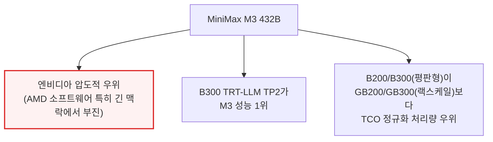

M3에서 AMD가 부진한 건 AMD 엔지니어링 리더십이 짧은 맥락·단일 턴 튜닝에만 인센티브를 걸고 긴 맥락·멀티턴을 등한시했기 때문이라고 저자들은 지적한다.
GB200 동시성 40에서 TP4/EP4/DPA 구성은 일반 TP4 대비 처리량이 0.60배에 그치면서 p90 TTFT는 3배 넘게 나빠진다.
동시성 32에서는 이론상 96.0%여야 할 캐시 적중률이 실제로는 28.8%에 그친다 — DP 랭크마다 캐시 풀의 4분의 1씩 독점하는 구조라 30만 토큰짜리 세션이 엉뚱한 랭크에 다시 배정되면 전부 다시 계산해야 하기 때문이다.
B200/B300이 랙스케일 GB200/GB300보다 TCO 정규화 처리량에서 앞서는 이유는 Dynamo 라우터가 살아있는 프리픽스 수·길이에 비례해 일이 늘어나는 병목이 되고, wideEP·wide DCP·wide TP용 튜닝된 커널이 아직 없어 TCO가 더 높은 랙스케일 쪽이 성능/TCO에서 불리하게 나오기 때문이다.
엔비디아 Pareto 최적점은 모두 동시성 20 이상에서 KV 오프로드를 쓰는 반면 AMD는 전혀 안 쓰는데, AMD vLLM의 GPU-CPU 전송용 hipMemcpyBatchAsync API가 ROCm 7.14까지 빠져 있어 오프로드 자체가 비효율적이었기 때문이다.

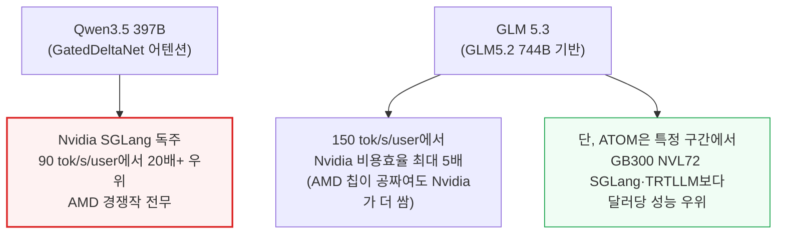

Qwen3.5는 GatedDeltaNet(MIT·엔비디아 리서치가 개발, 상태 저장 요구량이 일정해 일반 어텐션의 선형 증가 구조보다 메모리를 덜 씀)을 몇 층마다 섞어 쓰는 구조로, 네이티브 최대 맥락이 26만 2천 토큰이라 25만 6천 토큰으로 자른 데이터셋을 쓴다.
H100 대비 B300 FP4는 12배 나은 달러당 성능을 낸다.
GLM 5.3은 GLM5.2 744B에 추가 후속 학습을 더한 프론티어급 모델로, 여기서도 엔비디아가 SGLang에서 AMD를 크게 앞서지만 ATOM 구간에서는 AMD가 반격한다.
저자들은 TTFT와 상호작용성(TPS)을 하나로 합친 실험적 지표 "E2E Normalized Interactivity"(OSL÷E2EL)를 처음 소개하는데, 아직 PD 분리 같은 세부 최적화 효과를 완전히 반영하지 못하는 초기 버전임을 명시한다.

---

## 4. 업계 파급력 - 분산 추론 생태계와 50개+ 상류 PR

**📌 핵심:**
- AgentX가 첫 몇 달 만에 만든 가장 큰 성과는 벤치마크 수치 자체가 아니라, 이를 기준점 삼아 실전 에이전틱 워크로드를 최적화한 50개 이상의 상류(upstream) 코드 개선(PR)이다 — KV 캐시 생애주기·하이브리드 어텐션 캐시 정확성·CPU 오프로드·전송 진행 상태·라우팅 적합성·토큰화·스케줄러 장부까지 전 구간을 건드렸다
- SemiAnalysis는 AMD 소프트웨어 개발팀과 수년간 협업하며 개발 원칙 현대화를 도왔는데, 이번 AgentX 작업이 AMD 오픈소스를 에이전틱 워크로드에서 "일급(first class)"에 가깝게 끌어올리는 데 결정적이었다
- 분산 추론 스택은 라우터(요청을 워커로 분배) → 추론 엔진(vLLM·SGLang 등, 실제 연산+외부 KV 캐시 매니저 연결) → KV 캐시 매니저·전송 엔진(Mooncake·NIXL 등, GPU\~CPU\~원격노드 간 실제 데이터 이동)의 3단 구조이며, Dynamo·llm-d·AMD Infera 같은 플랫폼이 이 구성요소들을 묶어 쿠버네티스 위에서 배포 가능한 하나의 시스템으로 패키징한다
- 결론: 컨텍스트 병렬화(긴 입력·캐시를 여러 GPU에 쪼개 나누는 기법)는 엔비디아 리서치가 상당 부분 발명했는데, vLLM 지원 매트릭스에서 AMD 백엔드는 전부 미지원 상태라 CUDA 해자의 일부를 이룬다 — 다만 아래 5\~7장에서 보듯 AMD 진영도 빠르게 따라붙고 있다

---

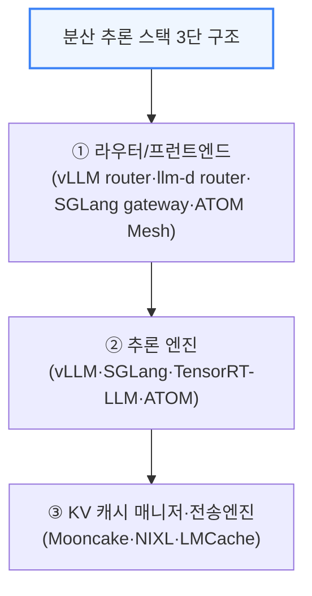

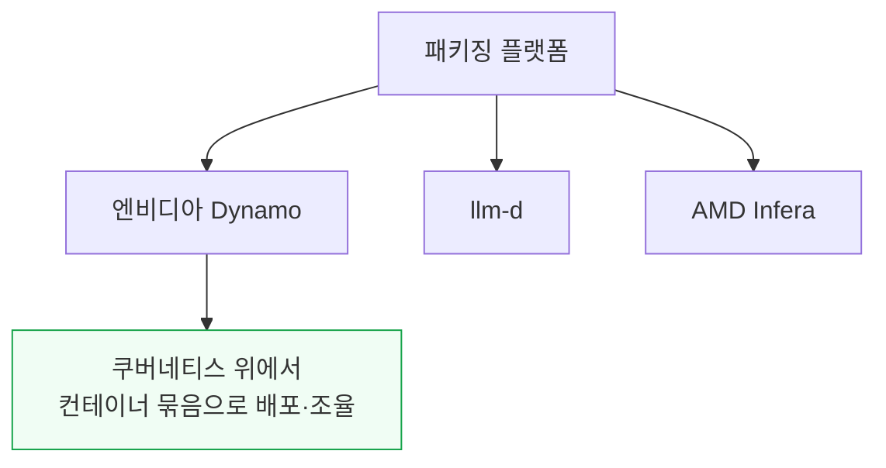

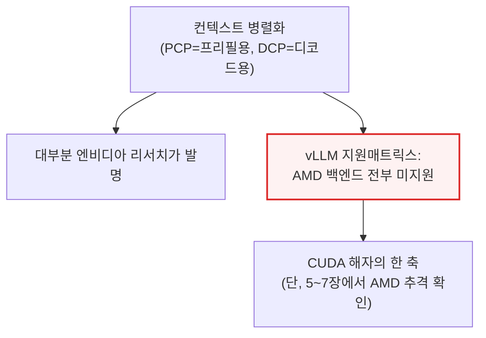

한 예로 현재 AgentX 결과에 쓰이는 단순 배치는 vLLM과 같은 노드에서 Mooncake를 함께 돌리는 방식이다 — 각 vLLM 워커가 Mooncake Store 클라이언트를 내장해 호스트 DRAM 일부를 외부 KV 캐시 풀에 내준다.
재사용 가능한 KV 블록을 GPU 메모리로 불러오거나 새로 계산한 블록을 호스트 메모리에 저장하며, 한 배포 안에서 Mooncake Store로 재사용 블록을 DRAM에 내리는 동시에 NIXL로 프리필-디코드 GPU 사이의 요청별 KV를 직접 옮기는 식으로 여러 전송 경로가 공존할 수 있다.

---

## 5. 컨텍스트 병렬화와 vLLM·SGLang 최적화

**📌 핵심:**
- 8k처럼 짧은 고정 길이 요청은 나눌 것도 별로 없고 TTFT도 이미 짧아 컨텍스트 병렬화의 이점을 살릴 수 없다 — 긴 맥락에서만 프리필 병렬화(PCP, 연산 집약적인 프리필을 여러 랭크에 쪼개 처리)와 디코드 병렬화(DCP, 메모리 대역폭에 묶인 디코드를 KV 샤드별로 병렬 스캔)가 진가를 발휘한다
- vLLM에서 가장 큰 개선은 하이브리드 어텐션 프리픽스 캐싱이다 — 슬라이딩 윈도우(짧게 쓰고 버리는 최근 맥락 캐시)가 긴 맥락 체크포인트를 밀어내지 못하게 막는 "선택적 보존" 기법이 동시 요청 14개·맥락 100만 토큰까지 프리픽스 캐시 적중률 95% 이상을 기록했고, DeepSeek-V4 하이브리드 어텐션용 CPU 오프로드 확장은 출력 처리량 81.7% 증가·평균 종단간 지연 46.6% 감소를 냈다
- SGLang은 슬라이딩 윈도우와 프리픽스가 같은 메모리 풀을 두고 경쟁하는 문제를 세 가지 각도로 풀었고(선제적 페이지 해제·컴퓨트 락 상한·유효기간 지난 항목 제거), 맥락 길이를 컴파일 대상이 아니라 런타임 변수로 처리해 AgentX 동시성 384에서 출력 처리량 26.75% 증가·평균 TTFT 36.25% 감소를 달성했다
- 결론: SGLang의 DP 캐시 어피니티(세션을 해당 캐시를 쥔 랭크에 고정 배정)와 라우팅 정확성 개선은 실측으로 정확도 문제까지 드러냈다 — 12만 7,500토큰 공유 프리픽스 테스트에서 정답 "니들"을 128개 중 2개만 찾던 것을 128개 전부 찾도록 고쳤고, 이 수정이 GB300에서 사용자당 출력 처리량 9.6%↑, 이어진 후속 수정이 사용자당 처리량 18.0%↑·GPU당 디코드 처리량 12.7%↑까지 이끌었다

---

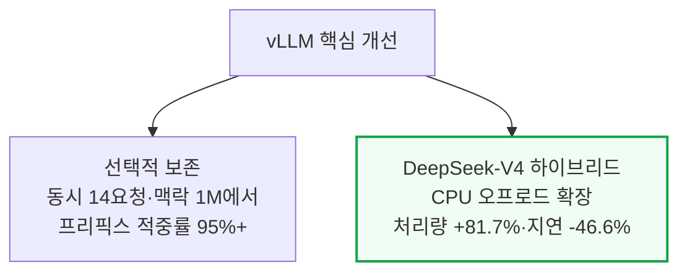

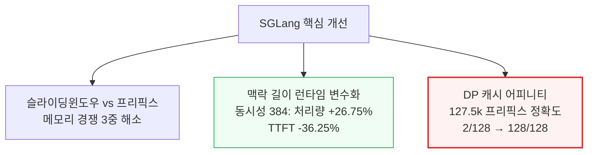

SGLang은 또한 HiCache(자체 오프로딩 기능)에서 전체 어텐션 캐시만 옮기고 슬라이딩 윈도우 꼬리는 되돌아올 때 재구성하는 비대칭 전략을 쓴다.
FlashInfer GDN 체크포인트로 순환 상태(recurrent state)까지 프리픽스 재사용에 참여시켜 처리량을 초당 GPU당 47,771에서 53,004토큰(캐시 적중률 92.4%)으로 끌어올렸다.
스케줄러 레벨에서는 프리필 우선 결정이 반복돼 디코드가 굶주리는 문제를 프리필 이후 디코드 라운드를 강제하는 방식으로 고쳤다.
그 결과 DeepSeek V4 Pro에서 출력 처리량 141%↑·p99 토큰 간 지연 97.3%↓를 얻은 대신 TTFT 중앙값이 36.5초에서 59초로 늘어나는 트레이드오프도 함께 드러났다.

### vLLM PR 대장

| PR | 고친 것 | 측정된 효과 |
|---|---|---|
| [#43447](https://github.com/vllm-project/vllm/pull/43447) | 선택적 보존 — 짧게 쓰고 버리는 슬라이딩 윈도우가 긴 맥락 체크포인트를 밀어내지 못하게 희소 리플레이 경계를 보존 | 동시 요청 14개·맥락 100만 토큰에서 프리픽스 캐시 적중률 95% 이상 |
| [#44774](https://github.com/vllm-project/vllm/pull/44774) | 같은 도달성(reachability) 정책을 Mooncake 오프로드 경로에도 적용 | — |
| [#45444](https://github.com/vllm-project/vllm/pull/45444) | 도달 불가능한 슬라이딩 윈도우 조회를 제거 | — |
| [#42258](https://github.com/vllm-project/vllm/pull/42258) | 재사용될 일이 없는 슬라이딩 윈도우 블록의 오프로드를 중단 | — |
| [#44082](https://github.com/vllm-project/vllm/pull/44082) | 추측 디코딩용 lookahead 블록을 보존 프리픽스 안에 유지 | — |
| [#37160](https://github.com/vllm-project/vllm/pull/37160) | 하이브리드 모델 CPU KV 오프로드의 기반이 되는 범용 SimpleCPU 커넥터를 최초 도입 | — |
| [#40549](https://github.com/vllm-project/vllm/pull/40549) | SimpleCPU 커넥터를 ROCm에서도 쓸 수 있게 활성화 | — |
| [#42296](https://github.com/vllm-project/vllm/pull/42296) | SimpleCPU 커넥터를 DeepSeek-V4 하이브리드 어텐션까지 확장 | 출력 처리량 +81.7%, 평균 종단간 지연 -46.6%(프리픽스가 HBM에서 밀려나 매번 다시 계산하던 것 대비) |
| [#42828](https://github.com/vllm-project/vllm/pull/42828) | Mooncake에도 동등한 하이브리드 메모리 할당 지원을 추가 | — |
| [#51052](https://github.com/vllm-project/vllm/pull/51052) | Kimi-K3의 conv+ssm 순환 상태를 어텐션 KV와 함께 MoRI-IO로 옮겨, 분리형 서빙(1P1D)에서 디코드 측이 초기화되지 않은 순환 상태로 시작하는 문제를 방지(대기 중인 변경) | — |
| [#41289](https://github.com/vllm-project/vllm/pull/41289) | 동일한 전송이 이미 진행 중이면 저장을 건너뛰어, 프리픽스를 공유하는 동시 세션이 비용을 한 번만 치르게 함 | — |
| [#46412](https://github.com/vllm-project/vllm/pull/46412) | 저장이 새로 생성된 KV 구간만 다루게 해, 세션이 히스토리를 늘릴 때마다 프리픽스 전체를 다시 쓰지 않고 차분만 쓰게 함 | — |
| [#46906](https://github.com/vllm-project/vllm/pull/46906) | 저장이 같은 블록이 여전히 HBM에 있는지에 더 이상 의존하지 않게 해, 이미 예약된 작업이 축출(eviction)로 폐기되지 않게 함 | — |
| [#45659](https://github.com/vllm-project/vllm/pull/45659) | 스케줄러 경로의 캐시 조회를 비동기화해 커넥터가 스텝의 임계 경로에서 벗어나게 함 | — |
| [#45969](https://github.com/vllm-project/vllm/pull/45969) | 조회 키를 압축된 제로카피(zero-copy) 방식으로 바꿈 | — |
| [#45971](https://github.com/vllm-project/vllm/pull/45971) | 수신 측 로딩을 병렬화 | — |
| [#46188](https://github.com/vllm-project/vllm/pull/46188) | Mooncake 키 문자열을 미리 만들어둠 | — |
| [#44103](https://github.com/vllm-project/vllm/pull/44103) | 하이브리드 캐시 그룹별로 캐시 이벤트를 따로 발행 | — |
| [#45371](https://github.com/vllm-project/vllm/pull/45371) | 분산 컨텍스트 저장의 간격 배치(stride)를 올바르게 계산 | — |
| [#46855](https://github.com/vllm-project/vllm/pull/46855) | 분산 컨텍스트·프리필 상황에서 조회 프리픽스를 올바르게 계산 | — |
| [#45340](https://github.com/vllm-project/vllm/pull/45340) | 컨텍스트 병렬 회계(accounting)를 고쳐 캐시 소유권을 샤딩된 토큰 구간과 맞춤 | — |
| [#49069](https://github.com/vllm-project/vllm/pull/49069) | 추측 디코딩 상태가 병합된 Mooncake 그룹 전체에 전파되게 함 | — |
| [#49071](https://github.com/vllm-project/vllm/pull/49071) | 추측 디코딩 상태가 SimpleCPU 코디네이터를 거쳐서도 전파되게 해, 반복 턴 캐시가 EAGLE(추측 디코딩 방식) 상태를 조용히 잃는 것을 방지 | — |
| [#51183](https://github.com/vllm-project/vllm/pull/51183) | Kimi-K3의 KDA 디코드 결과를 레이어 출력 버퍼에 직접 기록해 KDA 레이어당 디바이스 복사 1회를 제거 | — |
| [#51714](https://github.com/vllm-project/vllm/pull/51714) | 범용 경로 대신 AITER(AMD의 GPU 커널 라이브러리) 희소 MLA 디코드 커널을 선택 | AgentX 출력 처리량 +5.22%, 토큰 간 지연 대폭 감소 |
| [#51713](https://github.com/vllm-project/vllm/pull/51713) | 풀그래프 어텐션 프로젝션을 튜닝된 AITER GEMM(행렬곱 연산) 경로로 라우팅 | 저동시성 고정 시퀀스에서 +2.3%(에이전틱 트레이스에서는 캐시·스케줄링 변동에 묻힘) |
| [#52882](https://github.com/vllm-project/vllm/pull/52882) | DeepSeek V4 C4A 셀렉터의 ROCm top-k 병목을 gfx950 하이브리드 AITER/네이티브 경로로 교체 — 짧고 중간 길이 컨텍스트는 AITER로, 긴 컨텍스트는 그래프 세이프 튜닝 네이티브 폴백으로 라우팅(대기 중인 변경) | 종단간 셀렉터 속도 1.21\~1.76배, 디코드 커널 기하평균 1.2\~2.9배(84개 형태 매트릭스 기준) |

### SGLang PR 대장

| PR | 고친 것 | 측정된 효과 |
|---|---|---|
| [#26907](https://github.com/sgl-project/sglang/pull/26907) | 페이지가 윈도우를 벗어나는 즉시 선제적으로 해제해, 죽은 윈도우 상태가 더 이상 쓸 수 없는 페이지를 계속 붙들지 않게 함 | — |
| [#27210](https://github.com/sgl-project/sglang/pull/27210) | 컴퓨트 락(진행 중인 요청이 한 번에 쥘 수 있는 풀의 양)을 윈도우 하나로 상한 | — |
| [#29369](https://github.com/sgl-project/sglang/pull/29369) | 쓸모를 다한 유효기간 지난 전체 KV 항목을 제거 | — |
| [#34565](https://github.com/sgl-project/sglang/pull/34565) | 프리픽스에서 갈라져 나온(fork) 요청이 분기점의 슬라이딩 윈도우 상태를 다시 만들지 않고 물려받게 보존(진행 중인 작업) | — |
| [#30339](https://github.com/sgl-project/sglang/pull/30339) | ROCm 링 캐시(슬롯을 재사용하는 순환 버퍼)가 아직 참조 중인 옛 내용을 덮어써 틀린 출력을 내던 정합성 버그를 수정 | — |
| [#29417](https://github.com/sgl-project/sglang/pull/29417) | HiCache가 값비싼 전체 어텐션 캐시만 옮기고, 값싼 슬라이딩 윈도우 꼬리는 돌아올 때 재구성하는 비대칭 전략을 도입 | — |
| [#28534](https://github.com/sgl-project/sglang/pull/28534) | AMD에서 단계적 라이트백(staged write-back)을 적용해 캐시 이동이 엔진을 막지 않게 함 | — |
| [#29735](https://github.com/sgl-project/sglang/pull/29735) | FlashInfer GDN 체크포인트로 순환 상태(recurrent state)까지 프리픽스 재사용에 참여시킴 | 처리량 초당 GPU당 47,771 → 53,004토큰, 캐시 적중률 92.4% |
| [#30255](https://github.com/sgl-project/sglang/pull/30255) | 컨텍스트 길이를 컴파일 대상이 아니라 런타임 스칼라 값으로 전달해, 매 요청마다 커널을 새로 컴파일하던 것을 없앰 | AgentX 동시성 384 출력 처리량 +26.75%, 평균 TTFT -36.25% |
| [#30365](https://github.com/sgl-project/sglang/pull/30365) | 스텝마다 반복되던 디바이스→호스트 시퀀스 길이 동기화를 제거해 디코드 버블을 없앰 | — |
| [#34888](https://github.com/sgl-project/sglang/pull/34888) | GB300에서 혼합 길이 디코드 배치가 겪는 지연을 줄이려 TRTLLM MHA 디코드 배치를 KV 길이순으로 정렬된 그룹으로 쪼갬(진행 중인 작업) | — |
| [#35017](https://github.com/sgl-project/sglang/pull/35017) | 프리필 뒤에 디코드 라운드를 강제하는 설정 가능한 디코드 간격을 추가해, 특정 랭크가 프리필 우선 결정을 계속 이기며 다른 랭크의 배치가 대기하는 문제를 줄임 | AgentX DSv4 Pro에서 출력 처리량 +141%, p99 토큰 간 지연 -97.3%(대신 TTFT 중앙값이 36.5초→59초로 증가) |
| [#26091](https://github.com/sgl-project/sglang/pull/26091) | DP 캐시 어피니티를 추가해 세션이 해당 캐시를 쥔 랭크에 고정되게 함 | — |
| [#26245](https://github.com/sgl-project/sglang/pull/26245) | 분리형 서빙 양쪽(프리필·디코드)이 일관되게 캐시 위치를 반영하도록 DP 인지 프리필·디코드 라우팅을 구현 | — |
| [#26293](https://github.com/sgl-project/sglang/pull/26293) | 캐시 균형을 라우팅 신호로 반영해 어피니티가 한 워커에만 몰리지 않게 함 | — |
| [#26387](https://github.com/sgl-project/sglang/pull/26387) | 하이브리드 캐시 이벤트를 radix-cache(접두사 트리 기반 캐시) 인지형으로 만듦 | — |
| [#26579](https://github.com/sgl-project/sglang/pull/26579) | 하이브리드 캐시 이벤트를 슬라이딩 윈도우 인지형으로 만듦 | — |
| [#30461](https://github.com/sgl-project/sglang/pull/30461) | 분리형 서빙에서 드래프트 윈도우(추측 디코딩용 상태) 전송이 프리필→디코드 경계를 온전히 넘도록 수정 | — |
| [#30497](https://github.com/sgl-project/sglang/pull/30497) | 고동시성 온라인 디코딩에 오버랩 스케줄링을 추가 | — |
| [#31294](https://github.com/sgl-project/sglang/pull/31294) | 아무 효과 없던 EAGLE 재정규화를 제거 | — |
| [#33662](https://github.com/sgl-project/sglang/pull/33662) | EAGLE 프리필 도중 발생하던 호스트 동기화를 없앰 | — |
| [#32042](https://github.com/sgl-project/sglang/pull/32042) | 요청이 취소·재개될 수 있는 상황에서도 오버랩이 안전하도록 자원 리스(lease) 방식 스케줄링을 진행(진행 중인 작업) | — |
| [#32196](https://github.com/sgl-project/sglang/pull/32196) | 데이터 병렬 그래프 메타데이터 버그를 수정(진행 중인 작업) | — |
| [#30545](https://github.com/sgl-project/sglang/pull/30545) | 스테이징 버퍼에 radix-cache 지원을 추가해, 캐시된 전송을 전송 그리드에 맞춰 쪼개고 디코드 측이 기대하는 오프셋에 정확히 배치 | 12만 7,500토큰 공유 프리픽스 테스트에서 정답 128개 중 2개→128개로 정합성 회복, 사용자당 출력 처리량 +9.6%(GPU당 총처리량은 거의 그대로) |
| [#35070](https://github.com/sgl-project/sglang/pull/35070) | 디코드 측 PREBUILT 배치가 모델 forward를 아예 타지 않는데도 모든 전송 프롬프트를 CUDA 입력 텐서로 펼쳐 복사하던 불필요한 전송을 제거 | 사용자당 출력 처리량 +18.0%, GPU당 디코드 처리량 +12.7%(AgentX GB300) |
| [#35071](https://github.com/sgl-project/sglang/pull/35071) | 프리필 DP 랭크 부트스트랩 조회를 디코드 스케줄러의 임계 경로 밖으로 옮겨, 결과 소비 시점에 동기적으로 치르던 HTTP 왕복을 오버랩 | 같은 배포에서 사용자당 출력 처리량 추가 +1.36% |
| [#30762](https://github.com/sgl-project/sglang/pull/30762) | UMBP(통합 메모리 블록 풀)에 DeepSeek-V4용 다중 풀 지원을 추가(진행 중인 작업) | — |
| [#32368](https://github.com/sgl-project/sglang/pull/32368) | MoRI를 통해 통합 KV HiSparse 상태를 유지(진행 중인 작업) | — |
| [#34216](https://github.com/sgl-project/sglang/pull/34216) | 디코드가 눈에 보이는 콘텐츠 없이 종료될 때도 프리필이 소유한 토큰을 보존(진행 중인 작업) | — |

---

## 6. TensorRT-LLM·AMD ATOM·AITER 최적화

**📌 핵심:**
- TensorRT-LLM은 매 턴마다 대화 전체를 다시 토큰화하는 낭비를 없애는 "경계 인식 증분 토큰화"를 도입해 Qwen3.5 트레이스 1,087건 전환에서 전량 정확도를 유지하며 평균 처리시간을 185.1ms에서 11.3ms로 줄였고, MiniMax-M3의 분리형 KV 전송 조각화 문제(수천 개의 작은 전송으로 쪼개지던 것)를 정리해 동시성 5에서 KV 지연 p99를 26.74초→125ms, 동시성 40에서 10.15초→288ms로 단축했다
- AMD ATOM 엔진은 원래 단일 턴 전용으로 설계돼 있었는데, 슬라이딩 윈도우 꼬리를 살려두는 희소 체크포인트 보존을 도입해 동시성 48에서 실제 프리픽스 적중률을 5.6%→96.45%로 끌어올렸다(9건 중 9건이 캐시는 있는데 윈도우 게이트에서 버려지고 있었다는 뜻) — 다만 체크포인트를 무조건 남기면 재방문 없는 트래픽에서 처리량이 17.5% 깎여, 토큰 간격을 두고 남기는 식으로 이 손실을 없앴다
- ATOM의 청크형 파이프라인 프리필은 GLM-5.2 고부하 조건에서 출력 처리량 2배, TTFT 중앙값 28.6초→8.7초, 프리필 GPU 한 대가 보유하는 KV 블록 수 3.68배 증가라는 가장 완결된 성과를 냈고, 프리필 컨텍스트 병렬화(PCP)는 입력 6만 4천 토큰에서 평균 TTFT 35\~43%↓·총처리량 최대 49%↑를 기록했다
- 결론: 저수준 커널(AITER)에서는 대형 KV 캐시 풀이 32비트 오프셋 한계(약 1억 5천만 행을 넘으면 주소가 조용히 틀어지는 문제)를 실제로 노출시켜, DeepSeek-V4 통합 캐시 경로 전체에 64비트 주소 지정을 적용해 잘못된 행을 읽고 쓰는 사고를 막았다

---

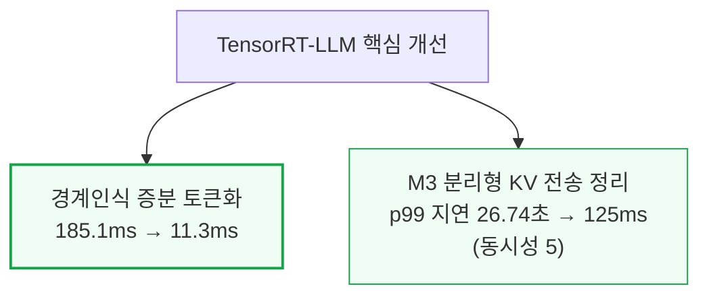

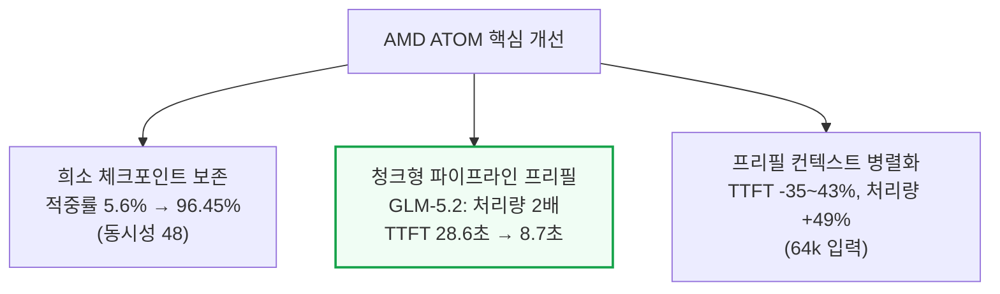

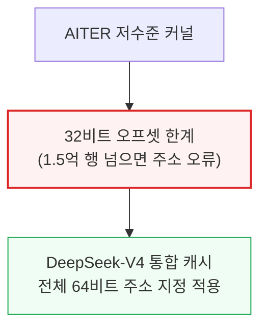

TensorRT-LLM은 이 외에도 커널 선택 오류를 다수 잡아냈다 — 손상된 split-K MoE 전략이 AgentX 실행 7건 중 5건을 충돌시킨 것을 제거해 이후 7건 매칭 실행에서 충돌 0건을 만들었다.
MiniMax-M3의 짧은 쿼리에서 인덱스를 잘못 읽어 비유한(non-finite) 출력을 내던 버그도 고쳐 GB300에서 서빙 오류·비유한 마커 0건을 확인했다.
ATOM은 이와 별개로 라우터(ATOMesh)에 KV 생애주기 이벤트·다중 노드 프리필-디코드 라우팅·세션 고정 데이터병렬 라우팅을 추가했다.
대화가 그 상태를 쥔 정상 워커로 돌아가면서도, 방치된 세션이 클러스터를 영구히 불균형하게 만들지 않도록 유휴 배정은 만료시키는 절충을 택했다.

### TensorRT-LLM PR 대장

| PR | 고친 것 | 측정된 효과 |
|---|---|---|
| [#17462](https://github.com/NVIDIA/TensorRT-LLM/pull/17462) | 경계 인식 증분 토큰화 — 렌더링된 텍스트의 공통 프리픽스를 찾아 토큰 하나를 되돌린 뒤 바뀐 접미사만 다시 토큰화해, 매 턴마다 대화 전체를 재토큰화하던 낭비를 없앰 | Qwen3.5 트레이스 전환 1,087건에서 전량 토큰화와 정확히 일치, 평균 처리시간 185.1ms → 11.3ms |
| [#16231](https://github.com/NVIDIA/TensorRT-LLM/pull/16231) | 채팅 템플릿 렌더링을 입력 처리 풀로 옮겨, 긴 템플릿이 메인 요청 루프를 가로막지 않게 함 | — |
| [#17518](https://github.com/NVIDIA/TensorRT-LLM/pull/17518) | MiniMax-M3의 분리형 KV 전송이 프리필·디코드 헤드 레이아웃 불일치로 수천 개의 작은 전송 조각으로 쪼개지던 것을, 다중 풀 매핑 교정과 청크형 NIXL(GPU 간 KV 전송 라이브러리) 바운스 경로로 재사용 가능한 아레나에 합침 | 요청 임계 KV p99 지연 26.74초 → 125ms(동시성 5), 10.15초 → 288ms(동시성 40) |
| [#17428](https://github.com/NVIDIA/TensorRT-LLM/pull/17428) | 스케줄링이 정체돼도 완료된 전송을 회수하는 논블로킹 컨텍스트 전송 폴링을 도입해, 끝난 KV 블록이 계속 고정되어 새 작업 admission을 막는 피드백 루프를 끊음 | — |
| [#16734](https://github.com/NVIDIA/TensorRT-LLM/pull/16734) | DeepSeek-V4 컨텍스트 희소 어텐션 메타데이터의 암묵적 디바이스 스칼라 동기화를 없애, 호스트 측 카운트를 파이썬 정수로 그대로 전달(GB300 분리형 컨텍스트 워커) | 스텝당 cudaStreamSynchronize를 유발하던 4바이트 디바이스 읽기 18회 제거 |
| [#17473](https://github.com/NVIDIA/TensorRT-LLM/pull/17473) | MiniMax-M3용 컨텍스트 그래프 프로듀서 — 안정적인 희소 프로듀서는 캡처하고 요청 의존적 어텐션은 즉시 실행 방식으로 남겨둠 | AgentX 테스트에서 사용자당 출력 처리량 +12.58% |
| [#16876](https://github.com/NVIDIA/TensorRT-LLM/pull/16876) | KV 인지 라우팅 경로의 할당·변환 작업을 줄이는 네이티브 KV 이벤트 생성 변경(진행 중인 작업) | — |
| [#17316](https://github.com/NVIDIA/TensorRT-LLM/pull/17316) | MiniMax-M3의 MXFP8 오토튜닝에 CuTeDSL 후보를 추가해 커널 후보군을 넓힘 | 저동시성 집계 구간에서 GPU당 출력 처리량 약 +7\~10% |
| [#17105](https://github.com/NVIDIA/TensorRT-LLM/pull/17105) | 손상된 split-K MoE 전략을 오토튜너 후보군에서 제거 | 이전에는 AgentX 실행 7건 중 5건을 충돌시켰으나, 이후 매칭 실행 7건에서 충돌 0건 |
| [#17285](https://github.com/NVIDIA/TensorRT-LLM/pull/17285) | MiniMax-M3의 레거시 희소 어텐션 경로가 q_len ≤ 32에서 블록 인덱스 스트라이드(간격)를 무시해 잘못된 KV 페이지를 골라 비유한(non-finite) 값을 내던 것을, 스트라이드를 그대로 존중하도록 수정 | GB300에서 매칭된 전체 AgentX 5쌍이 서빙 오류 0건·비유한 마커 0건으로 완주 |
| [#16279](https://github.com/NVIDIA/TensorRT-LLM/pull/16279) | 완료 중인 요청과 새로 admission된 요청이 동시에 슬롯을 필요로 하는 과도기를 처리하도록 시퀀스 슬롯 여유분과 슬롯 인덱스 버퍼 크기를 일관되게 조정 | — |
| [#17278](https://github.com/NVIDIA/TensorRT-LLM/pull/17278) | 어텐션 데이터 병렬(attention-DP)의 더미 요청 버그를 수정 | 이전엔 대부분의 셀이 몇 분 안에 죽었는데, 수정 뒤 Qwen3.5 분리형 셀 9개가 계속 살아남음 |
| [#15727](https://github.com/NVIDIA/TensorRT-LLM/pull/15727) | 파이프라인형 KV 전송 — 프리필 청크가 완료되는 즉시 전송을 시작해, 전송이 프리필 연산과 겹치고 마지막 청크만 임계 경로에 남게 함 | — |
| [#17526](https://github.com/NVIDIA/TensorRT-LLM/pull/17526) | 매번 프롬프트 전체의 블록 목록을 다시 만드는 대신 현재 청크에 속한 블록 ID만 조회 | 128,000토큰 프롬프트를 1,024토큰 청크로 나눌 때, 4,096개 목록을 한 번만 만드는 것과 레이어 그룹마다 128번 다시 만드는 것의 차이를 없앰 |

### ATOM PR 대장

| PR | 고친 것 | 측정된 효과 |
|---|---|---|
| [#1640](https://github.com/ROCm/ATOM/pull/1640) | DeepSeek-V4 페이지형 슬라이딩 윈도우 어텐션에 희소 체크포인트 보존을 도입해, 선택된 윈도우 꼬리를 살려둬 분기·리플레이 요청이 쓸모 있는 경계에서 재개하게 함 | 동시성 48에서 실제 프리픽스 적중률 5.6% → 96.45%, 슬라이딩 윈도우 게이트에서의 손실 91.35% → 0.16% |
| [#902](https://github.com/ROCm/ATOM/pull/902) | 프리풀(free-pool) 적중이 공유 캐시 항목을 파괴하던 것을 막음 | — |
| [#939](https://github.com/ROCm/ATOM/pull/939) | 지연 출력(deferred-output) 버그를 고쳐 기본 스케줄러 모드에서 프리픽스 해싱을 복원 — 반복되는 긴 프롬프트가 캐시 토큰 0개였던 상태에서 완전한 프리픽스 블록 전체를 재사용하는 상태로 바뀜 | — |
| [#1345](https://github.com/ROCm/ATOM/pull/1345) | 프리픽스 적중 프리필이 범용 경로로 폴백하지 않고 최적화된 싱크(sink) 어텐션 커널에 계속 머물게 함 | — |
| [#1771](https://github.com/ROCm/ATOM/pull/1771) | 순환·압축기 상태(주변 토큰으로 재구성 불가능한 상태)에 콘텐츠 주소 지정 체크포인트 생애주기를 부여하고, 체크포인트를 토큰 간격을 두고 남기는 방식으로 무조건 발행 시의 손실을 없앰 | 512개 생성 토큰을 재사용하고 2토큰 접미사만 새로 계산한 사례 확인, 무조건 발행 시 손실이던 처리량 -17.5%(재방문 없는 트래픽)를 간격 조정으로 회피 |
| [#1318](https://github.com/ROCm/ATOM/pull/1318) | Standalone LMCache 오프로드 — CPU에서 프리픽스를 다시 불러오는 경로를 도입 | 32,000토큰 프리픽스를 CPU에서 재로드하는 데 약 0.32초(같은 것을 재계산하면 약 2.5초, 8배 격차) |
| [#1406](https://github.com/ROCm/ATOM/pull/1406) | vLLM의 다중 커넥터 설계를 그대로 가져와, 프리필 워커가 KV를 원격 디코드 워커로 보내는 동시에 같은 프리픽스를 CPU에도 저장(양쪽 소비자가 끝날 때까지 블록을 해제하지 않음) | — |
| [#1725](https://github.com/ROCm/ATOM/pull/1725) | CPU에서 복원된 블록을 GPU 프리픽스 인덱스에 다시 등록해, 다음 턴이 이미 HBM에 있는 프리픽스를 버스 너머로 또 가져오는 낭비를 제거 | — |
| [#1807](https://github.com/ROCm/ATOM/pull/1807) | 비동기 저장 순서·패킹된 KV 형상·정렬 안 된 핸드오프·원격 요청 회계를 한꺼번에 수정 | 2라운드·2,638요청 검증에서 재로드 손상 0건 |
| [#1737](https://github.com/ROCm/ATOM/pull/1737) | DeepSeek-V4의 혼합 FP8·BF16 캐시 레이아웃 양쪽 버퍼를 모두 전송 | — |
| [#1331](https://github.com/ROCm/ATOM/pull/1331) | EAGLE 분리형 서빙에서 드래프트 모델의 독립된 KV 캐시를 타깃 캐시와 함께 이동 | — |
| [#1647](https://github.com/ROCm/ATOM/pull/1647) | 원격 KV admission과 배압(backpressure) 제어 — 디코드 측이 감당 못 할 만큼의 대기 전송을 받아들이지 못하게 막음 | — |
| [#1220](https://github.com/ROCm/ATOM/pull/1220) | 프리필 컨텍스트 병렬화(PCP) 적용 | 평균 TTFT -35\~43%, 6만 4천 토큰 입력에서 총처리량 최대 +49% |
| [#1701](https://github.com/ROCm/ATOM/pull/1701) | 디코드 컨텍스트 병렬화(DCP)를 프리픽스 캐싱·청크형 프리필·FP8 KV와 함께 쓸 수 있게 호환 처리 | — |
| [#1746](https://github.com/ROCm/ATOM/pull/1746) | DCP를 MTP(멀티토큰 예측)까지 확장 | — |
| [#1911](https://github.com/ROCm/ATOM/pull/1911) | 배치 1 MLA 디코드에서 커널의 자체 분할(split) 계산을 덮어쓰지 않게 해, gfx950의 CU 256개 중 16개에만 묶여 있던 KV 워크를 CU 수만큼 나누게 함(아직 열려 있는 변경) | — |
| [#1552](https://github.com/ROCm/ATOM/pull/1552) | 청크형 파이프라인 프리필 — 반복되는 텐서 병렬 집합 통신을 스트리밍 레이어 단계 핸드오프로 대체 | GLM-5.2 고부하: 출력 처리량 2배, TTFT 중앙값 28.6초 → 8.7초, 프리필 GPU당 보유 KV 블록 수 3.68배 |

### AITER PR 대장

| PR | 고친 것 | 측정된 효과 |
|---|---|---|
| [#3728](https://github.com/ROCm/aiter/pull/3728) | 프리필 컨텍스트 병렬(PCP)이 필요로 하는 쿼리 샤딩 차원을 제공하는 프로세스 그룹을 추가하고, 13만 1,000토큰 넘는 프롬프트를 위해 결합 커널(fused-kernel) 행 인덱싱을 확장 | — |
| [#3267](https://github.com/ROCm/aiter/pull/3267) | 디코드 컨텍스트 병렬화(DCP) — 이미 있는 텐서 병렬 GPU들에 KV를 샤딩해, 캐시 전체를 랭크마다 복제하지 않고도 더 긴 시퀀스·더 큰 배치를 수용 | — |
| [#2893](https://github.com/ROCm/aiter/pull/2893) | 4GB 넘는 배치 프리필용 런타임 64비트 디스패치를 추가 | — |
| [#4474](https://github.com/ROCm/aiter/pull/4474) | 2GB 넘는 구간에 64비트 MLA 오프셋을 적용 | — |
| [#4680](https://github.com/ROCm/aiter/pull/4680) | DeepSeek-V4 통합 캐시 경로 전반에 64비트 주소 지정을 적용 — 32비트 오프셋은 한 캐시 풀이 그 경계를 넘으면 에러 없이 조용히 계산이 틀어짐 | 약 1억 5천만 행 규모 풀에서 잘못된 행을 읽고 쓰는 사고를 방지 |
| [#3459](https://github.com/ROCm/aiter/pull/3459) | DeepSeek-V4 디코드에 64헤드·128헤드 MTP 패킹 전용 영속(persistent) MLA 커널을 추가(일반 디코드와 추측 검증이 실제로 만드는 헤드 수에 맞춘 전용 경로) | — |

---

## 7. Dynamo·LMCache·Mooncake 최적화와 그 밖의 개선

**📌 핵심:**
- Dynamo 라우터는 생성 토큰 수가 아니라 살아있는 프리픽스의 개수·길이에 비례해 일이 늘어나는 구조라, 캐시 소유권을 "공유 블록 체인"에서 "아레나 단위 소유 카운트"를 거쳐 "백엔드별 요청 리스"로 단순화하며 vLLM 백엔드 AgentX 재생 시간을 23.7%, SGLang을 22.0% 단축했고 피크 메모리도 함께 낮췄다
- 요청 경로 자체도 뜯어고쳤다 — MessagePack 요청 페이로드 전환으로 처리량 8.1%↑·평균 TTFT 9.7%↓, 정적 로깅 필터로 프런트엔드 처리량이 초당 932건에서 1,133건으로, 응답당 한 번만 지표를 반영하는 변경이 프런트엔드 CPU 시간을 약 절반으로 줄이는 등 "매 토큰마다 반복되던 작은 낭비"를 겹겹이 제거했다
- LMCache(다양한 추론 엔진 아래에서 재사용 가능한 KV 청크를 프리픽스 해시로 저장하는 오픈소스 레이어)는 청크 단위 외부 캐시 로딩으로 동시성 32에서 옛 방식이 28건 만에 멈추던 걸 120건까지 완주시켰고, Mooncake는 AMD RDMA 등록 경로(HIP dmabuf)와 ROCm 휠 배포를 새로 만들어 AMD 하드웨어에서도 상류 이미지에 바로 설치해 GPU\~패브릭 간 KV를 직접 옮길 수 있게 됐다
- 결론: MiniMax-M3의 day-0 검증에서는 순수 소프트웨어 버그 3건이 확인됐다 — 헤드 비율 검증 오류로 gsm8k 점수가 0이 나오거나, gfx942의 FP8 인코딩(e4m3fnuz)을 잘못 읽어 K·V 값이 계산 전에 손상되던 것, AMD 모델 파일에 EAGLE3 인터페이스가 빠져 추측 디코딩이 아예 초기화 단계에서 멈추던 것을 모두 고쳐 MI355X gsm8k 점수가 정상화됐다

---

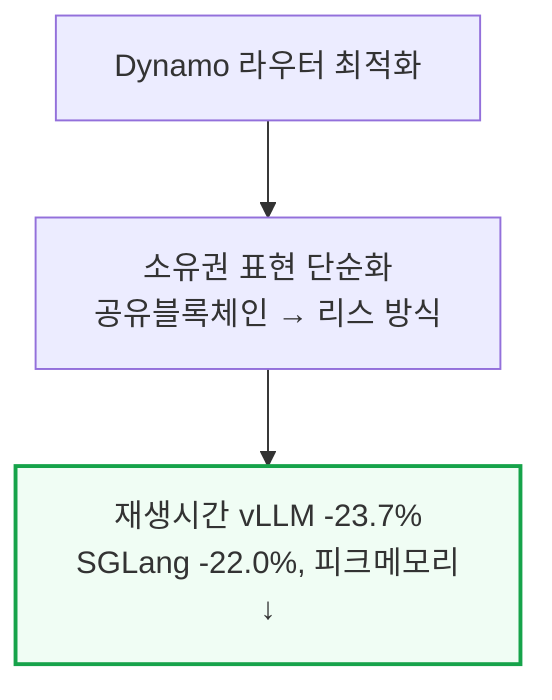

```mermaid
flowchart TD
    LMCache["LMCache"] --> Chunk["청크단위 외부캐시 로딩<br/>동시성32: 28건 데드락 → 120건 완주"]
    Mooncake["Mooncake"] --> ROCm["HIP dmabuf RDMA +<br/>ROCm 휠 배포 신설"]
    ROCm --> Install["AMD도 상류 이미지에<br/>바로 설치 가능해짐"]

    style Chunk fill:#f0fdf4,stroke:#16a34a
    style Install fill:#f0fdf4,stroke:#16a34a,stroke-width:2px
```

```mermaid
flowchart TD
    M3Bugs["MiniMax-M3 day-0 버그 3건"] --> HeadRatio["헤드비율 검증오류<br/>→ gsm8k 점수 0"]
    M3Bugs --> FP8["gfx942 FP8 인코딩 오독<br/>→ K·V 값 손상"]
    M3Bugs --> Eagle["AMD모델 EAGLE3 미구현<br/>→ 추측디코딩 초기화 실패"]
    HeadRatio --> Fixed["세 건 모두 수정<br/>MI355X gsm8k 정상화"]

    style M3Bugs fill:#fef2f2,stroke:#dc2626,stroke-width:2px
    style Fixed fill:#f0fdf4,stroke:#16a34a
```

이 모든 개선의 공통점은 "더 긴 어텐션"이 아니라 계속 자라나는 세션 상태를 보존·이동·라우팅·재구성·반복 처리하는 새로운 최적화 표면이 열렸다는 점이다.
옛 고정 길이 매트릭스는 프롬프트 하나를 만들어 프리필 한 번, 디코드 한 번 하고 버리는 구조라 턴 간 캐시 생존·반복 토큰화·세션 어피니티·오프로드 왕래·스케줄러 정체를 애초에 측정하지 못했다.
AgentX가 이런 비용을 충분히 크게 드러내 vLLM·SGLang·TensorRT-LLM·ATOM·AITER·Dynamo·LMCache 전반의 상류 개선을 이끌어냈다.

### Dynamo PR 대장

| PR | 고친 것 | 측정된 효과 |
|---|---|---|
| [#10540](https://github.com/ai-dynamo/dynamo/pull/10540) | 조회(lookup) 핫 패스의 작업량을 줄임 | — |
| [#10836](https://github.com/ai-dynamo/dynamo/pull/10836) | 중복된 접미사 무효화(invalidation)를 없앰 | — |
| [#11095](https://github.com/ai-dynamo/dynamo/pull/11095) | KV 매칭·등록·소유권·종료 시 참조 해제를 일괄 처리(batch)로 묶음 | 동시성 512에서 출력 처리량 중앙값 +22.2% |
| [#11503](https://github.com/ai-dynamo/dynamo/pull/11503) | 캐시 소유권 표현을 "공유 블록 체인" 방식으로 시작(단순화 1단계) | — |
| [#11508](https://github.com/ai-dynamo/dynamo/pull/11508) | 공유 블록 체인을 "아레나 단위 소유 카운트"로 단순화(2단계) | — |
| [#12329](https://github.com/ai-dynamo/dynamo/pull/12329) | 아레나 단위 소유 카운트를 다시 "백엔드별 요청 리스"로 단순화(3단계, 최종 리스 방식) | AgentX 재생 시간 vLLM 백엔드 -23.7%, SGLang -22.0%, 피크 메모리도 함께 감소 |
| [#10521](https://github.com/ai-dynamo/dynamo/pull/10521) | 버킷형 만료 가지치기 — 추적 대상 전체에 비례해 스캔하던 방식을 대체 | 고부하(high-churn) AgentX 처리량 +13.7% |
| [#10676](https://github.com/ai-dynamo/dynamo/pull/10676) | 델타(변경분)만 처리하는 접미사 정리 | 같은 시간창에서 저장·제거 이벤트를 약 28배 더 많이 처리 |
| [#11644](https://github.com/ai-dynamo/dynamo/pull/11644) | 압축된 프롬프트 경로 | 프런트엔드 CPU -35.3%, 꼬리(tail) TTFT 대폭 개선 |
| [#10645](https://github.com/ai-dynamo/dynamo/pull/10645) | 과부하 상태를 매번 재계산하지 않고 증분으로 추적 | — |
| [#12158](https://github.com/ai-dynamo/dynamo/pull/12158) | 라우팅 점수에 활성 디코드 요청을 반영해, 디코드를 오래 물고 있는 워커가 큐 깊이만 볼 때보다 더 비싸 보이게 함(의도된 트레이드오프) | 보고된 튜닝 지점에서 AgentX 지연 중앙값 개선(작은 처리량 손실을 대가로) |
| [#13447](https://github.com/ai-dynamo/dynamo/pull/13447) | 위 트레이드오프를 밀어붙인 새 에이전틱 라우터 프리셋 — 프리픽스 겹침 가중치 2, 프리필 부하 가중치 4, 활성 디코드 요청 가중치 64(진행 중인 작업) | 8×H200 AgentX 실행에서 완주 출력 처리량 +8.26%(기본 비용함수 대비), 실행 단위 p95 TTFT -43.1%, p95 토큰 간 지연 -22.6%, 완주 트레젝토리 1건 추가 |
| [#10437](https://github.com/ai-dynamo/dynamo/pull/10437) | MessagePack(이진 직렬화 포맷) 요청 페이로드로 전환 | 처리량 +8.1%, 평균 TTFT -9.7% |
| [#11104](https://github.com/ai-dynamo/dynamo/pull/11104) | 파이썬으로 직접 트랜스코딩해, 중간 값 트리 단계를 아예 제거 | — |
| [#11539](https://github.com/ai-dynamo/dynamo/pull/11539) | MessagePack 이벤트 페이로드를 복사하지 않음 | — |
| [#11574](https://github.com/ai-dynamo/dynamo/pull/11574) | 수신된 ZeroMQ(경량 메시징 라이브러리) 프레임을 복사하지 않음 | — |
| [#11569](https://github.com/ai-dynamo/dynamo/pull/11569) | 토큰마다 토큰 간 지연 지표 계산 오버헤드 전체를 치르지 않게 함 | — |
| [#10433](https://github.com/ai-dynamo/dynamo/pull/10433) | 채팅 스트리밍 핫 패스를 단축 | — |
| [#11820](https://github.com/ai-dynamo/dynamo/pull/11820) | 정적 로깅 필터로 공유 스팬 매처(span-matcher) 락을 제거(경합 지점 해소) | 프런트엔드 처리량 초당 932건 → 1,133건 |
| [#12161](https://github.com/ai-dynamo/dynamo/pull/12161) | 더 단순한 위치 기반 radix 버킷(접두사 트리 버킷) | 32워커 실행에서 모커(mocker)의 피크 메모리 -5.51GiB |
| [#12999](https://github.com/ai-dynamo/dynamo/pull/12999) | 스트리밍되는 청크마다 누적 카운터를 갱신하는 대신, 역토큰화 지표를 응답당 한 번만 반영(진행 중인 작업) | 매칭된 진단 프로파일에서 프런트엔드 CPU 시간 약 절반으로 감소 |

### LMCache PR 대장

| PR | 고친 것 | 측정된 효과 |
|---|---|---|
| [#3382](https://github.com/LMCache/LMCache/pull/3382) | 청크 단위 외부 캐시 로딩 — 요청마다 전체 로드분을 한 번에 예약하던 방식 대신 청크 단위로 예약해, 로드가 서로 겹쳐 흐르게 함 | 동시성 32에서 옛 방식은 28건 만에 교착(deadlock), 새 방식은 120건 완주 / 동시성 48에서는 KV 풀 98.5% 참에도 계속 동작 |
| [#3635](https://github.com/LMCache/LMCache/pull/3635) | DeepSeek-V4 하이브리드 그룹에서 쓸모 있는 부분만 저장 | 토큰당 저장량 거의 20분의 1로 감소 |
| [#3869](https://github.com/LMCache/LMCache/pull/3869) | 슬라이딩 윈도우 프리페치가 다시 읽히지 않을 윈도우 상태 대신 살아있는 윈도우만 로드 | — |
| [#3908](https://github.com/LMCache/LMCache/pull/3908) | 객체 그룹당 네이티브 전송 호출 1회로 통합해, 스테이징 복사·커널 실행마다 반복되던 파이썬 락 핸드오프를 제거 | — |
| [#4524](https://github.com/LMCache/LMCache/pull/4524) | 슬라이딩 윈도우·순환 상태 청크를 공유하는 요청 중 하나가 다른 요청의 읽기 락을 해제해버리던 하이브리드 락 회계 버그를 수정(진행 중인 작업) | — |
| [#3092](https://github.com/LMCache/LMCache/pull/3092) | CUDA 전용 flashinfer 의존을 없애려 Triton 기반 블록 희소 어텐션 백엔드를 새로 구현(ROCm 감지 시 자동 라우팅) | — |
| [#3101](https://github.com/LMCache/LMCache/pull/3101) | CUDA 빌드·경량 이미지를 그대로 반영한 ROCm Dockerfile | — |
| [#3843](https://github.com/LMCache/LMCache/pull/3843) | NVIDIA cuFile로만 닿던 GDS L1 슬랩 파일 계층을 ROCm의 hipFile로도 쓸 수 있게 확장 | — |
| [#4273](https://github.com/LMCache/LMCache/pull/4273) | gfx942·gfx950용 사전 빌드 휠을 배포(소스 빌드 대신 설치 가능하게) | MI350X에서 KV 전송 커널 테스트 56개 전부 통과 |
| [#4363](https://github.com/LMCache/LMCache/pull/4363) | 바인드 마운트된 저장소를 git safe directory로 표시하는 한 줄짜리 후속 수정(CI 전용 문제 해결) | — |
| [#3561](https://github.com/LMCache/LMCache/pull/3561) | DCP(디코드 컨텍스트 병렬화) 인지 CPU 오프로드 — 각 랭크가 KV의 일부만 쥐는 상황에서 조각을 모아 저장하고 로드 후 다시 분배 | 검증에서 CPU 적중 이벤트 3만 건 이상 기록, 단일 요청 로드가 수십만 토큰까지 도달 |

### Mooncake PR 대장

| PR | 고친 것 | 측정된 효과 |
|---|---|---|
| [#2225](https://github.com/kvcache-ai/Mooncake/pull/2225) | HIP dmabuf 등록 경로를 추가해 기존 CUDA dmabuf 경로를 AMD에도 대응(GPU-direct RDMA를 AMD에서도 가능하게 함) | — |
| [#3184](https://github.com/kvcache-ai/Mooncake/pull/3184) | ROCm 휠·CI·릴리스 경로를 신설해 mooncake-transfer-engine-rocm을 PyPI에 배포 | — |
| [#3338](https://github.com/kvcache-ai/Mooncake/pull/3338) | 셀프호스팅 2노드 MI350X 외부 프리필·디코드 계층을 추가해 ROCm 분리형 경로를 실제 하드웨어에서 검증(진행 중인 작업) | — |

### 그 밖의 개선 PR 대장

원문 "Other Optimizations" 절에서 다룬 MiniMax-M3 day-0 정합성 버그 3건이다 — 성능이 아니라 정확성 문제였다.

| PR | 고친 것 | 측정된 효과 |
|---|---|---|
| [#45879](https://github.com/vllm-project/vllm/pull/45879) | NixlConnector(vLLM의 KV 전송 커넥터)의 핸드셰이크가 SPLIT 영역 block_len을 프리필-디코드 TP(텐서 병렬) 비율에 비례한다고 잘못 가정하던 것을, 실제 랭크당 KV 헤드 비율로 검증하도록 수정 | 검증 실패로 KV가 전혀 옮겨지지 않아 gsm8k 점수 0이 나오던 문제 해결 |
| [#45720](https://github.com/vllm-project/vllm/pull/45720) | MiniMax-M3의 희소 어텐션 백엔드가 gfx942의 FP8 인코딩(e4m3fnuz)을 float8_e4m3fn으로 잘못 읽어 K·V 값이 커널 진입 전에 손상되던 것을, 플랫폼 dtype 그대로 캐시를 읽도록 수정(프리필·디코드 래퍼 양쪽) | — |
| [#45546](https://github.com/vllm-project/vllm/pull/45546) | AMD 모델 파일에 EAGLE3 인터페이스가 빠져 ROCm에서 추측 디코딩이 엔진 초기화 단계부터 막히던 것을, NVIDIA 모델과 동등하게 맞춰 해결 | MI355X gsm8k 점수가 EAGLE3 미적용 MI355X 실행·B200과 일치 |

---

## 8. AgentX 방법론 - 300만 달러 데이터셋과 트레이스 리플레이어

**📌 핵심:**
- SemiAnalysis는 클로드 코드·OpenAI Codex 등으로 향하는 HTTP 요청을 가로채는 프록시를 만들어 사내 직원들의 실제 사용 트래픽을 모았다 — 현재까지 세션 8,000개 이상, 요청 340만 건, 토큰 6,100억 개(총 300만 달러 이상 상당)를 수집했고, 그중 393세션 대표 부분집합을 AgentX v1.0용으로 공개했다
- 직원 프라이버시 보호를 위해 요청 내용을 64토큰 블록으로 나눠 각 블록을 세션 단위 체인 해시로 치환한다 — 원본 프롬프트·소스코드·도구 결과는 전혀 남지 않지만 일치하는 프리픽스는 그대로 일치하는 해시 프리픽스로 남아, 재생 시 실제 코딩 데이터셋의 토큰으로 채워 넣어도 원래의 맥락 성장·KV 재사용 패턴은 보존된다
- 정제된 데이터셋의 입력 길이(ISL) 중앙값은 14만 2천 토큰, 출력 길이(OSL) 중앙값은 444토큰, 턴 사이 지연(주로 도구 사용 시간) 중앙값은 3.84초이며, 세션의 약 44%(175개)에 서브에이전트가 최소 1개 있고 서브에이전트 1,697개의 중앙값 실행 시간은 2.27분이다 — 리플레이는 Nvidia의 벤더 중립 HTTP 리플레이 도구 AIPerf(SemiAnalysis 자체 포크)를 써서 각 세션을 방향성 비순환 그래프(DAG)로 표현해 서브에이전트의 동시 실행·메인 에이전트 합류까지 재현한다
- 결론: 재현성을 위해 워밍업 2단계(대화 진행률 25\~75% 지점 재구성 → 레인마다 10개 요청 추가)를 거친 뒤 1시간 동안 측정하고, 유휴 5분을 넘긴 스트림은 끊어(앤트로픽 기본 KV 캐시 TTL 5분과 동일 기준) 벤치마크가 무한정 늘어지지 않게 하며, 추측 디코딩은 합성 데이터가 왜곡을 만들지 않도록 실제 코딩 트레이스(SPEED-Bench)에서 측정한 평균 수락 길이(acceptance length)를 그대로 적용해 공정성을 맞춘다

---

```mermaid
flowchart TD
    Collect["프록시로 직원 실사용<br/>트래픽 수집"] --> Scale["세션 8,000+·요청 340만 건<br/>토큰 6,100억(300만 달러+ 상당)"]
    Scale --> Subset["대표 393세션을<br/>AgentX v1.0으로 공개"]

    style Scale fill:#eff6ff,stroke:#3b82f6,stroke-width:2px
```

```mermaid
flowchart TD
    Privacy["프라이버시 보호"] --> Hash["요청을 64토큰 블록 단위<br/>세션체인 해시로 치환"]
    Hash --> Preserve["원문은 안 남지만<br/>프리픽스 일치 패턴은 보존"]
    Preserve --> Refill["재생 시 실제 코딩<br/>토큰으로 재충전"]

    style Preserve fill:#f0fdf4,stroke:#16a34a,stroke-width:2px
```

```mermaid
flowchart TD
    DataProfile["정제 데이터셋 프로필"] --> ISL["ISL 중앙값 14.2만 토큰"]
    DataProfile --> OSL["OSL 중앙값 444토큰"]
    DataProfile --> Sub["서브에이전트 있는 세션 44%<br/>(175개, 중앙값 4개/세션)"]

    style DataProfile fill:#eff6ff,stroke:#3b82f6
```

```mermaid
flowchart TD
    Replay["측정 절차"] --> Warmup["워밍업 2단계<br/>(25~75% 지점 재구성 + 레인당 10요청)"]
    Warmup --> Profile["1시간 측정<br/>유휴 5분 초과 스트림 절단"]
    Profile --> SpecDec["추측디코딩은 SPEED-Bench<br/>실측 수락길이로 벤더중립 보정"]

    style Warmup fill:#eff6ff,stroke:#3b82f6
```

새로 만든 시각화 도구도 이번 AgentX의 성과다 — 각 데이터 포인트를 클릭하면 어떤 설정(추측 디코딩·분리형 서빙·KV 오프로드 등)이 그 점을 만들었는지, CI 증빙과 함께 볼 수 있고, KV 캐시 이용률·요청 큐 깊이·프리픽스 캐시 적중률을 대화별·워커별 타임라인과 대화 하나의 구조를 보여주는 화염그래프(flamegraph)까지 제공한다.

---

## 9. InferenceX/AgentX 다음 단계

**📌 핵심:**
- v1.0.x 소규모 버그 수정은 계속하되, v1.1 하네스에서는 SSD/NVMe KV 오프로드를 추가해 DRAM보다 더 큰 작업셋을 감당함으로써 Pareto 곡선의 고처리량 구간을 더 넓힐 계획이다
- 다음 데이터셋은 요청을 하나의 연속된 해시 ID 리스트로 뭉치지 않고 시스템 지시·사용자/어시스턴트 메시지·도구 호출·도구 결과의 경계를 그대로 보존해, 라우터가 재사용률 낮은 도구 트래픽을 전담 프리필 워커로 보내거나 긴 도구 호출 동안 프리픽스를 유지하는 등 하네스만 아는 정보를 활용하는 서빙 기법까지 평가할 수 있게 할 계획이다
- 결론: 소프트웨어·하드웨어 스택별 "지능당 줄(Joule)" 효율까지 비교할 수 있도록 세밀한 전력 원격측정 데이터도 함께 수집하고 있다

---

```mermaid
flowchart TD
    NextGen["v1.1 하네스 계획"] --> NVMe["SSD/NVMe KV 오프로드<br/>추가 → 고처리량 구간 확장"]
    NextGen --> Structure["요청 경계(시스템·사용자·<br/>도구호출·도구결과) 보존"]
    NextGen --> Power["세밀한 전력 원격측정<br/>→ 지능당 줄(Joule) 비교"]

    style NextGen fill:#eff6ff,stroke:#3b82f6,stroke-width:2px
```

---

## 10. 모델 수명주기 전체로 본 성능 - 적분 관점

**📌 핵심:**
- 출시일 스냅숏 하나만 보면 불완전하다 — 소프트웨어 스택은 출시 후에도 계속 개선되므로, "오늘 GPU가 토큰을 몇 개 뽑는가"가 아니라 "모델이 나온 날부터 은퇴할 때까지 총 몇 개를 뽑을 수 있었는가"(=시간에 따른 처리량 곡선 아래 면적, 적분값)로 봐야 진짜 실력이 드러난다는 게 이 장의 핵심 개념
- Kimi K2.5 사례(2월\~8월 측정)에서 MI355X는 최고점(4,081 tok/s/GPU, 7월)으로 B200 최고점을 앞섰지만, 적분값은 B200이 GPU당 538억 토큰으로 MI355X의 352억 토큰을 크게 앞섰다 — B200이 2월에 먼저 출발해 6개월간 3,800대 처리량을 꾸준히 유지한 것이 나중에 더 높은 숫자를 찍은 것보다 누적으로 더 값졌기 때문
- 반면 MiniMax M3 사례는 정반대다 — 양사가 같은 날 출발했는데 MI355X가 3주 만에 8.1배(1,072→8,662 tok/s/GPU), B200이 4.7배(1,890→8,945) 개선하며 적분값이 MI355X 427억 대 B200 424억으로 사실상 동률이 됐다(다만 상호작용성 기준을 더 엄격하게 잡으면 B200이 다시 앞선다)
- 결론: 2026년 8월 젠슨 황의 컴퓨트엑스 발표를 재현한 자체 분석에서, DeepSeek V4 8k1k·10MW 전력예산·1주 램프업 가정 시 매출을 극대화하는 선택은 GB300이었다 — GB300은 B200/B300보다 첫 프로덕션 준비(TTFI)가 1주일 늦었지만 소프트웨어 개선 속도가 빨라 누적 매출을 금세 따라잡았고 MW당 마진(Δ$/W)은 MI355X의 2배를 넘었다

---

```mermaid
flowchart TD
    Concept["수명주기 적분 개념"] --> Snapshot["출시일 스냅숏은<br/>불완전한 그림"]
    Concept --> Integral["처리량 곡선 아래 면적<br/>= t0(생산가능 시점)부터<br/>t1(측정 종료)까지 누적 토큰"]

    style Integral fill:#eff6ff,stroke:#3b82f6,stroke-width:2px
```

```mermaid
flowchart TD
    K25["Kimi K2.5 사례(2~8월)"] --> Peak["MI355X 최고점 승리<br/>(4,081 tok/s/GPU, 7월)"]
    K25 --> Sum["누적 적분은 B200 승리<br/>538억 vs 352억 토큰/GPU"]
    Sum --> Why["B200이 2월 먼저 출발해<br/>6개월간 3,800대 유지한 게 더 값짐"]

    style Sum fill:#f0fdf4,stroke:#16a34a,stroke-width:2px
```

```mermaid
flowchart TD
    M3case["MiniMax M3 사례(동시 출발)"] --> AMDgain["MI355X 3주 8.1배 개선<br/>(1,072→8,662)"]
    M3case --> NVgain["B200 3주 4.7배 개선<br/>(1,890→8,945)"]
    AMDgain --> Tie["적분값 사실상 동률<br/>427억 vs 424억 토큰/GPU"]
    NVgain --> Tie

    style Tie fill:#fff7ed,stroke:#ea580c,stroke-width:2px
```

```mermaid
flowchart TD
    Revenue["10MW·1주 램프업<br/>매출 극대화 분석<br/>(DeepSeek V4 8k1k)"] --> GB300win["GB300이 매출 최대<br/>TTFI는 1주 늦었지만<br/>소프트웨어 개선 속도로 역전"]
    GB300win --> MarginW["MW당 마진(Δ$/W)<br/>MI355X의 2배+"]

    style GB300win fill:#f0fdf4,stroke:#16a34a,stroke-width:2px
```

GLM 5 FP8 사례는 세 번째 유형을 보여준다 — B200이 3월 20일 초당 GPU당 670토큰으로 시작해 4월 18일 1,335토큰으로 두 배가 됐고, MI355X는 4월 8일 665토큰(B200 출시 수치와 거의 동일)으로 시작해 5월 1일 954토큰에 그쳤다.
적분값은 B200 157억, B300 153억, MI355X 103억 토큰으로, 두 플랫폼 모두 5월 초 이후엔 개선이 멈췄는데 이는 모델이 후속작에 밀려나면서 소프트웨어 성숙 전에 손을 놓는 흔한 패턴이라고 저자들은 설명한다.
세 사례를 종합하면 "특정 날짜의 최고 수치", "생산 준비가 언제 됐는가", "수명주기 전체 적분값"은 서로 다른 세 가지 우위이며 한 플랫폼이 이 셋을 다 가질 필요는 없다.

---

## 11. 단일 턴(8k1k) 성능 - 시간에 따른 개선

**📌 핵심:**
- AgentX가 이제 주력 시나리오가 됐지만, 옛 고정 길이(8k1k) 성능 이력은 소프트웨어가 성숙하는 궤적과 속도를 보여주는 데 여전히 유용하다 — Kimi K2.X는 2월 18일부터 8월 7일까지 60건의 제출이 이어지며 계속 개선됐고, 이 기간 MI355X ATOM은 달러당 총토큰 기준으로 B300 vLLM과 상당히 경쟁력 있는 수준까지 따라붙었다
- AMD MI355X는 ROCm·PyTorch·ATOM 갱신에 이어 FP4 MoE 백엔드·경량 전문가 라우팅·올리듀스 개선으로 디코드 중 MoE 커널 시간과 TP 통신을 줄였고, MI325X는 vLLM ROCm v0.16→v0.18 업그레이드 이후 v0.21 이미지 갱신으로 8k1k 처리량이 1.9\~2.6배, TTFT 중앙값이 43\~53% 개선됐다(트레이드오프가 아니라 순수 커널·통신 이득)
- 엔비디아는 v0.20.2에서 깨져 있던 MXINT4 인터페이스를 고치고 FlashInfer의 TRT-LLM MXINT4 커널로 MoE 레이어를 옮기면서 v0.15.1 대비 8k/1k 처리량이 8\~28% 오르고 TTFT 중앙값이 20\~37% 줄었으며, 이후 DEP8(데이터병렬 8개로 어텐션·KV캐시를 돌리며 MoE 전문가는 같은 8장 B200에 샤딩)이 동시성 512에서 초당 GPU당 6,140토큰·TTFT 1.15초를 기록해 기존 TP8/TEP8(약 3,900토큰·약 50초)를 크게 앞섰다
- 결론: Qwen3.5는 정식 출시 전에 vLLM·SGLang 지원이 먼저 병합된 day-0 모델로 총 1,028개 데이터포인트가 쌓였고, GLM 5는 25 tok/s/user에서 MI355X가 B200의 94%까지 따라붙었지만 75 tok/s/user 같은 엄격한 상호작용성 기준에서는 68%로 격차가 벌어져 — MI355X는 처리량 중심, B200은 반응성 중심 배치에서 각각 강점이 갈렸다

---

```mermaid
flowchart TD
    K2X["Kimi K2.X (2~8월, 60건 제출)"] --> MIprog["MI355X ATOM:<br/>B300 vLLM과 대등한<br/>달러당 총토큰 수준까지 추격"]
    K2X --> MI325["MI325X: v0.18→v0.21<br/>처리량 1.9~2.6배<br/>TTFT -43~53%"]

    style MI325 fill:#f0fdf4,stroke:#16a34a,stroke-width:2px
```

```mermaid
flowchart TD
    Nv["엔비디아 개선 이력"] --> V20["v0.20.2: MXINT4 인터페이스<br/>수정 → 처리량 +8~28%<br/>TTFT -20~37%"]
    Nv --> DEP8["DEP8 (2026-08 신규)<br/>동시성512: 6,140 tok/s/GPU<br/>TTFT 1.15초 (TP8 대비 대폭 개선)"]

    style DEP8 fill:#f0fdf4,stroke:#16a34a,stroke-width:2px
```

```mermaid
flowchart TD
    GLM5["GLM 5 (MI355X vs B200)"] --> T25["25 tok/s/user:<br/>MI355X = B200의 94%"]
    GLM5 --> T75["75 tok/s/user:<br/>MI355X = B200의 68%"]
    T75 --> Gap["처리량 지향 배치에선 근접<br/>반응성 지향 배치에선 격차 확대"]

    style T25 fill:#f0fdf4,stroke:#16a34a
    style T75 fill:#fff7ed,stroke:#ea580c,stroke-width:2px
```

GLM 5에서 AMD는 초기 결과 대비 약 4.8배 개선(두 차례 큰 레시피 전환 덕분, 벤더 중 최대 상대 개선폭)을 이뤘고 엔비디아도 비슷한 4.68배를 개선해 TP4 전환 이후 정체기에 들어섰다.
MiniMax M3 8k1k는 6월 12일부터 8월 4일까지 이어졌고, 은퇴 시점 기준 GB300이 Dynamo-vLLM MTP 분리형 구성으로 단독 선두였다.
다만 상위권 결과 중 세 곳은 어떤 실사용 배치도 받아들이지 않을 만큼 TTFT 중앙값이 나빠, 처리량 순위와 실사용 순위가 크게 달랐다는 점도 함께 확인됐다.

---

*작성 진행률: 100% 완료*
*업데이트: 전체 11개 섹션(서론, 에이전틱 워크로드 정의, 모델별 성능, 업계 파급력, vLLM·SGLang 최적화, TensorRT-LLM·ATOM·AITER 최적화, Dynamo·LMCache·Mooncake 최적화, AgentX 방법론, 다음 단계, 수명주기 적분 성능, 단일 턴 성능) 작성 완료*
