# OpenAI Jalapeño: Better Than Nvidia Blackwell

> **출처**: [SemiAnalysis Newsletter](https://newsletter.semianalysis.com/p/openai-jalapeno-better-than-nvidia)
> **저자**: Bryan Shan, Myron Xie, Jordan Nanos
> **발행일**: 2026-08-25

---

## 📑 목차

### 전체 섹션
1. [서론 - 오픈AI, 자체 설계 추론 칩 "Jalapeño" 공개](#1-서론---오픈ai-자체-설계-추론-칩-jalapeño-공개)
2. [범용 추론 칩 - 스펙과 헤드라인 성능](#2-범용-추론-칩---스펙과-헤드라인-성능)
3. [성능 분석 - 와트당 성능이 핵심인 이유](#3-성능-분석---와트당-성능이-핵심인-이유)
4. [스펙과 아키텍처 파헤치기](#4-스펙과-아키텍처-파헤치기)
5. [소프트웨어 - Gluon과 Codex](#5-소프트웨어---gluon과-codex)
6. [PD 분리를 하지 않은 이유](#6-pd-분리를-하지-않은-이유)
7. [랙 시스템 아키텍처 - Katsu·Vindaloo·Chana](#7-랙-시스템-아키텍처---katsuvindaloochana)
8. [다음 단계와 업계 파급력](#8-다음-단계와-업계-파급력)

---

## 🔑 용어 정리

본문을 순서대로 읽기 전에 알아두면 좋은 용어들입니다. 자세한 수치와 설명은 본문에서 처음 등장하는 위치에 나옵니다.

- **ASIC(주문형 반도체, Application-Specific Integrated Circuit)**: 범용 GPU와 달리 특정 목적(이 경우 LLM 추론)에 맞춰 처음부터 설계한 칩
- **와트당 성능(perf/W)·MW당 토큰(tok/s/MW)**: 전기 1와트, 또는 1메가와트로 토큰을 얼마나 만들어내는지 재는 효율 지표 — 전력이 부족한 시대엔 칩값보다 이 숫자가 매출을 좌우한다
- **BtM(Behind-the-Meter, 계량기 뒤 자가발전)**: 전력회사 송전망을 거치지 않고 데이터센터 부지 안에 가스터빈 등을 세워 직접 전기를 만드는 방식 — 전력망 증설을 기다리지 않아도 된다
- **HBM4(4세대 고대역폭 메모리, High Bandwidth Memory)**: 칩 옆에 쌓아 붙여 데이터를 아주 빠르게 주고받는 메모리 — 세대가 올라갈수록 대역폭(초당 옮기는 데이터량)이 커진다
- **PD 분리(Prefill-Decode Disaggregation)**: 입력을 한번에 처리하는 프리필과 토큰을 하나씩 만드는 디코드를 서로 다른 칩 묶음에 맡기는 방식 — Jalapeño는 이걸 하지 않는다
- **STP·MTP(단일/다중 토큰 예측, Single/Multi-Token Prediction)**: STP는 한 번에 토큰 1개씩, MTP는 여러 개를 한 번에 예측해 속도를 높이는 방식 — Jalapeño의 headline 수치는 더 유리한 MTP 없이 STP만으로 낸 것이다
- **투기적 디코딩(Speculative Decoding)**: 작고 빠른 초안 모델이 먼저 토큰 여러 개를 추측하고, 큰 본 모델이 한 번에 검증해 속도를 높이는 기법
- **Gluon**: 오픈AI가 Triton을 바탕으로 만든 저수준 커널(칩을 직접 제어하는 코드) 프로그래밍 언어 — 하드웨어 자원과 데이터가 어떻게 배치되는지(레이아웃)까지 프로그래머가 직접 지정할 수 있다

---

## 1. 서론 - 오픈AI, 자체 설계 추론 칩 "Jalapeño" 공개

**📌 핵심:**
- 오픈AI는 지난 몇 년간 조용히 "Jalapeño"라는 LLM 추론 전용 ASIC(주문형 반도체)를 만들어 왔고, Hot Chips(반도체 업계 콘퍼런스)에서 처음 공식 발표했다 — SemiAnalysis는 오픈AI의 초청으로 칩을 직접 보고, 연구소를 방문해 실물을 확인하고, 자체 벤치마크 InferenceX로 성능을 측정했다
- 설계는 2024년 중반 시작해 약 16개월 만에 제조 테이프아웃(설계 확정본을 파운드리에 넘기는 시점)까지 끝냈다 — ASIC 개발 주기치고 극히 빠른 속도다
- 보통 1세대 칩은 경쟁력이 없는 게 일반적인데, Jalapeño는 이 통념을 깨고 SemiAnalysis가 테스트한 모든 엔비디아·AMD·구글 칩을 여러 오픈소스 모델에서 앞섰다
- 결론: 오픈AI는 특정 부분만 파고드는 특화 칩이 아니라, 모든 시나리오에서 고르게 좋은 성능을 내는 범용 칩을 극단적인 하드웨어·소프트웨어 공동설계(codesign)로 만들어냈다

---

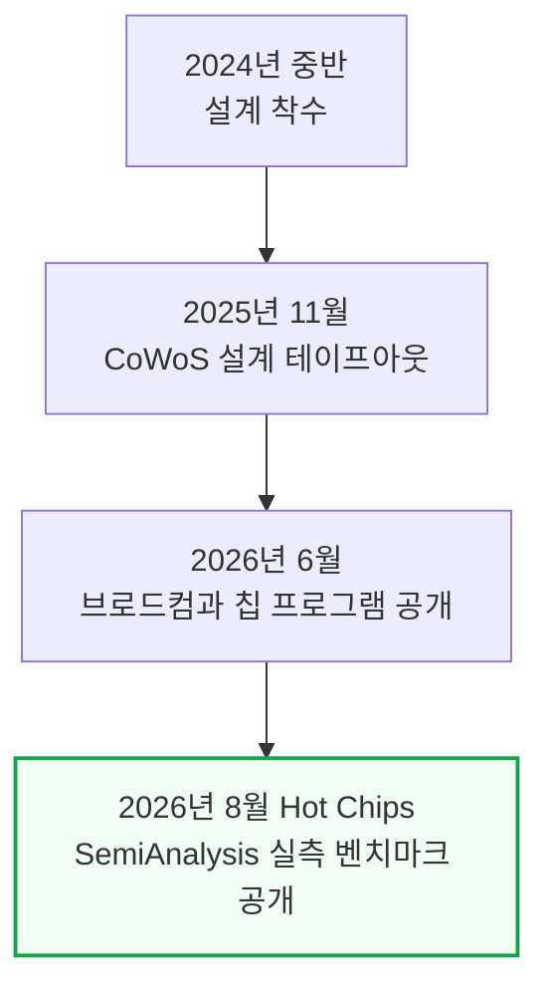

오픈AI는 2026년 6월 브로드컴과 공동으로 LLM 추론 전용으로 백지에서(blank slate) 설계한 칩 프로그램을 공개했다. 이번 Hot Chips 발표에서는 그 실물을 SemiAnalysis가 직접 확인하고 벤치마크한 결과가 처음 나온 것이다. 장난삼아 오픈AI는 이 칩에서 둠(Doom) 게임을 돌리는 모습도 보여줬는데, Codex(오픈AI의 코딩 에이전트) 프롬프트만으로 이식한 것이었다.

---

## 2. 범용 추론 칩 - 스펙과 헤드라인 성능

**📌 핵심:**
- Jalapeño는 오픈AI 자사 모델 전용이 아니라 다양한 모델·워크로드를 두루 잘 돌리는 범용 칩이다 — InferenceX 벤치마크를 오픈AI 엔지니어와 함께 현장에서 직접 실행해 확인했다
- 헤드라인 결과: MW(메가와트)당 토큰 처리량에서 Jalapeño는 다중 토큰 예측(MTP, 한 번에 토큰 여러 개를 예측해 속도를 높이는 기법)을 켜지 않고도, MTP를 켠 다른 모든 칩(각 제품군 최고 구성)을 앞섰다
- 저지연 구간과 고처리량 구간 모두에서 블랙웰을 앞섰고, 똑같이 STP(단일 토큰 예측)로만 비교하면 격차가 더 벌어진다 — DeepSeek R1에서 동시접속 1명 기준 초당 사용자당 700토큰 이상을 냈다
- 결론: 이 수치는 투기적 디코딩도, PD(프리필-디코드) 분리도 없이 순수 STP만으로 낸 것이라 더 인상적이다 — Kimi-K2.5·GPT-OSS에서도 초당 사용자당 약 1,400토큰을 기록했고, 정확도(GSM8k 평가)도 엔비디아 칩과 대등했다

---

Jalapeño는 HBM4(4세대 고대역폭 메모리)를 탑재해, 엔비디아·AMD의 최신 플래그십 GPU와 스펙만 놓고 봐도 바로 견줄 만한 수준이다. HBM4는 아직 엔비디아·AMD도 막 도입한 세대라, 1세대 ASIC이 이걸 쓴다는 것 자체가 이례적이다.

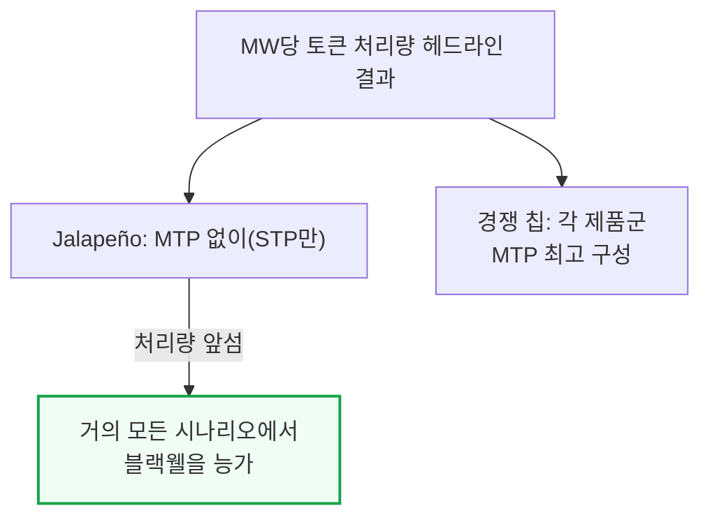

세 가지 유보 조건이 있다.

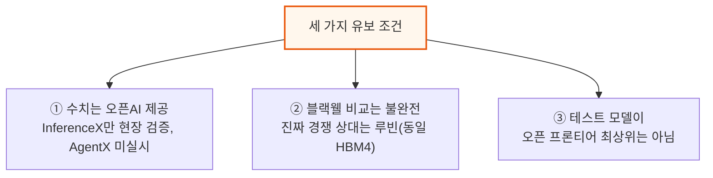

① SemiAnalysis는 InferenceX 실행을 랩에서 직접 검증했지만, 전체 InferenceX 스위트를 다 돌리지도, AgentX(멀티턴·긴 맥락 벤치마크) 결과를 보지도 못했다. AgentX는 실제 운영 트래픽의 캐시 재사용 패턴을 더 잘 반영하기 때문에 SemiAnalysis가 칩 성능 비교에 선호하는 기준이다 — 8k1k(입력 8천·출력 1천 토큰 고정) 벤치마크에서 잘하는 프레임워크가 라우터·프리픽스 캐시·오프로드 같은 구성요소에 부하가 걸리는 AgentX에서는 더 나쁠 수 있다.

② 블랙웰과의 비교는 다소 불공정하다. Jalapeño의 진짜 경쟁 상대는 같은 HBM4를 쓰는 루빈(Rubin)이다. 베라 루빈 시스템은 지금 고객사에 출하되기 시작했지만, Jalapeño는 아직 엔지니어링 샘플 단계다. 실제로 베라 루빈 NVL72는 GB200 NVL72 대비 MW당 성능이 5.4배라고 SemiAnalysis가 지난달 별도 기사에서 분석한 바 있다 — 이 문서의 뒷부분에서 Jalapeño를 베라 루빈의 2026년 7월 성능치와 비교한다.

③ 테스트한 모델들이 오픈 프론티어 최상위는 아니다. 엔비디아·AMD는 AgentX로 DeepSeek V4 Pro, Kimi K3 같은 더 큰 모델의 결과를 발표했다 — 모델이 크고 최신일수록 새 칩에 이식하기가 더 어렵다. 다만 Jalapeño에서 돌린 모델들도 결코 작은 편은 아니다.

---

## 3. 성능 분석 - 와트당 성능이 핵심인 이유

**📌 핵심:**
- 오픈AI가 와트당 성능(perf/W)에 설계 초점을 맞추는 이유는 단순하다 — 지금 오픈AI를 막는 건 예산이나 부지가 아니라 데이터센터에 공급되는 전력(MW)이라, MW당 토큰이 곧 매출과 직결된다
- 엔비디아 CEO 젠슨 황도 2026년 컴퓨텍스에서 "1기가와트(GW)의 전력이 있다면 와트당 처리량이 곧 매출"이라 말했고, 핫칩스 2026 베라 발표에서도 같은 그래프로 "데이터센터는 지금 전력이 병목"이라 재확인했다
- 전력망 증설은 GPU 조달보다 훨씬 느려서, 데이터센터는 송전망을 거치지 않고 부지 안에서 직접 발전하는 BtM(계량기 뒤 자가발전)에 점점 더 의존한다 — xAI 콜로서스 2가 대표 사례다
- 결론: MW당 토큰은 결국 "줄(1와트=1초당 1줄)당 토큰"과 같아서, 전기를 토큰으로 바꾸는 효율 그 자체를 보여준다 — 이 기준으로도 Jalapeño는 루빈을 앞선다

---

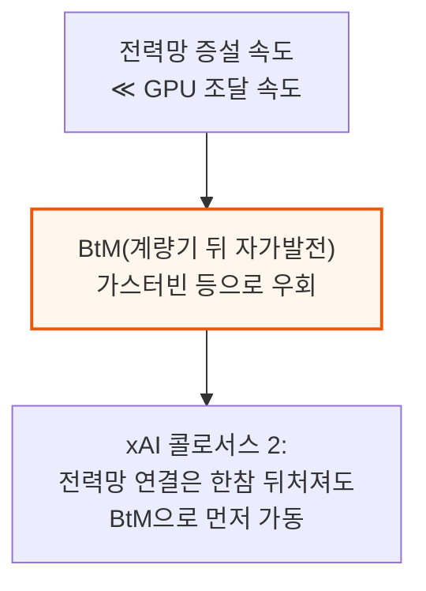

MW당 토큰 처리량을 비교할 때는 소프트웨어 성숙도가 비슷한 시점끼리 맞춰야 공정하다. 그래서 GB200은 2025년 초기 결과(당시가 비슷한 초기 단계였기 때문), 베라 루빈은 2026년 7월 최신 결과, Jalapeño는 오늘 결과를 비교한다 — 이것이 현재 공개된 최선의 루빈 수치이며, 오픈AI가 루빈보다 늦게 테이프아웃했다는 점에서도 타당한 비교다. 오픈AI와 루빈 둘 다 아직 미성숙 단계라 앞으로도 성능은 계속 오를 것이다.

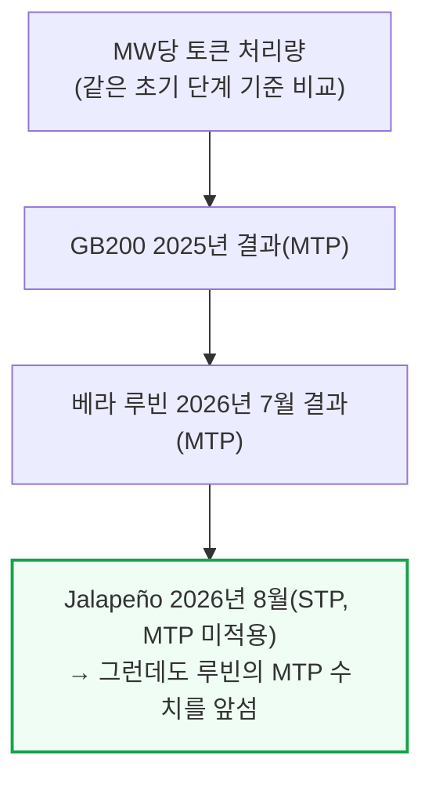

달러당 출력 토큰(perf/TCO, 총소유비용 대비 성능)으로 보면 루빈과 Jalapeño는 거의 대등하다. 다만 루빈의 수치는 투기적 디코딩을 적용한 결과이고, Jalapeño는 적용하지 않은 결과라는 차이가 있다.

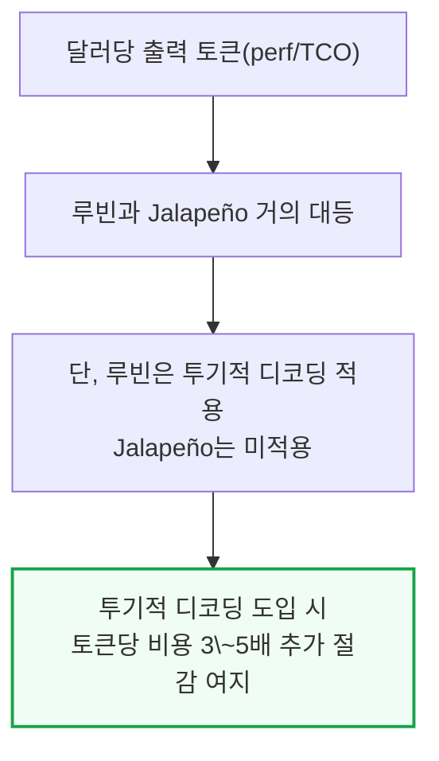

이 비용 우위의 일부는 엔비디아의 높은 마진을 브로드컴의 (여전히 높지만 상대적으로 낮은) 마진으로 바꾼 데서 나온다. 하지만 그게 전부는 아니다 — 메타·마이크로소프트의 AI ASIC 프로그램은 훨씬 오래전부터 준비했는데도 궤도에 오르지 못했다는 사실이, 비용 구조만으로는 이 결과를 설명할 수 없음을 보여준다.

아키텍처 측면에서 오픈AI는 프리필과 디코드를 서로 다른 칩 풀로 나누지 않는 선택을 했다 — 초안 모델과 본 모델이 같은 칩과 네트워크를 공유한다. 이유는 6장에서 자세히 다루는데, 요약하면 워크로드 구성비가 시간에 따라 계속 바뀌기 때문에 프리필용·디코드용 칩 수를 미리 고정해두면 비효율이 생긴다는 것이다. 이 균일한(homogeneous) 칩 풀 구조로 오픈AI는 다음 결과를 냈다.

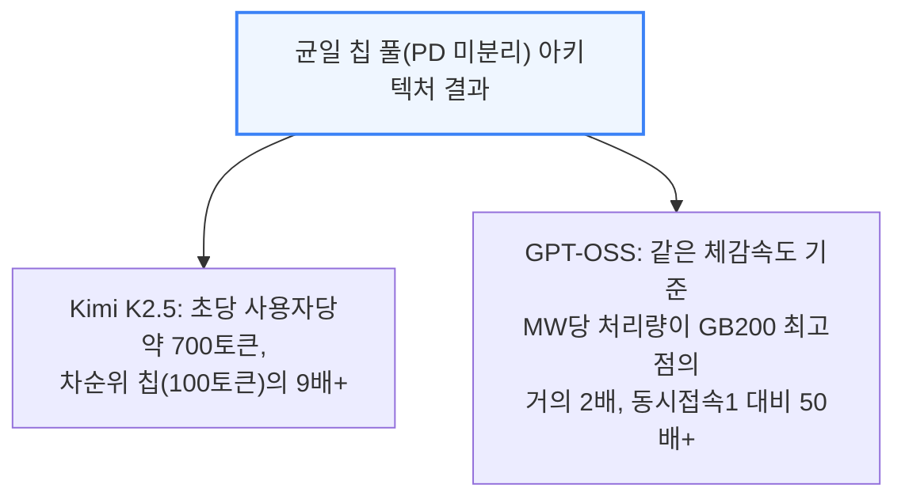

Kimi K2.5는 코딩 도구 Cursor의 Composer 2.5가 기반으로 삼은 모델이다. GPT-OSS 결과 중 동시접속 수가 높은 지점은 EP8(Expert Parallelism 8, 전문가 병렬화 8분할) 구성을 쓴 것이다.

다만 이 결과들도 8k1k 벤치마크일 뿐이고 아직 AgentX 결과는 없다는 점은 그대로 남는 유보 조건이다 — 멀티턴·긴 맥락 워크로드는 서빙 스택의 더 많은 부분(라우터, 프리픽스 캐시 등)에 부하를 건다.

---

## 4. 스펙과 아키텍처 파헤치기

**📌 핵심:**
- 지금까지 결과는 프로그램 시작 9개월째인 A0 스테핑(칩 제조 리비전) 기준이고, 와트당 성능을 A0 대비 약 25% 더 끌어올린 B0 스테핑이 벌써 파운드리(팹)에 들어가 있다
- B0는 TSMC N3P 공정의 단일 레티클(노광 1회 최대 면적) 크기 연산 다이에서 MXFP4 기준 13.4 PFLOPs(초당 1,340조 회 연산)를 내는데, 같은 크기·같은 공정의 루빈 연산 다이(NVFP4 기준 17.5 PFLOPs)보다는 낮지만, Jalapeño의 TDP(설계 최대 소비전력)가 700W로 루빈(900\~1,150W)보다 훨씬 낮다는 점을 감안하면 상당히 준수한 수치다
- HBM4를 엔비디아·AMD 다음으로, TPU·Trainium보다도 먼저 채택했다 — 패키지당 메모리 대역폭 15.4TB/s로 HBM3E를 쓰는 다른 칩들을 모두 앞서고, 10Gbps 핀 속도로 루빈의 9.6Gbps보다도 근소하게 앞선다(HBM은 삼성 공급 추정)
- 결론: 2025년 11월 테이프아웃 이후 겨우 3개월의 실리콘 브링업(실물 칩 구동 검증) 기간으로 이 정도 결과를 낸 것은, 소프트웨어 스택을 아예 처음부터 새로 짠 팀치고는 이례적인 속도다 — 반면 루빈은 한 달 먼저 테이프아웃했는데도 코어위브 엔지니어링 샘플 결과만 나와 있어, "CUDA 해자(moat, 경쟁사가 넘기 힘든 진입장벽)가 죽어가고 있다"는 평가까지 나온다

---

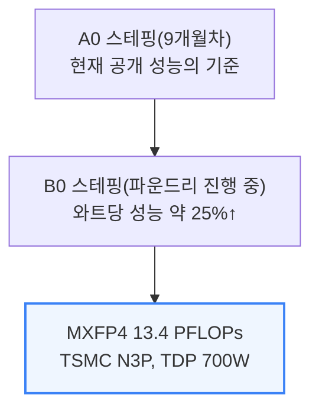

루빈의 동급 다이는 NVFP4(밀집) 기준 17.5 PFLOPs를 내지만 TDP가 900\~1,150W다. Jalapeño는 학습용이 아니라 추론 전용이라 FLOPs를 극대화하려 TDP를 억지로 끌어올릴 필요가 없다는 점을 감안하면, 이 격차는 오히려 준수한 성적으로 봐야 한다. 실제로 와트당 HBM 대역폭과 와트당 FLOPs 모두 Jalapeño가 가장 높고, 1,800W짜리 루빈 Max-Q 구성과 맞먹는 수준이다.

칩 밖 I/O(입출력)는 N3E 공정 I/O 칩렛이 담당하는데, 32개 레인의 800G SerDes(직렬 데이터 전송 회로) 중 24개 레인(600GB/s)은 랙 내부 로컬 스케일업에, 8개 레인(200GB/s)은 2,048개 XPU(오픈AI가 자사 칩을 부르는 명칭)로 이어지는 글로벌 스케일업에 쓴다. 호스트 x86 CPU와의 시스템 연결은 PCIe Gen5를 쓴다.

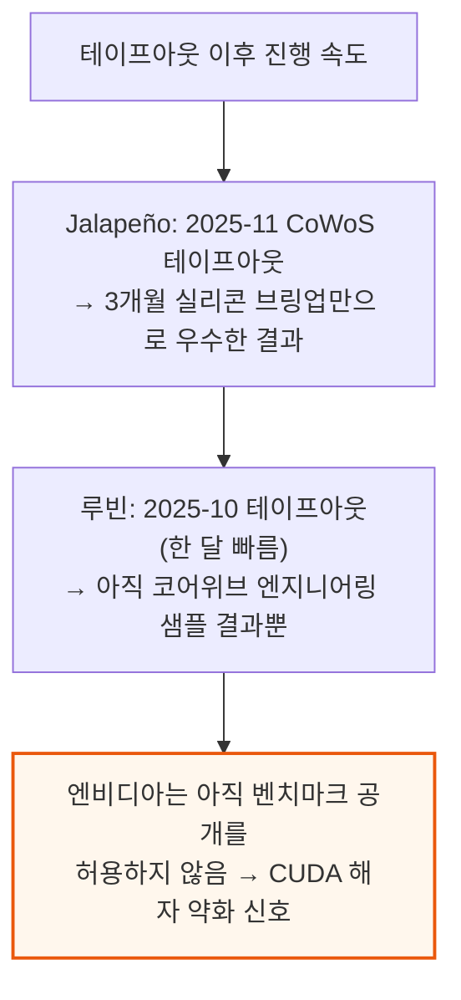

이 격차는 엔비디아 하드웨어가 열등해서가 아니라, Jalapeño의 소프트웨어 브링업 속도가 더 빨랐기 때문이라고 봐야 한다 — 하드웨어·소프트웨어 공동설계(codesign)의 힘이자, 기존 소프트웨어와의 하위 호환을 신경 쓸 필요 없이 백지에서 설계를 시작한 것이 오히려 유리하게 작용했을 수 있다는 뜻이다. 현재는 엔지니어링 샘플 단계이며, 양산은 2027년에 걸쳐 점진적으로 늘려 2027년 말에 물량 대부분이 나올 예정이다.

### Jalapeño 아키텍처

매트릭스 엔진은 MXFP 수치 형식과, TPU와 비슷한 가중치 고정형(weight-stationary) 시스톨릭 어레이(데이터가 격자 모양 연산 유닛을 순차적으로 흐르며 계산되는 구조)를 쓴다. 다만 TPU와 달리 더 작은 행렬 크기도 지원해, 어중간한 크기의 행렬곱에서 성능이 뚝 떨어지는 현상이 없다. 64비트 스칼라 코어와 FP32/INT32 벡터 코어도 갖췄고, 트레이(서버 내 부품 단위)와 코어·채널 단위 모두에 여분(redundancy)과 수율 확보(불량 부분을 우회해 쓰는 기법)를 내장했다. 오픈AI는 AI를 활용한 칩 설계로 SIMD 면적을 8%, 매트릭스 엔진 면적을 10% 줄였고, 타이밍과 전력도 개선했다고 밝혔다.

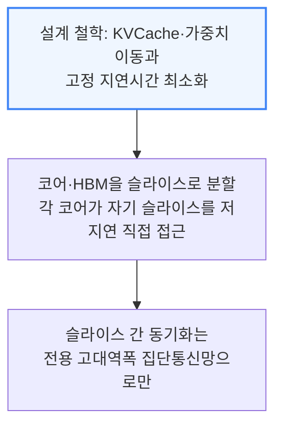

GPU는 메모리 접근이 복잡한 메모리 계층을 거쳐야 해서 지연시간이 크고, 이를 감추려면 한 코어가 처리하는 작업량을 키워야 한다. Jalapeño는 코어와 HBM을 여러 슬라이스로 나눠 각 코어 슬라이스가 자기 몫의 HBM을 저지연으로 직접 들여다보게 하고, 슬라이스 사이의 동기화만 전용 고대역폭 집단통신망(collective network)에서 처리한다. 이 단순한 메모리 계층이 가능한 이유는 가중치와 KV(키-값 캐시)를 미리 세심하게 배치해두면, 텐서 병렬(tensor-parallel) 통신 같은 제한된 고대역폭 통신만으로 동기화를 끝낼 수 있고, 이 통신을 연산과 겹쳐(overlap) 숨길 수 있기 때문이다. 범용 통신과 스케일업 네트워크 접근을 위한 별도의 NoC(칩 내부 통신망, Network on Chip)도 있는데, 이 단순화된 NoC·메모리 구조 덕에 엔비디아·구글 대비 전력을 크게 아끼고 성능도 끌어올린다.

코어 단위에서는 L1 캐시를 갖춘 비순차실행(Out-of-Order, OoO) 코어를 쓴다. 다른 가속기들이 대개 소프트웨어가 직접 관리하는 스크래치패드 메모리와 비동기 DMA(직접 메모리 접근)를 조합해 쓰는 것과는 크게 다른 방식이다. 이 방식으로 배리어(동기화 대기) 지연 같은 고정 오버헤드를 피할 수 있는데, 다른 가속기(GPU 포함)에서는 이런 오버헤드를 코어당 작업량을 늘려 감춰야 해서 이론상 최대 성능(roofline)에 가까이 가기가 더 어렵다.

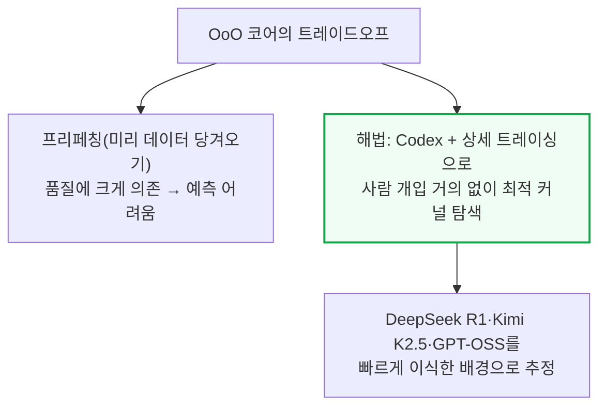

작은 행렬 차원도 지원해 모델·배치 크기 조합에 더 일반적으로 대응하고, 차원 정렬·패딩·타일링 비효율에 덜 민감하다 — TPU·Trainium·Etched 같은 칩은 시스톨릭 어레이가 커서 큰 배치나 딱 나누어떨어지는 모델 차원이 아니면 타일링 비효율이 생긴다. 이런 고정 지연시간 제거 설계 덕에, 이론상으로는 저지연·소배치 추론에서 GPU(발사 지연·배리어 지연·메모리 시스템 지연 등 여러 고정 오버헤드에 발목 잡히는)보다 훨씬 나은 상한 성능을, 대배치·긴 맥락에서도 이론상 최대치에 더 가까운 성능을 낼 여지가 있다. 다만 이론상 상한이 있다고 실제 커널로 그 성능을 다 뽑아내기는 쉽지 않다는 단서가 붙는다 — 그래서 오픈AI의 접근은 ① 모든 워크로드 형태에서 가장 높은 이론적 상한을 갖도록 설계하고, ② 그 상한에 도달하는 커널을 찾는 지루한 작업은 Codex에 맡기는 방식이다. Jalapeño에서 InferenceX 워크로드를 이식한 속도를 보면, 이 접근이 통하고 있다고 볼 만하다. 만약 Jalapeño가 성공한다면, "완벽하고 보편적인 컴파일러·프로그래밍 모델에 집착해야 한다"는 업계의 오랜 통념이 프론티어 AI 모델(Codex 같은) 앞에서 무너질 수 있다는 신호가 된다.

---

## 5. 소프트웨어 - Gluon과 Codex

**📌 핵심:**
- 오픈AI는 Jalapeño 커널(칩을 직접 제어하는 저수준 코드)을 어셈블리 짜듯 손으로 튜닝한다 — 코드가 최대 약 3,000줄에 이르는 것도 있고, 정확성 검사와 자체 제작 새니타이저(버그 탐지 도구)가 뒷받침한다
- 초기 커널 작업은 사람이 직접 개입했지만, 오픈AI가 기업 고객에게도 판매할 계획인 대규모 내부용 Codex로 점차 넘어갔다 — 놀랍게도 DeepSeek를 InferenceX로 벤치마크하기 전까지는 MLA(Multi-head Latent Attention) 커널의 내부 구현조차 없었는데, 커널 엔지니어링 팀의 개입 없이 Codex가 빠르게 작동하는 효율적인 커널을 짜냈다
- Jalapeño는 오픈AI가 Triton을 바탕으로 만든 저수준 언어 Gluon으로 프로그래밍한다 — 가장 독특한 추상화는 "레이아웃"으로, 하드웨어 자원(예: 워프 9번의 5번 레지스터)과 텐서 원소(예: 6행 7열)가 어떻게 대응되는지를 프로그래머가 지정할 수 있게 해, 레이아웃 변환의 정확성을 수학적으로 보장하고 메모리 배치도 최적화한다
- 결론: 2주도 안 되는 사이 특정 상호작용성 지점에서 처리량이 2배 넘게 개선되고, 8일 만에 TP32(텐서 병렬 32분할, 단일 시스템을 넘어 랙 전체 규모로 확장)까지 구현하는 등, 소프트웨어 개선 속도 자체가 이 칩의 핵심 경쟁력이다

---

내부 서빙 엔진의 이름은 "Teacup"이다. Gluon은 Triton의 SPMD(단일 프로그램·다중 데이터, Single Program Multiple Data) 프로그래밍 모델은 그대로 유지하면서, 더 저수준의 프로그래밍 추상화를 노출한다 — 예를 들어 엔비디아 GPU 대상으로는 MMA·TMA 명령, mbarrier(메모리 동기화) 메커니즘 같은 PTX 명령어에 대응하는 API를 제공한다. Gluon의 레이아웃 추상화는 오픈AI가 고안한 레이아웃 대수 체계인 "Linear Layouts"에 기반한다.

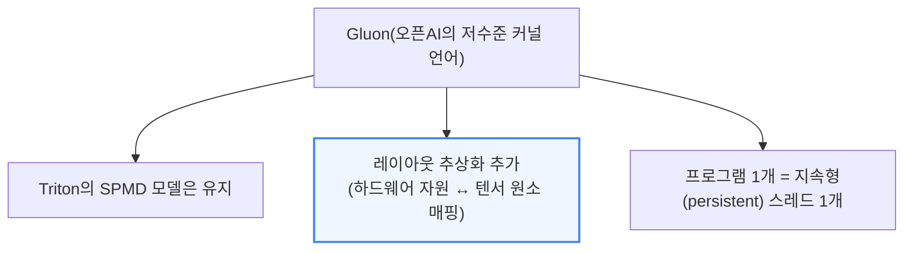

Gluon 프로그램 하나는 지속형(persistent) 스레드 하나에 대응한다. 이는 Jalapeño가 지속형 커널 프로그래밍 패턴(하나의 프로그램이 여러 타일을 처리하고, 하드웨어 스케줄러가 아니라 프로그래머가 작업을 배분하는 방식)에 맞춰져 있다는 뜻이다. 오픈AI가 언급한 TensorInfo는 레이아웃을 명시적으로 인코딩하는 추상화로, Linear Layouts가 뒷받침하는 레이아웃 집합으로 추정된다. 각 코어는 데이터 프리페칭과 분리된 비순차실행 유닛을 지원해, 프로그램이 세마포어(동시 접근 제어 장치)로 잠긴 프리페치된 데이터를 기다리도록 짤 수 있다.

역설적이게도, 지금 엔비디아 GPU에서 돌아가는 오픈AI 모델(GPT 5.6 Sol 등)이 CUDA 해자를 위협하는 칩을 설계하는 데 쓰였다 — 엔비디아 자신의 GPU가 자기 잠재적 후계자를 실시간으로 돕고 있는 셈이다.

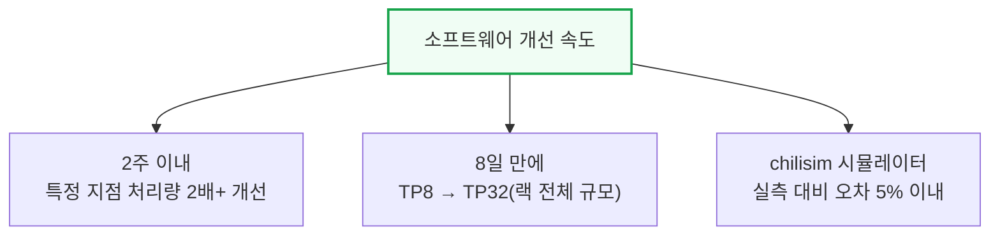

실제 하드웨어를 돌리기 전 성능을 검증하는 시뮬레이터 "chilisim"은 고정폭 트레이스 버스를 써서 실측 하드웨어 대비 오차 5% 이내로 맞는다. A0에서는 트레이싱(추적 기록) 기능이 제한적이었지만 B0에서는 실제 A0 실리콘 구동 데이터를 반영해 크게 개선됐다. 엔지니어들은 Codex CLI가 "Raiku"(별칭 "5.3 Codex Spark")라는 내부 모델을 TPOT(토큰당 출력 시간) 1.2ms로 돌리는 것도 시연했다. Codex가 짠 데모들도 칩 위에서 직접 돌아갔다 — 초당 36프레임의 둠(Doom), FP32 유체역학 시뮬레이션, 마우스로 끄는 "Liquid Light" 시각화까지다.

모델 측면에서는 "gigakernel"이라 부르는 내부 메가커널(하나의 거대한 커널이 기기 내부에서 반복 실행되며 CPU 오버헤드와 실행 지연을 줄이는 방식) 접근을 쓴다. 팀은 테스트 시점 연산(test-time compute) 전략에도 힘을 싣고 있으며, 100만 개 롤아웃(시뮬레이션 실행 경로)을 어떻게 일관되게 활용할지에 특히 관심을 두고 있다.

---

## 6. PD 분리를 하지 않은 이유

**📌 핵심:**
- 엔비디아·AMD GPU는 같은 종류의 칩끼리도 PD(프리필-디코드) 분리로 효율이 크게 오르는데, Jalapeño는 이 방식을 쓰지 않는다 — 이유는 실제 운영 트래픽에서 입력·출력 길이, 동시접속 수, 캐시 적중률 같은 조건이 하루 종일 계속 바뀌기 때문이다
- PD를 나눠두면 프리필 수요가 몰릴 땐 디코드 칩이 놀고, 디코드 수요가 몰릴 땐 그 반대가 된다 — 운영자는 계속 이상적인 분할 비율을 다시 예측하고 양쪽에 여유분을 마련해야 한다
- 분리하면 프리필 칩이 만든 KV 캐시(이전 계산 결과)를 디코드 칩으로 네트워크를 통해 옮겨야 해서, 대역폭 소모·동기화·대기열·새로운 장애 지점이 추가로 생긴다 — 반대로 균일한 칩 풀은 특정 국면에 일부 자원이 덜 쓰이더라도, 모든 칩이 다음 요청을 바로 받을 수 있다
- 결론: 다만 수요가 충분히 크고 안정적이며 예측 가능할 때는(특히 일반 GPU가 국면별로 큰 배치가 필요할 때는) PD 분리가 여전히 이길 수 있다 — 공짜 점심은 아니라는 뜻이다

---

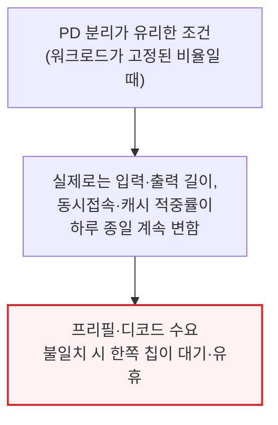

칩을 프리필용·디코드용으로 나눈 뒤 프리필 수요가 너무 많으면 디코드 칩이 놀면서 요청이 밀리고, 디코드 수요가 너무 많으면 그 반대가 된다. 운영자는 계속 올바른 분할 비율을 예측하고, 양쪽에 여유 용량을 마련하고, 항상 움직이는 이상적 비율에 맞춰 재조정해야 한다. 균일한 시스템에서는 특정 국면에 일부 자원이 덜 쓰이더라도 모든 칩이 다음 요청을 받을 수 있다. 반면 분리된 시스템에서는 칩 하나가 통째로 "잘못된 풀"에 속해 있다는 이유만으로 놀 수 있다 — 각 풀 안에서 보는 이용률(로컬 이용률)은 좋아 보여도, 전체 이용률(글로벌 이용률)은 나쁠 수 있다.

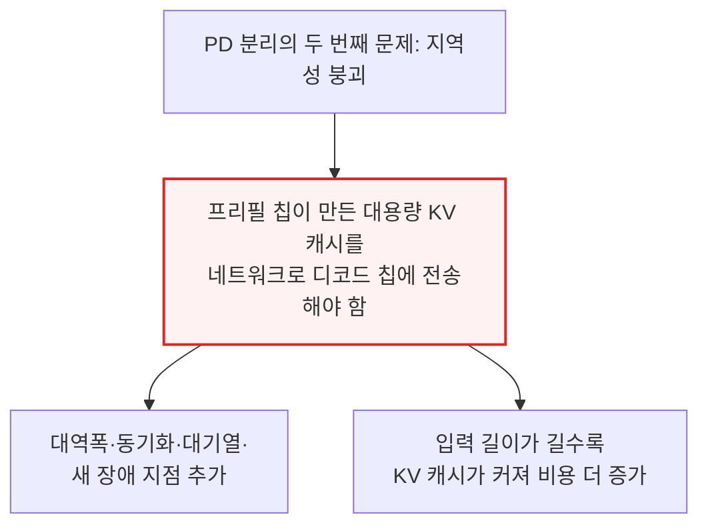

다만 KV 캐시 이동을 피하는 것 자체는 주로 전력·지연시간을 아끼는 최적화다. KV 일부를 옮기는 것을 감수하면, 전력과 요청별 지연시간을 조금 희생하는 대신 하드웨어 이용률을 더 높일 수도 있다. 유동적인(fungible) 칩 풀은 지연시간에 민감한 요청과 처리량 위주의 배치 요청 사이에서 용량을 자유롭게 옮길 수 있지만, 고정 분할은 트래픽 구성이 바뀔 때마다 하드웨어를 묶어놓는다. 맥락 길이가 달라지면 어텐션(주의 메커니즘) 연산과 FFN(피드포워드 네트워크) 연산의 비중도 달라져서, 어떤 고정 하드웨어 비율이든 그 설계점 근처에서만 효율적이다.

같은 제약이 투기적 디코딩에도 적용된다. 초안 모델은 검증자(본 모델)에게 극히 낮은 지연시간으로 후보 토큰을 넘겨줘야 하는데, 이 둘을 서로 다른 전용 풀로 나누면 원래 하나로 긴밀히 맞물려 있던 디코딩 루프가 분산 프로토콜로 바뀌어버려, 통신·조정에 드는 추가 시간이 초안 작성으로 아낀 지연시간을 갉아먹을 수 있다. 두 모델을 같은 칩·같은 저지연 네트워크에 두어야, 애초에 투기적 디코딩을 가치 있게 만드는 지역성이 유지된다. 그럼에도 수요가 충분히 크고 안정적이며 예측 가능한 경우, 특히 일반 GPU가 좋은 처리량을 내려면 국면별로 큰 배치가 필요한 경우에는 PD 분리가 여전히 이길 수 있다.

---

## 7. 랙 시스템 아키텍처 - Katsu·Vindaloo·Chana

**📌 핵심:**
- 랙 하나는 CPU 호스트 랙과 ASIC 랙 두 개로 구성된다 — 호스트 랙엔 "Katsu"(CPU 트레이) 16개, ASIC 랙엔 "Vindaloo"(ASIC 트레이) 16개와 스케일업 스위치 트레이 "Chana" 8개가 들어간다
- Vindaloo 트레이 하나에 Jalapeño ASIC 8개씩, 총 128개가 한 랙에 들어가고, 전력은 호스트 랙 약 50kW(양산 시 31kW)·ASIC 랙 130kW로 두 랙 합쳐 약 160kW다 — GB300 랙 하나를 두 배로 늘린 것과 비슷한 전력 규모다
- 스케일업 네트워크는 랙 안 128개 칩을 잇는 로컬 도메인과, 최대 16개 랙·2,048개 XPU를 잇는 글로벌 도메인 2단으로 구성되고, 구리 백플레인·전기식 스위치·광 케이블·광회로스위치(OCS)를 섞어 쓴다
- 결론: 스케일업 네트워크는 전체 시스템 원가의 약 10%에 불과한데, 이 정도 투자로 앞으로 나올 10\~20조 파라미터급 모델이나 200만\~400만 토큰급 맥락 창까지 대응할 수 있는 여유(optionality)를 사둔 셈이다

---

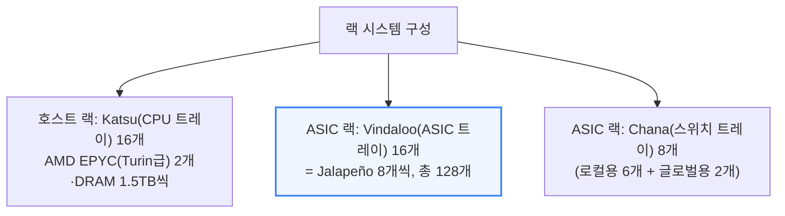

각 Katsu 호스트 트레이는 랙당 E1.S 스토리지 2개, M.2 SSD 2개를 갖추고 400G(200G 2개) 프런트엔드 네트워킹을 지원하며, 오른쪽에 있는 Vindaloo ASIC 트레이 하나와 짝을 이뤄 PCIe DAC 케이블 8개로 랙 앞면을 가로질러 연결된다. 랙 시스템 설계는 셀레스티카(Celestica)와 공동으로 진행했다. ASIC들은 엔비디아의 Oberon과 마찬가지로 구리 케이블 백플레인을 통해 각 Chana 스위치 트레이와 연결된다.

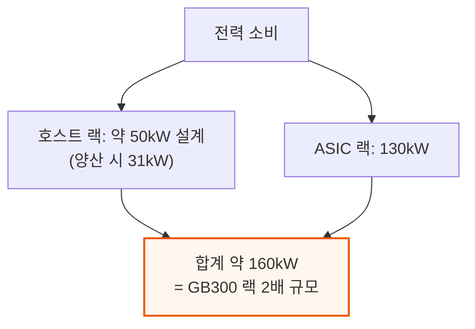

스케일업 네트워크는 로컬 도메인과 글로벌 도메인 두 단으로 나뉜다. 랙 6개 중앙 Chana 스위치가 로컬 도메인을 맡고 각각 102.4Tb/s(초당 테라비트)급 Tomahawk 6 스위치 ASIC 1개씩을 쓴다. 위아래 끝의 Chana 스위치 2개는 글로벌 도메인을 맡으며, Tomahawk 6 스위치 2개씩을 넣어 스위치 트레이당 최대 204.8Tb/s를 낼 것으로 추정된다.

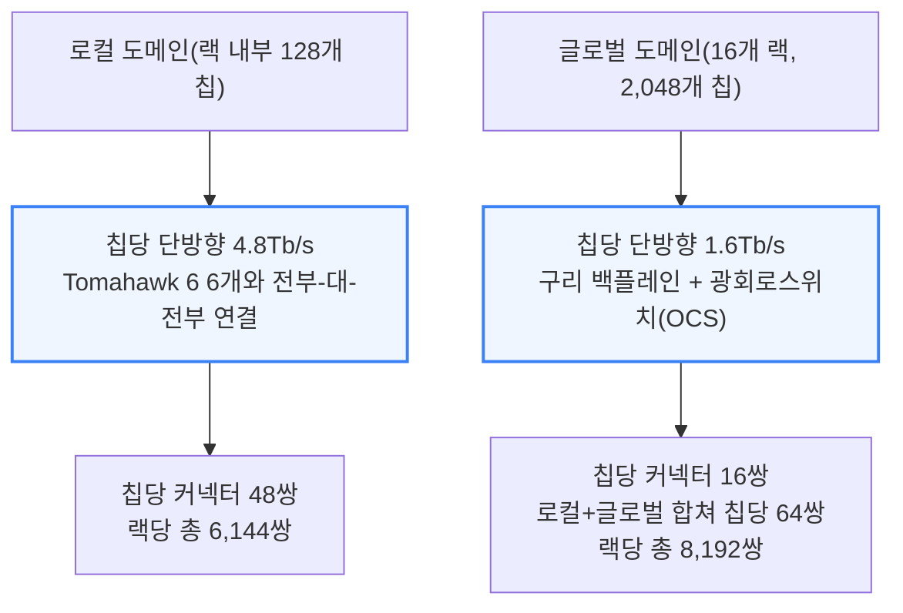

글로벌 도메인은 레일(rail) 8개로만 구성된 구조를 쓴다. 각 칩의 1.6Tb/s 글로벌 대역폭은 구리 백플레인을 거쳐 글로벌 스위치 트레이로 가고, 1.6T 트랜시버(광신호 변환 장치)를 통해 스위치 전면 패널로 나온 뒤 각 랙에 설치된 것으로 추정되는 광회로스위치(OCS)를 거쳐 랙 밖으로 나간다 — 이렇게 16개 랙(128개씩)을 묶어 2,048개 XPU 규모의 스케일업 세계를 만든다.

스케일업 네트워크는 전체 시스템 원가의 약 10%에 불과한데, 이 정도 투자로 앞으로 나올 10\~20조 파라미터급 모델이나 200만\~400만 토큰급 맥락 창까지 대응할 수 있는 유연성을 사둔 셈이다. 배치 단계에서 오픈AI는 네오클라우드(신생 GPU 임대 업체)들과 협력하고 있으며, 도크(하역장)에서 랙까지 설치하는 시간을 최적화하면서 1월까지 데이터센터 파트너들과 함께 신뢰성 데이터를 모으고 있다.

---

*작성 진행률: 약 85% 완료*
*업데이트: 6\~7장(PD 분리를 하지 않은 이유, 랙 시스템 아키텍처) 작성 완료*
