# OpenAI Jalapeño: Better Than Nvidia Blackwell

> **출처**: [SemiAnalysis Newsletter](https://newsletter.semianalysis.com/p/openai-jalapeno-better-than-nvidia)
> **저자**: Bryan Shan, Myron Xie, Jordan Nanos
> **발행일**: 2026-08-25

---

## 📑 목차

### 전체 섹션
1. [서론 - 오픈AI, 자체 설계 추론 칩 "Jalapeño" 공개](#1-서론---오픈ai-자체-설계-추론-칩-jalapeño-공개)
2. [범용 추론 칩 - 스펙과 헤드라인 성능](#2-범용-추론-칩---스펙과-헤드라인-성능)
3. [성능 분석 - 와트당 성능이 핵심인 이유](#3-성능-분석---와트당-성능이-핵심인-이유)
4. [스펙과 아키텍처 파헤치기](#4-스펙과-아키텍처-파헤치기)
5. [소프트웨어 - Gluon과 Codex](#5-소프트웨어---gluon과-codex)
6. [PD 분리를 하지 않은 이유](#6-pd-분리를-하지-않은-이유)
7. [랙 시스템 아키텍처 - Katsu·Vindaloo·Chana](#7-랙-시스템-아키텍처---katsuvindaloochana)
8. [다음 단계와 업계 파급력](#8-다음-단계와-업계-파급력)

---

## 🔑 용어 정리

본문을 순서대로 읽기 전에 알아두면 좋은 용어들입니다. 자세한 수치와 설명은 본문에서 처음 등장하는 위치에 나옵니다.

- **ASIC(주문형 반도체, Application-Specific Integrated Circuit)**: 범용 GPU와 달리 특정 목적(이 경우 LLM 추론)에 맞춰 처음부터 설계한 칩
- **와트당 성능(perf/W)·MW당 토큰(tok/s/MW)**: 전기 1와트, 또는 1메가와트로 토큰을 얼마나 만들어내는지 재는 효율 지표 — 전력이 부족한 시대엔 칩값보다 이 숫자가 매출을 좌우한다
- **BtM(Behind-the-Meter, 계량기 뒤 자가발전)**: 전력회사 송전망을 거치지 않고 데이터센터 부지 안에 가스터빈 등을 세워 직접 전기를 만드는 방식 — 전력망 증설을 기다리지 않아도 된다
- **HBM4(4세대 고대역폭 메모리, High Bandwidth Memory)**: 칩 옆에 쌓아 붙여 데이터를 아주 빠르게 주고받는 메모리 — 세대가 올라갈수록 대역폭(초당 옮기는 데이터량)이 커진다
- **PD 분리(Prefill-Decode Disaggregation)**: 입력을 한번에 처리하는 프리필과 토큰을 하나씩 만드는 디코드를 서로 다른 칩 묶음에 맡기는 방식 — Jalapeño는 이걸 하지 않는다
- **STP·MTP(단일/다중 토큰 예측, Single/Multi-Token Prediction)**: STP는 한 번에 토큰 1개씩, MTP는 여러 개를 한 번에 예측해 속도를 높이는 방식 — Jalapeño의 headline 수치는 더 유리한 MTP 없이 STP만으로 낸 것이다
- **투기적 디코딩(Speculative Decoding)**: 작고 빠른 초안 모델이 먼저 토큰 여러 개를 추측하고, 큰 본 모델이 한 번에 검증해 속도를 높이는 기법
- **Gluon**: 오픈AI가 Triton을 바탕으로 만든 저수준 커널(칩을 직접 제어하는 코드) 프로그래밍 언어 — 하드웨어 자원과 데이터가 어떻게 배치되는지(레이아웃)까지 프로그래머가 직접 지정할 수 있다

---

## 1. 서론 - 오픈AI, 자체 설계 추론 칩 "Jalapeño" 공개

**📌 핵심:**
- 오픈AI는 지난 몇 년간 조용히 "Jalapeño"라는 LLM 추론 전용 ASIC(주문형 반도체)를 만들어 왔고, Hot Chips(반도체 업계 콘퍼런스)에서 처음 공식 발표했다 — SemiAnalysis는 오픈AI의 초청으로 칩을 직접 보고, 연구소를 방문해 실물을 확인하고, 자체 벤치마크 InferenceX로 성능을 측정했다
- 설계는 2024년 중반 시작해 약 16개월 만에 제조 테이프아웃(설계 확정본을 파운드리에 넘기는 시점)까지 끝냈다 — ASIC 개발 주기치고 극히 빠른 속도다
- 보통 1세대 칩은 경쟁력이 없는 게 일반적인데, Jalapeño는 이 통념을 깨고 SemiAnalysis가 테스트한 모든 엔비디아·AMD·구글 칩을 여러 오픈소스 모델에서 앞섰다
- 결론: 오픈AI는 특정 부분만 파고드는 특화 칩이 아니라, 모든 시나리오에서 고르게 좋은 성능을 내는 범용 칩을 극단적인 하드웨어·소프트웨어 공동설계(codesign)로 만들어냈다

---

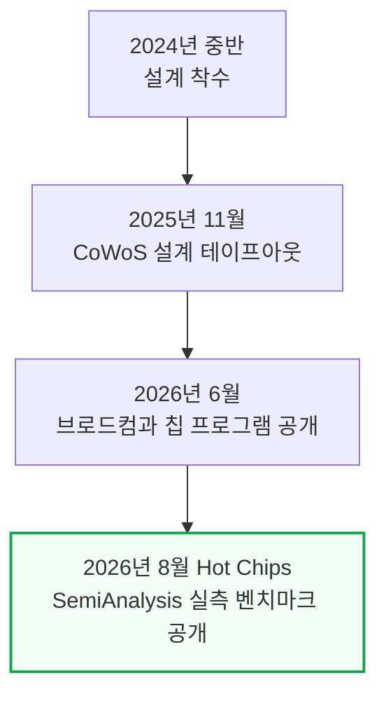

장난삼아 오픈AI는 이 칩에서 둠(Doom) 게임을 돌리는 모습도 보여줬는데, Codex(오픈AI의 코딩 에이전트) 프롬프트만으로 이식한 것이었다.

---

## 2. 범용 추론 칩 - 스펙과 헤드라인 성능

**📌 핵심:**
- Jalapeño는 오픈AI 자사 모델 전용이 아니라 다양한 모델·워크로드를 두루 잘 돌리는 범용 칩이다 — InferenceX 벤치마크를 오픈AI 엔지니어와 함께 현장에서 직접 실행해 확인했다
- 헤드라인 결과: MW(메가와트)당 토큰 처리량에서 Jalapeño는 다중 토큰 예측(MTP, 한 번에 토큰 여러 개를 예측해 속도를 높이는 기법)을 켜지 않고도, MTP를 켠 다른 모든 칩(각 제품군 최고 구성)을 앞섰다
- 저지연 구간과 고처리량 구간 모두에서 블랙웰을 앞섰고, 똑같이 STP(단일 토큰 예측)로만 비교하면 격차가 더 벌어진다 — DeepSeek R1에서 동시접속 1명 기준 초당 사용자당 700토큰 이상을 냈다
- 결론: 이 수치는 투기적 디코딩도, PD(프리필-디코드) 분리도 없이 순수 STP만으로 낸 것이라 더 인상적이다 — Kimi-K2.5·GPT-OSS에서도 초당 사용자당 약 1,400토큰을 기록했고, 정확도(GSM8k 평가)도 엔비디아 칩과 대등했다

---

Jalapeño는 HBM4를 탑재해 엔비디아·AMD 최신 플래그십 GPU와 스펙만으로도 견줄 만하다 — HBM4는 엔비디아·AMD도 막 도입한 세대라, 1세대 ASIC이 쓴다는 것 자체가 이례적이다.

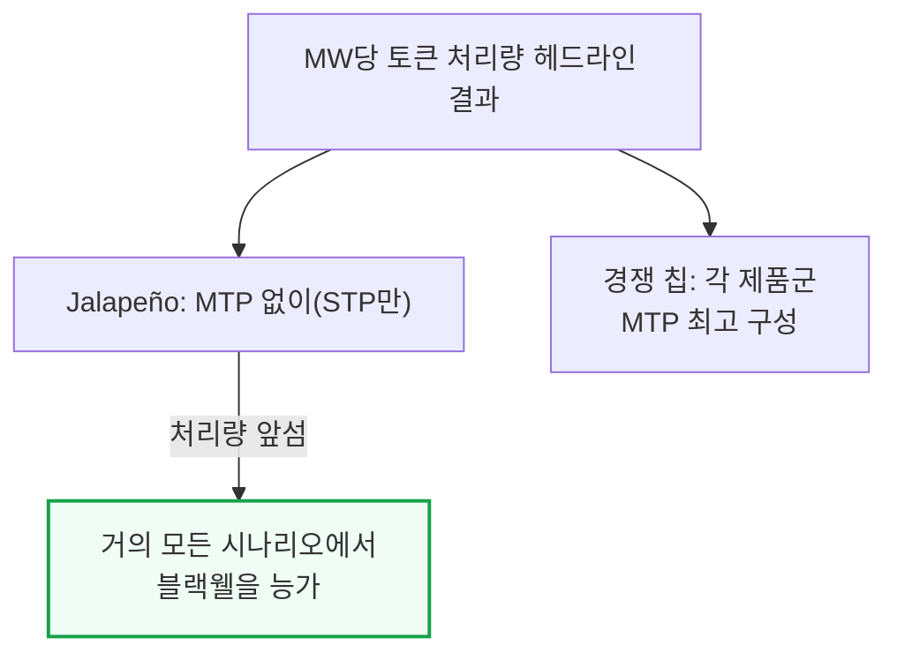

유보 조건 세 가지도 있다.

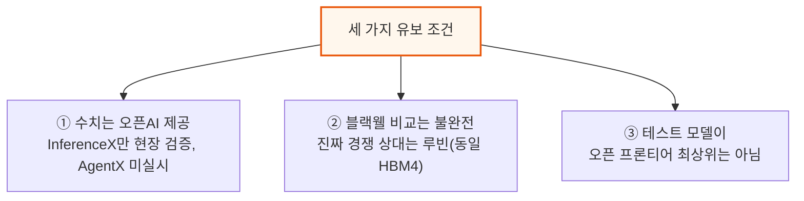

① SemiAnalysis는 InferenceX 실행만 현장에서 검증했고, AgentX(멀티턴·긴 맥락 벤치마크) 결과는 아직 못 받았다 — AgentX는 실제 운영 트래픽의 캐시 재사용 패턴을 더 잘 반영해 SemiAnalysis가 선호하는 비교 기준이다.

② Jalapeño의 진짜 경쟁 상대는 같은 HBM4를 쓰는 루빈(Rubin)이다 — 베라 루빈은 이미 고객사에 출하 중인데 Jalapeño는 아직 엔지니어링 샘플 단계이고, 베라 루빈 NVL72는 GB200 NVL72 대비 MW당 성능이 5.4배다(SemiAnalysis 지난달 분석).

③ 엔비디아·AMD는 AgentX로 DeepSeek V4 Pro·Kimi K3 같은 더 큰 모델의 결과를 냈다 — 모델이 크고 최신일수록 새 칩 이식이 어렵지만, Jalapeño에서 돌린 모델도 결코 작은 편은 아니다.

---

## 3. 성능 분석 - 와트당 성능이 핵심인 이유

**📌 핵심:**
- 오픈AI가 와트당 성능(perf/W)에 설계 초점을 맞추는 이유는 단순하다 — 지금 오픈AI를 막는 건 예산이나 부지가 아니라 데이터센터에 공급되는 전력(MW)이라, MW당 토큰이 곧 매출과 직결된다
- 엔비디아 CEO 젠슨 황도 2026년 컴퓨텍스에서 "1기가와트(GW)의 전력이 있다면 와트당 처리량이 곧 매출"이라 말했고, 핫칩스 2026 베라 발표에서도 같은 그래프로 "데이터센터는 지금 전력이 병목"이라 재확인했다
- 전력망 증설은 GPU 조달보다 훨씬 느려서, 데이터센터는 송전망을 거치지 않고 부지 안에서 직접 발전하는 BtM(계량기 뒤 자가발전)에 점점 더 의존한다 — xAI 콜로서스 2가 대표 사례다
- 결론: MW당 토큰은 결국 "줄(1와트=1초당 1줄)당 토큰"과 같아서, 전기를 토큰으로 바꾸는 효율 그 자체를 보여준다 — 이 기준으로도 Jalapeño는 루빈을 앞선다

---

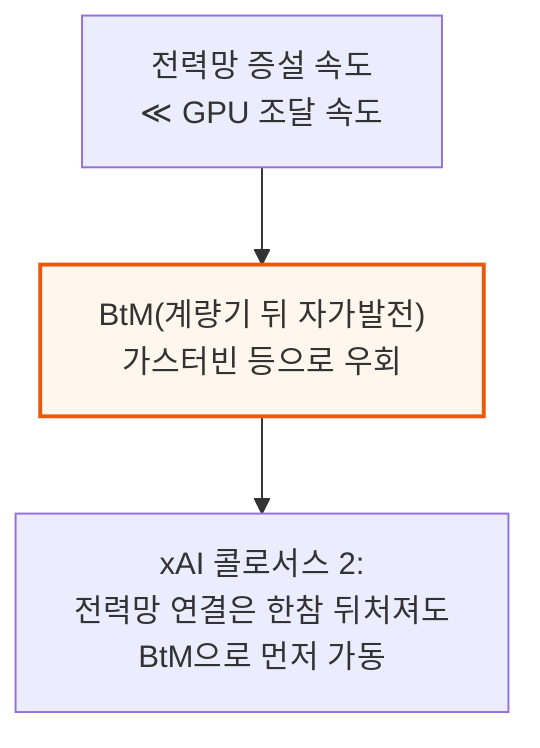

MW당 토큰 처리량은 소프트웨어 성숙도가 비슷한 시점끼리 맞춰야 공정해, GB200 2025년 초기·베라 루빈 2026년 7월·Jalapeño 오늘 결과를 나란히 비교한다. 오픈AI·루빈 모두 아직 미성숙 단계라 성능은 계속 오를 전망이다.

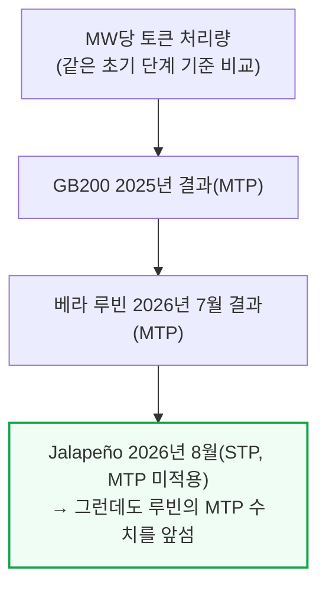

달러당 출력 토큰(perf/TCO, 총소유비용 대비 성능)으로 보면 루빈과 Jalapeño는 거의 대등하다. 다만 루빈의 수치는 투기적 디코딩을 적용한 결과이고, Jalapeño는 적용하지 않은 결과라는 차이가 있다.

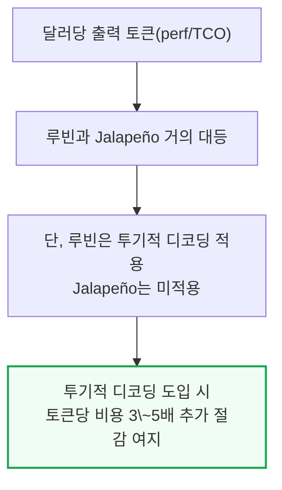

이 비용 우위의 일부는 엔비디아의 높은 마진을 브로드컴의 상대적으로 낮은 마진으로 바꾼 데서 나오지만, 전부는 아니다 — 메타·마이크로소프트 AI ASIC이 더 오래 준비하고도 궤도에 못 오른 게 그 증거다.

오픈AI는 프리필과 디코드를 나누지 않고 초안 모델과 본 모델이 같은 칩·네트워크를 공유한다(이유는 6장 참고) — 이 균일한(homogeneous) 칩 풀 구조로 낸 결과는 다음과 같다.

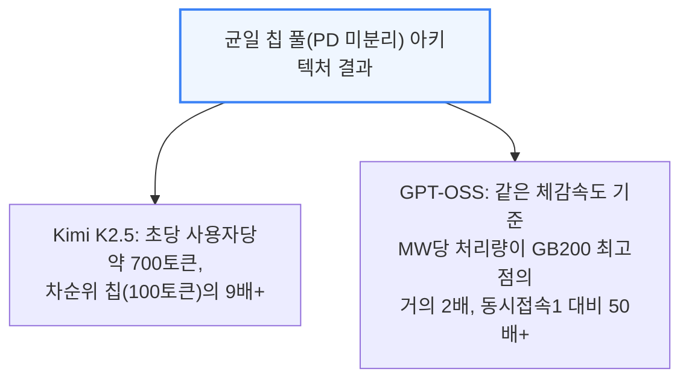

Kimi K2.5는 Cursor의 Composer 2.5가 기반한 모델이며, GPT-OSS의 고동시접속 지점은 EP8(전문가 병렬화 8분할) 구성이다.

다만 이 결과들도 8k1k 벤치마크일 뿐이고 아직 AgentX 결과는 없다는 점은 그대로 남는 유보 조건이다 — 멀티턴·긴 맥락 워크로드는 서빙 스택의 더 많은 부분(라우터, 프리픽스 캐시 등)에 부하를 건다.

---

## 4. 스펙과 아키텍처 파헤치기

**📌 핵심:**
- 지금까지 결과는 프로그램 시작 9개월째인 A0 스테핑(칩 제조 리비전) 기준이고, 와트당 성능을 A0 대비 약 25% 더 끌어올린 B0 스테핑이 벌써 파운드리(팹)에 들어가 있다
- B0는 TSMC N3P 공정의 단일 레티클(노광 1회 최대 면적) 크기 연산 다이에서 MXFP4 기준 13.4 PFLOPs(초당 1,340조 회 연산)를 내는데, 같은 크기·같은 공정의 루빈 연산 다이(NVFP4 기준 17.5 PFLOPs)보다는 낮지만, Jalapeño의 TDP(설계 최대 소비전력)가 700W로 루빈(900\~1,150W)보다 훨씬 낮다는 점을 감안하면 상당히 준수한 수치다
- HBM4를 엔비디아·AMD 다음으로, TPU·Trainium보다도 먼저 채택했다 — 패키지당 메모리 대역폭 15.4TB/s로 HBM3E를 쓰는 다른 칩들을 모두 앞서고, 10Gbps 핀 속도로 루빈의 9.6Gbps보다도 근소하게 앞선다(HBM은 삼성 공급 추정)
- 결론: 2025년 11월 테이프아웃 이후 겨우 3개월의 실리콘 브링업(실물 칩 구동 검증) 기간으로 이 정도 결과를 낸 것은, 소프트웨어 스택을 아예 처음부터 새로 짠 팀치고는 이례적인 속도다 — 반면 루빈은 한 달 먼저 테이프아웃했는데도 코어위브 엔지니어링 샘플 결과만 나와 있어, "CUDA 해자(moat, 경쟁사가 넘기 힘든 진입장벽)가 죽어가고 있다"는 평가까지 나온다

---

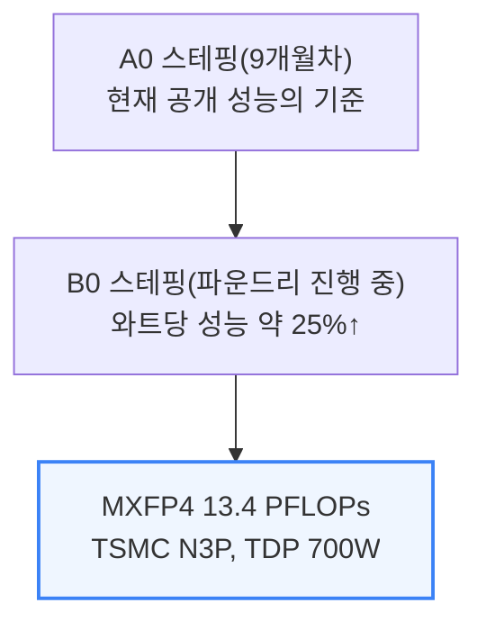

Jalapeño는 추론 전용이라 TDP를 끌어올릴 필요가 없어, 이 격차는 준수한 성적이다. 와트당 HBM 대역폭·FLOPs 모두 최고 수준이며 1,800W 루빈 Max-Q와 맞먹는다.

칩 밖 I/O는 N3E 칩렛의 800G SerDes 32레인이 맡아, 24레인은 랙 내부 로컬 스케일업에, 8레인은 글로벌 스케일업에 쓴다(자세한 랙 네트워크는 7장).

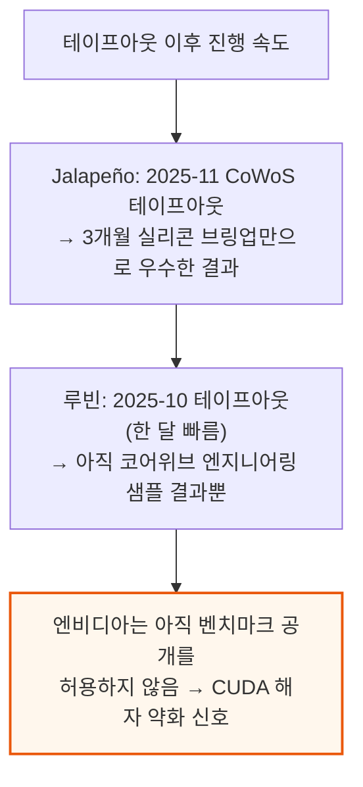

이 격차는 하드웨어가 열등해서가 아니라 소프트웨어 브링업이 빨랐기 때문이다 — 백지에서 설계를 시작한 게 오히려 유리했을 수 있다. 현재는 엔지니어링 샘플 단계이며, 양산은 2027년에 걸쳐 늘어 연말에 물량 대부분이 나온다.

### Jalapeño 아키텍처

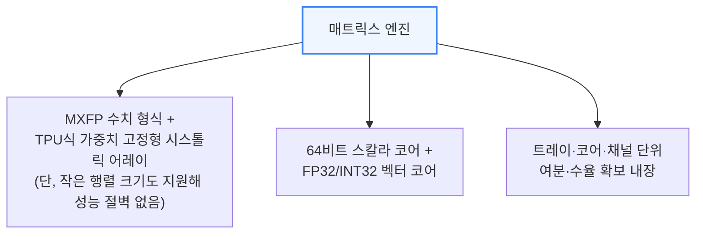

오픈AI는 AI를 활용한 칩 설계로 SIMD 면적을 8%, 매트릭스 엔진 면적을 10% 줄였고 타이밍·전력도 함께 개선했다.

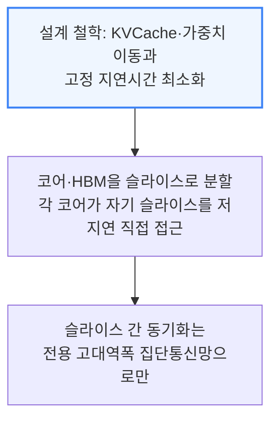

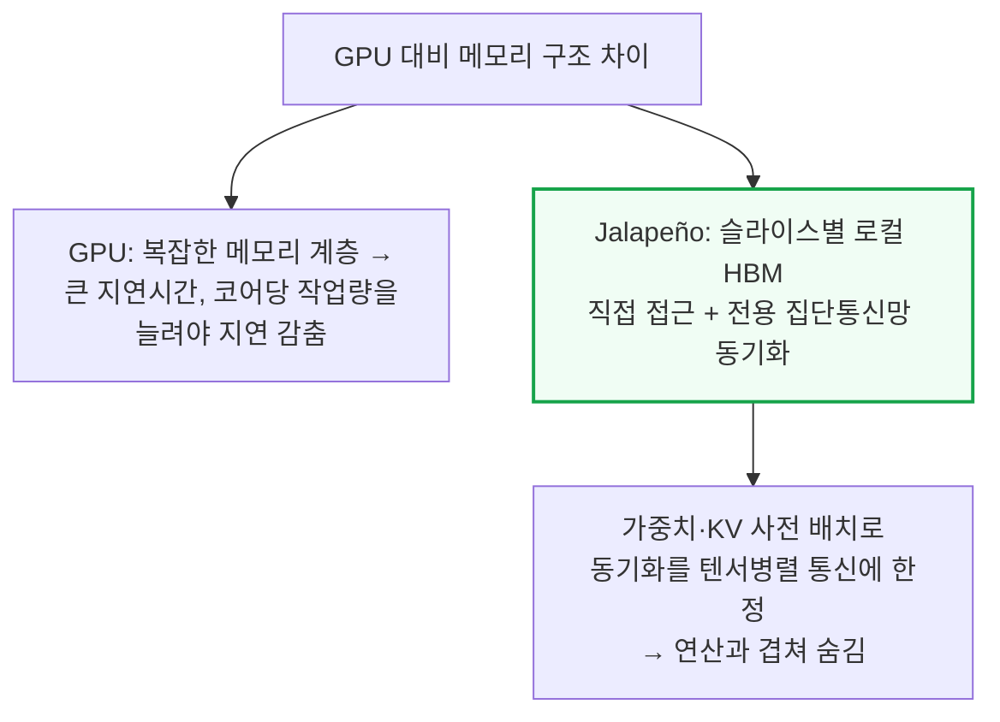

범용 통신용 NoC(칩 내부 통신망)도 별도로 있어, 이 단순화된 구조로 엔비디아·구글보다 전력을 아끼고 성능도 높인다.

코어는 L1 캐시를 갖춘 비순차실행(OoO) 코어다 — 소프트웨어 관리 스크래치패드를 쓰는 다른 가속기와 달리 배리어 지연 같은 고정 오버헤드를 피한다.

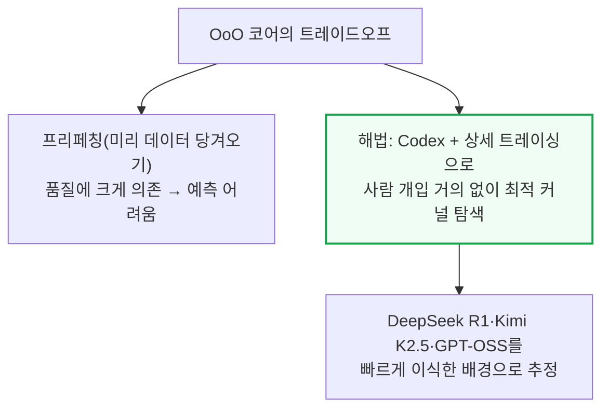

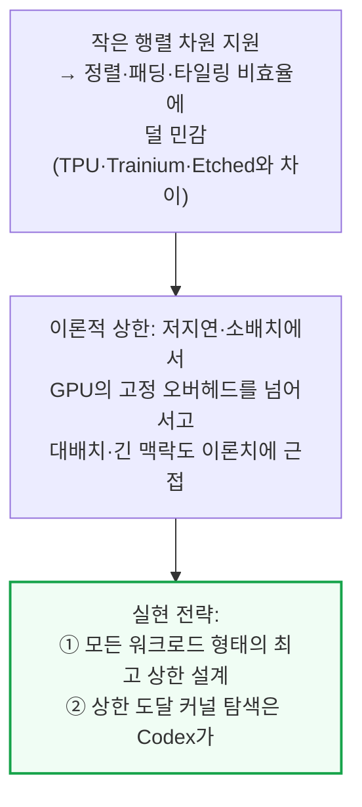

Jalapeño의 InferenceX 이식 속도를 보면 이 접근은 통하고 있다.

---

## 5. 소프트웨어 - Gluon과 Codex

**📌 핵심:**
- 오픈AI는 Jalapeño 커널(칩을 직접 제어하는 저수준 코드)을 어셈블리 짜듯 손으로 튜닝한다 — 코드가 최대 약 3,000줄에 이르는 것도 있고, 정확성 검사와 자체 제작 새니타이저(버그 탐지 도구)가 뒷받침한다
- 초기 커널 작업은 사람이 직접 개입했지만, 오픈AI가 기업 고객에게도 판매할 계획인 대규모 내부용 Codex로 점차 넘어갔다 — 놀랍게도 DeepSeek를 InferenceX로 벤치마크하기 전까지는 MLA(Multi-head Latent Attention) 커널의 내부 구현조차 없었는데, 커널 엔지니어링 팀의 개입 없이 Codex가 빠르게 작동하는 효율적인 커널을 짜냈다
- Jalapeño는 오픈AI가 Triton을 바탕으로 만든 저수준 언어 Gluon으로 프로그래밍한다 — 가장 독특한 추상화는 "레이아웃"으로, 하드웨어 자원(예: 워프 9번의 5번 레지스터)과 텐서 원소(예: 6행 7열)가 어떻게 대응되는지를 프로그래머가 지정할 수 있게 해, 레이아웃 변환의 정확성을 수학적으로 보장하고 메모리 배치도 최적화한다
- 결론: 2주도 안 되는 사이 특정 상호작용성 지점에서 처리량이 2배 넘게 개선되고, 8일 만에 TP32(텐서 병렬 32분할, 단일 시스템을 넘어 랙 전체 규모로 확장)까지 구현하는 등, 소프트웨어 개선 속도 자체가 이 칩의 핵심 경쟁력이다

---

내부 서빙 엔진의 이름은 "Teacup"이다. Gluon은 Triton의 SPMD(단일 프로그램·다중 데이터) 모델은 유지하면서 더 저수준 추상화를 노출한다 — 엔비디아 GPU 대상으로는 MMA·TMA·mbarrier 같은 PTX 명령어 대응 API를 제공한다. 레이아웃 추상화는 오픈AI가 고안한 대수 체계 "Linear Layouts"에 기반한다.

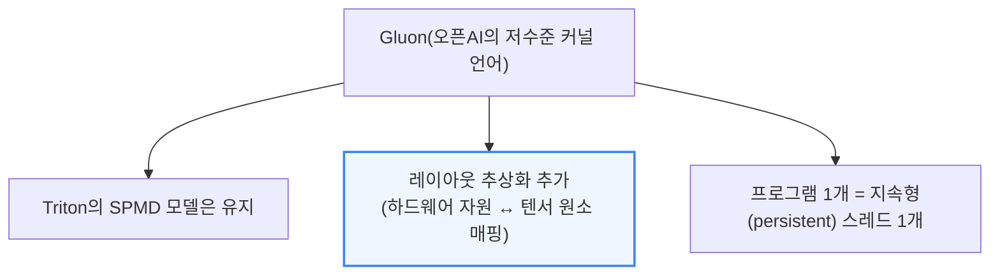

Gluon 프로그램 1개는 지속형(persistent) 스레드 1개에 대응해, 하드웨어 스케줄러가 아니라 프로그래머가 작업을 배분하는 지속형 커널 패턴에 맞춰져 있다. TensorInfo는 레이아웃을 명시적으로 인코딩하는 추상화이며, 각 코어는 세마포어로 잠긴 프리페치 데이터를 기다리는 비순차실행 유닛을 지원한다.

역설적이게도, 엔비디아 GPU에서 돌아가는 오픈AI 모델(GPT 5.6 Sol 등)이 CUDA 해자를 위협하는 칩 설계에 쓰였다.

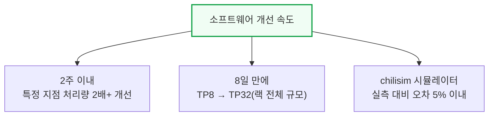

시뮬레이터 "chilisim"은 실측 대비 오차 5% 이내를 내며, A0에서 제한적이던 트레이싱 기능이 B0에서 크게 개선됐다.

Codex CLI는 내부 모델 "Raiku"(5.3 Codex Spark)를 TPOT(토큰당 출력 시간) 1.2ms로 구동했고, 칩 위에서 둠(36FPS)도 직접 돌렸다.

모델 측면에서는 "gigakernel"이라는 내부 메가커널(하나의 거대한 커널이 기기 내부에서 반복 실행돼 CPU 오버헤드를 줄이는 방식)을 쓰며, 100만 개 롤아웃을 일관되게 활용하는 테스트 시점 연산 전략에도 힘을 싣고 있다.

---

## 6. PD 분리를 하지 않은 이유

**📌 핵심:**
- 엔비디아·AMD GPU는 같은 종류의 칩끼리도 PD(프리필-디코드) 분리로 효율이 크게 오르는데, Jalapeño는 이 방식을 쓰지 않는다 — 이유는 실제 운영 트래픽에서 입력·출력 길이, 동시접속 수, 캐시 적중률 같은 조건이 하루 종일 계속 바뀌기 때문이다
- PD를 나눠두면 프리필 수요가 몰릴 땐 디코드 칩이 놀고, 디코드 수요가 몰릴 땐 그 반대가 된다 — 운영자는 계속 이상적인 분할 비율을 다시 예측하고 양쪽에 여유분을 마련해야 한다
- 분리하면 프리필 칩이 만든 KV 캐시(이전 계산 결과)를 디코드 칩으로 네트워크를 통해 옮겨야 해서, 대역폭 소모·동기화·대기열·새로운 장애 지점이 추가로 생긴다 — 반대로 균일한 칩 풀은 특정 국면에 일부 자원이 덜 쓰이더라도, 모든 칩이 다음 요청을 바로 받을 수 있다
- 결론: 다만 수요가 충분히 크고 안정적이며 예측 가능할 때는(특히 일반 GPU가 국면별로 큰 배치가 필요할 때는) PD 분리가 여전히 이길 수 있다 — 공짜 점심은 아니라는 뜻이다

---

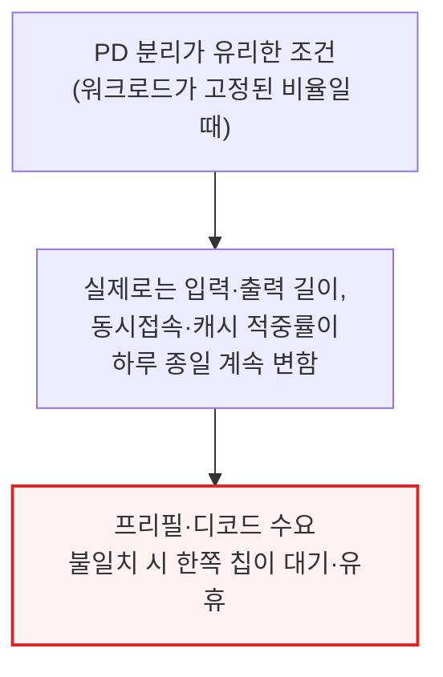

프리필 수요가 몰리면 디코드 칩이 놀고 그 반대도 마찬가지다 — 운영자는 계속 분할 비율을 예측하고 양쪽에 여유 용량을 마련해야 한다. 균일한 시스템은 일부 자원을 덜 쓰더라도 모든 칩이 다음 요청을 받지만, 분리된 시스템은 칩이 "잘못된 풀"에 속했다는 이유만으로 놀 수 있다 — 로컬 이용률은 좋아 보여도 전체 이용률은 나쁠 수 있다.

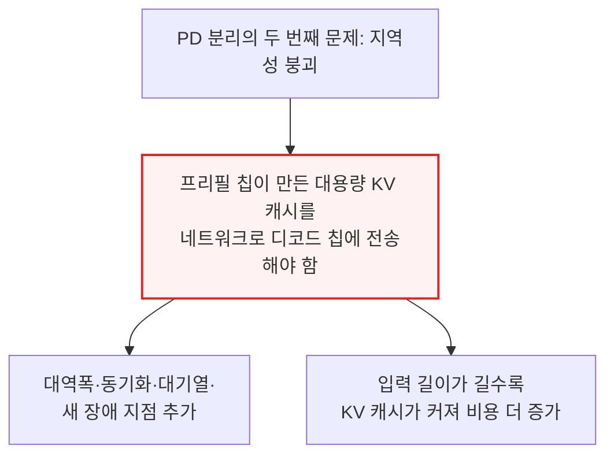

다만 KV 이동을 피하는 것 자체는 전력·지연시간 최적화다 — KV 일부 이동을 감수하면 전력·지연시간을 조금 희생하고 이용률을 높일 수도 있다.

유동적 칩 풀은 지연시간 민감 요청과 처리량 위주 요청 사이에서 용량을 옮기지만, 고정 분할은 트래픽이 바뀔 때마다 하드웨어를 묶어놓는다.

같은 제약이 투기적 디코딩에도 적용된다 — 초안 모델과 검증 모델을 분리하면 긴밀했던 디코딩 루프가 분산 프로토콜로 바뀌어, 통신·조정 시간이 초안 작성으로 아낀 지연시간을 갉아먹을 수 있다. 두 모델을 같은 칩·저지연 네트워크에 둬야 투기를 가치 있게 만드는 지역성이 유지된다. 다만 수요가 충분히 크고 안정적일 때는 PD 분리가 여전히 이길 수 있다.

---

## 7. 랙 시스템 아키텍처 - Katsu·Vindaloo·Chana

**📌 핵심:**
- 랙 하나는 CPU 호스트 랙과 ASIC 랙 두 개로 구성된다 — 호스트 랙엔 "Katsu"(CPU 트레이) 16개, ASIC 랙엔 "Vindaloo"(ASIC 트레이) 16개와 스케일업 스위치 트레이 "Chana" 8개가 들어간다
- Vindaloo 트레이 하나에 Jalapeño ASIC 8개씩, 총 128개가 한 랙에 들어가고, 전력은 호스트 랙 약 50kW(양산 시 31kW)·ASIC 랙 130kW로 두 랙 합쳐 약 160kW다 — GB300 랙 하나를 두 배로 늘린 것과 비슷한 전력 규모다
- 스케일업 네트워크는 랙 안 128개 칩을 잇는 로컬 도메인과, 최대 16개 랙·2,048개 XPU를 잇는 글로벌 도메인 2단으로 구성되고, 구리 백플레인·전기식 스위치·광 케이블·광회로스위치(OCS)를 섞어 쓴다
- 결론: 스케일업 네트워크는 전체 시스템 원가의 약 10%에 불과한데, 이 정도 투자로 앞으로 나올 10\~20조 파라미터급 모델이나 200만\~400만 토큰급 맥락 창까지 대응할 수 있는 여유(optionality)를 사둔 셈이다

---

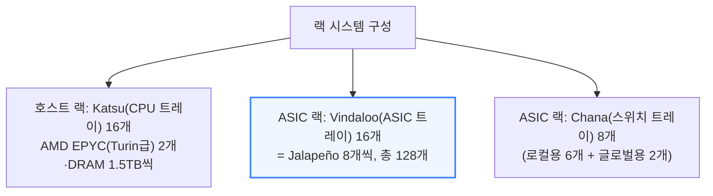

각 Katsu 트레이는 랙당 E1.S 2개·M.2 SSD 2개, 400G 프런트엔드 네트워킹을 갖추고, 오른쪽 Vindaloo 트레이와 PCIe DAC 케이블 8개로 연결된다. 랙 설계는 셀레스티카와 공동 진행했고, ASIC은 엔비디아 Oberon처럼 구리 케이블 백플레인으로 Chana 스위치와 연결된다.

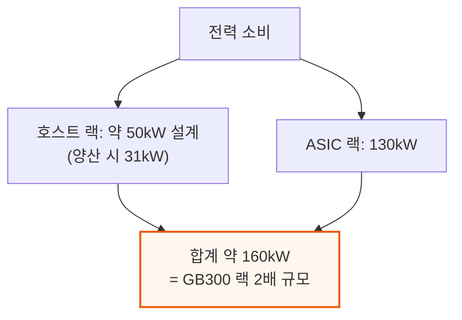

랙 중앙 Chana 스위치 6개(각 102.4Tb/s Tomahawk 6 1개)가 로컬 도메인을, 위아래 끝 Chana 2개가 글로벌 도메인을 맡으며 스위치당 최대 204.8Tb/s를 낼 것으로 추정된다.

```mermaid
flowchart TD
    Local["로컬 도메인(랙 내부 128개 칩)"] --> LocalBW["칩당 단방향 4.8Tb/s<br/>Tomahawk 6 6개와 전부-대-전부 연결"]
    LocalBW --> LocalDP["칩당 커넥터 48쌍<br/>랙당 총 6,144쌍"]

    Global["글로벌 도메인(16개 랙, 2,048개 칩)"] --> GlobalBW["칩당 단방향 1.6Tb/s<br/>구리 백플레인 + 광회로스위치(OCS)"]
    GlobalBW --> GlobalDP["칩당 커넥터 16쌍<br/>로컬+글로벌 합쳐 칩당 64쌍<br/>랙당 총 8,192쌍"]

    style LocalBW fill:#eff6ff,stroke:#3b82f6,stroke-width:2px
    style GlobalBW fill:#eff6ff,stroke:#3b82f6,stroke-width:2px
```

글로벌 도메인은 레일(rail) 8개 구조다 — 각 칩의 1.6Tb/s는 백플레인→글로벌 스위치→1.6T 트랜시버→(추정) 랙별 광회로스위치(OCS)를 거쳐 나가, 16개 랙·2,048 XPU 규모를 만든다.

스케일업 네트워크는 전체 시스템 원가의 약 10%뿐인데, 이 투자로 10\~20조 파라미터 모델이나 200만\~400만 토큰 맥락 창까지 대응할 여유를 사둔 셈이다. 배치 단계에서는 네오클라우드와 협력하며, 도크-투-랙 설치 시간을 최적화하면서 1월까지 데이터센터 파트너들과 신뢰성 데이터를 모으고 있다.

---

## 8. 다음 단계와 업계 파급력

**📌 핵심:**
- 다음 목표는 100MW 규모다 — 남은 걸림돌은 대부분 소프트웨어가 아니라 하드웨어다(얼마나 많이 생산할 수 있는지, 데이터센터를 얼마나 잘 배치·운영하는지, 모니터링·복원력을 어떻게 갖추는지)
- 새로운 AI 실리콘 진영이 사실상 등장했다 — 오픈AI는 엔비디아 GPU를 가장 많이 쓰는 곳 중 하나이면서도, 앤트로픽처럼 AMD GPU·Trainium에 이어 이번엔 자체 ASIC까지 확보해 컴퓨트 조달을 다변화하고 있다
- 세레브라스에도 영향이 크다 — DeepSeek R1에서 8칩 Jalapeño 시스템이 이미 투기적 디코딩 없이 초당 사용자당 700토큰 이상을 냈는데, 오픈AI 자체 가이던스(MTP로 3\~5배 향상)를 적용하면 2,000\~3,500토큰까지 갈 수 있어 세레브라스 CS-4의 4,000토큰과 비슷한 사정권에 든다
- 결론: 오픈AI가 짧은 기간에 이 정도 성과를 내면서 앤트로픽도 자체 ASIC 팀을 꾸리고 있지만, 메타 MTIA·마이크로소프트 MAIA가 훨씬 오래 준비하고도 궤도에 오르지 못했다는 사실은 "프로그램이 있다고 성공이 보장되지는 않는다"는 것을 보여준다

---

Jalapeño의 첫 양산 토큰(실제 서비스에 쓰이는 첫 출력)이 곧 나온다. 다음 목표는 100MW 규모이며, 걸림돌은 대부분 하드웨어다 — 생산량, 데이터센터 배치·운영, 모니터링·복원력이 관건이다. 소프트웨어는 이미 증명됐고, 내부 모델 기준으로는 초기 격차가 금방 따라잡히는 수준이다.

```mermaid
flowchart TD
    Next["다음 목표: 100MW 규모"] --> Hurdle["남은 걸림돌은 대부분 하드웨어<br/>(생산량·배치·운영·모니터링·복원력)"]
    Hurdle --> SW["소프트웨어는 이미 증명됨<br/>내부 모델 기준 격차는 금방 따라잡힘"]

    style Hurdle fill:#fff7ed,stroke:#ea580c,stroke-width:2px
```

### 엔비디아·AMD·세레브라스에 미치는 직접적 영향

Jalapeño와 그 후속작들은 엔비디아·AMD GPU와 어깨를 나란히 하는 쪽으로 다가서고 있다 — 이미 AMD·TPU·Trainium이 갉아먹은 엔비디아 점유율에 경쟁이 한층 더 넓어진 것이다. 다만 엔비디아도 순순히 물러설 곳은 아니다.

```mermaid
flowchart TD
    Diversify["오픈AI의 컴퓨트 다변화 순서"] --> Step1["① AMD GPU 계약"]
    Step1 --> Step2["② AWS Trainium 도입"]
    Step2 --> Step3["③ 자체 ASIC(Jalapeño)"]

    style Step3 fill:#eff6ff,stroke:#3b82f6,stroke-width:2px
```

```mermaid
flowchart TD
    Leverage["자체 실리콘 = 협상력"] --> Threat["짧은 기간에 플래그십 루빈을<br/>능가한 것 자체가 실질적 위협<br/>(추론 함대 일부 대체 가능)"]
    Threat --> Margin["대체 시 엔비디아 고마진이<br/>브로드컴 저마진(그래도 높음)으로 이동"]

    style Threat fill:#fff7ed,stroke:#ea580c,stroke-width:2px
```

Codex 수요가 워낙 강해 어떤 실리콘 파트너와 손잡아도 실적이 좋아 보인다 — 성장이 계속되면 오픈AI는 손에 넣을 수 있는 칩을 전부 끌어모아야 한다.

엔비디아의 공급망 지배력은 여전히 강력하지만, 아무도 못 따라 하는 극단적 실리콘 공동설계를 포함해 하드웨어 혁신 속도를 계속 유지해야 하는 처지다.

엔비디아 Dynamo 스택은 프리필·디코드를 별도 GPU 풀로 나누고 보통 엔비디아 GPU가 프리필을 맡는 걸 전제한다 — 세레브라스·Groq가 디코드를 가져가도 프리필 풀은 지킨다는 전제인데, Jalapeño는 전용 프리필 함대 없이 균일한 풀 하나만 써서 이 전제를 부정한다.

```mermaid
flowchart TD
    AMD["AMD 리스크"] --> Stake["오픈AI+파트너가 AMD GPU 6GW 매입 시<br/>오픈AI가 AMD 지분 10%+ 보유 가능"]
    Stake --> Speed["자체 ASIC이 9개월 만에<br/>AMD가 4년째(챗GPT 이후) 못한<br/>'엔비디아 GPU 능가'를 해냄"]

    style Speed fill:#fef2f2,stroke:#dc2626,stroke-width:2px
```

Jalapeño 대규모 배치 여부와 무관하게, 엔비디아 고객사 입장에선 ASIC 프로그램을 시작해 R&D에 수억 달러를 쓰고 Hot Chips에서 발표해 엔비디아를 긴장시킨 뒤 더 많은 자금·보증(수십억 달러 규모)을 받아내는 게 합리적 선택이 됐다 — 칩이 성공하든 실패하든 오픈AI는 이득을 본다.

### 세레브라스는 여전히 필요한가

DeepSeek R1에서 8칩 Jalapeño는 STP만으로 이미 초당 사용자당 700토큰 이상을 냈다 — GPU로는 도달하기 어려운 수준이다. 오픈AI 가이던스대로 MTP가 3\~5배를 더해준다면 약 2,000\~3,500토큰까지 갈 수 있다는 계산이 나온다.

```mermaid
flowchart TD
    Base["8칩 Jalapeño(STP만): 700tok/s/user+"] --> MTP["오픈AI 가이던스: MTP 적용 시 3\~5배"]
    MTP --> Range["추정 상한: 약 2,000\~3,500tok/s/user"]
    Range --> Cerebras["세레브라스 CS-4 자체 발표치<br/>4,000tok/s/user와 비슷한 사정권"]

    style Range fill:#f0fdf4,stroke:#16a34a,stroke-width:2px
```

세레브라스 CS-4 자체 발표치(4,000토큰)엔 못 미치지만 비슷한 사정권이다. 다만 어느 지점을 지나면 빠른 토큰이 돈값을 못 한다 — 종단간 지연시간은 도구 호출·네트워크 왕복이 좌우해 추가 속도는 체감되지 않는다.

Jalapeño가 토큰 대 토큰으로 맞먹지 못해도, 그 비용을 피하며 비슷한 체감속도를 낸다면 세레브라스의 가치 제안은 크게 흔들린다 — Jalapeño로는 유동적 칩 풀도 만들 수 있다.

세레브라스 웨이퍼는 SRAM 44GB뿐이라 1.6조 파라미터급 모델(FP4, 약 800GB)을 담으려면 웨이퍼 20장이 필요하다.

```mermaid
flowchart TD
    Cerebras["세레브라스 웨이퍼(SRAM 44GB)"] --> C1["DeepSeek V4 Pro FP4(약 800GB)<br/>담으려면 웨이퍼 20장 필요"]
    C1 --> C2["초기 투자 2천만 달러+<br/>전력 약 1MW"]

    Jala8["8칩 Jalapeño 노드(메모리 약 1.7TB)"] --> J1["같은 FP4 모델을<br/>여유 있게 수용"]
    J1 --> J2["초기 투자는 웨이퍼 1장보다 적고<br/>전력은 약 11kW"]

    style C2 fill:#fef2f2,stroke:#dc2626,stroke-width:2px
    style J2 fill:#f0fdf4,stroke:#16a34a,stroke-width:2px
```

Jalapeño가 대량으로 늘고 세대마다 좋아지면, 세레브라스는 오픈AI 로드맵을 세대마다 앞질러야 우위를 지킬 수 있다. 오픈AI는 세레브라스 750MW를 확정 사용하기로 했지만, 추가 1.25GW 옵션 행사 여부가 세레브라스 미래를 좌우한다 — Jalapeño가 더 나은 처리량·비용을 낸다면 이 물량은 끝내 실현되지 않을 수 있다.

### 앤트로픽·메타·마이크로소프트에 던지는 기준점

오픈AI는 우수한 ASIC 팀이 짧은 기간에 무엇을 해낼 수 있는지 보여줘, 모든 AI ASIC 프로그램의 기준점이 됐다. 앤트로픽도 오픈AI의 행보를 좇아 자체 ASIC 팀을 꾸리고 있고, Jalapeño 참여 인력 일부까지 포함해 재현할 재료를 갖췄다 — 앤트로픽의 현재 컴퓨트 공급사들도 이를 경계하게 될 것이다.

하지만 프로그램이 있다고 성공이 보장되지는 않는다 — 메타 MTIA와 마이크로소프트 MAIA를 보면 알 수 있다. 두 프로그램 모두 훨씬 오래전부터 준비했는데도 의미 있게 궤도에 오르지 못했고, Jalapeño에서 확인된 성능 수치에 근접한 결과조차 보여준 적이 없다. 결과가 어떻게 갈릴지는 시간이 말해줄 것이다.

---

*작성 진행률: 100% 완료*
*업데이트: 8장(다음 단계와 업계 파급력) 작성 완료 — 전체 8개 섹션 변환 완료*
