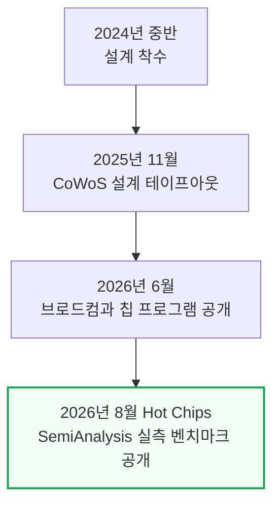
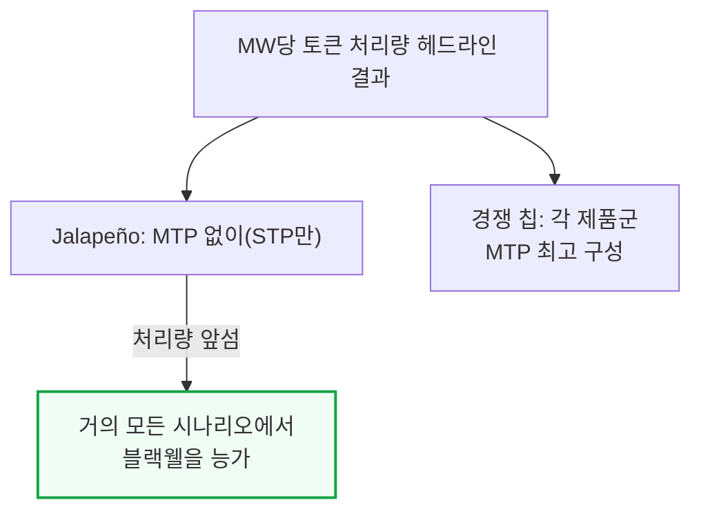
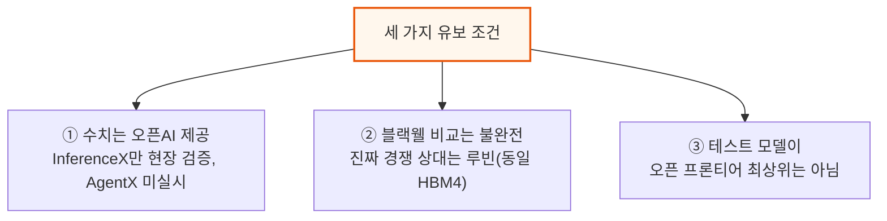
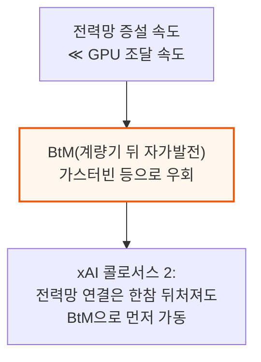
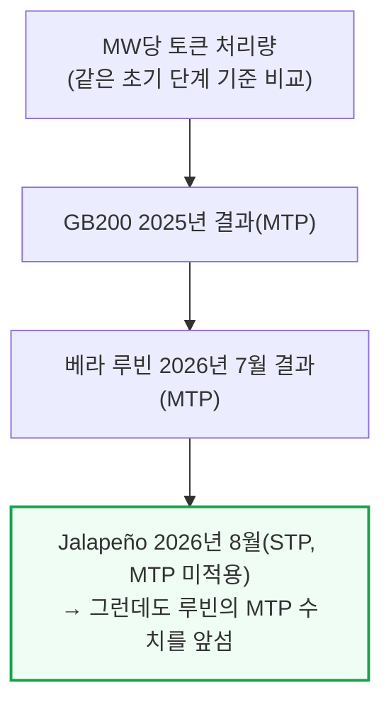
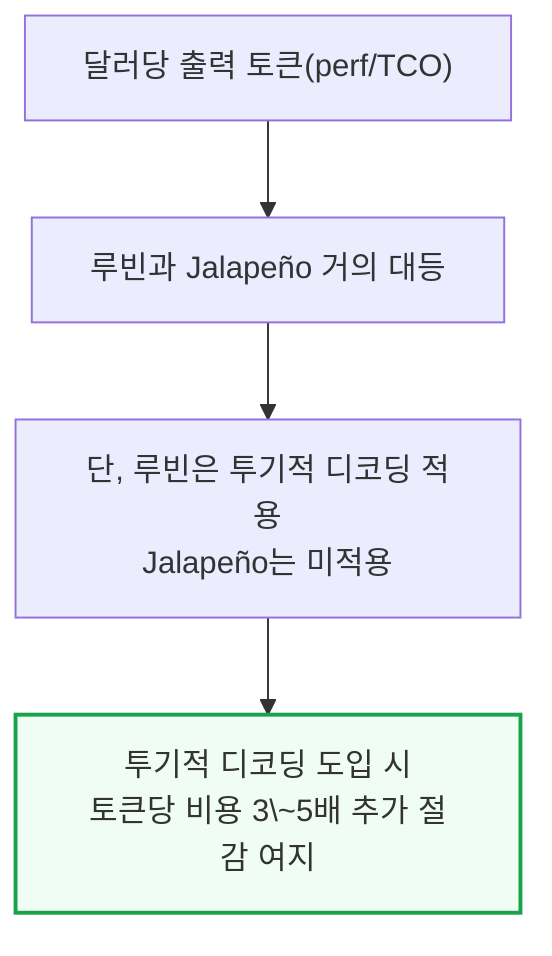
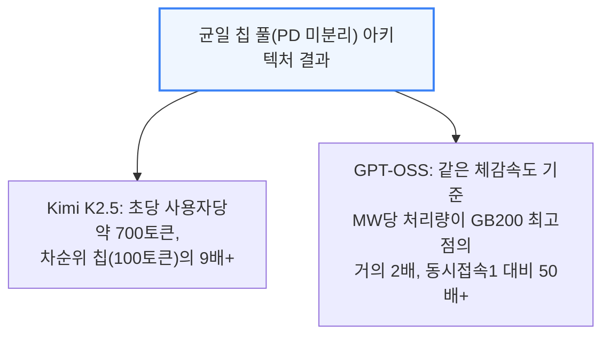

# OpenAI Jalapeño: Better Than Nvidia Blackwell

> **출처**: [SemiAnalysis Newsletter](https://newsletter.semianalysis.com/p/openai-jalapeno-better-than-nvidia)
> **저자**: Bryan Shan, Myron Xie, Jordan Nanos
> **발행일**: 2026-08-25

---

## 📑 목차

### 전체 섹션
1. [서론 - 오픈AI, 자체 설계 추론 칩 "Jalapeño" 공개](#1-서론---오픈ai-자체-설계-추론-칩-jalapeño-공개)
2. [범용 추론 칩 - 스펙과 헤드라인 성능](#2-범용-추론-칩---스펙과-헤드라인-성능)
3. [성능 분석 - 와트당 성능이 핵심인 이유](#3-성능-분석---와트당-성능이-핵심인-이유)
4. [스펙과 아키텍처 파헤치기](#4-스펙과-아키텍처-파헤치기)
5. [소프트웨어 - Gluon과 Codex](#5-소프트웨어---gluon과-codex)
6. [PD 분리를 하지 않은 이유](#6-pd-분리를-하지-않은-이유)
7. [랙 시스템 아키텍처 - Katsu·Vindaloo·Chana](#7-랙-시스템-아키텍처---katsuvindaloochana)
8. [다음 단계와 업계 파급력](#8-다음-단계와-업계-파급력)

---

## 🔑 용어 정리

본문을 순서대로 읽기 전에 알아두면 좋은 용어들입니다. 자세한 수치와 설명은 본문에서 처음 등장하는 위치에 나옵니다.

- **ASIC(주문형 반도체, Application-Specific Integrated Circuit)**: 범용 GPU와 달리 특정 목적(이 경우 LLM 추론)에 맞춰 처음부터 설계한 칩
- **와트당 성능(perf/W)·MW당 토큰(tok/s/MW)**: 전기 1와트, 또는 1메가와트로 토큰을 얼마나 만들어내는지 재는 효율 지표 — 전력이 부족한 시대엔 칩값보다 이 숫자가 매출을 좌우한다
- **BtM(Behind-the-Meter, 계량기 뒤 자가발전)**: 전력회사 송전망을 거치지 않고 데이터센터 부지 안에 가스터빈 등을 세워 직접 전기를 만드는 방식 — 전력망 증설을 기다리지 않아도 된다
- **HBM4(4세대 고대역폭 메모리, High Bandwidth Memory)**: 칩 옆에 쌓아 붙여 데이터를 아주 빠르게 주고받는 메모리 — 세대가 올라갈수록 대역폭(초당 옮기는 데이터량)이 커진다
- **PD 분리(Prefill-Decode Disaggregation)**: 입력을 한번에 처리하는 프리필과 토큰을 하나씩 만드는 디코드를 서로 다른 칩 묶음에 맡기는 방식 — Jalapeño는 이걸 하지 않는다
- **STP·MTP(단일/다중 토큰 예측, Single/Multi-Token Prediction)**: STP는 한 번에 토큰 1개씩, MTP는 여러 개를 한 번에 예측해 속도를 높이는 방식 — Jalapeño의 headline 수치는 더 유리한 MTP 없이 STP만으로 낸 것이다
- **투기적 디코딩(Speculative Decoding)**: 작고 빠른 초안 모델이 먼저 토큰 여러 개를 추측하고, 큰 본 모델이 한 번에 검증해 속도를 높이는 기법
- **Gluon**: 오픈AI가 Triton을 바탕으로 만든 저수준 커널(칩을 직접 제어하는 코드) 프로그래밍 언어 — 하드웨어 자원과 데이터가 어떻게 배치되는지(레이아웃)까지 프로그래머가 직접 지정할 수 있다

---

## 1. 서론 - 오픈AI, 자체 설계 추론 칩 "Jalapeño" 공개

**📌 핵심:**
- 오픈AI는 지난 몇 년간 조용히 "Jalapeño"라는 LLM 추론 전용 ASIC(주문형 반도체)를 만들어 왔고, Hot Chips(반도체 업계 콘퍼런스)에서 처음 공식 발표했다 — SemiAnalysis는 오픈AI의 초청으로 칩을 직접 보고, 연구소를 방문해 실물을 확인하고, 자체 벤치마크 InferenceX로 성능을 측정했다
- 설계는 2024년 중반 시작해 약 16개월 만에 제조 테이프아웃(설계 확정본을 파운드리에 넘기는 시점)까지 끝냈다 — ASIC 개발 주기치고 극히 빠른 속도다
- 보통 1세대 칩은 경쟁력이 없는 게 일반적인데, Jalapeño는 이 통념을 깨고 SemiAnalysis가 테스트한 모든 엔비디아·AMD·구글 칩을 여러 오픈소스 모델에서 앞섰다
- 결론: 오픈AI는 특정 부분만 파고드는 특화 칩이 아니라, 모든 시나리오에서 고르게 좋은 성능을 내는 범용 칩을 극단적인 하드웨어·소프트웨어 공동설계(codesign)로 만들어냈다

---

오픈AI는 2026년 6월 브로드컴과 공동으로 LLM 추론 전용으로 백지에서(blank slate) 설계한 칩 프로그램을 공개했다. 이번 Hot Chips 발표에서는 그 실물을 SemiAnalysis가 직접 확인하고 벤치마크한 결과가 처음 나온 것이다. 장난삼아 오픈AI는 이 칩에서 둠(Doom) 게임을 돌리는 모습도 보여줬는데, Codex(오픈AI의 코딩 에이전트) 프롬프트만으로 이식한 것이었다.

---

## 2. 범용 추론 칩 - 스펙과 헤드라인 성능

**📌 핵심:**
- Jalapeño는 오픈AI 자사 모델 전용이 아니라 다양한 모델·워크로드를 두루 잘 돌리는 범용 칩이다 — InferenceX 벤치마크를 오픈AI 엔지니어와 함께 현장에서 직접 실행해 확인했다
- 헤드라인 결과: MW(메가와트)당 토큰 처리량에서 Jalapeño는 다중 토큰 예측(MTP, 한 번에 토큰 여러 개를 예측해 속도를 높이는 기법)을 켜지 않고도, MTP를 켠 다른 모든 칩(각 제품군 최고 구성)을 앞섰다
- 저지연 구간과 고처리량 구간 모두에서 블랙웰을 앞섰고, 똑같이 STP(단일 토큰 예측)로만 비교하면 격차가 더 벌어진다 — DeepSeek R1에서 동시접속 1명 기준 초당 사용자당 700토큰 이상을 냈다
- 결론: 이 수치는 투기적 디코딩도, PD(프리필-디코드) 분리도 없이 순수 STP만으로 낸 것이라 더 인상적이다 — Kimi-K2.5·GPT-OSS에서도 초당 사용자당 약 1,400토큰을 기록했고, 정확도(GSM8k 평가)도 엔비디아 칩과 대등했다

---

Jalapeño는 HBM4(4세대 고대역폭 메모리)를 탑재해, 엔비디아·AMD의 최신 플래그십 GPU와 스펙만 놓고 봐도 바로 견줄 만한 수준이다. HBM4는 아직 엔비디아·AMD도 막 도입한 세대라, 1세대 ASIC이 이걸 쓴다는 것 자체가 이례적이다.

세 가지 유보 조건이 있다.

① SemiAnalysis는 InferenceX 실행을 랩에서 직접 검증했지만, 전체 InferenceX 스위트를 다 돌리지도, AgentX(멀티턴·긴 맥락 벤치마크) 결과를 보지도 못했다. AgentX는 실제 운영 트래픽의 캐시 재사용 패턴을 더 잘 반영하기 때문에 SemiAnalysis가 칩 성능 비교에 선호하는 기준이다 — 8k1k(입력 8천·출력 1천 토큰 고정) 벤치마크에서 잘하는 프레임워크가 라우터·프리픽스 캐시·오프로드 같은 구성요소에 부하가 걸리는 AgentX에서는 더 나쁠 수 있다.

② 블랙웰과의 비교는 다소 불공정하다. Jalapeño의 진짜 경쟁 상대는 같은 HBM4를 쓰는 루빈(Rubin)이다. 베라 루빈 시스템은 지금 고객사에 출하되기 시작했지만, Jalapeño는 아직 엔지니어링 샘플 단계다. 실제로 베라 루빈 NVL72는 GB200 NVL72 대비 MW당 성능이 5.4배라고 SemiAnalysis가 지난달 별도 기사에서 분석한 바 있다 — 이 문서의 뒷부분에서 Jalapeño를 베라 루빈의 2026년 7월 성능치와 비교한다.

③ 테스트한 모델들이 오픈 프론티어 최상위는 아니다. 엔비디아·AMD는 AgentX로 DeepSeek V4 Pro, Kimi K3 같은 더 큰 모델의 결과를 발표했다 — 모델이 크고 최신일수록 새 칩에 이식하기가 더 어렵다. 다만 Jalapeño에서 돌린 모델들도 결코 작은 편은 아니다.

---

## 3. 성능 분석 - 와트당 성능이 핵심인 이유

**📌 핵심:**
- 오픈AI가 와트당 성능(perf/W)에 설계 초점을 맞추는 이유는 단순하다 — 지금 오픈AI를 막는 건 예산이나 부지가 아니라 데이터센터에 공급되는 전력(MW)이라, MW당 토큰이 곧 매출과 직결된다
- 엔비디아 CEO 젠슨 황도 2026년 컴퓨텍스에서 "1기가와트(GW)의 전력이 있다면 와트당 처리량이 곧 매출"이라 말했고, 핫칩스 2026 베라 발표에서도 같은 그래프로 "데이터센터는 지금 전력이 병목"이라 재확인했다
- 전력망 증설은 GPU 조달보다 훨씬 느려서, 데이터센터는 송전망을 거치지 않고 부지 안에서 직접 발전하는 BtM(계량기 뒤 자가발전)에 점점 더 의존한다 — xAI 콜로서스 2가 대표 사례다
- 결론: MW당 토큰은 결국 "줄(1와트=1초당 1줄)당 토큰"과 같아서, 전기를 토큰으로 바꾸는 효율 그 자체를 보여준다 — 이 기준으로도 Jalapeño는 루빈을 앞선다

---

MW당 토큰 처리량을 비교할 때는 소프트웨어 성숙도가 비슷한 시점끼리 맞춰야 공정하다. 그래서 GB200은 2025년 초기 결과(당시가 비슷한 초기 단계였기 때문), 베라 루빈은 2026년 7월 최신 결과, Jalapeño는 오늘 결과를 비교한다 — 이것이 현재 공개된 최선의 루빈 수치이며, 오픈AI가 루빈보다 늦게 테이프아웃했다는 점에서도 타당한 비교다. 오픈AI와 루빈 둘 다 아직 미성숙 단계라 앞으로도 성능은 계속 오를 것이다.

달러당 출력 토큰(perf/TCO, 총소유비용 대비 성능)으로 보면 루빈과 Jalapeño는 거의 대등하다. 다만 루빈의 수치는 투기적 디코딩을 적용한 결과이고, Jalapeño는 적용하지 않은 결과라는 차이가 있다.

이 비용 우위의 일부는 엔비디아의 높은 마진을 브로드컴의 (여전히 높지만 상대적으로 낮은) 마진으로 바꾼 데서 나온다. 하지만 그게 전부는 아니다 — 메타·마이크로소프트의 AI ASIC 프로그램은 훨씬 오래전부터 준비했는데도 궤도에 오르지 못했다는 사실이, 비용 구조만으로는 이 결과를 설명할 수 없음을 보여준다.

아키텍처 측면에서 오픈AI는 프리필과 디코드를 서로 다른 칩 풀로 나누지 않는 선택을 했다 — 초안 모델과 본 모델이 같은 칩과 네트워크를 공유한다. 이유는 6장에서 자세히 다루는데, 요약하면 워크로드 구성비가 시간에 따라 계속 바뀌기 때문에 프리필용·디코드용 칩 수를 미리 고정해두면 비효율이 생긴다는 것이다. 이 균일한(homogeneous) 칩 풀 구조로 오픈AI는 다음 결과를 냈다.

Kimi K2.5는 코딩 도구 Cursor의 Composer 2.5가 기반으로 삼은 모델이다. GPT-OSS 결과 중 동시접속 수가 높은 지점은 EP8(Expert Parallelism 8, 전문가 병렬화 8분할) 구성을 쓴 것이다.

다만 이 결과들도 8k1k 벤치마크일 뿐이고 아직 AgentX 결과는 없다는 점은 그대로 남는 유보 조건이다 — 멀티턴·긴 맥락 워크로드는 서빙 스택의 더 많은 부분(라우터, 프리픽스 캐시 등)에 부하를 건다.

---

*작성 진행률: 약 35% 완료*
*업데이트: 헤더·목차·용어 정리·1\~3장(서론, 범용 추론 칩, 성능 분석) 작성 완료*
