# TPU Inference Externalization Full Steam Ahead - InferenceX

> **출처**: [SemiAnalysis Newsletter](https://newsletter.semianalysis.com/p/tpu-inferencex-full-steam)
> **저자**: Alec Ibarra, Cam Quilici, Bryan Shan
> **발행일**: 2026-09-07

---

## 📑 목차

### 전체 섹션
1. [서론 - 구글 TPU 외부 판매로 첫 승부수](#1-서론---구글-tpu-외부-판매로-첫-승부수)
2. [InferenceX 벤치마크 - 성능당 비용에서 TPU가 앞선다](#2-inferencex-벤치마크---성능당-비용에서-tpu가-앞선다)
3. [사과 대 바나나 비교 - GB300 NVL72 분리형 서빙과 TPUv7 통합 서빙](#3-사과-대-바나나-비교---gb300-nvl72-분리형-서빙과-tpuv7-통합-서빙)
4. [새 TorchTPU 백엔드 - TorchAX를 대체하는 네이티브 파이토치](#4-새-torchtpu-백엔드---torchax를-대체하는-네이티브-파이토치)
5. [TPU 추론 최적화 딥다이브 - 커널 단위 성능 개선](#5-tpu-추론-최적화-딥다이브---커널-단위-성능-개선)
6. [TPU 칩과 네트워크 설계 - Ironwood와 토러스 토폴로지](#6-tpu-칩과-네트워크-설계---ironwood와-토러스-토폴로지)
7. [다음 단계 - 추측 디코딩과 PD 분리 에이전틱 워크로드](#7-다음-단계---추측-디코딩과-pd-분리-에이전틱-워크로드)
8. [TPU 총소유비용 분석 - 서버 원가와 칩 시간당 비용](#8-tpu-총소유비용-분석---서버-원가와-칩-시간당-비용)

---

## 🔑 용어 정리

본문을 순서대로 읽기 전에 알아두면 좋은 용어들입니다. 자세한 수치와 설명은 본문에서 처음 등장하는 위치에 나옵니다.

- **InferenceX**: SemiAnalysis가 만든 제3자 추론 성능·비용 실측 벤치마크 플랫폼 — 여러 칩을 같은 모델·같은 조건으로 돌려 처리량과 비용을 견준다
- **총소유비용(TCO, Total Cost of Ownership)**: 칩 구매·서버 조립비부터 전력·운영비까지 다 합쳐 실제로 얼마가 드는지를 나타내는 비용
- **분리형 서빙(Disaggregated Serving) / 통합 서빙(Aggregated Serving)**: 추론의 두 단계(입력을 읽는 프리필, 토큰을 하나씩 만드는 디코드)를 서로 다른 하드웨어 풀에 나눠 맡기면 분리형, 같은 하드웨어 안에서 함께 처리하면 통합형이다
- **TorchTPU**: 파이토치(PyTorch)가 TPU를 자기 장치로 곧바로 인식해 돌리게 하는 새 소프트웨어 계층 — 기존에는 TorchAX라는 번역 계층을 거쳐야 했다
- **Ironwood(TPUv7)**: 구글이 처음으로 외부에 판매·임대하는 7세대 TPU — 이 글의 벤치마크 대상
- **토러스(Torus) 토폴로지**: 칩들을 그물처럼 이어 놓고 그물의 양 끝까지 서로 연결해, 반대편 칩까지 가는 거리를 줄이는 배선 방식
- **추측 디코딩(Speculative Decoding, MTP)**: 작고 빠른 모델이 다음 토큰 여러 개를 미리 찍어두면, 진짜 모델이 한 번에 검증해 맞은 것만 채택하는 속도 향상 기법
- **PD 분리(Prefill-Decode Disaggregation)**: 입력 처리(프리필)와 토큰 생성(디코드)을 서로 다른 하드웨어 풀에 맡겨 각자 필요한 자원에 맞게 따로 최적화하는 방식

---

## 1. 서론 - 구글 TPU 외부 판매로 첫 승부수

**📌 핵심:**
- 구글은 10년 넘게 검색·광고·유튜브와 제미나이 전 세대를 전부 자체 칩 TPU로 돌려왔다 — 앤트로픽은 TPU 100만 대 이상(직접구매 40만+·GCP 임대 60만+대)을 확보하기로 약정해 2029년이면 딥마인드 자체 사용량마저 넘어설 전망이다
- 오늘 SemiAnalysis는 InferenceX(추론 성능·비용 실측 벤치마크)에서 TPUv7 Ironwood의 첫 제3자 벤치마크 결과를 공개한다 — 오픈소스 모델을 똑같은 추론 엔진으로 돌려 엔비디아 B200·B300과 견준 결과, 최대 50% 나은 성능당 비용을 냈다
- 새 소프트웨어 스택 TorchTPU가 예상보다 빠르게 자리 잡고 있어, SemiAnalysis는 TPU 외부화(구글 내부 전용이던 TPU를 다른 회사도 구매·임대해 쓸 수 있게 여는 작업)가 옳은 방향으로 전속력으로 가고 있다고 본다
- 결론: 구글이 10년간 내부에서만 증명해온 TPU 경쟁력을, 이제 업계 전체가 직접 실측으로 확인할 수 있는 단계에 들어섰다

---

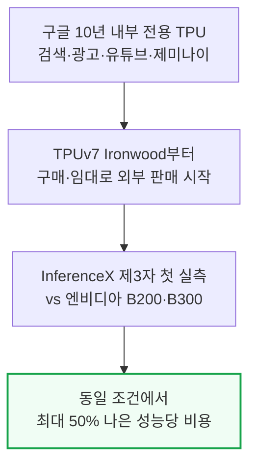

이번 벤치마크는 구글이 초기 검증 모델로 고른 Qwen3.5 397B(FP8)를 새 TorchTPU vLLM 스택으로 돌린 결과다.

구글은 안정화되는 대로 Kimi K3·GLM5.3으로 지원을 넓힌다. day-0 지원은 지금 엔비디아 중심인데, TorchTPU가 자리 잡으면 TPU도 들어갈 수 있다.

TPUv7은 FP4를 하드웨어로 지원하지 않아 FP4 비교에서는 엔비디아가 앞선다. FP4를 지원하는 TPUv8i Boardfly(뒤에서 설명)는 루빈 NVL72와 경쟁력 있을 것으로 SemiAnalysis는 본다.

---

## 2. InferenceX 벤치마크 - 성능당 비용에서 TPU가 앞선다

**📌 핵심:**
- 사용자 1명당 초당 100토큰 속도(interactivity) 기준으로, 100만 토큰당 비용은 Ironwood $0.181, B200 $0.222, B300 $0.276이다 — 같은 응답 속도를 내면서 B200보다 약 19%, B300보다 약 34% 싸다
- 사용자 1명당 초당 20토큰 속도에서는 원시 처리량(raw throughput)도 Ironwood가 앞선다 — 칩당 초당 9,364토큰으로 B200(8,903)·B300(8,925)보다 약 5% 높고, 낮은 시간당 비용까지 겹쳐 토큰당 비용은 B200보다 50.4%, B300보다 96.0% 더 유리하다
- 동시 요청 256개(concurrency 256) 조건에서 구글 내부 비용(칩-시간당 $1.03)을 적용하면 성능당 비용 우위가 B200 대비 76.7%, B300 대비 130.2%까지 커지지만, 그만큼 응답이 느려진다 — 첫 토큰까지 걸리는 시간(TTFT)이 Ironwood 5.41초로 B200(3.75초)·B300(2.40초)보다 길다
- 결론: TPU 구매자가 가장 중요하게 보는 것은 원시 속도가 아니라 "이 칩으로 얼마나 벌 수 있는가", 즉 성능당 비용과 와트당 성능이다 — 응답 속도가 조금 느려지는 대신 비용 우위가 커지는 지점을 어디로 잡을지가 실제 구매 결정을 가른다

---

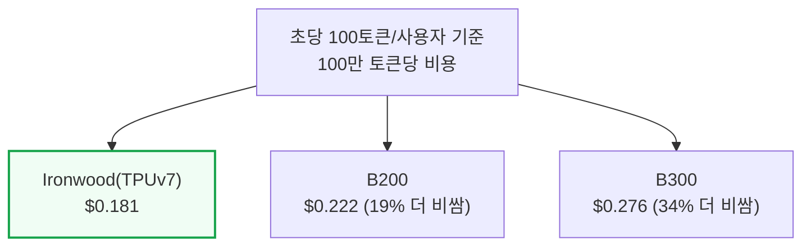

이 비교는 하이퍼스케일러가 TPU를 구매한다고 가정한 외부용 TCO 기준이다. SemiAnalysis는 구글이 TPU를 임대뿐 아니라 판매도 한다는 사실을 처음 밝힌 바 있다.

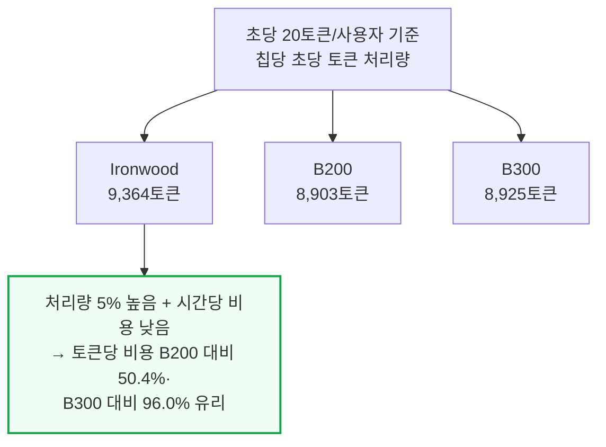

동시 요청 수를 256개까지 늘려 구글 내부 비용(칩-시간당 $1.03)으로 계산하면 비용 우위는 더 커진다. 다만 대가도 있다.

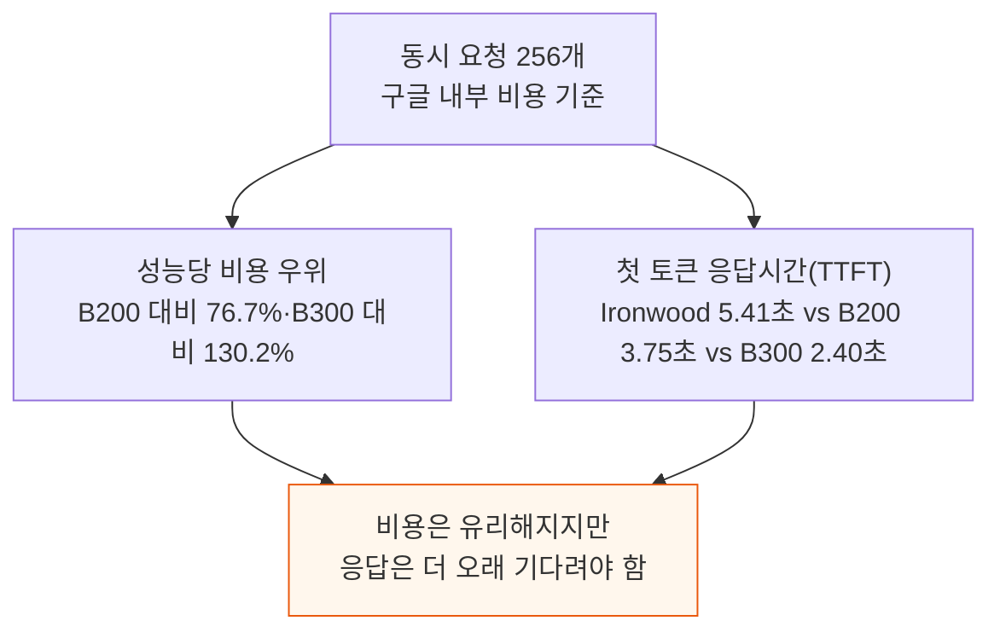

응답 시간 기준도 흐름은 같다 — 20초 지점 비용은 Ironwood $0.098·B200 $0.106·B300 $0.132로, TPU가 B200보다 약 8%, B300보다 약 25% 싸다.

30초 근처에서는 B200이 좁게 앞서고 이후 TPU가 저비용을 되찾는다. 벤치마크는 추측 디코딩·분리형 서빙을 켜지 않은 상태(8k1k)인데, 양쪽에 적용해도 우위는 유지될 것으로 본다.

---

## 3. 사과 대 바나나 비교 - GB300 NVL72 분리형 서빙과 TPUv7 통합 서빙

**📌 핵심:**
- 구글은 자사 제미나이 서빙에서 분리형 서빙을 몇 년째 내부적으로 고도로 최적화해 운영해 왔지만, 외부에 공개하는 TPU 서빙 스택에는 아직 완전히 최적화된 분리형 경로가 없다 — 그래서 분리형 대 분리형으로 견주면 지금은 GB200/GB300 NVL72가 성능당 비용에서 더 경쟁력 있다
- 아직 최적화되지 않은 TPU 통합 서빙과 이미 최적화된 GB300 NVL72 분리형 서빙을 직접 비교(사과 대 바나나)해도, 낮은 지연시간대와 높은 지연시간대에서는 TPUv7이 꽤 경쟁력 있는 성능을 낸다
- 다만 중간 지연시간대에서는 GB300 NVL72 분리형 서빙이 성능당 비용에서 약 30% 앞선다 — TPUv7이 아직 분리형 서빙을 다 갖추지 못했다는 격차가 정확히 이 구간에서 드러난다
- 결론: SemiAnalysis는 TPUv7의 분리형 서빙이 최적화되면 전체 구간에서 GB300 NVL72와 경쟁력을 갖출 것으로 강하게 보며, 몇 달 안에 이 격차가 좁혀질 것으로 예상한다 — TPUv7 분리형 대 GB200/300 NVL72 분리형 비교는 후속 기사에서 다룰 예정이다

---

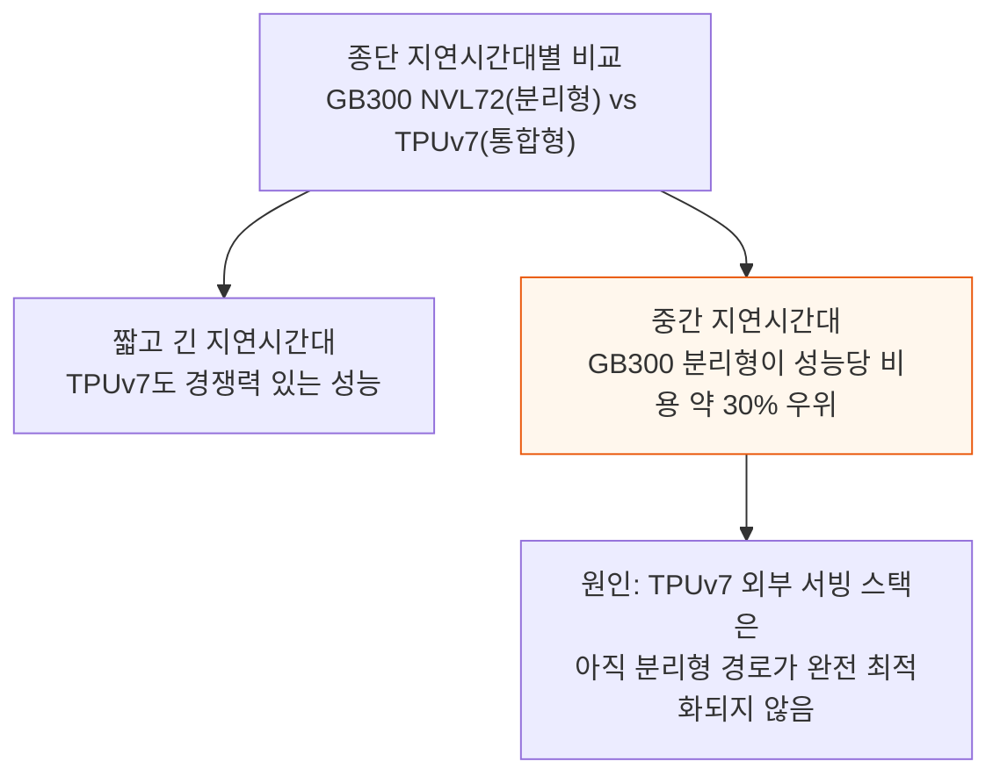

TPUv7 팟은 저지연 ICI로 1,000개 넘는 칩까지 묶여, 대형 모델 분리형 서빙·초광폭 전문가 병렬화처럼 NVL72로는 하기 어려운 최적화도 가능하다.

---

*작성 진행률: 약 40% 완료*
*업데이트: 서론·InferenceX 벤치마크(성능당 비용)·사과 대 바나나 비교 3개 섹션 완료*

---

## 4. 새 TorchTPU 백엔드 - TorchAX를 대체하는 네이티브 파이토치

**📌 핵심:**
- vLLM의 TPU 지원은 3단계로 발전했다 — ① PyTorch/XLA(연산을 즉시 실행하지 않고 모아뒀다 컴파일하는 방식) ② 현재 공개판인 tpu-inference(TorchAX 번역 계층으로 파이토치 코드를 JAX로 바꿔 실행) ③ 곧 나올 TorchTPU(TPU를 파이토치가 원래부터 지원하는 장치처럼 다루는 방식)
- 기존 TorchAX 방식은 개발자가 파이토치로 모델을 짜면 내부에서 JAX가 실제 연산을 수행하는 번역 계층이었다 — 연산 하나하나를 가로채 JAX 명령으로 바꾸고, vLLM이 관리해야 하는 KV 캐시(이전 토큰들의 어텐션 정보를 저장해 재사용하는 캐시) 상태까지 컴파일러가 추적 가능한 입출력 형태로 바꿔줘야 했는데, 이 번역 계층 자체가 여러 문제의 원인이 됐다
- TorchTPU는 파이토치의 확장 기능(PrivateUse1)을 이용해 TPU를 진짜 파이토치 장치(`device="tpu"`)로 노출한다 — 개발자는 즉시 실행(디버깅용)이나 `torch.compile`(그래프 컴파일용) 방식을 그대로 쓸 수 있고, 내부적으로는 여전히 XLA 컴파일러와 TPU 전용 커널(Pallas)이 실제 연산을 처리한다
- 결론: TorchTPU는 vLLM·SGLang이 파이토치-JAX 경계를 넘나들며 스케줄러·배치 처리·API를 다시 만들 필요 없이 기존 상류 코드를 그대로 재사용하게 해준다 — 다만 TPU 전용 최적화(텐서 모양·레이아웃 튜닝) 자체가 사라지는 것은 아니며, 기존 Pallas 커널 대부분은 새 스택으로 옮겨가되 일부는 손봐야 한다

---

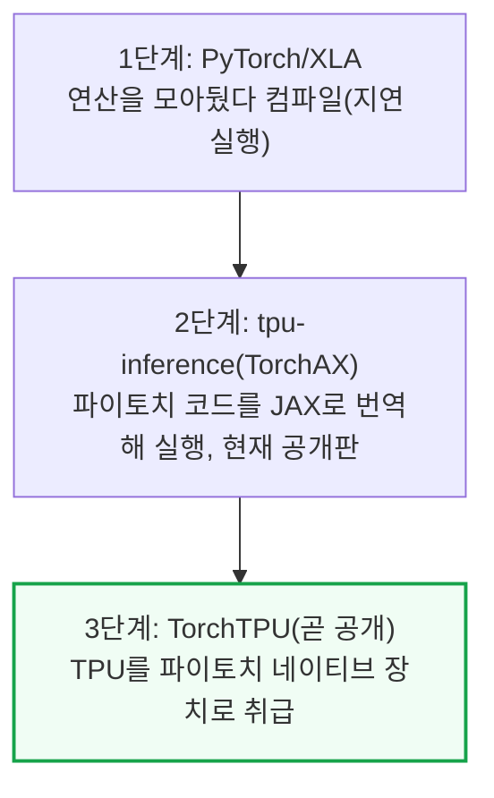

TorchAX 선택은 실용적 이유였다 — 최적화를 TPU에 맞추기 어려워 더 성숙한 JAX를 택했다. SGLang은 별도의 JAX 네이티브 엔진(SGLang-JAX)을 쓴다.

TorchTPU의 "네이티브"는 텐서·연산 라우팅·즉시 실행·분산 API가 파이토치 방식대로 동작한다는 뜻이지, 컴파일러(XLA)·커널(Pallas)까지 바뀐다는 뜻은 아니다.

DDP·FSDP2·DTensor 같은 익숙한 분산 처리 인터페이스도 그대로 지원해, vLLM·SGLang이 이미 가정하는 프로세스·분산 모델에 맞아떨어진다.

vLLM·SGLang 유지관리팀(Inferact, RadixArk, Red Hat)이 구글과 함께 TorchTPU를 일급 기능으로 만드는 데 투자하고 있다 — 이런 협력이 외부화 성공에 매우 중요하다.

TorchTPU는 2026년 9월 초 비공개 베타이며 10월 중순 공개된다. 공개되면 SemiAnalysis는 TPU 벤치마크를 자체 포크에서 공개 저장소로 옮긴다.

---

## 5. TPU 추론 최적화 딥다이브 - 커널 단위 성능 개선

**📌 핵심:**
- 새 TorchTPU 스택의 첫 검증 모델인 Qwen3.5 397B 하나를 최적화하는 데만 수백 시간의 엔지니어링과 수십 건의 PR(코드 변경 제안)이 투입됐다 — GPU와 다른 TPU 구조 때문에 TPU 전용 최적화가 별도로 필요했다
- 어텐션 연산을 여러 장치에 나누는 방식(DP 어텐션)과 통신 경로를 다듬어 레이어당 약 80마이크로초를 절감했다 — DeepSeek-V3처럼 레이어가 58개인 모델에서는 전체 순전파 한 번에 약 4.64밀리초가 줄어드는 효과로 누적된다
- 혼합 전문가(MoE) 라우팅과 GDN(Gated DeltaNet, 순환 방식으로 상태를 갱신하는 어텐션 대체 연산) 커널을 다듬어 각각 최대 12%, 최대 20%의 처리량·속도 개선을 얻었다
- 결론: 이런 최적화 대부분은 TPU 하드웨어 구조에서 나온 저수준 커널 작업이지만, 대부분 새 TorchTPU 스택으로도 그대로 옮겨갈 수 있어 앞으로 다른 모델에 적용할 때 처음부터 다시 할 필요가 없다

---

### DP 어텐션과 통신 최적화

Qwen3.5는 GQA(그룹 쿼리 어텐션) 방식으로, 쿼리 헤드는 32개인데 이를 공유하는 KV(키·값) 헤드는 2개뿐이다.

논리 장치 8개(TP8)에서 쿼리는 장치당 4개씩 나뉘지만 KV 헤드 2개는 안 나뉘어 하나를 16개가 공유한다. vLLM의 KV 헤드 복제 기능을 TPU에서 켜 불필요한 통신을 없앴다.

동시 요청이 많을 때는 어텐션·전문가 병렬화를 8방향씩(DP8·EP8) 결합한 "DP 어텐션"을 추가했다 — 장치마다 다른 요청을 맡아 KV 헤드를 로컬에 두고, 전문가 512개는 분산해 가중치 복제를 피한다.

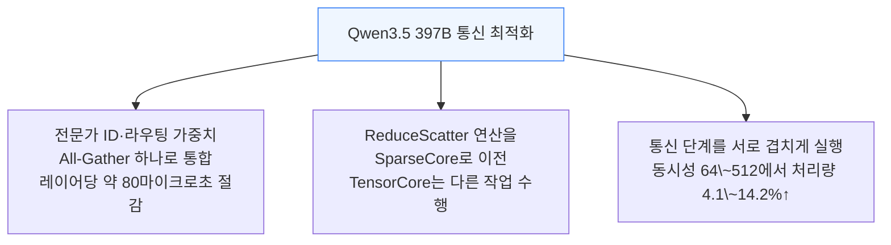

DeepSeek-V3(58레이어)는 이 통합만으로 순전파 한 번에 약 4.64밀리초가 줄었다. 작은 통신은 SparseCore 이전이 손해일 수 있어 문턱값을 뒀다(동시성 64\~128에서 2.7\~5.7%↑).

### MoE 라우팅과 전문가 커널

MoE 레이어는 전문가마다 토큰 묶음 크기가 제각각이라 TPU 행렬 유닛에 맞게 다시 짜야 한다. 그룹 행렬곱 2세대는 중복 연산을 없애고 다음 그룹 가중치를 미리 불러온다(삼중 버퍼링).

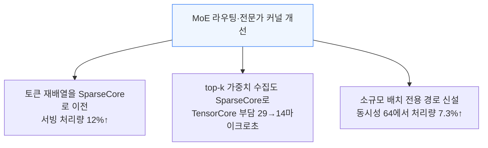

전문가 ID와 토큰 인덱스를 정렬 키 하나로 합치는 작업도 진행 중이다. 정렬 지연시간이 106.6마이크로초에서 21.7마이크로초로 줄고, FP8 All-Gather까지 가능해질 전망이다.

### GDN(선형 어텐션) 커널 최적화

GDN(Gated DeltaNet)은 매 스텝마다 내부 상태를 줄이고(decay) 새 정보로 한 단계 갱신한 뒤 결과를 투사하는 순환 연산이다.

기존엔 VPU가 상태를 먼저 갱신해야 MXU가 곱셈을 시작해 MXU가 대기했다. 순서를 바꿔 MXU가 갱신 전 상태로 먼저 곱셈을 시작하고 VPU는 다음 상태를 준비한다.

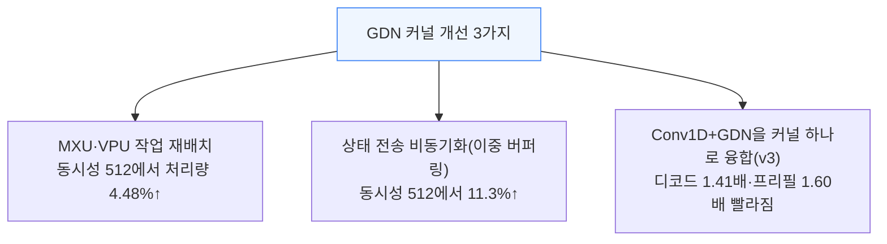

레지스터 스필(흘러넘치는 값)을 줄이는 디코드 루프 조정으로 커널은 약 20% 빨라졌지만, 종단 처리량은 0.8\~3.8%만 늘었다 — 커널 개선이 항상 종단 성능에 그대로 반영되진 않는다.

### 하이브리드 상태 관리와 페이지드 어텐션

Qwen3.5는 GQA 레이어(토큰이 쌓일수록 커지는 KV 이력 저장)와 GDN 레이어(요청당 고정 크기 순환 상태만 유지)가 섞인 하이브리드 모델이다.

순환 상태를 요청당 필요한 만큼만 배정하자 HBM(고대역폭 메모리) 약 76GiB가 확보되고 블록 풀이 71% 늘어, 처리량이 18% 늘었다.

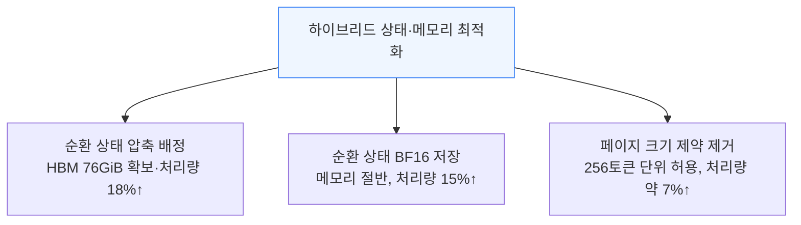

순환 상태를 BF16(16비트)으로 저장해 메모리를 절반으로 줄이면서, 실제 연산은 VMEM 안에서 FP32(32비트)로 유지하는 방식도 처리량을 15% 늘렸다.

### 저동시성 최적화와 접두사 캐싱

InferenceX는 동시 요청이 4개나 8개처럼 적은 구간에서도 측정하는데, 수백 건 처리에 맞춘 설정을 그대로 쓰면 낭비가 크다.

요청 메타데이터를 활성 요청 수 기준으로 나누자 동시성 64에서 GDN 스케줄링 부담이 283→97마이크로초로 줄었다. Qwen3.5 전용 튜닝은 동시성 4에서 8k1k 13.3%·1k1k 15.5%를 더했다.

추가 저동시성 튜닝(TP8 어텐션+전문가 병렬화, 패딩 토큰 전문가 0번 라우팅)은 1k1k 기준 동시성 4·8에서 22.9%·18.1% 늘었지만, 8k1k 기준 동시성 8에서는 오히려 5.3% 줄었다.

접두사 캐싱은 하이브리드 모델에서 까다롭다 — GDN 순환 상태는 요청이 이어지자마자 덮어써진다. 해법은 저장용·진행용 슬롯을 따로 둬 체크포인트가 안 지워지게 하는 것이다.

### 레인 레이아웃과 파이프라이닝 심도

TPU의 벡터 연산 유닛은 마지막 차원이 128레인인 타일 단위로 동작해, 그보다 작은 배열은 남는 자리가 패딩(0으로 채워 낭비되는 자리)된다.

기존에는 KV(키·값)를 헤드 차원 축에 포개 저장했는데, 장치당 KV 헤드가 1개뿐인 모델은 포갤 것이 2개뿐이라 타일 절반이 패딩으로 낭비됐다.

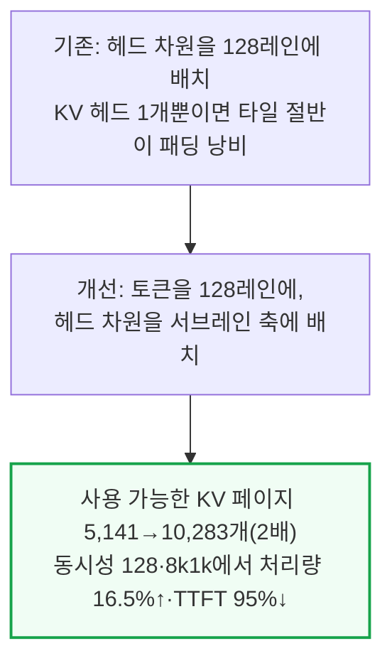

이 변경은 저동시성 구간에서 토큰당 지연시간을 약 3% 늘리지만, 동시성이 높은 구간에서는 요청이 KV 공간을 기다릴 필요가 없어져 오히려 크게 빨라진다.

디코드 KV 블록을 불러오는 블록과 똑같이(약 16,000토큰) 맞추던 방식은 프리페치 공간을 거의 안 남겼다. 연산 블록만 4,000토큰으로 줄이자 처리량이 49% 늘었다.

---

*작성 진행률: 약 75% 완료*
*업데이트: TorchTPU 백엔드·최적화 딥다이브 2개 섹션 추가*

---

## 6. TPU 칩과 네트워크 설계 - Ironwood와 토러스 토폴로지

**📌 핵심:**
- Ironwood(TPUv7)는 TPU v4·v5p가 쓰던 방식(물리 코어 2개를 논리적으로 하나처럼 묶는 MegaCore)을 버리고, 서로 독립된 논리 장치 2개를 고속 다이 간 연결로 잇는 구조로 바뀌었다 — 칩당 TensorCore 2개, 3세대 SparseCore 4개를 갖췄고 HBM 용량은 전세대 Trillium의 약 6배, 최초로 FP8 연산을 하드웨어로 지원한다
- 행렬 연산 유닛(MXU)이 v6e부터 128×128에서 256×256으로 커져 사이클당 연산량이 4배 늘었지만, 그만큼 모델의 헤드 차원이 256의 배수가 아니면 남는 자리가 그대로 낭비된다 — 헤드 차원 128(Llama 3 8B)은 활용률이 최대 50%, 64(gpt-oss)는 최대 25%까지 떨어진다
- 칩끼리 이웃 6개와 직접 연결되는 3차원 토러스(v4·v5p부터 유지) 구조를 기본 단위 64칩(랙 1개 분량)으로 묶고, 광회로스위치(OCS)로 여러 큐브를 이어 최대 9,216칩·42.5 FP8엑사플롭스 규모까지 확장한다 — OCS 덕분에 칩이나 배선이 죽어도 기술자가 케이블을 다시 잇는 대신 거울 방향만 바꿔 수 초 만에 우회할 수 있다
- 결론: 차세대 추론 전용 칩 TPU 8i는 이 3차원 토러스 대신 "Boardfly"라는 평평한 고차수 스위치망으로 갈아타, 네트워크 지름을 절반 넘게 줄이고 ICI(칩간 연결망) 대역폭을 2배, 온칩 메모리를 3배로 늘렸다

---

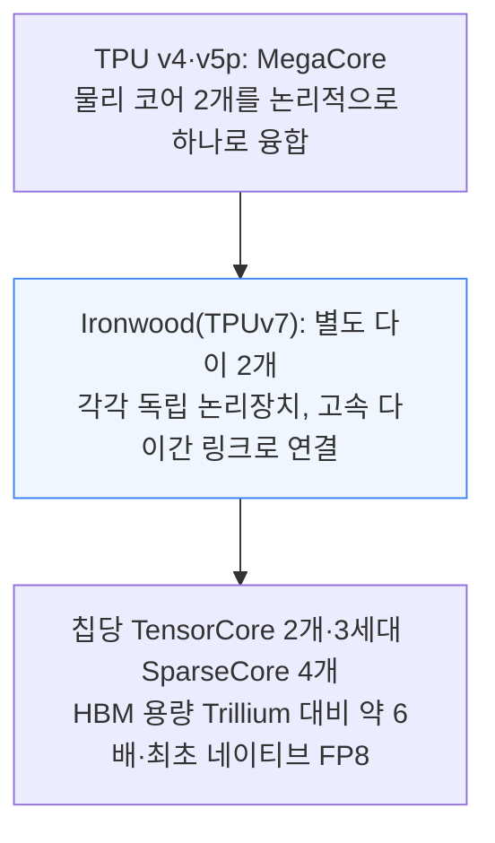

행렬 연산 유닛(MXU)은 시스톨릭 배열(systolic array) 방식이다. 가중치를 배열에 고정하고 활성값이 한쪽에서 흘러들어와 셀을 거치며 누적된 뒤 반대편으로 결과가 나온다.

배열이 클수록 사이클당 연산이 많지만 다 채워야 손해가 없다. 각 축은 배열 크기(256)의 배수까지 자동 패딩되는데, 패딩 자리도 연산 유닛 한 칸을 차지해 0을 곱하는 계산을 한다.

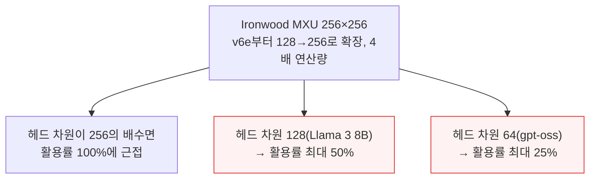

DeepSeek MLA는 쿼리·키 차원을 128+64=192로 써 2의 거듭제곱이 아니라 불리하다. 모델이 TPU에서 빨리 쓸만해지는지는 인기가 아니라 헤드 차원이 타일 크기와 맞는지에 달렸다.

TPU는 호스트를 거치지 않는 전용망 ICI(Inter-Chip Interconnect)로 연결된다. v2·v3는 이웃 4개의 2차원 토러스를, v4·v5p부터는 이웃 6개의 3차원 토러스를 쓴다.

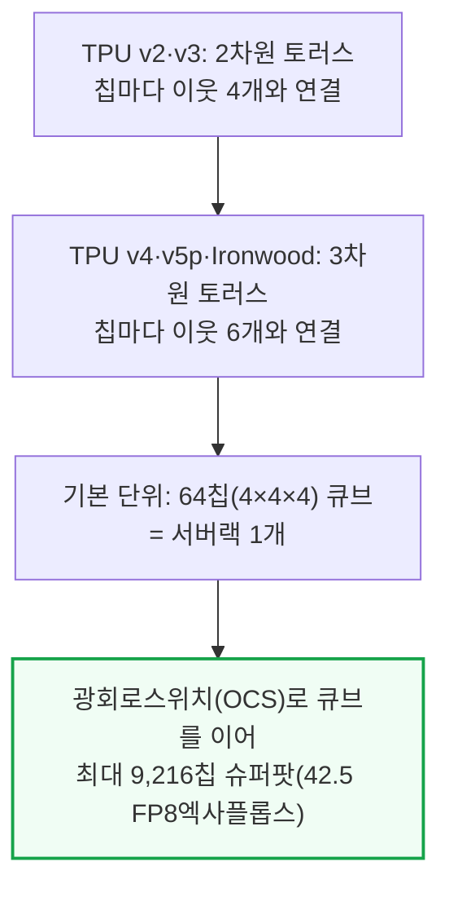

토러스는 양 끝을 이어 고리로 만들어 최악 이동 거리를 절반으로 줄인다. 구글은 뫼비우스띠처럼 꼬아 잇는 "꼬인 토러스"로 평균 이동 거리를 더 줄였다.

큐브를 이을 때는 OCS(광회로스위치)를 쓴다. 케이블을 다시 잇는 대신 거울 방향만 바꿔 죽은 배선을 수 초 안에 물리적으로 우회할 수 있다.

NVL72 이전엔 노드에 못 담는 모델은 느린 인피니밴드 파이프라인 병렬화가 필수였다. TPU 팟은 ICI가 팟 전체에 NVLink급 대역폭을 줘 대형 모델을 나눠 실을 수 있다.

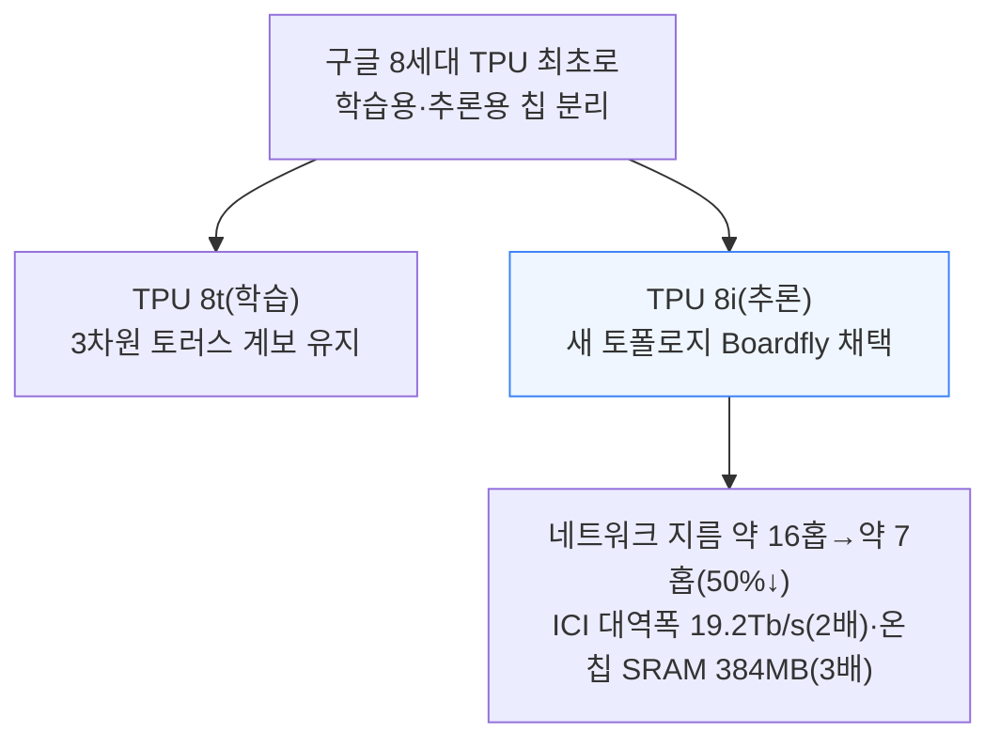

Boardfly는 드래곤플라이식 고차수 스위치망으로, 1,024\~1,152칩 규모 기준 홉 수를 16→7홉으로 줄인다. 온칩 SRAM 384MB(3배)는 KV 캐시를 칩 안에 담아둔다.

---

## 7. 다음 단계 - 추측 디코딩과 PD 분리 에이전틱 워크로드

**📌 핵심:**
- 토큰 하나를 생성하는 디코드 단계는 연산량이 아니라 HBM에서 모델 가중치를 읽어오는 속도가 병목이다 — 그래서 작은 초안 모델이 토큰 여러 개를 미리 찍고 진짜 모델이 한 번에 검증하는 추측 디코딩(MTP)은 검증 토큰 수를 늘려도 비용이 거의 안 늘어 매우 효율적이다
- 구글은 제미나이 서빙에서 PD 분리(입력 처리와 토큰 생성을 서로 다른 TPU 풀에 맡기는 방식)를 몇 년째 내부 운영해 왔지만, 이를 외부에 공개하는 작업은 불과 두 달 전에 시작됐다 — TPU-Sync(옛 이름 TPU-raiden)라는 KV 캐시 전송 라이브러리를 오픈소스로 공개하고, 업계 표준 KV 캐시 오프로딩 라이브러리 Mooncake Store도 지원하기로 했다
- 에이전틱 워크로드(멀티턴 대화·긴 문맥·높은 접두사 재사용·서브에이전트가 짧게 여러 번 뜨는 패턴이 특징)를 향한 AgentX TPU 벤치마크도 준비 중이다 — 이미 여러 구글 TPU 고객이 AgentX 결과를 요청하고 있다고 SemiAnalysis는 전한다
- 결론: Ironwood는 FP4를 하드웨어로 지원하지 않아 지금은 FP8 대 FP8로만 공정하게 비교하지만, TPUv8i부터는 FP4 대 FP4로 비교할 계획이다 — 로마가 하루 만에 세워지지 않았듯 TPU 외부화도 하루아침에 끝나지 않겠지만, SemiAnalysis는 그 속도가 매우 빠르다고 강하게 본다

---

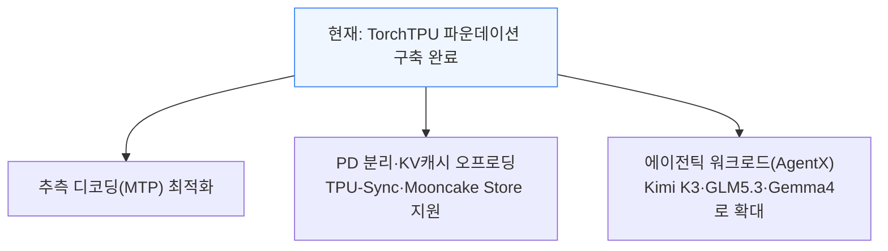

추측 디코딩은 디코드가 연산이 아니라 대역폭 병목이라 효과적이다. 토큰 하나에 모델 가중치 전체를 읽어야 하는데 이 비용은 1개든 5개든 거의 같다. 결과물은 원본과 완전히 같다.

PD 분리는 프리필·디코드 풀을 따로 튜닝·확장하게 해준다. TPU-Sync는 복사 없이(zero-copy) 전송하며, HBM에 못 담는 KV 캐시를 위한 DRAM 오프로딩도 지원한다.

Mooncake Store와 결합하면 TPU 호스트마다 흩어진 KV 캐시를 한 풀로 묶어 다른 서버 TPU도 가져다 쓰고, NVMe·분산 파일시스템(WEKA·Vast)까지 같은 풀로 묶는다.

에이전틱 워크로드는 ① 멀티턴 ② 긴 문맥 ③ 높은 접두사 재사용(캐시 비율이 1에 수렴)에, 서브에이전트가 짧게 여러 번 떠 KV 요청이 몰리는 패턴까지 더해진다.

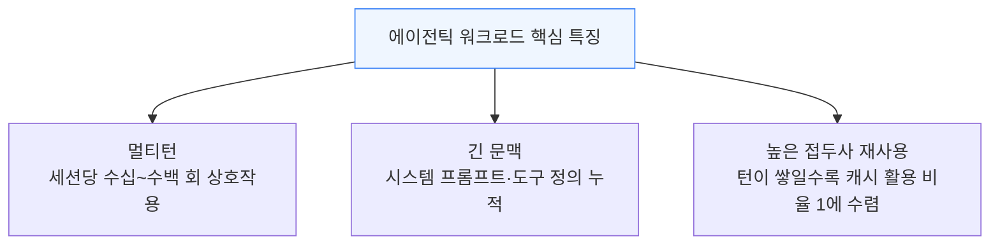

Ironwood는 FP4 하드웨어가 없어 FP8끼리만 품질 손실 없이 비교되므로 지금은 FP8 대 FP8로 견준다. FP4를 지원하는 TPUv8i가 나오면 FP4 대 FP4로 비교할 계획이다.

구글은 다음으로 Kimi K3·GLM5.3·자체 모델 Gemma4를 단일턴·에이전틱 워크로드에 태울 예정이다. 몇 모델만 안정화되면 신규 지원은 훨씬 빨라져 day-0에 가까워진다.

---

## 8. TPU 총소유비용 분석 - 서버 원가와 칩 시간당 비용

**📌 핵심:**
- 서버 원가 기준으로 TPUv7은 블랙웰급 랙 시스템의 절반에도 못 미치고, 와트당 자본지출(capex)도 어떤 블랙웰·GB 구성보다 낮다
- 이 낮은 서버 원가와 와트당 자본지출이 그대로 칩-시간당 총소유비용(TCO)으로 이어져, 구글 내부 기준 TPUv7의 칩-시간당 비용은 B200·B300보다 낮다
- 결론: 2절에서 본 성능당 비용 우위는 우연이 아니라, 서버 원가와 자본지출부터 이미 낮게 설계된 구조에서 나온다

---

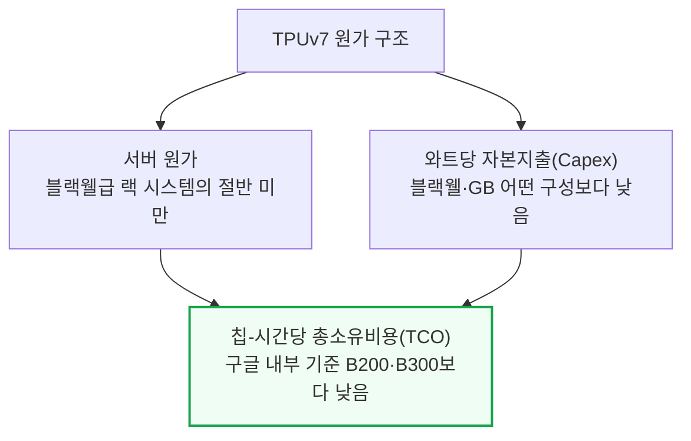

SemiAnalysis AI TCO 모델은 TPUv7 BOM·TCO를 다른 SKU와 단일 노드 기준으로 비교하며, 위 값은 축약판이다. 낮은 원가·자본지출이 칩-시간당 비용 우위로 이어져 2절 결과를 뒷받침한다.

---

*작성 진행률: 100% 완료*
*업데이트: 칩과 네트워크 설계·다음 단계·TCO 분석 섹션 추가, 전체 8개 섹션 완료*
