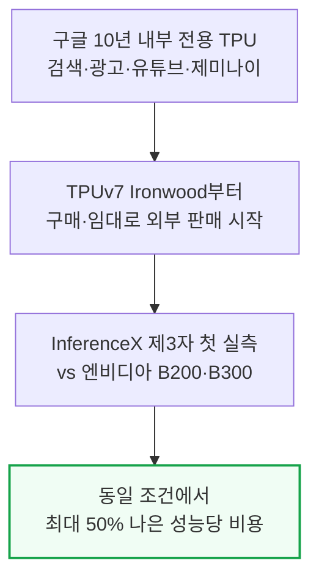
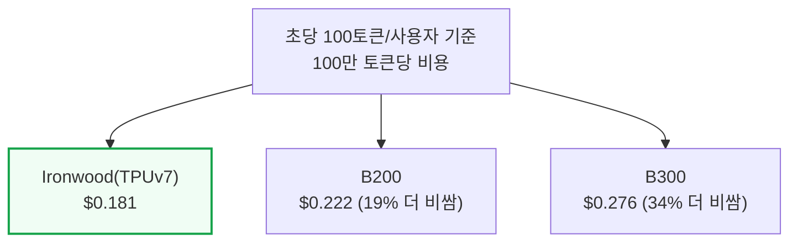
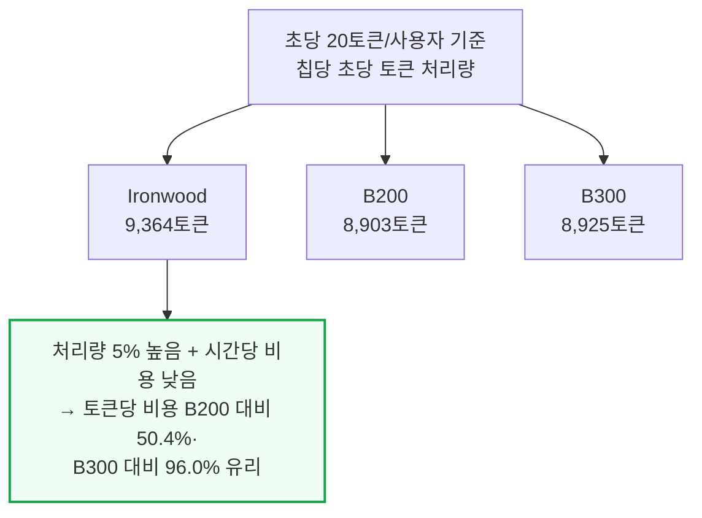
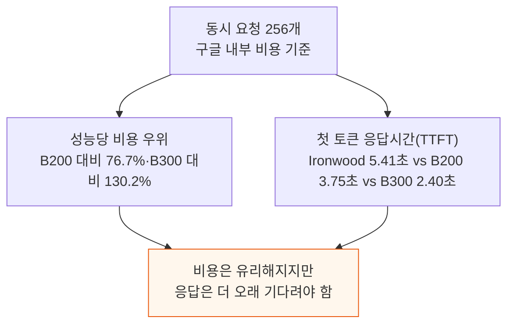
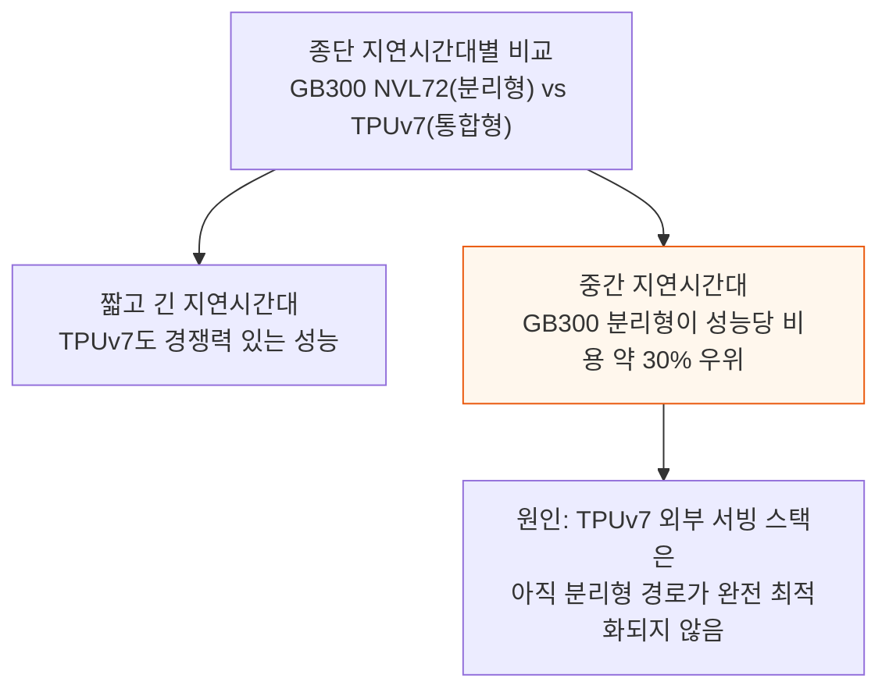

# TPU Inference Externalization Full Steam Ahead - InferenceX

> **출처**: [SemiAnalysis Newsletter](https://newsletter.semianalysis.com/p/tpu-inferencex-full-steam)
> **저자**: Alec Ibarra, Cam Quilici, Bryan Shan
> **발행일**: 2026-09-07

---

## 📑 목차

### 전체 섹션
1. [서론 - 구글 TPU 외부 판매로 첫 승부수](#1-서론---구글-tpu-외부-판매로-첫-승부수)
2. [InferenceX 벤치마크 - 성능당 비용에서 TPU가 앞선다](#2-inferencex-벤치마크---성능당-비용에서-tpu가-앞선다)
3. [사과 대 바나나 비교 - GB300 NVL72 분리형 서빙과 TPUv7 통합 서빙](#3-사과-대-바나나-비교---gb300-nvl72-분리형-서빙과-tpuv7-통합-서빙)
4. [새 TorchTPU 백엔드 - TorchAX를 대체하는 네이티브 파이토치](#4-새-torchtpu-백엔드---torchax를-대체하는-네이티브-파이토치)
5. [TPU 추론 최적화 딥다이브 - 커널 단위 성능 개선](#5-tpu-추론-최적화-딥다이브---커널-단위-성능-개선)
6. [TPU 칩과 네트워크 설계 - Ironwood와 토러스 토폴로지](#6-tpu-칩과-네트워크-설계---ironwood와-토러스-토폴로지)
7. [다음 단계 - 추측 디코딩과 PD 분리 에이전틱 워크로드](#7-다음-단계---추측-디코딩과-pd-분리-에이전틱-워크로드)
8. [TPU 총소유비용 분석 - 서버 원가와 칩 시간당 비용](#8-tpu-총소유비용-분석---서버-원가와-칩-시간당-비용)

---

## 🔑 용어 정리

본문을 순서대로 읽기 전에 알아두면 좋은 용어들입니다. 자세한 수치와 설명은 본문에서 처음 등장하는 위치에 나옵니다.

- **InferenceX**: SemiAnalysis가 만든 제3자 추론 성능·비용 실측 벤치마크 플랫폼 — 여러 칩을 같은 모델·같은 조건으로 돌려 처리량과 비용을 견준다
- **총소유비용(TCO, Total Cost of Ownership)**: 칩 구매·서버 조립비부터 전력·운영비까지 다 합쳐 실제로 얼마가 드는지를 나타내는 비용
- **분리형 서빙(Disaggregated Serving) / 통합 서빙(Aggregated Serving)**: 추론의 두 단계(입력을 읽는 프리필, 토큰을 하나씩 만드는 디코드)를 서로 다른 하드웨어 풀에 나눠 맡기면 분리형, 같은 하드웨어 안에서 함께 처리하면 통합형이다
- **TorchTPU**: 파이토치(PyTorch)가 TPU를 자기 장치로 곧바로 인식해 돌리게 하는 새 소프트웨어 계층 — 기존에는 TorchAX라는 번역 계층을 거쳐야 했다
- **Ironwood(TPUv7)**: 구글이 처음으로 외부에 판매·임대하는 7세대 TPU — 이 글의 벤치마크 대상
- **토러스(Torus) 토폴로지**: 칩들을 그물처럼 이어 놓고 그물의 양 끝까지 서로 연결해, 반대편 칩까지 가는 거리를 줄이는 배선 방식
- **추측 디코딩(Speculative Decoding, MTP)**: 작고 빠른 모델이 다음 토큰 여러 개를 미리 찍어두면, 진짜 모델이 한 번에 검증해 맞은 것만 채택하는 속도 향상 기법
- **PD 분리(Prefill-Decode Disaggregation)**: 입력 처리(프리필)와 토큰 생성(디코드)을 서로 다른 하드웨어 풀에 맡겨 각자 필요한 자원에 맞게 따로 최적화하는 방식

---

## 1. 서론 - 구글 TPU 외부 판매로 첫 승부수

**📌 핵심:**
- 구글은 10년 넘게 검색·광고·유튜브와 제미나이 전 세대를 전부 자체 칩 TPU로 돌려왔다 — 앤트로픽은 TPU 100만 대 이상(직접구매 40만+·GCP 임대 60만+대)을 확보하기로 약정해 2029년이면 딥마인드 자체 사용량마저 넘어설 전망이다
- 오늘 SemiAnalysis는 InferenceX(추론 성능·비용 실측 벤치마크)에서 TPUv7 Ironwood의 첫 제3자 벤치마크 결과를 공개한다 — 오픈소스 모델을 똑같은 추론 엔진으로 돌려 엔비디아 B200·B300과 견준 결과, 최대 50% 나은 성능당 비용을 냈다
- 새 소프트웨어 스택 TorchTPU가 예상보다 빠르게 자리 잡고 있어, SemiAnalysis는 TPU 외부화(구글 내부 전용이던 TPU를 다른 회사도 구매·임대해 쓸 수 있게 여는 작업)가 옳은 방향으로 전속력으로 가고 있다고 본다 — AMD가 아직 테스트 우선 개발 문화를 배우는 중인 것과 달리, 구글은 수십 년 소프트웨어 엔지니어링 경험과 품질 중심 문화를 갖춰 외부용 TPU 소프트웨어도 빠르게 성숙할 것으로 본다
- 결론: 구글이 10년간 내부에서만 증명해온 TPU 경쟁력을, 이제 업계 전체가 직접 실측으로 확인할 수 있는 단계에 들어섰다

---

이번 벤치마크는 구글이 초기 검증 모델로 고른 Qwen3.5 397B(FP8)를 새 TorchTPU vLLM 스택으로 돌린 결과다. 구글은 이 모델이 안정화되는 대로 Kimi K3·GLM5.3 같은 다른 오픈소스 모델로 지원을 넓힐 계획이며, 몇 개 모델만 잘 최적화되면 이후 새 모델을 추가하는 작업은 훨씬 쉬워진다고 SemiAnalysis는 본다. 현재 vLLM·SGLang은 신모델 공개 당일 지원(day-0 지원)을 엔비디아 중심으로 하고 AMD는 그럭저럭 수준인데, TorchTPU가 안정화되면 TPU도 이 day-0 지원 목록에 들어갈 수 있다고 전망한다. 이 스택은 비공개 베타를 마치고 10월경 오픈소스로 공개될 예정이다.

FP4로 서빙할 경우 엔비디아 GPU는 FP8 대비 품질 손실이 생기는데, TPUv7은 FP4 연산을 하드웨어로 지원하지 않아 FP4 비교에서는 여전히 엔비디아가 앞선다. 다음 세대 TPUv8i부터 FP4를 하드웨어로 지원하므로, SemiAnalysis는 TPUv8i Boardfly(뒤에서 설명)가 루빈 NVL72와 경쟁력 있을 것으로 강하게 본다.

---

## 2. InferenceX 벤치마크 - 성능당 비용에서 TPU가 앞선다

**📌 핵심:**
- 사용자 1명당 초당 100토큰 속도(interactivity) 기준으로, 100만 토큰당 비용은 Ironwood $0.181, B200 $0.222, B300 $0.276이다 — 같은 응답 속도를 내면서 B200보다 약 19%, B300보다 약 34% 싸다
- 사용자 1명당 초당 20토큰 속도에서는 원시 처리량(raw throughput)도 Ironwood가 앞선다 — 칩당 초당 9,364토큰으로 B200(8,903)·B300(8,925)보다 약 5% 높고, 낮은 시간당 비용까지 겹쳐 토큰당 비용은 B200보다 50.4%, B300보다 96.0% 더 유리하다
- 동시 요청 256개(concurrency 256) 조건에서 구글 내부 비용(칩-시간당 $1.03)을 적용하면 성능당 비용 우위가 B200 대비 76.7%, B300 대비 130.2%까지 커지지만, 그만큼 응답이 느려진다 — 첫 토큰까지 걸리는 시간(TTFT)이 Ironwood 5.41초로 B200(3.75초)·B300(2.40초)보다 길다
- 결론: TPU 구매자가 가장 중요하게 보는 것은 원시 속도가 아니라 "이 칩으로 얼마나 벌 수 있는가", 즉 성능당 비용과 와트당 성능이다 — 응답 속도가 조금 느려지는 대신 비용 우위가 커지는 지점을 어디로 잡을지가 실제 구매 결정을 가른다

---

이 비교는 하이퍼스케일러가 TPU를 구매한다고 가정한 외부용 TCO 기준이다. 지난해 SemiAnalysis 액셀러레이터 모델이 구글이 TPU를 임대뿐 아니라 판매도 하고 있다는 사실을 처음 밝혀낸 바 있다. TPU는 시간당 비용이 낮아, 처리량이 상대적으로 낮은 구간에서도 그 차이를 메운다.

동시 요청 수를 256개까지 늘려 구글 내부 비용(칩-시간당 $1.03)으로 계산하면 비용 우위는 더 커지지만 대가가 있다 — 처리할 요청이 많아질수록 줄을 서는 시간이 길어져 첫 토큰까지 걸리는 시간이 늘어난다.

응답 시간을 기준으로 봐도 같은 흐름이 이어진다. 종단 응답시간(median 기준) 20초 지점에서 100만 토큰당 비용은 Ironwood $0.098, B200 $0.106, B300 $0.132로, TPU가 B200보다 약 8%, B300보다 약 25% 싸다. 다만 30초 근처 구간에서는 B200이 좁은 범위에서 앞서고, 그 이후 다시 TPU가 저비용 구간을 되찾는다. 이번 벤치마크는 아직 추측 디코딩과 분리형 서빙을 켜지 않은 상태(8k입력/1k출력 기준)로 진행됐는데, SemiAnalysis는 두 기능이 양쪽 모두에 적용되더라도 TPU의 비용 우위가 유지될 것으로 본다.

---

## 3. 사과 대 바나나 비교 - GB300 NVL72 분리형 서빙과 TPUv7 통합 서빙

**📌 핵심:**
- 구글은 자사 제미나이 서빙에서 분리형 서빙을 몇 년째 내부적으로 고도로 최적화해 운영해 왔지만, 외부에 공개하는 TPU 서빙 스택에는 아직 완전히 최적화된 분리형 경로가 없다 — 그래서 분리형 대 분리형으로 견주면 지금은 GB200/GB300 NVL72가 성능당 비용에서 더 경쟁력 있다
- 아직 최적화되지 않은 TPU 통합 서빙과 이미 최적화된 GB300 NVL72 분리형 서빙을 직접 비교(사과 대 바나나)해도, 낮은 지연시간대와 높은 지연시간대에서는 TPUv7이 꽤 경쟁력 있는 성능을 낸다
- 다만 중간 지연시간대에서는 GB300 NVL72 분리형 서빙이 성능당 비용에서 약 30% 앞선다 — TPUv7이 아직 분리형 서빙을 다 갖추지 못했다는 격차가 정확히 이 구간에서 드러난다
- 결론: SemiAnalysis는 TPUv7의 분리형 서빙이 최적화되면 전체 구간에서 GB300 NVL72와 경쟁력을 갖출 것으로 강하게 보며, 몇 달 안에 이 격차가 좁혀질 것으로 예상한다 — TPUv7 분리형 대 GB200/300 NVL72 분리형 비교는 후속 기사에서 다룰 예정이다

---

TPUv7 팟은 저지연 ICI 배선망(뒤에서 설명)으로 1,000개 넘는 칩까지 하나로 묶어 확장할 수 있어, 대형 모델의 분리형 서빙이나 초광폭 전문가 병렬화(ultra-wide EP)처럼 엔비디아 NVL72로는 하기 어려운 최적화도 가능하다고 SemiAnalysis는 본다. 이 잠재력을 실제 성능으로 옮기는 작업이 다음 몇 달의 관건이다.

---

*작성 진행률: 약 40% 완료*
*업데이트: 서론·InferenceX 벤치마크(성능당 비용)·사과 대 바나나 비교 3개 섹션 완료*
