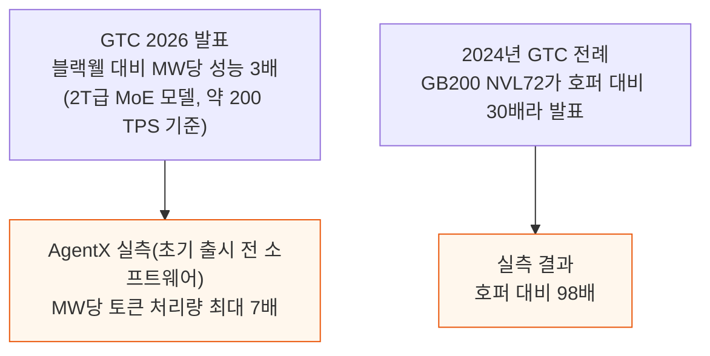
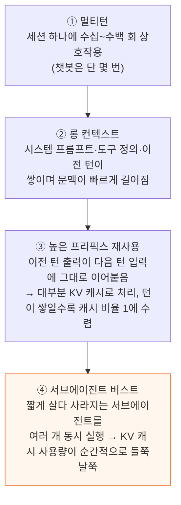
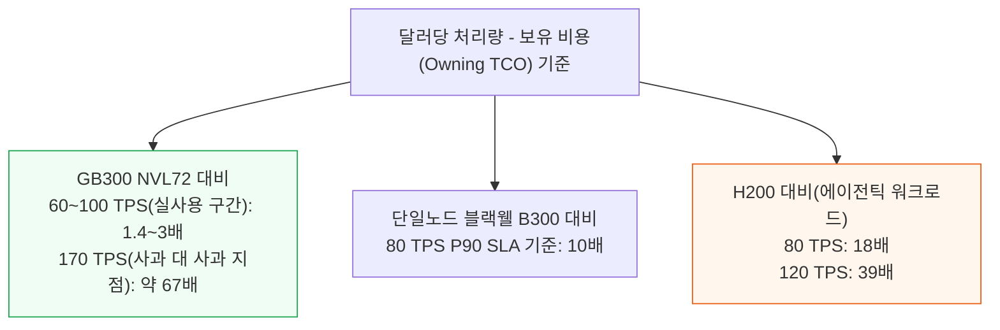
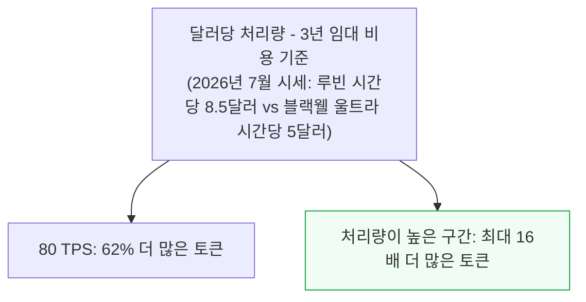
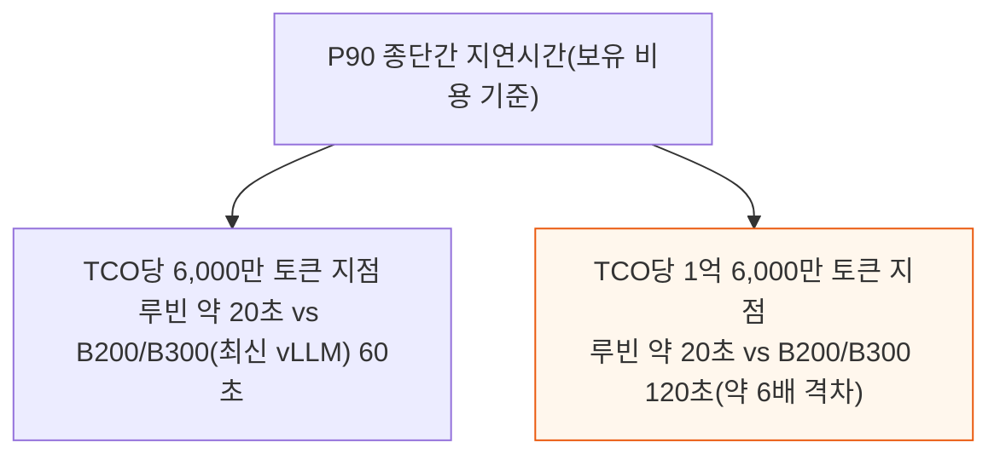
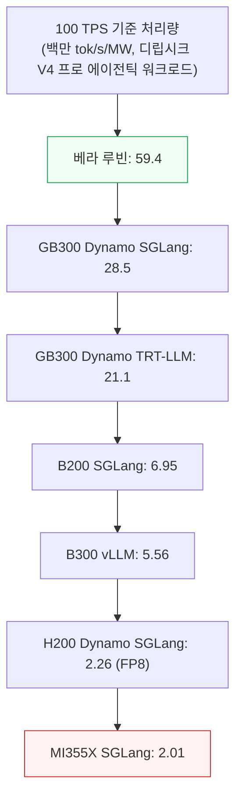
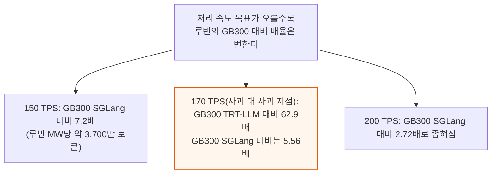
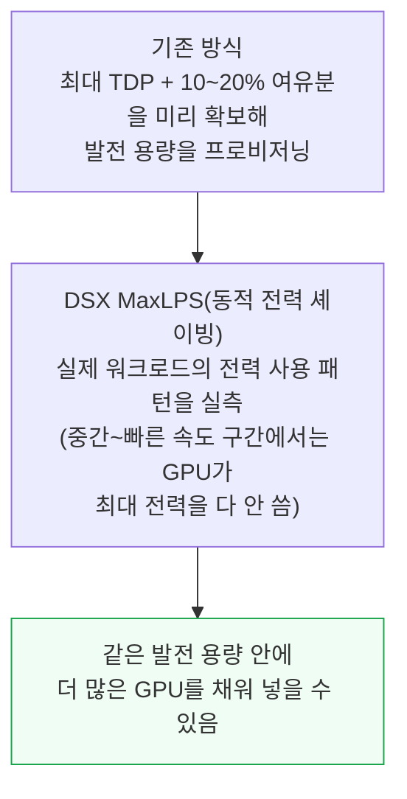
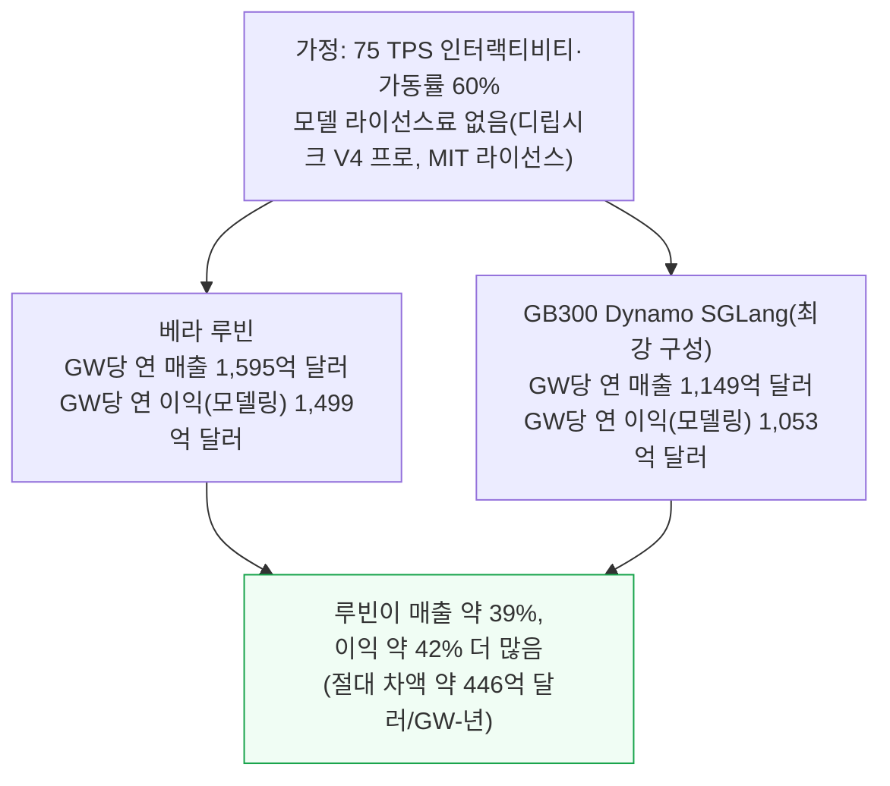
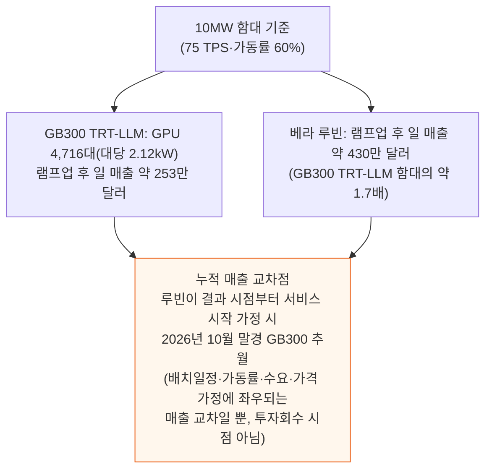

# Vera Rubin NVL72 Agentic Inference: 67x better Performance per Dollar

> **출처**: [SemiAnalysis Newsletter](https://newsletter.semianalysis.com/p/vera-rubin-nvl72-agentic-inference)
> **저자**: Bryan Shan, Alec Ibarra, Cam Quilici
> **발행일**: 2026-09-14

---

## 📑 목차

### 전체 섹션
1. [지금 무슨 일이 벌어졌나 - AgentX 실측 대 GTC 발표](#1-지금-무슨-일이-벌어졌나---agentx-실측-대-gtc-발표)
2. [에이전틱 워크로드란 무엇인가](#2-에이전틱-워크로드란-무엇인가)
3. [TCO 대비 성능 - GB300보다 최대 67배](#3-tco-대비-성능---gb300보다-최대-67배)
4. [와트당 성능 - 젠슨이 또 실력을 숨겼다](#4-와트당-성능---젠슨이-또-실력을-숨겼다)
5. [GW당 연 매출과 이익 - 많이 살수록 많이 번다](#5-gw당-연-매출과-이익---많이-살수록-많이-번다)

---

## 🔑 용어 정리

본문을 순서대로 읽기 전에 알아두면 좋은 용어들입니다. 자세한 수치와 설명은 본문에서 처음 등장하는 위치에 나옵니다.

- **AgentX**: SemiAnalysis가 실제 에이전틱(도구를 스스로 호출하며 여러 턴을 거치는) 트래픽을 재생해 칩 함대에서 직접 측정하는 추론 벤치마크 시나리오 — 이 글의 모든 실측치가 여기서 나온다
- **에이전틱 워크로드**: 사람이 한 번 묻고 답을 받는 챗봇과 달리, 하나의 세션 안에서 모델이 수십\~수백 번 도구를 호출하고 문맥을 쌓아가며 일을 처리하는 작업 방식
- **TCO(Total Cost of Ownership, 총소유비용)**: 칩 값뿐 아니라 서버·네트워크·전력·냉각·자본비용까지 다 더해 "이 하드웨어를 굴리는 데 실제로 얼마가 드는가"를 나타내는 값 — 이 글의 모든 "달러당 토큰" 계산의 분모
- **P90 인터랙티비티(interactivity)**: 응답이 얼마나 매끄럽게 술술 나오는지를 나타내는 지표로, 응답 하나가 끝날 때까지 토큰 사이사이 걸린 시간(P90 기준) 을 뒤집은 값 — 값이 클수록 사용자가 체감하는 응답 속도가 빠르다
- **tok/s/MW(메가와트당 토큰 처리량)**: 전력 1MW를 쓸 때 초당 몇 개의 토큰을 만들어내는지 — 전력이 부족한 시대에 "같은 전기로 얼마나 버는가"를 재는 핵심 잣대
- **NVL72**: 엔비디아 GPU 72개를 하나의 초고속 연결망으로 묶어 마치 GPU 한 개처럼 동작시키는 랙스케일 시스템 — 블랙웰(GB200/GB300)과 루빈 세대 모두 이 구조를 쓴다
- **DSX MaxLPS(동적 전력 셰이빙)**: 데이터센터 전력을 최대치 기준으로 미리 다 배정해두는 대신, 실제 워크로드가 쓰는 전력을 실시간으로 재서 남는 여유분에 GPU를 더 채워 넣는 엔비디아의 새 전력 관리 기능

---

## 1. 지금 무슨 일이 벌어졌나 - AgentX 실측 대 GTC 발표

**📌 핵심:**
- 젠슨 황은 GTC 2026에서 베라 루빈 NVL72가 블랙웰 대비 MW(메가와트)당 성능 3배라고 발표했지만, SemiAnalysis가 초기 출시 전 소프트웨어로 실측한 결과는 MW당 토큰 처리량 최대 7배였다 — 발표치의 2배 넘게 실제 성능이 더 좋았다
- 2024년 GTC에서도 같은 패턴이 있었다 — 젠슨은 GB200 NVL72가 호퍼 대비 30배 빠르다고 했지만, 실측 결과는 98배였다
- 이번 실측은 SemiAnalysis의 에이전틱 추론 벤치마크 AgentX로 진행했고, 구글 클라우드·마이크로소프트 애저·오라클·메타 같은 실제 대형 구매자와 vLLM·SGLang·PyTorch·허깅페이스 등 오픈소스 진영, 오픈AI·미니맥스·ZAI·Qwen·문샷 Kimi 같은 주요 AI 랩이 검증·지지한다
- 결론: 초기 소프트웨어 단계에서도 루빈은 블랙웰 대비 GW(기가와트)당 이익을 2배 넘게 벌 수 있고, 소프트웨어 스택이 성숙하고 개발자들이 루빈 최적화 경험을 쌓을수록 이 격차는 더 벌어질 전망이다

---

AgentX는 실제 에이전틱 트래픽을 SemiAnalysis가 보유한 수천 개 칩 함대에 그대로 재생해 측정하는 업계 표준 벤치마크 시나리오다. 실제 추론 사업자·초대형 AI 랩이 어떤 시나리오에서 어떤 칩이 효율적인지 판단할 수 있도록, 결과를 그대로 참고할 수 있게 설계됐다.

InferenceX(이 벤치마크를 운영하는 SemiAnalysis 프로젝트)는 TPUv7·엔비디아·AMD를 동시에 측정하는 세계 유일의 추론 벤치마크이며, 곧 삼바노바·트레이니움도 추가된다. AgentX가 실제 에이전틱 워크로드를 워낙 사실적으로 재현하는 덕에, AMD도 MI455X UALoE72 협업에 합의했다.

---

## 2. 에이전틱 워크로드란 무엇인가

**📌 핵심:**
- 에이전틱 워크로드는 챗봇과 근본적으로 다르다 — 챗봇이 한 세션에 몇 번 주고받는 대화라면, 에이전틱 세션은 사용자와 어시스턴트 사이 수십\~수백 번의 상호작용으로 구성된다
- 대화가 이어질수록(턴이 쌓일수록) 시스템 프롬프트·도구 정의·이전 턴이 누적돼 문맥이 빠르게 길어진다
- 대화가 순서대로 이어지는 구조라 이전 턴의 출력이 다음 턴 입력에 그대로 붙는데, 그 덕분에 문맥 대부분을 매번 다시 계산하지 않고 KV 캐시(이전 계산 결과를 저장해두는 메모리)에서 그대로 꺼내 쓸 수 있다 — 턴이 쌓일수록 캐시로 처리되는 비율이 1(100%)에 가까워진다
- 결론: 세션 하나가 짧게 살다 사라지는 여러 서브에이전트를 동시에 띄우기도 하는데, 매번 새 문맥으로 시작하는 이 서브에이전트들이 KV 캐시 사용량을 순간적으로 들쭉날쭉하게 만든다 — 멀티턴·롱컨텍스트·높은 프리픽스 재사용·서브에이전트 버스트, 이 네 가지 특징을 전부 견디는 하드웨어가 필요하다는 뜻이다

---

---

## 3. TCO 대비 성능 - GB300보다 최대 67배

**📌 핵심:**
- 성능/TCO(달러 1당 만들어내는 토큰 수)는 가속기 성능을 재는 핵심 지표다 — 초당 토큰속도(TPS) 170에서 같은 조건(TRT-LLM, NVFP4 Dense)으로 비교하면 베라 루빈 NVL72는 GB300 Dynamo TRT-LLM 대비 TCO당 처리량이 약 67배다(보유 비용 기준)
- 다만 실제로 서비스하는 60\~100 TPS 구간에서는 격차가 1.4\~3배로 좁혀진다 — 67배는 GB300 곡선이 거의 한계에 다다른 지점에서 나온 값이라는 뜻이라, 실사용 구간 수치를 함께 봐야 한다
- 3년 임대 비용(2026년 7월 기준 루빈 시간당 8.5달러, 블랙웰 울트라 NVL72 시간당 5달러) 기준으로도 80 TPS에서 62% 더 많은 토큰을, 처리량이 높은 구간에서는 최대 16배 더 많은 토큰을 만들어낸다
- 결론: H200과 비교하면 격차가 훨씬 크게 벌어진다 — 80 TPS에서 18배, 120 TPS에서 39배 더 많은 토큰을 달러당 뽑아낸다 — "돈이 있으면 사거나 빌려야 한다"는 것이 이 수치가 말하는 결론이다

---

성능/TCO는 어떤 시나리오에서 컴퓨트에 쓴 1달러당 토큰을 몇 개 만들어내는지를 나타낸다. 시나리오별 총처리량을 실제 서빙 비용(칩당 시간당 비용 × 사용한 칩 수)으로 나눠 계산하며, InferenceX는 이 비용을 두 방식으로 제공한다.

- **보유 비용(Owning)**: 하이퍼스케일러급 대량구매 기준, 서버·네트워크 자본비용·전력·임대료·자본조달 비용을 내용연수에 걸쳐 나눈 값
- **3년 약정 임대가(Rent)**: SemiAnalysis 임대 시세 설문에 기반한 3년 약정 시장가

루빈 랙은 트레이당 TDP(Thermal Design Power, 열설계전력) 2,300W·CPU LPDDR5X 1.5TB의 양산 SKU를 쓴다.

베라 루빈은 최대 P90 인터랙티비티에서도 GB300 Dynamo TRT-LLM 대비 약 61% 높다(276.24 대 171.53 P90 TPS).

다만 GB300이 오픈소스 SGLang 스택을 쓰면 루빈과 비슷해진다 — 지금 결과는 초기 출시 전 TRT-LLM 기준이라, 특히 극단 구간에서는 앞으로 더 개선될 여지가 크다.

지연시간도 중요한 잣대다 — TPS(인터랙티비티)가 헤드라인을 장식하지만, TTFT(첫 토큰까지 걸리는 시간)와 종단간 지연시간도 실제 서빙 SLA의 사실상 표준이다.

> "많이 살수록 많이 번다(the more you buy, the more you earn)" — 젠슨 황

이 결과가 말하는 교훈은 단순하다. 베라 루빈 NVL72를 살 돈이나 빌릴 돈이 있다면 그렇게 해야 한다 — 다음으로 좋은 가속기보다 훨씬 싼 토큰을 만들어내 훨씬 많은 돈을 벌어준다는 뜻이다.

에이전틱 워크로드에서 루빈과 H200의 격차는 "H200을 계산기 수준으로 만든다"고 표현할 만큼 크다. 이 우위는 오프라인 배치 추론보다 대화형 서빙·학습 쪽에서 더 두드러진다 — 대형 랩들이 호퍼를 서서히 이쪽으로 옮기는 이유다.

---

## 4. 와트당 성능 - 젠슨이 또 실력을 숨겼다

**📌 핵심:**
- 전력이 이미 확보된 데이터센터는 그 자체로 희소자원이라, GW당 더 많은 토큰을 뽑아낼수록 GW당 더 많은 매출과 이익을 번다
- 디립시크 V4 프로 에이전틱 워크로드에서 100 TPS 기준 루빈은 MW당 5,940만 토큰을 처리해, 가장 강한 GB300 구성(SGLang, MW당 2,850만 토큰)보다 2.09배, MI355X(SGLang, MW당 201만 토큰)보다 29.5배 많다
- 목표 처리 속도가 올라갈수록 배율은 달라진다 — 150 TPS에서는 GB300 SGLang 대비 7.2배, 200 TPS에서는 2.72배로 좁혀지고, 170 TPS라는 정확한 지점에서는 GB300 TRT-LLM(곡선이 한계에 가까운 지점) 대비 62.9배까지 벌어진다
- 결론: 새 기능 DSX MaxLPS(동적 전력 셰이빙)는 최대 전력치에 10\~20% 여유분을 얹어 미리 설계하던 기존 방식 대신, 실제 워크로드의 전력 사용 패턴을 실측해 같은 발전 용량 안에 더 많은 GPU를 채워 넣는다

---

칩을 더 많이 배치하는 데 걸림돌이 되는 건 대개 이미 전력이 들어온 데이터센터의 남은 자리다. 전력 효율이 중요한 이유가 여기 있다 — GW당 더 많은 토큰을 만들어낼수록 GW당 더 많은 매출과 이익을 벌 수 있다.

P90 인터랙티비티는 응답 하나가 끝날 때까지 토큰 사이사이 걸린 시간(P90 기준)을 뒤집은 값이다. 같은 인터랙티비티 목표에서 곡선이 더 높다는 것은 같은 전력 예산으로 더 많은 트래픽을 처리할 수 있다는 뜻이다(첫 토큰까지 걸리는 시간·전체 응답시간은 앞 절의 지연시간 분석에서 별도로 다뤘다).

베라 루빈·B200·B300·MI355X는 FP4로, H200만 FP8로 측정했다 — 서로 다른 하드웨어·소프트웨어 구성(캐싱·병렬화 방식 포함)을 실측한 값이라는 점도 함께 봐야 한다.

목표 처리 속도가 오르면 배율은 곡선을 따라 계속 바뀐다. 가장 강한 GB300 엔진도 목표에 따라 달라진다 — 75 TPS에서는 TRT-LLM이, 더 높은 구간에서는 SGLang이 앞선다.

전력을 다루는 또 다른 축은 DSX MaxLPS(동적 전력 셰이빙)다. 지금까지는 전체 TDP 최대치에 10\~20% 여유분을 더한 값으로 발전 용량을 미리 배정했다.

DSX MaxLPS는 실제 워크로드(와 앞으로 들어올 워크로드)의 전력 프로파일을 실측해 그만큼만 배정한다 — 중간\~빠른 속도 구간에서는 GPU가 최대 전력을 다 쓰지 않기 때문에, 배분을 똑똑하게 하면 같은 전력 안에 더 많은 GPU를 채울 수 있다.

앞으로 InferenceX에 PowerX를 통합하면 GW당 처리량을 더 세밀하게 측정할 수 있게 된다.

---

## 5. GW당 연 매출과 이익 - 많이 살수록 많이 번다

**📌 핵심:**
- 같은 전력 한도 안에서 루빈은 단순히 토큰을 더 많이 처리하는 게 아니라, 추가로 전력을 확보하지 않고도 더 많은 수요를 돈으로 바꿀 수 있는 여력을 준다
- 75 TPS·가동률 60%·모델 라이선스료 없음(디립시크 V4 프로는 MIT 라이선스) 기준으로 루빈은 GW당 연 매출 1,595억 달러·연 이익(모델링 추정치) 1,499억 달러를 낸다 — 가장 강한 GB300 구성(Dynamo SGLang)은 매출 1,149억 달러·이익 1,053억 달러로, 루빈이 매출은 약 39%, 이익은 약 42% 더 많다(절대 차액 약 446억 달러/GW-년)
- 같은 처리량·매출을 낸다고 가정하면 루빈은 토큰 가격을 약 28% 낮게 불러도 GB300과 같은 GW당 매출을 낼 수 있다 — 그 여유분을 이익으로 남기거나 가격 경쟁에 쓸 수 있다는 뜻
- 결론: 10MW 기준 GB300 함대는 램프업 이후 하루 약 253만 달러를, 루빈 함대는 하루 약 430만 달러(약 1.7배)를 번다 — 루빈이 지금 결과 시점부터 서비스를 시작한다고 가정하면 2026년 10월 말쯤 누적 매출에서 GB300을 추월한다(배치 일정·가동률·수요·가격 가정에 따라 달라지는 매출 교차 시점일 뿐, 투자 회수 시점이나 "루빈을 기다리는 게 항상 유리하다"는 증거는 아니다)

---

이 글을 쓰는 시점에 디립시크 V4 프로 1.6T는 디립시크 V4.1 플래시로 교체됐지만, 규모 면에서 여전히 1\~3조 파라미터급 LLM을 대표하는 값으로 쓸 만하다. 디립시크 V4 프로는 MIT 라이선스로 배포돼 별도 라이선스료가 없다.

정해진 전력 예산 안에서 루빈의 강점은 토큰을 더 많이 처리하는 것에 그치지 않는다. 전력회사로부터 전력을 추가로 확보하지 않고도, 늘어나는 수요를 그만큼 더 매출로 바꿀 수 있는 여력을 준다는 뜻이다.

두 구성의 GW당 연간 비용은 비슷하게 표시되기 때문에, 늘어난 매출 대부분이 그대로 이익으로 흘러간다.

워크로드 구성·처리량·과금 가동률을 고정한다고 가정하면, 루빈은 아래 세 종류 토큰 가격을 전부 약 28% 낮게 불러도 GB300 Dynamo SGLang과 같은 GW당 매출을 낼 수 있다.

- **캐시드 인풋**: 재사용되는 입력 토큰
- **언캐시드 인풋**: 새로 계산하는 입력 토큰
- **아웃풋 토큰**: 모델이 생성하는 출력 토큰

이 효율 이득을 이익으로 남길지, 가격을 낮춰 경쟁할지는 수요의 가격 탄력성에 달려 있다.

함대의 생애주기 전체로 보면 배치 시점과 가동 가능 여부까지 비교에 들어온다.

75 TPS·가동률 60% 기준으로 선택된 GB300 Dynamo TRT-LLM 구성은 10MW 안에 대당 2.12kW GPU 4,716대를 수용한다. 반 달의 램프업을 거치면 하루 약 253만 달러 매출을 내며, 이는 가용성 조정·GPU 대수 내림 처리를 반영한 연 941.16억 달러/GW 결과와 일치한다.

같은 조건에서 루빈 함대는 램프업 후 하루 약 430만 달러로, 선택된 GB300 TRT-LLM 함대의 약 1.7배다(앞서 연간 매출 비교에서 쓴 더 강한 GB300 SGLang 결과와는 다른 비교다).

누적 매출 비교는 일찍 배치하는 것과 더 생산성 높은 시스템을 기다리는 것 사이의 트레이드오프를 보여준다. GB300은 먼저 매출을 내기 시작한다는 초반 이점이 있지만, 루빈의 더 높은 일일 수익률이 그 격차를 점점 좁힌다.

루빈이 결과 시점부터 서비스를 시작한다고 가정하면 2026년 10월 말쯤 누적 매출에서 GB300을 추월한다 — 다만 이 시점은 배치 일정·램프업·가용성·수요 가정에 달린 매출 교차일 뿐, 자본 회수 시점이나 "기다리는 게 유리하다"는 증거는 아니다.

---

*작성 진행률: 100% 완료*
*업데이트: 와트당 성능(젠슨의 MW당 성능 실측·DSX MaxLPS)·GW당 연 매출과 이익(펀더멘털 비교·함대 생애주기·누적 매출 교차점) 섹션 추가, 전체 5개 섹션 완료*
