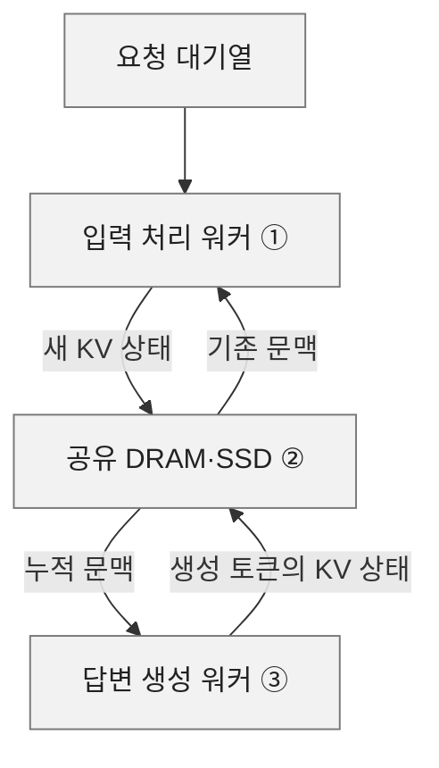
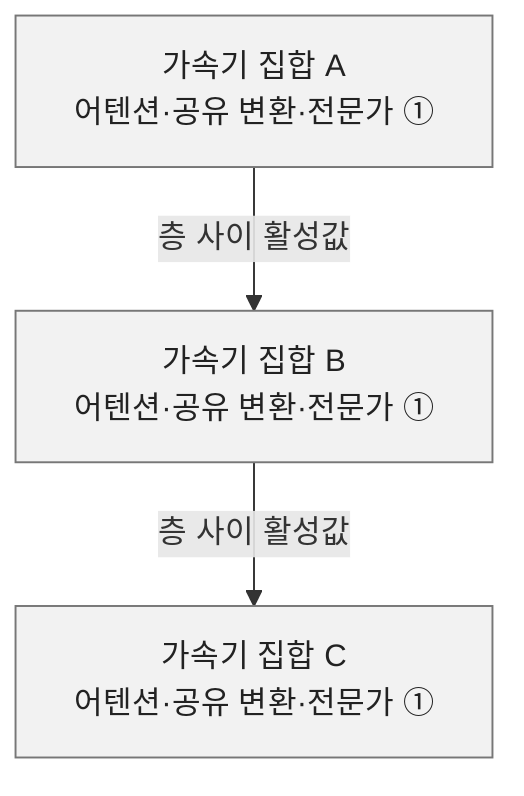

# Computation and Data Movement for Inference

> **출처**: [SemiAnalysis Newsletter](https://newsletter.semianalysis.com/p/computation-and-data-movement-for)
> **저자**: Tanj Bennett
> **발행일**: 2026-09-21

Tanj Bennett는 MoE(토큰마다 일부 전문가 신경망을 선택하는 모델)의 추론 성능을 총매개변수 수보다 실제 연산과 데이터 이동으로 설명한다. 같은 GPU도 입력 처리, 답변 생성, 문맥 저장을 어떻게 나누느냐에 따라 처리량과 응답 시간이 달라진다. 이 글의 Blackwell 비교는 실측 벤치마크가 아닌 Kimi K3 시뮬레이션이다.

## 차례

1. [문맥 저장](#s1)
2. [네 가지 추론 작업](#s2)
3. [모델과 GPU 배치](#s3)
4. [메모리 한계](#s4)
5. [작업 배정](#s5)
6. [Kimi K3 계산과 미확인 사항](#s6)

## 1. 대화가 이어질 때 문맥은 어디에 머무는가

① 처음 입력하거나 기존 대화에 추가한 토큰을 처리한다. ② 워커와 독립적으로 문맥을 보관한다. ③ 누적 문맥을 읽어 답변을 만든다. 연결은 데이터 이동이며 이동량을 나타내지 않는다.

요청과 답변 한 차례가 끝나도 대화는 이어진다. 원문의 AgentX 대화 기록에서는 문맥이 빠르게 늘다가 압축되며 줄어든다.

KV 캐시(이전 토큰의 어텐션 계산에 쓰는 키·값 상태)는 시스템 지시, 과거 대화, 도구 결과별로 변경하지 않는 블롭(데이터 묶음)에 담을 수 있다. 다음 요청은 필요한 블롭을 읽고 새 블롭을 덧붙인다. 내용을 고치려면 공통 경로를 덮어쓰는 대신 이전 지점에서 분기한다.

HBM(가속기에 붙은 고대역폭 메모리)에는 지금 계산하는 상태를 두고, 쉬는 문맥은 CPU DRAM과 공유 저장소로 옮긴다. 자주 쓰는 시스템 지시는 공유 캐시에 남기고, 재사용 가능성이 낮은 상태는 폐기하거나 SSD에 보관한다. 원래 텍스트로 KV를 재생성할 수 있지만 수치 계산이 미세하게 달라질 수 있어 보존 정책은 서비스마다 다르다.

RDMA(원격 메모리에 직접 접근하는 전송)를 지원하면 들어오는 문맥을 여러 GPU의 목적지 메모리에 병렬로 넣을 수 있다. 나가는 상태는 CPU 메모리에 먼저 모아 저장 위치와 복제 방식을 정할 수 있다. 대기열은 아직 배치가 아니며, 요청별로 빈자리에 들어가고 완료되면 빠지는 연속 배칭이 이를 연결한다.

## 2. 입력 처리와 답변 생성은 서로 다른 작업이다

추론을 ① prefill(새 입력을 처음 처리), ② midfill(저장된 문맥에 입력을 추가), ③ decode attention(답변 생성 중 문맥 조회), ④ decode experts(선택된 전문가 계산)로 구분해야 한다. 연산 강도는 이동한 데이터 1바이트당 계산량이다. 한 가중치를 여러 토큰에 재사용할수록 높아진다.

Prefill은 많은 새 토큰을 함께 처리해 가중치를 재사용한다. 어텐션이 토큰별 활성값(다음 계산으로 전달하는 중간 표현)을 만든 뒤 라우터가 전문가를 선택한다. 토큰 순서로 흩어진 요청을 전문가별로 정렬하면 전문가 가중치를 한 번 읽어 여러 토큰을 처리한다. 결과를 토큰 순서로 되돌려 합치고 다음 층으로 넘기며 새 KV도 남긴다.

원문 예시에서 새 토큰 128개가 각각 전문가 8개를 고르면 전문가 256개에 보낼 배정은 1,024건이다. 정렬·전송·순서 복원에 비용이 들고 특정 전문가가 넘치면 재배정도 필요하다. 입력 토큰이 수천 개면 요청 하나로도 재사용량이 상당해, 많은 사용자를 기다려 배치를 만들 필요는 줄어든다.

Midfill은 수십만 토큰의 기존 문맥에 보통 50∼5,000개의 새 토큰을 추가한다. 큰 KV 읽기와 새 토큰의 가중치 재사용이 동시에 생긴다. 긴 midfill을 진행 중인 decode 파이프라인에 넣으면 인접 단계가 기다릴 수 있어 전용 워커 구성이 유리할 수 있다.

Decode는 토큰 하나 또는 MTP(여러 토큰을 한꺼번에 예측하는 방식)의 소수 토큰으로 시작한다. 어텐션은 요청마다 다른 KV를 넓게 읽고, 이어 전문가 중 일부만 계산한다. 배치를 키워도 사용자끼리 KV 읽기를 공유하지는 못한다. 전문가 가중치는 공유할 수 있지만, 작은 배치에서 같은 전문가를 고르는 토큰은 적다.

256개 전문가를 72개 GPU에 나누면 GPU당 한 층의 전문가는 대략 3∼4개다. 여러 어텐션 인스턴스가 같은 층에 맞춰 실행되면 가중치 읽기를 공유하기 쉽지만 전면 교환 통신이 늘어난다. 전문가를 SRAM에 상주시켜 즉시 실행하는 분리형 설계는 동기화 부담을 줄일 수 있다. 다만 저자가 제시한 최대 100배의 바이트당 읽기 에너지 이점은 HBM 대비 조건부 비교이며, 수백 노드를 잇는 통신 비용이 전문가 계산 비용보다 커질 수 있다.

## 3. 모델의 반복 구조에 맞춰 GPU와 연결을 나눈다

① 각 집합 내부에서는 빠른 연결을 공유한다. 집합 세 개는 구조 설명용이며 실제 단계 수는 원문이 하나로 정하지 않는다.

모델은 같은 층 또는 전체 어텐션과 최적화 어텐션을 묶은 층 그룹을 반복한다. 처음 1∼3개 층이 다른 구조일 수도 있다. 한 토큰은 층을 순서대로 지나지만 다른 요청은 다른 단계에서 동시에 처리할 수 있다.

병렬화는 ① PP(층 묶음을 장비에 나눠 순차 처리), ② TP(큰 연산 하나를 여러 장비에 분할), ③ EP(독립적인 전문가를 여러 장비에 배치)로 나뉜다. PP의 경계에는 작은 활성값이 이동한다. 긴 문맥 어텐션은 KV 헤드나 문맥 범위로 나누고 부분 결과를 합친다. 작은 전문가 계산까지 무조건 TP로 나누면 통신 비용이 계산보다 커질 수 있다.

논리 노드는 빠른 스케일업 연결을 공유하는 가속기 집합이다. 원문의 16개 가속기 고리 그림은 동등한 관계를 표현하며 실제 링 배선을 권하지 않는다. 8 GPU 노드처럼 랙보다 작을 수도 있고 NVL72처럼 랙 전체일 수도 있다. 후자는 별도 랙 백본 계층이 사라진다.

같은 GPU와 메모리 채널은 어텐션, 공유 변환, 전문가 계산을 차례로 맡는다. 전문가 선택·부분 결과 결합처럼 자주 반복되는 교환은 가장 빠른 연결 안에 두고, 작은 층간 활성값과 여러 토큰에 걸쳐 비용을 나눌 수 있는 KV 이동은 스케일아웃 연결로 보낸다. 전문가 계산이 수 마이크로초면 홉마다 100ns가 추가되는 것도 무시하기 어렵다.

층 그룹 단위의 규칙적인 PP 분할이 배포를 단순하게 하지만 절대 규칙은 아니다. 층간 특별한 의존성이 없다면 그룹 중간에서 나눌 수도 있다.

## 4. 파이프라인을 늘려도 문맥 메모리는 남는다

PP를 P개 단계로 늘리면 단계별 가중치는 이상적으로 전체의 1/P이 된다. 하지만 모든 단계를 채우려면 서로 다른 요청도 P개 필요하다. 8단계의 각 단계가 요청 8개의 KV 중 8분의 1씩 보관하면 KV는 가중치처럼 줄지 않는다. 가중치가 KV·작업 상태와 비슷해진 뒤에는 PP를 더 늘려 얻는 용량 절약이 작고 전환 지연이 추가된다.

원문의 설계 예시는 토큰당 KV 70kB, 한 단계에 배정한 총문맥 200만 토큰으로 약 140GB를 계산한다. 계산 중인 상태와 전송 중인 상태를 함께 두는 이중 버퍼링을 적용하면 약 280GB다. 가중치·활성값·임시 버퍼·단편화·운영 여유까지 넣어 2027년의 단계당 빠른 메모리 설계 기준을 약 400∼500GB로 제안한다. 출시 제품의 확정 사양이나 모든 모델의 최소 요구량이 아니다.

압축 어텐션과 하이브리드 구조는 요구량을 바꾼다. 저자는 일부 최신 하이브리드의 평균으로 토큰당 약 25kB도 가능하다고 보며, 70kB는 검증된 압축 어텐션 설계의 보수적 참고치로 쓴다. 스트리밍·부분 상주·추가 저장 계층도 요구량을 낮춘다. 큰 MoE 가중치 메모리의 95% 이상을 차지하는 라우팅 전문가는 소켓별로 나누기 쉽고, KV는 헤드·문맥·인스턴스별로 나눌 수 있다.

용량은 활성 상태와 운영 여유가 들어갈 때까지 중요하다. 그 뒤 남는 HBM에 쉬는 문맥을 쌓아도 토큰 생산이 늘지는 않는다. 높은 적층 용량은 전력·패키징·신호 품질·주파수에 비용을 줄 수 있다. 저자는 충분한 용량을 갖춘 뒤에는 더 높은 대역폭이 유리할 수 있다고 본다. 긴 문맥의 작은 decode 배치는 이미 큰 읽기 작업이므로, 배치를 키워 얻는 처리량보다 응답 지연과 KV 부담이 더 커질 수 있다.

## 5. 작업 배정과 저장이 가동률을 결정한다

저자는 50만 토큰 규모의 문맥에서 하이브리드 본딩·3D RAM이 용량과 대역폭을 함께 확보하는 방향에 주목한다. Vera Rubin 72도 연산이 많은 midfill에 비해 메모리 이동이 많은 decode에서는 연산 능력을 충분히 쓰기 어렵다고 본다. 큰 문맥을 다른 노드로 옮기지 않고 같은 노드에서 두 작업을 처리하는 이점이, 연산과 메모리가 모두 강한 칩에 유리할 수 있다는 주장이다.

규모가 큰 서비스는 긴 입력, 짧은 입력, 긴 문맥 답변 등으로 워커를 구성하고 수요에 맞춰 배정한다. 입력 처리는 문맥과 새 토큰 수를 알면 시간을 비교적 예측하기 쉽지만, 답변은 종료 토큰이 나올 때까지 길이를 모른다. 완료된 입력 작업을 대기 버퍼에 두면 이 차이를 흡수하면서 작은 배치로도 GPU를 계속 사용할 수 있다.

답변 하나가 끝날 때마다 입력을 허용하면 긴 답변 때문에 입력이 막히고, 나중에는 decode 대기열이 비며, 다시 입력을 한꺼번에 받아 혼잡해질 수 있다. 저자는 평활화한 적체량과 예상 처리율, 준비 버퍼, 짧은 요청용 여유, 워커 재구성의 히스테리시스(조건이 잠깐 바뀌었다고 즉시 되돌리지 않는 제어)를 제안한다.

한 워커에서 한 차례의 입력과 답변을 모두 처리하는 통합형도 가능하다. 단계 사이 KV 전송과 재배정 대기를 없애고 전문가를 공유하지만 연산과 메모리 모두 강한 장비가 필요하다. 분리형은 입력용 연산과 답변용 메모리에 투자를 맞출 수 있지만 배정과 저장이 제대로 작동해야 한다. 어느 방식이든 대화가 수분·수시간 멈추면 문맥을 HBM에 계속 묶어둘 이유는 약하다.

실제 배치 순서는 작업 종류와 층 그룹을 구분하고, 총매개변수 대신 활성 상태를 센 뒤, 가장 넓은 어텐션부터 배정하는 것이다. 전문가의 위치를 규칙적으로 정해 읽기와 용량을 고르게 쓰고, 잦은 통신을 강한 연결 안에 둔다. KV 부담 때문에 PP 효과가 둔화되는 지점에서 멈추며 입력은 전문가별 정렬을, 답변은 작은 배치를 활용한다. 저장·입장 제어·워커 재구성까지 함께 설계해야 한다.

제어 시간도 구분한다. 원문은 층 실행 약 50μs∼1ms, 준비 버퍼 약 0.1∼10초, 워커 재구성 수초∼수분, KV 보존 수분∼수일을 제시한다. 60층 모델의 층 실행 범위는 대략 초당 15∼300개 생성 토큰에 대응한다. 커널 실행·동기화·링크 지연이 짧은 계산을 압도할 수 있어 대역폭만 높아서는 충분하지 않다. 시간·일 단위 수요 계획이 마이크로초 단위 변동에 매번 반응해서도 안 된다.

## 6. Kimi K3 계산이 보여준 결과와 아직 확인할 것

SemiAnalysis Inference Simulator는 B200·B300·GB200의 랙당 16∼64 GPU 구성을 비교했다. 그래프의 파레토 경계는 처리량을 희생하지 않고 응답 속도를 더 높이기 어려운 구성들을 잇는다.

8k·32k 문맥 decode에서 낮은 지연을 목표로 한 구성은 대체로 PP와 TP를 결합한다. GPU당 처리량을 높이는 끝에서는 TP·PP 없이 GPU마다 어텐션 인스턴스를 두고 EP를 넓히는 구성이 유리했다. GB200이 경계의 상당 부분에서 강하지만 B200·B300도 경쟁력 있는 지점이 있다.

127k 캐시에 1k를 추가하는 midfill은 GB200에서 PP 없이 TP=4 또는 2가 낮은 첫 토큰 지연에 유리했다. 처리량 쪽으로 가면 B300이 따라붙는다. B200·B300은 대체로 PP=4로 전문가 통신을 노드 안에 둔다. 8k·32k prefill은 세 장비 모두 PP=4에 TP=4 또는 2를 택하며 비슷해졌다.

에너지는 출력 1,000토큰을 가정한 decode가 가장 크다. 요청마다 모델을 약 1,000번 통과하기 때문이다. Midfill은 기존 문맥에 짧은 입력을 추가해 가장 작고, 전체 prefill은 8k보다 32k의 에너지가 크다. 계산에는 Kimi K3의 국소 어텐션에 따른 상태·연산 절약이 포함됐다.

메모리 그래프는 KV 입출력 버퍼를 제외한 GPU당 최대 HBM 상주량이다. 실용적인 전송 버퍼를 더해도 경계의 대부분은 약 80GB 아래에 머문다고 저자는 설명한다. Prefill·midfill은 PP와 TP·데이터 병렬화로 상주량을 줄였고 decode는 TP·데이터 병렬화를 먼저 활용했다.

네트워크에서는 입력 처리의 전문가 교환이 크다. GB200 NVL72는 랙 전체를 빠르게 연결해 더 많은 GPU가 같은 층에 참여할 수 있다. Decode의 낮은 구간 평균 피크는 순간 링크 속도가 낮다는 뜻이 아니다. 작은 전송도 순간적으로 NVLink의 물리 속도로 발생한다.

원문은 오케스트레이션 소프트웨어의 구체적인 선택법, 통합형과 분리형의 실측 총비용, 모든 문맥 길이에서의 최적 구성을 확정하지 않는다. 같은 모델과 문맥에서 KV 전송 버퍼·저장소·배정 지연까지 포함한 실측이 나오면 80GB 수준의 상주량과 구성별 우위가 유지되는지 다시 판단할 수 있다.

---

*작성 진행률: 100% 완료*
*업데이트: 원문 도입부·AgentX 사례·1∼23절·맺음말을 여섯 절로 통합. 원문 23절 안의 22.1∼22.4 표기는 원문 번호 오기이며 네 비교 항목을 모두 반영했다.*
