# ClusterMAX 3.0: The Industry Standard GPU Cloud Rating System Returns

> **출처**: [SemiAnalysis Newsletter](https://newsletter.semianalysis.com/p/clustermax-30-the-industry-standard)
> **저자**: Jordan Nanos, Sam Harshe, Samuel Kruse
> **발행일**: 2026-09-23

---

## 📑 목차

### 전체 섹션
1. [등급 결과 요약 - 77개 사업자, 플래티넘은 둘뿐](#1-등급-결과-요약---77개-사업자-플래티넘은-둘뿐)
2. [범위 - 관리형 클러스터는 왜 아직 필요한가](#2-범위---관리형-클러스터는-왜-아직-필요한가)
3. [테스트 방법론 - 감사, 성능, 신뢰성 3단계](#3-테스트-방법론---감사-성능-신뢰성-3단계)
4. [곧 나올 테스트 - 에이전트용 CPU와 강화학습](#4-곧-나올-테스트---에이전트용-cpu와-강화학습)
5. [업계 동향 1 - 금융 (부채, 엔비디아 백스톱, 감가상각)](#5-업계-동향-1---금융-부채-엔비디아-백스톱-감가상각)
6. [업계 동향 2 - 블랙웰에서 베라 루빈으로](#6-업계-동향-2---블랙웰에서-베라-루빈으로)
7. [업계 동향 3 - 스케일아웃 네트워크](#7-업계-동향-3---스케일아웃-네트워크)
8. [업계 동향 4 - 신뢰성, 헬스체크, 자동 복구, SLA](#8-업계-동향-4---신뢰성-헬스체크-자동-복구-sla)
9. [업계 동향 5 - 보안과 에이전틱 코딩](#9-업계-동향-5---보안과-에이전틱-코딩)
10. [앞으로의 방향과 밸류에이션 해석](#10-앞으로의-방향과-밸류에이션-해석)
11. [부록 1 - 플래티넘 (CoreWeave, Nebius)](#11-부록-1---플래티넘-coreweave-nebius)
12. [부록 2 - 골드 (Google Cloud, Oracle)](#12-부록-2---골드-google-cloud-oracle)
13. [부록 3 - 실버 (Lambda, Microsoft, Firmus, TensorWave, GMI)](#13-부록-3---실버-lambda-microsoft-firmus-tensorwave-gmi)
14. [부록 4 - 브론즈 (AWS부터 Hyperstack까지)](#14-부록-4---브론즈-aws부터-hyperstack까지)
15. [부록 5 - 참가상과 비추천 - 성능 미달](#15-부록-5---참가상과-비추천---성능-미달)
16. [부록 6 - 비추천 - 이용 불가](#16-부록-6---비추천---이용-불가)

---

## 🔑 용어 정리

본문을 순서대로 읽기 전에 알아두면 좋은 용어들입니다. 자세한 수치와 설명은 본문에서 처음 등장하는 위치에 나옵니다.

- **네오클라우드(neocloud)**: 아마존·구글 같은 범용 클라우드와 달리 GPU 임대를 본업으로 삼는 신생 클라우드 사업자 — CoreWeave, Nebius가 대표적이다
- **관리형 클러스터**: 하드웨어만 빌려주는 베어메탈과 달리, 헬스체크·모니터링·소프트웨어 이미지 관리까지 사업자가 맡아 주는 GPU 묶음 — ClusterMAX가 평가하는 대상
- **Slurm / Kubernetes**: GPU 작업을 줄 세워 배정하는 두 가지 관리 소프트웨어. Slurm은 연구용 배치 작업에, Kubernetes는 컨테이너 기반 서비스에 익숙하다
- **번인(burn-in)**: 새 클러스터에 GPU와 네트워크를 동시에 최대로 몰아쳐 몇 시간 돌려 보며 초기 불량을 걸러내는 부하 시험
- **굿풋(goodput)**: 돈 내고 빌린 GPU 시간 가운데 실제로 쓸모 있는 학습·추론에 쓰인 비율 — 장애로 멈춘 시간은 빠진다
- **NVL72**: 엔비디아 GPU 72개를 하나의 고속 연결망(NVLink)으로 묶어 랙 하나를 한 대처럼 쓰는 시스템
- **자동 복구(autoremediation)**: 장애가 감지되면 사람이 개입하기 전에 재부팅이나 예비 노드 교체를 자동으로 실행하는 체계
- **멀티플레인 네트워크**: 한 NIC(네트워크 카드)의 대역폭을 여러 독립 스위치망(플레인)으로 쪼개 연결해, 스위치 한 대로 더 많은 GPU를 잇는 구조

---

## 1. 등급 결과 요약 - 77개 사업자, 플래티넘은 둘뿐

**📌 핵심:**
- ClusterMAX 3.0은 77개 사업자를 평가했고, 시장 조망 범위는 2.0의 209곳에서 323곳으로 넓어졌다
- Nebius가 CoreWeave와 함께 최상위 플래티넘에 올랐다 — 기술 기준은 CoreWeave가, 가격 프리미엄 지속력은 Nebius가 보여 줬다
- 기준을 높여 메달(Medallion) 등급을 받은 곳은 전 세계 19곳뿐이고, 브론즈와 성능 미달 사이에 15곳짜리 새 "참가상" 등급을 만들었다
- 결론: 8개월 사이 GPU 공급은 바닥나고 투자금은 넘쳤지만, 관리 품질로 가르면 상위권은 오히려 좁아졌다

---

ClusterMAX는 SemiAnalysis가 GPU 클라우드를 직접 써 보고 매기는 등급제다. 아래 다이어그램은 3.0에서 등급이 어떻게 이동했는지 위에서 아래 순서로 정리한 것이다.

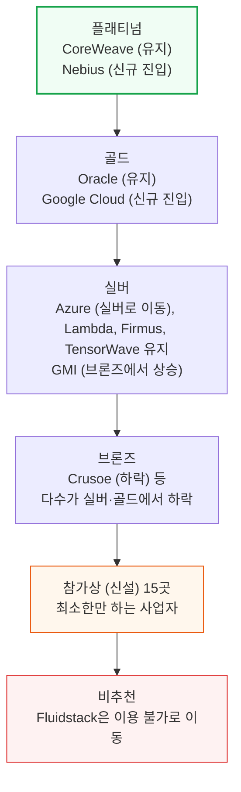

조사 규모도 해마다 커졌다. 아래 다이어그램은 시장 조망 사업자 수의 변화다.

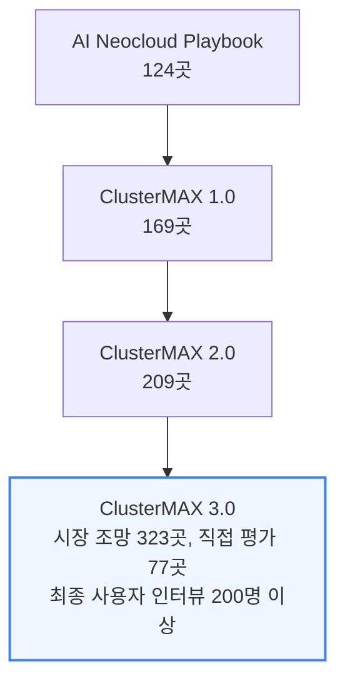

평가 기준은 10개 범주로 세분한 항목표와, Slurm·Kubernetes·단독 머신·모니터링 대시보드·헬스체크에 거는 기대치 문서로 웹사이트에 공개돼 있다. 저자들은 사업자가 서비스를 설계할 때 이 목록을 쓰라고 권한다. 목록은 최종 사용자 인터뷰를 종합한 것이어서, 고객이 기대하는 기능을 대변한다.

Nebius는 강한 사업 판단으로 네오랩(자체 모델을 만드는 신생 AI 연구소) 전반에 "판매자 가격"으로 팔 수 있는 위치를 얻었다.

---

## 2. 범위 - 관리형 클러스터는 왜 아직 필요한가

**📌 핵심:**
- ClusterMAX는 사업자가 관리해 주는 클러스터만 평가한다 — 전력·건물, 토큰 단위 API 판매, 직접 만든 이미지는 대상이 아니다
- 오픈AI·앤트로픽 같은 최상위 연구소는 쿠버네티스 스케줄러와 제어부까지 직접 만지므로 네오클라우드에 기대는 폭이 좁다 — 두 회사가 공고한 쿠버네티스 관련 직무의 연봉 범위 합계만 약 2,777만\~4,269만 달러다
- 두 회사는 2027년 말 연구소 컴퓨트의 56.3%를 차지할 것으로 모델링되지만, 수억 달러 단위의 중소 계약이 길게 이어지는 관리형 시장도 지수적으로 커지는 중이다
- 결론: 오픈소스 모델이 점유율을 늘리거나 공급이 흔들릴수록 연구소는 인프라를 직접 맡을 이유가 줄어 관리형 클러스터의 입지가 오히려 커진다

---

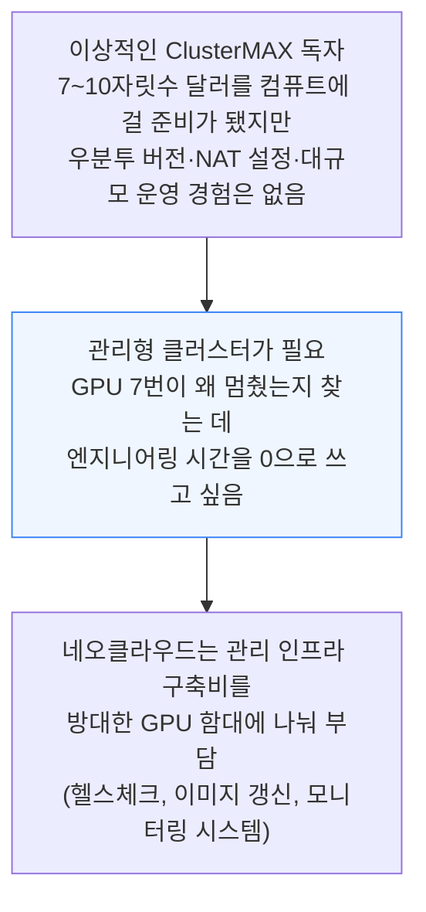

경제 논리는 단순하다. 네오클라우드는 엔지니어 팀을 두고 튼튼한 헬스체크와 최신 머신 이미지를 만든 뒤 그 비용을 큰 함대에 나눠 회수한다. 연구소는 웃돈을 내는 대신 하드웨어 걱정 없이 실험을 돌리니 양쪽이 이익이다.

그러나 규모가 커지면 연구소가 이 비용을 내부화한다. 오픈AI는 쿠버네티스 7,500노드 확장의 어려움을 블로그로 밝혔고, 그런 혁신은 제어부를 열어 주지 않는 네오클라우드에선 불가능했다. 앤트로픽 채용 공고도 스케줄러를 직접 소유하고 apiserver·etcd·컨트롤러까지 확장한다고 적는다.

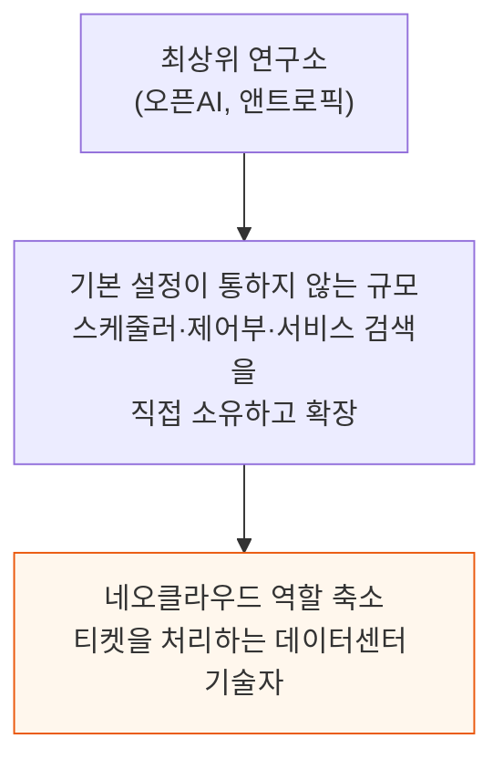

따라서 "트릴리언 달러 유동화 사건"을 기대하지 않는 중소 고객은 여전히 네오클라우드가 어려운 일을 대신해 줘야 한다. 저자들은 이 비대칭을 "마태 원리"로 부른다. 수익성 있는 선두 연구소는 용량을 쉽게 잠그지만, 작은 곳은 두툼한 선불금과 나쁜 가격을 떠안고 수년 앞 계획도 어렵다.

관리형 시장이 죽었느냐는 물음에 저자들의 답은 아니라는 것이다. 앤트로픽과 오픈AI가 해마다 더 큰 몫을 가져가도 관리형은 여전히 지수적으로 성장하고, 수억 달러급 소형 계약의 합이 크다. 저자들이 계산한 오픈소스 토큰 판매는 MW당 연 1억 달러를 넘게 번다.

선두 연구소의 베어메탈 구매가 비중을 늘려도 오픈소스가 점유율을 키우면 관리형이 상대적으로 힘을 얻는다. 한계 구매자가 비용에 민감해지든, 알고리즘 진보로 폐쇄형과의 격차가 줄든 마찬가지다.

이 클러스터 위층은 빠르게 성숙하지만 범위 밖이다. 토큰 단위로 과금하는 추론 엔드포인트, 오픈소스 모델을 용도에 맞게 손보는 후속학습 서비스, 에이전트용 샌드박스 서비스가 있고 경계는 흐릿하다. 한 클라우드가 남는 용량으로 엔드포인트를 띄울 수도, 샌드박스를 팔면서 자체 RL 서비스에 쓸 수도 있다.

---

## 3. 테스트 방법론 - 감사, 성능, 신뢰성 3단계

**📌 핵심:**
- 모든 사업자에게 GPU 32장, 800G 고속망, 고성능 파일 저장소 10TB+, 오브젝트 저장소 10TB+, 모니터링 대시보드, 슬럼·쿠버네티스 각 5일을 요청했다
- 블랙웰(B200·B300·GB200·GB300)이나 AMD MI355X만 인정한다 — H100은 출시 4년이 넘었다
- 3단계는 감사(약 15분, 예·아니오 점검) → 성능(마이크로·실제 벤치마크) → 신뢰성(번인·파괴 시험)이다
- 결론: 단순 GEMM 속도는 사업자 간 차이가 거의 없고, 저장소·네트워크·장애 대응에서 점수가 갈린다

---

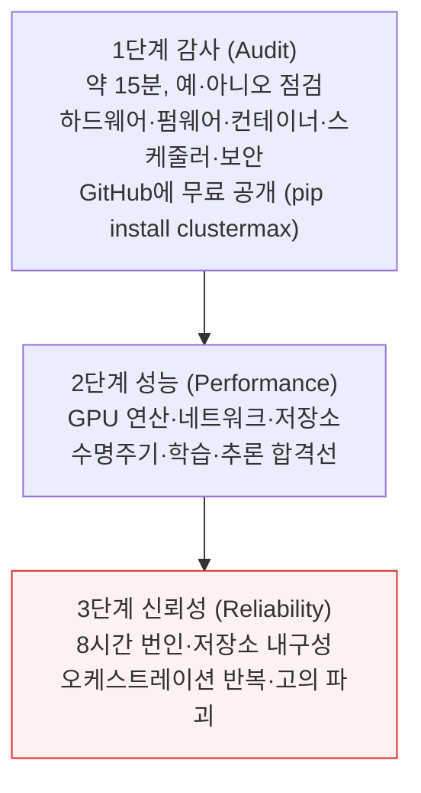

실험실 테스트와 별개로 여러 사업자의 고객도 직접 접촉해 의견을 반영한다. 그래도 직접 만져 볼 수 없는 영역(대규모 성능, 시간 경과에 따른 신뢰성, 지원 경험, 가격, GPU 확보와 인도 일정)은 다른 조사로 보완한다.

### 3.1 감사 - 가동 전에 설정부터 본다

감사는 부하를 걸기 전에 구성이 맞는지 보는 단계다. 하드웨어 목록, 소프트웨어·펌웨어 버전, GPU 접근, 컨테이너, 스케줄러, 네트워크, 저장소, 헬스 모니터링, 보안을 점검하고 통과·경고·실패·건너뜀으로 표시한다. 이 부분만 무료로 공개해 유지한다.

### 3.2 성능 - 여섯 갈래 시험

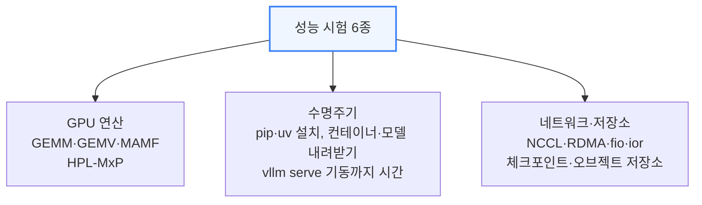

- **GPU 연산**: 현대 AI의 핵심 연산인 GEMM(행렬곱)을 cuBLASLt·DeepGEMM으로 BF16부터 NVFP4까지 정밀도별로 잰다. Kimi K2.5·K3와 DeepSeek V3·V4 Pro의 실제 형상을 쓴다
- **메모리·정밀도 혼합**: GEMV(가는 벡터 곱, 낮은 배치 디코딩의 대리 지표), nvbandwidth, HPL-MxP(저정밀 인수분해로 연산·HBM·MPI·NVLink를 한 번에 압박)를 추가한다
- **한계**: 저자들은 GEMM 마이크로벤치가 사업자를 거의 가르지 못한다고 본다. 사업자가 망치기 어렵고, 클럭 저하는 장시간 번인에서야 드러난다
- **수명주기**: 인터넷 속도, pip·uv로 PyTorch·vLLM 설치, 도커 허브·ghcr.io·nvcr.io 컨테이너 내려받기, 허깅페이스·ModelScope 모델 받기 시간을 잰다
- **저장소별 import 시간**: 홈·공유 파일시스템·로컬 NVMe 등에서 `import torch`를 비교하면 대부분 1\~2초인데 소형 파일 성능이 나쁜 파일시스템에선 10\~20초까지 걸린다
- **모델 기동**: 공유 저장소에서 작은 모델을 GPU 메모리로 올리는 데 10\~40초인 곳도, 2분이 넘는 곳도 있다

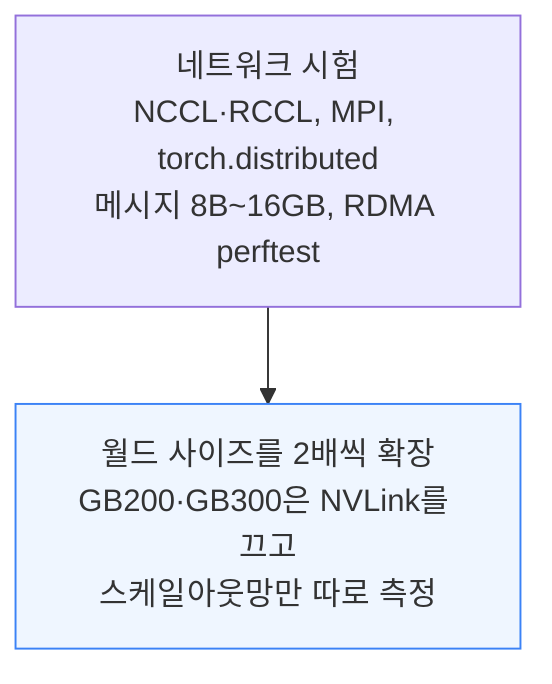

- **저장소**: fio·ior·Elbencho, Torch DCP 체크포인트 저장·복원, 로보틱스 데이터 파이프라인을 모사한 Skild AI의 데이터 생성 벤치를 돌린다. 가장 많은 문제를 찾는 것은 고전적인 fio다(순차·무작위 읽기·쓰기, 클라이언트 1\~32개까지)
- **해석 주의**: 결과는 볼륨 크기와 SLO 정의에 크게 좌우된다. 한 차트는 사실상 Azure가 PB급 마운트를 줬다는 사실만 보여 준다. 그래서 큰 비교군이 중요하다
- **오브젝트 저장소**: S3 버킷에 같은 시험과 대형 객체 처리량, 소형 PUT·GET 비율, 읽기 지연(p50·p90·p99)을 잰다
- **학습**: torchtitan으로 Llama 3.1 8B(C4, FSDP, 연산 병목)와 GPT-OSS MoE(전문가 병렬, 통신 병목, NVL72 제외)를 돌린다. 후자가 네트워크 이상을 가장 잘 드러낸다
- **추론**: InferenceX AgentX를 단일·다중 노드에서 돌려 연산·메모리·통신 병목 구간을 찾고, 프로파일링 추적을 켠다. NCCL 시험을 못 버티는 클러스터는 토큰도 못 뽑는다

### 3.3 신뢰성 - 일부러 부순다

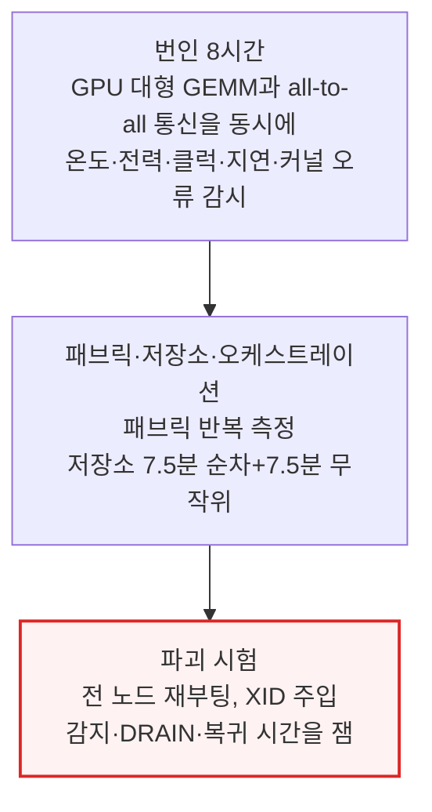

- **번인**: GPU와 네트워크를 동시에 괴롭혀야 한다. 둘이 함께 열 팽창·수축을 겪어야 실제 부하에 가깝기 때문인데 많은 사업자가 여전히 따로 태운다
- **패브릭**: all-to-all·all-gather·reduce-scatter를 반복해 평균·최소·최대 대역폭과 오류를 보고하고, 프런트엔드망의 패킷 손실·RTT·TCP 대역폭도 쌍별로 잰다
- **저장소 내구성**: 일부 사업자는 초기 대비 대역폭이 거의 40% 떨어졌다. 오브젝트 저장소의 15분 혼합 시험에서는 약 10% 차이가 났다
- **오케스트레이션**: 쿠버네티스에서 GPU 파드를 반복 생성·삭제해 스케줄링·기동 지연과 `kubectl delete po` 정지를 보고하고, CPU 전용 샌드박스 파드와 PVC 수명주기도 반복한다
- **재부팅**: 쿠버네티스는 cordon·drain 후 재부팅하고 부트 ID가 바뀌어야 인정하며, 새 파드에서 `nvidia-smi`가 돌면 타이머를 멈춘다
- **장애 주입**: DCGM 주입 → 합성 XID·SXID 커널 로그 기록 → 상위 PCIe 브리지 리셋(진짜 XID 79)의 순서로 시도하고, 사업자의 헬스 에이전트는 건드리지 않는다. AMD는 UMC RAS 오류를 주입한다
- **측정**: 감지까지, DRAIN 상태 유지, 복귀 후 기본 명령 실행까지의 시간을 모두 잰다
- **가중치**: 이것이 가장 중요한 시험이다. 신뢰성 불만이 많은 사업자는 대체로 헬스체크·대시보드·자동 복구가 없고, 신뢰성은 최대 고객 다수에게 1순위 기준이다

---

## 4. 곧 나올 테스트 - 에이전트용 CPU와 강화학습

**📌 핵심:**
- 아직 결과를 싣지 않은 시험 두 묶음이 있다 — 에이전트 작업용 CPU 벤치마크(SandboX)와 후속학습·RL 벤치마크(PostTrainingX)
- 에이전트 시대에는 CPU가 성능 변수다 — 코드 실행을 흉내 낸 CPU 부하와 쿠버네티스 샌드박스의 기동·밀도를 잰다
- RL은 롤아웃을 만드는 생성기, 행동을 실행하는 환경, 정책을 갱신하는 학습기가 맞물려, 한 곳이 막히면 전체가 선다
- 결론: 두 시험의 목표는 직접 오픈소스 프레임워크로 후속학습을 돌릴지, 호스팅 RL 업체에 맡길지 고객이 데이터로 고르게 하는 것이다

---

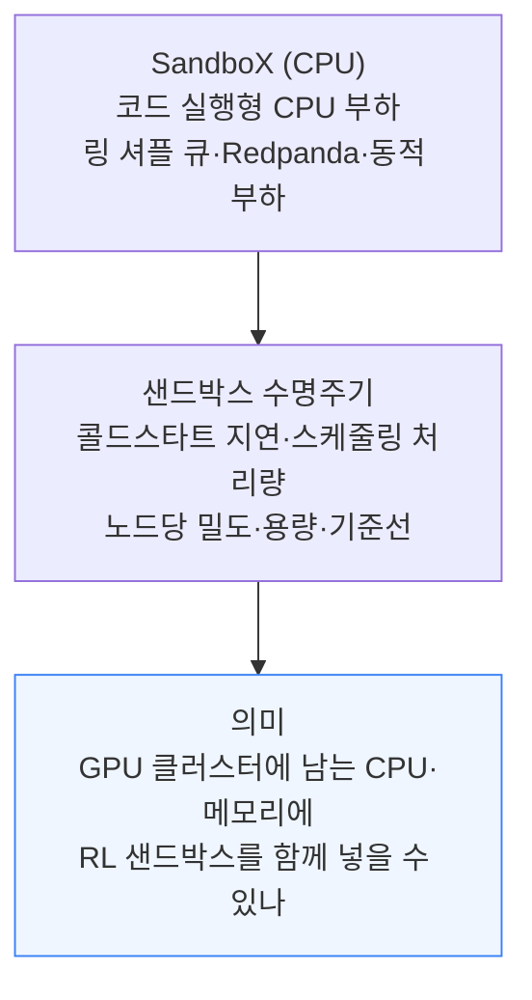

SandboX는 Redpanda(카프카 호환 로컬 브로커)의 처리량을 포함해 CPU 집약 작업 여러 종류를 돌린다. 쿠버네티스 클러스터의 샌드박스 수명주기도 재서, GPU 클러스터에 남는 CPU와 메모리에 RL 샌드박스를 같이 올리는 방안을 가늠한다.

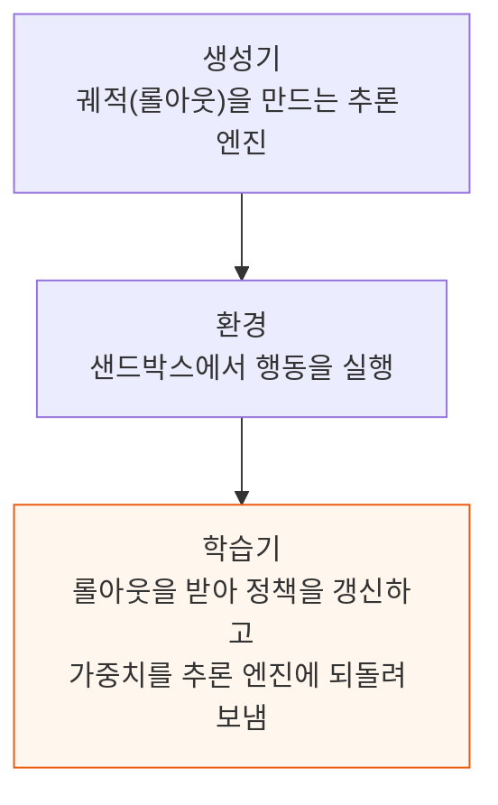

RL 확장은 학습기·추론 엔진·환경 실행·롤아웃 전송·가중치 동기화를 모두 균형 있게 쓰는 일이다. 병목이 하나면 RL 전체가 선다. 고객이 자기 환경을 가져오거나 파견 엔지니어가 환경을 만들면, 호스팅 업체가 인프라를 세워 오픈 웨이트 모델을 후속학습하는 서비스(RLaaS)도 등장했다. 고객 IP 보호가 그 판매 문구다.

예정된 PostTrainingX는 학습기 대 추론 GPU 배분, 배치 크기, 롤아웃 동시성, 정책 노후도 한도를 훑어 성능과 안정성에 미치는 영향을 본다.

- **생성기**: 추론 GPU당 초당 입출력 토큰, 롤아웃 지연, KV 캐시 점유율, 프리픽스 캐시 적중률
- **통신**: 가중치 동기화 지연, 전송 대역폭, 네트워크 텔레메트리
- **학습기**: 처리량, 옵티마이저 스텝 시간, MFU, 학습·롤아웃 KL, 정책 노후도, 클리핑 비율, 기울기 노름, 폐기된 롤아웃
- **환경**: 준비 시간, 도구 실행 시간, 타임아웃, 인프라 실패

대상은 Applied Compute·Azure Foundry·Fireworks·Thinky·Baseten·Trajectory·Engram·AI21 같은 호스팅 플랫폼과 Miles·slime·prime-rl·verl 같은 오픈소스 프레임워크 전부다. 저자들은 이미 Miles·prime-rl·verl부터 돌리기 시작했고 호스팅 업체로 확장할 계획이다.

---

## 5. 업계 동향 1 - 금융 (부채, 엔비디아 백스톱, 감가상각)

**📌 핵심:**
- 네오클라우드는 신용도 높은 고객 계약이 있으면 자기 신용등급보다 싼 금리로 빚을 낼 수 있다 — 계약 상대(IG offtaker)가 없으면 더 비싼 부채나 지분성 자금이 필요하다
- 대출은 현금흐름 못지않게 임대 해지 조항에 좌우되고, 그래서 계약 해지 시 새 구매자를 찾는 한 달을 이어 주는 보험(파라메트릭 보험)이 등장했다
- 엔비디아는 매출 하한선·임대인 보증·제3자 이전 임대로 GPU 수요를 받쳐 허가 없이도 투자적격 금융을 가능하게 한다 — "대차대조표가 해자"다
- 결론: 6년 감가상각은 사업자별 근거가 필요하고, 4\~6년 된 GB300의 잔존가치는 아직 아무도 책임지고 평가하지 않는다

---

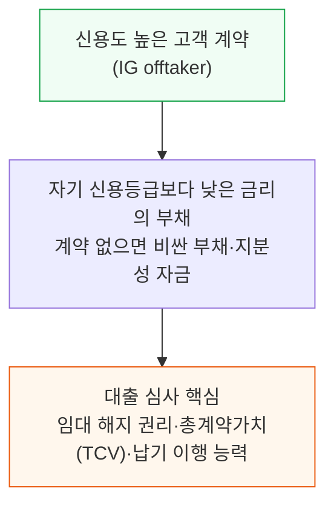

여러 보험사가 계약 해지로부터 네오클라우드와 대주를 보호하는 파라메트릭 상품(통상 한 달간 새 구매자를 찾는 브리지)을 내놨다. 저자들은 대출을 위험 완화하는 견고한 방법으로 보고 환영한다.

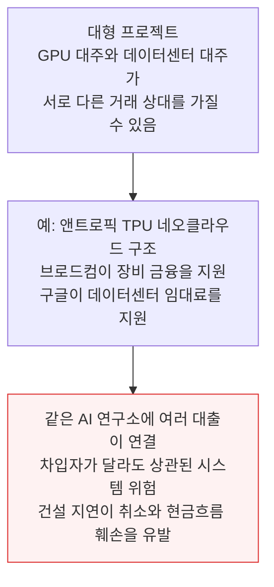

여기서 엔비디아의 백스톱(보증)이 등장한다. 엔비디아는 매출 하한선, 임대인 보증, 제3자로 넘길 임대로 GPU 수요를 받쳐, 하이퍼스케일러 없이도 연구소와 네오클라우드가 투자적격 금융을 얻도록 돕는다. 처음 GPU를 팔 때 마진을 얻고, 이제는 AICP 하한선을 넘는 매출의 일부도 받을 수 있다. 금융 지원이 곧 하드웨어 수요를 만든다.

감가상각 논쟁은 지난해 11월 버리 박사를 겨냥한 글 이후 잠잠해졌다. 6년 계약이 많아졌고, 4년 된 H100이 가격이 안 떨어지기 때문일 것이라고 저자들은 비꼰다.

- **분리 모델링**: 장비 구매일과 서비스 개시일을 나눠 감가상각을 모델링한다
- **6년 가정**: 사업자별 근거가 필요하다. 엔비디아 AICP의 6년 매출 하한선은 GPU 내용연수를 확정하지 않는다
- **민감도와 IRR**: 감가상각 민감도는 마진을 꽤 바꾸지만 대주의 우선 지표는 IRR이라 이 글에 싣지 않는다
- **잔존가치**: 재무 분석은 미래 구매자가 낼 가격을 정하지 못한다. 대출 상환 일정을 감가상각 가정과 따로 둘 수 없어, 지금은 4\~6년 된 GB300의 잔존가치 위험을 지려는 사람이 없다

---

## 6. 업계 동향 2 - 블랙웰에서 베라 루빈으로

**📌 핵심:**
- 8-way H100 HGX 서버에서 GB300 NVL72 랙 규모 시스템으로 가는 길에 사업자는 ARM CPU·액체냉각 필수·랙당 130kW+ 전력 등 8가지 변화를 한꺼번에 마주친다
- 호퍼에서 성공했다고 블랙웰에서도 성공하는 것은 아니라서, 평가는 그레이스 블랙웰을 인도한 사업자에게 웃돈을 주고 프로비저닝·모니터링·예비 노드 문제를 더 넉넉히 봤다
- 베라 루빈은 블랙웰보다 변화가 훨씬 작고(NIC 800G→1.6T, 랙 전력 약 130kW→약 200kW), 초기 수요가 더 강하며 많은 사업자가 예상보다 일찍 인도할 것이라고 한다
- 결론: HGX는 감지 약 2분·1시간 내 교체를 기대하지만, NVL72는 같은 NVLink 구조에 다른 트레이를 꽂을 수 없어 "감지 후 스케줄 차단"만 해도 합격이다

---

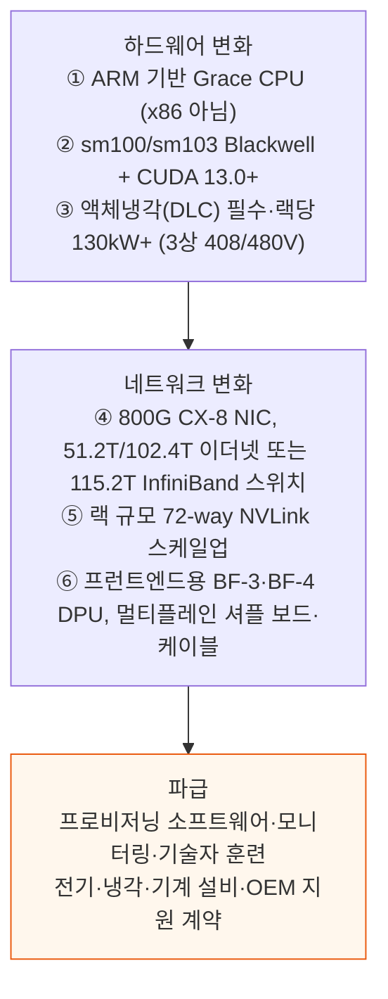

위 다이어그램은 번호가 매겨진 8가지 변화를 압축했다. 원문의 8번째 항목(멀티플레인과 셔플)은 ⑥에 합쳤다.

### 6.1 NVL72 장애 대응과 "NVL64+" SLA

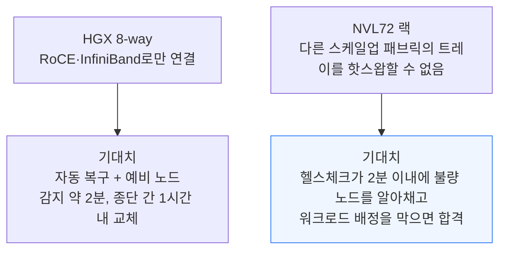

GB300 NVL72 SLA에서 저자들이 가장 많이 보는 패턴은 "NVL64+"다. 노드마다 SLA를 적용하되 랙의 18개 노드 중 3개 이상이 동시에 고장 나면 랙 전체를 다운으로 본다. 많은 작업이 64의 약수·배수 GPU로 돌고, 72장을 꽉 채우려면 월드 사이즈 8에 작업 9개라는 구성이 되기 때문이다.

### 6.2 베라 루빈으로 가는 길은 짧다

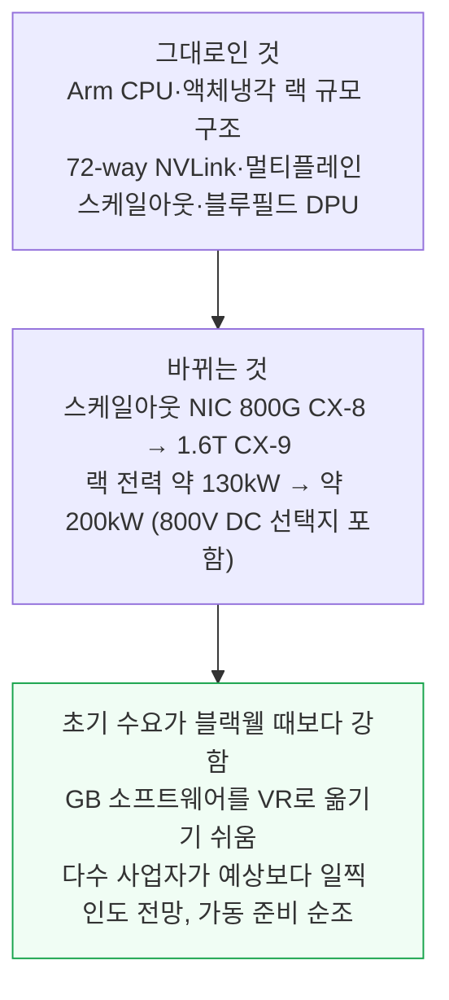

GB200이 처음 나왔을 때는 이 모든 요소가 새로웠다. 베라 루빈은 블랙웰 때와 달리 설계가 훨씬 성숙해 보인다고 저자들은 평가한다.

---

## 7. 업계 동향 3 - 스케일아웃 네트워크

**📌 핵심:**
- 스케일아웃 네트워크는 사업자가 마지막까지 직접 설계하는 영역이다 — NVL72 랙 안은 엔비디아와 OEM이 정해 두고, 랙 밖의 토폴로지·케이블링·작업에 패브릭을 넘기는 방식은 사업자 몫이다
- 저자들은 물리 계층부터 소프트웨어 계층까지 모든 층에서 문제를 찾았다
- 오라클은 GB300 트레이당 200G 포트 16개(GPU당 4개 플레인)로 멀티플레인 설계를 개척했고, 그 위에 MRC 토폴로지로 2단 구조에서 131,072개 GPU를 전대역으로 잇는다
- 결론: 장비 설정과 NCCL 플러그인에 따라 성능이 달라진다 — 구글 GB300은 기본 설정에서 멈췄지만 gIB 플러그인을 켜자 99.5GB/s로 타사의 95.3GB/s를 넘었다

---

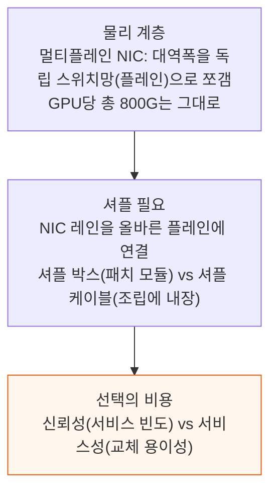

플레인을 늘리면 스위치 하나가 쓸 수 있는 유효 포트가 늘고 NIC의 상향 경로도 늘어난다. 셔플 박스와 셔플 케이블 둘 다 작동하며, 어느 쪽이 나은지는 신뢰성과 서비스성의 균형이다.

### 7.1 오라클의 멀티플레인과 MRC

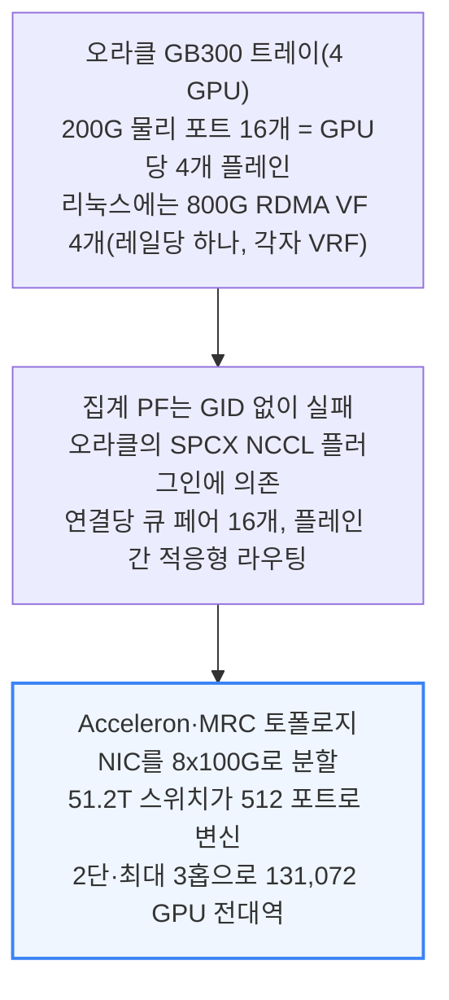

이 설계의 이유는 규모다. 오픈AI가 2026년 5월 OCP로 공개한 MRC는 한 연결을 여러 경로·플레인에 흩뿌리고, 순서가 뒤바뀐 데이터도 받아 선택적 확인 응답으로 손실을 복구하며, SRv6 소스 라우팅으로 고장·혼잡 링크를 피한다.

오라클은 스타게이트 애빌린에서 이를 운영한다. 다만 이 논리 계층은 규모가 커지면 복잡해지고 작업 문제가 터지는 곳이다.

### 7.2 쿠버네티스에서 RDMA를 나눠 주는 방식

RDMA 장치를 쓰려면 쿠버네티스가 파드마다 알맞은 장치와 인터페이스를 건네줘야 한다. NVIDIA NetworkOperator를 설정하는 방법이 많고, 잘못하면 모두에게 두통거리다. 저자들의 스크립트는 다음 패턴을 알아본다.

- **rdma_shared_device**: 공유 장치 자원과 NAD, 또는 호스트 네트워크 대체
- **sriov_host_device / sriov_legacy / sriov_ib**: SR-IOV 기반 직접 장치 접근(GPUDirect RDMA), VF, InfiniBand VF(파티션 패브릭은 PKey·UFM 설정 필요)
- **ovs_offload**: 하드웨어로 넘긴 Open vSwitch
- **rdma_ib / rdma_roce**: 레일마다 NAD 하나 또는 호스트 네트워크 대체
- **사업자 고유**: AWS EFA, DOKS(DigitalOcean), GKE DRANET

장치 설정과 그 위의 NCCL 플러그인이 작업 성능을 바꾼다. 구글 GB300은 내장 NCCL이 라우팅 불가능한 링크 로컬 GID를 골라 멈췄다. `NCCL_IB_GID_INDEX=3`으로 고쳤고, 구글의 gIB 플러그인은 16노드 16GiB all-to-all에서 99.5GB/s를 냈다. 다른 사업자는 95.3GB/s로 전대역 수준이다.

### 7.3 멀티노드 NVLink는 별개의 문제

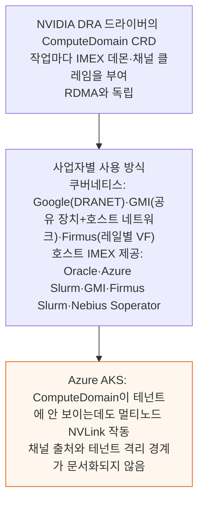

ComputeDomain은 NVLink 도메인 하나 안에 머물러야 하고, 도메인을 넘으면 RDMA가 필요하다. 계층적 스케일업(NVLink)과 스케일아웃(RDMA)에 맞는 토폴로지 인식 네트워킹이라는 뜻이다.

ComputeDomain을 모르고 작업을 띄우면 배치가 랙을 넘는 순간 클리크 설정에서 멈춘다. EFA가 DeepEP·MoonEP를 지원하지 않는 점은 AWS 부록에서 다룬다.

---

## 8. 업계 동향 4 - 신뢰성, 헬스체크, 자동 복구, SLA

**📌 핵심:**
- 장애 대응은 두 단계다 — 일어났음을 알아채고(모니터링 대시보드), 제대로 고친다(자동 복구: 재부팅·예비 노드 교체)
- 사업자가 장애 뒤 "고객이 짐을 뺄 시간을 주려고 기다린다"는 말은 변명이다 — 시험은 하드 장애를 모사하므로 노드는 이미 죽어 있다
- 엔비디아가 오픈소스로 낸 NVSentinel은 DCGM·시스로그·클라우드 유지보수 이벤트를 읽는데, 기본 설치는 모니터링 전용이다 — 핵심은 소프트웨어가 아니라 XID별 조치표다
- 결론: 저자들은 3등급 표준 SLA 문서를 만들어 구매자·사업자·대주·보험사가 계약 기초로 쓰고 acceptance 시험과 월간 검토에 SemiAnalysis 기술 평가를 넣도록 권한다

---

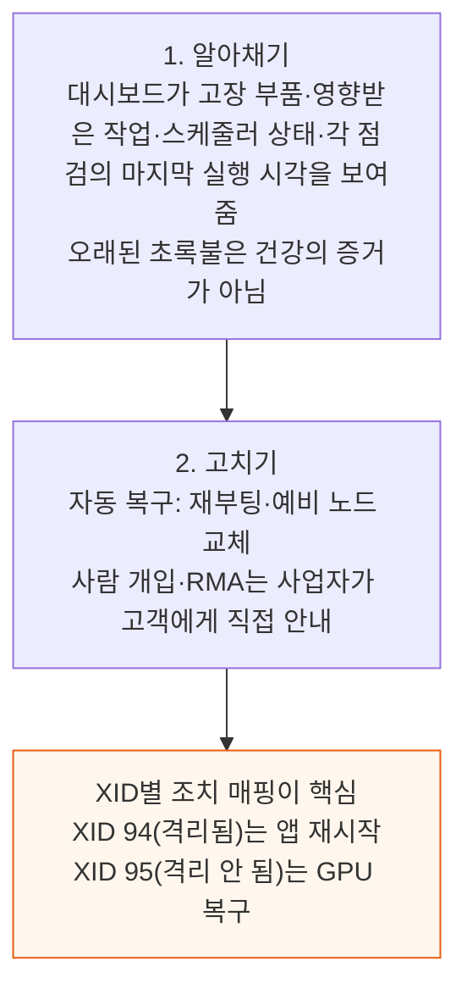

모든 XID에 노드를 재부팅하면 멀쩡한 작업이 죽고, 심각한 XID 뒤에도 GPU를 스케줄 가능하게 두면 작업이 비정상 종료될 수 있다.

### 8.1 왜 어려운가

- **티켓 하나의 폭**: 100개가 넘는 XID 중 어느 것에서나 올 수 있고, 처리 절차(SOP)는 드라이브·전원 교체, 케이블 청소, 메모리·GPU·NIC 재장착, 개별 부품이나 서버 트레이 전체 RMA까지 이어진다
- **HGX**: 8-GPU 예비 노드로 바꿔 끼운다
- **NVL72**: NVLink 도메인에 GPU 8장을 추가로 핫스왑할 수 없다. 트레이 하나가 실패하면 GPU 4장이 빠지며, 랙을 줄여 쓰거나 랙 전체를 교체하는 두 가지 선택지뿐이다. GB300은 GB200보다 덜 고장 난다
- **직접 운영과 콜로**: 시설을 직접 운영하는 사업자는 기술자·예비품·SOP를 통제하고, 콜로케이션 사업자는 건물주의 원격 손과 일정에 의존한다. SLA는 용량이 얼마나 빨리 돌아오는지를 재야 한다

### 8.2 표준 SLA 문서의 구성

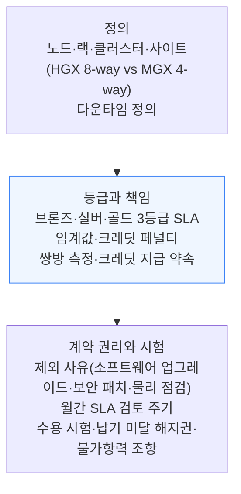

저자들은 컴퓨트 구매자(네오랩), 클라우드 사업자(네오클라우드), 대출·금융 파트너, 보험사에 이 조항을 계약 기초로 쓰고, 수용 시험과 월간 SLA 검토에 SemiAnalysis 기술 평가를 포함하라고 권한다. 평가는 자체 cmax 유틸리티와 독자적 절차로 한다.

---

## 9. 업계 동향 5 - 보안과 에이전틱 코딩

**📌 핵심:**
- "네오클라우드 대다수는 보안이 엉망이다" 발표 이후 대응이 있었다 — 여러 곳이 ClusterMAX CLI를 자기 클러스터에 돌려 낡은 패키지를 교체하고 있다
- 저자들은 AI 능력에 대한 믿음과 상관없이 보안이 필수라고 본다 — 수십억 달러 인프라가 마땅한 만큼 안전하지 않다는 사실은 그대로 남기 때문이다
- 에이전틱 코딩은 고객이 베어메탈이나 가볍게 관리되는 클러스터를 더 받아들이게 해 관리형 마진을 압박한다
- 결론: 에이전트는 숙련도 차이를 줄이지 않고 키운다 — 좋은 설정을 아는 사람은 더 강해지고, 모르는 사람은 신나게 자기 발을 쏘게 된다

---

### 9.1 보안

```mermaid
flowchart TD
    A["공개 논의의 빈틈<br/>AI가 통제를 벗어나 해를 끼칠 구체적 경로는 분석이 거의 없음<br/>모델을 받치는 GPU 호스트에 면역 체계가 부족"] --> B["허깅페이스 사고 보고서 교훈<br/>평범한 보안 오류가 불씨를 키움<br/>필요한 건 Vim과 운영체제 이해뿐인 시나리오"]
    B --> C["구조적 위험<br/>침해된 노드마다 이웃 탐색 범위가 늘고<br/>업계 전체가 한 붓으로 칠해질 수 있음"]

    style C fill:#fef2f2,stroke:#dc2626
```

오픈AI와 앤트로픽은 막대한 돈을 들여 위험한 능력 연구를 하고 있고 일부 인프라가 의심스럽다는 점이 드러났다. 그래도 GPU 클러스터 자체의 방어력은 거의 논평 대상이 되지 못했다. 저자들은 "좋은 이웃이 되어라, 해킹당하지 마라"로 요약한다.

앞서 SemiAnalysis가 이 주제로 올린 예고 글에는 일리야 수츠케버가 9월 2일 남긴 말이 인용됐다. 네오클라우드의 사이버보안이 약하고, 다음에 에이전트가 폭주하면 복제본을 더 돌리려 네오클라우드를 장악하려 들 것이라는 경고다.

### 9.2 에이전틱 코딩

```mermaid
flowchart TD
    A["에이전트가 도운 것<br/>리눅스 사용자 추가 스크립트 작성<br/>문서가 부실한 클러스터의 설정 조합 탐색<br/>밤샘 /goal 작업"] --> B["에이전트의 실수<br/>Slurm 컨트롤러를 반복문으로 압도(잡 어레이 대신)<br/>NVLink 설정 포기 후 InfiniBand로 실행<br/>저장소 시험을 NFS 대신 NVMe로 수행"]
    B --> C["결론<br/>숙련자에게는 승수, 비숙련자에게는 위험<br/>검증이 직접 하는 것보다 오래 걸릴 때도 있음"]

    style C fill:#fff7ed,stroke:#ea580c
```

- **CoreWeave 사례**: 엄격한 고전 절차 위에 LLM으로 함대 통계를 돌려 고장 조기 신호를 찾는다. NodeBot은 알림을 요약하고 다음 조치를 제안한다. 열 인터페이스 소재 펌프아웃 알림과 PMU 정지 알림이 동시에 떴을 때 NodeBot이 옳은 조치를 골랐다
- **방어선**: 오픈AI가 AI 생성 커널로 좋은 칩을 만들었더라도, 저자들은 CoreWeave가 바이브코딩 데이터센터 자동화를 내세운 신생 네오클라우드에 곧 위협받지는 않으리라 본다. 현장 경험과 전문가의 피드백 루프를 갖췄기 때문이다
- **현실**: 업계 모두가 AI를 쓰지만 AI-first 제공은 AWS의 MCP 서버뿐이었다. 사업자가 에이전트를 위해 할 최선은 사람이 읽을 수 있는 양을 넘는 상세 문서와 출발점이 될 골든 레시피를 클러스터에 두는 것이다
- **부작용**: 에이전트가 작업을 휘저으면 CoreWeave·Nebius가 공들인 Slurm 계층 최적화(RBAC·우선순위·파티션·잡 어레이)가 무력해지고, CoreWeave는 Claude가 클러스터를 원격 조종하면서 헤드 노드가 메모리 부족에 빠지는 사례를 본다

---

## 10. 앞으로의 방향과 밸류에이션 해석

**📌 핵심:**
- 시장은 두 반대 방향으로 갈라졌다 — 최대 연구소는 수백 MW 규모 베어메탈을 사서 직접 운영하고, 스타트업은 수천만\~수억 달러를 거의 전부 컴퓨트에 쓴다
- NVIDIA GPU가 고장 나는 문서화된 방식은 172가지(XID)이며 이것이 겹치면 복구 시나리오가 폭발한다 — 네오클라우드는 "티켓을 닫는 데이터센터 기술자"가 되더라도 쉬운 일이 아니다
- ClusterMAX는 사업 순위가 아니다 — 시험 경험이 좋은 CoreWeave도 장기 계약에 묶여 가격 상승 효과를 못 누려, 주가에서 보듯 Nebius보다 전략적 위치가 나쁘다
- 결론: 앞으로 가장 값진 것은 소프트웨어나 서비스가 아니라 컴퓨트 접근권이며, 호스팅 후속학습 업체와 엔드포인트 사업자도 같은 논리를 따를 것이다

---

```mermaid
flowchart TD
    A["시장이 두 방향으로 갈라짐"] --> B["최상위 연구소<br/>수백 MW 베어메탈을 대량 구매<br/>학습 클러스터·스케줄러·모니터링을 직접 운영<br/>네오클라우드는 티켓을 닫는 기술자 역할"]
    A --> C["스타트업<br/>수천만~수억 달러를 거의 전부 컴퓨트에 지출<br/>RL 중심이라 배치형·지연 민감형 추론이 모두 필요<br/>가장 간단한 오픈소스 토큰 구매를 원하는 고객 증가"]

    style B fill:#eff6ff,stroke:#3b82f6
    style C fill:#eff6ff,stroke:#3b82f6
```

저자들은 다음 글에서 추론 엔드포인트의 해부를 다루고 향후 ClusterMAX에 엔드포인트 테스트를 넣는다고 예고한다. 모든 네오클라우드가 앞으로는 엔드포인트 사업을 해야 한다고 본다. 샌드박스·호스팅 학습·평가 같은 RL 인프라도 평가할 계획이다.

### 10.1 ClusterMAX의 다음 확장

GPU 클러스터 너머로 시험을 넓힌다. 예고된 이름은 BareMetalX, EndpointX, PostTrainingX, SandboX, ModelX, HarnessX다. 베어메탈부터 엔드포인트·후속학습 시스템·샌드박스·모델·하니스까지, 직접 접근해 시험하고 무엇이 되고 무엇이 깨지는지 보여 주겠다는 목표는 같다.

### 10.2 ClusterMAX가 밸류에이션을 말해 주지 못하는 이유

```mermaid
flowchart TD
    A["CoreWeave<br/>클러스터 사용 경험은 훌륭<br/>그러나 장기 계약에 묶여 최근 가격 상승 미반영"] --> B["Nebius<br/>상대적으로 유리한 전략적 위치<br/>주가에 반영"]
    C["Nscale (11월 IPO 예정)<br/>관리형 클러스터를 시험하지 못했고<br/>마케팅과 투자자 발표를 믿은 기업들을 오도"] --> D["그래도 저자들은<br/>사업의 질에는 동요하지 않음"]

    style B fill:#f0fdf4,stroke:#16a34a
    style D fill:#fff7ed,stroke:#ea580c
```

같은 구도는 Fireworks·Baseten·Together AI·Inference Only·Deep Infra·Modal·Parasail·Novita·Cloudflare 같은 추론 엔드포인트 사업에도 적용된다고 저자들은 본다. RL 스타트업도 마찬가지다.

Applied Compute·Trajectory Labs·Prime Intellect처럼 호스팅 학습 인프라를 하는 곳들은 가치 높은 서비스를 팔면서도 앞길이 험할 것이다.

지금은 컴퓨트에 접근할 수 있는 능력이 가장 값진 자산이고, 소프트웨어·기술·서비스는 그다음이다.

---

## 11. 부록 1 - 플래티넘 (CoreWeave, Nebius)

**📌 핵심:**
- CoreWeave는 업계에서 가장 날카롭고 튼튼하며 능동적인 네오클라우드로 평가됐다 — 헬스체크·신뢰성이 모범이고 대부분의 시험이 기본값에서 기대치에 도달한다
- Nebius는 2.0에서 2위였는데 골드에 머물렀지만, 이번에는 모든 범주에서 강하고 상당한 가격 프리미엄을 받는다는 점에서 플래티넘으로 올라갔다
- CoreWeave는 부채 350억 달러를 안고 자본비용이 오르면서 장기 베어메탈 계약에 집중하고, Nebius는 MW당 매출이 CoreWeave보다 빠르게 오르고 있다
- 결론: 기술은 CoreWeave가 앞서지만 사업 판단으로 Nebius가 네오랩의 기본 선택지가 됐다

---

### 11.1 CoreWeave

```mermaid
flowchart TD
    A["탐지<br/>GPU straggler detection(낙오 탐지)<br/>NCCL 텔레메트리에 자체 알고리즘 적용<br/>XID 없는 소프트 장애까지 포착, 고객 통화에서 거의 매일 사용"] --> B["예방<br/>쿠버네티스(CKS)에서 유휴 노드에 매시간 20~30분 번인<br/>고객 워크로드가 오면 선점되므로 운영에 보이지 않음"]
    B --> C["인도 전 검증<br/>주당 약 1만 GPU 프로비저닝<br/>FLCC(함대 생애주기 컨트롤러)가 전원 투입부터 인도까지 담당<br/>제조사와 협업해 공장 단계에서 결함 포착"]

    style C fill:#f0fdf4,stroke:#16a34a
```

- **베라 루빈 선두**: VR200 NVL72 시스템이 L11 진단을 통과했다고 가장 먼저 발표했다. CoreWeave는 VR을 "자체 IP를 넣는 세대"라고 부르며, Racky·Valvey·RLCC를 공개했다. Valvey는 랙별 액체냉각 밸브를 프로그램으로 제어하며 누수 시 차단도 한다
- **철학**: 중복으로 고장을 막는 전통 인프라와 달리, 고장 영역을 줄이고 빠르게 복구하는 "하이퍼스케일러 반대" 접근이라고 설명한다
- **고객·수요**: 메타·마이크로소프트·오픈AI·엔비디아와 관계가 강하고 앤트로픽과 다년 계약, HRT·Jane Street 계약, 인도네시아 진출로 APAC도 확대한다
- **부담**: 부채 350억 달러, 코어 사이언티픽 합병이 무산됐다. 자본비용이 오르며 사업 착수가 늦어져, 투자적격 상대로 자금 조달이 쉬운 장기 베어메탈에 치중한다. 마진이 높은 관리형은 시장이 자금을 덜 대려 한다
- **다각화**: 셀프서비스 SUNK 클러스터로 온디맨드 시장에도 나서고, 관리형 추론 플랫폼은 연매출(ARR) 1억 달러를 공시했다. 다만 Kimi K3·GLM 5.3을 지원하지 않고 퍼블릭 엔드포인트는 Weights & Biases 포털이나 OpenRouter로만 쓸 수 있어 보완이 필요하다
- **베어메탈의 차이**: CoreWeave는 베어메탈 계약에서도 스케일아웃·프런트엔드 네트워크, 번인, 수리·교체, 모니터링을 직접 관리한다. 일부 사업자는 네오클라우드를 자처하면서 자기 데이터 홀에 들어가지도 못한다
- **사소한 피드백**: 로컬 GPUDirect Storage를 원클릭으로 켜게 하고, 콘솔의 SSH 공개키 입력 위치를 명확히 하길 바란다

### 11.2 Nebius

```mermaid
flowchart TD
    A["엔비디아 관계<br/>3월 20억 달러 투자, 7월 지분 9.3% 공시<br/>2025년 12월 HGX B300 최초 배치<br/>VR NVL72 올해 말~내년 초 배치 예상"] --> B["확장<br/>2027년 말 계약 전력 목표 5GW로 상향<br/>메타·마이크로소프트 대형 계약과 Reflection AI·Palantir 소형 계약 병행<br/>5~20MW 규모 부지를 기회적으로 확보"]
    B --> C["기술 구분점<br/>오픈소스 Soperator(SonK)<br/>jail 볼륨을 /에 바인드 마운트해<br/>베어메탈 같은 영속성 환경 제공"]

    style C fill:#eff6ff,stroke:#3b82f6
```

- **좋은 클러스터는 따분하다**: 번인에서 오류가 없고, Slurm이 토폴로지를 알며, 필요한 패키지가 최신이고, WAN이 좋고, 오케스트레이션 계층에 함정이 없다
- **저장소 계층**: `/jail`·`/home`(NFS)·`/mnt/data`(VirtioFS)·`/mnt/local-nvme`·`/mnt/memory`와 1급 S3를 제공한다. `/mnt/data`는 처음에 4KiB 순차 할당 쓰기가 매우 느리고, 128개 이상 랭크의 동시 디렉터리 생성이 `EEXIST`로 작업을 죽였다. 피드백을 받아 재조정한 뒤에는 중앙값을 넘었고 두 랙에서도 확장됐다
- **헬스체크**: GB300 랙에서 합성 오류 주입 뒤 노드를 자동 복귀시켰다. 시작부터 끝까지 8시간 40분으로 아직 느리지만, 감지는 즉시고, 시험한 다른 GB300 랙은 자동 재부팅·복귀가 없었다
- **수익성**: 저자들은 Nebius의 MW당 매출이 CoreWeave보다 빠르게 오르고 시가총액도 따라 오른다고 본다. 팔 용량이 훨씬 많고, 1년 약정에 선불금이 100%에 이르는 높은 가격 요구, 한 구간을 경매로 내놓은 협상 사례까지 보였다
- **약점**: 최대 베어메탈 부지(Béthune·Vineland)는 건설과 인허가 지연을 겪는다. 기술과 엔비디아·연구소 관계는 여전히 CoreWeave에 뒤처진다고 저자들은 본다

---

## 12. 부록 2 - 골드 (Google Cloud, Oracle)

**📌 핵심:**
- Google Cloud는 ClusterMAX 1.0에서 골드나 플래티넘에 곧 오른다고 예측했는데 3.0에서야 실현됐다 — 이제 관리형 클러스터 최상위권이다
- 구글은 gIB NCCL 플러그인을 켜자 16노드 all-to-all 최대 처리량이 4.4% 올랐고, 26.07부터 NGC PyTorch 이미지에 기본 탑재돼 별도 설정이 사라졌다
- 오라클은 2026년 6\~8월 850MW 데이터센터 용량을 추가로 인도했다고 보고했고, 저자들은 2027년 하이퍼스케일러 중 상대 성장률이 가장 클 것으로 본다
- 결론: 두 곳 모두 콘솔과 접근성은 전용 네오클라우드보다 불편하지만, 헬스체크와 성능은 합격선 위에 있다

---

### 12.1 Google Cloud

```mermaid
flowchart TD
    A["딜과 인수<br/>팔로알토 100억 달러, Thinking Machines 수십억 달러<br/>Wiz 320억 달러, Intersect 47.5억 달러 현금<br/>Blackstone 50억 달러 TPU 클라우드 합작(500MW 목표)"] --> B["시험에서 드러난 문제<br/>GB300 NCCL 첫 시험이 잘못된 GID 선택으로 멈춤<br/>NCCL_IB_GID_INDEX=3으로 해결<br/>gIB 플러그인 미사용이 원인"]
    B --> C["gIB 적용 결과<br/>16노드 all-to-all 최대 처리량 4.4% 상승<br/>26.07부터 NGC PyTorch 이미지에 기본 포함"]

    style C fill:#f0fdf4,stroke:#16a34a
```

- **사용성**: 콘솔은 관공서 창구 같고, Google Cloud CLI가 가끔 말을 안 들어 브라우저 연결로 바꿔야 했다. GB200 GKE 클러스터에서 기본 StorageClass가 `a4x-highgpu-4g` 노드에 붙지 않아 다른 클래스로 다시 시도했다. GKE 자체는 잘 갖춰졌다
- **관리형 Slurm**: 정식 출시(GA)되어 기본값과 헬스체크가 좋다. 이전의 "Beta" 꼬리표가 없다
- **헬스체크**: 주입한 XID에 `GPUUnhealthy=True`와 경고 라벨을 붙이되 노드는 스케줄 가능하게 뒀다. 사용자가 심각도별 대응을 정하게 하는 기본값이다
- **개선 제안**: 더 쓰기 쉬운 콘솔, IAM·RBAC 단순화, 쉬운 클러스터 접근, 중견 네오랩 공략, 지원 경험·엔비디아 관계 개선이다. 구글은 GPU 용량이 없거나 특정 가격대를 거부해 작은 네오클라우드에 많은 사업을 잃는다
- **전략적 위치**: TPU를 GCP로 빌려줄 뿐 아니라 직접 판매해 새 수익원에 노출된다. 전력·인허가를 두고 다른 하이퍼스케일러·연구소와 경쟁한다

### 12.2 Oracle

```mermaid
flowchart TD
    A["성장 구조<br/>AWS·구글·Azure와 달리 프런티어 토큰 판매 계약이 없음<br/>오픈AI·메타·엔비디아 대형 계약이 성장 원천"] --> B["GB300 NVL72 + Slurm<br/>멀티플레인 네트워크, 바닐라 Slurm(Slurm-on-OKE는 로드맵)<br/>번인 완벽, 매니지드 Lustre 처리량 우수"]
    B --> C["OKE + MI355X<br/>ionic 드라이버 문제로 RDMA 관리 큐 사망<br/>포트는 ACTIVE 400Gb/s·노드는 Ready로 보이는 채 고장<br/>AMD와 협업해 새 드라이버·펌웨어로 해결"]

    style C fill:#fff7ed,stroke:#ea580c
```

- **콘솔**: 하이퍼스케일러 콘솔답게 낯설고, RBAC가 없어 SSH 키를 머신에서 직접 관리해야 한다. 인턴이 `-a` 플래그를 빼먹어 기존 키가 모두 지워진 사고가 있었고 오라클 엔지니어가 즉시 복구했다
- **GB300 클러스터**: 첫날부터 성능이 좋았고 InfiniBand·NCCL 스크립트를 제공해 4개 레일을 제대로 썼다. 합성 오류에는 노드를 DRAIN하고 교체는 사용자 결정에 맡겼다. 헬스 지표가 콘솔의 클러스터 매니저에 통합됐다
- **MI355X 클러스터**: AMD GPU를 시험하게 해 준 곳은 TensorWave와 오라클뿐이다. 레일당 `ib_write`·`ib_read`가 391Gb/s까지 나온 뒤 파드를 지우자 `rdma_cm` 정리가 끝나지 않았다. 헬스체크가 하나도 경보하지 않았고 주말에 오라클이 진단해 재부팅했다. GPU가 PCIe 버스에서 간헐적으로 떨어지는 현상도 있었다
- **평가**: 대응이 빨랐고 AMD와의 긴밀한 관계가 자산이다. 실버 이상 사업자 중 CVE 해당 라이브러리가 0개인 유일한 곳이며, 브론즈 이상까지 넓히면 두 곳 중 하나다
- **한계**: 오픈AI 스타게이트 같은 베어메탈 중심으로 갈수록 RCCL 시험보다 가스관 건설 정부 승인이 성패를 좌우한다

---

## 13. 부록 3 - 실버 (Lambda, Microsoft, Firmus, TensorWave, GMI)

**📌 핵심:**
- 실버는 Lambda·Azure·Firmus·TensorWave·GMI 다섯 곳이다 — 모두 성능은 합격선이지만 접근성·기본 설정·지원 같은 기본기에서 거친 부분이 남았다
- Lambda는 2.0에서 비판받은 신뢰성을 이번 시험에서 크게 개선했고, GMI는 브론즈 최상위에서 실버로 올라 대시보드·저장소가 눈에 띄게 좋아졌다
- Azure는 접근에 VPN 설정만 3주가 걸리는 관료 문제가 있는 반면, 오픈AI 모델을 서비스하며 매출 전부를 가져가는 구조적 강점이 있다
- 결론: 세 하이퍼스케일러(구글·오라클·Azure)는 중소 고마진 계약을 따낼 기술은 있지만 지원과 콘솔 때문에 당분간 어렵다

---

### 13.1 Lambda

```mermaid
flowchart TD
    A["최근 소식<br/>앤트로픽 350억 달러 딜 참여(네시스 카운티 350MW, Hut8·엔비디아와 함께)<br/>2027 IPO 소문, 부채 약 10억·9.26억·10억 달러 조달"] --> B["신뢰성 개선<br/>합성 XID 2건을 15분 이내 자동 복구<br/>진짜 XID 79는 NotReady 후 2시간 만에 복귀(쿠버네티스 층 가시성 없음)"]
    B --> C["남은 문제<br/>Slurm이 CPU per task 미설정·sudo 없음·할당 없는 SSH 불가<br/>CUDA Toolkit 12.0(B300 SM100과 호환 안 됨)·낡은 드라이버"]

    style C fill:#fff7ed,stroke:#ea580c
```

Lambda는 관리형 클러스터 대신 베어메탈 구축으로 수익을 내는 쪽으로 이동 중이다. 그래도 오케스트레이션이 개선되고 고객 만족이 높아 3.0 상위권에 올랐다. 토폴로지 설정과 NCCL 레시피는 잘 작동했고, 번인·저장소 시험에도 진짜 오류는 없었다.

### 13.2 Microsoft (Azure)

```mermaid
flowchart TD
    A["접근 장벽<br/>자체 계정 사용 불가, Azure 엔지니어 계정으로 이용<br/>GPU는 버지니아인데 제어부는 텍사스 샌안토니오<br/>VPN 설정에 3주, 베스천에서 붙여넣기 차단"] --> B["시험 중 문제<br/>낡은 패키지·나쁜 NCCL 기본 설정<br/>AKS StorageClass 부착 실패, Azure Files Premium에서 클라이언트 4개 초과 fio EAGAIN<br/>Slurm 번인 중 10개 노드 진짜 장애"]
    B --> C["대응 품질<br/>Microsoft가 불량 호스트를 추적해 Guest Health Report로 수리<br/>엔지니어 Xu Xue가 맞춤 대시보드 제작, 오픈소스로 공개"]

    style A fill:#fef2f2,stroke:#dc2626
    style C fill:#f0fdf4,stroke:#16a34a
```

- **고객 구조**: 사티아 나델라는 롱테일 워크로드에 강한 Azure를 말했지만, VC 지원 연구소가 Azure로 학습과 추론을 하는 경우는 극히 드물다. 사실상 오픈AI와 MAI 두 곳이고, 앤트로픽이 곧 세 번째가 된다
- **강점**: 오픈AI 모델을 서비스하며 매출 100%를 가져가고 오픈AI IP 전체에 접근할 수 있다. 오픈AI 베어메탈 딜과 앤트로픽 관계도 커지고 있다
- **한계**: 수천억 달러 설비투자를 하는 거대 배치가 중심이라 지원과 콘솔이 두통거리다. 다만 Nvidia 레퍼런스 아키텍처로 스케일아웃을 받을 수 있는 유일한 하이퍼스케일러다
- **헬스체크**: CycleCloud가 XID 주입 직후 노드를 DRAIN했고 재개·교체는 하지 않았다. 랙 전체를 쓰는 환경에선 합격선이다

### 13.3 Firmus

```mermaid
flowchart TD
    A["자금과 용량<br/>8월 20억 달러 유치(기업가치 105억 달러), 4개월 전 5.05억 달러(55억 달러)<br/>3월 100억 달러 부채 한도<br/>계약 용량 900MW, 오픈AI가 말레이시아 앵커 고객"] --> B["배치 계획<br/>GB300 18,400장 배치 진행 중<br/>연말 태즈메이니아에 36,800장"]
    B --> C["시험에서의 문제<br/>vCluster CLI(사전 출시판) 접근<br/>쿠버네티스와 Slurm이 랙을 섞어 가졌고 토폴로지 설정이 평평(topology/flat)<br/>etcd 가시성 깜박임, NIC 1개 재부팅 중 정지"]

    style C fill:#fff7ed,stroke:#ea580c
```

- **독특한 설정**: GB300에서 GPU HBM을 NUMA 노드로 노출한 유일한 클러스터라 호스트 오버플로 시 HBM이 넘칠 위험이 있어 실패로 판정했다
- **기타**: WAN이 NGC까지 0.25Gb/s로 부진했고, 한 랙의 NVLink 성능이 떨어진 것은 Firmus의 전력 설정 실험이 원인이었다. 고치자 정상화됐다
- **평가**: Slinky·쿠버네티스 계층은 쓸 만하지만 채워야 할 부분이 있다. 관리형은 지금 Firmus의 우선순위가 아니지만 기술팀이 개선할 여지가 많다

### 13.4 TensorWave

```mermaid
flowchart TD
    A["AMD 전용 네오클라우드<br/>MI355X를 쿠버네티스·Slinky로 시험<br/>2.0의 어려운 온보딩이 이번에는 매끄러움"] --> B["약점 - AMD 소프트웨어<br/>RCCL all-gather·all-to-all이 32KiB에서 멈춤<br/>GB300 NVL72가 달러당 성능도 최고인 경우가 많음<br/>MI455X Helios는 아직 램프 중"]
    B --> C["강점과 전망<br/>저장소 성능 탁월, 번인 무사고<br/>교체 승인 버튼 클릭 후 약 43분에 완료<br/>Fermi와 222MW(최대 650MW) 계약, 시리즈 B 3.5억 달러(15.5억 달러 평가)"]

    style C fill:#f0fdf4,stroke:#16a34a
```

저자들은 TensorWave를 오라클·마이크로소프트 같은 하이퍼스케일러와 견줄 만한 AMD 전용 선두 네오클라우드로 평가한다. 자동 복구가 기본이길 바라지만 모니터링과 자동 복구는 모범이다. 오픈AI와 앤트로픽이 MI450 세대에서 AMD와 제휴해, AMD 전용 네오클라우드가 골드에 오를 수도 있다고 본다.

### 13.5 GMI

```mermaid
flowchart TD
    A["회사<br/>마운틴뷰 본사, 뿌리는 대만<br/>엔비디아 5억 달러(지난해 11월)·120억 달러(올해 3월) 딜<br/>소형 네오클라우드 용량을 재판매해 선투자 없이 확장"] --> B["개선<br/>RWX NFS 기본 StorageClass와 Slurm /home 제공<br/>S3 성능 양호, 대시보드 신설(DCGM·NVLink·InfiniBand)<br/>번인 깨끗, InfiniBand 패브릭 견고"]
    B --> C["남은 문제<br/>Kueue가 DRA 자원 클레임을 못 받아 작업이 Suspended<br/>빈 kubeconfig·동기화 안 된 SSH 키<br/>예비 용량 부족으로 헬스체크 일부만 시험"]

    style C fill:#fff7ed,stroke:#ea580c
```

2.0에서 "최상위 브론즈"로 평가했던 GMI는 이번에 노드 cordon과 재부팅·자동 uncordon이 빠르게 작동하고 Slack 경보까지 갖췄다. 저자들은 Kueue가 DRA 클레임을 받도록 설정하거나, 멀티노드 NVLink 작업이 대기열을 건너뛰어야 한다고 문서화하라고 권한다.

---

## 14. 부록 4 - 브론즈 (AWS부터 Hyperstack까지)

**📌 핵심:**
- 브론즈에는 AWS·Gcore·GMO·Verda·Moonlite·Together·Crusoe·Prime Intellect·DigitalOcean·Hyperstack이 있다 — 성능은 대체로 합격이지만 헬스체크·신뢰성·기본 설정의 구멍이 이 등급을 결정했다
- AWS는 EFA(자체 스케일아웃 패브릭)의 소형 메시지 지연이 InfiniBand보다 30\~45% 길고, 슬럼 클러스터 하나를 띄우는 데 엔지니어 6명이 통화해야 했다
- Together는 2.0에서 신뢰성 때문에 골드 진입이 막혔다가 이번에 브론즈로, Crusoe는 실버 강등 경고를 받은 끝에 브론즈 하단으로 내려왔다
- 결론: 고객이 가장 자주 부딪치는 문제는 성능보다 위생(오래된 커널·드라이버)과 장애 대응 자동화의 부재다

---

### 14.1 AWS

```mermaid
flowchart TD
    A["서비스가 너무 많음<br/>SageMaker·HyperPod(Slurm·EKS)·EKS Auto Mode·EKS+Karpenter<br/>모두 첫 프로비저닝이 실패"] --> B["EFA 네트워크<br/>4노드 32 GPU all-to-all 16GiB: 59.44GB/s busbw(스케일아웃 선속도의 약 92%)<br/>64KiB: EFA 85.26μs vs InfiniBand 50μs 미만<br/>소형 메시지에서 30~45% 지연 격차"]
    B --> C["헬스체크 허점<br/>HyperPod는 재가입에 필요한 심층 점검이 스케줄 불가인 순환 의존<br/>Karpenter는 DCGM 데몬셋이 taint를 용인하지 못해 정상 노드를 반복 교체<br/>종료 39분 전 클러스터를 부숨"]

    style C fill:#fef2f2,stroke:#dc2626
```

- **조직 진단**: 소설 길이의 GPU 메뉴는 콘웨이의 법칙(조직도대로 제품을 낸다)의 사례이고 수요 세분화의 반영이 아니라고 본다. 특정 팀이 아니라 조직의 문제다
- **저장소**: ap-south-1a의 B200 클러스터는 모든 저장소 요청이 "Insufficient capacity"로 실패했고, 실패한 파일시스템 삭제에 5시간 46분이 걸렸다. FSx는 버퍼 I/O에서 p99 순차 읽기 지연이 9.2초(버퍼 끔 312ms)였다
- **MoE 추론과의 연결**: 64KiB 시험은 Kimi K3·DeepSeek V4의 전문가 라우팅 단계와 비슷하다. Perplexity의 기술 글도 MoE 디스패치·결합 메시지 크기에서 20μs 안팎의 지연 벌칙을 보고했다
- **소프트웨어 지원**: vLLM·SGLang의 전문가 병렬 추론은 EFA 라이브러리를 직접 설치하고 DeepEP·NIXL·Mooncake를 EFA 지원으로 빌드해야 한다. 최전선 통신 라이브러리에서 EFA는 우선순위가 아니라 지원이 몇 주\~몇 달 늦는다
- **AWS 전체 실적**: 2월 오픈AI 계약을 1,000억 달러 확대했고, 2분기 순매출이 전년 대비 37% 늘었으며, 트레이니움 사업은 ARR 250억 달러에 세 자릿수 증가율이다
- **결론**: "관리형 클러스터는 AWS의 우선순위가 아니다." 전문가들은 똑똑하고 대응이 빨랐고 MCP 서버도 만들었으나, 기본 문제가 줄줄 새는 원인은 조직 구조다

### 14.2 Gcore

H200 3대만 제공받을 만큼 용량이 부족해 평가의 폭이 좁았다. Soperator 기반 SonK를 다시 시험했다. 2.0에서는 실버였다.

```mermaid
flowchart TD
    A["첫 시험 대부분 실패<br/>비루트 사용자 실행 불가 설정 오류<br/>Slurm 워커 RealMemory=2048MiB로 오기입"] --> B["Gcore 팀이 신속히 수정<br/>apparmor 설정 제안, 기본값 교정<br/>노드 간 SSH 기본 차단은 soperator-createuser 스크립트로 완화"]
    B --> C["이후<br/>저장소(/의 NFS) 양호, N/S·E/W 네트워크 합격<br/>RDMA 장치 이름 비표준·topology.conf 없음<br/>XID는 Slurm에서만 Down, 자동 복구는 예비 없어 미시험"]

    style C fill:#eff6ff,stroke:#3b82f6
```

### 14.3 GMO

일본 시장을 겨냥한 B300 2노드 관리형 Slurm이다. 네트워킹·저장소 성능은 강했고, 프로파일링 제한·기업용 통제 부족·자동 복구 부재가 구멍이었다.

- **온보딩**: 헤드 노드·파티션·topology.conf가 설정돼 도착했고 드라이버와 CUDA·NCCL·HPC-X가 최신이었다. 콘솔이 일본어뿐이었고 Grafana 접근에 5일이 걸렸다(저자들이 키체인과 인증서 암호 입력을 혼동한 탓이지만, 불필요한 인증서 방식이 문제라고 비판)
- **네트워크·저장소**: 노드당 400Gb/s 레일 16개로 NCCL 결과가 강했다(두 노드뿐이라 확장 증거는 약함). DDN Lustre는 fio·torch.save가 좋았지만 `import torch`·vLLM 서빙은 부진했고 스냅샷·자동 백업·재해복구가 없다
- **통제**: `sudo`·워커 Docker가 없고 `scontrol` 실행을 막으며 노드 SSH도 차단된다. `RmProfilingAdminOnly=1`로 Nsight Compute GPU 카운터가 막혔다
- **모니터링**: XID 79 주입은 경보도 노드 DRAIN도 일으키지 않았다. GMO는 XID 79가 화이트리스트에 없다고 확인하고 조사하기로 했다
- **평가**: RBAC·SSO·감사 로그가 없어 일본 시장용 틈새 현지 업체이며, 앞으로도 일본 선두는 유지하되 해외로 확장할 야망은 부족해 보인다

### 14.4 Verda

```mermaid
flowchart TD
    A["회사<br/>헬싱키, 구 DataCrunch<br/>총 자금 4.5억 달러(2026년 9월)<br/>지난 시험 때 베타였던 Slurm을 Slinky로 이전, 쿠버네티스 신규 제공"] --> B["문제<br/>SSH 접속이 바깥 VM이라 Slurm이 환상이었음(저녁 내내 디버깅)<br/>Pyxis·Enroot 미지원, 큰 .sif 사용<br/>공유 파일시스템에서 노드 간 파일 잠금 위반 100/100"]
    B --> C["헬스체크 미완성<br/>점검은 하지만 출력을 소비하는 쪽이 없고 exit 1 뒤 방치<br/>자동 복구 없음<br/>시험 종료 뒤 9월 10일 변경 배포"]

    style B fill:#fff7ed,stroke:#ea580c
```

프로비저닝은 30분에 매끄럽게 끝났고 Grafana도 바로 작동했다. 보안은 견고했다. virtiofs가 잠금 동작을 알리지 못하는 것으로 보이며, 허깅페이스 병렬 다운로드에서 데이터 손상과 Elbencho 32 클라이언트 `ENOENT`도 있었다.

### 14.5 Moonlite

```mermaid
flowchart TD
    A["신규 평가<br/>시카고 본사, 전 Crusoe 창업팀<br/>호퍼 운영, B300·GB300 첫 인도<br/>직원 수 최소·엔지니어링 중심"] --> B["시험<br/>쿠버네티스·Slinky(H100 시험, GB300보다 쉬움)<br/>NCCL ConnectX-7 사양 도달, 저장소·연산·번인 양호<br/>NVMe는 노출되지 않아 시험 불가"]
    B --> C["장애 대응<br/>PCIe 보조 버스 리셋을 11분에 알림<br/>총 57분에 노드 복귀(사용자 허락 대기 포함)<br/>수동 절차이며 규모에선 자동화 필요"]

    style C fill:#eff6ff,stroke:#3b82f6
```

기본값은 모두가 같은 루트 사용자였으나, 비루트 사용자를 요청하자 30분 만에 `moonlite-adduser` 스크립트를 만들어 같은 날 이미지에 넣었다. 대응이 빠른 반면 경험이 얕다는 뜻이기도 하다. 저자들은 시도한 일은 잘했고 GB300 경험이 쌓이길 기다린다고 평가한다.

### 14.6 Together

```mermaid
flowchart TD
    A["2.0에서는 골드 진입이 신뢰성 때문에 막힘<br/>이번에는 브론즈로 강등<br/>주된 사유는 신뢰성"] --> B["시험에서 일어난 일<br/>노드 2개 중 1개가 통보 없이 RMA<br/>Slurm 헬스체크가 이미 배정된 노드를 시간 초과로 오판해 DRAIN<br/>NIC 초기화 경쟁 조건으로 VAST 접근 불가"]
    B --> C["문제의 시설<br/>불안정한 B300 클러스터가 IREN의 프린스 조지(N+0) 시설<br/>업계에서 불안정으로 악명 높은 두 시설 중 하나(다른 하나는 Crusoe 레이캬비크)<br/>단일 ISP에 의존한 주말 장시간 장애 사례"]

    style C fill:#fef2f2,stroke:#dc2626
```

- **개선된 점**: PCIe 보조 버스 리셋 후 67초에 노드가 DRAIN됐고 자동 교체는 35분 7초에 수동 개입 없이 끝났다
- **Slinky 제공 방식**: 쿠버네티스로 바꾸려면 해체 후 바닐라 쿠버네티스로 재프로비저닝하라고 안내해, Slinky 제품은 평범한 Slurm으로 평가해야 한다. `/tmp` 설정으로 OCI 이미지 추출이 실패해도 Slurm이 0으로 종료했고, NFS는 `:`가 든 파일명을 거부했으며, S3는 느리고 불안정했다
- **사업**: 7월 8억 달러 시리즈 C를 발표했으나 관리형 클러스터는 언급이 거의 없다. 사우디 250MW의 구매자는 미공개이며 GPU 시간이 아니라 토큰 단위 과금을 선호한다

### 14.7 Crusoe

```mermaid
flowchart TD
    A["2.0의 경고<br/>핵심 엔지니어 이탈·중간 관리자 과다<br/>실버로 강등될 위험을 지적"] --> B["8개월간의 성과<br/>기업가치 약 100억 → 309억 달러<br/>텍사스 900MW·1.0GW 캠퍼스 발표<br/>Atero 인수로 추론 엔드포인트 평판 상승"]
    B --> C["이번 시험 결과<br/>H100 5일간 진짜 XID가 시험 전체의 나머지 합계보다 많음<br/>가장 오래된 리눅스 커널(5.15.0-185)·GPU 드라이버<br/>CVE-2026-64378 등 심각도 7.8 취약점에 해당"]

    style C fill:#fef2f2,stroke:#dc2626
```

- **커널 사고**: 오래된 커널의 inode 전환 잠금 버그로 Slurm 작업이 끝날 때 NUMA 노드의 모든 CPU가 같은 `list_lock`에 붙어 정지했다. NFS 클라이언트 생존 점검이 시간 초과해 노드가 NotReady가 됐고, 커널이 종료 요청을 처리하는 데 2시간 넘게 걸렸다
- **장애 복구**: 쿠버네티스 층의 XID는 빨리 감지돼 노드 교체가 시작됐지만, Slurm 명명 규칙 불일치가 CI를 통과해 drain이 되지 않았다. 몇 시간 뒤 교체한 노드는 저장소 NIC가 불량이었고 AutoClusters는 "알려진 공백"이라며 몇 주 뒤 자동 복구를 배포하겠다고 답했다
- **WAN**: 0.47\~0.78Gbps로 시험한 곳 중 가장 느린 축이었다
- **평가**: 저자들은 한때 Crusoe를 세계 2위 네오클라우드로 보고 임대를 권했으나 이번에는 브론즈 하단이다. 사람이나 자금이 아니라 우선순위와 관료주의 문제라고 진단한다. 최근 몇 달은 정상 궤도로 돌아오는 조짐이 있다
- **원칙**: 관리형 클러스터에서 TCO는 굿풋으로, 굿풋은 신뢰성으로 귀결된다

### 14.8 Prime Intellect

```mermaid
flowchart TD
    A["회사<br/>7월 시리즈 A 1.3억 달러(기업가치 10억 달러)<br/>컴퓨트·RL·후속학습·샌드박스·추론·환경·평가 합산 연 환산 매출 1억 달러"] --> B["시험<br/>B300 Slurm·쿠버네티스, ConnectX-8 13노드까지 우수한 처리량<br/>Weka /data 4노드 이상 안정 확장<br/>번인 중인 클러스터라 오류가 계속 발생"]
    B --> C["헬스체크와 한계<br/>자동 개입이 개별 오류의 피해를 신속히 제한<br/>다른 사업자 용량을 되파는 재판매자라 예비 노드 확보가 어려움"]

    style C fill:#eff6ff,stroke:#3b82f6
```

저자들은 시험한 마켓플레이스 중 Prime이 최고로 보이며, 호스팅 학습 제품 미리보기는 매우 인상적이었다고 한다. PostTrainingX 초안 순위에서는 플래티넘 경쟁권이다. 과제는 신뢰성 개선, 기본 부하 컴퓨트 확보, 진짜 네오클라우드로 올라서기다.

### 14.9 DigitalOcean

- **포지셔닝**: "추론·에이전틱 시대를 위해 처음부터 끝까지 만든 클라우드"라 홍보하지만 사실상 관리형 클러스터를 판다. 쿠버네티스는 견고하되 덜 성숙하다
- **설정 부담**: 온보딩 문서가 Multus 설치, 네트워크 부착, MPI Operator 설치, MPIJob 매니페스트를 고객에게 맡긴다. 기본 RWX StorageClass도 없다. 순차 쓰기가 순차 읽기의 약 6배로 대부분 클러스터와 반대다
- **헬스체크**: 첫 XID 주입은 감지되지 않았고, 피드백 뒤 버그를 고쳐 두 번째 시험에서 주입 50분 후 새 노드를 받았다
- **Slurm**: 추론에 맞춘 클라우드라 Slurm이 없다. Slinky 런북은 기본은 맞지만 SSH도 RWX 볼륨도 없어 직접 세워야 한다
- **계획**: 2027년에 60MW를 추가하지만 GB·VR 계획은 보이지 않는다

### 14.10 Hyperstack

```mermaid
flowchart TD
    A["회사<br/>영국, 모회사 NexGen Cloud<br/>4,500만 달러 시리즈 A(평가 3.54억 달러)<br/>올해 B300 4,500장, 2027년 56MW 추가"] --> B["시험<br/>쿠버네티스 연산·네트워크 합격, 번인 하드 오류 없음<br/>노드 재부팅 복구 빠름<br/>Weka·VAST는 일정상 시험 못함"]
    B --> C["장애 대응<br/>XID를 1초 이내 감지해 NvidiaFatalXid=True 표시<br/>지원팀 인지 12분, 예비 노드 재합류 52분<br/>cordon까지 1시간 30분 - 모두 SRE의 수동 개입"]

    style C fill:#fff7ed,stroke:#ea580c
```

24시간 지원을 제공하고 단일 노드 고장 시 60분 안 개입을 목표로 하지만, 사람이 개입해야 하는 구조는 재현성이 걱정된다. 유일한 오류는 `cilium-envoy`와 `csi-hyperstack-node` 파드가 "Too many open files"로 충돌 루프에 빠진 것이다.

---

## 15. 부록 5 - 참가상과 비추천 - 성능 미달

**📌 핵심:**
- 참가상 등급은 최소한만 하는 15곳(Vultr·Vessl·Runpod·Bitdeer·Shadeform·Radiant·FPT·Core42·Latitude·IBM Cloud·BuzzHPC·Neysa·Vast.ai·Hyperbolic·STN)이다
- 비추천 - 성능 미달은 오래된 GPU만 제공, SOC 2·ISO 27001 같은 보안 인증 부재, 서버 핵심 설정 오류(PCIe ACS 켜짐, GPUDirect RDMA 미활성), 클러스터 생성·하드웨어 고장 중 GPU 시간 과금 같은 핵심 결함 하나만 고쳐도 브론즈로 오를 수 있다
- 이 구간의 공통 문제는 낡은 소프트웨어(CVE에 노출된 CUDA·드라이버·펌웨어)와 헬스체크 부재다
- 결론: 규모와 자금은 커졌지만 기본기가 부족한 곳이 많고, Core42는 "다크호스"로 지목됐다

---

### 15.1 참가상 15곳

```mermaid
flowchart TD
    A["공통 결함<br/>낡은 이미지·CVE 노출 라이브러리<br/>기본 StorageClass 불량·헬스체크 부재"] --> B["대표 사례<br/>Vultr: CUDA·DCGM·Docker·runc·ConnectX 펌웨어에 CVE<br/>Vessl: 컨테이너 2GB 메모리 하드 제한·NetworkPolicy 미집행<br/>Runpod: 사용자 권한 부족, 할당 없는 노드 재부팅 불가"]
    B --> C["상승 조건<br/>골든 이미지, 최신 유틸리티, 헬스체크·자동 복구, 인력 배치"]

    style C fill:#eff6ff,stroke:#3b82f6
```

#### Vultr

- **홍보와 실제**: "세계 최대 비상장 클라우드 인프라 회사"를 자처하지만 그렇지 않다고 저자들은 본다. 그래도 GB300과 MI355X(오하이오 50MW AMD 부지 주장)를 갖춘 의미 있는 사업자다
- **문제**: 시험용 이미지에 CUDA·DCGM·Docker·runc·ConnectX 펌웨어 CVE가 많았다. Slinky 로그인 파드에 `/shared`와 Pyxis 설정이 없었고, 기본 `vultr-block-storage`는 파드가 `ContainerCreating`에서 멈췄다
- **강점**: Lustre 계층은 32 클라이언트에서 집계 읽기 91.7GB/s로 탁월했다. Grafana는 NVLink가 0으로 보이는 등 일부만 맞았다
- **신뢰성 평판**: 스케일아웃 네트워크 신뢰성 문제로 파트너들이 거래를 시작·확대하지 않는다고 알려져 있다

#### Vessl

한국의 신생 네오클라우드로 스스로를 브로커가 아닌 "멀티클라우드 오케스트레이터"라 부른다. 5,000 GPU 운영을 주장하고 2027년 말 100MW를 목표로 한다.

- **초기 설정 부담**: RDMA 패브릭을 쓰려면 설정 세 개를 고정하라는 안내가 있었다. 쿠버네티스 `LimitRange`로 컨테이너가 호스트 메모리 2GB를 넘으면 하드 실패한다. 노드당 작업이 보통 하나여서 수백 GB를 쓸 수 있어야 하므로 나쁜 기본값이다
- **계정 관리**: 콘솔과 CLI로 추가한 SSH 키가 클러스터에 반영되지 않아 슬랙 DM으로 받은 개인 키와 kubeconfig만 썼다. `pip`·`git`·`sudo`도 없었다
- **Slinky 운영 경험 부족**: 로그인 노드의 임시 OverlayFS 루트 탓에 사용자 계정이 시험 중 사라졌다. 작업이 쓴 오버레이가 863GiB로 불어 노드가 `DiskPressure`로 재시작되며 `slurmctld`와 `slurmd`가 같이 내려갔다
- **그 밖의 문제**: kubeconfig의 서버 주소가 사설 `10.x` IP로도 풀렸고, `NetworkPolicy`는 받아들여졌지만 집행되지 않았으며, 헬스체크 프로그램이 없었다. 하드웨어와 InfiniBand NCCL은 잘 나왔다

#### Runpod

```mermaid
flowchart TD
    A["회사<br/>뉴저지 무어스타운 본사<br/>6월 1억 달러 유치(기업가치 10억 달러)<br/>2~6월 매출이 2배로 2.4억 달러 ARR"] --> B["사용자 모델<br/>단일 테넌트 Instant Cluster를 필요할 때 만들고 반납<br/>예산·모니터링은 클러스터 위에서 처리<br/>RBAC 콘솔 없음"]
    B --> C["시험 결과<br/>번인 1차는 NIC 링크 다운으로 실패, 2차 통과<br/>CUDA·드라이버·NIC 펌웨어가 보안상 구식<br/>/dev/kmsg 쓰기 권한 없어 표준 XID 주입 불가"]

    style C fill:#fff7ed,stroke:#ea580c
```

시험한 클러스터는 시애틀에 있었고 공유 파일시스템이 아직 없었다. 2분 이내에 뜨는 속도는 인상적이었고, 피드백에 매우 열려 있으며 채용 공고의 대부분이 진지한 엔지니어링 직무라는 점을 저자들은 높이 샀다.

다만 CUDA 12.8은 B300(SM103)을 지원하지 않아 일부 벤치가 처음에 실패했고, Slurm이 대기 작업을 `InvalidAccount`로 표시했다.

#### Bitdeer

- **배경**: 또 다른 암호화폐 채굴 업체의 AI 전환으로, 전력 용량은 1.75GW지만 대부분 채굴기에 쓰이며 저자들의 모델로는 AI 용량이 소수 MW뿐이다
- **시험**: 헬스체크·모니터링 대시보드가 작동하지 않았고, PyTorch·Docker가 없고, 네트워크 설정이 비었으며, IMEX가 미설정이고, 콘솔에 RBAC도 없었다. 관리는 명목상이었고 최신 GPU 드라이버·NCCL·CUDA·OS·커널만 있었다
- **성능과 지원**: 설정 후 번인과 NVLink는 정상이었으나 WAN이 평균 약 0.1GB/s로 매우 나빴다. 기술팀이 전부 아시아에 있어 응답에 8\~12시간이 걸렸다
- **방향**: 경영진이 "콜로케이션 임대 계약 이행이 최우선"이라고 못 박았다

#### 나머지 참가상 사업자

- **Shadeform**: 소규모 팀으로 개별 GPU VM을 중개·재판매하는 데 집중한다. 인터페이스는 좋지만 야망이 없으면 최하위권에 머문다
- **Radiant**: 브룩필드가 인수한 Ori에서 출범했으며, 거의 1년의 준비와 마케팅에도 블랙웰 GPU를 아직 배치하지 못했고 작동하는 보안 클러스터를 시험하지 못했다
- **FPT**: 2.1에서 서술한 보안 문제가 있었고 재시험을 못 했으며 블랙웰 용량도 알려진 바 없다
- **Core42**: 이 구간의 "다크호스"다. 탄탄한 팀, GPU 배정, 정치적 후원, 무바달라라는 "무한 자금 버그"가 있어 미국 시장 진입과 함께 순위가 오를 것으로 본다
- **Latitude**: 메가포트에 인수돼 상장했고, 최신 GPU가 없는 한 이 구간에 머문다. RTX Pro 6000 블랙웰 서버를 시험했다
- **IBM Cloud**: 2.0의 "끔찍한 경험" 이후 재시험을 못 했다
- **BuzzHPC**: 캐나다 주권 AI 열풍을 타고 서스캐처원 1.2GW·500억 달러를 벨 등과 추진하고 다른 곳에 300MW+가 있다. 시험한 GPU는 모두 의심스러운 소프트웨어 파트너 선택이 얹힌 클러스터였다
- **Neysa**: 인도 업체로 2월 12억 달러(주식 6억·부채 6억) 조달, 기업가치 14억 달러다. 에어쿨드 B300 9,216장을 2026년 12월\~2027년 3월에 배치한다고 하나, 클러스터는 오류투성이였다. CUDA Toolkit 12.0은 2022년 12월 출시라 Neysa 자신보다 오래됐다
- **Vast.ai**: 전 세계 유휴 용량을 모으는 마켓플레이스로 고객 대화에 자주 나오지만 UI가 끔찍하다
- **Hyperbolic**: 재시험은 못 했지만 기본 보안 컴플라이언스 증명을 마쳐 목록에 들어왔다
- **STN**: B300을 가장 일찍 배치한 곳이자 고객이 구매하고 STN이 운영만 맡는 "프라이빗 클라우드" 옵션을 가진 유일한 사업자 중 하나다. 그러나 최근 세 번의 접촉 모두 성능·신뢰성·설정 문제를 지적하고 고치겠다는 답만 받았을 뿐 시간이 끝났다

### 15.2 비추천 - 성능 미달 (11곳)

```mermaid
flowchart TD
    A["이 구간의 판정 기준<br/>구형 GPU만 제공, SOC 2·ISO 27001 부재<br/>PCIe ACS 켜짐·GPUDirect RDMA 미활성<br/>클러스터 생성·고장 중 GPU 시간 과금"] --> B["하나만 고쳐도 브론즈로 상승 가능"]

    style B fill:#f0fdf4,stroke:#16a34a
```

- **SharonAI**: 호주 업체로 파이프라인 132MW, 계약 116MW를 주장하나 현재 규모는 약 4MW로 추정되고 SOC 2·ISO 27001이 없다. H200 베어메탈 2대로 기본 기능만 확인했다
- **IREN**: 고객 대화에 주로 나쁜 이유로 등장한다. 브리티시컬럼비아 프린스 조지·맥켄지의 HGX B200·B300을 바닥 가격으로 파는데, 며칠씩 이어진 정전·네트워크 업그레이드·저장소 장애·공기질 제어로 인한 링크 플랩·곳곳의 XID 이야기가 많아 사용자 평가로는 업계 최악의 시설이다
- **IREN의 신축**: 칠드리스·스위트워터의 새 시설은 N+0 전력·냉각·ISP가 아니라 훨씬 나아 보이며, 엔비디아의 21억 달러 투자가 모서리를 덜 깎게 할 것으로 본다. 관리형 클러스터·추론 엔드포인트를 내세우지 말고 베어메탈에 집중하라고 권한다
- **Hydra Host**: 6월 시리즈 A 1억 달러(엔비디아 참여), 중개에 집중하며 실제 관리형 클러스터를 시험하기 전엔 상향이 어렵다
- **FarmGPU**: Slurm이 GPU 자원을 제대로 알리지 않았고 쿠버네티스는 스케일아웃용 RDMA 장치를 노출하지 않았다. 개방적 개발 문화와 Grafana가 좋고 기술팀은 믿을 만하지만 인력이 모자란다
- **WhiteFiber**: 2025년 8월 IPO로 1.594억 달러를 조달했다. 이전엔 네트워크는 좋았지만 Slurm·쿠버네티스 통합이 쓸모없고 작업 모니터링이 약했다. 임시 Slurm 로그인 파일시스템이 걱정이다
- **PaleBlueDot**: 1월 시리즈 B 1.5억 달러. 개별 VM 마켓플레이스는 쓰기 쉬웠으나 온디맨드 콘솔을 닫고 전용 데이터센터의 대형 고객에 집중한다
- **기타**: Akamai(단일 노드 GPU 중심, 잠자는 거인), Hetzner(저가 PCIe GPU만), Mithril(Nebius 3개 가용영역을 감싼 마켓플레이스, TPU 제휴가 사라짐), OVHCloud(범용 IaaS는 AI 시대의 성장 엔진이 아니라는 우려), Massed Compute(3억 달러 규모 지분·매출분배 금융, 베어메탈 성장만으로는 부족)

---

## 16. 부록 6 - 비추천 - 이용 불가

**📌 핵심:**
- "비추천 - 이용 불가"는 네 부류를 담는다 — 예비 용량이 0이거나 시험을 거부하는 곳, 아직 출시·시험 전인 곳, 지리·규제 때문에 제대로 시험하지 못하는 대형 업체, 너무 작아 등급 체계 밖인 곳
- 일부 사업자는 공개 마케팅에서 관리형 클러스터를 한다고 주장하지만 실제로는 베어메탈만 제공해 투자자를 오도하고 있다고 저자들은 의심한다
- Fluidstack은 관리형 엔비디아 클러스터에서 100K+ 칩 규모 베어메탈 TPU 배치로 초점을 옮겨 이 구간으로 이동했다
- 결론: 이 구간 사업자 다수가 컴퓨트를 확보하고 있지만, 관리형 품질은 시험으로 확인된 적이 없다

---

```mermaid
flowchart TD
    A["이용 불가 구간의 네 부류"] --> B["1. 예전엔 시험했으나 지금은 용량 0·거부<br/>Fluidstack·Cirrascale·Lightning(Voltage Park 합병)<br/>Scaleway·CUDO·Denvr·Atlas Cloud"]
    A --> C["2. 출시 전·시험 전<br/>SpaceXAI·Mistral·Poolside·Nscale·Highrise·Corvex<br/>Andromeda·Volta·Firebird·Tatra·Sesterce·Groq 등"]
    A --> D["3. 큰 업체지만 지리·규제로 시험 불가<br/>Alibaba·Megaspeed·BytePlus·Humain<br/>SK Telecom·Naver·Indosat/Zankore"]

    style A fill:#eff6ff,stroke:#3b82f6
```

네 번째 부류인 너무 작은 업체는 시장 조망에는 포함되지만 등급 체계에서는 빠진다.

### 16.1 예전엔 시험했으나 지금은 어려운 곳

- **Fluidstack**: 관리형 엔비디아 클러스터에서 100K+ 칩 규모 베어메탈 TPU 배치로 초점을 바꿨다. 앞으로 어떤 칩을 내놓든 다시 시험하기를 기대한다
- **Cirrascale**: 이전 글의 경험 묘사를 고치라는 법적 서한을 받은 뒤 생산적인 관계를 맺지 못했다
- **Lightning(Voltage Park와 합병)**: 합병 뒤 GPU가 바닥나 통합 제품을 시험하지 못했다. 세계 3위 네오클라우드라고 광고하지만 상위 10위에도 들지 못한다고 저자들은 반박한다
- **Scaleway**: 고객 일부를 후순위로 돌리고 별다른 이유 없이 엔비디아와 거래를 끊어 AMD로 갔다고 들었다
- **CUDO**: 대표성 있는 Slurm·쿠버네티스 환경을 이번 주기에 내놓지 못했다. 베어메탈 데이터센터 구축 관리에 집중하고 있다
- **Denvr Dataworks**: 리더십이 바뀌고 커뮤니티 활동이 있어도 시험에서 진전이 없었고, 사업 성장도 구덩이를 벗어날 정도가 아니라고 본다
- **Atlas Cloud**: 암호화폐 모회사의 베어메탈 데이터센터 발표에도 최근 GPU를 받지 못했다

### 16.2 아직 출시·시험 전인 곳

- **SpaceXAI**: Colossus 기반의 네오클라우드 제품을 기대하고 있다
- **Mistral**: 30억 유로 시리즈 D를 유치했다. 8월에 첫 고객을 받던 플랫폼은 시험을 기대하고 있고, 자체 학습 클러스터 경험이 있는 회사가 네오클라우드로 전환하면 성공할 것으로 본다
- **Poolside Infrastructure Company**: 엔비디아의 60억 달러 라이선스형 인력 영입으로 팀이 흡수된 뒤, 서부 텍사스 Project Horizon 캠퍼스를 개발 중이다. 경험과 야망이 있어 네오클라우드로 전환하면 즉시 경쟁자가 된다
- **Nscale**: 3월 20억 달러 시리즈 C, 5월 AnyScale 인수를 발표했고 며칠 전 뉴욕증권거래소 상장용 S-1을 냈다. 관리형 클러스터와 추론 엔드포인트를 제공한다는 공개 마케팅이 사실이 아니라고 보지만, 토지·전력·건설 경험과 싼 베어메탈 수요 덕에 계속 성공할 것으로 본다
- **Highrise**: Hut 8의 AI 클라우드 사업이며 관리형 클러스터를 곧 시험하길 바란다
- **Corvex**: ClusterMAX를 계속 피한다. 8월 3,300만 달러 사모 조달을 발표했고 합병 상대로 스마트 링 업체 Movano를 골랐다
- **Andromeda**: 다른 사업자 용량 위에 관리형 서비스를 얹는다. 저자들은 비우회 조항과 재판매자의 유인 구조를 문제로 본다. 임대·관리·자기 클러스터 가져오기(프라이빗 클라우드) 세 옵션 중 세 번째가 빠르게 성장한다
- **Volta**: 벤처 3억 달러와 고객용 50억 달러 금융 풀로 출범했고 첫 대형 계약은 Bitdeer의 노르웨이 부지를 쓴다
- **Firebird**: 아르메니아에 GPU 인프라를 짓고(아메리아뱅크 6,000만 달러 건설 금융) 카자흐스탄으로 확장을 계획한다
- **Tatra**: 슬로바키아의 원자력·수력 기반으로 B300·GB300 용량을 개발 중이며 부자 팀의 기술력 평판이 좋다
- **Sesterce**: 8월에 H100을 온디맨드로 띄워 보니 아래에 Shadeform이 있었다. 브로커 위의 브로커다. 대형 블랙웰 베어메탈 클러스터도 추진한다
- **Groq**: 라이선스형 인력 영입으로 조너선 로스와 대부분의 엔지니어가 떠난 뒤 엔비디아 GPU를 빌려주는 사업으로 전환했다. 8월 엔비디아 클라우드 파트너가 되며 3.5억 달러를 발표했다
- **Yotta**: H100 4노드 쿠버네티스 클러스터를 받았고 시험 시작 하루 만에 진짜 장애(Xid 94)를 맞았다. 포털이 여러 개로 갈려 있다. 블랙웰과 신뢰성 개선이 필요하다
- **Darya**: 아프가니스탄과 맞닿은 타지키스탄의 GPU 클라우드로, 2025년 6월 H200 클러스터를 열고 Yotta와 수력 AI 데이터센터를 개발하기로 했다. 아직 접근하지 못했다
- **Boostrun**: vCluster 사례처럼 45일 만에 관리형 쿠버네티스를 내놨다. 다른 사업자를 통해 간접 시험했고 직접 지원팀을 만나기를 기다린다
- **Global AI**: 전용·단일 테넌트·에어갭 클러스터를 데이터 홀 단위로 판다. 관리형을 광고하려면 프로비저닝·보안 패치·모니터링·헬스체크·현장팀 역량의 구체를 보여야 한다
- **Argentum**: 웹사이트가 "200,000+ GPU 즉시 이용 가능"이라고 하는데, 이 글을 읽기 전에 들어본 적이 있느냐고 저자들이 묻는다
- **QumulusAI**: USD.AI를 통한 5억 달러 비소구 금융(GPU 창고증권 토큰을 담보로 한 스테이블코인 차입, 승인 배치의 최대 70%)으로 자금을 마련했다. 설비 5억 달러가 설치됐다는 뜻은 아니다. 초기 고객 평은 놀랄 만큼 좋다

### 16.3 지리·규제로 제대로 시험하지 못하는 대형 업체

```mermaid
flowchart TD
    A["중국계·중동·한국·인도네시아 사업자"] --> B["Alibaba Cloud: ACK Slurm 오퍼레이터(SlurmCopilot이 Slurm과 쿠버네티스 간 자원 조정)<br/>BytePlus: 스위치 친화 배치·vePFS 직접 RDMA<br/>Megaspeed: 말레이시아·인도네시아 하드웨어, 로그인 미제공<br/>Humain: 약 6GW 야망, 연락 두절"]
    A --> C["SK Telecom: B200 1,000장+, 2GW DSX AI 팩토리(VR+SK 하이닉스 HBM4)<br/>Naver: GAK 세종 55MW → 2028년 200MW<br/>Indosat(Zankore): 2027년 상반기 GB300 NVL72 약 200MW, 31억 달러 대출"]

    style A fill:#eff6ff,stroke:#3b82f6
```

- **Alibaba**: 접근 가능한 최신 GPU와 ACK 소프트웨어를 아직 받지 못했다. 쿠버네티스 계정과 모델 엔드포인트 화이트리스트는 확보했다
- **SK Telecom**: 한국 주권 파운데이션 모델 사업에 B200 1,000장 이상을 운영하고, 정부가 SK텔레콤과 네이버에서 H100 환산 약 3,000장을 대여했다. Vessl을 통해 SKT GPU를 시험했는데 견실했다. 국제 시장에서 더 보여 줘야 한다
- **Naver**: 이미 하이퍼스케일급 데이터센터를 운영하며, 7월 엔비디아·브룩필드와의 계획으로 GAK 세종 AI 팩토리를 55MW에서 2028년 200MW로 키운다. 운영 경험이 외부 고객에게 얼마나 닿는지 보려 한다
- **Indosat(Zankore)**: 1GW 장기 야망을 두고 주로 중국 본토 구매자(소문)를 노린다. 1단계는 2027년 상반기 인도 예정이다

---

*작성 진행률: 약 100% 완료 (섹션 1\~16 / 16)*
*업데이트: 전체 16개 섹션 작성 완료, 기계 검증(이모지·LR·물결표·줄글 비율 15%·200자 초과 문단 0) 통과*
