# The Wild Wild West Of LEGO Datacenters

> **출처**: [SemiAnalysis Newsletter](https://newsletter.semianalysis.com/p/the-wild-wild-west-of-lego-datacenters)
> **저자**: Nicolas Bontigui, Eric (Junqi) Wen, Jeremie Eliahou Ontiveros
> **발행일**: 2026-07-29

---

## 📑 목차

### 전체 섹션
 1. [개요 - 인력 문제와 모듈화의 부상](#1-개요---인력-문제와-모듈화의-부상)
 2. [모듈러 분류체계 - 프리팹 vs 모듈러, 부지·셸·시스템 3층 구조](#2-모듈러-분류체계---프리팹-vs-모듈러-부지셸시스템-3층-구조)
 3. [셸(외피) 모듈화 - 프리캐스트에서 텐트형 구조까지 3단계 진화](#3-셸외피-모듈화---프리캐스트에서-텐트형-구조까지-3단계-진화)
 4. [장비·서브시스템 모듈화 - 폼팩터 5단계 사다리와 전력·냉각 블록](#4-장비서브시스템-모듈화---폼팩터-5단계-사다리와-전력냉각-블록)
 5. [기타 모듈화와 공장 조립 화이트스페이스](#5-기타-모듈화와-공장-조립-화이트스페이스)
 6. [전체 시설 모듈화 - 컨테이너·올인원 프리팹 블록·Nvidia DSX 레퍼런스 설계](#6-전체-시설-모듈화---컨테이너올인원-프리팹-블록nvidia-dsx-레퍼런스-설계)
 7. [벤더 지형도와 통합 주체 - Operator-led·EPC-led·OEM-led 3가지 모델](#7-벤더-지형도와-통합-주체---operator-ledepc-ledoem-led-3가지-모델)
 8. [모듈화 사이클 5단계 - 설계·문서화·조립·운송·현장 커미셔닝](#8-모듈화-사이클-5단계---설계문서화조립운송현장-커미셔닝)
 9. [모듈러 가치제안 검증 - 속도·TCO·품질 실측과 벤더 주장 재평가](#9-모듈러-가치제안-검증---속도tco품질-실측과-벤더-주장-재평가)
10. [운영자별 모듈화 현황 - 하이퍼스케일러·GPU클라우드·코로케이션](#10-운영자별-모듈화-현황---하이퍼스케일러gpu클라우드코로케이션)
11. [승자와 패자 - 공급업체별 영향](#11-승자와-패자---공급업체별-영향)

---

## 🔑 용어 정리

본문을 순서대로 읽기 전에 알아두면 좋은 용어들입니다. 자세한 수치와 설명은 본문에서 처음 등장하는 위치에 나옵니다.

- **프리팹(Prefabrication) vs 모듈러(Modular)**: 프리팹은 "어디서 만들었나"에 대한 개념(공장에서 미리 만들어 완성품으로 배송)이고, 모듈러는 "어떤 형태인가"에 대한 개념(방·박스·블록처럼 완결된 단위로 만들어져 현장에서 볼트로 조립되는 것) — 모든 모듈러는 프리팹이지만, 모든 프리팹이 모듈러인 것은 아님
- **셸(Shell)**: 데이터센터의 골격·외피(벽·지붕) — 움직일 수 없는 부지 위에 세워지는 건물 그 자체(그 안에 전력·냉각 설비가 들어감)
- **EPC**: 설계(Engineering)·조달(Procurement)·시공(Construction)을 통째로 도급받아 수행하는 건설업체
- **OEM 주도 모델**: 장비 제조사가 자기 회사의 설비 스택 전체를 표준화된 완제품 패키지로 직접 판매하는 방식(예: Vertiv OneCore)
- **FAT(Factory Acceptance Test, 공장 수락 시험)**: 모듈이 공장을 떠나기 전, 실제 가동 조건 그대로 미리 켜서 정상 작동을 확인하는 시험
- **커미셔닝(Commissioning)**: 개별 장비 시험이 아니라 전기·냉각 시스템 전체를 현장에서 실제 조건(정전 시뮬레이션 등)으로 통째로 검증하는 마지막 단계 — 5단계(L1\~L5)로 진행
- **폼팩터 5단계 사다리**: 컴포넌트→스킷→모듈→컨테이너→프리팹 블록 순으로, 공장에서 얼마나 많은 부분을 미리 조립해서 보내는지를 나타내는 단계 구분
- **Nvidia DSX**: Nvidia가 발표한 AI 팩토리 전체(컴퓨트·네트워킹·전력·냉각·건축까지)의 표준 레퍼런스 설계

---

## 1. 개요 - 인력 문제와 모듈화의 부상

**📌 핵심:**
- 데이터센터 건설의 진짜 병목은 돈이 아니라 **숙련 인력(전기공·배관공)** — 자본을 아무리 쏟아도 전기공을 하루아침에 늘릴 수는 없음, SemiAnalysis는 지난 리포트들에서 부지·전력망 병목은 대부분 "해결 가능"하다고 봤지만 인력 병목만은 예외로 지목
- SemiAnalysis 추적 결과 전 세계 **61GW 이상의 용량, 1,000개+ 현장이 이미 어떤 형태로든 모듈러·프리팹 건설 방식을 사용** 중이며, 2028년 말까지 전체 가동 용량의 **30% 이상**이 모듈러 방식으로 지어질 전망
- Crusoe는 텍사스 Abilene 현장(피크 시 9,000명 이상 인력 필요)에 사람을 끌어오려고 **임금을 30% 인상**해야 했음 — 이는 인력 확보 경쟁이 이미 실제 비용으로 나타나고 있다는 증거
- 결론: 모듈화(반복 작업을 현장이 아닌 공장으로 빼내는 방식)는 인력 부족의 해법이자 속도 경쟁의 무기 — 이 리포트는 모듈러 건설이 **건설 기간을 약 36%(7\~9개월) 단축**하고 **MW당 비용을 약 8% 절감**한다는 것을 바닥부터 재구성해 검증

---

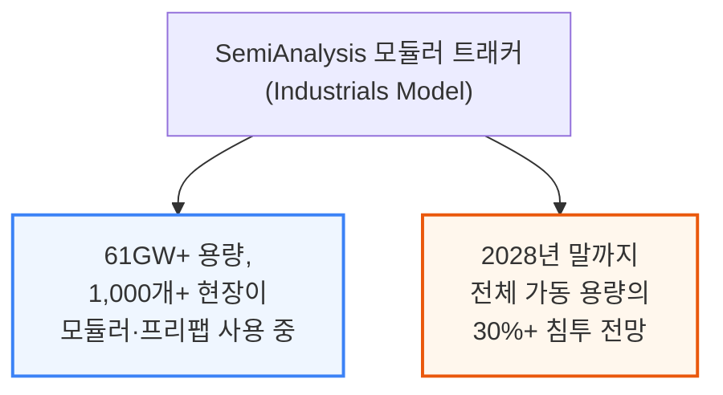
```mermaid
flowchart TD
    Tracker["SemiAnalysis 모듈러 트래커<br/>(Industrials Model)"] --> Scale["61GW+ 용량,<br/>1,000개+ 현장이<br/>모듈러·프리팹 사용 중"]
    Tracker --> Forecast["2028년 말까지<br/>전체 가동 용량의<br/>30%+ 침투 전망"]

    style Scale fill:#eff6ff,stroke:#3b82f6,stroke-width:2px
    style Forecast fill:#fff7ed,stroke:#ea580c,stroke-width:2px
```

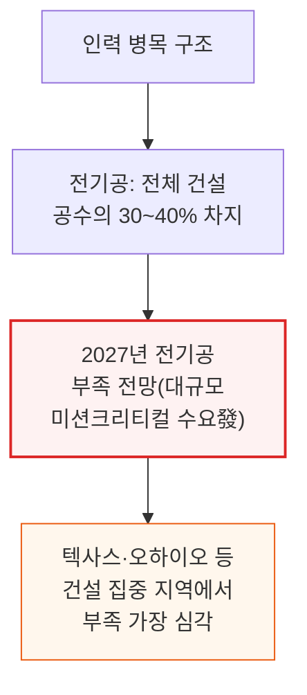
```mermaid
flowchart TD
    Labor["인력 병목 구조"] --> Share["전기공: 전체 건설<br/>공수의 30~40% 차지"]
    Share --> Shortage["2027년 전기공<br/>부족 전망(대규모<br/>미션크리티컬 수요發)"]
    Shortage --> Region["텍사스·오하이오 등<br/>건설 집중 지역에서<br/>부족 가장 심각"]

    style Shortage fill:#fef2f2,stroke:#dc2626,stroke-width:2px
    style Region fill:#fff7ed,stroke:#ea580c
```

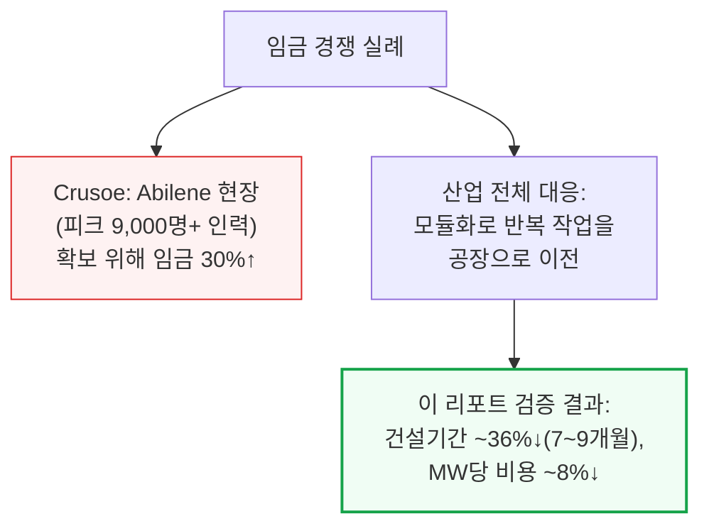
```mermaid
flowchart TD
    Wage["임금 경쟁 실례"] --> Crusoe["Crusoe: Abilene 현장<br/>(피크 9,000명+ 인력)<br/>확보 위해 임금 30%↑"]
    Wage --> Response["산업 전체 대응:<br/>모듈화로 반복 작업을<br/>공장으로 이전"]
    Response --> Result["이 리포트 검증 결과:<br/>건설기간 ~36%↓(7~9개월),<br/>MW당 비용 ~8%↓"]

    style Crusoe fill:#fef2f2,stroke:#dc2626
    style Result fill:#f0fdf4,stroke:#16a34a,stroke-width:2px
```

**📌 용어 풀이: 왜 지금 모듈화인가**
> - 콘크리트 벽이 완성된 패널로 도착하고, 전기·기계실이 이미 배선된 채 도착하며, 때로는 데이터 홀 전체가 트럭 짐칸에 실려 오는 것 — 이것이 "모듈러 건설"의 실제 모습으로, 마치 스파이더맨 레고 세트를 조립하듯 데이터센터를 조립하되 블록 하나의 무게가 22톤(5만 파운드)에 달하는 수준
> - Compass와 Switch가 데이터센터 건설의 일부를 공장으로 옮긴 최초의 운영사였고, 이후 AWS의 "Project Houdini"(화이트스페이스 조립을 공장화)와 Meta의 천막형("Tent") 데이터 홀 등으로 확산

---

## 2. 모듈러 분류체계 - 프리팹 vs 모듈러, 부지·셸·시스템 3층 구조

**📌 핵심:**
- 자주 혼동되는 두 개념을 먼저 구분: **프리팹(Prefabrication)**은 "어디서 만들었나"(공장 제작 후 현장 설치)를 뜻하고, **모듈러(Modular)**는 "어떤 형태인가"(방·박스·블록처럼 완결된 단위로 만들어져 현장에서 볼트로 조립되는 것)를 뜻함 — 모든 모듈러는 프리팹이지만, 모든 프리팹이 모듈러는 아님
- 데이터센터는 **부지(Site) → 셸(Shell) → 시스템(Systems)** 3개 층으로 볼 수 있음 — 부지는 땅을 고르고 배선하고 기초를 붓는 물리적 작업이라 **모듈화가 원천적으로 불가능**(땅에 직접 기초를 부어야 하기 때문), 셸은 건물의 골격·외피, 시스템은 셸 안에 들어가는 모든 전기·기계 설비
- 결론: 부지는 움직일 수 없으므로 모듈화 전략은 셸과 시스템 두 층에 집중 — 이 리포트도 바깥(셸)에서 안쪽(시스템)으로 순서대로 다룸

---

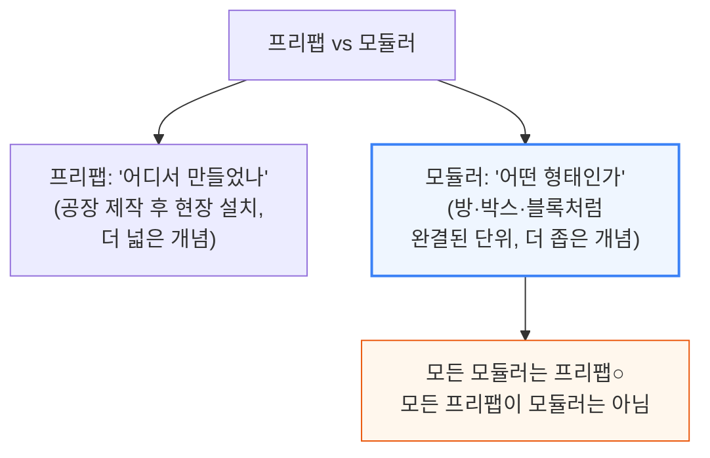
```mermaid
flowchart TD
    Concept["프리팹 vs 모듈러"] --> Prefab["프리팹: '어디서 만들었나'<br/>(공장 제작 후 현장 설치,<br/>더 넓은 개념)"]
    Concept --> Modular["모듈러: '어떤 형태인가'<br/>(방·박스·블록처럼<br/>완결된 단위, 더 좁은 개념)"]
    Modular --> Relation["모든 모듈러는 프리팹○<br/>모든 프리팹이 모듈러는 아님"]

    style Modular fill:#eff6ff,stroke:#3b82f6,stroke-width:2px
    style Relation fill:#fff7ed,stroke:#ea580c
```

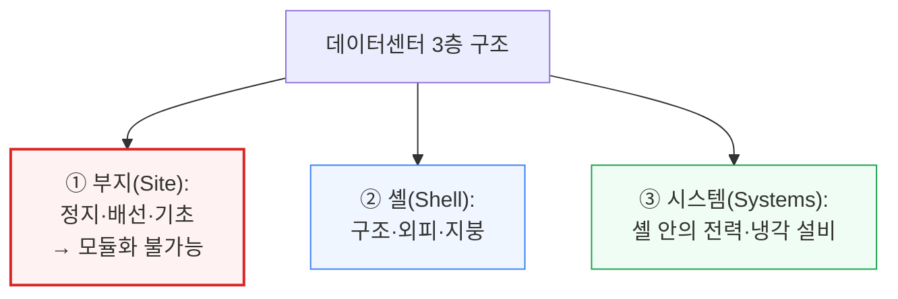
```mermaid
flowchart TD
    Anatomy["데이터센터 3층 구조"] --> Site["① 부지(Site):<br/>정지·배선·기초<br/>→ 모듈화 불가능"]
    Anatomy --> Shell["② 셸(Shell):<br/>구조·외피·지붕"]
    Anatomy --> Systems["③ 시스템(Systems):<br/>셸 안의 전력·냉각 설비"]

    style Site fill:#fef2f2,stroke:#dc2626,stroke-width:2px
    style Shell fill:#eff6ff,stroke:#3b82f6
    style Systems fill:#f0fdf4,stroke:#16a34a
```

---

## 3. 셸(외피) 모듈화 - 프리캐스트에서 텐트형 구조까지 3단계 진화

**📌 핵심:**
- 셸 모듈화는 크게 3단계로 진화 — **1단계(프리캐스트)**: 기존과 같은 복잡한 다층 건물이지만 콘크리트 패널을 공장에서 만들어 크레인으로 조립(예: CloudHQ의 2층 LC-2 건물, 애슈번, 여전히 18\~20개월 소요), **2단계(건물 자체 단순화)**: 다층 건물 대신 반복 가능한 단층 구조로 전환, 철골 사용(예: QTS Cedar Rapids 420MW 캠퍼스는 철골 2만 8,000톤으로 착공→지붕 완성 약 5개월, 전체 건물 인도 약 11개월), **3단계(목적 특화 초경량 구조)**: 아예 더 가볍고 좁은 구조로 전환(Meta의 천막형 "Tent" 홀, 뉴올버니 Prometheus 캠퍼스에 2025년 7월 발표 후 2026년 4월까지 위성사진상 8개 완공 확인)
- Crusoe의 Abilene Stargate 캠퍼스는 2단계 방식의 대표 사례 — 건물당 공장제작 패널 약 672개를 40일 이내 제작해 하루 15\~20개씩 설치, **8주 이내에 드라이인(방수 완료) 상태 도달**
- 속도의 원천은 철골 자체가 아니라 철골이 가능하게 하는 것(반복 가능한 단층 구조, 적은 현장 접점, 여러 지역에 복제 가능한 공급망) — 다만 단층 캠퍼스는 부지 면적을 더 많이 요구, 새 AI 시장에서는 부지가 저렴해 속도가 면적 효율보다 중요하므로 수용 가능한 트레이드오프
- 결론: Meta의 천막형 구조는 셸(외피)만 앞당길 뿐 전력 연계·냉각·커미셔닝까지 앞당기는 것은 아니며, 영구 콘크리트·철골 건물 대비 내구성·장기 유연성을 희생하는 트레이드오프가 있음

---

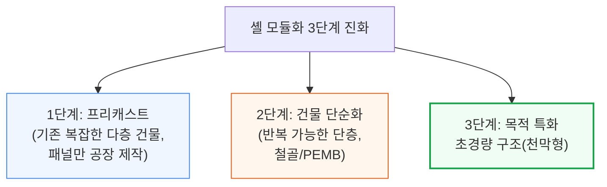
```mermaid
flowchart TD
    Evolution["셸 모듈화 3단계 진화"] --> P1["1단계: 프리캐스트<br/>(기존 복잡한 다층 건물,<br/>패널만 공장 제작)"]
    Evolution --> P2["2단계: 건물 단순화<br/>(반복 가능한 단층,<br/>철골/PEMB)"]
    Evolution --> P3["3단계: 목적 특화<br/>초경량 구조(천막형)"]

    style P1 fill:#eff6ff,stroke:#3b82f6
    style P2 fill:#fff7ed,stroke:#ea580c
    style P3 fill:#f0fdf4,stroke:#16a34a,stroke-width:2px
```

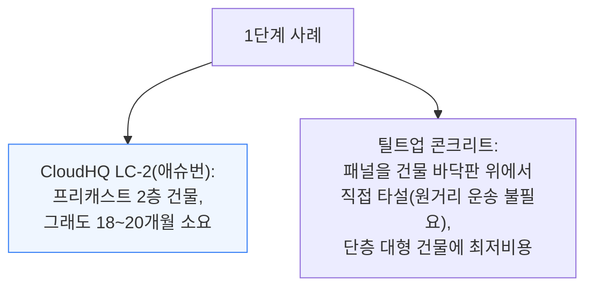
```mermaid
flowchart TD
    Phase1["1단계 사례"] --> CloudHQ["CloudHQ LC-2(애슈번):<br/>프리캐스트 2층 건물,<br/>그래도 18~20개월 소요"]
    Phase1 --> TiltUp["틸트업 콘크리트:<br/>패널을 건물 바닥판 위에서<br/>직접 타설(원거리 운송 불필요),<br/>단층 대형 건물에 최저비용"]

    style CloudHQ fill:#eff6ff,stroke:#3b82f6
```

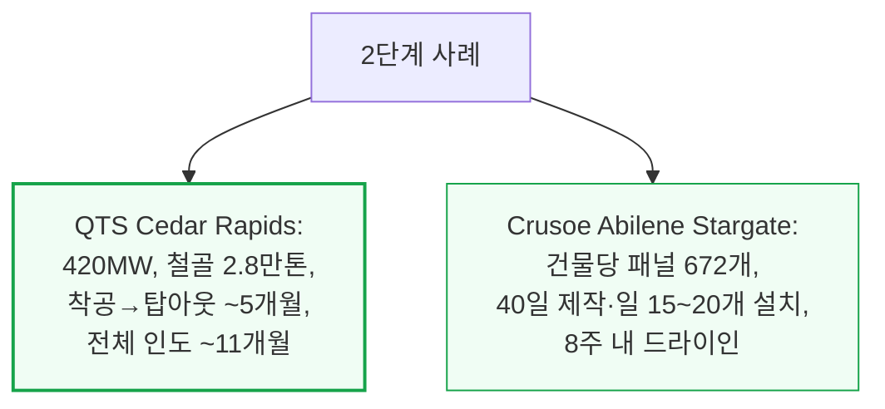
```mermaid
flowchart TD
    Phase2["2단계 사례"] --> QTS["QTS Cedar Rapids:<br/>420MW, 철골 2.8만톤,<br/>착공→탑아웃 ~5개월,<br/>전체 인도 ~11개월"]
    Phase2 --> Crusoe2["Crusoe Abilene Stargate:<br/>건물당 패널 672개,<br/>40일 제작·일 15~20개 설치,<br/>8주 내 드라이인"]

    style QTS fill:#f0fdf4,stroke:#16a34a,stroke-width:2px
    style Crusoe2 fill:#f0fdf4,stroke:#16a34a
```

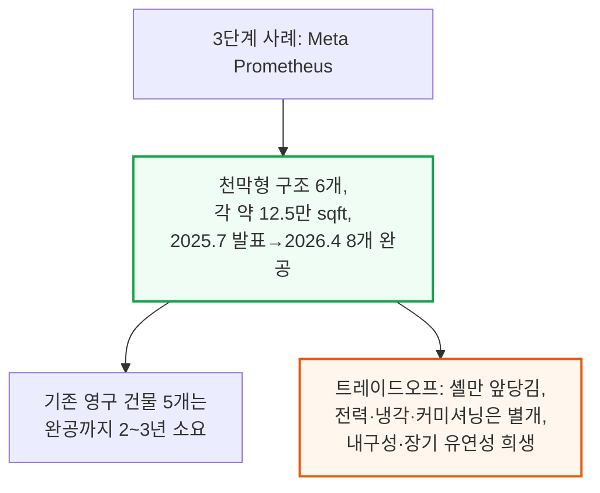
```mermaid
flowchart TD
    Phase3["3단계 사례: Meta Prometheus"] --> Tent["천막형 구조 6개,<br/>각 약 12.5만 sqft,<br/>2025.7 발표→2026.4 8개 완공"]
    Tent --> VsPermanent["기존 영구 건물 5개는<br/>완공까지 2~3년 소요"]
    Tent --> TradeOff["트레이드오프: 셸만 앞당김,<br/>전력·냉각·커미셔닝은 별개,<br/>내구성·장기 유연성 희생"]

    style Tent fill:#f0fdf4,stroke:#16a34a,stroke-width:2px
    style TradeOff fill:#fff7ed,stroke:#ea580c,stroke-width:2px
```

**📌 용어 풀이: PEMB(사전 설계 금속 건물)와 철골 구조**
> - **PEMB(Pre-Engineered Metal Building)**: 가벼운 경량 철골 건물을 뜻하며 ① 주골조(구조의 뼈대) ② 부골조(주골조를 잇는 더 가벼운 지붕 도리 등) ③ 스킨(외부 기상으로부터 내부를 보호하는 얇은 금속 패널)의 3부분으로 구성 — 모든 부품이 절단·천공·라벨링까지 끝난 채 도착해 현장에서는 볼트 체결만 하면 됨
> - **구조용 철골(Structural Steel)**: PEMB보다 무겁고 열간 압연된 철골로, 더 넓은 경간·더 무거운 하중·더 복잡한 배치를 지원하지만 비용이 더 높음

---

## 4. 장비·서브시스템 모듈화 - 폼팩터 5단계 사다리와 전력·냉각 블록

**📌 핵심:**
- 장비·서브시스템은 **컴포넌트→스킷→모듈→컨테이너→프리팹 데이터센터 블록**의 5단계 사다리로 볼 수 있음 — 앞 4단계는 "서브시스템 모듈화"(공급업체가 데이터센터의 일부만 공장 완제품으로 배송, 도착 후에도 더 큰 시설에 연결해야 쓸모 있음), 마지막 단계(때로는 4단계부터)는 "전체 시설 모듈화"(공급업체가 데이터센터의 훨씬 큰 부분을 통짜 제품으로 배송)
- **모듈러 전력 블록**이 서브시스템 모듈화 중 가장 자연스러운 영역 — Flex의 Anord Mardix 유닛을 예로 들면, 전력 범위만 공장으로 옮기면(전체 콘텐츠의 약 26%) 홀이 IT 사용 가능 상태에 도달하는 시간이 **약 22% 빨라지고**(약 13개월 vs 현장시공 약 16.7개월), MW당 비용은 **약 5% 저렴** — 기계·전기 설치 기간이 약 5.5개월에서 약 2.5개월로 압축된 덕분
- **모듈러 냉각 블록**은 상대적으로 미리 조립할 부품 자체가 적어 전력보다는 약한 케이스지만, 1·2차 냉각 루프가 복잡해질수록 반복 가능한 증분 단위로 냉각 용량을 늘릴 수 있다는 매력이 커짐 — Airedale by Modine의 스킷형 CDU(2MW급, 냉각 루프·완충 탱크·누수 감지까지 포함)는 현장에서 배관 2개와 전원만 연결하면 되고, Karman Industries의 CO2 기반 열처리 유닛(HPU)은 EV용 SiC 전력전자·영구자석 모터와 항공우주용 열교환기를 결합해 기존 대비 **4\~5배 높은 전력밀도**, 야외 기계 야드 면적을 **60\~80% 축소**
- 결론: 전력·냉각 외에도 배터리 저장(BESS)·수처리·소방 시스템 등 회색공간(전기·기계실) 전반이 같은 방식으로 공장화되고 있으나, 상당수는 공사 일정의 결정적 경로(critical path)에 있지 않거나 규모가 작아 큰 유닛 안에 얹혀서 함께 모듈화되는 경우가 많음(예: Schneider EcoStruxure는 소방 시스템을 내장)

---

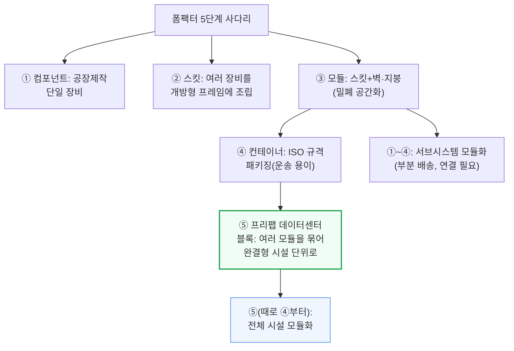
```mermaid
flowchart TD
    Ladder["폼팩터 5단계 사다리"] --> Level1["① 컴포넌트: 공장제작<br/>단일 장비"]
    Ladder --> Level2["② 스킷: 여러 장비를<br/>개방형 프레임에 조립"]
    Ladder --> Level3["③ 모듈: 스킷+벽·지붕<br/>(밀폐 공간화)"]
    Level3 --> Level4["④ 컨테이너: ISO 규격<br/>패키징(운송 용이)"]
    Level4 --> Level5["⑤ 프리팹 데이터센터<br/>블록: 여러 모듈을 묶어<br/>완결형 시설 단위로"]
    Level3 --> SplitNote["①~④: 서브시스템 모듈화<br/>(부분 배송, 연결 필요)"]
    Level5 --> WholeNote["⑤(때로 ④부터):<br/>전체 시설 모듈화"]

    style Level5 fill:#f0fdf4,stroke:#16a34a,stroke-width:2px
    style WholeNote fill:#eff6ff,stroke:#3b82f6
```

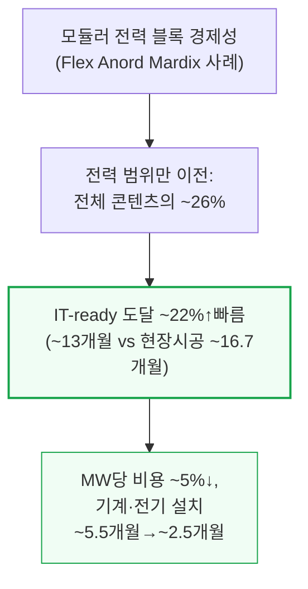
```mermaid
flowchart TD
    PowerBlock["모듈러 전력 블록 경제성<br/>(Flex Anord Mardix 사례)"] --> Content["전력 범위만 이전:<br/>전체 콘텐츠의 ~26%"]
    Content --> Speed["IT-ready 도달 ~22%↑빠름<br/>(~13개월 vs 현장시공 ~16.7개월)"]
    Speed --> Cost["MW당 비용 ~5%↓,<br/>기계·전기 설치<br/>~5.5개월→~2.5개월"]

    style Speed fill:#f0fdf4,stroke:#16a34a,stroke-width:2px
    style Cost fill:#f0fdf4,stroke:#16a34a
```

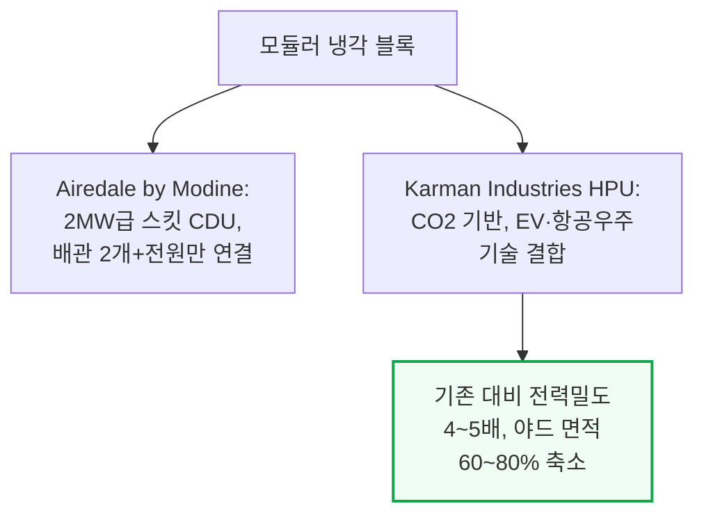
```mermaid
flowchart TD
    Cooling["모듈러 냉각 블록"] --> Airedale["Airedale by Modine:<br/>2MW급 스킷 CDU,<br/>배관 2개+전원만 연결"]
    Cooling --> Karman["Karman Industries HPU:<br/>CO2 기반, EV·항공우주<br/>기술 결합"]
    Karman --> Density["기존 대비 전력밀도<br/>4~5배, 야드 면적<br/>60~80% 축소"]

    style Density fill:#f0fdf4,stroke:#16a34a,stroke-width:2px
```

**📌 용어 풀이: 전력 모듈 안에 실제로 들어가는 것**
> - Flex는 전력 스킷(개방형)과 전력 모듈 팟(밀폐형 인클로저에 같은 구성을 넣은 것) 두 형태로 판매 — 내부에는 변압기·스위치기어·UPS·배터리가 발전소 배관처럼 순서대로 배치
> - 랙까지 전력을 이어주는 버스웨이(IBAR), 실내 공기 온도를 관리하는 CRAH(Computer Room Air Handler, 전산실 공조기), 화재 방지 시스템까지 한 모듈 안에 포함
> - 새로 등장한 하위 분류는 "소프트웨어 정의형" 전력 라우팅 블록 — DG Matrix처럼 변압기+스위치기어+UPS+배터리로 이어지는 기존 사슬 대신, 전력전자 기반 다중 포트 라우팅으로 전력망·발전·저장·직류 부하를 하나의 제어 플랫폼으로 연결

---

## 5. 기타 모듈화와 공장 조립 화이트스페이스

**📌 핵심:**
- **공장 조립 화이트스페이스(Factory Built White Space)**의 목적은 사람이 직접 짓고 배선하던 데이터 홀을 공장제 완제품으로 대체하는 것 — 운영사는 랙을 놓기만 하면 전력·냉각 연결까지 이미 준비된 상태
- Schneider의 EcoStruxure Pod가 대표 사례 — 검은색 캐비닛이 랙 열(최대 40개 배치 가능)을 이루고, 위쪽 회색 구조물이 전력을 나르는 버스웨이, 뜨거운 공기를 가두는 컨테인먼트, 열을 빼내는 물 냉각용 기술용수 루프, 서버를 연결하는 케이블링까지 담당
- 이 제품 설계의 핵심은 유연성 — Schneider 같은 공급업체는 Nvidia와 협력해 **30개 이상의 레퍼런스 디자인**을 지원, 구매자는 원하는 칩에 맞는 사양을 고르면 미리 조율된 전력·냉각 모듈이 딸린 홀을 받을 수 있음
- 결론: 전력·냉각이 회색공간(전기·기계실) 모듈화의 중심이라면, 화이트스페이스 모듈화는 그 결과물을 실제 컴퓨트가 들어가는 공간까지 확장한 것 — 이 둘이 합쳐지면 다음 섹션의 "전체 시설 모듈화"로 이어짐

---

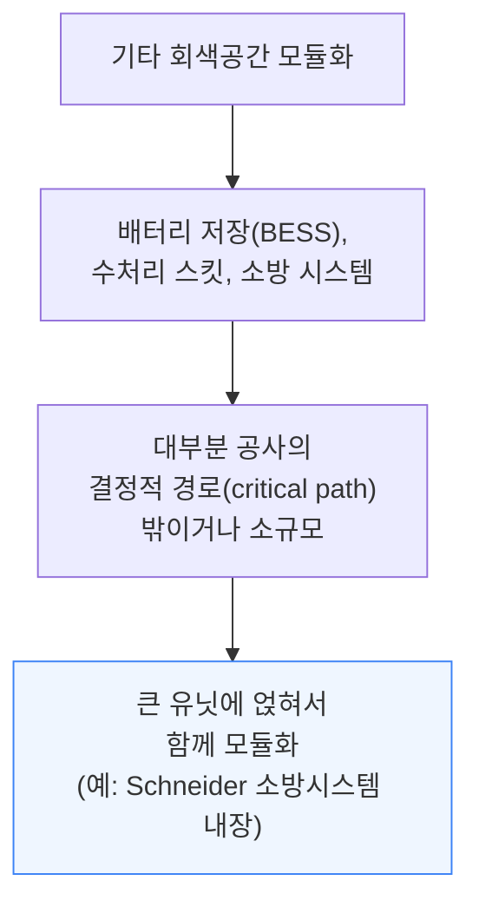
```mermaid
flowchart TD
    Other["기타 회색공간 모듈화"] --> BESS["배터리 저장(BESS),<br/>수처리 스킷, 소방 시스템"]
    BESS --> NotCritical["대부분 공사의<br/>결정적 경로(critical path)<br/>밖이거나 소규모"]
    NotCritical --> RideAlong["큰 유닛에 얹혀서<br/>함께 모듈화<br/>(예: Schneider 소방시스템 내장)"]

    style RideAlong fill:#eff6ff,stroke:#3b82f6
```

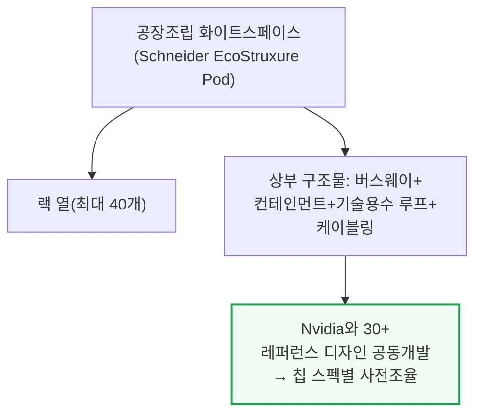
```mermaid
flowchart TD
    WhiteSpace["공장조립 화이트스페이스<br/>(Schneider EcoStruxure Pod)"] --> Racks["랙 열(최대 40개)"]
    WhiteSpace --> Overhead["상부 구조물: 버스웨이+<br/>컨테인먼트+기술용수 루프+<br/>케이블링"]
    Overhead --> Reference["Nvidia와 30+<br/>레퍼런스 디자인 공동개발<br/>→ 칩 스펙별 사전조율"]

    style Reference fill:#f0fdf4,stroke:#16a34a,stroke-width:2px
```

---

## 6. 전체 시설 모듈화 - 컨테이너·올인원 프리팹 블록·Nvidia DSX 레퍼런스 설계

**📌 핵심:**
- 전체 시설 모듈화는 부품이 아니라 **완결형 또는 거의 완결된 데이터센터 블록 자체를 배송**하는 방식 — **컨테이너형**(ISO 규격 컨테이너에 IT랙·전력장비·배터리·냉각까지 전부 담아 운송 용이성 극대화, 주로 엣지·산업·원격지·저지연 고정형 AI 추론에 쓰이나 **주된 한계는 낮은 밀도**)과 **올인원 프리팹 블록**(더 큰 시설 블록을 미리 통합, 예: Vertiv MegaMod는 1MW 레퍼런스 기준 약 26.5m×24m×4m, MegaMod Plus는 폭 31m까지 확장 — 실제로는 운송 가능한 여러 구간으로 쪼개 중량물 운송 트럭으로 옮긴 뒤 현장에서 다시 연결·시운전)으로 나뉨
- 전체 시설 모듈화의 마지막 단계는 특정 벤더의 블록을 넘어 **시설 자체의 표준 레퍼런스 설계**로 가는 것 — Nvidia가 발표한 **DSX**가 대표 사례로, 2025년 10월 GTC 워싱턴에서 Omniverse 디지털 트윈 청사진으로 처음 공개된 뒤 2026년 3월 Vera Rubin DSX 레퍼런스 설계로 공식화, 최근 전체 DSX 플랫폼으로 확장
- DSX 레퍼런스 설계는 컴퓨트·네트워킹·스토리지·하드웨어 클러스터 설계뿐 아니라 전력·냉각·제어, 심지어 토목·구조·건축 설계까지 검증된 AI 팩토리 아키텍처로 포괄 — **DSX Max-Q**는 정해진 전력 예산 안에서 와트당 토큰 처리량을 극대화, **DSX Flex**는 시설을 전력망 서비스에 연결해 하이브리드 자가발전과 함께 전력 소비를 동적으로 조정
- 결론: Omniverse DSX Blueprint를 통해 운영사는 먼저 디지털 트윈으로 배치·전력 토폴로지·열 거동·운영 정책을 실시간 시뮬레이션하고 설계를 최적화한 뒤, 같은 검증된 아키텍처를 여러 사이트에 재사용(CoreWeave가 DSX Air로 디지털 트윈을 이미 활용 중) — DSX 생태계에는 Cadence·Dassault Systemes·Eaton·Jacobs·Nscale·Phaidra·Procore·PTC·Schneider Electric·Siemens·Switch·Trane·Vertiv 등 공급망 전체가 참여(Vertiv OneCore는 전력·냉각을 표준화된 12.5MW 팟으로 패키징해 이 생태계의 빌딩블록 역할), EdgeConneX 추산으로는 공통 설계를 쓰면 부지별 맞춤화 전에 이미 허가 절차의 약 30\~60%까지 진행할 수 있어 공장 작업을 훨씬 일찍 시작 가능

---

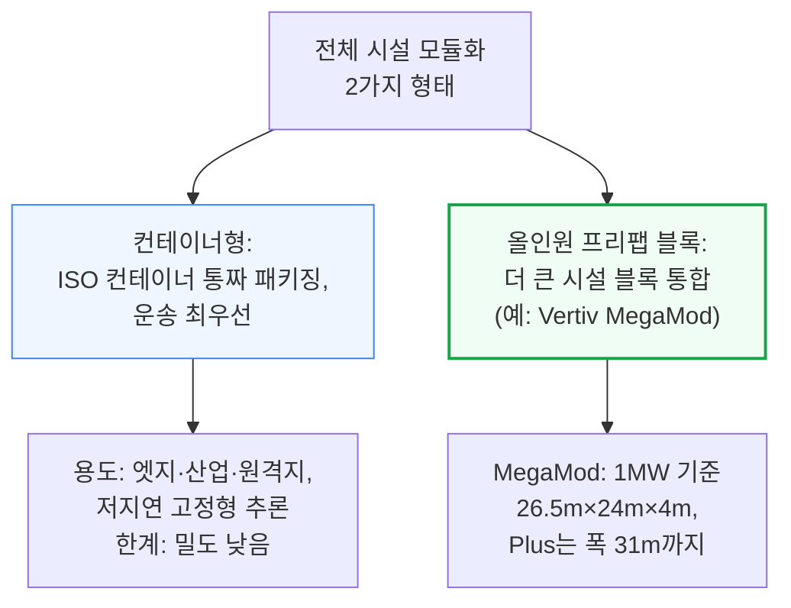
```mermaid
flowchart TD
    Whole["전체 시설 모듈화<br/>2가지 형태"] --> Container["컨테이너형:<br/>ISO 컨테이너 통짜 패키징,<br/>운송 최우선"]
    Whole --> AllInOne["올인원 프리팹 블록:<br/>더 큰 시설 블록 통합<br/>(예: Vertiv MegaMod)"]

    Container --> ContainerUse["용도: 엣지·산업·원격지,<br/>저지연 고정형 추론<br/>한계: 밀도 낮음"]
    AllInOne --> MegaModSpec["MegaMod: 1MW 기준<br/>26.5m×24m×4m,<br/>Plus는 폭 31m까지"]

    style Container fill:#eff6ff,stroke:#3b82f6
    style AllInOne fill:#f0fdf4,stroke:#16a34a,stroke-width:2px
```

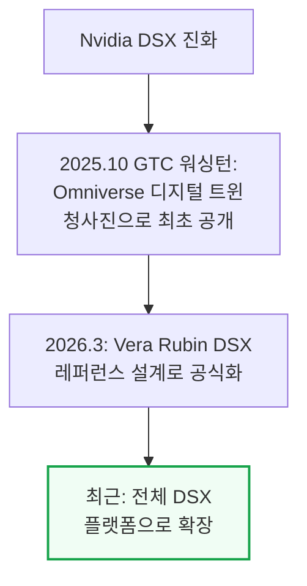
```mermaid
flowchart TD
    DSXTimeline["Nvidia DSX 진화"] --> T1["2025.10 GTC 워싱턴:<br/>Omniverse 디지털 트윈<br/>청사진으로 최초 공개"]
    T1 --> T2["2026.3: Vera Rubin DSX<br/>레퍼런스 설계로 공식화"]
    T2 --> T3["최근: 전체 DSX<br/>플랫폼으로 확장"]

    style T3 fill:#f0fdf4,stroke:#16a34a,stroke-width:2px
```

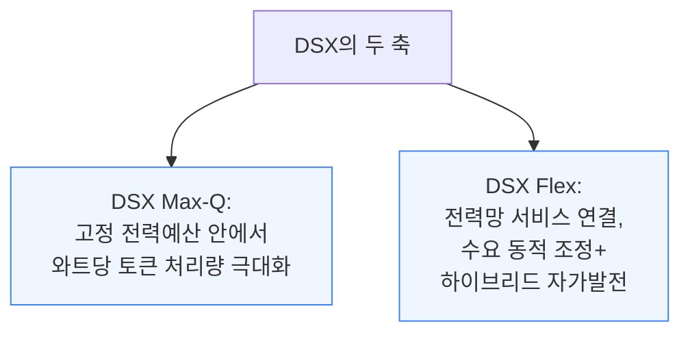
```mermaid
flowchart TD
    DSXRole["DSX의 두 축"] --> MaxQ["DSX Max-Q:<br/>고정 전력예산 안에서<br/>와트당 토큰 처리량 극대화"]
    DSXRole --> Flex["DSX Flex:<br/>전력망 서비스 연결,<br/>수요 동적 조정+<br/>하이브리드 자가발전"]

    style MaxQ fill:#eff6ff,stroke:#3b82f6
    style Flex fill:#eff6ff,stroke:#3b82f6
```

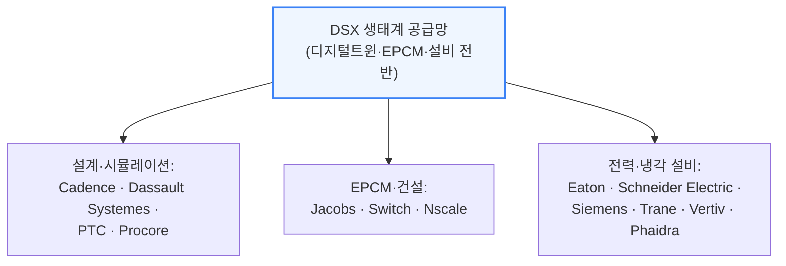
```mermaid
flowchart TD
    Ecosystem["DSX 생태계 공급망<br/>(디지털트윈·EPCM·설비 전반)"] --> Design["설계·시뮬레이션:<br/>Cadence · Dassault Systemes ·<br/>PTC · Procore"]
    Ecosystem --> EPCMPartners["EPCM·건설:<br/>Jacobs · Switch · Nscale"]
    Ecosystem --> Equip["전력·냉각 설비:<br/>Eaton · Schneider Electric ·<br/>Siemens · Trane · Vertiv · Phaidra"]

    style Ecosystem fill:#eff6ff,stroke:#3b82f6,stroke-width:2px
```

**📌 용어 풀이: DSX 생태계에서 EdgeConneX의 허가 절차 단축**
> - 일반적으로 허가(permit)는 부지마다 새로 진행해야 하지만, DSX처럼 검증된 공통 레퍼런스 설계를 쓰면 부지 고유의 맞춤화 작업이 끝나기 전부터 이미 허가 절차의 30\~60%를 진행해둘 수 있음 — 그만큼 공장에서의 선행 작업을 더 일찍 시작할 수 있다는 의미

---

## 7. 벤더 지형도와 통합 주체 - Operator-led·EPC-led·OEM-led 3가지 모델

**📌 핵심:**
- SemiAnalysis가 매핑한 모듈러 시장 지형도는 **80개 이상의 업체**로 구성 — ① 깊이는 서브시스템에 있음(전력룸·냉각 모듈 칸이 가장 붐빔), ② 같은 이름(Vertiv·Schneider·Eaton 등)이 여러 칸에 반복 등장(전력 모듈도 팔고, CDU도 팔고, 화이트스페이스 팟도 팔고, 통짜 블록도 파는 식)
- 누가 실제로 모듈화를 담당하는지는 3가지 모델로 나뉨 — **① Operator-led(운영사 주도)**: 운영사가 직접 장비를 지정·구매하고 통합업체는 조립만 담당(가장 큰 하이퍼스케일러에 국한, 예: AWS Project Houdini + Cupertino Electric), **② EPC-led(EPC·통합업체 주도)**: 운영사가 성능 요구사항만 정하고 EPC·통합업체가 조달·조율·시공(벤더 중립적, 고객이 설계 통제권 유지, 예: Comfort Systems), **③ OEM-led(장비업체 주도)**: 벤더가 자기 스택 전체를 하나의 완제품으로 설계·판매(예: Vertiv OneCore)
- Operator-led는 공급이 빠듯한 시장에서 위험이 큼 — 대규모 구매력으로 변압기·스위치기어를 확보할 벤더 배정 우선권이 없으면 희소 자재 경쟁에서 밀리기 때문에, 사실상 최대 하이퍼스케일러에만 국한(Aligned는 설계·주요 부품 지정은 직접 하되 제조 역량은 외부 통합 파트너에 의존하는 절충형)
- 결론: OEM-led는 콘텐츠(매출) 포착이 가장 크지만(Vertiv 콘텐츠는 discrete 장비 기준 MW당 약 $3.5백만에서 OneCore 완전 배포 시 약 $7백만까지 확대) 그만큼 **OEM 자체 공장 생산능력만큼만 확장 가능**하다는 한계 — Vertiv 모듈러 솔루션의 현재 리드타임은 12개월 이상이며, 대형 프로젝트를 우선하는 용량 배정 정책 때문에 소규모 운영사·개발사는 System Integrator 쪽으로 몰리는 추세

---

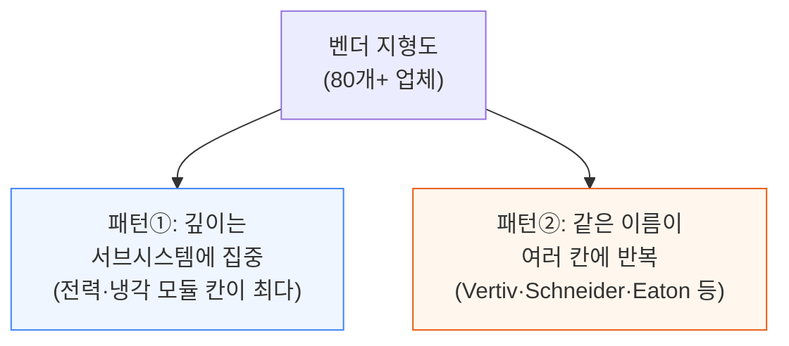
```mermaid
flowchart TD
    Landscape["벤더 지형도<br/>(80개+ 업체)"] --> Depth["패턴①: 깊이는<br/>서브시스템에 집중<br/>(전력·냉각 모듈 칸이 최다)"]
    Landscape --> Repeat["패턴②: 같은 이름이<br/>여러 칸에 반복<br/>(Vertiv·Schneider·Eaton 등)"]

    style Depth fill:#eff6ff,stroke:#3b82f6
    style Repeat fill:#fff7ed,stroke:#ea580c
```

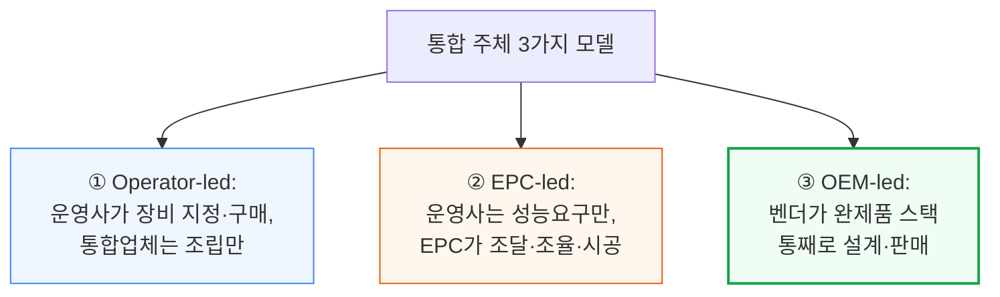
```mermaid
flowchart TD
    Ownership["통합 주체 3가지 모델"] --> Op["① Operator-led:<br/>운영사가 장비 지정·구매,<br/>통합업체는 조립만"]
    Ownership --> EPCLed["② EPC-led:<br/>운영사는 성능요구만,<br/>EPC가 조달·조율·시공"]
    Ownership --> OEM["③ OEM-led:<br/>벤더가 완제품 스택<br/>통째로 설계·판매"]

    style Op fill:#eff6ff,stroke:#3b82f6
    style EPCLed fill:#fff7ed,stroke:#ea580c
    style OEM fill:#f0fdf4,stroke:#16a34a,stroke-width:2px
```

```mermaid
flowchart TD
    OpExample["Operator-led 사례"] --> AWS2["AWS: Houdini 스킷 직접설계<br/>+ Cupertino Electric<br/>제조파트너"]
    OpExample --> Aligned["Aligned: 설계·주요부품은<br/>직접, 제조역량은<br/>외부 통합파트너 의존"]
    AWS2 --> Risk2["Operator-led 리스크:<br/>변압기·스위치기어<br/>희소자재 경쟁"]

    style Risk2 fill:#fef2f2,stroke:#dc2626
```

```mermaid
flowchart TD
    OEMTradeoff["OEM-led 트레이드오프<br/>(Vertiv OneCore 사례)"] --> Content2["콘텐츠 확대:<br/>~$3.5백만/MW→<br/>~$7백만/MW"]
    OEMTradeoff --> Limit["한계: OEM 자체<br/>공장 생산능력만큼만<br/>확장 가능"]
    Limit --> LeadTime["현재 리드타임<br/>12개월+, 대형<br/>프로젝트 우선배정"]

    style Content2 fill:#f0fdf4,stroke:#16a34a,stroke-width:2px
    style LeadTime fill:#fef2f2,stroke:#dc2626,stroke-width:2px
```

---

## 8. 모듈화 사이클 5단계 - 설계·문서화·조립·운송·현장 커미셔닝

**📌 핵심:**
- **1단계(설계·시뮬레이션)**: 현장 시공은 공사 중에도 설계를 바꿀 여지가 있지만, 모듈러는 박스 자체가 완결된 형태로 나와야 하므로 모든 결정을 미리 확정해야 함 — 부하 산정, 장비 선정, 단선도(SLD) 작성, 단락·보호협조·아크플래시 스터디(ETAP·PSSE 등 도구 사용)까지 시설 전체 관점에서 먼저 끝나야 개별 모듈 설계가 가능(전기 경로 전체를 봐야 하기 때문에 고립된 스킷 단위로는 계산 불가능) — 415/480VAC는 이미 템플릿화됐지만 800VDC 전환은 아직 검증된 레퍼런스가 부족, Aran Industries 같은 업체는 ETAP·PSCAD·PSSE·Revit에 연동되는 자체 소프트웨어로 **2개월+ 걸리던 다수 엔지니어 작업을 컴퓨트 몇 시간+엔지니어 1명 검토로 압축** 중
- **소유권 구조**: 장비를 누가 고르는지와 비용·재고·리드타임 리스크를 누가 지는지는 별개 문제 — 콜로케이션 운영사는 특정 임차인에 매이지 않아 누구보다 먼저 장비를 결정할 수 있는 예외 사례, 다만 스위치기어·변압기는 12\~18개월 리드타임이 걸리고 맞춤화는 설계를 다시 열어 약 8주를 더함
- **2\~3단계(문서화·조립/시험)**: 설계 확정 후에는 공장용 IFF(제작지시) 패키지, 현장용 IFC(시공지시) 패키지, 허가·시운전용 문서 패키지가 각각 다른 도구로 만들어짐(설계를 자동화하면 이 문서들을 하나의 소스에서 생성해 수작업 재작성 제거) — 조립은 레고 조립처럼 기초·스킷·프레임 위에 순서대로 장비를 배치하며, 공장 수락 시험(FAT)은 ① 각 조립 단계마다의 검사 게이트 ② 완성 후 실제 가동 조건으로 전체를 켜보는 최종 시험 2단계로 진행 — 업계의 **"1-10-100 법칙"**(설계·조립 단계에서 고치면 $1, 양산 시작 후엔 $10, 출하 후엔 $100)이 공장 시험의 중요성을 압축해서 보여줌
- **4단계(운송·설치)**: 미 연방법상 폭 102인치·총중량 8만 파운드까지는 무허가로 다닐 수 있어(모듈 자체 중량 한도 약 24톤) MS Azure Modular Datacenter·Schneider Easy Modular는 이 규격(96인치 폭 40피트 ISO 컨테이너)에 맞춰 허가 없이 주 경계를 넘나듦 — 이를 넘으면 허가가 필요하지만 비용 자체는 크지 않음(주당 $15\~100, 500마일 이동에 트레일러당 $6,000\~7,000) — 진짜 문제는 **폭 16피트 초과 시 "슈퍼로드"로 분류**돼 주(state)마다 7\~21일 걸리는 교량 공학 검토가 필요하고 기준도 주마다 달라(버지니아는 18피트·25만 파운드부터, 오하이오는 14피트·12만 파운드부터 슈퍼로드), 여기에 보험 한도까지 걸림(고가 AI 랙은 트레일러 1대에 1\~2개씩만 실어야 보험사가 손실 위험을 받아줌 — 실제로 웨스트버지니아에서 대형 UPS 모듈을 실은 트럭이 전복된 사례도 있음)
- 결론: **5단계(현장 커미셔닝)**가 모듈 사이클의 가장 큰 병목 — 전체 현장 시운전은 3\~8개월이 걸리며, 업계는 6단계 사다리(L1 공장검수 "레드태그" → L2 인도·설치 확인 → L3 사전기능·기동 "그린태그" → L4 기능성능시험 "블루태그" → L5 통합시스템시험 "화이트태그", 시설 전체를 정전·UPS전환 등 모의 장애 상황에서 함께 가동)로 검증하며 **L2부터는 반드시 현장에서만 가능**(전력망·발전기·배터리 저장 같은 실제 에너지원은 현장에만 있기 때문) — 시간을 되찾는 레버는 2가지: ① 먼저 도착한 모듈의 L2\~L4를 나중 모듈의 인도와 병렬 처리하고 L5만 전체 완료를 기다리기 ② 임대 발전기·저항 부하뱅크를 트럭으로 실어와 시험 후 치우는 대신, 실제 전력장비·배터리 저장 자체를 부하뱅크로 재사용 — 다만 일부 6\~9개월 초단축 일정은 커미셔닝을 압축·축소해서 달성한 것으로, 그만큼 위험이 운영 단계로 넘어갈 뿐이라는 경고

---

```mermaid
flowchart TD
    Cycle["모듈화 사이클 5단계"] --> S1["1단계: 설계·시뮬레이션"]
    S1 --> S2["2단계: 문서화(IFF/IFC)"]
    S2 --> S3["3단계: 조립·공장시험(FAT)"]
    S3 --> S4["4단계: 운송·설치"]
    S4 --> S5["5단계: 현장 커미셔닝"]

    style S1 fill:#eff6ff,stroke:#3b82f6
    style S5 fill:#fef2f2,stroke:#dc2626,stroke-width:2px
```

```mermaid
flowchart TD
    Design["1단계 설계 자동화<br/>(Aran Industries 사례)"] --> Tools["ETAP·PSCAD·PSSE·Revit<br/>연동 자체 소프트웨어"]
    Tools --> Before["기존: 2개월+<br/>다수 엔지니어 작업"]
    Tools --> After["전환: 컴퓨트 몇 시간+<br/>엔지니어 1명 검토"]

    style After fill:#f0fdf4,stroke:#16a34a,stroke-width:2px
```

```mermaid
flowchart TD
    FAT["3단계 공장수락시험(FAT)"] --> Gate["① 조립 단계별<br/>검사 게이트"]
    FAT --> Final["② 완성 후 실가동<br/>조건 최종 시험"]
    Final --> Rule["1-10-100 법칙:<br/>설계단계 $1 → 양산후 $10<br/>→ 출하후 $100"]

    style Rule fill:#fff7ed,stroke:#ea580c,stroke-width:2px
```

```mermaid
flowchart TD
    Transport["4단계 운송 규제 문턱"] --> NoPermit["무허가: 폭 102인치·<br/>8만파운드까지<br/>(모듈 한도 ~24톤)"]
    Transport --> Permit["허가 필요: 비용은<br/>낮음(주당 $15~100)"]
    Permit --> Super["폭 16피트 초과 시<br/>'슈퍼로드'<br/>→ 주별 교량검토 7~21일"]
    Super --> StateDiff["주마다 기준 상이:<br/>VA(18ft·25만lbs) vs<br/>OH(14ft·12만lbs)"]

    style Super fill:#fef2f2,stroke:#dc2626,stroke-width:2px
    style StateDiff fill:#fff7ed,stroke:#ea580c
```

```mermaid
flowchart TD
    Commission["5단계 현장 커미셔닝<br/>6단계 사다리"] --> L1["L1 공장검수<br/>'레드태그'(공장에서 완료)"]
    L1 --> L2["L2 인도·설치확인<br/>(현장 시작점)"]
    L2 --> L3["L3 사전기능·기동<br/>'그린태그'"]
    L3 --> L4["L4 기능성능시험<br/>'블루태그'"]
    L4 --> L5["L5 통합시스템시험<br/>'화이트태그'(모의장애<br/>포함 전체 동시가동)"]

    style L2 fill:#fff7ed,stroke:#ea580c,stroke-width:2px
    style L5 fill:#fef2f2,stroke:#dc2626,stroke-width:2px
```

```mermaid
flowchart TD
    TimeLever["커미셔닝 시간 단축<br/>2대 레버"] --> Parallel2["① 먼저 온 모듈<br/>L2~L4를 나중 모듈<br/>인도와 병렬처리"]
    TimeLever --> LoadBank["② 임대 발전기·<br/>부하뱅크 대신<br/>실제 플랜트를 재사용"]
    TimeLever --> Warning["단, 6~9개월<br/>초단축 일정은<br/>위험을 운영단계로 이전"]

    style Warning fill:#fef2f2,stroke:#dc2626,stroke-width:2px
```

**📌 용어 풀이: IFF vs IFC 패키지**
> - **IFF(Issued-For-Fabrication) 패키지**: 공장에 "어떻게 만들지"를 알려주는 제작도면
> - **IFC(Issued-For-Construction) 패키지**: 현장에 "어떻게 받고 배치하고 연결할지"를 알려주는 시공도면 — 서로 다른 대상(공장 vs 현장)을 위해 별도로 발행되는 별개 문서이지 같은 문서가 아니어서 둘 사이에 내용이 어긋날 위험도 없음

---

## 9. 모듈러 가치제안 검증 - 속도·TCO·품질 실측과 벤더 주장 재평가

**📌 핵심:**
- 모듈러 홍보는 크게 3가지 주장에 기댐 — ① 시장 진입 속도 ② 시공 품질·안전성 ③ 총소유비용(TCO) — 벤더들이 내세우는 숫자는 큼직함(Vertiv MegaMod 최대 50%, SmartRun 최대 85% 배포 단축 주장, Schneider는 전력·냉각 모듈 기준 60% 단축·13% 초기비용 절감 주장)
- SemiAnalysis는 자체 Industrials Model의 기준 시설(미국 50MW 물 냉각 AI 홀)로 바닥부터 재구성해 검증한 결과 **건설 기간 약 36% 단축**(허가 제외 전체 공정 기준, 관행적 스틱빌드 약 30\~35개월+ vs 완전 모듈러 약 24\~30개월, 그 중에서도 완전 모듈러는 12\~18개월까지 압축 가능), **MW당 전체 비용 약 8% 절감**(약 $14.6백만/MW → 약 $13.5백만/MW, 약 $1.1백만/MW 절감)으로 확인
- 속도의 근원은 인력 시간 자체의 감축 — 50MW 홀의 MEP(기계·전기) 설치는 MW당 약 12,000 필드 작업시간(홀 전체 60만 시간, 피크 시 약 300명 숙련공)을 소요하는데, MEP 범위를 공장으로 옮기면 현장 작업시간이 MW당 약 4,500시간(약 63%↓)으로, 그중 전기공 면허 필요 작업시간은 약 85% 줄어듦 — 다만 공장 작업이 부지 작업과 병렬로 돌아가기 때문에, 전체 일정 단축폭은 작업시간 감축폭보다는 작음
- 결론: **속도는 곧 돈** — CSP(클라우드 서비스 제공사) 기준 IT MW당 연간 매출은 대략 $12\~15백만(월 $1\~1.25백만), 이 기준으로 스틱빌드 대비 약 8개월 앞당기면 소유·운영자는 50MW 홀 전체에서 약 $2억(할인 전, MW당 약 $4백만)의 가치를 추가로 확보 — 단, 이는 건물 완공이 실제 병목(전력 공급·GPU 인도보다 늦게 끝나는 요인)일 때만 성립. 다만 **품질 측면에서는 상반된 신호**도 존재(공장 초회 통과율 95%+ vs 현장 60\~70% 주장 대비, 실제로는 신뢰성 문제로 시간절감을 상쇄하고 장비 손상 위험까지 낳았다는 최근 운영사·MEP 계약사들의 지적) — SemiAnalysis의 실측 36%는 Flex가 공개한 "전체 프로젝트 기준 30%+ 하한"보다 살짝 높은 수준으로, 벤더들이 내세우는 더 큰 숫자(Vertiv SmartRun 85%, MegaMod 50%, Schneider 60%)는 대개 오버헤드 버스웨이·컨테인먼트나 전력·냉각 모듈처럼 **훨씬 좁은 범위**에서 측정된 수치임에 유의해야 함

---

```mermaid
flowchart TD
    Claims["벤더 마케팅 주장<br/>vs SemiAnalysis 실측"] --> Vertiv3["Vertiv: MegaMod 최대50%,<br/>SmartRun 최대85%"]
    Claims --> Schneider3["Schneider: 60%단축,<br/>13% 초기비용↓"]
    Claims --> Real["SemiAnalysis 실측(전체공정<br/>기준): 속도 ~36%↓,<br/>비용 ~8%↓"]

    style Real fill:#f0fdf4,stroke:#16a34a,stroke-width:2px
```

```mermaid
flowchart TD
    Timeline4["건설기간 4블록<br/>(관행적 50MW 기준)"] --> Ground["그라운드워크:<br/>4~6개월(평균 5)"]
    Ground --> Shell4["구조·셸: 2.5~4.5개월<br/>(중간값 3.5)"]
    Shell4 --> MEP["MEP 핏아웃:<br/>7~11개월"]
    MEP --> Comm["커미셔닝~IT-ready:<br/>3~8개월(중간값 4.5)"]

    style MEP fill:#fff7ed,stroke:#ea580c
```

```mermaid
flowchart TD
    AllIn["전체 일정 비교<br/>(허가 포함)"] --> Stick["스틱빌드:<br/>~30~35개월+"]
    AllIn --> ModMix["오늘날 일부모듈러<br/>기준선: ~24~30개월"]
    AllIn --> FullMod["완전 모듈러:<br/>~12~18개월"]

    style Stick fill:#fef2f2,stroke:#dc2626
    style FullMod fill:#f0fdf4,stroke:#16a34a,stroke-width:2px
```

```mermaid
flowchart TD
    LaborHours["인력시간 절감<br/>(50MW 홀 기준)"] --> Before2["기존: MW당 1.2만시간,<br/>홀 전체 60만시간,<br/>피크 300명"]
    Before2 --> After2["MEP 공장이전 후:<br/>MW당 4,500시간(~63%↓),<br/>전기공 면허시간 ~85%↓"]

    style After2 fill:#f0fdf4,stroke:#16a34a,stroke-width:2px
```

```mermaid
flowchart TD
    SpeedMoney["속도=돈 계산 구조"] --> Revenue["CSP 매출: IT MW당<br/>연 $12~15백만<br/>(월 $1~1.25백만)"]
    Revenue --> Depre["GPU 감가상각:<br/>월 ~$50만/MW<br/>(유휴 시 손실)"]
    Depre --> Gain["8개월 단축 적용 시:<br/>50MW 홀 전체 ~$2억,<br/>MW당 ~$4백만"]

    style Gain fill:#f0fdf4,stroke:#16a34a,stroke-width:2px
```

```mermaid
flowchart TD
    TCOStructure["TCO 절감 구조<br/>(50MW 기준)"] --> Base["$14.6백만/MW→<br/>$13.5백만/MW(~8%↓)"]
    Base --> Save["절감: 인건비 $0.6백만+<br/>설치비 $0.5백만/MW"]
    Base --> Penalty["페널티: 이중마진<br/>(모듈벤더+현장통합업체<br/>각각 마진)"]

    style Save fill:#f0fdf4,stroke:#16a34a,stroke-width:2px
    style Penalty fill:#fff7ed,stroke:#ea580c,stroke-width:2px
```

```mermaid
flowchart TD
    Quality2["품질·예측가능성"] --> Factory2["공장 초회통과율:<br/>95%+ 목표"]
    Quality2 --> Field["현장 기준선:<br/>60~70%"]
    Field --> Recent["다만 최근: 일부<br/>운영사가 신뢰성<br/>문제 제기(시간절감<br/>상쇄+장비손상 위험)"]

    style Recent fill:#fef2f2,stroke:#dc2626,stroke-width:2px
```

**📌 용어 풀이: 벤더 주장 재평가가 필요한 이유**
> - Vertiv의 SmartRun "최대 85%" 단축은 오버헤드 버스웨이·컨테인먼트 부분에만 적용되는 수치, MegaMod의 "50%"는 현장시공 대비 모듈 배포 단계만 비교한 수치, Schneider의 "60%"는 전력·냉각 모듈 범위에만 해당
> - 반면 SemiAnalysis의 \~36%는 그라운드워크부터 커미셔닝까지 전체 건설 공정을 기준으로 한 수치라 서로 다른 범위를 비교하고 있음을 인지해야 함

---

## 10. 운영자별 모듈화 현황 - 하이퍼스케일러·GPU클라우드·코로케이션

**📌 핵심:**
- **하이퍼스케일러**는 대체로 자체 함대를 직접 짓고 조달을 수직 계열화해 혁신을 가장 먼저 시도 — **AWS**는 2025년 말까지 약 3.9GW를 추가하며 가장 빠른 확장 속도를 보였고, Project Houdini는 표준 데이터 홀 설계를 길이 약 45피트·무게 약 2,000파운드의 공장제 스킷으로 재구성(더블드롭 트레일러로 운송 가능)해 배포 기간을 **15주에서 2\~3주로 단축**, 모듈당 5만 시간 이상의 현장 전기공 작업을 없앰 — 설계 승인과 물리적 조립 승인을 분리한 것이 특징(Cupertino Electric이 물리적 조립 파트너)
- **Meta**는 뉴올버니 Prometheus 캠퍼스에 천막형 구조 6개를 세워 기존 영구 건물(완공까지 2\~3년)보다 훨씬 짧은 기간에 외피를 완성(2025년 7월 발표 이후 2026년 4월까지 8개 완공 확인) — 다만 셸만 앞당길 뿐 내구성은 희생
- **GPU 클라우드·네오클라우드** 중 **Crusoe**는 2022년 Easter-Owens 인수로 모듈러 제조 역량을 아예 사내로 편입, 콜로라도 브라이턴의 Spark 공장에서 약 1MW급 완결형 유닛을 생산(네바다 Redwood Materials 현장에 4기로 시작해 24기로 확장 발표) — **Hut 8**은 자체 제작 대신 완제품 스택을 통째로 구매하는 전략으로, Corpus Christi Beacon Point 캠퍼스에서 Vertiv OneCore로 704MW IT 임대를 상업화(Nvidia DSX 아키텍처 기반, American Electric Power가 전력망 연계·Jacobs가 EPCM·Vertiv가 전력냉각 담당) — **Nebius**는 자사 컴퓨트 아키텍처에 맞춰 전력·냉각 등 선택적 부분만 가볍게 모듈화(뉴저지 캠퍼스는 DataOne과 협력해 최대 300MW까지 단계적 확장, Bloom Energy 연료전지 자가발전 병행; 프랑스 베튄에서는 옛 브리지스톤 타이어 공장을 재활용해 그린필드 셸·허가 절차를 일부 생략)
- **코로케이션 업체** 중 **Compass**는 모듈러 플레이북을 가장 오래 운영 — 건물의 약 70\~85%를 공장에서 제작해 골조·지붕을 18\~21일 만에 세우며, 셸(무철근 섬유보강 프리캐스트)·화이트스페이스(Schneider EcoStruxure Pod)·전력블록(약 1.25MW Schneider 파워센터)·MV 스위치기어(Siemens 5년간 최대 1,500대 계약)까지 전체 스택을 반복 생산, Red Oak 최대 360MW·Goodyear 8개동 180만 sqft에 동일 키트를 적용 — **QTS**는 설계를 일찍 고정하고 벤더 간 인터페이스를 표준화하며 핵심 장비를 미리 사서 재고로 쌓는 전략(캔자스에 장리드타임 장비용 창고 약 700만 sqft 운영), Freedom Design(1.5MW 증분 확장 전력계통)에서 Freedom LC+(냉각 확장)를 거쳐 반복 가능한 60MW 데이터 홀 블록 단위의 "Rapids" 설계까지 발전(노동력 압박이 MW당 건설비를 약 20\~30% 끌어올렸다는 것이 QTS의 추산) — **Aligned**는 랙 밀도가 바뀌어도 핵심 전력·냉각 아키텍처는 표준을 유지한 채 홀 구성만 바꾸는 "적응형" 전략으로, 공랭(Delta³, 랙당 최대 약 50kW)과 수랭(DeltaFlow, 랙당 350kW 초과)을 같은 배관 인터페이스 위에서 전환 가능하게 설계(텍사스 Project Caprock은 6개 동·540MW·165만 sqft)
- 결론: 세 그룹의 공통점은 "표준화된 핵심을 반복하되, 유연성이 필요한 지점만 남긴다"는 것 — 하이퍼스케일러는 자체 워크로드에 맞춘 설계를, 코로케이션은 임차인이 바뀌어도 통하는 범용 설계를, GPU클라우드는 자본·인력 여력에 따라 완전 자체 제작(Crusoe)과 완제품 구매(Hut 8) 사이에서 각자의 위치를 선택

---

| 구분 | 업체 | 대표 전략 | 핵심 수치 |
|---|---|---|---|
| 하이퍼스케일러 | AWS | Project Houdini(화이트스페이스 스킷화) | 배포 15주→2\~3주, 모듈당 전기공 5만시간+ 절감 |
| 하이퍼스케일러 | Meta | Prometheus 천막형 셸 | 6개동, 완공 2\~3년→2025.7 발표 후 2026.4까지 8개 |
| GPU클라우드 | Crusoe | Easter-Owens 인수·Spark 자가제조 | Spark 1MW급, Redwood NV 4기→24기 확장 |
| GPU클라우드 | Hut 8 | Vertiv OneCore 완제품 구매 | Beacon Point 704MW IT 임대 |
| GPU클라우드 | Nebius | 선택적 경량 모듈화 | NJ 최대 300MW, 베튄(佛)은 기존 공장 재활용 |
| 코로케이션 | Compass | 전체 스택 반복 키트화 | 70\~85% 공장제작, 골조 18\~21일 |
| 코로케이션 | QTS | 설계 조기고정·장비 사전비축 | 창고 700만 sqft, Rapids=60MW 블록 |
| 코로케이션 | Aligned | 표준 배관+가변 밀도 | Delta³≤50kW/랙 vs DeltaFlow>350kW/랙 |

```mermaid
flowchart TD
    Houdini["AWS Houdini 효과"] --> Time3["배포기간:<br/>15주→2~3주"]
    Houdini --> Labor3["모듈당 현장 전기공<br/>5만시간+ 절감"]
    Houdini --> Approval["승인모델: 설계검증과<br/>물리조립검증을<br/>별도로 분리"]

    style Time3 fill:#f0fdf4,stroke:#16a34a,stroke-width:2px
```

```mermaid
flowchart TD
    CrusoeVI["Crusoe 수직계열화"] --> Acq["2022 Easter-Owens<br/>인수(모듈러 제조 내재화)"]
    Acq --> Spark["Brighton, CO<br/>Spark 공장(1MW급<br/>완결형 유닛)"]
    Spark --> Redwood["Redwood Materials(NV):<br/>4기 시작→24기 확장"]

    style Redwood fill:#f0fdf4,stroke:#16a34a,stroke-width:2px
```

```mermaid
flowchart TD
    AlignedAMI["Aligned Adaptive<br/>Modular Infrastructure"] --> Delta3["Delta³(공랭):<br/>랙당 최대 ~50kW"]
    AlignedAMI --> DeltaFlow["DeltaFlow(수랭):<br/>랙당 350kW 초과"]
    Delta3 --> SameLoop["동일 배관·시설<br/>인터페이스 유지<br/>→ 밀도만 전환"]
    DeltaFlow --> SameLoop

    style SameLoop fill:#eff6ff,stroke:#3b82f6,stroke-width:2px
```

---

## 11. 승자와 패자 - 공급업체별 영향

**📌 핵심:**
- **통합 장비 플랫폼**에서는 **Vertiv**가 가장 강한 모듈러 포지션 — 개별 서브시스템(SmartMod)부터 완결형 스택(OneCore, 2026년 3월 Nvidia Vera Rubin DSX의 기본 블록으로 채택)까지 전 구간을 커버하며 콘텐츠를 MW당 약 $3.5백만에서 OneCore 완전 배포 시 약 $7백만까지 확대, 2025년 말 기준 백로그 150억 달러·4분기 북투빌(수주/매출 비율) 2.9배, 2026년 4월 BMarko 인수로 지역 모듈러 생산능력을 약 7배 늘릴 전망 — **Schneider Electric**은 두 번째로 넓은 포트폴리오로, Vertiv의 통짜형 OneCore와 달리 개별적으로도 조합 가능한 구성형 블록(EcoStruxure)을 판매(Compass와 30억 달러 다년 계약, 그룹 백로그 250억 유로 이상)
- **시스템 통합업체**에서는 **Comfort Systems**가 TAS(휴스턴)·Environmental Air Systems(그린즈버러)를 통해 Google·Meta 등 핵심 하이퍼스케일러向 모듈러 냉각플랜트·MEP스킷을 제작(2026년 한 해 모듈러 설비투자가 과거 12년 누적치를 넘어설 전망, 백로그 141억 달러로 전년 대비 73%↑), **Quanta Services**는 Cupertino Electric을 통해 AWS Houdini의 전기 통합을 담당하며 공장 작업과 현장 인계를 모두 포착(데이터센터 관련 백로그 15억 달러, 공장 확장에 약 7억 달러 투입), **Sterling Infrastructure**는 CEC 인수를 발판으로 미션크리티컬 시장에 진출(Meta의 Cheyenne·El Paso 캠퍼스에서 검증), 주소 가능 용량을 3.8GW에서 14GW로 확대
- **모듈러 전력·전기 시스템**에서는 **Flex**가 Anord Mardix(전력계통)에 Crown(유틸리티급 배전)·JetCool(수랭)·EP²(모듈러 제어건물) 인수를 더해 스택을 확장(클라우드·전력 인프라 부문 매출 66억 달러, 전력부문 +61%), **Eaton**은 NordicEPOD(1.7\~3.1MW 전력모듈)·Fibrebond·Flexnode(3.5\~35MW 통모듈)로 콘텐츠를 MW당 $2.9백만(수랭 추가 시 $3.4백만)까지 확대, **Siemens**는 Nvidia Rubin DSX용 IEC·UL 양쪽 사양을 모두 갖춘 첫 공급사로 Compass向 1,500대 스위치기어 스킷 계약을 확보(데이터센터 매출 29억 유로, +40%), **ABB**는 HiPerGuard(2.5MVA 단위 조합형 전력블록)로 중전압 영역에 집중(전기화 부문 수주 +60%, 백로그 137억 달러), **nVent**는 Trachte(구조)·Avail EPG(스위치기어) 인수로 콘텐츠를 MW당 약 $1백만까지 늘리는 전략
- **기타 특화 업체**로는 냉각 전문 **Modine**(Airedale 스킷 CDU, 2027\~2029년 냉각용량 40억 달러+ 예약계약), 서버 ODM에서 모듈러로 확장하는 **Foxconn**(배포 모듈러 인프라 1GW+, Schneider와 공동 컨셉), Nvidia DSX 파트너이자 EPCM 전문 **Jacobs**(전통 설계비 $2\~5백만짜리 계약이 지금은 그 100배 규모 계약으로 확대), 내부 사전제작 역량으로 대응하는 **EMCOR**(인력 3만 5,000명, 4개 하이퍼스케일러向 이행의무 45억 달러)와 **MYR Group**(C&I 마진 4.7%→8.1%)이 있고, 비상장 진영에서는 노르웨이 Nscale Glomfjord(첫 AI 전용 완전 모듈러 시설)를 지은 **InfraPartners**, 최단 20주 납기의 **BladeRoom**, 전기인력 병목을 정면 공략하는 **Faith Technologies**가 눈에 띄는 신흥 강자
- 결론: 모듈화가 만드는 승자의 공통점은 "콘텐츠(매출) 포착 범위를 넓히는 능력"— 개별 부품 판매자에 머물지 않고 설계·제조·현장통합까지 아우르는 업체(Vertiv·Comfort Systems·Flex 등)일수록 MW당 포착 가치가 커지는 반면, 표준화되지 않은 대형 OEM은 자체 공장 생산능력이라는 물리적 한계에 부딪히고 있어 소규모 프로젝트는 결국 EPC·System Integrator 쪽으로, 대형 프로젝트는 OEM 완제품 쪽으로 시장이 갈라지는 양극화가 뚜렷해지는 중

---

| 기업(티커) | 유형 | 핵심 포지션 | 핵심 수치 |
|---|---|---|---|
| Vertiv (VRT US) | 통합 장비 플랫폼 | SmartMod\~OneCore 전 구간, Rubin DSX 기본블록 | 콘텐츠 $3.5M→$7M/MW, 백로그 $150억, 북투빌 2.9배 |
| Schneider Electric (SU FP) | 통합 장비 플랫폼 | 구성형 블록(EcoStruxure), Compass 30억달러 계약 | 콘텐츠 $1.2\~3.3M/MW, 백로그 €250억+ |
| Comfort Systems (FIX US) | 시스템 통합업체 | TAS·EAS, Google·Meta 주고객 | 백로그 $141억(+73%YoY) |
| Quanta Services (PWR US) | 시스템 통합업체 | Cupertino Electric, AWS Houdini 전기통합 | DC백로그 $15억, 공장투자 $7억 |
| Sterling Infrastructure (STRL) | 시스템 통합업체 | CEC 인수, 부지개발 강점 | 주소가능용량 3.8GW→14GW |
| IES Holdings (IESC US) | 시스템 통합업체 | 통신·전기·기계 교차서비스 | 모듈러 아직 별도 제품군 아님 |
| Flex (FLEX US) | 모듈러 전력·전기 | Anord Mardix+Crown+JetCool+EP² | 클라우드·전력부문 $66억(전력 +61%) |
| nVent (NVT US) | 모듈러 전력·전기 | Trachte+Avail EPG 인수 | 콘텐츠 기회 \~$1M/MW |
| Eaton (ETN US) | 모듈러 전력·전기 | NordicEPOD·Fibrebond·Flexnode | 콘텐츠 $2.9M→$3.4M/MW(수랭시) |
| Siemens (SIE GR) | 모듈러 전력·전기 | MV스위치기어, DSX IEC·UL 동시대응 | DC매출 €29억(+40%) |
| ABB (ABB SS) | 모듈러 전력·전기 | HiPerGuard, VoltaGrid 동기조상기 | 전기화 수주 +60%, 백로그 $137억 |
| Modine (MOD US) | 기타 특화(냉각) | Airedale 스킷 CDU | 냉각용량 예약 $40억+(2027\~29) |
| Foxconn (2317 TT) | 기타 특화(ODM확장) | Schneider 공동 모듈러 DC 컨셉 | 배포 모듈러 인프라 1GW+ |
| Jacobs (J US) | 기타 특화(EPCM) | DSX 파트너, Hut 8 EPCM | 계약규모 전통비 대비 \~100배 확대 |
| EMCOR (EME US) | 기타 특화(내부역량) | 인력 3.5만명, 95% 자사프로젝트용 | 이행의무 $45억(2025매출 $41억) |
| MYR Group | 기타 특화(전기전문) | 내부용 사전제작 | C&I마진 4.7%→8.1% |
| InfraPartners | 비상장 | Nscale Glomfjord(최초 AI전용 완전모듈러) | 연간배포용량 1.2GW |
| BladeRoom | 비상장 | 30개+ 시설, 최단 20주 납기 | 30MW+ 블록, 미국 JV 진출 |
| Faith Technologies | 비상장 | 전기인력 병목 전문 공략 | 생산시설 3배 확장 중 |

---

*작성 진행률: 100% 완료 — 전체 11개 섹션(인력병목·분류체계·셸모듈화·서브시스템모듈화·화이트스페이스·전체시설모듈화·벤더지형도·모듈화사이클·가치제안검증·운영자현황·승자와패자) 작성 완료*
